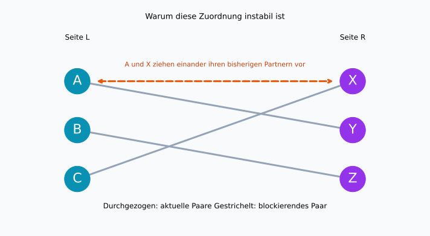
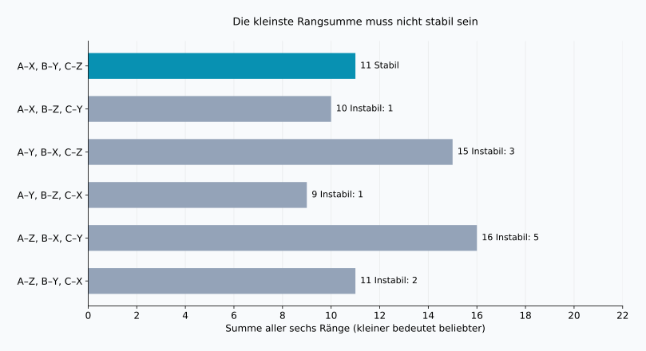
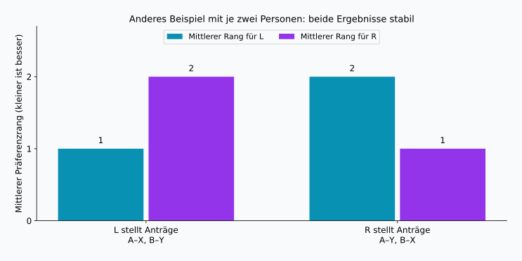

## 1. Wunschlisten allein reichen nicht

Stellen wir uns vor, Studierende werden Forschungspersonen zur Betreuung zugeordnet, jeweils eine Person pro Betreuungsplatz. Beide Seiten haben Wünsche. Eine Rangliste von allen Beteiligten einzuholen, klingt nach einem guten Anfang.

Doch mehrere Personen können denselben Platz bevorzugen, und Wünsche müssen nicht gegenseitig sein. Der Erstwunsch einer Person kann den Erstwunsch einer anderen ausschließen. Was soll eine „gute“ Zuordnung eigentlich leisten?

Das **Problem der stabilen Paarung**, auch als Problem der stabilen Ehen bekannt, gibt darauf eine präzise Antwort. Sein mathematischer Kern ist die Eins-zu-eins-Zuordnung zwischen zwei Gruppen. Wir verwenden A, B, C und X, Y, Z, ohne Geschlechter vorauszusetzen oder wirkliche Ehen zu beschreiben.

**Stabil bedeutet nicht, dass alle begeistert sind.** Es bedeutet, dass keine zwei nicht miteinander zugeordneten Personen einander ihren aktuellen Partnern vorziehen. Unter den folgenden Voraussetzungen findet der Gale–Shapley-Algorithmus immer eine solche Zuordnung.

## 2. Was Stabilität mathematisch bedeutet

Die Gruppen $L$ und $R$ bestehen jeweils aus $n$ Personen. Jede Person ordnet alle Personen der Gegenseite von Rang 1 bis $n$, ohne Gleichstände. Die Präferenzen bleiben fest, und jede mögliche Partnerschaft wird dem Unzugeordnetbleiben vorgezogen.

Unakzeptable Partner, mehrere Plätze und Ranggleichheit erfordern Erweiterungen. Zunächst hilft das einfache Modell, den Mechanismus zu verstehen.

In einer Zuordnung $M$ ist $M(a)$ die Partnerperson von $a$. Mit $r_a(b)$ bezeichnen wir den Rang, den $a$ der Person $b$ gibt. Kleinere Zahlen sind besser. Ein nicht zugeordnetes Paar $a\in L$, $b\in R$ heißt **blockierendes Paar**, wenn beide Ungleichungen gelten:

$$
r_a(b)\lt r_a(M(a))
\quad\land\quad
r_b(a)\lt r_b(M(b))
$$

Beide würden ihre aktuelle Partnerschaft füreinander aufgeben. Sei $\mathcal{B}(M)$ die Menge solcher Paare. Genau dann ist $M$ stabil, wenn:

$$
\mathcal{B}(M)=\varnothing
$$

Ein einseitiger Wunsch genügt nicht. Umgekehrt kann ein Paar blockieren, obwohl ein Wechsel den bisherigen Partnern schadet. Der gesellschaftliche Gesamtnutzen ist eine andere Frage.

Auch mit dem dritten Wunsch kann jemand Teil einer stabilen Zuordnung sein: Die beiden bevorzugten Personen wollen vielleicht lieber ihre bisherigen Partner behalten. **Unzufriedenheit und die Möglichkeit eines beiderseits gewünschten Wechsels sind verschieden.** Stabilität betrifft feste, angegebene Ranglisten; sie garantiert weder dauerhafte Beziehungen noch allgemeine Zustimmung.

## 3. Ein Beispiel mit je drei Personen

$X\succ Y\succ Z$ bedeutet: X wird Y vorgezogen, Y wiederum Z. Die folgenden Listen wurden für dieses Beispiel erstellt.

| Seite L | 1. | 2. | 3. |
| --- | --- | --- | --- |
| A | X | Y | Z |
| B | Y | Z | X |
| C | X | Y | Z |

| Seite R | 1. | 2. | 3. |
| --- | --- | --- | --- |
| X | A | C | B |
| Y | A | B | C |
| Z | B | A | C |

A und C haben denselben Erstwunsch X. Weil X nur einen Partner haben kann, sind nicht alle Erstwünsche von L erfüllbar. Eine stabile Zuordnung kann es trotzdem geben.

Betrachten wir A–Y, B–Z, C–X. A und B erhalten ihren zweiten, C den ersten Wunsch. Dennoch bevorzugt A die Person X gegenüber Y, und X bevorzugt A gegenüber C. A und X blockieren die Zuordnung.



Durchgezogene Linien zeigen aktuelle Paare, die orange gestrichelte Linie den möglichen Wechsel. Ob Linien sich kreuzen, ist unerheblich; entscheidend sind die Präferenzen an ihren Enden.

## 4. Gale–Shapley: Zusagen bleiben zunächst vorläufig

Gale und Shapley stellten das Verfahren 1962 vor. Es heißt **Deferred Acceptance**, also aufgeschobene endgültige Annahme. Eine eingehende Anfrage wird nicht sofort unwiderruflich bestätigt. [Originalarbeit](https://www.math.utoronto.ca/mccann/assignments/477/GaleShapley62.pdf)

Hier stellt L die Anträge, R empfängt sie.

1. Eine freie Person aus L fragt ihre bevorzugte noch nicht angefragte Person.
2. Die empfangende Person vergleicht den neuen Antrag mit ihrer bisherigen vorläufigen Zuordnung und behält nur die bevorzugte Person.
3. Abgewiesene Personen gehen zum nächsten Wunsch weiter.
4. Sobald alle Personen aus L vorläufig zugeordnet sind, werden die Paare endgültig bestätigt.

Die empfangende Seite kann wechseln, aber nur zu einer besser bewerteten Person. Sie hält stets ihren besten bisher erhaltenen Antrag fest.

### Fünf Anträge im Ablauf

Wir beginnen mit C, dann B, dann A, damit ein Austausch sichtbar wird.

| Schritt | Antrag | Entscheidung | Vorläufige Paare |
| --- | --- | --- | --- |
| 1 | C → X | X ist frei und hält C fest | C–X |
| 2 | B → Y | Y ist frei und hält B fest | C–X, B–Y |
| 3 | A → X | X bevorzugt A und ersetzt C | A–X, B–Y |
| 4 | C → Y | Y bevorzugt B und weist C ab | A–X, B–Y |
| 5 | C → Z | Z ist frei und hält C fest | A–X, B–Y, C–Z |

Am Ende stehen A–X, B–Y, C–Z. C erhält den dritten Wunsch, doch X bevorzugt A gegenüber C und Y bevorzugt B gegenüber C. Keine bessere Alternative stimmt einem Wechsel zu. A und B haben bereits ihren Erstwunsch. Es gibt kein blockierendes Paar.

Würden Zusagen nach Eingangsreihenfolge endgültig, bliebe C–X bestehen, bevor A an der Reihe wäre. Dann könnten A und X einander bevorzugen. Die Vorläufigkeit verhindert genau dieses Problem.

## 5. Warum das Verfahren endet und stabil ist

Niemand stellt derselben Person zweimal einen Antrag. Bei $n$ Personen pro Seite ist die Gesamtzahl $P$ daher begrenzt:

$$
P\leq n\times n=n^2
$$

Das ist eine obere Schranke, keine genaue Laufzeit für jeden Fall. Unser Beispiel benötigt fünf Anträge bei $n=3$. Mit vorbereiteten Rangtabellen lassen sich Vergleiche in konstanter Zeit durchführen; der Algorithmus braucht $O(n^2)$ Zeit. Bereits die Eingabe enthält $2n^2$ Ranglisteneinträge.

Am Ende bleibt niemand frei. Hätte eine freie Person ihre ganze Liste ausgeschöpft, hätte jede Person auf R einen Antrag erhalten. Wer einmal jemanden vorläufig annimmt, bleibt besetzt, auch wenn die Person wechselt. Dann hätten alle $n$ Empfänger verschiedene Partner – ein Widerspruch dazu, dass eine der $n$ antragstellenden Personen noch frei ist.

Angenommen, im Ergebnis gäbe es ein blockierendes Paar $a,b$. Weil $a$ die Person $b$ dem endgültigen Partner vorzieht, muss zuvor ein Antrag an $b$ erfolgt sein. Dieser wurde entweder sofort abgewiesen oder später zugunsten einer bevorzugten Person ersetzt. Da sich die vorläufige Wahl von $b$ nur verbessert, bevorzugt $b$ auch den endgültigen Partner gegenüber $a$. Das widerspricht dem angenommenen Wechselwunsch. Der Grund einer Ablehnung kehrt sich nicht um; eine vollständige Suche ist unnötig.

## 6. Stabilität ist nicht dasselbe wie Zufriedenheit

Als einfache Vergleichszahl summieren wir die Ränge der zugeordneten Partner:

$$
S(M)=\sum_{a\in L}r_a(M(a))
      +\sum_{b\in R}r_b(M(b))
$$

Ein kleinerer Wert bedeutet insgesamt bessere Ränge, misst aber kein Glück. Der Abstand zwischen Rang 1 und 2 muss nicht dem zwischen Rang 2 und 3 entsprechen, und Personen gewichten ihre Wünsche unterschiedlich. Die Summe dient nur der Veranschaulichung.

Bei je drei Personen gibt es $3!=6$ vollständige Zuordnungen:

| Zuordnung | Rangsumme L | Rangsumme R | Gesamt | Blockierende Paare |
| --- | --- | --- | --- | --- |
| A–X, B–Y, C–Z | 5 | 6 | 11 | 0 |
| A–X, B–Z, C–Y | 5 | 5 | 10 | 1 |
| A–Y, B–X, C–Z | 8 | 7 | 15 | 3 |
| A–Y, B–Z, C–X | 5 | 4 | 9 | 1 |
| A–Z, B–X, C–Y | 8 | 8 | 16 | 5 |
| A–Z, B–Y, C–X | 5 | 6 | 11 | 2 |



Die kleinste Summe, 9, gehört zu A–Y, B–Z, C–X, doch A und X blockieren. Das Gale–Shapley-Ergebnis hat Summe 11 und ist hier die einzige stabile Lösung. **Die Rangsumme zu minimieren und blockierende Paare auszuschließen sind unterschiedliche Ziele.**

Auch die Zahl 11 reicht nicht als Stabilitätsnachweis: Die erste und die letzte Tabellenzeile haben denselben Wert, aber die letzte besitzt zwei blockierende Paare. „Alle zufrieden“ könnte ebenso bedeuten: nur Erstwünsche, höchstens Zweitwünsche, den schlechtesten Rang verbessern oder die Mittelwerte beider Seiten angleichen. Das sind jeweils andere Kriterien.

## 7. Wer Anträge stellt, kann das Ergebnis beeinflussen

Nun ein anderes Beispiel mit je zwei Personen und neuen Präferenzen:

| Person | 1. | 2. |
| --- | --- | --- |
| A | X | Y |
| B | Y | X |
| X | B | A |
| Y | A | B |

Stellt L die Anträge, entstehen A–X, B–Y: Erstwünsche für L, Zweitwünsche für R. Das ist stabil, weil A und B nicht wechseln wollen. Stellt R die Anträge, entstehen A–Y, B–X: Erstwünsche für R und Zweitwünsche für L. Auch das ist stabil.



Bei strikten Präferenzen erhält **jede antragstellende Person ihren besten Partner unter allen stabilen Zuordnungen**. Das heißt Optimalität für die antragstellende Seite. Verglichen werden ausschließlich stabile Lösungen, nicht beliebige Zuordnungen; der Erstwunsch ist nicht garantiert. [Optimalitätssatz der Originalarbeit](https://www.math.utoronto.ca/mccann/assignments/477/GaleShapley62.pdf)

Jede empfangende Person erhält dagegen ihren am wenigsten bevorzugten Partner unter den stabilen Lösungen. Die Wahl der antragstellenden Seite ist deshalb eine wichtige Gestaltungsentscheidung. Bleibt diese Seite fest, ändert die Bearbeitungsreihenfolge freier Personen das Endergebnis nicht. Ein Rollentausch kann es ändern.

## 8. Mit Python nachrechnen

Der Code führt das Beispiel mit drei Personen je Seite aus. Eine `deque` ist eine Warteschlange; abgewiesene Personen stellen sich hinten an. Die Empfängerlisten werden für schnelle Vergleiche in Rangwörterbücher umgewandelt.

```python
from collections import deque

left = {"A": ["X", "Y", "Z"],
        "B": ["Y", "Z", "X"],
        "C": ["X", "Y", "Z"]}
right = {"X": ["A", "C", "B"],
         "Y": ["A", "B", "C"],
         "Z": ["B", "A", "C"]}

def gale_shapley(proposers, receivers, order=None):
    rank = {b: {a: i for i, a in enumerate(prefs)}
            for b, prefs in receivers.items()}
    free = deque(proposers if order is None else order)
    next_choice = {a: 0 for a in proposers}
    held = {}
    proposals = 0
    while free:
        a = free.popleft()
        b = proposers[a][next_choice[a]]
        next_choice[a] += 1
        proposals += 1
        if b not in held:
            held[b] = a
        elif rank[b][a] < rank[b][held[b]]:
            free.append(held[b])
            held[b] = a
        else:
            free.append(a)
    return {a: b for b, a in held.items()}, proposals

def blocking_pairs(match, left, right):
    inverse = {b: a for a, b in match.items()}
    return [(a, b) for a in left for b in right
            if left[a].index(b) < left[a].index(match[a])
            and right[b].index(a) < right[b].index(inverse[b])]

match, count = gale_shapley(left, right, ["C", "B", "A"])
print("Zuordnung:", sorted(match.items()))
print("Anzahl der Anträge:", count)
print("Blockierende Paare:", blocking_pairs(match, left, right))
```

```text
Zuordnung: [('A', 'X'), ('B', 'Y'), ('C', 'Z')]
Anzahl der Anträge: 5
Blockierende Paare: []
```

Die leere Liste bedeutet, dass kein blockierendes Paar gefunden wurde. Für `{"A": "Y", "B": "Z", "C": "X"}` liefert die Prüfung `[('A', 'X')]`.

Diese Lehrimplementierung setzt gleich große Gruppen, vollständige Listen und keine Gleichstände voraus. Eingabevalidierung und unakzeptable Partner fehlen. Die Prüffunktion verwendet zur besseren Lesbarkeit `.index()` und benötigt $O(n^3)$. Die zuvor genannte Schranke $O(n^2)$ gilt für den Zuordnungsalgorithmus ohne diese zusätzliche Prüfung.

Das [Reproduktionsskript](generate_graphs.de.py) erzeugt die Diagramme und alle sechs Ergebnisse, die auch als [JSON](calculation-results.de.json) vorliegen. Durch Änderungen der Listen lassen sich die Anzahl stabiler Lösungen und die Rolle der antragstellenden Seite erkunden.

## 9. Vor dem Einsatz in der Praxis

Studierende und Einrichtungen oder Bewerber und aufnehmende Organisationen sind Beispiele für beidseitige Präferenzen beziehungsweise Prioritäten. Reale Verfahren sind meist komplexer als eine Eins-zu-eins-Zuordnung.

Bei mehreren Plätzen kann eine Einrichtung mehrere Personen bis zur Kapazitätsgrenze vorläufig halten. Die bestplatzierten Einzelpersonen zu wählen ist allerdings eine andere Annahme als eine bestimmte Personengruppe gemeinsam zu bevorzugen. Unakzeptable Partner erfordern die Möglichkeit, unzugeordnet zu bleiben. Bei Gleichständen hängt die Stabilitätsdefinition davon ab, wie Indifferenz behandelt wird. Solche Änderungen verlangen eine erneute Prüfung der Garantien.

Außerdem müssen angegebene und tatsächliche Wünsche nicht übereinstimmen. Stabilität wird zunächst anhand der eingereichten Listen beurteilt. Fehlende Informationen oder Einschränkungen beim Ranking erschweren Rückschlüsse auf Zufriedenheit. Mathematik zeigt, was unter welchen Annahmen garantiert ist; eine algorithmische Entscheidung ist nicht allein deshalb gerecht.

## 10. Fazit: Stabilität und Glück auseinanderhalten

Gale–Shapley verbindet Anträge und vorläufige Zusagen, bis kein nicht zugeordnetes Paar einen beiderseits bevorzugten Wechsel wünscht.

- **Stabil heißt nicht Erstwunsch für alle.** Unzufriedenheit kann ohne einvernehmliche Wechselmöglichkeit bestehen.
- **Stabil heißt nicht kleinste Rangsumme.** Im Beispiel liegt das Minimum bei 9, die einzige stabile Lösung bei 11.
- **Die antragstellende Seite zählt.** Verschiedene stabile Lösungen können verschiedene Seiten begünstigen.

Gerade wenn nicht alle Wünsche erfüllbar sind, müssen wir das Ziel präzise benennen. Vor der Optimierung steht die Frage, was eine „gute“ Zuordnung überhaupt ausmacht.

### Quelle

D. Gale und L. S. Shapley, “College Admissions and the Stability of Marriage”, *The American Mathematical Monthly*, 69(1), 9–15, 1962. [PDF](https://www.math.utoronto.ca/mccann/assignments/477/GaleShapley62.pdf). Ursprung des Modells, des Verfahrens und der Optimalitätsaussage. Das Beispiel mit je drei Personen, die Tabellen und Diagramme wurden eigenständig berechnet.
