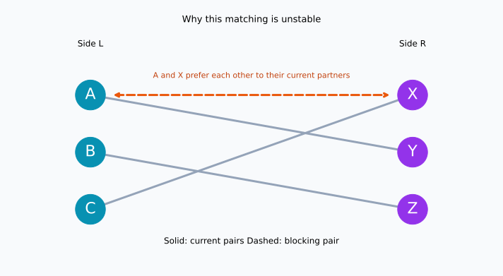
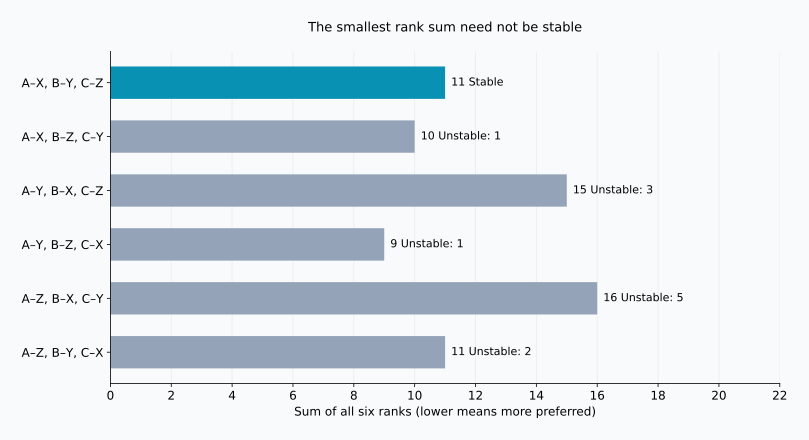
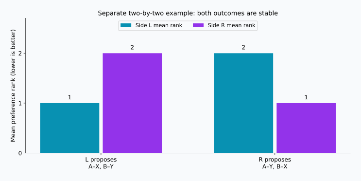

## 1. Collecting preferences is only the beginning

Imagine assigning students to supervisors for a research project, with one student per supervisor. Students have preferences about whom to learn from, and supervisors have preferences about whom to supervise. Asking everyone for a ranked list seems like a promising start.

But several students may want the same supervisor, and preferences need not be mutual. Granting one person’s first choice can mean disappointing someone else. What, exactly, should a “good” assignment achieve?

The **stable marriage problem** gives us a precise criterion. Despite its name, its mathematical core is a one-to-one matching between two groups with preferences. We will use A, B, C and X, Y, Z, rather than assume particular genders or discuss actual marriages.

Here, **stable does not mean that everyone is delighted**. It means that no two people who are not matched to each other both prefer each other to their assigned partners. The Gale–Shapley algorithm always achieves this under the assumptions below.

## 2. What does “stable” mean mathematically?

### The assumptions come first

Let $L$ and $R$ be two groups of $n$ people each. Everyone ranks all members of the other group from 1 to $n$, without ties. Preferences remain fixed, and everyone prefers any partner to remaining unmatched.

These assumptions matter. Unacceptable partners, multiple places, and tied rankings require extensions of the model. Starting with a simpler setting lets us see why the algorithm works.

Write $M(a)$ for person $a$’s partner in matching $M$, and $r_a(b)$ for the rank that $a$ assigns to $b$. A smaller number means a more preferred partner. Two people $a\in L$ and $b\in R$ who are not matched together form a **blocking pair** when both inequalities hold:

$$
r_a(b)\lt r_a(M(a))
\quad\land\quad
r_b(a)\lt r_b(M(b))
$$

Each would prefer to leave their current partner for the other. If $\mathcal{B}(M)$ is the set of blocking pairs, stability is equivalent to:

$$
\mathcal{B}(M)=\varnothing
$$

A one-sided wish is not enough. Conversely, a pair can block even if switching leaves their old partners worse off. Whether a change benefits society overall is a different question.

### Dissatisfaction can remain

Someone assigned their third choice may prefer their first and second choices, but if those people prefer their existing partners, no blocking pair results. **Being unhappy and being able to arrange a mutually preferred switch are different things.** Stability is a property of fixed, reported rankings, not a guarantee of lasting relationships or universal acceptance of the outcome.

## 3. A concrete example with three people on each side

In the following tables, $X\succ Y\succ Z$ means that X is preferred to Y, and Y to Z. This example was constructed for the calculations and figures in this article.

| Side L | 1st | 2nd | 3rd |
| --- | --- | --- | --- |
| A | X | Y | Z |
| B | Y | Z | X |
| C | X | Y | Z |

| Side R | 1st | 2nd | 3rd |
| --- | --- | --- | --- |
| X | A | C | B |
| Y | A | B | C |
| Z | B | A | C |

A and C both rank X first. Since X can have only one partner, everyone on L cannot receive their first choice. A stable assignment is nevertheless possible.

Consider A–Y, B–Z, C–X. A and B get their second choices, and C gets their first. This sounds reasonable, but A prefers X to Y, while X prefers A to C. Therefore A and X block the matching.



Solid lines show current pairs; the orange dashed line shows the possible switch. Whether lines cross on the page has nothing to do with stability. What matters is the preference of each endpoint.

## 4. Gale–Shapley: keep acceptance tentative

Gale and Shapley presented the basic method in 1962. It is called **deferred acceptance**: receiving a proposal does not mean making an immediate final commitment. [Original paper](https://www.math.utoronto.ca/mccann/assignments/477/GaleShapley62.pdf)

Here L proposes and R receives proposals.

1. An unmatched person on L proposes to their most preferred person not yet approached.
2. The receiver compares the new proposer with the person currently held, if any, and keeps only the preferred one.
3. Anyone rejected moves on to their next choice.
4. Repeat until everyone on L is held, then finalize the tentative pairs.

A receiver may change their tentative partner, but only for someone they prefer. They always hold their favorite among the people who have proposed so far.

### Follow five proposals

Start with C, then B, then A, so that we can see an existing tentative pair change.

| Step | Proposal | Decision | Tentative pairs |
| --- | --- | --- | --- |
| 1 | C → X | X is free and holds C | C–X |
| 2 | B → Y | Y is free and holds B | C–X, B–Y |
| 3 | A → X | X prefers A and replaces C | A–X, B–Y |
| 4 | C → Y | Y prefers B and rejects C | A–X, B–Y |
| 5 | C → Z | Z is free and holds C | A–X, B–Y, C–Z |

The result is A–X, B–Y, C–Z. C gets a third choice, but X prefers A to C and Y prefers B to C. Neither preferred alternative agrees to a switch. A and B already have their first choices, so there is no blocking pair.

If acceptance were final on a first-come, first-served basis, C–X would be locked in before A arrived. A and X might then be left wanting each other. Keeping acceptance tentative is what prevents this problem.

## 5. Why does the algorithm terminate with a stable result?

### At most a quadratic number of proposals

No proposer approaches the same receiver twice. There are $n$ proposers and $n$ possible recipients, so the total number of proposals $P$ satisfies:

$$
P\leq n\times n=n^2
$$

This is an upper bound, not a prediction that every run takes $n^2$ proposals. Our example needs five with $n=3$. With receiver rankings stored for constant-time comparison, the algorithm runs in $O(n^2)$ time. The two sets of preference lists themselves contain $2n^2$ entries.

No one can be left unmatched at termination. If an unmatched proposer had exhausted all choices, every receiver would have received a proposal. Once a receiver holds someone, they always hold someone, even when the identity changes. All $n$ receivers would therefore have distinct partners, contradicting the existence of an unmatched proposer among $n$ people.

### Why no blocking pair survives

Suppose the result had a blocking pair $a,b$. Since $a$ prefers $b$ to their final partner, $a$ must have proposed to $b$ earlier. They failed to remain together because $b$ rejected $a$ immediately or later replaced $a$ with someone preferred.

A receiver’s held partner only improves according to that receiver’s ranking. Thus $b$’s final partner is preferred to $a$, contradicting the claim that $b$ wants the switch. No blocking pair exists. The crucial fact is that **a rejection cannot later become a reason to regret keeping the better proposal**; exhaustive search is unnecessary.

## 6. Stability and satisfaction are different objectives

To compare outcomes, define the sum of everyone’s assigned preference ranks:

$$
S(M)=\sum_{a\in L}r_a(M(a))
      +\sum_{b\in R}r_b(M(b))
$$

A smaller $S(M)$ means better ranks in aggregate. It is not a measurement of happiness: the gap between first and second need not equal the gap between second and third, and preferences can matter with different intensity to different people. We use the sum only as a simple illustrative score.

With three people per side there are $3!=6$ complete matchings. Enumerating them gives:

| Matching | L rank sum | R rank sum | Total | Blocking pairs |
| --- | --- | --- | --- | --- |
| A–X, B–Y, C–Z | 5 | 6 | 11 | 0 |
| A–X, B–Z, C–Y | 5 | 5 | 10 | 1 |
| A–Y, B–X, C–Z | 8 | 7 | 15 | 3 |
| A–Y, B–Z, C–X | 5 | 4 | 9 | 1 |
| A–Z, B–X, C–Y | 8 | 8 | 16 | 5 |
| A–Z, B–Y, C–X | 5 | 6 | 11 | 2 |



The smallest sum, 9, belongs to A–Y, B–Z, C–X, but A and X block it. The Gale–Shapley outcome has sum 11 and is the only stable matching in this example. **Minimizing the rank sum and eliminating blocking pairs solve different problems.**

Even the score 11 does not identify stability: the first and last rows both have that score, but the last has two blocking pairs. Nor is “everyone is satisfied” a single mathematical target. It might mean first choices for all, everyone within their top two, improving the worst assigned rank, or reducing the difference between the two sides’ mean ranks. Each is distinct from stability.

## 7. Changing who proposes can change the result

Now consider a separate example with two people per side:

| Person | 1st | 2nd |
| --- | --- | --- |
| A | X | Y |
| B | Y | X |
| X | B | A |
| Y | A | B |

If L proposes, the result is A–X, B–Y. A and B get first choices, X and Y second choices. It is stable because neither A nor B wants to move. If R proposes, the result is A–Y, B–X: X and Y get first choices, while A and B get second choices. This too is stable. The same preferences allow two stable outcomes.



Under the basic model with strict preferences, Gale–Shapley gives **each proposer their best partner among all stable matchings**. This is proposer optimality. The comparison is restricted to stable matchings; it does not guarantee an unconstrained first choice. [Optimality theorem in the original paper](https://www.math.utoronto.ca/mccann/assignments/477/GaleShapley62.pdf)

In the same model, each receiver gets their least preferred partner among stable matchings. Choosing the proposing side is therefore a consequential design decision. With that side fixed, changing the order of unmatched proposers does not change the final matching. Reversing the sides can.

## 8. Check the procedure in Python

This code runs the three-by-three example. A `deque` is a queue: rejected proposers rejoin at the end. Receiver preferences are converted into dictionaries for immediate rank comparisons.

```python
from collections import deque

left = {"A": ["X", "Y", "Z"],
        "B": ["Y", "Z", "X"],
        "C": ["X", "Y", "Z"]}
right = {"X": ["A", "C", "B"],
         "Y": ["A", "B", "C"],
         "Z": ["B", "A", "C"]}

def gale_shapley(proposers, receivers, order=None):
    rank = {b: {a: i for i, a in enumerate(prefs)}
            for b, prefs in receivers.items()}
    free = deque(proposers if order is None else order)
    next_choice = {a: 0 for a in proposers}
    held = {}
    proposals = 0
    while free:
        a = free.popleft()
        b = proposers[a][next_choice[a]]
        next_choice[a] += 1
        proposals += 1
        if b not in held:
            held[b] = a
        elif rank[b][a] < rank[b][held[b]]:
            free.append(held[b])
            held[b] = a
        else:
            free.append(a)
    return {a: b for b, a in held.items()}, proposals

def blocking_pairs(match, left, right):
    inverse = {b: a for a, b in match.items()}
    return [(a, b) for a in left for b in right
            if left[a].index(b) < left[a].index(match[a])
            and right[b].index(a) < right[b].index(inverse[b])]

match, count = gale_shapley(left, right, ["C", "B", "A"])
print("Matching:", sorted(match.items()))
print("Number of proposals:", count)
print("Blocking pairs:", blocking_pairs(match, left, right))
```

```text
Matching: [('A', 'X'), ('B', 'Y'), ('C', 'Z')]
Number of proposals: 5
Blocking pairs: []
```

The empty list means no blocking pair was found. Testing `{"A": "Y", "B": "Z", "C": "X"}` instead returns `[('A', 'X')]`.

This teaching implementation assumes equal group sizes, complete lists, and no ties. It omits input validation and unacceptable partners. The checking function uses list `.index()` for readability and takes $O(n^3)$ time. The earlier $O(n^2)$ bound applies to the matching algorithm with rank dictionaries, not to this additional checker.

The [reproduction script](generate_graphs.en.py) generates the figures and all six outcomes; the [JSON results](calculation-results.en.json) contain their values. Try changing a ranking and observing the number of stable matchings or the effect of reversing the proposing side.

## 9. Before applying the idea to real assignments

The model is a starting point for settings such as students and schools or applicants and institutions, where both sides have preferences or priorities. Real systems usually go beyond one-to-one matching.

With capacities, a receiver can hold several applicants up to its limit. However, choosing the highest-ranked individuals is a different assumption from wanting a particular combination of people together. Allowing unacceptable partners means permitting some people to remain unmatched. With ties, different definitions of stability arise depending on how indifference is treated. Changes to sizes, capacities, or admissible partners require checking the model’s guarantees again.

It also matters whether reported rankings reflect true preferences. Stability is first evaluated against the submitted lists. Incomplete information or restrictions on ranking can make satisfaction impossible to judge from the output alone. Mathematics clarifies what can be guaranteed under stated assumptions; it does not make an assignment fair simply because an algorithm produced it.

## 10. Conclusion: distinguish stability from happiness

Gale–Shapley resolves conflicting preferences by preventing a mutually desired departure by an unmatched pair. Proposals and tentative acceptance are enough to achieve that goal.

- **Stable does not mean everyone gets a first choice.** Dissatisfaction may remain without a mutually acceptable switch.
- **Stable does not mean the smallest rank sum.** Our minimum was 9, while the unique stable outcome scored 11.
- **The proposing side matters.** Multiple stable outcomes can favor different sides.

When everyone’s wishes cannot be fulfilled, defining the objective precisely becomes more valuable, not less. Before optimizing a matching, ask what “good” is supposed to mean.

### Reference

D. Gale and L. S. Shapley, “College Admissions and the Stability of Marriage,” *The American Mathematical Monthly*, 69(1), 9–15, 1962. [PDF](https://www.math.utoronto.ca/mccann/assignments/477/GaleShapley62.pdf). The original source for the model, deferred acceptance, stability, and proposer optimality. The three-by-three example, tables, and figures here were calculated independently.

