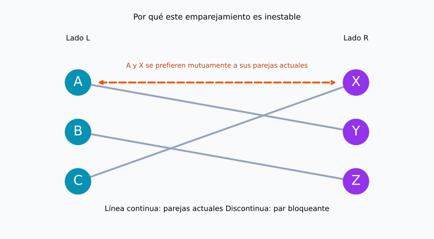
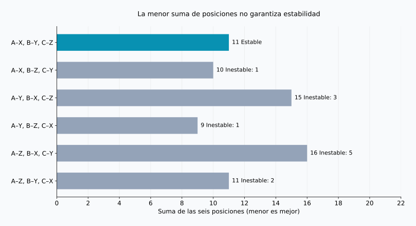
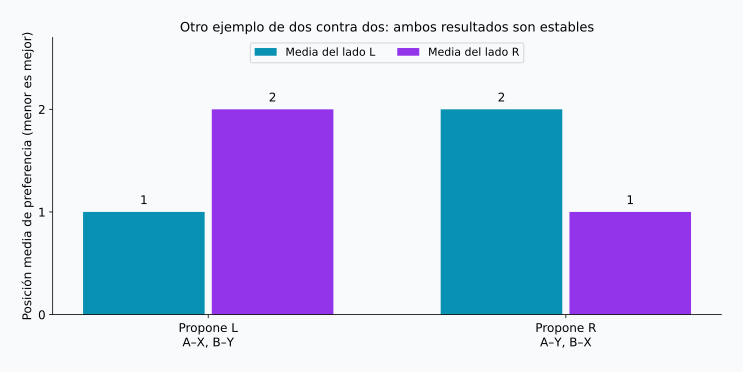

## 1. Recoger preferencias no basta

Imagina que asignamos estudiantes a tutores de investigación, uno por tutor. Los estudiantes tienen preferencias sobre con quién aprender y los tutores sobre a quién supervisar. Pedir una lista ordenada a cada persona parece un buen comienzo.

Pero varias personas pueden elegir al mismo tutor, y las preferencias no siempre son mutuas. Conceder una primera opción puede obligar a otra persona a renunciar a la suya. ¿Qué significa entonces una buena asignación?

El **problema del matrimonio estable** ofrece un criterio preciso. Su núcleo matemático es un emparejamiento uno a uno entre dos grupos con preferencias. Usaremos A, B, C y X, Y, Z, sin atribuirles géneros ni interpretar el modelo como una descripción de matrimonios reales.

**Estable no significa que todos estén encantados**: significa que no existen dos personas sin emparejar entre sí que se prefieran mutuamente a sus parejas asignadas. El algoritmo de Gale–Shapley garantiza esa condición bajo los supuestos siguientes.

## 2. Una definición matemática de estabilidad

### Los supuestos del modelo

Sean $L$ y $R$ dos grupos de $n$ personas. Cada participante ordena a todas las personas del otro grupo del puesto 1 al $n$, sin empates. Las preferencias no cambian y cualquier pareja se considera mejor que quedarse sin pareja.

Las parejas inaceptables, los cupos múltiples y los empates necesitan extensiones. Empezar con este modelo permite entender por qué funciona el método.

En un emparejamiento $M$, denotamos por $M(a)$ la pareja de $a$, y por $r_a(b)$ la posición que $a$ asigna a $b$. Menor significa más preferido. Un **par bloqueante** es una pareja no formada, $a\in L$ y $b\in R$, que satisface ambas desigualdades:

$$
r_a(b)\lt r_a(M(a))
\quad\land\quad
r_b(a)\lt r_b(M(b))
$$

Los dos prefieren cambiar de pareja para estar juntos. Si $\mathcal{B}(M)$ es el conjunto de pares bloqueantes, la estabilidad equivale a:

$$
\mathcal{B}(M)=\varnothing
$$

El deseo unilateral no basta. En cambio, el par sí bloquea aunque el cambio perjudique a sus parejas anteriores. Evaluar el bienestar total es otra cuestión.

### Puede seguir habiendo descontento

Alguien puede recibir su tercera opción sin generar un par bloqueante: basta con que sus dos opciones superiores prefieran a sus parejas actuales. **Estar descontento no es lo mismo que poder acordar un cambio mutuamente preferido.** La estabilidad se refiere a preferencias declaradas y fijas, no garantiza relaciones duraderas ni aceptación universal del resultado.

## 3. Un ejemplo con tres personas por lado

La notación $X\succ Y\succ Z$ indica que X se prefiere a Y y Y a Z. Estas listas se han preparado para los cálculos del artículo.

| Lado L | 1.ª | 2.ª | 3.ª |
| --- | --- | --- | --- |
| A | X | Y | Z |
| B | Y | Z | X |
| C | X | Y | Z |

| Lado R | 1.ª | 2.ª | 3.ª |
| --- | --- | --- | --- |
| X | A | C | B |
| Y | A | B | C |
| Z | B | A | C |

A y C eligen primero a X. Como X solo puede tener una pareja, es imposible satisfacer todas las primeras opciones de L. Aun así, existe un emparejamiento estable.

Consideremos A–Y, B–Z, C–X. A y B reciben su segunda opción; C, la primera. Parece razonable, pero A prefiere X a Y, y X prefiere A a C. A y X forman un par bloqueante.



Las líneas continuas son las parejas actuales y la discontinua naranja señala el posible cambio. Que las líneas se crucen no determina la estabilidad: importan las preferencias de sus extremos.

## 4. Gale–Shapley: mantener la aceptación provisional

Gale y Shapley presentaron este método en 1962. Se conoce como **aceptación diferida**: recibir una propuesta no implica asumir un compromiso definitivo de inmediato. [Artículo original](https://www.math.utoronto.ca/mccann/assignments/477/GaleShapley62.pdf)

L propone y R recibe las propuestas:

1. Una persona de L sin pareja propone a su opción favorita entre aquellas a las que aún no se ha dirigido.
2. Quien recibe compara la nueva propuesta con su pareja provisional, si la tiene, y retiene solo a la persona preferida.
3. Las personas rechazadas pasan a su siguiente opción.
4. Cuando todas las personas de L están retenidas, se confirman los emparejamientos.

La pareja provisional puede cambiar, pero solo por una opción mejor para quien recibe. Cada receptor conserva siempre su propuesta favorita entre todas las recibidas.

### Cinco propuestas, paso a paso

Comenzamos en el orden C, B, A para observar una sustitución.

| Paso | Propuesta | Decisión | Parejas provisionales |
| --- | --- | --- | --- |
| 1 | C → X | X está libre y retiene a C | C–X |
| 2 | B → Y | Y está libre y retiene a B | C–X, B–Y |
| 3 | A → X | X prefiere a A y sustituye a C | A–X, B–Y |
| 4 | C → Y | Y prefiere a B y rechaza a C | A–X, B–Y |
| 5 | C → Z | Z está libre y retiene a C | A–X, B–Y, C–Z |

El resultado es A–X, B–Y, C–Z. C recibe su tercera opción, pero X prefiere A a C, y Y prefiere B a C. Ninguna alternativa acepta el cambio. A y B ya tienen su primera opción: no hay pares bloqueantes.

Si se confirmara por orden de llegada, C–X quedaría fijado antes de que llegase A, pudiendo dejar a A y X deseándose mutuamente. La aceptación provisional evita ese problema.

## 5. Por qué termina y produce estabilidad

Nadie propone dos veces a la misma persona. Con $n$ proponentes y $n$ receptores, el número total de propuestas $P$ cumple:

$$
P\leq n\times n=n^2
$$

Es una cota superior, no el número exacto de cada ejecución. El ejemplo requiere cinco propuestas para $n=3$. Si las posiciones se guardan en diccionarios para compararlas en tiempo constante, el algoritmo tarda $O(n^2)$. Las listas de ambos lados contienen $2n^2$ entradas.

Tampoco puede quedar alguien sin pareja al terminar. Si un proponente libre hubiera agotado su lista, todos los receptores habrían recibido propuestas. Una vez que retienen a alguien, nunca vuelven a quedarse vacíos. Los $n$ receptores tendrían entonces parejas distintas, lo que contradice que sobre alguien entre los $n$ proponentes.

Supongamos ahora que el resultado contiene un par bloqueante $a,b$. Como $a$ prefiere $b$ a su pareja final, tuvo que proponerle antes. Si no terminaron juntos, $b$ rechazó a $a$ inmediatamente o lo sustituyó después por alguien mejor. La pareja retenida por $b$ solo puede mejorar; por tanto, su pareja final es preferida a $a$. Esto contradice que $b$ quiera cambiar. No hace falta explorar todas las soluciones: el motivo del rechazo no se revierte.

## 6. Estabilidad y satisfacción no son el mismo objetivo

Sumemos las posiciones de las parejas asignadas para las seis personas:

$$
S(M)=\sum_{a\in L}r_a(M(a))
      +\sum_{b\in R}r_b(M(b))
$$

Un valor menor indica mejores posiciones en conjunto, pero no mide la felicidad. La diferencia entre primera y segunda opción puede ser distinta de la diferencia entre segunda y tercera, y cada persona puede valorar esas diferencias con intensidades diferentes. La suma es solo un indicador ilustrativo.

Hay $3!=6$ emparejamientos completos:

| Emparejamiento | Suma de L | Suma de R | Total | Pares bloqueantes |
| --- | --- | --- | --- | --- |
| A–X, B–Y, C–Z | 5 | 6 | 11 | 0 |
| A–X, B–Z, C–Y | 5 | 5 | 10 | 1 |
| A–Y, B–X, C–Z | 8 | 7 | 15 | 3 |
| A–Y, B–Z, C–X | 5 | 4 | 9 | 1 |
| A–Z, B–X, C–Y | 8 | 8 | 16 | 5 |
| A–Z, B–Y, C–X | 5 | 6 | 11 | 2 |



El mínimo, 9, corresponde a A–Y, B–Z, C–X, pero A y X lo bloquean. El resultado de Gale–Shapley suma 11 y es el único estable en este ejemplo. **Minimizar la suma y eliminar los pares bloqueantes son objetivos diferentes.**

La primera y la última fila suman 11, pero la última tiene dos pares bloqueantes. El número por sí solo no demuestra estabilidad. «Todos satisfechos» también puede significar primeras opciones para todos, estar entre las dos primeras, mejorar la peor posición asignada o equilibrar las medias de ambos lados. Son criterios distintos.

## 7. Importa quién propone

Veamos otro ejemplo, ahora con dos personas por lado y nuevas preferencias:

| Persona | 1.ª | 2.ª |
| --- | --- | --- |
| A | X | Y |
| B | Y | X |
| X | B | A |
| Y | A | B |

Si propone L, obtenemos A–X, B–Y: L recibe sus primeras opciones y R sus segundas. Es estable porque ni A ni B desea cambiar. Si propone R, resulta A–Y, B–X: ahora R recibe las primeras opciones y L las segundas. También es estable.



Con preferencias estrictas, Gale–Shapley concede a **cada proponente su mejor pareja entre todos los emparejamientos estables**. Es la optimalidad para el lado proponente. No promete la primera opción sin restricciones: la comparación solo incluye soluciones estables. [Teorema original](https://www.math.utoronto.ca/mccann/assignments/477/GaleShapley62.pdf)

En este modelo, cada receptor obtiene su pareja menos preferida entre las soluciones estables. Elegir quién propone es, por tanto, una decisión importante. Fijado ese lado, cambiar el orden de los proponentes libres no altera el resultado; intercambiar los papeles sí puede hacerlo.

## 8. Comprobarlo con Python

El código ejecuta el ejemplo de tres contra tres. `deque` implementa una cola: las personas rechazadas vuelven al final. Los diccionarios permiten comparar rápidamente las preferencias de quienes reciben.

```python
from collections import deque

left = {"A": ["X", "Y", "Z"],
        "B": ["Y", "Z", "X"],
        "C": ["X", "Y", "Z"]}
right = {"X": ["A", "C", "B"],
         "Y": ["A", "B", "C"],
         "Z": ["B", "A", "C"]}

def gale_shapley(proposers, receivers, order=None):
    rank = {b: {a: i for i, a in enumerate(prefs)}
            for b, prefs in receivers.items()}
    free = deque(proposers if order is None else order)
    next_choice = {a: 0 for a in proposers}
    held = {}
    proposals = 0
    while free:
        a = free.popleft()
        b = proposers[a][next_choice[a]]
        next_choice[a] += 1
        proposals += 1
        if b not in held:
            held[b] = a
        elif rank[b][a] < rank[b][held[b]]:
            free.append(held[b])
            held[b] = a
        else:
            free.append(a)
    return {a: b for b, a in held.items()}, proposals

def blocking_pairs(match, left, right):
    inverse = {b: a for a, b in match.items()}
    return [(a, b) for a in left for b in right
            if left[a].index(b) < left[a].index(match[a])
            and right[b].index(a) < right[b].index(inverse[b])]

match, count = gale_shapley(left, right, ["C", "B", "A"])
print("Emparejamiento:", sorted(match.items()))
print("Número de propuestas:", count)
print("Pares bloqueantes:", blocking_pairs(match, left, right))
```

```text
Emparejamiento: [('A', 'X'), ('B', 'Y'), ('C', 'Z')]
Número de propuestas: 5
Pares bloqueantes: []
```

La lista vacía significa que no se encontró ningún par bloqueante. Comprobar `{"A": "Y", "B": "Z", "C": "X"}` devuelve `[('A', 'X')]`.

El ejemplo supone grupos iguales, listas completas y ausencia de empates; omite validación de entradas y parejas inaceptables. El verificador usa `.index()` para facilitar la lectura y cuesta $O(n^3)$. La cota $O(n^2)$ corresponde al algoritmo de emparejamiento, no al verificador adicional.

El [script reproducible](generate_graphs.es.py) genera las figuras y los seis resultados, disponibles también en [JSON](calculation-results.es.json). Cambiar alguna preferencia permite explorar cuántas soluciones estables existen y qué ocurre al invertir el lado proponente.

## 9. Antes de aplicarlo a situaciones reales

Estudiantes y centros, o candidatos e instituciones, son ejemplos de asignaciones con preferencias o prioridades en ambos lados. Sin embargo, los sistemas reales suelen ser más complejos.

Un receptor con varias plazas puede retener candidatos hasta completar su cupo. Pero seleccionar individuos según una clasificación no equivale a preferir una combinación concreta de personas. Si hay parejas inaceptables, debe permitirse que alguien quede sin asignar. Con empates, la definición de estabilidad depende de cómo se trate la indiferencia. No se deben trasladar las garantías sin revisar estos cambios.

También importa si las listas declaradas reflejan las preferencias reales. La estabilidad se evalúa primero respecto de las listas recibidas. Información incompleta o restricciones para ordenar opciones dificultan inferir satisfacción del resultado. Que una asignación proceda de un algoritmo no basta para llamarla justa: hay que explicar a quién favorece y qué garantiza.

## 10. Conclusión: separar estabilidad y felicidad

Gale–Shapley combina propuestas y aceptación provisional para impedir cambios que dos personas prefieran mutuamente.

- **Estable no significa primeras opciones para todos.** Puede persistir el descontento sin posibilidad de cambio acordado.
- **Estable no significa suma mínima.** El mínimo del ejemplo es 9; la única solución estable suma 11.
- **El lado proponente importa.** Distintas soluciones estables pueden beneficiar a lados diferentes.

Precisamente cuando no se pueden cumplir todos los deseos, conviene definir qué buscamos. Antes de optimizar, debemos aclarar qué significa una «buena» combinación.

### Referencia

D. Gale y L. S. Shapley, “College Admissions and the Stability of Marriage”, *The American Mathematical Monthly*, 69(1), 9–15, 1962. [PDF](https://www.math.utoronto.ca/mccann/assignments/477/GaleShapley62.pdf). Fuente original del modelo, la aceptación diferida y la optimalidad. El ejemplo de tres contra tres, las tablas y las figuras son cálculos propios.
