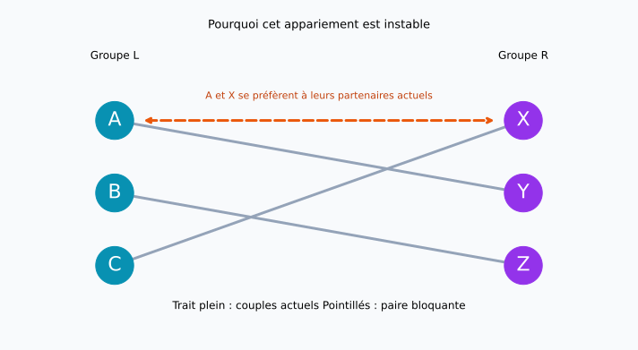
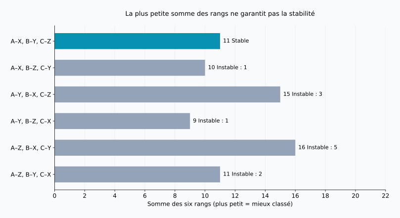
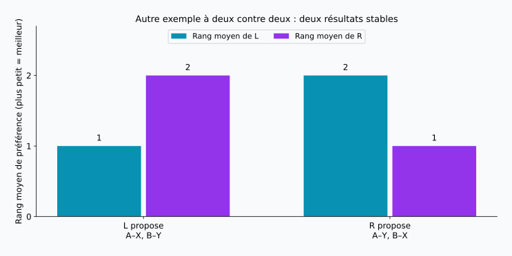

## 1. Recueillir les préférences ne suffit pas

Imaginons que l’on associe des étudiants à des encadrants de recherche, à raison d’un étudiant par encadrant. Les étudiants ont leurs préférences, les encadrants aussi. Demander un classement à chacun semble être un bon début.

Mais plusieurs personnes peuvent souhaiter le même partenaire, sans réciprocité. Accorder un premier choix à quelqu’un peut obliger quelqu’un d’autre à renoncer au sien. Que doit donc réaliser une « bonne » affectation ?

Le **problème des mariages stables** propose un critère précis. Malgré son nom, il s’agit mathématiquement d’associer deux groupes, une personne à une autre. Nous emploierons A, B, C et X, Y, Z, sans supposer de genre ni décrire de véritables relations conjugales.

**Stable ne veut pas dire que tout le monde est ravi.** Cela signifie qu’aucune paire de personnes non associées ne se préfère mutuellement à ses partenaires actuels. L’algorithme de Gale–Shapley garantit cette propriété dans le modèle suivant.

## 2. Définir la stabilité

Soient deux groupes $L$ et $R$ de $n$ personnes chacun. Chaque personne classe tous les membres de l’autre groupe de 1 à $n$, sans ex æquo. Les classements restent fixes et toute association est préférée à l’absence de partenaire.

Ces hypothèses comptent : les partenaires inacceptables, les capacités multiples et les ex æquo demandent des extensions du modèle. Commençons par le cas simple pour comprendre le mécanisme.

Dans un appariement $M$, $M(a)$ désigne le partenaire de $a$ et $r_a(b)$ le rang que $a$ attribue à $b$. Un petit rang est préférable. Deux personnes non associées, $a\in L$ et $b\in R$, forment une **paire bloquante** si les deux inégalités suivantes sont vraies :

$$
r_a(b)\lt r_a(M(a))
\quad\land\quad
r_b(a)\lt r_b(M(b))
$$

Chacune souhaite quitter son partenaire pour l’autre. Si $\mathcal{B}(M)$ est l’ensemble des paires bloquantes, l’appariement est stable exactement lorsque :

$$
\mathcal{B}(M)=\varnothing
$$

Un souhait à sens unique ne suffit pas. En revanche, la paire est bloquante même si ses anciens partenaires seraient lésés. Le bénéfice collectif du changement est une autre question.

Une personne peut obtenir son troisième choix tout en appartenant à un appariement stable : ses deux premiers choix peuvent préférer leurs partenaires actuels. **L’insatisfaction et la possibilité d’un changement mutuellement souhaité sont distinctes.** La stabilité concerne des classements déclarés et fixes ; elle ne garantit ni des relations durables ni l’adhésion de tous au résultat.

## 3. Un exemple à trois contre trois

La notation $X\succ Y\succ Z$ signifie que X est préféré à Y, lui-même préféré à Z. Les listes suivantes ont été construites pour les calculs de cet article.

| Groupe L | 1er | 2e | 3e |
| --- | --- | --- | --- |
| A | X | Y | Z |
| B | Y | Z | X |
| C | X | Y | Z |

| Groupe R | 1er | 2e | 3e |
| --- | --- | --- | --- |
| X | A | C | B |
| Y | A | B | C |
| Z | B | A | C |

A et C placent tous deux X en tête. X ne pouvant avoir qu’un partenaire, tous les premiers choix de L ne peuvent être satisfaits. Un résultat stable reste néanmoins possible.

Prenons A–Y, B–Z, C–X. A et B obtiennent leur deuxième choix, C son premier. Pourtant A préfère X à Y, et X préfère A à C : A et X constituent une paire bloquante.



Les traits pleins montrent les couples actuels, les pointillés orange le changement envisagé. Le croisement des lignes sur le dessin ne détermine pas la stabilité : seules les préférences aux deux extrémités comptent.

## 4. Gale–Shapley : différer l’acceptation définitive

Présentée en 1962, la méthode de Gale et Shapley est dite à **acceptation différée**. Recevoir une proposition ne conduit pas à un engagement définitif immédiat. [Article original](https://www.math.utoronto.ca/mccann/assignments/477/GaleShapley62.pdf)

L fait les propositions et R les reçoit.

1. Une personne de L sans partenaire propose à son meilleur choix parmi les personnes encore non sollicitées.
2. Le destinataire compare la nouvelle proposition à son partenaire provisoire et ne retient que la personne préférée.
3. Les personnes refusées passent à leur choix suivant.
4. Lorsque tout L est retenu, les couples provisoires sont confirmés.

Un destinataire peut changer de partenaire provisoire, mais uniquement pour une personne mieux classée. Il garde donc toujours sa meilleure proposition reçue jusqu’alors.

### Suivons cinq propositions

Commençons dans l’ordre C, B, A, afin de voir un remplacement.

| Étape | Proposition | Décision | Couples provisoires |
| --- | --- | --- | --- |
| 1 | C → X | X est libre et retient C | C–X |
| 2 | B → Y | Y est libre et retient B | C–X, B–Y |
| 3 | A → X | X préfère A et remplace C | A–X, B–Y |
| 4 | C → Y | Y préfère B et refuse C | A–X, B–Y |
| 5 | C → Z | Z est libre et retient C | A–X, B–Y, C–Z |

Le résultat est A–X, B–Y, C–Z. C a son troisième choix, mais X préfère A à C et Y préfère B à C. Aucun de ses meilleurs choix n’accepte un échange. A et B ont leur premier choix : il n’existe aucune paire bloquante.

Avec une acceptation définitive par ordre d’arrivée, C–X serait verrouillé avant l’arrivée de A. A et X pourraient alors se préférer mutuellement. Le caractère provisoire est essentiel pour éviter cela.

## 5. Pourquoi l’algorithme s’arrête et produit un résultat stable

Aucune personne ne propose deux fois au même destinataire. Avec $n$ personnes de chaque côté, le nombre total $P$ de propositions vérifie :

$$
P\leq n\times n=n^2
$$

Il s’agit d’une borne supérieure, pas du nombre de propositions de chaque exécution : notre exemple en demande cinq pour $n=3$. Avec des dictionnaires de rangs permettant les comparaisons en temps constant, le calcul prend $O(n^2)$. Les listes initiales contiennent elles-mêmes $2n^2$ entrées.

Personne ne peut rester seul à la fin. Si une personne libre avait sollicité tous ses choix, chaque destinataire aurait reçu au moins une proposition. Or, une fois qu’il retient quelqu’un, un destinataire conserve toujours un partenaire, quitte à le remplacer. Les $n$ destinataires auraient donc $n$ partenaires distincts, contredisant l’existence d’une personne libre parmi les $n$ proposants.

Supposons maintenant une paire bloquante $a,b$ dans le résultat. Puisque $a$ préfère $b$ à son partenaire final, il a dû lui proposer avant. Si la paire n’a pas subsisté, $b$ a refusé $a$ ou l’a remplacé par quelqu’un de mieux classé. Son partenaire provisoire ne peut ensuite que s’améliorer. Le partenaire final de $b$ est donc préféré à $a$, contradiction. Le motif d’un refus ne se renverse pas ; inutile d’explorer toutes les combinaisons.

## 6. Stabilité et satisfaction : deux objectifs différents

Comparons les résultats avec la somme des rangs attribués aux partenaires :

$$
S(M)=\sum_{a\in L}r_a(M(a))
      +\sum_{b\in R}r_b(M(b))
$$

Une petite somme correspond à de meilleurs rangs au total, mais ne mesure pas le bonheur. L’écart entre les deux premiers choix n’est pas nécessairement égal à celui entre le deuxième et le troisième ; l’intensité des préférences varie aussi d’une personne à l’autre. Cette somme est un indicateur illustratif.

Il existe $3!=6$ appariements complets :

| Appariement | Somme pour L | Somme pour R | Total | Paires bloquantes |
| --- | --- | --- | --- | --- |
| A–X, B–Y, C–Z | 5 | 6 | 11 | 0 |
| A–X, B–Z, C–Y | 5 | 5 | 10 | 1 |
| A–Y, B–X, C–Z | 8 | 7 | 15 | 3 |
| A–Y, B–Z, C–X | 5 | 4 | 9 | 1 |
| A–Z, B–X, C–Y | 8 | 8 | 16 | 5 |
| A–Z, B–Y, C–X | 5 | 6 | 11 | 2 |



Le minimum, 9, correspond à A–Y, B–Z, C–X, bloqué par A et X. Le résultat de Gale–Shapley vaut 11 et constitue ici l’unique solution stable. **Minimiser la somme et supprimer les paires bloquantes sont deux objectifs distincts.**

Les première et dernière lignes valent toutes deux 11, mais la dernière possède deux paires bloquantes. Le score ne suffit donc pas. « Satisfaire tout le monde » peut encore signifier accorder tous les premiers choix, rester dans les deux premiers, améliorer le pire rang ou rapprocher les moyennes des deux groupes. Aucun de ces critères ne se confond avec la stabilité.

## 7. Le côté qui propose change parfois le résultat

Voici un autre exemple, avec deux personnes par groupe et de nouvelles préférences :

| Personne | 1er | 2e |
| --- | --- | --- |
| A | X | Y |
| B | Y | X |
| X | B | A |
| Y | A | B |

Si L propose, on obtient A–X, B–Y : premiers choix pour L, deuxièmes pour R. C’est stable, car ni A ni B ne souhaite partir. Si R propose, on obtient A–Y, B–X : premiers choix pour R, deuxièmes pour L. Ce résultat est également stable.



Avec des préférences strictes, Gale–Shapley donne à **chaque proposant son meilleur partenaire parmi tous les appariements stables**. C’est l’optimalité pour les proposants. Elle ne promet pas un premier choix sans contrainte : seules les solutions stables sont comparées. [Théorème original](https://www.math.utoronto.ca/mccann/assignments/477/GaleShapley62.pdf)

Dans ce modèle, chaque destinataire reçoit au contraire son partenaire le moins préféré parmi les solutions stables. Choisir qui propose a donc des conséquences. À côté proposant fixé, l’ordre de traitement des personnes libres ne change pas le résultat final ; inverser les rôles peut le changer.

## 8. Vérifier le tout en Python

Le code exécute l’exemple à trois contre trois. Une `deque` est une file : les personnes refusées retournent à la fin. Les préférences des destinataires sont converties en dictionnaires pour comparer rapidement les rangs.

```python
from collections import deque

left = {"A": ["X", "Y", "Z"],
        "B": ["Y", "Z", "X"],
        "C": ["X", "Y", "Z"]}
right = {"X": ["A", "C", "B"],
         "Y": ["A", "B", "C"],
         "Z": ["B", "A", "C"]}

def gale_shapley(proposers, receivers, order=None):
    rank = {b: {a: i for i, a in enumerate(prefs)}
            for b, prefs in receivers.items()}
    free = deque(proposers if order is None else order)
    next_choice = {a: 0 for a in proposers}
    held = {}
    proposals = 0
    while free:
        a = free.popleft()
        b = proposers[a][next_choice[a]]
        next_choice[a] += 1
        proposals += 1
        if b not in held:
            held[b] = a
        elif rank[b][a] < rank[b][held[b]]:
            free.append(held[b])
            held[b] = a
        else:
            free.append(a)
    return {a: b for b, a in held.items()}, proposals

def blocking_pairs(match, left, right):
    inverse = {b: a for a, b in match.items()}
    return [(a, b) for a in left for b in right
            if left[a].index(b) < left[a].index(match[a])
            and right[b].index(a) < right[b].index(inverse[b])]

match, count = gale_shapley(left, right, ["C", "B", "A"])
print("Appariement:", sorted(match.items()))
print("Nombre de propositions:", count)
print("Paires bloquantes:", blocking_pairs(match, left, right))
```

```text
Appariement: [('A', 'X'), ('B', 'Y'), ('C', 'Z')]
Nombre de propositions: 5
Paires bloquantes: []
```

La liste vide indique l’absence de paire bloquante. Tester `{"A": "Y", "B": "Z", "C": "X"}` renvoie `[('A', 'X')]`.

Cette version pédagogique suppose des groupes de même taille, des listes complètes et aucun ex æquo. Elle omet la validation des entrées et les partenaires inacceptables. La vérification utilise `.index()` pour rester lisible et coûte $O(n^3)$. La borne $O(n^2)$ concerne l’algorithme d’appariement, sans cette vérification supplémentaire.

Le [script de reproduction](generate_graphs.fr.py) génère les figures et les six résultats, également disponibles en [JSON](calculation-results.fr.json). Modifiez un classement pour explorer le nombre de solutions stables et l’effet du côté proposant.

## 9. Avant une application réelle

Étudiants et établissements, candidats et organismes d’accueil : ce modèle aide à penser des affectations où les deux côtés ont des préférences ou des priorités. Les dispositifs réels sont toutefois plus complexes.

Un destinataire disposant de plusieurs places peut retenir plusieurs candidats jusqu’à sa capacité. Mais choisir les individus les mieux classés n’est pas la même hypothèse que préférer un groupe particulier de personnes. Des partenaires inacceptables imposent d’autoriser des personnes non affectées. Les ex æquo conduisent à plusieurs définitions de la stabilité selon le rôle de l’indifférence. Les garanties doivent être réexaminées lorsque ces règles changent.

Il faut aussi savoir si les classements déclarés expriment les vraies préférences. La stabilité se vérifie d’abord par rapport aux listes reçues. Une information incomplète ou des restrictions de classement empêchent parfois de déduire la satisfaction du seul résultat. Les mathématiques précisent des garanties sous hypothèses ; une décision algorithmique n’est pas automatiquement équitable.

## 10. Conclusion : distinguer stabilité et bonheur

Les propositions et les acceptations provisoires de Gale–Shapley empêchent qu’une paire non formée souhaite mutuellement quitter l’affectation.

- **Stable ne signifie pas premier choix pour tous.** Il peut subsister de l’insatisfaction sans changement mutuellement souhaité.
- **Stable ne signifie pas somme minimale.** Le minimum de notre exemple vaut 9, l’unique résultat stable 11.
- **Le côté proposant importe.** Plusieurs solutions stables peuvent avantager des groupes différents.

Lorsque tous les souhaits ne peuvent être exaucés, préciser l’objectif devient indispensable. Avant d’optimiser, demandons-nous ce que signifie un « bon » appariement.

### Référence

D. Gale et L. S. Shapley, “College Admissions and the Stability of Marriage”, *The American Mathematical Monthly*, 69(1), 9–15, 1962. [PDF](https://www.math.utoronto.ca/mccann/assignments/477/GaleShapley62.pdf). Source du modèle, de l’acceptation différée et de l’optimalité. L’exemple à trois contre trois, les tableaux et les figures ont été calculés pour cet article.
