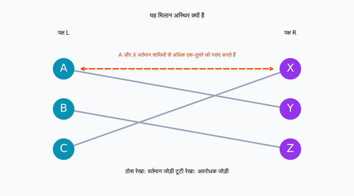
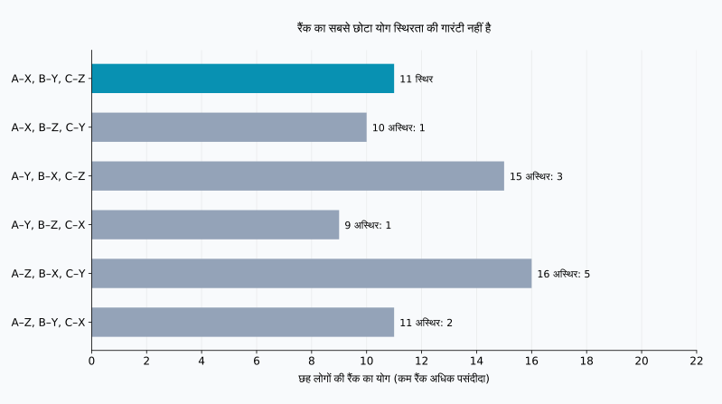
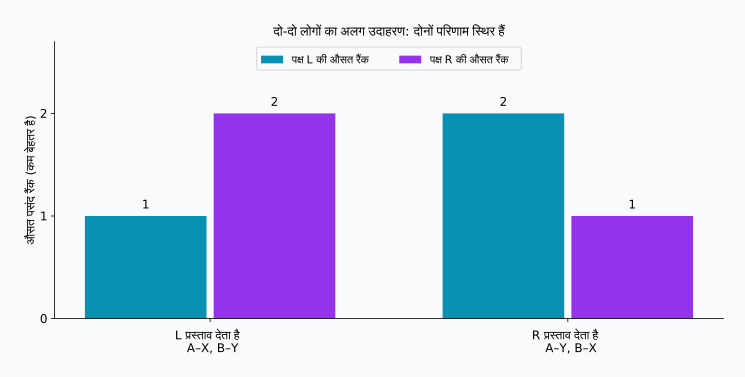

## 1. पसंदों की सूची जुटाना ही पर्याप्त नहीं है

मान लें कि शोध परियोजना के लिए विद्यार्थियों और मार्गदर्शकों की एक-से-एक जोड़ियाँ बनानी हैं। विद्यार्थी किसी खास व्यक्ति से सीखना चाहते हैं और मार्गदर्शकों की भी अपनी पसंद है। हर व्यक्ति से पसंदों की क्रमबद्ध सूची माँगना अच्छा आरंभ लगता है।

लेकिन कई विद्यार्थी एक ही मार्गदर्शक को चाह सकते हैं और पसंद दोनों तरफ से समान होना ज़रूरी नहीं। किसी का पहला विकल्प पूरा करने पर दूसरे को अपना पहला विकल्प छोड़ना पड़ सकता है। तब अच्छा आवंटन किसे कहेंगे?

**स्थिर विवाह समस्या** इसका एक स्पष्ट मापदंड देती है। नाम में विवाह होने पर भी इसका गणितीय सार दो समूहों के बीच एक-से-एक मिलान है। हम A, B, C और X, Y, Z का इस्तेमाल करेंगे; किसी लिंग की धारणा या वास्तविक वैवाहिक संबंधों की व्याख्या नहीं करेंगे।

**स्थिर होने का अर्थ यह नहीं कि सभी बहुत खुश हैं।** इसका अर्थ है कि ऐसी कोई दो व्यक्तियाँ नहीं हैं जो आपस में जोड़ी में नहीं हैं, लेकिन अपने वर्तमान साथियों से अधिक एक-दूसरे को पसंद करती हैं। नीचे की धारणाओं के अंतर्गत गेल–शैप्ली एल्गोरिदम यह सुनिश्चित करता है।

## 2. स्थिरता की गणितीय परिभाषा

### पहले मॉडल की धारणाएँ तय करें

$L$ और $R$ दो समूह हों, जिनमें $n$-$n$ व्यक्ति हैं। हर व्यक्ति दूसरे समूह के सभी लोगों को 1 से $n$ तक अलग-अलग रैंक देता है। कोई बराबर रैंक नहीं है, पसंद बदलती नहीं है और हर संभावित साथी अकेले रहने से बेहतर माना जाता है।

अस्वीकार्य साथी, एक से अधिक स्थान या बराबर रैंक होने पर मॉडल बढ़ाना पड़ता है। पहले सरल नियमों में काम करने का कारण समझते हैं।

मिलान $M$ में $M(a)$ व्यक्ति $a$ का साथी है। $r_a(b)$ वह रैंक है जो $a$, $b$ को देता है; छोटा अंक अधिक पसंद दर्शाता है। आपस में जोड़ी में न होने वाले $a\in L$ और $b\in R$ एक **अवरोधक जोड़ी** बनाते हैं यदि दोनों असमानताएँ सही हों:

$$
r_a(b)\lt r_a(M(a))
\quad\land\quad
r_b(a)\lt r_b(M(b))
$$

अर्थात दोनों अपने वर्तमान साथी को छोड़कर एक-दूसरे को चुनना चाहते हैं। यदि $\mathcal{B}(M)$ सभी अवरोधक जोड़ियों का समुच्चय है, तो मिलान स्थिर होने की शर्त है:

$$
\mathcal{B}(M)=\varnothing
$$

एकतरफ़ा इच्छा पर्याप्त नहीं है। इसके विपरीत, पुराने साथियों को नुकसान होने पर भी दोनों बदलाव चाहें तो जोड़ी अवरोधक है। पूरे समूह का कुल लाभ अलग प्रश्न है।

### स्थिर परिणाम में भी असंतोष हो सकता है

किसी को तीसरा विकल्प मिलने पर भी अवरोधक जोड़ी नहीं बनती, यदि उसके पहले दो विकल्प अपने वर्तमान साथियों को अधिक पसंद करते हों। **असंतुष्ट होना और दोनों की सहमति से बेहतर साथी चुन सकना अलग बातें हैं।** स्थिरता तय और घोषित सूचियों का गुण है; यह लंबे संबंध या परिणाम से सबकी सहमति की गारंटी नहीं है।

## 3. दोनों तरफ तीन व्यक्तियों का उदाहरण

$X\succ Y\succ Z$ का अर्थ है कि X, Y से और Y, Z से अधिक पसंद है। ये सूचियाँ इस लेख की गणना और आरेखों के लिए बनाई गई हैं।

| पक्ष L | पहली | दूसरी | तीसरी |
| --- | --- | --- | --- |
| A | X | Y | Z |
| B | Y | Z | X |
| C | X | Y | Z |

| पक्ष R | पहली | दूसरी | तीसरी |
| --- | --- | --- | --- |
| X | A | C | B |
| Y | A | B | C |
| Z | B | A | C |

A और C दोनों का पहला विकल्प X है। X का केवल एक साथी हो सकता है, इसलिए L के सभी प्रथम विकल्प पूरे होना असंभव है। फिर भी स्थिर मिलान संभव है।

A–Y, B–Z, C–X देखें। A और B को दूसरा विकल्प और C को पहला विकल्प मिलता है। यह अच्छा लगता है, लेकिन A को Y से अधिक X पसंद है और X को C से अधिक A पसंद है। इसलिए A और X अवरोधक जोड़ी हैं।



ठोस रेखाएँ वर्तमान जोड़ियाँ दिखाती हैं; नारंगी टूटी रेखा संभावित बदलाव दिखाती है। रेखाओं का एक-दूसरे को काटना स्थिरता तय नहीं करता। दोनों सिरों पर मौजूद लोगों की पसंद महत्त्वपूर्ण है।

## 4. गेल–शैप्ली: स्वीकृति अभी अंतिम नहीं है

गेल और शैप्ली ने यह तरीका 1962 में प्रस्तुत किया। इसे **विलंबित स्वीकृति** कहा जाता है: प्रस्ताव मिलने का अर्थ तुरंत अंतिम निर्णय लेना नहीं है। [मूल शोधपत्र](https://www.math.utoronto.ca/mccann/assignments/477/GaleShapley62.pdf)

यहाँ L प्रस्ताव देता है और R उन्हें प्राप्त करता है।

1. L का बिना साथी वाला व्यक्ति अपने सबसे पसंदीदा ऐसे विकल्प को प्रस्ताव देता है, जिसे उसने पहले प्रस्ताव नहीं दिया।
2. प्राप्तकर्ता नए प्रस्तावक की तुलना अपने अस्थायी साथी से करता है और अधिक पसंदीदा व्यक्ति को रखता है।
3. जिसे मना किया गया, वह अगले विकल्प पर जाता है।
4. जब L के सभी लोग अस्थायी रूप से चुने जा चुके हों, जोड़ियाँ अंतिम कर दी जाती हैं।

अस्थायी साथी बदल सकता है, लेकिन केवल अधिक पसंदीदा व्यक्ति के लिए। प्राप्तकर्ता अब तक आए प्रस्तावों में से अपना सर्वोत्तम विकल्प हमेशा रखता है।

### पाँच प्रस्तावों का क्रम

हम C, फिर B, फिर A से शुरू करते हैं ताकि अस्थायी साथी का बदलना स्पष्ट हो।

| चरण | प्रस्ताव | निर्णय | अस्थायी जोड़ियाँ |
| --- | --- | --- | --- |
| 1 | C → X | X खाली है और C को अस्थायी रूप से चुनता है | C–X |
| 2 | B → Y | Y खाली है और B को अस्थायी रूप से चुनता है | C–X, B–Y |
| 3 | A → X | X को A अधिक पसंद है, इसलिए C को बदलता है | A–X, B–Y |
| 4 | C → Y | Y को B अधिक पसंद है, इसलिए C को मना करता है | A–X, B–Y |
| 5 | C → Z | Z खाली है और C को अस्थायी रूप से चुनता है | A–X, B–Y, C–Z |

अंतिम परिणाम A–X, B–Y, C–Z है। C को तीसरा विकल्प मिला, लेकिन X को C से अधिक A और Y को C से अधिक B पसंद है। C के बेहतर विकल्प बदलाव नहीं चाहते। A और B को पहला विकल्प मिल चुका है, इसलिए कोई अवरोधक जोड़ी नहीं है।

यदि पहले आने वाले को तुरंत अंतिम स्वीकृति दे दी जाए, तो A के आने से पहले C–X तय हो जाएगा। तब A और X एक-दूसरे को अधिक पसंद करते रह सकते हैं। अस्थायी स्वीकृति इस समस्या को रोकती है।

## 5. एल्गोरिदम रुकता क्यों है और परिणाम स्थिर क्यों है?

कोई व्यक्ति एक ही प्राप्तकर्ता को दो बार प्रस्ताव नहीं देता। $n$ प्रस्तावक और $n$ संभावित प्राप्तकर्ता होने पर कुल प्रस्तावों की संख्या $P$ के लिए:

$$
P\leq n\times n=n^2
$$

यह ऊपरी सीमा है, हर बार लगने वाली सटीक संख्या नहीं। उदाहरण में $n=3$ के लिए पाँच प्रस्ताव पर्याप्त हैं। रैंक को शब्दकोश में रखकर तुलना नियत समय में की जाए, तो समय जटिलता $O(n^2)$ है। इनपुट सूचियों में ही कुल $2n^2$ प्रविष्टियाँ हैं।

अंत में कोई अकेला नहीं रह सकता। मान लें कि किसी स्वतंत्र प्रस्तावक ने सभी विकल्पों को प्रस्ताव दे दिया। तब प्रत्येक प्राप्तकर्ता को कम से कम एक प्रस्ताव मिला होगा। किसी को अस्थायी रूप से चुनने के बाद प्राप्तकर्ता कभी खाली नहीं होता, चाहे व्यक्ति बदल जाए। तब $n$ प्राप्तकर्ताओं के अलग-अलग साथी होंगे, जो $n$ प्रस्तावकों में किसी के स्वतंत्र रहने के विरुद्ध है।

अब मान लें कि अंतिम परिणाम में अवरोधक जोड़ी $a,b$ है। क्योंकि $a$ को अंतिम साथी से अधिक $b$ पसंद है, उसने पहले $b$ को प्रस्ताव दिया होगा। साथ न रहने का अर्थ है कि $b$ ने तुरंत मना किया या बाद में अधिक पसंदीदा व्यक्ति चुना। $b$ का अस्थायी साथी केवल बेहतर हो सकता है, इसलिए अंतिम साथी भी $a$ से अधिक पसंदीदा है। यह $b$ के बदलाव चाहने के विरुद्ध है। अस्वीकृति का कारण बाद में उलटता नहीं; सभी संभावनाएँ खोजना आवश्यक नहीं।

## 6. स्थिरता और संतुष्टि अलग लक्ष्य हैं

सभी लोगों को मिले साथियों की रैंक का योग लें:

$$
S(M)=\sum_{a\in L}r_a(M(a))
      +\sum_{b\in R}r_b(M(b))
$$

छोटा $S(M)$ सामूहिक रूप से बेहतर रैंक दर्शाता है, खुशी की मात्रा नहीं। पहली और दूसरी पसंद का अंतर, दूसरी और तीसरी पसंद के अंतर के बराबर होना ज़रूरी नहीं। पसंद की तीव्रता भी व्यक्तियों में अलग हो सकती है। यह योग केवल तुलना का सरल संकेतक है।

तीन-तीन व्यक्तियों के लिए $3!=6$ पूर्ण मिलान हैं:

| मिलान | L की रैंक का योग | R की रैंक का योग | कुल | अवरोधक जोड़ियाँ |
| --- | --- | --- | --- | --- |
| A–X, B–Y, C–Z | 5 | 6 | 11 | 0 |
| A–X, B–Z, C–Y | 5 | 5 | 10 | 1 |
| A–Y, B–X, C–Z | 8 | 7 | 15 | 3 |
| A–Y, B–Z, C–X | 5 | 4 | 9 | 1 |
| A–Z, B–X, C–Y | 8 | 8 | 16 | 5 |
| A–Z, B–Y, C–X | 5 | 6 | 11 | 2 |



न्यूनतम 9 वाला परिणाम A–Y, B–Z, C–X है, लेकिन A और X उसे अवरुद्ध करते हैं। गेल–शैप्ली का परिणाम 11 देता है और इस उदाहरण में वही एकमात्र स्थिर मिलान है। **रैंक का योग घटाना और अवरोधक जोड़ियाँ हटाना अलग उद्देश्य हैं।**

पहली और अंतिम पंक्ति दोनों का योग 11 है, लेकिन अंतिम में दो अवरोधक जोड़ियाँ हैं। केवल अंक पर्याप्त नहीं। “सब संतुष्ट” का अर्थ सबको पहला विकल्प, सबको पहले दो में से कोई विकल्प, सबसे खराब रैंक में सुधार, या दोनों पक्षों की औसत रैंक का अंतर घटाना हो सकता है। ये सभी स्थिरता से अलग मापदंड हैं।

## 7. प्रस्ताव देने वाला पक्ष बदलने से परिणाम बदल सकता है

अब दो-दो व्यक्तियों का अलग उदाहरण देखें, जिसमें नई पसंदें हैं।

| व्यक्ति | पहली | दूसरी |
| --- | --- | --- |
| A | X | Y |
| B | Y | X |
| X | B | A |
| Y | A | B |

L प्रस्ताव दे तो A–X, B–Y मिलता है: L को पहली और R को दूसरी पसंद। A और B बदलाव नहीं चाहते, इसलिए परिणाम स्थिर है। R प्रस्ताव दे तो A–Y, B–X मिलता है: अब R को पहली और L को दूसरी पसंद। यह भी स्थिर है।



बराबर रैंक न होने वाले मूल मॉडल में **हर प्रस्तावक को सभी स्थिर मिलानों में उपलब्ध उसका सबसे पसंदीदा साथी** मिलता है। इसे प्रस्तावक पक्ष की इष्टतमता कहते हैं। तुलना केवल स्थिर परिणामों से है; यह बिना किसी बाधा के पहली पसंद की गारंटी नहीं है। [मूल इष्टतमता प्रमेय](https://www.math.utoronto.ca/mccann/assignments/477/GaleShapley62.pdf)

इसी मॉडल में हर प्राप्तकर्ता को स्थिर परिणामों में उसका सबसे कम पसंदीदा साथी मिलता है। इसलिए प्रस्तावक पक्ष चुनना महत्त्वपूर्ण निर्णय है। पक्ष तय रहने पर स्वतंत्र प्रस्तावकों के क्रम को बदलने से अंतिम मिलान नहीं बदलता; दोनों पक्षों की भूमिका बदलने पर बदल सकता है।

## 8. Python में जाँचें

यह कोड तीन-तीन व्यक्तियों का उदाहरण चलाता है। `deque` एक कतार है; मना किए गए लोग अंत में फिर जुड़ जाते हैं। प्राप्तकर्ताओं की सूचियाँ रैंक के शब्दकोश में बदली जाती हैं ताकि तुलना जल्दी हो।

```python
from collections import deque

left = {"A": ["X", "Y", "Z"],
        "B": ["Y", "Z", "X"],
        "C": ["X", "Y", "Z"]}
right = {"X": ["A", "C", "B"],
         "Y": ["A", "B", "C"],
         "Z": ["B", "A", "C"]}

def gale_shapley(proposers, receivers, order=None):
    rank = {b: {a: i for i, a in enumerate(prefs)}
            for b, prefs in receivers.items()}
    free = deque(proposers if order is None else order)
    next_choice = {a: 0 for a in proposers}
    held = {}
    proposals = 0
    while free:
        a = free.popleft()
        b = proposers[a][next_choice[a]]
        next_choice[a] += 1
        proposals += 1
        if b not in held:
            held[b] = a
        elif rank[b][a] < rank[b][held[b]]:
            free.append(held[b])
            held[b] = a
        else:
            free.append(a)
    return {a: b for b, a in held.items()}, proposals

def blocking_pairs(match, left, right):
    inverse = {b: a for a, b in match.items()}
    return [(a, b) for a in left for b in right
            if left[a].index(b) < left[a].index(match[a])
            and right[b].index(a) < right[b].index(inverse[b])]

match, count = gale_shapley(left, right, ["C", "B", "A"])
print("मिलान:", sorted(match.items()))
print("प्रस्तावों की संख्या:", count)
print("अवरोधक जोड़ियाँ:", blocking_pairs(match, left, right))
```

```text
मिलान: [('A', 'X'), ('B', 'Y'), ('C', 'Z')]
प्रस्तावों की संख्या: 5
अवरोधक जोड़ियाँ: []
```

खाली सूची का अर्थ है कि कोई अवरोधक जोड़ी नहीं मिली। `{"A": "Y", "B": "Z", "C": "X"}` की जाँच करने पर `[('A', 'X')]` मिलता है।

यह शिक्षण हेतु कार्यान्वयन बराबर समूह, पूर्ण सूचियाँ और अलग-अलग रैंक मानता है। इनपुट सत्यापन और अस्वीकार्य साथी शामिल नहीं हैं। जाँच वाला फ़ंक्शन सरलता के लिए `.index()` इस्तेमाल करता है, इसलिए उसकी जटिलता $O(n^3)$ है। पहले की $O(n^2)$ सीमा मिलान एल्गोरिदम की है, अतिरिक्त जाँच की नहीं।

[पुनरुत्पादन स्क्रिप्ट](generate_graphs.hi.py) चित्र और सभी छह परिणाम बनाती है। [JSON परिणाम](calculation-results.hi.json) भी उपलब्ध हैं। पसंद बदलकर स्थिर मिलानों की संख्या और प्रस्तावक पक्ष का प्रभाव देखें।

## 9. वास्तविक आवंटन में उपयोग से पहले

विद्यार्थी और संस्थान, या आवेदक और स्वीकार करने वाली संस्था, दोनों तरफ की पसंदों या प्राथमिकताओं वाले उदाहरण हैं। वास्तविक व्यवस्थाएँ आमतौर पर अधिक जटिल होती हैं।

एकाधिक स्थान होने पर प्राप्तकर्ता अपनी क्षमता तक कई उम्मीदवार रख सकता है। लेकिन व्यक्तिगत रैंक से श्रेष्ठ उम्मीदवार चुनना, कुछ खास लोगों को एक साथ चाहने से अलग धारणा है। अस्वीकार्य साथी होने पर किसी को बिना आवंटन रहने देना होगा। बराबर रैंक होने पर उदासीनता के व्यवहार के अनुसार स्थिरता की परिभाषाएँ बदलती हैं। नियम बदलें तो गारंटी की फिर जाँच करनी चाहिए।

यह भी महत्त्वपूर्ण है कि घोषित सूचियाँ असली पसंद बताती हैं या नहीं। स्थिरता पहले जमा की गई सूचियों के आधार पर जाँची जाती है। अधूरी जानकारी या रैंक देने की पाबंदियाँ केवल परिणाम देखकर संतुष्टि का अनुमान कठिन बना सकती हैं। गणित स्पष्ट धारणाओं में गारंटी बताता है; एल्गोरिदम का निर्णय अपने आप न्यायसंगत नहीं हो जाता।

## 10. निष्कर्ष: स्थिरता और खुशी को अलग रखें

गेल–शैप्ली प्रस्ताव और अस्थायी स्वीकृति के द्वारा ऐसी दो व्यक्तियों की जोड़ी को रोकता है जो आपस में नहीं हैं, लेकिन दोनों बदलाव चाहते हैं।

- **स्थिर का अर्थ सबकी पहली पसंद नहीं।** सहमति वाला बदलाव न होने पर भी असंतोष हो सकता है।
- **स्थिर का अर्थ न्यूनतम रैंक योग नहीं।** उदाहरण का न्यूनतम 9 है, एकमात्र स्थिर परिणाम 11।
- **प्रस्तावक पक्ष महत्त्वपूर्ण है।** अलग स्थिर परिणाम अलग पक्षों के लिए बेहतर हो सकते हैं।

जब सभी इच्छाएँ पूरी नहीं हो सकतीं, तब लक्ष्य स्पष्ट करना और भी आवश्यक है। अनुकूलन से पहले तय करें कि “अच्छा मिलान” वास्तव में क्या है।

### संदर्भ

D. Gale and L. S. Shapley, “College Admissions and the Stability of Marriage,” *The American Mathematical Monthly*, 69(1), 9–15, 1962. [PDF](https://www.math.utoronto.ca/mccann/assignments/477/GaleShapley62.pdf)। मॉडल, विलंबित स्वीकृति और इष्टतमता का मूल स्रोत। तीन-तीन व्यक्तियों के उदाहरण, तालिकाओं और चित्रों की गणना स्वतंत्र रूप से की गई है।
