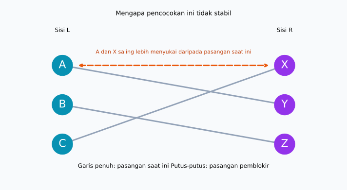
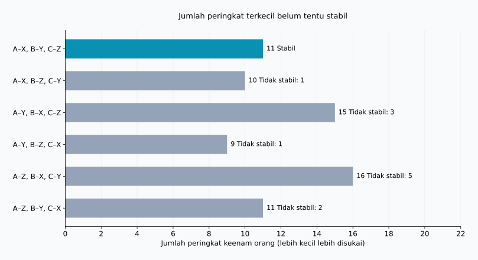
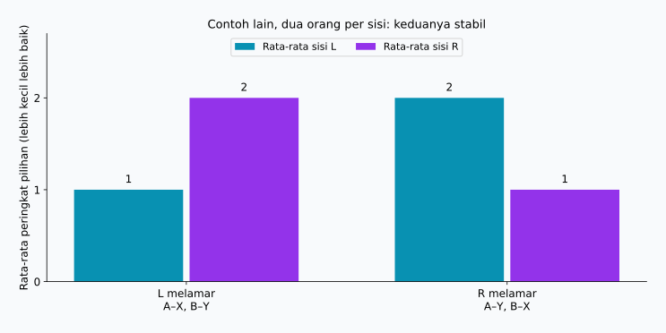

## 1. Mengumpulkan pilihan saja belum cukup

Bayangkan mahasiswa dipasangkan dengan pembimbing penelitian, satu mahasiswa untuk setiap pembimbing. Mahasiswa memiliki pilihan tentang siapa yang ingin mereka jadikan pembimbing, dan pembimbing juga memiliki preferensi. Meminta daftar urutan pilihan tampaknya merupakan awal yang baik.

Namun, beberapa mahasiswa bisa menginginkan pembimbing yang sama, dan pilihan tidak selalu berbalas. Memenuhi pilihan pertama seseorang dapat menggagalkan pilihan pertama orang lain. Jadi, apa arti pencocokan yang “baik”?

**[Masalah pernikahan stabil](https://kenji.blog/id/p/stable-marriage-problem/)** memberikan kriteria yang jelas. Inti matematikanya adalah pencocokan satu lawan satu antara dua kelompok. Kita memakai A, B, C dan X, Y, Z, tanpa menetapkan gender atau membahas pernikahan nyata.

**Stabil bukan berarti semua orang senang.** Stabil berarti tidak ada dua orang yang belum berpasangan satu sama lain tetapi sama-sama lebih memilih satu sama lain daripada pasangan saat ini. Algoritma Gale–Shapley menjamin kondisi ini dengan asumsi berikut.

## 2. Definisi matematis kestabilan

Misalkan $L$ dan $R$ masing-masing berisi $n$ orang. Setiap orang mengurutkan seluruh anggota kelompok lain dari 1 hingga $n$, tanpa peringkat sama. Pilihan tidak berubah, dan siapa pun lebih disukai daripada tidak memiliki pasangan.

Pasangan yang tidak dapat diterima, kapasitas lebih dari satu, atau pilihan seri membutuhkan perluasan model. Model sederhana membantu kita memahami mekanismenya terlebih dahulu.

Dalam pencocokan $M$, $M(a)$ adalah pasangan $a$. Nilai $r_a(b)$ adalah peringkat yang diberikan $a$ kepada $b$; semakin kecil, semakin disukai. Dua orang yang tidak dipasangkan, $a\in L$ dan $b\in R$, menjadi **pasangan pemblokir** jika kedua ketentuan ini terpenuhi:

$$
r_a(b)\lt r_a(M(a))
\quad\land\quad
r_b(a)\lt r_b(M(b))
$$

Keduanya ingin meninggalkan pasangan saat ini untuk berpasangan bersama. Jika $\mathcal{B}(M)$ adalah himpunan pasangan pemblokir, pencocokan stabil tepat ketika:

$$
\mathcal{B}(M)=\varnothing
$$

Keinginan sepihak tidak cukup. Sebaliknya, pasangan itu tetap memblokir meskipun perpindahan merugikan pasangan lama mereka. Manfaat bagi seluruh kelompok merupakan pertanyaan berbeda.

Seseorang bisa mendapat pilihan ketiga tanpa menimbulkan pasangan pemblokir: pilihan pertama dan keduanya mungkin lebih menyukai pasangan saat ini. **Ketidakpuasan berbeda dari kesempatan untuk berpindah atas keinginan bersama.** Kestabilan adalah sifat dari urutan pilihan yang dilaporkan dan tetap, bukan jaminan hubungan langgeng atau penerimaan semua pihak.

## 3. Contoh dengan tiga orang di setiap sisi

$X\succ Y\succ Z$ berarti X lebih disukai daripada Y, dan Y daripada Z. Daftar berikut disusun khusus untuk perhitungan artikel ini.

| Sisi L | Ke-1 | Ke-2 | Ke-3 |
| --- | --- | --- | --- |
| A | X | Y | Z |
| B | Y | Z | X |
| C | X | Y | Z |

| Sisi R | Ke-1 | Ke-2 | Ke-3 |
| --- | --- | --- | --- |
| X | A | C | B |
| Y | A | B | C |
| Z | B | A | C |

A dan C sama-sama menempatkan X pertama. Karena X hanya dapat memiliki satu pasangan, seluruh pilihan pertama L tidak mungkin terpenuhi. Meskipun demikian, pencocokan stabil tetap bisa dibuat.

Pertimbangkan A–Y, B–Z, C–X. A dan B mendapat pilihan kedua; C mendapat pilihan pertama. Tampaknya baik, tetapi A lebih menyukai X daripada Y, dan X lebih menyukai A daripada C. Maka A dan X adalah pasangan pemblokir.



Garis penuh menunjukkan pasangan saat ini, sedangkan garis putus-putus oranye menunjukkan kemungkinan perpindahan. Garis yang bersilangan tidak menentukan kestabilan. Yang penting adalah pilihan kedua ujungnya.

## 4. Gale–Shapley: penerimaan belum final

Gale dan Shapley memperkenalkan metode ini pada 1962. Namanya **penerimaan tertunda** atau deferred acceptance: menerima lamaran tidak langsung berarti keputusan akhir. [Makalah asli](https://www.math.utoronto.ca/mccann/assignments/477/GaleShapley62.pdf)

L mengajukan lamaran dan R menerimanya.

1. Orang L yang belum berpasangan melamar pilihan tertinggi yang belum pernah dilamarnya.
2. Penerima membandingkan pelamar baru dengan pasangan sementara, jika ada, lalu mempertahankan yang lebih disukai.
3. Orang yang ditolak melanjutkan ke pilihan berikutnya.
4. Setelah semua anggota L diterima sementara, pasangan-pasangan itu ditetapkan.

Pasangan sementara dapat berganti, tetapi hanya dengan seseorang yang lebih disukai penerima. Jadi, penerima selalu mempertahankan pelamar terbaik yang pernah datang.

### Menelusuri lima lamaran

Mulai dengan C, lalu B, lalu A agar pergantian pasangan sementara terlihat.

| Langkah | Lamaran | Keputusan | Pasangan sementara |
| --- | --- | --- | --- |
| 1 | C → X | X belum berpasangan dan menerima C sementara | C–X |
| 2 | B → Y | Y belum berpasangan dan menerima B sementara | C–X, B–Y |
| 3 | A → X | X lebih menyukai A dan mengganti C | A–X, B–Y |
| 4 | C → Y | Y lebih menyukai B dan menolak C | A–X, B–Y |
| 5 | C → Z | Z belum berpasangan dan menerima C sementara | A–X, B–Y, C–Z |

Hasil akhirnya A–X, B–Y, C–Z. C mendapat pilihan ketiga, tetapi X lebih menyukai A dan Y lebih menyukai B daripada C. Tidak ada pilihan yang lebih baik bagi C yang bersedia pindah. A dan B sudah mendapat pilihan pertama, sehingga tidak ada pasangan pemblokir.

Jika penerimaan langsung final berdasarkan urutan kedatangan, C–X akan terkunci sebelum A datang. A dan X bisa tetap saling menginginkan. Status sementara mencegah masalah ini.

## 5. Mengapa algoritma berhenti dan hasilnya stabil?

Seseorang tidak melamar orang yang sama dua kali. Dengan $n$ pelamar dan $n$ penerima, jumlah lamaran $P$ dibatasi oleh:

$$
P\leq n\times n=n^2
$$

Ini batas atas, bukan jumlah pasti setiap eksekusi. Contoh kita hanya membutuhkan lima lamaran untuk $n=3$. Jika peringkat disimpan dalam kamus agar perbandingan berwaktu konstan, algoritma memerlukan $O(n^2)$ waktu. Daftar masukan sendiri memuat $2n^2$ entri.

Tidak ada orang yang tersisa tanpa pasangan saat selesai. Andaikan seorang pelamar bebas telah menghabiskan semua pilihan, setiap penerima pasti pernah dilamar. Setelah menerima sementara, penerima selalu mempertahankan seseorang, meskipun orangnya dapat berganti. Semua $n$ penerima berarti memiliki pasangan berbeda, bertentangan dengan adanya satu pelamar bebas di antara $n$ pelamar.

Sekarang andaikan hasil memiliki pasangan pemblokir $a,b$. Karena $a$ lebih menyukai $b$ daripada pasangan akhir, $a$ pasti melamar $b$ lebih dahulu. Jika mereka tidak bersama, $b$ pernah menolak $a$ atau menggantinya dengan orang yang lebih disukai. Pilihan sementara $b$ hanya membaik, sehingga pasangan akhirnya lebih disukai daripada $a$. Ini bertentangan dengan keinginan $b$ untuk berpindah. Alasan penolakan tidak berbalik; kita tidak perlu mencari seluruh kombinasi.

## 6. Stabilitas dan kepuasan adalah tujuan berbeda

Kita dapat membandingkan hasil melalui jumlah peringkat pasangan yang diperoleh semua orang:

$$
S(M)=\sum_{a\in L}r_a(M(a))
      +\sum_{b\in R}r_b(M(b))
$$

Nilai kecil berarti peringkat lebih baik secara keseluruhan, tetapi bukan ukuran kebahagiaan. Selisih antara pilihan pertama dan kedua belum tentu sama dengan selisih kedua dan ketiga; intensitas preferensi antarorang juga berbeda. Jumlah ini hanya indikator sederhana untuk ilustrasi.

Ada $3!=6$ pencocokan lengkap:

| Pencocokan | Jumlah peringkat L | Jumlah peringkat R | Total | Pasangan pemblokir |
| --- | --- | --- | --- | --- |
| A–X, B–Y, C–Z | 5 | 6 | 11 | 0 |
| A–X, B–Z, C–Y | 5 | 5 | 10 | 1 |
| A–Y, B–X, C–Z | 8 | 7 | 15 | 3 |
| A–Y, B–Z, C–X | 5 | 4 | 9 | 1 |
| A–Z, B–X, C–Y | 8 | 8 | 16 | 5 |
| A–Z, B–Y, C–X | 5 | 6 | 11 | 2 |



Nilai minimum 9 dimiliki A–Y, B–Z, C–X, tetapi A dan X memblokirnya. Hasil Gale–Shapley bernilai 11 dan merupakan satu-satunya hasil stabil dalam contoh ini. **Meminimalkan jumlah peringkat dan menghilangkan pasangan pemblokir adalah dua tujuan berbeda.**

Baris pertama dan terakhir sama-sama bernilai 11, tetapi baris terakhir memiliki dua pasangan pemblokir. Skor saja tidak cukup. “Semua puas” bisa berarti semua mendapat pilihan pertama, mendapat salah satu dari dua pilihan teratas, memperbaiki peringkat terburuk, atau mendekatkan rata-rata kedua sisi. Semua itu berbeda dari kestabilan.

## 7. Mengubah sisi pelamar dapat mengubah hasil

Berikut contoh lain, dengan dua orang per sisi dan preferensi baru:

| Orang | Ke-1 | Ke-2 |
| --- | --- | --- |
| A | X | Y |
| B | Y | X |
| X | B | A |
| Y | A | B |

Jika L melamar, hasilnya A–X, B–Y: L mendapat pilihan pertama dan R pilihan kedua. Stabil karena A dan B tidak ingin pindah. Jika R melamar, hasilnya A–Y, B–X: R mendapat pilihan pertama dan L pilihan kedua. Ini juga stabil.



Dengan preferensi tanpa seri, Gale–Shapley memberikan kepada **setiap pelamar pasangan terbaik yang bisa diperoleh di antara semua pencocokan stabil**. Inilah optimalitas sisi pelamar. Pembandingnya hanya hasil stabil, jadi pilihan pertama tanpa batasan tidak dijamin. [Teorema dalam makalah asli](https://www.math.utoronto.ca/mccann/assignments/477/GaleShapley62.pdf)

Dalam model yang sama, setiap penerima memperoleh pasangan yang paling tidak disukainya di antara hasil stabil. Memilih sisi pelamar adalah keputusan desain penting. Jika sisi itu tetap, urutan pemrosesan pelamar bebas tidak mengubah hasil akhir; menukar peran dapat mengubahnya.

## 8. Memeriksa dengan Python

Kode berikut menjalankan contoh tiga orang per sisi. `deque` adalah antrean; pelamar yang ditolak kembali ke belakang. Daftar penerima diubah menjadi kamus peringkat untuk perbandingan cepat.

```python
from collections import deque

left = {"A": ["X", "Y", "Z"],
        "B": ["Y", "Z", "X"],
        "C": ["X", "Y", "Z"]}
right = {"X": ["A", "C", "B"],
         "Y": ["A", "B", "C"],
         "Z": ["B", "A", "C"]}

def gale_shapley(proposers, receivers, order=None):
    rank = {b: {a: i for i, a in enumerate(prefs)}
            for b, prefs in receivers.items()}
    free = deque(proposers if order is None else order)
    next_choice = {a: 0 for a in proposers}
    held = {}
    proposals = 0
    while free:
        a = free.popleft()
        b = proposers[a][next_choice[a]]
        next_choice[a] += 1
        proposals += 1
        if b not in held:
            held[b] = a
        elif rank[b][a] < rank[b][held[b]]:
            free.append(held[b])
            held[b] = a
        else:
            free.append(a)
    return {a: b for b, a in held.items()}, proposals

def blocking_pairs(match, left, right):
    inverse = {b: a for a, b in match.items()}
    return [(a, b) for a in left for b in right
            if left[a].index(b) < left[a].index(match[a])
            and right[b].index(a) < right[b].index(inverse[b])]

match, count = gale_shapley(left, right, ["C", "B", "A"])
print("Pencocokan:", sorted(match.items()))
print("Jumlah lamaran:", count)
print("Pasangan pemblokir:", blocking_pairs(match, left, right))
```

```text
Pencocokan: [('A', 'X'), ('B', 'Y'), ('C', 'Z')]
Jumlah lamaran: 5
Pasangan pemblokir: []
```

Daftar kosong berarti tidak ditemukan pasangan pemblokir. Memeriksa `{"A": "Y", "B": "Z", "C": "X"}` menghasilkan `[('A', 'X')]`.

Implementasi pendidikan ini mengasumsikan kelompok sama besar, daftar lengkap, dan tidak ada seri. Validasi masukan serta pasangan tidak dapat diterima tidak disertakan. Pemeriksa memakai `.index()` demi keterbacaan sehingga memerlukan $O(n^3)$. Batas $O(n^2)$ berlaku untuk algoritma pencocokan, tidak termasuk pemeriksaan tambahan ini.

[Skrip reproduksi](generate_graphs.id.py) menghasilkan gambar dan keenam hasil, yang tersedia pula sebagai [JSON](calculation-results.id.json). Ubah pilihan untuk melihat jumlah pencocokan stabil atau dampak membalik sisi pelamar.

## 9. Sebelum menerapkannya di dunia nyata

Mahasiswa dan sekolah, atau pelamar dan lembaga penerima, adalah contoh penugasan dengan preferensi maupun prioritas di kedua sisi. Sistem nyata biasanya lebih rumit.

Penerima dengan beberapa tempat dapat mempertahankan beberapa pelamar sampai kapasitasnya. Namun, memilih individu berperingkat tertinggi berbeda dari menginginkan kombinasi orang tertentu. Pasangan tidak dapat diterima mengharuskan pilihan untuk tetap tidak dipasangkan. Seri juga menghasilkan definisi kestabilan berbeda, bergantung pada perlakuan terhadap ketidakbedaan pilihan. Jaminan perlu diperiksa ulang ketika aturan berubah.

Penting pula apakah daftar yang dilaporkan mencerminkan pilihan sesungguhnya. Kestabilan pertama-tama diperiksa terhadap daftar masukan. Informasi tidak lengkap atau pembatasan daftar membuat kepuasan sulit disimpulkan hanya dari hasil. Matematika menjelaskan jaminan dengan asumsi tertentu; keputusan algoritmik tidak otomatis adil.

## 10. Kesimpulan: bedakan kestabilan dan kebahagiaan

Gale–Shapley menggabungkan lamaran dan penerimaan sementara untuk mencegah perpindahan yang diinginkan bersama oleh dua orang yang belum berpasangan.

- **Stabil bukan berarti semua mendapat pilihan pertama.** Ketidakpuasan bisa tetap ada tanpa perpindahan yang disepakati.
- **Stabil bukan berarti jumlah peringkat minimum.** Minimum contoh ini 9, sedangkan satu-satunya hasil stabil 11.
- **Sisi pelamar penting.** Hasil stabil berbeda dapat menguntungkan sisi berbeda.

Ketika semua keinginan tidak dapat dipenuhi, justru semakin penting untuk mendefinisikan tujuan. Sebelum mengoptimalkan, tentukan dahulu arti pencocokan yang “baik”.

### Referensi

D. Gale dan L. S. Shapley, “College Admissions and the Stability of Marriage”, *The American Mathematical Monthly*, 69(1), 9–15, 1962. [PDF](https://www.math.utoronto.ca/mccann/assignments/477/GaleShapley62.pdf). Sumber asli model, penerimaan tertunda, dan optimalitas. Contoh tiga orang per sisi, tabel, dan gambar dihitung secara mandiri.

