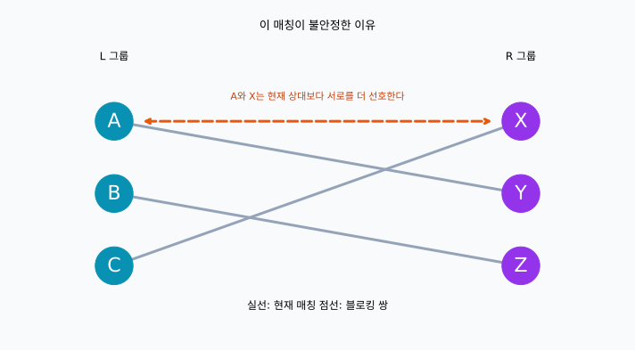
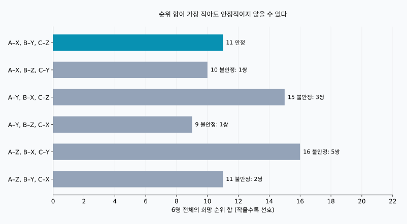
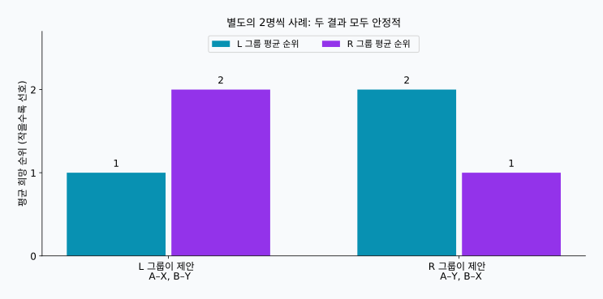

## 1. 희망 순위를 모으는 것만으로는 부족하다

연구 프로젝트에서 학생과 지도 담당자를 한 명씩 연결한다고 생각해 봅시다. 학생에게는 배우고 싶은 상대가 있고, 담당자에게도 지도하고 싶은 학생이 있습니다. 모두에게 희망 순위를 제출하게 하면 쉽게 배정할 수 있을 것 같습니다.

하지만 여러 사람이 같은 상대를 원할 수 있고, 선호가 서로 일치하지 않을 수도 있습니다. 한 사람의 1순위를 실현하면 다른 사람은 포기해야 할 수 있습니다. 그렇다면 ‘좋은 배정’은 무엇을 달성해야 할까요?

**[안정 결혼 문제](https://kenji.blog/ko/p/stable-marriage-problem/)**는 이 질문에 명확한 기준을 제시합니다. 이름과 달리 수학적 핵심은 선호를 가진 두 그룹 사이의 일대일 매칭입니다. 여기서는 실제 결혼이나 성별을 가정하지 않고 A, B, C와 X, Y, Z라는 기호를 사용합니다.

**안정적이라는 말은 모두가 크게 만족한다는 뜻이 아닙니다.** 현재 짝이 아닌 두 사람이 서로를 현재 상대보다 더 선호하는 경우가 없다는 뜻입니다. 다음 조건에서 게일–섀플리 알고리즘은 이를 항상 보장합니다.

## 2. ‘안정’을 수식으로 정의하기

### 먼저 모델의 조건을 정하자

$L$과 $R$에는 각각 $n$명이 있습니다. 각 사람은 반대편 전원에게 1위부터 $n$위까지 중복 없는 순위를 매깁니다. 선호는 도중에 바뀌지 않으며, 동순위가 없고, 누구와도 연결되지 않는 것보다 어떤 상대와든 연결되는 것을 선호한다고 가정합니다.

받아들일 수 없는 상대, 여러 명을 받을 수 있는 정원, 동순위가 있다면 모델을 확장해야 합니다. 먼저 단순한 조건으로 원리를 이해하겠습니다.

매칭 $M$에서 $M(a)$는 $a$의 상대이고, $r_a(b)$는 $a$가 $b$에게 부여한 순위입니다. 숫자가 작을수록 더 선호합니다. 서로 연결되지 않은 $a\in L$과 $b\in R$가 다음 두 조건을 모두 만족하면 **블로킹 쌍**이라고 합니다.

$$
r_a(b)\lt r_a(M(a))
\quad\land\quad
r_b(a)\lt r_b(M(b))
$$

두 사람 모두 현재 상대 대신 서로와 연결되기를 원한다는 뜻입니다. 블로킹 쌍의 집합을 $\mathcal{B}(M)$이라고 하면, 안정성은 다음 조건과 같습니다.

$$
\mathcal{B}(M)=\varnothing
$$

한쪽만 원하는 것으로는 부족합니다. 반대로 기존 상대가 손해를 보더라도 두 사람이 모두 변경을 원하면 블로킹 쌍입니다. 전체 집단에 이로운 변경인지는 별개의 문제입니다.

### 안정적이어도 불만은 남을 수 있다

누군가 3순위 상대와 연결되더라도, 그 사람의 1·2순위 상대가 현재 짝을 더 선호한다면 블로킹 쌍은 생기지 않습니다. **불만이 있는 것과 양쪽의 합의로 더 원하는 상대에게 옮길 수 있는 것은 다릅니다.** 안정성은 고정된 신고 순위에 관한 수학적 성질이지, 관계의 지속이나 결과에 대한 전원의 동의를 보장하지는 않습니다.

## 3. 세 명씩의 구체적인 예

$X\succ Y\succ Z$는 X, Y, Z 순으로 선호한다는 뜻입니다. 다음 순위는 이 글의 계산과 그림을 위해 만든 예입니다.

| L 그룹 | 1순위 | 2순위 | 3순위 |
| --- | --- | --- | --- |
| A | X | Y | Z |
| B | Y | Z | X |
| C | X | Y | Z |

| R 그룹 | 1순위 | 2순위 | 3순위 |
| --- | --- | --- | --- |
| X | A | C | B |
| Y | A | B | C |
| Z | B | A | C |

A와 C는 모두 X를 1순위로 원합니다. X는 한 명과만 연결될 수 있으므로 L 그룹 전원의 1순위를 실현하는 것은 불가능합니다. 그래도 안정적인 매칭은 가능합니다.

A–Y, B–Z, C–X를 보겠습니다. A와 B는 2순위, C는 1순위를 얻습니다. 괜찮아 보이지만 A는 Y보다 X를, X는 C보다 A를 더 선호합니다. 따라서 A와 X는 블로킹 쌍입니다.



실선은 현재의 짝이고, 주황색 점선은 변경을 원하는 두 사람을 나타냅니다. 선이 교차하는지는 안정성과 관계없습니다. 중요한 것은 양 끝에 있는 사람들의 희망 순위입니다.

## 4. 게일–섀플리: 수락을 일단 보류한다

게일과 섀플리는 1962년에 이 방법을 제시했습니다. **지연 수락 방식**이라고 하며, 제안을 받더라도 즉시 최종 확정하지 않는 것이 핵심입니다. [원 논문](https://www.math.utoronto.ca/mccann/assignments/477/GaleShapley62.pdf)

여기서는 L 그룹이 제안하고 R 그룹이 받습니다.

1. 아직 상대가 없는 L의 한 사람이, 제안하지 않은 사람 중 가장 선호하는 상대에게 제안합니다.
2. 받는 사람은 새 제안자와 기존에 보류한 상대를 비교하고, 더 선호하는 한 명만 남깁니다.
3. 거절당한 사람은 다음 희망 상대에게 제안합니다.
4. L 전원이 보류 상태로 연결되면 모든 매칭을 확정합니다.

보류한 상대는 나중에 바뀔 수 있지만, 더 선호하는 사람으로만 바뀝니다. 받는 쪽은 지금까지 제안한 사람 가운데 가장 선호하는 사람을 항상 남깁니다.

### 다섯 번의 제안 따라가기

보류 중인 상대가 바뀌는 모습을 보기 위해 C, B, A 순으로 시작합니다.

| 단계 | 제안 | 판단 | 임시 매칭 |
| --- | --- | --- | --- |
| 1 | C → X | X가 비어 있어 C를 보류 | C–X |
| 2 | B → Y | Y가 비어 있어 B를 보류 | C–X, B–Y |
| 3 | A → X | X가 A를 더 선호해 C를 교체 | A–X, B–Y |
| 4 | C → Y | Y가 B를 더 선호해 C를 거절 | A–X, B–Y |
| 5 | C → Z | Z가 비어 있어 C를 보류 | A–X, B–Y, C–Z |

결과는 A–X, B–Y, C–Z입니다. C는 3순위를 얻었지만 X는 C보다 A를, Y는 C보다 B를 선호합니다. C가 원하는 변경에는 상대가 동의하지 않습니다. A와 B는 이미 1순위이므로 블로킹 쌍이 없습니다.

선착순으로 즉시 확정했다면 A가 도착하기 전에 C–X가 고정됩니다. 그러면 A와 X가 서로를 원하는 상태가 남을 수 있습니다. 보류는 이를 막는 중요한 장치입니다.

## 5. 왜 반드시 끝나고 안정적인 결과가 나올까?

같은 사람이 같은 상대에게 두 번 제안하지 않습니다. 제안자가 $n$명이고 가능한 상대도 $n$명이므로 전체 제안 횟수 $P$는 다음을 만족합니다.

$$
P\leq n\times n=n^2
$$

이는 상한이지 매번 정확히 필요한 횟수는 아닙니다. 이 예는 $n=3$에서 다섯 번이면 끝납니다. 순위를 사전으로 저장해 비교를 일정한 시간에 처리하면 알고리즘의 시간 복잡도는 $O(n^2)$입니다. 입력 순위표 자체에도 $2n^2$개의 항목이 있습니다.

끝났는데 누군가 남는 일도 없습니다. 짝이 없는 제안자가 모든 상대에게 제안했다면 R 전원이 제안을 받은 적이 있습니다. 한 번 상대를 보류한 수신자는 교체하더라도 계속 누군가를 남기므로, R의 $n$명 모두 서로 다른 상대를 갖게 됩니다. 제안자도 $n$명인데 한 명이 남는다는 가정과 모순입니다.

이제 최종 결과에 블로킹 쌍 $a,b$가 있다고 가정합시다. $a$가 현재 상대보다 $b$를 선호한다면, 순서상 이전에 $b$에게 제안했어야 합니다. 함께 끝나지 않았다는 것은 $b$가 즉시 거절했거나 나중에 더 선호하는 사람으로 교체했다는 뜻입니다. $b$의 임시 상대는 더 좋아지기만 하므로 최종 상대도 $a$보다 선호됩니다. 이는 $b$가 $a$로 옮기고 싶다는 가정과 모순입니다. 거절의 이유가 나중에 뒤집히지 않으므로 전체 조합을 탐색할 필요가 없습니다.

## 6. 그래프로 보는 안정성과 만족의 차이

모두가 배정받은 상대의 희망 순위를 더해 보겠습니다.

$$
S(M)=\sum_{a\in L}r_a(M(a))
      +\sum_{b\in R}r_b(M(b))
$$

$S(M)$이 작을수록 전체적으로 상위 순위와 연결되었다고 볼 수 있지만, 행복의 양은 아닙니다. 1위와 2위의 차이가 2위와 3위의 차이와 같을 필요도 없고, 사람마다 중요도도 다릅니다. 여기서는 비교를 위한 단순한 지표로 사용합니다.

세 명씩이면 완전한 매칭은 $3!=6$가지입니다.

| 매칭 | L 순위 합 | R 순위 합 | 전체 합 | 블로킹 쌍 수 |
| --- | --- | --- | --- | --- |
| A–X, B–Y, C–Z | 5 | 6 | 11 | 0 |
| A–X, B–Z, C–Y | 5 | 5 | 10 | 1 |
| A–Y, B–X, C–Z | 8 | 7 | 15 | 3 |
| A–Y, B–Z, C–X | 5 | 4 | 9 | 1 |
| A–Z, B–X, C–Y | 8 | 8 | 16 | 5 |
| A–Z, B–Y, C–X | 5 | 6 | 11 | 2 |



최솟값 9는 A–Y, B–Z, C–X이지만 A와 X가 블로킹 쌍입니다. 게일–섀플리의 결과는 합이 11이며, 이 예에서 유일한 안정 매칭입니다. **순위 합을 최소화하는 것과 블로킹 쌍을 없애는 것은 서로 다른 목표입니다.**

첫 행과 마지막 행은 둘 다 11이지만 마지막에는 블로킹 쌍이 두 개 있습니다. 합계만으로 안정성을 알 수 없습니다. ‘모두 만족’도 전원 1순위, 전원 2순위 이내, 가장 불리한 사람의 순위 개선, 양쪽 평균 순위의 균형 등으로 정의할 수 있습니다. 모두 안정성과는 다른 기준입니다.

## 7. 제안하는 쪽을 바꾸면 결과도 바뀔 수 있다

다음은 두 명씩의 별도 사례이며, 앞의 순위표와 다릅니다.

| 참가자 | 1순위 | 2순위 |
| --- | --- | --- |
| A | X | Y |
| B | Y | X |
| X | B | A |
| Y | A | B |

L이 제안하면 A–X, B–Y가 됩니다. L은 모두 1순위, R은 모두 2순위입니다. A와 B가 바꾸고 싶어 하지 않으므로 안정적입니다. R이 제안하면 A–Y, B–X가 되어 R이 1순위, L이 2순위를 얻습니다. 이 결과도 안정적입니다.



동순위가 없는 기본 모델에서는 **각 제안자가 모든 안정 매칭 중 자신에게 가장 좋은 상대**를 얻습니다. 이것을 제안자 최적성이라고 합니다. 비교 대상은 안정 매칭뿐이며, 제약 없이 1순위를 얻는다는 뜻은 아닙니다. [원 논문의 최적성 정리](https://www.math.utoronto.ca/mccann/assignments/477/GaleShapley62.pdf)

같은 모델에서 받는 쪽의 각 사람은 안정 매칭 중 가장 덜 선호하는 상대를 얻습니다. 따라서 어느 쪽이 제안할지는 중요한 설계 선택입니다. 제안하는 쪽을 고정하면 미매칭 제안자의 처리 순서를 바꿔도 최종 매칭은 같지만, 역할을 뒤집으면 결과가 달라질 수 있습니다.

## 8. Python으로 확인하기

다음 코드는 세 명씩의 예를 실행합니다. `deque`는 대기열이며, 거절당한 사람은 뒤에 다시 섭니다. 수신자의 순위는 빠르게 비교할 수 있도록 사전으로 바꿉니다.

```python
from collections import deque

left = {"A": ["X", "Y", "Z"],
        "B": ["Y", "Z", "X"],
        "C": ["X", "Y", "Z"]}
right = {"X": ["A", "C", "B"],
         "Y": ["A", "B", "C"],
         "Z": ["B", "A", "C"]}

def gale_shapley(proposers, receivers, order=None):
    rank = {b: {a: i for i, a in enumerate(prefs)}
            for b, prefs in receivers.items()}
    free = deque(proposers if order is None else order)
    next_choice = {a: 0 for a in proposers}
    held = {}
    proposals = 0
    while free:
        a = free.popleft()
        b = proposers[a][next_choice[a]]
        next_choice[a] += 1
        proposals += 1
        if b not in held:
            held[b] = a
        elif rank[b][a] < rank[b][held[b]]:
            free.append(held[b])
            held[b] = a
        else:
            free.append(a)
    return {a: b for b, a in held.items()}, proposals

def blocking_pairs(match, left, right):
    inverse = {b: a for a, b in match.items()}
    return [(a, b) for a in left for b in right
            if left[a].index(b) < left[a].index(match[a])
            and right[b].index(a) < right[b].index(inverse[b])]

match, count = gale_shapley(left, right, ["C", "B", "A"])
print("매칭:", sorted(match.items()))
print("제안 횟수:", count)
print("블로킹 쌍:", blocking_pairs(match, left, right))
```

```text
매칭: [('A', 'X'), ('B', 'Y'), ('C', 'Z')]
제안 횟수: 5
블로킹 쌍: []
```

빈 리스트는 블로킹 쌍이 없다는 뜻입니다. `{"A": "Y", "B": "Z", "C": "X"}`를 검사하면 `[('A', 'X')]`가 나옵니다.

이 교육용 구현은 같은 인원수, 완전한 순위표, 동순위 없음을 전제로 하며 입력 검증이나 허용되지 않는 상대는 처리하지 않습니다. 검사 함수는 읽기 쉽게 `.index()`를 사용하므로 $O(n^3)$입니다. 앞의 $O(n^2)$는 사전으로 순위를 비교하는 매칭 본체의 복잡도이며, 추가 검사는 포함하지 않습니다.

[재현용 스크립트](generate_graphs.ko.py)는 그림과 여섯 결과를 생성합니다. [JSON 계산 결과](calculation-results.ko.json)도 제공합니다. 순위를 바꾸어 안정 매칭의 개수나 제안하는 쪽의 영향을 살펴보세요.

## 9. 실제 배정에 적용하기 전에

학생과 학교, 지원자와 기관처럼 양쪽에 선호나 우선순위가 있는 상황을 생각하는 출발점이 될 수 있습니다. 그러나 현실의 규칙은 보통 더 복잡합니다.

정원이 여러 명이면 수신자가 정원까지 후보를 보류하도록 확장할 수 있습니다. 다만 개인 순위에 따라 상위 지원자를 선택하는 것과 특정 사람들을 함께 뽑고 싶어 하는 것은 다른 가정입니다. 허용할 수 없는 상대가 있다면 미배정도 허용해야 합니다. 동순위가 있으면 무차별한 선호를 어떻게 다루느냐에 따라 안정성의 정의도 달라집니다. 규칙이 바뀌면 보장도 다시 확인해야 합니다.

신고한 순위가 실제 선호를 반영하는지도 중요합니다. 안정성은 우선 입력된 목록에 대해 판단합니다. 정보가 부족하거나 순위 작성에 제약이 있다면 결과만 보고 만족을 알기 어렵습니다. 수학은 어떤 가정 아래 무엇이 보장되는지 설명합니다. 알고리즘으로 결정했다는 사실만으로 공정한 것은 아닙니다.

## 10. 정리: 안정과 행복을 구별하자

게일–섀플리는 제안과 임시 수락을 반복해, 현재 짝이 아닌 두 사람이 함께 원할 만한 변경을 없앱니다.

- **안정은 전원의 1순위를 뜻하지 않습니다.** 상호 합의할 변경이 없어도 불만은 남을 수 있습니다.
- **안정은 순위 합의 최소화가 아닙니다.** 예의 최솟값은 9지만 유일한 안정 결과는 11입니다.
- **제안하는 쪽이 중요합니다.** 여러 안정 결과는 서로 다른 쪽에 유리할 수 있습니다.

모든 희망을 실현할 수 없을수록 목표를 정확히 정해야 합니다. 최적화에 앞서, 무엇을 ‘좋은 조합’이라고 부를지 먼저 생각해 보세요.

### 참고 문헌

D. Gale and L. S. Shapley, “College Admissions and the Stability of Marriage,” *The American Mathematical Monthly*, 69(1), 9–15, 1962. [PDF](https://www.math.utoronto.ca/mccann/assignments/477/GaleShapley62.pdf). 모델, 지연 수락 방식, 안정성 및 제안자 최적성의 원전입니다. 세 명씩의 사례, 표, 그림은 독립적으로 계산했습니다.

