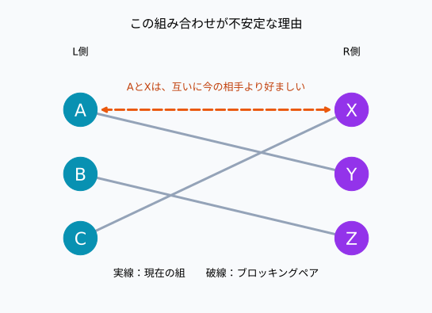
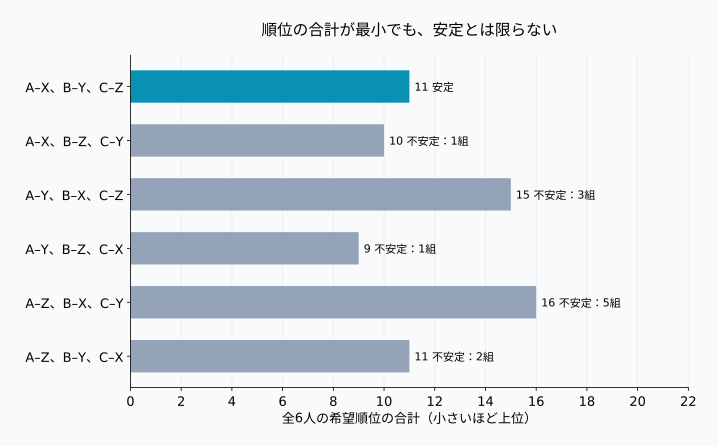
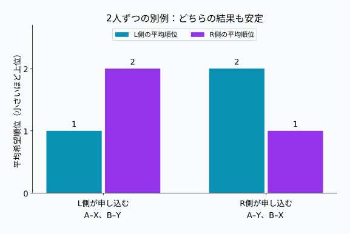

## 1. 希望を集めるだけでは、組み合わせは決まらない

学校の研究プロジェクトで、学生と指導担当者を1対1で組み合わせる場面を想像してください。学生には「この人に教わりたい」という希望があり、担当者にも「この学生を指導したい」という希望があります。全員に希望順位を書いてもらえば、うまく割り当てられそうです。

ところが、人気の担当者に希望が集中したり、学生が望む相手と相手側の希望が食い違ったりします。誰かの第1希望をかなえると、別の誰かは諦めなければなりません。そもそも「うまく組み合わせる」とは、何を達成することでしょうか。

この問いに、はっきりした基準を与えるのが**[安定結婚問題](https://kenji.blog/p/stable-marriage-problem/)**です。名前には結婚とありますが、数学的な核心は「希望を持つ二つのグループの間で、1対1の組を作ること」。この記事では性別や結婚生活の話から離れ、A・B・CとX・Y・Zという記号を使います。

結論を先に言うと、ここでの「安定」は、全員が大満足することではありません。**今の相手よりも互いを好む、組になっていない2人が存在しないこと**です。この控えめに見える条件を、必ず実現する手順がゲール＝シャプレーのアルゴリズムです。

## 2. 「安定」を数式で定義する

### まず、モデルの約束をそろえる

二つのグループを $L$ と $R$ とし、それぞれに $n$ 人いるとします。各人は反対側の全員について、1位から $n$ 位まで重複なく順位を付けます。以下では、希望順位は途中で変わらず、同順位はなく、全員が「相手なし」よりも誰かと組むことを望むとします。

この条件は大切です。「誰とも組まないほうがよい相手がいる」「定員が複数ある」「同順位がある」といった現実的な事情は、後でモデルを拡張して扱います。まずはルールを絞って、仕組みが働く理由をつかみましょう。

組み合わせを $M$ と書き、$M(a)$ を $a$ の相手とします。$r_a(b)$ は、$a$ が $b$ に付けた順位です。数字が小さいほど、好ましい相手です。

組になっていない $a\in L$ と $b\in R$ が、次の二つを同時に満たすとします。

$$
r_a(b)\lt r_a(M(a))
\quad\text{and}\quad
r_b(a)\lt r_b(M(b))
$$

つまり、$a$ は今の相手より $b$ を好み、$b$ も今の相手より $a$ を好んでいます。この2人を**ブロッキングペア**と呼びます。2人だけで合意すると、現在の割り当てから離れたくなる関係です。

$$
M\text{ is stable}
\iff
M\text{ has no blocking pair}
$$

片方だけの片思いは、ブロッキングペアではありません。また、元の相手が取り残されるとしても、2人が互いに乗り換えを望むなら該当します。社会全体にとってよい変更かどうかとは、別の判定なのです。

### 安定していても、不満は残る

たとえば第3希望の相手と組んだ人がいても、その人が好む第1・第2希望の相手が、どちらも今の組を望んでいるなら、そこからブロッキングペアは生まれません。**不満があることと、双方の合意による乗り換えが可能なことを区別する**のが、このモデルの要点です。

ここでいう安定は、申告された順位が固定されたときの数学的性質です。現実の人間関係が長続きすることや、全員が割り当てを納得して受け入れることまで保証する言葉ではありません。

## 3. 3人ずつの希望を、実際に組み合わせる

次の希望順位を考えます。左ほど希望が高く、たとえば $X\succ Y\succ Z$ は「Xが1位、Yが2位、Zが3位」です。この例は、以下の図と計算のために用意したものです。

| L側 | 1位 | 2位 | 3位 |
|---|---|---|---|
| A | X | Y | Z |
| B | Y | Z | X |
| C | X | Y | Z |

| R側 | 1位 | 2位 | 3位 |
|---|---|---|---|
| X | A | C | B |
| Y | A | B | C |
| Z | B | A | C |

AとCの第1希望は、どちらもXです。Xは1人としか組めないので、この時点でL側全員の第1希望をかなえることは不可能です。それでも、安定した割り当ては見つかります。

まず、A–Y、B–Z、C–Xという組を見てみましょう。Aは第2希望、Bも第2希望、Cは第1希望です。かなりよさそうですが、AはYよりXを好み、XもCよりAを好みます。したがって、AとXがブロッキングペアです。



図の実線は現在の組、オレンジの破線はAとXの乗り換え候補です。線が交差するかどうかは安定性に関係ありません。判定に必要なのは、線の形ではなく、両端の人の希望順位です。

## 4. ゲール＝シャプレーの手順：「承諾」を保留する

この問題の基本的な解法は、1962年のゲールとシャプレーの論文で示されました。**受入保留方式**とも呼ばれ、英語では deferred acceptance といいます。考え方の中心は、申し込みを受けても、その場で最終決定しないことです。[原論文](https://www.math.utoronto.ca/mccann/assignments/477/GaleShapley62.pdf)

ここではL側が申し込み、R側が申し込みを受けます。

1. まだ相手が決まっていないL側の1人が、未申し込みの中で最も希望の高い相手に申し込む。
2. R側は、新しい申し込みと現在保留している相手を比べ、最も好きな1人だけを保留する。
3. 選ばれなかった人は、次の希望先へ進む。
4. L側全員が保留されるまで繰り返し、最後に保留中の組を確定する。

保留は、相手を後から変更してよいという意味です。ただし、好きでない相手へ変更することはありません。R側は、それまでに申し込んできた人の中で、常に最も好きな人を残します。

### 5回の申し込みを追いかける

保留の入れ替わりが見えるように、最初はC、次にB、次にAの順に申し込ませます。

| 回 | 申し込み | 受け手の判断 | その後の保留 |
|---|---|---|---|
| 1 | C → X | Xは空いているのでCを保留 | C–X |
| 2 | B → Y | Yは空いているのでBを保留 | C–X、B–Y |
| 3 | A → X | XはCよりAを好むので入れ替え | A–X、B–Y |
| 4 | C → Y | YはCよりBを好むのでCを断る | A–X、B–Y |
| 5 | C → Z | Zは空いているのでCを保留 | A–X、B–Y、C–Z |

最終結果は、A–X、B–Y、C–Zです。Cは第3希望になりましたが、XはCよりAを、YはCよりBを好みます。Cが希望する相手との双方合意は成り立ちません。AとBは第1希望なので、ほかの相手へ乗り換える理由がありません。これで、ブロッキングペアがないと確認できます。

「先着順で確定」にすると、最初のC–Xが固定され、後からAが来ても見直せません。するとAとXが互いを望む状態を残す可能性があります。保留する仕組みは、こうした問題を避けるための重要な工夫です。

## 5. なぜ必ず止まり、安定した結果になるのか

### 申し込みは、多くても二乗回

L側の各人は、同じ相手に二度申し込みません。申し込み先は $n$ 人で、申し込む人も $n$ 人です。したがって、申し込みの総数 $P$ は次の範囲に収まります。

$$
P\leq n\times n=n^2
$$

これは余裕のある上限で、いつも $n^2$ 回かかるという意味ではありません。今回なら $n=3$ に対して5回です。希望表を順位の辞書にしておき、2人の比較を一定時間で行えば、計算時間は $O(n^2)$ です。入力の希望表自体も、両側合わせて $2n^2$ 個の順位を持ちます。

終了時に誰かが余ることもありません。仮に、相手のいないL側の人が全員に申し込んだなら、R側全員が少なくとも一度は申し込みを受けています。受け手は一度保留した後、誰かを保留し続けるので、R側全員に相手がいるはずです。同人数なのにL側だけ1人余ることになり、矛盾します。

### 「乗り換えたい2人」が残らない理由

最終結果に、ブロッキングペア $a,b$ があると仮定しましょう。$a$ が今の相手より $b$ を好むなら、希望順に申し込む手順上、$a$ は今の相手に到達する前に $b$ に申し込んでいるはずです。

それでも2人が組にならなかったのは、$b$ がその場で $a$ を断ったか、後からもっと好みの相手へ保留を切り替えたからです。そして、$b$ が保留する相手は、時間とともに同じか、より好ましい人にしかなりません。

したがって、最終的な $b$ の相手は、$a$ より好ましい人です。これは「$b$ も今の相手より $a$ を好む」という仮定と矛盾します。よって、ブロッキングペアは存在しません。

難しい探索で全候補を調べなくても、**断る理由が後から覆らない**という性質が、全体の安定性につながっているのです。

## 6. [グラフ](https://kenji.blog/p/tree-graph-data-structures-search-dfs-bfs-dijkstra/)で見る「安定」と「満足」の違い

ここで、希望順位を合計して比較してみます。全員の順位の合計を $S(M)$ とします。

$$
S(M)=\sum_{a\in L}r_a(M(a))
      +\sum_{b\in R}r_b(M(b))
$$

小さいほど、全体として上位の相手と組めている指標です。ただし、順位は幸福の量そのものではありません。1位と2位の差が、2位と3位の差と同じ大きさとは限らず、人ごとの重みも表していません。ここでは違いを見えるようにするための、単純な集計値として使います。

3人ずつなら、完全な組み合わせは $3!=6$ 通りです。すべて調べると、次のようになります。

| 組み合わせ | L側の順位合計 | R側の順位合計 | 全員の合計 | ブロッキングペアの数 |
|---|---:|---:|---:|---:|
| A–X、B–Y、C–Z | 5 | 6 | 11 | 0 |
| A–X、B–Z、C–Y | 5 | 5 | 10 | 1 |
| A–Y、B–X、C–Z | 8 | 7 | 15 | 3 |
| A–Y、B–Z、C–X | 5 | 4 | 9 | 1 |
| A–Z、B–X、C–Y | 8 | 8 | 16 | 5 |
| A–Z、B–Y、C–X | 5 | 6 | 11 | 2 |



順位の合計が最も小さいのは、先ほど見たA–Y、B–Z、C–Xで、値は9です。しかし、AとXが互いに乗り換えを望みます。一方、ゲール＝シャプレーで得た結果は合計11で、この例では唯一の安定な組み合わせです。

つまり、**順位合計の最小化と、ブロッキングペアの解消は、異なる目的**です。合計11という数字だけでも、安定性は判定できません。表の最初と最後は同じ11ですが、一方は安定、もう一方には2組のブロッキングペアがあります。

「全員が満足」の意味も、先に決める必要があります。全員が第1希望なら非常に強い条件です。全員が第2希望以内、最も不利な人の順位をできるだけよくする、左右の平均順位を近づける、といった基準も考えられます。どれも、安定性とは別の問いです。

## 7. 申し込む側を変えると、結果も変わる

もう一つ、2人ずつの小さな例を見ます。ここからの希望表は、前の3人の例とは別です。

| 人 | 1位 | 2位 |
|---|---|---|
| A | X | Y |
| B | Y | X |
| X | B | A |
| Y | A | B |

L側が申し込むと、A–X、B–Yになります。AとBはどちらも第1希望で、XとYはどちらも第2希望です。それでも、AもBも変更を望まないので安定です。

反対に、R側が申し込むと、A–Y、B–Xになります。今度はXとYが第1希望で、AとBが第2希望です。こちらも安定です。同じ希望表から、二つの安定解が生まれました。



同順位のない基本モデルでは、ゲール＝シャプレーの結果は、**安定な組み合わせの中で、申し込み側の各人にとって最もよい相手**を与えます。「申し込み側最適」と呼ばれる性質です。ここでの比較対象は、あくまで安定解です。どんな組み合わせでもよいという条件での第1希望を保証するものではありません。[原論文の最適性の定理](https://www.math.utoronto.ca/mccann/assignments/477/GaleShapley62.pdf)

さらに、基本モデルでは受け手側の各人にとって、安定解の中で最も希望順位の低い相手になります。手順が単純でも、どちら側を申し込み側にするかは中立な設計判断ではありません。同じ申し込み側を固定すれば、未確定の人を処理する順番を変えても最終結果は同じですが、役割自体を反転すると結果が変わり得るのです。

## 8. Pythonで手順と安定性を確かめる

次のコードは、3人ずつの例をそのまま実行します。`deque` は先頭から人を取り出せる待ち行列で、断られた人は末尾に並び直します。受け手の希望はあらかじめ辞書に変換し、順位をすぐに比較できるようにしています。

```python
from collections import deque

left = {"A": ["X", "Y", "Z"],
        "B": ["Y", "Z", "X"],
        "C": ["X", "Y", "Z"]}
right = {"X": ["A", "C", "B"],
         "Y": ["A", "B", "C"],
         "Z": ["B", "A", "C"]}

def gale_shapley(proposers, receivers, order=None):
    rank = {b: {a: i for i, a in enumerate(prefs)}
            for b, prefs in receivers.items()}
    free = deque(proposers if order is None else order)
    next_choice = {a: 0 for a in proposers}
    held = {}
    proposals = 0
    while free:
        a = free.popleft()
        b = proposers[a][next_choice[a]]
        next_choice[a] += 1
        proposals += 1
        if b not in held:
            held[b] = a
        elif rank[b][a] < rank[b][held[b]]:
            free.append(held[b])
            held[b] = a
        else:
            free.append(a)
    return {a: b for b, a in held.items()}, proposals

def blocking_pairs(match, left, right):
    inverse = {b: a for a, b in match.items()}
    return [(a, b) for a in left for b in right
            if left[a].index(b) < left[a].index(match[a])
            and right[b].index(a) < right[b].index(inverse[b])]

match, count = gale_shapley(left, right, ["C", "B", "A"])
print("組み合わせ:", sorted(match.items()))
print("申し込み回数:", count)
print("ブロッキングペア:", blocking_pairs(match, left, right))
```

出力は次のとおりです。

```text
組み合わせ: [('A', 'X'), ('B', 'Y'), ('C', 'Z')]
申し込み回数: 5
ブロッキングペア: []
```

空のリストは、乗り換えを互いに望む2人が見つからないことを意味します。`match` を `{"A": "Y", "B": "Z", "C": "X"}` に置き換えて検査すると、`[('A', 'X')]` が返ります。

この実装は、同人数・完全な希望表・同順位なしという前提の教材です。入力検証や、希望表にない相手の扱いは省略しています。また、検査関数は読みやすさを優先してリストの `.index()` を使うので $O(n^3)$ です。先に説明した $O(n^2)$ は、順位を辞書化したマッチング本体の計算量であり、この検査関数を含めた値ではありません。

図と全6通りの数値は、[再現用Pythonスクリプト](generate_graphs.py)で生成しています。[計算結果のJSON](calculation-results.json)も参照できます。希望順位を少し変えて、安定解の数や、申し込み側を変えたときの差を調べると理解が深まります。

## 9. 現実の割り当てへ進む前に

この考え方は、学生と学校、応募者と受け入れ先のように、双方の希望や優先順位がある割り当てを考える出発点になります。ただし、実際の制度は1対1の基本モデルより複雑です。

たとえば受け入れ先に定員があるなら、1人だけでなく定員まで候補を保留する拡張が考えられます。ただし、個人の順位に従って上位の候補を選ぶという前提と、「この2人を同時に受け入れたい」という集団への希望では、問題の性質が変わります。

相手を希望表から外せるなら、無理に全員を組ませず、未割り当てを許す必要があります。同順位を認めるなら、片方が同程度に好む乗り換えをどう扱うかによって「安定」の定義も分かれます。人数、定員、許容できる相手を変えたのに、基本モデルの保証だけをそのまま持ち込むことはできません。

また、入力した希望表が本人の本当の希望と一致するかも、制度設計では重要です。計算結果の安定性は、まず入力された順位に対して判定されます。選択肢の情報が不足していたり、順位の付け方に制約があったりすれば、出力だけを見て満足を判断するのは難しくなります。

数学が教えてくれるのは、目標と前提を明確にしたとき、何を保証できるかです。「アルゴリズムで決めたから公平」と済ませず、誰の希望を重視し、何を安定と呼ぶのかを説明することが必要になります。

## 10. まとめ：壊れにくさと、うれしさを分けて考える

[安定結婚問題](https://kenji.blog/p/stable-marriage-problem/)は、希望がぶつかる状況に対して「双方が乗り換えを望む2人を残さない」という基準を与えます。ゲール＝シャプレーのアルゴリズムは、申し込みと保留を繰り返すだけで、この基準を満たします。

覚えておきたい点は、次の三つです。

- **安定は全員の第1希望を意味しない。** 不満があっても、相手側が乗り換えを望まなければ安定である。
- **安定は順位合計の最小化とも違う。** 具体例では、合計9の組が不安定で、合計11の組が唯一の安定解だった。
- **申し込み側の選択が結果に影響する。** 安定解が複数あるとき、どちらの側から申し込むかは大切な設計事項である。

全員の希望をそのままかなえられないからこそ、何を実現したいのかを言葉と数式で区別する価値があります。[安定結婚問題](https://kenji.blog/p/stable-marriage-problem/)は、最適化の答えを出す前に、まず「よい組み合わせ」の意味を考えるための、身近で奥深い入口なのです。

### 参考文献

D. Gale and L. S. Shapley, “College Admissions and the Stability of Marriage,” *The American Mathematical Monthly*, 69(1), 9–15, 1962. [原論文PDF](https://www.math.utoronto.ca/mccann/assignments/477/GaleShapley62.pdf)。基本モデルの定義、受入保留方式、安定性と申し込み側最適性の原典です。本記事の3人の例・比較表・図は独自に計算しています。
