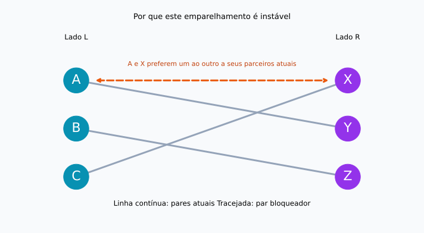
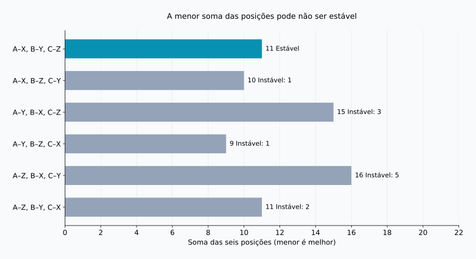
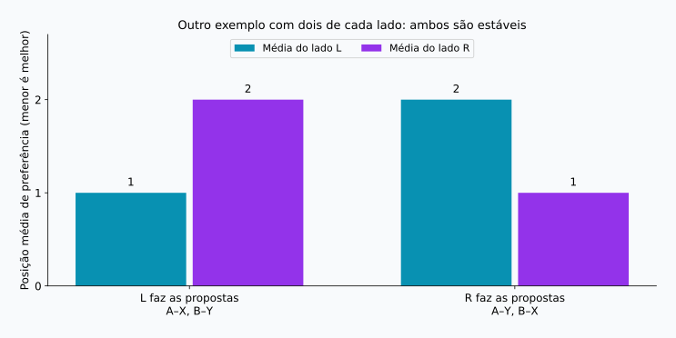

## 1. Reunir preferências não resolve tudo

Imagine distribuir estudantes entre orientadores de pesquisa, com um estudante para cada orientador. Os estudantes têm preferências sobre com quem aprender, e os orientadores também têm preferências sobre quem orientar. Pedir uma lista ordenada a cada pessoa parece um bom começo.

Mas várias pessoas podem escolher o mesmo orientador, e as preferências podem não ser recíprocas. Atender à primeira opção de alguém pode impedir a de outra pessoa. O que uma “boa” distribuição deve alcançar?

O **problema do casamento estável** oferece um critério preciso. Apesar do nome, seu núcleo matemático é o emparelhamento um a um entre dois grupos. Usaremos A, B, C e X, Y, Z, sem pressupor gêneros nem descrever casamentos reais.

**Estável não quer dizer que todos ficam felizes.** Quer dizer que não há duas pessoas que, embora não estejam juntas, prefiram uma à outra a seus parceiros atuais. O algoritmo de Gale–Shapley garante essa condição no modelo a seguir.

## 2. O significado matemático de estabilidade

Considere grupos $L$ e $R$ com $n$ pessoas cada. Cada pessoa classifica todos os membros do outro grupo de 1 a $n$, sem empates. As preferências são fixas, e qualquer parceiro é considerado melhor do que ficar sem par.

Parceiros inaceitáveis, várias vagas e empates exigem extensões. Começar com regras simples ajuda a entender o mecanismo.

Em um emparelhamento $M$, $M(a)$ é o parceiro de $a$, e $r_a(b)$ é a posição que $a$ atribui a $b$. Números menores indicam maior preferência. Duas pessoas não emparelhadas entre si, $a\in L$ e $b\in R$, formam um **par bloqueador** quando:

$$
r_a(b)\lt r_a(M(a))
\quad\land\quad
r_b(a)\lt r_b(M(b))
$$

As duas preferem trocar de parceiro para ficar juntas. Se $\mathcal{B}(M)$ representa o conjunto desses pares, a estabilidade equivale a:

$$
\mathcal{B}(M)=\varnothing
$$

Um desejo unilateral não basta. Por outro lado, o par bloqueia mesmo que a mudança prejudique seus parceiros anteriores. O benefício total para o grupo é outra questão.

Alguém pode receber sua terceira opção sem criar um par bloqueador: suas duas opções superiores podem preferir os parceiros atuais. **Insatisfação e possibilidade de uma troca desejada por ambos são coisas diferentes.** A estabilidade se refere às listas declaradas e fixas, não garante relações duradouras nem concordância de todos com o resultado.

## 3. Um exemplo com três pessoas de cada lado

$X\succ Y\succ Z$ significa que X é preferido a Y, que é preferido a Z. As listas abaixo foram construídas para os cálculos deste artigo.

| Lado L | 1ª | 2ª | 3ª |
| --- | --- | --- | --- |
| A | X | Y | Z |
| B | Y | Z | X |
| C | X | Y | Z |

| Lado R | 1ª | 2ª | 3ª |
| --- | --- | --- | --- |
| X | A | C | B |
| Y | A | B | C |
| Z | B | A | C |

A e C colocam X em primeiro lugar. Como X só pode ter um par, é impossível atender a todas as primeiras opções de L. Ainda assim, pode existir um emparelhamento estável.

Considere A–Y, B–Z, C–X. A e B recebem a segunda opção; C, a primeira. Parece bom, mas A prefere X a Y, e X prefere A a C. Logo, A e X formam um par bloqueador.



As linhas contínuas mostram os pares atuais; a linha laranja tracejada mostra a possível troca. Cruzamentos no desenho não determinam estabilidade: o que importa são as preferências nas duas pontas.

## 4. Gale–Shapley: adiar a aceitação definitiva

O método foi apresentado por Gale e Shapley em 1962. É chamado de **aceitação diferida**: receber uma proposta não significa assumir um compromisso definitivo imediatamente. [Artigo original](https://www.math.utoronto.ca/mccann/assignments/477/GaleShapley62.pdf)

L faz as propostas e R as recebe.

1. Uma pessoa de L sem par propõe à sua opção favorita entre aquelas ainda não procuradas.
2. Quem recebe compara a nova proposta com o parceiro provisório, se houver, e mantém apenas a pessoa preferida.
3. Quem foi rejeitado passa à próxima opção.
4. Quando todos em L estão provisoriamente aceitos, os pares são confirmados.

O parceiro provisório pode mudar, mas apenas para alguém melhor classificado. Cada receptor mantém sua melhor proposta recebida até aquele momento.

### Acompanhe cinco propostas

Começamos na ordem C, B, A para tornar visível uma substituição.

| Etapa | Proposta | Decisão | Pares provisórios |
| --- | --- | --- | --- |
| 1 | C → X | X está livre e mantém C | C–X |
| 2 | B → Y | Y está livre e mantém B | C–X, B–Y |
| 3 | A → X | X prefere A e substitui C | A–X, B–Y |
| 4 | C → Y | Y prefere B e rejeita C | A–X, B–Y |
| 5 | C → Z | Z está livre e mantém C | A–X, B–Y, C–Z |

O resultado é A–X, B–Y, C–Z. C recebe a terceira opção, mas X prefere A a C e Y prefere B a C. Nenhuma alternativa melhor aceita a troca. A e B já têm suas primeiras opções: não há pares bloqueadores.

Se a aceitação fosse definitiva por ordem de chegada, C–X ficaria fixado antes da chegada de A. A e X poderiam continuar preferindo um ao outro. A aceitação provisória evita esse problema.

## 5. Por que o algoritmo termina e é estável

Ninguém propõe duas vezes à mesma pessoa. Com $n$ proponentes e $n$ receptores, o total de propostas $P$ satisfaz:

$$
P\leq n\times n=n^2
$$

Essa é uma cota superior, não o total exato de toda execução. O exemplo usa cinco propostas para $n=3$. Com posições armazenadas em dicionários para comparações em tempo constante, a complexidade é $O(n^2)$. As listas de entrada contêm $2n^2$ posições.

Ninguém pode ficar sem par ao final. Se uma pessoa livre tivesse esgotado a lista, todos os receptores teriam recebido propostas. Depois de manter alguém, um receptor nunca volta a ficar vazio, mesmo ao substituir a pessoa. Os $n$ receptores teriam, portanto, parceiros distintos, contradizendo a existência de uma pessoa livre entre os $n$ proponentes.

Suponha que o resultado contenha um par bloqueador $a,b$. Como $a$ prefere $b$ ao parceiro final, deve ter proposto a $b$ antes. Se não ficaram juntos, $b$ rejeitou $a$ ou depois o substituiu por uma pessoa preferida. A escolha provisória de $b$ só melhora, então o parceiro final também é preferido a $a$. Isso contradiz o desejo de troca. O motivo da rejeição não se inverte; não é preciso testar todas as combinações.

## 6. Estabilidade e satisfação são objetivos distintos

Vamos somar as posições dos parceiros atribuídos a todas as pessoas:

$$
S(M)=\sum_{a\in L}r_a(M(a))
      +\sum_{b\in R}r_b(M(b))
$$

Um valor menor indica posições melhores no conjunto, mas não mede felicidade. A distância entre primeira e segunda opção pode ser diferente da distância entre segunda e terceira, e a intensidade das preferências varia entre pessoas. A soma serve apenas como indicador ilustrativo.

Existem $3!=6$ emparelhamentos completos:

| Emparelhamento | Soma de L | Soma de R | Total | Pares bloqueadores |
| --- | --- | --- | --- | --- |
| A–X, B–Y, C–Z | 5 | 6 | 11 | 0 |
| A–X, B–Z, C–Y | 5 | 5 | 10 | 1 |
| A–Y, B–X, C–Z | 8 | 7 | 15 | 3 |
| A–Y, B–Z, C–X | 5 | 4 | 9 | 1 |
| A–Z, B–X, C–Y | 8 | 8 | 16 | 5 |
| A–Z, B–Y, C–X | 5 | 6 | 11 | 2 |



O mínimo, 9, corresponde a A–Y, B–Z, C–X, bloqueado por A e X. O resultado de Gale–Shapley soma 11 e é o único estável neste exemplo. **Minimizar a soma e eliminar pares bloqueadores são problemas diferentes.**

As linhas inicial e final somam 11, mas a última tem dois pares bloqueadores. O valor não basta para identificar estabilidade. “Todos satisfeitos” pode significar primeiras opções para todos, ficar entre as duas primeiras, melhorar a pior posição ou aproximar as médias dos lados. São critérios distintos da estabilidade.

## 7. Mudar quem propõe pode mudar o resultado

Agora usamos outro exemplo, com duas pessoas por lado e novas preferências:

| Pessoa | 1ª | 2ª |
| --- | --- | --- |
| A | X | Y |
| B | Y | X |
| X | B | A |
| Y | A | B |

Se L propõe, temos A–X, B–Y: primeiras opções para L e segundas para R. É estável porque A e B não querem mudar. Se R propõe, temos A–Y, B–X: primeiras opções para R e segundas para L. Também é estável.



Com preferências estritas, Gale–Shapley dá a **cada proponente seu melhor parceiro entre todos os emparelhamentos estáveis**. É a optimalidade para o lado proponente. A comparação não inclui soluções instáveis, portanto não garante uma primeira opção irrestrita. [Teorema original](https://www.math.utoronto.ca/mccann/assignments/477/GaleShapley62.pdf)

Nesse modelo, cada receptor obtém seu parceiro menos preferido entre as soluções estáveis. Escolher o lado proponente é uma decisão relevante. Fixado esse lado, mudar a ordem de processamento das pessoas livres não muda o resultado final; inverter os papéis pode mudar.

## 8. Verificando com Python

O código executa o exemplo de três pessoas por lado. `deque` implementa uma fila; pessoas rejeitadas voltam ao final. As listas dos receptores viram dicionários para comparar posições rapidamente.

```python
from collections import deque

left = {"A": ["X", "Y", "Z"],
        "B": ["Y", "Z", "X"],
        "C": ["X", "Y", "Z"]}
right = {"X": ["A", "C", "B"],
         "Y": ["A", "B", "C"],
         "Z": ["B", "A", "C"]}

def gale_shapley(proposers, receivers, order=None):
    rank = {b: {a: i for i, a in enumerate(prefs)}
            for b, prefs in receivers.items()}
    free = deque(proposers if order is None else order)
    next_choice = {a: 0 for a in proposers}
    held = {}
    proposals = 0
    while free:
        a = free.popleft()
        b = proposers[a][next_choice[a]]
        next_choice[a] += 1
        proposals += 1
        if b not in held:
            held[b] = a
        elif rank[b][a] < rank[b][held[b]]:
            free.append(held[b])
            held[b] = a
        else:
            free.append(a)
    return {a: b for b, a in held.items()}, proposals

def blocking_pairs(match, left, right):
    inverse = {b: a for a, b in match.items()}
    return [(a, b) for a in left for b in right
            if left[a].index(b) < left[a].index(match[a])
            and right[b].index(a) < right[b].index(inverse[b])]

match, count = gale_shapley(left, right, ["C", "B", "A"])
print("Emparelhamento:", sorted(match.items()))
print("Número de propostas:", count)
print("Pares bloqueadores:", blocking_pairs(match, left, right))
```

```text
Emparelhamento: [('A', 'X'), ('B', 'Y'), ('C', 'Z')]
Número de propostas: 5
Pares bloqueadores: []
```

A lista vazia indica ausência de pares bloqueadores. Testar `{"A": "Y", "B": "Z", "C": "X"}` retorna `[('A', 'X')]`.

Esta implementação didática pressupõe grupos iguais, listas completas e ausência de empates. Não inclui validação das entradas nem parceiros inaceitáveis. O verificador usa `.index()` para facilitar a leitura e leva $O(n^3)$. A cota $O(n^2)$ vale para o algoritmo de emparelhamento, sem essa verificação adicional.

O [script de reprodução](generate_graphs.pt.py) gera as figuras e os seis resultados, também disponíveis em [JSON](calculation-results.pt.json). Experimente alterar preferências e observar quantas soluções estáveis existem ou o efeito de inverter o lado proponente.

## 9. Antes de uma aplicação real

Estudantes e instituições, ou candidatos e organizações, ilustram situações com preferências ou prioridades nos dois lados. Na prática, as regras costumam ser mais complexas.

Com várias vagas, um receptor pode manter candidatos até o limite de capacidade. Porém, escolher indivíduos pela classificação é diferente de preferir uma combinação específica de pessoas. Parceiros inaceitáveis exigem permitir participantes sem par. Empates geram definições distintas de estabilidade conforme o tratamento da indiferença. Mudanças nessas regras exigem reexaminar as garantias.

Também importa se as listas declaradas refletem os desejos verdadeiros. A estabilidade é avaliada inicialmente em relação às listas recebidas. Falta de informação ou restrições de classificação podem impedir que se deduza satisfação apenas do resultado. A matemática esclarece garantias sob hipóteses; uma decisão não é justa apenas porque veio de um algoritmo.

## 10. Conclusão: separar estabilidade de felicidade

Gale–Shapley combina propostas e aceitação provisória para impedir uma troca mutuamente desejada por duas pessoas não emparelhadas.

- **Estável não significa primeira opção para todos.** Pode haver insatisfação sem uma troca acordada.
- **Estável não significa soma mínima.** O mínimo do exemplo é 9; a única solução estável soma 11.
- **O lado proponente importa.** Soluções estáveis diferentes podem favorecer lados diferentes.

Quando não é possível realizar todos os desejos, definir o objetivo fica ainda mais importante. Antes de otimizar, precisamos esclarecer o significado de uma “boa” combinação.

### Referência

D. Gale e L. S. Shapley, “College Admissions and the Stability of Marriage”, *The American Mathematical Monthly*, 69(1), 9–15, 1962. [PDF](https://www.math.utoronto.ca/mccann/assignments/477/GaleShapley62.pdf). Fonte original do modelo, da aceitação diferida e da optimalidade. O exemplo de três pessoas por lado, as tabelas e as figuras foram calculados independentemente.

