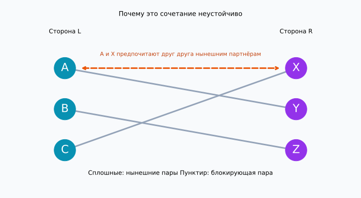
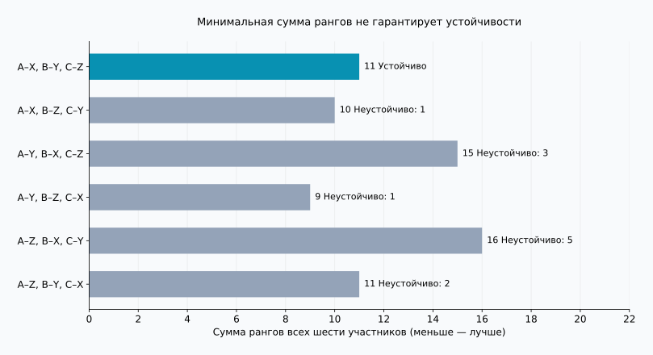
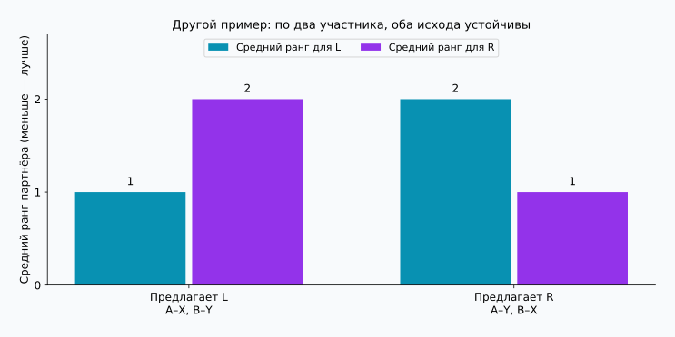

## 1. Собрать пожелания недостаточно

Представьте распределение студентов по научным руководителям: каждому руководителю достаётся один студент. У студентов есть предпочтения, и у руководителей тоже. Кажется, достаточно попросить каждого составить список по порядку предпочтения.

Но несколько студентов могут выбрать одного руководителя, а симпатии не обязаны быть взаимными. Исполнение первого желания одного участника может помешать другому. Что вообще считать хорошим распределением?

**[Задача об устойчивых браках](https://kenji.blog/ru/p/stable-marriage-problem/)** предлагает точный критерий. Несмотря на название, её математическое содержание — взаимно однозначное сопоставление двух групп. Мы будем использовать A, B, C и X, Y, Z, не предполагая определённого пола и не описывая реальные браки.

**Устойчивость не означает всеобщего довольства.** Она означает отсутствие двух участников, не состоящих в одной паре, которые предпочли бы друг друга своим нынешним партнёрам. При следующих предположениях алгоритм Гейла — Шепли всегда обеспечивает это свойство.

## 2. Математическое определение устойчивости

Пусть в группах $L$ и $R$ по $n$ участников. Каждый ранжирует всех участников другой стороны от 1 до $n$, без равных мест. Предпочтения неизменны, а любой партнёр лучше отсутствия пары.

Неприемлемые партнёры, несколько мест и одинаковые ранги требуют расширений модели. Сначала разберём простой случай, чтобы понять механизм.

В сочетании $M$ обозначим партнёра участника $a$ через $M(a)$, а ранг, который $a$ присваивает $b$, через $r_a(b)$. Меньший ранг лучше. Не соединённые между собой $a\in L$ и $b\in R$ образуют **блокирующую пару**, если выполняются оба неравенства:

$$
r_a(b)\lt r_a(M(a))
\quad\land\quad
r_b(a)\lt r_b(M(b))
$$

Оба хотят уйти от нынешних партнёров друг к другу. Если $\mathcal{B}(M)$ — множество блокирующих пар, устойчивость равносильна условию:

$$
\mathcal{B}(M)=\varnothing
$$

Одностороннего желания недостаточно. Напротив, пара блокирует распределение даже тогда, когда смена ухудшит положение прежних партнёров. Польза для всего сообщества — отдельный вопрос.

Участник может получить третий выбор, а сочетание всё равно останется устойчивым: первые два выбора могут предпочитать своих нынешних партнёров. **Недовольство и возможность взаимно желанного перехода — разные вещи.** Устойчивость относится к фиксированным заявленным спискам, а не гарантирует длительность отношений или согласие всех с результатом.

## 3. Пример с тремя участниками на каждой стороне

$X\succ Y\succ Z$ означает, что X предпочтительнее Y, а Y предпочтительнее Z. Эти списки подготовлены для расчётов статьи.

| Сторона L | 1-е | 2-е | 3-е |
| --- | --- | --- | --- |
| A | X | Y | Z |
| B | Y | Z | X |
| C | X | Y | Z |

| Сторона R | 1-е | 2-е | 3-е |
| --- | --- | --- | --- |
| X | A | C | B |
| Y | A | B | C |
| Z | B | A | C |

A и C ставят X на первое место. У X может быть только один партнёр, поэтому все первые желания L исполнить невозможно. Тем не менее устойчивое сочетание существует.

Возьмём A–Y, B–Z, C–X. A и B получают второй выбор, C — первый. Но A предпочитает X участнику Y, а X предпочитает A участнику C. Значит, A и X образуют блокирующую пару.



Сплошные линии показывают нынешние пары, оранжевый пунктир — возможный переход. Пересечение линий не определяет устойчивость: важны предпочтения на их концах.

## 4. Гейл — Шепли: согласие пока предварительное

Гейл и Шепли представили метод в 1962 году. Его называют **алгоритмом отложенного согласия**: полученное предложение не требует немедленного окончательного решения. [Исходная статья](https://www.math.utoronto.ca/mccann/assignments/477/GaleShapley62.pdf)

Пусть L делает предложения, а R принимает их.

1. Свободный участник L обращается к наиболее желательному из тех, кому ещё не предлагал.
2. Получатель сравнивает нового кандидата с временным партнёром, если тот есть, и оставляет только предпочтительного.
3. Получившие отказ переходят к следующему выбору.
4. Когда все участники L временно приняты, пары становятся окончательными.

Временного партнёра можно заменить, но только на более желательного. Получатель всегда удерживает лучшее предложение из всех поступивших.

### Проследим пять предложений

Начнём в порядке C, B, A, чтобы увидеть замену временного партнёра.

| Шаг | Предложение | Решение | Временные пары |
| --- | --- | --- | --- |
| 1 | C → X | X свободен и временно выбирает C | C–X |
| 2 | B → Y | Y свободен и временно выбирает B | C–X, B–Y |
| 3 | A → X | X предпочитает A и заменяет C | A–X, B–Y |
| 4 | C → Y | Y предпочитает B и отклоняет C | A–X, B–Y |
| 5 | C → Z | Z свободен и временно выбирает C | A–X, B–Y, C–Z |

Получаем A–X, B–Y, C–Z. C достался третий выбор, но X предпочитает A участнику C, а Y предпочитает B. Ни одна лучшая для C альтернатива не согласна на переход. A и B уже имеют первый выбор, поэтому блокирующих пар нет.

При окончательном согласии по очереди поступления пара C–X закрепилась бы до появления A. Тогда A и X могли бы продолжать предпочитать друг друга. Предварительное согласие предотвращает такую ситуацию.

## 5. Почему алгоритм завершается устойчивым результатом

Никто не предлагает одному получателю дважды. При $n$ участниках с каждой стороны общее число предложений $P$ ограничено:

$$
P\leq n\times n=n^2
$$

Это верхняя граница, а не точное число для каждого запуска. В примере при $n=3$ достаточно пяти предложений. Если ранги заранее записаны в словари и сравнение занимает постоянное время, сложность равна $O(n^2)$. Сами входные списки содержат $2n^2$ элементов.

Никто не останется без пары после завершения. Если свободный участник исчерпал все варианты, каждый получатель уже получил предложение. Приняв кого-то временно, получатель больше не остаётся пустым, даже если меняет партнёра. Тогда все $n$ получателей имеют разных партнёров, что противоречит наличию свободного участника среди $n$ предлагающих.

Допустим, результат содержит блокирующую пару $a,b$. Раз $a$ предпочитает $b$ окончательному партнёру, предложение к $b$ должно было поступить раньше. Если пара не сохранилась, $b$ отказал сразу или заменил $a$ более предпочтительным кандидатом. Временная пара получателя только улучшается, поэтому окончательный партнёр $b$ лучше, чем $a$. Это противоречит желанию $b$ перейти к $a$. Причина отказа не обращается вспять; полный перебор не нужен.

## 6. Устойчивость и удовлетворённость — разные цели

Для сравнения просуммируем ранги назначенных партнёров всех участников:

$$
S(M)=\sum_{a\in L}r_a(M(a))
      +\sum_{b\in R}r_b(M(b))
$$

Меньшее число означает лучшие ранги в совокупности, но не измеряет счастье. Разница между первым и вторым местом может отличаться от разницы между вторым и третьим; сила предпочтений у людей тоже различна. Сумма служит лишь наглядным показателем.

Для трёх участников с каждой стороны существует $3!=6$ полных сочетаний:

| Сочетание | Сумма для L | Сумма для R | Всего | Блокирующие пары |
| --- | --- | --- | --- | --- |
| A–X, B–Y, C–Z | 5 | 6 | 11 | 0 |
| A–X, B–Z, C–Y | 5 | 5 | 10 | 1 |
| A–Y, B–X, C–Z | 8 | 7 | 15 | 3 |
| A–Y, B–Z, C–X | 5 | 4 | 9 | 1 |
| A–Z, B–X, C–Y | 8 | 8 | 16 | 5 |
| A–Z, B–Y, C–X | 5 | 6 | 11 | 2 |



Минимум 9 даёт A–Y, B–Z, C–X, но его блокируют A и X. Результат Гейла — Шепли имеет сумму 11 и здесь единственный устойчивый. **Минимизация суммы рангов и устранение блокирующих пар — разные задачи.**

Первая и последняя строки имеют одинаковую сумму 11, но в последней две блокирующие пары. Одного показателя недостаточно. «Все довольны» также может означать первые места для всех, попадание в первые два, улучшение худшего ранга или сближение средних двух сторон. Эти критерии не равны устойчивости.

## 7. Кто предлагает, тот может влиять на результат

Рассмотрим другой пример: по два участника и новые предпочтения.

| Участник | 1-е | 2-е |
| --- | --- | --- |
| A | X | Y |
| B | Y | X |
| X | B | A |
| Y | A | B |

Когда предлагает L, получаем A–X, B–Y: первые места для L, вторые для R. Это устойчиво, поскольку A и B не хотят меняться. Когда предлагает R, получаем A–Y, B–X: первые места для R, вторые для L. Этот результат тоже устойчив.



При строгих предпочтениях Гейл — Шепли даёт **каждому предлагающему лучшего партнёра среди всех устойчивых сочетаний**. Это оптимальность для предлагающей стороны. Сравнение ограничено устойчивыми решениями и не гарантирует первый выбор без ограничений. [Теорема исходной статьи](https://www.math.utoronto.ca/mccann/assignments/477/GaleShapley62.pdf)

При этом каждый получатель получает наименее предпочтительного партнёра среди устойчивых решений. Поэтому выбор предлагающей стороны — важное решение при проектировании. Если эта сторона фиксирована, порядок обработки свободных участников не меняет окончательное сочетание. Смена ролей может его изменить.

## 8. Проверка на Python

Код выполняет пример с тремя участниками на стороне. `deque` — очередь: получившие отказ возвращаются в конец. Списки получателей преобразуются в словари рангов для быстрых сравнений.

```python
from collections import deque

left = {"A": ["X", "Y", "Z"],
        "B": ["Y", "Z", "X"],
        "C": ["X", "Y", "Z"]}
right = {"X": ["A", "C", "B"],
         "Y": ["A", "B", "C"],
         "Z": ["B", "A", "C"]}

def gale_shapley(proposers, receivers, order=None):
    rank = {b: {a: i for i, a in enumerate(prefs)}
            for b, prefs in receivers.items()}
    free = deque(proposers if order is None else order)
    next_choice = {a: 0 for a in proposers}
    held = {}
    proposals = 0
    while free:
        a = free.popleft()
        b = proposers[a][next_choice[a]]
        next_choice[a] += 1
        proposals += 1
        if b not in held:
            held[b] = a
        elif rank[b][a] < rank[b][held[b]]:
            free.append(held[b])
            held[b] = a
        else:
            free.append(a)
    return {a: b for b, a in held.items()}, proposals

def blocking_pairs(match, left, right):
    inverse = {b: a for a, b in match.items()}
    return [(a, b) for a in left for b in right
            if left[a].index(b) < left[a].index(match[a])
            and right[b].index(a) < right[b].index(inverse[b])]

match, count = gale_shapley(left, right, ["C", "B", "A"])
print("Сочетание:", sorted(match.items()))
print("Число предложений:", count)
print("Блокирующие пары:", blocking_pairs(match, left, right))
```

```text
Сочетание: [('A', 'X'), ('B', 'Y'), ('C', 'Z')]
Число предложений: 5
Блокирующие пары: []
```

Пустой список означает отсутствие блокирующих пар. Проверка `{"A": "Y", "B": "Z", "C": "X"}` возвращает `[('A', 'X')]`.

Учебная реализация предполагает равные размеры групп, полные списки и отсутствие равных рангов. Проверка входных данных и неприемлемые партнёры не предусмотрены. Проверяющая функция использует `.index()` ради читаемости и требует $O(n^3)$. Граница $O(n^2)$ относится к самому алгоритму, без дополнительной проверки.

[Скрипт воспроизведения](generate_graphs.ru.py) строит рисунки и рассчитывает шесть исходов; значения доступны в [JSON](calculation-results.ru.json). Измените список и посмотрите, как меняется число устойчивых решений или эффект смены предлагающей стороны.

## 9. Перед применением в реальном распределении

Студенты и учебные заведения, кандидаты и принимающие организации — примеры двусторонних предпочтений или приоритетов. На практике правила сложнее.

Получатель с несколькими местами может временно удерживать несколько кандидатов в пределах квоты. Но выбирать лучших отдельных людей по списку — не то же самое, что предпочитать определённую группу целиком. Неприемлемые партнёры требуют разрешить отсутствие назначения. Равные ранги приводят к разным определениям устойчивости в зависимости от роли безразличия. При изменении правил гарантии надо проверять заново.

Важно и то, совпадают ли заявленные предпочтения с настоящими. Устойчивость сначала оценивается относительно поданных списков. Нехватка информации или ограничения на ранжирование мешают судить об удовлетворённости по одному результату. Математика уточняет гарантии при заданных предпосылках; решение не становится справедливым просто потому, что его вычислил алгоритм.

## 10. Итог: отличать устойчивость от счастья

Предложения и предварительное согласие в алгоритме Гейла — Шепли исключают взаимно желанный переход двух участников, не соединённых в пару.

- **Устойчивость не означает первый выбор для всех.** Недовольство может сохраняться без согласованного перехода.
- **Устойчивость не означает минимальную сумму.** Минимум примера равен 9, единственный устойчивый исход — 11.
- **Предлагающая сторона важна.** Разные устойчивые решения могут быть выгодны разным сторонам.

Когда все желания выполнить нельзя, особенно важно точно сформулировать цель. Прежде чем оптимизировать, определим, что считать хорошим сочетанием.

### Источник

D. Gale and L. S. Shapley, “College Admissions and the Stability of Marriage”, *The American Mathematical Monthly*, 69(1), 9–15, 1962. [PDF](https://www.math.utoronto.ca/mccann/assignments/477/GaleShapley62.pdf). Первоисточник модели, отложенного согласия и оптимальности. Пример с тремя участниками на стороне, таблицы и рисунки рассчитаны независимо.
