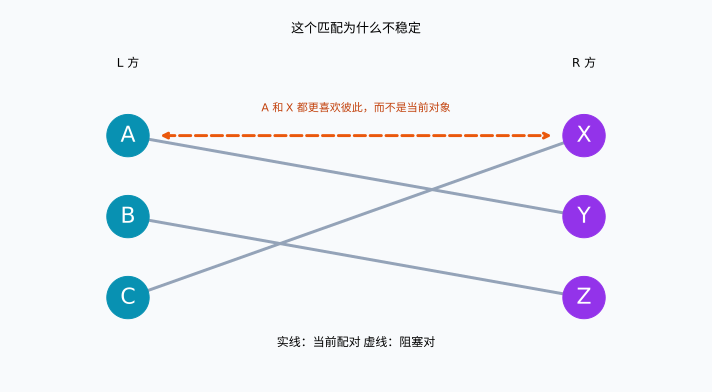
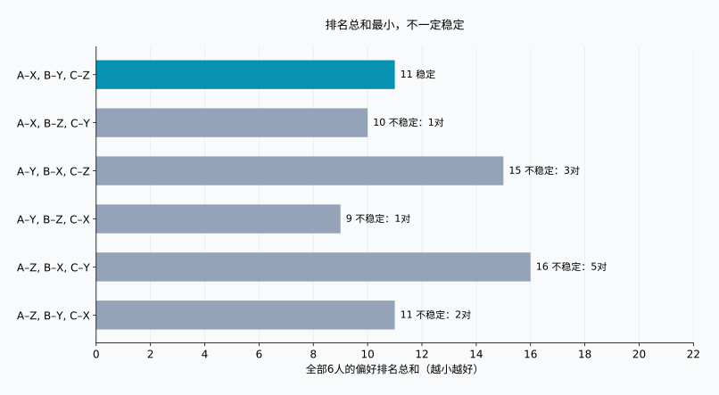
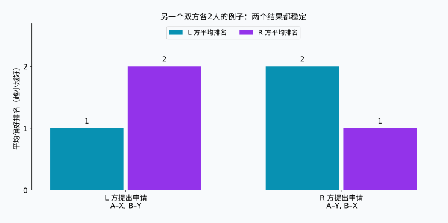

## 1. 收集志愿，并不等于完成匹配

想象一个研究项目，需要把学生与指导老师一对一配对。学生有想跟随的老师，老师也有想指导的学生。让每个人提交一份志愿排名，看起来就能安排好。

但多名学生可能同时选择同一位老师，而且双方的意愿未必一致。满足一个人的第一志愿，可能意味着另一个人必须让步。那么，怎样才算“好的安排”？

**[稳定婚姻问题](https://kenji.blog/p/stable-marriage-problem/)**为此提供了一个明确标准。虽然名字中有“婚姻”，数学上的核心却是两个具有偏好的群体之间的一对一匹配。本文使用 A、B、C 与 X、Y、Z，不预设性别，也不讨论真实婚姻关系。

**稳定并不意味着所有人都非常满意。** 它意味着：不存在尚未配成一对、却都更喜欢彼此而不是当前对象的两个人。在以下假设下，盖尔–沙普利算法总能实现这一点。

## 2. 用数学定义“稳定”

### 先明确模型的前提

设两个群体为 $L$ 和 $R$，各有 $n$ 人。每个人给对方群体的所有人排出第1到第 $n$ 名，不允许并列。偏好在过程中保持不变，而且每个人都认为，与任何对象匹配都比没有对象更好。

这些假设很重要。如果存在无法接受的对象、多个名额或并列排名，就需要扩展模型。先用简单规则理解机制，再讨论现实的复杂性。

用 $M$ 表示匹配，$M(a)$ 表示 $a$ 的对象，$r_a(b)$ 表示 $a$ 给 $b$ 的排名。数字越小，越受偏爱。未配成一对的 $a\in L$ 和 $b\in R$ 若同时满足下列不等式，就称为一个**阻塞对**：

$$
r_a(b)\lt r_a(M(a))
\quad\land\quad
r_b(a)\lt r_b(M(b))
$$

也就是说，两个人都愿意离开当前对象，转而选择彼此。若 $\mathcal{B}(M)$ 表示所有阻塞对的集合，那么匹配稳定当且仅当：

$$
\mathcal{B}(M)=\varnothing
$$

只有单方面喜欢还不够。反过来，即使换对象会让原来的伙伴受损，只要双方都想换，仍然构成阻塞对。这次变化是否有利于整个群体，是另一个问题。

### 稳定的结果也可能有人不满

一个人即使只能得到第三志愿，只要他的前两名对象都更喜欢各自当前的伙伴，就不会因此产生阻塞对。**存在不满，与能够达成双方都愿意的更换，是不同的事情。** 稳定性是针对固定、已申报排名的数学性质，不保证现实关系长久，也不保证每个人都认可结果。

## 3. 双方各三人的具体例子

$X\succ Y\succ Z$ 表示依次更喜欢 X、Y、Z。下列偏好专门用于本文的计算和图示。

| L 方 | 第1志愿 | 第2志愿 | 第3志愿 |
| --- | --- | --- | --- |
| A | X | Y | Z |
| B | Y | Z | X |
| C | X | Y | Z |

| R 方 | 第1志愿 | 第2志愿 | 第3志愿 |
| --- | --- | --- | --- |
| X | A | C | B |
| Y | A | B | C |
| Z | B | A | C |

A 和 C 都把 X 排在第一位。X 只能选择一个人，因此让 L 方所有人得到第一志愿已经不可能，但稳定匹配仍然存在。

先看 A–Y、B–Z、C–X。A 和 B 得到第二志愿，C 得到第一志愿，似乎不错。然而，A 比起 Y 更喜欢 X，X 比起 C 更喜欢 A。因此 A 和 X 构成阻塞对。



实线表示当前配对，橙色虚线表示双方愿意进行的更换。线条是否交叉与稳定性无关；决定结果的是两端参与者的偏好。

## 4. 盖尔–沙普利：先暂留，最后再确定

盖尔和沙普利在1962年的论文中提出了这一方法。它也称为**延迟接受算法**：收到申请时，不立即做不可更改的最终决定。[原始论文](https://www.math.utoronto.ca/mccann/assignments/477/GaleShapley62.pdf)

这里让 L 方申请，R 方接收申请。

1. L 方尚无对象的人，向尚未申请过的对象中最喜欢的一位提出申请。
2. 接收方比较新申请者与当前暂留的人，只留下更喜欢的一位。
3. 被拒绝的人继续向下一志愿申请。
4. 当 L 方所有人都被暂留时，将这些配对最终确定。

暂留对象可以更换，但只能换成接收方更喜欢的人。因此，每个接收方始终保留迄今为止所有申请者中最喜欢的一位。

### 跟踪五次申请

为了看清暂留对象的更换，我们按 C、B、A 的顺序开始。

| 步骤 | 申请 | 决定 | 暂定配对 |
| --- | --- | --- | --- |
| 1 | C → X | X 暂无对象，暂留 C | C–X |
| 2 | B → Y | Y 暂无对象，暂留 B | C–X, B–Y |
| 3 | A → X | X 更喜欢 A，因此替换 C | A–X, B–Y |
| 4 | C → Y | Y 更喜欢 B，因此拒绝 C | A–X, B–Y |
| 5 | C → Z | Z 暂无对象，暂留 C | A–X, B–Y, C–Z |

最终得到 A–X、B–Y、C–Z。C 只能得到第三志愿，但 X 更喜欢 A 而不是 C，Y 更喜欢 B 而不是 C。C 想选择的更好对象都不愿意更换。A 和 B 已经得到第一志愿，因此不存在阻塞对。

如果按先到先得立即确定，C–X 会在 A 到来之前锁定，可能留下 A 与 X 互相更喜欢的局面。“暂留”正是避免这一问题的关键。

## 5. 为什么算法一定结束，而且结果稳定？

### 申请次数至多为平方级

同一个人不会向同一对象申请两次。申请者有 $n$ 人，每人最多申请 $n$ 个对象，所以总次数 $P$ 满足：

$$
P\leq n\times n=n^2
$$

这只是上界，并不意味着每次都需要 $n^2$ 次。本文在 $n=3$ 时只需五次。预先将接收方排名存入字典，以常数时间比较，算法的时间复杂度为 $O(n^2)$。输入的双方排名表本身就有 $2n^2$ 个条目。

结束时也不会有人落单。假设某位尚未匹配的申请者已经申请过所有对象，则 R 方每个人都至少收到过一次申请。一旦暂留了某人，接收方之后只会更换，不会重新空缺。因此 $n$ 个接收方应各有一个不同的对象，这与 $n$ 个申请者中仍有人未匹配矛盾。

### 为什么不会留下阻塞对？

假设结果中存在阻塞对 $a,b$。既然 $a$ 更喜欢 $b$，就一定在向最终对象申请之前，先向 $b$ 申请过。两人没有保留下来，说明 $b$ 当时拒绝了 $a$，或后来用更喜欢的人替换了 $a$。

而 $b$ 暂留的对象只会变得更好，所以最终对象也比 $a$ 更受 $b$ 喜欢。这与“$b$ 想转而选择 $a$”矛盾。因此阻塞对不可能存在。拒绝所依据的偏好不会在之后反转，便不必穷举全部方案。

## 6. 用图比较“稳定”和“满意”

我们可以把所有人最终对象的偏好排名相加：

$$
S(M)=\sum_{a\in L}r_a(M(a))
      +\sum_{b\in R}r_b(M(b))
$$

$S(M)$ 越小，表示整体上得到的排名越靠前，但它并不是幸福的量。第一名与第二名的差距未必等于第二名与第三名的差距，不同人的在意程度也不同。这里仅用它作为直观的比较指标。

双方各三人，共有 $3!=6$ 种完整匹配：

| 匹配方案 | L 方排名和 | R 方排名和 | 总和 | 阻塞对数量 |
| --- | --- | --- | --- | --- |
| A–X, B–Y, C–Z | 5 | 6 | 11 | 0 |
| A–X, B–Z, C–Y | 5 | 5 | 10 | 1 |
| A–Y, B–X, C–Z | 8 | 7 | 15 | 3 |
| A–Y, B–Z, C–X | 5 | 4 | 9 | 1 |
| A–Z, B–X, C–Y | 8 | 8 | 16 | 5 |
| A–Z, B–Y, C–X | 5 | 6 | 11 | 2 |



最小值9对应 A–Y、B–Z、C–X，但 A 和 X 会阻塞它。盖尔–沙普利得到的方案总和为11，而且是本例唯一的稳定方案。**最小化排名总和与消除阻塞对，是两个不同目标。**

第一行和最后一行都是11，但最后一行有两个阻塞对，仅看分数无法判断稳定性。“所有人满意”也可以指人人得到第一志愿、人人至少得到前两名、改善最差者的排名，或缩小两方平均排名的差距。这些都是与稳定性不同的标准。

## 7. 改变申请方，结果可能不同

再看一个双方各两人的独立例子，偏好与前文不同。

| 参与者 | 第1志愿 | 第2志愿 |
| --- | --- | --- |
| A | X | Y |
| B | Y | X |
| X | B | A |
| Y | A | B |

L 方申请会得到 A–X、B–Y：L 方都是第一志愿，R 方都是第二志愿。由于 A 和 B 都不想换，结果稳定。R 方申请则得到 A–Y、B–X：R 方拿到第一志愿，L 方拿到第二志愿。这同样稳定。



在没有并列偏好的基本模型中，算法使**每个申请者得到所有稳定匹配中自己最喜欢的对象**，称为申请方最优性。比较范围仅限稳定匹配，并不保证不受任何约束时的第一志愿。[原论文的最优性定理](https://www.math.utoronto.ca/mccann/assignments/477/GaleShapley62.pdf)

同一模型下，每个接收者得到的却是所有稳定匹配中自己最不喜欢的对象。因此，选择哪一方提出申请，是重要的制度设计。固定申请方后，改变未匹配者的处理顺序不会改变最终匹配；交换双方角色则可能改变。

## 8. 用 Python 验证

下面的代码执行双方各三人的例子。`deque` 是队列，被拒绝的人重新排到队尾。接收方的偏好提前转换成排名字典，便于快速比较。

```python
from collections import deque

left = {"A": ["X", "Y", "Z"],
        "B": ["Y", "Z", "X"],
        "C": ["X", "Y", "Z"]}
right = {"X": ["A", "C", "B"],
         "Y": ["A", "B", "C"],
         "Z": ["B", "A", "C"]}

def gale_shapley(proposers, receivers, order=None):
    rank = {b: {a: i for i, a in enumerate(prefs)}
            for b, prefs in receivers.items()}
    free = deque(proposers if order is None else order)
    next_choice = {a: 0 for a in proposers}
    held = {}
    proposals = 0
    while free:
        a = free.popleft()
        b = proposers[a][next_choice[a]]
        next_choice[a] += 1
        proposals += 1
        if b not in held:
            held[b] = a
        elif rank[b][a] < rank[b][held[b]]:
            free.append(held[b])
            held[b] = a
        else:
            free.append(a)
    return {a: b for b, a in held.items()}, proposals

def blocking_pairs(match, left, right):
    inverse = {b: a for a, b in match.items()}
    return [(a, b) for a in left for b in right
            if left[a].index(b) < left[a].index(match[a])
            and right[b].index(a) < right[b].index(inverse[b])]

match, count = gale_shapley(left, right, ["C", "B", "A"])
print("匹配方案:", sorted(match.items()))
print("申请次数:", count)
print("阻塞对:", blocking_pairs(match, left, right))
```

```text
匹配方案: [('A', 'X'), ('B', 'Y'), ('C', 'Z')]
申请次数: 5
阻塞对: []
```

空列表表示未发现阻塞对。改为检验 `{"A": "Y", "B": "Z", "C": "X"}`，会返回 `[('A', 'X')]`。

这是教学实现，假设人数相等、偏好完整且没有并列，省略输入校验和不可接受对象的处理。检查函数为便于阅读使用了 `.index()`，因此需要 $O(n^3)$ 时间。前面的 $O(n^2)$ 指使用排名字典的匹配算法本体，不包含额外检查。

[复现脚本](generate_graphs.zh-cn.py)可以生成图和六种方案的数值，也提供[计算结果 JSON](calculation-results.zh-cn.json)。尝试改变某项排名，观察稳定方案数量和交换申请方的影响。

## 9. 应用于现实之前

学生与学校、申请者与接收机构，都是双方有偏好或优先级的分配场景。但现实规则往往更复杂。

存在多个名额时，可以让接收方暂留不超过名额的候选人。不过，按个人排名选择前几名，与希望特定几个人同时加入，是不同的假设。如果存在无法接受的对象，就必须允许有人不匹配。存在并列时，如何处理无差别偏好也会产生不同的稳定性定义。规则改变后，需要重新检查保证是否成立。

申报排名是否反映真实意愿也很重要。稳定性首先是相对于输入列表而言的。信息不足或排序限制，都可能让我们无法仅凭输出判断满意程度。数学说明的是，在明确假设下可以保证什么；“由算法决定”本身并不等于公平。

## 10. 总结：稳定与幸福要分开考虑

盖尔–沙普利通过申请和暂时接受，消除尚未配对的两个人共同希望进行的更换。

- **稳定不等于所有人得到第一志愿。** 没有双方同意的更换，仍可能存在不满。
- **稳定不等于排名总和最小。** 本例最小值是9，唯一稳定结果却是11。
- **申请方的选择很重要。** 不同稳定结果可能有利于不同的一方。

越是无法满足全部愿望，越需要把目标说清楚。在优化之前，先确定怎样才算“好的匹配”。

### 参考文献

D. Gale and L. S. Shapley, “College Admissions and the Stability of Marriage,” *The American Mathematical Monthly*, 69(1), 9–15, 1962。[PDF](https://www.math.utoronto.ca/mccann/assignments/477/GaleShapley62.pdf)。这是模型、延迟接受、稳定性及申请方最优性的原始文献。本文的三人例子、表格和图均独立计算。
