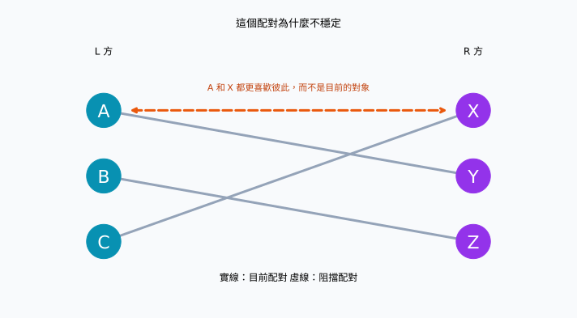
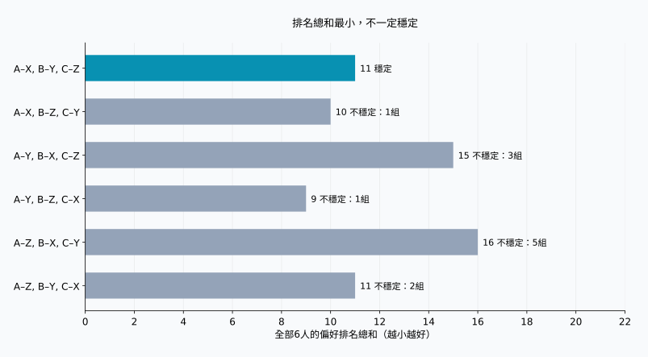
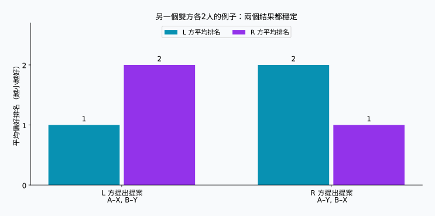

## 1. 蒐集志願，不代表已經完成配對

想像一個研究專題，需要把學生與指導老師一對一配對。學生有想跟隨的老師，老師也有想指導的學生。讓每個人交出一份志願排序，看起來就能安排妥當。

但多位學生可能同時選擇同一位老師，而且雙方的意願未必一致。滿足一個人的第一志願，可能代表另一個人必須讓步。那麼，怎樣才算「好的安排」？

**穩定婚姻問題**為此提供了一個明確標準。雖然名稱有「婚姻」，數學核心卻是兩個具有偏好的群體之間的一對一配對。本文使用 A、B、C 與 X、Y、Z，不預設性別，也不討論真實婚姻關係。

**穩定不代表所有人都非常滿意。** 它代表不存在尚未配成一對、卻都更喜歡彼此而非目前對象的兩個人。在以下假設下，蓋爾–沙普利演算法總能做到這一點。

## 2. 用數學定義「穩定」

### 先確定模型前提

設兩個群體為 $L$ 和 $R$，各有 $n$ 人。每個人將另一方所有人排為第1到第 $n$ 名，不允許並列。偏好在過程中不變，而且每個人都認為，與任何對象配對都比沒有對象更好。

這些假設很重要。若有無法接受的對象、多個名額或並列排名，就需要擴充模型。先以簡單規則理解機制，再處理現實的複雜性。

以 $M$ 表示配對方案，$M(a)$ 表示 $a$ 的對象，$r_a(b)$ 表示 $a$ 給 $b$ 的排名。數字越小，越受偏好。尚未配成一對的 $a\in L$ 和 $b\in R$，若同時滿足下列不等式，就稱為一組**阻擋配對**：

$$
r_a(b)\lt r_a(M(a))
\quad\land\quad
r_b(a)\lt r_b(M(b))
$$

也就是兩人都想離開目前的對象，改選彼此。若 $\mathcal{B}(M)$ 表示所有阻擋配對的集合，穩定性就等價於：

$$
\mathcal{B}(M)=\varnothing
$$

只有單方面喜歡還不夠。反過來，即使換對象會讓原本的夥伴受損，只要雙方都想換，仍構成阻擋配對。這樣的變動是否有利於整個群體，是另一個問題。

### 穩定的結果也可能有人不滿

一個人即使只能得到第三志願，只要前兩名對象都更喜歡各自目前的夥伴，就不會因此形成阻擋配對。**不滿意，與能夠達成雙方都願意的更換，是不同的事。** 穩定性針對固定且已申報的排序，不保證現實關係長久，也不保證每個人都認同結果。

## 3. 雙方各三人的具體例子

$X\succ Y\succ Z$ 表示依序偏好 X、Y、Z。以下偏好是為本文的計算和圖示設計的。

| L 方 | 第1志願 | 第2志願 | 第3志願 |
| --- | --- | --- | --- |
| A | X | Y | Z |
| B | Y | Z | X |
| C | X | Y | Z |

| R 方 | 第1志願 | 第2志願 | 第3志願 |
| --- | --- | --- | --- |
| X | A | C | B |
| Y | A | B | C |
| Z | B | A | C |

A 和 C 都把 X 排第一。X 只能選一個人，因此 L 方所有人都得到第一志願已經不可能，但穩定配對仍然存在。

先看 A–Y、B–Z、C–X。A 和 B 得到第二志願，C 得到第一志願，似乎不錯。然而 A 比起 Y 更喜歡 X，X 比起 C 更喜歡 A。因此 A 和 X 形成阻擋配對。



實線表示目前配對，橘色虛線表示雙方願意進行的更換。線條是否交叉與穩定性無關；重要的是兩端參與者的偏好。

## 4. 蓋爾–沙普利：先暫留，最後才確定

蓋爾與沙普利在1962年的論文中提出這個方法，也稱為**延遲接受演算法**。收到提案時，不立刻做出不可更改的最終決定。[原始論文](https://www.math.utoronto.ca/mccann/assignments/477/GaleShapley62.pdf)

這裡由 L 方提案，R 方接收。

1. L 方尚無對象的人，向還沒提案過的對象中最喜歡的一位提案。
2. 接收方比較新提案者與目前暫留的人，只保留較喜歡的一位。
3. 被拒絕的人繼續向下一志願提案。
4. 當 L 方所有人都被暫留時，將這些配對確定下來。

暫留對象可以更換，但只能換成接收方更喜歡的人。因此，每個接收方始終保留至今所有提案者中最喜歡的一位。

### 追蹤五次提案

為了看見暫留對象的更換，我們按 C、B、A 的順序開始。

| 步驟 | 提案 | 決定 | 暫定配對 |
| --- | --- | --- | --- |
| 1 | C → X | X 尚無對象，暫留 C | C–X |
| 2 | B → Y | Y 尚無對象，暫留 B | C–X, B–Y |
| 3 | A → X | X 更喜歡 A，因此替換 C | A–X, B–Y |
| 4 | C → Y | Y 更喜歡 B，因此拒絕 C | A–X, B–Y |
| 5 | C → Z | Z 尚無對象，暫留 C | A–X, B–Y, C–Z |

最後得到 A–X、B–Y、C–Z。C 只有第三志願，但 X 比起 C 更喜歡 A，Y 比起 C 更喜歡 B。C 想要的更好對象都不願更換。A 和 B 已經得到第一志願，因此沒有阻擋配對。

如果先到先得、立即確定，C–X 會在 A 到來之前被固定，可能留下 A 與 X 互相更喜歡的狀況。「暫留」正是防止這個問題的關鍵。

## 5. 為什麼一定結束，而且結果穩定？

同一個人不會向同一對象提案兩次。提案者有 $n$ 人，每人最多提案給 $n$ 個對象，因此總次數 $P$ 滿足：

$$
P\leq n\times n=n^2
$$

這只是上界，不代表每次都需要 $n^2$ 次。本例在 $n=3$ 時只需五次。預先將接收方排名存入字典，以常數時間比較，演算法的時間複雜度為 $O(n^2)$。雙方輸入排序表本身就有 $2n^2$ 個項目。

結束時也不會有人落單。假設某位尚未配對的提案者已向所有對象提案，則 R 方每個人都至少收到過一次提案。一旦暫留某人，接收方之後只會替換，不會再次空缺。因此 $n$ 個接收方都應有不同的對象，與 $n$ 個提案者中仍有人落單矛盾。

再假設最終結果有阻擋配對 $a,b$。既然 $a$ 更喜歡 $b$，依順序就必定先向 $b$ 提案過。兩人沒有保留下來，表示 $b$ 當時拒絕了 $a$，或後來以更喜歡的人替換 $a$。而 $b$ 的暫留對象只會更好，所以最終對象也比 $a$ 更受 $b$ 喜歡。這與 $b$ 想改選 $a$ 矛盾。拒絕所依據的偏好不會在之後反轉，因此不必窮舉所有方案。

## 6. 用圖比較穩定與滿意

把所有人最後對象的偏好排名加總：

$$
S(M)=\sum_{a\in L}r_a(M(a))
      +\sum_{b\in R}r_b(M(b))
$$

$S(M)$ 越小，表示整體上得到的排名越前面，但不是幸福的數量。第一名與第二名的差距未必等於第二名與第三名的差距，每個人的在意程度也不同。這裡只用它作為直觀的比較指標。

雙方各三人，一共有 $3!=6$ 種完整配對：

| 配對方案 | L 方排名和 | R 方排名和 | 總和 | 阻擋配對數 |
| --- | --- | --- | --- | --- |
| A–X, B–Y, C–Z | 5 | 6 | 11 | 0 |
| A–X, B–Z, C–Y | 5 | 5 | 10 | 1 |
| A–Y, B–X, C–Z | 8 | 7 | 15 | 3 |
| A–Y, B–Z, C–X | 5 | 4 | 9 | 1 |
| A–Z, B–X, C–Y | 8 | 8 | 16 | 5 |
| A–Z, B–Y, C–X | 5 | 6 | 11 | 2 |



最小值9屬於 A–Y、B–Z、C–X，但 A 和 X 會形成阻擋配對。蓋爾–沙普利的結果總和是11，也是本例唯一穩定的方案。**最小化排名總和與消除阻擋配對，是不同目標。**

第一列和最後一列都是11，但最後一列有兩組阻擋配對，因此光看分數不夠。「所有人滿意」也可能指人人第一志願、人人前兩名、改善最差者的排名，或縮小雙方平均排名差距。它們都與穩定性不同。

## 7. 換一方提案，結果可能改變

以下是雙方各兩人的另一個例子，使用新的偏好。

| 參與者 | 第1志願 | 第2志願 |
| --- | --- | --- |
| A | X | Y |
| B | Y | X |
| X | B | A |
| Y | A | B |

L 方提案時得到 A–X、B–Y：L 方全是第一志願，R 方全是第二志願。A、B 都不想換，所以穩定。R 方提案時得到 A–Y、B–X：R 方得到第一志願，L 方得到第二志願。這也穩定。



在沒有並列偏好的基本模型中，演算法讓**每位提案者得到所有穩定配對中自己最喜歡的對象**，稱為提案方最優性。比較範圍僅有穩定配對，並不是保證毫無限制時的第一志願。[原論文的最優性定理](https://www.math.utoronto.ca/mccann/assignments/477/GaleShapley62.pdf)

同一模型下，每位接收者得到的卻是所有穩定配對中自己最不喜歡的對象。因此，選擇哪方提案是重要的制度設計。固定提案方後，改變未配對者的處理順序不會改變最終配對；交換角色則可能改變。

## 8. 用 Python 驗證

以下程式執行雙方各三人的例子。`deque` 是佇列，被拒絕的人重新排到最後。接收方的偏好預先轉成排名字典，以便快速比較。

```python
from collections import deque

left = {"A": ["X", "Y", "Z"],
        "B": ["Y", "Z", "X"],
        "C": ["X", "Y", "Z"]}
right = {"X": ["A", "C", "B"],
         "Y": ["A", "B", "C"],
         "Z": ["B", "A", "C"]}

def gale_shapley(proposers, receivers, order=None):
    rank = {b: {a: i for i, a in enumerate(prefs)}
            for b, prefs in receivers.items()}
    free = deque(proposers if order is None else order)
    next_choice = {a: 0 for a in proposers}
    held = {}
    proposals = 0
    while free:
        a = free.popleft()
        b = proposers[a][next_choice[a]]
        next_choice[a] += 1
        proposals += 1
        if b not in held:
            held[b] = a
        elif rank[b][a] < rank[b][held[b]]:
            free.append(held[b])
            held[b] = a
        else:
            free.append(a)
    return {a: b for b, a in held.items()}, proposals

def blocking_pairs(match, left, right):
    inverse = {b: a for a, b in match.items()}
    return [(a, b) for a in left for b in right
            if left[a].index(b) < left[a].index(match[a])
            and right[b].index(a) < right[b].index(inverse[b])]

match, count = gale_shapley(left, right, ["C", "B", "A"])
print("配對方案:", sorted(match.items()))
print("提案次數:", count)
print("阻擋配對:", blocking_pairs(match, left, right))
```

```text
配對方案: [('A', 'X'), ('B', 'Y'), ('C', 'Z')]
提案次數: 5
阻擋配對: []
```

空串列表示沒有找到阻擋配對。改為檢查 `{"A": "Y", "B": "Z", "C": "X"}`，會回傳 `[('A', 'X')]`。

這是教學實作，假設人數相等、排序完整且沒有並列，省略輸入驗證與不可接受對象的處理。檢查函式為了可讀性使用 `.index()`，所以需要 $O(n^3)$ 時間。前面的 $O(n^2)$ 指使用排名字典的配對演算法本體，不包含額外檢查。

[重現用程式](generate_graphs.zh-tw.py)可產生圖和六種方案的數值，也提供[計算結果 JSON](calculation-results.zh-tw.json)。試著調整排名，觀察穩定方案的數量與交換提案方的影響。

## 9. 應用到現實之前

學生與學校、申請者與接收機構，都有雙方偏好或優先順序。但現實的分配規則往往更複雜。

若有多個名額，可讓接收方暫留不超過名額的候選人。不過，依個人排名選擇前幾名，與希望特定幾個人一起加入，是不同假設。若有無法接受的對象，就必須允許有人不配對。有並列時，如何處理無差異偏好也會導出不同的穩定性定義。規則改變後，必須重新檢查保證是否成立。

申報排序是否反映真實意願也很重要。穩定性首先針對輸入清單判斷。資訊不足或排序限制，可能讓我們無法從輸出推知滿意程度。數學說明的是明確假設下能保證什麼；「由演算法決定」本身不代表公平。

## 10. 總結：分清穩定與幸福

蓋爾–沙普利透過提案與暫時接受，消除尚未配對的兩個人共同想進行的更換。

- **穩定不等於人人第一志願。** 即使沒有雙方同意的更換，仍可能存在不滿。
- **穩定不等於排名總和最小。** 本例最小值為9，唯一穩定結果卻是11。
- **提案方的選擇很重要。** 不同穩定結果可能有利於不同一方。

越是無法實現全部願望，越需要明確說出目標。在最佳化之前，先決定怎樣才算「好的配對」。

### 參考文獻

D. Gale and L. S. Shapley, “College Admissions and the Stability of Marriage,” *The American Mathematical Monthly*, 69(1), 9–15, 1962。[PDF](https://www.math.utoronto.ca/mccann/assignments/477/GaleShapley62.pdf)。這是模型、延遲接受、穩定性與提案方最優性的原始文獻。本文的三人例子、表格和圖均獨立計算。
