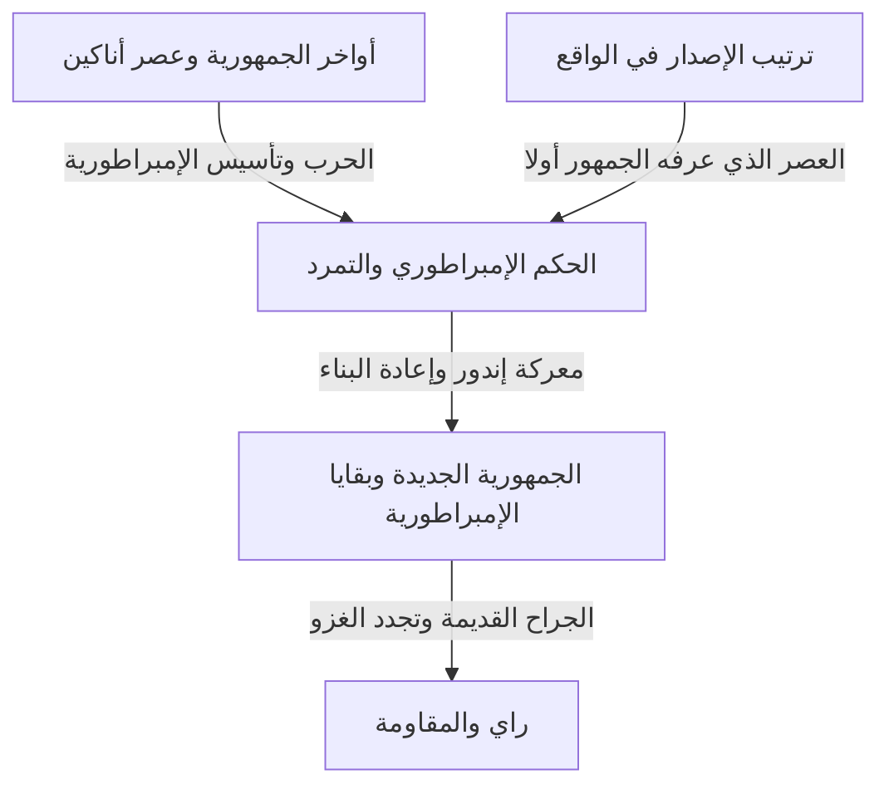
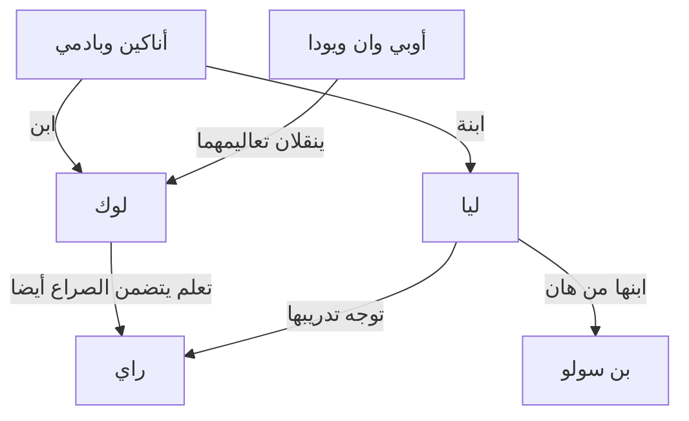

في أبسط صورها، ستار وورز حكاية مغامرة في مجرة بعيدة. لكن مغامراتها تنسج معا الحب والصراع بين الآباء والأبناء، وانهيار الديمقراطية، ومقاومة الإمبراطورية، والدين والسلطة، وجراح الحرب، والعائلات التي تتشكل خارج روابط الدم. وخلف الشاشة تاريخ آخر: صناعة سينمائية غيرت استخدام المجسمات والمونتاج والموسيقى والصوت والرسوم الحاسوبية.

معرفة السيوف الضوئية ودارث فيدر لا تجعل الصورة الكاملة أوضح بالضرورة مع تزايد الأعمال. لماذا بدأت الأفلام بالحلقة الرابعة؟ وإذا كان الجيداي فرسان العدالة، فلماذا عجزوا عن حماية الجمهورية؟ ماذا ورثت قصص أناكين ولوك وراي، وماذا غيرت؟ وماذا يقدم أندور والماندالوريان أبعد من مجرد ملحق للأفلام؟

يتناول هذا المقال تلك الأسئلة عبر ثلاث طبقات: قصة المجرة، والعلاقات بين أعمالها، والتاريخ الواقعي لإنتاجها. وبدلا من سرد كل تفاصيل العالم كالقاموس، يقدم دليلا مطولا للأسباب والنتائج في الأعمال الأساسية، وللموضوعات التي يتغير معناها حين تتكرر. وهو ينقل اتساع عالم تتفرع مساراته، مع توفير طريق واضح للقادمين الجدد.

يكشف النقاش النهايات والهويات والوفيات المهمة والاختيارات الكبرى في أفلام الملحمة التسعة والأعمال المرتبطة بها. إن لم تشاهدها وأردت الحفاظ على مفاجآتها، فاقرأ النظرة العامة الأولى ودليل ترتيب المشاهدة قرب النهاية أولا، ثم عد إلى الفصول الفردية بعد المشاهدة. جرى التحقق من المعلومات وحالة الإصدارات حتى 3 أكتوبر 2026. والرسوم فنون تصورية مولدة لهذا المقال، وليست لقطات رسمية من الأفلام أو سجلات إنتاج.

## ثلاثة خطوط زمنية مختلفة: ترتيب الإصدار وتاريخ المجرة وتطور تفاصيل العالم

أكبر مصادر الالتباس في ستار وورز أن الزمن لا يسير على خط واحد. الفيلم الذي صدر أولا سنة 1977 وُضع لاحقا في موضع الحلقة الرابعة ضمن تاريخه الخيالي. التقى الجمهور بلوك في مغامراته قبل أن يشاهد شباب أبيه أناكين في أفلام بدأ إصدارها سنة 1999. فالأحداث الأقدم في القصة لم تُصوّر بالضرورة أولا في العالم الحقيقي.

وثمة أيضا ترتيب مستقل طور فيه المبدعون تفاصيل العالم. فقد تغير علاقة تُكشف في عمل لاحق الطريقة التي يبدو بها مشهد سابق. وهذا لا يساوي الادعاء بأن كل قصة صُنعت بعد عقود كانت مقررة بالفعل عند إنتاج الفيلم الأول. من المهم ألا نعيد بناء تاريخ تطور عمل متغير اعتمادا فقط على اتساق صورته النهائية.

يساعد التفريق بين هذه الخطوط الثلاثة أيضا على تفسير متعة الأعمال السابقة زمنيا. فمعرفة النهاية لا تلغي المفاجأة بالضرورة: إنها تتيح مشاهدة مأساة والتساؤل عن المواضع التي كانت فيها اختيارات أخرى ممكنة. أما ترتيب الإصدار فيتيح تجربة توقيت الكشف بطريقة أقرب إلى الجمهور الأصلي. لكل منهج قيمته؛ ولا توجد إجابة صحيحة واحدة تثبت مقدار معرفة المرء.

| مجموعة الأفلام | سنوات الإصدار الأول | السؤال المحوري |
| --- | --- | --- |
| الحلقات الرابعة والخامسة والسادسة: الثلاثية الأصلية | 1977، 1980، 1983 | كيف يقاوم الناس قوة طاغية ويواجهون ماضي عائلتهم؟ |
| الحلقات الأولى والثانية والثالثة: الثلاثية السابقة | 1999، 2002، 2005 | لماذا تفقد الجمهورية وأناكين ما سعيا إلى حمايته؟ |
| الحلقات السابعة والثامنة والتاسعة: الثلاثية اللاحقة | 2015، 2017، 2019 | كيف يرث جيل جديد انتصارات أسلافه وإخفاقاتهم؟ |
| روغ ون وسولو | 2016، 2018 | كيف تستكشف القصص أشخاصا على أطراف الملحمة واختيارات اتُخذت في الماضي؟ |
| الفيلم السينمائي حروب المستنسخين | 2008 | كيف تُوسّع حرب طويلة من خلال العلاقات بين الناس؟ |
| الماندالوريان وغروغو | 2026 | كيف نفكر في الحماية والمجتمع بعد انهيار الإمبراطورية؟ |

تشير السنوات عموما إلى أول عرض سينمائي، وقد تختلف عن مواعيد الإصدار اليابانية. يمكن مراجعة ترتيب الإصدار والتسلسل العام في [الدليل الرسمي للأفلام والمسلسلات](https://www.starwars.com/news/star-wars-movies-and-series-guide). وقد يكون وضع عنوان في نقطة زمنية واحدة مضللا حين يغطي البرنامج عصورا متعددة، كما يحدث في بعض مجموعات القصص القصيرة.

يوفر هذا الرسم إطارا لفهم الأعمال المرئية الكبرى. وهو لا يعني مثلا أن الإمبراطورية اختفت من كل ركن في المجرة بعد معركة واحدة. فهزيمة النظام الرمزية والتغيرات في التنظيمات العسكرية والإدارة والجريمة ومواقف الناس تسير بسرعات مختلفة. وتشغل قصص مرتبطة كثيرة هذه الفجوات الزمنية.

## الكانون وليجندز: إلى أي استمرارية تنتمي القصص؟

الكانون إطار للنظر في الاستمرارية السردية الرسمية الحالية. وليجندز تسمية لتنظيم الروايات والقصص المصورة والألعاب وغيرها من القصص الكثيرة التي وسعت العالم سابقا. في 2014 راجعت لوكاس فيلم تعاملها مع الكون الموسع القائم، وأعلنت اتجاها جديدا يستند إلى الأفلام وحروب المستنسخين. يشرح [الإعلان الرسمي آنذاك](https://www.starwars.com/news/the-legendary-star-wars-expanded-universe-turns-a-new-page) هذا الانتقال.

تصنيف عمل ضمن ليجندز لا يعني اختفاءه أو زوال قيمته القرائية. إنها قصص للمجرة نمت في فترة مختلفة، ضمن إمكانات وقيود مختلفة. وبالمقابل، عندما يعود اسم أو مفهوم من عمل قديم في عمل جديد، لا تنتقل سيرته وأحداثه السابقة تلقائيا إلى الاستمرارية الجديدة كحزمة واحدة. والأسماء المألوفة هي تحديدا المواضع التي يستحق فيها الأمر التحقق من النسخة والعمل موضوع النقاش.

ولا تشترك جميع الأعمال المنتجة رسميا في الاستمرارية نفسها. فمشروعات مثل فيجنز تستكشف أشكالا تعبيرية متحررة من الخط الزمني المقرر. وليس كل فعل متاح في لعبة حدثا يقع بالضرورة في السرد؛ فأحيانا ينبغي التمييز بين خيارات اللاعب والأحداث التي يفترضها الجزء التالي.

الخطأ الذي ينبغي تجنبه هو تحويل تصنيفات العالم إلى أحكام على الجودة الفنية. يساعد الكانون في شرح الروابط، ولا يمنح درجات للتأثير العاطفي. ما يظهر على الشاشة، وما يرد في المراجع الرسمية، وما تقوله شخصية، وما يفسره المشاهد، أنواع مختلفة من المعلومات. ومن المهم أيضا ألا يُعامل تفسير تؤمن به شخصية بوصفه بيانا عليما بكل شيء عن حقيقة العالم.

يتبع هذا المقال أساسا استمرارية الأعمال المرئية الكبرى الحالية، ويحدد ليجندز والمشروعات المستقلة بشكل منفصل حين يناقشها. كما يميز بين ما يُصوَّر وكيف يمكن قراءة ذلك التصوير. فتحليل الجيداي نقديا كمؤسسة مثلا تفسير للمشاهد، وليس حقيقة رسمية تنفي حسن نية كل جيداي.

## خريطة صغيرة للشخصيات

تتمركز عدة أجيال مرتبطة بعائلة سكاي ووكر في القلب. لوك وليا ابنا أناكين وبادمي. وابن ليا وهان هو بن سولو، الذي يسمي نفسه لاحقا كايلو رين. لكن الإرث في هذه القصص لا يفسره الدم وحده. فالتعاليم والإخفاقات والاختيارات تنتقل من أوبي وان ويودا إلى لوك، ومن أناكين إلى أهسوكا، ثم إلى جيل جديد يشمل راي.

يسافر R2-D2 وC-3PO عبر هذا التاريخ من موقعين مختلفين عن البشر. ويصل تشوباكا ولاندو ورفاق التمرد صراعات العائلة الداخلية بكفاح المجرة كلها. وتعرض المسلسلات اللاحقة حياة أشخاص بعيدين عن مركز البطولة، منهم كاسيان ودين جارين وغروغو والمستنسخون.

يكشف فصل علاقات الأسرة عن علاقات المعلمين والطلاب أن الأمر ليس مجرد شجرة نسب ملكية. فالسؤال، أكثر مما يرث الناس، هو كيف يستخدمونه وما الذي يرفضونه. لنبدأ بالثلاثية التي دخل الجمهور من خلالها هذه المجرة أول مرة، ولنتأمل ما يفعله كل عمل.

## الحلقة الرابعة، أمل جديد: سياسة المجرة تصل إلى حياة شاب

يبدأ الفيلم الأول، الصادر سنة 1977، من منتصف تاريخ عالمه. من دون معرفة دقيقة بكيفية نشوء الإمبراطورية، يرى المشاهدون سفينة صغيرة تطاردها بارجة هائلة. فالحجم وحده ينقل اختلال التوازن بين المطارد والمطارَد. وبدلا من شرح العالم باستفاضة قبل بدء القصة، تنقل هذه الافتتاحية المعلومات اللازمة لفهم الأحداث من خلال أفعال الشخصيات. ويمكن أيضا مراجعة تاريخ الإصدار وموقعه السردي الأساسي في [صفحة الفيلم الرسمية](https://www.starwars.com/films/star-wars-episode-iv-a-new-hope).

### المغامرة لا تبدأ بإحساس المرء بأنه المختار

لوك سكاي ووكر، الذي يعيش في مزرعة على تاتوين، لا ينطلق أول الأمر لإنقاذ المجرة. إنه شاب يريد الهرب من ضيق الحياة اليومية. لكن الدرويدات التي تصل إلى بيته تحمل معلومات استخبارية للتمرد، وتقوده استغاثة ليا إلى أوبي وان كينوبي الذي يعيش منعزلا. ما دام الصراع السياسي خبرا بعيدا، يبقى أمام لوك خيار العودة إلى المزرعة. وينهار ذلك الحد حين يقتل العنف الإمبراطوري عمته وعمه اللذين ربياه.

للسببية أهميتها. لا يتورط لوك مع الإمبراطورية لمجرد اختياره المغامرة؛ بل تُدمَّر الحياة التي حاولت البقاء بعيدة عن الحكم الإمبراطوري نفسها. تتعلق القصة بالنمو الشخصي، ولكن أيضا بكيفية اقتحام عنف الدولة حياة الأطراف. مع ذلك، الحزن وحده لا يصنع منه بطلا. لقاء معلم ورفاق، وتعلم كيفية التصرف، واستخدام قدراته لمساعدة الآخرين، تمنح رغباته الأصلية دلالة عامة.

تُنقذ ليا، لكنها ليست شخصا ينتظر الإنقاذ فحسب. تخفي المعلومات، وتصمد أمام الاستجواب، وتتخذ القرارات أثناء الهرب. وفي المنشأة التي يدخلها لوك وهان بقصد مساعدتها، تعوض أخطاءهما. ولأن أدوارهم غير ثابتة، لا يستقر الثلاثة في علاقة بسيطة بين بطل ومساعد وجائزة. بل يصيرون جماعة يختبر أفرادها أحكام بعضهم بعضا.

### نجمة الموت سلاح وفلسفة حكم

رعب نجمة الموت يتجاوز قدرتها على تدمير كوكب. فخلفها خطة لجعل التفاوض اليومي والحكم التمثيلي غير ضروريين باستعراض قوة ساحقة. يرتبط حل مجلس الشيوخ بفكرة إبقاء الأنظمة النجمية مطيعة بالخوف. ويتجاوز تدمير ألدران مهاجمة منشأة عسكرية: إنه تهديد لكل من قد يفكر في المقاومة.

لا يملك المتمردون سلاحا بالمقياس نفسه. يقرؤون المخططات ويجدون نقطة ضعف صغيرة ويركزون قوتهم المحدودة. يتطلب النصر وصل عمل الدرويدات التي تحمل المعلومات، والناس الذين يأتمنون آخرين على المخططات، والمحللين، والطواقم التي تصون المقاتلات النجمية. يطلق لوك الضربة الحاسمة، لكن التعاون الجماعي يجعلها ممكنة. إغفال هذا البناء قد يجعل الفيلم يبدو قصة بسيطة يحل فيها شخص ذو نسب خاص كل شيء.

عودة هان جزء من ذلك التعاون. رجل كان يتصرف وفقا للمال يساعد أصدقاءه رغم الخطر. يمكن قراءة ثقة لوك بالقوة بدلا من الاعتماد حصرا على أجهزة التصويب، وتوقف هان عن اتخاذ القرار حصرا وفقا للأجر، كحركتين نحو ثقة تتجاوز الربح والخسارة المرئيين فورا. ليست الرسالة التخلي عن التكنولوجيا. فالمقاتلات والاتصالات والمخططات تظل ضرورية؛ والسؤال هو ما الذي يضاف إلى فعل الحكم النهائي.

ومن السمات المهمة أيضا دخول تاريخ المجرة إلى الشاشة عبر آلات تحتاج إلى صيانة وكلفة المعيشة. فالفالكون ليست مجرد مركبة مثالية سريعة، بل سفينة يكافح مالكها لإبقائها عاملة. وللحانة زبائن لا يوجدون فقط ليشرحوا الأمور للبطل، وللدرويدات حياة تباع فيها وتُشترى. ولأن أشياء تبدو واقعة خارج مركز الصورة، يستطيع الجمهور الشعور بأن هذا العالم موجود منذ زمن طويل دون معرفة كل شيء عنه.

## الحلقة الخامسة، الإمبراطورية ترد الضربة: الهزيمة تحطم فهم البطل لنفسه

لم يعن انتصار الفيلم السابق اختفاء الإمبراطورية. ما زال المتمردون في هرب، ولا يستطيعون الاحتفاظ بقاعدتهم على هوث. يبدأ هذا الفيلم من حقيقة أن تدمير سلاح عملاق لا يلغي المؤسسات أو الجيوش. صدر في 1980، ويطور تدريب لوك بالتوازي مع فرار هان ورفاقه. [صفحة الفيلم الرسمية](https://www.starwars.com/films/star-wars-episode-v-the-empire-strikes-back)

### التدريب يتطلب أكثر من تعلم رفع الأحجار

عندما يلتقي لوك بيودا على داغوبا، تنقلب توقعاته عن مظهر المعلم العظيم وسلوكه. ينظر إلى هذا المخلوق الصغير الغريب ولا يتعرف إلى الحكمة فورا. وتعمل الحيلة على الجمهور أيضا. يبدأ تعلم القوة بزعزعة الميل إلى ربط القوة بالجسد الكبير أو السلاح الكبير.

في الكهف يرى لوك وجهه داخل قناع فيدر الذي هزمه. لا يثبت الفيلم أن الصورة مجرد تسجيل للمستقبل. يمكن قراءتها تحذيرا من أن اتباع الخوف والغضب نحو العدو قد يحول المرء إلى ذلك العدو. كانت مهمة الفيلم السابق هزيمة الإمبراطورية بوصفها خصما خارجيا؛ وهنا يجب أيضا فحص نفس الشخص الذي يحاول هزيمة العدو.

بعد رؤية أصدقائه يتألمون في رؤيا، يقطع لوك تدريبه. يصعب تصنيف القرار صحيحا تماما لأنه رحيم أو خاطئا تماما لأنه غير ناضج. عجزه عن التخلي عن أصدقائه مفهوم، لكنه يسيء تقدير حدود قوته ومعلوماته. وفيدر يستغل هذه المشاعر بالذات لاستدراجه. النيات الحسنة لا تجعل تقدير الموقف غير ضروري.

### صفقة لاندو وحدود التسوية مع الهيمنة

يعقد لاندو صفقة مع الإمبراطورية لحماية مدينة السحاب. لكن العقد لا يضمن الأمان حين يستطيع الطرف الأقوى تغيير وعوده من جانب واحد. تنفيذ شرط لا ينتج إلا مطلبا آخر. ليس إخفاقه مجرد خيانة شخصية؛ بل إخفاق سياسي أيضا في حفظ الاستقلال تحت عنف طاغ.

ومع ذلك، لا يفرض ارتكاب الخطأ البقاء فيه إلى الأبد. يتحرك لاندو لإنقاذ الآخرين. يفشل لوك، ويخون لاندو، ويؤسر هان، لكن قيمتهم لا يحددها حصرا معدل نجاحهم المباشر. تظل القدرة على تغيير السلوك وطلب المساعدة والاستجابة لحاجة الآخر مقياسا مستقلا عن النصر.

الكشف عن أن فيدر والد لوك ليس وسيلة لمحو الفروق بين الخير والشر. لا يصير العنف الإمبراطوري مشروعا. ما يتحطم هو تاريخ لوك العائلي المرتب: إيمانه بأنه ابن أب صالح وأن عدوه رجل غريب قتل ذلك الأب. تتحول فكرة أن هزيمة العدو ستقربه من أبيه إلى سؤال أصعب: كيف تتيح مواجهة هذا العدو وراثة إرث أبيه؟

لا يخرج لوك من المبارزة منتصرا. جريحا وعاجزا عن الهرب وحده، تنقذه ليا والآخرون. إنقاذه على يد الشخص الذي ذهب لإنقاذه في الفيلم الأول يرفض عزلة البطل. الاستقلال ليس فقط عدم الاعتماد على أحد؛ فقد يعني العودة إلى العلاقات مع حمل الأخطاء ونقاط الضعف. بهذا المعنى، تفعل النهاية القاتمة أكثر من تأجيل الحل إلى الجزء التالي.

مساحات هوث البيضاء، وانغلاق داغوبا الرطب، وخارج مدينة السحاب المضيء وداخلها المظلم، أكثر من خلفيات جميلة. يدعم إحساس كل مكان الانسحاب العسكري، والنزول إلى النفس، وانهيار الأمان الظاهر. يجعل كل انتقال مهارات البطل المألوفة غير كافية، موضحا أن النجاح في مقاتلة نجمية لا يوفر إجابات التدريب أو التفاوض أو الحديث مع أبيه.

فن تصوري مولد يوضح عدم التكافؤ في القوة بين التمرد والإمبراطورية، وليس لقطة رسمية من فيلم.

## الحلقة السادسة، عودة الجيداي: إنقاذ أب وهزيمة إمبراطورية

تبدأ خاتمة 1983 بإنقاذ هان، وتجمع إصلاح العلاقات الشخصية وحربا مجرية. في قصر جابا، يبدو لوك أهدأ من شاب الفيلم الأول وأكثر ثقة باستخدام قوته. لكن مظهره وحده لا يثبت نضجه كجيداي. السؤال النهائي هو ما الذي يفعله حين يستطيع الانتصار. [صفحة الفيلم الرسمية](https://www.starwars.com/films/star-wars-episode-vi-return-of-the-jedi)

### فخ الإمبراطور يستهدف الغضب أكثر من الموت

بينما يحاول الإمبراطور تدمير المتمردين عسكريا، يحاول أيضا جلب لوك إلى صفه. يريه أصدقاءه في خطر، ويدفعه للهجوم غاضبا، ويسعى لجعل ذلك الشعور ينتهي بقتل أبيه. حتى لو هزم لوك فيدر، ينتصر الإمبراطور إن قبل لوك منطق الهيمنة نفسه. ولهذا تسمح المبارزة بأن يتحرك النصر العسكري والنجاح الأخلاقي في اتجاهين متعاكسين.

يغضب لوك من تهديد ليا فيتغلب على فيدر. النظر بين يد أبيه الآلية ويده يعيد رؤيا الكهف كاختيار ملموس. إلقاء سلاحه ليس اختيار اللاعنف لأن الخطر غائب. إنه يقبل احتمال أن يُقتل ويرفض قتل أبيه. ويبتعد عن مقياس للقوة يتطلب تدمير عدو لإثبات الذات.

تمرد فيدر على الإمبراطور اختيار يتخذه بعد مشاهدة ابنه يتألم. توجد هنا عودة إلى الخير، لكن لا تفسير يقول إن جرائمه الماضية مُحيت. إيمان ابن بخير أبيه يختلف عن إلزام الضحايا بمسامحة من أساء إليهم. يصور الفيلم تحولا أخيرا داخل علاقة أب وابنه؛ ولا يحسم كل مسائل المسؤولية القانونية أو الذاكرة التاريخية. الحفاظ على هذا التمييز يتيح فهم حدود النهاية دون فقد قوتها العاطفية.

### لماذا تهم معركة الغابة بقدر غرفة العرش

عزل المواجهة مع الإمبراطور يجعل الأمر يبدو كأن مشكلات العائلة وحدها تحرك العالم. في الواقع لا يستطيع الأسطول تدمير نجمة الموت الثانية ما لم تعطل القوات البرية على إندور درعها. إنقاذ لوك لأبيه وتدمير المتمردين للمنشأة العسكرية كلاهما ضروري. ولا ينجز أي منهما تلقائيا عمل الآخر.

يجلب الإيووك معرفتهم بالأرض وطريقة أخرى للقتال إلى العملية المشتركة. تتفوق الإمبراطورية في التدريع وقوة النيران، لكنها لا تأخذ السكان المحليين بجدية كفاعلين. يجعلها ذلك الاحتقار تسيء تقدير مقاومة تستخدم التضاريس والمفاجأة. وهذا بالطبع ليس قانونا عاما يقول إن الأسلحة البسيطة تهزم دوما الجيوش المتقدمة في الحروب الواقعية. بوصفه حكاية رمزية، يُظهر ضعف السلطة الحاكمة حين تستهين بحكم الكائنات الصغيرة وتضامنها.

يسهم لوك وهان وليا ولاندو وتشوباكا والدرويدات والجنود المجهولون وسكان إندور جميعا. ولأن جهودهم تتلاقى، فالاحتفال ليس تتويجا لشخص واحد. كما يمثل عودة لوك إلى مجتمع بعد فقد أبيه. وتعايش الخسارة الشخصية والنصر العام يمنع سعادة الفيلم من التحول إلى نهاية سعيدة بلا جراح إطلاقا.

هزيمة الإمبراطور أيضا فشل لافتراضه أن الآخرين جميعا سيتصرفون في النهاية بدافع المصلحة الذاتية والخوف. ابن يرفض التخلي عن الإيمان بأبيه، وأب يختار ابنه على طاعة الحاكم، يقعان خارج حساباته. القوة العظيمة في القوة لا تتيح التنبؤ الكامل بالاختيارات البشرية. وتشترك الثقة المفرطة بالأسلحة الهائلة والثقة المفرطة بفهم كل قلب بشري في نقطة الضعف هذه.

## الحلقة الأولى، تهديد الشبح: الإمبراطورية لا تبدأ بمظهر إمبراطورية

يبدأ الفيلم السابق زمنيا، الصادر في 1999، بصراع داخل الجمهورية، لا بالديكتاتورية العسكرية الواضحة في الفيلم الأول. يحول حصار الاتحاد التجاري لنابو نزاعا على التجارة والضرائب إلى احتلال مسلح. تتوقع الملكة الشابة بادمي أميدالا أن يثبت اللجوء إلى مجلس الشيوخ الوقائع ويجلب المساعدة. لكن المؤسسات تبقى عالقة في التحقيقات والإجراءات، ولا تواكب سرعة اتخاذ القرارات معاناة الناس على الأرض. [صفحة الفيلم الرسمية](https://www.starwars.com/films/star-wars-episode-i-the-phantom-menace)

### يكسب بالباتين التأييد بصفته الشخص القادر على حل الأزمة

للمشاهدين العارفين بالتاريخ اللاحق، تحمل نصائح السيناتور بالباتين من نابو معنى مزدوجا. يقف إلى جانب الطرف المتضرر ويستغل انعدام الثقة بقائد يبدو عاجزا. والمفتاح أنه لا يغزو مجلس الشيوخ من الخارج ويدمر الجمهورية بضربة واحدة. بل يصعد عبر الإجراءات البرلمانية وتوقعات الناس.

والأعداء ليسوا كتلة موحدة واحدة أيضا. يسعى الاتحاد التجاري وراء مصالحه، بينما يستخدمه دارث سيديوس أداة في خطة أكبر. حتى عندما ينتهي الصراع الظاهر، يبقى انتقال السلطة الذي أحدثه. تحرير نابو نصر حقيقي، لكنه ليس بالضرورة انتصارا لمستقبل الجمهورية. يظل الاحتفال مقلقا لأن هذين المقياسين لا يتوافقان.

يمثل طلب بادمي من الغونغان نوعا معاكسا من السياسة. بدلا من الحفاظ على كبريائها كممثلة، تعترف بعلاقتهم المشتركة كسكان كوكب واحد وتطلب العون. وهذا يتجاوز تعويض نقص القوة العسكرية: تصنع جماعتان منفصلتان سابقا غاية مشتركة. وينتج هذا التضامن الصغير قدرة عملية على الفعل لم يوفرها مجلس الشيوخ.

### انظر إلى حياة أناكين قبل موهبته

أناكين الصغير طيار استثنائي، لكنه مستعبد أيضا. في عالم فيه جمهورية هائلة وجيداي يتحدثون عن العدالة، لا تُضمن حرية أم وطفلها. توضح هذه الحقيقة الفرق بين وجود المؤسسات ووصول حمايتها إلى كل منطقة. يستطيع كواي غون تحرير أناكين، لكنه لا يستطيع إنقاذ أمه شمي بالوسائل نفسها.

تجمع المغادرة فرحة الاعتراف بقدراته والخوف من ترك أمه خلفه. وصف أناكين اللاحق بأنه ضعيف عجز عن التغلب على الخوف فقط يتجاهل الظروف التي نشأ فيها ذلك الخوف. وفي الوقت نفسه، لا تجعل الطفولة القاسية الإساءة اللاحقة حتمية. تفتح القصة سؤال الدعم والتعليم اللذين احتاج إليهما إنسان مجروح.

تعني وفاة كواي غون أن المعلم الذي اكتشف أناكين لا يستطيع إرشاده طويلا. يرث أوبي وان الوعد، لكن علاقتهما ليست مكتملة منذ البداية. تبدأ نبوءة عظيمة وتوقعات مؤسسية بالتحرك أسرع من نمو طفل واحد. ويهيئ هذا الاختلال مأساة الثلاثية السابقة كلها.

ومن ناحية الإنتاج، وصف الثلاثية السابقة بأنها أفلام صُنعت بالكامل بالحاسوب غير دقيق أيضا. تصف مواد الإنتاج الرسمية حيلا عملية، مثل أعواد قطنية ملونة استُخدمت في مجسمات جمهور سباق البود. وفهم الصورة كمزيج من التكنولوجيا الجديدة والعمل اليدوي أقرب إلى الواقع. [معلومات الإنتاج الرسمية](https://www.starwars.com/news/25-fun-facts-the-phantom-menace)

تساعد المعارك المتزامنة قرب النهاية أيضا في تمييز أدوار الجماعات. مناورة الغونغان لصرف الانتباه، والعمل داخل القصر، والقتال في الفضاء، ومبارزة الجيداي والسيث، تحل كل منها مشكلة مختلفة. لا يستطيع مبارز قوي واحد إنهاء الاحتلال. وفوق ذلك، تكشف وفاة كواي غون تحت النجاح العسكري أن نصر مجتمع وخسارة في حياة صبي لا يتطابقان بالضرورة.

## الحلقة الثانية، هجوم المستنسخين: الاستعداد للحرب يضيق الخيارات

في ثاني أفلام الثلاثية السابقة، الصادر سنة 2002، تسعى حركة انفصالية متنامية لمغادرة الجمهورية، ويصبح إنشاء جيش قضية سياسية. يكتشف أوبي وان جيش المستنسخين أثناء التحقيق في محاولة اغتيال بادمي. يظهر جيش جاهز بالكامل أمام جمهورية كان يفترض أنها لا تزال تناقش كيفية الاستعداد للأزمة. تلتقي حاجات الأمن العاجلة بحل مريح غامض المنشأ. [صفحة الفيلم الرسمية](https://www.starwars.com/films/star-wars-episode-ii-attack-of-the-clones)

### لغز يحتاج التحقيق تسبقه متطلبات الحرب

كيف طُلب جيش المستنسخين، ومصالح من يخدم، سؤالان يفترض أن يحتلا أعلى أولوية. لكن مع قرب جيش العدو، يريد الناس قوة قابلة للاستخدام فورا. تغير الأزمة القرارات بسلب وقت التدقيق. يُعتمد الجيش لا لأنه فُحص بعناية، بل في ظروف تجعل البدائل تبدو غير متاحة.

يشمل نقد دوكو للجمهورية مشكلات حقيقية في الفساد المؤسسي. لكن تشخيص المشكلة الصحيح لا يضمن عدالة الحل الذي يقترحه صاحبه. ولأنه يشارك بنفسه في خطة السيث، لا يقود خذلان الجمهورية مباشرة إلى التحرر. يجب فصل الصراع الظاهر بين المعسكرين عن موقع سيديوس بوصفه المستغل له.

يذهب الجيداي أيضا إلى القتال لحفظ السلام ويصيرون جنرالات يقودون جيشا. ومن المفارقة أن عملية إنقاذهم الناجحة تسهم في بدء حرب. إنقاذ الأرواح في الموقف الفوري يتعايش مع أثر أطول أمدا يقوي النظام العسكري. والوسائل المعتمدة لغاية طيبة تغير تدريجيا طبيعة المؤسسة التي تستخدمها.

### الرومانسية والسياسة تشتركان في الرغبة بالسيطرة

تواجه علاقة أناكين وبادمي عقبات المنزلة والواجب وانضباط الجيداي. يحمي زواجهما السري حبهما، لكنه يضيق فرص المشورة والدعم. ومع قلة من يمكن مشاركة الصعوبات معهم، تصبح المخاوف التي تشتد لاحقا أصعب فحصا من الخارج.

بعد فقد أمه، يقتل أناكين أشخاصا في مستوطنة للتاسكن، بينهم أطفال. لا ينبغي تجاوز هذا بوصفه مجرد إشارة درامية إلى شدة غضبه. يصير العنف ضد عزيز مبررا للعنف ضد آخرين: انهيار أخلاقي واضح. قد يكون الحزن مفهوما، لكن الأفعال تحمل مسؤولية. سقوطه اللاحق ليس انقلابا مفاجئا؛ فقد جرى تجاوز حد كبير هنا بالفعل.

يردد رأي أناكين السياسي بأن قائدا قويا ينبغي أن يتخذ القرارات إن حقق النتيجة المرغوبة رغبته في السيطرة على الفقد في العلاقات الحميمة. يصعب قبول أن للناس إرادات مختلفة وأن للأحباء حياة خارج سيطرة المرء. لكن محاولة إزالة عدم اليقين بالإكراه تدمر العلاقة نفسها التي يريد حمايتها. يأخذ الفيلم التالي هذه المشكلة إلى أقصاها.

يحمل المظهر الموحد لجيش المستنسخين أيضا قلق معاملة البشر كوحدات عسكرية قابلة للاستبدال. اشتراك الجنود في الأصل لا يعني أن حياتهم قابلة للحساب كأنها متطابقة. يؤكد الفيلم أولا صورة الجيش الجماهيري؛ وتستكشف الأعمال اللاحقة شخصيات الجنود الأفراد. ملاحظة هذا الترتيب تسمح بإعادة النظر فيما بدا خلاص الجمهورية عبر السؤال عمن يدفع ثمنه.

## الحلقة الثالثة، انتقام السيث: الرغبة في الإنقاذ تصبح منطق هيمنة

في ثالث أفلام الثلاثية السابقة، الصادر في 2005، تنهار الجمهورية بينما تقترب حروب المستنسخين من نهايتها. خلافا لتوقع أن يعيد الفوز بالحرب السلام، تصبح السلطة المركزة لخوضها أساس ديكتاتورية ما بعد الحرب. ولأن أناكين والجمهورية يسقطان معا، لا تختزل المأساة في الضعف الشخصي وحده أو الفشل المؤسسي وحده. [صفحة الفيلم الرسمية](https://www.starwars.com/films/star-wars-episode-iii-revenge-of-the-sith)

### يبيع بالباتين وعد التحكم بالموت

يخشى أناكين مستقبلا يفقد فيه بادمي. لا يرفض بالباتين ذلك الخوف مباشرة، بل يلمح إلى قوة غير متاحة في مكان آخر. هذا أدق من مجرد الوعظ بعقيدة شريرة. يحدد ما يخشى الآخر فقده أكثر من أي شيء، ويجعل نفسه يبدو ضروريا لحمايته. وكلما تعمق الاعتماد، سهل قبول التفسيرات المتناقضة والمطالب الإجرامية.

يوجد انعدام ثقة أيضا بين أناكين ومجلس الجيداي. يشعر أنه غير مقدر، ويخشى المجلس قربه من بالباتين. يزيد الطلب منه التجسس انقسام ولاءاته. لكن تفسير الظروف لا يساوي تبرير أفعاله. بعد إيقاف ميس ويندو لحماية بالباتين، يطيع أناكين أوامر أشد تدميرا باستمرار.

بعد ارتكاب خطأ جسيم، يفضل الناس أحيانا طريقا يجعل الخطأ يبدو ذا معنى على الرجوع. يمكن قراءة أفعال أناكين كسلسلة من هذا التبرير الذاتي. ما دام قد بلغ هذا الحد، فلا بد أن ينال القوة وإلا ذهب كل شيء سدى. يجعل هذا التفكير الأذى التالي يبدو تضحية ضرورية.

### الأمر 66 يوجه قوة المؤسسة القاتلة القائمة في اتجاه آخر

لا يهاجم الجيداي جيش جديد قادم من بعيد، بل جنود قاتلوا إلى جانبهم. حين تنعكس وجهة سلسلة القيادة العسكرية، تصير المواقع والثقة المبنيتان على التحالف نقاط ضعف. يصور الفيلم الأمر والهجمات المنسقة؛ وتقدم الرسوم المتحركة المرتبطة تفاصيل التحكم في المستنسخين. يساعد فصل تفسير الفيلم عن الإضافات اللاحقة في توضيح دور كل عمل.

ولا تتأسس الإمبراطورية لحظة تدمير كل مبنى جمهوري. تُعلن في قاعة مجلس الشيوخ كنظام جديد. تحت لغة استعادة الأمن، تتحول المراقبة والعنف إلى حكم دائم. وبوصف الجيداي المعارضين خونة، يعاد تفسير مقاومة تركيز السلطة كاعتداء على النظام.

على مصطفار يوجه أناكين العنف إلى بادمي التي قصد إنقاذها. حين تخالفه، يفسر الأمر خيانة بدلا من احترام إرادتها. يصبح الفرق بين المودة والتملك لا لبس فيه. المستقبل الذي أراده لم يحتج إلى بادمي حية فحسب، بل إلى بادمي تؤيد اختياراته.

تعرض مشاهد احتواء أناكين المحترق في الدرع وولادة التوأم اليأس وإمكان المستقبل معا. ليس أوبي وان ولا يودا منتصرا. لكن حماية الطفلين تصون مستقبلا داخل الهزيمة السياسية. تصير الثلاثية السابقة قصة تنشأ فيها الكارثة من اجتماع حسن النية والخوف والمؤسسات والطموح، لا قصة ينتصر فيها الشر لمجرد اختفاء الأخيار.

وحزن أوبي وان بعيد أيضا عن رضا اكتشاف شرير وهزيمته. عليه قتال شخص اعتبره أخا، بينما تبقى أسئلة عن تعليمه وحكمه. ولهذا يمكن قراءة طول مبارزتهما لا كمقارنة للمهارة فقط، بل كألم شخصين يعرف أحدهما الآخر بعمق ولا يستطيعان قطع العلاقة. حتى الفائز ليس لديه مكان يحتفل فيه بانتصاره.

## الحلقة السابعة، القوة تنهض: جيل يرث أبطالا لم يعرفهم

في الفصل الجديد الصادر سنة 2015، يكاد أبطال التمرد يكونون شخصيات أسطورية بالنسبة إلى راي وفين. تبقى الأسماء المألوفة للجمهور بعيدة عن الشخصيات الشابة. يضع هذا الفرق ذكريات المشاهدين القدامى ودهشة القادمين الجدد في الإطار نفسه. يظهر النظام الأول في عالم ما بعد الإمبراطورية، مبرهنا على أن نصر الأمس لا يضمن أمان الجيل التالي. [صفحة الفيلم الرسمية](https://www.starwars.com/films/star-wars-episode-vii-the-force-awakens)

### يصبح فين بطلا عبر رفض أمر أولا

ليست نقطة انطلاق فين نسبا مرموقا أو نبوءة. يُطلب منه الطاعة كجندي، فيرفض القتل. يبدأ هذا الاختيار تحوله من رقم في تنظيم إلى شخص يقرر بنفسه. لا يكتسب فورا عزما كاملا على إنقاذ المجرة؛ ففي البداية تظل رغبته في الهرب قوية. لا يعرض الفيلم فعلا خيرا بعد اختفاء الخوف، بل شخصا يثبت من أجل إنسان آخر وهو ما يزال خائفا.

على جاكو، تعلمت راي مهارات البقاء، لكنها تنتظر عائلة قد تعود. لا ينشأ جمودها من نقص القدرة بل من توقعات مرتبطة بالماضي. تعني مغادرة البيت أكثر من الانتقال إلى كوكب آخر. إنها الانتقال من أمل أن يعيد الانتظار حياتها القديمة إلى إمكان بناء علاقات جديدة بنفسها.

### يريد كايلو رين صورة فيدر بقدر قوته

يحاول بن سولو إعادة صنع نفسه باسم كايلو رين. يقدس جده فيدر، لكن قرار فيدر الأخير إنقاذ ابنه لا يلائم صورة الشر القوي التي يريدها. لا يرث الناس الماضي دائما كاملا؛ فأحيانا ينتقون فقط الأجزاء التي يحتاجون إليها. يوضح كايلو كيف يمكن أن تعني وراثة التاريخ إساءة قراءته أيضا.

وقتل هان أكثر أيضا من مشهد يزيل فيه شرير هادئ الأعصاب عقبة. يعتقد كايلو أن قطع تعلقه بأسرته سيجعله قويا، فيحاول إعادة بناء نفسه. لكن ارتكاب العنف لا يحل الصراع بالضرورة. الفعل المقصود به إزالة عدم اليقين يصنع جرحا جديدا بدلا من ذلك. بينما تتحرك قصة راي نحو الاتصال بالآخرين، يحاول كايلو تثبيت نفسه بقطع الروابط.

التشابهات البنيوية مع الفيلم الأول، ومنها قاعدة ستاركيلر ودرويد يحمل خريطة، واضحة. يمكن الاستمتاع بها كحنين أو نقدها كتكرار. لكن تحليليا من المفيد تجاوز ملاحظة التشابه وفحص اختلافات خيارات الشخصيات في المواقع المتشابهة. يصبح جندي سابق من نمط إمبراطوري بطلا، وتقاوم شابة تنتظر الإنقاذ بنفسها، ويصبح ابن بطل عدوا. داخل الملامح المألوفة، ينتقل قلق الإرث إلى المركز.

يظهر تدمير مركز الجمهورية الجديدة بقوة هشاشة النظام السياسي. لكن لأن الفيلم لا يقضي وقتا طويلا في تصوير حياة ذلك النظام اليومية، يصعب على المشاهد إدراك طبيعة الخسارة الملموسة. هذا قصور في شرح الفيلم. تستطيع الأعمال المرتبطة إضافة وزن، لكن لا ينبغي تحميل غير العارفين بها كامل لوم ضعف الفهم. فكمية المعلومات التي ينقلها العمل نفسه تشكل تجربة المشاهدة.

## الحلقة الثامنة، الجيداي الأخير: الاعتراف بالفشل دون التخلي عن المسؤولية

يقلب ثاني أفلام الثلاثية اللاحقة، الصادر في 2017، توقع أن يحل لقاء راي بلوك المشكلة. انسحب لوك من الوقوف بطلا مرة أخرى. وفي الوقت نفسه تُطارَد المقاومة وتضطر إلى قرارات للبقاء بموارد محدودة. يسائل الفيلم البطولة الفردية والقيادة التنظيمية بالتوازي. [صفحة الفيلم الرسمية](https://www.starwars.com/films/star-wars-episode-viii-the-last-jedi)

### هل يبرر الاعتراف بالخطأ التخلي عن كل شيء؟

يُروى ماضي لوك وبن من منظورات مختلفة. يتغير معنى المشهد نفسه بين الخوف العابر الذي شعر به لوك والرعب الذي عاشه بن عند رؤيته. ليست هذه نسبية تدعي غياب الحقائق. إنه الفرق بين ما كان شخص يفكر فيه وما عاشه آخر فعليا. شرح أن دافعا كان وجيزا أو أعقبه الندم لا يمحو الأذى الذي سببه.

يربط لوك فشله بفشل الجيداي ككل ويريد انتهاء التقليد. يستحق نقد تاريخ الجيداي التأمل، لكن إن كان النقد يبرر غيابه فقط، فهو يبعده عن المسؤولية تجاه من يعانون الآن. بين الحفظ غير المشروط والتخلي عن كل شيء لأنه فشل، لا بد من طريق للتعلم ونقل الأشياء بطريقة مختلفة.

تجد راي وكايلو إمكان فهم أحدهما الآخر، لكن الفهم يختلف عن الاتفاق. لا يفرض اشتراكهما في الوحدة قبول نظام يهيمن على الآخرين. كما لا يجعل قتل سنوك كايلو تلقائيا في جانب الخير. قتل حاكم ورفض منظومة الهيمنة فعلان منفصلان؛ فهو يحاول شغل المقعد الشاغر بنفسه.

### تعمل الشجاعة والقيادة على مقياسين زمنيين مختلفين

يمتلك بو شجاعة تدمير العدو أمامه، لكنه يجب أن يتعلم كم يكلف ذلك النجاح من أشخاص وموارد. إنتاج نتيجة مرئية في معركة يختلف عن إبقاء تنظيم حيا حتى الغد. وفي القيادة، قرار عدم الهجوم واختيار الانسحاب مسؤوليتان أيضا.

يتضمن خلافه مع هولدو صعوبة مشاركة المعلومات أيضا. يختبر الجمهور عدم التطابق بين من يعرف ماذا. استنتاج أن على المرؤوسين الطاعة بصمت فحسب ضيق جدا. رؤية الخلاف كتصادم بين السرية والثقة والسلطة والشرح غير الكافي أثناء أزمة تُظهر نقاط قوة الشخصيات وقصورها معا.

تظهر فقرة كانتو بايت أن الازدهار الذي يبدو خارج الحرب يمكن أن يتصل بها عبر السلاح والاستغلال. ينتقل فين من رغبة حماية صديقة بعينها إلى فهم المقاومة على نطاق أوسع. ومع ذلك، لا يثبت تعامل المستفيدين مع المعسكرين تطابق أهدافهما السياسية. يجب تمييز نقد هياكل الربح عن مساواة الغزو بالمقاومة.

فعل لوك الأخير ليس قتل أعداد كبيرة من جنود العدو، بل منح رفاقه وقتا للبقاء. الرجل الذي كره أسطورته يقبل قدرتها على بعث الأمل. ثم يجذب انتباه العدو بطريقة تختلف عن النصر الجسدي. يمكن قراءة الفيلم كعمل يبدأ بتحطيم صورة بطل وينتهي باختيار كيفية استخدام تلك الصورة من جديد.

لم تطلب راي من لوك مهارات فقط، بل إجابة تثبت هويتها من الخارج. لكن معلمها شخص له أخطاء ومخاوف أيضا. بعد إدراك عدم كمال من تعتمد عليه، عليها أن تقرر ما تأخذه من تعليمه. بهذا المعنى، لا يتناول الفيلم مجرد تلميذة ترفض معلما؛ بل يسأل هل يمكن أن يستمر التعلم دون تأليه المعلم.

## الحلقة التاسعة، صعود سكاي ووكر: الأصول والاسم المختار

يعيد الفيلم التاسع، الصادر سنة 2019، بالباتين بوصفه العدو النهائي ويربط أصول راي بعائلته. يُراجع بشكل كبير فهمها السابق أنها لا تنتمي إلى نسب مهم. تختلف الاستجابات لهذا التحول، لكن على التحليل أولا تمييز ما ينقله كل فيلم عما يضيفه التالي. [صفحة الفيلم الرسمية](https://www.starwars.com/films/star-wars-episode-ix-the-rise-of-skywalker)

### قد يفسر الدم القدرة، لكنه لا يصدر أمرا أخلاقيا

تخشى راي أن يحدد نسب شرير مستقبلها. لكن النهاية تتجه نحو اختيار التعاليم والعلاقات التي تقبلها بدلا من الخضوع لأصولها. لا تُحسم المسألة بمجرد القول إن الدم لم يكن مهما قط. يستخدم الفيلم القرابة أداة أساسية، وهو يحاول تصوير الحرية عبر رفض البطلة للدور المفترض أن تستلزمه تلك القرابة.

توفر علاقتها بلوك وليا طريقا آخر للإرث. يمكن قراءة اختيار اسم سكاي ووكر في النهاية أقل كإعلان عن أصل بيولوجي وأكثر كتأكيد للقيم التي ترغب في وراثتها والعلاقات التي رعتها. اختيار الاسم لا يمحو الألم أو الماضي. تكمن الدلالة في تقرير كيفية تعريف نفسها بعد معرفة ذلك الماضي.

لا تحظى التفاصيل التقنية لعودة بالباتين إلا بشرح محدود داخل الفيلم وحده. ولا ينبغي الخلط بين المواد التكميلية والمعلومات المقدمة مباشرة، كأن كل شيء شُرح على الشاشة. ما يهم داخل القصة أن الخوف من الموت والتعلق بالسلطة يجعلان حتى الأجساد والأجيال التالية أدوات عنده. الرجل الذي أغرى أناكين بالتحكم في الحياة يواصل استخدام الآخرين لحفظ نفسه.

### تحول بن يعكس فكرة قهر الموت

تتضمن عودة بن من حياته ككايلو رين تدخل أمه وإنقاذ راي لحياته وذكريات أبيه. فشلت محاولته السابقة التحرر من الصراع بقتل أبيه. ويتيح قبول العلاقات مجددا اختيارا آخر. لا يمحو هذا التحول الأذى الماضي، لكن إمكان اختيار فعل مختلف الآن يبقى قائما.

تقابل هبته الأخيرة للحياة إلى راي تضحية أناكين بالآخرين لأنه لم يحتمل فقد من يحب. بدلا من الهيمنة على العالم للاحتفاظ بالحياة، يقدم من نفسه. عبر تسعة أفلام يغير هذا التقابل معنى إنقاذ شخص. إبقاء إنسان مع المرء ليس هو تمني الحياة لذلك الإنسان.

يؤدي الأسطول الذي يتجمع عند إكسيغول عملا مستقلا عن مبارزة راي أيضا. يتعرف الناس الذين عزلهم الخوف إلى وجود بعضهم بعضا ويتجمعون. يختلف مدى إقناع ذلك التلاقي للمشاهدين، لكن المشاركة التي تتجاوز قدرات بطل واحد ضرورية سرديا. وتراكب المعركة الأخيرة مجددا صراع الأنساب ومقاومة أشخاص كثيرين خارج تلك الأنساب.

بوصفها خاتمة تسعة أفلام، توحي العودة إلى تاتوين بأن الرجوع إلى المكان نفسه لا يعني الرجوع إلى الحالة نفسها. في الفيلم الأول نظر شاب إلى الأفق راغبا في الذهاب بعيدا؛ وفي النهاية تعلن شخصية خاضت رحلة اسمها. إعادة استخدام مشهد البداية تجمع توسيع العالم وتقرير موضع الذات في حركة واحدة مكتملة.

## روغ ون: من لا يستطيعون العودة يجعلون ضربة البطل الحاسمة ممكنة

يصور روغ ون، الصادر سنة 2016، كيفية وصول مخططات نجمة الموت إلى المتمردين قبيل الفيلم الأول. معرفة النتيجة العامة لا تزيل التوتر، لأن السؤال المركزي ليس فقط هل تصل المخططات، بل من يفقد ماذا في إيصالها. يحدد إعلان الإنتاج الرسمي جون نول من ILM صاحب الفكرة، ويشرح التركيز على منظور الحرب البرية. [إعلان الإنتاج الرسمي](https://www.starwars.com/news/rogue-one-the-daring-mission-has-begun-cast-and-crew-announced)

### مقاومة مهندس واستعادة ابنته معناها

بينما يشارك غالين إرسو في تطوير أسلحة الإمبراطورية، يزرع نقطة ضعف تقود إلى التدمير. يثير ذلك أسئلة صعبة: هل يعني البقاء داخل مؤسسة التواطؤ دائما، وكم يمكن التخريب من الداخل؟ لا يبرر مثاله تعميم أن كل متعاون يقاوم سرا. يصور الفيلم اختيار شخص بعينه وصعوبة إبلاغه للآخرين.

تتلقى جين أجزاء من المعلومات عن أبيها فتراجع فهمها له كخائن بسيط. والأهم أن معرفة نياته الحسنة لا توقف السلاح. يجب إثبات الضعف والحصول على المخططات وإيصال المعلومات بصورة قابلة للاستخدام. فقط حين تتحول المصالحة الشخصية إلى فعل عام، يكون لمقاومة أبيها أثر عملي.

### إظهار أخطاء المتمردين لا يبرر الإمبراطورية

نفذ كاسيان أعمالا مظلمة للتمرد. بعض أفعاله لا يمكن تبريرها فقط بعدالة القضية. ويختلف المتمردون داخليا أيضا، ولا يشكلون كتلة موحدة أمام الخطر. تظهر هذه الصور أن المقاومة ليست بريئة، لكنها لا تثبت أن الهيمنة والمقاومة لذلك شيء واحد.

السؤال بدلا من ذلك هو ما يفعله ذوو الأيدي المتسخة لاحقا. يحمل قرار كاسيان العمل مع جين رغبة ملحة في ألا تبقى تضحيات الماضي مجرد تضحيات. لكن تلك الرغبة تخاطر بتبرير تضحيات إضافية بلا نهاية أيضا. يرسم الفيلم الحد عبر الفرق بين أوامر تتخلص من الآخرين وخيارات قبول الخطر على النفس.

على سكاريف تنفصل الاتصالات الأرضية والأسطول في الفضاء والعمليات داخل المنشأة. لا تمنع قوة شخص واحد فشل المهمة إذا فُقد اتصال في موضع آخر. تصبح مشكلة الإرسال التقنية شكل التضامن نفسه. الأفعال المتكررة لتمرير المعلومات ليست تكرارا بلا معنى: إنها تظهر استمرار العمل بعد بقاء شخص واحد.

لا يستطيع هؤلاء الانضمام إلى احتفال الفيلم الأول. لكن عملهم يصير جزءا من انتصاره. خلف بطل أمل جديد نستطيع الآن رؤية الثمن الذي تحمله أشخاص لم نكن نعرف أسماءهم ووجوههم. تثري القصة المستقلة الملحمة الرئيسية حين تغير هكذا الوزن الأخلاقي للأحداث المألوفة.

ويختلف إيمان شيروت أيضا عن قدرة دفاعية لا تُقهر. الإيمان بالقوة لا يضمن مباشرة سلامة الجسد. يظهر الإيمان كاستعداد يتيح الفعل وسط الخطر، لا عقدا للنجاة من الموت. ومن خلاله نرى أن فكرة القوة تشكل الحكم والأمل حتى في قصة لا يتصدرها شخص تلقى تدريب الجيداي.

## سولو: كيف يتشكل شخص يبدو مهتما بمصلحته وحدها

يبتعد سولو، الصادر في 2018، عن المعارك التي تحدد حكومة المجرة كلها، ويدخل عالم التنظيمات الإجرامية والنقل والديون والصفقات. عبر لقاءات هان الشاب بتشوباكا ولاندو، يقدم زاوية أخرى لشخصية الفيلم الأول. وكما تشرح صفحته الرسمية، تتوسطه مغامرة عبر عالم الجريمة على الحدود. [صفحة الفيلم الرسمية](https://www.starwars.com/films/solo)

### شراء الحرية قد يقود إلى تبعية تالية

يحاول هان الهرب من كوريليا، لكن الهرب وحده لا يصنع حياة حرة. الجيش الإمبراطوري والتنظيمات الإجرامية ووسطاء العمل: كل وسيلة للبقاء تجلب تراتبية أخرى. رغبته في سفينة قوية لا لأنه يحب الطيران فحسب، بل لأن امتلاكها شرط مادي لاختيار وجهته.

يعلمه بيكيت ألا يثق بالآخرين كثيرا. لاستراتيجية البقاء هذه أساس عقلاني في بيئة خطرة. لكن إن بُنيت كل علاقة حصرا على توقع الخيانة، انكمش التعاون إلى مصلحة مشتركة مؤقتة. يأخذ هان بعض الدرس دون أن يصير الشخص نفسه تماما.

يوضح لقاؤه بتشوباكا الفرق. حتى إن تضمنت ظروفهما الأولى مصالح متبادلة للبقاء، تنتج مواجهة الخطر معا أكثر من تبادل. تصبح ثقتهما اللاحقة مفهومة لا كصفة معطاة منذ البداية، بل كعملية مراقبة أفعال أحدهما الآخر والحكم عليها.

### لكيرا حياة خارج قصة هان

يحاول هان أخذ كيرا بعيدا وتحقيق حلمهما القديم. لكن العالم الذي نجت فيه أثناء افتراقهما أعقد مما يتصور. لا يعيد اللقاء تشغيل العلاقة القديمة ببساطة. ثمة مسافة بين الرغبة في إنقاذ شخص وفهم الظروف التي يعيشها الآن.

تفسير خياراتها فقط بحسب حبها له يتجاهل القيود والطموحات المتعلقة بالبقاء داخل تنظيم. حتى في فيلم يتصدره هان، لا تتحرك حياة الآخرين جميعا لتلبية رغباته. يصير هذا التفاوت جزءا من خيبة هان الشاب ونضجه.

تغيير فهمه لجماعة إنفيس نيست يزعزع أيضا الحد بين المجرمين والمقاومين. من يملك الشحنة، ومن يأخذها، وفيم ستستخدم؟ ليس صاحب الملكية التعاقدية محقا أخلاقيا بالضرورة. يكشف قرار هان الأخير، الذي لا يفسره الربح وحده، صفة ستساعد لاحقا على عودته إلى المتمردين.

هان هذا الفيلم ليس حلا مكتملا يفسر شخصية الفيلم الأول. لا تُشكل تجربة واحدة أحدا. ومع ذلك، يحتفظ تحت لغة التهكم والمصلحة الذاتية بعجز عن التخلي ببساطة عن الآخرين. الرجل الذي يقدم نفسه كشخص لا خير فيه يناقض وصفه لنفسه مرارا بأفعاله. وهذه الفجوة جزء من جاذبية هان سولو.

يوسع الدرويد L3-37 موضوع الحرية إلى ما وراء البشر. هل ينبغي معاملة الآلة كشخصية مريحة تخدم الناس، أم كفاعل له أحكامه ومطالبه؟ سؤال ظل كثيرا داخل الكوميديا في السلسلة يصعد إلى السطح في أقوالها وأفعالها. لا يحله الفيلم بالكامل، لكن الاستمتاع بصفات الدرويدات المحببة ينسجم مع مساءلة علاقات الملكية التي تحكمها. حتى مغامرة حدودية صغيرة تضم أسئلة تخص المجرة كلها.

## فهم المجرة خارج الأفلام عبر المؤسسات والحياة اليومية

يجعل الانتقال من الأفلام إلى التلفزيون والرسوم المتحركة المجرة أكثر تفصيلا فجأة. هزيمة الإمبراطور ودفع ثمن طعام الغد مشكلتان مختلفتان. وقد يشعر شخص أنقذه جيداي في ساحة المعركة وشخص دمرت عملية عسكرية حياته شعورين مختلفين تجاه الجمهورية نفسها. تجعل هذه الفروق في المنظور الأعمال المرتبطة أكثر من حلقات إضافية.

### يبدو النظام السياسي نفسه مختلفا من المركز ومن الحدود

عاصمة الجمهورية كوروسانت مركز سياسي يضم مجلس الشيوخ والبيروقراطية ومعبد الجيداي. لكن رفع راية الجمهورية لا يعني أن كل ساكن في المجرة يتلقى حماية متساوية. على حدود مثل تاتوين، توجد أماكن بالكاد تصل إليها مُثل الجمهورية، وتسيطر فيها التنظيمات الإجرامية والعبودية على الحياة. وما يبدو دولة منظمة من المركز قد يبدو من الأطراف حكومة لا تفعل سوى النقاش بعيدا.

تهم هذه المسافة أيضا في فهم الانفصالية. حتى لو انجذبت قيادة كونفدرالية الأنظمة المستقلة وصانعو أسلحتها إلى خطة شريرة، فليس كل ساكن مستاء من الجمهورية شريرا. يوجد الغضب من الفساد والإهمال السياسي واللامساواة الاقتصادية مستقلا عن المؤامرة. مهارة بالباتين أقل في خلق الصراع من عدم، وأكثر في استغلال المظالم القائمة وتوجيه حلها نحو توسيع سلطته.

تستمر الفروق بين الكواكب بعد تأسيس الإمبراطورية. بعض الأماكن تختبر تهديد الأسلحة العملاقة مباشرة؛ وتواجه أخرى الإمبراطورية عبر التعدين وقوات الأمن وأوراق الهوية والاحتجاز والتجنيد. وبعد تشكل الجمهورية الجديدة، يعمل القراصنة والجماعات المسلحة الإمبراطورية السابقة حيث تراجعت السيطرة المركزية. لذا لا يكفي اسم الدولة لتحديد مدى أمان الحياة أو حريتها. السؤال عن كوكب الشخص وطبقته ومهنته يساعد على تفسير فروق النبرة بين أعمال تقع في العصر نفسه.

فن تصوري مولد يقابل بين مركز المجرة وحدودها وبين عصور تاريخية مختلفة، وليس مشاهد أو رسوما تصورية رسمية.

### الجيداي ليسوا الدولة نفسها، بل جماعة مرتبطة بها

جيداي ليس اسما لكل من يستخدم القوة. إنهم جماعة ذات تدريب وانضباط وعلاقات معلمين وطلاب وتقاليد مشتركة. في أواخر الجمهورية يعتبرون أنفسهم حراس السلام، لكنهم ليسوا نساكا مستقلين عن السلطة السياسية. يتولون مهام دبلوماسية، ويحافظون على علاقات مع مجلس الشيوخ، ويصبحون جنرالات في حروب المستنسخين. تنتج هذه الأدوار المتداخلة حسن النية والإخفاق المؤسسي معا.

يقودون الجيوش لحماية الناس. لكن كلما صاروا قادة، قلت حريتهم تجاه البنى السياسية التي تحكم نهاية الحرب. النجاح التكتيكي في هزيمة جنود العدو لا يطابق بالضرورة تحقيق السلام. تفسير هزيمتهم بقصور مهارة السيف وحدها يفوّت المأساة. إنهم يخوضون حربا عسكرية دون إدراك كاف أن الحرب نفسها فخ.

هذا لا يجعل الجيداي مثل الإمبراطورية. ثمة فرق بين مؤسسة ترتكب أخطاء وأخرى تسعى فعليا إلى الهيمنة والخوف. تسأل الأعمال هل تلغي النيات الطيبة ضرورة مراجعة الذات. حين تتعارض حماية الجمهورية مع مواصلة طاعة قراراتها، فأيهما له الأولوية؟ تترجم قصص أهسوكا ودوكو هذا التصادم إلى تجربة شخصية.

### السيث وممارسو الجانب المظلم الآخرون ليسوا بالضرورة جماعة واحدة

تسمية كل عدو بسيف ضوئي أحمر سيثا تخلط العلاقات التنظيمية. ينفذ المحققون مطاردات الإمبراطورية للجيداي، لكنهم لا يحتلون منزلة سادة السيث وتلامذتهم نفسها. ولأخوات الليل في داثومير تقاليد تختلف عن الجيداي والسيث معا. ينبغي تمييز استخدام الجانب المظلم للقوة عن الانتماء إلى سلالة سيث محددة.

تقوم قاعدة الاثنين المرتبطة بدارث بين على علاقة معلم يحتفظ بالقوة وتلميذ يسعى إليها. وليست قانونا فيزيائيا يسمح بوجود مستخدمين شريرين للقوة فقط في المجرة. إنها مبدأ للخلافة التنظيمية، قد يوجد حوله متعاونون وقتلة وتلاميذ محتملون يجري التلاعب بهم وأعضاء سابقون. ويشرح الداتابانك الرسمي أيضا أن بين أدخل هذا الترتيب لضمان بقاء السيث. [مدخل دارث بين الرسمي](https://www.starwars.com/databank/darth-bane)

يكشف ذلك منهجا تعليميا يقابل منهج الجيداي. حتى إن أراد معلم سيث نمو تلميذه، فذلك النمو يهدده. منطق استخدام الآخر واستبداله في النهاية مدمج في التعاون. عند النظر إلى الإمبراطور وفيدر، أو مول المتروك، يتعمق الفهم إذا لاحظنا كيف تولد العلاقة نفسها انعدام الثقة، أبعد من الطباع الفردية.

## كيف غير حروب المستنسخين رؤيتنا للحرب

### دور الفيلم والمسلسل الطويل

الفيلم المتحرك ستار وورز: حروب المستنسخين الصادر سنة 2008 مدخل إلى المسلسل التلفزيوني بالاسم نفسه. منح أناكين تلميذة هي أهسوكا تانو إضافة كبيرة للمشاهدين الذين عرفوا الأفلام فقط. وهو يفعل أكثر من توسيع قائمة الشخصيات. إظهار أناكين مسؤولا عن إرشاد شخص يمنح شجاعته وطبيعته الراعية ومقاومته للقواعد تعبيرا ملموسا في علاقة بتلميذة.

يصور المسلسل الحرب بين الحلقتين الثانية والثالثة دون حصر نفسه في العمليات العسكرية الجمهورية. ينتقل منظوره بين الدبلوماسية وتجار العبيد والتنظيمات الإجرامية والكواكب التي تحاول الحياد وشكوك الناس العاديين. تتحول الخلفية السياسية التي تشغل دقائق في الأفلام إلى حياة يومية وقرارات متواصلة. وغالبا لا يحسن انتصار في حلقة الوضع العام، فيُظهر إنهاك الحرب الطويلة.

فهم مسلسل طويل لا يتطلب تحويل كل شيء إلى بحث عن تمهيد للأفلام. يعرف المشاهدون النهاية؛ ولا تعرف الشخصيات المستقبل. الوقت الذي تقضيه في مساعدة الأصدقاء وتنفيذ المهمات وبناء ثقة صغيرة له معنى في ذاته. ولأن ذلك الوقت يُصوَّر بشكل كاف، يصبح الأمر 66 لا مجرد حادثة تاريخية بل تدميرا لعلاقات بنوها.

### الوجه المستنسخ نفسه لا يعني الشخصية نفسها

يصبح الجنود المستنسخون الذين يصعب تمييزهم في جيوش الأفلام الجماهيرية أشخاصا ذوي أسماء وأحكام: ريكس وفايفز وإيكو وغيرهم. التشابه الجيني لا يعني تطابق التجربة أو الشخصية. تعلم علامات الدروع وتسريحات الشعر والكلام والعلاقات بالرفاق الجمهور التعرف إلى الأفراد.

يبرز التناقض الأخلاقي للجمهورية. حرب دفاعا عن الحرية تعتمد على جنود خُلقوا للقتال ويفتقرون إلى حرية كافية لترك الخدمة العسكرية. غالبا يحترم قادة الجيداي جنودهم، لكن اللطف الشخصي وحده لا يحل المشكلة المؤسسية. الاعتراف بشجاعة الجنود ينسجم مع مساءلة البنية التي يعيشون داخلها.

تجعل قصة شريحة التثبيط ذلك التناقض أقسى. لم يكن الولاء قائما على الاختيار الحر وحده. في مأساة الأمر 66، للمهاجمين أيضا شخصيات وصداقات تُنتهك قسرا. إزالة أهسوكا لشريحة ريكس تجعل استعادة الحكم المسلوب، لا هزيمة عدو، فعل الإنقاذ. [مدخل أهسوكا تانو الرسمي في الداتابانك](https://www.starwars.com/databank/ahsoka-tano)

### مغادرة أهسوكا تفصل الخير عن المؤسسات

مغادرة أهسوكا جماعة الجيداي لا تعني تخليها عن الرحمة. المؤسسة التي يفترض أن تحميها تضر ثقتها؛ ودعوتها إلى العودة لا تمحو الجرح تلقائيا. ينفصل للمرة الأولى البقاء داخل تنظيم ذي مُثل عادلة ومواصلة التصرف وفقا لحس المرء بالحق.

هذا التغير خطير على أناكين أيضا. يحاول حماية تلميذته، لكن المؤسسة التي يريد الإيمان بها لا تلبي توقعاته. لا يفسَّر سقوطه اللاحق بمغادرة أهسوكا وحدها، لكنها مهمة لعملية وصل انعدام الثقة بالمؤسسات والخوف من فقد المقربين. ويتناول مقال رسمي أيضا مغادرتها في الموسم الخامس ولقاءهما اللاحق كنقطتي تحول في علاقتهما. [وداع أهسوكا وأناكين](https://www.starwars.com/news/ahsoka-and-anakin-final-meeting)

يقدم حصار ماندالور الختامي منظورا آخر موازيا لانتقام السيث. يعرف المشاهدون ما سيحدث على كوروسانت، لكن المعلومات تصل إلى ساحة المعركة البعيدة في شذرات. يصنع هذا التأخير توترا: تحول قرارات مركز التاريخ الرفاق إلى أعداء قبل أن يفهمها الموجودون على الأرض.

## الدفعة السيئة ومن تركتهم الحرب خلفها

يتبع الدفعة السيئة فرقة مستنسخين بقدرات غير معتادة وفتاة اسمها أوميغا عبر الانتقال من الجمهورية إلى الإمبراطورية. تغيير النظام أكثر من تبديل لافتة. تتغير القوى العاملة العسكرية واختبارات الولاء والسيطرة الإقليمية وإدارة المعلومات، وقد يصبح الجنود الذين دعموا الدولة سابقا قابلين للتخلص منهم.

يتقن الأبطال القتال، لكنهم لم يتعلموا بما يكفي كيف يعيشون أحرارا. اختيار الأعمال وتلقي الأجر والتفكير في سلامة طفلة وإيجاد مكان آمن تصبح تحديات جديدة. للعملية أوامر وأهداف. أما الحياة فلا تحمل ورقة تعليمات تضمن الإجابة الصحيحة باتباع خطواتها. يحول هذا الفرق الفرقة إلى عائلة.

أهمية أوميغا أكبر كثيرا من قوة قتالية إضافية. مسؤولية حمايتها تعني أن القرارات لا تُقاس فقط بالقدرة على إنجاز عمل خطر. هل يستحق دخل اليوم تعريض أمان الغد للخطر؟ هل يكفي الهرب وحدنا؟ ماذا ينبغي أن ترث الطفلة؟ يدخل الجماعة مقياس مستقل عن العقلانية العسكرية.

تسائل قصة كروس هير توقع أن تضمن الطاعة الانتماء. يأمل أن يضمن اتباع تنظيم الاعتراف بقيمته. لكن إن كان التنظيم يعامل الأفراد أدوات، فالولاء ليس متبادلا. كما تتضمن العودة والمصالحة جروحا لا يغلقها الشرح وحده. الرفقة لا تعني عدم ارتكاب الأخطاء مطلقا، بل تقرير كيفية إعادة بناء علاقة مع من ارتكبها.

الحياة المسالمة على بابو ليست مجرد استراحة في قصة حرب. تجعل الوجبات والبيوت والجيران ما كان القتال لحمايته ملموسا. يصف الداتابانك الرسمي بابو كمجتمع لاجئين، بينما يناقش مقال إنتاج عن الخاتمة الفرقة الناجية وأوميغا الأكبر سنا. تصل النهاية توقف القتال بإمكان اختيار حياة عادية. [مدخل بابو الرسمي](https://www.starwars.com/databank/pabu)، [مقابلة الممثلين عن الخاتمة](https://www.starwars.com/news/the-bad-batch-series-finale-dee-bradley-baker-michelle-ang-interview)

## ريبيلز وتكوين مجتمع مقاومة

يتمحور ريبيلز حول إزرا بريدجر، فتى يعيش على لوثال، وطاقم السفينة غوست. لا يستقبل البطل منذ البداية تحالف متمردين مكتمل التأسيس. تتراكم المقاومة المحلية والحصول على الإمدادات وتبادل المعلومات وبناء الثقة بين الناس لتصبح حركة أكبر.

يعني تدريب الجيداي لإزرا أكثر من اكتساب قدرات خارقة. يتعلم فتى اضطر للبقاء وحيدا تقاسم المسؤولية. ومعلمه كاينان ليس أستاذا بلا جراح أكمل تعليما مثاليا أيضا. يرعى الجيل التالي وهو يحمل مخاوفه ونواقصه الخاصة. تصبح هذه العلاقة غير الكاملة قصة إعادة بناء مؤسسة مفقودة بالثقة بين الناس. [النقاش الرسمي عن إزرا وكاينان](https://www.starwars.com/news/always-two-ezra-and-kanan)

هيرا طيارة وشخصية عملية تبقي التنظيم متحركا. لسابين ماض سياسي كماندالورية، ويتذكر زيب تدمير مجتمعه. يشارك تشوبر لا كآلة مريحة فقط، بل كرفيق ذي طبع خشن. يتصل أشخاص مختلفو الأصول بالحياة المشتركة كما بالمُثل المشتركة.

يصبح ثرون عدوا غير معتاد لهذه الجماعة الصغيرة. بدلا من الاعتماد فقط على الترهيب، يحاول فهم ثقافات الخصوم وأنماط سلوكهم. لا ينتصر المتمردون بالضرورة بالحصول على قوة نيران أكبر. يهم أن يتصرفوا خارج توقعاته ويستندوا إلى علاقات، بما فيها الروابط بالحيوانات والأرض، لا تختزل في الحساب العسكري.

يظهر اختفاء إزرا وثرون عند تحرير لوثال أن النصر والعودة إلى البيت لا يتحققان دائما معا. اختيار إنقاذ الوطن قد يكلف القدرة على البقاء فيه. يستمر ذلك الغياب في أهسوكا. [الدليل الرسمي لخاتمة ريبيلز](https://www.starwars.com/series/star-wars-rebels/family-reunion-and-farewell-episode-guide)

## أندور يحسب كلفة التمرد

### الموسم الأول: حدود البقاء متفرجا

لا يشرح أندور شر الإمبراطورية بالرموز العملاقة وحدها. يضيق العمل والشرطة والحسابات ومكافآت الطاعة والخوف من العقاب الفعل الفردي تدريجيا. متابعة كاسيان الذي لم يصبح ثوريا مكتمل التكوين تكشف كيفية نشوء شخص قادر على المقاومة.

لفيريكس أدوات ومتاجر وعلاقات جوار وعادات جنائزية. ولأن هذه التفاصيل تتراكم، يصبح تدخل قوات الأمن أكثر من وصول عدو. إنه يعني فقد السكان السيطرة على زمنهم ومكانهم. تنشأ معارضة الإمبراطورية لا من مُثل مجردة فقط، بل من رفض أن تُحدد حياة المرء لراحة شخص آخر.

تبرهن عملية ألداني أن التمرد يحتاج إلى المال. لكن الحصول عليه يحمل خطرا، وقد يستدعي النجاح قمعا إمبراطوريا أشد يؤذي أشخاصا لم يشاركوا في العملية. قد تُفهم استراتيجية إظهار الاضطهاد لتوسيع المقاومة، لكنها لا تمحو السؤال الأخلاقي عمن يتحمل الكلفة.

تبرز قصة السجن نظاما يراقب فيه السجناء بعضهم ويتنافسون ويواصلون العمل. لا يُحفظ العنف فقط بحراس يضربون الناس كل دقيقة. تحفزهم القواعد وحجب المعلومات والقلق من الجماعات الأخرى وأمل الإفراج. يتطلب الهرب لا شجاعة فردية فقط، بل أن يصل أشخاص منقسمون إلى فهم الواقع نفسه.

### الموسم الثاني: التنظيم يوسع المقاومة وتناقضاتها

يغطي الموسم الثاني السنوات السابقة لروغ ون، ويضع تغيرات كاسيان الشخصية إلى جانب تنظيم التمرد. يشرح توني غيلروي في مقابلة رسمية أن الموسم الأخير مبني ليقود مباشرة إلى روغ ون. المهم ليس ملء أحداث تسبق فيلما مألوفا فحسب، بل إظهار الخسائر البشرية اللازمة للوصول إلى تلك النقطة. [غيلروي عن الموسم الثاني](https://www.starwars.com/news/andor-season-2-interview-tony-gilroy)

تظهر أحداث غورمان الإدارة والموارد والتلاعب بالمعلومات والقوة العسكرية متلاقية في الهيمنة. حين تُدمج حركة مدنية في تفسير أعده الحاكم، تنفتح فجوة بين ما حدث على الأرض والرواية المتداولة علنا. يصور المسلسل لا تنفيذ العنف فقط، بل الآلية التي تقدمه كإجراء ضروري.

تحاول مون موثما حفظ هويتها العامة كسياسية والتمويل السري والحياة الأسرية في الوقت نفسه. اختيار الصواب السياسي لا يحل المشكلات المنزلية تلقائيا. وبالعكس، قد تصنع التنازلات لحماية العائلة خطرا سياسيا. تظهر قصتها أن المقاومة لا تبدو دائما خطابا حماسيا؛ فهي تضم عملا أقل ظهورا يحفظ التدفقات المالية والعلاقات.

ينفذ لوثن أفعالا يراها ضرورية للتمرد وهو يدرك قبحها. الإدراك لا يجعله بريئا. بدلا من الاحتفاء به كبطل واقعي بسيط، تحفظ رؤية شخصيته عبر سؤال إلى أي حد يمتص التنظيم المقاوم للاضطهاد منطقه توتر العمل.

حتى حين توجد المعلومات والشخصيات اللازمة لروغ ون قرب نهاية الموسم الثاني، لا يمكن إعلان مكافأة كل تضحية. من يسهمون في النصر لا يُضمن تذكرهم. وكما يوحي تركيز النقاش الرسمي للخاتمة على لوثن، يصور المسلسل العمل المستتر والخسائر خلف الأبطال المألوفين. [النقاش الرسمي لخاتمة الموسم الثاني](https://www.starwars.com/news/andor-season-2-finale-episodes-10-11-12)

## أوبي وان كينوبي والمسؤولية بعد الهزيمة

في هذا المسلسل الواقع بين الحلقتين الثالثة والرابعة، أصبح الجنرال العظيم السابق ناجيا يعرف الهزيمة. الاختباء بمهمة ليس مثل الحفاظ على الأمل داخليا. تتمحور القصة حول شخص يعرف سقوط تلميذه وموت رفاقه ويجد سببا للفعل من جديد.

تطالبه علاقته بليا الصغيرة بالنظر إلى المستقبل كما إلى الماضي. لا يختفي فشله في إنقاذ أناكين، لكن التأمل المتكرر فيه لا يحمي الطفلة أمامه. السؤال هو كيفية تمييز المسؤولية تجاه الماضي عن المسؤولية تجاه الناس في الحاضر. يحدد الدليل الرسمي رحلة الإنقاذ هذه محورا أساسيا. [التعريف الرسمي بأوبي وان كينوبي](https://www.starwars.com/series/obi-wan-kenobi)

تصل المحققة ريفا أيضا كون المرء ضحية للعنف وفاعلا له داخل شخص واحد. المعاناة لا تبرر الأذى اللاحق. لكنها تساعد على تفسير الاعتقاد بأن اكتساب نوع قوة العدو وحده يجعل المقاومة ممكنة. يهم اختيارها الأخير لا بسبب مدى قوتها، بل لأنها تقرر هل تمرر العنف الذي تحملته إلى طفل آخر.

مشاهدة المسلسل فقط كخط زمني يملأ الفجوة بين الأفلام قد تشجع الاهتمام الحصري باتساق اللقاءات والمواجهات المتكررة. قراءة أخرى أن الحكيم الهادئ في الحلقة الرابعة لم يكن دوما متقبلا لكل شيء. يمكن فهم الهدوء لا كغياب الجراح، بل كقدرة على الفعل للآخرين مع حملها.

## الماندالوريان وكتاب بوبا فيت يعيدان النظر في العائلة والحكم

### طفل كان مكافأة يصبح عائلة تجب حمايتها

القوة الدافعة الأولى للماندالوريان واضحة. لا يستطيع صائد الجوائز دين جارين مواصلة معاملة الكائن الصغير الذي وجده في مهمة كشيء يُسلَّم. يتعارض الوفاء بالعقد مع حماية الحياة أمامه، فيختار الثانية. يجعله الاختيار منبوذا من نظامه المهني ويجذبه إلى علاقات جديدة.

جاذبية غروغو تنبع جزئيا من كونه أكثر من حمولة تحتاج الحماية. تتعايش فيه الصغر وماض طويل وقدرات قوية في القوة. يحميه دين، وهو يساعد دين بالمقابل. مع شرح لفظي قليل، تروي النظرات والتردد وحركة الجسد والأفعال اليومية المتكررة علاقتهما. تُصنع العائلة بقبول المسؤولية باستمرار، لا بالنسب.

فن تصوري مولد يعبر عن الثقة والعائلة اللتين تنموان على الحدود، وليس صورة رسمية لمشهد.

خوذة دين درع وتعبير عن الإيمان والانتماء المجتمعي معا. لكن لقاء ماندالوريين آخرين يكشف أن القواعد التي ظنها عالمية تنتمي إلى تعاليم جماعة محددة. وجود تقليد لا يعني أن له تفسيرا واحدا فقط. وراء الاختيار بين التخلي عن الانضباط أو الحفاظ عليه، عليه السؤال عما وُضع الانضباط لأجله.

في إعادة بناء ماندالور، بما فيها قصة بو كاتان، لا تتطابق شرعية المحارب بالضرورة مع القدرة السياسية على توحيد الناس. امتلاك سلاح رمزي لا يدمج تلقائيا مجتمعا منقسما. تغير تجارب النجاة معا الحدود الفصائلية القديمة. وتبني دين لغروغو رسميا في نهاية الموسم الثالث يمثل تلاقي إعادة بناء المجتمع وإعادة تعريف عائلة صغيرة. [النقاش الرسمي لخاتمة الموسم الثالث](https://www.starwars.com/news/the-mandalorian-chapter-24-the-return-highlights)

### ماذا يسعى بوبا فيت إلى تغييره في الحكم بالخوف؟

ينقل كتاب بوبا فيت صائد الجوائز السابق إلى محاولة حكم منطقة. التوظيف لملاحقة أهداف يختلف عن مسؤولية منطقة كاملة، بما فيها السكان والتجارة والقوى المتنافسة. المهارات القتالية وحدها لا تدير حكومة أو تصنع اتفاقا. يوفر تغير الدور هذا السؤال الأساسي للمسلسل.

تغير تجربته مع التاسكن منظورا يرى سكان الصحراء عقبات أمام الغرباء. لهم عادات وعلاقات بالأرض وزمن جماعي خاص. يصبح ما يتعلمه بوبا فرصة للتوقف عن معاملة المحكومين كخلفية فقط. طبعا لا تجعل هذه التجربة وحدها حكمه مثاليا. يبقى التوتر بين لغة نوع جديد من الحكم والعنف الفعلي والتفاوض بين المصالح. [النقاش الرسمي لتصوير التاسكن](https://www.starwars.com/news/the-book-of-boba-fett-chapter-2-highlights)

يضم المسلسل أيضا حلقات تدفع علاقة دين وغروغو إلى الأمام بشكل كبير. لذا قد يجعل الانتقال مباشرة من الموسم الثاني إلى الثالث من الماندالوريان ظروفهما المتغيرة مربكة. هذا مهم عمليا لفهم الروابط، لكنه لا يعني أن كل مسلسل يتطلب المقدار نفسه من التحضير. يوضح تحديد تغيرات العلاقات التي يعالجها كل عمل الروابط الضرورية.

### موضع فيلم الماندالوريان وغروغو لعام 2026

حتى 3 أكتوبر 2026، كان ستار وورز: الماندالوريان وغروغو قد صدر. تعرفه صفحة إنتاج لوكاس فيلم كإصدار سنة 2026، وتقدمه مغامرة مستقلة تواصل المسلسل. تنطلق فكرته من طلب الجمهورية الجديدة مساعدة دين وغروغو ضد أمراء الحرب الباقين عبر المجرة بعد سقوط الإمبراطورية. [صفحة الفيلم الرسمية لدى لوكاس فيلم](https://www.lucasfilm.com/productions/star-wars-the-mandalorian-and-grogu/)

يجعل هذا الموضع المسافة بين نصر عودة الجيداي وإرساء أمن ما بعد الحرب مهمة مجددا. إزالة ديكتاتور مركزي لا تزيل فورا الأسلحة والأفراد والمصالح وخوف الناس. لكن لا يمكن افتراض أن الجمهورية الجديدة تحتاج ببساطة إلى رقابة الإمبراطورية القديمة الصارمة في كل مكان. تشكل كيفية توفير حكومة تحمي الحرية أمانا كافيا أيضا خلفية رحلتهما.

## أهسوكا ترث علاقات المعلمين والطلاب ومجرة أخرى

يتطلب فهم أهسوكا ألا نحصر بطلتها في وصف تلميذة أناكين السابقة. فهي تحمل خيبة الثقة بجماعة الجيداي وتجربة حروب المستنسخين ومعرفة أن معلمها أصبح فيدر. والآن، وهي ترشد سابين، تؤثر علاقات المعلم والتلميذ الماضية في طريقة تعليمها نفسها.

الثقة بمعلم تختلف عن وراثة كل ما فيه. الاعتراف بالمهارات والشجاعة المتعلمتين من أناكين لا يؤيد أفعاله اللاحقة. وبالمقابل، لا يتطلب الخوف من سقوطه طرح كل ما علمه. مهمة أهسوكا ليست استعادة ماض بلا عيوب، بل بناء العلاقة التالية مع قبول إرث معقد.

تقف سابين بين الشوق إلى صديقها المفقود إزرا ومسؤولية منع خطر أوسع. يردد التصادم بين إنقاذ قريب والمسؤولية العامة قصة أناكين، لكنه لا يقود آليا إلى النتيجة نفسها. الروابط بالآخرين قد تخلق خطرا أو تتيح التعافي. المهم فحص الخيارات والنتائج المحددة، بدلا من الحكم على الخير والشر ببساطة وفقا لوجود التعلق.

يغير بيريديا، كوكب في مجرة بعيدة، النطاق الجغرافي للقصة. وهو عالم قديم متصل بأسلاف داثومير، يصل أيضا غياب ثرون وإزرا بالحاضر. لكن مجرة أخرى لا تمحو مشكلات العالم القائم. يعود بعضهم ويبقى آخرون، وتمضي فرحة اللقاء إلى جانب خطر تجدد الحرب. [مدخل بيريديا الرسمي في الداتابانك](https://www.starwars.com/databank/peridea)

يركز هذا النقاش على العلاقات والموضوعات التي أثبتها الموسم الأول الصادر. ولا تُعامل لقطات معاينات التكملة وإعلانات الإنتاج كأدلة على مصائر لم تُصوّر بعد. في سلسلة مستمرة، يجب التمييز بين الألغاز غير المجابة وتوقعات الجمهور التي تُعرض كحقائق ثابتة.

## سكيليتون كرو يعيد نظرة من يرى المجرة للمرة الأولى

في سكيليتون كرو يغادر أطفال بيئتهم المألوفة ويدخلون مجرة خطرة. المعدات والأنواع التي يعرفها المشاهدون المتمرسون تبدو لهم أشياء لا يفهمونها. من خلال منظورهم، تصير المجرة التي ألفها الجمهور منذ زمن غريبة ومقلقة من جديد.

تُنظم الحياة اليومية على كوكبهم آت آتين حول المدرسة والعمل وتوقعات المستقبل. يوجد أمان، لكن توجد أيضا أشياء عن العالم لم يُخبَروا بها. بدلا من الادعاء ببساطة أن الخروج يجلب الحرية، تستكشف القصة حدود الحماية ومخاطر المغامرة. حتى بمعرفة غير مكتملة، يستطيع الأطفال تمييز قدرات بعضهم والتعاون.

تهم أيضا نظرتهم إلى البالغ جود. صاحب المهارة واللغة المقنعة ليس حاميا جديرا بالثقة بالضرورة. يصبح النمو ملموسا حين تنتقل القصة من اتباع حكم الكبار إلى تقييم الخطر بأنفسهم. العودة إلى المنزل لا تعني العودة إلى حالة الجهل الأولى.

على صعيد الإنتاج، تصف مقابلة رسمية عن التصميم تحيات لأفلام سبيلبرغ وابتكارات عملية تشمل ديكور سفينة دوارا. يدعم وصل الحياة اليومية في الضواحي بفضاء مجهول موضوع مغامرة الطفولة بصريا. [مقابلة تصميم إنتاج سكيليتون كرو](https://www.starwars.com/news/skeleton-crew-production-design-interview)

## الجمهورية العليا والمريد يعرضان المُثل قبل الانحدار

### لماذا تصوير عصر ذهبي؟

ينتقل مشروع النشر الجمهورية العليا إلى ما قبل جمهورية الأفلام المتأخرة، مصورا عصرا كانت فيه مُثل الجيداي والجمهورية أكثر انفتاحا. لا تكمن قيمته في إضافة يودا أصغر أو حقائق تاريخية أكثر فحسب. مشاهدة مؤسسة بدأت تتدهور تختلف عن مشاهدتها تتطور بأمل، مما يغير معنى انهيارها اللاحق.

يتولى الجيداي الإنقاذ والاستكشاف بينما تسعى الجمهورية إلى وصل المناطق البعيدة. لكن توسيع النقل والاتصالات يزيد أيضا قدرة المخربين على التأثير في المجتمع كله. لا تتقدم الصلات بالحدود بحسن النية وحده: فقد لا يرى السكان المحليون التقدم الذي يعلنه المركز بالطريقة نفسها. ولأن المُثل عالية تحديدا، تهم المواقف التي تختبرها.

يقدم نور الجيداي مدخلا عبر أزمة كبيرة وعدة جيداي. وتركز أعمال مثل نحو الظلام على جماعة أصغر. يتيح البناء المتعدد الوسائط الدخول حسب الاهتمام بشخصيات معينة، لكن الكتب لا تكرر جميعها الحادثة نفسها. تفتح وجهات النظر المختلفة جوانب مختلفة لأزمة مشتركة.

ولم تكن كل تفاصيل الإنتاج ثابتة منذ البداية. في مائدة مستديرة رسمية للمؤلفين عام 2025، يناقش الكتاب مشاركة الاتجاه العام مع تعديل البنية وفقا للاهتمام بالشخصيات والتطورات بين الأعمال. لا يعني ختام خطة النشر المؤدية إلى محاكمات الجيداي أن قصص ذلك العصر لا يمكن روايتها ثانية. إكمال مشروع وإغلاق بيئة قصصية أمران مختلفان. [مائدة مؤلفي الجمهورية العليا المستديرة](https://www.starwars.com/news/the-high-republic-author-roundtable)

### يسأل المريد عما تخفيه النيات الحسنة

يقع المريد قرب نهاية عصر الجمهورية العليا، ويضع الحوادث المحيطة بالجيداي إلى جانب أفهام مختلفة لأحداث الماضي. في العلاقات بين أوشا وماي وسول وآخرين، يتصل ما يعرفه كل شخص وما يخفيه وما يؤمن بصوابه بعنف الحاضر.

تتضمن مشاعر سول رغبة في حماية الآخرين. لكن شدة الرغبة في حماية شخص لا تضمن فهم رغباته بدقة. كلما آمن المرء بأنه منقذ، ربما صعب عليه الاعتراف بأن حكمه فاقم الموقف. لذا يعالج المسلسل الصلة بين حسن النية وتبرير الذات، لا الخبث الصريح وحده.

إظهار قصور الجيداي لا يبرر أفعال من يقتلونهم. حتى إن تكلم كيمير عن الحرية، تتطلب لغته وعنفه الفعلي تقييمين منفصلين. ادعاء الاضطهاد المؤسسي لا يجيز تلقائيا هيمنة أو قتلا بلا حدود. الحفاظ على هذا التمييز يمنع القراءة التبسيطية التي ترى العمل مجرد عكس للخير والشر.

يؤكد نقاش رسمي كيف تتراكم الإخفاقات الفردية لتصبح مشكلات مؤسسية أكبر. الألغاز التي تتركها النهاية ليست حقائق ثابتة تتصل آليا بالأفلام اللاحقة. يجب أن تبقى الوقائع المصورة وتكهنات المعجبين منفصلة. [النقاش الرسمي عن المريد وجماعة الجيداي](https://www.starwars.com/news/the-acolyte-jedi-order)

## مجموعات القصص القصيرة وقصة مول تكشف نقاط التحول في الاختيار

تنتقي حكايات الجيداي أجزاء من حياة أهسوكا ودوكو، مصورة نقاط تحول قد تمر بسهولة في السرد الأطول. قوة الفيلم القصير ليست شرح شخص كامل. بل التركيز على دلالة لقاء أو خيبة أو قرار بالنسبة إلى ذاته اللاحقة. ويبرهن دوكو خصوصا أن نقد الفساد لا يضمن في ذاته سلوكا صحيحا. [التعريف الرسمي بحكايات الجيداي](https://www.starwars.com/series/tales-of-the-jedi)

تصور حكايات الإمبراطورية طرقا مختلفة للاتصال بالإمبراطورية عبر مورغان إلسبث وباريس أوفي. يبقى اختيار بين سعي الضحية إلى القوة وكيفية استخدامها لمعاملة الآخرين. يكثف العمل قضية تشمل السلسلة: فهم أسباب حياة لا يعفي السلوك اللاحق. [التعريف الرسمي بحكايات الإمبراطورية](https://www.lucasfilm.com/productions/star-wars-tales-of-the-empire/)

تتمحور حكايات العالم السفلي الصادرة في 2025 حول أساج فينتريس وكاد باين. تقدم مراجعة نهاية العام الرسمية تجدد فينتريس وماضي باين ركيزتيها. وتتصل أيضا بأسئلة بين تلميذ الظلام والأعمال المرئية اللاحقة، لكن وظيفتها تتجاوز ملء فجوات معلومات العالم. أيا يكن ما فعله شخص، يسأله لقاء إنسان ضعيف هل سيكرر المعاملة نفسها. [المراجعة الرسمية لعام 2025](https://www.starwars.com/news/star-wars-best-of-2025)

صدر أيضا الموسم الأول من مول: سيد الظلال في 2026. قصة إعادة مول بناء تنظيم إجرامي تحت الإمبراطورية لا تجعله صالحا لمجرد جعله البطل. يناقش المقال الرسمي عن الخاتمة مواجهته مع فيدر وتقربه من ديفون إزارا الشابة، مع اعتراف المبدعين الصريح بخطر مول. تظهر دورة يصبح فيها من استخدمه حاكم الشخص الذي يستخدم شابا آخر. [نقاش خاتمة الموسم الأول من مول: سيد الظلال](https://www.starwars.com/news/maul-shadow-lord-season-1-finale)

ومن قرارات الإنتاج المثيرة أن رعب فيدر لا يُشرح بحوار وفير. بحسب المقال نفسه، لم يمنحه الفريق أي حوار في الخاتمة، معبرا عن التهديد بالمظهر والحركة والتنفس. في سلسلة طويلة يعرف جمهورها شخصياتها بالفعل، يصبح اختيار ما لا يُشرح مهما بقدر إضافة الشرح. ويجب أن يبقى إعلان الموسم الثاني منفصلا عن اعتبار محتواه المستقبلي مكتملا ومصورا علنا بالفعل.

## فيجنز يقترب من الجوهر من خارج الكانون

لم يُصمم ستار وورز: فيجنز لوضع كل فيلم قصير على الخط الزمني نفسه للسلسلة المرئية الرئيسية. يعيد مبدعون مختلفون تركيب عناصر مثل القوة والسيوف والمعلمين والتلاميذ والآلات والحياة ومقاومة الاضطهاد في أشكالهم التعبيرية الخاصة. جعل الاتساق الزمني المعيار الأول يفوّت الإمكانات التي يسعى المشروع لفتحها.

يختلف المجلد الأول المتمركز حول التحريك الياباني، والثاني المتوسع إلى استوديوهات حول العالم، والثالث الجامع تسعة أفلام قصيرة لاستوديوهات يابانية في 2025، في الملمس البصري وسرعة السرد. صدر المجلد الثالث في 29 أكتوبر 2025، ولا يُعامل هنا كعمل لم يصدر. [إعلان المجلد الثالث الرسمي](https://www.starwars.com/news/star-wars-visions-volume-three)، [صفحة فيجنز الرسمية](https://www.starwars.com/series/star-wars-visions)

حين يقترب عمل من سينما الساموراي وآخر من الحكاية الرمزية أو صور تتشكل موسيقيا، يتضح أن الإحساس بستار وورز لا يعتمد فقط على أسماء الأعلام. حتى مع كواكب وأبطال مجهولين، تتيح صراعات غاية القوة واختيارات إنقاذ الآخرين للجمهور التعرف إلى صفة مشتركة.

وفي الوقت نفسه، لا ينبغي ببساطة الاستشهاد بتفاصيل أعمال حرة التأويل كقوانين تحكم الاستمرارية الرئيسية. ابتكار جميل يعمل داخل فيلم قصير يختلف عن مادة مرجعية موثوقة تشرح أحداث أعمال أخرى. فهم هذا الحد يتيح الاستمتاع بالابتكار دون القلق من التناقض.

## الروايات والقصص المصورة والألعاب تستكشف زمنا لا تستطيع الأفلام عرضه

### تتيح الروايات قراءة داخل الحدث

تنقل السينما الحياة الداخلية بالتعبير والمونتاج والموسيقى. تستطيع الرواية إدامة الانتباه إلى ما تعرفه شخصية وما تسيء فهمه وما لا تقوله. لذا لا تُقاس قيمتها بمجرد كمية المعلومات الغائبة عن الأفلام. قراءة فهم مجند شاب أو سياسي أو جندي مهزوم للإمبراطورية نفسها تضيف وزنا مختلفا للأحداث السينمائية.

تقدم النجوم المفقودة لكلوديا غراي مدخلا إلى عصر الإمبراطورية والتمرد عبر علاقات الشباب. تتمحور سلالة الدم حول ليا وتوفر طريقا للتفكير في سياسة الجمهورية الجديدة والصراع اللاحق. ويركز المعلم والتلميذ على كواي غون وأوبي وان. حتى داخل أعمال كاتبة واحدة، يتنوع التركيز بين النضوج والسياسة والتعليم. [التعريف الرسمي بكلوديا غراي](https://www.starwars.com/the-high-republic-claudia-gray)

على القراء المهتمين بثرون التحقق من الاستمرارية أيضا. قصة ليجندز التي تبدأ بوريث الإمبراطورية وروايات ثرون في الاستمرارية الحالية تتناول شخصية بالاسم نفسه، لكن لا يمكن جمع أحداثها ببساطة في سيرة واحدة. ويمكن الاستمتاع بالشخصية المتشابهة التي تؤدي وظائف سردية مختلفة كتاريخ أدبي في حد ذاته.

### تقترب القصص المصورة من الشخصيات المساندة بالتعبير والتصميم

تصور القصص المصورة لا مغامرات بين الأفلام فقط، بل جوانب أخرى لشخصيات محورية كفيدر وأنشطة شخصيات جذابة بذاتها مثل الدكتورة أفرا. عبر أناس يساومون الأشرار ويلاحقون الآثار ويحاولون النجاة من الخطر، تصير المجرة مكانا لا يفسره التاريخ العسكري وحده.

لأن سلاسل متعددة بعنوان دارث فيدر أو ستار وورز بدأت في سنوات مختلفة، قد يجمع الاختيار بالعنوان وحده مجلدات غير مرتبطة عرضا. من العملي مراجعة سنة النشر والمؤلف ورقم المجلد. ولا تتطابق بداية نشر سلسلة بالضرورة مع بداية حقبتها الخيالية. بعد تحديد السياق التاريخي، يمكن أن تتبع القراءة الاهتمام بالشخصيات.

### في الألعاب تصبح الحركة والفشل جزءا من الفهم

يتبع جيداي: النظام الساقط وجيداي: الناجي كال كيستيس في البقاء والمقاومة بعد الأمر 66. تقع الثانية بعد الأولى بخمس سنوات. لا يسمع اللاعبون ماضي شخصية فحسب: تتيح لهم الحركة والاستكشاف والقتال تجربة القدرات المجروحة والعلاقات بالرفاق. [التعريف الرسمي بجيداي: الناجي](https://www.starwars.com/games-apps/star-wars-jedi-survivor)

قد يتداخل الوقت الذي يقضيه اللاعب في تعلم التحكم مع استعادة البطل الثقة والمهارة. وبالمقابل، لا تحتاج آليات مثل المحاولات المتكررة أو أعداد أدوات العلاج إلى تفسيرها كقوانين فيزيائية للمجرة. فصل اصطلاحات اللعب عن أحداث السرد يتجنب التباسا غير ضروري حول العالم.

تنقل أوتلاوز المنظور إلى الحياة بين العصابات الإجرامية عبر كاي فيس ورفيقها نيكس. بدلا من تغيير التاريخ كجيداي، يتحدد الفعل بالأعمال والسمعة والديون والخيانة. ويتناولها مقال رسمي أيضا كرؤية للمجرة من العالم السفلي، مع اتصال بشخصيات الأفلام والتحريك. [المقال الرسمي عن الروابط داخل اللعبة](https://www.starwars.com/news/national-video-games-day-star-wars-easter-eggs)

توفر أعمال ليجندز العائدة بعيدا إلى الماضي، مثل فرسان الجمهورية القديمة، مدخلا آخر للاختيار ومعرفة الذات. لكن التوفر على الأجهزة الحالية وتقدم النسخ المعاد صنعها معلومات متغيرة منفصلة عن محتوى القصة. نحدد هنا مواقع الأعمال الصادرة دون إضافة المشروعات غير الصادرة كحقائق منجزة.

تشترك هذه الوسائط في إمكان تجربة زمن لم يشهده أبطال الأفلام. وصول سياسة من العاصمة إلى بلدة ميناء، وتساؤل جندي عن الأوامر، وفهم تلميذ معلمه من جديد، لكل منها مدته الخاصة. الاقتراب من الصورة الكاملة للمجرة يعني أقل حفظ كل عنوان، وأكثر إدراك أن من يعيشون التاريخ نفسه لا يختبرون زمنا موحدا.

### ريزستنس ومغامرات الجيداي الصغار كمدخلين

يتطلب تأمل اتساع التحريك أيضا ستار وورز ريزستنس. يبدأ قبل القوة تنهض، ويتبع الطيار الشاب كاز في مهمة للتحقيق في النظام الأول. في نطاق حياة بعيد قليلا عن شخصيات الأفلام المركزية، يدخل التهديد العسكري العمل والعلاقات العاديين. يقدم مدخلا إلى عصر الثلاثية اللاحقة عبر تقرير ما يقال للرفاق وما يُخفى، كما عبر غاية التجسس الأوسع. [التعريف الرسمي بريزستنس](https://www.starwars.com/series/star-wars-resistance)

يصور ستار وورز: مغامرات الجيداي الصغار تعلم جيداي صغار في عصر الجمهورية العليا. ولأنه يخاطب الأطفال الصغار، يمكن فهم الرحمة والتعاون والتعلم مجددا بعد الفشل دون افتراض معرفة تاريخ سياسي معقد. ليست المأساة الثقيلة والحرب المدخلين الوحيدين للمجرة. تقدم الأعمال المختلفة النبرة وصولا إلى العالم نفسه وفقا لأعمار المشاهدين واهتماماتهم. [التعريف الرسمي بمغامرات الجيداي الصغار](https://www.starwars.com/series/star-wars-young-jedi-adventures)

## من بنوا المجرة: رؤية شخص تصبح عملا جماعيا

خلق جورج لوكاس عالم ستار وورز. لكن تحديد مبتكره يختلف عن نسبة كل فضل الأفلام المكتملة إلى شخص واحد. يؤدي الممثلون نصا، ويمنح الحرفيون التصاميم شكلا ماديا، ويحول المونتيرون مواد صُورت منفصلة إلى تدفق زمني، وتوفر الموسيقى والمؤثرات الصوتية العاطفة. اتساع المجرة هو أيضا اتساع هذا التعاون.

تجمع أفكار لوكاس إيقاع مغامرات المسلسلات السينمائية، والقتال الجوي في أفلام الحرب، والاختبارات الأسطورية، وترتيب أكيرا كوروساوا للشخصيات. تقارن مادة رسمية عن كوروساوا منظور شخصيتين متواضعتي المنزلة في القلعة المخفية بدور الدرويدين، واستخدامهما الانتقالات الماسحة عبر الشاشة. هذا دليل ملموس على أثر السينما اليابانية، وليس ادعاء أن السلسلة كلها بديل لفيلم واحد. [المادة الرسمية عن أثر كوروساوا](https://www.starwars.com/news/akira-kurosawa-star-wars-influence)

للبدء بمرشدين في موقع ضعيف ميزة في الشرح. بدلا من افتتاح محاضرة عن مؤسسات الإمبراطورية والتمرد، تتيح متابعة روبوتين هاربين للجمهور تعلم الوضع معهما. يوجد التعاطف مع المطاردين قبل معرفة نسب الأبطال. توفر تجربة التاريخ الكبير عبر أجساد صغيرة مدخلا إلى عالم معقد.

كانت كتابات عالم الأساطير جوزيف كامبل مصدرا مهما آخر رجع إليه لوكاس. ولا ينبغي تحويل ذلك إلى ادعاء حضور كامبل اجتماعات نص الفيلم الأول وتصميمه بنيته كاملة. تحدد مراجعة رسمية لقاءهما الأول بعد اكتمال الثلاثية الأصلية. التأثر بالكتب والاتصال الشخصي اللاحق حدثان منفصلان. [علاقة لوكاس وكامبل](https://www.starwars.com/news/mythic-discovery-within-the-inner-reaches-of-outer-space-joseph-campbell-meets-george-lucas-part-2)

رحلة البطل أيضا إطار تفسيري مفيد، وليست دليلا على أن قصص كل الثقافات تلائم قالبا واحدا. حتى إن تكررت المغادرة والإرشاد والأزمة والعودة، يختلف من يُستبعد وما يُضحى به وكيف يتغير البيت بين الأعمال. تفسير نمو لوك وسقوط أناكين بالكامل برسم واحد يحجب اختلافاتهما الأخلاقية.

تتطلب حكايات الإنتاج حذرا مشابها. بعد نجاح عمل، يسهل إعادة رواية القرارات الصغيرة كومضات إلهام مصيرية. الشهادات قيمة، لكن الذكريات بعد عقود والوثائق المعاصرة والشاشة المكتملة مصادر مختلفة. يركز هذا المقال على روايات تدعمها المقابلات الرسمية وسجلات شركات الإنتاج، لا أساطير بسيطة أنقذ فيها شخص واحد فيلما أو أفسده.

## جاءت الصور قبل الفيلم: ماك كواري والعالم المأهول سابقا

قبل التصوير لا توجد السفن والمدن بعد. كتابة 'سفينة فضائية هائلة' في النص لا تصنع عالما مشتركا إن تخيلت أقسام الفن والمجسمات والأزياء والكاميرا أشكالا مختلفة. يصبح الفن التصوري لغة تصميم لمشاركة اتجاه الصورة النهائية.

كانت مساهمة رالف ماك كواري حاسمة هنا. كما تذكر مقابلة رسمية عن مشروع كتاب فني، شمل عمله لوحات القصة واللوحات الخلفية والملصقات، إضافة إلى مفاهيم الشخصيات والأزياء. معرفة الشخصيات المكتملة وحدها قد تحجب أن التصاميم الأولى ليست مخططات تفسيرية لعالم استقر. إنها اقتراحات تبحث عن صور مقنعة، وتتطور في تبادل مع قصة متغيرة. [مقابلة رسمية تستعرض عمل ماك كواري](https://www.starwars.com/news/celebrating-a-master-inside-star-wars-art-ralph-mcquarrie)

لا تُقدم أشياء هذا العالم بالضرورة كمنتجات مستقبلية جديدة تماما. السفن مخدوشة والآلات تحتاج إصلاحا والثياب تتسخ وفقا للبيئة. 'الكون المستخدم' أكثر من معالجة سطحية للواقعية. إنه يوحي بزمن عمل فيه الناس وتبادلوا الأشياء وأخطؤوا وأصلحوها قبل وصول الجمهور.

ما يهم سبب الاهتراء أكثر من كميته. الرمل تحت الأقدام والأسطح البالية بلمس الأيدي وتغير اللون على المكونات الساخنة تصل الوظيفة بالحياة. الخدوش الموحدة على كل سطح لا تصنع آلة ذات تاريخ. وبالمقابل، تنقل الممرات الإمبراطورية المنظمة والدروع الموحدة سلطة تدير الناس بمحو الاختلافات. يقابلها عتاد المتمردين غير المتطابق، فينقل طابع التنظيم قبل الحوار.

يؤدي اللون والخط الخارجي عملا مماثلا. حتى في اللقطات البعيدة ذات الوجوه الصغيرة جدا، تحدد هيئة خوذة أو عباءة شخصا. للروبوتات أجساد غير بشرية، لكنها تستجيب بإمالة رأس أو تغيير اتجاه. فهم الأدوار بنظرة قبل دراسة تفاصيل العالم يساعد على جعل فيلم مغامرة كبير مقروءا.

ولا تختفي الرسوم غير المستخدمة بالضرورة. يصف مقال رسمي كيف ألهم مفهوم مبكر لتشوباكا شخصية زيب في ريبيلز بعد سنوات. ليست الأفكار المرفوضة إخفاقات فقط؛ بل تشكل خزانا للتصاميم قد يجد وظائف في قصة أخرى. [تاريخ تصميم هان وتشوباكا](https://www.starwars.com/news/designing-star-wars-han-solo-and-chewbacca)

لكن إعادة استخدام تصميم مشابه تختلف عن قرابة شخصيتين داخل الخيال. يجب ألا تتحول روابط تاريخ الإنتاج مباشرة إلى تاريخ المجرة. يتيح فصل الطبقتين الاستمتاع بنسب فني دون الخلط في العالم القصصي.

## ابتكار ILM: جعل التصوير قابلا للتكرار بدلا من مجرد تطيير المجسمات

واجهت إندستريال لايت آند ماجيك، أو ILM، المؤسسة في 1975، مهمة صنع معارك فضائية ديناميكية. كانت صناعة المجسمات موجودة. الصعوبة هي جمع المجسمات بمثيلاتها والخلفيات والضوء والانفجارات، كي تبدو أحداثا صُورت معا بكاميرا واحدة.

كان الدايكسترافليكس الذي طوره فريق جون دايكسترا والتصوير بالتحكم الحركي محوريين. أتاح التحكم في حركة الكاميرا وتكرارها تصوير عناصر منفصلة من وجهات نظر متوافقة. يصف شرح لوكاس فيلم غاية صنع لقطات ديناميكية لسفن متحركة، والسلالة الطويلة اللاحقة للمعدة. [الشرح الرسمي للدايكسترافليكس](https://www.lucasfilm.com/news/lucasfilm-originals-the-dykstraflex/)

لنأخذ مثالا مبسطا. تسجل جولة تصوير سطح السفينة المضاء، وتسجل أخرى مناطقها المضيئة، وتفصل معلومات إضافية حدودها للتركيب. اختلاف طفيف في موضع الكاميرا أو اتجاهها قد يجعل الضوء يفيض خارج البدن أو الحدود تنزلق على الخلفية. تكرار الحركة نفسها يوفر حرية بناء الصورة في أجزاء منفصلة.

المجسم جسم ثلاثي الأبعاد يتلقى ضوءا حقيقيا. تسجل الكاميرا الانعكاسات والظلال والفروق الدقيقة بين المواد مباشرة. لكن تصوير مجسم صغير بصورة عادية يجعله يبدو صغيرا. يجب أن تقدم عمق الميدان وأحجام مصادر الضوء وسرعة الكاميرا والمسافة المقطوعة عبر الإطار إشارات يستنتج منها المشاهد حجما هائلا. يعتمد الحجم الظاهر للسفينة على أكثر من أبعاد المجسم.

كذلك فإن لوحات المناظر البعيدة أكثر من صور خلفية. وصلها بمبان أو أشخاص مصورين حيا يحتاج إلى مطابقة المنظور واتجاه الضوء واللون والحدود. ما يبدو مكانا واحدا في الصورة النهائية قد يجمع تصويرا حيا ولوحات ومجسمات ومعالجة بصرية. تجعل المؤثرات الناجحة مواد مختلفة تبدو في فضاء واحد بدلا من لفت الانتباه إلى أساليبها.

اختزال هذا التاريخ في 'كان يدويا وأصبح حاسوبيا' يفقد استمرارية مهمة. كان التحكم الميكانيكي والحساب ضروريين آنذاك؛ وتظل قرارات التصميم والتصوير والتحريك ضرورية الآن. تتعلق التغيرات الكبرى من الطرق البصرية إلى الرقمية بالتركيب والمراجعة والمرونة. لم تختف مشكلات التكوين والوزن وتوجيه الانتباه.

هذا الرسم فن تصوري مولد يتخيل ورشة تصوير مصغرات، وليس صورة توثيقية لإنتاج حقيقي.

### قراءة الصورة المركبة كلقطة واحدة

لفهم المؤثرات البصرية، عد من الصورة النهائية إلى متطلباتها. إذا اقتربت سفينة من البعد، يجب أن يتفق تغير حجمها أولا مع حركة الكاميرا. ويجب أن يلائم جانباها المضيء والمظلم مصادر ضوء الخلفية، وأن تندمج نعومة الحواف والتحبب مع العناصر الأخرى. إن اختلف أحدها بوضوح، بدا حتى المجسم المفصل كقصاصة ملصقة.

تحتاج الخلفية أيضا إشارات عمق. يصعب مع جسم وحيد يتحرك في فضاء أسود معرفة هل هو كبير وبعيد أم صغير وقريب. تصنع سفينة أخرى تعبر المقدمة وتفاصيل سطح تمر ببطء ونوافذ أو مركبات صغيرة قابلة للمقارنة مسافة ومقياسا. لا يحل الجمهور معادلات؛ بل يشعر بالضخامة عبر العلاقات النسبية داخل الصورة.

بهذا المعنى، مؤثرات ستار وورز ليست مجرد أدوات لخداع العين، بل تقنيات لتصميم ما ينبغي أن يستنتجه المشاهد. قد تبدو سفينة غير موجودة ثقيلة لا لأن حركتها تطابق السفن الحقيقية تماما. توفر مدة التسارع والتكوين والصوت والعلاقات بالأجسام الأخرى إشارات كافية لقراءتها ثقيلة.

تدعو صور الإنتاج أيضا للانتباه إلى ما خارج الإطار. ما يبدو فضاء لا محدودا قد تحيط به دعامات وأضواء؛ وقد توجد مدينة عظيمة فقط حيث تحتاجها الكاميرا. هذا القيد أقل اختصارا للطريق وأكثر تصميما سينمائيا خاصا يركز الجهد على المعلومات المرئية. لا حاجة لبناء عالم كامل خارج ما تراه الكاميرا.

لذا لا يلزم أن تقلل معرفة صغر البناء المادي من مقياس العالم المكتمل. بل تكشف قرارات ماهرة توحي بأماكن واسعة وتواريخ طويلة بمواد محدودة. قراءة الكتب المرجعية وقراءة التكوين والتركيب مدخلان مختلفان للمجرة نفسها.

## المونتاج والتمثيل: حيث تتحول المادة المصورة إلى قصة

تُفهم معارك ستار وورز لا لأنها كثيرة الانفجارات. تنظم سلاسل اللقطات القصيرة من يقترب من الهدف ومن يطارد وما قد يصل متأخرا. لا يحتاج المشاهد إلى رسم موضع كل مركبة، لكنه يشعر هل تقرب الحركة الحالية النجاح أم تزيد الخطر.

المونتاج ليس ترتيب المادة وفق تسلسل تصويرها. يحدد متى يُشرح شيء، وكم تُمسك ردة فعل، ومتى يُنقل إلى خطر في مكان آخر. تناوب وجه في قمرة وعدو يقترب وشاشة تصويب وإرسال رفيق يحرك الانتباه بين الحركة الخارجية والقلق الداخلي. المعلومات المقدمة مبكرا قليلا تخلق توقعا؛ والمتأخرة تخلق مفاجأة.

ينسب السجل الرسمي لجوائز الأوسكار 1978 جائزة مونتاج ستار وورز إلى بول هيرش ومارسيا لوكاس وريتشارد تشيو. يوفر ذلك نقطة انطلاق ثابتة لرؤية صناعة الفيلم كتعاون. لكن سجل الجوائز وحده لا يثبت من اقترح كل قطع منفرد. [سجل جوائز الأكاديمية الرسمي](https://www.oscars.org/oscars/ceremonies/1978)

وبالمثل، إعلان العمل كله فيلما أنقذه المونتيرون من مخرجه تبسيط فج. تقدير المونتاج لا ينتقص من الكتابة والتصوير والتمثيل والموسيقى. قد يقوي الترتيب مادة جيدة، وقد يعوض الصوت وردود الأفعال لقطات مفقودة. إنجاز الفيلم في التفاعل بين الأقسام.

يواجه الممثلون أيضا مهمة جعل شركاء وظروف غير موجودة مقنعين. لو ظل الجميع مندهشين بالقدر نفسه من الفرضيات الخارقة، لما كانت للعالم حياة يومية. تظهر نكات هان وقرارات ليا الفورية وتردد لوك بسرعات مختلفة، فتجعلهم جماعة ذات علاقات لا أفواها تشرح بيئة.

ينطبق الأمر عند التمثيل أمام دمى أو روبوتات. نسيان أن الشريك مصنوع من المطاط ليس مهمة الجمهور وحده. مقابلة عينيه والاستماع وانتظار رده تثبت جسده مشاركا في الحديث. يناقش هاميل في مقابلة رسمية أهمية جعل المشاهد أمام يودا مقنعة. [مارك هاميل عن التمثيل ويودا](https://www.starwars.com/news/mark-hamill-reflects-on-star-wars-at-the-egyptian-theatre)

## يودا وقوة الدمى: الحياة في الاستجابات لا المادة

ظهر يودا في الإمبراطورية ترد الضربة عبر صناعة ستيوارت فريبورن وآخرين وتحريك فرانك أوز وزملائه للدمية. كان على جسد كائن صغير جمع الشيخوخة والنزق والملاحظة والثقل الروحي. المظهر اللطيف وحده لا يحمل مشاهد إرشاد لوك.

يتذكر لوكاس أن آليات يودا احتاجت إلى إصلاح أثناء التصوير، وأن الثقة لم تأت إلا برؤيته في الإضاءة والصور المكتملة. يوضح ذلك الفرق بين صنع مكتمل في الورشة وشخصية تعمل على الشاشة. تتحد آليات الوجه والصوت والإضاءة والممثل المقابل والمونتاج قبل أن تدب الحياة في الشكل. [لوكاس يتذكر صنع يودا](https://www.starwars.com/news/empire-at-40-george-lucas-interview)

قوة الدمية مشاركة الضوء والظل الموجودين فعليا. يستطيع الممثل المقابل تحديد موضعها، وتشغل حدودها الهواء نفسه مع الأزياء والخلفية. وبالمقابل، يقيد حجم الجسد والآليات الداخلية وموضع المحرك الحركة. يجب أن يخفي التصوير القيود، أو يحولها الإخراج إلى شخصية.

غالبا تكون الحركات الصغيرة أهم من الكبيرة. يدور الرأس بعد تأخير قصير لسماع الكلام؛ وتتحرك العينان قبل أن يتبعهما الجسد؛ ويستمر تمايل كالتنفس أثناء الصمت. يتيح تسلسل الاستجابات للجمهور استنتاج حياة داخلية. الجلد المفصل وحده لا يجعل شكلا يبدو فاهما للمتكلم.

ينتقل هذا المبدأ إلى الشخصيات الرقمية. لم تكن رقمنة يودا في هجوم المستنسخين مجرد تمكينه من القفز بحرية. كان يجب أن يبقى ملمس الأداء القائم كي لا يبدو شخصية أخرى. تناقش مقابلة رسمية مع مخرج التحريك روب كولمان ذلك الانتقال. [صنع يودا الرقمي](https://www.starwars.com/news/clones-at-20-rob-coleman-interview)

بدلا من ترتيب الدمى والرسوم الحاسوبية بحسب المادة وحدها، الأجدى السؤال عن الطريقة التي تنتج الاستجابات المطلوبة للمشهد. وجه يفكر بهدوء وجسد يؤدي حركات غير بشرية قد يحتاجان منهجين مختلفين. إن اتصلا بسلاسة داخل عمل، فذلك بفضل اتساق الإخراج لا نقاء المنهج.

## صوت بن بيرت: سماع آلات مجهولة بإحساس مألوف

تنقل أصوات ستار وورز الشخصية دون الحاجة لمعرفة اسم آلة. يوحي الرنين المنخفض الثقيل بقوة هائلة؛ وتشبه تبادلات الأصوات الإلكترونية القصيرة حديثا عاطفيا. من سمات تصميم بن بيرت الصوتي جمع أصوات حقيقية وتركيبها بدلا من بناء المستقبل حصرا من إلكترونيات مجردة.

وفر محرك جهاز عرض جزءا من أزيز السيف الضوئي. وأسهمت تسجيلات حيوانات متعددة في صوت تشوباكا. يصف مقال رسمي تنظيم المادة بحسب العاطفة بدلا من مجرد خلطها. ونتيجة لذلك، يبقى الاحتجاج والقلق مسموعين حتى دون فهم لغة مجهولة. [كيفية صنع المؤثرات الصوتية الأيقونية](https://www.starwars.com/news/5-iconic-star-wars-sound-effects-and-how-they-were-made-starwars-com)

لا تدمر معرفة المصادر الأثر. لا يصنف المشاهد الصوت مرارا كجهاز عرض؛ بل يسمع الاستمرار المنخفض وتغير الأزيز والصدمة كسلوك سلاح واحد. لا يلزم أن يطابق أصل الصوت المعنى الذي يتلقاه داخل القصة.

أصبحت معدات حقيقية عالما آخر أيضا في غرفة التجميد بالكربون في الإمبراطورية ترد الضربة. يشرح بيرت تسجيل إشعال مصابيح القوس الكربوني وحركة الآليات، ثم معالجة التسجيلات لصوت المكان. يوحي ثقل الضجيج الصناعي المألوف داخل منشأة غريبة بآلات تعمل وراء الإطار المرئي. [بيرت عن صوت الإمبراطورية ترد الضربة](https://www.starwars.com/news/empire-at-40-ben-burtt-interview)

معاملة انفجارات الفضاء كأخطاء فيزيائية فقط تفوّت وظيفة الفيلم. يفتقر الفراغ إلى مادة تحمل موجات الضغط كما يحمل الهواء الصوت. لكن العمل يضع الصوت لنقل الحركة والاصطدام والخطر. إنه تعبير مصمم لتجربة الجمهور للمغامرة، لا سجل قياس للصوتيات الكونية.

يمكن مع ذلك تمييز المشاهد التي تشرح بناء العالم الفيزيائي عن الاصطلاحات التعبيرية للمشاهد. هل تسمع الشخصيات صوتا أم يسمع الجمهور الموسيقى وحده، ومدى التزام العمل بهذا الحد، اختيارات إخراجية. النظر أبعد من الواقعية العلمية كالمقياس الوحيد نحو تنظيم الإحساس يكشف تقنية تصميم الصوت.

أثناء سباق البود، يتيح منح كل مركبة شخصية صوتية أن يكمل السمع المعلومات البصرية الكثيفة. يتذكر بيرت جمع أصوات منها مركبات حقيقية للتعبير عن قوة كل مركبة وخطرها. وهو مونتاج سمعي أيضا، يقلل الحاجة إلى التعرف البصري إلى كل مركبة في كل لحظة عالية السرعة. [الصوت والمونتاج في تهديد الشبح](https://www.starwars.com/news/ben-burtt-the-phantom-menace)

## جون ويليامز: الموسيقى تصل الذاكرة بالمعنى

موسيقى ستار وورز أكثر من خلفية تجعل الصور حيوية. حين تعود الجملة اللحنية نفسها في موقف مختلف، يستدعي الجمهور مشاعر مشاهد سابقة. تستطيع الموسيقى وصل الزمن دون أن تشرح شخصية الماضي لفظيا.

اللوازم اللحنية، أي الأفكار الموسيقية المتكررة المرتبطة بشخصيات أو مفاهيم، طريقة مهمة. ليست أرقام هوية تعني وجوب حضور شخصية كلما سُمع لحن. تغيير الآلات أو السرعة أو الانسجام أو الطبقة قد يجعل الخط نفسه يوحي بالأمل أو الحزن. تعمل الجملة اللحنية كعلامة ثابتة ومقياس للتغير معا.

سماع لحن مرتبط بالقوة مثلا قد ينقل ثقل الإرشاد أو القرار أبعد من تنشيط قدرة فورا. يوحي الخطو المنتظم في المسيرة الإمبراطورية بالنظام والضغط العسكريين. هذه قراءة المقال الموسيقية، وليست ادعاء أن لكل مازورة معنى رسميا واحدا محددا.

والأهم أن الموسيقى القديمة في مشهد جديد تغير معنى الصورة أيضا. حين يعرف الجمهور تاريخا عائليا يجهله البطل، تمتلك الموسيقى ذاكرة تسبق الشخصيات بخطوة. ينشأ إحساس المأساة المقبلة في الثلاثية السابقة من الذاكرة السمعية كما من التمهيد البصري.

لكن لو لم تستخدم القصص الجديدة إلا ألحانا قائمة، لبقيت محصورة في تأكيد الماضي. توفر الموسيقى الكورالية في تهديد الشبح والخط الجديد للحن راي مواضع لاستثمار العاطفة في علاقات غير مألوفة. ويناقش تقرير رسمي عن ندوة موسيقية أيضا كيف تحول موسيقى الثلاثية السابقة العناصر الموسيقية القائمة. [قراءة موسيقى تهديد الشبح](https://www.starwars.com/news/swcc-2019-revelations-at-the-music-of-star-wars-the-phantom-menace-panel-with-david-collins)

توسع الأعمال التي يشارك فيها ملحنون غير ويليامز طيف الألوان الصوتية. تجمع مقابلة احتفالية رسمية مايكل جاكينو من روغ ون وجون باول من سولو ولودفيغ غورانسون من الماندالوريان وملحن التحريك كيفن كاينر. ما ينتقل أكثر من مجموعة ألحان: إنه فكرة أن الموسيقى تحمل الذاكرة السردية. [ملحنون عن أثر ويليامز](https://www.starwars.com/news/john-williams-birthday)

أثناء المشاهدة انتبه لا إلى لحظات الموسيقى فقط، بل إلى لحظات خفوتها. حين يتراجع اللحن تاركا التنفس والآلات، يقترب المشاهد من الخطر الجسدي. تنجح عودة لحن عظيم لا لأنه يُعزف بأقصى صوت باستمرار، بل لأن مساحة تسبقه.

## تجربة الثلاثية السابقة: الرقمنة لم تنه العمل اليدوي

ترتبط الثلاثية السابقة بقوة برقمنة صناعة السينما. لكن من الخطأ تخيل تهديد الشبح مصورا بالكامل بكاميرات رقمية. الشخصيات الرقمية والتركيب الرقمي قضيتان منفصلتان عن نوع الكاميرا التي تسجل التصوير الحي. مثل هجوم المستنسخين نقطة تحول نحو التصوير الرقمي في الأفلام التجارية الكبرى. [صفحة هجوم المستنسخين لدى لوكاس فيلم](https://www.lucasfilm.com/productions/episode-ii/)

لم يصبح التصوير والمونتاج والتركيب والعرض رقميا في وقت واحد. يمكن معالجة لقطات الفيلم الخام رقميا، وعرض عمل مكتمل رقميا على شريط سينمائي. عبارة 'السينما الرقمية' وحدها لا تحدد المرحلة التي تغيرت. يصف تاريخ لوكاس فيلم التقني تراكما طويلا من التطوير. [التاريخ الرسمي للسينما الرقمية](https://www.lucasfilm.com/news/lucasfilm-originals-digital-cinema/)

كذلك لم يجعل صنع جار جار بينكس الأداء البشري غير ضروري. يصف أحمد بست التمثيل عبر مراحل متعددة: العمل مع الممثلين في الموقع والتقاط الحركة وتسجيل الصوت. يسبق التوقيت الجسدي والعلاقات بناء المحركين للحركة النهائية للشخصية. [بست عن صنع جار جار](https://www.starwars.com/news/ahmed-best-the-phantom-menace)

التقاط الحركة ليس سحرا يلصق الحركة البشرية مباشرة في صورة منتهية. يختلف المؤدون والشخصيات في النسب والمفاصل المرئية وانطباع ملامسة الأقدام للأرض. نقل الحركة إلى جسد طويل الرقبة والأذنين يتطلب تعديلا وحكما أدائيا. تكنولوجيا التسجيل لا تولد تمثيلا مقنعا تلقائيا.

استخدمت الثلاثية السابقة المجسمات أيضا. يصف مقال إنتاج رسمي أعواد قطن تمثل المتفرجين في مجسم ساحة سباق البود. تنقل مجموعات صغيرة من اللون والحركة كثافة الجمهور بدلا من الوجوه الفردية. تستغل الحيلة الفرق بين المعلومات اللازمة في المشاهد البعيدة والقريبة. [وقائع إنتاج تهديد الشبح](https://www.starwars.com/news/25-fun-facts-the-phantom-menace)

يبين ذلك كيف تسكن المواد المادية والقرارات الحرفية أفلاما وافرة المؤثرات الرقمية. وبالمقابل، لا تدخل المجسمات المصورة بالضرورة العمل النهائي دون تغيير. قد يتدخل التركيب وإزالة الدعامات وتعديل اللون أو السطوع. لا يفسر التقابل الثنائي بين العملي والحاسوبي بناء لقطة واحدة.

للتكنولوجيا الجديدة قيود طبيعية. حين يقل شركاء الممثلين أو مراجعهم البيئية، يتطلب توحيد المسافة واتجاهات النظر ابتكارا. وتجعل حرية المراجعة أيضا إدارة توقيت تثبيت التكوين والأداء مهمة. توسع الاختيارات التقنية الإمكانات الإبداعية بينما تتطلب أنواعا جديدة من الاستعداد.

## المؤثرات البصرية في الأفلام الجديدة: ما يُلمس وما يُولّد رقميا

ساعد الحضور المادي لـBB-8 بجانب الممثلين في القوة تنهض على صنع شخصيته. تصف مقابلة رسمية مع قائد مؤثرات المخلوقات نيل سكانلان العثور على جاذبية الشخصية في كرتين بسيطتين. [بناء BB-8 كجسم مادي](https://www.starwars.com/news/droid-dreams-how-neal-scanlan-and-the-star-wars-the-force-awakens-team-brought-bb-8-to-life)

ليس هذا دليلا على اختفاء الرسوم الحاسوبية من الفيلم. يصف تقرير ILM عن المشروع دمج المؤثرات البصرية، ومنها البشر والبيئات الرقمية، بالديكورات والمؤثرات العملية. الصور التي تبدو ملموسة للجمهور تظل تحتوي تعديلات كثيرة غير مرئية. [ILM عن صنع القوة تنهض](https://www.ilm.com/vfx/star-wars-episode-vii-the-force-awakens/)

يفيد الحضور المادي أكثر من الأداء. تُسجل ملامسة الأرض والضوء المحيط المنعكس والظلال المتبادلة أثناء التصوير. ويمكن في المقابل التعامل مع القضبان ومحركي الدمى والحركات المستحيلة للآلية بطرق تصوير أخرى أو معالجة رقمية. تنشأ الصور المقنعة لا من غياب المعالجة تماما، بل من اتساق إشارات التلامس والوزن.

أظهر تاركين في روغ ون مشكلة أخرى. تشرح مقابلة تصوير سينمائي مع جون نول أداء غاي هنري في الموقع وإعادة خلق الشخصية رقميا. حتى لو ذكّر الوجه النهائي بممثل من الماضي، يشارك مؤد حاضر وكثير من التقنيين في صنع المشهد. [جون نول عن المؤثرات البصرية لروغ ون](https://theasc.com/article/john-knoll-on-rogue-ones-visual-effects-part-1/)

تطبق عدة مقاييس عند تقييم هذا التمثيل: المعقولية التقنية للجلد والعينين، والحاجة السردية للشخصية، والتعامل الأخلاقي مع صورة ممثل وأدائه، ولقاء الجمهور العاطفي بذكريات الماضي. النجاح في مجال لا يجيب تلقائيا عن البقية. لا يتكهن هذا المقال بعقود فردية أو نطاق الموافقة دون مواد قابلة للتحقق.

تحتاج إعادة التصوير وتغييرات المونتاج أيضا إلى فصل حدوثها عن التكهن بأسبابها. معرفة وقوع تصوير إضافي لا تثبت أن الفيلم الأصلي فشل كامل أو أن شخصا آخر صنع النسخة النهائية كلها. قد تكشف الأفلام الكبيرة فجوات الشرح أو الإيقاع فقط بعد تجميعها. تتطلب مناقشة تغييرات محددة شهادات موثوقة عن تلك المقاطع بالذات.

قيمة حكايات الإنتاج ليست إصدار حكم هل نحب عملا أو نكرهه. إنها إدراك أن صورة مكتملة خرجت من اختيارات كثيرة وتخيل البدائل. فحص أسباب الصور الفردية يعمق الفهم أكثر من انطباعات عامة عن إنتاج كامل.

## ستايج كرافت وجدران LED: إعادة الخلفية إلى موقع التصوير

طور ستايج كرافت التابع لـILM، والمعروف على نطاق واسع عبر الماندالوريان، طريقة تعرض خلفيات افتراضية على شاشات LED كبيرة وتصورها مع الممثلين والديكورات المادية. تحديث الخلفية حسب موضع الكاميرا يخلق منظورا يوافق حركة وجهة النظر. تصف ILM رسميا النظام المبكر الجامع التوليد الآني وتتبع الكاميرا. [تكنولوجيا إنتاج ستايج كرافت](https://www.ilm.com/groundbreaking-led-stage-production-technology-created-for-hit-lucasfilm-series-the-mandalorian/)

إسقاط مشهد طبيعي عادي على جدار ببساطة يترك الصورة نفسها مرئية حين تتحرك الكاميرا جانبيا. لكن في موقع حقيقي تتغير المواضع الظاهرة للأجسام القريبة والبعيدة بسرعات مختلفة. حساب اختلاف المنظر هذا لكاميرا التصوير الأساسية فرق مهم عن شاشة خلفية بسيطة.

توفر شاشات LED الإضاءة أيضا. تعكس الخوذة المعدنية محيطها، لذلك يؤثر ما خارج الإطار في مظهرها. وجود ضوء بألوان وأشكال الخلفية نفسها في الموقع يقلل عبء إعادة بناء كل الانعكاسات لاحقا. ويستطيع الممثلون أيضا الأداء داخل بيئة يرون بعضها بدلا من فضاء متخيل فارغ.

لا يزيل ذلك الحاجة إلى الرسوم الحاسوبية. يجب صنع العالم المعروض على الجدار مسبقا وتعديله في الموقع ومراجعته بعد التصوير عند الضرورة. ينتقل بعض العمل من ما بعد الإنتاج إلى ما قبله. وقد يؤخر تصميم خلفية متأخر قرارات الموقع، مما يزيد أهمية التنسيق المبكر بين فرق الفن والتصوير والمؤثرات البصرية.

توجد قيود متأصلة أيضا. الخلفية المخصصة لوجهة نظر معينة لا تعطي بالضرورة العمق نفسه لكاميرا ثانية بعيدة بعض الشيء. قرب الشاشة والعدسات والتركيز وحجم الموقع وشدة الضوء المطلوبة تحتاج إلى اعتبار. هذه ليست اتهامات بفشل إنتاج معين، بل شروط تنشأ من تصوير شاشة مادية.

قد تعمل صحراء بعيدة مثلا جيدا على الجدار، بينما تحتاج الرمال التي يثيرها قدم الممثل إلى أن تكون مادية. تقرير تقسيم المناظر البعيدة وأسطح التلامس وحركة المؤدين مركزي في التصميم. لا تستبدل المواقع والديكورات وLED والتركيب التقليدي بعضها تماما؛ بل يمكن جمعها حسب المشهد.

يظهر مثال حديث للاستمرارية في مقابلة ILM سنة 2026 عن الماندالوريان وغروغو، يصف فيها جون نول تصوير مجسم ريزر كريست مع بيئة LED. لم تمح تكنولوجيا العرض الجديدة صناعة المجسمات القديمة؛ بل صارت شريكة تثري الانعكاسات. [مقابلة جون نول سنة 2026](https://www.ilm.com/john-knoll-interview-star-wars-mandalorian-grogu-ilm-vfx/)

## الألعاب والنشر والمعجبون: لماذا تستمر المجرة خارج الأفلام

أصبحت ستار وورز ثقافة مستمرة جزئيا لأن الناس استطاعوا الانخراط في عالمها خارج مدة العرض. تجلب الألعاب القصص إلى مساحة اليد، وتوسع الروايات والقصص المصورة عصورا غير مرئية، وتحول الألعاب الإلكترونية المشاهدين إلى فاعلين. تسمح الوسائط المختلفة بتجارب مختلفة للعالم نفسه.

اشتهرت حزمة شهادة إيرلي بيرد من كينر في طرح ألعاب 1977. يصف مقال رسمي في تاريخ الألعاب منتجا يعد بالمجسمات لاحقا بدلا من توفيرها مكتملة فورا. أنتجت الفجوة بين الاستجابة لنجاح الفيلم ووقت التصنيع سلعة غير عادية. [استعادة تاريخ المجسمات الأولى المرسلة بالبريد](https://www.starwars.com/news/happy-rancor-mail-away-star-wars-action-figures)

تسمح المجسمات بحريات سردية تختلف عن السينما. يمكن لشخصيات لم تتشارك مكانا على الشاشة أن تقف معا، وللمساندين أن يقودوا، وللنهايات أن تتغير. هذا لعب إبداعي يختلف عن تذكر المعلومات الرسمية خطأ. تصبح المنتجات التجارية أيضا أدوات تنشط خيال متلقيها.

وفي الوقت نفسه، قد تولد وفرة المنتجات شعورا بأن ما ينبغي معرفته وجمعه يتضاعف بلا حد. لا حاجة لمعيار يقول إن حب العالم يتطلب امتلاك كل شيء. من يحبون الأفلام فقط أو يصنعون الأزياء أو يسمعون الموسيقى أو يدخلون عبر الألعاب يتصلون بطرق مختلفة.

لا يقتصر نشاط المعجبين على الاستهلاك. تعلن منظمات الأزياء مثل الفيلق 501 أهدافا خيرية وتطوعية محلية إلى جانب التنكر والصحبة. ارتداء زي شرير ليس دعم معتقداته السياسية. إنها ممارسة تستخدم هيئات خيالية لجلب الفرح إلى أناس حقيقيين. [رسالة الفيلق 501](https://www.501st.com/)

لا يلزم قياس التأثير الثقافي بأعداد الجمهور أو المبيعات وحدها. إعادة مشاهدة فيلم مع طفل المرء، واكتساب مهارات حرفية، ومناقشة قصص مترجمة مع أصدقاء من ثقافة أخرى تظهر أيضا دخول الأعمال في الحياة. لكن تعميم ذلك المعنى الشخصي كشيء متماثل عالميا يمحو الفروق الثقافية والجيلية.

يمكن للناس مشاركة جاذبية السلسلة دون الاتفاق على أهم أعمالها. الدخول عبر الثلاثية الأصلية أو السابقة أو التحريك يغير ما يبدو طبيعيا من تصاميم وإيقاعات سردية. لا تفسر الفروق الجيلية الجودة تلقائيا، لكنها تقدم مفتاحا لخلفية الأحكام.

## النسخ المختلفة ونقاش المعجبين: لمن تنتمي ذاكرة العمل؟

قد يكون من يناقشون ستار وورز شاهدوا نسخا مختلفة رغم استخدام العنوان نفسه. تغيرت الصور والصوت عبر إعادة الإصدار والوسائط المنزلية، بما فيها الإصدارات الخاصة سنة 1997. لذلك يساعد تحديد النسخة مع العنوان في نقاش جمل أو مؤثرات بعينها.

توجد قيمتان مختلفتان. قد يرغب المبدعون في استخدام تكنولوجيا جديدة لتعديل تعبير قيدته الظروف سابقا. وقد يرغب المشاهدون والمعنيون بالحفظ في إبقاء الشكل التاريخي لما عُرض وشوهد آنذاك. لا يقاس الإتقان الحالي وحفظ التجربة الماضية بالمقياس نفسه تماما.

ينبغي أيضا التفريق بين الترميم والتعديل. إصلاح الخدوش وبهتان اللون للاقتراب من حالة سابقة يختلف غاية عن إضافة لقطات أو تعبير جديد. قد تتداخل العمليتان، لكن تسمية الفرق تتيح نقاشا ملموسا عن التغييرات المرحب بها والسجلات التي يجب أن تبقى.

تتغير النسخ المتاحة وخطط الإصدار. حتى أكتوبر 2026، يحدد إعلان رسمي عرضا سينمائيا للذكرى الخمسين لنسخة ستار وورز الصادرة في 1977، بعد ترميم جديد، ابتداء من 19 فبراير 2027. هذا حدث مستقبلي معلن، وليس إصدارا وقع وقت كتابة المقال. تتطلب المواعيد والشروط الإقليمية مراجعة الإرشادات الرسمية الحالية. [الإعلان الرسمي للعرض السينمائي في الذكرى الخمسين](https://www.starwars.com/news/star-wars-50th-anniversary-theatrical-release)

يصبح نقاش الكانون أوضح أيضا حين يُفصل التصنيف الرسمي والتقييم الشخصي. الانتماء للاستمرارية الحالية فئة تحريرية، لا تقرير مباشر للتأثير العاطفي أو الجودة الفنية. وبالمقابل قد ينتمي عمل مكروه رسميا إلى تلك الاستمرارية. الجدال عن التفضيلات والتصنيف بالكلمات نفسها قد يجعل كل طرف يجيب عن سؤال مختلف.

يثرى نقد الأعمال الجديدة حين يتجه إلى سلوك وبنية وصور وموسيقى وروابط محددة بالأعمال القائمة. ادعاء أن كل المعجبين وافقوا أو أن المعجبين الحقيقيين رفضوا شيئا يحتاج إلى أبحاث داعمة. ليست الآراء الصاخبة على الإنترنت عينة ممثلة لكل المشاهدين بالضرورة.

معرفة تاريخ الإنتاج لا تمنع النقد. قد يحمل فيلم صُنع بجهد عيوبا، وقد توجد في فيلم محبوب تفسيرات لا تتماسك. وبالمقابل لا تحتاج خيبة الرضا إلى أن تصبح أحكاما على أخلاق المؤدين أو المبدعين. النقاش الدقيق لما يظهر على الشاشة وكيف يعمل علاقة مستدامة بقصة طويلة العمر.

## قراءة القوة: أكثر من شدة قدرة

يعبر هذا الرسم التصوري المولد عن الاختيار الداخلي. ليس مشهدا من فيلم معين ولا مادة رسمية تشرح كيفية عمل القوة.

تصير القوة مرئية عبر قدرات مثل تحريك الأشياء واستشعار حضور بعيد، بينما توصف أيضا بأنها تصل الكائنات الحية بالعالم. ينقل [الوصف الرسمي في الداتابانك](https://www.starwars.com/databank/the-force) هذا الاتساع. ما يهم الجمهور أكثر من معرفة من يحرك أكبر صخرة. كيفية مواجهة الأقوياء للقلق والفقد تحدد نقاط التحول السردية.

اختزال مأساة أناكين بأنه صار شريرا لأنه أحب شخصا يترك أشياء كثيرة خارجا. العناية بآخر والرغبة في السيطرة على كل شيء لتجنب فقده ليستا متطابقتين. تكشف القراءة عبر هذا الفرق المسافة بين الشعور بالمودة وقبول حرية الآخر وحدود العالم.

يواجه الجيداي أيضا مشكلة أن اتباع القواعد لا يعني بالضرورة فهم شخص. مطالبة العاطفيين بأن يتصرفوا فحسب كأنهم بلا مشاعر قد تخلق عزلة يستحيل فيها طلب النصيحة. هذه طريقة للتفكير في المؤسسات والأفراد، وليست تفسيرا ينسب كل كارثة إلى الجيداي وحدهم. لا يمكن محو تلاعب بالباتين واختيارات أناكين.

يعرض موقف لوك من أبيه هذا التوتر بطريقة أخرى. الإيمان ببقاء خير فيه لا يبطل عنفه. ورفض هزيمته بغضب يختلف أيضا عن التخلي عن المقاومة والخضوع للإمبراطورية. يمكن قراءة القصة كسؤال عن كيفية المقاومة دون اكتساب طرق الهيمنة نفسها التي يستخدمها العدو.

ويظهر هذا أيضا صعوبة معاملة التوازن في القوة كحساب يتطلب أعدادا متساوية من الأخيار والأشرار. تحتوي الأعمال صورا مزدوجة كثيرة، لكنها لا تعني تلقائيا أخلاقا يستقر فيها الكون بالحفاظ على حصة من الفظائع. يتطلب فهم التوازن فحص الحوار والتصوير في أعمال محددة، وفصل معتقدات الشخصيات عن استعارات الجمهور.

كذلك تفعل الميدي كلوريان أكثر من اختزال القصة كلها في مقارنة درجات القدرة. تترك معلومات الاستعداد مفتوحا هل يختار شخص بحكمة أو يعامل الآخرين برحمة. يهم التدريب وعلاقات التعليم والفشل تحديدا لأن القوة الكبيرة لا تضمن حسن الحكم في ستار وورز.

## النسب والتربية والأسماء: من يرث القصة؟

تحمل علاقات الدم معنى قويا في السلسلة. تغير هوية الأب فهم لوك لنفسه والمسافة بينه وبين عدوه. ويثقل التاريخ العائلي ليا وبن أيضا. وفي الوقت نفسه تصور ستار وورز مرارا أصولا لا تحدد كيفية عيش الشخص.

تحتوي قصة راي توترا صنعته الروايات المتغيرة عن أصولها بين الأفلام. تفسير يفتح الإمكان لمن بلا نسب معروف لا يتصل بالضرورة بسلاسة بكشف لاحق عن سلالة قوية. نقد هذه النقطة صالح. ومع ذلك تستطيع قراءة أخرى فحص الاسم الذي تختاره في النهاية وأفعال من ترثها. شرح تفاصيل عالم عمل يختلف عن تأييد كل جوانب بنائه.

تثير علاقة دين وغروغو هذه الأسئلة على مقياس آخر. تأتي مسؤولية حماية كائن ضعيف قبل أن تحدد الأنساب مصير دولة. ويظهر المستنسخون أيضا أن التقارب الجيني يختلف عن تطابق الشخصيات والذكريات. وبين المتمردين يبني أشخاص لم يكونوا عائلة ثقة.

يعني هذا الاتساع أن المجرة يمكن أن تتمحور حول عائلة دون أن تنغلق عليها. تنتقل الأسماء والذكريات والمهارات وأفعال إنقاذ الحياة إلى آخرين. بعد رحيل الأبطال قد يتلقى شيئا أشخاص لم يعرفوهم مباشرة قط. تتداخل عملية النقل هذه مع طبيعة السلسلة الطويلة نفسها.

## الصعوبة بعد استعادة الحرية: قصة حرب وقصة سياسية

لا يكمن شر الإمبراطورية في الأزياء أو الأسلحة العملاقة فقط. إنه في علاقات تعامل الأرواح كقطع قابلة للاستبدال، وتزيل مساحة الاختلاف، وتحفظ النظام بالخوف. على المتمردين بالمقابل التعاون عبر اختلاف القدرة والموقع. تنقل التقابلات البصرية هذا الفرق السياسي بسرعة أيضا.

الاعتراف بشرعية التمرد لا يعني الحكم بخير كل فعل داخله. تظهر السرية والتضحية والتنازلات في أعمال مثل أندور الحاجة إلى حدود لما تحميه المقاومة وما ترفضه. السؤال هل تناقض طرق الفوز المجتمع الذي يُراد بناؤه لاحقا.

ولا تكمل هزيمة ديكتاتور الحكم العادل. دون مؤسسات تضمن الأمان وعمل يدعم الحياة وبنى تسمع المناطق البعيدة، تبقى الحرية مجردة للسكان. ينفتح مجال لبقايا الإمبراطورية والتنظيمات الإجرامية. يمكن قراءة أعمال الجمهورية الجديدة أقل كمحو لنصر الثلاثية الأصلية، وأكثر كطرح مهام لا ينهيها النصر وحده.

المقارنة بالتاريخ الحقيقي مفيدة، لكن مطابقة قوة خيالية ببلد حقيقي آليا تضيق خلفيات الأعمال المتعددة. الجمهوريات القديمة والديكتاتوريات الحديثة والاستعمار والحرب الباردة وذكريات أفلام الحرب تترك أصداء مختلفة حسب العمل وفترة إنتاجه. تثري المقارنة حين تميز التأثيرات الإبداعية الصريحة من التشابهات التي يراها الجمهور.

## مسارات مشاهدة للقادمين الجدد والعائدين

للمشاهدة الأولى، مسار البداية الموصى به ترتيب إصدار الأفلام: الرابعة والخامسة والسادسة؛ ثم الأولى والثانية والثالثة؛ ثم السابعة والثامنة والتاسعة. لا يزيد هذا المعرفة المسبقة إلى أقصاها؛ بل يحترم ترتيب وصول المعلومات إلى الجمهور. ويمكن أيضا تجربة تغيرات التصوير ونبرة التمثيل وسرعة السرد كتاريخ سينمائي.

عند إعادة المشاهدة لترتيب أسباب الشخصيات ونتائجها، يفيد الترتيب الزمني من الأولى إلى التاسعة أيضا. معرفة آمال أناكين الشاب قبل رؤية فيدر تغير إحساس المشاهد نفسها. لكن تُكشف بعض حقائق الهوية والأبوة مبكرا. يعتمد الأنسب للقاء الأول على ما يريد الشخص الاستمتاع به.

لا ضرورة لإدخال كل مسلسل بين الأفلام الرئيسية دفعة واحدة. اختر الفروع حسب السؤال: حروب المستنسخين لعلاقات الثلاثية السابقة، وأندور وروغ ون للحياة اليومية والمقاومة تحت الإمبراطورية، وريبيلز لمجتمع تمرد، أو الماندالوريان لحدود ما بعد الإمبراطورية. يقلل ذلك العبء.

عند متابعة الماندالوريان، تذكر أن كتاب بوبا فيت يحمل تغيرات في بعض العلاقات. وتساعد صلات شخصيات ريبيلز في أهسوكا. أما فيجنز فيقدم متعة دخول الأفلام القصيرة منفردة من خلال صورها وقصصها دون حفظ خط زمني طويل.

تجاهل التحريك لمجرد تصوره للأطفال يفوّت زمنا مهما يخص أهسوكا والمستنسخين وماندالور. وبالمقابل، لا حاجة لإنهاء كل شيء قبل دخول جديد. حين يظهر اسم غير مألوف، يجعل تمييز المعلومات اللازمة للفهم العاطفي عن المتعة الإضافية للعارفين المشاهدة أريح.

بعدها لا تحتاج العودة إلى أن تعني مراجعة الحبكة فقط. استعد مشهدا عبر الصوت، أو استمع لتغيرات لحن شخصية، أو راقب موضع التقاء العمل العملي والرقمي. حكايات الإنتاج ليست ملاحق تُستهلك وتُرمى بعد المشاهدة؛ بل طرق عودة إلى الابتكار الموجود بالفعل على الشاشة.

## منع المجرة التي لا تنتهي من أن تصبح واجبا لا ينتهي

فهم ستار وورز ككل لا يعني حفظ كل شخصية. بل استيعاب خطوط عريضة قليلة: قرارات من تؤثر في من، وكيف تتغير المؤسسات، وكيف يغير عمل معنى أسلافه. مع رؤية هذه الخطوط، لا يلزم أن تجعلنا الفروع الجديدة نفقد المجرة من النظر.

تضم السلسلة أيضا أعمالا وتطورات تقسم الآراء. الاستمرارية وبناء الشخصيات والابتكار البصري والتعلق بتجارب الماضي مقاييس منفصلة. الخيبة في واحد لا تمنع المتعة في آخر. اختلاف مدخل جيل عن آخر جزء من طبيعة العمل طويل العمر.

لم يحفظ هذه المجرة البعيدة بطل واحد أو تكنولوجيا واحدة. يشارك الكتاب والممثلون والمونتيرون والموسيقيون وصانعو المجسمات والمحركون وتقنيو المؤثرات البصرية والجمهور الذي يتلقى القصص ويقدمها إلى الجيل التالي. صُنعت قصص التعاون على الشاشة بتعاون خارجها.

يمكن الدخول عبر صبي صحراوي ينظر إلى السماء، أو إنسان مجهول تحت الحكم الإمبراطوري، أو صائد جوائز يحاول حماية طفل. متابعة كيفية اشتباك ذلك الفرد مع تاريخ أكبر منه تتيح الشعور باتساع الفضاء وقرب الاختيار الشخصي معا. هذه جاذبية مستمرة لمجرة صُنعت قصصها وأعيدت روايتها على مدى عقود.
