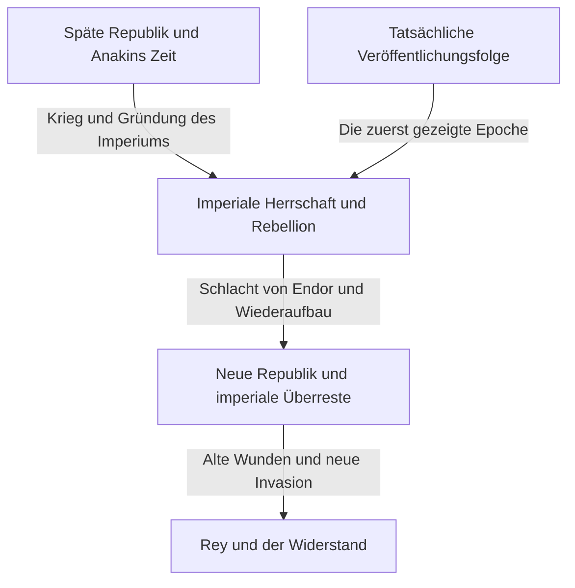
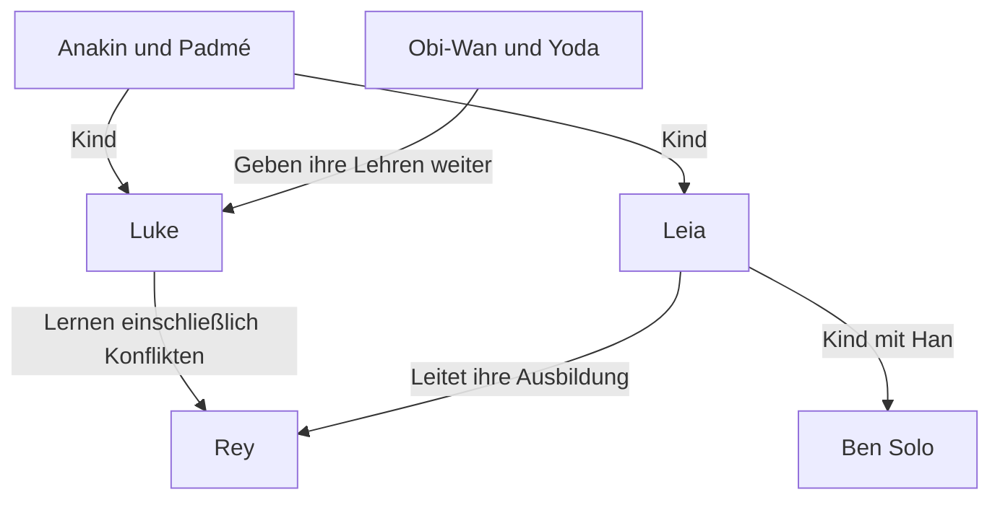

Auf den kürzesten Nenner gebracht ist Star Wars eine Abenteuergeschichte in einer fernen Galaxis. Doch in diesen Abenteuern überlagern sich Liebe und Konflikte zwischen Eltern und Kindern, der Zusammenbruch einer Demokratie, der Widerstand gegen ein Imperium, Religion und Macht, die Wunden des Krieges und Familien jenseits der Blutsverwandtschaft. Hinter der Leinwand liegt zudem eine Filmgeschichte, die den Umgang mit Modellen, Schnitt, Musik, Geräuschen und Computergrafik verändert hat.

Selbst wer Lichtschwerter und Darth Vader kennt, verliert mit der wachsenden Zahl der Werke leicht den Überblick. Warum begann die Veröffentlichung mit Episode IV? Warum konnten die Jedi die Republik nicht bewahren, obwohl sie Ritter der Gerechtigkeit waren? Was übernehmen die Geschichten von Anakin, Luke und Rey, und was verändern sie? Was erzählen Andor und The Mandalorian, das über einen Anhang zu den Filmen hinausgeht?

Dieser Artikel erschließt diese Fragen auf drei Ebenen: der Geschichte der Galaxis, den Beziehungen zwischen den Werken und der tatsächlichen Produktionsgeschichte. Er listet nicht lexikonartig jedes Detail auf, sondern bietet eine ausführliche Orientierung zu Ursachen und Folgen in den wichtigsten Werken sowie zu Themen, die sich bei ihrer Wiederkehr verändern. Dabei zeigt er die Weite dieser verzweigten Welt und schafft zugleich einen nachvollziehbaren Weg für Neulinge.

Der Text behandelt die Enden der neun Saga-Filme und verwandter Werke, geheime Identitäten, wichtige Todesfälle und Entscheidungen. Wer noch nicht alles gesehen hat und Überraschungen bewahren möchte, kann zunächst die einleitende Einordnung und den Leitfaden zur Sehfolge am Ende lesen und nach dem Anschauen zu den Einzelkapiteln zurückkehren. Inhalte und Veröffentlichungsstand wurden zum 3. Oktober 2026 geprüft. Die Illustrationen sind für diesen Artikel generierte Konzeptkunst, keine offiziellen Filmstandbilder oder Produktionsdokumente.

## Drei unterschiedliche Zeitachsen: Veröffentlichungsfolge, Geschichte der Galaxis und Entstehung der Hintergründe

Die größte Schwierigkeit beim Verständnis von Star Wars liegt darin, dass die Zeit nicht auf einer einzigen Linie verläuft. Der 1977 erstmals veröffentlichte Film wurde innerhalb der fiktiven Geschichte später als Episode IV eingeordnet. Das Publikum lernte zuerst Lukes Abenteuer kennen und sah die Jugend seines Vaters Anakin erst in den ab 1999 erschienenen Filmen. Was innerhalb der Handlung früher stattfindet, wurde also nicht unbedingt früher gedreht.

Daneben gibt es die Reihenfolge, in der die Schöpfer ihre Hintergründe entwickelten. Eine erst später enthüllte Beziehung kann eine frühe Szene anders erscheinen lassen. Das ist jedoch nicht gleichbedeutend mit der Behauptung, bei der Produktion des ersten Films seien sämtliche Geschichten der folgenden Jahrzehnte bereits festgelegt gewesen. Ein gewachsenes Werk sollte nicht allein aus seiner nachträglichen Stimmigkeit rückwärts rekonstruiert werden.

Die Unterscheidung dieser drei Zeiten erklärt auch den Reiz von Vorgeschichten. Das bekannte Ende beseitigt nicht jeden Überraschungseffekt: Man kann die Geschichte als Tragödie betrachten und fragen, wo andere Entscheidungen möglich gewesen wären. Die Veröffentlichungsfolge wiederum lässt die Vermittlung von Informationen ähnlich erleben wie das damalige Publikum. Beide Zugänge besitzen einen eigenen Wert; es gibt keine einzige richtige Lösung, mit der man sein Wissen beweisen müsste.

| Filmgruppe | Jahre der Erstveröffentlichung | Leitfrage |
| --- | --- | --- |
| Episoden IV, V und VI: Originaltrilogie | 1977, 1980, 1983 | Wie widersteht man übermächtiger Herrschaft und begegnet der Vergangenheit der eigenen Familie? |
| Episoden I, II und III: Prequel-Trilogie | 1999, 2002, 2005 | Warum verlieren die Republik und Anakin gerade das, was sie schützen wollen? |
| Episoden VII, VIII und IX: Sequel-Trilogie | 2015, 2017, 2019 | Wie übernimmt eine neue Generation die Siege und Fehler ihrer Vorgänger? |
| Rogue One und Solo | 2016, 2018 | Wie lassen sich Menschen am Rand der Haupthandlung und frühere Entscheidungen darstellen? |
| Der Kinofilm The Clone Wars | 2008 | Wie wird ein langer Krieg durch Beziehungen zwischen Menschen erweitert? |
| The Mandalorian and Grogu | 2026 | Wie lassen sich Schutz und Gemeinschaft nach dem Zusammenbruch des Imperiums denken? |

Die Jahreszahlen bezeichnen grundsätzlich die erste Kinoveröffentlichung und können von japanischen Startterminen abweichen. Veröffentlichungsfolge und grobe Chronologie lassen sich im [offiziellen Leitfaden zu Filmen und Serien](https://www.starwars.com/news/star-wars-movies-and-series-guide) nachschlagen. Wenn etwa eine Kurzfilm-Anthologie mehrere Epochen umfasst, kann es irreführen, ihren Titel an nur einem Punkt einer Zeitleiste einzuordnen.

Das Diagramm bietet ein Grundgerüst zum Verständnis der wichtigsten Bildschirmwerke. Es bedeutet beispielsweise nicht, dass das Imperium nach einer einzigen Schlacht aus jedem Winkel der Galaxis verschwunden wäre. Die symbolische Niederlage eines Regimes und Veränderungen in Militär, Verwaltung, Kriminalität und Bewusstsein verlaufen unterschiedlich schnell. Viele abgeleitete Geschichten entstehen in diesen zeitlichen Zwischenräumen.

## Kanon und Legends: Welche Geschichten gehören zu welcher Kontinuität?

Der Kanon ist ein Ordnungsrahmen für die heutige offizielle Erzählkontinuität. Legends bezeichnet eine Einordnung der zuvor entstandenen zahlreichen Romane, Comics, Spiele und anderen Geschichten. 2014 änderte Lucasfilm den Umgang mit dem bestehenden Expanded Universe und kündigte eine neue Entwicklung auf Grundlage der Filme und von The Clone Wars an. Die [damalige offizielle Erklärung](https://www.starwars.com/news/the-legendary-star-wars-expanded-universe-turns-a-new-page) erläutert diesen Übergang.

Die Einordnung als Legends bedeutet weder, dass ein Werk verschwunden wäre, noch dass es nicht mehr lesenswert sei. Man kann diese Geschichten als eine Galaxis lesen, die zu einer anderen Zeit unter anderen Bedingungen und Möglichkeiten wuchs. Umgekehrt gelangen nicht automatisch sämtliche alten Lebensläufe und Ereignisse in die neue Kontinuität, wenn ein vertrauter Name oder Gedanke wieder auftaucht. Gerade bei bekannten Namen sollte man prüfen, um welches Werk und welche Fassung es geht.

Auch teilen nicht sämtliche offiziell produzierten Werke dieselbe Kontinuität. Projekte wie Visions erproben Ausdrucksformen unabhängig von der etablierten Zeitlinie. Nicht jede im Spiel mögliche Handlung wird zwingend zu einem Ereignis der Erzählung; gelegentlich muss man die Optionen der Spielenden von dem unterscheiden, was eine Fortsetzung voraussetzt.

Zu vermeiden ist, aus der Einordnung von Hintergrundwissen ein Qualitätsurteil zu machen. Der Kanon erklärt Verbindungen, bewertet aber nicht die Stärke einer emotionalen Erfahrung. Was im Bild gezeigt wird, was offizielle Nachschlagewerke sagen, was Figuren behaupten und was das Publikum interpretiert, sind unterschiedliche Informationsarten. Die Überzeugung einer Figur ist nicht automatisch die allwissende Wahrheit der Welt.

Dieser Artikel orientiert sich an der Kontinuität der heutigen wichtigen Bildschirmwerke und kennzeichnet Legends oder eigenständige Projekte gesondert. Er unterscheidet außerdem zwischen Darstellung und Deutung. Man kann etwa die Jedi als Institution kritisch lesen; das ist eine Analyse des Publikums und keine offizielle Festlegung, die allen Jedi guten Willen abspricht.

## Eine kleine Figurenkarte zum Einstieg in die Galaxis

Im Zentrum stehen mehrere Generationen rund um die Familie Skywalker. Luke und Leia sind die Kinder von Anakin und Padmé. Leia und Hans Sohn ist Ben Solo, der sich später Kylo Ren nennt. Doch die Weitergabe der Geschichte lässt sich nicht allein durch Blutsverwandtschaft erklären. Lehren, Fehler und Entscheidungen wandern von Obi-Wan und Yoda zu Luke, von Anakin zu Ahsoka und weiter zur nächsten Generation einschließlich Rey.

R2-D2 und C-3PO durchqueren diese Geschichte aus anderen Positionen als Menschen. Chewbacca, Lando und die Gefährten der Rebellion verbinden die inneren Konflikte der Familie mit dem Kampf der gesamten Galaxis. Spätere Serien zeigen durch Cassian, Din Djarin, Grogu oder die Klone die Lebenszeit von Menschen und Wesen außerhalb des heroischen Zentrums.

Wer familiäre Beziehungen und Lehrverhältnisse getrennt betrachtet, erkennt, dass die galaktische Geschichte mehr ist als ein königlicher Stammbaum. Entscheidend ist weniger nur das Erbe als sein Gebrauch und die Frage, was man zurückweist. Beginnen wir daher mit jener Trilogie, durch die das Publikum diese Galaxis zuerst betrat, und betrachten wir die Funktion der einzelnen Werke.

## Episode IV, Eine neue Hoffnung: Galaktische Politik erreicht das Leben eines jungen Mannes

Der erste Film von 1977 beginnt mitten in der Geschichte seiner Welt. Ohne die Entstehung des Imperiums genau zu kennen, sieht das Publikum ein kleines Schiff, das von einem riesigen Kriegsschiff verfolgt wird. Schon die Größenverhältnisse zeigen den Machtunterschied zwischen Verfolger und Verfolgten. Der Einstieg erklärt die Welt nicht vollständig, bevor die Handlung beginnt, sondern vermittelt die nötigen Informationen durch die Aktionen der Figuren. Erscheinungsdatum und grundlegende Einordnung bestätigt auch die [offizielle Filmseite](https://www.starwars.com/films/star-wars-episode-iv-a-new-hope).

### Das Abenteuer beginnt nicht mit dem Bewusstsein, auserwählt zu sein

Luke Skywalker lebt auf einer Farm auf Tatooine und will zunächst nicht die Galaxis retten. Er ist ein junger Mann, der der Enge seines Alltags entkommen möchte. Doch die neu angekommenen Droiden transportieren Informationen der Rebellen, und Leias Hilferuf führt ihn zum zurückgezogen lebenden Obi-Wan Kenobi. Solange der politische Konflikt eine ferne Nachricht bleibt, kann Luke noch zur Farm zurückkehren. Diese Grenze bricht zusammen, als imperiale Gewalt seine Pflegeeltern tötet.

Die Kausalität ist wichtig. Luke gerät nicht bloß mit dem Imperium in Berührung, weil er das Abenteuer wählt; vielmehr wird das Leben zerstört, das mit dessen Herrschaft nichts zu tun haben wollte. Die Geschichte handelt sowohl von persönlicher Entwicklung als auch davon, wie staatliche Gewalt in das Leben am Rand eindringt. Trauer allein macht ihn allerdings nicht zum Helden. Erst Begegnungen mit einem Lehrer und Gefährten, das Erlernen von Handlungsmöglichkeiten und der Einsatz seiner Fähigkeiten für andere geben seinem ursprünglichen Wunsch eine öffentliche Bedeutung.

Leia wird gerettet, wartet aber nicht lediglich auf Rettung. Sie verbirgt Informationen, hält Verhören stand und trifft bei der Flucht Entscheidungen. In der Anlage, in die Luke und Han kommen, um ihr zu helfen, gleicht sie deren Fehler aus. Weil die Rollen nicht feststehen, bilden die drei kein schlichtes Verhältnis von Held, Helfer und Belohnung, sondern eine Gruppe, deren Mitglieder das Urteil der anderen herausfordern.

### Der Todesstern ist eine Waffe und eine Vorstellung von Herrschaft

Der Schrecken des Todessterns erschöpft sich nicht in seiner Fähigkeit, einen Planeten zu vernichten. Dahinter steht die Idee, durch demonstrierte Gewalt alltägliche Verhandlungen und politische Vertretung überflüssig zu machen. Die Auflösung des Senats und die Unterwerfung der Sternsysteme durch Angst gehören zusammen. Die Zerstörung Alderaans geht über den Angriff auf eine Militärbasis hinaus: Sie droht allen, die Widerstand erwägen.

Die Rebellen besitzen keine vergleichbare Waffe. Sie lesen Baupläne, entdecken eine kleine Schwachstelle und konzentrieren ihre begrenzten Kräfte. Der Erfolg setzt eine Verbindung zwischen der Arbeit informationsführender Droiden, der Übergeber der Pläne, der Analysten und der Wartungsmannschaften voraus. Luke gibt den entscheidenden Schuss ab, doch gesellschaftliche Zusammenarbeit macht diesen Schuss erst möglich. Wer diese Struktur übersieht, kann den Film irrtümlich auf die Geschichte eines Einzelnen mit besonderer Abstammung reduzieren, der alles löst.

Hans Rückkehr gehört zu dieser Zusammenarbeit. Ein Mann, der zuvor nach Geld entschied, hilft trotz der Gefahr seinen Freunden. Lukes Vertrauen in die Macht statt allein in sein Zielgerät und Hans Abkehr von einer ausschließlich nach Bezahlung bestimmten Entscheidung lassen sich beide als Schritte zu Vertrauen jenseits sichtbarer Gewinne und Verluste lesen. Die Technik soll nicht aufgegeben werden. Jäger, Kommunikation und Pläne bleiben notwendig; gefragt wird, was zum letzten Urteil hinzukommt.

Bemerkenswert ist außerdem, wie galaktische Geschichte über reparaturbedürftige Maschinen und Lebenshaltungskosten ins Bild tritt. Der Falke ist nicht nur ein ideales schnelles Fahrzeug, sondern ein Schiff, dessen Besitzer Mühe mit seinem Betrieb hat. In der Kantine sitzen Gäste, die nicht bloß zur Erklärung für den Helden dienen, und Droiden führen ein Leben, in dem sie gekauft und verkauft werden. Weil auch außerhalb der Bildmitte Dinge zu geschehen scheinen, spürt das Publikum eine schon lange bestehende Welt, ohne alles über sie wissen zu müssen.

## Episode V, Das Imperium schlägt zurück: Die Niederlage erschüttert das Selbstverständnis eines Helden

Der frühere Sieg bedeutete nicht das Verschwinden des Imperiums. Die Rebellen sind weiterhin auf der Flucht und können ihre Basis auf Hoth nicht halten. Der Film beginnt mit der Tatsache, dass die Zerstörung einer riesigen Waffe weder Institutionen noch Armeen beseitigt. Das Werk von 1980 entwickelt parallel Lukes Ausbildung und die Flucht Hans und seiner Gefährten. [Offizielle Filmseite](https://www.starwars.com/films/star-wars-episode-v-the-empire-strikes-back)

### Ausbildung verlangt mehr, als Steine anzuheben

Als Luke Yoda auf Dagobah begegnet, werden seine Erwartungen an Aussehen und Verhalten eines großen Lehrers enttäuscht. In dem kleinen, seltsamen Wesen erkennt er nicht sofort Weisheit. Dieser Kunstgriff wirkt auch auf das Publikum. Das Lernen über die Macht beginnt damit, Stärke nicht länger selbstverständlich mit einem großen Körper oder einer großen Waffe zu verbinden.

In der Höhle erscheint unter der Maske des von Luke besiegten Vader sein eigenes Gesicht. Der Film legt dieses Bild nicht einfach als Aufnahme der Zukunft fest. Man kann es als Warnung lesen, dass Angst und Wut gegenüber einem Feind einen selbst zu diesem Feind machen können. Im vorherigen Film galt es, das Imperium als äußeren Gegner zu besiegen; nun muss auch das Innere desjenigen geprüft werden, der den Feind besiegen will.

Nach einer Vision leidender Freunde bricht Luke seine Ausbildung ab. Diese Entscheidung lässt sich weder aufgrund ihrer Fürsorge als völlig richtig noch aufgrund seiner Unreife als völlig falsch abtun. Dass er die Freunde nicht aufgeben kann, ist verständlich, doch er überschätzt seine Kräfte und seinen Informationsstand. Außerdem nutzt Vader genau diese Gefühle, um ihn herauszulocken. Gute Absichten machen Lagebeurteilung nicht überflüssig.

### Landos Geschäft und die Grenzen des Kompromisses mit Herrschaft

Lando schließt ein Abkommen mit dem Imperium, um die Wolkenstadt zu schützen. Doch ein Vertrag gewährleistet keine Sicherheit, wenn der Mächtigere Zusagen einseitig ändern kann. Auf die Erfüllung einer Bedingung folgt die nächste Forderung. Sein Scheitern ist nicht nur persönlicher Verrat, sondern auch das politische Scheitern eines Versuchs, unter übermächtiger Gewalt Autonomie zu bewahren.

Wer einmal falsch handelt, muss jedoch nicht bis zum Ende daran festhalten. Lando leitet die Rettung ein. Luke scheitert, Lando verrät, Han wird gefangen; ihr Wert ergibt sich dennoch nicht allein aus ihrer momentanen Erfolgsquote. Das eigene Handeln korrigieren, Hilfe erbitten und auf Hilferufe antworten zu können, bleibt ein anderer Maßstab als Sieg.

Die Enthüllung, dass Vader Lukes Vater ist, soll die Unterscheidung von Gut und Böse nicht aufheben. Die Gewalt des Imperiums wird dadurch nicht gerechtfertigt. Was zerbricht, ist Lukes geordnete Familiengeschichte: Er sah sich als Sohn eines guten Vaters und den Feind als fremden Mann, der diesen Vater ermordet hatte. Aus der Vorstellung, durch den Sieg über den Feind dem Vater näherzukommen, wird die schwierigere Frage, wie er diesem Feind begegnen muss, um das väterliche Erbe anzutreten.

Luke beendet das Duell nicht als Sieger. Verwundet und unfähig, allein zu entkommen, wird er von Leia und den anderen gerettet. Dass ihn diejenige rettet, zu deren Rettung er im ersten Film aufbrach, widerspricht der Isolation des Helden. Selbstständigkeit bedeutet nicht nur, niemanden zu brauchen; sie kann auch heißen, mit Fehlern und Schwächen in Beziehungen zurückzukehren. Deshalb leistet das düstere Ende mehr als bloß den Aufschub bis zur nächsten Folge.

Die weißen Weiten von Hoth, die feuchte Enge Dagobahs und das helle Äußere und dunkle Innere der Wolkenstadt sind keine bloßen Reisehintergründe. Ihre Atmosphäre trägt den militärischen Rückzug, den Abstieg ins Innere und den Zusammenbruch scheinbarer Sicherheit. Mit jedem Ortswechsel reichen die vertrauten Fähigkeiten des Helden weniger aus. Ein Sieg im Sternenjäger liefert keine Antworten auf Ausbildung, Verhandlung oder das Gespräch mit dem Vater.

Generierte Konzeptkunst zur ungleichen Machtverteilung zwischen Rebellion und Imperium, kein offizielles Filmstandbild.

## Episode VI, Die Rückkehr der Jedi-Ritter: Den Vater retten und das Imperium besiegen

Der Abschluss von 1983 beginnt mit Hans Rettung und verbindet die Wiederherstellung persönlicher Beziehungen mit einem galaktischen Krieg. Luke wirkt in Jabbas Palast ruhiger als der Jugendliche des ersten Films und sicherer im Umgang mit seiner Macht. Sein Auftreten allein beweist jedoch keine Reife als Jedi. Entscheidend wird, was er tut, wenn er gewinnen kann. [Offizielle Filmseite](https://www.starwars.com/films/star-wars-episode-vi-return-of-the-jedi)

### Die Falle des Imperators zielt mehr auf Wut als auf Tod

Während der Imperator die Rebellen militärisch vernichten will, versucht er Luke auf seine Seite zu ziehen. Er zeigt ihm die gefährdeten Freunde, treibt ihn zum wütenden Angriff und will diese Emotion im Vatermord vollenden. Selbst wenn Luke Vader besiegt, gewinnt der Imperator, sobald Luke dieselbe Logik der Herrschaft akzeptiert. In diesem Duell können äußerer Sieg und ethischer Erfolg deshalb gegensätzliche Richtungen nehmen.

Die Drohung gegen Leia versetzt Luke in Zorn; er überwältigt Vader. Als er die mechanische Hand seines Vaters mit seiner eigenen vergleicht, kehrt die Höhlenvision als konkrete Entscheidung zurück. Seine Waffe wegzuwerfen bedeutet nicht, Gewaltlosigkeit zu wählen, weil keine Gefahr besteht. Er akzeptiert die Möglichkeit, selbst getötet zu werden, und verweigert den Mord am Vater. Er verlässt einen Maßstab, nach dem Stärke durch die Vernichtung des Gegners bewiesen werden muss.

Vaders Auflehnung gegen den Imperator ist eine Entscheidung angesichts des Leidens seines Sohnes. Darin liegt Erlösung, aber keine Erklärung, dass vergangene Verbrechen ausgelöscht wären. Der Glaube eines Sohnes an das Gute im Vater ist etwas anderes als eine Pflicht der Opfer, dem Täter zu vergeben. Der Film zeigt eine letzte Wendung in der Vater-Sohn-Beziehung und verhandelt nicht sämtliche rechtliche Verantwortung und historische Erinnerung. Diese Unterscheidung macht die Grenzen des Endes verständlich, ohne dessen emotionale Wirkung zu mindern.

### Warum die Waldschlacht ebenso notwendig ist wie der Thronsaal

Isoliert man die Begegnung mit dem Imperator, scheint die Welt allein durch Familienprobleme bewegt zu werden. Tatsächlich kann die Flotte den zweiten Todesstern aber nur vernichten, wenn der Bodentrupp auf Endor den Schild ausschaltet. Lukes Rettung seines Vaters und die Zerstörung der militärischen Anlage durch die Rebellen sind gleichzeitig nötig. Keines ersetzt automatisch das andere.

Die Ewoks bringen Ortskenntnis und eine andere Kampfweise in das gemeinsame Unternehmen ein. Das Imperium verfügt über stärkere Panzerung und Feuerkraft, nimmt die Bewohner aber nicht als vollwertige Handelnde ernst. Diese Geringschätzung lässt es Widerstand durch Geländeausnutzung und Überraschung falsch einschätzen. Daraus folgt selbstverständlich kein allgemeines Gesetz, nach dem einfache Waffen in realen Kriegen immer moderne Armeen besiegen. Als Fabel macht die Szene sichtbar, wie Herrschende das Urteil und den Zusammenhalt kleiner Wesen unterschätzen.

Luke, Han, Leia, Lando, Chewbacca, Droiden, namenlose Soldaten und die Bewohner Endors tragen bei. Weil ihre Leistungen zusammenlaufen, ist das Fest keine Krönung eines Einzelnen. Es beendet auch Lukes Rückkehr zur Gemeinschaft nach dem Verlust seines Vaters. Persönlicher Verlust und gemeinsamer Sieg bestehen nebeneinander; deshalb ist das Glück kein völlig unversehrtes Happy End.

Die Niederlage des Imperators ist außerdem ein Fehler in seiner Annahme, alle anderen würden letztlich durch Eigennutz und Angst gesteuert. Ein Sohn, der seinen Vater nicht aufgibt, und ein Vater, der den Sohn über den Gehorsam gegenüber dem Herrscher stellt, liegen außerhalb seiner Berechnung. Große Macht erlaubt keine vollständige Vorhersage menschlicher Entscheidungen. Darin ähneln sich das übermäßige Vertrauen in riesige Waffen und die Überzeugung, jedes menschliche Herz durchschaut zu haben.

## Episode I, Die dunkle Bedrohung: Ein Imperium zeigt nicht von Anfang an sein Gesicht

Die Vorgeschichte von 1999 beginnt nicht mit der eindeutigen Militärdiktatur des ersten Films, sondern mit einem Konflikt innerhalb der Republik. Die Blockade Naboos durch die Handelsföderation verwandelt einen Streit über Handel und Besteuerung in bewaffnete Besetzung. Die junge Königin Padmé Amidala erwartet, dass ein Appell an den Senat die Tatsachen anerkennen und Hilfe bringen wird. Doch die Institutionen verharren in Untersuchungen und Verfahren; das Entscheidungstempo entspricht nicht dem Leiden vor Ort. [Offizielle Filmseite](https://www.starwars.com/films/star-wars-episode-i-the-phantom-menace)

### Palpatine gewinnt Unterstützung als vermeintlicher Krisenlöser

Wer die spätere Geschichte kennt, hört die Ratschläge des Senators von Naboo auf zwei Ebenen. Palpatine stellt sich an die Seite der Geschädigten und nutzt das Misstrauen gegenüber einer unfähig wirkenden Führung. Entscheidend ist, dass er nicht von außen in den Senat eindringt und die Republik mit einem Schlag zerstört. Er steigt mithilfe parlamentarischer Verfahren und menschlicher Erwartungen auf.

Auch die Gegner bilden keinen einheitlichen Block. Die Handelsföderation verfolgt eigene Interessen, während Darth Sidious sie als Werkzeug eines größeren Plans verwendet. Selbst wenn der sichtbare Konflikt gelöst wird, bleibt die dadurch entstandene Machtverschiebung bestehen. Naboos Befreiung ist ein wirklicher Sieg, aber nicht unbedingt ein Sieg für die Zukunft der gesamten Republik. Weil diese beiden Maßstäbe auseinanderfallen, haftet der Feier etwas Unheilvolles an.

Padmés Bitte an die Gungans zeigt eine entgegengesetzte Politik. Statt nur die Würde ihres Amtes zu bewahren, erkennt sie an, dass beide Gruppen denselben Planeten bewohnen, und bittet um Hilfe. Sie gleicht nicht bloß fehlende militärische Kräfte aus; zuvor getrennte Gruppen schaffen einen gemeinsamen Zweck. Dieser kleine Zusammenhalt erzeugt die praktische Handlungsfähigkeit, die der Senat nicht bereitstellt.

### Vor Anakins Talent steht sein Leben

Der junge Anakin besitzt erstaunliche Flugkünste, ist aber zugleich ein Sklave. In einer Welt mit einer riesigen Republik und Jedi, die von Gerechtigkeit sprechen, ist die Freiheit einer Mutter und ihres Kindes nicht garantiert. Das zeigt den Unterschied zwischen bestehenden Institutionen und einem Schutz, der jede Region erreicht. Qui-Gon kann Anakin befreien, seine Mutter Shmi jedoch nicht auf dieselbe Weise retten.

Der Aufbruch verbindet die Freude über Anerkennung mit der Angst, die Mutter zurückzulassen. Wer den späteren Anakin ausschließlich als schwachen Menschen beschreibt, der seine Angst nicht überwinden konnte, übersieht deren Entstehungsbedingungen. Zugleich macht eine schwierige Kindheit spätere Gewalt nicht unvermeidlich. Die Geschichte fragt, welche Unterstützung und Bildung ein verletzter Mensch gebraucht hätte.

Durch Qui-Gons Tod kann der Lehrer, der Anakin entdeckt hat, ihn nicht lange begleiten. Obi-Wan übernimmt das Versprechen, doch ihre Beziehung ist nicht von Beginn an fertig ausgebildet. Eine große Prophezeiung und institutionelle Erwartungen eilen der Entwicklung eines Kindes voraus. Dieses Ungleichgewicht bereitet die Tragödie der gesamten Prequel-Trilogie vor.

Auch produktionstechnisch wäre es falsch, die Prequels als vollständig am Computer entstandene Filme zu bezeichnen. Offizielle Einblicke schildern praktische Einfälle wie farbige Wattestäbchen zur Darstellung der Zuschauer in einem Podrennen-Modell. Näher an der Wirklichkeit liegt die Vorstellung eines Zusammenspiels neuer Technik und Handarbeit. [Offizielle Produktionsfakten](https://www.starwars.com/news/25-fun-facts-the-phantom-menace)

Die parallelen Schauplätze des abschließenden Kampfes helfen ebenfalls, die Aufgaben der Gruppen zu unterscheiden. Das Ablenkungsmanöver der Gungans, das Vorgehen im Palast, die Raumschlacht und das Jedi-Sith-Duell lösen verschiedene Probleme. Ein starker Schwertkämpfer allein beendet keine Besatzung. Zudem geht Qui-Gon während des militärischen Erfolgs verloren: Der Sieg einer Gemeinschaft und der Verlust im Leben eines Jungen fallen nicht zusammen.

## Episode II, Angriff der Klonkrieger: Kriegsvorbereitungen verengen die Möglichkeiten

Im zweiten Prequel von 2002 wächst die Bewegung zur Abspaltung von der Republik, und die Aufstellung einer Armee wird zur politischen Frage. Bei der Untersuchung des Mordanschlags auf Padmé entdeckt Obi-Wan die Klonarmee. Vor einer Republik, die noch über Krisenvorsorge zu diskutieren schien, steht plötzlich ein fertiges Heer. Sicherheitsdruck verbindet sich mit einer bequemen Lösung unklarer Herkunft. [Offizielle Filmseite](https://www.starwars.com/films/star-wars-episode-ii-attack-of-the-clones)

### Die Notwendigkeit des Krieges überholt ein aufklärungsbedürftiges Rätsel

Wie die Klonarmee bestellt wurde und wessen Interessen sie dient, müsste vorrangig untersucht werden. Doch angesichts einer unmittelbar drohenden feindlichen Armee wünschen Menschen sofort einsetzbare Kräfte. Eine Krise verändert Entscheidungen, indem sie die Zeit zur Prüfung nimmt. Die Armee wird nicht nach gründlicher Überprüfung angenommen, sondern unter Bedingungen, die Alternativen unmöglich erscheinen lassen.

Dookus Kritik an der Republik benennt reale institutionelle Korruption. Ein Problem richtig zu erkennen garantiert jedoch nicht, dass die vorgeschlagene Lösung gerecht ist. Weil er selbst am Plan der Sith mitwirkt, führt Enttäuschung über die Republik nicht unmittelbar zur Befreiung. Man muss den sichtbaren Gegensatz der Lager von Sidious' Position als Nutznießer dieses Gegensatzes unterscheiden.

Die Jedi ziehen zum Schutz des Friedens in den Kampf und werden zu Generälen. Paradoxerweise trägt ihre erfolgreiche Rettungsaktion zum Kriegsbeginn bei. Die unmittelbare Rettung von Menschenleben besteht neben der langfristigen Stärkung einer militärischen Ordnung. Mittel, die einem guten Zweck dienen sollen, verändern nach und nach den Charakter der Organisation.

### Liebe und Politik verbindet der Wunsch nach Kontrolle

Anakins und Padmés Beziehung steht unter den Hindernissen von Stellung, Amt und Jedi-Disziplin. Die geheime Ehe schützt ihre Liebe, schränkt aber den Zugang zu Rat und Unterstützung ein. Weil weniger Menschen ihre Schwierigkeiten kennen, lassen sich später wachsende Ängste schwerer von außen betrachten.

Nach dem Tod seiner Mutter tötet Anakin in einer Tusken-Siedlung Menschen beziehungsweise Angehörige dieser Gemeinschaft, darunter Kinder. Die Szene darf nicht bloß als Inszenierung heftigen Zorns abgetan werden. Erlebte Gewalt gegen einen geliebten Menschen wird zur Rechtfertigung von Gewalt gegen andere: ein klarer ethischer Zusammenbruch. Trauer ist verständlich, doch Handeln trägt Verantwortung. Der spätere Fall ist keine plötzliche Richtungsänderung; bereits hier überschreitet er eine schwere Grenze.

Anakins politische Vorstellung, ein starker Führer solle bei erwünschtem Ergebnis entscheiden, spiegelt seinen Wunsch, Verluste in nahen Beziehungen zu kontrollieren. Es fällt schwer anzuerkennen, dass Menschen einen eigenen Willen und geliebte Personen ein Leben außerhalb unserer Verfügung besitzen. Wer Unsicherheit durch Zwang beseitigen will, zerstört jedoch gerade die Beziehung, die er schützen möchte. Im nächsten Film nimmt dieses Problem seine äußerste Form an.

Die einheitlichen Gesichter der Klonarmee vermitteln zudem das Unbehagen, Menschen als austauschbare Kampfeinheiten zu behandeln. Gleiche Herkunft macht ihr Leben nicht identisch. Der Film prägt zunächst den Eindruck einer Massenarmee, spätere Werke erschließen einzelne Persönlichkeiten. Beachtet man diese Reihenfolge, lässt sich die vermeintliche Rettung der Republik neu betrachten: Wer trägt eigentlich ihre Kosten?

## Episode III, Die Rache der Sith: Der Rettungswunsch wird zur Logik der Herrschaft

Im dritten Prequel von 2005 bricht die Republik zusammen, während das Ende der Klonkriege näher rückt. Entgegen der Hoffnung, ein Sieg stelle Frieden wieder her, wird die für die Kriegsführung konzentrierte Macht zur Grundlage einer Nachkriegsdiktatur. Weil Anakin und die Republik gleichzeitig fallen, lässt sich die Tragödie weder allein auf persönliche Schwäche noch allein auf institutionelles Versagen reduzieren. [Offizielle Filmseite](https://www.starwars.com/films/star-wars-episode-iii-revenge-of-the-sith)

### Palpatine verkauft das Versprechen, den Tod zu beherrschen

Anakin fürchtet eine Zukunft ohne Padmé. Palpatine bestreitet diese Angst nicht direkt, sondern deutet eine anderswo unerreichbare Macht an. Das ist raffinierter als bloße Predigt einer bösen Lehre. Er erkennt, was der andere am wenigsten verlieren möchte, und macht sich für dessen Schutz unentbehrlich. Mit zunehmender Abhängigkeit lassen sich widersprüchliche Erklärungen und verbrecherische Forderungen leichter hinnehmen.

Zwischen Anakin und dem Jedi-Rat besteht ebenfalls Misstrauen. Er fühlt sich nicht anerkannt; der Rat betrachtet seine Nähe zu Palpatine mit Sorge. Zusätzlich soll er spionieren, wodurch seine Loyalitäten auseinandergerissen werden. Diese Lage zu erklären heißt aber nicht, sein Handeln zu entschuldigen. Nachdem er Mace Windu aufhält, um Palpatine zu schützen, folgt er immer zerstörerischeren Befehlen.

Nach einem schweren Fehler suchen Menschen mitunter eher einen Weg, der ihn sinnvoll erscheinen lässt, als umzukehren. Auch Anakins Handeln lässt sich als solche Kette der Selbstrechtfertigung lesen. Nun, da er so weit gegangen ist, muss er die Macht erlangen, sonst wäre alles vergeblich gewesen. Dieser Gedanke lässt das nächste Unrecht als notwendiges Opfer erscheinen.

### Order 66 lenkt die vorhandene tödliche Gewalt einer Institution um

Die Jedi werden nicht von einer neu eintreffenden Feindarmee angegriffen, sondern von Soldaten, mit denen sie gemeinsam gekämpft haben. Wenn eine Befehlskette ihre Richtung umkehrt, werden auf Verbundenheit beruhende Aufstellungen und Vertrauen zur Schwachstelle. Der Film zeigt den Befehl und die gleichzeitigen Angriffe; die genaue Kontrolle der Klone wird in verwandten Animationswerken ergänzt. Diese Ergänzungen vom Film zu unterscheiden macht die Aufgaben der einzelnen Werke sichtbar.

Auch das Imperium entsteht nicht in einem Augenblick, in dem sämtliche republikanischen Gebäude zerstört werden. Im Parlament wird es als neue Ordnung proklamiert. Unter dem Versprechen wiederhergestellter Sicherheit gehen Überwachung und Gewalt in dauerhafte Herrschaft über. Die Darstellung der Jedi als Verräter verwandelt Widerstand gegen Machtkonzentration in einen Angriff auf Ordnung.

Auf Mustafar richtet Anakin Gewalt gegen Padmé, die er retten wollte. Ihr Widerspruch wird für ihn zum Verrat, statt dass er ihren eigenen Willen respektiert. Hier tritt der Unterschied zwischen Zuneigung und Besitzanspruch scharf hervor. Seine gewünschte Zukunft erforderte nicht nur eine lebende Padmé, sondern eine Padmé, die seine Entscheidungen bestätigt.

Die Szenen, in denen der verbrannte Anakin in eine Rüstung eingeschlossen wird und die Zwillinge geboren werden, zeigen Verzweiflung und neue Möglichkeit zugleich. Obi-Wan und Yoda sind keine Sieger. Dennoch bewahrt der Schutz der Kinder eine Zukunft innerhalb der politischen Niederlage. Die Prequels vollenden sich als Geschichte, in der guter Wille, Angst, Institutionen und Ehrgeiz zusammen die Katastrophe erzeugen, nicht als Geschichte, in der das Böse nur wegen verschwundener guter Menschen gewinnt.

Obi-Wans Trauer hat nichts von der Genugtuung, einen Bösewicht entlarvt und besiegt zu haben. Er muss gegen jemanden kämpfen, den er als Bruder betrachtete, und Fragen an seine eigene Ausbildung und Urteilskraft bleiben. Die Länge ihres Duells lässt sich daher nicht nur als Vergleich von Können lesen, sondern als Qual zweier Menschen, die einander kennen und ihre Beziehung nicht lösen können. Auch der Sieger hat keinen Ort, an dem er sich über den Sieg freuen könnte.

## Episode VII, Das Erwachen der Macht: Eine neue Generation erbt Helden, die sie nie kannte

Im neuen Kapitel von 2015 sind die Helden der Rebellion für Rey und Finn beinahe Sagengestalten. Namen, die dem Publikum vertraut sind, liegen für die jungen Figuren in der Ferne. Dieser Unterschied bringt die Erinnerung langjähriger Zuschauer und das Staunen von Neulingen in dasselbe Bild. In der Welt nach dem Imperium erscheint die Erste Ordnung: Der frühere Sieg garantiert nicht die Sicherheit der nächsten Generation. [Offizielle Filmseite](https://www.starwars.com/films/star-wars-episode-vii-the-force-awakens)

### Finn wird zum Protagonisten, indem er zunächst einen Befehl verweigert

Finn beginnt weder mit besonderer Abstammung noch mit einer Prophezeiung. In einer Situation, die soldatischen Gehorsam verlangt, weigert er sich zu töten. Dadurch verwandelt er sich von einer Nummer innerhalb einer Organisation in jemanden, der selbst entscheidet. Er ist jedoch nicht sofort bereit, die gesamte Galaxis zu retten; anfangs möchte er vor allem fliehen. Der Film zeigt nicht gutes Handeln nach überwundener Angst, sondern das Bleiben für einen anderen Menschen trotz vorhandener Angst.

Rey beherrscht auf Jakku die Fertigkeiten des Überlebens, wartet aber auf eine Familie, die vielleicht zurückkehrt. Ihre Stagnation beruht nicht auf mangelndem Können, sondern auf einer Erwartung an die Vergangenheit. Die Heimat zu verlassen bedeutet mehr als den Wechsel auf einen anderen Planeten: Es ist der Schritt von der Hoffnung, durch Warten das alte Leben zurückzuerlangen, zur Möglichkeit, neue Beziehungen selbst zu schaffen.

### Kylo Ren begehrt Vaders Bild ebenso wie dessen Stärke

Ben Solo versucht, sich als Kylo Ren neu zu erschaffen. Er verehrt seinen Großvater Vader, doch dessen letzte Rettung seines Sohnes passt nicht zu dem Bild mächtigen Bösen, das er sucht. Menschen übernehmen die Vergangenheit nicht immer vollständig; manchmal wählen sie nur die Teile, die sie brauchen. Kylo zeigt, dass historische Überlieferung auch eine Fehllektüre sein kann.

Auch die Tötung Hans ist mehr als die Beseitigung eines Hindernisses durch einen kühlen Bösewicht. Kylo glaubt, durch die Trennung von familiären Bindungen stark zu werden, und versucht, sich umzugestalten. Gewalt löst innere Konflikte jedoch nicht zwangsläufig. Die Handlung, die seine Unsicherheit beseitigen soll, schafft eine neue Wunde. Während Reys Geschichte neue Verbindungen gewinnt, will Kylo sich durch deren Durchtrennung festlegen.

Die Ähnlichkeiten zum ersten Film, etwa Starkiller-Basis und kartentragender Droide, sind offenkundig. Man kann sie nostalgisch genießen oder als strukturelle Wiederholung kritisieren. Analytisch lohnt sich jedoch, über die Ähnlichkeit hinaus die unterschiedlichen Entscheidungen vergleichbar platzierter Figuren zu betrachten. Ein Soldat der Gegenseite wird zum Helden, eine auf Rettung wartende junge Frau widersetzt sich selbst, und der Sohn eines Helden wird zum Gegner. Innerhalb vertrauter Umrisse rückt die Unsicherheit des Erbens ins Zentrum.

Die Vernichtung des Zentrums der Neuen Republik zeigt eindringlich die Zerbrechlichkeit politischer Ordnung. Weil der Film deren Alltag kaum schildert, kann der konkrete Verlust jedoch schwer greifbar bleiben. Das lässt sich als Grenze seiner Erklärung benennen. Verwandte Werke geben dem Ereignis mehr Gewicht, doch Unkenntnis dieser Werke ist nicht allein ein Verständnisfehler des Publikums. Die im Werk selbst vermittelte Informationsmenge prägt das Seherlebnis.

## Episode VIII, Die letzten Jedi: Fehler anerkennen, ohne Verantwortung aufzugeben

Der zweite Sequel-Film von 2017 erschüttert die Erwartung, Reys Begegnung mit Luke werde die Probleme lösen. Luke hat sich davon zurückgezogen, noch einmal als Held aufzutreten. Zugleich wird der Widerstand verfolgt und muss mit wenigen Mitteln über sein Überleben entscheiden. Der Film überprüft persönliche Heldenbilder und organisatorische Führung parallel. [Offizielle Filmseite](https://www.starwars.com/films/star-wars-episode-viii-the-last-jedi)

### Rechtfertigt ein Schuldeingeständnis die Aufgabe von allem?

Lukes und Bens Vergangenheit wird aus verschiedenen Blickwinkeln erzählt. Derselbe Moment bedeutet etwas anderes als Lukes kurzer Schreck oder als Bens Angst angesichts dieses Anblicks. Das ist kein Relativismus, der Tatsachen leugnet. Es geht um den Unterschied zwischen dem eigenen Gedanken und dem tatsächlichen Erlebnis des anderen. Dass ein Impuls nur kurz dauerte und bereut wurde, beseitigt die Verletzung nicht.

Luke verbindet sein Versagen mit dem Scheitern aller Jedi und will ihre Tradition beenden. Kritik an ihrer Geschichte verdient Aufmerksamkeit; rechtfertigt sie jedoch nur seine Abwesenheit, entfernt sie ihn von der Verantwortung gegenüber aktuell Leidenden. Zwischen bedingungsloser Bewahrung und vollständiger Aufgabe nach einem Fehler braucht es einen Weg, aus Fehlern zu lernen und anders weiterzugeben.

Rey und Kylo berühren die Möglichkeit gegenseitigen Verständnisses, doch Verständnis ist nicht Zustimmung. Gemeinsame Einsamkeit verlangt nicht, eine Ordnung der Unterwerfung zu akzeptieren. Auch Snokes Tötung macht Kylo nicht automatisch gut. Einen Herrscher zu töten und dessen Herrschaftsweise abzulehnen sind unterschiedliche Handlungen; Kylo will den freien Platz selbst einnehmen.

### Mut und Führung haben unterschiedliche Zeithorizonte

Poe besitzt den Mut, den unmittelbaren Gegner zu vernichten, muss aber lernen, wie viele Menschen und Kräfte dieser Erfolg kostet. Ein auffälliger Sieg in einer Schlacht unterscheidet sich davon, eine Organisation bis morgen am Leben zu halten. Für einen Verantwortlichen gehören auch der Verzicht auf Angriff und der Rückzug zur Pflicht.

Der Konflikt mit Holdo betrifft außerdem die Schwierigkeit des Informationsaustauschs. Das Publikum erlebt ungleiche Wissensstände. Daraus pauschal zu folgern, Untergebene sollten schweigend gehorchen, wäre zu eng. Betrachtet man Geheimhaltung, Vertrauen, Befehlsgewalt und fehlende Erklärungen als kollidierende Faktoren einer Krise, werden Stärken und Fehler der Figuren gleichermaßen sichtbar.

Die Episode auf Canto Bight zeigt, dass scheinbar kriegsferner Wohlstand über Waffen und Ausbeutung mit dem Krieg verbunden sein kann. Finn gelangt vom Schutz einer bestimmten Freundin zu einem breiteren Verständnis des Widerstands. Dass Profiteure mit beiden Seiten handeln, beweist allerdings keine identischen politischen Ziele der Lager. Kritik an Gewinnstrukturen ist von der Gleichsetzung von Angriff und Widerstand zu trennen.

Lukes letzte Handlung besteht nicht im Töten vieler Feinde, sondern darin, den Gefährten Zeit zum Überleben zu verschaffen. Der Mann, der seine Legende ablehnte, übernimmt deren hoffnungsstiftende Kraft und bindet die Aufmerksamkeit des Gegners auf andere Weise als durch einen körperlichen Sieg. Man kann den Film als Bewegung von der Zerstörung eines Heldenbildes zur bewussten Neuwahl seines Gebrauchs lesen.

Rey suchte bei Luke nicht nur Fähigkeiten, sondern auch eine Antwort, die ihre Identität von außen bestimmen sollte. Doch der Lehrer ist ebenfalls ein Mensch mit Fehlern und Ängsten. Nachdem sie seine Unvollkommenheit erkennt, muss sie entscheiden, was sie von seinen Lehren übernimmt. Deshalb erzählt der Film nicht nur die Ablehnung eines Lehrers durch seine Schülerin, sondern fragt, ob Lernen ohne Idealisierung weitergehen kann.

## Episode IX, Der Aufstieg Skywalkers: Herkunft und ein selbst gewählter Name

Der neunte Film von 2019 lässt Palpatine als endgültigen Gegner zurückkehren und verknüpft Reys Herkunft mit seiner Familie. Ihr zuvor vermitteltes Verständnis, keiner bedeutenden Linie zu entstammen, verändert sich erheblich. Diese Wendung wird unterschiedlich beurteilt; eine Analyse sollte zunächst unterscheiden, was jeder Film mitteilt und was der nächste hinzufügt. [Offizielle Filmseite](https://www.starwars.com/films/star-wars-episode-ix-the-rise-of-skywalker)

### Abstammung kann Fähigkeiten erklären, aber keine Moral befehlen

Rey fürchtet, dass eine böse Abstammung ihre Zukunft festlegt. Das Ende führt jedoch zur Wahl von Lehren und Beziehungen statt zur Unterwerfung unter Herkunft. Der Punkt lässt sich nicht einfach mit der Behauptung erledigen, Blut spiele keine Rolle. Der Film verwendet Verwandtschaft als bedeutenden Kunstgriff und versucht zugleich, Freiheit durch die Zurückweisung der daraus scheinbar folgenden Rolle darzustellen.

Luke und Leia bieten Rey einen anderen Weg des Erbens. Die Wahl des Namens Skywalker lässt sich weniger als biologische Angabe lesen denn als Bekenntnis zu Werten und zu Beziehungen, die sie geprägt haben. Ein Name beseitigt allerdings weder Leiden noch Vergangenheit. Bedeutung erhält die Entscheidung, wie man sich nach der Erkenntnis dieser Vergangenheit selbst bezeichnet.

Die technischen Einzelheiten von Palpatines Rückkehr erklärt der Film nur begrenzt. Ergänzende Materialien dürfen nicht mit direkt Gezeigtem vermischt werden, als sei alles auf der Leinwand aufgeklärt. Im Film ist wichtig, dass seine Todesangst und Machtgier selbst weitere Körper und Generationen zu Werkzeugen machen. Der Mann, der Anakin die Beherrschung des Lebens versprach, benutzt andere bis zuletzt zur eigenen Erhaltung.

### Bens Umkehr kehrt den Gedanken um, den Tod zu bezwingen

Bens Rückkehr aus seinem Leben als Kylo Ren entsteht durch den Einfluss seiner Mutter, Reys Rettung seines Lebens und die Erinnerung an seinen Vater. Sein früherer Versuch, durch Vatermord vom inneren Konflikt frei zu werden, scheiterte. Die erneute Annahme von Beziehungen eröffnet dagegen eine andere Wahl. Sie löscht vergangenes Unrecht nicht, lässt aber die Möglichkeit einer anderen Handlung im gegenwärtigen Moment bestehen.

Dass er Rey am Ende Leben gibt, kontrastiert mit Anakin, der andere opferte, um einen geliebten Menschen nicht zu verlieren. Statt die Welt zur Bewahrung des Lebens zu beherrschen, gibt er etwas von sich. Dieser Gegensatz verändert über neun Filme hinweg die Bedeutung des Rettens. Jemanden bei sich behalten zu wollen ist nicht dasselbe wie dessen Leben zu wünschen.

Die bei Exegol versammelte Flotte hat eine Aufgabe unabhängig von Reys Duell. Durch Angst isolierte Menschen erkennen einander und kommen zusammen. Wie überzeugend das erscheint, hängt vom Publikum ab; erzählerisch ist jedoch eine Teilnahme jenseits der Fähigkeiten einer einzelnen Heldin erforderlich. Der Endkampf verbindet erneut einen Streit der Blutlinien mit dem Widerstand vieler Menschen außerhalb dieser Linien.

Als Abschluss von neun Filmen bedeutet die Rückkehr nach Tatooine auch, dass derselbe Ort nicht denselben Zustand bedeutet. Im ersten Film blickte ein junger Mann zum Horizont, der fortwollte; am Ende nennt jemand nach einer langen Reise den eigenen Namen. Das wiederkehrende Anfangsbild verbindet die Erweiterung der Welt mit der Entscheidung über den eigenen Standort zu einer abgeschlossenen Bewegung.

## Rogue One: Die Menschen ohne Heimkehr ermöglichen den entscheidenden Schuss

Rogue One von 2016 schildert unmittelbar vor dem ersten Film, wie die Todessternpläne die Rebellen erreichen. Das bekannte grobe Ergebnis nimmt die Spannung nicht, weil es nicht nur um das Eintreffen der Pläne geht, sondern darum, wer dafür was verliert. Die offizielle Produktionsankündigung nennt John Knoll von ILM als Ideengeber und betont den Blickwinkel eines Krieges am Boden. [Offizielle Produktionsankündigung](https://www.starwars.com/news/rogue-one-the-daring-mission-has-begun-cast-and-crew-announced)

### Der Widerstand eines Ingenieurs und seine Bedeutung für die Tochter

Galen Erso arbeitet an imperialen Waffen mit und baut zugleich eine Schwachstelle ein, die deren Zerstörung ermöglicht. Das wirft schwierige Fragen auf: Bedeutet das Verbleiben in einer Institution immer Mitschuld, und wie weit kann Sabotage von innen reichen? Aus seinem Beispiel folgt nicht, dass alle Mitwirkenden heimliche Widerstandskämpfer wären. Der Film zeigt die konkrete Wahl eines Menschen und die Schwierigkeit, sie anderen mitzuteilen.

Jyn erhält Bruchstücke über ihren Vater und revidiert dessen Einordnung als bloßen Verräter. Entscheidend ist, dass die Erkenntnis seiner guten Absicht die Waffe nicht stoppt. Die Information muss belegt, die Pläne müssen beschafft und in nutzbarer Form weitergegeben werden. Erst wenn persönliche Versöhnung zu öffentlichem Handeln wird, entfaltet der Widerstand ihres Vaters Wirkung.

### Unrecht der Rebellen zu zeigen rechtfertigt das Imperium nicht

Cassian hat für die Rebellion dunkle Aufgaben übernommen. Manche seiner Taten lassen sich nicht allein durch den gerechten Zweck entschuldigen. Auch innerhalb der Rebellen gibt es Meinungsverschiedenheiten; angesichts der Gefahr bilden sie keinen einheitlichen Block. Diese Darstellung zeigt fehlende Unschuld auf der Seite des Widerstands, setzt Widerstand und Herrschaft aber nicht gleich.

Gefragt wird vielmehr, was Menschen mit schmutzigen Händen als Nächstes tun. Cassians Handeln mit Jyn enthält den dringenden Wunsch, frühere Opfer nicht bloß Opfer bleiben zu lassen. Dieser Wunsch kann allerdings weitere Opfer endlos rechtfertigen. Der Film markiert die Grenze als Unterschied zwischen Befehlen, die andere verbrauchen, und Entscheidungen, selbst Gefahr zu übernehmen.

Auf Scarif sind Bodenkommunikation, Flotte und Bedienung der Einrichtungen voneinander getrennt. Auch ein starker Einzelner verhindert das Scheitern nicht, wenn anderswo eine Verbindung verloren geht. Das technische Übertragungsproblem wird selbst zur Form des Zusammenhalts. Die wiederholte Weitergabe von Informationen ist keine bedeutungslose Wiederholung; sie zeigt, wie Arbeit über das Überleben einer Person hinaus fortgeführt wird.

Diese Menschen können am Fest des ersten Films nicht teilnehmen. Ihre Arbeit ist dennoch in dessen Sieg enthalten. Hinter dem Helden von Eine neue Hoffnung wird der Preis sichtbar, den zuvor namenlose und gesichtslose Menschen gezahlt haben. Eine Nebengeschichte bereichert die Hauptgeschichte, wenn sie auf diese Weise das ethische Gewicht bekannter Ereignisse verändert.

Auch Chirruts Glaube ist keine unfehlbare Schutzfähigkeit. Vertrauen in die Macht garantiert nicht körperliche Sicherheit. Der Glaube steht als Haltung zum Handeln in Gefahr, nicht als Vertrag zur Vermeidung des Todes. An ihm sieht man, dass die Macht auch ohne Jedi-ausgebildete Hauptfigur das Urteilen und Hoffen von Menschen beeinflusst.

## Solo: Wie entsteht ein scheinbar eigennütziger Mensch?

Solo von 2018 entfernt sich etwas vom Kampf um die Herrschaft der gesamten Galaxis und betritt eine Welt aus Verbrechersyndikaten, Transporten, Schulden und Geschäften. Durch die Begegnungen des jungen Han mit Chewbacca und Lando zeigt er die Figur des ersten Films aus einer anderen Richtung. Wie die offizielle Seite erläutert, steht ein Abenteuer durch die Unterwelt der Randgebiete im Mittelpunkt. [Offizielle Filmseite](https://www.starwars.com/films/solo)

### Wer Freiheit kaufen will, gerät in die nächste Abhängigkeit

Han will Corellia entkommen, doch Flucht allein schafft kein freies Leben. Imperiale Armee, kriminelle Organisationen und Arbeitsvermittler: Mit jedem neuen Überlebensmittel entsteht ein neues Gefälle. Der Wunsch nach einem Raumschiff ist nicht nur Flugbegeisterung; ein eigenes Schiff ist die materielle Voraussetzung, selbst über Ziele zu entscheiden.

Beckett lehrt ihn, anderen nicht zu stark zu vertrauen. Diese Lebenskunst besitzt in gefährlicher Umgebung eine rationale Grundlage. Baut man jedoch alle Beziehungen ausschließlich auf erwarteten Verrat, schrumpft Zusammenarbeit zum vorübergehenden gemeinsamen Interesse. Han übernimmt einen Teil der Lehre, wird aber nicht ganz derselbe Mensch.

Die Begegnung mit Chewbacca macht den Unterschied sichtbar. Auch wenn zunächst gemeinsame Überlebensinteressen bestehen, entsteht beim Überwinden von Gefahr mehr als bloßer Austausch. Das spätere Vertrauen lässt sich so nicht als von Anfang an gegebene Eigenschaft verstehen, sondern als Prozess, in dem beide das Handeln des anderen beobachten und beurteilen.

### Qi'ra hat ein Leben außerhalb von Hans Geschichte

Han möchte Qi'ra fortbringen und den früheren Wunsch erfüllen. Die Welt, in der sie während ihrer Trennung überlebt hat, ist jedoch komplizierter, als er vermutet. Ein Wiedersehen setzt die alte Beziehung nicht einfach fort. Zwischen dem Wunsch, jemanden zu retten, und dem Verständnis seiner heutigen Bedingungen liegt eine Distanz.

Erklärt man ihre Entscheidungen nur durch vorhandene oder fehlende Liebe, übersieht man Zwänge und Ambitionen des Überlebens in einer Organisation. Auch wenn Han die Hauptfigur ist, dienen nicht alle anderen Leben der Erfüllung seiner Wünsche. Diese Asymmetrie wird Teil seiner Enttäuschung und Reifung.

Das veränderte Verständnis der Gruppe von Enfys Nest verschiebt außerdem die Grenze zwischen Kriminellen und Widerständlern. Wem gehört eine Ladung, wer nimmt sie und wofür wird sie eingesetzt? Der vertragliche Eigentümer steht nicht zwangsläufig moralisch im Recht. Hans abschließende, nicht allein durch Gewinn erklärbare Entscheidung zeigt eine Eigenschaft, die später seine Rückkehr zu den Rebellen ermöglicht.

Dieser Han liefert keine vollständige Erklärung der Figur aus dem ersten Film. Kein Mensch entsteht durch ein einziges Erlebnis. Doch unter Ironie und Eigennutz bleibt die Eigenschaft, andere nicht ganz aufgeben zu können. Ein Mann, der behauptet, kein guter Mensch zu sein, widerspricht seiner Selbstbeschreibung wiederholt durch Taten. Diese Spannung gehört zu Han Solos Reiz.

Die Droidin L3-37 erweitert das Freiheitsthema über Menschen hinaus. Soll eine Maschine als für Menschen nützliche Persönlichkeit gelten oder als eigenständig urteilendes und forderndes Subjekt? Eine häufig im Humor eingeschlossene Frage tritt durch ihr Sprechen und Handeln an die Oberfläche. Der Film löst sie nicht vollständig; dennoch lässt sich die Liebenswürdigkeit der Droiden genießen und gleichzeitig ihr Besitzverhältnis hinterfragen. Auch im kleinen Abenteuer am Rand liegen Fragen der gesamten Galaxis.

## Die Galaxis außerhalb der Filme durch Institutionen und Alltag verstehen

Beim Wechsel von Filmen zu Serien und Animation erscheint die Galaxis plötzlich viel kleinteiliger. Den Imperator zu besiegen und morgen Essen bezahlen zu können sind unterschiedliche Probleme. Wer auf dem Schlachtfeld von Jedi gerettet wurde, empfindet gegenüber derselben Republik anders als jemand, dessen Leben durch eine Militäroperation zerstört wurde. Diese Perspektivunterschiede machen die ergänzenden Werke zu mehr als zusätzlichen Episoden.

### Im Zentrum und am Rand erscheint dieselbe Ordnung unterschiedlich

Coruscant, die Hauptstadt der Republik, vereint Senat, Bürokratie und Jedi-Tempel als politisches Zentrum. Eine republikanische Flagge bedeutet jedoch keinen gleichmäßigen Schutz aller Bewohner der Galaxis. In Randgebieten wie Tatooine erreichen republikanische Ideale manche Orte kaum; dort bestimmen Verbrecherorganisationen und Sklaverei das Leben. Was vom Zentrum aus als geordneter Staat erscheint, kann vom Rand aus eine Regierung sein, die nur in der Ferne diskutiert.

Diese Distanz ist auch für das Verständnis des Separatismus wichtig. Selbst wenn Führung und Rüstungsunternehmen der Konföderation unabhängiger Systeme in einen bösen Plan eingebunden sind, sind nicht sämtliche unzufriedenen Bewohner böse. Unmut über Korruption, politische Missachtung und wirtschaftliche Ungleichheit besteht unabhängig von der Verschwörung. Palpatines Raffinesse liegt weniger darin, Konflikte aus dem Nichts zu schaffen, als vorhandene Beschwerden zu nutzen und ihren Ausgang mit seiner Machterweiterung zu verbinden.

Nach der Gründung des Imperiums verschwinden die Unterschiede zwischen Planeten nicht. Manche Regionen erleben die Drohung riesiger Waffen unmittelbar; andere lernen das Imperium durch Bergbau, Sicherheitskräfte, Ausweise, Verhaftungen oder Zwangsrekrutierung kennen. Nach der Gründung der Neuen Republik operieren umgekehrt Piraten und bewaffnete imperiale Überreste dort, wo zentrale Kontrolle zurückgewichen ist. Deshalb lassen sich Sicherheit und Freiheit nicht allein am Staatsnamen ablesen. Die Frage nach Planet, gesellschaftlicher Stellung und Beruf eines Beobachters erklärt die unterschiedlichen Temperaturen von Werken derselben Epoche.

Generierte Konzeptkunst zum Gegensatz von Zentrum und Rand sowie verschiedenen Epochen; keine offiziellen Aufnahmen oder Entwurfszeichnungen.

### Die Jedi sind nicht der Staat, sondern ein mit ihm verbundener Orden

Jedi bezeichnet nicht alle, die die Macht nutzen. Es ist eine Gemeinschaft mit Ausbildung, Disziplin, Lehrverhältnissen und Traditionen. Die Jedi der späten Republik verstehen sich als Friedenshüter, leben aber nicht als von Politik unabhängige Einsiedler. Sie übernehmen diplomatische Aufträge, stehen mit dem Senat in Beziehung und werden im Klonkrieg Generäle. Diese überlappenden Rollen erzeugen guten Willen und institutionelles Versagen zugleich.

Sie führen Armeen, um Menschen zu schützen. Doch je stärker sie zu Befehlshabern werden, desto weniger können sie sich von den politischen Strukturen lösen, die das Kriegsende bestimmen. Der taktische Erfolg gegen feindliche Soldaten muss nicht Frieden bedeuten. Wer die Niederlage der Jedi nur als mangelnde Schwertkunst erklärt, übersieht diese Tragödie. Während sie einen militärischen Krieg führten, durchschauten sie nicht hinreichend, dass der Krieg selbst eine Falle war.

Das setzt die Jedi nicht mit dem Imperium gleich. Eine Institution, die Fehler begeht, unterscheidet sich von einer, die Herrschaft und Angst ausdrücklich zum Zweck macht. Gefragt wird, ob guter Wille Selbstprüfung überflüssig macht. Was hat Vorrang, wenn der Schutz der Republik und der Gehorsam gegenüber ihren Entscheidungen kollidieren? Geschichten über Ahsoka und Dooku übersetzen diesen Konflikt in persönliche Erfahrung.

### Sith und andere Nutzer der dunklen Seite sind nicht immer dieselbe Gruppe

Wer jeden Gegner mit rotem Lichtschwert Sith nennt, verwechselt Organisationsverhältnisse. Inquisitoren jagen Jedi für das Imperium, besitzen aber nicht denselben Rang wie Sith-Meister und -Schüler. Die Nachtschwestern von Dathomir haben andere Traditionen als Jedi und Sith. Die Nutzung der dunklen Seite ist von der Zugehörigkeit zu einer bestimmten Sith-Linie zu unterscheiden.

Die mit Darth Bane verbundene Regel der Zwei beruht auf einem Meister, der Macht besitzt, und einem Schüler, der sie begehrt. Sie ist kein Naturgesetz, das nur zwei böse Machtnutzer in der Galaxis zulässt. Sie ordnet institutionelle Nachfolge; daneben können Helfer, Attentäter, ausgenutzte Schülerkandidaten und Ausgeschiedene existieren. Auch die offizielle Datenbank erklärt, Bane habe die Regel zum Fortbestand der Sith eingeführt. [Offizieller Eintrag zu Darth Bane](https://www.starwars.com/databank/darth-bane)

Hier zeigt sich ein Gegenbild zur Ausbildung der Jedi. Selbst wenn ein Sith-Meister das Wachstum seines Schülers wünscht, bedroht dieses Wachstum ihn selbst. In der Zusammenarbeit steckt die Logik, den anderen zu benutzen und schließlich zu ersetzen. Beim Imperator und Vader oder beim verworfenen Maul vertieft sich das Verständnis, wenn nicht nur Charaktereigenschaften, sondern die misstrauenserzeugende Beziehung selbst betrachtet wird.

## Wie The Clone Wars den Blick auf Krieg veränderte

### Die Aufgaben des Films und der langen Serie

Der Animationsfilm Star Wars: The Clone Wars von 2008 eröffnet die gleichnamige Fernsehserie. Dass Anakin mit Ahsoka Tano eine Schülerin besitzt, war für reine Filmzuschauer eine große Ergänzung. Sie vergrößert nicht bloß die Figurenliste. Anakin erhält Verantwortung für einen anderen Menschen; dadurch werden Mut, Fürsorge und Regelwiderstand in einer konkreten Beziehung sichtbar.

Die Serie zeigt den Krieg zwischen Episode II und III nicht allein als Abfolge republikanischer Operationen. Sie wechselt zu Diplomatie, Sklavenhändlern, Syndikaten, neutral bleiben wollenden Planeten und den Zweifeln gewöhnlicher Menschen. Ein politischer Hintergrund von wenigen Filmminuten wird zu Alltag und fortdauernden Entscheidungen. Ein einzelner Sieg verbessert die Gesamtlage häufig nicht; die Erschöpfung eines langen Krieges tritt hervor.

Zum Verständnis der Serie muss dennoch nicht alles zur Suche nach Filmvorzeichen werden. Das Publikum kennt das Ende, die Figuren ihre Zukunft nicht. Ihre Zeit des Helfens, erfüllter Aufgaben und langsam aufgebauten Vertrauens hat einen eigenen Wert. Gerade weil diese Zeit ausführlich gezeigt wird, ist Order 66 mehr als ein historisches Ereignis: Sie zerstört gewachsene Beziehungen.

### Dasselbe Gesicht bedeutet nicht dieselbe Persönlichkeit

Die in den Filmheeren schwer unterscheidbaren Klonsoldaten werden zu Rex, Fives, Echo und anderen Personen mit Namen und Urteilen. Genetische Ähnlichkeit bedeutet keine gleichen Erfahrungen oder Persönlichkeiten. Rüstungsmuster, Frisuren, Sprache und Beziehungen zu Kameraden machen sie einzeln erkennbar.

Damit wird ein ethischer Widerspruch der Republik sichtbar. Der Krieg zur Verteidigung der Freiheit stützt sich auf Soldaten, die zum Kämpfen geschaffen wurden und nur unzureichend frei sind, den Dienst zu verlassen. Jedi-Kommandeure behandeln Untergebene oft respektvoll; persönliche Freundlichkeit löst das Gesamtproblem jedoch nicht. Anerkennung ihres Muts und Kritik ihrer strukturellen Lage sind vereinbar.

Die Geschichte der Inhibitor-Chips verschärft den Widerspruch. Loyalität beruhte nicht allein auf freier Entscheidung. Bei Order 66 besitzen auch die Angreifer Persönlichkeit und Freundschaften, die gewaltsam übergangen werden. Dass Ahsoka Rex' Chip entfernt, macht die Wiederherstellung geraubter Urteilskraft statt den Sieg über einen Feind zur Rettung. [Offizieller Datenbankeintrag zu Ahsoka Tano](https://www.starwars.com/databank/ahsoka-tano)

### Ahsokas Austritt trennt das Gute von der Institution

Ahsokas Abschied vom Jedi-Orden bedeutet nicht, dass sie Mitgefühl aufgibt. Die Institution, die sie schützen sollte, beschädigt Vertrauen; eine spätere Einladung zur Rückkehr heilt die Wunde nicht automatisch. Die Mitgliedschaft in einer Organisation mit richtigen Idealen und das Festhalten an als richtig erkannten Handlungen werden erstmals getrennt.

Auch für Anakin ist das tiefgreifend. Er will seine Schülerin schützen, doch die Institution, an die er glauben möchte, erfüllt seine Erwartungen nicht. Sein späterer Fall ist nicht allein mit ihrem Weggang erklärbar, aber die Verbindung institutionellen Misstrauens mit Verlustangst wird wichtiger. Ein offizieller Artikel beschreibt den Austritt in Staffel 5 und das spätere Wiedersehen ebenfalls als Wendepunkte ihrer Beziehung. [Ahsokas und Anakins Abschied](https://www.starwars.com/news/ahsoka-and-anakin-final-meeting)

Die abschließende Belagerung Mandalores liefert einen anderen Blick parallel zu Die Rache der Sith. Das Publikum weiß, was auf Coruscant geschehen wird; am fernen Einsatzort kommen nur Informationsbruchstücke an. Die Verzögerung erzeugt Spannung: Entscheidungen im historischen Zentrum verwandeln Freunde vor Ort in Feinde, noch bevor sie verstanden werden.

## The Bad Batch und die Menschen, die nach dem Krieg zurückbleiben

The Bad Batch erzählt anhand einer Kloneinheit mit besonderen Fähigkeiten und des Mädchens Omega vom Übergang der Republik zum Imperium. Ein Systemwechsel ist mehr als ein neues Schild. Personalpolitik, Loyalitätsprüfungen, regionale Kontrolle und Informationsverwaltung verändern sich; Soldaten, die den Staat getragen haben, können überflüssig werden.

Die Hauptfiguren können ausgezeichnet kämpfen, haben aber freies Leben kaum gelernt. Arbeit auszuwählen, Bezahlung zu erhalten, für ein Kind zu sorgen und einen sicheren Ort zu finden sind neue Aufgaben. Einsätze besitzen Befehle und Ziele. Das Leben bietet keine Anweisung, deren Befolgung automatisch richtig ist. Dieser Unterschied verwandelt die Einheit in eine Familie.

Omega bedeutet weit mehr als zusätzliche Kampfkraft. Verantwortung für sie macht bloße Einsatzfähigkeit zu einem unzureichenden Maßstab. Darf heutiges Einkommen die Sicherheit von morgen kosten? Genügt die eigene Flucht? Was soll das Kind übernehmen? Innerhalb der Einheit entsteht ein Maßstab jenseits militärischer Rationalität.

Crosshairs Geschichte prüft die Erwartung, Gehorsam sichere Zugehörigkeit. Wer folgt, hofft auf Anerkennung seines Werts. Wenn eine Organisation Personen als Werkzeuge behandelt, wird Loyalität jedoch nicht gegenseitig. Auch Rückkehr und Versöhnung enthalten Wunden, die Erklärungen allein nicht schließen. Gefährten zu sein bedeutet nicht, niemals zu irren, sondern Beziehungen mit Irrenden neu aufzubauen.

Das friedliche Pabu ist nicht bloß eine Erholungspause. Essen, Wohnen und Nachbarn konkretisieren, wofür gekämpft wurde. Die offizielle Datenbank beschreibt eine Flüchtlingsgemeinschaft; ein Produktionsartikel zum Finale behandelt die überlebende Einheit und die erwachsene Omega. Das Ende verbindet abgeschlossene Kämpfe mit der Möglichkeit, gewöhnliches Leben zu wählen. [Offizieller Pabu-Eintrag](https://www.starwars.com/databank/pabu), [Interview mit den Darstellern zum Finale](https://www.starwars.com/news/the-bad-batch-series-finale-dee-bradley-baker-michelle-ang-interview)

## Rebels: Wie Widerstand zu Gemeinschaft wird

Rebels stellt den auf Lothal lebenden Ezra Bridger und die Besatzung der Ghost ins Zentrum. Keine von Anfang an fertige Rebellenallianz nimmt ihn auf. Lokaler Widerstand, Materialbeschaffung, Informationsaustausch und persönliches Vertrauen wachsen zu einer größeren Bewegung.

Für Ezra ist Jedi-Ausbildung mehr als der Erwerb übernatürlicher Fähigkeiten. Ein Junge, der allein überleben musste, lernt geteilte Verantwortung. Auch sein Lehrer Kanan ist kein unversehrter Meister mit vollständig abgeschlossener Bildung. Mit eigenen Ängsten und Lücken bildet er die nächste Generation aus. Dieses unvollkommene Lehrverhältnis erzählt den Wiederaufbau einer verlorenen Institution aus menschlichem Vertrauen. [Offizielle Betrachtung zu Ezra und Kanan](https://www.starwars.com/news/always-two-ezra-and-kanan)

Hera ist Pilotin und zugleich die Praktikerin, die eine Organisation am Laufen hält. Sabine trägt eine mandalorianische politische Vergangenheit, Zeb die Erinnerung an eine zerstörte Gemeinschaft. Chopper ist keine bloß bequeme Maschine, sondern ein Gefährte mit ruppigem Charakter. Unterschiedliche Herkunft verbindet sich nicht allein durch gemeinsame Ideale, sondern auch durch geteiltes Leben.

Thrawn bildet einen besonderen Gegner dieser Gemeinschaft. Statt nur Gewalt einzusetzen, versucht er Kultur und Verhaltensmuster des anderen zu lesen. Die Rebellen gewinnen deshalb nicht zwangsläufig durch mehr Feuerkraft. Wichtig werden Handlungen jenseits seiner Erwartungen und Beziehungen zu Tieren und Land, die sich nicht vollständig militärisch berechnen lassen.

Ezras und Thrawns Verschwinden bei Lothals Befreiung zeigt, dass Sieg und Heimkehr nicht immer gemeinsam erreichbar sind. Die Rettung der Heimat kann kosten, selbst dort bleiben zu können. Diese Leerstelle führt zu Ahsoka weiter. [Offizieller Episodenführer zum Rebels-Finale](https://www.starwars.com/series/star-wars-rebels/family-reunion-and-farewell-episode-guide)

## Andor zählt die Kosten der Rebellion

### Staffel 1: Die Grenzen des Überlebens als Zuschauer

Andor erklärt das Böse des Imperiums nicht nur durch riesige Symbole. Arbeit, Polizeimaßnahmen, Buchführung, Belohnung des Gehorsams und Strafangst verengen schrittweise das Handeln. Cassian ist anfangs kein fertiger Revolutionär; ihm zu folgen zeigt, wie ein zum Widerstand fähiges Subjekt entsteht.

Ferrix besitzt Werkzeuge, Läden, Nachbarschaften und Bestattungsbräuche. Weil sich diese Details ansammeln, ist das Eingreifen der Sicherheitskräfte mehr als das Auftreten eines Gegners. Bewohner verlieren Verfügung über ihre Zeit und ihren Ort. Widerstand entspringt nicht nur abstrakten Idealen, sondern auch der Weigerung, das eigene Leben nach fremdem Nutzen definieren zu lassen.

Die Operation auf Aldhani zeigt, dass Rebellion Geld braucht. Doch die Beschaffung birgt Gefahr; ihr Erfolg kann verschärfte Unterdrückung auslösen und Unbeteiligte treffen. Unterdrückung sichtbar zu machen, um Widerstand auszuweiten, mag strategisch verständlich sein, beseitigt aber die ethische Frage nach den Kostenträgern nicht.

Die Gefängnisgeschichte stellt ein System vor, in dem Gefangene einander überwachen, konkurrieren und weiterarbeiten. Gewalt besteht nicht nur aus ständig prügelnden Wächtern. Regeln, Informationsentzug, Sorge vor anderen Gruppen und Hoffnung auf Freiheit bewegen Menschen. Befreiung verlangt neben persönlichem Mut, dass getrennte Menschen dieselbe Realität verstehen.

### Staffel 2: Mit der Organisation des Widerstands wachsen die Widersprüche

Staffel 2 umfasst die Jahre vor Rogue One und verbindet Cassians Wandel mit der Organisierung der Rebellion. Tony Gilroy erläutert im offiziellen Interview die direkte Hinführung zum Film. Wichtig ist dabei nicht bloß das Auffüllen bekannter Vorgeschichte, sondern die Darstellung menschlicher Verluste auf diesem Weg. [Gilroy über Staffel 2](https://www.starwars.com/news/andor-season-2-interview-tony-gilroy)

Die Ereignisse um Ghorman zeigen, wie Verwaltung, Ressourcen, Informationsmanipulation und Militär zu einer Herrschaft zusammenlaufen. Wird eine Bürgerbewegung in eine vorbereitete Erzählung der Machthaber aufgenommen, entsteht eine Kluft zwischen Geschehen vor Ort und öffentlich zirkulierender Geschichte. Entscheidend ist nicht nur Gewalt, sondern auch der Apparat, der sie als notwendig erscheinen lässt.

Mon Mothma versucht zugleich, ihre öffentliche Politikerrolle, geheime Geldbewegungen und Familienleben zu bewahren. Politisch richtiges Handeln löst häusliche Probleme nicht automatisch. Umgekehrt können familienschützende Kompromisse politische Gefahren schaffen. Ihre Geschichte zeigt Widerstand nicht nur als mutige Rede, sondern als unsichtbare Arbeit an Finanzen und Beziehungen.

Luthen übernimmt Handlungen, die er für notwendig hält, und erkennt zugleich deren Hässlichkeit. Dieses Bewusstsein macht ihn nicht unschuldig. Statt ihn einfach als realistischen Helden zu feiern, sollte man fragen, wie viel Unterdrückungslogik eine Organisation gegen Unterdrückung übernimmt. So bleibt die Spannung des Werks erhalten.

Selbst wenn zum Ende die Informationen und Figuren für Rogue One bereitstehen, sind nicht zwangsläufig alle Opfer belohnt. Die Namen der zum Sieg Beitragenden werden nicht sicher erinnert. Wie die offizielle Finalebetrachtung mit ihrem Schwerpunkt auf Luthen zeigt, schildert die Serie verborgene Arbeit und Verluste hinter bekannten Helden. [Offizielle Erklärung des Staffel-2-Finales](https://www.starwars.com/news/andor-season-2-finale-episodes-10-11-12)

## Obi-Wan Kenobi und die Verantwortung nach der Niederlage

In der zwischen Episode III und IV angesiedelten Serie ist der frühere Feldherr ein Überlebender mit Niederlagenerfahrung geworden. Sich mit einem Auftrag zu verbergen ist nicht gleichbedeutend mit innerlich bewahrter Hoffnung. Im Zentrum steht, wie jemand, der den Fall seines Schülers und den Tod seiner Gefährten kennt, einen neuen Grund zum Handeln findet.

Die Beziehung zur jungen Leia verlangt einen Blick nicht nur zurück, sondern nach vorn. Das Scheitern an Anakins Rettung verschwindet nicht; seine ständige gedankliche Wiederholung schützt aber kein gegenwärtiges Kind. Es geht um die Trennung von Verantwortung für Vergangenheit und für heutige andere Menschen. Der offizielle Führer bezeichnet diese Rettungsreise als Hauptachse. [Offizielle Einführung zu Obi-Wan Kenobi](https://www.starwars.com/series/obi-wan-kenobi)

Auch die Inquisitorin Reva verbindet Opfer- und Täterschaft. Erfahrene Gewalt rechtfertigt spätere Gewalt nicht, hilft aber zu verstehen, warum jemand nur mit feindähnlicher Macht Widerstand für möglich hält. Die entscheidende Wahl bemisst sich nicht an ihrer Stärke, sondern daran, ob sie die erlittene Gewalt an ein weiteres Kind weitergibt.

Als bloßer Lückenfüller zwischen Filmen betrachtet, kann die Serie vor allem Fragen nach der Stimmigkeit von Begegnungen und Wiederholungskämpfen auslösen. Anders gelesen erzählt sie, dass der ruhige alte Weise aus Episode IV nicht immer alles akzeptiert hatte. Ruhe lässt sich dann nicht als Wundenlosigkeit verstehen, sondern als Fähigkeit, trotz Wunden für andere zu handeln.

## The Mandalorian und Das Buch von Boba Fett hinterfragen Familie und Herrschaft

### Ein Kopfgeldziel wird zum schutzbedürftigen Familienmitglied

Der anfängliche Antrieb von The Mandalorian ist klar: Kopfgeldjäger Din Djarin kann das kleine Wesen seines Auftrags nicht länger als abzulieferndes Objekt behandeln. Vertragstreue und Schutz eines Lebens kollidieren, und er entscheidet sich für das Leben. Damit wird er aus seiner beruflichen Ordnung verdrängt und tritt in neue Beziehungen ein.

Grogu fasziniert auch deshalb, weil er kein bloßes schutzbedürftiges Gepäckstück ist. Kindlichkeit, eine lange Vergangenheit und große Machtfähigkeiten bestehen nebeneinander. Din schützt ihn, und er hilft Din. Wo Sprache fehlt, erzählen Blicke, Zögern, Bewegungen und wiederkehrende Alltagshandlungen die Beziehung. Familie entsteht durch dauerhaft übernommene Verantwortung statt durch Abstammung.

Generierte Konzeptkunst zu Vertrauen und Familie in den Randgebieten, kein offizielles Szenenfoto.

Dins Helm schützt und kennzeichnet zugleich Glauben und Zugehörigkeit. Die Begegnung mit anderen Mandalorianern zeigt jedoch, dass vermeintlich universelle Regeln die Lehre einer bestimmten Gruppe sind. Tradition bedeutet nicht nur eine mögliche Auslegung. Neben Bewahrung oder Aufgabe der Disziplin stellt sich die Frage nach ihrem Zweck.

Beim Wiederaufbau Mandalores einschließlich Bo-Katans Geschichte entsprechen kriegerische Legitimität und politische Einigungsfähigkeit einander nicht automatisch. Der Besitz einer symbolischen Waffe vereint keine zerstrittene Gemeinschaft von selbst. Gemeinsames Überleben verändert alte Fraktionsgrenzen. Dins formelle Adoption Grogus am Ende der dritten Staffel verbindet den Wiederaufbau der Gemeinschaft mit der Neudefinition einer kleinen Familie. [Offizielle Betrachtung des Staffel-3-Finales](https://www.starwars.com/news/the-mandalorian-chapter-24-the-return-highlights)

### Was will Boba Fett an der Herrschaft durch Angst ändern?

Das Buch von Boba Fett macht den früheren Kopfgeldjäger zu jemandem, der eine Region regieren will. Im Auftrag Ziele zu verfolgen unterscheidet sich von Verantwortung für Bewohner, Handel und konkurrierende Mächte. Kampfkönnen allein schafft weder Verwaltung noch Einigung. Dieser Rollenwechsel bildet die Grundfrage der Serie.

Die Erfahrung mit den Tusken verändert den Blick auf Wüstenbewohner als bloße Hindernisse für Außenstehende. Sie besitzen Bräuche, Landbeziehungen und gemeinschaftliche Zeit. Boba lernt, Beherrschte nicht nur als Hintergrund wahrzunehmen. Das macht seine Herrschaft nicht automatisch ideal; die Spannung zwischen neuer Herrschaftssprache und tatsächlicher Gewalt oder Interessenvermittlung bleibt. [Offizielle Erklärung der Tusken-Darstellung](https://www.starwars.com/news/the-book-of-boba-fett-chapter-2-highlights)

Einige Folgen entwickeln Dins und Grogus Beziehung erheblich weiter. Wer direkt von der zweiten zur dritten Staffel von The Mandalorian wechselt, kann deshalb über ihre veränderte Lage stolpern. Diese Verbindung ist praktisch wichtig, verlangt aber nicht für jede Serie denselben Vorwissensumfang. Wer erkennt, welche Beziehungsänderung ein Werk übernimmt, versteht die nötigen Anschlüsse.

### Die Stellung des Films The Mandalorian and Grogu von 2026

Zum 3. Oktober 2026 ist Star Wars: The Mandalorian and Grogu bereits veröffentlicht. Lucasfilms Werkseite nennt 2026 und beschreibt ein eigenständiges Abenteuer im Anschluss an die Serie. Die Ausgangslage: Gegen nach dem imperialen Zusammenbruch verbliebene Kriegsherren bittet die Neue Republik Din und Grogu um Unterstützung. [Offizielle Filmseite von Lucasfilm](https://www.lucasfilm.com/productions/star-wars-the-mandalorian-and-grogu/)

Damit wird die Distanz zwischen dem Sieg in Die Rückkehr der Jedi-Ritter und gesicherter Nachkriegsordnung erneut wichtig. Der Tod eines zentralen Diktators beseitigt Waffen, Personal, Interessen und Angst nicht sofort. Andererseits ist nicht selbstverständlich, dass die Neue Republik überall so streng wie das Imperium kontrollieren sollte. Wie eine freiheitsschützende Regierung ausreichende Sicherheit bietet, steht hinter der Reise der beiden.

## Ahsoka übernimmt Lehrverhältnisse und erschließt eine andere Galaxis

Zum Verständnis von Ahsoka sollte die Hauptfigur nicht auf Anakins frühere Schülerin reduziert werden. Sie trägt Enttäuschung über den Orden, Klonkriegserfahrung und das Wissen, dass ihr Lehrer Vader wurde. Nun unterrichtet sie Sabine selbst; frühere Lehrverhältnisse beeinflussen ihre Art zu lehren.

Einem Lehrer zu vertrauen heißt nicht, alles an ihm zu übernehmen. Anakins vermitteltes Können und seinen Mut anzuerkennen rechtfertigt seine späteren Handlungen nicht. Umgekehrt muss Angst vor seinem Fall nicht zur Verwerfung sämtlicher Lehren führen. Ahsokas Aufgabe ist keine Reinigung der Vergangenheit, sondern der Aufbau neuer Beziehungen unter Annahme eines komplizierten Erbes.

Sabine steht zwischen der Sehnsucht nach Ezra und der Verantwortung, größere Gefahr zu verhindern. Der Konflikt zwischen der Rettung eines Nahestehenden und öffentlicher Pflicht erinnert an Anakin, führt aber nicht mechanisch zum selben Ergebnis. Bindung kann Gefahr erzeugen und Heilung ermöglichen. Wichtig sind konkrete Entscheidungen und Folgen statt pauschaler Gut-Böse-Urteile über Bindung selbst.

Peridea in einer fernen Galaxis verändert die geografische Reichweite. Die alte Welt verbindet sich mit Dathomirs Vorfahren und führt die Leerstelle um Thrawn und Ezra in die Gegenwart. Eine andere Galaxis beseitigt vorhandene Probleme jedoch nicht. Rückkehrende und Zurückbleibende werden getrennt; Wiedersehensfreude und Kriegsgefahr wachsen gleichzeitig. [Offizieller Peridea-Eintrag](https://www.starwars.com/databank/peridea)

Diese Darstellung konzentriert sich auf Beziehungen und Themen der veröffentlichten ersten Staffel. Vorschauen und Produktionsankündigungen werden nicht als Beweis noch ungeschilderter Schicksale verwendet. Bei fortlaufenden Werken sind offene Rätsel von Zuschauererwartungen zu unterscheiden, die bereits als Tatsachen gelten sollen.

## Skeleton Crew gewinnt den ersten Blick auf die Galaxis zurück

In Skeleton Crew verlassen Kinder ihre vertraute Lebenswelt und geraten in die gefährliche Galaxis. Ausrüstung und Spezies, die erfahrene Zuschauer erkennen, erscheinen ihnen unverständlich. Ihr Blick macht die lange bekannte Galaxis erneut wundersam und beunruhigend.

Der Alltag der Heimat At Attin besteht aus Schule, Arbeit und Zukunftserwartungen. Sicherheit besteht neben verschwiegenem Wissen über die Welt. Die Geschichte behauptet nicht einfach, draußen liege Freiheit, sondern untersucht Einschränkungen von Schutz und Gefahren des Abenteuers. Trotz unvollständigen Wissens können Kinder die Fähigkeiten der anderen anerkennen und zusammenarbeiten.

Auch der erwachsene Jod verlangt Beurteilung. Geschickte Worte und Fähigkeiten machen jemanden nicht automatisch zum vertrauenswürdigen Beschützer. Aus dem Befolgen erwachsener Entscheidungen wird eigene Gefahrenerkennung; darin wird Wachstum konkret. Heimkehr bedeutet keine Rückkehr zur ursprünglichen Unwissenheit.

Ein offizielles Szenenbildinterview erläutert die Würdigung von Spielberg-Filmen und praktische Lösungen wie ein drehbares Raumschiffset. Die Verbindung vorstädtischen Alltags mit unbekanntem Weltraum trägt das Kinderabenteuer auch visuell. [Szenenbildinterview zu Skeleton Crew](https://www.starwars.com/news/skeleton-crew-production-design-interview)

## Die Hohe Republik und The Acolyte zeigen Ideale vor dem Verfall

### Warum eine goldene Zeit darstellen?

Das Verlagsprojekt Die Hohe Republik geht vor die späte Republik der Filme zurück und zeigt offenere Ideale von Jedi und Republik. Sein Wert besteht nicht nur im jungen Yoda oder zusätzlichen Hintergrunddaten. Eine bereits verfallende Institution wirkt anders als eine hoffnungsvoll wachsende; dadurch verändert sich die Bedeutung ihres späteren Zusammenbruchs.

Jedi retten und erkunden, die Republik verbindet entfernte Regionen. Doch größere Verkehrs- und Kommunikationsnetze erhöhen zugleich den Einfluss von Störungen auf die gesamte Gesellschaft. Randgebiete lassen sich nicht allein durch guten Willen anbinden. Der vom Zentrum verkündete Fortschritt muss vor Ort nicht ebenso empfunden werden. Gerade hohe Ideale machen ihre Prüfung bedeutsam.

Light of the Jedi eröffnet diese Epoche über eine großräumige Krise und mehrere Jedi. Andere Werke wie Into the Dark konzentrieren sich auf kleinere Gruppen. Die medienübergreifende Anlage erlaubt Einstiege nach Figureninteresse, doch nicht alle Bücher wiederholen denselben Vorfall. Verschiedene Perspektiven erschließen andere Seiten einer gemeinsamen Krise.

Auch hinter den Kulissen war nicht jedes Detail anfänglich festgelegt. Im offiziellen Autorengespräch von 2025 wird erläutert, wie eine gemeinsame Richtung mit Anpassungen an Figureninteressen und Entwicklungen zwischen Werken verbunden wurde. Der Abschluss des auf Trials of the Jedi zulaufenden Veröffentlichungsplans verbietet keine späteren Geschichten dieser Epoche. Projektabschluss und Schließung einer Welt sind zu trennen. [Autorengespräch zur Hohen Republik](https://www.starwars.com/news/the-high-republic-author-roundtable)

### The Acolyte fragt, was gute Absichten verbergen

The Acolyte spielt am Ende der Hohen Republik und verbindet Ereignisse um Jedi mit unterschiedlichen Verständnissen der Vergangenheit. Bei Osha, Mae und Sol führen Wissen, Verschwiegenes und für richtig gehaltene Handlungen zur gegenwärtigen Gewalt.

Sols Gefühle enthalten den Wunsch, andere zu schützen. Ein starker Schutzwunsch garantiert aber nicht, deren Wünsche richtig zu verstehen. Wer sich besonders als Retter begreift, erkennt schwerer an, dass sein Urteil die Lage verschlimmert haben könnte. Neben offener Bosheit behandelt das Werk so die Verbindung von gutem Willen und Selbstrechtfertigung.

Jedi-Fehler rechtfertigen nicht die Handlungen ihrer Mörder. Auch wenn Qimir von Freiheit spricht, sind Worte und tatsächliche Gewalt getrennt zu bewerten. Erlebte institutionelle Unterdrückung erlaubt nicht automatisch unbegrenzte Herrschaft oder Mord. Diese Unterscheidung verhindert die einfache Lesart einer bloßen Umkehr von Gut und Böse.

Die offizielle Betrachtung betont, wie persönliche Fehler zu größeren institutionellen Problemen anwachsen. Offene Schlussrätsel sind keine feststehenden Tatsachen, die mechanisch zu späteren Filmen führen. Gezeigtes und Fanvermutungen sollten getrennt bleiben. [Offizielle Betrachtung zu The Acolyte und dem Jedi-Orden](https://www.starwars.com/news/the-acolyte-jedi-order)

## Kurzfilm-Anthologien und Maul zeigen Verzweigungen von Entscheidungen

Tales of the Jedi wählt Ausschnitte aus Ahsokas und Dookus Leben und zeigt Wendepunkte, die lange Geschichten leicht übergehen. Die Stärke des Kurzformats liegt nicht darin, eine ganze Person zu erklären, sondern die spätere Bedeutung einer Begegnung, Enttäuschung oder Entscheidung zu konzentrieren. Besonders Dooku zeigt, dass Korruptionskritik allein kein richtiges Handeln garantiert. [Offizielle Einführung zu Tales of the Jedi](https://www.starwars.com/series/tales-of-the-jedi)

Tales of the Empire schildert durch Morgan Elsbeth und Barriss Offee unterschiedliche Wege zum Imperium. Zwischen dem Machtstreben eines Opfers und seinem Umgang mit anderen bleibt eine Wahl. Das serienweite Problem, dass Verständnis einer Lebensgeschichte spätere Taten nicht entschuldigt, wird verdichtet. [Offizielle Einführung zu Tales of the Empire](https://www.lucasfilm.com/productions/star-wars-tales-of-the-empire/)

Tales of the Underworld von 2025 konzentriert sich auf Asajj Ventress und Cad Bane. Der offizielle Jahresrückblick nennt Ventress' Neubeginn und Banes Vergangenheit als Säulen. Das verbindet Fragen zwischen Dark Disciple und späteren Bildschirmwerken, dient aber nicht bloß dem Schließen von Wissenslücken. Was jemand auch getan hat: Die nächste Begegnung mit einem Schwächeren fragt, ob dieselbe Behandlung wiederholt wird. [Offizieller Rückblick auf 2025](https://www.starwars.com/news/star-wars-best-of-2025)

2026 erschien auch die erste Staffel von Maul – Shadow Lord. Dass Maul beim Neuaufbau eines Syndikats während der imperialen Zeit Hauptfigur ist, macht ihn nicht gut. Die offizielle Finalebesprechung behandelt Vader und den jungen Devon Izara und betont Mauls Gefährlichkeit. Ein von einem Herrscher benutzter Mensch wird selbst zum Ausnutzer eines anderen jungen Menschen; ein Kreislauf wird sichtbar. [Finalebesprechung zur ersten Staffel von Maul – Shadow Lord](https://www.starwars.com/news/maul-shadow-lord-season-1-finale)

Interessant ist die Entscheidung, Vaders Schrecken nicht durch viele Worte zu erklären. Laut demselben Artikel erhielt er im Finale keine Dialogzeilen; Erscheinung, Bewegung und Atmung vermitteln Bedrohung. In einer langen Reihe mit vertrauten Figuren wird Weglassen ebenso zur Regieentscheidung wie zusätzliche Erklärung. Die Ankündigung einer zweiten Staffel ist von bereits festgelegten und veröffentlichten Inhalten zu unterscheiden.

## Visions nähert sich dem Kern von außerhalb des Kanons

Star Wars: Visions soll nicht sämtliche Kurzfilme in dieselbe Zeitleiste wie die Hauptwerke einordnen. Verschiedene Schöpfer setzen Macht, Schwerter, Lehrverhältnisse, Technik und Leben sowie Widerstand neu zusammen. Wer Chronologietreue zum wichtigsten Maßstab macht, verfehlt die eröffneten Möglichkeiten.

Die japanisch geprägte erste Ausgabe, die internationale zweite und die erneut neun japanische Beiträge umfassende dritte Ausgabe von 2025 unterscheiden sich in Bildtextur und Erzähltempo. Ausgabe 3 erschien am 29. Oktober 2025 und wird hier nicht als unveröffentlicht behandelt. [Offizielle Ankündigung der dritten Ausgabe](https://www.starwars.com/news/star-wars-visions-volume-three), [offizielle Visions-Seite](https://www.starwars.com/series/star-wars-visions)

Wenn ein Film sich dem Samurai-Kino und ein anderer der Fabel oder musikalischer Bildgestaltung nähert, zeigt sich, dass Star-Wars-Charakter nicht nur an Eigennamen hängt. Auch unbekannte Planeten und Helden vermitteln Verwandtschaft, wenn sie den Zweck von Macht oder Entscheidungen zur Rettung anderer verhandeln.

Gleichzeitig sollten freie Interpretationen nicht als Naturgesetze der Hauptkontinuität zitiert werden. Eine schöne Idee im Kurzfilm ist etwas anderes als ein maßgeblicher Beleg für Ereignisse anderer Werke. Diese Grenze ermöglicht Genuss der Erfindungen ohne Widerspruchssorge.

## Romane, Comics und Spiele erschließen filmisch unsichtbare Zeit

### Romane machen das Innere eines Ereignisses lesbar

Film vermittelt Inneres durch Gesichtsausdruck, Schnitt und Musik. Romane können Wissen, Missverständnisse und Verschwiegenes länger verfolgen. Ihr Wert bemisst sich deshalb nicht nur an zusätzlichen Informationen. Wie Rekruten, Politiker oder besiegte Soldaten dasselbe Imperium begreifen, gibt Filmereignissen anderes Gewicht.

Claudia Grays Lost Stars erschließt imperiale und rebellische Zeit über junge Beziehungen. Bloodline konzentriert sich auf Leia und hilft, die Politik der Neuen Republik und spätere Konflikte zu verstehen. Master & Apprentice betrachtet Qui-Gon und Obi-Wan. Auch bei derselben Autorin wechseln die Interessen zwischen Jugend, Politik und Bildung. [Offizielle Vorstellung Claudia Grays](https://www.starwars.com/the-high-republic-claudia-gray)

Bei Thrawn lohnt ebenfalls die Prüfung der Kontinuität. Die Legends-Erzählung ab Heir to the Empire und die heutigen Thrawn-Romane behandeln einen gleichnamigen Charakter, lassen sich aber nicht einfach als eine Biografie addieren. Ähnliche Figuren in verschiedenen erzählerischen Funktionen können selbst als Werkgeschichte genossen werden.

### Comics nähern sich Nebenfiguren durch Ausdruck und Gestaltung

Comics erzählen nicht nur Zwischenabenteuer, sondern andere Seiten zentraler Figuren wie Vader und eigenständig reizvoller Gestalten wie Doctor Aphra. Durch Handel mit Bösewichten, Artefaktsuche und Flucht vor Gefahren wird die Galaxis mehr als Militärgeschichte.

Weil gleichnamige Reihen wie Darth Vader und Star Wars mehrfach in verschiedenen Jahren begannen, kann die Titelwahl falsche Bände verbinden. Erscheinungsjahr, Autor und Bandnummer zu prüfen ist praktisch. Reihenbeginn und Beginn der erzählten Zeit sind nicht identisch. Nach einmaliger zeitlicher Einordnung lässt sich dem Figureninteresse folgen.

### Spiele machen Bewegung und Scheitern zum Teil des Verstehens

Jedi: Fallen Order und Jedi: Survivor behandeln Cal Kestis' Überleben und Widerstand nach Order 66. Der zweite Titel spielt fünf Jahre später. Spielende hören nicht nur Vergangenes, sondern erfahren verletzte Fähigkeiten und Beziehungen durch Bewegung, Erkundung und Kampf. [Offizielle Einführung zu Jedi: Survivor](https://www.starwars.com/games-apps/star-wars-jedi-survivor)

Das Erlernen der Steuerung kann mit dem Wiedergewinnen von Zuversicht und Können des Helden zusammenfallen. Wiederholungsversuche oder die Zahl der Heilmittel müssen jedoch keine physikalischen Gesetze der Galaxis sein. Spielregeln und Erzählereignisse zu trennen vermeidet unnötige Verwirrung.

Outlaws verschiebt den Blick durch Kay Vess und Nix zum Leben zwischen Syndikaten. Nicht Jedi-Weltveränderung, sondern Arbeit, Ruf, Schulden und Verrat bestimmen Handeln. Ein offizieller Artikel beschreibt ebenfalls den Unterweltblick bei gleichzeitigen Verbindungen zu Film- und Animationsfiguren. [Offizieller Artikel zu Verbindungen im Spiel](https://www.starwars.com/news/national-video-games-day-star-wars-easter-eggs)

Weit zurückgreifende Legends-Spiele wie Knights of the Old Republic bieten einen weiteren Zugang zu Wahl und Selbsterkenntnis. Heutige Verfügbarkeit und der Stand von Neuauflagen sind jedoch wandelbare Informationen unabhängig vom Inhalt. Hier werden erschienene Werke eingeordnet und unveröffentlichte Vorhaben nicht als Tatsachen hinzugefügt.

Gemeinsam erlauben diese Medien Zeit zu erfahren, die die Filmhelden nicht sahen. Bis eine Hauptstadtpolitik eine Hafenstadt erreicht, ein Soldat Befehle bezweifelt oder ein Schüler den Lehrer neu versteht, vergeht jeweils eigene Zeit. Die Galaxis zu begreifen bedeutet weniger, alle Titel zu kennen, als die ungleichen Zeiten von Menschen innerhalb derselben Geschichte wahrzunehmen.

### Resistance und Die Abenteuer der jungen Jedi als Einstieg

Zur Breite der Animation gehört Star Wars Resistance. Vor Das Erwachen der Macht beginnend, begleitet die Serie den jungen Piloten Kaz beim Erkunden der Ersten Ordnung. Abseits der zentralen Filmfiguren dringt militärische Bedrohung in Arbeit und Beziehungen ein. Neben dem Spionageauftrag erschließt die Frage, was Freunden gesagt oder verschwiegen wird, die Sequel-Zeit. [Offizielle Einführung zu Resistance](https://www.starwars.com/series/star-wars-resistance)

Star Wars: Die Abenteuer der jungen Jedi zeigt das Lernen kleiner Jedi in der Hohen Republik. Gerade die Ausrichtung auf kleine Kinder macht Mitgefühl, Zusammenarbeit und erneutes Lernen nach Fehlern ohne komplizierte politische Vorgeschichte verständlich. Tragödien und Krieg sind nicht die einzigen Eingänge. Unterschiedliche Tonlagen öffnen dieselbe Welt je nach Alter und Interesse. [Offizielle Einführung zu Die Abenteuer der jungen Jedi](https://www.starwars.com/series/star-wars-young-jedi-adventures)

## Die Menschen hinter der Galaxis: Eine Vorstellung wird zur Gemeinschaftsarbeit

George Lucas schuf die Welt von Star Wars. Den Urheber zu benennen bedeutet aber nicht, sämtliche Verdienste am fertigen Film einer Person zuzuschreiben. Schauspieler verkörpern Drehbücher, Handwerker machen Entwürfe räumlich, Editoren verwandeln getrennte Aufnahmen in Zeit, Musik und Geräusche schaffen Emotion. Die Weite der Galaxis ist auch die Weite dieser Zusammenarbeit.

Lucas' Ideen verbinden die Geschwindigkeit von Abenteuer-Serials, Luftkämpfe aus Kriegsfilmen, mythische Prüfungen und Akira Kurosawas Figurenanordnung. Ein offizieller Kurosawa-Beitrag vergleicht die Perspektive zweier niedriggestellter Figuren in Die verborgene Festung mit den Droiden sowie den Einsatz von Wischblenden. Das belegt konkreten japanischen Einfluss, bedeutet aber nicht, die gesamte Saga ersetze nur ein älteres Werk. [Offizieller Beitrag zu Kurosawas Einfluss](https://www.starwars.com/news/akira-kurosawa-star-wars-influence)

Schwache Begleitfiguren erleichtern den Einstieg. Statt zuerst über imperiale und rebellische Institutionen zu dozieren, folgt das Publikum zwei fliehenden Robotern und lernt mit ihnen die Lage. Anteilnahme an Verfolgten ist schon vor Kenntnis der Heldenfamilie möglich. Große Geschichte durch kleine Körper zu erfahren öffnet komplexe Welten.

Auch Joseph Campbells mythologische Schriften gehörten zu Lucas' wichtigen Materialien. Daraus darf nicht werden, Campbell habe Drehbuchkonferenzen des ersten Films besucht und dessen Struktur entworfen. Laut offizieller Rückschau begegneten sich beide erst nach Abschluss der Originaltrilogie. Einfluss durch Bücher und spätere persönliche Kontakte sind getrennte Ereignisse. [Lucas und Campbell](https://www.starwars.com/news/mythic-discovery-within-the-inner-reaches-of-outer-space-joseph-campbell-meets-george-lucas-part-2)

Die Heldenreise ist ein hilfreicher Deutungsrahmen, kein Beweis, dass alle Kulturen in dieselbe Form passen. Trotz gemeinsamer Umrisse von Aufbruch, Führung, Krise und Rückkehr unterscheiden sich Ausgeschlossene, Opfer und Veränderungen der Heimat. Wer Lukes Wachstum und Anakins Fall vollständig in ein Schema zwingt, verliert ihre ethischen Unterschiede.

Auch Produktionsanekdoten erfordern Vorsicht. Nach Erfolgen werden kleine Entscheidungen leicht als schicksalhafte Eingebungen erzählt. Zeugnisse sind wertvoll, doch späte Erinnerung, zeitgenössische Dokumente und fertige Bilder sind unterschiedliche Quellen. Hier stehen offizielle Interviews und Produktionsunterlagen im Vordergrund, keine einfachen Legenden, wonach eine Person den Film gerettet oder zerstört habe.

## Bilder vor dem Film: McQuarrie und die gebrauchte Welt

Vor den Dreharbeiten existieren Schiffe und Städte noch nicht. Die Drehbuchangabe eines riesigen Raumschiffs schafft keine gemeinsame Welt, wenn Szenenbild, Modellbau, Kostüm und Kamera Unterschiedliches vorstellen. Konzeptkunst wird deshalb zur gemeinsamen Entwurfssprache für das fertige Bild.

Ralph McQuarrie war dabei entscheidend. Ein offizielles Gespräch zur Entstehung eines Kunstbands erinnert an seine Arbeit an Figuren, Kostümen, Storyboards, Matte Paintings und Plakaten. Frühe Entwürfe sind keine Erklärbilder fertiger Weltregeln. Es sind Vorschläge auf der Suche nach überzeugenden Bildern, die im Austausch mit wechselnden Geschichten wachsen. [Offizielles Interview über McQuarries Werk](https://www.starwars.com/news/celebrating-a-master-inside-star-wars-art-ralph-mcquarrie)

Gegenstände dieser Welt sind nicht immer fabrikneue Zukunftsprodukte. Schiffe tragen Kratzer, Maschinen brauchen Reparaturen, Kleidung wird umweltgerecht schmutzig. Das gebrauchte Universum ist mehr als realistische Oberfläche. Es lässt eine Zeit vor dem Publikum spüren, in der gearbeitet, gehandelt, versagt und repariert wurde.

Entscheidend ist eher der Grund als die Menge des Schmutzes. Sand an Füßen, abgenutzte Griffe und hitzeverfärbte Bauteile verbinden Leben und Funktion. Gleichmäßige Kratzer auf allen Flächen schaffen keine glaubhafte Maschinengeschichte. Imperiale Ordnungsgänge und Normpanzerungen vermitteln umgekehrt Verwaltung durch ausgelöschte Individualität. Der Gegensatz zu ungleichen Rebellenapparaten zeigt Organisationscharakter vor jeder Erklärung.

Farben und Umrisse leisten Ähnliches. Auch bei winzigen Gesichtern in der Ferne identifizieren Helm oder Mantel eine Person. Roboter besitzen nichtmenschliche Körper, reagieren aber durch Kopfneigung und Ausrichtung. Rollen auf einen Blick zu erkennen trägt die Lesbarkeit eines großen Abenteuerfilms, noch bevor Hintergrunddetails bekannt sind.

Verworfene Zeichnungen müssen ebenfalls nicht verschwinden. Ein offizieller Artikel beschreibt, wie ein früher Chewbacca-Entwurf später Zeb in Rebels inspirierte. Ungenutztes Material ist nicht bloß Misserfolg, sondern ein Formenvorrat für spätere Geschichten. [Die Gestaltung von Han und Chewbacca](https://www.starwars.com/news/designing-star-wars-han-solo-and-chewbacca)

Ähnliche Gestaltung wiederzuverwenden bedeutet allerdings keine innerweltliche Verwandtschaft. Produktionsverbindungen dürfen nicht unmittelbar in galaktische Geschichte übersetzt werden. Die Trennung erlaubt Freude an künstlerischen Linien ohne Verwirrung der Weltregeln.

## ILMs Innovation: Nicht Modelle fliegen lassen, sondern Aufnahmen wiederholbar machen

Industrial Light & Magic, kurz ILM, wurde 1975 gegründet und sollte bewegte Raumschlachten ermöglichen. Modellbau existierte längst. Schwierig war, Modelle mit weiteren Modellen, Hintergründen, Licht und Explosionen so zusammenzusetzen, als hätte eine Kamera alles gleichzeitig aufgenommen.

Zentral waren die Dykstraflex aus John Dykstras Team und Motion-Control-Aufnahmen. Wiederholbare kontrollierte Kamerabewegung erlaubte getrennte Elemente aus passenden Perspektiven. Lucasfilms Erklärung beschreibt dynamische Raumschiffbilder und die lange technische Nachwirkung. [Offizielle Erklärung der Dykstraflex](https://www.lucasfilm.com/news/lucasfilm-originals-the-dykstraflex/)

Vereinfacht wird in einem Durchgang die beleuchtete Schiffsoberfläche aufgenommen, in einem anderen ihre Leuchtteile; weitere Informationen trennen den Umriss für die Montage. Schon geringe Abweichungen von Position oder Richtung verschieben Licht über den Rumpf oder lassen Grenzen vor dem Hintergrund gleiten. Wiederholte Bewegung erlaubt, Bilder aus Einzelteilen herzustellen.

Ein Modell ist ein räumlicher Körper in wirklichem Licht. Reflexe, Schatten und Materialunterschiede werden direkt aufgezeichnet. Gewöhnlich fotografiert wirkt ein kleines Modell jedoch klein. Schärfentiefe, Lichtquellengröße, Kameratempo und durchquerte Bildstrecke müssen Hinweise für enorme Größe liefern. Der Eindruck eines Großraumschiffs hängt nicht allein an den Modellmaßen.

Matte Paintings sind ebenfalls mehr als Hintergrundbilder. Perspektive, Lichtrichtung, Farbe und Grenzen müssen mit realen Bauten und Personen zusammenpassen. Ein einziger sichtbarer Ort kann aus Realaufnahme, Gemälde, Modell und optischer Verarbeitung bestehen. Gelungene Effekte lassen verschiedene Materialien denselben Raum teilen, statt das Verfahren auszustellen.

Die Formel „damals Handarbeit, heute Computer“ verliert eine wichtige Kontinuität. Früher waren Maschinensteuerung und Berechnung nötig, heute bleiben Gestaltung, Aufnahme und Animationsurteile nötig. Der Wechsel vom Optischen zum Digitalen betrifft vor allem Montage, Korrektur und Freiheit. Bildaufbau, Gewicht und Blickführung verschwinden nicht.

Die Illustration imaginiert eine Werkstatt für Miniaturaufnahmen und ist kein dokumentarisches Foto einer tatsächlichen Produktion.

### Ein zusammengesetztes Bild als eine Aufnahme lesen

Zum Verständnis visueller Effekte hilft der Rückweg vom fertigen Bild zu seinen Bedingungen. Bei einem herannahenden Schiff müssen Größenänderung und Kamerabewegung übereinstimmen. Helle und dunkle Seiten müssen zu den Lichtquellen passen, Kantenschärfe und Körnung zu anderen Elementen. Eine starke Abweichung lässt selbst ein präzises Modell aufgeklebt erscheinen.

Auch der Hintergrund braucht Tiefenhinweise. Ein einzelnes Objekt in schwarzem Raum kann groß und fern oder klein und nah sein. Ein Schiff im Vordergrund, langsam vorbeiziehende Oberflächendetails oder vergleichbare Fenster und Kleinboote schaffen Maßstab. Das Publikum löst keine Formeln, sondern spürt Größe durch relative Beziehungen.

Damit sind Star-Wars-Effekte nicht nur Augentäuschung, sondern ein Entwurf dessen, was Zuschauer erschließen sollen. Ein erfundenes Schiff fühlt sich nicht zwangsläufig deshalb schwer an, weil es exakt realphysikalisch fährt. Beschleunigungsdauer, Bildaufbau, Ton und Objektbeziehungen geben genügend Gewichtshinweise.

Produktionsbilder laden auch dazu ein, den Raum außerhalb des Bildausschnitts anzusehen. Im Film endloser Weltraum kann nahe Stützen und Lampen haben; eine gewaltige Stadt kann nur im benötigten Ausschnitt gebaut sein. Das ist weniger Nachlässigkeit als filmische Konzentration auf sichtbare Information. Eine vollständig begehbare Welt außerhalb der Kamera ist unnötig.

Die geringe Größe der Herstellung schmälert daher nicht die Größe des Ergebnisses. Sie zeigt die klugen Entscheidungen, die mit wenig Material weite Orte und lange Zeit vorstellbar machen. Hintergrundlektüre und das Lesen von Bildaufbau und Komposition sind verschiedene Eingänge zur selben Galaxis.

## Schnitt und Schauspiel: Wo Material zur Geschichte wird

Die Kämpfe sind nicht wegen vieler Explosionen verständlich. Kurze Bildfolgen ordnen, wer das Ziel ansteuert, wer verfolgt und was zu spät kommen könnte. Zuschauer müssen nicht jede Flugposition kartieren und spüren dennoch, ob der nächste Schritt Erfolg oder größere Gefahr bringt.

Schnitt ist kein Aneinanderreihen in Drehreihenfolge. Er bestimmt den Zeitpunkt von Erklärungen, die Dauer einer Reaktion und den Wechsel zu anderer Gefahr. Cockpitgesicht, anfliegender Gegner, Zielgerät und Funkspruch lassen Aufmerksamkeit zwischen äußerer Bewegung und innerer Sorge pendeln. Frühe Information erzeugt Erwartung, späte Überraschung.

Die offiziellen Oscar-Unterlagen von 1978 nennen Paul Hirsch, Marcia Lucas und Richard Chew als Schnittpreisträger für Star Wars. Das ist ein verlässlicher Ausgangspunkt für den Gemeinschaftscharakter der Produktion. Aus dem Preis allein folgt aber nicht, wer jeden einzelnen Schnitt erfand. [Offizieller Akademie-Nachweis](https://www.oscars.org/oscars/ceremonies/1978)

Ebenso grob wäre die Erklärung, Editoren hätten den gesamten Film vor dem Regisseur gerettet. Schnitt zu würdigen entwertet Drehbuch, Kamera, Schauspiel und Musik nicht. Gute Aufnahmen gewinnen durch Anordnung; fehlendes Material kann durch Ton oder Reaktionen ergänzt werden. Filmqualität entsteht im Zusammenwirken der Abteilungen.

Schauspieler müssen erfundene Gegenüber und Situationen glaubhaft machen. Würden alle fortwährend gleich stark über fantastische Voraussetzungen staunen, gäbe es keine alltägliche Welt. Hans Sprüche, Leias schnelle Entscheidungen und Lukes Unsicherheit besitzen unterschiedliche Geschwindigkeiten. Dadurch entstehen Beziehungen statt bloßer Erklärstimmen.

Dasselbe gilt gegenüber Puppen und Robotern. Gummi als lebendes Gegenüber zu akzeptieren ist nicht allein Aufgabe des Publikums. Blickkontakt, Zuhören und das Warten auf Antwort erzeugen eine Gesprächspartnerin oder einen Gesprächspartner. Hamill erläutert offiziell die Bedeutung glaubwürdiger Szenen mit Yoda. [Mark Hamill über Schauspiel und Yoda](https://www.starwars.com/news/mark-hamill-reflects-on-star-wars-at-the-egyptian-theatre)

## Yodas Puppenkunst: Leben entsteht durch Reaktion, nicht durch Material

Yoda in Das Imperium schlägt zurück entstand durch Stuart Freeborns und anderer Gestaltung sowie Frank Oz' und weiterer Puppenspieler Arbeit. Der kleine Körper musste Alter, Launen, Beobachtungsgabe und geistiges Gewicht verbinden. Niedlichkeit allein hätte seine Lehrerrolle nicht getragen.

Lucas erinnert an Reparaturen der Mechanik während des Drehs und daran, erst in fertigem Licht und Filmbild überzeugt gewesen zu sein. Werkstattfertigstellung und filmische Lebendigkeit sind verschiedene Zeitpunkte. Gesichtstechnik, Stimme, Licht, Mitspieler und Schnitt erzeugen zusammen erst eine lebende Gestalt. [Lucas über Yodas Entstehung](https://www.starwars.com/news/empire-at-40-george-lucas-interview)

Puppen teilen wirklich vorhandenes Licht und Schatten. Partner können ihre Position erkennen; ihre Umrisse stehen in derselben Luft wie Kostüm und Hintergrund. Körpergröße, Mechanik und Puppenspielerposition begrenzen jedoch Bewegungen. Man muss Grenzen verdecken oder durch Regie zu Persönlichkeit machen.

Kleine Bewegungen sind oft wichtiger als große. Der Kopf folgt Worten leicht verzögert, die Augen bewegen sich vor dem Körper, in der Stille bleibt ein atemähnliches Schwanken. Die Reaktionsfolge lässt Inneres vermuten. Präzise Haut allein zeigt kein Verstehen des Gegenübers.

Das Prinzip gilt digital weiter. Yoda für Angriff der Klonkrieger zu digitalisieren hieß nicht nur, Sprünge freizugeben. Die vertraute Darstellung musste erhalten bleiben, damit keine andere Persönlichkeit entstand. Animationsregisseur Rob Coleman beschreibt diesen Übergang offiziell. [Die Entstehung des digitalen Yoda](https://www.starwars.com/news/clones-at-20-rob-coleman-interview)

Statt Puppen und CGI allein nach Material zu ordnen, ist die Frage fruchtbarer, welche Methode die benötigte Reaktion ermöglicht. Ein still denkendes Gesicht und ein unmenschlich bewegter Körper können unterschiedliche Mittel verlangen. Wenn beides nahtlos zusammenpasst, wirkt konsequente Regie stärker als methodische Reinheit.

## Ben Burtts Klang: Unbekannte Maschinen durch vertraute Wahrnehmung hören

Star-Wars-Geräusche vermitteln Charakter ohne Kenntnis eines Maschinennamens. Tiefer schwerer Klang deutet Kraft an, kurze elektronische Wechsel wirken wie emotionale Gespräche. Ben Burtts Besonderheit liegt darin, reale Töne zu sammeln und zu verbinden statt Zukunft nur abstrakt elektronisch zu erfinden.

Ein Projektormotor lieferte einen Teil des Lichtschwertsummens. Mehrere Tieraufnahmen wurden zu Chewbaccas Stimme. Ein offizieller Artikel erklärt die emotionale Sortierung des Materials statt bloßer Mischung. Daher bleiben Protest oder Sorge auch ohne Sprachverständnis hörbar. [Die Entstehung bekannter Geräusche](https://www.starwars.com/news/5-iconic-star-wars-sound-effects-and-how-they-were-made-starwars-com)

Die Kenntnis der Quelle zerstört die Wirkung nicht. Zuschauer klassifizieren nicht ständig einen Projektor, sondern hören Dauerbrummen, Änderungen und Zusammenstöße als Verhalten einer Waffe. Klangherkunft und erzählerische Bedeutung müssen nicht übereinstimmen.

Auch die Karbongefrierkammer verwandelte reale Apparate. Burtt beschreibt Aufnahmen zündender Kohlebogenlampen und mechanischer Bewegungen, deren Bearbeitung den Raum hörbar machte. Vertraute industrielle Schwere lässt unsichtbare Maschinen einer fremden Anlage vermuten. [Burtt über den Ton von Das Imperium schlägt zurück](https://www.starwars.com/news/empire-at-40-ben-burtt-interview)

Wer Weltraumexplosionen allein als Physikfehler behandelt, verfehlt ihre Filmfunktion. Im Vakuum fehlt ein Medium für Druckwellen wie in Luft. Dennoch vermittelt Ton Bewegung, Aufprall und Gefahr. Dies ist Abenteuerausdruck, kein Messprotokoll kosmischer Akustik.

Erklärte Weltphysik lässt sich trotzdem von Zuschauer-Konventionen unterscheiden. Ob Figuren einen Klang hören oder nur das Publikum Musik, und wie streng diese Grenze behandelt wird, gehört zur Regie. Neben wissenschaftlichem Realismus zu fragen, welche Wahrnehmungen geordnet werden, erschließt Klanggestaltung.

Beim Podrennen ergänzen unterschiedliche Fahrzeuggeräusche die dichten Bilder. Burtt erinnert an Kombinationen unter anderem realer Fahrzeuge, die Kraft und Gefahr einzelner Maschinen vermitteln. Das ist zugleich auditiver Schnitt, damit schnelle Bilder nicht jede Maschine immer neu identifizieren müssen. [Ton und Schnitt von Die dunkle Bedrohung](https://www.starwars.com/news/ben-burtt-the-phantom-menace)

## John Williams: Musik verbindet Erinnerung und Bedeutung

Die Musik ist mehr als belebender Hintergrund. Kehrt dieselbe Melodie in anderer Lage zurück, erinnert das Publikum frühere Gefühle. Musik verbindet Zeit ohne erklärenden Rückblick einer Figur.

Leitmotive, wiederkehrende musikalische Gedanken zu Personen oder Vorstellungen, sind dafür zentral. Sie sind aber keine Kennnummern, die zwingende Anwesenheit einer Figur melden. Instrumentierung, Tempo, Harmonie und Register verwandeln dieselbe Kontur in Hoffnung oder Trauer. Eine Melodie ist zugleich Zeichen und Maßstab des Wandels.

Das mit der Macht verbundene Thema kann neben sichtbarer Fähigkeit auch das Gewicht von Führung oder Entscheidung vermitteln. Der regelmäßige Gang des Imperialen Marsches lässt militärische Ordnung und Druck spüren. Das ist eine musikalische Lesart dieses Artikels, keine Behauptung offiziell festgelegter Bedeutung jedes Takts.

Alte Musik verändert in einer neuen Szene auch das Bild. Kennt das Publikum Familiengeschichte, die der Held noch nicht kennt, besitzt die Musik ein vorauseilendes Gedächtnis. Die Vorahnung kommender Tragödie in Prequels entsteht somit auch aus akustischer Erinnerung.

Neue Geschichten ausschließlich mit alten Melodien würden jedoch in der Bestätigung des Vergangenen gefangen bleiben. Die Chormusik von Die dunkle Bedrohung und Reys neues Thema öffnen Gefühle für unbekannte Beziehungen. Auch ein offizieller Musikpanel-Bericht behandelt die Veränderung etablierter Elemente im Prequel-Score. [Die Musik von Die dunkle Bedrohung lesen](https://www.starwars.com/news/swcc-2019-revelations-at-the-music-of-star-wars-the-phantom-menace-panel-with-david-collins)

Andere Komponisten erweitern die Klangfarben. Ein offizielles Erinnerungsinterview enthält Michael Giacchino von Rogue One, John Powell von Solo, Ludwig Göransson von The Mandalorian und Animationskomponist Kevin Kiner. Weitergegeben wird nicht nur ein Melodienbestand, sondern die Vorstellung von Musik als Träger erzählerischer Erinnerung. [Komponisten über Williams' Einfluss](https://www.starwars.com/news/john-williams-birthday)

Beim Schauen lohnt Aufmerksamkeit auch dort, wo Musik dünner wird. Wenn Melodie weicht und Atem oder Maschinen bleiben, rückt körperliche Gefahr näher. Die Rückkehr eines großen Themas wirkt nicht durch dauernde Maximallautstärke, sondern durch den vorausgehenden Freiraum.

## Das Experiment der Prequels: Digitalisierung beendete die Handarbeit nicht

Die Prequels sind eng mit digitaler Filmproduktion verbunden. Die dunkle Bedrohung war jedoch nicht vollständig digital aufgenommen. Digitale Figuren und Montage sind andere Fragen als der Kameratyp für Realaufnahmen. Angriff der Klonkrieger war einer der Wendepunkte digitaler Aufnahme großer kommerzieller Spielfilme. [Lucasfilms Vorstellung von Angriff der Klonkrieger](https://www.lucasfilm.com/productions/episode-ii/)

Aufnahme, Schnitt, Montage und Vorführung wurden nicht gleichzeitig digital. Filmmaterial kann digital bearbeitet und ein digital fertiges Werk auf Film vorgeführt werden. Der Begriff digitaler Film allein benennt den veränderten Arbeitsschritt nicht. Lucasfilms Technikgeschichte beschreibt einen langen Entwicklungsprozess. [Offizielle Geschichte des digitalen Kinos](https://www.lucasfilm.com/news/lucasfilm-originals-digital-cinema/)

Jar Jar Binks machte menschliches Schauspiel ebenfalls nicht überflüssig. Ahmed Best beschreibt Spiel am Set, Motion Capture und Sprachaufnahmen als mehrere Stufen seiner Rolle. Körperliches Timing und Beziehungen gehen der finalen Bewegungsarbeit der Animatoren voraus. [Best über Jar Jars Entstehung](https://www.starwars.com/news/ahmed-best-the-phantom-menace)

Motion Capture ist keine Magie, die Bewegung fertig ins Bild klebt. Proportionen, Gelenke und Bodenkontakt unterscheiden sich zwischen Darsteller und Figur. Ein Körper mit langem Hals oder Ohren verlangt Anpassung und schauspielerisches Urteil. Aufzeichnung erzeugt nicht automatisch glaubhaftes Spiel.

Zudem nutzten die Prequels Modelle. Ein offizieller Bericht nennt Wattestäbchen als Zuschauer einer Podrennen-Miniatur. Kleine Farbgruppen und Bewegung vermitteln Publikumsdichte statt einzelner Gesichter. Der Einfall nutzt unterschiedliche Informationsbedürfnisse von Fern- und Nahaufnahme. [Produktionsfakten zu Die dunkle Bedrohung](https://www.starwars.com/news/25-fun-facts-the-phantom-menace)

Die Anekdote zeigt Material und Handwerksurteil auch in digital effektlastigen Filmen. Umgekehrt gelangen Modellaufnahmen nicht zwingend unverändert ins Werk. Hintergründe, entfernte Stützen sowie Farb- und Helligkeitskorrekturen kommen hinzu. Die Zweiteilung „echt oder CGI“ erklärt keinen einzelnen Bildaufbau vollständig.

Neue Technik hat selbstverständlich Grenzen. Fehlen Mitspieler oder Umgebung als Bezug, müssen Abstand und Blickrichtung anders geteilt werden. Änderungsfreiheit verlangt Kontrolle darüber, wann Komposition und Spiel festgelegt sind. Technik erweitert Möglichkeiten und fordert zugleich neue Vorbereitung.

## Effekte der neuen Filme: Berührbares und Gezeichnetes

BB-8s reale Anwesenheit neben den Schauspielern half in Das Erwachen der Macht bei der Charakterbildung. Creature-Verantwortlicher Neal Scanlan beschreibt offiziell die Suche nach Persönlichkeit in zwei einfachen Kugeln. [BB-8 als reales Objekt bauen](https://www.starwars.com/news/droid-dreams-how-neal-scanlan-and-the-star-wars-the-force-awakens-team-brought-bb-8-to-life)

Das beweist keine Abwesenheit von CGI. ILM erläutert digitale Personen und Umgebungen zusammen mit realen Bauten und Effekten. Auch greifbar wirkende Bilder enthalten viele unsichtbare Korrekturen. [ILM zur Produktion von Das Erwachen der Macht](https://www.ilm.com/vfx/star-wars-episode-vii-the-force-awakens/)

Physische Objekte helfen nicht nur beim Schauspiel. Bodenberührung, Umgebungsreflexe und gegenseitige Schatten werden bei der Aufnahme gewonnen. Stäbe, Puppenspieler und mechanisch unmögliche Bewegungen lassen sich durch andere Aufnahmen oder digitale Arbeit ergänzen. Überzeugung entsteht nicht aus völliger Unbearbeitetheit, sondern widerspruchsfreien Kontakt- und Gewichtshinweisen.

Tarkin in Rogue One machte ein anderes Problem sichtbar. John Knolls Interview in einer Kamerafachzeitschrift erläutert Guy Henrys Darstellung am Set und die digitale Rekonstruktion. Auch wenn das fertige Gesicht an einen früheren Schauspieler erinnert, wirken heutige Darsteller und viele Techniker mit. [John Knoll über Rogue Ones Effekte](https://theasc.com/article/john-knoll-on-rogue-ones-visual-effects-part-1/)

Mehrere Maßstäbe sind möglich: technische Glaubwürdigkeit von Haut und Augen, erzählerische Notwendigkeit, ethischer Umgang mit Abbild und Schauspiel sowie die emotionale Begegnung des Publikums mit Erinnerung. Erfolg in einem Bereich löst die anderen Fragen nicht automatisch. Ohne überprüfbare Unterlagen wird hier nicht über Verträge oder Einwilligungsumfang spekuliert.

Auch Nachdrehs und Schnittänderungen verlangen die Trennung von Vorgang und vermuteter Ursache. Zusätzliche Aufnahmen beweisen weder ein vollständig misslungenes Ursprungswerk noch die komplette Autorschaft eines anderen an der Endfassung. Erst zusammengesetzte Bilder zeigen bei Großproduktionen manchmal Erklärungs- oder Tempoprobleme. Konkrete Änderungsbehauptungen brauchen verlässliche Zeugnisse zum jeweiligen Abschnitt.

Hintergrundwissen soll kein Urteil liefern, ob man einen Film lieben oder hassen muss. Es zeigt, dass viele Möglichkeiten zum fertigen Bild führten, und macht Alternativen vorstellbar. Einzelne Bildgründe zu betrachten vertieft Verständnis stärker als Pauschalurteile über eine gesamte Produktion.

## StageCraft und LED-Wände: Der Hintergrund kehrt ans Set zurück

ILMs durch The Mandalorian bekanntes StageCraft entwickelte virtuelle Hintergründe auf großen LED-Wänden weiter, die gemeinsam mit Darstellern und realen Sets aufgenommen werden. Kamerapositionabhängige Aktualisierung erzeugt passende Perspektive. ILM erklärt offiziell die frühe Kombination aus Echtzeitdarstellung und Kameraverfolgung. [Die StageCraft-Technik](https://www.ilm.com/groundbreaking-led-stage-production-technology-created-for-hit-lucasfilm-series-the-mandalorian/)

Ein gewöhnliches projiziertes Landschaftsvideo zeigt auch einer seitlich bewegten Kamera dasselbe Bild. In realen Räumen verschieben sich nahe und ferne Gegenstände aber unterschiedlich schnell. Diese Parallaxe für die Hauptkamera zu berechnen unterscheidet das Verfahren von einer einfachen Hintergrundwand.

LEDs beleuchten auch. Ein Metallhelm spiegelt Umgebung, weshalb Unsichtbares außerhalb des Ausschnitts seine Erscheinung bestimmt. Licht in Hintergrundfarben und -formen reduziert nachträglich neu zu erzeugende Reflexe. Schauspieler spielen außerdem in einer teilweise sichtbaren statt völlig vorgestellten Umgebung.

CGI wird dadurch nicht überflüssig. Die Wandwelt muss vorher gebaut, am Set angepasst und bei Bedarf danach korrigiert werden. Arbeit wandert teilweise von der Nach- in die Vorproduktion. Verzögerte Hintergründe verzögern Setentscheidungen; die frühzeitige Verbindung von Szenenbild, Kamera und Effekten wird wichtiger.

Das Prinzip hat Grenzen. Ein auf eine Kamera ausgerichteter Hintergrund zeigt einer entfernten zweiten Kamera nicht unbedingt dieselbe räumliche Tiefe. Nähe zur Wand, Objektiv, Schärfe, Bühnengröße und Lichtstärke verlangen Aufmerksamkeit. Das sind keine Behauptungen über das Scheitern einzelner Werke, sondern Bedingungen physisch fotografierter Bildschirme.

Eine ferne Wüste kann die Wand darstellen; vom Fuß aufgewirbelter Sand muss möglicherweise real sein. Die Aufteilung von Ferne, Kontaktfläche und Körperhandlung ist zentral. Drehorte, Sets, LEDs und klassische Montage ersetzen sich nicht vollständig, sondern werden szenengerecht kombiniert.

Ein aktuelles Beispiel bietet John Knolls ILM-Interview von 2026 zu The Mandalorian and Grogu: Er beschreibt die Verbindung einer Razor-Crest-Miniatur mit LED-Umgebung. Neue Anzeige verdrängt alten Modellbau nicht, sondern bereichert seine Reflexe. [John Knolls Interview von 2026](https://www.ilm.com/john-knoll-interview-star-wars-mandalorian-grogu-ilm-vfx/)

## Spielzeug, Bücher und Fans: Warum die Galaxis außerhalb des Films weiterlebt

Zur langlebigen Kultur wurde Star Wars auch durch Zugänge außerhalb der Laufzeit. Spielzeug überträgt Handlung in greifbaren Raum, Bücher und Comics erweitern ungesehene Epochen, Spiele machen Zuschauer zu Handelnden. Dieselbe Welt erlaubt je nach Medium andere Erfahrung.

Bekannt ist Kenners Early Bird Certificate Package von 1977. Der offizielle Spielzeugrückblick beschreibt ein Produkt, das statt fertiger Figuren deren spätere Zusendung versprach. Die Lücke zwischen Kinoerfolg und Herstellungszeit erzeugte ein ungewöhnliches Angebot. [Rückblick auf frühe Versandfiguren](https://www.starwars.com/news/happy-rancor-mail-away-star-wars-action-figures)

Figuren erlauben andere Geschichtenfreiheit. Niemals gemeinsam gezeigte Personen können zusammenstehen, Nebenfiguren führen, Enden wechseln. Das ist schöpferisches Spiel und keine falsche Erinnerung an den Kanon. Kommerzielle Produkte werden zugleich Werkzeuge der Vorstellungskraft ihrer Empfänger.

Viele Produkte können allerdings ein grenzenloses Soll an Wissen und Sammeln erzeugen. Niemand muss alles besitzen, um die Welt zu lieben. Filmbegeisterte, Kostümbauer, Musikhörer und durch Spiele Eingestiegene knüpfen unterschiedliche Beziehungen.

Fanarbeit ist mehr als Konsum. Kostümgruppen wie die 501st Legion nennen neben Kostümbau und Austausch auch Wohltätigkeit und örtliche Freiwilligenarbeit als Ziele. Bösewichtkostüme bedeuten keine Unterstützung der dargestellten Politik. Fiktive Erscheinungen dienen dazu, realen Menschen Freude zu machen. [Ziele der 501st Legion](https://www.501st.com/)

Kultureller Einfluss braucht nicht nur Zahlen und Umsätze als Maßstab. Gemeinsam mit einem Kind neu anzuschauen, Handwerk zu lernen oder übersetzte Geschichten kulturübergreifend zu besprechen zeigt ebenfalls Wirkung im Leben. Daraus identische Weltgeltung abzuleiten würde jedoch kulturelle und generationelle Unterschiede auslöschen.

Gemeinsame Begeisterung bedeutet nicht dasselbe Lieblingswerk. Ein Einstieg über Originaltrilogie, Prequels oder Animation kann ändern, welche Gestaltung und Geschwindigkeit natürlich erscheint. Generation erklärt Qualität nicht automatisch, hilft aber beim Verständnis von Bewertungsgründen.

## Verschiedene Fassungen und Fandebatten: Wem gehört die Erinnerung an ein Werk?

Bei gleichem Titel haben Gesprächspartner manchmal unterschiedliche Fassungen gesehen. Wiederaufführungen und Heimmedien, insbesondere die Special Editions von 1997, veränderten Bild und Ton. Bei bestimmten Dialogen oder Effekten hilft deshalb die Angabe der Fassung.

Zwei Werte stehen nebeneinander. Schöpfer möchten womöglich frühere technische Grenzen nachträglich überwinden. Zuschauer und Archivierung möchten bewahren, was damals tatsächlich gezeigt und erlebt wurde. Gegenwärtige Vollendung und geschichtliche Erfahrung sind nicht mit demselben Maß zu bewerten.

Restaurierung ist zudem von Revision zu unterscheiden. Kratzer und verblasste Farben zurückzuführen hat einen anderen Zweck als neue Einstellungen einzufügen. Praktisch können die Arbeiten überlappen; begriffliche Trennung erlaubt trotzdem genaue Diskussion darüber, welche Änderungen willkommen und welche Zeugnisse bewahrenswert sind.

Verfügbare Fassungen und Planungen ändern sich. Die offizielle Ankündigung mit Stand Oktober 2026 plant ab dem 19. Februar 2027 eine Jubiläumsauswertung der neu restaurierten Kinofassung von 1977. Das ist ein angekündigtes Zukunftsereignis, keine zum Schreibzeitpunkt schon erfolgte Veröffentlichung. Regionale Termine und Bedingungen sollten jeweils aktuell offiziell geprüft werden. [Offizielle Ankündigung zum 50-jährigen Kinojubiläum](https://www.starwars.com/news/star-wars-50th-anniversary-theatrical-release)

Auch Kanondebatten werden durch getrennte Klassifikation und Bewertung verständlicher. Kontinuitätszugehörigkeit ist redaktionelle Einordnung und bestimmt weder Gefühl noch Qualität. Umgekehrt kann ein unbeliebtes Werk offiziell dazugehören. Wer Geschmack und Einordnung mit denselben Begriffen bestreitet, beantwortet leicht dauerhaft verschiedene Fragen.

Kritik wird gehaltvoller an konkretem Figurenhandeln, Aufbau, Bild, Musik oder Anschluss. Aussagen über die Zustimmung aller Fans oder die Ablehnung durch wahre Fans brauchen Untersuchungen. Lautstarke Netzmeinungen sind nicht automatisch repräsentative Publikumsstichproben.

Produktionswissen verbietet Kritik nicht. Mühsam gemachte Filme können Schwächen besitzen, geliebte Filme unplausible Erklärungen. Unzufriedenheit muss umgekehrt nicht zum Persönlichkeitsurteil über Mitwirkende werden. Sorgfältig über Gezeigtes und dessen Wirkung zu sprechen ist eine dauerhafte Beziehung zu langen Geschichten.

## Die Macht lesen: Mehr als die Stärke einer Fähigkeit

Die Illustration stellt innere Entscheidungen dar. Sie ist weder eine bestimmte Filmszene noch offizielles Erklärungsmaterial zur Funktionsweise der Macht.

Die Macht zeigt sich im Bewegen von Gegenständen und Wahrnehmen ferner Gegenwart, wird aber auch als Verbindung von Lebewesen und Welt beschrieben. Der [offizielle Datenbankeintrag](https://www.starwars.com/databank/the-force) zeigt diese Breite. Entscheidend ist nicht nur der größte bewegte Fels. Der Umgang Mächtiger mit Angst und Verlust bildet erzählerische Verzweigungen.

Anakins Tragödie als Böswerden durch Liebe zusammenzufassen lässt viel aus. Fürsorge und der Wunsch, zur Verlustvermeidung alles zu kontrollieren, sind verschieden. Diese Unterscheidung zeigt die Distanz zwischen Zuneigung und der Annahme fremder Freiheit sowie weltlicher Grenzen.

Auch für Jedi bedeutet Regelbefolgung nicht automatisch Verständnis. Von fühlenden Menschen lediglich emotionsloses Verhalten zu verlangen kann Isolation ohne Beratung schaffen. Das ist eine Deutung institutioneller und persönlicher Beziehungen, keine Alleinschuld der Jedi. Palpatines Manipulation und Anakins eigene Wahl bleiben bestehen.

Lukes Haltung zum Vater zeigt dieselbe Spannung anders. Vertrauen auf verbliebenes Gutes tilgt keine Gewalt. Den wütenden Sieg über den Vater zu verweigern heißt auch nicht, dem Imperium zu gehorchen. Die Geschichte fragt nach Widerstand ohne Übernahme derselben Herrschaftsweise.

Deshalb ist Gleichgewicht der Macht schwer als gleiche Anzahl guter und böser Menschen zu berechnen. Paarbilder begründen nicht automatisch eine Ethik, nach der eine bestimmte Menge Gräueltaten kosmische Stabilität schafft. Dialoge und Darstellungen einzelner Werke sowie Figurenüberzeugung und Zuschauermetapher müssen getrennt geprüft werden.

Midi-Chlorianer reduzieren ebenfalls nicht alles auf Leistungswerte. Begabungsinformationen beantworten nicht, ob jemand weise entscheidet oder mitfühlend handelt. Gerade weil Stärke kein richtiges Urteil garantiert, sind Ausbildung, Lehrverhältnisse und Scheitern wichtig.

## Abstammung, Erziehung und Namen: Wer übernimmt die Geschichte?

Blutsverwandtschaft ist bedeutsam. Für Luke verändert die Identität des Vaters Selbstbild und Feindabstand. Familiengeschichte lastet auch auf Leia und Ben. Zugleich zeigt die Reihe wiederholt, dass Herkunft Lebensführung nicht festlegt.

Reys Herkunftsdarstellung erzeugt durch ihre Veränderungen Spannung. Die Öffnung von Möglichkeiten für Unbekannte und die spätere Einbindung in eine mächtige Familie passen nicht unbedingt nahtlos zusammen. Daran ist Kritik möglich. Ebenso kann man die letztliche Namenswahl und übernommene Handlungslinie betrachten. Hintergrund erklären heißt nicht, jeden Aufbau zu befürworten.

Din und Grogu stellen die Fragen anders groß. Schutzverantwortung für ein Schwaches geht einer staatsbestimmenden Abstammung voraus. Klone trennen genetische Nähe von gleicher Persönlichkeit und Erinnerung. In der Rebellion entsteht Vertrauen zwischen einst Nichtverwandten.

Diese Breite lässt die Galaxis eine Familie zentrieren, ohne sie auf diese zu beschränken. Namen, Erinnerungen, Fähigkeiten und rettende Handlungen wandern weiter. Auch wer einen verschwundenen Helden nie kannte, kann etwas empfangen. Dieser Übertragungsmechanismus ähnelt der fortgesetzten Reihe selbst.

## Die Schwierigkeiten nach der Befreiung: Kriegserzählung und Politik

Das Böse des Imperiums steckt nicht nur in Uniformen oder Großwaffen. Es liegt in Beziehungen, die Leben austauschbar machen, Widerspruch entziehen und Ordnung durch Angst sichern. Rebellen müssen hingegen unterschiedliche Fähigkeiten und Positionen verbinden. Visuelle Gegensätze vermitteln auch diesen politischen Unterschied schnell.

Legitimen Widerstand anzuerkennen erklärt nicht jede interne Handlung für gut. Geheimnisse, Opfer und Kompromisse in Andor zeigen nötige Grenzen dessen, was geschützt und verweigert wird. Die Siegmethoden müssen sich an der Frage messen, ob sie der gewünschten späteren Gesellschaft widersprechen.

Der besiegte Diktator vollendet keine gerechte Regierung. Ohne Sicherheitseinrichtungen, Arbeit und Gehör für ferne Regionen bleibt Freiheit abstrakt. Imperiale Reste und Syndikate finden Raum. Werke zur Neuen Republik können deshalb als Aufgaben jenseits des Sieges statt als Auslöschung des Originaltrilogie-Erfolgs gelesen werden.

Historische Vergleiche sind hilfreich; die mechanische Gleichsetzung einer Fraktion mit einem realen Staat verengt jedoch die Hintergründe. Antike Republiken, moderne Diktaturen, Kolonialismus, Kalter Krieg und Kriegsfilme klingen je nach Werk und Zeit anders an. Nachgewiesene Inspiration und vom Publikum erkannte Ähnlichkeit getrennt zu diskutieren bereichert Vergleiche.

## Sehwege für Neulinge und Wiederkehrende

Für den Einstieg empfiehlt sich die Veröffentlichungsfolge IV, V, VI, dann I, II, III und schließlich VII, VIII, IX. Sie maximiert nicht Vorwissen, sondern respektiert dessen ursprüngliche Vermittlung. Technischer Wandel, Schauspielton und Erzähltempo werden als Filmgeschichte erfahrbar.

Beim Wiedersehen zur Klärung von Ursachen eignet sich die Reihenfolge I bis IX. Anakins Jugendhoffnungen verändern den Blick auf Vader. Bestimmte Identitäts- und Verwandtschaftsüberraschungen werden allerdings vorweggenommen. Der passende Ersteinstieg hängt von den gewünschten Freuden ab.

Nicht jede Serie muss auf einmal zwischen die Filme geschoben werden. Fragen helfen beim Abzweig: Prequel-Beziehungen führen zu The Clone Wars, imperialer Alltag zu Andor und Rogue One, Widerstandsgemeinschaft zu Rebels, nachimperiale Ränder zu The Mandalorian. So sinkt die Belastung.

Beim Weitersehen von The Mandalorian ist Das Buch von Boba Fett als Träger einiger Beziehungsänderungen wichtig. Bei Ahsoka helfen Rebels-Verbindungen. Visions bietet dagegen den Zugang über einzelne Bilder und Geschichten ohne lange auswendig gelernte Zeitleiste.

Animation als bloß kindlich auszulassen übersieht wichtige Zeit von Ahsoka, Klonen und Mandalore. Umgekehrt muss niemand erst alles abschließen, um Neues zu sehen. Bei fremden Namen hilft die Unterscheidung zwischen emotional notwendiger Information und Zusatzfreude für Eingeweihte.

Nach dem Schauen kann man mehr als Handlung überprüfen: eine Szene nur im Ton erinnern, veränderte Themen hören oder praktische und digitale Kombinationen untersuchen. Hintergrundwissen ist kein wegkonsumierter Anhang, sondern ein Rückweg zu bereits sichtbaren Einfällen.

## Eine endlose Galaxis darf keine endlose Hausaufgabe werden

Den Gesamtüberblick zu gewinnen heißt nicht, jeden Namen zu kennen. Es heißt, wichtige Linien zu erfassen: die Wirkung von Entscheidungen auf andere, institutionelle Veränderungen und den Bedeutungswandel früherer Werke durch spätere. Solche Linien halten die Galaxis erkennbar, auch wenn weitere Zweige wachsen.

Die Reihe enthält umstrittene Werke und Entwicklungen. Kontinuität, Figurenzeichnung, visuelle Neuheit und Erinnerungsliebe sind getrennte Maßstäbe. Unzufriedenheit auf einer Achse verhindert Freude auf einer anderen nicht. Unterschiedliche Generationeneingänge kennzeichnen gerade lange lebende Werke.

Weder ein Held noch eine Technik allein trug die ferne Galaxis. Autoren, Schauspieler, Editoren, Musiker, Modellbauer, Animatoren, Effekttechniker und weiterempfehlende Zuschauer wirken mit. Zusammenarbeit im Bild wurde durch Zusammenarbeit außerhalb des Bilds geschaffen.

Man darf beim himmelwärts blickenden Wüstenjungen, einem namenlosen Bewohner imperialer Herrschaft oder einem kinderschützenden Kopfgeldjäger beginnen. Beobachtet man ihre Beziehung zu einer größeren Geschichte, spürt man zugleich kosmische Weite und die Nähe persönlicher Entscheidung. Darin liegt ein beständiger Reiz der seit Jahrzehnten geschaffenen und neu erzählten Galaxis.
