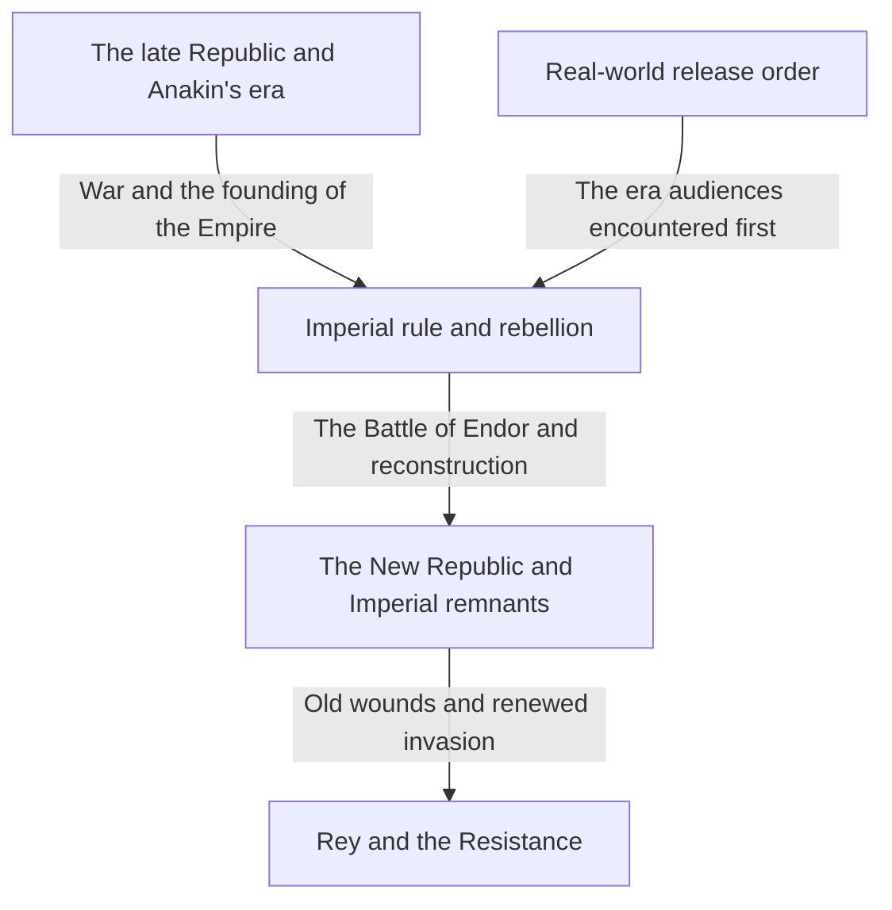
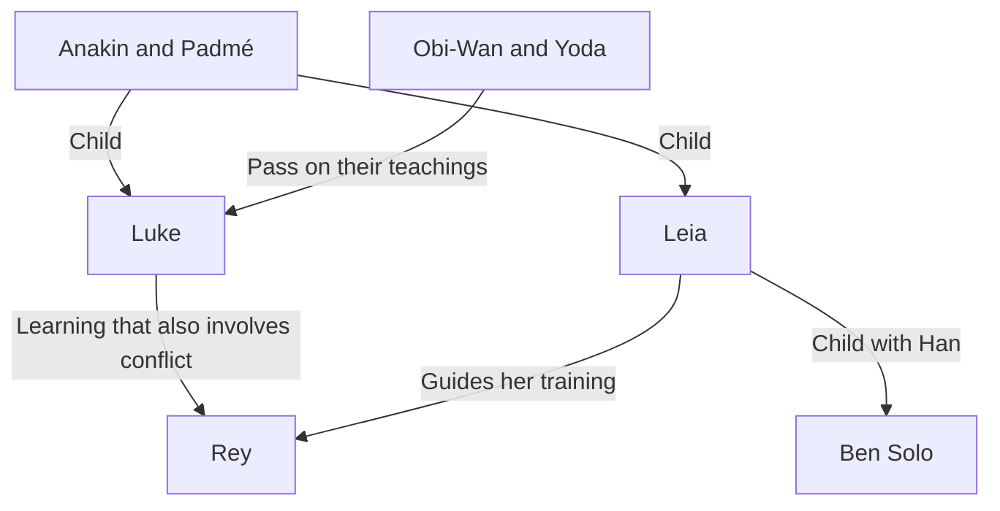

At its simplest, Star Wars is a story of adventure in a distant galaxy. Yet those adventures weave together love and conflict between parents and children, the collapse of democracy, resistance to empire, religion and power, the wounds of war, and families formed beyond blood ties. Behind the screen lies another history: filmmaking that transformed the use of models, editing, music, sound, and computer graphics.

Knowing lightsabers and Darth Vader does not necessarily make the whole picture easier to see as the number of works grows. Why did the films begin with Episode IV? If the Jedi were knights of justice, why could they not protect the Republic? What did the stories of Anakin, Luke, and Rey inherit, and what did they change? What do Andor and The Mandalorian offer beyond an appendix to the films?

This article approaches those questions through three layers: the story of the galaxy, the relationships between its works, and the real history of their production. Rather than listing every piece of lore like a dictionary, it provides an extended guide to the causes and consequences in the major works and to themes that change as they recur. It conveys the breadth of a branching universe while offering a clear path for newcomers.

The discussion reveals endings, identities, important deaths, and major choices in the nine saga films and related works. If you have not watched them and want to preserve their surprises, consider reading the initial overview and the viewing-order guide near the end first, then returning to individual chapters after watching. Information and release status were checked as of October 3, 2026. The illustrations are concept art generated for this article, not official film stills or production records.

## Three Different Timelines: Release Order, Galactic History, and the Development of the Lore

The biggest source of confusion in Star Wars is that time does not run along a single line. The film first released in 1977 was subsequently positioned as Episode IV within its fictional history. Audiences met Luke on his adventures before seeing his father Anakin's youth in films released from 1999 onward. Earlier events in the story were not necessarily filmed earlier in the real world.

There is also the separate order in which the creators developed the lore. A relationship revealed in a later work may change how an earlier scene looks. That is not the same as claiming that every story made decades later had already been decided when the first film was produced. It is important not to reconstruct the development of an evolving work solely from the consistency of its finished form.

Distinguishing these three timelines also helps explain the pleasure of prequels. Knowing the ending need not eliminate surprise: it allows us to watch a tragedy and ask where different choices were possible. Release order, meanwhile, lets viewers experience the timing of revelations in a way closer to the original audiences. Each approach has its own value; there is no single correct answer that proves how much someone knows.

| Group of films | First release years | Central question |
| --- | --- | --- |
| Episodes IV, V, and VI: the original trilogy | 1977, 1980, 1983 | How can people resist overwhelming power and confront their family's past? |
| Episodes I, II, and III: the prequel trilogy | 1999, 2002, 2005 | Why do the Republic and Anakin lose what they set out to protect? |
| Episodes VII, VIII, and IX: the sequel trilogy | 2015, 2017, 2019 | How does a new generation inherit its predecessors' victories and failures? |
| Rogue One and Solo | 2016, 2018 | How can stories explore people at the saga's margins and choices made in the past? |
| The theatrical film The Clone Wars | 2008 | How can a long war be expanded through relationships between people? |
| The Mandalorian and Grogu | 2026 | How should we think about protection and community after the Empire's collapse? |

Years generally refer to the first theatrical release and may differ from Japanese release dates. Release order and the broad chronology can be checked in the [official guide to films and series](https://www.starwars.com/news/star-wars-movies-and-series-guide). Placing a title at a single point on a timeline can be misleading when, as with some short-form anthologies, one program covers several eras.

This diagram provides a framework for understanding the major screen works. It does not mean, for example, that the Empire vanished from every corner of the galaxy after a single battle. A regime's symbolic defeat and changes in military organizations, administration, crime, and people's attitudes proceed at different speeds. Many associated stories occupy those gaps in time.

## Canon and Legends: Which Stories Belong to Which Continuity?

Canon is a framework for considering the current official narrative continuity. Legends is a label used to organize the many novels, comics, games, and other stories that had previously expanded the universe. In 2014, Lucasfilm revised its approach to the existing Expanded Universe and announced a new direction anchored in the films and The Clone Wars. The [official announcement from that time](https://www.starwars.com/news/the-legendary-star-wars-expanded-universe-turns-a-new-page) explains this transition.

Being classified as Legends does not mean that a work disappeared or ceased to be worth reading. These are galactic stories that grew in a different period, under different possibilities and constraints. Conversely, when a name or concept from an older work returns in a new one, its earlier biography and events do not automatically enter the new continuity as a package. Familiar names are precisely where it pays to check which version and which work are being discussed.

Nor do all officially produced works share the same continuity. Projects such as Visions explore forms of expression free from the established timeline. Not every action available in a game necessarily becomes an event in the narrative; sometimes the player's options must be distinguished from events assumed by a sequel.

The mistake to avoid is turning classifications of lore into judgments of artistic quality. Canon helps explain connections, not assign scores to emotional impact. What is shown on screen, what appears in official reference material, what a character says, and what a viewer interprets are different kinds of information. It is also important not to treat an explanation a character believes as an omniscient statement of the world's truth.

This article mainly follows the continuity of the current major screen works, identifying Legends and independent projects separately when discussing them. It also separates what is depicted from how that depiction may be read. A critical analysis of the Jedi as an institution, for example, is a viewer's interpretation, not an official fact denying the goodwill of every Jedi.

## A Small Map of the Characters

At the center are several generations connected to the Skywalker family. Luke and Leia are the children of Anakin and Padmé. Leia and Han's son is Ben Solo, who later calls himself Kylo Ren. Yet inheritance in these stories cannot be explained by blood alone. Teachings, failures, and choices pass from Obi-Wan and Yoda to Luke, from Anakin to Ahsoka, and onward to a new generation including Rey.

R2-D2 and C-3PO travel through that history from positions different from those of humans. Chewbacca, Lando, and fellow Rebels connect the family's inner conflicts to the struggle across the galaxy. Later series show the lives of people away from the heroic center, including Cassian, Din Djarin, Grogu, and the clones.

Separating family relationships from those between teachers and students reveals that this is not merely a royal genealogy. More than what people inherit, the question is how they use it and what they reject. Let us begin with the trilogy through which audiences first entered this galaxy and consider what each work does.

## Episode IV, A New Hope: Galactic Politics Reaches a Young Man's Life

The first film, released in 1977, begins partway through the history of its world. Without knowing exactly how the Empire arose, viewers see a small ship pursued by an enormous warship. Size alone communicates the imbalance between pursuer and pursued. Rather than explaining the setting exhaustively before starting the story, this opening conveys the information needed to understand events through the characters' actions. Its release date and basic narrative position can also be checked on the [official film page](https://www.starwars.com/films/star-wars-episode-iv-a-new-hope).

### The adventure does not begin with a sense of being chosen

Luke Skywalker, living on a farm on Tatooine, does not initially set out to save the galaxy. He is a young man who wants to escape the narrowness of everyday life. But droids arriving at his home carry Rebel intelligence, and Leia's plea for help leads him to Obi-Wan Kenobi, who has been living in seclusion. While political conflict remains distant news, Luke still has the option of returning to the farm. That boundary collapses when Imperial violence kills the aunt and uncle who raised him.

The causality matters. Luke does not become entangled with the Empire simply because he chooses adventure; a life that tried to remain uninvolved in Imperial rule is itself destroyed. The story concerns personal growth, but also the way state violence penetrates lives at the periphery. Grief alone does not make him a hero, however. Meeting a mentor and companions, learning how to act, and using his abilities to help others give his original wishes a public significance.

Leia is rescued, but she is not someone who merely waits for rescue. She hides information, withstands interrogation, and makes decisions during the escape. Inside the facility Luke and Han enter intending to help her, she compensates for their mistakes. Because their roles are not fixed, the three do not settle into a simple relationship of hero, assistant, and prize. They become a group whose members challenge one another's judgment.

### The Death Star is a weapon and a philosophy of government

The Death Star is terrifying for more than its ability to destroy a planet. Behind it lies a plan to make everyday negotiation and representative government unnecessary by demonstrating overwhelming force. The dissolution of the Senate and the idea of keeping star systems obedient through fear are linked. The destruction of Alderaan goes beyond attacking a military installation: it threatens anyone who might consider resistance.

The Rebels have no weapon on the same scale. They read the plans, find a small weakness, and concentrate their limited strength. Victory requires connecting the work of droids carrying information, people entrusting others with plans, analysts, and crews maintaining starfighters. Luke fires the decisive shot, but collective cooperation makes that shot possible. Overlooking this structure can make the film appear to be a simple story in which an individual with a special bloodline solves everything.

Han's return is part of that cooperation. A man who acted according to money helps his friends despite the danger. Luke trusting the Force rather than relying solely on his targeting equipment, and Han ceasing to decide solely according to payment, can both be read as movements toward trust beyond immediately visible gain and loss. The message is not to abandon technology. Fighters, communications, and plans remain necessary; the question is what to add to the final act of judgment.

Another important feature is the way galactic history enters the screen through machines needing maintenance and the cost of living. The Falcon is not simply an ideal, fast vehicle, but a ship its owner struggles to keep working. The cantina has customers who are not there solely to explain things to the protagonist, and droids have lives in which they are bought and sold. Because things seem to happen beyond the center of the frame, viewers can feel that this world has existed for a long time without knowing everything about it.

## Episode V, The Empire Strikes Back: Defeat Breaks a Hero's Understanding of Himself

The previous film's victory did not mean the Empire's disappearance. The Rebels are still on the run and cannot hold their base on Hoth. This film begins from the reality that destroying a giant weapon does not eliminate institutions or armies. Released in 1980, it develops Luke's training alongside Han and his companions' flight. [Official film page](https://www.starwars.com/films/star-wars-episode-v-the-empire-strikes-back)

### Training demands more than learning to lift stones

When Luke meets Yoda on Dagobah, his expectations about how a great teacher should look and behave are overturned. Looking at this small, strange creature, he does not immediately recognize wisdom. The device also works on the audience. Learning about the Force begins by unsettling the instinct to associate strength with a large body or a large weapon.

In the cave, Luke sees his own face inside the mask of the Vader he has defeated. The film does not establish this image as simply a recording of the future. It can be read as a warning that following fear and anger toward an enemy may turn someone into that enemy. The previous film's task was defeating the Empire as an external adversary; here, the mind of the person trying to defeat the enemy must also be examined.

After seeing a vision of his friends suffering, Luke interrupts his training. It is difficult to classify this decision as entirely right because it is compassionate or entirely wrong because it is immature. His inability to abandon his friends is understandable, but he misjudges the limits of his strength and information. Vader is also exploiting precisely those feelings to lure him out. Good intentions do not make situational judgment unnecessary.

### Lando's bargain and the limits of compromise with domination

Lando makes a deal with the Empire to protect Cloud City. But a contract cannot secure safety when the more powerful party can change its promises unilaterally. Meeting one condition only produces another demand. His failure is not merely a personal betrayal; it is also a political failure to preserve autonomy under overwhelming violence.

Yet making a mistake does not require someone to remain mistaken forever. Lando moves to rescue the others. Luke fails, Lando betrays, and Han is captured, but their worth is not determined solely by their immediate success rate. The capacity to change one's conduct, ask for help, and answer another's need remains a measure distinct from victory.

The revelation that Vader is Luke's father is not a device for erasing distinctions between good and evil. Imperial violence does not become legitimate. What breaks is Luke's orderly family history: his belief that he is the son of a good father and that his enemy is an unrelated man who killed that father. The idea that defeating the enemy will bring him closer to his father becomes a harder question: how can confronting this enemy allow him to inherit his father's legacy?

Luke does not emerge from the duel as a victor. Wounded and unable to escape alone, he is rescued by Leia and the others. Being saved by the person he went to save in the first film rejects the hero's isolation. Independence is not only a matter of relying on no one; it can mean returning to relationships while carrying errors and weaknesses. In this sense, the dark ending does more than postpone resolution until the next installment.

The white expanses of Hoth, the damp enclosure of Dagobah, and Cloud City's bright exterior and dark interior are more than scenic backgrounds. The feel of each location supports military retreat, descent into the self, and the collapse of apparent safety. Each move makes the hero's familiar skills insufficient, showing that success in a starfighter does not provide the answers to training, negotiation, or a conversation with his father.

Generated concept art illustrating the asymmetry of power between rebellion and empire, not an official film still.

## Episode VI, Return of the Jedi: Saving a Father and Defeating an Empire

The 1983 conclusion begins with Han's rescue and brings together the repair of personal relationships and a galactic war. In Jabba's palace, Luke is calmer than the young man of the first film and more confident in his use of power. His appearance alone does not prove maturity as a Jedi, however. The final question is what he does when he can win. [Official film page](https://www.starwars.com/films/star-wars-episode-vi-return-of-the-jedi)

### The Emperor's trap aims at anger more than death

While trying to destroy the Rebels militarily, the Emperor also tries to bring Luke to his side. He shows Luke his endangered friends, pushes him to attack in anger, and seeks to make that emotion culminate in killing his father. Even if Luke defeats Vader, the Emperor wins if Luke accepts the same logic of domination. The duel therefore permits military victory and ethical success to move in opposite directions.

Enraged by the threat to Leia, Luke overwhelms Vader. Looking between his father's mechanical hand and his own brings the cave vision back as a concrete choice. Throwing away his weapon is not choosing nonviolence because there is no danger. He accepts the possibility of being killed and refuses to kill his father. He steps away from a measure of strength that requires destroying an enemy to prove himself.

Vader's rebellion against the Emperor is a choice made after watching his son suffer. There is redemption here, but no explanation that his past crimes have been erased. A son's belief in his father's goodness is different from an obligation on victims to forgive their abuser. The film depicts a final transformation within a father-son relationship; it does not settle every issue of legal responsibility or historical memory. Keeping that distinction allows us to understand the ending's limits without losing its emotional force.

### Why the forest battle matters as much as the throne room

Isolating the confrontation with the Emperor makes it seem as though family problems alone move the world. In fact, the fleet cannot destroy the second Death Star unless the ground force on Endor disables its shield. Luke saving his father and the Rebels destroying the military installation are both necessary. Neither automatically performs the other's work.

The Ewoks bring knowledge of the land and another way of fighting to the joint operation. The Empire has superior armor and firepower, but fails to take the local inhabitants seriously as actors. That contempt makes it misjudge resistance using terrain and surprise. This is not, of course, a general law that simple weapons always defeat advanced armies in real warfare. As a fable, it makes visible a ruling power's weakness in underestimating the judgment and solidarity of small beings.

Luke, Han, Leia, Lando, Chewbacca, droids, unnamed soldiers, and Endor's inhabitants all contribute. Because their efforts converge, the celebration is not one person's coronation. It also marks Luke's return to a community after losing his father. The coexistence of personal loss and public victory prevents the film's happiness from becoming a completely unscathed happy ending.

The Emperor's defeat is also a failure of his assumption that everyone else will ultimately act through self-interest and fear. A son refusing to abandon faith in his father, and a father choosing his son over obedience to a ruler, fall outside his calculations. Great power in the Force does not allow complete prediction of human choices. Overconfidence in enormous weapons and overconfidence in having understood every human heart share this weakness.

## Episode I, The Phantom Menace: An Empire Does Not Begin by Looking Like One

The prequel released in 1999 begins not with the clear military dictatorship of the first film, but with a conflict inside the Republic. The Trade Federation's blockade of Naboo turns a dispute over trade and taxation into armed occupation. The young Queen Padmé Amidala expects an appeal to the Senate to establish the facts and bring assistance. Instead, institutions remain caught in investigations and procedure, while the pace of decision-making fails to match suffering on the ground. [Official film page](https://www.starwars.com/films/star-wars-episode-i-the-phantom-menace)

### Palpatine wins support as the person who can resolve the crisis

For viewers who know the later history, the advice of Senator Palpatine of Naboo has a double meaning. He stands beside the injured party and exploits distrust of a leader who appears incompetent. The key is that he does not invade the Senate from outside and destroy the Republic with one blow. He rises through parliamentary procedure and people's expectations.

The enemies are not a single unified bloc, either. The Trade Federation pursues its own interests, while Darth Sidious uses it as an instrument in a larger plan. Even when the surface conflict ends, the transfer of power produced by it remains. Naboo's liberation is a real victory, but not necessarily a victory for the Republic's future. The celebration remains unsettling because those two scales do not agree.

Padmé's appeal to the Gungans presents the opposite kind of politics. Rather than preserving her dignity as a representative, she recognizes their shared relationship as inhabitants of one planet and asks for help. This does more than compensate for insufficient military strength: previously separated groups create a common purpose. This small solidarity produces the practical capacity to act that the Senate did not provide.

### Look at Anakin's life before his talent

The young Anakin is an extraordinary pilot, but he is also enslaved. In a world with an enormous Republic and Jedi who speak of justice, a mother and child's freedom is not guaranteed. The fact illustrates the difference between institutions existing and their protection reaching every region. Qui-Gon can free Anakin, but cannot save his mother Shmi through the same means.

Leaving combines the happiness of having his abilities recognized with the fear of leaving his mother behind. Describing the later Anakin only as a weak person who could not overcome fear overlooks the conditions in which that fear arose. At the same time, a harsh childhood does not make later abuse inevitable. The story opens the question of what support and education a wounded person needed.

Qui-Gon's death means the teacher who discovered Anakin cannot guide him for long. Obi-Wan inherits the promise, but their relationship is not complete from the outset. A great prophecy and institutional expectations begin moving faster than one child's development. That imbalance prepares the tragedy of the whole prequel trilogy.

In production terms, describing the prequels as films made entirely by computer is also inaccurate. Official production material describes practical ingenuity such as colored cotton swabs used in models of the podrace crowd. Understanding the image as a combination of new technology and handwork is closer to the reality. [Official production trivia](https://www.starwars.com/news/25-fun-facts-the-phantom-menace)

The simultaneous battles near the end also help distinguish the groups' roles. The Gungans' diversion, action inside the palace, combat in space, and the Jedi-Sith duel each solve a different problem. One powerful swordsman cannot end the occupation. Moreover, Qui-Gon's death beneath the military success reveals that a community's victory and a loss in a boy's life need not coincide.

## Episode II, Attack of the Clones: Preparing for War Narrows the Choices

In the second prequel, released in 2002, a growing Separatist movement seeks to leave the Republic, and creating an army becomes a political issue. Investigating the attempted assassination of Padmé, Obi-Wan discovers the clone army. A fully prepared army appears before a Republic that was supposedly still debating how to prepare for a crisis. Urgent security needs meet a convenient solution of obscure origin. [Official film page](https://www.starwars.com/films/star-wars-episode-ii-attack-of-the-clones)

### A mystery needing investigation is overtaken by the demands of war

How the clone army was ordered and whose interests it serves should be questions of the highest priority. But with an enemy army close at hand, people want a force they can use immediately. Crisis changes decisions by taking away time for scrutiny. The army is adopted not because it has been thoroughly examined, but in circumstances that make alternatives seem unavailable.

Dooku's criticism of the Republic includes real problems of institutional corruption. Correctly identifying a problem does not guarantee that a person's proposed solution is just, however. Since he participates in the Sith plan himself, disillusionment with the Republic does not lead directly to liberation. The apparent conflict between the two camps must be separated from Sidious's position as the person exploiting it.

The Jedi, too, go to battle to preserve peace and become generals leading an army. Their successful rescue operation paradoxically helps begin a war. Saving lives in the immediate situation coexists with the longer-term effect of strengthening military order. Means adopted for a good purpose gradually change the nature of the institution using them.

### Romance and politics share a desire for control

Anakin and Padmé's relationship faces obstacles of status, duty, and Jedi discipline. Their secret marriage protects their love while narrowing access to advice and support. With fewer people to share difficulties with, the fears that later intensify become harder to examine from outside.

After losing his mother, Anakin kills people in a Tusken settlement, including children. This should not be passed over as merely a dramatic indication of how angry he is. Violence against a loved one becomes a justification for violence against others: a clear ethical breakdown. Grief may be understandable, but actions carry responsibility. His later fall is not a sudden reversal; a major boundary has already been crossed here.

Anakin's political view that a strong leader should make decisions if that produces the desired result also echoes his wish to control loss in intimate relationships. Accepting that people have different wills, and that loved ones have lives beyond one's control, is difficult. Yet trying to eliminate uncertainty through coercion destroys the very relationship one wants to protect. The next film takes this problem to an extreme.

The uniform appearance of the clone army also carries the unease of treating humans as interchangeable military units. Soldiers with the same origins do not therefore have lives that may be counted as identical. The film first emphasizes the appearance of a mass army; later works explore individual soldiers' personalities. Noticing that order makes it possible to reconsider what looked like the Republic's salvation by asking who pays for it.

## Episode III, Revenge of the Sith: The Wish to Save Becomes a Logic of Domination

In the third prequel, released in 2005, the Republic collapses as the Clone Wars approach their end. Contrary to the expectation that winning the war will restore peace, the power concentrated to wage it becomes the foundation of a postwar dictatorship. Because Anakin and the Republic fall together, this tragedy cannot be reduced solely to personal weakness or solely to institutional failure. [Official film page](https://www.starwars.com/films/star-wars-episode-iii-revenge-of-the-sith)

### Palpatine sells the promise of controlling death

Anakin fears a future in which he loses Padmé. Palpatine does not directly dismiss that fear, but suggests that there is power unavailable elsewhere. This is subtler than simply preaching an evil doctrine. He identifies what the other person most fears losing and makes himself seem indispensable to protecting it. As dependency deepens, contradictory explanations and criminal demands become easier to accept.

There is also distrust between Anakin and the Jedi Council. He feels unrecognized; the Council is wary of his closeness to Palpatine. Being asked to act as a spy further divides his loyalties. Explaining these circumstances is not the same as excusing his acts, however. After stopping Mace Windu to protect Palpatine, Anakin obeys increasingly destructive orders.

After making a grave mistake, people sometimes prefer a path that makes the mistake seem meaningful to turning back. Anakin's actions can be read as such a chain of self-justification. Having gone this far, he must obtain the power or everything will have been in vain. That thought makes the next act of harm look like a necessary sacrifice.

### Order 66 turns an institution's existing lethal power in another direction

The Jedi are attacked not by a new army arriving from afar, but by soldiers who have fought beside them. When a military chain of command reverses direction, positions and trust based on being allies become weaknesses. The film depicts the order and coordinated attacks; related animation supplies details of how the clones are controlled. Distinguishing the film's explanation from later additions helps clarify each work's role.

The Empire is not founded at the moment every republican building is destroyed, either. It is proclaimed in the Senate chamber as a new order. Under the language of restoring security, surveillance and violence become permanent government. By depicting the opposing Jedi as traitors, resistance to concentrated power is reinterpreted as an attack on order.

On Mustafar, Anakin directs violence at Padmé, whom he meant to save. When she disagrees with him, he interprets it as betrayal rather than respecting her own will. The difference between affection and possessiveness becomes unmistakable. The future he desired required not simply a living Padmé, but a Padmé who affirmed his choices.

The scenes of the burned Anakin being enclosed in armor and the twins being born show despair and future possibility together. Neither Obi-Wan nor Yoda is a victor. Yet protecting the children preserves a future within political defeat. The prequels become a story in which catastrophe emerges from the combination of goodwill, fear, institutions, and ambition, rather than one in which evil wins simply because good people disappear.

Obi-Wan's grief is also far from the satisfaction of discovering and defeating a villain. He must fight someone he regarded as a brother, while questions about his teaching and judgment remain. The length of their duel can therefore be read not only as a comparison of skill but as the pain of people who know each other deeply and cannot sever the relationship. Even its winner has nowhere to celebrate that victory.

## Episode VII, The Force Awakens: A Generation Inherits Heroes It Never Knew

In the new chapter released in 2015, the Rebellion's heroes are almost legendary figures to Rey and Finn. Names familiar to the audience remain distant to the young characters. That difference places longtime viewers' memories and newcomers' surprise in the same frame. The First Order appears in the post-Imperial world, demonstrating that yesterday's victory does not guarantee the next generation's safety. [Official film page](https://www.starwars.com/films/star-wars-episode-vii-the-force-awakens)

### Finn becomes a protagonist by first refusing an order

Finn's starting point is neither an illustrious bloodline nor a prophecy. Required to obey as a soldier, he refuses to kill. This choice begins his transformation from a number in an organization into someone who decides for himself. He does not immediately develop a complete resolve to save the galaxy; at first, his wish to escape remains strong. The film shows not good action after fear disappears, but someone standing his ground for another person while still afraid.

On Jakku, Rey has learned the skills to survive, yet waits for a family that might return. Her stagnation arises not from a lack of ability but from expectations attached to the past. Leaving home means more than moving to another planet. It means moving from the hope that waiting will restore her former life toward the possibility of building new relationships herself.

### Kylo Ren wants Vader's image as much as his strength

Ben Solo tries to remake himself as Kylo Ren. He worships his grandfather Vader, but Vader's final decision to save his son does not fit the image of powerful evil he desires. People do not always inherit the past intact; sometimes they select only the parts they need. Kylo illustrates how inheriting history can also mean misreading it.

Killing Han is likewise more than a scene in which a cool-headed villain eliminates an obstacle. Believing that severing attachment to his family will make him strong, Kylo tries to reconstruct himself. Yet committing violence does not necessarily resolve conflict. An action intended to eliminate uncertainty instead creates a new wound. While Rey's story moves toward connection with others, Kylo tries to establish himself by cutting connections.

Structural similarities to the first film, including Starkiller Base and a droid carrying a map, are obvious. They can be enjoyed as nostalgia or criticized as repetition. Analytically, however, it is useful to go beyond noting resemblance and examine differences in the choices of characters occupying similar positions. A former Imperial-style soldier becomes a protagonist, a young woman awaiting rescue resists for herself, and a hero's son becomes an enemy. Within familiar contours, the anxiety of inheritance moves to the center.

The destruction of the New Republic's center forcefully demonstrates the fragility of political order. Yet because the film spends little time depicting that order's daily life, the concrete nature of the loss can be hard for viewers to grasp. This is a limitation in the film's exposition. Related works can add weight, but viewers unfamiliar with them should not bear all the blame for insufficient understanding. The amount of information a work itself communicates shapes the viewing experience.

## Episode VIII, The Last Jedi: Acknowledging Failure Without Abandoning Responsibility

The second sequel, released in 2017, overturns the expectation that Rey's meeting with Luke will solve the problem. Luke has withdrawn from standing again as a hero. Meanwhile, the Resistance is pursued and must make survival decisions with limited resources. The film questions personal heroism and organizational leadership in parallel. [Official film page](https://www.starwars.com/films/star-wars-episode-viii-the-last-jedi)

### Does admitting a mistake justify giving up everything?

Luke and Ben's past is told from different perspectives. The meaning of the same scene changes between the momentary fear Luke felt and the terror Ben experienced on seeing him. This is not relativism claiming that facts do not exist. It is the difference between what someone was thinking and what another person actually experienced. Explaining that an impulse was brief or regretted does not erase the injury it caused.

Luke connects his own failure to that of the Jedi as a whole and wants the tradition to end. Criticism of Jedi history deserves consideration, but if criticism merely justifies his absence, it distances him from responsibility toward those suffering now. Between unconditional preservation and abandoning everything because it failed, there needs to be a path of learning and passing things on differently.

Rey and Kylo encounter the possibility of understanding one another, but understanding differs from agreement. Shared loneliness does not require accepting an order that dominates other people. Nor does killing Snoke automatically bring Kylo to the side of good. Killing a ruler and rejecting the system of domination are separate acts; he tries to occupy the vacant seat himself.

### Courage and command work on different time scales

Poe has the courage to destroy the enemy before him, but must learn how many people and resources that success costs. Producing a visible result in one battle differs from keeping an organization alive until tomorrow. In command, deciding not to attack and choosing to retreat are also responsibilities.

His conflict with Holdo also involves the difficulty of sharing information. Viewers experience mismatches in who knows what. Concluding simply that subordinates should obey silently is too narrow. Seeing the conflict as a collision of secrecy, trust, authority, and inadequate explanation during a crisis makes both the characters' strengths and shortcomings visible.

The Canto Bight episode shows that prosperity apparently outside the war can be connected to it through weapons and exploitation. Finn moves from wanting to protect a particular friend toward understanding resistance more broadly. Still, profiteers trading with both camps does not prove that the camps have identical political goals. Criticizing structures of profit must be distinguished from equating invasion with resistance.

Luke's final act is not to kill large numbers of enemy soldiers but to give his companions time to survive. A man who disliked his legend accepts its power to inspire hope. He then attracts the enemy's attention through a method different from physical victory. The film can be read as beginning by breaking a heroic image and ending by choosing how to use that image anew.

Rey had sought not only skills from Luke but an answer that would establish her identity from outside. Her teacher, however, is also a person with mistakes and fears. After recognizing the imperfection of someone she relies upon, she must decide what to take from his teaching. In this sense, the film is not merely about a student rejecting a teacher; it asks whether learning can continue without idealizing the teacher.

## Episode IX, The Rise of Skywalker: Origins and a Chosen Name

The ninth film, released in 2019, returns Palpatine as the ultimate enemy and connects Rey's origins to his family. Her previous understanding that she belonged to no important lineage is substantially revised. Responses to that turn differ, but analysis should first distinguish what each film communicates from what the next adds. [Official film page](https://www.starwars.com/films/star-wars-episode-ix-the-rise-of-skywalker)

### Blood may explain ability, but it cannot issue an ethical command

Rey fears that an evil lineage determines her future. Yet the ending moves toward choosing which teachings and relationships to accept rather than submitting to her origins. The issue cannot simply be settled by saying that blood never mattered. The film uses blood relationship as a major device while attempting to depict freedom through the protagonist's rejection of the role supposedly entailed by that relationship.

Her relationships with Luke and Leia offer another route of inheritance. Choosing the Skywalker name at the end can be read less as a statement of biological ancestry than as an affirmation of the values she wishes to inherit and the relationships that nurtured her. Choosing a name does not erase pain or the past. Significance lies in deciding how to identify herself after learning that past.

The technical details of Palpatine's return receive limited explanation in the film alone. Supplemental material should not be confused with directly presented information as though everything were explained on screen. What matters within the story is that fear of death and attachment to power lead him to treat even subsequent bodies and generations as tools. The man who tempted Anakin with control over life continues to use others for his own preservation.

### Ben's transformation reverses the idea of conquering death

Ben's return from life as Kylo Ren involves his mother's intervention, Rey saving his life, and memories of his father. His earlier attempt to free himself from conflict by killing his father failed. Accepting relationships again instead opens another choice. This transformation does not erase past harm, but the possibility of choosing a different action now remains.

His final gift of life to Rey contrasts with Anakin sacrificing others because he could not bear losing someone he loved. Rather than dominating the world to keep life, he gives of himself. Across nine films, this contrast changes the meaning of saving someone. Keeping a person with oneself is not the same as wishing that person to live.

The fleet gathering at Exegol also performs work separate from Rey's duel. People isolated by fear recognize one another's presence and assemble. How convincing viewers find that convergence varies, but participation beyond a single hero's abilities is narratively necessary. The final battle again overlays a conflict of bloodlines with resistance by many people outside those bloodlines.

As the conclusion of nine films, the return to Tatooine suggests that returning to the same place does not mean returning to the same state. In the first film, a young man looked at the horizon wanting to go far away; at the end, a person who has made a journey states her name. Reusing the landscape of the beginning brings expanding the world and deciding where one stands into a single completed movement.

## Rogue One: Those Who Cannot Return Make a Hero's Decisive Shot Possible

Released in 2016, Rogue One depicts how the Death Star plans reach the Rebels immediately before the first film. Knowing the broad outcome does not remove tension because the central question is not only whether the plans arrive, but who loses what in delivering them. The official production announcement identifies ILM's John Knoll as the originator of the idea and explains its emphasis on a ground-war perspective. [Official production announcement](https://www.starwars.com/news/rogue-one-the-daring-mission-has-begun-cast-and-crew-announced)

### An engineer's resistance and a daughter's recovery of its meaning

While participating in Imperial weapons development, Galen Erso builds in a weakness that can lead to destruction. This raises difficult questions: does remaining within an institution always mean complicity, and how much sabotage from within is possible? His example does not justify generalizing that every collaborator is secretly resisting. The film depicts one person's particular choice and the difficulty of communicating it to others.

Receiving fragments of information about her father, Jyn revises her understanding of him as a simple traitor. Crucially, learning his good intentions does not stop the weapon. The weakness must be substantiated, the plans obtained, and the information delivered in a usable form. Only when personal reconciliation becomes public action does her father's resistance have a practical effect.

### Showing Rebel wrongdoing does not justify the Empire

Cassian has done dark work for the Rebellion. Some of his actions cannot be excused solely by the righteousness of the cause. The Rebels also disagree internally and do not form a unified bloc in the face of danger. Such depictions show that resistance is not innocent, but do not establish that domination and resistance are therefore the same.

Instead, the question is what people with dirty hands do next. Cassian's decision to act with Jyn carries an urgent wish not to let past sacrifices remain merely sacrifices. Yet that wish also risks endlessly justifying further sacrifice. The film draws the boundary through the difference between orders that discard other people and choices to accept danger oneself.

At Scarif, ground communications, the fleet in space, and operations inside the facility are separated. One person's strength cannot prevent mission failure if a connection elsewhere is lost. The technical problem of transmission becomes the form of solidarity itself. Repeated acts of passing on information are not meaningless repetition: they show how work continues beyond one person's survival.

These people cannot join the celebration in the first film. Their work nevertheless becomes part of its victory. Behind the protagonist of A New Hope, we can now see the cost borne by people whose names and faces we previously did not know. A standalone story enriches the main saga when it changes the ethical weight of familiar events in this way.

Chirrut's faith also differs from an invulnerable defensive ability. Belief in the Force does not directly guarantee bodily safety. Faith appears as a disposition enabling action amid danger, not a contract for escaping death. Through him, we see that the idea of the Force can shape judgment and hope even in a story without a Jedi-trained lead character.

## Solo: How an Apparently Self-Interested Person Takes Shape

Solo, released in 2018, steps away from battles determining the government of the entire galaxy and enters a world of criminal organizations, transport, debts, and deals. Through young Han's encounters with Chewbacca and Lando, it offers another angle on the character of the first film. As its official page explains, an adventure through the frontier underworld stands at its center. [Official film page](https://www.starwars.com/films/solo)

### Buying freedom can lead to the next dependency

Han tries to escape Corellia, but escape alone does not create a free life. The Imperial military, criminal organizations, job brokers: each means of survival brings another hierarchy. His desire for a ship is strong not simply because he loves piloting, but because owning one is a material condition for choosing where to go.

Beckett teaches him not to trust others too much. That survival strategy has a rational basis in a dangerous environment. Yet if every relationship is constructed solely around anticipating betrayal, cooperation shrinks into temporary shared interest. Han takes some of the lesson without becoming exactly the same person.

His meeting with Chewbacca illustrates the difference. Even if their initial circumstances involve mutual survival interests, facing danger together produces more than exchange. Their later trust becomes understandable not as a character trait given from the outset, but as a process of watching and judging each other's actions.

### Qi'ra has a life outside Han's story

Han tries to take Qi'ra away and realize their old dream. But the world in which she has survived during their separation is more complicated than he imagines. Reunion does not simply restart the old relationship. There is distance between wanting to save someone and understanding the conditions in which that person now lives.

Explaining her choices solely through whether she loves him overlooks the constraints and ambitions involved in surviving within an organization. Even in a film with Han as protagonist, other people's lives do not all move to fulfill his wishes. That asymmetry becomes part of young Han's disappointment and maturation.

Changing his understanding of Enfys Nest's group also unsettles the boundary between criminals and resisters. Who owns the cargo, who takes it, and what will it be used for? The contractual owner is not necessarily morally right. Han's final decision, which cannot be explained by profit alone, reveals a quality that will later help bring him back to the Rebels.

This film's Han is not a complete solution explaining the character in the first film. No one is formed by a single experience. Still, beneath the language of cynicism and self-interest, he retains an inability simply to abandon others. A man who presents himself as no good repeatedly contradicts that self-description through his actions. That gap is part of Han Solo's appeal.

The droid L3-37 extends the theme of freedom beyond humans. Should a machine be treated as a convenient personality serving people, or as an agent with its own judgments and demands? A question often contained within comedy in the series comes to the surface in her words and actions. The film does not completely resolve it, but enjoying droids' endearing qualities is compatible with questioning the ownership relations governing them. Even a small frontier adventure contains questions concerning the whole galaxy.

## Understanding the Galaxy Beyond the Films Through Institutions and Everyday Life

Moving from films into television and animation makes the galaxy suddenly more detailed. Defeating the Emperor and paying for tomorrow's food are different problems. Someone rescued by a Jedi on a battlefield and someone whose life was destroyed by a military operation may feel differently about the same Republic. Such differences in perspective make associated works more than additional episodes.

### The same political system looks different from the center and the frontier

The Republic's capital, Coruscant, is a political center containing the Senate, bureaucracy, and Jedi Temple. Yet flying the Republic's flag does not mean every galactic inhabitant receives equal protection. On frontiers such as Tatooine, places exist where republican ideals barely reach and criminal organizations and slavery dominate life. What looks like an orderly state from the center may look like a government that merely debates far away from the rim.

This distance also matters when understanding Separatism. Even if the leadership and arms manufacturers of the Confederacy of Independent Systems are drawn into an evil plan, not every resident dissatisfied with the Republic is evil. Anger at corruption, political neglect, and economic inequality exists independently of the conspiracy. Palpatine's skill lies less in creating conflict from nothing than in exploiting existing grievances and directing their resolution toward expanding his power.

Differences between planets persist after the Empire's foundation. Some places directly experience the threat of giant weapons; others encounter the Empire through mining operations, security forces, identification papers, detention, and conscription. After the New Republic forms, pirates and former Imperial armed groups operate where central control has receded. A state's name alone therefore cannot establish how safe or free life is. Asking which planet, class, and occupation a person belongs to helps explain differences in tone between works set in the same era.

Generated concept art contrasting the galactic center and frontier and different historical eras, not official footage or concept artwork.

### The Jedi are not the state itself, but an order connected to it

Jedi is not a name for everyone who uses the Force. They are a group with training, discipline, teacher-student relationships, and communal traditions. In the late Republic, they consider themselves guardians of peace, but are not hermits independent of political power. They undertake diplomatic missions, maintain relations with the Senate, and become generals in the Clone Wars. Those overlapping roles produce goodwill and institutional failure together.

They command armies to protect people. Yet the more they become commanders, the less freedom they retain from the political structures governing the war's end. Tactical success in defeating enemy soldiers need not coincide with achieving peace. Explaining their defeat merely through inadequate swordsmanship misses the tragedy. They fight a military war without sufficiently recognizing that the war itself is a trap.

That does not make the Jedi the same as the Empire. There is a difference between an institution that makes mistakes and one that actively pursues domination and fear. The works ask whether good intentions remove the need for self-examination. When protecting the Republic conflicts with continuing to obey its decisions, which takes priority? Stories about Ahsoka and Dooku translate this collision into personal experience.

### Sith and other dark-side practitioners are not necessarily the same group

Calling every enemy with a red lightsaber a Sith confuses organizational relationships. Inquisitors conduct the Empire's Jedi hunts, but do not hold the same standing as Sith masters and apprentices. Dathomir's Nightsisters have traditions distinct from both Jedi and Sith. Using the dark side of the Force must be distinguished from belonging to a particular Sith lineage.

The Rule of Two, associated with Darth Bane, rests on a relationship between a master holding power and an apprentice seeking it. This is not a physical law allowing only two evil Force-users to exist in the galaxy. It is a principle of organizational succession, around which collaborators, assassins, manipulated potential apprentices, and former members may exist. The official Databank likewise explains that Bane introduced the arrangement to ensure Sith survival. [Official Darth Bane entry](https://www.starwars.com/databank/darth-bane)

This reveals an approach to education contrasting with that of the Jedi. Even if a Sith master wants an apprentice to grow, that growth threatens the master. The logic of using the other and ultimately replacing them is built into the collaboration. When considering the Emperor and Vader, or the discarded Maul, understanding deepens if we notice how the relationship itself breeds distrust, beyond individual personalities.

## How The Clone Wars Changed the Way We See War

### The roles of the film and the long-running series

The 2008 animated film Star Wars: The Clone Wars is an entry into the television series of the same name. Giving Anakin an apprentice, Ahsoka Tano, was a major addition for viewers who knew only the films. It does more than expand a character list. Showing Anakin responsible for guiding someone gives his courage, caring nature, and resistance to rules concrete expression in a relationship with a student.

The series depicts the war between Episodes II and III without restricting itself to Republic military operations. Its perspective moves through diplomacy, slavers, criminal organizations, planets trying to remain neutral, and ordinary people's doubts. Political background occupying a few minutes in the films becomes daily life and continuing decisions. A victory in one episode often fails to improve the overall situation, making the exhaustion of a long war visible.

Understanding a long series does not require turning everything into a hunt for foreshadowing of the films. Viewers know the ending; the characters do not know the future. The time they spend helping friends, fulfilling missions, and building small trusts has meaning in itself. Because that time is adequately depicted, Order 66 becomes not merely a historical incident but the destruction of relationships they have built.

### The same clone face does not mean the same personality

Clone soldiers hard to distinguish in the films' mass armies become people with names and judgments: Rex, Fives, Echo, and others. Genetic similarity does not mean identical experience or personality. Armor markings, hairstyles, speech, and relationships with fellow soldiers teach viewers to recognize individuals.

The Republic's ethical contradiction comes into focus. A war to defend freedom depends on soldiers created to fight and lacking sufficient freedom to leave military service. Jedi commanders often respect their troops, but personal kindness alone does not resolve the institutional problem. Recognizing soldiers' courage is compatible with questioning the structure in which they live.

The inhibitor-chip storyline makes that contradiction still crueler. Loyalty had not rested on free choice alone. In the tragedy of Order 66, the attackers also have personalities and friendships, which are forcibly violated. Ahsoka removing Rex's chip makes restoring stolen judgment, rather than defeating an enemy, the act of salvation. [Official Ahsoka Tano Databank entry](https://www.starwars.com/databank/ahsoka-tano)

### Ahsoka's departure separates goodness from institutions

Ahsoka leaving the Jedi Order does not mean she abandons compassion. An organization meant to protect her damages her trust; inviting her back does not automatically erase the wound. Remaining within an organization with righteous ideals and continuing to act according to one's own sense of right are separated for the first time.

This change is serious for Anakin too. He tries to protect his apprentice, but the institution he wants to believe in does not meet his expectations. His later fall cannot be explained solely by Ahsoka's departure, yet it is important to the process connecting distrust of institutions with fear of losing those close to him. An official article likewise treats her departure in Season 5 and their later reunion as turning points in their relationship. [Ahsoka and Anakin's farewell](https://www.starwars.com/news/ahsoka-and-anakin-final-meeting)

The concluding Siege of Mandalore provides another perspective alongside Revenge of the Sith. Viewers know what will happen on Coruscant, but information reaches the distant battlefield in fragments. That delay creates tension: decisions at history's center turn comrades into enemies before those on the ground can understand them.

## The Bad Batch and the People Left Behind After War

The Bad Batch follows a clone squad with unusual abilities and a girl, Omega, through the transition from Republic to Empire. A change of regime is more than changing a sign. Military staffing, tests of loyalty, regional control, and information management change, and soldiers who once sustained the state may become disposable.

The protagonists excel at fighting, but have not adequately learned how to live freely. Choosing jobs, receiving pay, thinking about a child's safety, and finding somewhere secure become new challenges. An operation has orders and objectives. Life has no instruction sheet guaranteeing the right answer if its steps are followed. This difference changes a squad into a family.

Omega matters far more than as additional fighting strength. Responsibility for protecting her means decisions can no longer be judged only by the ability to complete dangerous work. Is today's income worth tomorrow's safety? Is escaping alone enough? What should the child inherit? A measure distinct from military rationality enters the group.

Crosshair's story questions the expectation that obedience guarantees belonging. Following an organization should, he hopes, ensure recognition of his worth. But if an organization treats individuals as tools, loyalty is not reciprocal. Return and reconciliation also involve wounds that explanation alone cannot close. Being companions means not never making mistakes, but deciding how to rebuild relationships with someone who has.

Pabu's peaceful life is not merely a break in a war story. Meals, homes, and neighbors make concrete what the fighting was meant to protect. The official Databank describes Pabu as a refugee community, while a production article about the finale discusses the surviving squad and an older Omega. The ending connects the cessation of combat to the possibility of choosing ordinary life. [Official Pabu entry](https://www.starwars.com/databank/pabu), [cast interview about the finale](https://www.starwars.com/news/the-bad-batch-series-finale-dee-bradley-baker-michelle-ang-interview)

## Rebels and the Making of a Resistance Community

Rebels centers on Ezra Bridger, a boy living on Lothal, and the crew of the starship Ghost. A fully established Rebel Alliance does not welcome the protagonist from the outset. Local resistance, obtaining supplies, exchanging intelligence, and building interpersonal trust accumulate into a larger movement.

For Ezra, Jedi training means more than acquiring supernatural abilities. A boy who had to survive alone learns to share responsibility. His teacher Kanan is no unscarred master who completed a perfect education, either. He nurtures the next generation while carrying fears and absences of his own. This imperfect relationship becomes a story of rebuilding a lost institution through trust between people. [Official discussion of Ezra and Kanan](https://www.starwars.com/news/always-two-ezra-and-kanan)

Hera is both a pilot and the practical person who keeps an organization moving. Sabine has a political past as a Mandalorian, and Zeb remembers his community's destruction. Chopper participates not merely as a convenient machine but as a companion with a rough-edged personality. People of different origins become connected through shared life as well as shared ideals.

Thrawn becomes an unusual enemy for this small community. Rather than relying only on intimidation, he tries to understand opponents' cultures and patterns of behavior. The Rebels cannot necessarily win by obtaining greater firepower. It matters to act outside his predictions and draw on relationships, including bonds with animals and land, that cannot be reduced to military calculation.

Ezra and Thrawn's disappearance at Lothal's liberation shows that victory and homecoming cannot always be obtained together. Choosing to save one's home may cost the ability to remain there. That absence continues into Ahsoka. [Official Rebels finale guide](https://www.starwars.com/series/star-wars-rebels/family-reunion-and-farewell-episode-guide)

## Andor Counts the Cost of Rebellion

### Season 1: The limits of surviving as a bystander

Andor does not explain Imperial evil solely through giant symbols. Labor, policing, accounts, rewards for obedience, and fear of punishment gradually narrow individual action. Following a Cassian who is not a fully formed revolutionary reveals how a person capable of resistance comes into being.

Ferrix has tools, shops, neighborhood relationships, and funeral customs. Because these details accumulate, intervention by security forces becomes more than the arrival of an enemy. It means residents losing control over their time and place. Opposition to the Empire arises not only from abstract ideals, but from resistance to having one's life defined for someone else's convenience.

The Aldhani operation demonstrates that rebellion needs money. Yet obtaining funds carries danger, and success may provoke tighter Imperial repression, harming people uninvolved in the operation. A strategy of making oppression visible to broaden resistance may be understandable, but it does not erase the ethical question of who bears the cost.

The prison story foregrounds a system in which prisoners monitor one another, compete, and keep working. Violence is not maintained only by guards beating people every minute. Rules, blocked information, anxiety about other groups, and hope of release motivate them. Escaping requires not just individual courage but divided people coming to understand the same reality.

### Season 2: Organization enlarges resistance and its contradictions

Season 2 covers the years approaching Rogue One, placing Cassian's personal changes alongside the organization of rebellion. In an official interview, Tony Gilroy explains that the final season is structured to lead directly into Rogue One. What matters is not merely filling in events before a familiar film, but showing the human losses involved in reaching that point. [Gilroy on Season 2](https://www.starwars.com/news/andor-season-2-interview-tony-gilroy)

The events surrounding Ghorman show administration, resources, manipulated information, and military force converging into domination. When a civic movement is absorbed into the ruler's prepared explanation, a gap opens between what happened on the ground and the story circulated publicly. The series depicts not only the execution of violence but the machinery presenting it as a necessary measure.

Mon Mothma tries to sustain her public identity as a politician, covert financing, and family life simultaneously. Choosing political right does not automatically solve domestic problems. Conversely, compromises to protect her family can create political danger. Her story shows that resistance does not always appear as a rousing speech; it includes less visible work maintaining financial flows and relationships.

Luthen undertakes actions he considers necessary for rebellion while recognizing their ugliness. Recognition does not make him innocent. Rather than celebrating him as a straightforward realist hero, viewing him through the question of how far an organization resisting oppression absorbs its logic preserves the work's tension.

Even when the information and characters needed for Rogue One are in place near Season 2's end, we cannot declare every sacrifice rewarded. People who contribute to victory are not guaranteed remembrance. As the official finale discussion's focus on Luthen suggests, the series depicts hidden labor and losses behind familiar heroes. [Official discussion of the Season 2 finale](https://www.starwars.com/news/andor-season-2-finale-episodes-10-11-12)

## Obi-Wan Kenobi and Responsibility After Defeat

In this series set between Episodes III and IV, the former great general has become a survivor who knows defeat. Hiding with a mission is not the same as sustaining hope inwardly. The story centers on someone who knows his apprentice's fall and his companions' deaths finding a reason to act again.

His relationship with young Leia asks him to look toward the future as well as the past. His failure to save Anakin does not disappear, but repeatedly contemplating it cannot protect the child before him. The question is how to distinguish responsibility toward the past from responsibility toward people in the present. The official guide identifies this rescue journey as a central axis. [Official Obi-Wan Kenobi introduction](https://www.starwars.com/series/obi-wan-kenobi)

The Inquisitor Reva also connects being a victim and perpetrator of violence within one person. Having suffered does not justify later harm. It does, however, help explain the belief that only acquiring an enemy's kind of power makes resistance possible. Her final choice matters not because of how powerful she has become, but because she must decide whether to pass the violence she endured to another child.

Watching the series only as a timeline filling the gap between films may encourage exclusive concern with the consistency of meetings and rematches. Another reading is that Episode IV's calm old sage did not always accept everything. Calm can be understood not as having no wounds, but as being able to act for others while carrying them.

## The Mandalorian and The Book of Boba Fett Reconsider Family and Government

### A child who was a bounty becomes family to protect

The initial driving force of The Mandalorian is clear. Bounty hunter Din Djarin can no longer treat the small being encountered on a job as something to hand over. Honoring a contract conflicts with protecting the life before him, and he chooses the latter. The choice makes him an outcast from his professional order and draws him into new relationships.

Grogu is appealing partly because he is more than cargo needing protection. Youth, a long past, and strong abilities in the Force coexist in him. Din protects him, and he helps Din in return. With little verbal explanation, looks, hesitation, bodily movement, and repeated everyday acts tell their relationship. Family is made through continuously accepting responsibility, rather than bloodline.

Generated concept art expressing trust and family nurtured on the frontier, not an official scene photograph.

Din's helmet is both armor and an expression of faith and communal belonging. Meeting other Mandalorians, however, reveals that rules he considered universal belong to a particular group's teaching. Having a tradition does not mean there is only one interpretation of it. Beyond choosing either to abandon or preserve discipline, he must ask what that discipline is for.

In rebuilding Mandalore, including Bo-Katan's story, legitimacy as a warrior does not necessarily coincide with political ability to unite people. Possessing a symbolic weapon does not automatically integrate a divided community. Experiences of surviving together change old factional boundaries. Din formally adopting Grogu at the end of Season 3 marks a convergence of communal rebuilding and the redefinition of a small family. [Official discussion of the Season 3 finale](https://www.starwars.com/news/the-mandalorian-chapter-24-the-return-highlights)

### What does Boba Fett seek to change about rule through fear?

The Book of Boba Fett moves the former bounty hunter into an attempt to govern a region. Being hired to pursue targets differs from responsibility for an entire area, including residents, commerce, and competing powers. Combat skills alone cannot administer government or create agreement. This change of role supplies the series' basic question.

His experience with the Tuskens changes a perspective that sees desert inhabitants as obstacles to outsiders. They have customs, relationships to land, and their own communal time. What Boba learns becomes an opportunity to stop treating the governed as mere background. This experience alone does not make his government ideal, of course. Tension remains between the language of a new kind of rule and actual violence and negotiations among interests. [Official discussion of the Tusken portrayal](https://www.starwars.com/news/the-book-of-boba-fett-chapter-2-highlights)

The series also includes episodes that significantly advance Din and Grogu's relationship. Moving directly from Season 2 to Season 3 of The Mandalorian may therefore make their changed circumstances confusing. This is practically important for understanding connections, but does not mean every series requires the same amount of preparation. Identifying which changes in relationships each work handles makes the necessary links clearer.

### Where the 2026 film The Mandalorian and Grogu fits

As of October 3, 2026, Star Wars: The Mandalorian and Grogu has been released. Lucasfilm's production page identifies it as a 2026 release and presents a standalone adventure continuing from the series. Its premise is that the New Republic seeks Din and Grogu's help against warlords remaining across the galaxy after the Empire's fall. [Lucasfilm's official film page](https://www.lucasfilm.com/productions/star-wars-the-mandalorian-and-grogu/)

This position makes the distance between Return of the Jedi's victory and the establishment of postwar security important again. Removing a central dictator does not immediately remove weapons, personnel, interests, or people's fear. Yet the New Republic cannot simply be assumed to need the old Empire's tight control everywhere. How a government protecting freedom can also provide sufficient safety forms the background to their journey.

## Ahsoka Inherits Relationships Between Teachers and Students—and Another Galaxy

Understanding Ahsoka requires not confining its protagonist to the description of Anakin's former apprentice. She carries disillusionment with the Jedi Order, experience of the Clone Wars, and knowledge that her teacher became Vader. Now that she guides Sabine, past relationships between teacher and student influence the very way she teaches.

Trusting a teacher differs from inheriting everything about them. Acknowledging skills and courage learned from Anakin does not endorse his later actions. Conversely, fear of his fall does not require discarding everything he taught. Ahsoka's task is not to restore an unblemished past, but to build the next relationship while accepting a complicated inheritance.

Sabine stands between longing for her missing friend Ezra and responsibility for preventing a wider danger. The clash between saving someone close and public responsibility echoes Anakin's story, but does not mechanically lead to the same conclusion. Bonds with others can create danger or enable recovery. What matters is examining specific choices and consequences instead of judging good and evil simply by the presence of attachment.

Peridea, a planet in a distant galaxy, changes the story's geographical reach. An ancient world connected to Dathomir's ancestors, it also connects Thrawn and Ezra's absence to the present. Another galaxy does not erase the existing world's problems, however. Some return while others remain behind, and reunion's joy proceeds alongside the risk of renewed war. [Official Peridea Databank entry](https://www.starwars.com/databank/peridea)

This discussion centers on relationships and themes established by the released first season. Footage in sequel previews and production announcements are not treated as evidence of fates not yet depicted. In an ongoing franchise, unanswered mysteries must be distinguished from audience predictions established as fact.

## Skeleton Crew Restores the Eyes of Someone Seeing the Galaxy for the First Time

In Skeleton Crew, children leave their familiar environment and enter a dangerous galaxy. Equipment and species recognizable to experienced viewers appear to them as things they do not understand. Through their perspective, the galaxy long familiar to audiences becomes strange and unsettling again.

Everyday life on their homeworld At Attin is organized around school, work, and expectations for the future. There is safety, but also things they have not been told about the world. Rather than simply claiming that going outside brings freedom, the story explores the limits of protection and dangers of adventure. Even with incomplete knowledge, children can recognize one another's abilities and cooperate.

How they regard the adult Jod also matters. Someone with skill and persuasive language is not necessarily a trustworthy protector. Growth becomes concrete as the story shifts from following adult judgment to assessing danger themselves. Going home does not mean returning to their original state of ignorance.

On the production side, an official design interview describes tributes to Spielberg's films and practical ingenuity including a rotating spaceship set. Connecting suburban everyday life to unknown space visually supports the subject of childhood adventure. [Skeleton Crew production-design interview](https://www.starwars.com/news/skeleton-crew-production-design-interview)

## The High Republic and The Acolyte Show Ideals Before Decline

### Why portray a golden age?

The High Republic publishing project moves earlier than the late Republic of the films, depicting an era when Jedi and republican ideals were more open. Its value is not merely adding a younger Yoda or more historical facts. Watching an institution already in decline differs from watching one develop hopefully, changing the meaning of its later collapse.

Jedi undertake rescue and exploration while the Republic seeks to connect distant regions. Yet expanding transport and communications also increases the ability of saboteurs to affect society as a whole. Connections with the frontier cannot advance on goodwill alone: local people may not regard progress proclaimed by the center in the same way. Precisely because ideals are high, situations testing them matter.

Light of the Jedi provides an entry through a large-scale crisis and several Jedi. Works such as Into the Dark focus on a smaller group. The cross-media structure allows entry according to interest in particular characters, but the books do not all repeat the same incident. Different viewpoints open different sides of a shared crisis.

Nor was every production detail fixed from the beginning. In a 2025 official author roundtable, writers discuss sharing broad direction while adjusting structure according to interest in characters and developments between works. The conclusion of the publishing plan leading to Trials of the Jedi does not mean stories in that era can never be told again. Completing a project and closing a setting are different things. [High Republic author roundtable](https://www.starwars.com/news/the-high-republic-author-roundtable)

### The Acolyte asks what good intentions conceal

Set near the end of the High Republic era, The Acolyte places incidents surrounding the Jedi alongside different understandings of past events. In the relationships among Osha, Mae, Sol, and others, what each person knows, hides, and believes to be right connects to present violence.

Sol's feelings include a wish to protect others. But strongly wanting to protect someone does not guarantee accurately understanding their wishes. The more one believes oneself a rescuer, the harder it can become to admit that one's judgment worsened the situation. The series thus addresses the connection between goodwill and self-justification, not just overt malice.

Showing Jedi shortcomings does not justify the actions of those killing them. Even if Qimir speaks of freedom, his language and actual violence require separate evaluation. A claim of institutional oppression does not automatically authorize unlimited domination or murder. Maintaining that distinction prevents the simplistic reading that the work merely reverses good and evil.

An official discussion emphasizes how individual failures accumulate into larger institutional problems. Mysteries left by the ending are not established facts connecting mechanically to later films. Depicted facts and fan speculation should remain distinct. [Official discussion of The Acolyte and the Jedi Order](https://www.starwars.com/news/the-acolyte-jedi-order)

## Short Anthologies and Maul's Story Reveal Turning Points in Choice

Tales of the Jedi selects portions of Ahsoka and Dooku's lives, portraying turning points easily passed over in longer narratives. A short's strength is not explaining an entire person. It concentrates on the significance a meeting, disappointment, or decision holds for their later self. Dooku particularly demonstrates that criticism of corruption does not by itself guarantee right conduct. [Official Tales of the Jedi introduction](https://www.starwars.com/series/tales-of-the-jedi)

Tales of the Empire depicts different routes into connection with the Empire through Morgan Elsbeth and Barriss Offee. A choice remains between a victim seeking power and how they use it to treat others. It condenses a franchise-wide issue: understanding the reasons behind a life does not excuse subsequent conduct. [Official Tales of the Empire introduction](https://www.lucasfilm.com/productions/star-wars-tales-of-the-empire/)

The 2025 Tales of the Underworld centers on Asajj Ventress and Cad Bane. The official year-end review presents Ventress's renewal and Bane's past as its two pillars. It also connects with questions between Dark Disciple and later screen works, but its function extends beyond filling gaps in lore. Whatever someone has done, meeting a vulnerable person asks whether they will repeat the same treatment. [Official 2025 review](https://www.starwars.com/news/star-wars-best-of-2025)

Season 1 of Maul – Shadow Lord was also released in 2026. A story about Maul rebuilding a criminal organization under the Empire does not make him good simply by making him the protagonist. The official finale discussion addresses his confrontation with Vader and approach to young Devon Izara, with the creators explicitly recognizing Maul's danger. A cycle emerges in which someone used by a ruler becomes the person using another young individual. [Maul – Shadow Lord Season 1 finale discussion](https://www.starwars.com/news/maul-shadow-lord-season-1-finale)

One interesting production decision is that Vader's terror is not explained through abundant dialogue. According to the same article, the team gave him no lines in the finale, expressing threat through appearance, movement, and breathing. In a long-running series whose characters audiences already know, choosing what not to explain becomes as important as adding explanation. A Season 2 announcement should remain distinct from future content already being finalized and publicly depicted.

## Visions Approaches the Core from Outside Canon

Star Wars: Visions is not designed to place every short on the same timeline as the principal screen series. Different creators recombine elements such as the Force, swords, teachers and students, machines and life, and resistance to oppression in their own expressive forms. Making chronological consistency the primary criterion misses the possibilities the project seeks to open.

The first volume, centered on Japanese animation, the second, expanding to studios worldwide, and the third, collecting nine Japanese-studio shorts in 2025, differ in visual texture and narrative pace. Volume 3 was released on October 29, 2025, and is not treated here as unreleased. [Official Volume 3 announcement](https://www.starwars.com/news/star-wars-visions-volume-three), [official Visions page](https://www.starwars.com/series/star-wars-visions)

As one work approaches samurai cinema and another a fable or musically shaped imagery, it becomes clear that feeling like Star Wars does not depend only on proper names. Even with unknown planets and protagonists, conflicts about the purpose of power and choices to save others allow audiences to recognize a shared quality.

At the same time, lore from freely interpretive works should not simply be cited as laws governing the main continuity. A beautiful invention functioning within a short differs from authoritative material explaining other works' events. Understanding this boundary lets viewers enjoy invention without worrying about contradiction.

## Novels, Comics, and Games Explore Time the Films Cannot Show

### Novels let us read the interior of an event

Film communicates inner life through expression, editing, and music. A novel can sustain attention to what a character knows, misunderstands, and leaves unsaid. Its value therefore cannot be measured merely by the quantity of information absent from the films. Reading how a young recruit, politician, or defeated soldier understands the same Empire adds different weight to cinematic events.

Claudia Gray's Lost Stars offers an entry into the age of Empire and Rebellion through young people's relationships. Bloodline centers Leia and provides a way to think about New Republic politics and later conflict. Master & Apprentice focuses on Qui-Gon and Obi-Wan. Even within one author's work, the focus varies among coming of age, politics, and education. [Official introduction to Claudia Gray](https://www.starwars.com/the-high-republic-claudia-gray)

Readers interested in Thrawn should likewise check continuity. The Legends story beginning with Heir to the Empire and Thrawn novels in current continuity concern a character with the same name, but their events cannot simply be added into one biography. A similar character serving different narrative functions can itself be enjoyed as literary history.

### Comics approach supporting characters through expression and design

Comics depict not only adventures between films, but other aspects of central figures such as Vader and the activities of independently compelling characters such as Doctor Aphra. Through people who bargain with villains, pursue artifacts, and try to escape danger, the galaxy becomes a place that military history alone cannot explain.

Because multiple series titled Darth Vader or Star Wars have begun in different years, choosing by title alone can accidentally join unrelated volumes. Checking publication year, author, and volume number is practical. A series' publication beginning need not coincide with the beginning of its fictional period. Once the historical setting is established, reading can follow interest in the characters.

### In games, movement and failure become part of understanding

Jedi: Fallen Order and Jedi: Survivor follow Cal Kestis through survival and resistance after Order 66. The latter takes place five years after the former. Players do not merely hear a character's past: movement, exploration, and combat let them experience damaged abilities and relationships with companions. [Official Jedi: Survivor introduction](https://www.starwars.com/games-apps/star-wars-jedi-survivor)

The time players spend learning controls can overlap with the protagonist recovering confidence and skill. Conversely, mechanics such as repeated attempts or numbers of healing items need not be interpreted as physical laws of the galaxy. Separating conventions of play from narrative events avoids unnecessary confusion about the setting.

Outlaws shifts the perspective to life among criminal syndicates through Kay Vess and her companion Nix. Rather than changing history as a Jedi, action is conditioned by jobs, reputation, debts, and betrayal. An official article likewise treats it as viewing the galaxy through the underworld while connecting with characters from films and animation. [Official article on connections within the game](https://www.starwars.com/news/national-video-games-day-star-wars-easter-eggs)

Legends works reaching far into the past, such as Knights of the Old Republic, offer another entry into choice and self-recognition. Availability on current hardware and the progress of remakes, however, are changing information distinct from story content. Here we establish released works' positions without adding unreleased projects as accomplished fact.

These media share the possibility of experiencing time the films' protagonists did not witness. A policy reaching a port town from the capital, a soldier questioning orders, and an apprentice coming to understand a teacher anew each take their own duration. Approaching the galaxy's full picture means less memorizing every title than recognizing that people living through the same history do not experience uniform time.

### Resistance and Young Jedi Adventures as entrances

Considering animation's breadth also requires Star Wars Resistance. Beginning before The Force Awakens, it follows young pilot Kaz on a mission to investigate the First Order. In a sphere of life slightly removed from the films' central figures, military threat enters ordinary work and relationships. It offers entry into the sequel era through deciding what to tell companions and what to hide, as well as through the larger purpose of espionage. [Official Resistance introduction](https://www.starwars.com/series/star-wars-resistance)

Star Wars: Young Jedi Adventures depicts young Jedi learning during the High Republic era. Because it addresses young children, compassion, cooperation, and learning anew after failure can be understood without assuming complex political history. Heavy tragedy and war are not the only entrances to the galaxy. Works in different tones offer access to the same world according to viewers' ages and interests. [Official Young Jedi Adventures introduction](https://www.starwars.com/series/star-wars-young-jedi-adventures)

## The People Who Built the Galaxy: One Person's Vision Becomes Collective Work

George Lucas created the world of Star Wars. Identifying its originator, however, differs from attributing all credit for the finished films to one person. Actors perform a script, craftspeople give designs physical form, editors turn separately photographed material into a flow of time, and music and sound effects provide emotion. The breadth of the galaxy is also the breadth of this collaboration.

Lucas's ideas combine the pace of serial adventures, aerial combat from war films, mythical trials, and Akira Kurosawa's arrangement of characters. An official Kurosawa feature compares the perspective of two low-status characters in The Hidden Fortress with the droids' role, and their use of wipes across the screen. This is concrete evidence of Japanese cinema's influence, not a claim that the entire franchise substitutes for a single film. [Official feature on Kurosawa's influence](https://www.starwars.com/news/akira-kurosawa-star-wars-influence)

Starting with guides in vulnerable positions has an expository advantage. Instead of beginning with a lecture on Imperial and Rebel institutions, following two fleeing robots lets audiences learn the situation alongside them. Sympathy for the pursued exists before knowledge of heroic genealogy. Experiencing large history through small bodies provides entry into a complex world.

The writings of mythologist Joseph Campbell were another important source Lucas consulted. That should not become a claim that Campbell attended the first film's script conferences and designed its whole structure. An official retrospective places their first meeting after completion of the original trilogy. Influence through books and later personal contact are separate events. [Lucas and Campbell's relationship](https://www.starwars.com/news/mythic-discovery-within-the-inner-reaches-of-outer-space-joseph-campbell-meets-george-lucas-part-2)

The hero's journey is also a useful interpretive framework, not proof that every culture's stories fit the same mold. Even if departure, guidance, crisis, and return recur, who is excluded, what is sacrificed, and how home changes differ between works. Explaining Luke's growth and Anakin's fall entirely through one diagram obscures their ethical differences.

Production anecdotes require similar care. After a work succeeds, small decisions are easily retold as fateful flashes of inspiration. Testimony is valuable, but recollections decades later, contemporary documents, and the finished screen are different sources. This article concentrates on accounts supported by official interviews and production-company records rather than simple legends in which one person saved or ruined a film.

## Pictures Came Before the Film: McQuarrie and the Lived-In World

Before photography, the ships and cities do not yet exist. Writing 'an enormous spaceship' in a script does not create a shared world if art, models, costumes, and camera departments imagine different shapes. Concept art becomes a design language for sharing the direction of the finished image.

Ralph McQuarrie's contribution was decisive here. As an official interview about an art-book project recalls, his work included storyboards, matte paintings, and posters as well as character and costume concepts. Knowing only finished characters can obscure that early designs are not explanatory diagrams of settled lore. They are proposals searching for convincing images, developing through exchanges with a changing story. [Official interview reviewing McQuarrie's work](https://www.starwars.com/news/celebrating-a-master-inside-star-wars-art-ralph-mcquarrie)

Objects in this world are not necessarily presented as brand-new products of the future. Ships are scratched, machines need repair, and clothing becomes dirty according to its environment. The 'used universe' is more than surface treatment for realism. It suggests time in which people worked, exchanged things, made mistakes, and repaired them before the audience arrived.

What matters is the reason for wear more than its amount. Sand underfoot, worn surfaces touched by hands, and discoloration on heated components connect function and life. Uniform scratches on every surface do not create a machine with a history. Conversely, orderly Imperial corridors and standardized armor communicate power managing people by erasing differences. Their contrast with mismatched Rebel equipment conveys organizational character before dialogue does.

Color and outline perform similar work. Even in distant shots where faces are tiny, a helmet or cloak's silhouette identifies someone. Robots have nonhuman bodies but react through a tilted head or changed orientation. Understanding roles at a glance before studying lore helps make a large adventure film readable.

Unused drawings do not necessarily disappear, either. An official article describes an early Chewbacca concept inspiring Zeb in Rebels years later. Rejected ideas are not merely failures; they form a reservoir of designs that may find functions in another story. [The design history of Han and Chewbacca](https://www.starwars.com/news/designing-star-wars-han-solo-and-chewbacca)

Reusing a similar design, however, differs from two characters being related within the fiction. Connections in production history must not be directly converted into galactic history. Separating those layers permits enjoyment of an artistic lineage without confusing the setting.

## ILM's Innovation: Making Photography Repeatable Instead of Simply Flying Models

Industrial Light & Magic, or ILM, founded in 1975, faced the task of creating dynamic space battles. Modelmaking itself already existed. The difficulty was combining models with other models, backgrounds, light, and explosions so that they appeared to be events photographed together by one camera.

Central to this were the Dykstraflex developed by John Dykstra's team and motion-control photography. Controlling and repeating camera movement allowed separate elements to be photographed from corresponding viewpoints. Lucasfilm's explanation describes the aim of creating dynamic moving-spaceship shots and the equipment's long subsequent lineage. [Official explanation of the Dykstraflex](https://www.lucasfilm.com/news/lucasfilm-originals-the-dykstraflex/)

Consider a simplified example. One pass photographs the lit ship surface, another photographs its luminous areas, and further information separates its outline for compositing. A slight discrepancy in camera position or direction can make lights spill off the hull or boundaries slide against the background. Reproducing the same movement provides freedom to construct an image in separate parts.

A model is a three-dimensional object receiving real light. The camera directly records reflections, shadows, and subtle material differences. But an ordinarily photographed small model looks small. Depth of field, the size of lighting sources, camera speed, and distance traveled across the frame must supply cues from which viewers infer enormous scale. A spaceship's apparent size depends on more than the model's dimensions.

Matte paintings of distant scenery are likewise more than background pictures. Connecting them to live-action buildings or people requires matching perspective, light direction, color, and boundaries. What looks like one location in the finished image may combine live action, paintings, models, and optical processing. Successful visual effects make different materials seem to occupy one space rather than draw attention to their methods.

Reducing this history to 'handmade then, computers now' loses an important continuity. Mechanical control and calculation were necessary then; design, photography, and animation decisions remain necessary now. The major changes from optical to digital methods concern compositing, revision, and flexibility. Problems of composition, weight, and directing attention have not disappeared.

This illustration is generated concept art imagining a miniature photography workshop, not a documentary photograph of an actual production.

### Reading a composite image as a single shot

To understand visual effects, work backward from the finished image to its requirements. If a spaceship approaches from the distance, its changing size must first agree with camera movement. Its bright and dark sides must fit the background's light sources, and edge softness and grain must blend with other elements. If one differs sharply, even a detailed model looks like a pasted cutout.

The background also needs depth cues. A lone object moving in black space makes it difficult to tell whether it is large and distant or small and near. Another ship crossing the foreground, surface detail passing slowly, and comparable windows or small craft create distance and scale. Audiences do not solve equations; they feel immensity through relative relationships within the image.

In this sense, Star Wars effects are not merely devices for deceiving the eye but techniques for designing what viewers should infer. A nonexistent ship feels heavy not necessarily because its motion matches real ships exactly. The interval of acceleration, composition, sound, and relationships with other objects provide enough cues to read it as heavy.

Production photographs also invite attention to the space outside the frame. What appears as limitless space may have supports and lights nearby; a grand city may exist only where the camera needs it. This limitation is less a shortcut than a specifically cinematic design concentrating effort on visible information. There is no need to build an entire world beyond what the camera sees.

Knowing how small the physical construction is therefore need not diminish the finished world's scale. Instead, it reveals skillful decisions that suggest vast places and long histories from limited materials. Reading reference books and reading composition and compositing are different entrances into the same galaxy.

## Editing and Acting: Where Footage Becomes Story

Star Wars battles are understandable not because they have many explosions. Sequences of short shots organize who approaches an objective, who pursues, and what may arrive too late. Viewers need not map every craft's position, yet can feel whether the current move brings success closer or increases danger.

Editing is not arranging footage in shooting order. It determines when to explain something, how long to hold a reaction, and when to switch to danger elsewhere. Alternating a face in a cockpit, an approaching enemy, a targeting display, and a companion's transmission moves attention between external motion and internal anxiety. Information supplied slightly early creates anticipation; supplied late, it creates surprise.

The official record of the 1978 Academy Awards credits the editing award for Star Wars to Paul Hirsch, Marcia Lucas, and Richard Chew. This offers a firm starting point for viewing filmmaking as collaboration. The awards record alone cannot establish who proposed each individual cut, however. [Official Academy awards record](https://www.oscars.org/oscars/ceremonies/1978)

Likewise, declaring the whole work a film that editors saved from its director is crude. Valuing editing does not diminish writing, photography, acting, or music. Arrangement may strengthen good material, while sound and reactions may compensate for missing footage. A film's accomplishment lies in interaction among departments.

Actors also face the task of making nonexistent partners and circumstances believable. If everyone remained equally astonished by extravagant premises, the world would have no everyday life. Han's jokes, Leia's immediate decisions, and Luke's uncertainty emerge at different speeds, making them a group with relationships rather than mouths explaining a setting.

The same holds when acting opposite puppets or robots. Forgetting that a partner is made of rubber is not the audience's job alone. Meeting its eyes, listening, and waiting for a reply establish its body as a participant in conversation. In an official interview, Hamill discusses the importance of making scenes opposite Yoda believable. [Mark Hamill on acting and Yoda](https://www.starwars.com/news/mark-hamill-reflects-on-star-wars-at-the-egyptian-theatre)

## Yoda and the Power of Puppetry: Life Resides in Responses, Not Material

The Yoda of The Empire Strikes Back emerged through the fabrication of Stuart Freeborn and others and the puppetry of Frank Oz and his colleagues. A small creature's body had to combine age, caprice, observation, and spiritual weight. Looking cute alone could not sustain the scenes guiding Luke.

Lucas recalls that Yoda's mechanisms required repairs during photography, and that confidence came only when seeing him in finished lighting and footage. This illustrates the difference between a fabrication completed in a workshop and a character working on screen. Facial mechanisms, voice, lighting, a fellow actor, and editing combine before the figure becomes alive. [Lucas recalls creating Yoda](https://www.starwars.com/news/empire-at-40-george-lucas-interview)

A puppet's strength is sharing the light and shadow actually present. A fellow actor can locate it, and its outline occupies the same air as costumes and background. Conversely, body size, internal mechanisms, and the puppeteer's position limit movement. Photography must hide limitations, or direction must transform them into character.

Small movements are often more important than large ones. A head turns after a short delay on hearing speech; eyes move before the body follows; a breathing-like sway persists through silence. The sequence of responses lets viewers infer an interior life. Detailed skin alone does not make a figure seem to understand a speaker.

This principle carries into digital characters. Digitizing Yoda for Attack of the Clones was not only a matter of letting him leap freely. The texture of the existing performance had to survive so he did not seem like a different personality. An official interview with animation director Rob Coleman discusses that transition. [Creating digital Yoda](https://www.starwars.com/news/clones-at-20-rob-coleman-interview)

Rather than ranking puppetry and CGI by material alone, it is more productive to ask which method produces the responses a scene needs. A face quietly thinking and a body making nonhuman movements may require different approaches. If they connect seamlessly within a work, consistent direction rather than methodological purity is responsible.

## Ben Burtt's Sound: Hearing Unknown Machines Through Familiar Sensations

Star Wars sounds communicate character without requiring knowledge of a machine's name. Low, heavy resonance suggests immense force; exchanges of short electronic sounds resemble emotional conversation. A defining feature of Ben Burtt's sound design is collecting and combining real sounds rather than constructing the future solely from abstract electronics.

A projector motor supplied part of a lightsaber's hum. Recordings of several animals contributed to Chewbacca's voice. An official article describes organizing material according to emotion rather than merely mixing it. As a result, protest and concern remain audible even without understanding an unknown language. [How iconic sound effects were made](https://www.starwars.com/news/5-iconic-star-wars-sound-effects-and-how-they-were-made-starwars-com)

Knowing the sources does not destroy the effect. Viewers do not repeatedly classify the sound as a projector; they hear low continuity, changing hum, and impact as one weapon's behavior. The origin of a sound need not match the meaning it receives within a story.

Real equipment also became another world in The Empire Strikes Back's carbon-freezing chamber. Burtt explains recording carbon-arc lamps igniting and mechanisms moving, then processing those recordings for the space's sound. The weight of familiar industrial noise in an unfamiliar facility suggests machinery operating beyond the visible frame. [Burtt on the sound of The Empire Strikes Back](https://www.starwars.com/news/empire-at-40-ben-burtt-interview)

Treating explosions in space only as physics errors misses the film's function. A vacuum lacks matter to carry pressure waves as air carries sound. Nevertheless, the work places sound to convey motion, impact, and danger. This is expression designed to make audiences experience adventure, not a measurement record of cosmic acoustics.

Scenes explaining physical worldbuilding can still be distinguished from expressive conventions for viewers. Whether characters hear a sound or only audiences hear music, and how strictly a work maintains that boundary, are directing choices. Looking beyond scientific realism as the only measure toward how sensations are organized reveals sound-design technique.

During the podrace, giving each vehicle its own sonic personality lets hearing supplement dense visual information. Burtt recalls combining sounds including real vehicles to express each craft's force and danger. It is also auditory editing, reducing the need to visually identify every vehicle in every high-speed moment. [Sound and editing in The Phantom Menace](https://www.starwars.com/news/ben-burtt-the-phantom-menace)

## John Williams: Music Connects Memory and Meaning

Star Wars music is more than background making images lively. When the same melody returns in a different situation, audiences recall the emotions of earlier scenes. Music can connect time without a character verbally explaining the past.

Leitmotifs—musical ideas recurring in association with characters or concepts—are an important method. They are not identification numbers meaning a particular character must be present whenever a tune sounds. Changing instrumentation, tempo, harmony, or register can make the same contour suggest hope or grief. A melody functions both as a fixed label and a measure of change.

Hearing a theme associated with the Force, for example, can communicate the weight of guidance or decision beyond an ability's immediate activation. The regular tread of the Imperial March suggests military order and pressure. This is the article's musical reading, not a claim that every measure has one officially assigned meaning.

Crucially, old music in a new scene changes the image's meaning too. When audiences know family history unknown to the protagonist, music possesses a memory a step ahead of the characters. The prequels' sense of approaching tragedy arises from auditory memory as well as visual foreshadowing.

Yet if new stories used only existing melodies, they would remain confined to confirming the past. The choral music of The Phantom Menace and the fresh contour of Rey's theme provide places to invest emotion in unfamiliar relationships. An official account of a music panel likewise discusses how the prequel score transforms established musical elements. [Reading the music of The Phantom Menace](https://www.starwars.com/news/swcc-2019-revelations-at-the-music-of-star-wars-the-phantom-menace-panel-with-david-collins)

Works involving composers besides Williams broaden the range of tone colors. An official commemorative interview features Rogue One's Michael Giacchino, Solo's John Powell, The Mandalorian's Ludwig Göransson, and animation composer Kevin Kiner. What passes on is more than a collection of melodies: it is the idea that music carries narrative memory. [Composers on Williams's influence](https://www.starwars.com/news/john-williams-birthday)

While watching, attend not only to moments with music, but moments when it thins. As melody withdraws, leaving breathing and machines, viewers move closer to bodily danger. A great theme's return works not because it constantly sounds at maximum volume, but because space precedes it.

## The Prequels' Experiment: Digitization Did Not End Handcraft

The prequel trilogy is strongly associated with filmmaking's digitization. It is nevertheless wrong to imagine The Phantom Menace as shot entirely with digital cameras. Digital characters and digital compositing are separate issues from the type of camera recording live action. Attack of the Clones marked one turning point toward digital cinematography in major commercial features. [Lucasfilm's Attack of the Clones page](https://www.lucasfilm.com/productions/episode-ii/)

Photography, editing, compositing, and exhibition did not all become digital simultaneously. Film footage can be digitally processed, and a digitally completed work can be projected on film. The phrase 'digital cinema' alone does not identify which stage changed. Lucasfilm's technical history describes a long accumulation of development. [Official history of digital cinema](https://www.lucasfilm.com/news/lucasfilm-originals-digital-cinema/)

Creating Jar Jar Binks likewise did not make human performance unnecessary. Ahmed Best describes acting through multiple stages: working with fellow actors on set, motion capture, and voice recording. Bodily timing and relationships precede animators' construction of the final character movement. [Best on creating Jar Jar](https://www.starwars.com/news/ahmed-best-the-phantom-menace)

Motion capture is not magic that pastes human movement directly into a finished image. Performers and characters differ in proportions, visible joints, and the impression of feet contacting the ground. Transferring movement into a body with a long neck and ears requires adjustment and performance judgment. Recording technology does not automatically generate convincing acting.

The prequels also used models. An official production article describes cotton swabs representing spectators in a podrace-arena miniature. Small collections of color and motion convey crowd density rather than individual faces. The ingenuity exploits the difference between information required in distant and close views. [Production facts about The Phantom Menace](https://www.starwars.com/news/25-fun-facts-the-phantom-menace)

The anecdote shows how physical materials and craft decisions inhabit films with abundant digital effects. Conversely, photographed models do not necessarily enter the finished work unchanged. Compositing, removing supports, and adjusting color or brightness may intervene. A binary of practical versus CGI cannot explain a single shot's construction.

New technology naturally has limitations. When actors have fewer partners or environmental references, sharing distance and eyelines requires ingenuity. The freedom to revise also makes it important to manage when composition and performance become fixed. Technical choices expand creative possibility while demanding new kinds of preparation.

## Visual Effects in the New Films: What Can Be Touched and What Is Rendered

BB-8's physical presence beside actors in The Force Awakens helped create its personality. An official interview with creature-effects leader Neal Scanlan describes finding character appeal in two simple spheres. [Building BB-8 as a physical object](https://www.starwars.com/news/droid-dreams-how-neal-scanlan-and-the-star-wars-the-force-awakens-team-brought-bb-8-to-life)

This is not evidence that CGI disappeared from the film. ILM's project account describes integrating visual effects, including digital people and environments, with practical sets and effects. Images that feel tangible to audiences still contain extensive invisible adjustments. [ILM on creating The Force Awakens](https://www.ilm.com/vfx/star-wars-episode-vii-the-force-awakens/)

Physical presence benefits more than performance. Ground contact, reflected surrounding light, and mutual shadows are recorded during photography. Rods, puppeteers, and movements impossible for the mechanism can meanwhile be addressed through different shooting methods or digital processing. Convincing images emerge not from being completely unprocessed, but from consistent cues of contact and weight.

Tarkin in Rogue One made another problem visible. A cinematography-journal interview with John Knoll explains Guy Henry's on-set performance and digital recreation of the character. Even if the finished face recalls an actor from the past, a present-day performer and many technicians participate in making the scene. [John Knoll on Rogue One's visual effects](https://theasc.com/article/john-knoll-on-rogue-ones-visual-effects-part-1/)

Several measures apply when evaluating such representation: technical plausibility of skin and eyes, narrative need for the character, ethical treatment of an actor's likeness and performance, and audiences' emotional encounter with past memories. Success in one area does not automatically answer the others. This article does not speculate about individual contracts or the scope of consent without verifiable material.

Reshoots and editing changes likewise require separating their occurrence from speculation about causes. Knowing that additional photography took place does not establish that the original film was a complete failure or that someone else made the entire final version. Large films may reveal gaps in explanation or pacing only when assembled. Discussing specific changes requires reliable testimony about those particular passages.

The value of production stories is not delivering a verdict on whether we should love or hate a work. It lies in recognizing that a finished image emerged from many choices and imagining alternatives. Examining the reasons for individual images deepens understanding more than general impressions about an entire production.

## StageCraft and LED Walls: Bringing the Background Back to the Set

ILM's StageCraft, widely known through The Mandalorian, advanced a production method displaying virtual backgrounds on large LED screens and photographing them together with actors and practical sets. Updating the background according to camera position creates perspective corresponding to viewpoint movement. ILM officially describes the early system combining real-time rendering and camera tracking. [StageCraft production technology](https://www.ilm.com/groundbreaking-led-stage-production-technology-created-for-hit-lucasfilm-series-the-mandalorian/)

Simply projecting ordinary landscape footage onto a wall leaves the same picture visible when a camera moves sideways. In a real location, however, apparent positions of near and distant objects change at different rates. Calculating this parallax for the principal filming camera is an important difference from a simple backdrop screen.

LED screens also provide lighting. A metal helmet reflects its surroundings, so what lies outside the frame affects its appearance. Having light of the same colors and shapes as the background on set reduces the burden of rebuilding all reflections afterward. Actors can also perform within an environment they can partly see instead of a blank imagined space.

This does not remove the need for CGI. The world displayed on the wall must be created beforehand, adjusted on set, and revised after photography where necessary. Some work moves from postproduction to preproduction. Delayed background design can delay on-set decisions, making advance coordination among art, photography, and visual-effects teams more important.

There are inherent constraints too. A background tailored to a particular viewpoint does not necessarily provide the same depth from a second camera some distance away. Screen proximity, lenses and focus, stage size, and required light intensity also need consideration. These are not allegations of a specific production's failure, but conditions arising from photographing a physical screen.

A distant desert, for example, may work well on the wall while sand kicked by an actor's feet may need to be physical. Deciding how to divide distant views, contact surfaces, and performers' movement is central to the design. Locations, sets, LEDs, and conventional compositing do not wholly replace one another; they can be combined scene by scene.

A recent example of continuity appears in a 2026 ILM interview about The Mandalorian and Grogu, where John Knoll describes filming a miniature Razor Crest with an LED environment. New display technology did not erase older modelmaking; it became a partner enriching reflections. [John Knoll's 2026 interview](https://www.ilm.com/john-knoll-interview-star-wars-mandalorian-grogu-ilm-vfx/)

## Toys, Publishing, and Fandom: Why the Galaxy Continues Beyond the Films

Star Wars became a lasting culture partly because people could engage with its world beyond running time. Toys bring stories into a space at hand, novels and comics expand unseen eras, and games turn spectators into actors. Different media allow different experiences of the same world.

Kenner's Early Bird Certificate Package is famous in the 1977 toy rollout. An official toy-history article describes a product promising figures later rather than supplying completed figures immediately. The gap between responding to the film's success and manufacturing time produced an unusual item. [Looking back at early mail-away figures](https://www.starwars.com/news/happy-rancor-mail-away-star-wars-action-figures)

Figures allow narrative freedoms different from film. Characters never sharing a location on screen can stand together, supporting characters can lead, and endings can change. This is creative play, distinct from incorrectly remembering official lore. Commercial products also become tools activating their recipients' imagination.

At the same time, abundant merchandise can create the feeling that things to know and collect multiply without limit. There is no need for a standard claiming that loving the world requires owning everything. People who love only the films, make costumes, listen to music, or enter through games connect differently.

Fan activity is not limited to consumption. Costume organizations such as the 501st Legion state charitable and local volunteer aims alongside costuming and fellowship. Wearing a villain's costume is not the same as supporting that villain's political beliefs. It is a practice using fictional appearances to bring joy to real people. [The 501st Legion's mission](https://www.501st.com/)

Cultural influence need not be measured only through audience numbers or sales. Rewatching a film with one's child, acquiring craft skills, and discussing translated stories with friends from another culture also show how works enter life. Generalizing that personal meaning into something universally identical would erase cultural and generational differences, however.

People may share the franchise's appeal without agreeing on its most important work. Entering through the original trilogy, prequels, or animation can change which designs and narrative rhythms feel natural. Generational difference does not automatically explain quality, but offers a clue to the background of judgments.

## Different Versions and Fan Debate: Whose Memory Does a Work Belong To?

People discussing Star Wars may have watched different versions despite using the same title. Images and sound have changed through rereleases and home media, including the 1997 Special Editions. Identifying the version as well as the title therefore helps discussions of particular lines or effects.

Two distinct values are involved. Creators may wish to use new technology to adjust expression once limited by circumstances. Viewers and preservationists may wish to retain the historical form of what was screened and seen at the time. Current finish and preserving past experience cannot be measured on exactly the same scale.

Restoration and revision should also be distinguished. Repairing scratches and fading to approach an earlier condition differs in purpose from adding new shots or expression. The processes can overlap, but naming the distinction permits concrete discussion of which changes are welcome and which records should remain.

Available versions and release plans change. As of October 2026, an official announcement schedules a 50th-anniversary theatrical release of a newly restored 1977 release version of Star Wars beginning February 19, 2027. This is an announced future event, not something already released when this article was written. Regional dates and conditions require checking current official guidance. [Official 50th-anniversary theatrical announcement](https://www.starwars.com/news/star-wars-50th-anniversary-theatrical-release)

Debate about canon also becomes clearer when official classification and personal evaluation are separated. Belonging to current continuity is an editorial category, not a direct determination of emotional impact or artistic quality. Conversely, a disliked work may officially belong to that continuity. Fighting over preferences and classification using the same terms can leave each side answering a different question.

Criticism of new works becomes richer when directed at specific conduct, structure, imagery, music, and connections to existing works. Claims that all fans approved or that real fans disliked something require supporting research. Loud online opinions do not necessarily form a representative sample of all viewers.

Knowing production history does not prohibit criticism. A laboriously made film can have weaknesses, and a beloved film can have explanations that fail to hold together. Conversely, dissatisfaction need not become judgments of performers' or creators' character. Careful discussion of what appears on screen and how it works is a sustainable relationship with a long-running story.

## Reading the Force: More Than the Strength of an Ability

This generated concept illustration expresses inner choice. It is neither a scene from a particular film nor official material explaining how the Force works.

The Force becomes visible through abilities such as moving objects and sensing distant presences, while also being described as connecting living beings and the world. The [official Databank description](https://www.starwars.com/databank/the-force) conveys that breadth. What matters to audiences is more than who can move the largest rock. How powerful people confront anxiety and loss determines narrative turning points.

Summarizing Anakin's tragedy as becoming evil because he loved someone leaves much out. Caring for another and wanting to control everything to avoid losing them are not identical. Reading through this distinction reveals the distance between having affection and accepting another's freedom and the world's limits.

The Jedi also face the problem that following rules does not necessarily mean understanding someone. Requiring emotional people merely to behave as if they have no feelings can create isolation in which seeking advice becomes impossible. This is a way to consider institutions and individuals, not an explanation assigning every catastrophe solely to the Jedi. Palpatine's manipulation and Anakin's choices cannot be erased.

Luke's attitude toward his father presents this tension differently. Believing goodness remains in his father does not nullify his violence. Refusing to defeat him in anger also differs from abandoning resistance and submitting to the Empire. The story can be read as asking how to resist without acquiring the enemy's same methods of domination.

This also shows the difficulty of treating balance in the Force as arithmetic requiring equal numbers of good and evil people. The works contain many paired images, but these do not automatically imply an ethic in which maintaining a quota of atrocities stabilizes the universe. Understanding balance requires examining dialogue and depiction in particular works, separating characters' beliefs from viewers' metaphors.

Midi-chlorians likewise do more than reduce the whole story to comparing ability scores. Information about aptitude leaves open whether someone chooses wisely or treats others compassionately. Training, teaching relationships, and failure matter precisely because great power does not guarantee good judgment in Star Wars.

## Bloodline, Upbringing, and Names: Who Inherits the Story?

Blood relationships carry strong meaning in the series. For Luke, his father's identity changes his understanding of himself as well as his distance from the enemy. Family history also weighs on Leia and Ben. At the same time, Star Wars repeatedly depicts origins failing to determine how someone lives.

Rey's story contains tension created by changing accounts of her origins between films. An interpretation opening possibility to those without known ancestry does not necessarily connect smoothly to a later revelation of a powerful lineage. Criticism of that point is valid. Another reading can still examine which name she ultimately chooses and whose actions she inherits. Explaining a work's lore differs from endorsing every aspect of its construction.

Din and Grogu's relationship raises these questions on another scale. Responsibility for protecting a vulnerable being comes before bloodlines determining a state's destiny. The clones likewise show that genetic closeness differs from identical personalities and memories. Among the Rebels, people who were not family build trust.

This breadth means the galaxy can center on a family without closing around it. Names, memories, skills, and life-saving acts pass to others. After heroes leave, people who never directly knew them may still receive something. This process of transmission overlaps with the nature of the long-running series itself.

## The Difficulty After Regaining Freedom: A War Story and a Political Story

Imperial evil lies not merely in uniforms or giant weapons. It lies in relationships that treat lives as interchangeable parts, remove room for dissent, and maintain order through fear. Rebels, by contrast, must cooperate across differences of ability and position. Visual contrasts quickly communicate that political difference too.

Recognizing rebellion's legitimacy does not mean deciding that every action within it is good. The secrecy, sacrifice, and compromise depicted in works such as Andor show the need for boundaries around what resistance protects and what it refuses. The question is whether methods used to win contradict the society one wishes to build afterward.

Defeating a dictator also does not complete just government. Without institutions ensuring safety, work supporting life, and structures hearing distant regions, freedom remains abstract for residents. Space opens for Imperial remnants and criminal organizations. Works set in the New Republic can be read less as erasing the original trilogy's victory than as posing tasks that victory alone does not finish.

Comparison with real history is useful, but mechanically matching one fictional force to one real country narrows the works' multiple backgrounds. Ancient republics, modern dictatorships, colonial rule, the Cold War, and memories of war films echo differently by work and production period. Comparison becomes richer when explicit creative influences are distinguished from similarities audiences identify.

## Viewing Routes for Newcomers and Returning Audiences

For a first viewing, the recommended starting route is the films' release order: IV, V, VI; I, II, III; then VII, VIII, IX. This does not maximize prior knowledge; it respects the order in which information reaches the audience. Changes in cinematography, acting tone, and narrative speed can also be experienced as film history.

When rewatching to organize characters' causes and consequences, chronological order from I to IX is also useful. Knowing young Anakin's hopes before seeing Vader changes the feel of the same scenes. Certain revelations of identity and parentage are disclosed earlier, however. Which suits a first encounter depends on what someone wants to enjoy.

There is no need to insert every series between the main films at once. Choose branches by question: The Clone Wars for prequel relationships, Andor and Rogue One for daily life and resistance under the Empire, Rebels for a community of rebellion, or The Mandalorian for the post-Imperial frontier. This reduces the burden.

When continuing The Mandalorian, remember that The Book of Boba Fett carries changes in some relationships. Connections to Rebels characters help with Ahsoka. Visions, meanwhile, offers the pleasure of entering individual shorts through their images and stories without memorizing a long timeline.

Skipping animation merely because it is perceived as for children misses important time involving Ahsoka, the clones, and Mandalore. Conversely, there is no need to finish everything before approaching something new. When an unfamiliar name appears, distinguishing information needed for emotional understanding from an extra pleasure for informed audiences makes viewing more relaxed.

Afterward, returning need not mean only checking plot. Recall one scene through sound, listen for changes in a character's theme, or observe where practical and digital work meet. Production stories are not appendices consumed and discarded after watching; they offer ways back to the ingenuity already present on screen.

## Keeping an Endless Galaxy from Becoming Endless Homework

Understanding Star Wars as a whole does not mean memorizing every character. It means grasping a few broad lines: whose decisions affect whom, how institutions change, and how one work changes the meaning of its predecessors. With those lines visible, new branches need not make us lose sight of the galaxy.

The series also contains divisive works and developments. Continuity, characterization, visual innovation, and attachment to past experiences are separate measures. Disappointment in one does not prevent enjoyment of another. One generation's entrance differing from another's is part of a long-lived work's nature.

Neither one hero nor one technology sustained this distant galaxy. Writers, actors, editors, musicians, modelmakers, animators, visual-effects technicians, and audiences who receive stories and introduce them to the next generation all participate. Stories of cooperation on screen have been created through cooperation beyond it.

You can enter through a desert boy looking at the sky, an anonymous person under Imperial rule, or a bounty hunter trying to protect a child. Following how that individual engages with history larger than themselves lets the vastness of space and the immediacy of personal choice be felt together. That is an enduring attraction of a galaxy whose stories have been made and retold for decades.
