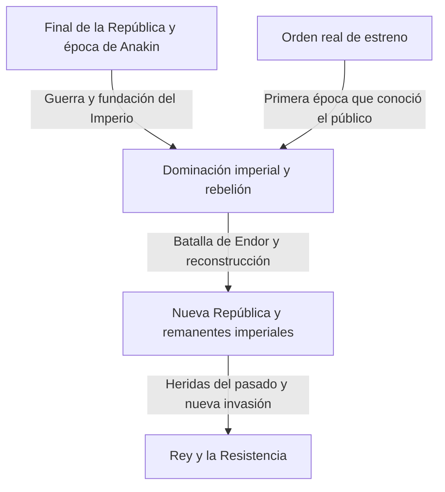
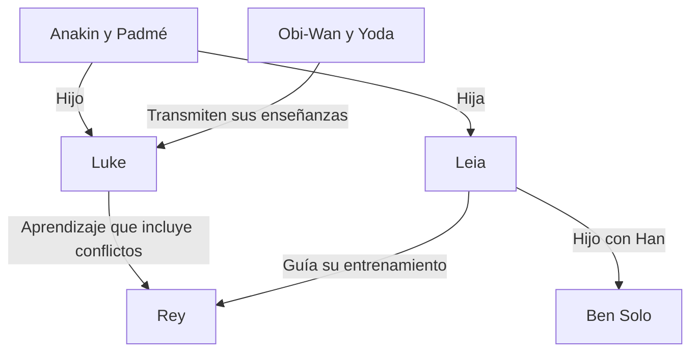

En pocas palabras, Star Wars es una historia de aventuras en una galaxia lejana. Pero esas aventuras entrelazan amor y conflictos entre padres e hijos, el derrumbe de la democracia, la resistencia al Imperio, religión y poder, heridas de guerra y familias que van más allá de la sangre. Detrás de la pantalla hay también una historia del cine que transformó las maquetas, el montaje, la música, el sonido y los gráficos por ordenador.

Aunque conozcamos los sables de luz y a Darth Vader, el panorama se vuelve más difícil de abarcar a medida que aumentan las obras. ¿Por qué se estrenó primero el episodio IV? Si los Jedi eran caballeros de la justicia, ¿por qué no pudieron proteger la República? ¿Qué heredan y qué cambian las historias de Anakin, Luke y Rey? ¿Qué aportan Andor y The Mandalorian más allá de un apéndice de las películas?

Este artículo aborda esas preguntas desde tres planos: el relato galáctico, las relaciones entre las obras y su historia real de producción. En lugar de enumerar todos los detalles del universo como un diccionario, ofrece un recorrido extenso para comprender las causas y consecuencias de las obras principales y los temas que cambian al reaparecer. Muestra la amplitud de un mundo ramificado y propone a quienes llegan por primera vez un camino por el que no perderse.

El texto revela desenlaces, identidades, muertes importantes y decisiones de las nueve películas de la saga y de obras relacionadas. Si aún no las has visto y quieres conservar sus sorpresas, conviene leer primero los apartados iniciales y la guía de visionado del final, y volver a cada capítulo después de ver la obra correspondiente. La fecha de referencia para los contenidos y los estrenos es el 3 de octubre de 2026. Las ilustraciones son arte conceptual generado para este artículo, no fotogramas oficiales ni documentos de producción.

## Tres tiempos que conviene distinguir: estrenos, historia interna y creación del universo

La mayor dificultad de Star Wars es que el tiempo no sigue una única línea. La película estrenada en 1977 quedó situada después como episodio IV dentro de su historia. El público conoció las aventuras de Luke antes de ver la juventud de su padre Anakin, presentada a partir de 1999. Los acontecimientos más antiguos del relato no tienen por qué haberse filmado antes.

El orden en que sus creadores concibieron los elementos del universo es distinto también. Una relación revelada en una obra posterior puede cambiar la forma de ver una escena anterior. Eso no equivale a afirmar que, al hacer la primera película, ya estuvieran decididas todas las historias de las décadas siguientes. Conviene no reconstruir retrospectivamente una creación que evolucionó atendiendo solo a la coherencia de su forma terminada.

Distinguir estos tres tiempos ayuda a entender el placer de las precuelas. Conocer el desenlace no elimina necesariamente la sorpresa: permite contemplar una tragedia preguntándose dónde habría sido posible elegir de otro modo. El orden de estreno, en cambio, permite descubrir la información con un ritmo parecido al de los primeros espectadores. Ambas posibilidades tienen valor propio; no hay una única respuesta correcta que sirva para competir en conocimientos.

| Grupo de películas | Años de primer estreno | Pregunta central |
| --- | --- | --- |
| Episodios IV, V y VI: trilogía original | 1977, 1980, 1983 | ¿Cómo resistir a un poder abrumador y afrontar el pasado familiar? |
| Episodios I, II y III: trilogía de precuelas | 1999, 2002, 2005 | ¿Por qué la República y Anakin pierden aquello que querían proteger? |
| Episodios VII, VIII y IX: trilogía de secuelas | 2015, 2017, 2019 | ¿Cómo hereda una nueva generación las victorias y los fracasos de la anterior? |
| Rogue One y Han Solo | 2016, 2018 | ¿Cómo narrar a quienes estaban al margen de la saga y sus decisiones pasadas? |
| La película de animación The Clone Wars | 2008 | ¿Cómo ampliar una guerra prolongada mediante las relaciones personales? |
| The Mandalorian and Grogu | 2026 | ¿Cómo pensar la protección y la comunidad después del derrumbe imperial? |

Los años corresponden, por regla general, al primer estreno en salas y pueden diferir del estreno japonés. La [guía oficial de películas y series](https://www.starwars.com/news/star-wars-movies-and-series-guide) permite consultar los estrenos y la cronología general. Situar el título de una serie en un único punto de una línea temporal puede inducir a error cuando, como ocurre con algunas antologías de cortometrajes, abarca varias épocas.

Este esquema ofrece una estructura para comprender las principales obras audiovisuales. No significa, por ejemplo, que el Imperio desapareciera de todos los rincones de la galaxia tras una sola batalla. La derrota simbólica de un régimen y los cambios en sus organizaciones militares, su administración, el crimen o las mentalidades avanzan a ritmos distintos. Muchos relatos derivados habitan esas diferencias de tiempo.

## Canon y Legends: ¿a qué continuidad pertenece cada historia?

El canon es el marco con el que se considera la continuidad narrativa oficial actual. Legends es una categoría que organiza numerosas novelas, cómics, videojuegos y otras historias desarrolladas anteriormente. En 2014, Lucasfilm revisó el tratamiento del Universo Expandido existente y anunció una nueva etapa articulada alrededor de las películas y The Clone Wars. El [anuncio oficial de entonces](https://www.starwars.com/news/the-legendary-star-wars-expanded-universe-turns-a-new-page) explica esa transición.

Que una obra pase a Legends no significa que desaparezca ni que deje de merecer la pena leerla. Puede leerse como una historia galáctica desarrollada en otra época, con otras limitaciones y posibilidades. A la inversa, cuando un nombre o una idea antiguos reaparecen en una obra nueva, su biografía y sus acontecimientos anteriores no entran automáticamente y en bloque en la nueva continuidad. Precisamente ante un nombre conocido conviene comprobar de qué obra y de qué versión hablamos.

Tampoco todas las producciones oficiales comparten una misma continuidad. Proyectos como Visions exploran expresiones libres de la cronología establecida. No todas las acciones disponibles en un videojuego se convierten necesariamente en acontecimientos del relato; a veces hay que distinguir las opciones del jugador de los hechos que una secuela da por sucedidos.

Conviene evitar convertir la clasificación de los elementos del universo en un juicio sobre la calidad de las obras. El canon ayuda a entender sus conexiones, no a puntuar su capacidad de emocionar. Lo mostrado en pantalla, los documentos oficiales, las afirmaciones de los personajes y las interpretaciones del público son clases distintas de información. Tampoco debe tomarse una explicación que un personaje cree cierta como una verdad omnisciente del mundo.

Este artículo parte de la continuidad de las principales obras audiovisuales actuales y distingue Legends y los proyectos independientes cuando los menciona. También separa lo representado de las lecturas posibles. Por ejemplo, una crítica a la institución Jedi es un análisis del espectador, no un dato oficial que niegue las buenas intenciones de todos los Jedi.

## Un pequeño mapa de personajes para entrar en la galaxia

En el centro hay varias generaciones relacionadas con la familia Skywalker. Luke y Leia son hijos de Anakin y Padmé. Ben Solo, hijo de Leia y Han, adopta después el nombre de Kylo Ren. Sin embargo, la transmisión del relato no se explica solo por la sangre. Enseñanzas, fracasos y decisiones pasan de Obi-Wan y Yoda a Luke, de Anakin a Ahsoka y a una nueva generación que incluye a Rey.

R2-D2 y C-3PO recorren esa historia desde posiciones diferentes de las humanas. Chewbacca, Lando y los compañeros rebeldes conectan los conflictos íntimos de la familia con la lucha galáctica. Las series posteriores muestran, a través de Cassian, Din Djarin, Grogu y los clones, la vida de quienes se encuentran lejos del centro heroico.

Separar los vínculos familiares de los de maestro y alumno revela que la historia galáctica no es una simple genealogía real. Más que qué se hereda, importa cómo se utiliza y qué se rechaza. Empecemos por la trilogía a través de la cual el público entró en esta galaxia y examinemos la función de cada película.

## Episodio IV, Una nueva esperanza: la política galáctica alcanza la vida de un joven

La primera película, estrenada en 1977, empieza a mitad de la historia de su mundo. Sin conocer en detalle el nacimiento del Imperio, el público ve una nave pequeña perseguida por un enorme buque de guerra. El contraste de tamaños basta para expresar la desigualdad entre perseguidor y perseguido. La apertura no explica exhaustivamente el universo antes de iniciar el relato: transmite mediante los actos de los personajes lo necesario para comprender los acontecimientos. La fecha de estreno y la posición general de la historia pueden consultarse en la [página oficial de la película](https://www.starwars.com/films/star-wars-episode-iv-a-new-hope).

### La aventura no empieza con la conciencia de ser un elegido

Luke Skywalker vive en una granja de Tatooine y al principio no pretende salvar la galaxia. Es un joven que desea escapar de la estrechez de su vida cotidiana. Pero los droides que llegan a su casa llevan información rebelde, y la petición de ayuda de Leia lo conduce al retirado Obi-Wan Kenobi. Mientras el conflicto político es una noticia lejana, Luke puede volver a la granja. Esa frontera se derrumba cuando la violencia imperial mata a los tíos que lo criaron.

La causalidad importa. Luke no queda vinculado al Imperio simplemente por elegir la aventura: lo que se destruye es la propia vida que intentaba mantenerse al margen del dominio imperial. El relato muestra crecimiento personal y, a la vez, cómo la violencia del poder penetra en la vida de la periferia. Sin embargo, el dolor por sí solo no lo convierte en héroe. Encontrar un maestro y compañeros, aprender a actuar y emplear sus capacidades para ayudar a otros otorga un sentido público a sus deseos iniciales.

Leia es rescatada, pero no se limita a esperar el rescate. Oculta información, resiste los interrogatorios y toma decisiones durante la fuga. En las instalaciones donde Luke y Han entran para ayudarla, ella termina compensando sus errores. Como los papeles no son fijos, los tres no forman una relación simple de héroe, ayudante y premio: constituyen un grupo cuyos juicios se cuestionan mutuamente.

### La Estrella de la Muerte es un arma y una filosofía de gobierno

El terror de la Estrella de la Muerte no se reduce a su capacidad de destruir planetas. Detrás está el proyecto de volver innecesarias la negociación cotidiana y la representación mediante una demostración de fuerza abrumadora. La disolución del Senado se conecta con la idea de someter los sistemas por el miedo. Destruir Alderaan va más allá de atacar una instalación militar: amenaza a cualquiera que piense en resistir.

Los rebeldes no disponen de un arma comparable. Estudian los planos, encuentran una pequeña debilidad y concentran sus fuerzas limitadas. La victoria conecta a droides que transportan información, personas que confían los planos a otras, analistas y equipos de mantenimiento de cazas. Luke realiza el disparo decisivo, pero la cooperación colectiva lo hace posible. Si se pierde de vista esta estructura, la película puede parecer una historia simple en la que alguien de sangre especial lo resuelve todo.

El regreso de Han forma parte de esa cooperación. Quien actuaba por dinero ayuda a sus amigos a pesar del peligro. Luke confía en la Fuerza sin depender únicamente de su visor, y Han deja de decidir solo según la recompensa: ambos movimientos pueden leerse como una confianza que supera las ganancias y pérdidas inmediatamente visibles. No se propone abandonar la tecnología. Cazas, comunicaciones y planos siguen siendo necesarios; la cuestión es qué añadir al juicio final.

También importa cómo la historia galáctica entra en pantalla mediante máquinas que necesitan mantenimiento y el coste de la vida. El Halcón no es simplemente un vehículo ideal y veloz, sino una nave cuyo dueño se esfuerza por mantener en funcionamiento. La cantina tiene clientes que no existen solo para explicar cosas al protagonista, y los droides llevan vidas en las que son comprados y vendidos. Porque parecen suceder cosas fuera del centro del encuadre, el público siente que ese mundo existe desde hace mucho sin necesidad de conocerlo entero.

## Episodio V, El Imperio contraataca: la derrota rompe la imagen que el héroe tiene de sí mismo

La victoria anterior no supuso la desaparición del Imperio. Los rebeldes siguen huyendo y no pueden mantener su base en Hoth. La película parte de que destruir un arma gigantesca no elimina instituciones ni ejércitos. Estrenada en 1980, desarrolla paralelamente el aprendizaje de Luke y la huida de Han y sus compañeros. [Página oficial de la película](https://www.starwars.com/films/star-wars-episode-v-the-empire-strikes-back)

### El aprendizaje exige algo más que levantar piedras

Cuando Luke conoce a Yoda en Dagobah, se desmoronan sus expectativas sobre el aspecto y la conducta de un gran maestro. No reconoce inmediatamente la sabiduría en aquel ser pequeño y extraño. El recurso funciona también con el público. Aprender sobre la Fuerza empieza por cuestionar la costumbre de asociar poder con un cuerpo grande o un arma grande.

En la cueva, Luke ve su propio rostro bajo la máscara del Vader al que ha derrotado. La película no establece que la imagen sea una simple grabación del futuro. Puede interpretarse como una advertencia: avanzar contra el enemigo siguiendo el miedo y la ira puede convertirlo a uno en ese mismo enemigo. Antes se trataba de vencer al Imperio como adversario externo; ahora también hay que examinar la mente de quien intenta derrotarlo.

Tras una visión del sufrimiento de sus amigos, Luke interrumpe su formación. Resulta difícil considerar la decisión enteramente correcta por compasiva o enteramente equivocada por inmadura. Se entiende que no pueda abandonarlos, pero calcula mal los límites de su fuerza y su información. Vader utiliza precisamente esos sentimientos para atraerlo. Las buenas intenciones no vuelven innecesario juzgar la situación.

### El acuerdo de Lando y los límites del compromiso con la dominación

Lando pacta con el Imperio para proteger Ciudad Nube. Pero un contrato no garantiza seguridad si la parte más fuerte puede cambiar unilateralmente lo prometido. Cumplir una condición solo produce otra exigencia. Su fracaso no es únicamente una traición personal: también es el fracaso político de preservar la autonomía bajo una violencia abrumadora.

Equivocarse, sin embargo, no obliga a permanecer siempre en el error. Lando pasa a rescatar a los demás. Luke fracasa, Lando traiciona y Han es capturado, pero su valor no depende solo de la proporción inmediata de éxitos. Cambiar de conducta, pedir ayuda y responder a quien la necesita sigue siendo una medida distinta de la victoria.

La revelación de que Vader es el padre de Luke no borra la diferencia entre bien y mal. La violencia imperial no se vuelve legítima. Lo que se quiebra es la historia familiar ordenada de Luke: la creencia de ser hijo de un padre bueno y de tener por enemigo a un desconocido que lo mató. Derrotar al enemigo para acercarse al padre se convierte en una pregunta más difícil: cómo afrontar a ese enemigo para heredar el legado paterno.

Luke no sale vencedor del duelo. Herido e incapaz de escapar solo, necesita que Leia y los demás lo rescaten. Ser salvado por aquella a quien fue a salvar en la primera película rechaza el aislamiento del héroe. La independencia no consiste únicamente en no depender de nadie: puede significar volver a los vínculos cargando con errores y debilidades. Por eso el desenlace sombrío hace más que aplazar la resolución hasta la siguiente entrega.

La blancura de Hoth, el encierro húmedo de Dagobah y el exterior luminoso y el interior oscuro de Ciudad Nube son más que decorados. La sensación de cada lugar sostiene la retirada militar, la exploración interior y el derrumbe de una seguridad aparente. Cada traslado vuelve insuficientes las habilidades conocidas del héroe: triunfar en un caza no proporciona respuestas para el aprendizaje, la negociación o una conversación con su padre.

Arte conceptual generado para ilustrar la desigualdad de poder entre rebelión e Imperio; no es un fotograma oficial.

## Episodio VI, El retorno del Jedi: salvar a un padre y derrotar a un imperio

La conclusión de 1983 empieza con el rescate de Han y reúne la reparación de vínculos personales y la guerra galáctica. En el palacio de Jabba, Luke está más sereno que el joven de la primera película y maneja su poder con mayor confianza. Pero la apariencia no prueba su madurez Jedi. La pregunta definitiva es qué hace cuando puede ganar. [Página oficial de la película](https://www.starwars.com/films/star-wars-episode-vi-return-of-the-jedi)

### La trampa del Emperador busca la ira más que la muerte

Mientras intenta aniquilar militarmente a los rebeldes, el Emperador procura atraer a Luke a su lado. Le muestra a sus amigos en peligro, lo incita a atacar con ira y quiere que esa emoción culmine en el asesinato de su padre. Aunque Luke derrote a Vader, el Emperador vence si acepta la misma lógica de dominación. El duelo permite, por tanto, que la victoria militar y el éxito ético apunten en direcciones opuestas.

Furioso por la amenaza contra Leia, Luke se impone a Vader. Al comparar la mano mecánica de su padre con la suya, la visión de la cueva vuelve como una decisión concreta. Arrojar el arma no supone elegir la no violencia porque no exista peligro. Acepta que pueden matarlo y rehúsa matar a su padre. Se aparta de una medida de la fuerza que exige destruir al enemigo para demostrar el propio valor.

La rebelión de Vader contra el Emperador es una decisión tomada al ver sufrir a su hijo. Hay redención, pero no una explicación que borre sus crímenes anteriores. La fe de un hijo en la bondad de su padre es distinta de la obligación de las víctimas de perdonar a su agresor. La película representa una transformación final en una relación paterno-filial; no resuelve toda la responsabilidad jurídica ni la memoria histórica. Mantener la distinción permite comprender los límites del desenlace sin perder su fuerza emocional.

### Por qué la batalla del bosque importa tanto como la sala del trono

Si aislamos el enfrentamiento con el Emperador, parece que los problemas familiares mueven por sí solos el mundo. En realidad, la flota no puede destruir la segunda Estrella de la Muerte mientras la fuerza terrestre de Endor no desactive su escudo. Hacen falta tanto el rescate del padre por Luke como la destrucción de las instalaciones militares por los rebeldes. Una tarea no realiza automáticamente la otra.

Los ewoks aportan conocimiento del terreno y otra forma de combatir a la operación conjunta. El Imperio posee mayor blindaje y potencia de fuego, pero no toma en serio a los habitantes locales como sujetos capaces de actuar. Ese desprecio lo lleva a calcular mal una resistencia basada en el terreno y la sorpresa. Por supuesto, no es una ley general según la cual las armas sencillas siempre derroten a los ejércitos avanzados en las guerras reales. Como fábula, muestra la debilidad de un poder que subestima el juicio y la solidaridad de seres pequeños.

Luke, Han, Leia, Lando, Chewbacca, los droides, soldados anónimos y los habitantes de Endor contribuyen. La convergencia de sus esfuerzos impide que la celebración sea la coronación de una sola persona. También marca el regreso de Luke a una comunidad después de perder a su padre. La coexistencia de pérdida personal y victoria pública evita que la felicidad del filme sea un final feliz sin heridas.

La derrota del Emperador es asimismo el fracaso de su creencia de que todos acabarán actuando por interés y miedo. Un hijo que no abandona la fe en su padre y un padre que elige a su hijo frente a la obediencia al gobernante quedan fuera de sus cálculos. Un gran poder en la Fuerza no permite predecir por completo las decisiones humanas. La confianza excesiva en las armas gigantes y en haber comprendido todos los corazones comparte esa debilidad.

## Episodio I, La amenaza fantasma: un imperio no empieza pareciendo un imperio

La precuela estrenada en 1999 comienza con un conflicto dentro de la República, no con la dictadura militar manifiesta de la primera película. El bloqueo de Naboo por la Federación de Comercio transforma una disputa comercial y fiscal en ocupación armada. La joven reina Padmé Amidala espera que apelar al Senado establezca los hechos y traiga ayuda. Pero las instituciones quedan atrapadas en investigaciones y procedimientos, y sus decisiones no siguen el ritmo del sufrimiento sobre el terreno. [Página oficial de la película](https://www.starwars.com/films/star-wars-episode-i-the-phantom-menace)

### Palpatine obtiene apoyo como quien puede resolver la crisis

Para quien conoce la historia posterior, los consejos del senador Palpatine de Naboo tienen doble sentido. Se sitúa junto a la parte perjudicada y aprovecha la desconfianza hacia un dirigente que parece incompetente. Lo decisivo es que no invade el Senado desde fuera para destruir de un golpe la República: asciende mediante los procedimientos parlamentarios y las expectativas de la población.

Los enemigos tampoco forman un bloque único. La Federación de Comercio persigue sus intereses, mientras Darth Sidious la utiliza como instrumento de un plan mayor. Aunque termine el conflicto visible, permanece el desplazamiento de poder que ha provocado. Liberar Naboo es una victoria real, pero no necesariamente una victoria para el futuro republicano. La celebración inquieta porque esas dos escalas no coinciden.

La petición de ayuda de Padmé a los gungan constituye la política opuesta. En lugar de preservar su dignidad de representante, reconoce su relación como habitantes del mismo planeta y solicita ayuda. No compensa solamente la escasez militar: grupos antes separados crean un propósito común. Esa pequeña solidaridad produce la capacidad efectiva de actuar que el Senado no había proporcionado.

### Antes que su talento, hay que mirar la vida de Anakin

El pequeño Anakin es un piloto extraordinario, pero también vive esclavizado. En un mundo con una inmensa República y Jedi que hablan de justicia, la libertad de una madre y su hijo no está garantizada. Esto muestra la diferencia entre que existan instituciones y que su protección llegue a todas las regiones. Qui-Gon puede liberar a Anakin, pero no salvar por el mismo medio a su madre Shmi.

Partir reúne la alegría de que se reconozcan sus capacidades y el miedo de dejar atrás a su madre. Reducir al Anakin posterior a una persona débil que no superó el miedo ignora las condiciones en que nació ese miedo. Al mismo tiempo, una infancia dura no vuelve inevitable la violencia posterior. El relato permite preguntar qué apoyo y educación necesitaba una persona herida.

La muerte de Qui-Gon impide que el maestro que descubrió a Anakin lo guíe mucho tiempo. Obi-Wan hereda la promesa, pero su relación no está completa desde el principio. Una gran profecía y las expectativas institucionales empiezan a avanzar más deprisa que el crecimiento de un niño. Ese desequilibrio prepara la tragedia de toda la trilogía.

En cuanto a la producción, también es inexacto describir las precuelas como películas hechas enteramente por ordenador. Los materiales oficiales explican recursos artesanales como los bastoncillos de algodón teñidos utilizados en maquetas del público de la carrera de vainas. Entender la imagen como una combinación de tecnología nueva y trabajo manual se acerca más a la realidad. [Curiosidades oficiales de producción](https://www.starwars.com/news/25-fun-facts-the-phantom-menace)

Las batallas simultáneas del final permiten distinguir las funciones de los grupos. La maniobra de distracción gungan, la acción en el palacio, el combate espacial y el duelo Jedi-Sith resuelven problemas distintos. Un único espadachín poderoso no puede terminar la ocupación. Además, bajo el éxito militar, la muerte de Qui-Gon muestra que la victoria de una comunidad y la pérdida en la vida de un niño no tienen por qué coincidir.

## Episodio II, El ataque de los clones: prepararse para la guerra reduce las opciones

En la segunda precuela, estrenada en 2002, crece el movimiento separatista que desea abandonar la República y la creación de un ejército se convierte en un asunto político. Al investigar el intento de asesinato de Padmé, Obi-Wan descubre el ejército clon. Ante una República que supuestamente seguía debatiendo cómo prepararse para una crisis aparece un ejército ya terminado. La urgencia de seguridad encuentra una solución conveniente de origen oscuro. [Página oficial de la película](https://www.starwars.com/films/star-wars-episode-ii-attack-of-the-clones)

### Las exigencias bélicas se adelantan al misterio que habría que investigar

Cómo se encargó el ejército clon y a quién sirve deberían ser preguntas prioritarias. Pero, con un ejército enemigo al alcance, se busca una fuerza disponible de inmediato. La crisis transforma las decisiones al quitar tiempo para examinarlas. El ejército no se adopta después de una investigación suficiente, sino en circunstancias que hacen parecer inexistentes las alternativas.

Las críticas de Dooku a la República incluyen problemas reales de corrupción institucional. Sin embargo, diagnosticar correctamente un problema no garantiza la justicia de la solución propuesta. Como él participa en el plan Sith, la decepción republicana no conduce directamente a la liberación. Hay que distinguir el conflicto visible entre los bandos de la posición de Sidious, que lo aprovecha.

Los Jedi también van a combatir para preservar la paz y se convierten en generales de un ejército. Su operación de rescate exitosa contribuye, paradójicamente, a iniciar una guerra. Salvar vidas en la situación inmediata convive con el efecto a largo plazo de reforzar el orden militar. Los medios adoptados para un fin bueno transforman gradualmente la naturaleza de la institución que los utiliza.

### El romance y la política comparten el deseo de control

La relación de Anakin y Padmé tropieza con su posición, sus deberes y la disciplina Jedi. El matrimonio secreto protege su amor y, al mismo tiempo, reduce su acceso al consejo y al apoyo. Al haber menos personas con quienes compartir las dificultades, los temores que después se intensifican resultan más difíciles de examinar desde fuera.

Tras perder a su madre, Anakin mata a habitantes de un asentamiento tusken, incluidos niños. No debe pasarse por alto como una mera indicación dramática de la intensidad de su ira. La violencia contra un ser querido se vuelve justificación de la violencia contra otros: una ruptura ética clara. El dolor puede comprenderse, pero los actos implican responsabilidad. Su caída posterior no es un vuelco repentino; aquí ya ha cruzado una frontera importante.

La idea política de Anakin de que un dirigente fuerte debería decidir si consigue el resultado deseado también resuena con su voluntad de controlar la pérdida en los vínculos íntimos. Cuesta aceptar que las personas tienen voluntades distintas y que los seres queridos viven más allá del propio control. Pero eliminar la incertidumbre mediante la coacción destruye precisamente la relación que se pretende proteger. La siguiente película lleva ese problema al extremo.

La uniformidad del ejército clon encierra además la inquietud de tratar a seres humanos como unidades militares intercambiables. Compartir un origen no hace que sus vidas puedan contarse como idénticas. La película subraya primero la apariencia de un ejército masivo; las obras posteriores profundizan en cada soldado. Advertir ese orden permite reconsiderar lo que parecía la salvación republicana preguntando quién paga su precio.

## Episodio III, La venganza de los Sith: el deseo de salvar se convierte en lógica de dominación

En la tercera precuela, estrenada en 2005, la República se derrumba cuando las Guerras Clon se acercan al final. Frente a la expectativa de que ganar restablezca la paz, el poder concentrado para combatir se convierte en fundamento de la dictadura de posguerra. Como Anakin y la República caen juntos, la tragedia no puede reducirse solo a debilidad personal ni solo a fracaso institucional. [Página oficial de la película](https://www.starwars.com/films/star-wars-episode-iii-revenge-of-the-sith)

### Palpatine vende la promesa de controlar la muerte

Anakin teme un futuro en el que pierde a Padmé. Palpatine no rechaza directamente ese miedo: sugiere que existe un poder que no puede obtener en otra parte. Es más sutil que predicar una doctrina maligna. Identifica lo que el otro más teme perder y se presenta como indispensable para protegerlo. Conforme aumenta la dependencia, resulta más fácil aceptar explicaciones contradictorias y exigencias criminales.

También existe desconfianza entre Anakin y el Consejo Jedi. Él siente que no lo reconocen; el Consejo recela de su cercanía a Palpatine. El encargo de actuar como espía divide aún más sus lealtades. Explicar estas circunstancias no equivale a excusar sus actos. Después de detener a Mace Windu para proteger a Palpatine, Anakin obedece órdenes cada vez más destructivas.

Tras cometer un error grave, a veces se prefiere un camino que le dé sentido antes que retroceder. La conducta de Anakin puede leerse como esa cadena de autojustificación. Ha llegado tan lejos que debe obtener el poder o todo habrá sido inútil. Esa idea hace que el siguiente daño parezca un sacrificio necesario.

### La Orden 66 cambia la dirección de la capacidad de matar ya existente en una institución

Los Jedi no son atacados por un ejército nuevo llegado de lejos, sino por soldados que luchaban a su lado. Al invertirse la cadena de mando, las posiciones y la confianza propias de aliados se convierten en debilidades. La película muestra la orden y los ataques coordinados; la animación relacionada detalla el control de los clones. Distinguir la explicación del filme de las incorporaciones posteriores aclara la función de cada obra.

El Imperio tampoco se funda cuando quedan destruidos todos los edificios republicanos. Se proclama en el Senado como un nuevo orden. Bajo el lenguaje de restaurar la seguridad, vigilancia y violencia se convierten en gobierno permanente. Presentar a los Jedi opositores como traidores permite reinterpretar la resistencia a la concentración de poder como ataque al orden.

En Mustafar, Anakin dirige su violencia contra Padmé, a quien quería salvar. Cuando ella discrepa, lo interpreta como traición en lugar de respetar su voluntad. La diferencia entre afecto y posesión resulta inequívoca. El futuro que deseaba no requería solamente una Padmé viva, sino una Padmé que aprobara sus decisiones.

Las escenas de Anakin quemado y encerrado en una armadura y del nacimiento de los gemelos reúnen desesperación y posibilidad futura. Ni Obi-Wan ni Yoda son vencedores. Sin embargo, proteger a los niños preserva un futuro dentro de la derrota política. La catástrofe de las precuelas nace de combinar buenas intenciones, miedo, instituciones y ambición, no de una desaparición de todas las personas buenas que permita vencer al mal.

El dolor de Obi-Wan también está lejos de la satisfacción de descubrir y derrotar a un villano. Debe combatir a quien consideraba un hermano, mientras persisten preguntas sobre su enseñanza y su juicio. La duración del duelo puede leerse como algo más que una comparación de habilidades: es el sufrimiento de personas que se conocen profundamente y no logran romper el vínculo. Ni siquiera el vencedor tiene dónde celebrar su victoria.

## Episodio VII, El despertar de la Fuerza: una generación hereda héroes que no conoció

En el nuevo capítulo de 2015, los héroes rebeldes son figuras casi legendarias para Rey y Finn. Los nombres familiares para el público resultan lejanos para los jóvenes. Esa diferencia reúne en un encuadre la memoria de los espectadores veteranos y la sorpresa de los nuevos. La Primera Orden aparece en el mundo posterior al Imperio y demuestra que la victoria de ayer no garantiza la seguridad de la generación siguiente. [Página oficial de la película](https://www.starwars.com/films/star-wars-episode-vii-the-force-awakens)

### Finn se convierte en protagonista al negarse primero a obedecer

Finn no parte de una genealogía ilustre ni de una profecía. Como soldado obligado a obedecer, se niega a matar. Esa decisión inicia su transformación de número de una organización en alguien que elige por sí mismo. No adquiere inmediatamente la resolución completa de salvar la galaxia; al principio conserva un intenso deseo de huir. La película no muestra la buena acción después de desaparecer el miedo, sino a alguien que se mantiene firme por otra persona mientras sigue sintiéndolo.

En Jakku, Rey ha aprendido a sobrevivir, pero espera a una familia que quizá regrese. Su inmovilidad no nace de falta de capacidad, sino de expectativas ligadas al pasado. Abandonar su hogar significa más que cambiar de planeta. Supone pasar de la esperanza de que esperar restituya su vida anterior a la posibilidad de crear nuevas relaciones por sí misma.

### Kylo Ren desea la imagen de Vader más que su fuerza

Ben Solo intenta reconstruirse como Kylo Ren. Venera a su abuelo Vader, pero la decisión final de este de salvar a su hijo no encaja con la imagen de un mal poderoso que desea. No siempre se hereda intacto el pasado: a veces se elige solo lo que se necesita. Kylo muestra que heredar la historia puede significar también interpretarla mal.

Matar a Han tampoco es solo la escena de un villano frío que elimina un obstáculo. Kylo cree que romper el apego familiar lo hará fuerte e intenta rehacerse. Pero la violencia no resuelve necesariamente el conflicto. El acto destinado a eliminar la incertidumbre genera otra herida. Mientras Rey avanza hacia los vínculos, Kylo intenta afirmarse cortándolos.

Son evidentes las semejanzas estructurales con la primera película, como la base Starkiller y el droide que lleva un mapa. Pueden disfrutarse como nostalgia o criticarse como repetición. Para analizarlas, sin embargo, conviene ir más allá del parecido y examinar las decisiones distintas de personajes en posiciones similares. Un antiguo soldado de una organización imperial se vuelve protagonista, una joven que espera rescate resiste por sí misma y el hijo de un héroe pasa a ser enemigo. Dentro de una forma conocida, la inquietud de la herencia ocupa el centro.

La destrucción del centro de la Nueva República demuestra con fuerza la fragilidad del orden político. Pero, como se dedica poco tiempo a mostrar su vida cotidiana, puede resultar difícil comprender concretamente qué se ha perdido. Es un límite de la exposición del filme. Las obras relacionadas pueden darle peso, pero no debe atribuirse toda la falta de comprensión al espectador que no las conoce. La información que comunica la propia obra determina la experiencia de verla.

## Episodio VIII, Los últimos Jedi: reconocer el fracaso sin abandonar la responsabilidad

La segunda secuela, estrenada en 2017, contradice la expectativa de que encontrar a Luke resuelva el problema de Rey. Luke se ha retirado de volver a ser héroe. Entretanto, la Resistencia huye y debe decidir cómo sobrevivir con recursos limitados. La película cuestiona en paralelo el heroísmo personal y el liderazgo organizativo. [Página oficial de la película](https://www.starwars.com/films/star-wars-episode-viii-the-last-jedi)

### ¿Reconocer un error justifica abandonarlo todo?

El pasado de Luke y Ben se cuenta desde perspectivas distintas. El sentido de la misma escena cambia entre el miedo momentáneo de Luke y el terror que Ben experimentó al verlo. No es un relativismo que niegue los hechos: distingue lo que alguien pensaba de lo que otro vivió realmente. Explicar que el impulso fue breve o que hubo arrepentimiento no borra la herida causada.

Luke conecta su fracaso con el de toda la orden Jedi y desea terminar la tradición. Las críticas a esa historia merecen consideración, pero, si solo justifican su ausencia, lo alejan de la responsabilidad hacia quienes sufren ahora. Entre conservarlo todo incondicionalmente y abandonarlo porque fracasó debe existir un camino para aprender y transmitirlo de otra manera.

Rey y Kylo descubren la posibilidad de comprenderse, pero comprender no equivale a estar de acuerdo. Compartir soledad no obliga a aceptar un orden que domina a otros. Tampoco matar a Snoke lleva automáticamente a Kylo al bien. Matar a un gobernante y rechazar el sistema de dominación son actos diferentes; él intenta ocupar el puesto vacante.

### El valor y el mando operan en escalas temporales distintas

Poe tiene valor para destruir al enemigo inmediato, pero debe aprender cuántas personas y recursos cuesta el éxito. Obtener un resultado visible en una batalla no equivale a mantener viva una organización hasta mañana. Para quien manda, decidir no atacar o retirarse también forma parte de la responsabilidad.

Su conflicto con Holdo incluye la dificultad de compartir información. El público experimenta diferencias entre quién sabe qué. Concluir simplemente que los subordinados deben obedecer en silencio resulta demasiado estrecho. Ver el choque entre secreto, confianza, autoridad y explicaciones insuficientes durante una crisis permite apreciar virtudes y defectos de los personajes.

Canto Bight muestra que una prosperidad aparentemente ajena a la guerra puede conectarse a ella por las armas y la explotación. Finn pasa de querer proteger a una amiga concreta a comprender la resistencia más ampliamente. Aun así, que unos traficantes comercien con ambos bandos no prueba que sus objetivos políticos sean idénticos. Criticar las estructuras de lucro debe distinguirse de equiparar invasión y resistencia.

El último acto de Luke no consiste en matar a muchos soldados enemigos, sino en dar tiempo para que sobrevivan sus compañeros. Quien rechazaba su leyenda acepta su capacidad de inspirar esperanza. Atrae la atención del enemigo por un medio distinto de la victoria física. Puede leerse la película como un recorrido que empieza rompiendo una imagen heroica y termina eligiendo cómo utilizarla de nuevo.

Rey buscaba en Luke habilidades, pero también una respuesta exterior que estableciera su identidad. Sin embargo, su maestro es otra persona con errores y miedos. Una vez reconocida la imperfección de alguien en quien se apoya, debe decidir qué tomar de sus enseñanzas. No se trata solo de una alumna que rechaza a su maestro: se pregunta si es posible seguir aprendiendo sin idealizarlo.

## Episodio IX, El ascenso de Skywalker: los orígenes y un nombre elegido

La novena película, estrenada en 2019, recupera a Palpatine como enemigo definitivo y vincula a Rey con su familia. Cambia considerablemente la interpretación anterior de que no pertenecía a un linaje importante. Las reacciones a ese giro difieren, pero el análisis debe distinguir primero lo que comunica cada película de lo que añade la siguiente. [Página oficial de la película](https://www.starwars.com/films/star-wars-episode-ix-the-rise-of-skywalker)

### La sangre puede explicar capacidades, pero no dictar una obligación ética

Rey teme que un linaje maligno determine su futuro. El desenlace, sin embargo, avanza hacia elegir enseñanzas y vínculos en lugar de someterse al origen. No basta con decir que la sangre nunca importó. La película la utiliza como recurso importante y, al mismo tiempo, intenta representar la libertad de la protagonista rechazando el papel que supuestamente implica ese parentesco.

Sus relaciones con Luke y Leia ofrecen otro camino de herencia. Elegir al final el nombre Skywalker puede leerse menos como declaración de ascendencia biológica que como afirmación de los valores que quiere heredar y de los vínculos que la criaron. Elegir un nombre no borra el dolor ni el pasado. Lo significativo es decidir cómo llamarse después de conocer ese pasado.

La película por sí sola explica poco los detalles técnicos del regreso de Palpatine. No debe confundirse material complementario con información presentada directamente, como si todo apareciera explicado en pantalla. Dentro del relato importa que el miedo a morir y el apego al poder lo llevan a tratar incluso los cuerpos y las generaciones siguientes como instrumentos. El hombre que tentó a Anakin con el control de la vida sigue utilizando a otros para preservarse.

### La transformación de Ben invierte la idea de vencer a la muerte

El regreso de Ben desde su vida como Kylo Ren implica la intervención de su madre, el rescate de su vida por Rey y el recuerdo de su padre. Había fracasado al intentar librarse del conflicto matándolo. Volver a aceptar los vínculos abre otra elección. La transformación no borra el daño anterior, pero conserva la posibilidad de actuar ahora de otra manera.

Su entrega final de vida a Rey contrasta con Anakin sacrificando a otros porque no soportaba perder a un ser amado. En vez de dominar el mundo para conservar la vida, da de sí mismo. A lo largo de nueve películas, el contraste transforma el significado de salvar a alguien. Retenerlo junto a uno no equivale a desear que viva.

La flota reunida en Exegol también realiza una tarea distinta del duelo de Rey. Personas aisladas por el miedo reconocen la presencia de otras y se congregan. La credibilidad de esa convergencia puede valorarse de maneras distintas, pero narrativamente hace falta la participación que supera las capacidades de un único héroe. La batalla final vuelve a superponer un conflicto de linajes y la resistencia de muchos ajenos a esos linajes.

Como cierre de nueve películas, volver a Tatooine sugiere que regresar al mismo lugar no significa regresar al mismo estado. En la primera, un joven miraba el horizonte deseando irse lejos; al final, alguien que ha viajado declara su nombre. Reutilizar el paisaje inicial reúne la ampliación del mundo y la decisión sobre el propio lugar en un movimiento completo.

## Rogue One: quienes no regresan hacen posible el disparo decisivo del héroe

Rogue One, estrenada en 2016, narra cómo llegan los planos de la Estrella de la Muerte a los rebeldes justo antes de la primera película. Conocer el resultado general no elimina la tensión: no solo importa si llegan, sino quién pierde qué para entregarlos. El anuncio oficial de producción identifica a John Knoll, de ILM, como autor de la idea y explica la atención a la guerra sobre el terreno. [Anuncio oficial de producción](https://www.starwars.com/news/rogue-one-the-daring-mission-has-begun-cast-and-crew-announced)

### La resistencia de un ingeniero y la recuperación de su sentido por una hija

Mientras participa en el desarrollo de armas imperiales, Galen Erso introduce una debilidad capaz de destruirlas. Surgen preguntas difíciles: ¿permanecer en una institución implica siempre complicidad?, ¿cuánto sabotaje interno es posible? Su ejemplo no permite generalizar que todo colaborador resiste en secreto. Se representa la decisión particular de una persona y la dificultad de comunicarla.

Al recibir información fragmentaria sobre su padre, Jyn revisa la imagen de un simple traidor. Pero conocer sus buenas intenciones no detiene el arma. Hay que demostrar la debilidad, obtener los planos y entregar la información de manera utilizable. Solo cuando la reconciliación personal se convierte en acción pública adquiere efecto práctico la resistencia paterna.

### Mostrar los actos injustos rebeldes no justifica al Imperio

Cassian ha realizado trabajos oscuros para la Rebelión. Algunos actos no pueden excusarse solo por la justicia de la causa. Los rebeldes también discrepan internamente y no constituyen un bloque único ante el peligro. Mostrarlo establece que la resistencia no es inocente, pero no que dominación y resistencia sean lo mismo.

La pregunta es qué harán después quienes tienen las manos manchadas. La decisión de Cassian de actuar junto a Jyn lleva el deseo urgente de que los sacrificios anteriores no queden en meros sacrificios. Pero ese deseo también corre el riesgo de justificar indefinidamente otros nuevos. La película marca una frontera entre las órdenes que desechan a los demás y la elección de aceptar personalmente el peligro.

En Scarif, las comunicaciones terrestres, la flota espacial y las operaciones dentro de las instalaciones están separadas. Ninguna fuerza individual evita el fracaso si se pierde otra conexión. El problema técnico de transmitir se convierte en la forma misma de la solidaridad. Pasar repetidamente la información no es una repetición vacía: muestra cómo el trabajo continúa más allá de la supervivencia individual.

Estas personas no pueden participar en la celebración de la primera película. Su trabajo, sin embargo, forma parte de su victoria. Detrás del protagonista de Una nueva esperanza vemos ahora el precio pagado por quienes antes no tenían nombre ni rostro para nosotros. Una historia independiente enriquece la saga cuando transforma así el peso ético de hechos conocidos.

La fe de Chirrut tampoco es una capacidad defensiva invulnerable. Creer en la Fuerza no garantiza directamente la seguridad física. La fe aparece como disposición que permite actuar en peligro, no como contrato para escapar de la muerte. A través de él vemos que la idea de la Fuerza puede orientar juicio y esperanza incluso sin un protagonista formado como Jedi.

## Han Solo: cómo se forma alguien que aparenta actuar por interés

Han Solo, estrenada en 2018, se aleja de las batallas que determinan el gobierno de toda la galaxia y entra en organizaciones criminales, transporte, deudas y tratos. Los encuentros del joven Han con Chewbacca y Lando ofrecen otro ángulo del personaje de la primera película. Como explica la página oficial, el centro es una aventura por el submundo de la frontera. [Página oficial de la película](https://www.starwars.com/films/solo)

### Comprar la libertad puede conducir a otra dependencia

Han intenta escapar de Corellia, pero escapar no crea por sí solo una vida libre. Ejército imperial, organizaciones criminales, intermediarios laborales: cada medio de supervivencia trae otra jerarquía. Desea intensamente una nave no solo por amor al pilotaje, sino porque poseerla es una condición material para elegir adónde ir.

Beckett le enseña a no confiar demasiado en los demás. Esa estrategia tiene una base racional en un entorno peligroso. Pero, si todos los vínculos se construyen anticipando la traición, la cooperación se reduce a un interés compartido provisional. Han incorpora parte de la lección sin convertirse en la misma persona.

Su encuentro con Chewbacca muestra la diferencia. Aunque al principio coincidan sus intereses de supervivencia, afrontar juntos el peligro produce algo mayor que un intercambio. Su confianza posterior se entiende como proceso de observar y juzgar los actos del otro, no como rasgo dado desde el comienzo.

### Qi'ra tiene una vida fuera de la historia de Han

Han intenta llevarse a Qi'ra y realizar su antiguo sueño. Pero el mundo en el que ella sobrevivió durante la separación es más complejo de lo que imagina. Reencontrarse no reinicia simplemente la relación antigua. Existe distancia entre querer salvar a alguien y entender las condiciones en las que vive ahora.

Explicar sus decisiones solo según si lo ama deja fuera las limitaciones y las ambiciones de sobrevivir en una organización. Aunque Han protagonice la película, no todas las vidas ajenas avanzan para cumplir sus deseos. Esa asimetría forma parte de su decepción y maduración.

Cambiar su interpretación del grupo de Enfys Nest también cuestiona la frontera entre criminales y resistentes. ¿De quién es la carga, quién la toma y para qué servirá? El propietario contractual no tiene necesariamente la razón moral. La decisión final de Han, inexplicable por el lucro solamente, revela una cualidad que después contribuirá a su regreso junto a los rebeldes.

Este Han no explica por completo al personaje de la primera película. Nadie se forma con una sola experiencia. Aun así, bajo el lenguaje cínico e interesado conserva la incapacidad de abandonar sin más a los demás. El hombre que se presenta como poco recomendable contradice repetidamente esa descripción con sus actos. Esa distancia constituye parte del atractivo de Han Solo.

La droide L3-37 extiende la libertad más allá de los humanos. ¿Debe tratarse a una máquina como personalidad conveniente al servicio de las personas o como sujeto con juicios y demandas propios? Una pregunta que la serie suele contener en la comedia emerge en sus palabras y acciones. La película no la resuelve del todo, pero disfrutar del encanto de los droides es compatible con cuestionar las relaciones de propiedad que los gobiernan. Incluso una pequeña aventura fronteriza contiene preguntas para toda la galaxia.

## Comprender la galaxia más allá de las películas mediante instituciones y vida cotidiana

Al pasar a televisión y animación, la galaxia adquiere de pronto mucho más detalle. Derrotar al Emperador y pagar la comida de mañana son problemas distintos. Alguien rescatado por un Jedi en combate y alguien cuya vida destrozó una operación militar pueden sentir cosas diferentes ante la misma República. Esas diferencias convierten las obras relacionadas en algo más que episodios adicionales.

### Un mismo régimen parece distinto desde el centro y la frontera

Coruscant, capital republicana, concentra Senado, burocracia y Templo Jedi. Pero ondear la bandera de la República no implica que todos sus habitantes reciban igual protección. En fronteras como Tatooine hay lugares donde sus ideales apenas llegan y las organizaciones criminales y la esclavitud dominan la vida. Lo que desde el centro parece un Estado ordenado puede parecer desde la periferia un gobierno que solo debate a lo lejos.

La distancia también importa para entender el separatismo. Aunque los dirigentes y fabricantes de armas de la Confederación de Sistemas Independientes participen en un plan maligno, no todos los habitantes descontentos con la República son malvados. La indignación por corrupción, abandono político y desigualdad económica existe al margen de la conspiración. La habilidad de Palpatine consiste menos en crear conflictos de la nada que en aprovechar agravios existentes y orientar su resolución a ampliar su poder.

Las diferencias planetarias persisten tras fundarse el Imperio. Algunos lugares sufren directamente la amenaza de armas gigantes; otros lo encuentran en minas, fuerzas de seguridad, documentos de identidad, detenciones y reclutamiento. Tras formarse la Nueva República, piratas y grupos armados eximperiales actúan donde retrocede el control central. El nombre del Estado no basta para establecer la libertad o seguridad de la vida. Preguntar por planeta, clase y profesión ayuda a explicar los tonos distintos de obras de la misma época.

Arte conceptual generado que contrasta centro y frontera galácticos y diferentes épocas; no es material audiovisual ni arte conceptual oficial.

### Los Jedi no son el Estado, sino una orden vinculada a él

Jedi no designa a toda persona que usa la Fuerza. Es un grupo con formación, disciplina, relaciones de maestro y alumno y tradiciones comunitarias. Al final de la República se consideran guardianes de la paz, pero no son ermitaños independientes del poder político. Cumplen misiones diplomáticas, se relacionan con el Senado y se convierten en generales en las Guerras Clon. Esa superposición produce buenas intenciones y fracaso institucional a la vez.

Dirigen ejércitos para proteger a la gente. Pero, cuanto más se convierten en comandantes, menos autonomía conservan frente a las estructuras políticas que gobiernan el final de la guerra. El éxito táctico al vencer soldados no tiene por qué coincidir con lograr la paz. Explicar su derrota por falta de destreza con el sable pierde la tragedia: libran una guerra militar sin advertir suficientemente que la propia guerra es una trampa.

Eso no hace a los Jedi iguales al Imperio. Una institución que comete errores es distinta de otra que persigue activamente dominación y miedo. Las obras preguntan si las buenas intenciones dispensan del autoexamen. Cuando proteger la República y seguir obedeciendo sus decisiones chocan, ¿qué debe prevalecer? Las historias de Ahsoka y Dooku convierten la colisión en experiencia personal.

### Los Sith y otros practicantes del lado oscuro no pertenecen necesariamente al mismo grupo

Llamar Sith a todo enemigo con sable rojo confunde las relaciones organizativas. Los inquisidores cazan Jedi para el Imperio, pero no tienen el mismo rango que los maestros y aprendices Sith. Las Hermanas de la Noche de Dathomir poseen tradiciones distintas de Jedi y Sith. Usar el lado oscuro debe distinguirse de pertenecer a un linaje Sith concreto.

La Regla de Dos, asociada a Darth Bane, se basa en un maestro que posee el poder y un aprendiz que lo desea. No es una ley física que permita solo dos usuarios malvados de la Fuerza en la galaxia. Es un principio de sucesión organizativa, alrededor del cual pueden existir colaboradores, asesinos, candidatos manipulados y antiguos miembros. La base de datos oficial también explica que Bane introdujo esta estructura para garantizar la supervivencia Sith. [Entrada oficial de Darth Bane](https://www.starwars.com/databank/darth-bane)

Así se revela una educación que contrasta con la Jedi. Aunque un maestro Sith desee el crecimiento del aprendiz, ese crecimiento lo amenaza. Utilizar al otro y sustituirlo finalmente está incorporado a la colaboración. Para comprender al Emperador y Vader, o a Maul descartado, conviene mirar más allá de las personalidades y observar cómo la relación misma engendra desconfianza.

## Cómo The Clone Wars cambió nuestra manera de ver la guerra

### La función de la película y de la serie prolongada

La película animada Star Wars: The Clone Wars de 2008 sirve de entrada a la serie homónima. Dar a Anakin una aprendiz, Ahsoka Tano, fue una incorporación importante para quienes solo conocían las películas. No amplía únicamente la lista de personajes. Al hacerlo responsable de orientar a alguien, su valentía, su afecto y su resistencia a las reglas adquieren una expresión concreta en la relación con una alumna.

La serie representa la guerra entre los episodios II y III sin limitarse a las operaciones republicanas. Su perspectiva recorre diplomacia, esclavistas, organizaciones criminales, planetas que quieren permanecer neutrales y dudas de personas corrientes. El trasfondo político que ocupaba unos minutos en las películas se vuelve vida cotidiana y decisiones continuas. A menudo, vencer en un episodio no mejora el conjunto: así se hace visible el desgaste de una guerra prolongada.

Comprender una serie larga no exige convertirla entera en una búsqueda de anticipaciones de las películas. El público conoce el desenlace; los personajes no conocen el futuro. El tiempo que dedican a ayudar, cumplir misiones y construir pequeñas confianzas tiene valor propio. Precisamente porque se representa suficientemente ese tiempo, la Orden 66 deja de ser solo un incidente histórico y se vuelve destrucción de los vínculos creados.

### Un mismo rostro clon no significa una misma personalidad

Los soldados difíciles de distinguir en los grandes ejércitos del cine se convierten en personas con nombres y juicio: Rex, Fives, Echo y otros. La semejanza genética no implica experiencias ni personalidades idénticas. Marcas en las armaduras, peinados, formas de hablar y relaciones entre compañeros enseñan al público a reconocer individuos.

Así se precisa la contradicción ética republicana. Una guerra por defender la libertad depende de soldados creados para combatir y sin suficiente libertad para abandonar el servicio. Los generales Jedi suelen respetarlos, pero la amabilidad individual no resuelve por sí sola el problema institucional. Reconocer su valor es compatible con cuestionar la estructura en la que viven.

La trama del chip inhibidor hace aún más cruel esa contradicción. La lealtad no se sostenía únicamente en la libre elección. En la tragedia de la Orden 66, también los atacantes tienen personalidad y amistades, violentadas por la fuerza. Cuando Ahsoka retira el chip de Rex, salvar significa devolver un juicio robado, no derrotar a un enemigo. [Entrada oficial de Ahsoka Tano](https://www.starwars.com/databank/ahsoka-tano)

### La marcha de Ahsoka separa bondad e institución

Que Ahsoka abandone la orden Jedi no significa que renuncie a la compasión. La organización que debía protegerla daña su confianza; invitarla a volver no borra automáticamente la herida. Permanecer dentro de una institución con ideales justos y continuar actuando según el propio sentido de lo correcto se separan por primera vez.

El cambio también es grave para Anakin. Intenta proteger a su aprendiz, pero la institución en la que quiere creer no responde a sus expectativas. Su caída no se explica solo por la marcha de Ahsoka, aunque esta importa en el proceso que une desconfianza institucional y miedo a perder a los cercanos. Un artículo oficial también trata su partida en la temporada 5 y el reencuentro posterior como puntos de inflexión. [La despedida de Ahsoka y Anakin](https://www.starwars.com/news/ahsoka-and-anakin-final-meeting)

El asedio de Mandalore del final ofrece otra perspectiva paralela a La venganza de los Sith. Sabemos lo que sucederá en Coruscant, pero la información llega fragmentada al campo de batalla distante. Ese retraso crea tensión: las decisiones del centro histórico convierten a compañeros en enemigos antes de que quienes están allí puedan comprenderlas.

## The Bad Batch y quienes quedan atrás después de la guerra

The Bad Batch sigue a un escuadrón clon de capacidades especiales y a la niña Omega durante el paso de República a Imperio. Cambiar de régimen es más que cambiar un cartel. Cambian el personal militar, las pruebas de lealtad, el control territorial y la gestión de información; soldados que sostenían el Estado pueden volverse prescindibles.

Los protagonistas dominan el combate, pero no han aprendido suficientemente a vivir libres. Elegir empleos, cobrar, pensar en la seguridad de una niña y encontrar un lugar seguro son problemas nuevos. Una operación tiene órdenes y objetivos. La vida no trae instrucciones que garanticen la respuesta correcta con seguir sus pasos. Esa diferencia transforma un escuadrón en familia.

Omega importa mucho más que como fuerza militar adicional. Protegerla impide valorar las decisiones únicamente por la capacidad de terminar trabajos peligrosos. ¿Compensa el ingreso de hoy la seguridad de mañana? ¿Basta con escapar solos? ¿Qué debe heredar la niña? Entra en el grupo una medida distinta de la racionalidad militar.

La historia de Crosshair cuestiona la expectativa de que obedecer garantice pertenencia. Espera que seguir a una organización asegure el reconocimiento de su valor. Pero, si esta trata a los individuos como herramientas, la lealtad no es recíproca. Regresar y reconciliarse implica también heridas que las explicaciones no cierran por sí solas. Ser compañeros no exige no equivocarse nunca, sino decidir cómo reconstruir el vínculo con quien se equivocó.

La paz de Pabu no es una mera pausa del relato bélico. Comidas, hogares y vecinos concretan lo que el combate debía proteger. La base de datos oficial describe Pabu como comunidad de refugiados, y un artículo sobre el final aborda a los supervivientes del escuadrón y a Omega mayor. El desenlace conecta el cese de la lucha con poder elegir una vida corriente. [Entrada oficial de Pabu](https://www.starwars.com/databank/pabu), [entrevista al reparto sobre el final](https://www.starwars.com/news/the-bad-batch-series-finale-dee-bradley-baker-michelle-ang-interview)

## Rebels y la formación de una comunidad de resistencia

Rebels se centra en Ezra Bridger, un muchacho de Lothal, y la tripulación de la nave Ghost. No lo recibe desde el inicio una Alianza Rebelde plenamente establecida. Resistencias locales, suministros, intercambio de información y confianza interpersonal se acumulan hasta formar un movimiento mayor.

Para Ezra, formarse como Jedi supera adquirir poderes sobrenaturales. Un niño obligado a sobrevivir solo aprende a compartir responsabilidades. Su maestro Kanan tampoco es un sabio sin heridas que completó una educación perfecta. Cría a la siguiente generación con temores y ausencias propios. Esa relación imperfecta cuenta la reconstrucción de una institución perdida mediante la confianza entre personas. [Comentario oficial sobre Ezra y Kanan](https://www.starwars.com/news/always-two-ezra-and-kanan)

Hera es piloto y, a la vez, la persona práctica que mantiene en marcha la organización. Sabine tiene un pasado político mandaloriano y Zeb recuerda la destrucción de su comunidad. Chopper participa como compañero de carácter áspero, no solo como máquina útil. Personas de orígenes distintos se conectan mediante la vida compartida además de los ideales.

Thrawn es un enemigo singular para esta pequeña comunidad. No depende únicamente de intimidar: intenta comprender culturas y patrones de conducta de sus adversarios. Los rebeldes no ganan necesariamente aumentando su potencia de fuego. Importan las acciones que escapan a sus previsiones y las relaciones, incluidas las que unen animales y territorio, irreductibles al cálculo militar.

La desaparición de Ezra y Thrawn al liberar Lothal demuestra que victoria y regreso no siempre se consiguen juntos. Salvar el hogar puede costar la posibilidad de permanecer en él. Esa ausencia continúa en Ahsoka. [Guía oficial del final de Rebels](https://www.starwars.com/series/star-wars-rebels/family-reunion-and-farewell-episode-guide)

## Andor calcula el precio de la rebelión

### Temporada 1: los límites de sobrevivir como espectador

Andor no explica el mal imperial solo con símbolos gigantes. Trabajo, vigilancia policial, cuentas, premios a la obediencia y miedo al castigo estrechan poco a poco las acciones individuales. Seguir a un Cassian que todavía no es revolucionario muestra cómo llega a formarse una persona capaz de resistir.

Ferrix tiene herramientas, comercios, relaciones vecinales y costumbres funerarias. La acumulación de detalles hace que la intervención de las fuerzas de seguridad sea más que la llegada del enemigo. Significa perder el control del tiempo y el lugar propios. Oponerse al Imperio nace tanto de ideales abstractos como de resistirse a que otros definan la vida según su conveniencia.

La operación de Aldhani demuestra que una rebelión necesita dinero. Conseguirlo implica peligro, y el éxito puede provocar más represión imperial contra personas ajenas a la operación. La estrategia de visibilizar la opresión para ampliar la resistencia puede comprenderse, pero no borra la pregunta ética de quién paga el coste.

La prisión pone en primer plano un sistema donde los presos se vigilan, compiten y trabajan continuamente. La violencia no se sostiene solo porque los guardias golpeen a cada minuto. Reglas, bloqueo informativo, ansiedad respecto a otros grupos y esperanza de liberación los mueven. Escapar exige algo más que valor individual: personas divididas deben comprender una misma realidad.

### Temporada 2: organizarse amplía la resistencia y sus contradicciones

La temporada 2 abarca los años cercanos a Rogue One y sitúa los cambios de Cassian junto a la organización rebelde. En una entrevista oficial, Tony Gilroy explica que su estructura desemboca directamente en Rogue One. Lo importante no es rellenar los acontecimientos anteriores a una película conocida, sino mostrar las pérdidas humanas necesarias para llegar allí. [Gilroy sobre la temporada 2](https://www.starwars.com/news/andor-season-2-interview-tony-gilroy)

Los acontecimientos de Ghorman muestran cómo administración, recursos, manipulación informativa y fuerza militar convergen en dominación. Cuando un movimiento ciudadano queda absorbido por la explicación preparada por el gobernante, se abre una brecha entre lo sucedido y el relato público. La serie representa tanto la ejecución de la violencia como la maquinaria que la presenta como necesaria.

Mon Mothma intenta sostener simultáneamente su identidad pública de política, la financiación clandestina y la vida familiar. Elegir lo políticamente correcto no soluciona automáticamente lo doméstico. A la inversa, compromisos para proteger a la familia pueden generar peligro político. Su historia muestra que resistir no siempre adopta la forma de un discurso vibrante: incluye el trabajo menos visible de sostener dinero y relaciones.

Luthen realiza acciones que considera necesarias para la rebelión reconociendo su fealdad. Reconocerla no lo vuelve inocente. En vez de celebrarlo como un sencillo héroe realista, mantiene la tensión preguntarse hasta dónde una organización que combate la opresión incorpora su lógica.

Aunque cerca del final estén reunidos personajes e información necesarios para Rogue One, no puede declararse recompensado todo sacrificio. Contribuir a vencer no garantiza ser recordado. Como sugiere la atención a Luthen en el comentario oficial del desenlace, la serie muestra trabajos ocultos y pérdidas detrás de los héroes conocidos. [Comentario oficial del final de la temporada 2](https://www.starwars.com/news/andor-season-2-finale-episodes-10-11-12)

## Obi-Wan Kenobi y la responsabilidad después de la derrota

En esta serie situada entre los episodios III y IV, el antiguo gran general es un superviviente que conoce la derrota. Esconderse con una misión no equivale a conservar la esperanza interior. El centro es cómo alguien que conoce la caída de su aprendiz y la muerte de sus compañeros vuelve a encontrar una razón para actuar.

La relación con la pequeña Leia le exige mirar al futuro además del pasado. No desaparece su fracaso al salvar a Anakin, pero contemplarlo repetidamente no protege a la niña presente. La pregunta es cómo distinguir responsabilidad hacia el pasado y hacia las personas actuales. La guía oficial identifica ese viaje de rescate como eje central. [Presentación oficial de Obi-Wan Kenobi](https://www.starwars.com/series/obi-wan-kenobi)

La inquisidora Reva reúne víctima y autora de violencia en una persona. Haber sufrido no justifica el daño posterior. Sí ayuda a explicar la creencia de que solo adquirir el poder del enemigo permite resistirlo. Su decisión final importa por tener que elegir si transmite a otro niño la violencia sufrida, no por cuánto poder haya obtenido.

Ver la serie solo como cronología que rellena el hueco entre películas puede concentrar toda la atención en la coherencia de encuentros y revanchas. Otra lectura es que el sabio sereno del episodio IV no aceptó siempre todo. La serenidad puede entenderse como poder actuar por otros cargando heridas, no como carecer de ellas.

## The Mandalorian y El libro de Boba Fett reconsideran familia y gobierno

### Un niño que era una recompensa se convierte en familia que proteger

El impulso inicial de The Mandalorian es claro. El cazarrecompensas Din Djarin ya no puede tratar al pequeño ser encontrado en un trabajo como objeto que entregar. Cumplir el contrato choca con proteger la vida inmediata y elige lo segundo. Esa decisión lo expulsa de su orden profesional y lo introduce en nuevos vínculos.

Grogu resulta atractivo en parte porque no es solo una carga indefensa. Coexisten en él infancia, pasado extenso y grandes capacidades en la Fuerza. Din lo protege y él ayuda a Din. Con pocas explicaciones verbales, miradas, vacilaciones, movimientos y actos cotidianos repetidos cuentan su relación. La familia se construye aceptando continuamente responsabilidad, no mediante la sangre.

Arte conceptual generado que expresa la confianza y la familia cultivadas en la frontera; no es una fotografía oficial de una escena.

El casco de Din es armadura y expresión de fe y pertenencia. Pero conocer a otros mandalorianos revela que las reglas que creía universales pertenecen a un grupo concreto. Tener tradición no significa tener una sola interpretación. Más allá de abandonarla o conservarla, debe preguntarse para qué existe esa disciplina.

En la reconstrucción de Mandalore, incluida la historia de Bo-Katan, la legitimidad guerrera no coincide necesariamente con la capacidad política de unir. Poseer un arma simbólica no integra automáticamente una comunidad dividida. Sobrevivir juntos cambia viejas fronteras entre facciones. La adopción formal de Grogu por Din al final de la temporada 3 reúne reconstrucción comunitaria y redefinición de una pequeña familia. [Comentario oficial del final de la temporada 3](https://www.starwars.com/news/the-mandalorian-chapter-24-the-return-highlights)

### ¿Qué intenta cambiar Boba Fett del gobierno mediante el miedo?

El libro de Boba Fett lleva al antiguo cazarrecompensas a intentar gobernar una región. Ser contratado para perseguir objetivos no equivale a responsabilizarse de una zona entera con habitantes, comercio y poderes rivales. Las habilidades de combate no bastan para administrar ni construir acuerdos. El cambio de función proporciona la pregunta básica de la serie.

Su experiencia con los tusken transforma la perspectiva que ve a los habitantes del desierto como obstáculos para forasteros. Tienen costumbres, vínculos con la tierra y un tiempo comunitario propio. Lo aprendido ofrece a Boba la oportunidad de no tratar a los gobernados como fondo. Naturalmente, esa experiencia no convierte por sí sola su gobierno en ideal. Persiste la tensión entre el lenguaje de un nuevo poder y la violencia real y la negociación de intereses. [Comentario oficial sobre los tusken](https://www.starwars.com/news/the-book-of-boba-fett-chapter-2-highlights)

La serie contiene además episodios que hacen avanzar mucho la relación de Din y Grogu. Pasar directamente de la temporada 2 a la 3 de The Mandalorian puede volver confuso su cambio de circunstancias. Es relevante para comprender conexiones, pero no implica que todas las series exijan igual preparación. Identificar qué cambios de relación aborda cada obra aclara los enlaces necesarios.

### Dónde encaja la película de 2026 The Mandalorian and Grogu

El 3 de octubre de 2026, Star Wars: The Mandalorian and Grogu ya se ha estrenado. La página de Lucasfilm la identifica como estreno de 2026 y presenta una aventura independiente que continúa la serie. La Nueva República busca la ayuda de Din y Grogu contra los señores de la guerra dispersos por la galaxia después de la caída imperial. [Página oficial de Lucasfilm](https://www.lucasfilm.com/productions/star-wars-the-mandalorian-and-grogu/)

Esa posición vuelve importante la distancia entre la victoria de El retorno del Jedi y la seguridad de posguerra. Eliminar al dictador central no elimina inmediatamente armas, personal, intereses ni miedo. Pero tampoco puede suponerse sin más que la Nueva República necesite el control estricto del antiguo Imperio en todas partes. Cómo garantizar suficiente seguridad protegiendo la libertad constituye el trasfondo del viaje.

## Ahsoka hereda relaciones de maestros y alumnos, y otra galaxia

Para comprender Ahsoka no basta con llamar a la protagonista antigua aprendiz de Anakin. Carga con desilusión hacia la orden Jedi, experiencia de las Guerras Clon y conocimiento de que su maestro se volvió Vader. Ahora que orienta a Sabine, esas relaciones pasadas influyen en su manera misma de enseñar.

Confiar en un maestro es distinto de heredarlo entero. Reconocer habilidades y valor aprendidos de Anakin no aprueba su conducta posterior. Tampoco temer su caída exige descartar todas sus enseñanzas. La tarea de Ahsoka no es restaurar un pasado impecable, sino construir el próximo vínculo aceptando una herencia compleja.

Sabine se encuentra entre el deseo de recuperar a Ezra y la responsabilidad de impedir un peligro mayor. El choque entre salvar a alguien cercano y responsabilidad pública recuerda a Anakin, pero no lleva mecánicamente a la misma conclusión. Los vínculos pueden crear peligro o permitir recuperación. Importa examinar decisiones y consecuencias concretas en vez de juzgar el bien y el mal solo por la presencia de apego.

Peridea, planeta de una galaxia distante, cambia el alcance geográfico. Ese mundo antiguo vinculado a los antepasados de Dathomir conecta la ausencia de Thrawn y Ezra con el presente. Pero otra galaxia no borra los problemas existentes. Algunos regresan y otros quedan atrás; la alegría del reencuentro avanza junto al riesgo de otra guerra. [Entrada oficial de Peridea](https://www.starwars.com/databank/peridea)

Este análisis se centra en relaciones y temas establecidos por la primera temporada estrenada. Los avances de secuelas y anuncios de producción no se consideran pruebas de destinos todavía no representados. En una franquicia en curso, deben distinguirse los misterios abiertos de las predicciones del público convertidas en hechos.

## Skeleton Crew recupera la mirada de quien ve la galaxia por primera vez

En Skeleton Crew, unos niños abandonan su entorno conocido y entran en una galaxia peligrosa. Equipos y especies reconocibles para el espectador veterano son para ellos objetos incomprensibles. Mediante su mirada, la galaxia familiar vuelve a resultar extraña e inquietante.

La vida en At Attin gira alrededor de escuela, trabajo y expectativas de futuro. Hay seguridad, pero también cosas del mundo que nadie les ha contado. En vez de afirmar sencillamente que salir trae libertad, el relato explora los límites de la protección y los peligros de la aventura. Aun con conocimientos incompletos, los niños pueden reconocer capacidades mutuas y colaborar.

También importa cómo ven al adulto Jod. Alguien habilidoso y convincente no es necesariamente un protector fiable. Madurar se vuelve concreto al pasar de seguir el juicio adulto a valorar el peligro por sí mismos. Volver a casa no significa volver al desconocimiento inicial.

En producción, una entrevista oficial de diseño explica homenajes al cine de Spielberg y recursos prácticos como un decorado giratorio de nave. Conectar cotidianidad suburbana y espacio desconocido sostiene visualmente la aventura infantil. [Entrevista sobre el diseño de producción de Skeleton Crew](https://www.starwars.com/news/skeleton-crew-production-design-interview)

## La Alta República y The Acolyte muestran los ideales anteriores a la decadencia

### ¿Por qué representar una edad de oro?

El proyecto editorial La Alta República retrocede más allá del final republicano del cine hacia una época de ideales republicanos y Jedi más abiertos. No solo añade un Yoda joven o más datos históricos. Ver una institución ya decadente es distinto de verla crecer con esperanza; eso modifica el sentido de su derrumbe posterior.

Los Jedi rescatan y exploran, mientras la República intenta conectar regiones lejanas. Pero ampliar transporte y comunicaciones también permite a saboteadores afectar al conjunto social. Los vínculos fronterizos no avanzan solo con buena voluntad: la población local puede no compartir la idea de progreso proclamada desde el centro. Precisamente porque los ideales son altos importan las situaciones que los ponen a prueba.

La luz de los Jedi ofrece una entrada mediante una crisis a gran escala y varios Jedi. Obras como En la oscuridad se centran en grupos menores. La estructura entre medios permite entrar según el interés por personajes concretos, pero no todos los libros repiten un mismo incidente. Perspectivas distintas abren caras diferentes de una crisis común.

Tampoco se fijaron todos los detalles de producción desde el principio. En una mesa redonda oficial de 2025, los autores cuentan cómo compartían una dirección general y ajustaban la estructura según el interés por personajes y el desarrollo entre obras. Concluir el plan editorial que lleva a Trials of the Jedi no impide volver a contar historias de esa época. Terminar un proyecto y cerrar un escenario son cosas diferentes. [Mesa redonda de autores de La Alta República](https://www.starwars.com/news/the-high-republic-author-roundtable)

### The Acolyte pregunta qué esconden las buenas intenciones

Situada cerca del final de la Alta República, The Acolyte pone los incidentes alrededor de los Jedi junto a interpretaciones distintas del pasado. En los vínculos entre Osha, Mae, Sol y otros, lo que cada cual sabe, oculta y cree justo conecta con la violencia presente.

Sol desea, entre otras cosas, proteger a otros. Pero querer proteger intensamente no garantiza comprender bien sus deseos. Cuanto más se considera uno salvador, más puede costarle admitir que su juicio empeoró la situación. La serie aborda la relación entre buenas intenciones y autojustificación, además de la malicia manifiesta.

Mostrar defectos Jedi no justifica a quienes los matan. Aunque Qimir hable de libertad, su lenguaje y su violencia real deben valorarse por separado. Denunciar opresión institucional no autoriza automáticamente dominación ni asesinato ilimitados. Mantener la distinción evita interpretar simplistamente que la obra solo invierte bien y mal.

Un comentario oficial subraya cómo los fracasos individuales se acumulan en problemas institucionales mayores. Los misterios del final no son hechos establecidos que conecten mecánicamente con películas posteriores. Deben seguir separados hechos representados y especulación de aficionados. [Comentario oficial sobre The Acolyte y la orden Jedi](https://www.starwars.com/news/the-acolyte-jedi-order)

## Las antologías breves y la historia de Maul muestran puntos decisivos de elección

Tales of the Jedi selecciona fragmentos de las vidas de Ahsoka y Dooku y representa cambios fáciles de pasar por alto en narraciones largas. La fuerza del corto no consiste en explicarlo todo sobre alguien. Concentra el significado de un encuentro, decepción o decisión para su yo posterior. Dooku demuestra especialmente que criticar la corrupción no garantiza actuar bien. [Presentación oficial de Tales of the Jedi](https://www.starwars.com/series/tales-of-the-jedi)

Tales of the Empire muestra rutas diferentes hacia el Imperio mediante Morgan Elsbeth y Barriss Offee. Entre una víctima que busca poder y cómo lo utiliza sobre otros permanece una elección. Condensa un asunto de toda la franquicia: comprender las razones de una vida no excusa su conducta posterior. [Presentación oficial de Tales of the Empire](https://www.lucasfilm.com/productions/star-wars-tales-of-the-empire/)

Tales of the Underworld, de 2025, se centra en Asajj Ventress y Cad Bane. El balance oficial anual presenta la renovación de Ventress y el pasado de Bane como sus dos pilares. También conecta preguntas entre Dark Disciple y las obras audiovisuales posteriores, pero supera rellenar huecos del universo. Haya hecho alguien lo que haya hecho, encontrar a una persona vulnerable pregunta si repetirá el mismo trato. [Balance oficial de 2025](https://www.starwars.com/news/star-wars-best-of-2025)

En 2026 también se estrenó la primera temporada de Maul – Shadow Lord. Protagonizar la reconstrucción de una organización criminal bajo el Imperio no hace bueno a Maul. El comentario oficial del final aborda el enfrentamiento con Vader y sus intentos de influir en Devon Izara, de corta edad; los creadores reconocen explícitamente su peligro. Aparece un ciclo en que alguien utilizado por un gobernante pasa a utilizar a otra persona joven. [Comentario del final de la temporada 1 de Maul – Shadow Lord](https://www.starwars.com/news/maul-shadow-lord-season-1-finale)

Una decisión de producción interesante es que el terror de Vader no se explica con abundantes diálogos. Según el mismo artículo, el equipo no le dio frases en el final y expresó la amenaza por presencia, movimiento y respiración. En una serie prolongada con personajes conocidos, elegir qué no explicar importa tanto como añadir explicaciones. Anunciar una temporada 2 debe distinguirse de que su contenido futuro esté ya cerrado y representado públicamente.

## Visions se acerca al núcleo desde fuera del canon

Star Wars: Visions no pretende situar cada corto en la cronología de las principales obras audiovisuales. Distintos creadores recombinan Fuerza, espadas, maestros y alumnos, máquinas y vida, y resistencia a la opresión con expresiones propias. Dar prioridad a la coherencia cronológica pierde las posibilidades que el proyecto intenta abrir.

El primer volumen, centrado en animación japonesa, el segundo, abierto a estudios de todo el mundo, y el tercero, con nueve cortos de estudios japoneses en 2025, difieren en textura visual y ritmo narrativo. El volumen 3 se estrenó el 29 de octubre de 2025; aquí no se trata como pendiente. [Anuncio oficial del volumen 3](https://www.starwars.com/news/star-wars-visions-volume-three), [página oficial de Visions](https://www.starwars.com/series/star-wars-visions)

Cuando una obra se acerca al cine de samuráis y otra a la fábula o a imágenes articuladas musicalmente, queda claro que parecer Star Wars no depende solo de nombres propios. Aun con planetas y protagonistas desconocidos, los conflictos sobre para qué sirve el poder y las decisiones de salvar a otros permiten reconocer algo compartido.

Pero los elementos de obras interpretativamente libres no deben citarse sin más como leyes de la continuidad principal. Una invención bella que funciona en un corto es distinta de una fuente autorizada que explica acontecimientos de otras obras. Comprender esa frontera permite disfrutar de la invención sin inquietarse por contradicciones.

## Novelas, cómics y videojuegos exploran el tiempo que las películas no muestran

### Las novelas permiten leer el interior de un acontecimiento

El cine transmite la vida interior con expresiones, montaje y música. Una novela puede detenerse en lo que un personaje sabe, malinterpreta y calla. Su valor no se mide solo por cuánta información ausente de las películas incorpora. Leer cómo entiende el mismo Imperio un recluta joven, una política o un soldado derrotado añade otro peso a los acontecimientos cinematográficos.

Estrellas perdidas, de Claudia Gray, permite entrar en el Imperio y la Rebelión mediante relaciones juveniles. Linaje se centra en Leia y ayuda a pensar la política de la Nueva República y los conflictos posteriores. Maestro y aprendiz enfoca a Qui-Gon y Obi-Wan. Incluso dentro de una autora, el centro cambia entre crecimiento, política y educación. [Presentación oficial de Claudia Gray](https://www.starwars.com/the-high-republic-claudia-gray)

Quien se interese por Thrawn también debe comprobar la continuidad. La historia Legends que empieza con Heredero del Imperio y las novelas de Thrawn de la continuidad actual tienen un personaje de igual nombre, pero no pueden sumarse todos sus hechos en una biografía única. Un personaje semejante con funciones narrativas distintas también puede disfrutarse como historia literaria.

### Los cómics se acercan a secundarios mediante expresión y diseño

Los cómics muestran aventuras entre películas, pero también otras caras de figuras centrales como Vader y actividades de personajes con atractivo independiente, como la doctora Aphra. Personas que negocian con villanos, buscan artefactos e intentan escapar del peligro hacen de la galaxia un lugar que la historia militar sola no explica.

Existen varias series llamadas Darth Vader o Star Wars iniciadas en años diferentes; elegir solo por título puede juntar tomos inconexos. Conviene comprobar año, autor y número de volumen. El inicio de publicación tampoco tiene por qué coincidir con el comienzo de su época ficticia. Una vez establecido el contexto, se puede leer siguiendo el interés por los personajes.

### En los videojuegos, moverse y fracasar forman parte de comprender

Jedi: Fallen Order y Jedi: Survivor siguen a Cal Kestis en supervivencia y resistencia después de la Orden 66. El segundo ocurre cinco años después del primero. El jugador no solo escucha un pasado: desplazamiento, exploración y combate permiten experimentar capacidades dañadas y relaciones con compañeros. [Presentación oficial de Jedi: Survivor](https://www.starwars.com/games-apps/star-wars-jedi-survivor)

Aprender los controles puede coincidir con la recuperación de confianza y habilidad del protagonista. A la inversa, repetir intentos o disponer de cierto número de objetos curativos no tiene por qué interpretarse como ley física galáctica. Separar convenciones de juego y acontecimientos narrativos evita confusiones innecesarias sobre el universo.

Outlaws se desplaza a la vida entre sindicatos criminales mediante Kay Vess y su compañero Nix. En vez de cambiar la historia como Jedi, la acción depende de trabajos, reputación, deudas y traición. Un artículo oficial también lo presenta como mirada desde el submundo conectada con personajes del cine y la animación. [Artículo oficial sobre conexiones del juego](https://www.starwars.com/news/national-video-games-day-star-wars-easter-eggs)

Obras Legends de un pasado muy lejano, como Knights of the Old Republic, ofrecen otra entrada a la elección y al reconocimiento propio. Pero la disponibilidad en equipos actuales y el avance de nuevas versiones son información cambiante, distinta del contenido narrativo. Aquí se establece la posición de las obras publicadas sin presentar proyectos inéditos como hechos consumados.

Estos medios comparten la posibilidad de experimentar tiempos que los protagonistas cinematográficos no presenciaron. Una política que llega de la capital a un puerto, un soldado que cuestiona órdenes y un aprendiz que vuelve a comprender a su maestro requieren duraciones propias. Acercarse al conjunto galáctico implica menos memorizar todos los títulos que reconocer que quienes viven una misma historia no experimentan un tiempo uniforme.

### Resistance y Las aventuras de los jóvenes Jedi como entradas

Para abarcar la animación también hace falta Star Wars Resistance. Empieza antes de El despertar de la Fuerza y sigue al joven piloto Kaz investigando la Primera Orden. En una esfera cotidiana algo alejada de las figuras centrales del cine, la amenaza militar penetra trabajo y relaciones. Permite entrar en las secuelas decidiendo qué contar y qué ocultar a los compañeros, además del gran objetivo del espionaje. [Presentación oficial de Resistance](https://www.starwars.com/series/star-wars-resistance)

Star Wars: Las aventuras de los jóvenes Jedi muestra jóvenes aprendiendo durante la Alta República. Dirigida a niños pequeños, permite comprender compasión, cooperación y volver a aprender tras fracasar sin presuponer una historia política compleja. Tragedia y guerra no son las únicas entradas galácticas. Tonos distintos abren el mismo mundo según edades e intereses. [Presentación oficial de Las aventuras de los jóvenes Jedi](https://www.starwars.com/series/star-wars-young-jedi-adventures)

## Quienes construyeron la galaxia: la visión de uno se convierte en trabajo colectivo

George Lucas creó el mundo de Star Wars. Identificar al creador no equivale a atribuirle todo el mérito de las películas terminadas. Los actores interpretan el guion, los artesanos materializan diseños, los montadores convierten materiales filmados por separado en tiempo continuo, y música y efectos sonoros aportan emoción. La amplitud galáctica es también la amplitud de esa colaboración.

Lucas combina ritmo de seriales de aventuras, combate aéreo del cine bélico, pruebas míticas y disposición de personajes de Akira Kurosawa. Un reportaje oficial compara la perspectiva de dos personajes de baja condición de La fortaleza escondida con la función de los droides, además del uso de cortinillas. Es evidencia concreta de influencia japonesa, no una afirmación de que toda la franquicia sustituya una única película. [Reportaje oficial sobre Kurosawa](https://www.starwars.com/news/akira-kurosawa-star-wars-influence)

Empezar con guías vulnerables tiene ventaja expositiva. En vez de una lección institucional sobre Imperio y rebeldes, seguir a dos robots fugitivos permite conocer la situación con ellos. La simpatía por los perseguidos precede al conocimiento genealógico heroico. Experimentar la gran historia mediante cuerpos pequeños abre un mundo complejo.

Los escritos del mitólogo Joseph Campbell fueron otra fuente importante de Lucas. Eso no debe convertirse en que Campbell asistió a reuniones de guion de la primera película y diseñó toda su estructura. Una retrospectiva oficial sitúa su primer encuentro después de terminar la trilogía original. La influencia de los libros y el contacto personal posterior son acontecimientos distintos. [La relación entre Lucas y Campbell](https://www.starwars.com/news/mythic-discovery-within-the-inner-reaches-of-outer-space-joseph-campbell-meets-george-lucas-part-2)

El viaje del héroe también es un marco interpretativo útil, no una prueba de que todas las culturas cuenten con el mismo molde. Aunque reaparezcan partida, guía, crisis y regreso, varían quién queda excluido, qué se sacrifica y cómo cambia el hogar. Explicar por completo el crecimiento de Luke y la caída de Anakin con un solo esquema oculta sus diferencias éticas.

Las anécdotas de producción requieren un cuidado parecido. Tras el éxito, pequeñas decisiones se convierten fácilmente en relatos de inspiración providencial. El testimonio vale, pero recuerdos de décadas después, documentos contemporáneos y pantalla terminada son fuentes diferentes. Aquí se priorizan entrevistas oficiales y registros de productoras frente a leyendas simples de una persona que salvó o arruinó una película.

## Antes de la película hubo imágenes: McQuarrie y un mundo vivido

Antes del rodaje todavía no existen naves ni ciudades. Escribir «una nave enorme» no crea un mundo común si arte, maquetas, vestuario y cámara imaginan formas distintas. El arte conceptual se vuelve lenguaje de diseño para compartir la orientación de la imagen final.

La aportación de Ralph McQuarrie fue decisiva. Como recuerda una entrevista oficial sobre un libro de arte, realizó guiones gráficos, pinturas mate y carteles, además de conceptos de personajes y vestuario. Conocer solo personajes terminados puede ocultar que los diseños tempranos no son diagramas de un universo ya fijado: son propuestas que buscan imágenes convincentes y crecen mediante intercambios con un relato cambiante. [Entrevista oficial sobre McQuarrie](https://www.starwars.com/news/celebrating-a-master-inside-star-wars-art-ralph-mcquarrie)

Los objetos de este mundo no se presentan necesariamente como productos futuros recién estrenados. Las naves se arañan, las máquinas necesitan reparaciones y la ropa se ensucia según el entorno. El «universo usado» supera el tratamiento superficial realista. Sugiere un tiempo en que se trabajó, intercambió, erró y reparó antes de llegar el público.

Importa más la razón del desgaste que su cantidad. Arena bajo los pies, superficies gastadas por manos y decoloración en componentes calientes unen función y vida. Arañazos uniformes en todas partes no crean una máquina con historia. A la inversa, pasillos imperiales ordenados y armaduras estandarizadas comunican un poder que administra personas borrando diferencias. El contraste con equipos rebeldes desiguales expresa la organización antes del diálogo.

Color y contorno cumplen tareas parecidas. Incluso en planos lejanos con rostros diminutos, la silueta de un casco o una capa identifica a alguien. Los robots tienen cuerpos no humanos, pero reaccionan inclinando la cabeza o cambiando de orientación. Entender de un vistazo su función antes de estudiar el universo hace legible una gran aventura.

Tampoco desaparecen necesariamente los dibujos no usados. Un artículo oficial explica que un concepto temprano de Chewbacca inspiró años después a Zeb en Rebels. Las ideas rechazadas no son solo fracasos: forman una reserva de diseños que pueden encontrar función en otro relato. [Historia del diseño de Han y Chewbacca](https://www.starwars.com/news/designing-star-wars-han-solo-and-chewbacca)

Reutilizar un diseño parecido es distinto de relacionar a dos personajes dentro de la ficción. Las conexiones de producción no deben transformarse directamente en historia galáctica. Separar los planos permite disfrutar de un linaje artístico sin confundir el universo.

## La innovación de ILM: hacer repetible el rodaje, más que hacer volar maquetas

Industrial Light & Magic, ILM, fundada en 1975, debía crear batallas espaciales dinámicas. Las maquetas ya existían. La dificultad era combinarlas con otras maquetas, fondos, luces y explosiones para que parecieran acontecimientos filmados juntos por una misma cámara.

Fueron esenciales la Dykstraflex del equipo de John Dykstra y el control de movimiento. Controlar y repetir el desplazamiento de cámara permitía filmar elementos separados desde perspectivas correspondientes. La explicación de Lucasfilm describe el objetivo de conseguir planos dinámicos de naves y la larga descendencia del equipo. [Explicación oficial de la Dykstraflex](https://www.lucasfilm.com/news/lucasfilm-originals-the-dykstraflex/)

Un ejemplo simplificado: una pasada registra la superficie iluminada de la nave; otra, sus zonas luminosas; otra información separa el contorno para componer. Una pequeña diferencia de posición u orientación puede sacar las luces del casco o deslizar los bordes respecto al fondo. Reproducir el mismo movimiento da libertad para construir la imagen por partes.

La maqueta es tridimensional y recibe luz real. La cámara registra directamente reflejos, sombras y matices de material. Pero una maqueta pequeña filmada de manera ordinaria parece pequeña. Profundidad de campo, tamaño de las fuentes luminosas, velocidad de cámara y distancia recorrida en el encuadre deben ofrecer pistas para inferir una escala enorme. El tamaño aparente supera las dimensiones físicas de la maqueta.

Las pinturas mate de paisajes distantes tampoco son meros dibujos de fondo. Unirlas a edificios o personas reales exige concordar perspectiva, dirección luminosa, color y bordes. Un único lugar aparente puede combinar imagen real, pinturas, maquetas y procesamiento óptico. Los efectos logrados hacen que materiales distintos ocupen un mismo espacio en vez de llamar la atención sobre el método.

Reducir esta historia a «antes artesanal, ahora ordenadores» pierde una continuidad importante. Entonces también hacían falta control mecánico y cálculo; ahora siguen haciendo falta diseño, fotografía y decisiones de animación. El paso óptico-digital cambia principalmente composición, revisión y flexibilidad. No desaparecen los problemas de composición visual, peso y dirección de la atención.

Ilustración conceptual generada que imagina un taller de rodaje de miniaturas; no es una fotografía documental de una producción real.

### Leer una imagen compuesta como un único plano

Para comprender los efectos conviene retroceder de la imagen terminada a sus requisitos. Si una nave se acerca de lejos, su cambio de tamaño debe concordar primero con la cámara. Lados claros y oscuros deben ajustarse a las luces del fondo, y suavidad de bordes y grano integrarse con los demás elementos. Una diferencia brusca hace que incluso una maqueta detallada parezca un recorte pegado.

El fondo también necesita indicios de profundidad. Un objeto solo sobre el espacio negro dificulta saber si es grande y lejano o pequeño y cercano. Otra nave que cruza delante, detalles superficiales que pasan lentamente y ventanas o naves menores comparables crean distancia y escala. El público no resuelve ecuaciones: siente inmensidad por relaciones dentro de la imagen.

Así, los efectos de Star Wars no son solo dispositivos para engañar al ojo, sino técnicas para diseñar inferencias del espectador. Una nave inexistente no pesa necesariamente por moverse exactamente como una real. El intervalo de aceleración, composición, sonido y relación con otros objetos ofrecen suficientes pistas para leerla como pesada.

Las fotografías de producción invitan a mirar fuera de cuadro. Un espacio infinito aparente puede tener soportes y luces cerca; una ciudad grandiosa puede existir solo donde hace falta a la cámara. Más que un atajo, es diseño específicamente cinematográfico que concentra el esfuerzo en información visible. No hace falta construir todo el mundo fuera de cámara.

Por eso conocer la pequeñez de la construcción física no tiene por qué disminuir la escala del mundo final. Revela decisiones hábiles que sugieren lugares vastos e historias largas con materiales limitados. Leer libros de referencia y leer composición visual y compositado son entradas distintas a la misma galaxia.

## Montaje e interpretación: cuando el material filmado se convierte en relato

Las batallas de Star Wars no se entienden por tener muchas explosiones. Las secuencias de planos breves ordenan quién se acerca al objetivo, quién persigue y qué podría llegar tarde. No hace falta cartografiar cada nave para sentir si el movimiento actual acerca el éxito o aumenta el peligro.

Montar no es ordenar según el rodaje. Determina cuándo explicar, cuánto mantener una reacción y cuándo pasar al peligro en otro sitio. Alternar rostro en cabina, enemigo que se acerca, visor y transmisión de un compañero mueve la atención entre desplazamiento externo e inquietud interna. Dar información algo antes crea anticipación; darla tarde, sorpresa.

El registro oficial de los Óscar de 1978 atribuye el premio de montaje de Star Wars a Paul Hirsch, Marcia Lucas y Richard Chew. Es una base firme para considerar el cine como colaboración. Pero el registro del premio no establece quién propuso cada corte. [Registro oficial de la Academia](https://www.oscars.org/oscars/ceremonies/1978)

Igualmente, declarar que los montadores salvaron toda la película de su director resulta tosco. Valorar el montaje no disminuye guion, fotografía, interpretación ni música. Ordenar puede fortalecer buen material, y sonido y reacciones pueden compensar imágenes ausentes. El logro cinematográfico nace de la interacción entre departamentos.

Los actores también deben hacer creíbles compañeros y circunstancias inexistentes. Si todos se asombraran igual ante premisas extraordinarias, el mundo carecería de cotidianeidad. Bromas de Han, decisiones inmediatas de Leia e incertidumbre de Luke aparecen con velocidades distintas: son un grupo relacionado, no bocas que explican el escenario.

Sucede lo mismo al actuar con marionetas o robots. No solo corresponde al público olvidar que el compañero es de goma. Mirarlo a los ojos, escuchar y esperar su respuesta establece su cuerpo como participante de una conversación. En una entrevista oficial, Hamill explica la importancia de hacer creíbles las escenas con Yoda. [Mark Hamill sobre interpretación y Yoda](https://www.starwars.com/news/mark-hamill-reflects-on-star-wars-at-the-egyptian-theatre)

## Yoda y las marionetas: la vida está en las respuestas, no en el material

El Yoda de El Imperio contraataca nació de la fabricación de Stuart Freeborn y otros y de la manipulación de Frank Oz y sus compañeros. Un cuerpo pequeño debía reunir edad, capricho, observación y peso espiritual. Ser simpático no bastaba para sostener las escenas en que orienta a Luke.

Lucas recuerda reparaciones de los mecanismos durante el rodaje y que la confianza llegó al verlo con iluminación e imágenes terminadas. Esto distingue una pieza acabada en taller de un personaje que funciona en pantalla. Mecanismos faciales, voz, luz, compañero de interpretación y montaje deben combinarse para que viva. [Lucas recuerda la creación de Yoda](https://www.starwars.com/news/empire-at-40-george-lucas-interview)

La fuerza de una marioneta está en compartir luz y sombra presentes. El actor puede localizarla y su contorno ocupa el mismo aire que ropa y fondo. En cambio, tamaño, mecanismos internos y posición del manipulador limitan el movimiento. El rodaje debe esconder esas limitaciones o la dirección convertirlas en carácter.

Los movimientos pequeños suelen importar más que los grandes. La cabeza gira con un breve retraso al escuchar; los ojos se mueven antes que el cuerpo; en silencio persiste un balanceo parecido a respirar. Esa secuencia permite inferir vida interior. Una piel detallada no basta para parecer que comprende al interlocutor.

El principio continúa en los personajes digitales. Digitalizar a Yoda en El ataque de los clones no consistía solo en permitirle saltar libremente. Había que conservar la textura interpretativa para no parecer otra personalidad. Una entrevista oficial con Rob Coleman, director de animación, aborda esa transición. [La creación del Yoda digital](https://www.starwars.com/news/clones-at-20-rob-coleman-interview)

En vez de jerarquizar marionetas e imágenes digitales por su material, conviene preguntar qué método produce las respuestas necesarias. Un rostro que piensa en silencio y un cuerpo de movimientos no humanos pueden necesitar métodos distintos. Si se conectan sin ruptura, se debe a dirección coherente, no a pureza metodológica.

## El sonido de Ben Burtt: escuchar máquinas desconocidas mediante sensaciones familiares

Los sonidos de Star Wars expresan carácter sin exigir conocer el nombre de la máquina. Una resonancia grave y pesada sugiere fuerza enorme; sonidos electrónicos breves intercambiados parecen conversación emocional. Ben Burtt se caracteriza por recoger y combinar sonidos reales, en lugar de construir el futuro únicamente con electrónica abstracta.

El motor de un proyector aportó parte del zumbido del sable. Varias grabaciones animales contribuyeron a Chewbacca. Un artículo oficial explica que el material se organizó por emoción, no se mezcló simplemente. Así se oyen protesta y preocupación sin entender un idioma desconocido. [Cómo se crearon efectos sonoros emblemáticos](https://www.starwars.com/news/5-iconic-star-wars-sound-effects-and-how-they-were-made-starwars-com)

Conocer la fuente no destruye el efecto. El público no clasifica continuamente el sonido como proyector: escucha continuidad grave, zumbido cambiante e impacto como comportamiento de un arma. El origen sonoro no tiene por qué coincidir con su significado narrativo.

El equipo real también se convirtió en otro mundo en la cámara de congelación de El Imperio contraataca. Burtt explica que grabó el encendido de lámparas de arco de carbono y movimientos mecánicos, y procesó esas grabaciones. El peso de ruidos industriales familiares en una instalación desconocida sugiere maquinaria funcionando fuera de cuadro. [Burtt sobre el sonido de El Imperio contraataca](https://www.starwars.com/news/empire-at-40-ben-burtt-interview)

Tratar las explosiones espaciales solo como errores físicos pierde su función cinematográfica. En el vacío falta materia que transmita ondas de presión como el aire transmite sonido. Aun así, la obra coloca sonidos para comunicar movimiento, impacto y peligro. Es expresión para experimentar aventura, no un registro de mediciones acústicas cósmicas.

Sigue siendo posible distinguir escenas que explican la física del mundo y convenciones expresivas para el público. Que los personajes oigan un sonido o solo el espectador oiga música, y con qué rigor se conserve esa frontera, son decisiones de dirección. Mirar más allá del realismo científico como única medida y examinar la organización de sensaciones revela la técnica sonora.

En la carrera de vainas, dar a cada vehículo una personalidad sonora permite que el oído complete información visual densa. Burtt recuerda combinar sonidos, incluidos vehículos reales, para expresar fuerza y peligro propios. Es también montaje auditivo: reduce la necesidad de identificar visualmente cada vehículo a cada instante veloz. [Sonido y montaje de La amenaza fantasma](https://www.starwars.com/news/ben-burtt-the-phantom-menace)

## John Williams: la música conecta memoria y significado

La música de Star Wars supera el fondo que anima imágenes. Cuando la misma melodía vuelve en otra situación, el público recuerda emociones anteriores. Puede conectar tiempos sin que un personaje explique verbalmente el pasado.

El leitmotiv, idea musical que reaparece asociada a personajes o conceptos, es un método importante. No es un número de identificación que exija la presencia de cierto personaje siempre que suene. Cambiar instrumentación, tempo, armonía o registro puede hacer que un mismo contorno sugiera esperanza o duelo. La melodía funciona como etiqueta fija y como medida del cambio.

Por ejemplo, un tema asociado a la Fuerza puede expresar el peso de una guía o decisión más allá de activar una capacidad. El paso regular de la Marcha Imperial sugiere orden militar y presión. Es una lectura musical de este artículo, no la afirmación de que cada compás tenga un único significado oficial.

Además, música antigua en una escena nueva también cambia el sentido de la imagen. Cuando sabemos una historia familiar que el protagonista desconoce, la música posee una memoria un paso por delante de los personajes. La tragedia que se aproxima en las precuelas nace de memoria auditiva además de anticipaciones visuales.

Pero limitar nuevas historias a melodías existentes las encerraría en confirmar el pasado. La música coral de La amenaza fantasma y el nuevo contorno del tema de Rey ofrecen lugares donde invertir emoción en relaciones desconocidas. La crónica oficial de una charla musical también aborda cómo la partitura de las precuelas transforma elementos establecidos. [Leer la música de La amenaza fantasma](https://www.starwars.com/news/swcc-2019-revelations-at-the-music-of-star-wars-the-phantom-menace-panel-with-david-collins)

Las obras con otros compositores amplían los colores sonoros. Una entrevista conmemorativa oficial reúne a Michael Giacchino, de Rogue One; John Powell, de Han Solo; Ludwig Göransson, de The Mandalorian; y Kevin Kiner, de la animación. Se transmite más que una colección de melodías: la idea de que la música lleva memoria narrativa. [Compositores sobre la influencia de Williams](https://www.starwars.com/news/john-williams-birthday)

Al mirar, conviene atender también a cuándo la música disminuye. Si la melodía se retira y quedan respiración y máquinas, nos acercamos al peligro corporal. El regreso de un gran tema funciona por el espacio que lo precede, no por sonar siempre al máximo.

## El experimento de las precuelas: digitalizar no terminó con la artesanía

La trilogía de precuelas se asocia intensamente con la digitalización del cine. Aun así, es erróneo imaginar La amenaza fantasma rodada enteramente con cámaras digitales. Personajes digitales y composición digital son cuestiones distintas del tipo de cámara que registra la imagen real. El ataque de los clones marcó una transición hacia la fotografía digital en grandes largometrajes comerciales. [Página de Lucasfilm sobre El ataque de los clones](https://www.lucasfilm.com/productions/episode-ii/)

Rodaje, montaje, composición y exhibición no se digitalizaron simultáneamente. Una filmación en película puede procesarse digitalmente y una obra terminada digitalmente puede proyectarse en película. «Cine digital» no identifica por sí solo qué etapa cambió. La historia técnica de Lucasfilm describe una larga acumulación de desarrollo. [Historia oficial del cine digital](https://www.lucasfilm.com/news/lucasfilm-originals-digital-cinema/)

Crear a Jar Jar Binks tampoco volvió innecesaria la interpretación humana. Ahmed Best describe varias etapas: actuar con compañeros en el set, captura de movimiento y grabación de voz. El ritmo corporal y los vínculos preceden a la construcción del movimiento definitivo por animadores. [Best sobre la creación de Jar Jar](https://www.starwars.com/news/ahmed-best-the-phantom-menace)

La captura de movimiento no pega mágicamente una actuación humana en la imagen terminada. Intérprete y personaje difieren en proporciones, articulaciones visibles y sensación de contacto de pies y suelo. Trasladar movimiento a un cuerpo con cuello y orejas largos exige ajustes y juicio interpretativo. Registrar técnicamente no genera de forma automática una actuación convincente.

Las precuelas también usaron maquetas. Un artículo oficial describe bastoncillos que representaban espectadores en la miniatura del circuito de vainas. Pequeños conjuntos de color y movimiento expresan densidad de multitud en vez de caras individuales. El recurso aprovecha la diferencia informativa entre vista lejana y primer plano. [Datos de producción de La amenaza fantasma](https://www.starwars.com/news/25-fun-facts-the-phantom-menace)

La anécdota muestra materiales físicos y decisiones artesanales dentro de películas con abundantes efectos digitales. A la inversa, filmar una maqueta no implica incorporarla intacta. Pueden intervenir composición, eliminación de soportes y ajustes de color o luminosidad. La oposición entre efectos prácticos y digitales no explica cómo se construye ni un solo plano.

La nueva tecnología tiene límites. Con menos compañeros o referencias de entorno, los actores necesitan recursos para compartir distancias y miradas. La libertad de revisar también exige gestionar cuándo quedan fijadas composición e interpretación. Elegir técnicas amplía las posibilidades y reclama preparaciones nuevas.

## Efectos de las nuevas películas: lo que se toca y lo que se genera

La presencia física de BB-8 junto a los actores de El despertar de la Fuerza ayudó a crear su personalidad. Una entrevista oficial con Neal Scanlan, responsable de efectos de criaturas, explica la búsqueda de atractivo en dos esferas sencillas. [Construir físicamente a BB-8](https://www.starwars.com/news/droid-dreams-how-neal-scanlan-and-the-star-wars-the-force-awakens-team-brought-bb-8-to-life)

Eso no prueba que desaparecieran las imágenes digitales. El informe de ILM describe la integración de efectos, incluidas personas y entornos digitales, con decorados y efectos prácticos. Las imágenes que parecen tangibles todavía contienen numerosos ajustes invisibles. [ILM sobre El despertar de la Fuerza](https://www.ilm.com/vfx/star-wars-episode-vii-the-force-awakens/)

La presencia física beneficia algo más que la actuación. Contacto con el suelo, luz reflejada y sombras mutuas quedan registrados durante el rodaje. Varillas, manipuladores y movimientos imposibles para el mecanismo pueden resolverse con otros modos de filmación o procesos digitales. La imagen convence por la coherencia de contacto y peso, no por ausencia completa de procesamiento.

Tarkin en Rogue One hizo visible otro problema. Una entrevista de una revista de fotografía cinematográfica con John Knoll explica la actuación de Guy Henry en el set y la recreación digital. Aunque el rostro final recuerde a un actor del pasado, en la escena participan un intérprete actual y muchos técnicos. [John Knoll sobre los efectos de Rogue One](https://theasc.com/article/john-knoll-on-rogue-ones-visual-effects-part-1/)

Hay varios criterios para valorar esa representación: verosimilitud de piel y ojos, necesidad narrativa, tratamiento ético de imagen e interpretación del actor y encuentro emocional del público con sus recuerdos. Acertar en uno no responde automáticamente a los demás. Este artículo no especula sobre contratos individuales ni alcance del consentimiento sin material verificable.

También las tomas adicionales y cambios de montaje exigen separar su existencia de especular sobre causas. Saber que hubo rodaje adicional no demuestra un fracaso completo original ni que otra persona hiciera toda la versión final. En películas grandes, lagunas explicativas o de ritmo pueden aparecer solo al ensamblarlas. Discutir cambios concretos requiere testimonios fiables sobre esos pasajes.

El valor de la historia de producción no es dictar si debemos amar u odiar la obra. Es reconocer que una imagen terminada nace de múltiples decisiones e imaginar alternativas. Examinar la razón de imágenes concretas profundiza más que las impresiones generales sobre una producción entera.

## StageCraft y paredes LED: devolver el fondo al set

StageCraft, de ILM, conocido ampliamente por The Mandalorian, desarrolló un método que muestra fondos virtuales en grandes pantallas LED y los filma con actores y decorados físicos. Actualizar el fondo según la cámara crea una perspectiva correspondiente al desplazamiento del punto de vista. ILM describe oficialmente aquel sistema inicial de renderizado en tiempo real y seguimiento de cámara. [Tecnología de producción StageCraft](https://www.ilm.com/groundbreaking-led-stage-production-technology-created-for-hit-lucasfilm-series-the-mandalorian/)

Proyectar simplemente un paisaje convencional deja la misma imagen al mover lateralmente la cámara. Pero en un lugar real las posiciones aparentes de objetos cercanos y lejanos cambian a ritmos distintos. Calcular esa paralaje para la cámara principal distingue el método de una pantalla de fondo sencilla.

Las pantallas LED también iluminan. Un casco metálico refleja el entorno: lo que queda fuera de cuadro afecta a su apariencia. Tener en el set luz de colores y formas correspondientes al fondo reduce reconstruir después todos los reflejos. Los actores también interpretan dentro de un entorno parcialmente visible en vez de un vacío imaginado.

Eso no elimina las imágenes digitales. Hay que crear antes el mundo de la pared, ajustarlo durante el rodaje y revisarlo después si hace falta. Parte del trabajo pasa de posproducción a preproducción. Retrasar el diseño de fondos puede retrasar decisiones en el set, de modo que importa más coordinar anticipadamente arte, fotografía y efectos visuales.

Existen limitaciones propias. Un fondo ajustado a un punto de vista no ofrece necesariamente la misma profundidad a otra cámara distante. También cuentan proximidad de pantalla, objetivos y enfoque, tamaño del escenario e intensidad luminosa. No son acusaciones de fracaso de una producción concreta, sino condiciones de filmar una pantalla física.

Un desierto lejano, por ejemplo, puede funcionar en la pared mientras la arena que levantan los pies necesita ser física. Dividir vistas lejanas, superficies de contacto y desplazamientos del intérprete es central en el diseño. Localizaciones, decorados, LED y composición convencional no se sustituyen enteramente: pueden combinarse escena a escena.

Un ejemplo reciente de continuidad aparece en una entrevista de ILM de 2026 sobre The Mandalorian and Grogu: John Knoll describe filmar una miniatura de la Razor Crest con entorno LED. La nueva pantalla no borró la antigua construcción de maquetas; se volvió compañera que enriquecía reflejos. [Entrevista de 2026 con John Knoll](https://www.ilm.com/john-knoll-interview-star-wars-mandalorian-grogu-ilm-vfx/)

## Juguetes, publicaciones y aficionados: por qué la galaxia continúa fuera del cine

Star Wars se convirtió en cultura duradera en parte porque se podía participar en su mundo más allá de su duración. Los juguetes llevan historias a un espacio al alcance, novelas y cómics amplían épocas no vistas, y videojuegos convierten espectadores en actores. Medios distintos permiten experiencias distintas del mismo mundo.

Es conocido el Early Bird Certificate Package de Kenner en el lanzamiento de juguetes de 1977. Un artículo oficial describe un producto que prometía entregar figuras después, en vez de proporcionar figuras terminadas inmediatamente. La distancia entre responder al éxito y el tiempo de fabricación produjo un objeto singular. [Retrospectiva sobre las primeras figuras por correo](https://www.starwars.com/news/happy-rancor-mail-away-star-wars-action-figures)

Las figuras permiten libertades narrativas distintas del cine. Pueden reunirse personajes que nunca comparten lugar en pantalla, protagonizar los secundarios y cambiar los finales. Es juego creativo, distinto de recordar mal el universo oficial. Los productos comerciales también activan la imaginación de quienes los reciben.

La abundancia de mercancía puede crear, a la vez, la sensación de que lo que hay que saber y coleccionar aumenta sin límite. No hace falta una norma según la cual amar este mundo exija poseerlo todo. Quienes aman solo las películas, confeccionan trajes, escuchan música o llegan por videojuegos se conectan de formas diferentes.

La actividad de aficionados no se limita al consumo. Organizaciones de trajes como la Legión 501 declaran objetivos benéficos y de voluntariado local además del vestuario y el compañerismo. Vestir a un villano no equivale a apoyar sus ideas políticas. Es utilizar apariencias ficticias para alegrar a personas reales. [La misión de la Legión 501](https://www.501st.com/)

La influencia cultural no se mide solo en espectadores o ventas. Volver a ver una película con un hijo, aprender habilidades artesanales y comentar historias traducidas con amigos de otra cultura también muestran cómo entran en la vida. Pero universalizar ese significado personal borraría diferencias culturales y generacionales.

Se puede compartir el atractivo de la franquicia sin coincidir sobre su obra más importante. Entrar por la trilogía original, las precuelas o la animación cambia qué diseños y ritmos parecen naturales. La generación no explica automáticamente la calidad, pero ayuda a entender de dónde vienen los juicios.

## Versiones y debates: ¿a quién pertenece la memoria de una obra?

Dos personas que hablan de Star Wars pueden haber visto versiones diferentes bajo el mismo título. Imagen y sonido cambiaron con reestrenos y ediciones domésticas, incluidas las ediciones especiales de 1997. Identificar versión además de título ayuda a discutir diálogos o efectos concretos.

Intervienen dos valores distintos. Los creadores pueden querer ajustar con nueva tecnología expresiones antes limitadas. Espectadores y conservadores pueden querer preservar la forma histórica que se proyectó y vio entonces. Acabado actual y conservación de la experiencia anterior no se miden exactamente con la misma escala.

También deben distinguirse restauración y revisión. Reparar arañazos y decoloración para aproximarse a un estado anterior tiene otro propósito que añadir planos o expresiones. Los procesos pueden coincidir, pero nombrar la distinción permite debatir qué cambios se agradecen y qué registros deben permanecer.

Versiones disponibles y planes de estreno cambian. En octubre de 2026, un anuncio oficial programa para el 19 de febrero de 2027 el comienzo del reestreno del cincuentenario de una versión restaurada del estreno de Star Wars de 1977. Es un acontecimiento futuro anunciado, no un estreno ocurrido al escribir este artículo. Fechas y condiciones regionales requieren consultar información oficial actual. [Anuncio oficial del reestreno del cincuentenario](https://www.starwars.com/news/star-wars-50th-anniversary-theatrical-release)

El debate sobre canon se aclara al separar clasificación oficial y valoración personal. Pertenecer a la continuidad actual es una categoría editorial, no determina directamente emoción ni calidad artística. A la inversa, una obra que disgusta puede pertenecer oficialmente. Discutir preferencias y clasificación con los mismos términos puede hacer que cada parte responda una pregunta distinta.

La crítica a nuevas obras se enriquece al referirse a actos, estructura, imágenes, música y conexiones concretas. Afirmar que todos los aficionados aprobaron algo o que los auténticos lo rechazaron requiere investigación. Las opiniones estridentes de internet no son necesariamente una muestra representativa del público.

Conocer la producción no prohíbe criticar. Una película trabajada puede tener debilidades, y una querida puede contener explicaciones que no encajen. Tampoco el descontento necesita convertirse en juicios sobre el carácter de intérpretes o creadores. Hablar cuidadosamente de lo que aparece y cómo funciona permite una relación sostenible con una historia prolongada.

## Leer la Fuerza: más que la potencia de una capacidad

Esta ilustración conceptual generada expresa una elección interior. No representa una escena concreta ni constituye material oficial sobre el funcionamiento de la Fuerza.

La Fuerza se hace visible al mover objetos o percibir presencias lejanas, y también se describe como conexión de seres vivos y mundo. La [descripción oficial](https://www.starwars.com/databank/the-force) transmite esa amplitud. Importa algo más que quién mueve la roca mayor. Cómo afrontan ansiedad y pérdida quienes tienen poder determina los cambios narrativos.

Resumir la tragedia de Anakin como volverse malo por amar deja mucho fuera. Cuidar a otro y querer controlarlo todo para no perderlo no son idénticos. Esa distinción revela la distancia entre sentir afecto y aceptar la libertad ajena y los límites del mundo.

Los Jedi también afrontan que cumplir reglas no significa necesariamente comprender a alguien. Exigir a una persona emocional que se comporte como si no sintiera puede aislarla e impedirle pedir consejo. Es una manera de pensar instituciones e individuos, no una explicación que atribuya toda catástrofe a los Jedi. No pueden borrarse ni la manipulación de Palpatine ni las elecciones de Anakin.

La actitud de Luke hacia su padre presenta esa tensión de otro modo. Creer que conserva bondad no anula su violencia. Negarse a derrotarlo con ira también difiere de abandonar la resistencia y someterse al Imperio. Puede leerse el relato como pregunta sobre cómo resistir sin adquirir los mismos métodos de dominación enemigos.

Esto dificulta tratar el equilibrio de la Fuerza como aritmética de igual número de buenos y malos. Hay muchas imágenes emparejadas, pero no implican automáticamente una ética donde conservar cierta cuota de atrocidades estabilice el universo. Comprender equilibrio exige examinar diálogos y representaciones concretos y separar creencias de personajes y metáforas del público.

Los midiclorianos tampoco reducen toda la historia a comparar puntuaciones de habilidad. Saber la aptitud deja abierta la elección sabia o el trato compasivo. Aprendizaje, relaciones docentes y fracaso importan precisamente porque el gran poder no garantiza buen juicio en Star Wars.

## Linaje, crianza y nombres: ¿quién hereda el relato?

La sangre tiene gran significado en la serie. Para Luke, la identidad paterna cambia la imagen propia y la distancia con el enemigo. La historia familiar también pesa sobre Leia y Ben. A la vez, Star Wars representa repetidamente que el origen no determina cómo se vive.

La historia de Rey contiene tensión por los cambios de explicación de su origen entre películas. Abrir posibilidades a quienes no tienen ascendencia conocida no conecta necesariamente sin fricción con revelar después un linaje poderoso. Criticarlo es válido. Otra lectura puede examinar aun así qué nombre elige finalmente y qué actos hereda. Explicar el universo de una obra no equivale a aprobar toda su construcción.

Din y Grogu plantean la cuestión en otra escala. La responsabilidad de proteger a un ser vulnerable precede a genealogías que determinen el destino estatal. Los clones muestran asimismo que cercanía genética no significa personalidad y recuerdos idénticos. Entre los rebeldes, personas ajenas a una familia construyen confianza.

Esa amplitud permite centrar la galaxia en una familia sin encerrarla en ella. Nombres, recuerdos, habilidades y actos que salvan pasan a otros. Después de irse los héroes, personas que nunca los conocieron pueden recibir algo suyo. Esa transmisión coincide con la naturaleza misma de una serie prolongada.

## La dificultad después de recuperar la libertad: guerra y política

El mal imperial no reside solo en uniformes o armas gigantes. Está en tratar vidas como piezas intercambiables, quitar espacio al desacuerdo y sostener el orden mediante miedo. Los rebeldes deben cooperar entre diferencias de capacidad y posición. Los contrastes visuales también comunican rápidamente esa diferencia política.

Reconocer la legitimidad rebelde no hace buenas todas sus acciones. Secreto, sacrificio y compromiso en obras como Andor muestran la necesidad de límites sobre lo que la resistencia protege y rechaza. La pregunta es si sus métodos para vencer contradicen la sociedad que quiere construir después.

Derrotar al dictador tampoco completa un gobierno justo. Sin seguridad institucional, trabajo que sostenga la vida y estructuras que escuchen regiones lejanas, la libertad sigue siendo abstracta para sus habitantes. Queda espacio para remanentes imperiales y organizaciones criminales. Las obras de la Nueva República pueden leerse como tareas que vencer no termina, más que como borrado de la victoria original.

Comparar con la historia real ayuda, pero hacer corresponder mecánicamente cada fuerza ficticia con un país estrecha sus trasfondos múltiples. Repúblicas antiguas, dictaduras modernas, colonialismo, Guerra Fría y recuerdos del cine bélico resuenan de forma distinta según obra y época de producción. La comparación se enriquece al distinguir influencias creativas explícitas y semejanzas identificadas por el público.

## Itinerarios para nuevos espectadores y para volver a la galaxia

Para una primera vez, se recomienda empezar por el orden de estreno: IV, V, VI; I, II, III; y VII, VIII, IX. No maximiza el conocimiento previo: respeta cómo llega la información al público. Los cambios de fotografía, tono interpretativo y velocidad narrativa también pueden experimentarse como historia cinematográfica.

Al volver para ordenar causas y consecuencias de los personajes, resulta útil el orden cronológico del I al IX. Conocer las esperanzas del joven Anakin antes de ver a Vader cambia la sensación de unas mismas escenas. Pero ciertas revelaciones de identidad y parentesco se descubren antes. Lo adecuado para un primer encuentro depende de qué se quiera disfrutar.

No hace falta insertar inmediatamente todas las series entre las películas principales. Elegir ramificaciones según preguntas reduce la carga: The Clone Wars para las relaciones de las precuelas; Andor y Rogue One para cotidianeidad y resistencia imperial; Rebels para la comunidad rebelde; o The Mandalorian para la frontera posterior al Imperio.

Al continuar The Mandalorian, conviene recordar los cambios de relación de El libro de Boba Fett. Conocer las conexiones con Rebels ayuda en Ahsoka. Visions permite entrar en cortos individuales por imágenes y relatos sin memorizar una larga cronología.

Descartar la animación por considerarla infantil pierde tiempos importantes de Ahsoka, clones y Mandalore. Tampoco hace falta terminarlo todo antes de acercarse a algo nuevo. Ante un nombre desconocido, separar información necesaria para comprender emocionalmente y placer adicional para quienes saben más permite mirar con menos presión.

Volver después no tiene por qué limitarse a comprobar la trama. Recordar una escena por su sonido, escuchar cambios de un tema u observar el encuentro entre trabajo práctico y digital ofrece otras vías. La producción no es un apéndice que se consume y desecha tras ver la película: permite regresar al ingenio que ya está en pantalla.

## Que una galaxia interminable no se convierta en deberes interminables

Comprender Star Wars no significa memorizar todos los personajes. Significa captar grandes líneas: qué decisiones afectan a quién, cómo cambian instituciones y cómo una obra modifica el sentido de las anteriores. Con ellas visibles, las nuevas ramas no tienen por qué hacernos perder la galaxia.

También hay obras y desarrollos divisivos. Continuidad, caracterización, innovación visual y apego a experiencias pasadas son criterios distintos. Decepcionarse con uno no impide disfrutar otro. Que la entrada de una generación difiera de la siguiente forma parte de una obra longeva.

Ni un héroe ni una tecnología sostuvieron solos esta galaxia. Participan escritores, intérpretes, montadores, músicos, constructores de maquetas, animadores, técnicos de efectos y espectadores que reciben historias y las presentan a otra generación. La cooperación en pantalla se creó cooperando fuera de ella.

Se puede entrar por un muchacho del desierto que mira al cielo, una persona anónima bajo dominio imperial o un cazarrecompensas que intenta proteger a un niño. Seguir cómo se relaciona ese individuo con una historia mayor permite sentir juntos inmensidad espacial y cercanía de la elección personal. Es un atractivo perdurable de una galaxia narrada y reinterpretada durante décadas.
