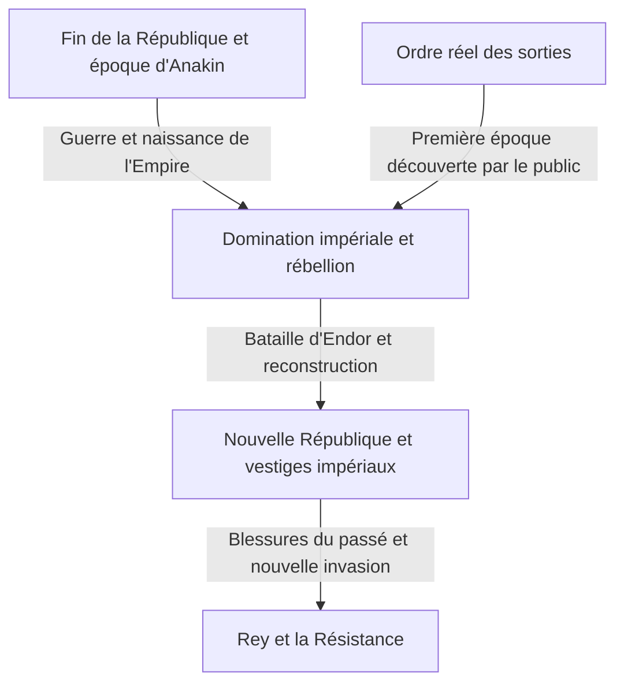
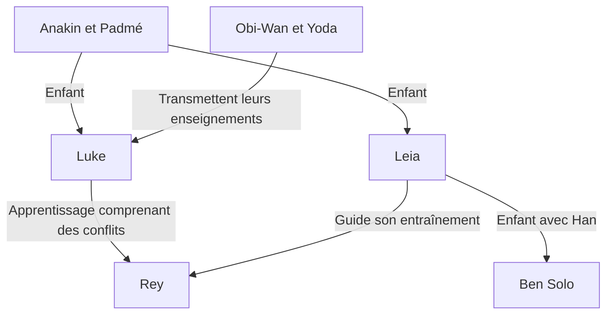

En quelques mots, Star Wars est un récit d'aventures dans une galaxie lointaine. Mais ces aventures entrelacent amour et conflits entre parents et enfants, effondrement de la démocratie, résistance à l'Empire, religion et pouvoir, blessures de guerre et familles dépassant les liens du sang. Derrière l'écran se trouve aussi une histoire du cinéma qui a transformé les maquettes, le montage, la musique, les bruitages et les images de synthèse.

Même lorsqu'on connaît les sabres laser et Dark Vador, la multiplication des œuvres rend la vue d'ensemble difficile. Pourquoi commencer les sorties par l'épisode IV ? Pourquoi les Jedi, chevaliers de la justice, n'ont-ils pas pu protéger la République ? Que transmettent et que changent les histoires d'Anakin, Luke et Rey ? Qu'apportent Andor et The Mandalorian au-delà d'un simple supplément aux films ?

Cet article aborde ces questions sur trois plans : le récit galactique, les relations entre les œuvres et leur histoire réelle de production. Il ne dresse pas un dictionnaire de tous les éléments de l'univers, mais propose un long parcours pour comprendre les enchaînements des œuvres majeures et les thèmes qui se transforment en revenant. Il montre l'étendue d'un monde ramifié tout en offrant un itinéraire lisible aux nouveaux venus.

Le texte révèle les fins des neuf films de la saga et d'œuvres associées, les identités, les morts importantes et les choix décisifs. Pour préserver les surprises avant une première découverte, on peut commencer par les repères initiaux et le parcours de visionnage final, puis revenir aux chapitres concernés après les avoir vus. Les informations et le statut des sorties ont été vérifiés au 3 octobre 2026. Les illustrations sont des créations conceptuelles générées pour cet article, et non des photogrammes officiels ou des documents de production.

## Trois temporalités à distinguer : sorties, histoire interne et élaboration de l'univers

La première source de confusion est que le temps de Star Wars ne suit pas une seule ligne. Le film sorti en 1977 sera ensuite situé comme épisode IV de son histoire. Le public a découvert les aventures de Luke avant la jeunesse de son père Anakin, montrée à partir de 1999. Un événement plus ancien dans le récit n'a donc pas nécessairement été filmé plus tôt.

L'ordre dans lequel les auteurs ont conçu les éléments de l'univers est encore différent. Une relation révélée plus tard peut transformer notre perception d'une ancienne scène. Cela ne signifie pas que toutes les histoires des décennies suivantes étaient décidées lors du premier film. Il faut éviter de reconstruire une création progressive uniquement à partir de sa cohérence finale.

Cette distinction éclaire aussi le plaisir des préquelles. Connaître leur fin ne supprime pas leur intérêt : elles deviennent des tragédies où l'on cherche les occasions de choisir autrement. L'ordre des sorties fait, lui, découvrir les informations à un rythme proche de celui des premiers spectateurs. Chaque approche possède sa valeur ; aucune réponse unique ne sert à mesurer le savoir du public.

| Ensemble de films | Années de première sortie | Question centrale |
| --- | --- | --- |
| Épisodes IV, V et VI : trilogie originale | 1977, 1980, 1983 | Comment résister à un pouvoir écrasant et affronter le passé familial ? |
| Épisodes I, II et III : prélogie | 1999, 2002, 2005 | Pourquoi la République et Anakin perdent-ils ce qu'ils voulaient protéger ? |
| Épisodes VII, VIII et IX : troisième trilogie | 2015, 2017, 2019 | Comment une nouvelle génération reçoit-elle les victoires et les échecs de la précédente ? |
| Rogue One et Solo | 2016, 2018 | Comment raconter les personnes en marge de la saga et les choix du passé ? |
| Le film d'animation The Clone Wars | 2008 | Comment développer une longue guerre à travers les relations humaines ? |
| The Mandalorian and Grogu | 2026 | Comment penser protection et communauté après la chute de l'Empire ? |

Les années correspondent en principe à la première sortie en salles et peuvent différer des sorties japonaises. Le [guide officiel des films et séries](https://www.starwars.com/news/star-wars-movies-and-series-guide) permet de vérifier l'ordre des sorties et la chronologie générale. Une anthologie couvrant plusieurs époques ne doit pas forcément être réduite à un point unique sur une frise.

Ce schéma fournit une ossature pour comprendre les principales œuvres audiovisuelles. Il ne signifie pas que l'Empire disparaît partout après une seule bataille. La défaite symbolique d'un régime et l'évolution des armées, de l'administration, du crime et des mentalités n'avancent pas à la même vitesse. Nombre de récits dérivés prennent place dans ces décalages.

## Canon et Legends : à quelle continuité appartient chaque histoire ?

Le canon est un cadre permettant de penser la continuité officielle actuelle. Legends désigne de nombreux romans, bandes dessinées, jeux et autres récits développés auparavant. En 2014, Lucasfilm a réorganisé l'ancien Univers étendu et annoncé une nouvelle orientation reposant sur les films et The Clone Wars. L'[annonce officielle de l'époque](https://www.starwars.com/news/the-legendary-star-wars-expanded-universe-turns-a-new-page) explique cette transition.

Devenir Legends ne signifie ni disparaître ni perdre son intérêt. Ces œuvres sont des histoires de la galaxie développées à une autre époque, sous d'autres contraintes et possibilités. Inversement, le retour d'un nom ou d'une idée ancienne n'importe pas automatiquement toute sa biographie dans la nouvelle continuité. C'est précisément devant un nom familier qu'il faut vérifier de quelle œuvre et de quelle version on parle.

Toutes les productions officielles ne partagent pas non plus la même continuité. Visions explore notamment des expressions libérées de la chronologie établie. Toutes les actions possibles dans un jeu ne deviennent pas nécessairement des événements du récit ; il faut parfois distinguer les options du joueur des faits supposés par une suite.

Il convient d'éviter de transformer ces classements en jugements de qualité. Le canon aide à comprendre les connexions, pas à noter l'émotion. Ce que l'image montre, ce qu'un document officiel précise, ce qu'un personnage affirme et ce qu'un spectateur interprète sont des informations différentes. La conviction d'un personnage n'est pas automatiquement une vérité omnisciente.

Cet article prend pour base la continuité des principales œuvres audiovisuelles actuelles et précise le statut de Legends ou des projets indépendants. Il sépare également représentation et interprétation. Critiquer l'institution Jedi relève ainsi d'une lecture du public, et non d'un fait officiel niant la bonne volonté de tous les Jedi.

## Une petite carte des personnages pour entrer dans la galaxie

Plusieurs générations autour des Skywalker occupent le centre. Luke et Leia sont les enfants d'Anakin et Padmé. Ben Solo, fils de Leia et Han, prend ensuite le nom de Kylo Ren. Mais l'héritage ne s'explique pas seulement par le sang. Enseignements, erreurs et décisions passent d'Obi-Wan et Yoda à Luke, d'Anakin à Ahsoka, puis à une génération comprenant Rey.

R2-D2 et C-3PO traversent cette histoire depuis des positions différentes de celles des humains. Chewbacca, Lando et les compagnons rebelles relient les conflits intimes de la famille à la lutte galactique. Les séries suivantes montrent, avec Cassian, Din Djarin, Grogu ou les clones, le temps vécu loin du centre héroïque.

Séparer les liens familiaux des liens de formation montre que la galaxie n'est pas une simple généalogie royale. La question porte moins sur ce qu'on reçoit que sur ce qu'on en fait et ce qu'on refuse. Commençons donc par la trilogie grâce à laquelle le public est entré dans cette galaxie et examinons la fonction de chaque film.

## Épisode IV, Un nouvel espoir : la politique galactique atteint la vie d'un jeune homme

Le premier film, sorti en 1977, commence au milieu de l'histoire de son monde. Sans connaître la naissance de l'Empire, le public voit un petit vaisseau poursuivi par un immense bâtiment militaire. Le contraste des tailles suffit à exprimer l'inégalité. L'ouverture ne présente pas tout l'univers avant de lancer l'action : elle transmet les informations nécessaires par les actes des personnages. La date et la position générale du récit sont confirmées par la [page officielle du film](https://www.starwars.com/films/star-wars-episode-iv-a-new-hope).

### L'aventure ne commence pas par la conscience d'être un élu

Luke Skywalker vit dans une ferme de Tatooine et ne veut pas initialement sauver la galaxie. Il souhaite échapper à un quotidien étroit. Mais les droïdes arrivés chez lui transportent des renseignements rebelles, et l'appel de Leia le conduit à Obi-Wan Kenobi, retiré du monde. Tant que le conflit politique reste une nouvelle lointaine, Luke peut rentrer à la ferme. Cette frontière s'effondre lorsque la violence impériale tue ceux qui l'ont élevé.

La causalité importe. Luke ne rencontre pas l'Empire simplement parce qu'il choisit l'aventure : sa vie cherchant à rester extérieure au pouvoir impérial est elle-même détruite. Le récit associe développement personnel et pénétration de la violence politique jusque dans les existences périphériques. La douleur ne suffit toutefois pas à faire un héros. Rencontrer un maître et des compagnons, apprendre à agir et employer ses capacités pour autrui donnent une portée publique au désir initial.

Leia est secourue, mais n'attend pas seulement qu'on la sauve. Elle cache des informations, résiste aux interrogatoires et décide pendant l'évasion. Dans la forteresse où Luke et Han viennent l'aider, elle compense leurs maladresses. Les rôles changeants empêchent le trio de devenir un simple ensemble héros-assistant-récompense : leurs jugements se bousculent mutuellement.

### L'Étoile de la Mort est une arme et une doctrine de gouvernement

Son horreur ne tient pas seulement à la destruction planétaire. Elle exprime le projet de rendre négociation et représentation inutiles par la démonstration de force. Dissolution du Sénat et soumission des systèmes par la peur sont liées. Détruire Alderaan dépasse l'attaque d'une base militaire : c'est menacer quiconque envisage la résistance.

Les rebelles ne possèdent aucune arme comparable. Ils étudient des plans, découvrent une faiblesse et concentrent leurs moyens limités. La victoire relie droïdes transporteurs, personnes transmettant les documents, analystes et mécaniciens des chasseurs. Luke tire le coup décisif, mais une coopération collective le rend possible. Oublier cette structure réduit abusivement le film à un individu de sang exceptionnel qui résout tout.

Le retour de Han participe à cette coopération. Celui qui décidait selon l'argent aide ses amis malgré le danger. Luke faisant confiance à la Force plutôt qu'au seul viseur et Han dépassant la seule rémunération peuvent se lire comme deux passages vers une confiance au-delà du calcul immédiat. Il ne s'agit pas d'abandonner la technique. Chasseurs, communications et plans restent nécessaires ; la question est ce qu'on ajoute au jugement final.

L'histoire galactique entre aussi dans l'image par les machines à entretenir et le coût de la vie. Le Faucon n'est pas seulement un véhicule idéal et rapide : son propriétaire peine à le maintenir en état de marche. La cantina accueille des clients qui ne sont pas là uniquement pour informer le héros, et les droïdes ont des vies dans lesquelles ils sont achetés et vendus. Parce que des événements semblent continuer hors du centre de l'image, le public sent que ce monde existe depuis longtemps sans avoir besoin de tout connaître.

## Épisode V, L'Empire contre-attaque : la défaite brise la compréhension de soi du héros

La victoire précédente n'a pas fait disparaître l'Empire. Les rebelles restent en fuite et ne peuvent garder Hoth. Détruire une arme géante n'abolit ni institutions ni armées : tel est le point de départ. Le film de 1980 développe parallèlement l'apprentissage de Luke et la fuite de Han et de ses compagnons. [Page officielle du film](https://www.starwars.com/films/star-wars-episode-v-the-empire-strikes-back)

### L'apprentissage demande davantage que soulever des pierres

Lorsque Luke rencontre Yoda sur Dagobah, ses attentes concernant l'apparence et le comportement d'un grand maître sont renversées. Il ne reconnaît pas immédiatement la sagesse dans cette petite créature étrange. Le procédé agit également sur le spectateur. Apprendre la Force commence par ébranler l'habitude d'associer la puissance à la taille du corps ou de l'arme.

Dans la grotte, Luke trouve son propre visage sous le masque du Vador vaincu. Le film ne fixe pas cette image comme simple vision factuelle du futur. On peut y lire l'avertissement que peur et colère envers l'ennemi risquent de nous transformer en lui. Au combat contre l'Empire extérieur s'ajoute l'examen de l'esprit qui veut le vaincre.

Luke interrompt son entraînement après une vision de ses amis souffrants. Il est difficile de déclarer cette décision totalement juste par compassion ou totalement fausse par immaturité. Son refus de les abandonner est compréhensible, mais il évalue mal les limites de ses forces et de ses informations. Vador exploite précisément ces émotions pour l'attirer. Les bonnes intentions ne dispensent pas d'analyser la situation.

### Le marché de Lando et les limites du compromis avec la domination

Lando traite avec l'Empire pour protéger la Cité des Nuages. Mais un contrat ne garantit rien lorsque le plus puissant peut modifier unilatéralement ses promesses. Satisfaire une condition amène la suivante. Son échec dépasse une trahison individuelle : c'est aussi l'échec politique d'une autonomie recherchée sous une violence écrasante.

Une erreur n'oblige pourtant pas à persister. Lando entreprend le sauvetage. Luke échoue, Lando trahit, Han est capturé, mais leur valeur ne se réduit pas au succès immédiat. Corriger ses actes, demander de l'aide et répondre aux autres demeurent des critères distincts de la victoire.

La révélation de la paternité de Vador n'efface pas bien et mal. La violence impériale ne devient pas légitime. Ce qui s'écroule est la généalogie ordonnée de Luke : fils d'un bon père, opposé à l'étranger qui l'aurait tué. Vaincre l'ennemi ne permet plus simplement de rejoindre le père ; il faut décider comment l'affronter pour recevoir cet héritage.

Luke ne sort pas vainqueur du duel. Blessé, incapable de s'échapper seul, il est sauvé par Leia et les autres. Être secouru par celle qu'il était venu sauver au premier film refuse l'isolement héroïque. L'autonomie peut signifier revenir dans les relations avec ses erreurs et faiblesses, plutôt que ne dépendre de personne. La noirceur finale dépasse ainsi le simple report de la résolution.

Les étendues blanches de Hoth, l'enfermement humide de Dagobah et l'extérieur lumineux de la Cité des Nuages opposé à ses profondeurs sombres ne sont pas des décors touristiques. Ils soutiennent retraite militaire, descente intérieure et effondrement de la sécurité apparente. À chaque déplacement, les compétences habituelles ne suffisent plus : gagner en chasseur ne répond ni à l'apprentissage, ni à la négociation, ni au dialogue avec le père.

Illustration générée exprimant l'asymétrie des forces entre rébellion et Empire, et non photogramme officiel.

## Épisode VI, Le Retour du Jedi : sauver son père et vaincre l'Empire

La conclusion de 1983 commence par le sauvetage de Han et superpose réparation des relations et guerre galactique. Au palais de Jabba, Luke est plus calme et plus sûr de sa puissance qu'au premier film. Cette apparence ne prouve pas sa maturité Jedi. La question finale sera ce qu'il fait lorsqu'il peut gagner. [Page officielle du film](https://www.starwars.com/films/star-wars-episode-vi-return-of-the-jedi)

### Le piège de l'Empereur vise davantage la colère que la mort

L'Empereur veut anéantir militairement les rebelles et attirer Luke. Il lui montre ses amis en danger pour provoquer une attaque furieuse, puis le meurtre du père. Même si Luke bat Vador, l'Empereur gagne s'il adopte sa logique de domination. La victoire du combat et la réussite éthique peuvent donc s'inverser.

La menace contre Leia met Luke en rage et lui permet de dominer Vador. Comparer la main mécanique paternelle à la sienne transforme la vision de la grotte en choix concret. Jeter son arme n'est pas choisir la non-violence parce que le danger a disparu : il accepte de pouvoir mourir et refuse de tuer son père. Il quitte la mesure de force fondée sur la destruction de l'adversaire.

Vador se retourne contre l'Empereur après avoir vu souffrir son fils. Il y a rédemption, mais pas affirmation que tous les crimes sont annulés. La foi d'un fils dans son père n'est pas une obligation de pardon pour les victimes. Le film conclut un rapport filial sans régler toute responsabilité judiciaire ou mémoire historique. Distinguer ces niveaux laisse comprendre les limites de la fin sans en diminuer l'émotion.

### Pourquoi la bataille forestière compte autant que la salle du trône

Isoler le face-à-face impérial ferait croire que tout dépend de la famille. Pourtant, sans arrêt du bouclier par les troupes au sol, la flotte ne peut détruire la seconde Étoile de la Mort. La sauvegarde du père et la destruction militaire sont nécessaires ensemble. Aucune ne remplace automatiquement l'autre.

Les Ewoks apportent connaissance du terrain et autre méthode de combat. L'Empire domine par blindage et puissance de feu, mais ne reconnaît pas pleinement l'initiative des habitants. Ce mépris lui fait sous-estimer terrain et surprise. Ce n'est évidemment pas une loi réelle garantissant la victoire des armes simples sur les armées modernes. La fable montre la faiblesse d'un pouvoir qui méconnaît jugement et solidarité des petits.

Luke, Han, Leia, Lando, Chewbacca, droïdes, soldats anonymes et habitants d'Endor contribuent. Leurs efforts convergents font de la fête autre chose qu'un couronnement individuel. Luke revient aussi vers la communauté après avoir perdu son père. Perte intime et victoire publique coexistent, empêchant un bonheur absolument intact.

L'Empereur échoue également dans son estimation des êtres, supposés toujours gouvernés par intérêt et peur. Un fils gardant foi en son père et un père préférant son fils à l'obéissance échappent à son calcul. La Force ne prédit pas entièrement les choix humains. La confiance excessive dans les armes géantes rejoint ainsi la certitude d'avoir compris tous les cœurs.

## Épisode I, La Menace fantôme : un empire ne montre pas immédiatement son visage

La préquelle sortie en 1999 commence par un conflit intérieur à la République plutôt que par la dictature militaire évidente du premier film. Le blocus de Naboo par la Fédération du commerce transforme un différend commercial et fiscal en occupation armée. La jeune reine Padmé Amidala attend de son appel au Sénat qu'il établisse les faits et apporte des secours. Mais les institutions restent prises dans les enquêtes et les procédures, et le rythme des décisions ne suit pas celui de la souffrance sur le terrain. [Page officielle du film](https://www.starwars.com/films/star-wars-episode-i-the-phantom-menace)

### Palpatine gagne des soutiens en se présentant comme solution à la crise

Pour qui connaît l'avenir, les conseils du sénateur de Naboo ont un double sens. Il accompagne la victime et exploite la défiance envers une direction jugée incapable. Il ne détruit pas la République par invasion extérieure : il progresse grâce aux procédures parlementaires et aux attentes humaines.

Les ennemis ne forment pas non plus un bloc. La Fédération du commerce poursuit ses intérêts, tandis que Dark Sidious l'utilise dans un plan plus vaste. Résoudre le conflit visible n'annule pas le déplacement du pouvoir qu'il a produit. La libération de Naboo est réelle, sans être nécessairement une victoire pour l'avenir républicain. Ce décalage rend la fête inquiétante.

L'appel de Padmé aux Gungans montre une autre politique. Au lieu de préserver uniquement sa dignité royale, elle reconnaît leur appartenance à une même planète et demande assistance. Elle ne comble pas seulement un manque militaire : des groupes séparés construisent un objectif commun. Cette solidarité concrète produit l'action que le Sénat n'offrait pas.

### Voir la vie d'Anakin avant son talent

Anakin possède des dons extraordinaires de pilotage, mais il est esclave. Dans un monde avec une immense République et des Jedi parlant de justice, la liberté d'une mère et de son fils n'est pas garantie. L'existence d'institutions diffère de l'étendue réelle de leur protection. Qui-Gon libère Anakin sans pouvoir sauver Shmi de la même façon.

Le départ mêle reconnaissance heureuse du talent et peur de laisser sa mère. Réduire le futur Anakin à un faible incapable de vaincre la peur néglige les conditions qui l'ont créée. Inversement, une enfance dure ne rend pas inévitable la violence future. Le récit demande quel accompagnement et quelle éducation auraient été nécessaires.

La mort de Qui-Gon empêche le maître qui l'a découvert de le guider longtemps. Obi-Wan reprend sa promesse, sans disposer d'emblée d'une relation achevée avec l'enfant. Prophétie et attentes institutionnelles avancent plus vite que le développement personnel. Ce déséquilibre prépare la tragédie.

Sur le plan technique, présenter les préquelles comme entièrement informatiques est également inexact. Un récit officiel évoque notamment des cotons-tiges colorés pour la foule d'une maquette de course. L'association des technologies nouvelles et du travail manuel est plus fidèle à la réalité. [Anecdotes officielles de production](https://www.starwars.com/news/25-fun-facts-the-phantom-menace)

Les batailles finales simultanées distinguent les contributions : diversion gungan, opération au palais, combat spatial et duel répondent à différents problèmes. Un seul grand bretteur ne termine pas une occupation. La mort de Qui-Gon montre aussi que victoire collective et perte dans la vie d'un garçon ne coïncident pas.

## Épisode II, L'Attaque des clones : préparer la guerre réduit les choix

Dans le deuxième volet, sorti en 2002, un mouvement séparatiste souhaitant quitter la République s'étend, et la création d'une armée devient un enjeu politique. L'enquête sur la tentative d'assassinat de Padmé conduit Obi-Wan à découvrir les clones. Une armée achevée apparaît devant une République qui semblait encore débattre de sa préparation à la crise. L'urgence sécuritaire rencontre une solution commode dont l'origine reste obscure. [Page officielle du film](https://www.starwars.com/films/star-wars-episode-ii-attack-of-the-clones)

### Les nécessités militaires dépassent le mystère à éclaircir

Qui a commandé les clones et dans quel intérêt devrait être prioritaire. Mais face à une armée ennemie imminente, on cherche des forces immédiatement disponibles. La crise modifie les choix en supprimant le temps d'examen. L'armée est adoptée moins parce qu'elle a été vérifiée que parce qu'aucune alternative ne paraît exister.

Dooku dénonce de véritables corruptions institutionnelles. Un diagnostic exact ne garantit toutefois pas une solution juste. Sa participation au plan Sith empêche de confondre désillusion républicaine et libération. L'opposition visible des camps doit être séparée de Sidious, qui l'exploite.

Les Jedi partent défendre la paix et deviennent généraux. Une opération de sauvetage réussie contribue paradoxalement au déclenchement du conflit. Protéger des vies immédiatement renforce à long terme un ordre militaire. Les moyens d'une bonne cause transforment l'organisation elle-même.

### Amour et politique partagent le désir de contrôle

Statut, fonctions et discipline Jedi entravent Anakin et Padmé. Le mariage secret protège leur amour mais restreint conseils et soutien. Moins de confidents signifie que les peurs futures seront plus difficiles à examiner de l'extérieur.

Après la mort de sa mère, Anakin tue les habitants d'un camp tusken, enfants compris. Il ne s'agit pas d'une simple illustration de colère intense. La violence subie par une proche devient justification de violence envers d'autres : une rupture éthique nette. Comprendre le chagrin ne supprime pas la responsabilité. La chute ultérieure n'est pas soudaine ; une frontière majeure est déjà franchie.

Son idée politique qu'un dirigeant puissant devrait décider si le résultat est souhaitable répond au désir de contrôler la perte intime. Accepter des volontés différentes et une vie aimée hors de son contrôle est difficile. Mais supprimer l'incertitude par contrainte détruit la relation à protéger. Le film suivant pousse cette contradiction à l'extrême.

L'uniformité des clones inquiète aussi par le traitement d'êtres humains en unités interchangeables. Une origine commune ne rend pas leurs vies identiques. Le film présente d'abord la masse, les œuvres suivantes les individualités. Cet ordre invite à reconsidérer le salut apparent de la République : qui en paie le prix ?

## Épisode III, La Revanche des Sith : vouloir sauver devient vouloir dominer

Le troisième volet de 2005 montre la République s'effondrant à l'approche de la fin des guerres. Le pouvoir concentré pour gagner devient la base de la dictature, et non du retour à la paix. Les chutes d'Anakin et de la République se répondent ; la tragédie ne se réduit donc ni à une faiblesse individuelle ni à un seul défaut institutionnel. [Page officielle du film](https://www.starwars.com/films/star-wars-episode-iii-revenge-of-the-sith)

### Palpatine vend la promesse de maîtriser la mort

Anakin craint de perdre Padmé. Palpatine ne nie pas cette peur, mais suggère un pouvoir introuvable ailleurs. Plus subtile qu'un sermon maléfique, la manipulation repère la perte insupportable et rend le manipulateur indispensable à sa prévention. La dépendance facilite l'acceptation des contradictions et des exigences criminelles.

La défiance oppose aussi Anakin au Conseil. Il se sent méconnu ; les maîtres s'inquiètent de sa proximité avec Palpatine. Le rôle d'espion qui lui est demandé divise davantage ses loyautés. Expliquer cette situation n'excuse pourtant pas ses actes. Après avoir arrêté Mace Windu pour protéger Palpatine, il obéit à des ordres toujours plus destructeurs.

Après une faute grave, on peut préférer donner un sens à l'erreur plutôt que revenir en arrière. Cette chaîne de justification éclaire Anakin : puisqu'il a tant fait, il doit obtenir ce pouvoir, sinon tout serait vain. Le dommage suivant prend alors l'apparence d'un sacrifice nécessaire.

### L'Ordre 66 retourne la violence déjà présente dans l'institution

Les attaquants ne sont pas une nouvelle armée venue de loin, mais les soldats compagnons des Jedi. Quand le commandement s'inverse, confiance et dispositions fondées sur l'alliance deviennent des faiblesses. Le film montre l'ordre et l'assaut simultané ; l'animation complète le mécanisme de contrôle. Distinguer ces niveaux fait apparaître le rôle de chaque œuvre.

L'Empire n'est pas fondé après destruction de tous les bâtiments républicains. Il est proclamé au Sénat comme ordre nouveau. Sous le langage de la sécurité, surveillance et violence deviennent gouvernement permanent. Désigner les Jedi comme traîtres transforme l'opposition à la concentration du pouvoir en attaque contre l'ordre.

Sur Mustafar, Anakin brutalise Padmé qu'il voulait sauver. Son désaccord devient trahison plutôt qu'expression autonome. La différence entre affection et possession apparaît. L'avenir rêvé exigeait non seulement une Padmé vivante, mais une Padmé approuvant ses choix.

Anakin brûlé enfermé dans son armure et les jumeaux naissants montrent ensemble désespoir et possibilité. Ni Obi-Wan ni Yoda ne sont vainqueurs. Protéger les enfants préserve toutefois un avenir au sein de la défaite politique. Les préquelles font naître le désastre de l'association de bonnes intentions, peur, institutions et ambition, plutôt que de la simple disparition des bons.

Le chagrin d'Obi-Wan est loin de la satisfaction d'avoir découvert et vaincu un méchant. Il doit combattre celui qu'il considérait comme un frère, tandis que persistent des questions sur son propre enseignement et son jugement. La longueur du duel peut donc se lire non seulement comme une comparaison technique, mais comme la douleur de deux êtres qui se connaissent profondément et ne parviennent pas à rompre leur lien. Même le vainqueur n'a aucun lieu où célébrer cette victoire.

## Épisode VII, Le Réveil de la Force : une génération hérite de héros inconnus

Dans le chapitre de 2015, les héros rebelles sont presque légendaires pour Rey et Finn. Leurs noms familiers au public restent lointains aux jeunes personnages. Ce décalage réunit souvenir des anciens et découverte des nouveaux spectateurs. L'arrivée du Premier Ordre montre que la victoire passée ne garantit pas la sécurité suivante. [Page officielle du film](https://www.starwars.com/films/star-wars-episode-vii-the-force-awakens)

### Finn devient protagoniste en refusant d'abord un ordre

Finn ne commence ni par une lignée ni par une prophétie, mais par le refus de tuer quand on lui impose d'obéir. Il cesse d'être uniquement un numéro et commence à décider. Sa volonté de sauver la galaxie n'est pas immédiate : il veut d'abord fuir. L'histoire montre l'action pour autrui malgré la peur, non après sa disparition.

Sur Jakku, Rey sait survivre mais attend une famille susceptible de revenir. Son immobilité vient d'une attente envers le passé, pas d'une incapacité. Partir dépasse le changement de planète : c'est passer du retour espéré de l'ancienne vie à la construction de liens nouveaux.

### Kylo Ren désire l'image de Vador plus que sa force

Ben Solo veut se recréer en Kylo Ren. Il vénère son grand-père, mais le dernier sauvetage du fils par Vador contredit l'image du mal puissant qu'il recherche. Hériter du passé peut signifier en sélectionner les fragments utiles. Kylo montre que l'héritage historique peut être une mauvaise lecture.

Tuer Han n'est pas simplement la scène où un adversaire de sang-froid élimine un obstacle. Kylo veut se reconstruire, persuadé que rompre son attachement familial le rendra fort. Mais commettre la violence ne résout pas nécessairement son conflit. L'acte destiné à supprimer l'hésitation crée au contraire une blessure nouvelle. Tandis que l'histoire de Rey avance vers les liens avec autrui, Kylo tente de s'établir en les coupant.

Les ressemblances structurelles avec le premier film sont évidentes, de la base Starkiller au droïde porteur d'une carte. Elles peuvent procurer un plaisir nostalgique ou être critiquées comme répétitions. L'analyse gagne toutefois à dépasser le constat de ressemblance pour comparer les choix de personnages occupant des places similaires. Un ancien soldat d'une organisation de type impérial devient protagoniste, une jeune femme attendant un secours résiste elle-même et le fils d'un héros devient ennemi. Sous des contours familiers, l'angoisse de l'héritage occupe le centre.

La destruction du centre de la Nouvelle République expose fortement la fragilité politique. Mais son quotidien peu montré rend la perte concrète difficile à saisir. C'est une limite d'exposition du film. Les œuvres connexes enrichissent l'événement sans faire de leur ignorance une faute exclusive du spectateur. L'information transmise par le film lui-même façonne l'expérience.

## Épisode VIII, Les Derniers Jedi : reconnaître l'échec sans abandonner la responsabilité

Le film de 2017 refuse l'idée que rencontrer Luke résoudra tout. Il a renoncé à redevenir héros, tandis que la Résistance poursuivie décide de sa survie avec peu de moyens. Héroïsme individuel et direction collective sont réexaminés ensemble. [Page officielle du film](https://www.starwars.com/films/star-wars-episode-viii-the-last-jedi)

### Avouer une erreur justifie-t-il de tout abandonner ?

Le passé de Luke et Ben apparaît depuis plusieurs regards. La peur fugitive ressentie par Luke n'a pas le même sens que l'effroi de Ben qui le voit. Ce n'est pas nier les faits, mais distinguer pensée personnelle et expérience d'autrui. Dire qu'un geste fut bref et regretté n'efface pas la blessure.

Luke associe son échec à celui des Jedi dans leur ensemble et veut mettre fin à leur tradition. La critique de leur histoire mérite d'être examinée, mais si elle sert seulement à justifier son absence, elle l'éloigne de sa responsabilité envers ceux qui souffrent maintenant. Entre conserver inconditionnellement et tout abandonner parce qu'il y a eu échec, il faut une voie permettant d'apprendre et de transmettre autrement.

Rey et Kylo entrevoient une compréhension mutuelle, distincte d'un accord. Une solitude commune n'impose pas d'accepter la domination. Tuer Snoke ne rend pas Kylo bon : supprimer le dirigeant et refuser son système diffèrent, et il veut occuper la place libérée.

### Courage et commandement ont des horizons temporels différents

Poe ose détruire l'ennemi présent, mais doit apprendre le coût humain et matériel du succès. Un résultat spectaculaire ne suffit pas à faire survivre l'organisation jusqu'au lendemain. Ne pas attaquer et se retirer font aussi partie du commandement.

Le conflit avec Holdo implique en outre un partage difficile de l'information. Le public vit des connaissances inégales. En conclure simplement que les subordonnés doivent obéir en silence serait trop étroit. Secret, confiance, autorité et manque d'explications en crise rendent visibles qualités et défauts.

Canto Bight montre une prospérité apparemment extérieure à la guerre, mais liée aux armes et à l'exploitation. Finn élargit la protection d'une amie en compréhension du combat collectif. Que des profiteurs vendent aux deux camps ne prouve cependant pas l'identité politique de ces camps. Critiquer le profit ne revient pas à confondre invasion et résistance.

Le dernier acte de Luke donne du temps aux autres au lieu de massacrer l'ennemi. Celui qui rejetait sa légende accepte sa puissance d'espoir et attire l'attention autrement que par la victoire physique. Le film peut se lire comme destruction d'une image héroïque suivie d'un choix nouveau de son usage.

Rey recherchait aussi une réponse extérieure sur son identité. Or le maître est humain, faillible et inquiet. Après avoir découvert cette imperfection, elle doit décider quoi recevoir. Le récit demande donc si l'apprentissage continue sans idéalisation, et pas seulement si l'élève rejette son maître.

## Épisode IX, L'Ascension de Skywalker : l'origine et le nom choisi

Le neuvième film de 2019 ramène Palpatine comme adversaire ultime et relie Rey à sa famille. Sa précédente compréhension d'une origine sans importance est profondément révisée. Les goûts divergent sur cette évolution ; l'analyse doit d'abord séparer ce qu'un film dit de ce que le suivant ajoute. [Page officielle du film](https://www.starwars.com/films/star-wars-episode-ix-the-rise-of-skywalker)

### Le sang peut expliquer des capacités, pas commander une morale

Rey craint qu'une ascendance mauvaise décide de son avenir. Le dénouement tend pourtant vers le choix des leçons et des liens, non l'obéissance à l'origine. On ne peut simplement affirmer que le sang ne compte pas : le film en fait un grand mécanisme, tout en cherchant la liberté dans le refus du rôle associé.

Luke et Leia ouvrent un autre héritage. Choisir Skywalker peut être une déclaration de valeurs et de liens éducateurs plutôt qu'une revendication biologique. Le nom n'efface ni souffrance ni passé. Le sens réside dans la décision de se nommer après avoir appris ce passé.

Le retour technique de Palpatine reste peu expliqué dans le seul film. Les compléments documentaires ne doivent pas être confondus avec ce qui est explicitement montré. L'essentiel est que peur de mourir et obsession du pouvoir transforment corps et générations suivants en outils. L'homme promettant à Anakin de maîtriser la vie utilise toujours autrui pour se préserver.

### Le retour de Ben inverse l'idée de vaincre la mort

L'intervention maternelle, la vie sauvée par Rey et le souvenir du père participent à son retour. Le meurtre de Han n'avait pas supprimé le conflit. Accepter de nouveau les liens ouvre un autre choix. La transformation n'annule pas le mal passé, mais préserve une autre action maintenant.

Donner sa vie à Rey contraste avec Anakin sacrifiant les autres pour ne pas perdre l'être aimé. Ben donne de lui-même au lieu de dominer le monde pour conserver la vie. À travers neuf films, sauver change de sens : garder quelqu'un auprès de soi n'est pas souhaiter qu'il vive.

La flotte réunie à Exegol remplit une autre fonction que le duel. Des personnes isolées par la peur reconnaissent leur présence mutuelle et se rassemblent. La force persuasive de cette réunion varie selon le spectateur, mais une participation dépassant l'héroïne est nécessaire. Le combat final superpose de nouveau conflits de lignées et résistance de ceux qui n'en relèvent pas.

Revenir à Tatooine au terme des neuf films signifie que même lieu n'est pas même état. Le jeune homme du premier film regardait l'horizon pour partir ; une voyageuse arrivée au bout se nomme. Reprendre le paysage initial unit l'élargissement du monde et le choix de sa propre place.

## Rogue One : ceux qui ne rentrent pas rendent possible le tir du héros

Sorti en 2016, Rogue One raconte la transmission des plans juste avant le premier film. Connaître l'issue ne retire pas la tension : il s'agit aussi de savoir qui perd quoi pour livrer ces plans. L'annonce officielle désigne John Knoll d'ILM comme initiateur et souligne la perspective de guerre au sol. [Annonce officielle de production](https://www.starwars.com/news/rogue-one-the-daring-mission-has-begun-cast-and-crew-announced)

### La résistance d'un ingénieur et le sens retrouvé par sa fille

Galen Erso participe à l'arme impériale tout en y introduisant une faiblesse destructrice. Rester dans une institution est-il toujours collaborer, et jusqu'où peut-on saboter de l'intérieur ? Son cas ne permet pas d'imaginer tous les collaborateurs comme résistants secrets. Le film montre un choix particulier et la difficulté de le communiquer.

Jyn reçoit des fragments sur son père et corrige son image de simple traître. Savoir ses bonnes intentions ne suffit pas à arrêter l'arme. Il faut démontrer la faiblesse, obtenir les plans et transmettre une information utilisable. La résistance ne produit d'effet que lorsque la réconciliation intime devient action publique.

### Montrer les fautes rebelles ne justifie pas l'Empire

Cassian a accompli des missions sombres, dont la justesse de la cause n'excuse pas tout. Les rebelles eux-mêmes divergent face au risque. Leur absence d'innocence ne rend pourtant pas domination et résistance identiques.

La question est plutôt ce que font ensuite ceux dont les mains sont sales. Dans sa décision d'agir avec Jyn, Cassian porte le désir urgent que les sacrifices passés ne restent pas de simples sacrifices. Mais ce désir risque aussi de justifier indéfiniment de nouvelles pertes. Le film trace une frontière entre les ordres qui sacrifient les autres et les choix par lesquels on assume soi-même le danger.

Sur Scarif, communications terrestres, flotte et opérations internes sont séparées. Une force individuelle ne compense pas une connexion perdue ailleurs. La transmission technique devient forme de solidarité. Répéter le relais d'information montre un travail dépassant la survie individuelle, et non une répétition inutile.

Ces personnes ne pourront pas rejoindre la fête du premier film. Leur travail devient néanmoins une part de cette victoire. Derrière le protagoniste d'Un nouvel espoir, on voit désormais le prix payé par des personnes dont on ignorait auparavant les noms et les visages. Une histoire autonome enrichit la saga lorsqu'elle modifie ainsi le poids éthique d'événements familiers.

La foi de Chirrut n'est pas non plus une invulnérabilité. Croire en la Force ne garantit pas la sécurité physique. C'est une disposition pour agir dans le danger, non un contrat contre la mort. Même sans protagoniste formé Jedi, la Force peut orienter jugement et espoir.

## Solo : comment se construit une personne apparemment égoïste ?

Solo, en 2018, s'écarte de la lutte pour gouverner la galaxie et entre dans les syndicats criminels, transports, dettes et marchés. Les rencontres du jeune Han avec Chewbacca et Lando éclairent autrement le premier film. La page officielle présente bien une aventure dans les marges criminelles. [Page officielle du film](https://www.starwars.com/films/solo)

### Acheter la liberté conduit parfois à une nouvelle dépendance

Fuir Corellia ne donne pas immédiatement une vie libre. Armée, syndicats et intermédiaires créent de nouvelles hiérarchies à chaque moyen de survie. Vouloir un vaisseau ne relève donc pas seulement du plaisir de piloter : c'est la condition matérielle du choix de destination.

Beckett enseigne la méfiance. Sa méthode est rationnelle dans un milieu dangereux. Mais prévoir toute relation comme trahison réduit la coopération à des intérêts provisoires. Han reçoit une partie de cette leçon sans devenir identique à son professeur.

Chewbacca montre cette différence. L'intérêt initial de survie devient, en traversant ensemble le danger, un rapport dépassant l'échange. Leur confiance ultérieure apparaît comme observation et évaluation mutuelles plutôt qu'un trait donné d'avance.

### Qi'ra possède une vie hors de l'histoire de Han

Han veut l'emmener et réaliser leur ancien rêve. Mais le monde où elle a survécu est plus complexe qu'il ne l'imagine. Le retour ne recommence pas automatiquement l'ancienne relation. Vouloir sauver et comprendre les conditions présentes restent séparés.

Expliquer ses décisions seulement par l'amour néglige contraintes et ambitions au sein d'une organisation. Même dans un film centré sur Han, les autres vies n'existent pas pour satisfaire ses souhaits. Cette asymétrie participe à sa déception et à sa maturité.

La réévaluation du groupe d'Enfys Nest brouille aussi criminels et résistants. Qui possède une cargaison, qui la prend et à quelle fin ? Le propriétaire contractuel n'a pas nécessairement raison moralement. Le choix final de Han, dépassant le profit, annonce son retour vers les rebelles.

Le film n'explique pas entièrement le Han originel : personne ne se forme en une expérience. Il montre néanmoins, sous l'ironie et l'intérêt, une incapacité à abandonner complètement autrui. Celui qui se dit mauvais dément souvent cette présentation par ses actes. Ce décalage fait son charme.

L3-37 étend la liberté aux non-humains. Une machine est-elle une personnalité utile aux humains ou un sujet doté d'exigences et de jugement ? Ses paroles et ses actes font surgir un problème souvent contenu dans l'humour. Le film ne le résout pas entièrement, mais aimer les droïdes et questionner leur propriété sont compatibles. Une petite aventure périphérique contient des questions galactiques.

## Comprendre la galaxie au-delà des films par les institutions et la vie quotidienne

Passer des films aux séries et à l'animation rend soudain la galaxie plus détaillée. Vaincre l'Empereur et payer le repas de demain sont deux problèmes différents. Une personne sauvée par un Jedi sur un champ de bataille et une personne dont la vie a été détruite par une opération militaire peuvent ressentir différemment la même République. Ces écarts de perspective font des œuvres associées davantage que des épisodes supplémentaires.

### Un même régime diffère selon qu'on le regarde du centre ou des marges

Coruscant, capitale de la République, est un centre politique réunissant Sénat, bureaucratie et Temple Jedi. Pourtant, arborer le drapeau républicain ne garantit pas une protection égale à chaque habitant de la galaxie. Sur des frontières comme Tatooine, certains lieux restent à peine atteints par les idéaux républicains, tandis que les organisations criminelles et l'esclavage dominent la vie. L'État ordonné vu du centre peut sembler, depuis sa périphérie, ne faire que discuter au loin.

Cette distance éclaire aussi le séparatisme. Que les dirigeants et fabricants d'armes de la Confédération des systèmes indépendants participent à un projet maléfique ne rend pas mauvais tous les habitants mécontents de la République. Corruption, négligence politique et inégalités économiques suscitent une colère indépendante du complot. L'habileté de Palpatine consiste moins à créer le conflit à partir de rien qu'à exploiter des tensions préexistantes et à orienter leur résolution vers l'extension de son pouvoir.

Les différences entre planètes persistent après la fondation de l'Empire. Certaines connaissent directement la menace des armes géantes ; d'autres rencontrent l'Empire à travers mines, forces de sécurité, papiers d'identité, détention et conscription. Après la naissance de la Nouvelle République, pirates et anciens groupes armés impériaux occupent des espaces où le contrôle central a reculé. Le nom d'un État ne suffit donc pas à juger la sécurité et la liberté du quotidien. Demander à quelle planète, classe et profession appartient une personne aide à comprendre les tonalités différentes d'œuvres situées à la même époque.

Illustration générée contrastant centre, marges et différentes époques, et non image officielle ou dessin de production.

### Les Jedi ne sont pas l'État, mais un ordre qui lui est lié

Jedi ne désigne pas tous les utilisateurs de la Force. C'est un groupe doté de formation, discipline, relations pédagogiques et traditions communes. Les gardiens de paix de la fin de la République ne sont pas des ermites indépendants : ils partent en mission diplomatique, fréquentent le Sénat et deviennent généraux. Le cumul de ces rôles produit bonne volonté et défaillance institutionnelle.

Ils commandent pour protéger, mais cette fonction les lie davantage à la structure politique qui détermine la fin de la guerre. Tuer des soldats ennemis ne signifie pas accomplir la paix. Réduire leur défaite à une mauvaise escrime rate le drame : ils combattent sans reconnaître suffisamment que la guerre elle-même est un piège.

Cela ne rend pas les Jedi identiques à l'Empire. Une institution faillible diffère d'une institution qui vise explicitement domination et terreur. Le problème est de savoir si de bonnes intentions dispensent d'examen personnel. Que privilégier lorsque défendre la République contredit l'obéissance à ses décisions ? Ahsoka et Dooku donnent une expérience individuelle à cette collision.

### Les Sith et les autres pratiquants obscurs ne forment pas toujours un même groupe

Appeler Sith tout ennemi au sabre rouge confond les organisations. Les Inquisiteurs traquent les Jedi sans avoir le même statut que les maîtres et apprentis Sith. Les Sœurs de la Nuit de Dathomir suivent d'autres traditions. Employer le côté obscur et appartenir à une lignée Sith sont distincts.

La Règle des Deux associée à Dark Bane organise un maître possédant le pouvoir et un élève le convoitant. Ce n'est pas une loi physique limitant à deux les êtres malveillants sensibles à la Force. Autour de cette succession peuvent exister collaborateurs, assassins, candidats instrumentalisés et anciens membres. La base officielle décrit également une institution créée pour assurer la survie Sith. [Notice officielle de Dark Bane](https://www.starwars.com/databank/darth-bane)

Ce modèle éducatif contraste avec les Jedi. Même désirée, la progression du disciple menace le maître. Leur coopération contient une logique d'utilisation et de remplacement. Pour l'Empereur et Vador ou Maul abandonné, considérer cette relation productrice de méfiance enrichit l'analyse au-delà du caractère individuel.

## Comment The Clone Wars a changé le regard sur la guerre

### Les fonctions du film et de la longue série

Le film animé de 2008 ouvre la série The Clone Wars. Donner Ahsoka Tano comme apprentie à Anakin constituait un ajout majeur pour les seuls spectateurs des films. Il ne s'agissait pas seulement d'ajouter un nom. Sa responsabilité de guide rend courage, attention et révolte contre les règles concrets dans une relation.

La série représente la guerre entre les épisodes II et III sans se limiter aux opérations militaires républicaines. Le regard passe par la diplomatie, les esclavagistes, les organisations criminelles, les planètes qui cherchent à rester neutres et les doutes des gens ordinaires. Quelques minutes de contexte politique dans les films deviennent quotidien et décisions répétées. Une victoire dans un épisode n'améliore souvent pas la situation générale, rendant visible l'épuisement d'une longue guerre.

Tout ne doit pourtant pas devenir recherche de signes annonçant les films. Le public connaît la fin, pas les personnages. Aider, accomplir des missions et construire de petites confiances ont un sens propre. Ce temps donne à l'Ordre 66 le poids d'une destruction de liens, pas seulement d'un événement historique.

### Le même visage clone ne signifie pas la même personnalité

Les soldats indistincts deviennent Rex, Fives, Echo et d'autres individus nommés capables de jugement. La proximité génétique n'égale ni expérience ni personnalité. Marques d'armure, coiffures, paroles et rapports entre camarades enseignent au public à les distinguer.

La contradiction républicaine apparaît : défendre la liberté grâce à des soldats créés pour combattre et peu libres de quitter le service. Le respect individuel des commandants Jedi ne résout pas la structure. Reconnaître le courage des soldats et questionner leur condition sont compatibles.

Les puces inhibitrices rendent cela plus cruel. La loyauté n'était pas uniquement libre. Les attaquants de l'Ordre 66 possèdent amitiés et personnalités, brutalement piétinées. En retirant la puce de Rex, Ahsoka restaure un jugement volé plutôt qu'elle ne vainc un ennemi. [Notice officielle d'Ahsoka Tano](https://www.starwars.com/databank/ahsoka-tano)

### Le départ d'Ahsoka sépare bonté et institution

Quitter l'Ordre ne signifie pas abandonner la compassion. L'organisation censée protéger a brisé la confiance ; proposer le retour n'efface pas automatiquement la blessure. L'appartenance à une institution juste en principe et la poursuite d'actes jugés justes se séparent.

Pour Anakin aussi, le changement est grave. Il veut protéger son apprentie, mais l'institution en laquelle il souhaite croire ne répond pas à ses attentes. Sa chute ultérieure ne s'explique pas par ce seul départ ; celui-ci compte néanmoins dans le processus qui relie défiance institutionnelle et peur de perdre ses proches. L'article officiel présente également le départ d'Ahsoka en saison 5 et leurs retrouvailles ultérieures comme des tournants de leur relation. [La séparation d'Ahsoka et Anakin](https://www.starwars.com/news/ahsoka-and-anakin-final-meeting)

Le siège de Mandalore offre finalement une perspective parallèle à La Revanche des Sith. Le public sait ce qui se déroule à Coruscant ; sur le terrain éloigné, l'information arrive en fragments. Ce retard tend le récit, car les décisions centrales transforment les amis en ennemis avant d'être comprises.

## The Bad Batch et ceux que la guerre laisse derrière elle

The Bad Batch suit une unité clone aux capacités particulières et une fille, Omega, pendant la transition de la République à l'Empire. Changer de régime dépasse le changement d'enseigne : les effectifs militaires, les épreuves de loyauté, le contrôle régional et la gestion de l'information se transforment. Les soldats qui soutenaient auparavant l'État peuvent devenir jetables.

Les protagonistes excellent au combat sans avoir suffisamment appris à vivre libres. Choisir un travail, recevoir un paiement, penser à la sécurité d'un enfant et chercher un lieu sûr deviennent de nouvelles tâches. Une opération possède des ordres et des objectifs. La vie n'a pas de fiche d'instructions garantissant la bonne réponse lorsqu'on en suit les étapes. Cette différence transforme une unité en famille.

Omega compte bien au-delà d'une force supplémentaire. La responsabilité de sa protection empêche de juger seulement la réussite des missions dangereuses. Le revenu présent vaut-il la sécurité future ? Leur seule fuite suffit-elle ? Quel héritage donner à l'enfant ? Un critère extérieur à la rationalité militaire entre dans le groupe.

L'histoire de Crosshair questionne l'espoir que l'obéissance assure l'appartenance. Il attend du fait de suivre une organisation la reconnaissance de sa valeur. Mais une organisation traitant les individus comme des outils ne rend pas la loyauté réciproque. Le retour et la réconciliation comportent aussi des blessures que les explications seules ne peuvent refermer. Être compagnons ne signifie pas ne jamais se tromper, mais décider comment reconstruire les liens avec celui qui s'est trompé.

Pabu n'est pas seulement une pause paisible. Repas, maisons et voisins concrétisent ce qu'on défendait. La base officielle décrit une communauté de réfugiés ; l'entretien final aborde les survivants et Omega adulte. Finir le combat rejoint la possibilité de choisir une vie ordinaire. [Notice de Pabu](https://www.starwars.com/databank/pabu), [entretien avec les interprètes sur le final](https://www.starwars.com/news/the-bad-batch-series-finale-dee-bradley-baker-michelle-ang-interview)

## Rebels : quand la résistance devient communauté

Rebels se concentre sur Ezra Bridger, un garçon vivant sur Lothal, et l'équipage du vaisseau Ghost. Une Alliance rebelle déjà achevée n'accueille pas le protagoniste dès le départ. Résistances locales, obtention de provisions, échanges de renseignements et construction de confiance entre personnes s'accumulent pour former un mouvement plus large.

L'entraînement d'Ezra dépasse les pouvoirs : un enfant habitué à survivre seul apprend le partage des responsabilités. Kanan n'est pas non plus un maître intact ayant tout appris. Avec ses peurs et ses manques, il élève la génération suivante. Cette pédagogie imparfaite reconstruit l'institution perdue à partir de confiance humaine. [Analyse officielle d'Ezra et Kanan](https://www.starwars.com/news/always-two-ezra-and-kanan)

Hera est pilote et organisatrice pratique. Sabine porte un passé politique mandalorien ; Zeb, une communauté détruite. Chopper participe comme compagnon au tempérament rude, pas comme outil commode. Des origines diverses se lient par la vie partagée autant que par l'idéal.

Thrawn constitue un ennemi singulier pour cette petite communauté. Plutôt que de compter seulement sur l'intimidation, il cherche à comprendre les cultures et les habitudes de ses adversaires. Les rebelles ne gagneront pas nécessairement en accumulant une puissance de feu supérieure. Agir hors de ses prévisions et s'appuyer sur des relations, notamment avec les animaux et le territoire, irréductibles au calcul militaire devient important.

La disparition d'Ezra et Thrawn à la libération de Lothal sépare victoire et retour. Sauver sa patrie peut coûter la possibilité d'y rester. Cette absence conduit à Ahsoka. [Guide officiel du final de Rebels](https://www.starwars.com/series/star-wars-rebels/family-reunion-and-farewell-episode-guide)

## Andor compte le coût de la rébellion

### Saison 1 : les limites de la survie en spectateur

Andor n'explique pas l'Empire seulement par de grands symboles. Travail, police, comptes, récompense de l'obéissance et peur des sanctions réduisent peu à peu les choix. Suivre un Cassian qui n'est pas encore révolutionnaire montre la formation d'un sujet résistant.

Ferrix possède outils, boutiques, relations de voisinage et rites funéraires. Leur accumulation rend l'intervention des forces de sécurité plus qu'une arrivée d'ennemis : les habitants perdent le contrôle de leur temps et de leur lieu. L'opposition à l'Empire naît non seulement d'idéaux abstraits, mais aussi du refus de voir sa vie définie selon la convenance d'autrui.

Aldhani rappelle le besoin d'argent de la rébellion. L'opération est risquée ; son succès peut aggraver la répression et toucher des innocents. Rendre l'oppression visible pour élargir le combat peut se comprendre stratégiquement sans effacer la question de ceux qui en paient le coût.

En prison, surveillance mutuelle, compétition et travail perpétuel passent au premier plan. La violence ne repose pas seulement sur les coups des gardiens. Règles, isolement informationnel, inquiétude envers les autres groupes et espoir de liberté font fonctionner le système. Sortir demande courage et compréhension commune entre divisés.

### Saison 2 : l'organisation accroît aussi les contradictions

La seconde saison suit les années approchant Rogue One, combinant transformation personnelle et structuration rebelle. Tony Gilroy explique officiellement la connexion directe au film. L'enjeu dépasse le remplissage chronologique : il montre les pertes humaines pour parvenir à ce point. [Gilroy sur la saison 2](https://www.starwars.com/news/andor-season-2-interview-tony-gilroy)

Ghorman relie administration, ressources, propagande et armée. Quand un mouvement citoyen est absorbé dans l'explication préparée par le pouvoir, les faits vécus et le récit public se séparent. La série montre autant la violence que sa présentation comme mesure nécessaire.

Mon Mothma cherche à tenir simultanément son identité publique de femme politique, ses financements clandestins et sa vie familiale. Choisir ce qui est politiquement juste ne résout pas automatiquement les problèmes domestiques ; inversement, les compromis destinés à protéger sa famille peuvent créer des dangers politiques. Sa trajectoire montre que résister ne prend pas toujours la forme d'un discours exaltant. Cela comprend aussi le travail moins visible qui maintient les flux financiers et les relations.

Luthen assume ce qu'il estime nécessaire tout en reconnaissant sa laideur. Cette conscience ne l'innocente pas. Plutôt que l'ériger en héros réaliste, demander quelle logique oppressive son organisation absorbe préserve la tension du récit.

La mise en place finale des informations et personnages de Rogue One ne permet pas de dire tous les sacrifices récompensés. Les contributeurs ne restent pas forcément dans la mémoire. L'explication officielle centrée sur Luthen souligne les pertes et le travail invisibles derrière les héros célèbres. [Explication officielle du final de saison 2](https://www.starwars.com/news/andor-season-2-finale-episodes-10-11-12)

## Obi-Wan Kenobi et la responsabilité après la défaite

Entre les épisodes III et IV, l'ancien général est devenu survivant. Se cacher avec une mission ne garantit pas l'espoir intérieur. La série suit un homme connaissant la chute de son élève et la mort de ses compagnons qui retrouve une raison d'agir.

La jeune Leia l'oblige à regarder l'avenir. L'échec envers Anakin demeure, mais le ressasser ne protège pas l'enfant présent. Il faut séparer devoir envers le passé et responsabilité envers autrui maintenant. Le guide officiel place cette mission de secours au centre. [Présentation officielle d'Obi-Wan Kenobi](https://www.starwars.com/series/obi-wan-kenobi)

L'Inquisitrice Reva relie également victime et auteur de violence au sein d'une personne. Avoir souffert n'excuse pas les dommages infligés ensuite. Cela aide toutefois à comprendre la conviction que seule l'acquisition d'une puissance semblable à celle de l'ennemi permet de lui résister. Son choix final importe non par la force qu'elle a atteinte, mais par la décision de transmettre ou non à un autre enfant la violence qu'elle a subie.

Réduite à un remplissage entre films, la série peut provoquer uniquement des questions de cohérence des rencontres. Une autre lecture découvre que le vieux sage paisible n'a pas toujours tout accepté. Le calme devient capacité d'agir malgré les blessures, non absence de celles-ci.

## The Mandalorian et Le Livre de Boba Fett interrogent famille et gouvernement

### L'enfant recherché devient la famille à protéger

L'impulsion initiale de The Mandalorian est claire. Le chasseur de primes Din Djarin ne peut plus traiter la petite créature rencontrée au cours d'un travail comme un objet à remettre. Respecter un contrat entre en conflit avec protéger la vie devant lui, et il choisit cette seconde responsabilité. Ce choix l'exclut de son ordre professionnel et l'entraîne dans de nouveaux liens.

Le charme de Grogu tient en partie à ce qu'il n'est pas un simple colis à protéger. Enfance, long passé et fortes capacités dans la Force coexistent en lui. Din le protège et Grogu aide Din à son tour. Avec peu d'explications verbales, regards, hésitations, mouvements du corps et répétition des gestes quotidiens racontent leur relation. La famille se forme en acceptant continuellement la responsabilité, plutôt que par le sang.

Illustration générée sur la confiance et la famille aux frontières, et non photographie officielle d'une scène.

Le casque de Din est armure, croyance et appartenance. D'autres Mandaloriens révèlent que ses règles jugées universelles sont propres à un groupe. Tradition ne signifie pas interprétation unique. Il ne s'agit pas seulement de garder ou quitter la discipline, mais d'en comprendre le but.

Reconstruire Mandalore, avec Bo-Katan, distingue légitimité guerrière et capacité d'unir. Une arme symbolique ne rassemble pas automatiquement une communauté divisée. Survivre ensemble transforme les frontières anciennes. L'adoption formelle de Grogu au terme de la saison 3 lie reconstruction collective et petite famille redéfinie. [Analyse officielle du final de saison 3](https://www.starwars.com/news/the-mandalorian-chapter-24-the-return-highlights)

### Que veut changer Boba Fett à la domination par la peur ?

Le Livre de Boba Fett transforme le chasseur en aspirant gouvernant. Poursuivre une cible pour un employeur diffère de répondre d'une région, de ses habitants, commerces et rivaux. Savoir combattre ne fournit ni administration ni consensus. Ce changement de rôle est la question fondamentale.

Son expérience auprès des Tusken change le regard qui voit les habitants du désert comme des obstacles pour les étrangers. Ils ont des coutumes, des relations avec leur terre et un temps communautaire propre. Ce que Boba apprend lui donne l'occasion de ne plus traiter les gouvernés comme un simple arrière-plan. Bien sûr, cette expérience seule ne rend pas son gouvernement idéal. Le discours d'un pouvoir nouveau reste en tension avec la violence réelle et les négociations entre intérêts. [Analyse officielle des Tusken](https://www.starwars.com/news/the-book-of-boba-fett-chapter-2-highlights)

Certaines séquences développent aussi fortement Din et Grogu. Passer directement de la deuxième à la troisième saison de The Mandalorian peut donc déconcerter. Ce raccord pratique ne signifie pas que toutes les séries exigent autant de préparation. Identifier les transformations relationnelles permet de voir les liens nécessaires.

### La place du film The Mandalorian and Grogu de 2026

Au 3 octobre 2026, le film est déjà sorti. Lucasfilm indique 2026 et présente une aventure autonome prolongeant la série. La Nouvelle République sollicite Din et Grogu contre les seigneurs de guerre restés après la chute impériale. [Page officielle Lucasfilm](https://www.lucasfilm.com/productions/star-wars-the-mandalorian-and-grogu/)

Cette position rappelle l'écart entre victoire d'Endor et sécurité d'après-guerre. Armes, effectifs, intérêts et peur ne disparaissent pas avec le dictateur. Mais une République libre ne doit pas nécessairement tout contrôler comme l'Empire. Offrir suffisamment de sécurité sans renoncer à la liberté constitue l'arrière-plan du voyage.

## Ahsoka hérite de relations pédagogiques et d'une autre galaxie

Comprendre Ahsoka exige de ne pas enfermer la protagoniste dans la description d'ancienne apprentie d'Anakin. Elle porte une désillusion envers l'Ordre Jedi, l'expérience des guerres des clones et la connaissance que son maître est devenu Vador. Maintenant qu'elle guide Sabine, les relations pédagogiques du passé influencent sa manière même d'enseigner.

Faire confiance ne signifie pas tout reprendre. Reconnaître les compétences et le courage transmis par Anakin n'approuve pas ses crimes. Craindre sa chute n'oblige pas non plus à tout rejeter. Ahsoka ne doit pas purifier le passé, mais bâtir un nouveau lien avec un héritage compliqué.

Sabine hésite entre Ezra perdu et prévention d'un danger collectif. Cela rappelle Anakin sans imposer mécaniquement la même issue. Les attachements peuvent produire danger ou réparation. Il faut juger choix et conséquences, non décider du bien et du mal par la seule présence d'affection.

Peridea, dans une autre galaxie, élargit la géographie. Ancienne terre liée aux ancêtres de Dathomir, elle ramène l'absence de Thrawn et Ezra au présent. L'éloignement ne supprime toutefois pas les problèmes : certains rentrent, d'autres restent, et retrouvailles et guerre possible progressent ensemble. [Notice officielle de Peridea](https://www.starwars.com/databank/peridea)

Cette analyse porte sur la première saison publiée. Bandes-annonces et annonces ne prouvent pas les destins encore non racontés. Dans une œuvre continue, mystère ouvert et attente des fans devenue certitude doivent rester séparés.

## Skeleton Crew retrouve le regard de la première découverte

Les enfants quittent le familier pour une galaxie dangereuse. Objets et espèces connus des spectateurs expérimentés apparaissent incompréhensibles. Leur regard rend de nouveau étrange et inquiétant ce que l'habitude avait installé.

At Attin organise école, travail et avenir. La sécurité accompagne des vérités cachées. Sortir n'est pas simplement devenir libre : c'est découvrir les contraintes du refuge et les risques de l'aventure. Même peu informés, les enfants peuvent reconnaître leurs capacités mutuelles et coopérer.

L'adulte Jod compte aussi. Parole habile et compétences ne garantissent pas un protecteur fiable. Passer de l'obéissance au discernement du danger concrétise la croissance. Le retour ne restaure pas l'ignorance initiale.

Sur le plan de la production, un entretien officiel de conception décrit des hommages au cinéma de Spielberg et des solutions pratiques telles qu'un décor de vaisseau spatial rotatif. Relier le quotidien suburbain à l'espace inconnu soutient visuellement le sujet de l'aventure enfantine. [Entretien de conception de Skeleton Crew](https://www.starwars.com/news/skeleton-crew-production-design-interview)

## La Haute République et The Acolyte montrent l'idéal avant le déclin

### Le sens d'un âge d'or

Le projet éditorial remonte avant la fin républicaine des films vers des idéaux plus ouverts. Son intérêt dépasse un jeune Yoda et de nouveaux détails. Regarder une institution croître avec espoir n'est pas la regarder déjà décliner ; son effondrement change de sens.

Les Jedi secourent et explorent, la République relie les régions. Mais étendre transports et communications étend aussi l'effet des perturbateurs. La bonne volonté ne suffit pas : les populations locales ne reçoivent pas forcément le progrès proclamé comme le centre. L'épreuve importe précisément parce que l'idéal est élevé.

Light of the Jedi ouvre cette époque par une crise vaste et plusieurs Jedi. Into the Dark resserre les personnages. La pluralité médiatique permet de suivre ses intérêts, sans que chaque livre répète le même incident. Des perspectives distinctes ouvrent plusieurs faces de la crise.

Tout n'était pas figé initialement. La table ronde officielle de 2025 évoque une direction partagée et des adaptations aux personnages et aux développements. L'achèvement du plan vers Trials of the Jedi ne ferme pas toute histoire future dans cette époque. Fin de projet et fermeture d'univers sont distinctes. [Table ronde des auteurs](https://www.starwars.com/news/the-high-republic-author-roundtable)

### The Acolyte demande ce que cachent les bonnes intentions

À la fin de la Haute République, les événements Jedi s'entrelacent avec des compréhensions divergentes du passé. Pour Osha, Mae, Sol et les autres, savoir, secret et croyance en l'action juste conduisent à la violence présente.

Sol veut protéger, sans que cette volonté garantisse de comprendre les souhaits de l'autre. Se croire sauveur rend parfois plus difficile d'admettre avoir aggravé la situation. Le récit examine donc l'association de bonté et justification de soi, pas seulement la malveillance.

Les défauts Jedi ne justifient pas leurs meurtriers. Les mots de liberté de Qimir doivent être séparés de sa violence. Se dire opprimé n'autorise pas domination illimitée ou meurtre. Cette distinction évite la lecture d'une simple inversion morale.

L'analyse officielle insiste sur les échecs individuels accumulés en problèmes institutionnels. Les énigmes finales ne constituent pas des raccords factuels automatiques vers les films. Il faut séparer faits montrés et spéculations. [Analyse officielle de The Acolyte et de l'Ordre Jedi](https://www.starwars.com/news/the-acolyte-jedi-order)

## Anthologies courtes et Maul : les bifurcations du choix

Tales of the Jedi sélectionne des instants d'Ahsoka et Dooku que le récit long pourrait traverser trop vite. La force du court n'est pas de tout expliquer, mais de concentrer la portée future d'une rencontre, déception ou décision. Dooku illustre particulièrement qu'une critique de corruption ne garantit pas la justice. [Présentation officielle de Tales of the Jedi](https://www.starwars.com/series/tales-of-the-jedi)

Tales of the Empire suit Morgan Elsbeth et Barriss Offee par deux voies vers l'Empire. Entre chercher de la puissance après victimisation et traiter autrui avec cette puissance reste un choix. Comprendre une vie ne disculpe pas la suite de ses actes. [Présentation officielle de Tales of the Empire](https://www.lucasfilm.com/productions/star-wars-tales-of-the-empire/)

Tales of the Underworld, sorti en 2025, se concentre sur Asajj Ventress et Cad Bane. Le bilan officiel de l'année retient comme deux piliers le renouveau de Ventress et le passé de Bane. L'œuvre rejoint aussi des questions entre Dark Disciple et les œuvres audiovisuelles ultérieures, mais dépasse le simple comblement de lacunes. Quel qu'ait été le passé d'une personne, rencontrer quelqu'un de vulnérable lui demande si elle répétera le même traitement. [Bilan officiel de 2025](https://www.starwars.com/news/star-wars-best-of-2025)

La première saison de Maul – Shadow Lord est également sortie en 2026. Raconter Maul reconstruisant une organisation criminelle sous l'Empire ne le rend pas bon du seul fait d'en faire le protagoniste. L'analyse officielle du final aborde sa confrontation avec Vador et son approche de Devon Izara, encore jeune ; les créateurs reconnaissent explicitement le danger que représente Maul. Un cycle apparaît où celui qu'un dirigeant avait utilisé se met à utiliser une autre personne jeune. [Analyse du final de Maul – Shadow Lord](https://www.starwars.com/news/maul-shadow-lord-season-1-finale)

La production exprime la terreur de Vador sans abondance verbale. Selon le même article, aucune réplique ne lui est donnée au final : corps, gestes et respiration suffisent. Quand un personnage est déjà connu, le silence explicatif devient aussi important que l'ajout. L'annonce d'une seconde saison reste distincte de contenus déjà établis et montrés.

## Visions rejoint le cœur depuis l'extérieur du canon

Visions n'a pas pour mission d'insérer tous ses courts dans la chronologie principale. Des créateurs recomposent Force, sabre, apprentissage, machine et vie ou résistance selon leurs expressions. Juger d'abord la cohérence temporelle manquerait les possibilités ouvertes.

Le premier volume japonais, le second international et le troisième réunissant neuf courts japonais en 2025 diffèrent de texture et de rythme. Le volume 3 est sorti le 29 octobre 2025 et n'est pas présenté comme futur. [Annonce officielle du volume 3](https://www.starwars.com/news/star-wars-visions-volume-three), [page officielle de Visions](https://www.starwars.com/series/star-wars-visions)

Lorsqu'une œuvre s'approche du cinéma de samouraïs et une autre de la fable ou d'images construites par la musique, l'identité Star Wars apparaît indépendante des seuls noms propres. Même avec des planètes et des protagonistes inconnus, les conflits concernant le but de la puissance et les décisions de sauver autrui permettent de reconnaître quelque chose de commun.

Les inventions libres ne doivent toutefois pas être citées comme lois du monde principal. Une belle idée interne à un court diffère d'une source expliquant les autres œuvres. Reconnaître la frontière libère le plaisir de l'invention sans crainte de contradiction.

## Livres, bandes dessinées et jeux explorent des durées invisibles au cinéma

### Le roman ouvre l'intérieur des événements

Le cinéma exprime l'intériorité par le visage, le montage et la musique. Le roman peut s'attarder sur ce qu'un personnage sait, comprend mal et garde pour lui. Sa valeur ne se mesure donc pas simplement à la quantité d'informations absentes des films. Lire comment une jeune recrue, une personnalité politique ou un soldat vaincu comprend le même Empire donne un autre poids aux événements cinématographiques.

Lost Stars de Claudia Gray aborde l'époque par des liens de jeunesse. Bloodline, autour de Leia, éclaire la Nouvelle République et ses conflits ultérieurs. Master & Apprentice examine Qui-Gon et Obi-Wan. Une même autrice déplace ainsi l'intérêt entre croissance, politique et éducation. [Présentation officielle de Claudia Gray](https://www.starwars.com/the-high-republic-claudia-gray)

Thrawn exige aussi de vérifier la continuité. Le récit Legends ouvert par Heir to the Empire et les romans actuels ne s'additionnent pas en une seule biographie. Le même personnage dans des fonctions narratives différentes peut se lire comme histoire des œuvres.

### La bande dessinée approche les seconds rôles par visage et forme

Les comics racontent des aventures intermédiaires, d'autres dimensions de Vador et des personnages autonomes comme Doctor Aphra. Marchander avec les criminels, chercher des reliques et fuir élargissent la galaxie au-delà de l'histoire militaire.

Plusieurs séries portent Darth Vader ou Star Wars à des dates différentes. Le titre seul peut donc relier de mauvais volumes. Année, auteur et numéro sont des repères pratiques. Début de publication et début historique ne coïncident pas nécessairement ; une fois la période identifiée, on peut suivre ses intérêts.

### Dans le jeu, mouvement et échec participent à la compréhension

Jedi: Fallen Order et Jedi: Survivor suivent Cal Kestis survivant et résistant après l'Ordre 66. Le second se situe cinq ans après. Le joueur éprouve par déplacement, exploration et combat les capacités blessées et les liens, au lieu d'entendre seulement le passé. [Présentation officielle de Jedi: Survivor](https://www.starwars.com/games-apps/star-wars-jedi-survivor)

Apprendre les commandes peut coïncider avec le regain de maîtrise du héros. Réessais et nombre de soins ne sont toutefois pas des lois physiques galactiques. Distinguer convention ludique et événement narratif évite des confusions inutiles.

Outlaws, avec Kay Vess et son compagnon Nix, déplace la perspective vers la vie parmi les syndicats criminels. Plutôt que de changer l'histoire en tant que Jedi, on agit dans des conditions déterminées par emplois, réputation, dettes et trahison. L'article officiel souligne aussi ce regard sur la galaxie depuis le monde criminel, tout en reliant le jeu à des personnages des films et de l'animation. [Article officiel sur les connexions du jeu](https://www.starwars.com/news/national-video-games-day-star-wars-easter-eggs)

Knights of the Old Republic, œuvre Legends très antérieure, offre une autre entrée dans le choix et l'identité. Disponibilité actuelle et avancement des remakes restent des informations changeantes distinctes du récit. Ici, les œuvres sorties sont situées sans présenter les projets futurs comme accomplis.

Ces médias partagent la possibilité de vivre le temps que les protagonistes des films n'ont pas vu. Une politique qui arrive de la capitale dans une ville portuaire, un soldat qui doute d'un ordre et un élève qui comprend autrement son maître demandent chacun leur durée. Approcher la galaxie dans son ensemble signifie moins mémoriser tous les titres que reconnaître que les personnes vivant la même histoire ne vivent pas un temps uniforme.

### Resistance et Les Aventures des Petits Jedi comme portes d'entrée

Resistance suit, dès avant Le Réveil de la Force, le jeune pilote Kaz chargé d'enquêter sur le Premier Ordre. À distance des protagonistes filmiques, la menace entre dans métiers et relations. Les secrets entre compagnons ouvrent cette époque autant que la mission d'espionnage. [Présentation officielle de Resistance](https://www.starwars.com/series/star-wars-resistance)

Les Aventures des Petits Jedi raconte l'apprentissage des enfants dans la Haute République. Son jeune public permet d'aborder compassion, entraide et nouvel apprentissage après erreur sans histoire politique complexe. Tragédie et guerre ne sont pas les seules portes : âge et intérêt trouvent plusieurs tons dans le même monde. [Présentation officielle des Aventures des Petits Jedi](https://www.starwars.com/series/star-wars-young-jedi-adventures)

## Les créateurs de la galaxie : d'une vision individuelle à une réalisation collective

George Lucas a créé le monde de Star Wars. Identifier son inventeur ne signifie pourtant pas attribuer tout le mérite des films achevés à une seule personne. Les acteurs interprètent le scénario, les artisans donnent aux dessins une forme tridimensionnelle, les monteurs transforment des images tournées séparément en un courant temporel, et musique et effets sonores leur donnent une émotion. L'étendue de la galaxie est aussi celle de cette collaboration.

Lucas associe vitesse des serials, combats aériens du cinéma de guerre, épreuves mythiques et composition de Kurosawa. Un dossier officiel rapproche les deux personnages de condition modeste de La Forteresse cachée des droïdes et compare les volets de transition. Cette influence japonaise vérifiable ne réduit pas toute la saga à la transposition d'un film. [Dossier officiel sur Kurosawa](https://www.starwars.com/news/akira-kurosawa-star-wars-influence)

Commencer avec des guides en position de faiblesse présente un avantage pour l'exposition. Plutôt qu'un cours initial sur les institutions impériales et rebelles, suivre deux robots en fuite permet au public d'apprendre la situation avec eux. Même avant de connaître la généalogie des héros, on peut éprouver de l'empathie pour les poursuivis. Faire vivre la grande histoire dans de petits corps ouvre l'accès à un monde complexe.

Les livres de Joseph Campbell furent également importants. Il ne faut pas prétendre qu'il participa aux réunions d'écriture initiales et conçut toute la structure. Leur rencontre, selon le souvenir officiel, suivit la trilogie originale. Influence livresque et relation personnelle sont des événements séparés. [Lucas et Campbell](https://www.starwars.com/news/mythic-discovery-within-the-inner-reaches-of-outer-space-joseph-campbell-meets-george-lucas-part-2)

Le voyage du héros est un outil puissant, non une preuve que toutes les cultures partagent un moule unique. Départ, guide, crise et retour peuvent se ressembler tandis qu'exclusions, sacrifices et transformations du foyer diffèrent. Réduire Luke et Anakin au même diagramme dissimule leurs différences éthiques.

Les anecdotes exigent aussi prudence. Après le succès, de petites décisions deviennent volontiers illuminations providentielles. Souvenir tardif, document contemporain et image finale sont des sources distinctes. Ce texte privilégie témoignages officiels et archives des producteurs plutôt que la légende d'une personne ayant tout sauvé ou détruit.

## Le dessin précède le film : McQuarrie et le monde déjà vécu

Vaisseaux et villes n'existent pas avant le tournage. Une mention de vaisseau immense n'unifie rien si décorateurs, maquettistes, costumiers et opérateurs imaginent des formes différentes. L'art conceptuel devient une langue de conception commune.

Ralph McQuarrie joue ici un rôle décisif. Comme le rappelle l'entretien officiel consacré à la réalisation d'un livre d'art, son travail comprend non seulement des concepts de personnages et de costumes, mais aussi des storyboards, des peintures de cache et des affiches. Connaître uniquement les personnages achevés peut faire oublier que les premiers dessins ne sont pas des schémas explicatifs d'un univers fixé. Ce sont des propositions qui cherchent des images convaincantes et se développent dans un va-et-vient avec les transformations du récit. [Entretien officiel sur McQuarrie](https://www.starwars.com/news/celebrating-a-master-inside-star-wars-art-ralph-mcquarrie)

Les objets de ce monde ne sont pas nécessairement présentés comme des produits futurs flambant neufs. Les vaisseaux portent des rayures, les machines demandent des réparations et les vêtements se salissent selon leur environnement. L'effet de cet univers usagé dépasse un traitement de surface destiné au réalisme : il suggère le temps pendant lequel des personnes ont travaillé, échangé, commis des erreurs et réparé avant l'arrivée du public.

La raison de l'usure compte plus que sa quantité. Sable, poignées polies et pièces décolorées par la chaleur relient fonction et quotidien. Des griffures uniformes n'inventent pas une histoire mécanique. Les couloirs impériaux ordonnés et armures standardisées expriment inversement une gestion effaçant les différences. Les équipements rebelles disparates expliquent l'organisation avant les paroles.

Couleurs et contours accomplissent un travail semblable. Même dans un plan lointain où les visages sont minuscules, la silhouette d'un casque ou d'une cape permet d'identifier quelqu'un. Les robots possèdent des corps différents des humains, mais réagissent en inclinant la tête ou en changeant d'orientation. Comprendre les rôles d'un seul regard avant d'étudier le détail de l'univers soutient la lisibilité d'un grand film d'aventures.

Les dessins non retenus ne disparaissent pas nécessairement. Un article officiel explique qu'un premier concept de Chewbacca inspira, des années plus tard, la création de Zeb dans Rebels. Les projets rejetés ne sont donc pas de simples échecs : ils constituent une réserve de formes qui peuvent trouver une fonction dans un autre récit. [Histoire du design de Han et Chewbacca](https://www.starwars.com/news/designing-star-wars-han-solo-and-chewbacca)

Réutiliser une forme ne crée pourtant pas une parenté fictive. Les connexions de production ne doivent pas être converties directement en histoire galactique. Les séparer permet d'apprécier la filiation artistique sans confusion.

## L'innovation d'ILM : rendre la prise de vues reproductible plutôt que faire voler des modèles

Créé en 1975, Industrial Light & Magic devait réaliser des batailles spatiales dynamiques. Le maquettisme existait déjà. La difficulté était d'associer modèles, fonds, lumières et explosions comme si une caméra avait enregistré simultanément une scène unique.

La Dykstraflex développée par l'équipe de John Dykstra et les prises de vues avec contrôle de mouvement furent centrales. Contrôler les déplacements de la caméra et pouvoir les répéter permettait de photographier des éléments distincts depuis des points de vue correspondants. Lucasfilm explique l'objectif de créer des plans dynamiques de vaisseaux en mouvement et la descendance de ce dispositif, utilisé longtemps par la suite. [Explication officielle de la Dykstraflex](https://www.lucasfilm.com/news/lucasfilm-originals-the-dykstraflex/)

Prenons un exemple simplifié. Une première passe photographie la surface éclairée du vaisseau ; une autre enregistre les zones lumineuses ; on prépare encore des informations pour isoler le contour lors de la composition. Une petite différence de position ou d'orientation de caméra peut faire déborder la lumière de la coque ou glisser la frontière avec le fond. Reproduire le même mouvement donne la liberté de construire l'image par éléments séparés.

Une maquette est un objet tridimensionnel qui reçoit une lumière réelle. La caméra enregistre directement reflets, ombres et subtiles différences de matière. Mais une petite maquette photographiée normalement paraît petite. Profondeur de champ, taille des sources lumineuses, vitesse de caméra et distance parcourue dans l'image doivent fournir des indices permettant au public d'en déduire une échelle gigantesque. L'impression de taille d'un vaisseau ne dépend pas seulement des dimensions de son modèle.

Les peintures de fond ne sont pas de simples images derrière l'action. Perspective, lumière, couleur et limites doivent coïncider avec acteurs et bâtiments. Un lieu apparent peut mélanger prises réelles, peinture, modèle et traitement optique. La réussite unit les matériaux dans l'espace plutôt qu'elle n'exhibe la méthode.

L'opposition entre passé manuel et présent informatique perd une continuité. Autrefois existaient calcul et commande mécanique ; aujourd'hui restent sculpture, caméra et jugement d'animation. Le numérique change surtout composition, correction et liberté. Cadrage, poids et attention ne disparaissent pas.

Cette illustration est une création conceptuelle générée imaginant un atelier de prises de vues de maquettes ; ce n'est pas une photographie documentaire d'un tournage réel.

### Lire une image composée comme une seule prise

Pour comprendre un effet visuel, on peut remonter de l'image finale à ses conditions nécessaires. Si un vaisseau s'approche depuis le fond, la variation de sa taille doit d'abord s'accorder au mouvement de caméra. Ses côtés clairs et sombres doivent ensuite correspondre aux sources lumineuses de l'arrière-plan, et le flou des contours ainsi que le grain doivent se mêler aux autres éléments. Une divergence trop forte sur un seul point transforme même une maquette précise en découpage collé.

Le fond nécessite également des repères de profondeur. Un objet isolé en mouvement dans le noir permet difficilement de décider s'il est grand et éloigné ou petit et proche. Un autre vaisseau traversant le premier plan, des structures de surface qui défilent lentement, des fenêtres ou de petites embarcations comparables créent distance et échelle. Le public ne résout pas d'équations : il ressent la grandeur grâce aux rapports relatifs dans l'image.

En ce sens, les effets de Star Wars ne sont pas seulement des dispositifs trompant l'œil : ils conçoivent ce que le public doit pouvoir déduire. Un vaisseau inexistant semble lourd sans nécessairement reproduire exactement le mouvement physique d'un véritable navire. Le temps d'accélération, la composition, le son et les rapports avec les autres objets donnent assez d'indices pour le lire comme un objet lourd.

Les photos de production montrent aussi l'extérieur du cadre : supports et lampes proches derrière l'espace infini, ville bâtie seulement dans la zone nécessaire. Cette limitation concentre le travail sur l'information visible plutôt qu'elle ne trahit une négligence. La caméra n'exige pas une planète complète.

Connaître la petitesse matérielle des coulisses ne réduit donc pas l'étendue du monde achevé. Cela révèle l'habileté des décisions qui font imaginer de vastes lieux et de longues durées à partir de peu de matériaux physiques. Lire des documents sur l'univers et lire le cadrage ou la composition des effets sont deux portes différentes vers la même galaxie.

## Montage et jeu : quand les images deviennent récit

Les batailles de Star Wars ne sont pas compréhensibles parce qu'elles multiplient les explosions. Des enchaînements de plans courts organisent qui se dirige vers un objectif, qui poursuit et ce qui risque d'arriver trop tard. Le public n'a pas besoin de situer chaque appareil sur une carte. Il peut pourtant sentir si le mouvement présent rapproche du succès ou accroît le danger.

Monter n'est pas ranger les images dans l'ordre du tournage. C'est décider quand transmettre une explication, combien de secondes garder une réaction et quand passer au danger d'un autre lieu. Alterner visage dans le cockpit, appareil ennemi approchant, viseur et transmission d'un camarade fait circuler l'attention entre mouvement extérieur et inquiétude intérieure. Une information donnée un peu en avance crée l'anticipation ; retardée, elle produit la surprise.

Le palmarès officiel de 1978 attribue le montage de Star Wars à Paul Hirsch, Marcia Lucas et Richard Chew. C'est une base solide pour penser collaboration, sans identifier pour autant l'auteur de chaque coupe. [Archives officielles des Oscars](https://www.oscars.org/oscars/ceremonies/1978)

Dire que les monteurs auraient entièrement sauvé le film de son réalisateur est également grossier. Les reconnaître n'enlève rien au scénario, à la caméra, au jeu et à la musique. Le montage renforce de bons matériaux ou compense des absences par réactions et sons. La qualité naît de l'interaction.

Les acteurs rendent crédibles des partenaires et circonstances inexistants. Un étonnement permanent et uniforme empêcherait tout quotidien. Plaisanteries de Han, décisions de Leia et hésitations de Luke ont des vitesses différentes ; elles créent un groupe plutôt que des bouches explicatives.

Cela vaut aussi face à une marionnette ou un robot. Oublier que le partenaire est fait de caoutchouc n'est pas uniquement le travail du public. Croiser son regard, écouter ses paroles et attendre une réponse établissent son corps comme interlocuteur. Dans un entretien officiel, Hamill évoque l'importance de rendre crédibles les scènes où il joue face à Yoda. [Mark Hamill sur Yoda et le jeu](https://www.starwars.com/news/mark-hamill-reflects-on-star-wars-at-the-egyptian-theatre)

## Yoda et la marionnette : la vie habite la réaction, pas la matière

Le Yoda de L'Empire contre-attaque réunit la fabrication de Stuart Freeborn et d'autres avec la manipulation de Frank Oz et ses collègues. Son petit corps devait porter âge, fantaisie, observation et poids spirituel. La seule apparence attendrissante ne suffisait pas à guider Luke.

Lucas se rappelle des réparations pendant le tournage et d'une certitude seulement devant l'image éclairée et achevée. Objet fini en atelier et personnage fonctionnant au cinéma ne coïncident pas. Mécanismes, voix, éclairage, partenaire et montage produisent ensemble le vivant. [Lucas revient sur Yoda](https://www.starwars.com/news/empire-at-40-george-lucas-interview)

La marionnette partage lumière et ombre réelles. L'acteur peut la situer, ses contours habitent le même air que le décor. Mais taille, mécanisme et position du manipulateur limitent ses mouvements. La mise en scène doit cacher ces limites ou les convertir en caractère.

Les petits mouvements comptent souvent davantage que les grands. La tête se tourne avec un bref retard après des paroles ; les yeux bougent avant que le corps les suive ; un balancement semblable à une respiration persiste dans le silence. L'ordre de ces réactions permet au public d'inférer une vie intérieure. Une peau détaillée ne suffit pas à donner l'impression qu'un être comprend son interlocuteur.

Le numérique hérite du principe. Dans L'Attaque des clones, libérer les bonds de Yoda ne suffisait pas : il fallait conserver la texture de son ancien jeu pour ne pas changer sa personnalité. Rob Coleman décrit cette transition. [Créer Yoda numérique](https://www.starwars.com/news/clones-at-20-rob-coleman-interview)

Plutôt que classer les techniques par matériau, demandons lesquelles produisent les réactions nécessaires. Visage silencieux et corps non humain peuvent appeler des moyens distincts. Leur raccord réussi doit plus à la cohérence de direction qu'à la pureté technique.

## Ben Burtt : entendre l'inconnu par des sensations familières

Un son caractérise la machine sans en connaître le nom. Une résonance lourde donne puissance ; des bips deviennent dialogue émotionnel. Burtt construit notamment le futur en collectant et combinant du réel plutôt qu'en accumulant l'électronique abstraite.

Un moteur de projecteur fournit une partie du bourdonnement du sabre laser. Plusieurs enregistrements d'animaux contribuent à la voix de Chewbacca. L'article officiel décrit un travail de classement du matériau selon l'émotion, au-delà du simple mélange. C'est pourquoi protestation et inquiétude restent perceptibles sans comprendre cette langue inconnue. [Fabrication de bruitages célèbres](https://www.starwars.com/news/5-iconic-star-wars-sound-effects-and-how-they-were-made-starwars-com)

Connaître les sources ne supprime pas l'effet. Le public n'étiquette pas constamment un projecteur : il entend continuité, variation et choc comme comportement d'une arme. Origine et sens fictionnel peuvent diverger.

Dans la chambre de congélation carbonique de L'Empire contre-attaque, des appareils réels deviennent eux aussi un autre monde. Burtt explique avoir enregistré l'allumage de lampes à arc au carbone et des mouvements mécaniques, puis employé les sons transformés pour faire résonner cet espace. Le poids de bruits industriels familiers dans une installation inconnue fait imaginer des machines en marche jusque hors du cadre. [Burtt sur les sons de L'Empire contre-attaque](https://www.starwars.com/news/empire-at-40-ben-burtt-interview)

Réduire les explosions spatiales à une erreur physique manque leur fonction. Le vide n'offre pas de matière transportant les ondes comme l'air. Le film emploie néanmoins le son pour mouvement, impact et danger. Il exprime une aventure, non une mesure acoustique cosmique.

On peut toujours distinguer explication physique et convention spectatorielle. Un personnage entend-il, ou seule la salle écoute-t-elle une musique ? La rigueur de cette frontière relève aussi de la mise en scène. Étudier les sensations organisées au-delà du seul réalisme révèle la technique sonore.

Au podracing, différencier les moteurs aide l'oreille devant l'abondance visuelle. Burtt rappelle des sons de véhicules réels combinés pour puissance et danger. C'est un montage auditif réduisant la nécessité d'identifier chaque engin à chaque instant. [Son et montage de La Menace fantôme](https://www.starwars.com/news/ben-burtt-the-phantom-menace)

## John Williams : la musique relie mémoire et sens

La musique ne fait pas qu'animer le fond. Une mélodie revenant ailleurs rappelle une émotion ancienne. Elle raccorde les temps sans explication parlée du passé.

Le leitmotiv, idée musicale revenant en lien avec un personnage ou un concept, est une méthode importante. Ce n'est pas un numéro d'identification imposant qu'une personne donnée soit présente chaque fois que l'air retentit. Changer instrumentation, tempo, harmonie ou registre peut faire suggérer espoir ou tristesse au même contour. Une mélodie fonctionne donc à la fois comme étiquette stable et comme mesure du changement.

Le thème associé à la Force suggère aussi guidance et décision, pas seulement un pouvoir actif. La marche impériale régulière porte ordre et pression militaires. Il s'agit ici d'une lecture musicale, pas d'un sens officiel assigné à chaque mesure.

Une musique ancienne dans une scène nouvelle modifie également le sens de l'image. Lorsque le public connaît une histoire familiale que le protagoniste ignore, la musique possède une mémoire qui devance les personnages. Le sentiment de tragédie approchante dans les préquelles vient de cette mémoire auditive aussi bien que des signes visuels annonciateurs.

Si les récits nouveaux utilisaient uniquement les mélodies existantes, ils resteraient toutefois enfermés dans la confirmation du passé. La musique chorale de La Menace fantôme et le contour neuf du thème de Rey offrent des lieux où investir l'émotion dans des relations inconnues. Le compte rendu officiel d'une conférence musicale examine lui aussi la transformation des éléments établis dans la partition de la préquelle. [Lire la musique de La Menace fantôme](https://www.starwars.com/news/swcc-2019-revelations-at-the-music-of-star-wars-the-phantom-menace-panel-with-david-collins)

Les œuvres auxquelles participent d'autres compositeurs que Williams élargissent les timbres. Un entretien commémoratif officiel réunit Michael Giacchino pour Rogue One, John Powell pour Solo, Ludwig Göransson pour The Mandalorian et Kevin Kiner pour l'animation. L'héritage dépasse une collection de mélodies : c'est l'idée que la musique porte la mémoire du récit. [Des compositeurs sur Williams](https://www.starwars.com/news/john-williams-birthday)

Il faut aussi écouter quand la musique s'amincit. Respirations et machines rapprochent du danger corporel. Un grand thème revient efficacement grâce à l'espace préalable, pas à une puissance sonore maximale permanente.

## L'expérience des préquelles : le numérique n'a pas aboli l'artisanat

La prélogie est liée à la numérisation, mais La Menace fantôme n'a pas été entièrement filmée par caméra numérique. Personnages et composition numériques diffèrent du support de prise de vues. L'Attaque des clones marque un tournant des grands longs-métrages commerciaux vers ce dernier. [Présentation Lucasfilm](https://www.lucasfilm.com/productions/episode-ii/)

Tournage, montage, composition et projection ne changent pas simultanément. On peut traiter numériquement la pellicule et projeter sur film une œuvre numérique. Le terme cinéma numérique ne précise pas l'étape. Lucasfilm décrit une accumulation longue de développements. [Histoire officielle du cinéma numérique](https://www.lucasfilm.com/news/lucasfilm-originals-digital-cinema/)

Créer Jar Jar Binks ne rend pas non plus l'interprète humain inutile. Ahmed Best décrit un jeu passant par plusieurs étapes : les échanges avec les autres acteurs sur le plateau, la capture de mouvement et l'enregistrement vocal. Le rythme corporel et les relations précèdent la construction des mouvements définitifs par les animateurs. [Best sur Jar Jar](https://www.starwars.com/news/ahmed-best-the-phantom-menace)

La capture de mouvement n'est pas une magie qui colle directement les mouvements humains dans une image achevée. Interprète et personnage diffèrent par leurs proportions, leurs articulations visibles et l'impression des pieds touchant le sol. Transférer le mouvement vers un corps au cou et aux oreilles allongés exige des adaptations et un jugement d'interprétation. La technologie d'enregistrement ne produit pas automatiquement un jeu convaincant.

Les préquelles utilisent aussi les maquettes. Des cotons-tiges représentent le public miniature de la course : couleur et mouvement collectif donnent la densité plutôt que chaque visage. L'astuce exploite les besoins distincts du lointain et du proche. [Faits de production de La Menace fantôme](https://www.starwars.com/news/25-fun-facts-the-phantom-menace)

L'anecdote montre que matériaux physiques et décisions artisanales habitent un film riche en effets numériques. Inversement, une maquette photographiée n'entre pas nécessairement sans changement dans l'œuvre achevée : composition, suppression des supports et corrections de couleur ou de luminosité peuvent intervenir. Une opposition binaire entre pratique et synthèse ne suffit pas à expliquer la construction d'un plan.

Les techniques nouvelles ont aussi leurs faiblesses. Moins de partenaires ou décors exige de partager autrement distances et regards. Pouvoir tout changer impose de décider quand fixer jeu et cadrage. La liberté accrue demande une préparation nouvelle.

## Les effets récents : ce qu'on touche et ce qu'on dessine

La présence physique de BB-8 auprès des acteurs dans Le Réveil de la Force a contribué à créer sa personnalité. Un entretien officiel avec Neal Scanlan, responsable des effets de créatures, raconte la recherche du charme d'un personnage à partir de deux sphères simples. [Construire un BB-8 réel](https://www.starwars.com/news/droid-dreams-how-neal-scanlan-and-the-star-wars-the-force-awakens-team-brought-bb-8-to-life)

Cela ne prouve pas la disparition des images de synthèse. ILM décrit l'intégration des personnages et environnements numériques aux décors et effets pratiques. Le tangible apparent contient beaucoup de corrections invisibles. [ILM sur Le Réveil de la Force](https://www.ilm.com/vfx/star-wars-episode-vii-the-force-awakens/)

La présence physique ne bénéficie pas seulement au jeu. Contact avec le sol, lumière environnante réfléchie et ombres mutuelles sont enregistrés au tournage. Tiges, manipulateurs et mouvements impossibles pour le mécanisme peuvent ensuite être traités par d'autres méthodes de prise de vues ou par traitement numérique. La crédibilité vient de la cohérence des indices de contact et de poids, et non d'une absence absolue de traitement.

Tarkin dans Rogue One a rendu visible un autre problème. Un entretien de John Knoll dans une revue de photographie cinématographique explique la prestation de Guy Henry sur le plateau et la recréation numérique du personnage. Même si le visage final évoque un acteur du passé, un interprète actuel et de nombreux techniciens participent à la réalisation de la scène. [John Knoll sur les effets de Rogue One](https://theasc.com/article/john-knoll-on-rogue-ones-visual-effects-part-1/)

Plusieurs critères servent à évaluer cette représentation : vraisemblance technique de la peau et des yeux, nécessité narrative du personnage, traitement éthique de l'image et du jeu de l'acteur, et rencontre émotionnelle du public avec ses souvenirs. Une réussite dans un domaine ne répond pas automatiquement aux autres questions. Cet article ne spécule pas sur les contrats individuels ou l'étendue des consentements en l'absence de documents vérifiables.

Nouvelles prises et modifications du montage exigent également de séparer fait et cause supposée. Des prises supplémentaires ne prouvent ni l'échec total initial ni la création de toute la version finale par quelqu'un d'autre. Le montage révèle parfois un manque d'explication ou de rythme. Toute modification précise demande un témoignage fiable sur ce point.

L'intérêt des récits de production n'est pas de prononcer un verdict d'amour ou de rejet. Il est de reconnaître qu'une image achevée résulte de nombreux choix et de pouvoir imaginer des alternatives. Examiner les raisons de chaque image approfondit davantage la compréhension que des impressions générales sur toute une production.

## StageCraft et murs LED : ramener le fond au plateau

StageCraft d'ILM, largement connu grâce à The Mandalorian, a développé une méthode affichant des fonds virtuels sur de grands écrans LED, filmés avec les acteurs et les décors physiques. Mettre le fond à jour selon la position de la caméra produit une perspective correspondant au déplacement du regard. ILM décrit officiellement le système initial associant rendu en temps réel et suivi de caméra. [Technologie StageCraft](https://www.ilm.com/groundbreaking-led-stage-production-technology-created-for-hit-lucasfilm-series-the-mandalorian/)

Une projection ordinaire reste identique lorsque la caméra se déplace latéralement. Dans un lieu réel, proche et lointain se déplacent apparemment à des vitesses différentes. Calculer cette parallaxe pour la caméra principale distingue le système d'un simple fond.

Les LED éclairent aussi. Le casque métallique réfléchit ce qui se trouve hors cadre. Avoir les couleurs et formes du fond sur le plateau diminue la reconstruction des reflets. Les acteurs jouent dans un environnement partiellement visible plutôt que dans le vide imaginé.

Le procédé ne supprime pas la synthèse : il faut créer le monde auparavant, le régler pendant et le corriger ensuite si nécessaire. Du travail passe de la postproduction à la préparation. Retarder le fond retarde les décisions ; décoration, caméra et effets doivent mieux coopérer en amont.

Il existe des limites : la perspective d'une caméra n'est pas automatiquement correcte pour une seconde éloignée. Proximité d'écran, objectifs, mise au point, taille du plateau et intensité lumineuse comptent. Ce ne sont pas des accusations d'échec, mais des conditions d'un écran physique photographié.

Une vaste dune peut être affichée tandis que le sable frappé du pied doit être réel. Répartir lointain, contact et mouvement est central. Lieux, décors, LED et composition classique se combinent sans se remplacer complètement.

Un exemple récent de cette continuité apparaît dans un entretien d'ILM de 2026 sur The Mandalorian and Grogu : John Knoll y décrit des prises de vues associant une miniature du Razor Crest à un environnement LED. La nouvelle technologie d'affichage n'a pas supprimé l'ancienne fabrication de maquettes ; elle est devenue un partenaire enrichissant leurs reflets. [Entretien de John Knoll de 2026](https://www.ilm.com/john-knoll-interview-star-wars-mandalorian-grogu-ilm-vfx/)

## Jouets, édition et fans : pourquoi la galaxie continue hors du cinéma

L'existence de portes vers ce monde hors de la durée des films a contribué à faire de Star Wars une culture durable. Les jouets déplacent le récit dans un espace à portée de main, les romans et bandes dessinées développent des époques absentes de l'écran, et les jeux transforment les spectateurs en personnes qui agissent. Le même monde permet des expériences différentes selon le médium.

Le coffret Early Bird Certificate Package de Kenner en 1977 est célèbre. Le récit officiel décrit un produit promettant l'envoi futur des figurines plutôt que leur livraison immédiate. Le décalage entre succès et fabrication engendra cette forme singulière. [Retour sur les figurines par correspondance](https://www.starwars.com/news/happy-rancor-mail-away-star-wars-action-figures)

Les figurines autorisent des rencontres jamais filmées, des seconds rôles principaux et des fins nouvelles. C'est création ludique, non erreur sur le canon. Le produit commercial devient aussi outil d'imagination.

L'abondance peut toutefois donner un devoir infini de connaissance et de collection. Tout posséder n'est pas nécessaire pour aimer. Films seuls, costumes, musique ou jeux créent des relations différentes.

Les fans ne font pas que consommer. La 501st Legion associe costumes et rencontres à des objectifs bénévoles et caritatifs. Porter un méchant n'est pas soutenir sa politique ; la forme fictive peut réjouir des personnes réelles. [Objectifs de la 501st Legion](https://www.501st.com/)

L'influence culturelle ne doit pas se mesurer seulement en nombre de personnes ou en ventes. Revoir le même film avec son enfant, acquérir des techniques de fabrication et discuter d'un récit traduit avec des amis d'une autre culture montrent aussi comment l'œuvre entre dans la vie. Mais généraliser cette signification personnelle comme si elle était identique pour tout le monde effacerait les différences de culture et de génération.

Partager l'attachement n'impose pas le même favori. Entrer par l'original, les préquelles ou l'animation transforme parfois la forme et le rythme ressentis comme naturels. La génération n'explique pas automatiquement la qualité, mais éclaire le jugement.

## Versions et débats : à qui appartient la mémoire d'une œuvre ?

Un même titre peut recouvrir des versions différentes. Rééditions et supports domestiques, notamment les éditions spéciales de 1997, ont modifié images et sons. Préciser la version aide pour une réplique ou un effet.

Deux valeurs coexistent. Le créateur peut vouloir réaliser ce que les limites anciennes empêchaient ; spectateurs et conservation veulent garder ce qui fut réellement vu. Achèvement actuel et préservation de l'expérience passée n'ont pas la même mesure.

Restauration et révision diffèrent aussi. Corriger rayures et couleurs vise un état antérieur ; ajouter des plans vise autre chose. Même si les opérations se mêlent, les distinguer rend le débat concret sur ce qu'on souhaite changer ou conserver.

Disponibilité et annonces évoluent. En octobre 2026, l'annonce officielle prévoit une ressortie du montage cinéma de 1977 restauré à partir du 19 février 2027 pour le cinquantenaire. C'est un événement futur annoncé, non déjà accompli à la rédaction. Dates locales et conditions demandent vérification officielle actuelle. [Annonce officielle du cinquantenaire](https://www.starwars.com/news/star-wars-50th-anniversary-theatrical-release)

Le canon aussi gagne à séparer classement et appréciation. Une catégorie éditoriale ne mesure ni émotion ni qualité, tandis qu'une œuvre déplaisante peut y appartenir. Confondre goût et classement fait répondre sans cesse à des questions différentes.

Critiquer actes, structure, image, musique et raccords donne davantage que les généralisations sur tous les fans ou les vrais fans. De telles affirmations demandent enquête ; le volume sonore du réseau ne garantit pas sa représentativité.

Connaître les coulisses ne justifie pas d'interdire la critique. Un film réalisé au prix de grands efforts peut avoir des faiblesses, et un film aimé peut comporter des explications qui tiennent mal. Inversement, le mécontentement envers une œuvre n'a pas à devenir jugement sur la personnalité des interprètes ou des créateurs. Parler attentivement de ce qui apparaît à l'écran et de son fonctionnement est une manière durable d'accompagner un récit qui se prolonge.

## Lire la Force au-delà du niveau de puissance

Cette illustration conceptuelle générée exprime le choix intérieur. Ce n'est ni une scène d'un film précis ni un document officiel schématisant le fonctionnement de la Force.

La Force se rend visible par des capacités comme déplacer des objets ou sentir une présence lointaine ; elle est aussi décrite comme ce qui relie les êtres vivants et le monde. La [description de la base officielle](https://www.starwars.com/databank/the-force) témoigne de cette ampleur. Pour le public, l'enjeu dépasse l'identité de celui qui peut déplacer le plus gros rocher. La manière dont les personnes puissantes affrontent l'angoisse et la perte détermine les bifurcations du récit.

Résumer la tragédie d'Anakin en disant qu'il devient mauvais parce qu'il aime laisse beaucoup de choses de côté. Tenir à autrui et vouloir tout contrôler pour ne pas le perdre ne sont pas identiques. Lire à partir de cette distinction révèle la distance entre éprouver de l'affection et pouvoir accepter la liberté de l'autre ainsi que les limites du monde.

Les Jedi rencontrent eux aussi le problème que respecter les règles ne signifie pas nécessairement comprendre autrui. Exiger seulement de personnes ayant des émotions qu'elles agissent comme si elles n'en avaient pas peut créer un isolement où demander conseil devient impossible. C'est une lecture permettant de réfléchir aux institutions et aux individus, pas une explication attribuant toutes les catastrophes aux seuls Jedi. La manipulation de Palpatine et les choix d'Anakin lui-même ne peuvent être effacés.

L'attitude de Luke envers son père présente cette tension autrement. Croire qu'il reste du bien en lui n'annule pas la violence qu'il a commise. Refuser de le vaincre sous l'emprise de la colère diffère également d'abandonner la résistance pour se soumettre à l'Empire. On peut lire le récit comme une question : comment résister sans acquérir les mêmes méthodes de domination que l'ennemi ?

Cela montre aussi la difficulté de réduire l'équilibre de la Force à une arithmétique exigeant autant de personnes bonnes que mauvaises. Les œuvres présentent de nombreuses images par paires, mais on ne peut en déduire automatiquement une éthique où maintenir une quantité d'atrocités stabiliserait l'univers. Pour comprendre ce qui est appelé équilibre, il faut examiner paroles et représentations de chaque œuvre, en séparant les convictions des personnages des métaphores du public.

Les midi-chloriens ne servent pas non plus seulement à ramener l'ensemble du récit à une comparaison de statistiques. Même si des informations sur les aptitudes sont données, choisir avec sagesse et traiter autrui avec compassion restent d'autres questions. Formation, relations entre maîtres et élèves et échecs importent précisément parce qu'une grande puissance ne garantit pas un bon jugement dans Star Wars.

## Sang, éducation et nom : qui reçoit l'histoire ?

Les liens du sang portent un sens fort dans cette série. Pour Luke, l'identité du père transforme non seulement sa distance avec l'ennemi, mais aussi sa compréhension de lui-même. L'histoire familiale pèse également sur la relation entre Leia et Ben. Pourtant, Star Wars a montré à maintes reprises des situations où l'origine seule ne décide pas de la manière de vivre.

L'histoire de Rey contient une tension produite par la variation des explications de son origine entre les films. La lecture ouvrant des possibilités à ceux dont l'ascendance est inconnue ne se raccorde pas nécessairement sans heurt à la révélation ultérieure d'une famille puissante. Cette construction peut être critiquée. Une autre lecture peut néanmoins examiner quel nom elle choisit finalement et de qui elle reprend les actes. Expliquer l'univers d'une œuvre diffère d'approuver tous les aspects de sa construction.

Din et Grogu invitent à considérer ces questions à une autre échelle. La responsabilité de protéger un être vulnérable devant soi apparaît avant une lignée déterminant le destin d'un État. Les clones montrent eux aussi qu'une proximité génétique diffère de personnalités et de souvenirs identiques. Parmi les rebelles, des personnes qui n'étaient pas une famille construisent une confiance.

Cette ampleur permet à la galaxie de placer une famille au centre sans s'enfermer en elle. Noms, souvenirs, compétences et actes ayant sauvé une vie passent à d'autres personnes. Même après le départ des héros, ceux qui ne les ont jamais connus directement peuvent recevoir quelque chose d'eux. Ce mécanisme de transmission rejoint la nature même d'une série qui dure.

## Après la liberté retrouvée : guerre et politique

Le mal impérial ne réside pas seulement dans les uniformes ou la forme des armes gigantesques. Il tient aux rapports qui traitent les vies comme des pièces interchangeables, retirent l'espace de la contestation et maintiennent l'ordre par la peur. Face à cela, les rebelles doivent coopérer malgré leurs capacités et leurs positions différentes. Les contrastes visuels communiquent rapidement cette différence politique également.

Reconnaître la légitimité de la rébellion ne revient pas à déclarer bons tous les actes commis en son sein. Les secrets, sacrifices et compromis montrés notamment par Andor font apparaître le besoin de limites : que protège la résistance et jusqu'où refuse-t-elle d'aller ? La question est de savoir si les moyens employés pour gagner contredisent la société que l'on souhaite construire après la victoire.

La défaite d'un dictateur ne signifie pas non plus l'achèvement d'un gouvernement juste. Sans institutions garantissant la sécurité, travail soutenant la vie et mécanismes écoutant les régions éloignées, la liberté reste abstraite pour les habitants. Des espaces s'ouvrent aux vestiges impériaux et aux organisations criminelles. On peut ainsi lire les œuvres de la Nouvelle République comme la présentation de tâches que la victoire seule ne termine pas, plutôt que comme l'effacement du triomphe de la trilogie originale.

Comparer à l'histoire réelle est utile, mais faire correspondre mécaniquement une faction fictive à un pays réel rétrécit les arrière-plans multiples de l'œuvre. Républiques antiques, dictatures modernes, domination coloniale, guerre froide et souvenirs du cinéma de guerre résonnent différemment selon les œuvres et leurs époques de production. La comparaison s'enrichit en séparant les influences de création explicitement indiquées des ressemblances découvertes par le public.

## Parcours de visionnage pour commencer ou revenir

Pour une première découverte, l'itinéraire recommandé commence par l'ordre de sortie des films : IV, V, VI, puis I, II, III, puis VII, VIII, IX. Il ne cherche pas à maximiser les connaissances préalables sur l'univers : il respecte l'ordre dans lequel le public reçoit l'information. L'évolution des techniques de prise de vues, du ton du jeu et de la vitesse narrative peut également être vécue comme une histoire des œuvres cinématographiques.

Pour revoir les films en ordonnant les causes et conséquences concernant les personnages, la chronologie du récit, de I à IX, est également utile. Connaître les espoirs du jeune Anakin avant de voir Vador fait ressentir autrement les mêmes scènes. Certaines révélations d'identité et de parenté sont cependant dévoilées plus tôt. Le parcours le mieux adapté à une première rencontre dépend de ce que chacun souhaite apprécier.

Il n'est pas nécessaire d'intercaler toutes les séries entre les films principaux en une seule fois. Partir des questions réduit la charge : The Clone Wars pour les relations des préquelles, Andor et Rogue One pour le quotidien et la résistance sous l'Empire, Rebels pour la communauté rebelle, ou The Mandalorian pour les frontières après l'Empire. Chaque interrogation permet de choisir une branche.

Pour poursuivre The Mandalorian, il faut se rappeler que Le Livre de Boba Fett prend en charge certains changements de relations. Pour Ahsoka, les liens avec les personnages de Rebels aident à comprendre. Visions offre quant à lui le plaisir d'entrer dans chaque court par ses images et son histoire, sans mémoriser une longue chronologie.

Écarter l'animation simplement parce qu'on la juge destinée aux enfants fait manquer des durées importantes pour Ahsoka, les clones et Mandalore. Inversement, nul besoin de considérer qu'il faut avoir tout vu avant d'aborder une nouveauté. Lorsqu'un nom inconnu apparaît, distinguer l'information nécessaire à la compréhension émotionnelle du plaisir supplémentaire offert aux connaisseurs rend le visionnage beaucoup plus détendu.

Après le visionnage, revenir ne signifie pas seulement vérifier l'intrigue. On peut se remémorer une scène par ses seuls sons, écouter où le thème d'un même personnage se transforme ou observer les endroits où travail physique et numérique se combinent. Les coulisses ne sont pas un appendice à consommer et jeter après le film : elles ramènent l'attention vers l'ingéniosité déjà présente à l'écran.

## Ne pas transformer une galaxie sans fin en devoir sans fin

Comprendre Star Wars dans son ensemble ne signifie pas mémoriser les noms de tous ses personnages. Cela consiste à saisir quelques grandes lignes : quels choix affectent quelles personnes, comment les institutions changent et comment une œuvre modifie le sens de celles qui la précèdent. Si ces lignes restent visibles, l'apparition de nouvelles branches risque moins de nous faire perdre la galaxie de vue.

La série comporte aussi des œuvres et des développements qui divisent les avis. Cohérence de l'univers, représentation des personnages, nouveauté visuelle et attachement à des expériences anciennes sont des critères distincts. Être déçu par l'un n'empêche pas de prendre plaisir à un autre. Que la porte d'entrée d'une génération diffère de celle de la suivante appartient aussi aux particularités d'une œuvre de longue durée.

Ni un héros unique ni une seule technologie n'ont soutenu cette galaxie lointaine. Scénaristes, acteurs, monteurs, musiciens, artisans des maquettes, animateurs, techniciens des effets visuels et spectateurs qui reçoivent les histoires et les présentent à la génération suivante y participent. Les récits de coopération à l'écran ont été créés par une collaboration au-delà de l'écran.

On peut entrer par le garçon du désert levant les yeux au ciel, par une personne anonyme vivant sous l'Empire ou par un chasseur de primes qui tente de protéger un enfant. Suivre la manière dont cet individu se relie à une histoire plus vaste que lui fait ressentir ensemble l'immensité de l'espace et la proximité des choix personnels. C'est un charme durable de cette galaxie dont les œuvres se créent et les histoires se racontent à nouveau depuis des décennies.
