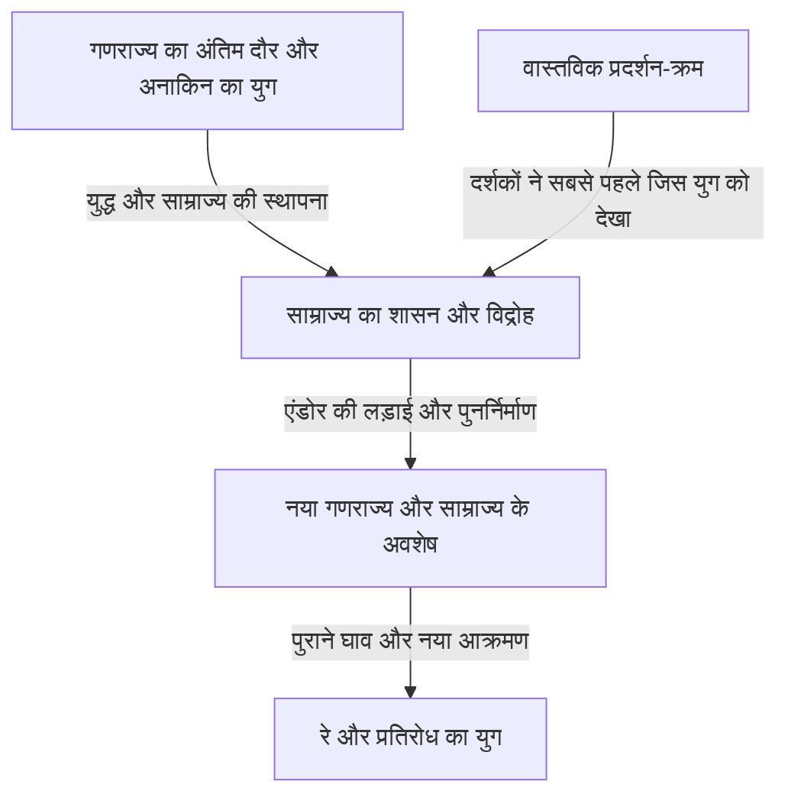
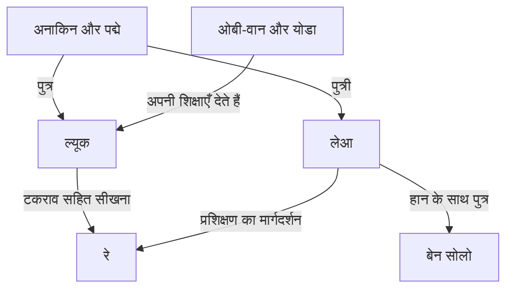

संक्षेप में कहें तो स्टार वॉर्स एक दूर की आकाशगंगा में घटने वाले रोमांचक अभियानों की कहानी है। लेकिन इन अभियानों में माता-पिता और बच्चों का प्रेम तथा टकराव, लोकतंत्र का पतन, साम्राज्य के विरुद्ध प्रतिरोध, धर्म और सत्ता, युद्ध के घाव और रक्त-संबंधों से परे बनने वाले परिवार एक-दूसरे से जुड़े हैं। पर्दे के पीछे फ़िल्म निर्माण का एक और इतिहास है, जिसने मॉडल, संपादन, संगीत, ध्वनि और कंप्यूटर ग्राफ़िक्स के इस्तेमाल को बदल दिया।

लाइटसेबर और डार्थ वेडर को जानने के बावजूद, कृतियों की संख्या बढ़ने के साथ पूरे संसार को समझना कठिन होता जाता है। फ़िल्मों का प्रदर्शन एपिसोड IV से क्यों शुरू हुआ? न्याय के रक्षक जेडाइ गणराज्य को क्यों नहीं बचा सके? अनाकिन, ल्यूक और रे की कहानियों ने क्या विरासत में लिया और क्या बदला? Andor और The Mandalorian फ़िल्मों के परिशिष्ट से आगे क्या दिखाते हैं?

यह लेख इन प्रश्नों को तीन स्तरों पर समझता है: आकाशगंगा की कथा, विभिन्न कृतियों के संबंध और उनके निर्माण का वास्तविक इतिहास। यह किसी शब्दकोश की तरह संसार की हर जानकारी नहीं गिनाता, बल्कि प्रमुख कृतियों के कारणों और परिणामों तथा बार-बार लौटते हुए बदलने वाले विषयों को समझने का विस्तृत मार्ग है। शाखाओं में फैलते संसार की विशालता दिखाने के साथ, यह पहली बार आने वालों को भी स्पष्ट रास्ता देता है।

इस चर्चा में मुख्य गाथा की नौ फ़िल्मों और संबंधित कृतियों के अंत, पात्रों की पहचान, महत्त्वपूर्ण मृत्यु और निर्णायक चुनाव सामने आते हैं। यदि आपने उन्हें नहीं देखा और आश्चर्य बचाकर रखना चाहते हैं, तो पहले आरंभिक परिचय तथा अंत की देखने के क्रम वाली मार्गदर्शिका पढ़ें, फिर संबंधित कृति देखने के बाद उसके अध्याय पर लौटें। सामग्री और प्रदर्शन की स्थिति जाँचने की आधार-तिथि 3 अक्टूबर 2026 है। चित्र इस लेख के लिए उत्पन्न अवधारणा-चित्र हैं, आधिकारिक फ़िल्म-दृश्य या निर्माण के अभिलेख नहीं।

## पहले तीन समय अलग करें: प्रदर्शन का क्रम, कथा का इतिहास और संसार के विवरण बनने का क्रम

स्टार वॉर्स को समझने की सबसे बड़ी कठिनाई यह है कि उसका समय एक ही रेखा में नहीं चलता। 1977 में पहली बार प्रदर्शित फ़िल्म को बाद में कथा के इतिहास में एपिसोड IV का स्थान मिला। दर्शकों ने पहले ल्यूक के अभियान देखे और उसके पिता अनाकिन की युवावस्था 1999 से आने वाली फ़िल्मों में देखी। कथा में पहले घटी घटना का वास्तविक दुनिया में पहले फ़िल्माया जाना आवश्यक नहीं है।

रचनाकारों ने संसार के विभिन्न विवरण किस क्रम में सोचे, वह भी अलग समयरेखा है। बाद की कृति में उजागर संबंध किसी पुराने दृश्य का अर्थ बदल सकता है। लेकिन यह कहना उससे अलग है कि पहली फ़िल्म बनाते समय दशकों बाद की हर कहानी तय हो चुकी थी। धीरे-धीरे विकसित हुई कृति की रचना-प्रक्रिया को केवल उसके अंतिम रूप की संगति के आधार पर उल्टा नहीं गढ़ना चाहिए।

इन तीन समयों का अंतर प्रीक्वल देखने के आनंद को भी स्पष्ट करता है। अंत मालूम होने से केवल आश्चर्य खत्म नहीं होता; कथा एक त्रासदी की तरह देखी जा सकती है, जिसमें हम पूछते हैं कि कहाँ दूसरा चुनाव संभव था। दूसरी ओर, प्रदर्शन के क्रम में जानकारी मिलने का समय पहले दर्शकों के अनुभव के करीब रहता है। दोनों का अपना मूल्य है; अधिक ज्ञान साबित करने के लिए कोई एकमात्र सही उत्तर नहीं है।

| फ़िल्मों का समूह | प्रथम प्रदर्शन के वर्ष | केंद्रीय प्रश्न |
| --- | --- | --- |
| एपिसोड IV, V और VI: मूल त्रयी | 1977, 1980, 1983 | भारी सत्ता का प्रतिरोध और परिवार के अतीत का सामना कैसे करें? |
| एपिसोड I, II और III: प्रीक्वल त्रयी | 1999, 2002, 2005 | गणराज्य और अनाकिन उसी चीज़ को क्यों खो देते हैं जिसे बचाना चाहते थे? |
| एपिसोड VII, VIII और IX: सीक्वल त्रयी | 2015, 2017, 2019 | नई पीढ़ी पिछली पीढ़ी की जीत और असफलताओं को कैसे ग्रहण करती है? |
| Rogue One और Solo | 2016, 2018 | मुख्य गाथा के किनारे के लोगों और पुराने निर्णयों को कैसे दिखाया जाए? |
| सिनेमाघरों में प्रदर्शित The Clone Wars | 2008 | लंबे युद्ध को लोगों के संबंधों के माध्यम से कैसे विस्तार दिया जाए? |
| The Mandalorian and Grogu | 2026 | साम्राज्य के पतन के बाद संरक्षण और समुदाय को कैसे समझें? |

वर्ष सामान्यतः पहले सिनेमाघर प्रदर्शन के हैं और जापानी प्रदर्शन-वर्ष से अलग हो सकते हैं। प्रदर्शन का क्रम और व्यापक कालक्रम [फ़िल्मों और धारावाहिकों की आधिकारिक मार्गदर्शिका](https://www.starwars.com/news/star-wars-movies-and-series-guide) में देखे जा सकते हैं। छोटे कथासंग्रहों की तरह यदि एक कार्यक्रम कई युगों को समेटता है, तो उसके नाम को समयरेखा के केवल एक बिंदु पर रखना भ्रामक हो सकता है।

यह चित्र प्रमुख दृश्य कृतियों को समझने का ढाँचा है। इसका अर्थ, उदाहरण के लिए, यह नहीं कि एक युद्ध के बाद आकाशगंगा के हर कोने से साम्राज्य मिट गया। शासन की प्रतीकात्मक हार और सैन्य संगठनों, प्रशासन, अपराध तथा लोगों की सोच में बदलाव अलग-अलग गति से होते हैं। अनेक सहायक कथाएँ इन समयांतरों में घटती हैं।

## कैनन और लेजेंड्स: कौन-सी कहानी किस निरंतरता में आती है?

कैनन वर्तमान आधिकारिक कथा-निरंतरता को समझने का ढाँचा है। लेजेंड्स वह वर्ग है जिसमें पहले विकसित अनेक उपन्यास, कॉमिक्स, खेल और दूसरी कहानियाँ व्यवस्थित की गईं। 2014 में लूकसफ़िल्म ने मौजूदा एक्सपैंडेड यूनिवर्स के प्रति अपनी नीति बदली और फ़िल्मों तथा The Clone Wars को आधार बनाकर नए विस्तार की दिशा बताई। [उस समय की आधिकारिक घोषणा](https://www.starwars.com/news/the-legendary-star-wars-expanded-universe-turns-a-new-page) इस परिवर्तन को समझाती है।

किसी कृति का लेजेंड्स कहलाना उसके गायब होने या पढ़ने लायक न रहने का अर्थ नहीं है। उसे दूसरे समय, दूसरी सीमाओं और संभावनाओं में विकसित आकाशगंगा की कहानी की तरह पढ़ा जा सकता है। उलटे, पुराने नाम या विचार के नई कृति में लौटने से उसकी पूरी पुरानी जीवनी और घटनाएँ नई निरंतरता में एक साथ शामिल नहीं हो जातीं। परिचित नाम मिलने पर ही विशेष रूप से देखना चाहिए कि किस कृति के किस रूप की बात हो रही है।

हर आधिकारिक निर्माण भी एक ही निरंतरता साझा नहीं करता। Visions जैसी परियोजनाएँ स्थापित समयरेखा से स्वतंत्र अभिव्यक्ति खोजती हैं। खेल में उपलब्ध हर कार्रवाई आवश्यक नहीं कि कथा की घटना बन जाए; कभी खिलाड़ी के विकल्प और सीक्वल द्वारा मानी गई घटनाओं को अलग करना पड़ता है।

यहाँ बचने वाली गलती है संसार की जानकारियों के वर्गीकरण को कलात्मक श्रेष्ठता का निर्णय बना देना। कैनन संबंध समझने का संकेत है, भावनात्मक प्रभाव को अंक देने की व्यवस्था नहीं। पर्दे का दृश्य, आधिकारिक सामग्री, किसी पात्र की बात और दर्शक की व्याख्या अलग तरह की जानकारी हैं। किसी पात्र के विश्वास को संसार की सर्वज्ञ सत्यवाणी मान लेना भी उचित नहीं।

यह लेख मुख्यतः वर्तमान प्रमुख दृश्य कृतियों की निरंतरता अपनाता है और लेजेंड्स या स्वतंत्र परियोजनाओं का उल्लेख करते समय उनका स्थान अलग बताता है। इसमें दिखाई गई बात और उसकी संभावित व्याख्या भी अलग हैं। उदाहरण के लिए, जेडाइ संस्था की आलोचनात्मक समझ दर्शक का विश्लेषण है; वह ऐसा आधिकारिक तथ्य नहीं जो हर जेडाइ की सद्भावना नकार दे।

## आकाशगंगा में प्रवेश के लिए पात्रों का छोटा मानचित्र

केंद्र में स्काईवॉकर परिवार से जुड़ी कई पीढ़ियाँ हैं। अनाकिन और पद्मे के बच्चे ल्यूक और लेआ हैं। लेआ और हान का बेटा बेन सोलो बाद में काइलो रेन नाम अपनाता है। लेकिन कथा की विरासत केवल रक्त-संबंध नहीं समझाते। शिक्षाएँ, असफलताएँ और चुनाव ओबी-वान तथा योडा से ल्यूक, अनाकिन से अहसोका और फिर रे सहित अगली पीढ़ी तक पहुँचते हैं।

R2-D2 और C-3PO इस इतिहास से मनुष्यों से अलग स्थितियों में गुजरते हैं। च्यूबाका, लैंडो और विद्रोही साथी परिवार के आंतरिक संघर्षों को पूरी आकाशगंगा की लड़ाई से जोड़ते हैं। बाद के धारावाहिक कैसियन, डिन जारिन, ग्रोगू और क्लोनों जैसे पात्रों के माध्यम से नायकत्व के केंद्र से दूर रहने वालों का समय दिखाते हैं।

परिवार और गुरु-शिष्य संबंध अलग देखने पर समझ आता है कि आकाशगंगा की कहानी केवल राजवंश की वंशावली नहीं है। प्रश्न विरासत में क्या मिला से अधिक यह है कि उसका उपयोग कैसे किया और क्या ठुकराया। इसलिए उस त्रयी से शुरू करें जिसके रास्ते दर्शक पहली बार इस आकाशगंगा में आए और देखें कि प्रत्येक कृति क्या करती है।

## एपिसोड IV, A New Hope: आकाशगंगा की राजनीति एक युवक की ज़िंदगी तक पहुँचती है

1977 की पहली फ़िल्म अपने संसार के इतिहास के बीच से शुरू होती है। साम्राज्य की स्थापना का विवरण जाने बिना दर्शक एक छोटे जहाज़ को विशाल युद्धपोत से भागते देखते हैं। आकारों का अंतर ही पीछा करने वाले और भागने वाले की असमान शक्ति बता देता है। आरंभ पूरे संसार को समझाकर कहानी चलाने के बजाय, घटनाएँ समझने की आवश्यक जानकारी पात्रों के कामों से देता है। प्रदर्शन-तिथि और कथा का सामान्य स्थान [आधिकारिक फ़िल्म पृष्ठ](https://www.starwars.com/films/star-wars-episode-iv-a-new-hope) पर भी मिलते हैं।

### अभियान की शुरुआत चुना हुआ होने की चेतना से नहीं होती

टैटूइन के खेत में रहने वाला ल्यूक स्काईवॉकर शुरू से आकाशगंगा बचाना नहीं चाहता। वह रोज़मर्रा की संकीर्ण दुनिया से निकलने वाला युवक है। लेकिन घर आए ड्रॉइड विद्रोहियों की जानकारी लाते हैं और लेआ का सहायता-संदेश उसे एकांत में रह रहे ओबी-वान केनोबी तक ले जाता है। जब तक राजनीतिक संघर्ष दूर की ख़बर है, उसके पास खेत लौटने का विकल्प है। साम्राज्य की हिंसा द्वारा उसे पालने वाले लोगों की जान लेने पर यह सीमा टूट जाती है।

कारणों का यह क्रम महत्त्वपूर्ण है। ल्यूक अभियान चुनकर साम्राज्य से नहीं जुड़ता; साम्राज्य के शासन से असंबद्ध रहने की कोशिश करने वाली उसकी ज़िंदगी ही नष्ट हो जाती है। यह व्यक्तिगत विकास की कथा होने के साथ सत्ता की हिंसा के किनारे के जीवन तक घुस आने की कहानी है। फिर भी केवल दुख उसे नायक नहीं बनाता। गुरु और साथियों से मिलना, कार्य करना सीखना और अपनी क्षमताओं से दूसरों की सहायता करना उसकी आरंभिक इच्छाओं को सार्वजनिक अर्थ देता है।

लेआ को बचाया जाता है, लेकिन वह केवल बचाए जाने की प्रतीक्षा नहीं करती। वह जानकारी छिपाती है, पूछताछ सहती है और भागते समय निर्णय लेती है। जिस परिसर में ल्यूक और हान उसे मदद देने आते हैं, वहीं वह उनकी गलतियाँ सँभालती है। भूमिकाएँ स्थिर न होने से तीनों केवल नायक, सहायक और पुरस्कार नहीं बनते; वे एक-दूसरे के निर्णयों को चुनौती देने वाला समूह बनते हैं।

### डेथ स्टार एक हथियार भी है और शासन का विचार भी

डेथ स्टार का आतंक ग्रह नष्ट करने की क्षमता तक सीमित नहीं। उसके पीछे ताकत का प्रदर्शन करके रोज़ की बातचीत और प्रतिनिधित्व को अनावश्यक बनाने की योजना है। सीनेट भंग करना और भय से तारामंडलों को आज्ञाकारी रखना परस्पर जुड़े हैं। एल्डेरान का विनाश सैन्य अड्डे पर हमले से आगे, प्रतिरोध सोच सकने वाले हर व्यक्ति को धमकी है।

विद्रोहियों के पास उसी आकार का हथियार नहीं। वे नक्शे पढ़ते हैं, छोटी कमजोरी ढूँढ़ते हैं और सीमित शक्ति केंद्रित करते हैं। जीत के लिए जानकारी ढोते ड्रॉइड, नक्शे दूसरों को सौंपने वाले, विश्लेषक और लड़ाकू जहाज़ों के रखरखावकर्ता जुड़ते हैं। निर्णायक प्रहार ल्यूक करता है, लेकिन उसे संभव सामाजिक सहयोग बनाता है। इसे भूलने पर फ़िल्म विशेष रक्तवंश वाले व्यक्ति द्वारा सब हल कर देने की साधारण कथा लग सकती है।

हान का लौटना भी उसी सहयोग का हिस्सा है। पैसे के आधार पर चलने वाला व्यक्ति जोखिम जानकर दोस्तों की मदद करता है। ल्यूक का केवल निशाने के उपकरण पर निर्भर न रहकर फ़ोर्स पर विश्वास करना और हान का केवल इनाम देखकर निर्णय छोड़ना, दोनों तात्कालिक लाभ-हानि से आगे भरोसे की ओर बढ़ना माने जा सकते हैं। संदेश तकनीक त्यागना नहीं है। लड़ाकू जहाज़, संचार और नक्शे आवश्यक रहते हैं; प्रश्न अंतिम निर्णय में क्या जोड़ने का है।

एक और बात यह है कि आकाशगंगा का इतिहास रखरखाव माँगती मशीनों और जीवन-खर्च के रूप में पर्दे पर आता है। फ़ाल्कन केवल आदर्श तेज़ वाहन नहीं, मालिक की मेहनत से चलने वाला जहाज़ है। सराय के ग्राहक केवल नायक को समझाने के लिए नहीं हैं, और ड्रॉइड खरीदे-बेचे जाने वाला जीवन जीते हैं। चित्र के केंद्र के बाहर भी घटनाएँ चलती लगती हैं, इसलिए सब जाने बिना दर्शक महसूस करते हैं कि यह संसार बहुत पहले से मौजूद है।

## एपिसोड V, The Empire Strikes Back: हार नायक की अपने बारे में समझ तोड़ती है

पिछली जीत साम्राज्य का अंत नहीं थी। विद्रोही अब भी भाग रहे हैं और हॉथ का अड्डा नहीं बचा सकते। फ़िल्म इस वास्तविकता से शुरू होती है कि बड़ा हथियार नष्ट करने से संस्थाएँ और सेनाएँ नहीं मिटतीं। 1980 की यह फ़िल्म ल्यूक के प्रशिक्षण और हान तथा साथियों की भागने की यात्रा समानांतर चलाती है। [आधिकारिक फ़िल्म पृष्ठ](https://www.starwars.com/films/star-wars-episode-v-the-empire-strikes-back)

### प्रशिक्षण पत्थर उठाने की तकनीक से अधिक माँगता है

डागोबा पर योडा से मिलते समय ल्यूक की महान गुरु के रूप-व्यवहार की उम्मीद टूटती है। छोटे, अजीब प्राणी में वह तुरंत ज्ञान नहीं पहचानता। यही युक्ति दर्शक पर भी काम करती है। ताकत को बड़े शरीर या बड़े हथियार से जोड़ने की प्रवृत्ति हिलाकर फ़ोर्स की पढ़ाई शुरू होती है।

गुफा में पराजित वेडर के मुखौटे के भीतर ल्यूक अपना चेहरा देखता है। फ़िल्म इसे भविष्य की साधारण रिकॉर्डिंग निश्चित नहीं करती। इसे चेतावनी मान सकते हैं कि शत्रु के प्रति भय और क्रोध के पीछे चलने पर व्यक्ति उसी जैसा बन सकता है। पिछली फ़िल्म में बाहरी शत्रु साम्राज्य को हराना चुनौती थी; यहाँ उसे हराने वाले का मन भी जाँच का विषय है।

दोस्तों के कष्ट का दर्शन करके ल्यूक प्रशिक्षण रोकता है। इस निर्णय को करुणा के कारण पूरी तरह सही या अपरिपक्वता के कारण पूरी तरह गलत कहना आसान नहीं। दोस्तों को न छोड़ पाने की इच्छा समझ आती है, लेकिन वह अपनी शक्ति और जानकारी की सीमाएँ गलत आँकता है। वेडर भी उन्हीं भावनाओं से उसे बाहर बुला रहा है। सद्भावना स्थिति का निर्णय अनावश्यक नहीं बनाती।

### लैंडो का समझौता और प्रभुत्व से समझौता करने की सीमाएँ

लैंडो क्लाउड सिटी बचाने के लिए साम्राज्य से सौदा करता है। लेकिन जहाँ शक्तिशाली पक्ष एकतरफ़ा वादे बदल सकता हो, वहाँ अनुबंध सुरक्षा नहीं देता। एक शर्त पूरी करो तो दूसरी माँग आती है। उसकी असफलता केवल निजी विश्वासघात नहीं, भारी हिंसा के अधीन स्वायत्तता बचाने की राजनीतिक विफलता भी है।

फिर भी एक बार गलती करने वाले को हमेशा गलती करते रहना आवश्यक नहीं। लैंडो बचाव करने निकलता है। ल्यूक असफल होता है, लैंडो धोखा देता है और हान पकड़ा जाता है, लेकिन उनका मूल्य उसी क्षण की सफलता-दर नहीं तय करती। अपने व्यवहार को सुधारना, मदद माँगना और मदद का उत्तर देना जीत से अलग कसौटी बने रहते हैं।

वेडर के पिता होने का खुलासा अच्छाई-बुराई का अंतर मिटाने की युक्ति नहीं। साम्राज्य की हिंसा सही नहीं हो जाती। टूटता ल्यूक का व्यवस्थित पारिवारिक इतिहास है: वह अच्छे पिता का बेटा है और शत्रु उसे मारने वाला कोई पराया व्यक्ति। शत्रु को हराकर पिता के करीब जाने की धारणा बदलकर कठिन प्रश्न होती है कि उससे कैसे सामना किया जाए ताकि पिता की विरासत ग्रहण की जा सके।

द्वंद्व के अंत में ल्यूक विजेता नहीं बनता। घायल और अकेले निकलने में असमर्थ उसे लेआ और अन्य बचाते हैं। पहली फ़िल्म में जिसे बचाने गया था, उसी से बचना नायक के अलगाव को अस्वीकार करता है। स्वावलंबन केवल किसी पर निर्भर न होना नहीं; गलतियाँ और कमजोरियाँ साथ लेकर संबंधों में लौटना भी है। इसलिए अँधेरा अंत केवल अगली कड़ी तक समाधान टालना नहीं है।

हॉथ का सफ़ेद विस्तार, डागोबा की नम बंद दुनिया और क्लाउड सिटी का उजला बाहरी तथा अँधेरा भीतरी रूप केवल दर्शनीय पृष्ठभूमि नहीं। स्थान का अनुभव सैन्य पीछे हटने, अंतरमन में उतरने और दिखाई देती सुरक्षा टूटने को सहारा देता है। हर स्थानांतरण पर नायक की परिचित क्षमताएँ अपर्याप्त होती हैं: लड़ाकू जहाज़ में जीत प्रशिक्षण, वार्ता या पिता से बातचीत के उत्तर नहीं देती।

विद्रोह और साम्राज्य की असमान शक्ति दिखाने वाला उत्पन्न अवधारणा-चित्र; यह आधिकारिक फ़िल्म-दृश्य नहीं है।

## एपिसोड VI, Return of the Jedi: पिता को बचाना और साम्राज्य को हराना

1983 का समापन हान के बचाव से शुरू होकर व्यक्तिगत संबंधों की मरम्मत और आकाशगंगा के युद्ध को साथ लाता है। जब्बा के महल में ल्यूक पहली फ़िल्म के युवक से शांत और अपनी शक्ति के प्रयोग में अधिक आश्वस्त है। पर यह रूप जेडाइ के तौर पर परिपक्वता सिद्ध नहीं करता। अंतिम प्रश्न है कि जब जीत सकता है, तब क्या करता है। [आधिकारिक फ़िल्म पृष्ठ](https://www.starwars.com/films/star-wars-episode-vi-return-of-the-jedi)

### सम्राट का जाल मृत्यु से अधिक क्रोध चाहता है

सम्राट सैन्य रूप से विद्रोहियों को नष्ट करने के साथ ल्यूक को अपनी ओर खींचना चाहता है। वह दोस्तों का संकट दिखाकर क्रोध में हमला करवाता और उसी भावना से पिता की हत्या करवाना चाहता है। ल्यूक वेडर को हरा भी दे, तो समान प्रभुत्व की सोच अपनाने पर सम्राट जीतता है। इस द्वंद्व में लड़ाई की जीत और नैतिक सफलता विपरीत हो सकती हैं।

लेआ को धमकी मिलने पर ल्यूक क्रोधित होकर वेडर पर हावी होता है। पिता के मशीनी हाथ और अपने हाथ को देखना गुफा के दर्शन को ठोस चुनाव बनाकर लौटाता है। हथियार फेंकना ख़तरा न होने के कारण अहिंसा चुनना नहीं। वह मारे जाने की संभावना स्वीकार करके पिता को मारने से मना करता है। अपनी ताकत सिद्ध करने के लिए शत्रु नष्ट करने की कसौटी छोड़ता है।

वेडर बेटे का कष्ट देखकर सम्राट के विरुद्ध निर्णय लेता है। यहाँ उद्धार है, पर पुराने अपराध मिट जाने का दावा नहीं। बेटे का पिता की अच्छाई पर विश्वास करना और पीड़ितों पर अपराधी को क्षमा करने का दायित्व अलग हैं। फ़िल्म पिता-पुत्र संबंध का अंतिम बदलाव दिखाती है; कानूनी जिम्मेदारी और ऐतिहासिक स्मृति के सभी प्रश्न नहीं निपटाती। यह अंतर रखने से भावनात्मक प्रभाव खोए बिना अंत की सीमाएँ समझ आती हैं।

### जंगल की लड़ाई सिंहासन-कक्ष जितनी आवश्यक क्यों है

सम्राट से सामना अलग देखने पर लगता है कि दुनिया केवल परिवार की समस्याओं से चलती है। वास्तव में एंडोर के ज़मीनी सैनिक ढाल बंद न करें तो बेड़ा दूसरे डेथ स्टार को नहीं नष्ट कर सकता। ल्यूक का पिता बचाना और विद्रोहियों का सैन्य परिसर नष्ट करना दोनों आवश्यक हैं। एक अपने-आप दूसरे का काम नहीं करता।

इवॉक संयुक्त अभियान में भूभाग का ज्ञान और अलग युद्ध-शैली लाते हैं। साम्राज्य कवच और मारक क्षमता में श्रेष्ठ है, लेकिन स्थानीय निवासियों को पर्याप्त स्वतंत्र कर्ता नहीं मानता। यही अवमानना भूभाग और अचानक हमले वाले प्रतिरोध का गलत आकलन करवाती है। निश्चय ही यह वास्तविक युद्ध का नियम नहीं कि साधारण हथियार हमेशा उन्नत सेना को हरा दें। रूपक-कथा के रूप में यह छोटे जीवों के निर्णय और एकजुटता को कम आँकने वाले शासक की कमजोरी दिखाता है।

ल्यूक, हान, लेआ, लैंडो, च्यूबाका, ड्रॉइड, अनाम सैनिक और एंडोर के निवासी योगदान देते हैं। उनके काम एक साथ आने से उत्सव किसी एक का राज्याभिषेक नहीं बनता। यह पिता खोने के बाद ल्यूक का समुदाय में लौटना भी है। निजी हानि और सार्वजनिक जीत साथ होने से खुशी पूरी तरह बेदाग सुखांत नहीं रहती।

सम्राट की हार उसकी उस धारणा की भी हार है कि बाकी लोग अंत तक लाभ और भय से चलेंगे। बेटे का पिता पर भरोसा न छोड़ना और पिता का शासक की आज्ञा से ऊपर बेटे को चुनना उसके गणित से बाहर है। बड़ी फ़ोर्स-शक्ति मानव निर्णय पूरी तरह नहीं भाँप सकती। विशाल हथियारों पर अति-विश्वास और हर मन समझ लेने का अति-विश्वास एक कमजोरी साझा करते हैं।

## एपिसोड I, The Phantom Menace: साम्राज्य शुरू से साम्राज्य जैसा नहीं दिखता

1999 का प्रीक्वल पहली फ़िल्म जैसी स्पष्ट सैन्य तानाशाही के बजाय गणराज्य के अंदर संघर्ष से शुरू होता है। ट्रेड फ़ेडरेशन की नाबू नाकेबंदी व्यापार और कर के विवाद को सशस्त्र कब्ज़े में बदलती है। किशोर रानी पद्मे अमिडाला मानती है कि सीनेट से अपील करने पर तथ्य स्वीकार होंगे और मदद मिलेगी। लेकिन संस्थाएँ जाँच और प्रक्रिया में अटकी रहती हैं; निर्णयों की गति ज़मीन के दुख से मेल नहीं खाती। [आधिकारिक फ़िल्म पृष्ठ](https://www.starwars.com/films/star-wars-episode-i-the-phantom-menace)

### पैलपेटीन संकट सुलझाने वाले के रूप में समर्थन पाता है

आगे का इतिहास जानने वाले दर्शक के लिए नाबू के सीनेटर पैलपेटीन की सलाह के दो अर्थ हैं। वह पीड़ित पक्ष के साथ खड़ा होकर अयोग्य दिखते नेतृत्व पर अविश्वास का उपयोग करता है। महत्त्वपूर्ण यह है कि बाहर से सीनेट में घुसकर एक वार में गणराज्य नहीं तोड़ता। वह संसदीय प्रक्रिया और लोगों की अपेक्षाओं से ऊपर उठता है।

शत्रु भी एक अखंड समूह नहीं। ट्रेड फ़ेडरेशन अपना लाभ चाहता है, जबकि डार्थ सिडियस उसे बड़ी योजना का औज़ार बनाता है। सतह का संघर्ष समाप्त होने पर उससे पैदा सत्ता-परिवर्तन रहता है। नाबू की मुक्ति सच्ची जीत है, लेकिन जरूरी नहीं कि पूरे गणराज्य के भविष्य की जीत हो। दोनों पैमानों का अंतर उत्सव में अशांति रखता है।

पद्मे का गंगनों से सहयोग माँगना उलटी राजनीति दिखाता है। प्रतिनिधि की प्रतिष्ठा बचाने के बजाय वह एक ग्रह के निवासियों का साझा संबंध स्वीकार करके मदद माँगती है। यह केवल सैन्य कमी भरना नहीं; दूर रहे समूह साझा उद्देश्य बनाते हैं। छोटी एकजुटता वह ठोस कार्यक्षमता पैदा करती है जो सीनेट से नहीं मिली।

### अनाकिन की प्रतिभा से पहले उसका जीवन देखें

बालक अनाकिन अद्भुत पायलट है, पर गुलाम भी। विशाल गणराज्य और न्याय बोलने वाले जेडाइ के संसार में माँ-बेटे की स्वतंत्रता सुरक्षित नहीं। यह संस्थाओं के होने और उनकी सुरक्षा हर क्षेत्र तक पहुँचने का अंतर दिखाता है। क्वाइ-गॉन अनाकिन को मुक्त कर सकता है, मगर माँ श्मी को उसी तरीके से नहीं बचा सकता।

प्रस्थान में क्षमता की पहचान की खुशी और माँ को छोड़ने का डर साथ हैं। बाद के अनाकिन को केवल भय न जीत सकने वाला कमजोर व्यक्ति कहना उन स्थितियों की अनदेखी है जिनमें डर जन्मा। दूसरी ओर कठोर बचपन बाद की हिंसा अनिवार्य नहीं बनाता। कहानी पूछती है कि घायल व्यक्ति को किस सहारे और शिक्षा की आवश्यकता थी।

क्वाइ-गॉन की मृत्यु से उसे खोजने वाला गुरु लंबे समय तक मार्गदर्शन नहीं दे सकता। ओबी-वान वादा ग्रहण करता है, लेकिन उनका रिश्ता शुरू से पूर्ण नहीं। बड़ी भविष्यवाणी और संस्थागत अपेक्षाएँ बच्चे के विकास से तेज़ चलने लगती हैं। यह असंतुलन पूरी प्रीक्वल त्रयी की त्रासदी तैयार करता है।

निर्माण की दृष्टि से भी प्रीक्वल को पूरी तरह कंप्यूटर से बनी फ़िल्में कहना गलत है। आधिकारिक विवरण पॉडरेस दर्शकों के मॉडल में रंगीन रुई वाली तीलियों जैसे वास्तविक उपाय बताता है। नई तकनीक और हस्तकौशल मिलकर चित्र बनाते हैं, यह समझ अधिक सटीक है। [आधिकारिक निर्माण-संबंधी रोचक तथ्य](https://www.starwars.com/news/25-fun-facts-the-phantom-menace)

अंत में कई स्थानों की लड़ाइयाँ समूहों की भूमिकाएँ अलग करती हैं। गंगनों का ध्यान भटकाना, महल की कार्रवाई, अंतरिक्ष युद्ध और जेडाइ-सिथ द्वंद्व अलग समस्याएँ हल करते हैं। अकेला कुशल तलवारबाज़ कब्ज़ा समाप्त नहीं करता। सैन्य सफलता के पीछे क्वाइ-गॉन की मृत्यु यह भी दिखाती है कि समुदाय की जीत और बालक के जीवन की हानि एक बात नहीं।

## एपिसोड II, Attack of the Clones: युद्ध की तैयारी विकल्प घटाती है

2002 की दूसरी प्रीक्वल में गणराज्य छोड़ने वाला अलगाववादी आंदोलन बढ़ता है और सेना बनाना राजनीतिक प्रश्न होता है। पद्मे की हत्या के प्रयास की जाँच में ओबी-वान क्लोन सेना खोजता है। संकट की तैयारी पर बहस करते गणराज्य के सामने तैयार सेना आ जाती है। तत्काल सुरक्षा की आवश्यकता अस्पष्ट उत्पत्ति वाली सुविधाजनक व्यवस्था से मिलती है। [आधिकारिक फ़िल्म पृष्ठ](https://www.starwars.com/films/star-wars-episode-ii-attack-of-the-clones)

### जाँचने योग्य रहस्य को युद्ध की ज़रूरत पीछे छोड़ देती है

क्लोन सेना कैसे मँगाई गई और किसके हित में बनी, यह प्राथमिक जाँच होनी चाहिए। लेकिन शत्रु की सेना सामने हो तो लोग तुरंत इस्तेमाल योग्य बल चाहते हैं। संकट परीक्षण का समय छीनकर निर्णय बदलता है। सेना अपनाई जाती है क्योंकि विकल्प अनुपलब्ध लगते हैं, न कि उसकी पर्याप्त जाँच हो चुकी है।

डूकू की गणराज्य-आलोचना में संस्थागत भ्रष्टाचार की वास्तविक समस्याएँ हैं। लेकिन सही समस्या बताना न्यायपूर्ण समाधान की गारंटी नहीं। स्वयं सिथ योजना में होने से गणराज्य से मोहभंग सीधे मुक्ति नहीं बनता। दोनों पक्षों के दिखाई देते संघर्ष और उसका उपयोग करने वाले सिडियस की स्थिति अलग देखनी चाहिए।

जेडाइ भी शांति बचाने रणभूमि में जाते हुए सेनानायक बनते हैं। सफल बचाव अभियान विरोधाभास से युद्ध शुरू करने में योगदान देता है। तत्काल जीवन बचाना दीर्घकाल में सैन्य व्यवस्था मजबूत करने के साथ रहता है। अच्छे उद्देश्य के लिए चुने साधन संस्था का चरित्र धीरे-धीरे बदलते हैं।

### प्रेम और राजनीति में नियंत्रण की साझा इच्छा

अनाकिन और पद्मे के बीच पद, कर्तव्य और जेडाइ अनुशासन की बाधाएँ हैं। गुप्त विवाह प्रेम बचाता है, पर सलाह और सहायता का दायरा घटाता है। कठिनाई साझा करने वाले कम होने से, बाद में बढ़ते भय को बाहरी दृष्टि से परखना कठिन होता है।

माँ खोने पर अनाकिन टस्कन बस्ती के लोगों को बच्चों सहित मारता है। इसे मात्र तीव्र क्रोध का नाटकीय संकेत मानकर नहीं छोड़ना चाहिए। प्रिय पर हिंसा दूसरों पर हिंसा का औचित्य बनती है: स्पष्ट नैतिक टूटन। दुख समझा जा सकता है, लेकिन कर्म जिम्मेदारी लाते हैं। बाद का पतन अचानक पलटना नहीं; बड़ी सीमा यहाँ पार हो चुकी है।

अनाकिन का राजनीतिक विचार कि अच्छा परिणाम मिले तो शक्तिशाली नेता निर्णय करे, निजी संबंधों में हानि नियंत्रित करने की इच्छा से मिलता है। लोगों की अलग इच्छाएँ और प्रिय का अपने नियंत्रण से बाहर जीवन स्वीकारना कठिन है। फिर भी बलपूर्वक अनिश्चितता मिटाना उसी संबंध को नष्ट करता है जिसे बचाना था। अगली फ़िल्म समस्या चरम तक ले जाती है।

क्लोन सेना की एकरूपता मनुष्य को बदली जा सकने वाली सैन्य इकाई मानने की बेचैनी भी लाती है। समान उत्पत्ति का अर्थ समान गिने जाने योग्य जीवन नहीं। फ़िल्म पहले विशाल सेना की छाप देती है, बाद की कृतियाँ सैनिकों का व्यक्तित्व खोलती हैं। यह क्रम देखने पर गणराज्य की मुक्ति दिखती सेना को फिर पूछ सकते हैं: इसकी कीमत कौन चुकाता है?

## एपिसोड III, Revenge of the Sith: बचाने की इच्छा प्रभुत्व के तर्क में बदलती है

2005 की तीसरी प्रीक्वल में क्लोन युद्धों के अंत के करीब गणराज्य गिरता है। जीत से शांति लौटने की अपेक्षा के विपरीत, युद्ध के लिए केंद्रित सत्ता युद्धोत्तर तानाशाही का आधार बनती है। अनाकिन और गणराज्य साथ गिरते हैं, इसलिए त्रासदी केवल व्यक्तिगत कमजोरी या केवल संस्थागत विफलता नहीं है। [आधिकारिक फ़िल्म पृष्ठ](https://www.starwars.com/films/star-wars-episode-iii-revenge-of-the-sith)

### पैलपेटीन मृत्यु नियंत्रित करने का वादा बेचता है

अनाकिन पद्मे खोने वाले भविष्य से डरता है। पैलपेटीन डर नकारने के बजाय कहीं और न मिलने वाली शक्ति सुझाता है। यह दुष्ट सिद्धांत का उपदेश देने से सूक्ष्म है। वह पहचानता है कि दूसरा सबसे अधिक क्या खोने से डरता है और खुद को उसकी रक्षा में अपरिहार्य बनाता है। निर्भरता बढ़ने से विरोधाभासी तर्क और अपराध की माँग स्वीकारना आसान होता है।

अनाकिन और जेडाइ परिषद में भी अविश्वास है। उसे मान्यता नहीं मिलती लगती; परिषद पैलपेटीन से निकटता पर शंकित है। जासूसी की भूमिका माँगने से निष्ठाएँ और बँटती हैं। लेकिन परिस्थिति समझाना कर्म क्षमा करना नहीं। पैलपेटीन बचाने के लिए मेस विंडू रोकने के बाद अनाकिन अधिक विनाशकारी आदेश मानता है।

गंभीर गलती के बाद कभी लोग लौटने के बजाय उस गलती को अर्थपूर्ण बनाने वाला रास्ता चाहते हैं। अनाकिन का व्यवहार ऐसी आत्म-औचित्य शृंखला की तरह पढ़ सकते हैं। इतना आगे आ गया है कि शक्ति न मिली तो सब व्यर्थ होगा। यह सोच अगली हिंसा को आवश्यक बलिदान बनाती है।

### ऑर्डर 66 संस्था की मौजूद घातक क्षमता की दिशा पलटता है

जेडाइ पर दूर से आई नई सेना नहीं, साथ लड़े सैनिक हमला करते हैं। आदेश-व्यवस्था उलटने पर मित्रता पर आधारित तैनाती और भरोसा कमजोरी बनते हैं। फ़िल्म आदेश और समन्वित हमले दिखाती है; संबंधित एनिमेशन क्लोन नियंत्रण का विवरण जोड़ता है। फ़िल्म की व्याख्या और बाद के विस्तार अलग करने से हर कृति की भूमिका स्पष्ट होती है।

साम्राज्य तब भी नहीं बनता जब हर गणतांत्रिक भवन नष्ट हो जाए। उसे सीनेट-कक्ष में नई व्यवस्था घोषित किया जाता है। सुरक्षा बहाली की भाषा में निगरानी और हिंसा स्थायी शासन बनते हैं। विरोधी जेडाइ को गद्दार कहकर सत्ता-केंद्रीकरण का प्रतिरोध व्यवस्था पर हमला बना दिया जाता है।

मुस्तफ़ार पर अनाकिन उसी पद्मे पर हिंसा करता है जिसे बचाना था। असहमति पर उसकी स्वतंत्र इच्छा का सम्मान करने के बजाय विश्वासघात समझता है। प्रेम और अधिकार-जताने का अंतर साफ़ होता है। उसके इच्छित भविष्य को केवल जीवित पद्मे नहीं, उसके निर्णयों का समर्थन करती पद्मे चाहिए थी।

जले अनाकिन के कवच में बंद होने और जुड़वाँ बच्चों के जन्म के दृश्य निराशा और अगली संभावना साथ दिखाते हैं। न ओबी-वान विजेता है, न योडा। फिर भी बच्चों की रक्षा राजनीतिक हार में भविष्य बचाती है। प्रीक्वल ऐसी कथा बनती है जहाँ सद्भावना, भय, संस्थाएँ और महत्वाकांक्षा मिलकर आपदा बनाते हैं; अच्छे लोग गायब होने मात्र से बुराई नहीं जीतती।

ओबी-वान का दुख खलनायक खोजकर हराने की संतुष्टि से दूर है। उसे भाई समान व्यक्ति से लड़ना पड़ता है और अपनी शिक्षा तथा निर्णय के प्रश्न रहते हैं। लंबा द्वंद्व केवल कौशल तुलना नहीं, गहराई से परिचित दो लोगों का संबंध न तोड़ पाने का दर्द भी पढ़ा जा सकता है। विजेता के पास भी जीत मनाने का स्थान नहीं।

## एपिसोड VII, The Force Awakens: अनजान नायकों की विरासत लेने वाली पीढ़ी

2015 के नए अध्याय में विद्रोही नायक रे और फ़िन के लिए लगभग दंतकथाएँ हैं। दर्शकों के परिचित नाम युवाओं से दूर हैं। यह अंतर पुराने दर्शकों की स्मृति और नए लोगों का आश्चर्य एक चित्र में रखता है। साम्राज्य के बाद फ़र्स्ट ऑर्डर बताता है कि बीती जीत अगली पीढ़ी की सुरक्षा निश्चित नहीं करती। [आधिकारिक फ़िल्म पृष्ठ](https://www.starwars.com/films/star-wars-episode-vii-the-force-awakens)

### फ़िन पहले आदेश ठुकराकर नायक बनता है

फ़िन की शुरुआत श्रेष्ठ वंश या भविष्यवाणी नहीं। सैनिक की आज्ञाकारिता माँगे जाने पर वह हत्या ठुकराता है। इससे संगठन के केवल नंबर से अपने निर्णय लेने वाले व्यक्ति में बदलना शुरू करता है। तुरंत पूरी आकाशगंगा बचाने का संकल्प नहीं बनता; पहले भागने की इच्छा प्रबल है। फ़िल्म भय मिटने के बाद अच्छाई नहीं, भय के रहते किसी के लिए खड़े रहना दिखाती है।

जक्कू की रे जीवित रहने के कौशल सीखकर भी लौट सकने वाले परिवार की प्रतीक्षा करती है। ठहराव अयोग्यता से नहीं, अतीत की अपेक्षा से है। घर छोड़ना केवल दूसरे ग्रह जाना नहीं। प्रतीक्षा से पुराना जीवन लौटने की आशा से अपने नए संबंध बनाने की संभावना की ओर बढ़ना है।

### काइलो रेन वेडर की शक्ति से अधिक उसकी छवि चाहता है

बेन सोलो खुद को काइलो रेन बनाना चाहता है। दादा वेडर की पूजा करता है, पर दादा का अंत में बेटे को बचाना इच्छित शक्तिशाली बुराई की छवि में नहीं बैठता। लोग अतीत पूरा नहीं लेते; कभी आवश्यक हिस्से चुनते हैं। काइलो दिखाता है कि इतिहास की विरासत उसका गलत पाठ भी हो सकती है।

हान को मारना भी शांत खलनायक का बाधा हटाना मात्र नहीं। परिवार का लगाव काटकर मजबूत बनने की धारणा से काइलो स्वयं को बदलता है। लेकिन हिंसा संघर्ष आवश्यक रूप से हल नहीं करती। अनिश्चितता मिटाने वाला कर्म नया घाव बनता है। रे दूसरों से जुड़ने की ओर बढ़ती है, जबकि काइलो संबंध काटकर स्वयं स्थापित करना चाहता है।

स्टारकिलर बेस और नक्शा ले जाते ड्रॉइड जैसी पहली फ़िल्म की समानताएँ साफ़ हैं। उन्हें पुरानी याद का आनंद या संरचनात्मक दोहराव मान सकते हैं। विश्लेषण में समानता पर रुकने के बजाय समान स्थानों के पात्रों के भिन्न निर्णय देखना उपयोगी है। साम्राज्य-सदृश संगठन का सैनिक नायक बनता है, सहायता की प्रतीक्षा करती युवती स्वयं प्रतिरोध करती है और नायक का बेटा शत्रु होता है। परिचित रूप के भीतर विरासत की चिंता केंद्र में आती है।

नए गणराज्य का केंद्र नष्ट होना राजनीतिक व्यवस्था की नाजुकता जोर से दिखाता है। लेकिन फ़िल्म उसका रोज़मर्रा जीवन कम दिखाती है, इसलिए ठोस हानि समझना कठिन हो सकता है। यह व्याख्या की सीमा है। संबंधित कृतियाँ भार बढ़ा सकती हैं, पर उन्हें न जानने वाले दर्शक पर पूरी समझ की कमी नहीं डालनी चाहिए। कृति द्वारा स्वयं दी गई जानकारी अनुभव प्रभावित करती है।

## एपिसोड VIII, The Last Jedi: विफलता स्वीकार करने पर भी जिम्मेदारी नहीं छोड़ना

2017 का दूसरा भाग यह उम्मीद तोड़ता है कि रे के ल्यूक से मिलने पर समस्या सुलझ जाएगी। ल्यूक फिर नायक बनकर खड़े होने से पीछे हट चुका है। साथ ही रेज़िस्टेंस का पीछा हो रहा है और उसे कम संसाधनों में जीवित रहने के फैसले करने हैं। फ़िल्म व्यक्ति की नायक-छवि और संगठन के नेतृत्व, दोनों पर साथ-साथ पुनर्विचार करती है। [आधिकारिक फ़िल्म पृष्ठ](https://www.starwars.com/films/star-wars-episode-viii-the-last-jedi)

### क्या गलती स्वीकार करना सब कुछ छोड़ देने का कारण बन सकता है?

ल्यूक और बेन का अतीत अलग-अलग दृष्टियों से बताया जाता है। ल्यूक के क्षणिक डर और उसे देखने वाले बेन के आतंक में एक ही दृश्य का अर्थ बदल जाता है। यह ऐसा सापेक्षवाद नहीं कि तथ्य होते ही नहीं। यह अपने मन में क्या था और दूसरे ने वास्तव में क्या अनुभव किया, उनके बीच का अंतर है। वह केवल एक पल था और उसके बाद पछतावा हुआ—इतना कहने से दूसरे को लगा घाव मिट नहीं जाता।

ल्यूक अपनी विफलता को पूरे जेडाइ समुदाय की विफलता से जोड़कर उसकी परंपरा समाप्त करना चाहता है। जेडाइ के इतिहास की आलोचना विचार योग्य है, लेकिन यदि आलोचना केवल अपनी अनुपस्थिति को सही ठहराए, तो वह वर्तमान में पीड़ित लोगों के प्रति जिम्मेदारी से दूर हो जाता है। परंपरा को बिना शर्त बचाने और विफलता के कारण सब त्याग देने के बीच, सीखकर उसे नए रूप में आगे देने का रास्ता आवश्यक है।

रे और काइलो एक-दूसरे को समझ पाने की संभावना अनुभव करते हैं, लेकिन समझना और सहमत होना अलग हैं। साझा अकेलापन होने पर भी दूसरों पर प्रभुत्व रखने वाली व्यवस्था स्वीकार करना जरूरी नहीं। स्नोक को मार देने से काइलो अपने-आप अच्छाई के पक्ष में भी नहीं आ जाता। शासक को मारना और शासन के उस ढाँचे को अस्वीकार करना अलग बातें हैं; वह खाली हुई कुर्सी पर खुद बैठना चाहता है।

### साहस और नेतृत्व समय को अलग पैमानों पर देखते हैं

पो में सामने के शत्रु को नष्ट करने का साहस है, लेकिन उसे सीखना होगा कि उस सफलता में कितने लोग और कितनी सैन्य शक्ति खो जाती है। एक लड़ाई में उल्लेखनीय नतीजा और संगठन को अगले दिन तक जीवित रखना अलग हैं। नेतृत्व की जिम्मेदारी में आक्रमण न करने का फैसला और पीछे हटना भी शामिल हैं।

दूसरी ओर, होल्डो से टकराव में जानकारी साझा करने की कठिनाई भी है। दर्शक ऐसी स्थिति अनुभव करते हैं जहाँ अलग लोगों को अलग बातें मालूम हैं। इससे सीधे यह निष्कर्ष निकालना बहुत संकीर्ण होगा कि अधीनस्थों को चुपचाप आदेश मानना चाहिए। संकट में गोपनीयता, विश्वास, आदेश देने का अधिकार और अपर्याप्त स्पष्टीकरण के टकराव के रूप में देखने से पात्रों के गुण और दोष दोनों दिखाई देते हैं।

कैंटो बाइट का प्रसंग दिखाता है कि युद्ध के बाहर दिखने वाली समृद्धि भी हथियारों और शोषण के जरिए युद्ध से जुड़ी है। फ़िन खास मित्रों की रक्षा करने की इच्छा से अधिक व्यापक प्रतिरोध का अर्थ समझने की ओर बढ़ता है। हालाँकि शोषकों का दोनों पक्षों से व्यापार करना यह सिद्ध नहीं करता कि दोनों के राजनीतिक उद्देश्य समान हैं। लाभ की संरचना की आलोचना और आक्रमण तथा प्रतिरोध को एक मानना अलग रखने चाहिए।

अंत में ल्यूक शत्रु सेना का बड़े पैमाने पर संहार करने के बजाय साथियों को बच निकलने का समय देता है। दंतकथा से चिढ़ने वाला व्यक्ति उसमें निहित आशा की शक्ति स्वीकार करता है। फिर शारीरिक विजय से अलग तरीके से दुश्मन का ध्यान खींचता है। फ़िल्म नायक की छवि तोड़ने से शुरू होकर उस छवि के उपयोग को दोबारा चुनने पर समाप्त होती है—इसे ऐसे पढ़ सकते हैं।

रे ल्यूक से केवल कौशल नहीं चाहती थी; वह बाहर से मिलने वाला ऐसा उत्तर भी चाहती थी जो तय कर दे कि वह कौन है। लेकिन गुरु भी गलती और डर रखने वाला इंसान है। जिसके सहारे हैं उसकी अपूर्णता जानने के बाद तय करना होता है कि उसकी शिक्षा में से क्या ग्रहण करें। इस अर्थ में यह केवल शिष्य द्वारा गुरु को नकारने की कहानी नहीं, यह भी पूछती है कि गुरु को आदर्श बनाए बिना सीखना जारी रह सकता है या नहीं।

## एपिसोड IX, The Rise of Skywalker: मूल और स्वयं चुना हुआ नाम

2019 की नौवीं फ़िल्म पालपेटीन को फिर अंतिम शत्रु बनाकर लाती है और रे की उत्पत्ति उसके परिवार से जोड़ती है। पिछली फ़िल्म में रे की समझ कि वह किसी महत्वपूर्ण वंश से नहीं आती, यहाँ बहुत बदल जाती है। इस मोड़ पर पसंद अलग हो सकती है, लेकिन विश्लेषण में पहले अलग करना चाहिए कि हर फ़िल्म ने क्या बताया और अगली ने क्या जोड़ा। [आधिकारिक फ़िल्म पृष्ठ](https://www.starwars.com/films/star-wars-episode-ix-the-rise-of-skywalker)

### वंश शक्ति की व्याख्या कर सकता है, नैतिक आचरण का आदेश नहीं

रे को डर है कि बुराई का वंश उसका भविष्य तय कर देगा। लेकिन कहानी का अंत जन्म के प्रति समर्पण की जगह यह चुनने की ओर जाता है कि किन शिक्षाओं और संबंधों को अपनाएँ। यहाँ मुद्दा बस यह कहकर नहीं निपटता कि वंश अप्रासंगिक था। फ़िल्म रक्त-संबंध को बड़ा कथात्मक उपकरण बनाती है। साथ ही उससे निकलने वाली अपेक्षित भूमिका ठुकराकर नायिका की स्वतंत्रता दिखाना चाहती है।

ल्यूक और लेया के साथ संबंध रे के लिए विरासत का वह दूसरा रास्ता हैं। अंत में स्काईवॉकर नाम चुनना जैविक वंश बताने से अधिक, उन मूल्यों और परवरिश देने वाले संबंधों की घोषणा समझा जा सकता है जिन्हें वह आगे ले जाना चाहती है। लेकिन नाम चुनने से दुख या अतीत मिटते नहीं। अर्थ इस कर्म में है कि अतीत जानने के बाद स्वयं को किस नाम से पुकारा जाए।

पालपेटीन की वापसी के तकनीकी विवरण की व्याख्या अकेली फ़िल्म में सीमित है। संबंधित सामग्री की अतिरिक्त जानकारी और पर्दे पर सीधे दिखाई गई बातों को मिलाकर ऐसा नहीं कहना चाहिए कि फ़िल्म में सब स्पष्ट हो गया। कथा में महत्वपूर्ण है कि मृत्यु का भय और सत्ता का मोह उसे अगले शरीर और पीढ़ी तक को औजार की तरह इस्तेमाल कराता है। जिसने अनाकिन को जीवन पर नियंत्रण का प्रलोभन दिया था, वह अंत तक दूसरों को अपने अस्तित्व की रक्षा का साधन बनाता है—इसमें निरंतरता है।

### बेन का परिवर्तन मृत्यु को जीतने की सोच पलट देता है

बेन के काइलो रेन वाले जीवन से लौटने में माँ का प्रयास, रे द्वारा उसका जीवन बचाने का अनुभव और पिता की स्मृति शामिल हैं। पिता को मारकर द्वंद्व से मुक्त होने का उसका पिछला प्रयास असफल था। इसके उलट संबंध फिर स्वीकार करने पर दूसरा चुनाव संभव होता है। यहाँ भी परिवर्तन पिछले अपराध मिटाता नहीं, लेकिन इसी क्षण दूसरा कर्म चुनने की संभावना बची रहती है।

अंत में रे को जीवन देना उस अनाकिन के विपरीत है जिसने प्रिय को न खोने के लिए दूसरों की बलि दी। जीवन को पकड़े रखने के लिए दुनिया पर शासन करने के बजाय अपने से देना। यह तुलना नौ फ़िल्मों में “बचाना” शब्द का अर्थ बदलती है। किसी को अपने पास रोके रखना और उसके जीवित रहने की कामना करना समान नहीं हैं।

एक्सेगोल में जमा बेड़ा भी रे के द्वंद्व से अलग काम करता है। भय से अलग-थलग किए गए लोग एक-दूसरे के अस्तित्व की पुष्टि करके एकत्र होते हैं। यह जमावड़ा कितना विश्वसनीय लगता है, दर्शक तय करेंगे, लेकिन कथा में अकेले नायक की क्षमता से परे भागीदारी जरूरी है। अंतिम युद्ध फिर वंशों के संघर्ष और उन वंशों से असंबद्ध असंख्य लोगों के प्रतिरोध को एक-दूसरे पर रखता है।

नौ फ़िल्मों के समापन के रूप में देखें तो टाटुईन लौटने के दृश्य का अर्थ है कि उसी जगह लौटना उसी अवस्था में लौटना नहीं। पहली फ़िल्म में दूर जाने की इच्छा रखने वाला युवक क्षितिज देखता था; अंत में यात्रा कर चुका व्यक्ति अपना नाम बताता है। आरंभ के दृश्य को फिर इस्तेमाल करके दुनिया को विस्तृत करना और उसमें अपना स्थान तय करना एक ही गति में पूर्ण होते हैं।

## Rogue One: नायक के निर्णायक प्रहार को संभव बनाने वाले, जो लौट नहीं सके

2016 की Rogue One पहली फ़िल्म से ठीक पहले डेथ स्टार की योजनाएँ विद्रोहियों तक पहुँचने की कहानी है। परिणाम की रूपरेखा जानने पर भी तनाव बना रहता है, क्योंकि केंद्र केवल यह नहीं कि योजनाएँ पहुँचेंगी या नहीं, बल्कि यह कि उन्हें पहुँचाने में कौन क्या खोएगा। आधिकारिक निर्माण घोषणा बताती है कि विचार ILM के जॉन नॉल का था और ज़मीन पर लड़े जाने वाले युद्ध का दृष्टिकोण महत्वपूर्ण था। [आधिकारिक निर्माण घोषणा](https://www.starwars.com/news/rogue-one-the-daring-mission-has-begun-cast-and-crew-announced)

### इंजीनियर का प्रतिरोध और बेटी द्वारा उसका अर्थ पुनः प्राप्त करना

गेलन एर्सो साम्राज्य के हथियार के विकास में भाग लेते हुए उसके भीतर विनाश का कारण बन सकने वाली कमजोरी रखता है। इसमें कठिन प्रश्न हैं: क्या व्यवस्था में बने रहना हमेशा सहयोग है और भीतर से बाधा डालना कहाँ तक संभव है? लेकिन उसके उदाहरण से हर सहयोगी को गुप्त प्रतिरोधकर्ता नहीं कहा जा सकता। फ़िल्म एक खास व्यक्ति का चुनाव और उसे दूसरों तक पहुँचाने की कठिनाई दिखाती है।

जिन पिता के बारे में टुकड़ों में जानकारी पाकर उन्हें केवल गद्दार मानने की अपनी समझ सुधारती है। महत्वपूर्ण है कि पिता की सदिच्छा जान लेना हथियार नहीं रोकता। कमजोरी की जानकारी प्रमाणित करनी है, योजनाएँ प्राप्त करनी हैं और उन्हें उपयोग योग्य रूप में दूसरों तक पहुँचाना है। व्यक्तिगत मेल-मिलाप सार्वजनिक कार्रवाई में बदलने पर ही पिता का प्रतिरोध वास्तविक असर डालता है।

### विद्रोहियों के गलत कर्म दिखाना साम्राज्य को सही नहीं ठहराता

कैसियन विद्रोह के लिए अँधेरे काम करता आया है। उसके कुछ कर्मों को केवल उद्देश्य की अच्छाई से माफ़ नहीं किया जा सकता। विद्रोहियों के भीतर भी मतभेद हैं और खतरे के सामने वे एकमत नहीं। इससे प्रतिरोध का पक्ष भी निष्पाप नहीं दिखता, लेकिन निष्कर्ष यह नहीं कि प्रभुत्व और प्रतिरोध एक ही हैं।

प्रश्न है कि अपने हाथ मैले कर चुके लोग आगे क्या करेंगे। जिन के साथ कैसियन के जाने में पिछली कुर्बानियों को केवल कुर्बानियाँ बनकर समाप्त न होने देने की तीव्र इच्छा है। लेकिन उस इच्छा में अगली कुर्बानी को अनंत बार उचित ठहराने का खतरा भी है। फ़िल्म यह सीमा दूसरों को इस्तेमाल करके फेंक देने वाले आदेश और स्वयं खतरा स्वीकार करने के चुनाव के अंतर से दिखाती है।

स्कारिफ़ की लड़ाई में ज़मीन का संचार, अंतरिक्ष का बेड़ा और परिसर के भीतर के नियंत्रण अलग-अलग हैं। एक व्यक्ति कितना भी शक्तिशाली हो, दूसरी जगह एक संपर्क टूटने पर अभियान विफल होगा। प्रेषण की तकनीकी समस्या ही एकजुटता का रूप बनती है। सूचना बार-बार आगे सौंपी जाती है; यह निरर्थक दोहराव नहीं, यह दिखाता है कि काम किसी एक के जीवित रहने से आगे कैसे विरासत में मिलता है।

वे पहली फ़िल्म के उत्सव में शामिल नहीं हो सकते। लेकिन बाद की जीत में उनका काम समाया है। A New Hope के नायकों के पीछे उन लोगों की चुकाई कीमत दिखने लगती है जिनके नाम और चेहरे हम नहीं जानते थे। सहायक कथा मूल कहानी को तब समृद्ध करती है जब ऐसे परिचित घटनाओं का नैतिक भार बदलती है।

चिरुट की आस्था भी सर्वशक्तिमान रक्षा-क्षमता नहीं है। फ़ोर्स पर विश्वास शरीर की सुरक्षा की गारंटी नहीं। आस्था मृत्यु से बचने का अनुबंध नहीं, खतरे में कर्म करने का रुख है। इस पात्र से पता चलता है कि जेडाइ प्रशिक्षण पाए मुख्य पात्र के बिना भी फ़ोर्स की धारणा लोगों के फैसलों और आशा से जुड़ सकती है।

## Solo: स्वार्थी दिखने वाला व्यक्ति कैसे बनता है?

2018 की Solo पूरी आकाशगंगा के शासन का फैसला करने वाले युद्ध से कुछ दूर अपराध संगठनों, परिवहन, कर्ज और सौदों की दुनिया में जाती है। युवा हान की च्यूबाका और लैंडो से मुलाकात के जरिए पहली फ़िल्म के पात्र को दूसरे कोण से दिखाती है। आधिकारिक पृष्ठ के अनुसार, केंद्र में सीमांत के अपराध जगत से गुजरता रोमांच है। [आधिकारिक फ़िल्म पृष्ठ](https://www.starwars.com/films/solo)

### स्वतंत्रता खरीदने की कोशिश में अगली निर्भरता इंतजार करती है

हान कोरेलिया से निकलना चाहता है, लेकिन भाग जाना ही स्वतंत्र जीवन पूरा नहीं करता। शाही सेना, अपराध संगठन, काम दिलाने वाले मध्यस्थ—जीवित रहने का साधन मिलता है तो नई ऊँच-नीच भी सामने आती है। अपना अंतरिक्षयान पाने की इतनी इच्छा केवल इसलिए नहीं कि उसे उड़ाना पसंद है; वह अपनी मंजिल खुद तय करने की भौतिक शर्त भी है।

बेकेट दूसरों पर ज्यादा विश्वास न करने की सीख देता है। खतरनाक वातावरण में जीवित रहने के लिए यह व्यावहारिक नीति तर्कसंगत है। लेकिन हर संबंध केवल संभावित विश्वासघात पर बनाएँ तो सहयोग क्षणिक स्वार्थ तक सिकुड़ जाता है। हान कुछ सीख स्वीकार करता है, लेकिन पूरी तरह वैसा व्यक्ति नहीं बनता।

च्यूबाका से मुलाकात यह अंतर दिखाती है। शुरू में जीवित रहने के हित जुड़े हों, फिर भी साथ खतरा पार करते हुए विनिमय से आगे का रिश्ता बनता है। बाद के उनके विश्वास को शुरू से तय व्यक्तित्व-गुण की जगह एक-दूसरे के कर्म देखकर निर्णय करने की प्रक्रिया के रूप में समझ सकते हैं।

### कीरा का जीवन हान की कहानी के बाहर भी है

हान कीरा को निकालकर पुरानी इच्छा पूरी करना चाहता है। लेकिन अलग रहने के दौरान जिस दुनिया में वह जीवित रही, वह उसकी कल्पना से जटिल है। दोबारा मिलने पर पुराना संबंध जस का तस फिर शुरू नहीं होता। किसी को बचाना चाहने और उसकी वर्तमान परिस्थितियाँ समझने में दूरी है।

उसके फैसले को केवल प्रेम के होने या न होने से समझाएँ तो संगठन में जीवित रहने की बाधाएँ और महत्वाकांक्षा छूट जाती हैं। हान की मुख्य भूमिका वाली फ़िल्म में भी दूसरे लोगों के जीवन केवल उसकी इच्छाएँ पूरी करने को नहीं चलते। यह असमानता युवा हान के मोहभंग और परिपक्वता का हिस्सा बनती है।

एनफिस नेस्ट के समूह को लेकर समझ बदलने पर अपराधियों और प्रतिरोधकर्ताओं की सीमा भी हिलती है। माल किसका है, कौन छीनता है और किस काम में लगाता है? अनुबंध के हिसाब से मालिक होना नैतिक रूप से सही पक्ष में होने की गारंटी नहीं। अंत में हान का केवल लाभ से न समझाया जा सकने वाला फैसला वह स्वभाव दिखाता है जो आगे विद्रोहियों के पास लौटने से जुड़ता है।

इस फ़िल्म का हान पहली फ़िल्म के व्यक्तित्व को पूरी तरह समझा देने वाला उत्तर नहीं है। लोग एक ही अनुभव से पूरे नहीं बनते। फिर भी दिखता है कि व्यंग्य और अपने हित की भाषा के नीचे दूसरों को पूरी तरह न छोड़ पाने का स्वभाव बचा है। जो खुद को अच्छा इंसान न होने का दिखावा करता है, उसके कर्म बार-बार उस परिचय को झुठलाते हैं। यही अंतर हान सोलो का आकर्षण है।

ड्रॉइड L3-37 स्वतंत्रता के विषय को गैरमानवीय अस्तित्व तक फैलाती है। क्या उन्हें मनुष्यों के लिए सुविधाजनक व्यक्तित्व वाली मशीन मानें, या अपने निर्णय और माँग वाले स्वतंत्र कर्ता? श्रृंखला में अक्सर हास्य के भीतर समेटा गया प्रश्न उसकी बातों और कर्मों में खुलकर आता है। फ़िल्म उसे पूरी तरह हल नहीं करती, लेकिन ड्रॉइड की आत्मीयता का आनंद लेना और उन्हें बाँधने वाले स्वामित्व-संबंध पर सवाल उठाना साथ संभव हैं। सीमांत के छोटे रोमांच में भी पूरी आकाशगंगा के प्रश्न छिपे हैं।

## फ़िल्मों के बाहर फैली आकाशगंगा को संस्थाओं और जीवन से समझना

फ़िल्मों से धारावाहिकों और एनिमेशन की ओर जाने पर स्टार वॉर्स की आकाशगंगा अचानक सूक्ष्म विवरणों में दिखने लगती है। सम्राट को हराना और कल के खाने का खर्च देना एक समस्या नहीं। युद्धभूमि में जेडाइ से सहायता पाने वाले और सैन्य अभियान में जीवन उजड़ने वाले की उसी गणराज्य के प्रति भावनाएँ अलग होंगी। दृष्टि का यह अंतर सहायक कृतियों को अतिरिक्त घटनाओं से बढ़कर बनाता है।

### केंद्र और सीमांत में एक राजनीतिक व्यवस्था भी अलग दिखाई देती है

गणराज्य की राजधानी कोरसाँट संसद, नौकरशाही और जेडाइ मंदिर का राजनीतिक केंद्र है। लेकिन गणराज्य का झंडा फहराने से आकाशगंगा के सभी निवासियों को समान सुरक्षा नहीं मिलती। टाटुईन जैसे सीमांत में गणराज्य के आदर्श पर्याप्त नहीं पहुँचते और कहीं अपराध संगठन तथा दासप्रथा जीवन नियंत्रित करते हैं। केंद्र से व्यवस्थित राज्य दिखने वाली चीज बाहरी इलाके से दूर बैठकर केवल चर्चा करने वाली सरकार लग सकती है।

अलगाववाद समझने में भी यह दूरी महत्वपूर्ण है। स्वतंत्र प्रणालियों के परिसंघ के नेता और हथियार कंपनियाँ दुष्ट योजना में शामिल हों, तब भी गणराज्य से असंतुष्ट सारे लोग बुरे नहीं। भ्रष्टाचार, राजनीतिक उपेक्षा और आर्थिक विषमता की शिकायतें षड्यंत्र से अलग भी मौजूद हैं। पालपेटीन की चतुराई शून्य से संघर्ष बनाने से अधिक मौजूद असंतोष का उपयोग कर उसके निकास को अपनी सत्ता के विस्तार से जोड़ने में थी।

साम्राज्य बनने के बाद भी ग्रहों के अंतर नहीं मिटते। कुछ क्षेत्र विशाल हथियार का आतंक सीधे अनुभव करते हैं, कुछ खनन, सुरक्षा बलों, पहचान-पत्रों, गिरफ्तारी और जबरन सेवा से साम्राज्य को जानते हैं। नया गणराज्य बनने पर उलटे, केंद्रीय नियंत्रण घटने वाली जगहों में समुद्री डाकू और पूर्व साम्राज्य के सशस्त्र दल सक्रिय होते हैं। इसलिए राज्य के नाम से ही सुरक्षा या स्वतंत्रता नहीं आँक सकते। किस ग्रह का, किस वर्ग का और क्या काम करने वाला व्यक्ति देख रहा है—यह सोचने पर उसी काल की कृतियों के अलग वातावरण समझ आते हैं।

आकाशगंगा के केंद्र और सीमांत तथा अलग युगों का अंतर दर्शाती जनित अवधारणा कला। यह आधिकारिक फ़िल्म का दृश्य या डिज़ाइन चित्र नहीं है।

### जेडाइ स्वयं राज्य नहीं, राज्य से जुड़ा योद्धा-संघ है

जेडाइ हर फ़ोर्स उपयोगकर्ता का नाम नहीं। यह प्रशिक्षण, अनुशासन, गुरु-शिष्य संबंध और सामुदायिक परंपरा वाला समूह है। गणराज्य के अंतिम काल में वे स्वयं को शांति का रक्षक मानते हैं, लेकिन राजनीतिक सत्ता से स्वतंत्र संन्यासी भी नहीं। वे कूटनीति में भेजे जाते हैं, सीनेट से जुड़े हैं और क्लोन युद्ध में जनरल बनते हैं। भूमिकाओं का यह मेल सदिच्छा और संस्थागत विफलता दोनों जन्माता है।

लोगों की रक्षा को वे सेना चलाते हैं। लेकिन कमांडर बनने के साथ उस राजनीतिक ढाँचे से मुक्त होना कठिन होता है जिसके हाथ युद्ध का अंत है। शत्रु सैनिकों को हराने की सामरिक सफलता हमेशा शांति की प्राप्ति नहीं होती। जेडाइ की हार केवल कमजोर तलवारबाजी से समझें तो यह त्रासदी छूट जाती है। सैन्य युद्ध लड़ते हुए वे पर्याप्त नहीं पहचान पाए कि युद्ध स्वयं रचा गया जाल था।

इससे यह निष्कर्ष भी नहीं निकलता कि जेडाइ साम्राज्य जैसे ही थे। गलती करने वाली संस्था और प्रभुत्व तथा भय को जानबूझकर लक्ष्य बनाने वाली संस्था अलग हैं। कृतियाँ पूछती हैं कि क्या सदिच्छा होने पर आत्मपरीक्षण की जरूरत नहीं? जब गणराज्य की रक्षा और उसके फैसले लगातार मानते रहना टकराएँ, तो प्राथमिकता किसे दें? असोका और डूकू की कहानियाँ यह संघर्ष व्यक्तिगत अनुभव में उतारती हैं।

### सिथ और अंधकार के उपयोगकर्ता भी हमेशा एक समूह नहीं

लाल लाइटसेबर वाले हर शत्रु को सिथ कहने से संगठनों के संबंध उलझ जाते हैं। इनक्विज़िटर साम्राज्य के लिए जेडाइ का शिकार करते हैं, लेकिन उनका दर्जा सिथ गुरु-शिष्य जैसा नहीं। डैथोमिर की नाइटसिस्टर्स की परंपरा जेडाइ और सिथ से अलग है। फ़ोर्स के अंधकार पक्ष का उपयोग और किसी खास सिथ वंशक्रम की सदस्यता अलग करनी चाहिए।

डार्थ बेन से जुड़ा “दो का नियम” शक्ति रखने वाले गुरु और उसे पाने की चाह वाले शिष्य के संबंध पर आधारित है। यह भौतिक नियम नहीं कि आकाशगंगा में फ़ोर्स उपयोग करने वाले केवल दो बुरे लोग हो सकते हैं। यह संगठन में उत्तराधिकार का सिद्धांत है; आसपास सहयोगी, हत्यारे, इस्तेमाल किए जा रहे संभावित शिष्य और बाहर हो चुके लोग हो सकते हैं। आधिकारिक डेटाबैंक भी बताता है कि बेन ने सिथ के अस्तित्व को बचाने के लिए यह व्यवस्था शुरू की। [डार्थ बेन का आधिकारिक परिचय](https://www.starwars.com/databank/darth-bane)

यहाँ शिक्षा की जेडाइ से विपरीत समझ दिखती है। गुरु शिष्य का विकास चाहे भी, सिथ में वही विकास गुरु के लिए खतरा है। सहयोग के भीतर ही दूसरे का उपयोग करके अंत में उसकी जगह लेने का तर्क है। सम्राट और वेडर या त्याग दिए गए मौल को समझते समय व्यक्तित्व के अलावा इस संबंध से पैदा अविश्वास पर ध्यान दें तो समझ गहरी होती है।

## The Clone Wars ने युद्ध को देखने का ढंग कैसे बदला

### फ़िल्म और लंबी श्रृंखला की भूमिकाएँ

2008 की एनिमेशन फ़िल्म Star Wars: The Clone Wars इसी नाम की टीवी श्रृंखला का प्रवेशद्वार है। केवल फ़िल्में देखने वाले दर्शकों के लिए अनाकिन की शिष्या असोका टानो का होना बड़ा विस्तार था। उद्देश्य पात्रों की सूची बढ़ाना नहीं। किसी का मार्गदर्शन करने की जिम्मेदारी वाले अनाकिन को दिखाने से उसका साहस, देखभाल का स्वभाव और नियमों का प्रतिरोध शिष्या के साथ ठोस संबंध में प्रकट होते हैं।

श्रृंखला एपिसोड II और III के बीच का युद्ध केवल गणराज्य की सैन्य कार्रवाइयों तक सीमित नहीं रखती। दृष्टि कूटनीति, दास व्यापारियों, अपराध संगठनों, तटस्थ रहने की कोशिश करने वाले ग्रहों और सामान्य लोगों के संदेह की ओर जाती है। फ़िल्म में कुछ मिनट की राजनीतिक पृष्ठभूमि रोजमर्रा का जीवन और लगातार किए जाने वाले निर्णय बन जाती है। एक कड़ी की जीत अक्सर समग्र सुधार नहीं लाती और लंबे युद्ध की थकान दिखने लगती है।

लेकिन लंबी श्रृंखला समझने के लिए सब कुछ फ़िल्मों के पूर्वसंकेतों की खोज बनाना जरूरी नहीं। दर्शक अंत जानते हैं, पात्र भविष्य नहीं। साथियों को बचाने, अभियान पूरा करने और थोड़ा-थोड़ा विश्वास बनाने का उनका समय अपने आप में अर्थपूर्ण है। इस समय को पर्याप्त दिखाने से ही ऑर्डर 66 ऐतिहासिक घटना मात्र के बजाय बनाए गए संबंधों को तोड़ने वाली घटना बनता है।

### क्लोन का एक चेहरा एक व्यक्तित्व नहीं होता

फ़िल्मों की विशाल सेनाओं में अलग पहचानना कठिन रहे क्लोन सैनिक रेक्स, फाइव्स और एको जैसे अपने नाम और निर्णय वाले व्यक्ति बनते हैं। आनुवंशिक समानता अनुभव या व्यक्तित्व की समानता नहीं। कवच के निशान, बाल, बोलने का ढंग और साथियों से संबंध दर्शक को व्यक्तियों की पहचान कराते हैं।

यहाँ गणराज्य का नैतिक विरोधाभास उभरता है। स्वतंत्रता की रक्षा का युद्ध उन सैनिकों पर निर्भर है जो लड़ने के लिए पैदा किए गए और जिन्हें सैन्य सेवा छोड़ने की पर्याप्त स्वतंत्रता नहीं। जेडाइ कमांडर अक्सर अधीनस्थों का सम्मान करते हैं, लेकिन व्यक्तिगत दयालुता से पूरी व्यवस्था की समस्या नहीं सुलझती। सैनिकों का साहस मानना और उनके ऊपर लागू ढाँचे पर सवाल करना साथ संभव हैं।

इनहिबिटर चिप की कहानी इस विरोधाभास को और क्रूर बनाती है। निष्ठा केवल स्वतंत्र चुनाव पर टिकी नहीं थी। ऑर्डर 66 की त्रासदी में हमलावरों का भी व्यक्तित्व और मित्रता है जिन्हें जबरन कुचला जाता है। असोका द्वारा रेक्स की चिप निकालने में उद्धार शत्रु को हराने के बजाय छीनी गई निर्णय-क्षमता लौटाने में है। [असोका टानो का आधिकारिक डेटाबैंक](https://www.starwars.com/databank/ahsoka-tano)

### असोका का प्रस्थान अच्छाई और संस्था को अलग समझने का प्रवेशद्वार

असोका के जेडाइ ऑर्डर छोड़ने का अर्थ दूसरों की चिंता छोड़ना नहीं। जिसकी रक्षा करनी थी उसी संगठन ने विश्वास तोड़ा; बाद में वापसी माँगने से घाव अपने-आप नहीं मिटता। सही आदर्शों वाले संगठन में बने रहना और खुद सही माने कर्म करते रहना पहली बार अलग होते हैं।

यह बदलाव अनाकिन के लिए भी गंभीर है। वह शिष्या को बचाना चाहता है, लेकिन जिस संस्था पर विश्वास करना चाहता है वह अपेक्षा के अनुसार नहीं चलती। बाद का उसका पतन केवल असोका के जाने से नहीं समझा सकते, फिर भी संस्था के अविश्वास और करीबियों को खोने के भय के जुड़ने की प्रक्रिया में यह महत्वपूर्ण है। आधिकारिक लेख भी सीज़न 5 के प्रस्थान और बाद की मुलाकात को दोनों के संबंध के मोड़ मानता है। [असोका और अनाकिन का अलग होना](https://www.starwars.com/news/ahsoka-and-anakin-final-meeting)

अंतिम चरण की मंडलोर घेराबंदी Revenge of the Sith के समानांतर दूसरा दृष्टिकोण देती है। दर्शक जानते हैं कि कोरसाँट में क्या होगा, लेकिन दूर के मोर्चे पर खबर टुकड़ों में पहुँचती है। सूचना की यह देरी तनाव बनाती है। इतिहास के केंद्र में हुआ फैसला समझ में आने से पहले ही मोर्चे के साथियों को शत्रु बना देता है।

## The Bad Batch में युद्ध के बाद पीछे रह जाने वाले लोग

The Bad Batch विशेष क्षमताओं वाली क्लोन टुकड़ी और लड़की ओमेगा के जरिए गणराज्य से साम्राज्य का परिवर्तन दिखाता है। शासन बदलना केवल तख्ती बदलना नहीं। सेना की जनशक्ति, निष्ठा की जाँच, क्षेत्रीय नियंत्रण और सूचना प्रबंधन बदलते हैं; कभी राज्य को सहारा देने वाले सैनिक भी अनावश्यक हो सकते हैं।

मुख्य पात्र युद्ध-कौशल में श्रेष्ठ हैं, लेकिन स्वतंत्र जीवन के कौशल उन्होंने पर्याप्त नहीं सीखे। काम चुनना, भुगतान पाना, बच्चे की सुरक्षा सोचना और सुरक्षित ठिकाना खोजना नई चुनौतियाँ हैं। अभियान में आदेश और लक्ष्य होते हैं। जीवन में ऐसी आदेश-पुस्तिका नहीं कि बस इतना करो और सही होगा। यही अंतर टुकड़ी को परिवार बनाता है।

ओमेगा का होना अतिरिक्त युद्ध-शक्ति से कहीं बड़ा है। उसकी रक्षा की जिम्मेदारी आने पर केवल खतरनाक काम सफल करने की क्षमता से निर्णय नहीं हो सकता। क्या आज की कमाई के लिए कल की सुरक्षा खोना ठीक है? क्या अकेले खुद बच निकलना काफी है? बच्चे को क्या विरासत देना चाहते हैं? टुकड़ी के भीतर सैन्य तर्क से अलग मापदंड आता है।

क्रॉसहेयर की कहानी इस अपेक्षा पर प्रश्न करती है कि आज्ञापालन अपनापन सुनिश्चित करेगा। संगठन की बात मानने पर अपनी कीमत पहचानी जानी चाहिए। लेकिन जब संगठन व्यक्ति को औजार माने तो निष्ठा परस्पर संबंध नहीं बनती। लौटने और मेल-मिलाप में भी कुछ घाव परिस्थिति समझाने मात्र से नहीं भरते। साथी होना कभी गलती न करना ही नहीं, गलती करने वाले से रिश्ता कैसे दोबारा बनाएँ, यह भी है।

पाबू का शांत जीवन युद्धकथा के विराम के लिए ही नहीं। भोजन, घर और पड़ोसियों के रूप में यह ठोस बनाता है कि लड़ाई किसे बचाने के लिए थी। आधिकारिक डेटाबैंक पाबू को शरणार्थियों का समुदाय बताता है और अंतिम कड़ी का निर्माण लेख बची टुकड़ी तथा बड़ी हुई ओमेगा के भविष्य पर बात करता है। यह अंत युद्ध के समाप्त होने को साधारण जीवन चुन पाने की संभावना से जोड़ता है। [पाबू का आधिकारिक परिचय](https://www.starwars.com/databank/pabu), [अंतिम कड़ी के कलाकारों का साक्षात्कार](https://www.starwars.com/news/the-bad-batch-series-finale-dee-bradley-baker-michelle-ang-interview)

## Rebels और प्रतिरोध आंदोलन के समुदाय बनने की प्रक्रिया

Rebels के केंद्र में लोथल का लड़का एज्रा ब्रिजर और अंतरिक्षयान घोस्ट के साथी हैं। यहाँ पहले से पूर्ण विद्रोही गठबंधन नायक का स्वागत नहीं करता। स्थानीय प्रतिरोध, सामग्री जुटाना, सूचना का आदान-प्रदान और आपसी विश्वास जमा होकर बड़े आंदोलन से जुड़ते हैं।

एज्रा के लिए जेडाइ प्रशिक्षण केवल अलौकिक शक्तियाँ सीखना नहीं। अकेले जीवित रहने को मजबूर लड़का दूसरों के साथ जिम्मेदारी बाँटना सीखता है। गुरु केनन भी पूरा प्रशिक्षण पाए, अक्षत महारथी नहीं। अपने डर और कमियों के साथ अगली पीढ़ी पालते हैं। यह अपूर्ण गुरु-शिष्य संबंध मनुष्यों के विश्वास से खोई संस्था दोबारा बनाने की कहानी बनता है। [एज्रा और केनन पर आधिकारिक विचार](https://www.starwars.com/news/always-two-ezra-and-kanan)

हेरा पायलट और संगठन चलाने वाली व्यावहारिक कार्यकर्ता दोनों है। सबीन का मंडलोरियन राजनीतिक अतीत है; ज़ेब को अपना समुदाय नष्ट होने की याद है। चॉपर केवल सुविधाजनक मशीन नहीं, रूखे व्यक्तित्व वाला साथी बनकर संबंधों में भाग लेता है। अलग मूल के लोग केवल साझा आदर्श से नहीं, साझा जीवन से जुड़ते हैं।

थ्रॉन इस छोटे समुदाय के लिए विशिष्ट शत्रु बनता है। वह केवल बल से डराता नहीं, प्रतिद्वंद्वी की संस्कृति और व्यवहार के ढंग पढ़ता है। विद्रोही भी अधिक मारक क्षमता जुटाकर अनिवार्य रूप से नहीं जीत सकते। उसकी अपेक्षाओं से बाहर कर्म करना और पशुओं तथा भूमि से लगाव सहित सैन्य गणना में न समाने वाले संबंधों का उपयोग महत्वपूर्ण बनता है।

लोथल की मुक्ति के अंत में एज्रा और थ्रॉन का गायब होना दिखाता है कि जीत और घर-वापसी हमेशा साथ नहीं मिलतीं। जन्मभूमि को बचाने की कीमत उसमें खुद न रह पाना हो सकती है। यही खाली जगह आगे Ahsoka तक जाती है। [Rebels की अंतिम कड़ी का आधिकारिक गाइड](https://www.starwars.com/series/star-wars-rebels/family-reunion-and-farewell-episode-guide)

## Andor विद्रोह की कीमत गिनता है

### सीज़न 1: किनारे खड़े रहकर जीवित बचने की सीमा

Andor की विशेषता है कि साम्राज्य की बुराई केवल विशाल प्रतीकों से नहीं समझाता। श्रम, निगरानी कार्रवाई, बहीखाते, आज्ञापालन के पुरस्कार और सजा का भय धीरे-धीरे व्यक्तिगत विकल्प सीमित करते हैं। शुरू से तैयार क्रांतिकारी न रहे कैसियन का पीछा करके दिखाया जाता है कि प्रतिरोध करने वाला व्यक्ति कैसे बनता है।

फ़ेरिक्स में काम के औजार, दुकानें, पड़ोसी संबंध और अंतिम संस्कार की परंपराएँ हैं। जीवन के इन विवरणों के जमा होने से सुरक्षा बलों का हस्तक्षेप केवल शत्रु के आने की घटना नहीं रहता। वह निवासियों से उनका समय और स्थान छीनता है। साम्राज्य का विरोध केवल अमूर्त आदर्शों से नहीं जन्मता; अपना जीवन दूसरों की सुविधा से परिभाषित किए जाने का प्रतिरोध भी है।

अल्डानी का अभियान बताता है कि विद्रोह के लिए धन चाहिए। लेकिन धन जुटाने में खतरा है; सफलता से साम्राज्य शिकंजा कस सकता है और असंबद्ध लोगों को नुकसान पहुँच सकता है। दमन को दृश्य बनाकर प्रतिरोध फैलाने की सोच आंदोलन की रणनीति के रूप में समझी जा सकती है, पर कीमत कौन चुकाता है, यह नैतिक सवाल नहीं मिटता।

कारागार की कहानी कैदियों से एक-दूसरे पर निगरानी, प्रतिस्पर्धा और निरंतर काम कराने की व्यवस्था सामने लाती है। हिंसा केवल हर मिनट प्रहरी के मारने से कायम नहीं रहती। नियम, सूचना रोकना, दूसरे दलों का डर और मुक्त होने की उम्मीद लोगों को चलाते हैं। इससे बाहर आने के लिए व्यक्तिगत साहस के साथ बँटे लोगों को एक ही वास्तविकता समझनी होगी।

### सीज़न 2: प्रतिरोध के संगठन बनने के साथ विरोधाभास बढ़ते हैं

दूसरा सीज़न Rogue One तक पहुँचने वाले कई वर्ष दिखाता है और कैसियन के व्यक्तिगत परिवर्तन को विद्रोहियों के संगठित होने से जोड़ता है। आधिकारिक साक्षात्कार में टोनी गिलरॉय बताते हैं कि अंतिम सीज़न की संरचना सीधे Rogue One तक जाती है। महत्व परिचित फ़िल्म से ठीक पहले तक घटनाएँ भरने से अधिक वहाँ पहुँचने की मानवीय हानि दिखाने में है। [गिलरॉय का सीज़न 2 विवरण](https://www.starwars.com/news/andor-season-2-interview-tony-gilroy)

घोरमैन की घटनाएँ दिखाती हैं कि प्रशासन, संसाधन, सूचना में हेरफेर और सैन्य शक्ति कैसे एक शासन में जुड़ते हैं। नागरिक आंदोलन शासकों की तैयार व्याख्या में समा जाने पर जमीनी घटनाओं और सार्वजनिक रूप से फैलाई कहानी के बीच दरार बनती है। केवल हिंसा का क्रियान्वयन नहीं, उसे आवश्यक कदम दिखाने वाली व्यवस्था भी चित्रित करना महत्वपूर्ण है।

मोन मोथमा राजनीतिज्ञ का सार्वजनिक चेहरा, धन चलाने की गुप्त गतिविधि और पारिवारिक जीवन एक साथ बनाए रखना चाहती है। राजनीतिक रूप से सही चुनाव से परिवार की समस्याएँ अपने-आप नहीं सुलझतीं। उलटे परिवार बचाने के समझौते राजनीतिक खतरा ला सकते हैं। उसकी कहानी दिखाती है कि प्रतिरोध हमेशा बहादुर भाषण नहीं होता; उसमें धन के प्रवाह और संबंधों को बनाए रखने जैसे बाहर से कम दिखने वाले काम भी हैं।

लूथेन विद्रोह के लिए जरूरी समझे कर्म करता है और अपने चुनावों की कुरूपता भी पहचानता है। पहचानने से निर्दोष नहीं हो जाता। उसे केवल यथार्थवादी नायक बताकर सराहने से बेहतर है पूछना कि दमन का विरोध करने वाला संगठन दमन के तर्क को कितना भीतर अपना लेता है। इससे कृति का तनाव बना रहता है।

दूसरे सीज़न के अंत में Rogue One तक पहुँचाने वाली सूचना और पात्रों की स्थितियाँ तैयार हो जाएँ, तब भी नहीं कह सकते कि हर बलिदान सार्थक हुआ। जीत में योगदान देने वालों के नाम भविष्य में हमेशा नहीं बचते। अंतिम कड़ी की आधिकारिक व्याख्या जिस तरह लूथेन की भूमिका पर केंद्रित है, यह कृति परिचित नायकों के पीछे के कम दिखने वाले श्रम और हानि का चित्रण करती है। [सीज़न 2 के समापन की आधिकारिक व्याख्या](https://www.starwars.com/news/andor-season-2-finale-episodes-10-11-12)

## Obi-Wan Kenobi और हार के बाद की जिम्मेदारी

एपिसोड III और IV के बीच ओबी-वान की कहानी वाले धारावाहिक में पुराना महान सेनानायक हार जानने वाला जीवित बचा व्यक्ति है। उद्देश्य लेकर छिपना और मन में आशा बचाए रखना एक बात नहीं। शिष्य के पतन और साथियों की मृत्यु जानने वाला व्यक्ति फिर कर्म करने का कारण कैसे पाता है, यह कहानी का केंद्र है।

नन्ही लेया का संबंध उससे अतीत के साथ भविष्य देखने की माँग करता है। अनाकिन को न बचा पाने की विफलता नहीं मिटती, लेकिन उसी पर बार-बार सोचकर सामने के बच्चे की रक्षा नहीं कर सकता। प्रश्न है अतीत की जिम्मेदारी और वर्तमान के दूसरे व्यक्ति की जिम्मेदारी को कैसे अलग करें। आधिकारिक गाइड बचाव की इस यात्रा को कृति का प्रमुख आधार बताता है। [Obi-Wan Kenobi का आधिकारिक परिचय](https://www.starwars.com/series/obi-wan-kenobi)

इनक्विज़िटर रीवा में भी हिंसा सहना और करना एक व्यक्ति में जुड़ते हैं। पीड़ित होने का अनुभव बाद के अपराध उचित नहीं ठहराता। लेकिन यह उस मानसिकता को समझने का संकेत है जो मानती है कि शत्रु जैसी शक्ति पाए बिना उससे नहीं लड़ सकते। अंतिम चुनाव का भार कितनी शक्तिशाली हुई इसमें नहीं, अपने साथ हुई हिंसा दूसरे बच्चे को सौंपेगी या नहीं, इसमें है।

इसे केवल फ़िल्मों का अंतर भरती समयरेखा मानें तो मुलाकातों और दोबारा हुई लड़ाइयों की संगति ही ध्यान खींच सकती है। दूसरा पाठ यह है कि एपिसोड IV का शांत वृद्ध ज्ञानी शुरू से सब स्वीकार करके नहीं बैठा था। शांति घाव न होने की अवस्था नहीं, घावों के साथ दूसरों के लिए काम कर पाने की अवस्था समझी जा सकती है।

## The Mandalorian और The Book of Boba Fett में परिवार और शासन पर पुनर्विचार

### इनामी शिकार रहा बच्चा रक्षा करने योग्य परिवार बन जाता है

The Mandalorian की शुरुआती प्रेरक शक्ति स्पष्ट है। इनामी शिकारी डिन जारिन काम में मिले छोटे प्राणी को सौंपे जाने वाली वस्तु नहीं मान पाता। अनुबंध निभाना और सामने के जीवन की रक्षा टकराते हैं; वह दूसरा चुनता है। इससे पेशे की व्यवस्था उसे खदेड़ती है और वह नए संबंधों में प्रवेश करता है।

ग्रोगू आकर्षक इसलिए भी है कि वह केवल बचाए जाने वाला सामान नहीं। उसमें बचपन, लंबा अतीत और शक्तिशाली फ़ोर्स क्षमताएँ साथ हैं। डिन उसकी रक्षा करता है और वह डिन की मदद करता है। शब्दों में व्याख्या कम होने से निगाहें, झिझक, शरीर की गति और रोज दोहराए जाने वाले काम संबंध बताते हैं। वंश की जगह निरंतर जिम्मेदारी लेना परिवार बनाता है।

सीमांत में विकसित विश्वास और परिवार के विषय की जनित अवधारणा कला। यह आधिकारिक दृश्य-चित्र नहीं है।

डिन का हेलमेट रक्षा-कवच के साथ आस्था और समुदाय की सदस्यता का संकेत है। लेकिन अन्य मंडलोरियन से मिलने पर समझता है कि सार्वभौमिक माने नियम खास समूह की शिक्षा थे। परंपरा होना और उसकी केवल एक व्याख्या होना समान नहीं। सवाल केवल अनुशासन त्यागने या बचाने का नहीं, यह भी कि अनुशासन किसलिए है।

बो-कटान की कहानी सहित मंडलोर के पुनर्निर्माण में योद्धा की वैधता और लोगों को जोड़ने की राजनीतिक क्षमता हमेशा एक नहीं। प्रतीकात्मक हथियार का मालिक होना बँटे समुदाय को अपने-आप एक नहीं करता। साथ बचने का अनुभव पुराने गुटों की सीमाएँ बदलता है। तीसरे सीज़न के अंत में डिन का ग्रोगू को औपचारिक रूप से गोद लेना समुदाय के पुनर्निर्माण और छोटे परिवार की नई परिभाषा को जोड़ने वाला पड़ाव है। [सीज़न 3 के समापन की आधिकारिक व्याख्या](https://www.starwars.com/news/the-mandalorian-chapter-24-the-return-highlights)

### बोबा फ़ेट भय से आज्ञापालन कराने वाले शासन में क्या बदलना चाहता है?

The Book of Boba Fett पुराने इनामी शिकारी को क्षेत्र पर शासन की कोशिश करने वाला व्यक्ति बनाता है। किसी के लिए लक्ष्य का पीछा करना और निवासियों, व्यापार तथा प्रतिद्वंद्वी ताकतों सहित पूरे क्षेत्र की जिम्मेदारी अलग हैं। लड़ाई के कौशल से ही प्रशासन और सहमति नहीं बनते। भूमिका का यह बदलाव श्रृंखला का मूल प्रश्न है।

टस्कन के साथ अनुभव रेगिस्तानवासियों को बाहरी व्यक्ति की बाधा मानने का दृष्टिकोण बदलता है। उनकी परंपराएँ, भूमि से संबंध और समुदाय का अपना समय है। बोबा का वहाँ सीखना शासित लोगों को केवल पृष्ठभूमि न मानने की शुरुआत है। जाहिर है उस अनुभव मात्र से उसका शासन आदर्श नहीं होता। नए शासन के दावे और वास्तविक हिंसा तथा हितों के समायोजन का तनाव बचता है। [टस्कन के चित्रण पर आधिकारिक विवरण](https://www.starwars.com/news/the-book-of-boba-fett-chapter-2-highlights)

इस कृति में डिन और ग्रोगू का रिश्ता बहुत आगे बढ़ाने वाली कड़ियाँ भी हैं। इसलिए The Mandalorian के दूसरे से सीधे तीसरे सीज़न में जाएँ तो उनकी बदली स्थिति उलझा सकती है। कृतियों के संबंध समझने में यह व्यावहारिक रूप से महत्वपूर्ण है, पर इसका मतलब हर धारावाहिक उतनी ही पूर्वतैयारी माँगता है नहीं। हर कृति में होने वाले संबंधों के बदलाव समझें तो आवश्यक जोड़ दिखेंगे।

### 2026 की फ़िल्म The Mandalorian and Grogu का स्थान

3 अक्टूबर 2026 तक Star Wars: The Mandalorian and Grogu रिलीज़ हो चुकी कृति है। Lucasfilm का पृष्ठ 2026 की रिलीज़ स्पष्ट करता है और धारावाहिक को आगे बढ़ाने वाले स्वतंत्र रोमांच के रूप में परिचय देता है। मूल स्थिति यह है कि साम्राज्य के पतन के बाद बचे क्षेत्रीय सैन्य सरदारों के विरुद्ध नया गणराज्य डिन और ग्रोगू की मदद माँगता है। [Lucasfilm का आधिकारिक फ़िल्म पृष्ठ](https://www.lucasfilm.com/productions/star-wars-the-mandalorian-and-grogu/)

इस स्थान से Return of the Jedi की जीत और युद्धोत्तर सुरक्षा स्थापित होने की दूरी फिर महत्वपूर्ण बनती है। केंद्रीय तानाशाह हटे तो भी हथियार, सैनिक, निहित हित और लोगों का डर तुरंत नहीं मिटते। दूसरी ओर यह भी नहीं कि नया गणराज्य पुराने साम्राज्य की तरह हर जगह कठोर नियंत्रण करे। स्वतंत्रता बचाने वाली सरकार पर्याप्त सुरक्षा कैसे दे, यह प्रश्न दोनों की यात्रा की पृष्ठभूमि है।

## Ahsoka की विरासत में गुरु-शिष्य संबंध और दूसरी आकाशगंगा

Ahsoka समझने की कुंजी नायिका को केवल अनाकिन की पूर्व शिष्या के परिचय तक सीमित न करना है। उसके भीतर जेडाइ ऑर्डर से मोहभंग, क्लोन युद्ध का अनुभव और गुरु के वेडर बनने का तथ्य है। अब सबीन का मार्गदर्शन उसे करना है, इसलिए पुराना गुरु-शिष्य संबंध शिक्षा देने के ढंग को प्रभावित करता है।

गुरु पर विश्वास और गुरु की हर बात विरासत में लेना अलग हैं। अनाकिन से सीखा कौशल और साहस मानना उसके बाद के कर्मों का समर्थन नहीं। उलटे उसके पतन के भय में सिखाई हर चीज त्यागना भी जरूरी नहीं। असोका का काम अतीत को फिर निष्कलंक बनाना नहीं, जटिल विरासत स्वीकार करके अगला संबंध बनाना है।

सबीन खोए साथी एज्रा के लगाव और व्यापक खतरे को रोकने की जिम्मेदारी के बीच है। करीबी को बचाना और सार्वजनिक जिम्मेदारी का संघर्ष अनाकिन की कथा से भी जुड़ता है, पर यांत्रिक रूप से उसी निष्कर्ष तक नहीं जाता। दूसरों से जुड़ाव खतरा पैदा कर सकता है और सुधार भी संभव बना सकता है। महत्व लगाव है या नहीं, इससे अच्छाई-बुराई तय करने के बजाय खास चुनाव और परिणाम देखने में है।

दूर की आकाशगंगा का ग्रह पेरिडिया कहानी का भौगोलिक फैलाव बदलता है। यह डैथोमिर के पूर्वजों से जुड़ी प्राचीन दुनिया है और थ्रॉन तथा एज्रा की अनुपस्थिति को वर्तमान से जोड़ती है। लेकिन दूर की आकाशगंगा आने से मौजूदा दुनिया की समस्याएँ नहीं मिटतीं। लौटने वाले और पीछे छूटने वाले बँटते हैं; पुनर्मिलन का सुख और फिर युद्ध का खतरा साथ बढ़ते हैं। [पेरिडिया का आधिकारिक डेटाबैंक](https://www.starwars.com/databank/peridea)

यह व्याख्या रिलीज़ हो चुके पहले सीज़न के संबंधों और विषयों पर केंद्रित है। अगली कड़ी के ट्रेलर के दृश्य या निर्माण घोषणाएँ अभी न दिखाए गए पात्र-भाग्य का प्रमाण नहीं हैं। स्टार वॉर्स जैसी जारी कृतियों में रहस्य बाकी होना और दर्शकों का अनुमान पक्की स्थापित जानकारी होना अलग रखना जरूरी है।

## Skeleton Crew आकाशगंगा को पहली बार देखने वाली निगाह लौटाता है

Skeleton Crew में बच्चे परिचित जीवन से निकलकर खतरनाक आकाशगंगा में जाते हैं। श्रृंखला जानने वाले दर्शक जिन उपकरणों और प्रजातियों को पहचानते हैं, वे बच्चों के लिए अनजानी हैं। उनकी दृष्टि से वर्षों से परिचित आकाशगंगा फिर अद्भुत और भयभरी जगह बनती है।

घर एट एटिन का रोजमर्रा स्कूल, काम और भविष्य की अपेक्षाओं से बनता है। सुरक्षा के साथ दुनिया की कुछ बातें उनसे छिपाई गई हैं। यह सरल कहानी नहीं कि बाहर निकलते ही स्वतंत्र हो जाएँ; यह सीखने की कथा है कि संरक्षण की क्या सीमाएँ और रोमांच के क्या खतरे हैं। जानकारी कम होने पर भी बच्चे एक-दूसरे की क्षमता पहचानकर सहयोग कर सकते हैं।

वयस्क जॉड को कैसे देखें, यह भी महत्वपूर्ण है। चतुर भाषा और कौशल वाला व्यक्ति अनिवार्य रूप से विश्वसनीय अभिभावक नहीं। कहानी बड़ों के फैसले मानने से बच्चों के खुद खतरा पहचानने की ओर जाती है, जिससे विकास ठोस बनता है। घर लौटना भी प्रस्थान से पहले वाली अज्ञान की अवस्था में लौटना नहीं।

निर्माण के स्तर पर आधिकारिक कला-विभाग साक्षात्कार स्पीलबर्ग की कृतियों को सम्मान और घूमते अंतरिक्षयान सेट जैसे ठोस उपाय बताता है। उपनगरीय रोजमर्रा को अनजान अंतरिक्ष से जोड़ने वाला डिज़ाइन बच्चों के रोमांच का विषय दृश्य रूप से भी मजबूत करता है। [Skeleton Crew के प्रोडक्शन डिज़ाइन का साक्षात्कार](https://www.starwars.com/news/skeleton-crew-production-design-interview)

## The High Republic और The Acolyte पतन से पहले के आदर्श दिखाते हैं

### स्वर्णयुग दिखाने का अर्थ

The High Republic फ़िल्मों के अंतिम गणतांत्रिक काल से पहले जाकर उस युग को दिखाने वाली प्रकाशन परियोजना है जब जेडाइ और गणराज्य के आदर्श अधिक खुले थे। इसका मूल्य केवल युवा योडा या अतीत की जानकारी बढ़ाना नहीं। पहले से क्षीण संस्था देखने और आशा से विकास चाहती संस्था देखने में बाद के पतन का अर्थ बदलता है।

जेडाइ बचाव और अन्वेषण में लगे हैं, गणराज्य दूर के क्षेत्र जोड़ना चाहता है। लेकिन परिवहन और संचार के विस्तार से उन्हें बाधित करने वाले का पूरे समाज पर प्रभाव भी बढ़ सकता है। सीमांत से जुड़ाव केवल सदिच्छा से नहीं बढ़ता, क्योंकि केंद्र की घोषित प्रगति को स्थानीय लोग वैसा ही नहीं समझते। ऊँचे आदर्शों के युग में ही उनकी परीक्षा लेने वाली परिस्थिति सार्थक है।

Light of the Jedi उपन्यास व्यापक संकट और अनेक जेडाइ से इस युग का प्रवेशद्वार है। Into the Dark जैसी कृतियाँ छोटे पात्र-समूह पर केंद्रित हैं। अनेक माध्यमों में फैली संरचना होने से पात्रों में रुचि के अनुसार प्रवेश कर सकते हैं, लेकिन हर पुस्तक एक घटना नहीं दोहराती। अलग दृष्टियाँ उसी संकट के अलग पहलू खोलती हैं।

निर्माण में भी हर विवरण शुरू से तय नहीं था। 2025 की आधिकारिक लेखक गोलमेज में बताया गया कि बड़ी दिशा साझा रखते हुए पात्रों में रुचि और कृतियों के बीच विकास के अनुसार संरचना बदली गई। Trials of the Jedi तक पहुँचती प्रकाशन योजना का अंत और भविष्य में इस युग की कोई कहानी न बन सकना एक बात नहीं। परियोजना के समापन और कथा-जगत के बंद होने को अलग सोचना चाहिए। [The High Republic के लेखकों की गोलमेज](https://www.starwars.com/news/the-high-republic-author-roundtable)

### The Acolyte का मूल प्रश्न है कि सदिच्छा क्या छिपाती है

The Acolyte हाई रिपब्लिक के अंतिम काल में जेडाइ से जुड़ी घटनाओं को अतीत की अलग समझ के साथ रखता है। ओशा, मे और सोल के संबंधों में किसे क्या पता था, किसने क्या छिपाया और किसे क्या सही कर्म लगा, यह वर्तमान की हिंसा से जुड़ता है।

सोल के मन में दूसरों की रक्षा की इच्छा है। लेकिन रक्षा की तीव्र इच्छा दूसरे की चाह ठीक समझने की गारंटी नहीं। खुद को रक्षक मानने पर यह मानना कठिन होता है कि अपने निर्णय ने हालात बिगाड़े हो सकते हैं। इस अर्थ में कृति खुली दुर्भावना के साथ सदिच्छा और आत्मऔचित्य के मेल पर भी बात करती है।

दूसरी ओर जेडाइ की कमियाँ दिखाना उनकी हत्या करने वालों को सही नहीं ठहराता। किमीर स्वतंत्रता की बात करे भी, उसके शब्द और वास्तविक हिंसा अलग आँकने होंगे। संस्था से उत्पीड़न की शिकायत असीम प्रभुत्व या हत्या की अनुमति नहीं हो जाती। यह अंतर बनाए रखने से कृति को केवल अच्छाई-बुराई की उलटबाँसी मानने से बचते हैं।

आधिकारिक विचार व्यक्तिगत विफलताओं के जमा होकर बड़े संस्थागत प्रश्न बनने पर ध्यान देता है। अंत में बचे रहस्य यांत्रिक रूप से बाद की फ़िल्मों से जुड़ने वाले निश्चित तथ्य नहीं। दिखाए तथ्य और प्रशंसकों के अनुमान अलग पढ़ना महत्वपूर्ण है। [The Acolyte और जेडाइ ऑर्डर पर आधिकारिक विचार](https://www.starwars.com/news/the-acolyte-jedi-order)
