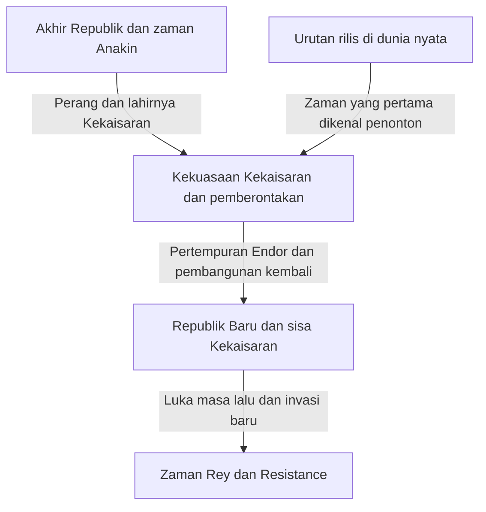
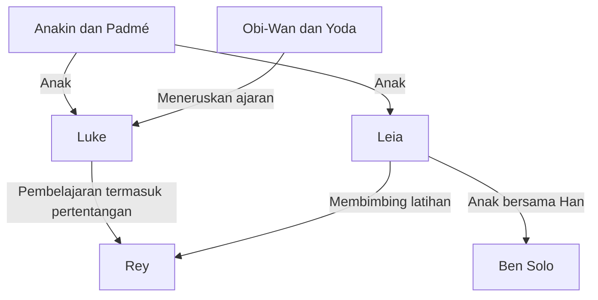

Jika dijelaskan dalam satu kalimat, Star Wars adalah kisah petualangan di sebuah galaksi yang jauh. Namun, di dalamnya bertumpuk cinta dan kebencian antara orang tua dan anak, runtuhnya demokrasi, perlawanan terhadap kekaisaran, agama dan kekuasaan, luka akibat perang, serta keluarga yang melampaui hubungan darah. Di balik layar juga terdapat sejarah pembuatan film yang mengubah miniatur, penyuntingan, musik, tata suara, dan grafika komputer.

Meskipun mengenal lightsaber atau Darth Vader, semakin banyak karya yang hadir, semakin sulit melihat keseluruhannya. Mengapa penayangan dimulai dari Episode IV? Jika Jedi adalah kesatria keadilan, mengapa mereka gagal melindungi Republik? Apa yang diwarisi dan diubah oleh kisah Anakin, Luke, dan Rey? Apa yang digambarkan Andor dan The Mandalorian sehingga keduanya lebih dari sekadar pelengkap film?

Artikel ini menelaah pertanyaan tersebut melalui tiga lapisan: cerita di dalam galaksi, hubungan antarkarya, dan sejarah produksi di dunia nyata. Ini bukan kamus yang mencatat seluruh detail latar, melainkan panduan panjang untuk memahami hubungan sebab-akibat dalam karya utama serta tema yang berulang sambil berubah. Sambil menunjukkan luasnya dunia yang bercabang, artikel ini menyediakan jalur agar pembaca baru pun tidak tersesat.

Pembahasan mengungkap akhir sembilan film saga dan karya terkait, identitas tokoh, kematian penting, serta pilihan mereka. Jika belum menonton dan ingin mempertahankan kejutan, bacalah terlebih dahulu pemetaan karya di awal dan panduan urutan menonton di akhir, kemudian kembali ke bab masing-masing karya setelah menontonnya. Tanggal acuan pemeriksaan isi dan status perilisan adalah 3 Oktober 2026. Ilustrasi merupakan seni konsep yang dihasilkan untuk artikel ini, bukan gambar adegan resmi maupun dokumentasi produksi.

## Tiga waktu yang perlu dibedakan: urutan rilis, sejarah di dalam cerita, dan urutan penciptaan latar

Alasan terbesar Star Wars mudah membingungkan adalah karena waktunya tidak berada pada satu garis. Film yang pertama kali dirilis pada 1977 kemudian ditempatkan sebagai Episode IV di dalam cerita. Penonton lebih dahulu mengenal petualangan Luke, lalu sejak 1999 menyaksikan masa muda ayahnya, Anakin. Peristiwa yang lebih tua di dalam cerita tidak selalu direkam lebih dahulu.

Urutan penciptaan latar oleh para pembuatnya merupakan hal lain lagi. Hubungan yang baru terungkap dalam karya kemudian dapat membuat adegan awal terlihat berbeda. Namun, hal itu tidak sama dengan menyatakan bahwa ketika film pertama dibuat, seluruh cerita untuk puluhan tahun berikutnya sudah ditentukan. Jangan menyimpulkan proses penciptaan sebuah karya yang berkembang hanya dengan menelusuri konsistensi hasil akhirnya ke belakang.

Membedakan ketiganya juga membantu menjelaskan kenikmatan menonton prekuel. Mengetahui akhir cerita tidak sekadar menghilangkan kejutan; kita dapat menontonnya sebagai tragedi sambil bertanya di mana pilihan berbeda masih mungkin diambil. Sebaliknya, urutan rilis memungkinkan kita mengalami waktu pengungkapan informasi mendekati pengalaman penonton pertama. Masing-masing memiliki nilai tersendiri; tidak ada satu jawaban benar untuk dijadikan perlombaan pengetahuan.

| Kelompok film | Tahun rilis pertama | Pertanyaan utama |
| --- | --- | --- |
| Episode IV, V, VI: trilogi orisinal | 1977, 1980, 1983 | Bagaimana melawan kekuasaan yang luar biasa besar dan menghadapi masa lalu keluarga? |
| Episode I, II, III: trilogi prekuel | 1999, 2002, 2005 | Mengapa Republik dan Anakin kehilangan hal yang hendak mereka lindungi? |
| Episode VII, VIII, IX: trilogi sekuel | 2015, 2017, 2019 | Bagaimana generasi berikutnya mewarisi kemenangan dan kegagalan generasi sebelumnya? |
| Rogue One dan Solo | 2016, 2018 | Bagaimana menggambarkan orang di pinggiran kisah utama dan pilihan masa lalu mereka? |
| Film bioskop The Clone Wars | 2008 | Bagaimana memperluas perang panjang melalui hubungan antarmanusia? |
| The Mandalorian and Grogu | 2026 | Bagaimana memikirkan perlindungan dan komunitas di galaksi setelah keruntuhan Kekaisaran? |

Tahun pada dasarnya merujuk pada perilisan bioskop pertama dan bisa berbeda dari tahun rilis di Jepang. Urutan rilis serta garis waktu umumnya dapat diperiksa dalam [panduan resmi film dan serial](https://www.starwars.com/news/star-wars-movies-and-series-guide). Antologi film pendek dapat mencakup beberapa zaman sekaligus; menempatkan judul acaranya pada satu titik garis waktu dapat menyesatkan.

Diagram ini merupakan kerangka untuk memahami karya audiovisual utama. Bukan berarti Kekaisaran lenyap dari setiap sudut galaksi setelah satu pertempuran. Kekalahan simbolis sebuah rezim dan perubahan organisasi militer, pemerintahan, kejahatan, serta cara berpikir masyarakat berlangsung dengan kecepatan berbeda. Banyak cerita turunan bertempat dalam kesenjangan waktu itu.

## Kanon dan Legends: cerita mana termasuk kesinambungan yang mana?

Kanon merupakan kerangka untuk memahami kesinambungan cerita resmi saat ini. Legends adalah kategori untuk menata banyak novel, komik, gim, dan karya lain yang berkembang sebelumnya. Pada 2014, Lucasfilm mengubah perlakuan terhadap Expanded Universe yang sudah ada dan mengumumkan pengembangan baru dengan film serta The Clone Wars sebagai poros. [Pengumuman resmi saat itu](https://www.starwars.com/news/the-legendary-star-wars-expanded-universe-turns-a-new-page) menjelaskan perubahan ini.

Menjadi Legends tidak berarti karya tersebut lenyap atau kehilangan nilai bacanya. Kita dapat membacanya sebagai kisah galaksi yang tumbuh pada zaman berbeda, dengan batasan serta kemungkinan berbeda. Sebaliknya, munculnya kembali nama atau gagasan dari karya lama dalam karya baru tidak otomatis memasukkan seluruh riwayat dan peristiwa lamanya ke kesinambungan baru. Justru ketika menemukan nama yang sama, kita perlu memastikan versi latar dari karya mana yang dimaksud.

Tidak semua karya resmi juga berbagi kesinambungan yang sama. Ada proyek seperti Visions yang mengeksplorasi kebebasan berekspresi di luar garis waktu yang sudah ada. Semua tindakan yang dapat dilakukan dalam gim pun belum tentu menjadi peristiwa cerita. Kadang kita perlu membedakan pilihan pemain dari peristiwa yang dijadikan landasan oleh sekuelnya.

Yang perlu dihindari adalah mengubah klasifikasi latar menjadi penilaian mutu karya. Kanon memberi petunjuk tentang hubungan antarkisah, bukan sistem untuk memberi angka pada kekuatan emosi. Penggambaran audiovisual, bahan resmi, pernyataan tokoh, dan penafsiran penonton merupakan jenis informasi yang berbeda. Penting pula untuk tidak menganggap penjelasan yang dipercaya seorang tokoh sebagai kebenaran mahatahu tentang seluruh dunia.

Artikel ini terutama menggunakan kesinambungan karya audiovisual utama saat ini, serta membedakan posisinya ketika membahas Legends atau proyek mandiri. Apa yang diperlihatkan juga dibedakan dari bagaimana kita dapat menafsirkannya. Misalnya, lembaga Jedi dapat dibaca secara kritis, tetapi analisis penonton itu tidak sama dengan sebuah ketentuan resmi yang menyangkal niat baik seluruh Jedi.

## Peta kecil tokoh untuk memasuki galaksi

Di pusatnya terdapat beberapa generasi yang mengelilingi keluarga Skywalker. Luke dan Leia adalah anak Anakin dan Padmé. Anak Leia dan Han adalah Ben Solo, yang kemudian memakai nama Kylo Ren. Namun, pewarisan cerita tidak dapat dijelaskan oleh hubungan darah saja. Ajaran, kegagalan, dan pilihan diteruskan dari Obi-Wan dan Yoda kepada Luke, dari Anakin kepada Ahsoka, lalu kepada generasi berikutnya termasuk Rey.

R2-D2 dan C-3PO melintasi sejarah itu dari posisi berbeda dibandingkan manusia. Chewbacca, Lando, dan kawan-kawan Pemberontakan menghubungkan persoalan batin satu keluarga dengan perjuangan seluruh galaksi. Serial kemudian memperlihatkan waktu kehidupan orang-orang yang jauh dari pusat kepahlawanan, seperti Cassian, Din Djarin, Grogu, dan para klon.

Jika garis keluarga dan garis guru-murid dilihat terpisah, cerita galaksi tampak bukan sekadar silsilah keluarga kerajaan. Pertanyaannya bukan hanya apa yang diwarisi, tetapi bagaimana warisan itu digunakan dan apa yang ditolak. Sekarang mari melihat fungsi setiap karya, dimulai dari trilogi yang pertama kali membawa penonton memasuki galaksi ini.

## Episode IV, A New Hope — Politik galaksi memasuki kehidupan seorang pemuda

Film pertama yang dirilis pada 1977 dimulai di tengah sejarah dunianya. Tanpa mengetahui rincian terbentuknya Kekaisaran, penonton melihat sebuah kapal kecil dikejar kapal perang raksasa. Perbandingan ukuran saja sudah memperlihatkan ketimpangan kekuatan pengejar dan yang dikejar. Pembukaan film ini tidak menjelaskan seluruh latar sebelum menggerakkan cerita, tetapi memberikan informasi yang dibutuhkan untuk memahami peristiwa melalui tindakan tokoh. Tanggal rilis dan posisi dasar ceritanya juga dapat diperiksa di [halaman resmi film](https://www.starwars.com/films/star-wars-episode-iv-a-new-hope).

### Petualangan tidak dimulai dari kesadaran sebagai orang terpilih

Luke Skywalker, yang hidup di pertanian Tatooine, pada awalnya tidak bermaksud menyelamatkan galaksi. Ia seorang pemuda yang ingin melarikan diri dari sempitnya keseharian. Namun, droid yang datang ke rumahnya membawa informasi Pemberontakan, dan pesan permintaan bantuan Leia menuntunnya kepada Obi-Wan Kenobi yang bersembunyi. Selama pertentangan politik hanya menjadi berita di tempat jauh, Luke masih dapat kembali ke pertanian. Batas itu runtuh ketika kekerasan Kekaisaran merenggut keluarga yang membesarkannya.

Hubungan sebab-akibat ini penting. Luke bukan terlibat dengan Kekaisaran karena memilih petualangan; justru kehidupan yang berusaha tetap tidak terkait dengan kekuasaannya dihancurkan. Selain kisah pertumbuhan pribadi, ini juga proses kekerasan penguasa yang memasuki kehidupan di pinggiran. Namun, kesedihan saja tidak menjadikannya pahlawan. Dengan bertemu guru dan sahabat, mempelajari cara bertindak, serta memakai kemampuan untuk membantu orang lain, keinginan awalnya memperoleh makna bagi masyarakat.

Leia memang diselamatkan, tetapi bukan tokoh yang hanya menunggu penyelamatan. Ia menyembunyikan informasi, bertahan dalam interogasi, dan menentukan tindakan saat melarikan diri. Di fasilitas yang dimasuki Luke dan Han untuk menolongnya, justru Leia menutupi kekurangan mereka. Karena peran tidak tetap, ketiganya tidak terperangkap dalam hubungan sederhana antara pahlawan, pembantu, dan hadiah; mereka menjadi kelompok yang saling menggoyahkan penilaian.

### Death Star adalah meriam sekaligus gagasan tentang pemerintahan

Kengerian Death Star tidak berhenti pada daya tembak yang dapat menghancurkan planet. Di belakangnya ada gagasan untuk meniadakan kebutuhan akan perundingan sehari-hari dan sistem perwakilan dengan mempertontonkan kekuatan. Pembubaran Senat berkaitan dengan pemikiran untuk menundukkan sistem-sistem bintang lewat ketakutan. Penghancuran Alderaan melampaui penaklukan pangkalan militer: ia mengancam setiap orang yang mempertimbangkan perlawanan.

Pemberontakan tidak memiliki senjata berskala sama. Mereka membaca rancangan, menemukan kelemahan kecil, dan memusatkan kekuatan terbatas. Syarat kemenangan adalah tersambungnya pekerjaan droid pembawa informasi, orang yang menitipkan rancangan, analis, dan teknisi pesawat tempur. Luke memang melancarkan serangan penentu, tetapi kerja sama sosial membuat serangan itu mungkin. Jika struktur ini diabaikan, film akan tampak sebagai kisah sederhana tentang satu individu berdarah istimewa yang menyelesaikan semuanya.

Kembalinya Han juga bagian dari kerja sama tersebut. Orang yang sebelumnya bertindak berdasarkan uang kini menolong sahabat meskipun mengetahui risikonya. Saat Luke percaya kepada Force alih-alih mengandalkan alat bidik saja, dan saat Han berhenti memutuskan berdasarkan bayaran saja, keduanya dapat dibaca sebagai peralihan menuju kepercayaan yang melampaui untung-rugi yang terlihat. Ini bukan seruan membuang teknologi. Pesawat, komunikasi, dan rancangan tetap dibutuhkan; pertanyaannya adalah apa yang ditambahkan pada keputusan terakhir.

Perhatikan pula bagaimana sejarah galaksi hadir melalui mesin yang perlu diperbaiki dan persoalan biaya hidup. Falcon bukan kendaraan ideal yang sekadar cepat, melainkan kapal yang susah payah dioperasikan pemiliknya. Pengunjung kantina tidak hanya ada untuk memberi penjelasan kepada protagonis, dan droid menjalani kehidupan sebagai barang yang diperjualbelikan. Karena berbagai hal tampak berlangsung di luar pusat gambar, penonton merasakan dunia yang sudah lama berjalan meskipun tidak mengetahui semuanya.

## Episode V, The Empire Strikes Back — Kekalahan meruntuhkan pemahaman sang pahlawan tentang dirinya

Kemenangan sebelumnya tidak berarti Kekaisaran lenyap. Pemberontakan masih melarikan diri dan tidak mampu mempertahankan pangkalan Hoth. Film ini dimulai dari kenyataan bahwa menghancurkan senjata raksasa saja tidak menghapus lembaga maupun tentaranya. Dirilis pada 1980, film ini menjalankan latihan Luke dan pelarian Han beserta kawan-kawan secara paralel. [Halaman resmi film](https://www.starwars.com/films/star-wars-episode-v-the-empire-strikes-back)

### Latihan menguji lebih dari kemampuan mengangkat batu

Ketika bertemu Yoda di Dagobah, Luke mendapati penampilan dan perilaku yang tidak sesuai harapannya tentang seorang guru besar. Ia melihat makhluk kecil yang aneh dan tidak segera mengenali kebijaksanaannya. Perangkat ini juga bekerja pada penonton. Pembelajaran Force dimulai dengan meruntuhkan kebiasaan menghubungkan kekuatan dengan tubuh besar atau ukuran senjata.

Dalam adegan gua, wajah Luke sendiri muncul di balik topeng Vader yang dikalahkannya. Film tidak memastikan bahwa gambaran itu sekadar rekaman masa depan. Ia dapat dibaca sebagai peringatan: mengikuti ketakutan dan kemarahan terhadap musuh dapat membuat seseorang menjadi serupa dengan musuhnya. Jika sebelumnya masalahnya adalah mengalahkan musuh eksternal bernama Kekaisaran, kini batin orang yang ingin mengalahkan musuh itu turut diperiksa.

Luke menghentikan latihan setelah melihat penglihatan tentang penderitaan sahabatnya. Tidak mudah menyatakan keputusan ini sepenuhnya benar karena berangkat dari kebaikan, atau sepenuhnya salah karena ia belum matang. Kita memahami keinginannya untuk tidak meninggalkan sahabat, tetapi ia keliru menilai batas kemampuan dan informasinya. Terlebih lagi, Vader menggunakan emosi itu untuk memancingnya. Niat baik tidak meniadakan kebutuhan untuk menilai keadaan.

### Kesepakatan Lando dan batas kompromi dengan penguasa

Lando di Cloud City membuat kesepakatan dengan Kekaisaran demi melindungi kotanya. Namun, ketika penguasa dapat mengubah janji secara sepihak, kontrak saja tidak menjamin keselamatan. Memenuhi satu syarat mendatangkan tuntutan berikutnya. Kegagalannya bukan hanya pengkhianatan watak, tetapi juga kegagalan politik dalam mempertahankan otonomi di bawah ancaman kekerasan luar biasa.

Meski demikian, orang yang pernah salah tidak harus terus salah sampai akhir. Lando bergerak menyelamatkan mereka. Luke gagal, Lando berkhianat, dan Han tertangkap, tetapi nilai seorang tokoh tidak ditentukan hanya oleh tingkat keberhasilannya pada satu saat. Kemampuan memperbaiki tindakan, meminta bantuan, dan menjawab permintaan bantuan tetap menjadi ukuran selain kemenangan.

Pengakuan bahwa Vader adalah ayah Luke tidak dimaksudkan untuk menghapus kategori baik dan jahat. Kekerasan Kekaisaran tidak menjadi sah. Yang hancur adalah sejarah keluarga yang rapi dalam pikiran Luke: dirinya anak seorang ayah baik, sedangkan musuh adalah orang lain yang membunuh ayahnya. Skema mengalahkan musuh untuk mendekati sang ayah berubah menjadi pertanyaan sulit tentang bagaimana menghadapi musuh agar dapat menerima warisan ayahnya.

Luke bukan pemenang di akhir duel. Tubuhnya terluka, ia tidak dapat melarikan diri sendiri, dan Leia beserta yang lain menyelamatkannya. Diselamatkan oleh orang yang ia selamatkan dalam film pertama menolak gagasan tentang pahlawan yang terisolasi. Kemandirian bukan berarti tidak bergantung pada siapa pun; ia juga berarti kembali ke dalam hubungan sambil membawa kekeliruan dan kelemahan. Dalam arti ini, akhir yang suram berfungsi lebih dari sekadar menunda penyelesaian sampai film berikutnya.

Bentangan putih Hoth, ketertutupan lembap Dagobah, serta wajah luar Cloud City yang cerah dan bagian dalamnya yang gelap bukan sekadar latar wisata. Sensasi tempat mendukung kekalahan militer, perjalanan ke batin, dan runtuhnya keselamatan semu. Setiap perpindahan membuat tindakan yang dikuasai protagonis tidak lagi cukup. Pengalaman menang dalam pesawat tempur tidak menjawab persoalan latihan, perundingan, atau percakapan dengan ayah.

Seni konsep hasil generasi. Ilustrasi ini menampilkan ketimpangan kekuatan antara pemberontakan dan kekaisaran, bukan gambar adegan film resmi.

## Episode VI, Return of the Jedi — Menyelamatkan ayah dan mengalahkan Kekaisaran

Penutup trilogi pada 1983 dimulai dengan penyelamatan Han, lalu menumpangkan pemulihan hubungan pribadi pada pertempuran berskala galaksi. Di istana Jabba, Luke lebih tenang daripada pemuda pada film pertama dan lebih percaya diri menggunakan kekuatannya. Namun, penampilan itu belum membuktikan kedewasaannya sebagai Jedi. Ujian terakhir adalah apa yang ia lakukan ketika mampu menang. [Halaman resmi film](https://www.starwars.com/films/star-wars-episode-vi-return-of-the-jedi)

### Perangkap Kaisar mengincar kemarahan lebih daripada kematian

Sambil berusaha memusnahkan Pemberontakan secara militer, Kaisar hendak menarik Luke ke pihaknya. Ia menunjukkan bahaya yang dihadapi sahabat Luke, memancing serangan karena marah, lalu mendorong emosi itu sampai Luke membunuh ayahnya. Sekalipun Luke mengalahkan Vader, Kaisar menang jika Luke menerima logika kekuasaan yang sama. Karena itu, hasil pertarungan dan keberhasilan etis dapat berbalik arah dalam duel ini.

Luke mengamuk ketika Leia diancam dan mengungguli Vader. Ketika membandingkan tangan mesin ayahnya dengan tangannya sendiri, penglihatan di gua kembali sebagai pilihan konkret. Membuang senjata bukan keputusan tanpa kekerasan yang diambil karena situasinya aman. Ia menerima kemungkinan dibunuh dan menolak membunuh ayahnya. Ia meninggalkan ukuran yang menuntut penghancuran musuh sebagai bukti kekuatan.

Vader memilih melawan Kaisar setelah melihat penderitaan putranya. Ada penebusan di sini, tetapi tidak ada penjelasan bahwa kejahatan masa lalu terhapus. Kepercayaan seorang anak pada kebaikan ayahnya berbeda dari kewajiban korban memaafkan pelaku. Film menggambarkan perubahan terakhir dalam hubungan ayah dan anak, bukan menyelesaikan seluruh tanggung jawab hukum dan ingatan sejarah. Dengan membedakannya, kita dapat memahami batas akhir cerita tanpa merusak daya emosionalnya.

### Mengapa pertempuran hutan sama pentingnya dengan ruang takhta

Jika hanya mengambil konfrontasi dengan Kaisar, dunia tampak digerakkan oleh masalah satu keluarga saja. Padahal, tanpa pasukan darat di Endor mematikan perisai, armada tidak dapat menghancurkan Death Star kedua. Luke menyelamatkan ayahnya dan Pemberontakan menghancurkan fasilitas militer merupakan dua pekerjaan yang sama-sama diperlukan. Yang satu tidak otomatis menggantikan yang lain.

Ewok membawa pengetahuan medan dan cara bertempur lain ke operasi bersama itu. Kekaisaran unggul dalam zirah dan daya tembak, tetapi tidak memperlakukan penduduk setempat sebagai pelaku yang patut diperhitungkan. Kesombongan itu membuatnya salah membaca perlawanan yang memanfaatkan medan dan penyergapan. Tentu ini bukan hukum bahwa senjata sederhana selalu mengalahkan militer maju dalam perang nyata. Sebagai fabel, ia memperlihatkan kelemahan penguasa yang meremehkan penilaian dan solidaritas pihak kecil.

Luke, Han, Leia, Lando, Chewbacca, droid, prajurit tanpa nama, dan penduduk Endor: berbagai pekerjaan mereka akhirnya bertemu, sehingga perayaan bukan penobatan satu orang. Akhirnya juga memperlihatkan Luke kembali ke komunitas setelah kehilangan ayahnya. Kehilangan pribadi dan kemenangan publik hadir bersamaan; kebahagiaan film ini bukan akhir sempurna yang tidak menyisakan luka.

Kekalahan Kaisar juga menunjukkan kegagalan perkiraannya bahwa semua orang akan terus bergerak berdasarkan untung-rugi dan ketakutan. Sang anak yang tidak meninggalkan kepercayaan pada ayahnya, serta ayah yang memilih putranya daripada kepatuhan kepada penguasa, berada di luar perhitungannya. Besarnya kemampuan Force tidak cukup untuk meramalkan pilihan manusia secara sempurna. Di sini, terlalu percaya pada ukuran senjata sejajar dengan keyakinan berlebihan bahwa seseorang telah membaca seluruh isi hati manusia.

## Episode I, The Phantom Menace — Kekaisaran tidak sejak awal berwajah kekaisaran

Prekuel yang dirilis pada 1999 tidak dimulai dari kediktatoran militer yang jelas seperti film pertama, tetapi dari konflik di dalam Republik. Blokade Naboo oleh Federasi Dagang merupakan perselisihan perdagangan dan perpajakan yang berubah menjadi pendudukan bersenjata. Ratu muda Padmé Amidala berharap pengaduannya kepada parlemen akan membuat fakta diakui dan bantuan diberikan. Namun, lembaga itu berhenti pada penyelidikan dan prosedur; kecepatan pengambilan keputusan tidak sejalan dengan penderitaan di lapangan. [Halaman resmi film](https://www.starwars.com/films/star-wars-episode-i-the-phantom-menace)

### Palpatine meraih dukungan sebagai penyelesai krisis

Bagi penonton yang mengetahui sejarah selanjutnya, nasihat Senator Palpatine dari Naboo memiliki dua wajah. Ia mendekati pihak yang menjadi korban dan memanfaatkan ketidakpercayaan kepada pemimpin yang tampak tidak cakap. Yang penting, ia tidak masuk dari luar parlemen dan menghancurkan Republik dengan satu pukulan. Ia menaikkan kedudukannya menggunakan prosedur parlemen dan harapan masyarakat.

Pihak musuh pun tidak seragam. Federasi Dagang mengejar kepentingannya sendiri, tetapi Darth Sidious memakainya sebagai alat dalam rencana lebih besar. Walaupun konflik di permukaan diselesaikan, pergeseran kekuasaan yang dihasilkannya tetap ada. Pembebasan Naboo merupakan kemenangan nyata, tetapi belum tentu kemenangan bagi masa depan seluruh Republik. Kegelisahan masih terasa dalam perayaan karena kedua ukuran ini tidak sejalan.

Adegan Padmé meminta kerja sama Gungan memperlihatkan politik yang berlawanan. Alih-alih mempertahankan wibawa sebagai wakil rakyat, ia mengakui hubungan mereka sebagai penghuni planet yang sama dan meminta pertolongan. Ini bukan hanya menutupi kekurangan kekuatan militer; kelompok yang sebelumnya berjarak membentuk tujuan bersama. Solidaritas kecil itu melahirkan kemampuan bertindak konkret yang tidak diperoleh di parlemen.

### Lihat kehidupan Anakin sebelum bakatnya

Anakin kecil memiliki kemampuan menerbangkan kendaraan yang luar biasa, tetapi ia juga seorang budak. Dalam dunia dengan Republik besar dan Jedi yang berbicara tentang keadilan, kebebasan ibu dan anak ini tidak terjamin. Fakta tersebut menunjukkan perbedaan antara keberadaan lembaga dan jangkauan perlindungannya ke setiap wilayah. Qui-Gon dapat membebaskan Anakin, tetapi tidak mampu menyelamatkan ibunya, Shmi, dengan cara yang sama.

Keberangkatan Anakin menyatukan kebahagiaan karena kemampuannya diakui dengan ketakutan meninggalkan ibunya. Jika Anakin kemudian hanya dianggap orang lemah yang gagal mengatasi rasa takut, kondisi yang melahirkan ketakutan itu terabaikan. Di sisi lain, masa kecil yang keras tidak menjadikan kekerasannya kelak sesuatu yang tak terelakkan. Cerita membuka pertanyaan tentang dukungan dan pendidikan yang dibutuhkan seseorang yang membawa luka.

Kematian Qui-Gon membuat guru yang menemukan Anakin tidak dapat membimbingnya dalam waktu panjang. Obi-Wan meneruskan janji itu, tetapi hubungan mereka tidak terbentuk sempurna sejak awal. Ramalan besar dan harapan lembaga mulai bergerak lebih cepat daripada perkembangan seorang anak. Ketimpangan ini menyiapkan tragedi seluruh prekuel.

Dari sisi produksi, menyebut prekuel sebagai film yang seluruhnya dibuat dengan komputer juga tidak tepat. Pembahasan resmi produksi memperkenalkan akal-akalan fisik, termasuk penggunaan kapas bertangkai berwarna pada miniatur penonton podrace. Memahami gambar sebagai hasil gabungan teknologi baru dan kerja tangan lebih mendekati kenyataan. [Trivia produksi resmi](https://www.starwars.com/news/25-fun-facts-the-phantom-menace)

Pertempuran akhir yang berlangsung di beberapa tempat membantu membedakan peran tiap kelompok. Pengalihan perhatian oleh Gungan, aksi di istana, pertempuran antariksa, dan duel Jedi melawan Sith masing-masing menyelesaikan masalah berbeda. Pendudukan tidak selesai hanya karena ada satu pendekar kuat. Terlebih lagi, hilangnya Qui-Gon di balik keberhasilan militer memperlihatkan bahwa kemenangan komunitas tidak identik dengan keuntungan bagi kehidupan seorang anak.

## Episode II, Attack of the Clones — Persiapan perang mempersempit pilihan

Dalam bagian kedua pada 2002, kelompok Separatis yang ingin meninggalkan Republik membesar, dan pembentukan tentara menjadi persoalan politik. Penyelidikan percobaan pembunuhan Padmé membawa Obi-Wan menemukan tentara klon. Di hadapan Republik yang masih membicarakan persiapan menghadapi krisis, muncul tentara yang sudah selesai dibentuk. Kegentingan keamanan bertemu kemudahan yang asal-usulnya tidak jelas. [Halaman resmi film](https://www.starwars.com/films/star-wars-episode-ii-attack-of-the-clones)

### Misteri yang perlu diselidiki disalip kebutuhan perang

Bagaimana tentara klon dipesan, dan untuk kepentingan siapa mereka dibuat, semestinya menjadi pertanyaan prioritas. Namun, ketika tentara musuh sudah di depan mata, orang menginginkan kekuatan yang segera dapat digunakan. Krisis mengubah keputusan dengan merampas waktu untuk memeriksa. Tentara itu diterima bukan karena sudah diperiksa memadai, tetapi dalam keadaan yang membuat alternatif seolah tidak tersedia.

Kritik Dooku terhadap Republik mencakup masalah nyata berupa korupsi lembaga. Akan tetapi, kemampuan menunjukkan masalah dengan tepat tidak menjamin keadilan solusi yang ditawarkan. Karena ia sendiri terlibat dalam rencana Sith, kekecewaan terhadap Republik tidak langsung membawa pembebasan. Pertentangan terbuka kedua kubu perlu dibedakan dari posisi Sidious yang memanfaatkannya.

Jedi pun pergi ke medan perang demi menjaga perdamaian, lalu beralih menjadi jenderal yang memimpin tentara. Ada paradoks bahwa keberhasilan operasi penyelamatan sekaligus memulai perang. Tindakan melindungi nyawa saat ini berdampingan dengan dampak penguatan tatanan militer dalam jangka panjang. Cara yang dipilih demi tujuan baik mengubah sifat organisasi itu sendiri.

### Hasrat mengendalikan yang menghubungkan cinta dan politik

Hubungan Anakin dan Padmé dihalangi kedudukan, tugas, serta aturan Jedi. Pernikahan rahasia melindungi cinta mereka, tetapi sekaligus mempersempit jangkauan nasihat dan dukungan yang dapat diterima. Karena semakin sedikit orang dapat diajak berbagi kesulitan, ketakutan yang kemudian membesar menjadi sulit diperiksa dari luar.

Setelah kehilangan ibunya, Anakin membunuh orang-orang di permukiman Tusken, termasuk anak-anak. Adegan ini tidak boleh dilewati sekadar sebagai gambaran besarnya kemarahan. Di sini terjadi kegagalan etis yang jelas: pengalaman kekerasan terhadap orang tercinta berubah menjadi pembenaran kekerasan terhadap orang lain yang tidak terkait. Kesedihan dapat dipahami, tetapi tindakan tetap membawa tanggung jawab. Kejatuhan berikutnya bukan perubahan arah mendadak; batas penting sudah dilanggar di sini.

Pandangan politik Anakin bahwa seorang pemimpin kuat boleh mengambil keputusan asalkan menghasilkan sesuatu yang baik juga bergaung dengan keinginannya mengendalikan kehilangan dalam hubungan intim. Sulit menerima bahwa orang memiliki kehendak berbeda, dan orang tercinta pun menjalani kehidupan di luar kendali kita. Namun, jika ketidakpastian hendak dihapus dengan paksaan, hubungan yang ingin dilindungi justru rusak. Masalah ini mencapai bentuk ekstrem dalam film berikutnya.

Penampilan tentara klon yang seragam juga menimbulkan kegelisahan karena manusia diperlakukan sebagai kekuatan tempur yang dapat dipertukarkan. Sekalipun asal mereka sama, nyawa mereka tidak boleh dihitung seakan satu benda yang sama. Film lebih dahulu menanamkan kesan tentang kemunculan tentara besar; karya kemudian mendalami kepribadian setiap prajurit. Dengan memperhatikan urutan ini, tentara yang tampak menyelamatkan Republik dapat dilihat kembali melalui pertanyaan: siapa menanggung biaya penyelamatan itu?

## Episode III, Revenge of the Sith — Keinginan menyelamatkan berubah menjadi logika dominasi

Dalam bagian ketiga pada 2005, Republik runtuh ketika Perang Klon mendekati akhir. Berlawanan dengan harapan bahwa kemenangan akan mengembalikan perdamaian, kekuasaan yang dipusatkan demi menjalankan perang menjadi dasar kediktatoran setelahnya. Kejatuhan Anakin dan Republik berjalan bersamaan, sehingga tragedi film ini tidak dapat direduksi hanya menjadi kelemahan batin individu ataupun kegagalan lembaga. [Halaman resmi film](https://www.starwars.com/films/star-wars-episode-iii-revenge-of-the-sith)

### Palpatine menjual janji untuk menguasai kematian

Anakin takut pada masa depan ketika ia kehilangan Padmé. Palpatine tidak langsung menyangkal ketakutan itu, tetapi menyiratkan adanya kekuatan yang tidak bisa didapat di tempat lain. Ini lebih cerdik daripada sekadar mengajarkan doktrin jahat. Ia mengenali hal yang paling tidak ingin dilepaskan lawannya dan membuat dirinya tampak mutlak diperlukan untuk melindunginya. Semakin kuat ketergantungan, semakin mudah penjelasan yang bertentangan dan tuntutan kriminal diterima.

Ketidakpercayaan juga tumbuh antara Dewan Jedi dan Anakin. Anakin merasa tidak diakui, sedangkan Dewan mencurigai kedekatannya dengan Palpatine. Ia bahkan diberi peran mata-mata, sehingga arah kesetiaannya terbelah. Namun, menjelaskan keadaan ini berbeda dari membebaskannya dari tanggung jawab. Setelah menghalangi Mace Windu demi melindungi Palpatine, Anakin mengikuti perintah yang semakin menghancurkan.

Setelah melakukan kesalahan besar, seseorang terkadang lebih ingin memilih jalan yang membuat kesalahan itu terasa bermakna daripada berbalik arah. Tindakan Anakin juga dapat dibaca sebagai rangkaian pembenaran diri. Karena sudah bertindak sejauh ini, semuanya akan sia-sia jika ia gagal mendapatkan kekuatan. Pikiran itu membuat kekerasan berikutnya terlihat sebagai pengorbanan yang diperlukan.

### Order 66 membalik arah daya bunuh yang sudah ada di dalam lembaga

Yang menyerang Jedi bukan tentara musuh baru dari kejauhan, melainkan prajurit yang bertempur bersama mereka. Ketika rantai komando militer berbalik, penempatan pasukan dan kepercayaan yang berasumsi bahwa mereka sekutu menjadi kelemahan. Film memperlihatkan perintah dan serangan serentak; rincian mekanisme pengendalian klon dilengkapi dalam animasi terkait. Membedakan penjelasan dalam film dari tambahan kemudian memperjelas peran masing-masing karya.

Kekaisaran juga tidak lahir pada saat seluruh bangunan republik dihancurkan. Ia diumumkan sebagai tatanan baru di ruang sidang. Di bawah kata-kata tentang pemulihan keamanan, pengawasan dan kekerasan dimasukkan ke pemerintahan permanen. Dengan menggambarkan Jedi yang menentang sebagai pengkhianat, perlawanan terhadap pemusatan kekuasaan ditafsirkan ulang sebagai serangan terhadap ketertiban.

Di Mustafar, Anakin melakukan kekerasan terhadap Padmé yang semula ingin diselamatkannya. Ketika Padmé tidak setuju, ia menafsirkannya sebagai pengkhianatan alih-alih menghormati kehendaknya. Pada saat itu, perbedaan cinta dan keinginan memiliki menjadi jelas. Masa depan yang diinginkannya tidak hanya membutuhkan Padmé tetap hidup, tetapi juga Padmé yang membenarkan pilihannya.

Adegan tubuh Anakin yang terbakar dibungkus zirah dan kelahiran si kembar menampilkan keputusasaan bersama kemungkinan baru. Obi-Wan dan Yoda bukan pemenang. Namun, melindungi anak-anak menjadi masa depan yang masih dapat disisakan di tengah kekalahan politik. Prekuel selesai bukan sebagai cerita tentang kejahatan menang karena orang baik habis, melainkan tentang gabungan niat baik, ketakutan, lembaga, dan ambisi yang melahirkan malapetaka.

Duka Obi-Wan pun jauh dari kepuasan menemukan dan mengalahkan orang jahat. Ia harus melawan seseorang yang dipandang seperti adik, sementara pertanyaan tentang pendidikan dan penilaiannya sendiri tetap tertinggal. Karena itu, panjangnya duel mereka dapat dilihat bukan hanya sebagai perbandingan keterampilan, melainkan penderitaan dua orang yang saling mengenal tetapi tidak mampu memutus hubungan. Bahkan pihak yang menang tidak memiliki tempat untuk bergembira atas kemenangannya.

## Episode VII, The Force Awakens — Generasi yang tidak mengenal pahlawan dahulu menerima warisan masa lalu

Dalam bab baru pada 2015, pahlawan Pemberontakan bagi Rey dan Finn sudah setengah menjadi legenda. Nama yang akrab bagi penonton memiliki jarak bagi tokoh muda. Perbedaan ini menempatkan ingatan penonton lama dan keterkejutan pendatang baru dalam layar yang sama. Kemunculan First Order di dunia setelah Kekaisaran menunjukkan bahwa kemenangan dahulu saja tidak menjamin keselamatan generasi berikutnya. [Halaman resmi film](https://www.starwars.com/films/star-wars-episode-vii-the-force-awakens)

### Finn menjadi protagonis dengan terlebih dahulu menolak perintah

Titik awal Finn bukan garis keturunan unggul atau ramalan. Ketika dituntut patuh sebagai prajurit, ia menolak membunuh. Pilihan ini mulai mengubahnya dari sekadar nomor dalam organisasi menjadi orang yang menentukan tindakannya sendiri. Namun, tekad menyelamatkan seluruh galaksi tidak langsung lengkap; mula-mula keinginannya melarikan diri juga kuat. Film memperlihatkan bukan orang yang baru berbuat baik setelah ketakutannya hilang, melainkan proses bertahan demi seseorang sambil tetap merasa takut.

Di Jakku, Rey mempelajari keterampilan untuk bertahan hidup sambil menunggu keluarga yang mungkin kembali. Kemandekannya bukan karena kurang mampu, tetapi karena harapan terhadap masa lalu. Meninggalkan rumah tidak sekadar pindah planet. Ia bergerak dari harapan bahwa terus menunggu akan mengembalikan kehidupan lama menuju kemungkinan membentuk hubungan baru sendiri.

### Kylo Ren menginginkan citra Vader lebih daripada kekuatannya

Ben Solo berusaha membentuk ulang dirinya sebagai Kylo Ren. Ia memuja kakeknya, Vader, tetapi tindakan sang kakek yang akhirnya menyelamatkan putranya tidak cocok dengan citra kejahatan kuat yang dicarinya. Orang terkadang tidak mewarisi masa lalu apa adanya, tetapi memilih bagian yang mereka butuhkan. Kylo menunjukkan bahwa pewarisan sejarah juga dapat berupa salah tafsir.

Pembunuhan Han bukan sekadar penjahat tenang yang menyingkirkan penghalang. Kylo berusaha membentuk ulang dirinya, percaya bahwa memutus ikatan keluarga akan membuatnya kuat. Namun, melakukan kekerasan belum tentu mengakhiri konflik batin. Tindakan untuk menghapus kegamangan justru menimbulkan luka baru. Sementara cerita Rey bergerak menuju terbentuknya hubungan dengan orang lain, Kylo mencoba memantapkan dirinya dengan memutus hubungan.

Kemiripan struktur dengan film pertama, seperti Starkiller Base dan droid pembawa peta, terlihat jelas. Kita bisa menikmatinya sebagai nostalgia atau mengkritiknya sebagai pengulangan struktur. Namun, analisis akan lebih bermanfaat jika tidak berhenti pada kemiripan dan melihat perbedaan pilihan tokoh dalam posisi yang sama. Bekas prajurit Kekaisaran menjadi protagonis, gadis yang menunggu pertolongan melawan sendiri, dan putra pahlawan menjadi musuh. Dalam garis besar yang serupa, kegelisahan tentang pewarisan berpindah ke pusat cerita.

Penghancuran pusat Republik Baru memperlihatkan rapuhnya tatanan politik dengan kuat. Namun, karena film tidak banyak menggambarkan keseharian tatanan tersebut, penonton juga dapat kesulitan memahami wujud konkret kehilangannya. Ini bisa dicatat sebagai keterbatasan penyampaian film. Pengetahuan karya terkait menambah bobotnya, tetapi seluruh kesulitan tidak patut dibebankan pada kurangnya pemahaman penonton yang belum mengenalnya. Jumlah informasi yang disampaikan karya itu sendiri memengaruhi pengalaman menonton.

## Episode VIII, The Last Jedi — Mengakui kegagalan tanpa meninggalkan tanggung jawab

Bagian kedua pada 2017 meruntuhkan harapan bahwa persoalan akan selesai setelah Rey bertemu Luke. Luke telah menarik diri dari kembali berdiri sebagai pahlawan. Sementara itu, Resistance terus dikejar dan harus memutuskan cara bertahan dengan sumber daya terbatas. Film ini sekaligus meninjau ulang citra pahlawan individu dan cara memimpin organisasi. [Halaman resmi film](https://www.starwars.com/films/star-wars-episode-viii-the-last-jedi)

### Apakah pengakuan kesalahan menjadi alasan menyerah atas segalanya?

Masa lalu Luke dan Ben diceritakan dari sudut berbeda. Ketakutan sesaat yang dirasakan Luke dan kengerian Ben ketika melihatnya memberi makna berbeda pada adegan sama. Ini bukan relativisme yang menyatakan fakta tidak ada, melainkan perbedaan antara apa yang dipikirkan seseorang dan apa yang sungguh dialami orang lain. Penjelasan bahwa itu hanya sesaat dan kemudian disesali tidak menghapus luka yang ditimbulkan.

Luke menghubungkan kegagalannya dengan kegagalan seluruh Jedi dan berusaha mengakhiri tradisi itu. Kritik terhadap sejarah Jedi layak dipikirkan, tetapi jika kritik hanya membenarkan ketidakhadirannya, ia menjauh dari tanggung jawab terhadap orang yang kini menderita. Di antara menjaga tradisi tanpa syarat dan membuang semuanya karena pernah gagal, diperlukan jalan untuk belajar lalu meneruskannya dalam bentuk baru.

Rey dan Kylo menyentuh kemungkinan saling memahami, tetapi pemahaman berbeda dari persetujuan. Kesepian yang sama tidak mewajibkan penerimaan terhadap tatanan yang mendominasi orang lain. Kylo juga tidak otomatis berpihak pada kebaikan setelah mengalahkan Snoke. Membunuh penguasa berbeda dari menolak sistem kekuasaannya; ia justru mencoba duduk di kursi yang kosong.

### Keberanian dan kepemimpinan memiliki ukuran waktu berbeda

Poe berani menghancurkan musuh di depan mata, tetapi harus belajar menghitung personel dan kekuatan yang hilang demi keberhasilan itu. Hasil mencolok dalam satu pertempuran berbeda dari mempertahankan organisasi sampai esok. Bagi seorang pemimpin, memutuskan tidak menyerang atau mundur juga merupakan tanggung jawab.

Di sisi lain, pertentangannya dengan Holdo juga menyangkut kesulitan berbagi informasi. Penonton mengalami keadaan ketika pengetahuan masing-masing pihak tidak selaras. Menyimpulkan begitu saja bahwa bawahan harus diam dan patuh terlalu sempit. Melihatnya sebagai benturan kerahasiaan, kepercayaan, kewenangan komando, dan kurangnya penjelasan dalam krisis memungkinkan kelebihan serta kekurangan para tokoh terlihat bersama.

Bagian Canto Bight memperlihatkan bahwa kemakmuran yang tampak berada di luar perang tetap terkait dengannya melalui senjata dan eksploitasi. Finn bergerak dari keinginan melindungi sahabat tertentu menuju pemahaman makna perlawanan yang lebih luas. Namun, pihak pengeksploitasi yang berbisnis dengan kedua kubu bukan bukti bahwa tujuan politik kedua kubu sama. Kritik terhadap struktur keuntungan perlu dibedakan dari penyamaan invasi dan perlawanan.

Pada akhirnya, Luke tidak membantai pasukan musuh, tetapi memberikan waktu kepada sahabatnya untuk bertahan. Orang yang membenci legenda menerima daya harapan yang dimilikinya, lalu menarik perhatian musuh dengan cara yang berbeda dari kemenangan fisik. Film dapat dibaca sebagai kisah yang dimulai dengan meruntuhkan citra pahlawan dan berakhir dengan memilih kembali cara menggunakan citra tersebut.

Rey tidak hanya meminta keterampilan kepada Luke, tetapi juga jawaban dari luar yang memastikan siapa dirinya. Namun, guru pun manusia dengan kesalahan dan ketakutan. Setelah mengetahui ketidaksempurnaan orang yang diandalkan, ia harus menentukan apa yang diterima dari ajarannya. Dalam hal ini, film bukan hanya cerita murid menolak guru, tetapi juga pertanyaan apakah belajar dapat diteruskan tanpa mengidealkan sang guru.

## Episode IX, The Rise of Skywalker — Asal-usul dan nama yang dipilih

Film kesembilan pada 2019 kembali menghadirkan Palpatine sebagai musuh terakhir dan menghubungkan asal-usul Rey dengan keluarganya. Pemahaman Rey dalam film sebelumnya bahwa ia tidak berasal dari keluarga penting berubah besar. Penonton berbeda dalam menyukai perubahan ini, tetapi analisis perlu lebih dahulu membedakan informasi yang disampaikan tiap film dan tambahan yang muncul kemudian. [Halaman resmi film](https://www.starwars.com/films/star-wars-episode-ix-the-rise-of-skywalker)

### Garis keturunan dapat menjelaskan kemampuan, tetapi tidak memerintah etika

Rey takut garis keturunan jahat menentukan masa depannya. Namun, akhir cerita mengarah pada pilihan ajaran dan hubungan yang diterima, bukan kepatuhan terhadap asal-usul. Masalahnya tidak selesai dengan mengatakan bahwa keturunan ternyata tidak penting. Film menggunakan hubungan darah sebagai perangkat besar, sambil berusaha menggambarkan kebebasan protagonis melalui penolakan terhadap peran yang dianggap mengikuti darahnya.

Hubungan dengan Luke dan Leia memberi Rey jalur pewarisan lain. Memilih nama Skywalker pada akhir cerita dapat dibaca sebagai pernyataan tentang nilai yang ingin diteruskan dan hubungan yang membesarkannya, bukan pengakuan silsilah biologis. Namun, memilih nama tidak menghapus penderitaan atau masa lalu. Maknanya terletak pada tindakan menamai diri setelah mengetahui masa lalu tersebut.

Film sendiri hanya memberi penjelasan terbatas tentang rincian teknis kembalinya Palpatine. Jangan mencampur tambahan dari bahan terkait dengan informasi langsung di layar, lalu berbicara seolah semuanya telah dijelaskan dalam film. Yang penting bagi cerita adalah bahwa ketakutan pada kematian dan keterikatannya pada kekuasaan membuat tubuh serta generasi berikutnya pun diperlakukan sebagai alat. Orang yang dahulu menawarkan penguasaan atas kehidupan kepada Anakin tetap menggunakan orang lain untuk mempertahankan dirinya sampai akhir.

### Perubahan Ben membalik gagasan menaklukkan kematian

Kembalinya Ben dari kehidupan sebagai Kylo Ren melibatkan panggilan ibunya, pengalaman diselamatkan Rey, dan ingatan tentang ayahnya. Upaya terdahulu untuk bebas dari konflik dengan membunuh ayahnya gagal. Sebaliknya, menerima kembali hubungan membuka pilihan lain. Perubahan ini juga tidak menghapus kekerasan masa lalu, tetapi masih menyisakan kemungkinan memilih tindakan berbeda sekarang.

Akhir ketika ia memberikan kehidupan kepada Rey berlawanan dengan Anakin yang mengorbankan orang lain karena tidak ingin kehilangan orang tercinta. Ia memberi dari dirinya sendiri alih-alih menguasai dunia demi mempertahankan kehidupan. Perbandingan ini mengubah makna menyelamatkan sepanjang sembilan film. Menahan seseorang tetap di sisi kita tidak sama dengan menginginkan orang itu hidup.

Armada yang berkumpul di Exegol menjalankan tugas berbeda dari duel Rey. Orang-orang yang diisolasi oleh ketakutan berkumpul setelah menyadari keberadaan satu sama lain. Seberapa meyakinkan pengumpulan itu terasa bergantung pada penonton, tetapi cerita memerlukan partisipasi yang melampaui kemampuan satu pahlawan. Pertempuran terakhir sekali lagi menumpangkan pertentangan garis keturunan dengan perlawanan banyak orang yang tidak memiliki darah istimewa.

Sebagai penutup sembilan film, gambar kembali ke Tatooine mengandung makna bahwa kembali ke tempat sama bukan berarti kembali ke keadaan sama. Dalam film pertama, seorang pemuda yang ingin pergi jauh memandang cakrawala; pada akhir saga, seseorang yang telah menjalani perjalanan menyebutkan namanya. Menggunakan kembali lanskap awal menutup perluasan dunia dan penentuan posisi diri sebagai satu gerakan.

## Rogue One — Orang-orang yang tidak kembali, tetapi memungkinkan serangan sang pahlawan

Rogue One yang dirilis pada 2016 menggambarkan bagaimana rancangan Death Star sampai kepada Pemberontakan tepat sebelum film pertama. Mengetahui garis besar akhirnya tidak menghapus ketegangan karena pusat pertanyaannya bukan hanya apakah rancangan akan sampai, melainkan siapa yang kehilangan apa untuk mengantarkannya. Pengumuman produksi resmi menjelaskan bahwa pencetus proyek ini adalah John Knoll dari ILM, serta bahwa sudut pandang perang di darat menjadi perhatian penting. [Pengumuman produksi resmi](https://www.starwars.com/news/rogue-one-the-daring-mission-has-begun-cast-and-crew-announced)

### Perlawanan seorang insinyur dan pemulihan maknanya oleh sang putri

Sambil terlibat dalam pengembangan senjata Kekaisaran, Galen Erso menyisipkan kelemahan yang memungkinkan penghancurannya. Ini memuat pertanyaan sulit: apakah bertahan di dalam lembaga selalu berarti bersekongkol, dan seberapa jauh sabotase dari dalam dapat dilakukan? Namun, satu kasusnya tidak dapat digeneralisasi menjadi anggapan bahwa semua kolaborator sebenarnya pejuang rahasia. Film menggambarkan pilihan satu orang tertentu dan kesulitan menyampaikan pilihan itu kepada orang lain.

Jyn menerima potongan informasi tentang ayahnya dan memperbaiki kerangka pikir yang menganggapnya sekadar pengkhianat. Yang penting, mengetahui niat baik ayahnya saja tidak menghentikan senjata. Informasi tentang kelemahan harus dibuktikan, rancangan diperoleh, dan diserahkan dalam bentuk yang dapat digunakan. Perlawanan ayahnya baru memberi dampak nyata ketika rekonsiliasi pribadi berubah menjadi tindakan publik.

### Menggambarkan kesalahan Pemberontakan tidak membenarkan Kekaisaran

Cassian telah melakukan pekerjaan gelap demi pemberontakan. Ada tindakan yang tidak dapat dibenarkan hanya oleh tujuan yang benar. Pemberontakan pun memiliki perbedaan pendapat dan tidak bulat menghadapi bahaya. Penggambaran ini menunjukkan bahwa pihak yang melawan tidak sepenuhnya suci, tetapi tidak berarti dominasi dan perlawanan menjadi sama.

Pertanyaannya justru apa yang dilakukan selanjutnya oleh orang-orang dengan tangan kotor. Dalam tindakan Cassian bersama Jyn terdapat keinginan mendesak agar pengorbanan masa lalu tidak berakhir sebagai pengorbanan belaka. Namun, keinginan itu juga berisiko terus membenarkan korban baru tanpa batas. Film menggambarkan batasnya melalui perbedaan antara perintah yang membuang orang lain dan pilihan menanggung bahaya sendiri.

Dalam pertempuran Scarif, komunikasi darat, armada antariksa, dan pengoperasian fasilitas terpisah. Sekuat apa pun satu orang, misi gagal jika satu sambungan di tempat lain terputus. Persoalan teknis transmisi menjadi bentuk solidaritas itu sendiri. Penyerahan informasi berulang bukan pengulangan sia-sia, melainkan memperlihatkan mekanisme pekerjaan yang diteruskan melampaui hidup satu orang.

Mereka tidak dapat menghadiri perayaan dalam film pertama. Namun, pekerjaan mereka sudah menjadi bagian kemenangan kemudian. Di belakang protagonis A New Hope, kini terlihat harga yang dibayar orang-orang yang dahulu tidak kita kenal nama atau wajahnya. Cerita sampingan memperkaya kisah utama ketika mengubah bobot etis peristiwa yang sudah dikenal seperti ini.

Iman Chirrut pun bukan kemampuan pertahanan mahakuasa. Memercayai Force tidak otomatis menjamin keselamatan tubuh. Iman ditempatkan bukan sebagai kontrak untuk menghindari kematian, melainkan sikap untuk bertindak dalam bahaya. Melalui dirinya, terlihat bahwa bahkan dalam cerita tanpa protagonis terlatih sebagai Jedi, gagasan Force tetap memengaruhi penilaian dan harapan manusia.

## Solo — Bagaimana seseorang yang tampak egois terbentuk?

Solo pada 2018 sedikit menjauh dari perang penentu pemerintahan galaksi dan memasuki dunia sindikat kriminal, pengangkutan, utang, serta transaksi. Pertemuan Han muda dengan Chewbacca dan Lando memperlihatkan tokoh dalam film pertama dari sudut lain. Seperti diperkenalkan halaman resminya, petualangan melalui dunia bawah di pinggiran menjadi pusat cerita. [Halaman resmi film](https://www.starwars.com/films/solo)

### Ketika mencoba membeli kebebasan, ketergantungan berikutnya sudah menunggu

Han berusaha keluar dari Corellia, tetapi melarikan diri saja tidak membentuk kehidupan bebas. Tentara Kekaisaran, sindikat kriminal, perantara pekerjaan: setiap kali memperoleh sarana bertahan hidup, hierarki baru muncul. Keinginannya memiliki pesawat begitu kuat bukan hanya karena menyukai penerbangan, melainkan karena kapal juga menjadi syarat material untuk menentukan tujuan sendiri.

Beckett mengajarinya agar tidak terlalu memercayai orang lain. Kiat itu masuk akal untuk bertahan di lingkungan berbahaya. Namun, jika semua hubungan dibangun hanya dari dugaan pengkhianatan, kerja sama menyusut menjadi kepentingan sesaat. Han menerima sebagian ajaran itu tanpa menjadi orang yang sepenuhnya sama.

Pertemuannya dengan Chewbacca menunjukkan perbedaan tersebut. Sekalipun keadaan awal melibatkan kepentingan bertahan hidup, melewati bahaya bersama melahirkan hubungan yang lebih dari pertukaran. Kepercayaan mereka kemudian dapat dipahami bukan sebagai sifat yang diberikan sejak awal, tetapi sebagai proses saling menilai berdasarkan tindakan.

### Qi'ra memiliki kehidupan di luar cerita Han

Han berusaha membawa Qi'ra pergi dan mewujudkan keinginan lama. Namun, dunia tempat Qi'ra bertahan selama mereka berpisah lebih rumit daripada bayangannya. Bertemu kembali tidak berarti hubungan lama langsung berjalan seperti dahulu. Ada jarak antara keinginan menyelamatkan seseorang dan pemahaman atas keadaan yang kini dihadapinya.

Menjelaskan pilihan Qi'ra hanya lewat ada atau tidaknya cinta akan mengabaikan batasan dan ambisi untuk bertahan dalam organisasi. Sekalipun Han protagonisnya, kehidupan tokoh lain tidak seluruhnya bergerak untuk memenuhi harapannya. Ketidakseimbangan itu menjadi bagian kekecewaan dan kedewasaan Han muda.

Perubahan pemahaman tentang kelompok Enfys Nest juga menggoyahkan batas antara penjahat dan pejuang perlawanan. Siapa memiliki barang yang diangkut, siapa merampasnya, dan untuk apa dipakai? Pemilik menurut kontrak belum tentu pihak yang benar secara moral. Keputusan Han pada akhir cerita yang tidak dapat dijelaskan oleh keuntungan saja menunjukkan sifat yang kelak terkait dengan kembalinya ia membantu Pemberontakan.

Han dalam film ini bukan jawaban lengkap yang menuntaskan tokohnya dalam film pertama. Manusia tidak terbentuk dari satu pengalaman saja. Namun, kita melihat bahwa di bawah sinisme dan bahasa kepentingan pribadi, masih ada sifat yang tidak sanggup meninggalkan orang lain. Tokoh yang berpura-pura bukan orang baik berkali-kali membantah pengakuannya sendiri melalui tindakan. Kesenjangan itu merupakan daya tarik Han Solo.

Droid L3-37 memperluas tema kebebasan ke makhluk nonmanusia. Apakah ia mesin dengan kepribadian yang berguna bagi manusia, atau subjek dengan penilaian dan tuntutannya sendiri? Persoalan yang kerap dibungkus humor dalam seri ini muncul ke permukaan melalui ucapan dan tindakannya. Film tidak menyelesaikannya secara tuntas, tetapi menikmati keramahan droid dan mempertanyakan hubungan kepemilikan mereka dapat berjalan bersama. Bahkan petualangan kecil di pinggiran menyimpan pertanyaan tentang seluruh galaksi.

## Memahami galaksi di luar film melalui lembaga dan kehidupan sehari-hari

Ketika beralih dari film ke serial dan animasi, galaksi Star Wars mendadak tampak lebih terperinci. Mengalahkan Kaisar berbeda dari membayar makanan esok hari. Orang yang diselamatkan Jedi di medan perang dan orang yang kehidupannya dihancurkan operasi militer dapat merasakan hal berbeda tentang Republik yang sama. Perbedaan sudut pandang ini membuat karya turunan lebih dari sekadar episode tambahan.

### Sistem politik yang sama tampak berbeda dari pusat dan pinggiran

Coruscant, ibu kota Republik, adalah pusat politik tempat parlemen, birokrasi, dan Kuil Jedi terkumpul. Namun, berkibarnya bendera Republik tidak menjamin perlindungan sama bagi seluruh penduduk galaksi. Di pinggiran seperti Tatooine, cita-cita Republik tidak menjangkau secara memadai, dan sindikat kriminal serta perbudakan menguasai kehidupan. Negara yang tampak tertib dari pusat bisa terlihat dari tepi sebagai pemerintah jauh yang hanya berdebat.

Jarak ini juga penting untuk memahami separatisme. Sekalipun pimpinan Konfederasi Sistem Independen dan perusahaan persenjataan terlibat dalam rencana jahat, tidak semua penduduk yang kecewa kepada Republik adalah orang jahat. Keluhan tentang korupsi, pengabaian politik, dan ketimpangan ekonomi ada terpisah dari konspirasi. Kecerdikan Palpatine bukan terutama menciptakan pertentangan dari ketiadaan, melainkan memanfaatkan kekecewaan yang sudah ada dan mengarahkan jalan keluarnya menuju perluasan kekuasaannya.

Perbedaan antarplanet tidak lenyap setelah Kekaisaran berdiri. Ada wilayah yang langsung merasakan ancaman senjata raksasa; ada pula orang yang mengenal Kekaisaran melalui pertambangan, aparat keamanan, identitas, penahanan, dan pengerahan paksa. Setelah Republik Baru terbentuk, bajak laut dan kelompok bersenjata bekas Kekaisaran justru beraktivitas di tempat yang ditinggalkan kendali pusat. Karena itu, nama negara saja tidak cukup untuk menilai keamanan dan kebebasan. Memikirkan planet, kelas sosial, dan pekerjaan orang yang melihatnya membantu memahami perbedaan suasana karya pada zaman sama.

Seni konsep hasil generasi yang memperlihatkan perbandingan pusat dan pinggiran galaksi serta zaman yang berbeda. Bukan gambar resmi ataupun desain produksi resmi.

### Jedi bukan negara itu sendiri, melainkan ordo kesatria yang terhubung dengannya

Jedi bukan sebutan bagi semua pengguna Force. Mereka merupakan kelompok dengan latihan, disiplin, hubungan guru-murid, dan tradisi komunitas. Pada akhir Republik mereka memandang diri sebagai penjaga perdamaian, tetapi bukan pertapa yang terpisah dari kekuasaan politik. Mereka dikirim sebagai diplomat, berhubungan dengan Senat, dan menjadi jenderal dalam Perang Klon. Tumpang tindih peran ini melahirkan niat baik sekaligus kegagalan kelembagaan.

Mereka memimpin tentara untuk melindungi orang. Namun, semakin menjadi komandan, semakin sulit melepaskan diri dari struktur politik yang menentukan akhir perang. Keberhasilan taktis mengalahkan prajurit musuh belum tentu sama dengan mencapai perdamaian. Jika kekalahan Jedi hanya dianggap akibat kelemahan ilmu pedang, tragedi ini terlewat. Sambil berjuang dalam perang militer, mereka tidak cukup memahami bahwa perang itu sendiri merupakan perangkap.

Ini tidak berarti Jedi sama dengan Kekaisaran. Ada perbedaan antara lembaga yang berbuat salah dan lembaga yang secara aktif menjadikan dominasi serta ketakutan sebagai tujuan. Pertanyaannya adalah apakah niat baik membuat pemeriksaan diri tidak diperlukan. Ketika menjaga Republik bertentangan dengan terus mengikuti keputusannya, apa yang didahulukan? Kisah Ahsoka dan Dooku mengubah pertentangan tersebut menjadi pengalaman pribadi.

### Sith dan pengguna sisi gelap belum tentu kelompok yang sama

Menyebut semua musuh berlightsaber merah sebagai Sith akan mengacaukan hubungan organisasi. Inquisitor memburu Jedi bagi Kekaisaran, tetapi kedudukannya tidak sama dengan pasangan guru-murid Sith. Nightsister di Dathomir memiliki tradisi berbeda dari Jedi maupun Sith. Menggunakan sisi gelap Force harus dibedakan dari menjadi anggota garis penerus Sith tertentu.

Aturan Dua yang dikaitkan dengan Darth Bane berlandaskan hubungan guru yang memegang kekuatan dan murid yang menginginkannya. Ini bukan hukum fisika yang membatasi hanya dua pengguna Force jahat di seluruh galaksi. Ia merupakan prinsip pewarisan organisasi; di sekelilingnya dapat ada sekutu, pembunuh, calon murid yang dimanfaatkan, dan orang yang tersingkir. Databank resmi juga menjelaskan bahwa Bane memperkenalkan sistem ini demi kelangsungan Sith. [Penjelasan resmi Darth Bane](https://www.starwars.com/databank/darth-bane)

Di sini tampak pandangan pendidikan yang berlawanan dengan Jedi. Sekalipun guru menginginkan pertumbuhan murid, dalam Sith pertumbuhan tersebut mengancam sang guru sendiri. Hubungan kerja sama mengandung logika pemanfaatan dan pada akhirnya penggantian pihak lain. Ketika memikirkan Kaisar dan Vader, atau Maul yang dibuang, melihat bagaimana hubungan itu sendiri melahirkan ketidakpercayaan memperdalam pemahaman melebihi penjelasan berdasarkan sifat pribadi saja.

## The Clone Wars mengubah cara kita melihat perang

### Peran film dan serial panjang

Film animasi Star Wars: The Clone Wars pada 2008 menjadi pintu masuk ke serial televisi bernama sama. Bagi penonton yang hanya mengenal film, keberadaan Ahsoka Tano sebagai murid Anakin merupakan tambahan besar. Tujuannya bukan sekadar menambah daftar tokoh. Dengan memperlihatkan Anakin memikul tanggung jawab membimbing seseorang, keberanian, perhatian, dan perlawanannya terhadap aturan muncul dalam hubungan konkret dengan seorang murid.

Serial ini menggambarkan perang antara Episode II dan III tanpa membatasinya pada operasi tentara Republik. Sudut pandang berpindah ke diplomasi, pedagang budak, sindikat kriminal, planet yang mencoba tetap netral, dan kecurigaan masyarakat biasa. Latar politik yang hanya mendapat beberapa menit dalam film menjadi kehidupan sehari-hari dan keputusan berkelanjutan. Kemenangan satu episode sering tidak membawa perbaikan menyeluruh, sehingga kelelahan perang panjang mulai terlihat.

Namun, untuk memahami serial panjang ini, tidak semua hal perlu diubah menjadi pencarian pertanda menuju film. Penonton mengetahui akhir cerita, tetapi tokoh tidak mengetahui masa depan. Waktu mereka menolong sahabat, menyelesaikan tugas, dan menumpuk kepercayaan kecil memiliki makna tersendiri. Justru karena waktu itu digambarkan cukup utuh, Order 66 bukan sekadar peristiwa sejarah, melainkan penghancuran hubungan yang telah dibangun.

### Wajah klon yang sama tidak berarti kepribadian yang sama

Prajurit klon yang sulit dibedakan dalam tentara besar di film menjadi individu bernama Rex, Fives, Echo, dan lainnya, masing-masing dengan penilaian sendiri. Kemiripan genetik tidak berarti pengalaman atau kepribadian identik. Pola zirah, gaya rambut, cara berbicara, dan hubungan dengan rekan seperjuangan membantu penonton membedakan individu.

Di sini muncul kontradiksi etis Republik. Perang untuk melindungi kebebasan bergantung pada prajurit yang diciptakan untuk bertempur dan tidak memiliki kebebasan memadai untuk meninggalkan dinas. Banyak komandan Jedi menghormati bawahannya, tetapi bersikap baik secara pribadi tidak menyelesaikan persoalan seluruh sistem. Mengakui keberanian para prajurit dapat berjalan bersama dengan mempertanyakan struktur yang menempatkan mereka di sana.

Kisah cip penghambat memberi kontradiksi itu bentuk lebih kejam. Kesetiaan ternyata tidak sepenuhnya dibangun dari pilihan bebas. Dalam tragedi Order 66, pihak penyerang pun memiliki kepribadian dan persahabatan yang kemudian diinjak secara paksa. Ketika Ahsoka melepaskan cip Rex, penyelamatan berarti memulihkan kemampuan menilai yang dirampas, lebih daripada mengalahkan musuh. [Databank resmi Ahsoka Tano](https://www.starwars.com/databank/ahsoka-tano)

### Kepergian Ahsoka membuka jalan untuk membedakan kebaikan dari lembaga

Ahsoka meninggalkan Ordo Jedi bukan berarti ia membuang kepedulian terhadap orang lain. Organisasi yang seharusnya melindunginya merusak kepercayaan; undangan kembali setelahnya tidak otomatis menghapus luka. Untuk pertama kalinya, tetap menjadi anggota organisasi bercita-cita benar dipisahkan dari terus melakukan tindakan yang dianggap benar.

Perubahan ini juga berat bagi Anakin. Ia mencoba melindungi muridnya, tetapi lembaga yang ingin dipercayainya tidak bekerja sesuai harapan. Kejatuhannya kemudian tidak dapat dijelaskan hanya oleh kepergian Ahsoka, tetapi peristiwa ini penting sebagai bagian pertemuan ketidakpercayaan terhadap lembaga dan ketakutan kehilangan orang dekat. Artikel resmi juga memperlakukan kepergian pada musim kelima serta pertemuan kembali mereka sebagai titik balik hubungan. [Perpisahan Ahsoka dan Anakin](https://www.starwars.com/news/ahsoka-and-anakin-final-meeting)

Pengepungan Mandalore di bagian akhir memberi sudut pandang lain yang berjalan sejajar dengan Revenge of the Sith. Penonton mengetahui apa yang terjadi di Coruscant, tetapi informasi sampai dalam potongan-potongan ke lokasi jauh. Keterlambatan itu menciptakan ketegangan: keputusan di pusat sejarah mengubah sahabat di lapangan menjadi musuh sebelum situasinya sempat dipahami.

## The Bad Batch menggambarkan orang-orang yang tertinggal setelah perang

The Bad Batch berpusat pada satuan klon berkemampuan khusus dan anak perempuan bernama Omega, menggambarkan peralihan Republik menjadi Kekaisaran. Pergantian rezim bukan sekadar mengganti papan nama. Komposisi personel militer, pemeriksaan kesetiaan, penguasaan wilayah, dan pengelolaan informasi berubah; prajurit yang dahulu menopang negara pun bisa dianggap tidak lagi dibutuhkan.

Para protagonis ahli bertempur, tetapi belum cukup mempelajari keterampilan hidup bebas. Memilih pekerjaan, menerima bayaran, memikirkan keselamatan anak, dan mencari tempat aman menjadi persoalan baru. Operasi militer memiliki perintah dan sasaran. Kehidupan tidak menyediakan surat perintah yang menjamin jawaban benar asalkan dilaksanakan. Perbedaan inilah yang mengubah satuan menjadi keluarga.

Keberadaan Omega jauh lebih berarti daripada tambahan daya tempur. Tanggung jawab melindunginya membuat keputusan tidak bisa hanya didasarkan pada kemampuan menyelesaikan pekerjaan berbahaya. Bolehkah pendapatan hari ini mengorbankan keselamatan esok? Apakah cukup jika hanya mereka sendiri selamat? Apa yang ingin diwariskan kepada anak? Ukuran selain rasionalitas militer masuk ke dalam satuan.

Kisah Crosshair menguji harapan bahwa kepatuhan akan menjamin tempat untuk pulang. Seharusnya mengikuti organisasi membuat nilainya diakui. Namun, ketika organisasi memperlakukan individu sebagai alat, kesetiaan tidak menjadi hubungan timbal balik. Bahkan kepulangan dan rekonsiliasi menyisakan luka yang tidak dapat ditutup hanya dengan menjelaskan keadaan. Menjadi kawan bukan berarti tidak pernah salah, tetapi juga menyangkut cara membangun kembali hubungan dengan orang yang pernah salah.

Kehidupan tenang di Pabu tidak sekadar menjadi jeda dari cerita perang. Makanan, rumah, dan tetangga membuat tujuan yang hendak dilindungi lewat pertempuran menjadi konkret. Databank resmi menjelaskan Pabu sebagai komunitas pengungsi, dan artikel produksi episode terakhir membahas kehidupan selanjutnya bagi satuan yang selamat serta Omega yang tumbuh dewasa. Akhirnya menghubungkan berakhirnya pertempuran dengan kemungkinan memilih kehidupan biasa. [Penjelasan resmi Pabu](https://www.starwars.com/databank/pabu), [wawancara pemeran tentang episode terakhir](https://www.starwars.com/news/the-bad-batch-series-finale-dee-bradley-baker-michelle-ang-interview)

## Rebels dan proses perlawanan menjadi komunitas

Rebels berpusat pada Ezra Bridger, seorang anak laki-laki di Lothal, serta awak pesawat Ghost. Di sini, Aliansi Pemberontak yang sudah sempurna tidak langsung menyambut protagonis. Perlawanan lokal, pengadaan pasokan, pertukaran informasi, dan kepercayaan pribadi menumpuk lalu tersambung menjadi gerakan lebih besar.

Bagi Ezra, latihan Jedi bukan hanya memperoleh kekuatan luar biasa. Ia juga proses seorang anak yang harus bertahan sendiri belajar berbagi tanggung jawab dengan orang lain. Kanan, gurunya, bukan master tanpa luka yang menuntaskan seluruh pendidikan. Ia membesarkan generasi berikutnya sambil membawa ketakutan dan kekurangannya sendiri. Hubungan guru-murid yang tidak sempurna ini menjadi cerita membangun kembali lembaga yang hilang melalui kepercayaan antarmanusia. [Pembahasan resmi Ezra dan Kanan](https://www.starwars.com/news/always-two-ezra-and-kanan)

Hera merupakan pilot sekaligus pengelola praktis organisasi. Sabine memiliki masa lalu politik sebagai Mandalorian, sedangkan Zeb membawa ingatan tentang komunitas yang dihancurkan. Chopper bukan sekadar mesin berguna, tetapi kawan berkepribadian kasar yang ikut membentuk hubungan. Orang dari asal-usul berbeda terikat bukan hanya oleh cita-cita sama, tetapi oleh kehidupan bersama.

Thrawn menjadi musuh khas bagi komunitas kecil ini. Ia tidak hanya mengancam dengan kekuatan, tetapi mencoba membaca budaya dan pola tindakan lawannya. Pemberontak pun belum tentu menang dengan menyiapkan daya tembak lebih besar. Penting untuk bertindak di luar perkiraannya serta memanfaatkan hubungan yang tidak dapat direduksi menjadi perhitungan militer, termasuk ikatan dengan satwa dan tanah tempat mereka hidup.

Menghilangnya Ezra dan Thrawn pada akhir pembebasan Lothal menunjukkan bahwa kemenangan dan kepulangan belum tentu diperoleh bersamaan. Memilih menyelamatkan tanah air dapat dibayar dengan ketidakmampuan tinggal di sana. Kekosongan itu berlanjut menuju Ahsoka. [Panduan resmi episode terakhir Rebels](https://www.starwars.com/series/star-wars-rebels/family-reunion-and-farewell-episode-guide)

## Andor menghitung biaya pemberontakan

### Musim pertama: batas bertahan hidup sebagai penonton

Kekhasan Andor adalah tidak menjelaskan kejahatan Kekaisaran hanya melalui simbol raksasa. Pekerjaan, penertiban, pembukuan, imbalan kepatuhan, dan ketakutan terhadap hukuman sedikit demi sedikit mempersempit tindakan individu. Dengan mengikuti Cassian yang sejak awal belum menjadi revolusioner utuh, serial ini menggambarkan bagaimana pelaku perlawanan lahir.

Ferrix memiliki alat kerja, toko, hubungan tetangga, dan adat pemakaman. Karena rincian kehidupan ini terakumulasi, masuknya pasukan keamanan bukan sekadar kemunculan musuh. Ia menjadi perampasan waktu dan tempat milik penduduk. Penolakan terhadap Kekaisaran tidak hanya lahir dari gagasan abstrak, tetapi juga dari perlawanan terhadap kehidupan yang ditentukan menurut kepentingan orang lain.

Operasi Aldhani menunjukkan kenyataan bahwa pemberontakan membutuhkan dana. Namun, operasi pendanaan berbahaya; keberhasilannya bisa memicu pengetatan oleh Kekaisaran dan merugikan orang yang tidak terkait. Membuat penindasan terlihat untuk memperluas perlawanan bisa dipahami sebagai strategi gerakan, tetapi tidak menghapus pertanyaan etis tentang siapa yang menanggung biayanya.

Dalam cerita penjara, sistem yang membuat tahanan saling mengawasi, bersaing, dan terus bekerja menjadi pusat perhatian. Kekerasan tidak hanya dipertahankan lewat penjaga yang memukul setiap menit. Aturan, pemutusan informasi, kecemasan terhadap kelompok lain, serta harapan bebas menggerakkan orang. Untuk keluar, diperlukan bukan hanya keberanian pribadi, tetapi orang-orang yang terpisah memahami kenyataan yang sama.

### Musim kedua: ketika perlawanan menjadi organisasi, kontradiksinya membesar

Musim kedua menggambarkan beberapa tahun menuju Rogue One, menumpangkan perubahan Cassian pada pengorganisasian pihak pemberontak. Tony Gilroy menjelaskan dalam wawancara resmi bahwa musim terakhir tersusun untuk terhubung langsung dengan Rogue One. Yang penting bukan hanya mengisi peristiwa sampai tepat sebelum film yang dikenal, melainkan memperlihatkan kehilangan manusia dalam perjalanan ke sana. [Gilroy menjelaskan musim kedua](https://www.starwars.com/news/andor-season-2-interview-tony-gilroy)

Perkembangan di Ghorman memperlihatkan bagaimana administrasi, sumber daya, manipulasi informasi, dan kekuatan militer tersambung menjadi satu dominasi. Ketika gerakan warga dimasukkan ke penjelasan yang disiapkan penguasa, muncul jurang antara kejadian di lapangan dan cerita yang beredar di ruang publik. Yang penting bukan hanya pelaksanaan kekerasan, tetapi juga sistem yang membuat kekerasan tampak sebagai tindakan perlu.

Mon Mothma mencoba mempertahankan wajah publik sebagai politikus, kegiatan rahasia pengaliran dana, dan kehidupan keluarga sekaligus. Memilih tindakan politik yang benar tidak otomatis menyelesaikan persoalan rumah tangga. Sebaliknya, kompromi untuk melindungi keluarga dapat menimbulkan bahaya politik. Kisahnya menunjukkan bahwa perlawanan tidak selalu hadir sebagai pidato gagah, tetapi juga mencakup pekerjaan sulit terlihat berupa pengelolaan aliran dana dan hubungan manusia.

Luthen melakukan tindakan yang dianggapnya perlu bagi pemberontakan sambil menyadari keburukan pilihannya. Kesadaran itu tidak membuatnya bebas salah. Alih-alih sekadar memujinya sebagai pahlawan realistis, melihatnya sebagai pertanyaan tentang sejauh mana organisasi yang melawan penindasan menyerap logika penindasan itu sendiri mempertahankan ketegangan karya.

Sekalipun informasi dan posisi tokoh yang mengarah ke Rogue One tersusun pada akhir musim kedua, kita tidak dapat menyatakan semua pengorbanan telah terbayar. Nama orang yang membantu kemenangan pun belum tentu dicatat generasi mendatang. Seperti pembahasan resmi episode terakhir yang menyoroti peran Luthen, serial ini menggambarkan kerja dan kehilangan yang sulit terlihat di belakang pahlawan terkenal. [Pembahasan resmi akhir musim kedua](https://www.starwars.com/news/andor-season-2-finale-episodes-10-11-12)

## Obi-Wan Kenobi dan tanggung jawab setelah kekalahan

Serial tentang Obi-Wan antara Episode III dan IV menunjukkan panglima dahulu sebagai penyintas yang mengenal kekalahan. Bersembunyi dengan suatu misi tidak sama dengan tetap memelihara harapan di dalam hati. Pusat kisahnya adalah bagaimana seseorang yang mengetahui kejatuhan murid serta kematian kawan menemukan alasan untuk bertindak lagi.

Hubungan dengan Leia kecil menuntutnya melihat masa depan, bukan hanya masa lalu. Kegagalan menyelamatkan Anakin tidak lenyap, tetapi terus mengulang kegagalan itu dalam pikiran tidak akan melindungi anak di hadapannya. Persoalannya adalah bagaimana membedakan tanggung jawab terhadap masa lalu dari tanggung jawab terhadap orang lain sekarang. Panduan resmi menempatkan perjalanan penyelamatan ini sebagai poros utama. [Pengenalan resmi Obi-Wan Kenobi](https://www.starwars.com/series/obi-wan-kenobi)

Inquisitor Reva juga menghubungkan korban dan pelaku kekerasan dalam satu orang. Pengalaman menjadi korban tidak membenarkan kekerasan kemudian, tetapi membantu memahami keyakinan bahwa musuh hanya dapat dilawan dengan memperoleh kekuatan serupa. Bobot pilihan terakhir bukan terletak pada seberapa kuat dirinya, tetapi apakah kekerasan yang pernah dialaminya akan diteruskan kepada anak lain.

Jika serial ini hanya dipandang sebagai garis waktu pengisi kekosongan antarfilm, perhatian mungkin tertuju semata pada konsistensi pertemuan dan duel ulang. Sudut lain adalah membacanya sebagai kisah yang menunjukkan bahwa tetua bijak dan tenang dalam Episode IV tidak selalu sudah menerima segalanya sejak awal. Ketenangan dapat dimaknai bukan sebagai keadaan tanpa luka, melainkan kemampuan bertindak bagi orang lain sambil membawa luka.

## The Mandalorian dan Boba Fett meninjau ulang keluarga serta pemerintahan

### Anak yang menjadi buruan berubah menjadi keluarga yang harus dilindungi

Penggerak awal The Mandalorian sederhana. Pemburu hadiah Din Djarin tidak lagi mampu memperlakukan makhluk kecil yang ditemuinya dalam pekerjaan sebagai objek yang harus diserahkan. Memenuhi kontrak bertentangan dengan melindungi nyawa di hadapannya, dan ia memilih yang kedua. Pilihan itu membuatnya diburu oleh tatanan profesinya dan memasuki hubungan baru.

Grogu menarik juga karena ia bukan sekadar barang bawaan yang dilindungi. Kepolosan anak, masa lalu panjang, dan kemampuan Force kuat hidup bersama dalam dirinya. Din melindunginya, dan ia pun menolong Din. Karena penjelasan verbal sedikit, tatapan, keraguan, gerakan tubuh, dan tindakan sehari-hari yang berulang menceritakan hubungan mereka. Keluarga dibentuk bukan oleh garis keturunan, tetapi oleh tanggung jawab yang terus diterima.

Seni konsep hasil generasi yang menggambarkan kepercayaan dan keluarga yang tumbuh di pinggiran. Bukan gambar adegan resmi.

Helm Din merupakan pelindung sekaligus tanda iman dan keanggotaan komunitas. Namun, saat bertemu Mandalorian lain, ia menyadari bahwa aturan yang dianggap universal ternyata ajaran kelompok tertentu. Keberadaan tradisi tidak berarti hanya ada satu tafsir. Pertanyaannya bukan hanya memilih membuang atau mempertahankan disiplin, melainkan untuk apa disiplin itu ada.

Dalam pembangunan kembali Mandalore, termasuk kisah Bo-Katan, legitimasi sebagai kesatria tidak selalu sama dengan kemampuan politik menyatukan masyarakat. Kepemilikan senjata simbolis tidak otomatis mempersatukan komunitas terpecah. Pengalaman bekerja sama untuk bertahan mengubah batas faksi lama. Pada akhir musim ketiga, Din secara resmi mengadopsi Grogu, menandai pertemuan pembangunan komunitas dengan pendefinisian ulang keluarga kecil. [Pembahasan resmi akhir musim ketiga](https://www.starwars.com/news/the-mandalorian-chapter-24-the-return-highlights)

### Apa yang ingin diubah Boba Fett dari kekuasaan berbasis ketakutan?

The Book of Boba Fett mengubah bekas pemburu hadiah menjadi orang yang berusaha memerintah wilayah. Dibayar seseorang untuk mengejar sasaran berbeda dari bertanggung jawab atas wilayah yang mencakup penduduk, perdagangan, dan kekuatan pesaing. Keterampilan bertempur saja tidak menjalankan administrasi ataupun membentuk kesepakatan. Perubahan peran ini menjadi pertanyaan dasar serial.

Pengalaman bersama Tusken mengubah pandangan yang menganggap penduduk gurun sebagai penghalang bagi orang luar. Mereka memiliki adat, hubungan dengan tanah, dan waktu kehidupan dalam komunitas. Pelajaran Boba di sana memberinya kesempatan untuk tidak memperlakukan pihak yang dikuasai sebagai latar belaka. Tentu pengalaman itu saja tidak menjadikan pemerintahannya ideal. Ketegangan tetap ada antara kata-kata tentang pemerintahan baru dan kenyataan kekerasan serta penyesuaian kepentingan. [Pembahasan resmi penggambaran Tusken](https://www.starwars.com/news/the-book-of-boba-fett-chapter-2-highlights)

Serial ini juga mencakup episode yang membawa kemajuan besar dalam hubungan Din dan Grogu. Karena itu, berpindah langsung dari musim kedua ke musim ketiga The Mandalorian bisa membingungkan tentang perubahan keadaan mereka. Ini penting secara praktis untuk memahami hubungan antarkarya, tetapi bukan berarti semua serial menuntut persiapan sebanyak itu. Memahami perubahan hubungan yang ditangani masing-masing karya memperlihatkan sambungan yang diperlukan.

### Posisi film The Mandalorian and Grogu pada 2026

Pada 3 Oktober 2026, Star Wars: The Mandalorian and Grogu merupakan karya yang sudah dirilis. Halaman produksi Lucasfilm menyebut rilis 2026 dan memperkenalkannya sebagai petualangan mandiri yang meneruskan serial. Premis dasarnya adalah Republik Baru meminta bantuan Din dan Grogu menghadapi panglima perang yang tetap tersebar setelah keruntuhan Kekaisaran. [Halaman resmi film Lucasfilm](https://www.lucasfilm.com/productions/star-wars-the-mandalorian-and-grogu/)

Posisi ini kembali menekankan jarak antara kemenangan Return of the Jedi dan tegaknya keamanan setelah perang. Hilangnya diktator pusat tidak segera menghapus senjata, personel, kepentingan, atau ketakutan masyarakat. Di sisi lain, Republik Baru juga tidak bisa sekadar mengendalikan semua tempat seketat Kekaisaran lama. Bagaimana pemerintah yang melindungi kebebasan menyediakan keamanan memadai menjadi latar perjalanan mereka.

## Ahsoka mewarisi hubungan guru-murid dan membuka galaksi lain

Kunci memahami Ahsoka adalah tidak membatasi protagonis pada sebutan mantan murid Anakin. Ia membawa kekecewaan terhadap Ordo Jedi, pengalaman Perang Klon, dan kenyataan bahwa gurunya menjadi Vader. Kini ia membimbing Sabine, sehingga hubungan guru-murid masa lalu memengaruhi cara mendidik itu sendiri.

Memercayai guru berbeda dari mewarisi segala hal tentangnya. Mengakui keterampilan dan keberanian yang dipelajari dari Anakin tidak membenarkan perbuatannya kemudian. Sebaliknya, takut akan kejatuhannya juga tidak menuntut pembuangan semua pelajaran. Tugas Ahsoka bukan mengembalikan masa lalu menjadi tanpa noda, melainkan menerima warisan rumit sambil membangun hubungan berikutnya.

Sabine berdiri di antara kerinduan kepada Ezra yang hilang dan tanggung jawab mencegah bahaya lebih besar. Benturan menyelamatkan orang dekat dengan tanggung jawab publik juga ada dalam kisah Anakin, tetapi tidak otomatis menuju kesimpulan sama. Ikatan dengan orang lain dapat menimbulkan bahaya sekaligus memungkinkan pemulihan. Yang penting adalah melihat pilihan dan akibat konkret, bukan menentukan baik-buruk hanya dari ada atau tidaknya keterikatan.

Peridea, planet di galaksi jauh lain, mengubah jangkauan geografis cerita. Dunia kuno ini terkait dengan leluhur Dathomir dan menghubungkan kekosongan kisah Thrawn serta Ezra dengan masa kini. Namun, munculnya galaksi lain tidak menghapus masalah dunia sebelumnya. Ada yang kembali dan ada yang tertinggal; kegembiraan pertemuan berjalan bersama bahaya perang baru. [Databank resmi Peridea](https://www.starwars.com/databank/peridea)

Pembahasan di sini berpusat pada hubungan dan tema yang disampaikan musim pertama yang telah dirilis. Cuplikan sekuel atau pengumuman produksi tidak diperlakukan sebagai bukti nasib tokoh yang belum diceritakan. Dalam karya berkelanjutan seperti Star Wars, adanya misteri perlu dibedakan dari dugaan penonton yang telah menjadi ketetapan latar.

## Skeleton Crew mengembalikan mata yang baru pertama melihat galaksi

Dalam Skeleton Crew, anak-anak meninggalkan lingkungan akrab dan masuk ke galaksi berbahaya. Peralatan dan spesies yang dapat dikenali penonton berpengalaman hadir bagi mereka sebagai hal tanpa makna yang jelas. Melalui pandangan ini, galaksi yang lama terasa biasa kembali menjadi tempat penuh keajaiban dan kecemasan.

Keseharian kampung halaman At Attin tersusun dari sekolah, pekerjaan, dan harapan masa depan. Ada keamanan, tetapi juga hal tentang dunia yang tidak diberitahukan. Ini bukan cerita sederhana bahwa keluar berarti bebas, melainkan pembelajaran tentang batas dalam perlindungan dan bahaya dalam petualangan. Meski kurang pengetahuan, anak-anak dapat mengakui kemampuan satu sama lain dan bekerja sama.

Cara melihat orang dewasa bernama Jod juga penting. Orang dengan kata-kata cerdik dan keterampilan belum tentu pelindung terpercaya. Pertumbuhan menjadi konkret ketika cerita berpindah dari anak mengikuti keputusan orang dewasa menjadi anak menilai bahaya sendiri. Pulang pun bukan kembali ke ketidaktahuan sebelum berangkat.

Dari sisi produksi, wawancara desain resmi menjelaskan penghormatan kepada karya Spielberg serta upaya konkret seperti set pesawat yang berpututar. Rancangan yang menghubungkan keseharian mirip pinggiran kota dengan antariksa tak dikenal mendukung tema petualangan anak secara visual. [Wawancara desain produksi Skeleton Crew](https://www.starwars.com/news/skeleton-crew-production-design-interview)

## The High Republic dan The Acolyte memperlihatkan cita-cita sebelum kemerosotan

### Makna menggambarkan zaman keemasan

The High Republic adalah proyek penerbitan yang bergerak sebelum akhir Republik dalam film, menggambarkan zaman ketika cita-cita Jedi dan Republik lebih terbuka. Nilainya bukan sekadar menambah Yoda muda atau rincian masa lalu. Melihat lembaga yang telah merosot berbeda dari melihat lembaga yang berusaha berkembang dengan harapan; makna keruntuhannya kemudian pun berubah.

Jedi melakukan penyelamatan dan penjelajahan, sementara Republik berusaha menghubungkan wilayah jauh. Namun, semakin luas transportasi dan komunikasi, semakin besar pula kemungkinan pihak pengganggu memengaruhi seluruh masyarakat. Menghubungkan pinggiran tidak cukup dengan niat baik. Kemajuan yang diumumkan pusat belum tentu diterima penduduk setempat dengan cara sama. Justru karena cita-citanya tinggi, situasi yang mengujinya bermakna.

Novel Light of the Jedi menjadi pintu masuk melalui krisis luas dan beberapa Jedi. Ada pula karya seperti Into the Dark yang berfokus pada kelompok tokoh lebih terbatas. Susunannya melintasi beberapa media, sehingga pembaca dapat masuk sesuai minat terhadap tokoh; bukan berarti semua buku mengulang peristiwa sama. Perbedaan sudut pandang membuka sisi berbeda dari krisis yang sama.

Di balik produksi, semua rincian pun tidak ditetapkan sejak awal. Dalam diskusi resmi penulis pada 2025, mereka menceritakan penyesuaian susunan berdasarkan minat terhadap tokoh dan perkembangan antarkarya sambil berbagi arah besar. Penutupan rencana penerbitan yang mencapai Trials of the Jedi tidak berarti cerita pada zaman ini tidak boleh dibuat lagi. Selesainya proyek perlu dibedakan dari ditutupnya dunia cerita. [Diskusi penulis The High Republic](https://www.starwars.com/news/the-high-republic-author-roundtable)

### Inti The Acolyte adalah apa yang disembunyikan niat baik

The Acolyte berlatar akhir zaman High Republic, menumpangkan peristiwa seputar Jedi pada pemahaman berbeda tentang kejadian masa lalu. Dalam hubungan Osha, Mae, Sol, dan lainnya, siapa mengetahui apa, apa yang disembunyikan, serta tindakan mana yang dipercaya benar terhubung dengan kekerasan masa kini.

Perasaan Sol mencakup keinginan melindungi orang lain. Namun, keinginan kuat untuk melindungi tidak menjamin bahwa ia memahami harapan orang tersebut dengan tepat. Semakin yakin menjadi penyelamat, semakin sulit mengakui kemungkinan bahwa penilaian sendiri memperburuk keadaan. Dalam hal ini, karya bukan hanya membahas niat jahat terbuka, tetapi juga hubungan niat baik dengan pembenaran diri.

Sebaliknya, memperlihatkan kekurangan Jedi tidak membenarkan tindakan pihak yang membunuh mereka. Sekalipun Qimir berbicara tentang kebebasan, kata-katanya perlu dinilai terpisah dari kekerasan nyata. Keluhan bahwa suatu lembaga menindas dirinya bukan izin otomatis untuk kekuasaan tanpa batas atau pembunuhan. Mempertahankan pembedaan ini menghindari pembacaan sederhana bahwa baik dan jahat hanya bertukar posisi.

Pembahasan resmi menyoroti struktur ketika kegagalan individu menumpuk menjadi masalah lembaga lebih besar. Misteri pada akhir cerita bukan ketetapan yang otomatis mengarah ke film kemudian. Penting membedakan fakta yang diperlihatkan dari dugaan penggemar. [Pembahasan resmi The Acolyte dan Ordo Jedi](https://www.starwars.com/news/the-acolyte-jedi-order)

## Antologi pendek dan kisah Maul memperlihatkan persimpangan pilihan

Tales of the Jedi mengambil potongan kehidupan Ahsoka dan Dooku untuk menggambarkan titik balik yang mudah dilewati dalam cerita panjang. Kekuatan format pendek bukan menjelaskan semua hal tentang tokoh, melainkan memusatkan perhatian pada makna pertemuan, kekecewaan, atau keputusan tertentu bagi sosoknya kemudian. Dooku terutama menjadi contoh bahwa kritik terhadap korupsi saja tidak menjamin tindakan yang benar. [Pengenalan resmi Tales of the Jedi](https://www.starwars.com/series/tales-of-the-jedi)

Tales of the Empire menggambarkan jalan berbeda menuju hubungan dengan Kekaisaran melalui Morgan Elsbeth dan Barriss Offee. Di antara korban yang mencari kekuatan dan cara ia memperlakukan orang lain dengan kekuatan itu, pilihan tetap ada. Persoalan sepanjang seri—memahami alasan kehidupan tidak membebaskan tanggung jawab atas tindakan berikutnya—dipadatkan di sini. [Pengenalan resmi Tales of the Empire](https://www.lucasfilm.com/productions/star-wars-tales-of-the-empire/)

Tales of the Underworld pada 2025 berpusat pada Asajj Ventress dan Cad Bane. Tinjauan resmi akhir tahun memperkenalkan kelahiran kembali Ventress dan masa lalu Bane sebagai dua poros karya. Ia juga terhubung dengan pertanyaan antara novel Dark Disciple dan karya audiovisual kemudian, tetapi fungsinya bukan hanya menambal celah latar. Apa pun perbuatan seseorang dahulu, ketika berikutnya bertemu pihak lemah, ia ditanya apakah akan mengulangi perlakuan yang sama. [Tinjauan resmi 2025](https://www.starwars.com/news/star-wars-best-of-2025)

Musim pertama Maul – Shadow Lord juga telah dirilis pada 2026. Menempatkan Maul sebagai protagonis dalam upaya membangun kembali organisasi kriminal pada zaman Kekaisaran tidak menjadikannya orang baik. Pembahasan resmi episode terakhir mengangkat konfrontasi dengan Vader dan pendekatannya kepada Devon Izara muda; tim produksi menegaskan bahayanya Maul. Terlihat siklus ketika seseorang yang dahulu dimanfaatkan penguasa beralih memanfaatkan pemuda lain. [Pembahasan akhir musim pertama Maul – Shadow Lord](https://www.starwars.com/news/maul-shadow-lord-season-1-finale)

Hal menarik dalam produksinya adalah kengerian Vader tidak dijelaskan dengan banyak dialog. Menurut artikel yang sama, tim memilih tidak memberinya dialog pada episode terakhir, tetapi menyampaikan ancaman melalui penampilan, gerak, dan napas. Dalam seri panjang yang tokohnya sudah dikenal, hal yang tidak dijelaskan dapat menjadi penyutradaraan sama pentingnya dengan penjelasan tambahan. Pengumuman musim kedua harus dibedakan dari anggapan bahwa isinya sudah ditentukan dan dipublikasikan.

## Visions mendekati inti dari luar kanon

Star Wars: Visions bukan proyek untuk menempatkan seluruh film pendek dalam garis waktu yang sama dengan seri audiovisual utama. Ini antologi tempat pembuat berbeda menyusun ulang unsur seperti Force, pedang, guru dan murid, mesin dan kehidupan, serta perlawanan terhadap penindasan melalui ekspresi masing-masing. Menjadikan konsistensi garis waktu sebagai ukuran utama akan melewatkan kemungkinan yang hendak dibuka proyek ini.

Bagian pertama yang berpusat pada animasi Jepang, bagian kedua yang meluas ke studio dunia, serta bagian ketiga pada 2025 yang kembali menghimpun sembilan film dari studio Jepang memiliki tekstur gambar dan kecepatan cerita berbeda. Bagian ketiga dirilis pada 29 Oktober 2025 dan tidak diperlakukan sebagai karya yang belum terbit di sini. [Pengumuman resmi bagian ketiga](https://www.starwars.com/news/star-wars-visions-volume-three), [halaman resmi Visions](https://www.starwars.com/series/star-wars-visions)

Ketika satu karya mendekati film samurai dan lainnya mendekati fabel atau gambar musikal, terlihat bahwa rasa Star Wars tidak hanya bergantung pada nama khas. Bahkan dengan planet dan protagonis asing, konflik tentang untuk apa kekuatan digunakan atau pilihan untuk menyelamatkan orang lain memungkinkan penonton menemukan sensasi yang sama.

Namun, latar dari karya penafsiran bebas tidak tepat dikutip langsung sebagai hukum dunia utama. Gagasan indah yang berlaku di dalam sebuah film pendek berbeda dari kewenangannya sebagai bahan penjelas peristiwa karya lain. Memahami batas ini memungkinkan penemuan tiap karya dinikmati tanpa mengkhawatirkan pertentangan.

## Novel, komik, dan gim menangani waktu yang tidak terlihat dalam film

### Novel memungkinkan kita membaca bagian dalam peristiwa yang sama

Gambar bergerak menyampaikan batin melalui ekspresi, penyuntingan, dan musik. Novel dapat lebih lama menangani apa yang diketahui, disalahpahami, dan tidak dikatakan tokoh. Karena itu, nilainya tidak hanya diukur dari banyaknya informasi yang tidak ada dalam film. Membaca cara pemuda yang mendaftar militer, politikus, atau prajurit yang mengalami kekalahan memahami Kekaisaran yang sama menambah bobot lain pada peristiwa film.

Lost Stars karya Claudia Gray menjadi pintu masuk ke zaman Kekaisaran dan Pemberontakan melalui hubungan kaum muda. Bloodline berpusat pada Leia dan membantu memikirkan politik Republik Baru serta pertentangan berikutnya. Master & Apprentice berfokus pada hubungan guru-murid Qui-Gon dan Obi-Wan. Bahkan dari penulis sama, perhatian berbeda dapat diletakkan pada pertumbuhan pemuda, politik, atau pendidikan. [Pengenalan resmi Claudia Gray](https://www.starwars.com/the-high-republic-claudia-gray)

Jika tertarik pada Thrawn, kesinambungan karya juga perlu diperiksa. Kisah Legends yang dimulai dengan Heir to the Empire dan novel Thrawn dalam kesinambungan kini tidak dapat langsung dijumlahkan menjadi satu riwayat, sekalipun menangani tokoh bernama sama. Menikmati bagaimana sosok serupa menjalankan fungsi cerita berbeda juga merupakan cara melihat sejarah karya.

### Komik mendekatkan kita pada tokoh sampingan melalui ekspresi dan desain

Komik menggambarkan bukan hanya petualangan di antara film, tetapi sisi lain tokoh utama seperti Vader serta kegiatan tokoh berdaya tarik mandiri seperti Doctor Aphra. Melalui orang yang bertransaksi dengan penjahat, memburu artefak, dan berusaha lolos dari bahaya, galaksi menjadi tempat yang tidak dapat dijelaskan hanya oleh sejarah militer.

Namun, seri bernama sama seperti Darth Vader atau Star Wars dimulai pada beberapa tahun berbeda. Memilih berdasarkan judul saja bisa membuat pembaca menyambungkan volume yang tidak berkaitan. Praktisnya, periksa tahun terbit, penulis, dan nomor volume. Awal penerbitan juga belum tentu awal zaman dalam cerita. Setelah mengetahui masa yang dicakup, pembaca dapat mengikuti minat pada tokohnya.

### Dalam gim, perjalanan dan kegagalan menjadi bagian pemahaman

Jedi: Fallen Order dan Jedi: Survivor berpusat pada Cal Kestis, membahas kelangsungan hidup serta perlawanan setelah Order 66. Yang kedua berlangsung lima tahun setelah pendahulunya. Pemain bukan hanya mendengar masa lalu tokoh, tetapi mengalami kemampuan yang terluka dan hubungan dengan sahabat melalui perpindahan, penjelajahan, serta pertarungan. [Pengenalan resmi Jedi: Survivor](https://www.starwars.com/games-apps/star-wars-jedi-survivor)

Waktu pemain mempelajari kendali terkadang bertumpang tindih dengan waktu protagonis memulihkan keyakinan dan keterampilan. Namun, mekanisme seperti kesempatan mencoba ulang atau jumlah benda pemulih tidak perlu ditafsirkan sebagai hukum fisika galaksi. Membedakan kesepakatan permainan dari peristiwa cerita membuat gim bisa dinikmati tanpa mengacaukan latar secara tidak perlu.

Outlaws mengalihkan sudut pandang ke kehidupan di antara sindikat kriminal melalui Kay Vess dan pendampingnya, Nix. Syarat tindakan bukan mengubah sejarah sebagai Jedi, melainkan pekerjaan, reputasi, utang budi, dan pengkhianatan. Artikel resmi juga membahasnya sebagai pandangan dari dunia bawah yang tetap terhubung dengan tokoh film dan animasi. [Artikel resmi tentang hubungan antarkarya dalam gim](https://www.starwars.com/news/national-video-games-day-star-wars-easter-eggs)

Karya Legends seperti Knights of the Old Republic yang jauh melangkah ke masa lalu juga memberi pintu lain menuju pilihan dan pengenalan diri. Namun, cara memperolehnya pada konsol sekarang dan kemajuan proyek pembuatan ulang merupakan informasi yang berubah terpisah dari isi cerita. Di sini kita memahami posisi karya yang sudah dirilis tanpa menambahkan isi proyek belum terbit sebagai fakta selesai.

Kesamaan berbagai media ini adalah kesempatan mengalami waktu yang tidak dilihat protagonis film. Ada durasi tersendiri sampai kebijakan ibu kota mencapai pelabuhan, prajurit meragukan perintah, atau murid memahami ulang gurunya. Mendekati keseluruhan galaksi bukan terutama menghafal semua judul, melainkan memahami bahwa waktu orang-orang yang hidup dalam sejarah sama tidak seragam.

### Pintu masuk melalui Resistance dan Young Jedi Adventures

Star Wars Resistance juga penting untuk melihat luasnya animasi. Dimulai sebelum The Force Awakens, serial ini menugaskan pilot muda Kaz menyelidiki gerakan First Order. Dalam lingkungan yang agak jauh dari tokoh pusat film, ancaman militer memasuki pekerjaan sehari-hari dan hubungan manusia. Kita dapat memasuki zaman trilogi sekuel bukan hanya melalui tujuan besar seorang mata-mata, tetapi juga melalui pertanyaan tentang apa yang diberitahukan atau disembunyikan dari sahabat. [Pengenalan resmi Resistance](https://www.starwars.com/series/star-wars-resistance)

Star Wars: Young Jedi Adventures berlatar High Republic dan menggambarkan pembelajaran Jedi kecil. Justru karena ditujukan kepada anak kecil, kepedulian, kerja sama, dan sikap belajar kembali setelah gagal dapat diterima tanpa prasyarat sejarah politik rumit. Pintu mengenal galaksi bukan hanya tragedi berat dan cerita perang. Sesuai usia serta minat penonton, karya dengan nada berbeda dapat membuka dunia yang sama. [Pengenalan resmi Young Jedi Adventures](https://www.starwars.com/series/star-wars-young-jedi-adventures)

## Orang-orang yang menciptakan galaksi: dari gagasan satu orang menuju produksi bersama

Star Wars adalah dunia ciptaan George Lucas. Namun, mengenali pencetus dunia berbeda dari memberikan seluruh jasa film selesai kepada satu orang. Aktor memainkan skenario, perajin mewujudkan desain menjadi benda, penyunting mengubah gambar yang direkam terpisah menjadi aliran waktu, dan musik serta efek suara memberinya emosi. Luasnya galaksi juga merupakan luasnya kerja sama ini.

Gagasan Lucas menyatukan kecepatan serial petualangan, pertempuran udara dalam film perang, ujian dalam mitos, dan susunan tokoh Akira Kurosawa. Artikel resmi tentang Kurosawa membandingkan sudut pandang dua orang berstatus rendah dalam The Hidden Fortress dengan peran droid, serta penggunaan transisi wipe yang menyapu layar. Ini contoh konkret pengaruh film Jepang yang dapat dipastikan, tetapi tidak berarti seluruh Star Wars merupakan penggantian satu karya tersebut. [Artikel resmi film Kurosawa dan Star Wars](https://www.starwars.com/news/akira-kurosawa-star-wars-influence)

Memulai dari pemandu berposisi lemah memiliki manfaat dalam penyampaian. Alih-alih menguliahi penonton tentang lembaga Kekaisaran dan Pemberontakan, mengikuti dua robot yang melarikan diri memungkinkan keadaan dipelajari bersama mereka. Empati terhadap yang dikejar dapat terbentuk sebelum silsilah pahlawan diketahui. Mengalami sejarah besar melalui tubuh kecil menjadi pintu ke dunia rumit.

Tulisan ahli mitologi Joseph Campbell juga merupakan bahan penting yang dirujuk Lucas. Namun, jangan mengubahnya menjadi cerita bahwa Campbell mengikuti rapat skenario film pertama dan merancang seluruh strukturnya. Menurut kilas balik resmi, keduanya baru bertemu langsung setelah trilogi orisinal selesai. Pengaruh melalui buku dan hubungan pribadi kemudian adalah peristiwa berbeda. [Hubungan Lucas dan Campbell](https://www.starwars.com/news/mythic-discovery-within-the-inner-reaches-of-outer-space-joseph-campbell-meets-george-lucas-part-2)

Perjalanan sang pahlawan pun merupakan kerangka pembacaan yang berguna, bukan bukti bahwa cerita semua budaya harus dimasukkan ke cetakan sama. Sekalipun keberangkatan, pembimbing, krisis, dan kepulangan memiliki garis umum, siapa yang disisihkan, apa yang dikorbankan, dan bagaimana tempat pulang diubah berbeda antarcerita. Menjelaskan pertumbuhan Luke dan kejatuhan Anakin sepenuhnya dengan satu bagan dapat mengaburkan perbedaan etis mereka.

Kehati-hatian sama diperlukan untuk kisah produksi. Setelah karya berhasil, keputusan kecil mudah diceritakan sebagai ilham takdir. Kesaksian berharga, tetapi ingatan puluhan tahun kemudian, dokumen saat kejadian, dan gambar akhir merupakan bahan berbeda. Bagian ini mengutamakan kisah yang dapat diperiksa melalui wawancara resmi serta catatan perusahaan produksi, tanpa bergantung pada legenda sederhana bahwa satu orang menyelamatkan atau merusak film.

## Gambar mendahului film: McQuarrie dan dunia yang telah dipakai

Sebelum pengambilan gambar, pesawat dan kota belum ada secara nyata. Menulis pesawat raksasa dalam skenario tidak cukup membentuk satu dunia jika departemen artistik, miniatur, kostum, dan kamera membayangkan bentuk berbeda. Seni konsep menjadi bahasa rancangan untuk berbagi arah gambar akhir.

Peran Ralph McQuarrie menentukan dalam hal ini. Seperti dikenang wawancara resmi pembuatan buku seninya, ia terlibat bukan hanya dalam konsep tokoh serta kostum, tetapi juga storyboard, lukisan matte, dan poster. Jika hanya mengenal tokoh akhir, kita mudah lupa bahwa rancangan awal bukan ilustrasi penjelas latar yang sudah pasti. Ia merupakan percobaan mencari gambar meyakinkan, berkembang sambil berulang kali bertukar dengan perubahan cerita. [Wawancara resmi tentang karya McQuarrie](https://www.starwars.com/news/celebrating-a-master-inside-star-wars-art-ralph-mcquarrie)

Peralatan dunia ini tidak selalu tampil sebagai barang baru dari masa depan. Kapal memiliki goresan, mesin membutuhkan perbaikan, dan pakaian kotor sesuai lingkungannya. Efek alam semesta yang telah dipakai bukan sekadar perlakuan permukaan demi realisme. Ia membuat kita merasakan waktu ketika orang bekerja, bertukar barang, gagal, dan memperbaiki sesuatu sebelum penonton tiba.

Yang berpengaruh adalah alasan kotoran, bukan jumlahnya. Pasir di kaki, keausan bagian yang disentuh, dan perubahan warna komponen panas menghubungkan kehidupan dengan fungsi. Menambah goresan merata di semua permukaan saja tidak membuat mesin memiliki riwayat. Sebaliknya, koridor Kekaisaran yang rapi dan zirah seragam menyampaikan kekuatan pengelolaan yang menghapus perbedaan individu. Kontras dengan perlengkapan pemberontak yang tidak seragam memperkenalkan watak organisasi sebelum dialog.

Warna dan siluet bekerja serupa. Bahkan dalam gambar jauh ketika wajah kecil, bentuk helm atau jubah membantu mengenali tokoh. Robot memiliki tubuh berbeda dari manusia, tetapi kemiringan kepala dan perubahan arah memperlihatkan reaksinya. Kemampuan menangkap peran dalam sekilas gambar sebelum membaca rincian latar menopang keterbacaan petualangan berskala besar.

Gambar yang tidak digunakan pun belum tentu lenyap. Artikel resmi memperkenalkan rancangan awal Chewbacca sebagai sumber inspirasi bagi Zeb dalam Rebels kemudian. Rancangan yang ditolak bukan sekadar kegagalan, melainkan simpanan bentuk yang dapat memperoleh fungsi dalam cerita lain. [Sejarah desain Han dan Chewbacca](https://www.starwars.com/news/designing-star-wars-han-solo-and-chewbacca)

Namun, penggunaan ulang desain serupa berbeda dari hubungan darah dua tokoh di dalam cerita. Hubungan sejarah produksi tidak boleh langsung diubah menjadi sejarah galaksi. Memisahkan kedua lapisan memungkinkan kita menikmati silsilah artistik tanpa mengacaukan latar.

## Inovasi ILM: bukan sekadar menerbangkan miniatur, tetapi membuat pengambilan gambar dapat diulang

Industrial Light & Magic, disingkat ILM, didirikan pada 1975 dengan tantangan mewujudkan pertempuran antariksa yang bergerak dinamis. Teknologi miniatur sudah ada sebelumnya. Kesulitannya adalah membuat gabungan miniatur, latar, cahaya, dan ledakan terlihat seperti satu peristiwa yang direkam sekaligus oleh satu kamera.

Dykstraflex dari tim John Dykstra dan pengambilan gambar dengan kendali gerak menjadi pusatnya. Mengendalikan gerak kamera dan mengulang gerakan sama memungkinkan unsur berbeda direkam dari sudut pandang yang sesuai. Penjelasan Lucasfilm memperkenalkan tujuan menciptakan gambar pesawat bergerak yang dinamis serta perkembangan peralatan yang kemudian dipakai lama. [Penjelasan resmi Dykstraflex](https://www.lucasfilm.com/news/lucasfilm-originals-the-dykstraflex/)

Bayangkan mekanismenya secara sederhana. Satu kali pengambilan merekam permukaan pesawat yang diterangi, pengambilan lain merekam bagian bercahaya, dan pengambilan berikutnya menyiapkan informasi pemisah siluet untuk penggabungan. Jika posisi atau arah kamera sedikit berbeda, cahaya bisa melampaui badan kapal atau batas dengan latar bergeser. Kemampuan mengulang gerak yang sama memberikan kebebasan membangun gambar dari bagian-bagian.

Miniatur merupakan benda tiga dimensi yang menerima cahaya nyata. Kamera dapat langsung merekam pantulan, bayangan, dan perbedaan halus bahan. Namun, miniatur kecil yang direkam biasa akan terlihat kecil. Kedalaman bidang tajam, ukuran pencahayaan, kecepatan kamera, dan jarak melintas dalam bingkai perlu diatur agar petunjuk bagi penonton menyiratkan ukuran raksasa. Kesan kapal besar tidak ditentukan oleh ukuran model saja.

Lukisan matte untuk pemandangan jauh juga bukan sekadar lukisan latar. Ketika disambungkan dengan gedung atau orang yang direkam langsung, perspektif, arah cahaya, warna, dan batas harus cocok. Tempat yang tampak tunggal dalam gambar akhir bisa merupakan gabungan rekaman langsung, lukisan, miniatur, dan pemrosesan optik. Keberhasilan efek visual bukan menonjolkan metode produksinya, melainkan membuat bahan berbeda terlihat berada dalam ruang sama.

Menganggap dahulu semuanya buatan tangan sedangkan sekarang komputer menghilangkan kesinambungan penting. Dahulu pun diperlukan kendali mesin dan perhitungan; sekarang pun diperlukan pertimbangan pemodelan, kamera, dan animasi. Perubahan besar dari optik ke digital terletak pada metode serta kebebasan penggabungan dan perbaikan. Persoalan komposisi, bobot, dan pengarahan perhatian tidak lenyap.

Ilustrasi ini merupakan seni konsep hasil generasi yang membayangkan bengkel pengambilan gambar miniatur, bukan foto dokumentasi lokasi produksi sebenarnya.

### Membaca gambar gabungan sebagai satu pengambilan gambar

Untuk memahami efek visual, berguna menelusuri syarat yang diperlukan dari gambar akhirnya. Dalam gambar pesawat yang mendekat dari kedalaman layar, perubahan ukuran kapal harus terlebih dahulu sesuai dengan gerak kamera. Bagian terang dan gelap harus cocok dengan sumber cahaya latar, sementara ketajaman tepi dan butiran gambar harus menyatu dengan unsur lain. Jika satu saja sangat berbeda, miniatur terperinci pun dapat terlihat seperti potongan yang ditempel.

Latar juga membutuhkan petunjuk kedalaman. Jika satu benda bergerak sendirian di ruang hitam, sulit menentukan apakah ia besar dan jauh atau kecil dan dekat. Kapal lain melintas di depan, struktur permukaan mengalir selama waktu panjang, atau jendela dan pesawat kecil memberi pembanding: petunjuk tersebut membentuk jarak serta skala. Penonton tidak menyelesaikan persamaan, tetapi merasakan kebesaran melalui hubungan relatif dalam gambar.

Dalam arti ini, efek Star Wars bukan hanya perangkat menipu mata, tetapi teknologi merancang apa yang diharapkan untuk disimpulkan penonton. Kapal yang tidak ada terasa berat bukan selalu karena bergerak tepat mengikuti fisika kapal nyata. Jeda percepatan, komposisi, suara, dan hubungannya dengan benda lain memberi petunjuk cukup agar dibaca sebagai benda berat.

Saat melihat foto produksi, perhatikan juga ruang di luar bingkai. Film memperlihatkan antariksa luas, tetapi penyangga dan lampu mungkin dekat dalam studio. Kota megah di layar kadang hanya dibangun sejauh diperlukan kamera. Pembatasan ini bukan sekadar penghematan asal-asalan, melainkan rancangan khas film yang memusatkan tenaga pada informasi yang terlihat. Tidak perlu membangun dunia lengkap di bagian yang tidak direkam kamera.

Mengetahui kecilnya sisi belakang tidak mengurangi besarnya dunia selesai. Justru terlihat kecermatan keputusan yang membuat sedikit bahan fisik menyiratkan ruang luas dan waktu panjang. Membaca bahan latar dan membaca komposisi serta penggabungan gambar merupakan pintu berbeda menuju galaksi yang sama.

## Penyuntingan dan akting: tempat bahan gambar menjadi cerita

Pertempuran Star Wars mudah dipahami bukan karena banyak ledakan. Rangkaian gambar pendek menata siapa menuju sasaran, siapa mengejar, dan apa yang tidak akan sempat dilakukan. Penonton tidak perlu memetakan posisi semua pesawat, tetapi masih dapat merasakan apakah langkah sekarang mendekatkan keberhasilan atau menambah bahaya.

Penyuntingan bukan menyusun gambar sesuai urutan pengambilan. Ia menentukan kapan penjelasan diberikan, berapa detik reaksi diperlihatkan, dan kapan berpindah ke bahaya di lokasi lain. Wajah di kokpit, pesawat musuh mendekat, alat bidik, dan komunikasi kawan yang diselang-seling membuat perhatian bergerak antara gerak luar dan kecemasan batin. Informasi yang diberikan sedikit lebih awal menciptakan antisipasi; jika ditunda, lahirlah kejutan.

Catatan resmi Academy Awards 1978 memberikan penghargaan penyuntingan Star Wars kepada Paul Hirsch, Marcia Lucas, dan Richard Chew. Fakta ini menjadi titik awal kukuh untuk melihat produksi sebagai kerja bersama. Namun, catatan penghargaan saja tidak memungkinkan penentuan pencetus setiap potongan gambar. [Catatan penghargaan resmi Academy](https://www.oscars.org/oscars/ceremonies/1978)

Menyatakan seluruh film diselamatkan penyunting dari sutradaranya juga terlalu kasar. Menghargai penyunting tidak mengurangi nilai skenario, kamera, akting, atau musik. Bahan baik dapat semakin kuat melalui susunannya; bahan kurang juga dapat dibantu suara dan reaksi. Mutu film berada dalam interaksi antardepartemen.

Aktor juga menghadapi tantangan meyakinkan penonton tentang lawan main atau situasi yang tidak ada. Jika semua pemeran terus terkejut dengan intensitas sama terhadap latar luar biasa, dunia itu tidak terasa memiliki keseharian. Gurauan Han, keputusan cepat Leia, dan kebingungan Luke muncul pada kecepatan berbeda, sehingga mereka menjadi kelompok dengan hubungan manusia, bukan mulut penjelas latar.

Prinsip sama berlaku saat lawan main berupa boneka atau robot. Melupakan bahwa bahannya karet bukan hanya tugas penonton. Tatapan, mendengarkan, dan menunggu jawaban dalam akting membuat tubuh tersebut menjadi mitra dialog. Dalam wawancara resmi, Hamill menjelaskan pentingnya membuat adegan dengan Yoda dapat dipercaya. [Mark Hamill tentang akting dan Yoda](https://www.starwars.com/news/mark-hamill-reflects-on-star-wars-at-the-egyptian-theatre)

## Kekuatan boneka yang diajarkan Yoda: kehidupan berada dalam reaksi, bukan bahan

Yoda dalam The Empire Strikes Back lahir dari pemodelan Stuart Freeborn dan rekan-rekan serta permainan boneka Frank Oz bersama timnya. Tubuh makhluk kecil harus sekaligus memuat usia, kelakuan tak terduga, kejelian, dan bobot rohani. Sekadar tampak menggemaskan tidak akan menopang adegan membimbing Luke.

Dalam kenangan Lucas, mekanisme Yoda perlu diperbaiki selama produksi; keyakinan baru muncul ketika ia melihatnya dalam pencahayaan dan gambar akhir. Ini menunjukkan perbedaan antara benda selesai di bengkel dan tokoh yang hidup dalam film. Mekanisme ekspresi, suara, pencahayaan, lawan main, serta penyuntingan bertemu untuk membentuk makhluk hidup. [Lucas mengenang produksi Yoda](https://www.starwars.com/news/empire-at-40-george-lucas-interview)

Kelebihan boneka adalah berbagi cahaya dan bayangan yang benar-benar ada. Lawan main dapat memastikan posisinya, dan siluetnya berada di udara yang sama dengan kostum serta latar. Namun, ukuran tubuh, mekanisme internal, dan tempat dalang membatasi gerak yang mungkin. Diperlukan pengambilan gambar yang menyembunyikan batasan atau penyutradaraan yang mengubahnya menjadi sifat tokoh.

Gerak kecil sering lebih penting daripada gerak besar. Kepala berputar sedikit setelah mendengar kata, mata bergerak dahulu lalu tubuh mengikuti, atau goyangan seperti napas hadir dalam diam. Urutan reaksi semacam ini memungkinkan penonton menduga batin. Membuat kulit terperinci saja tidak membuat tokoh tampak memahami lawan bicara.

Prinsip ini diteruskan kepada tokoh digital. Saat Yoda didigitalkan untuk Attack of the Clones, tantangannya bukan hanya membuatnya leluasa melompat. Tekstur akting lama harus diteruskan agar ia tidak terasa sebagai kepribadian lain. Wawancara resmi dengan pengarah animasi Rob Coleman membahas peralihan tersebut. [Menciptakan Yoda digital](https://www.starwars.com/news/clones-at-20-rob-coleman-interview)

Karena itu, daripada menentukan keunggulan boneka atau CG berdasarkan bahan, lebih berguna memikirkan cara menghasilkan reaksi yang dibutuhkan adegan. Wajah yang berpikir tenang dan tubuh yang bergerak di luar kemampuan manusia bisa membutuhkan metode berbeda. Jika keduanya terhubung mulus dalam karya, itu hasil konsistensi penyutradaraan lebih daripada kemurnian metode.

## Suara Ben Burtt: mendengar mesin asing melalui sensasi yang sudah dikenal

Suara Star Wars menyampaikan watak meski nama mesinnya tidak diketahui. Gema rendah dan berat menyiratkan tenaga besar, sedangkan pertukaran bunyi elektronik singkat terdengar seperti percakapan emosional. Ciri besar desain suara Ben Burtt adalah tidak membangun masa depan hanya dengan bunyi elektronik abstrak, tetapi mengumpulkan dan menggabungkan suara nyata.

Sebagian dengungan lightsaber berasal dari motor proyektor. Suara Chewbacca menggabungkan rekaman beberapa hewan. Artikel resmi menjelaskan bukan sekadar pencampuran suara, tetapi penyusunan bahan berdasarkan emosi. Karena itu, sekalipun bahasa asingnya tidak dipahami, nuansa protes atau kekhawatiran tersampaikan. [Pembuatan beberapa efek suara khas](https://www.starwars.com/news/5-iconic-star-wars-sound-effects-and-how-they-were-made-starwars-com)

Menariknya, mengetahui bahan asal tidak menghapus efeknya. Penonton tidak selalu mengklasifikasikan bunyi sebagai proyektor; mereka mendengar nada rendah berkelanjutan, perubahan dengungan, dan benturan sebagai perilaku satu senjata. Asal suara dan makna yang diberikan cerita tidak harus sama.

Dalam ruang pembekuan karbon The Empire Strikes Back, perangkat nyata juga berubah menjadi dunia lain. Burtt menjelaskan bahwa ia merekam penyalaan lampu busur karbon serta gerakan mesinnya, lalu menggunakan hasil olahan sebagai bunyi ruang. Bobot bunyi industri yang akrab membuat fasilitas asing terasa memiliki mesin yang bergerak bahkan di luar gambar. [Burtt tentang suara The Empire Strikes Back](https://www.starwars.com/news/empire-at-40-ben-burtt-interview)

Melihat ledakan bersuara di antariksa hanya sebagai kesalahan fisika akan melewatkan fungsi film. Ruang hampa tidak memiliki materi untuk membawa gelombang tekanan seperti bunyi di udara. Namun, karya menempatkan suara untuk menyampaikan gerak, benturan, dan bahaya kepada penonton. Ini bukan rekaman pengukuran akustik antariksa, melainkan ekspresi yang membuat petualangan dialami.

Tentu penjelasan latar fisika dapat dibedakan dari konvensi ekspresi bagi penonton. Apakah tokoh mendengar suara itu, atau hanya penonton yang mendengar musik? Seberapa ketat batasnya dijaga juga merupakan pilihan penyutradaraan. Melihat bagaimana sensasi ditata, tanpa menjadikan realisme ilmiah satu-satunya ukuran, memperlihatkan teknik desain suara.

Dalam podrace, kepribadian suara setiap kendaraan membantu telinga melengkapi banyaknya informasi visual. Menurut kenangan Burtt, gabungan suara kendaraan nyata dan bahan lain dipakai untuk menggambarkan tenaga serta bahaya tiap mesin. Ini juga penyuntingan pendengaran agar penonton tidak perlu selalu mengenali semua kendaraan dalam adegan cepat. [Suara dan penyuntingan The Phantom Menace](https://www.starwars.com/news/ben-burtt-the-phantom-menace)

## John Williams: musik menghubungkan ingatan dan makna

Musik Star Wars lebih dari latar yang meramaikan gambar. Ketika melodi sama kembali dalam keadaan berbeda, penonton mengingat emosi adegan sebelumnya. Musik dapat menghubungkan waktu tanpa tokoh menjelaskan masa lalu dengan kata-kata.

Leitmotif, yaitu gagasan musikal yang berulang dan terkait dengan tokoh atau konsep, menjadi metode penting. Namun, ia bukan nomor identitas yang selalu memastikan tokoh tertentu hadir ketika melodinya terdengar. Pergantian instrumen, tempo, harmoni, dan register dapat membuat bentuk sama terdengar penuh harapan atau sedih. Melodi sekaligus menjadi label tetap dan alat mengukur perubahan.

Misalnya, ketika mendengar tema terkait Force, penonton dapat merasakan bobot bimbingan atau keputusan, bukan hanya penggunaan kemampuan di hadapan mereka. Langkah teratur Imperial March menyiratkan ketertiban serta tekanan organisasi militer. Ini pembacaan musikal artikel ini, bukan klaim bahwa setiap birama memiliki satu makna resmi yang ditetapkan.

Yang penting, musik lama dalam adegan baru juga mengubah makna gambar. Ketika penonton mengetahui sejarah keluarga yang tidak diketahui protagonis, musik membawa ingatan selangkah lebih jauh daripada tokoh. Perasaan meramalkan tragedi masa depan saat menonton prekuel lahir bukan hanya dari petunjuk visual, tetapi juga ingatan pendengaran ini.

Sebaliknya, jika cerita baru hanya memakai melodi lama, ia terkurung dalam konfirmasi masa lalu. Musik paduan suara The Phantom Menace dan bentuk baru tema Rey memberi tempat bagi penonton untuk menanamkan emosi dalam hubungan yang belum dikenal. Liputan resmi panel musik juga membahas perubahan unsur musik lama dalam skor prekuel. [Membaca musik The Phantom Menace](https://www.starwars.com/news/swcc-2019-revelations-at-the-music-of-star-wars-the-phantom-menace-panel-with-david-collins)

Karya dengan komposer selain Williams memperluas ragam warna suara. Wawancara peringatan resmi menampilkan Michael Giacchino dari Rogue One, John Powell dari Solo, Ludwig Göransson dari The Mandalorian, dan Kevin Kiner dari animasi. Yang diwarisi bukan hanya kumpulan melodi, tetapi gagasan bahwa musik membawa ingatan cerita. [Para komposer tentang pengaruh Williams](https://www.starwars.com/news/john-williams-birthday)

Saat menonton, perhatikan bukan hanya saat musik hadir, tetapi saat menipis. Ketika melodi mundur dan tinggal napas atau mesin, penonton mendekati bahaya tubuh. Kembalinya tema besar efektif bukan karena terus berbunyi paling keras, tetapi karena sebelumnya ada ruang kosong.

## Eksperimen prekuel: digitalisasi bukan akhir kerja tangan

Trilogi prekuel sangat terkait dengan digitalisasi produksi film. Namun, keliru jika The Phantom Menace dianggap seluruhnya diambil dengan kamera digital. Penggunaan tokoh dan penggabungan digital berbeda dari sistem kamera yang merekam adegan nyata. Attack of the Clones menjadi salah satu titik peralihan film komersial besar menuju pengambilan digital. [Lucasfilm memperkenalkan Attack of the Clones](https://www.lucasfilm.com/productions/episode-ii/)

Waktu digitalisasi pengambilan gambar, penyuntingan, penggabungan, dan penayangan tidak semuanya bersamaan. Rekaman seluloid dapat diproses digital, dan karya selesai digital dapat ditayangkan lewat seluloid. Istilah film digital saja tidak menjelaskan tahap yang berubah. Sejarah teknologi Lucasfilm menjelaskan bahwa perubahan ini merupakan tumpukan pengembangan panjang. [Sejarah resmi sinema digital](https://www.lucasfilm.com/news/lucasfilm-originals-digital-cinema/)

Pembuatan Jar Jar Binks juga bukan contoh komputer meniadakan akting manusia. Ahmed Best menceritakan bahwa ia memerankan tokoh dalam beberapa tahap: berakting bersama pemeran lain di lokasi, perekaman gerak, dan rekaman suara. Ada tempo tubuh serta hubungan dengan lawan main, lalu animator membangunnya menjadi gerak tokoh akhir. [Best tentang pembuatan Jar Jar](https://www.starwars.com/news/ahmed-best-the-phantom-menace)

Perekaman gerak bukan sihir yang langsung menempelkan gerakan manusia ke gambar selesai. Pemeran dan tokoh memiliki proporsi, tampilan sendi, serta kesan kontak kaki dengan tanah berbeda. Memindahkan gerakan ke tubuh dengan leher atau telinga panjang memerlukan penyesuaian dan penilaian akting. Keberadaan teknologi rekam tidak sama dengan terciptanya pertunjukan meyakinkan secara otomatis.

Miniatur juga dipakai dalam prekuel. Artikel produksi resmi menyebut penggunaan kapas bertangkai sebagai penonton pada miniatur arena podrace. Daripada menggambar wajah satu per satu, kumpulan warna kecil dan gerak menyampaikan kepadatan kerumunan. Ini akal-akalan yang memanfaatkan perbedaan kebutuhan informasi pada jarak jauh dan dekat. [Fakta produksi The Phantom Menace](https://www.starwars.com/news/25-fun-facts-the-phantom-menace)

Kisah ini menunjukkan bahwa film dengan banyak efek digital tetap memuat bahan fisik dan pertimbangan perajin. Sebaliknya, rekaman miniatur belum tentu langsung masuk tanpa perubahan ke karya selesai. Penggabungan dengan latar, penghapusan penyangga, serta penyesuaian warna dan terang dapat ditambahkan. Dua pilihan antara benda nyata atau CG tidak menjelaskan asal-usul satu gambar secara lengkap.

Tentu teknologi baru memiliki kelemahan. Jika sedikit lawan main atau lingkungan dapat dijadikan acuan aktor, diperlukan cara berbagi jarak dan arah pandang. Justru karena perubahan bebas dilakukan, pengelolaan kapan komposisi atau akting dipastikan menjadi penting. Pilihan teknologi membuka kemungkinan penciptaan sekaligus menuntut persiapan jenis baru.

## Efek visual film baru: yang dapat disentuh dan yang digambar

BB-8 dalam The Force Awakens memperoleh kepribadian antara lain karena hadir sebagai perangkat nyata di tempat sama dengan aktor. Wawancara resmi Neal Scanlan yang memimpin pembuatan makhluk memperkenalkan proses menemukan daya tarik tokoh dari dua bola sederhana. [Membuat BB-8 sebagai benda nyata](https://www.starwars.com/news/droid-dreams-how-neal-scanlan-and-the-star-wars-the-force-awakens-team-brought-bb-8-to-life)

Namun, ini bukan bukti CG menghilang dari seluruh film. Pengenalan karya oleh ILM menjelaskan pekerjaan menyatukan tokoh serta lingkungan digital dengan set dan efek fisik. Gambar akhir yang terasa bisa disentuh tetap memuat banyak penyesuaian tak terlihat. [ILM tentang produksi The Force Awakens](https://www.ilm.com/vfx/star-wars-episode-vii-the-force-awakens/)

Keuntungan benda nyata tidak hanya menyangkut akting. Kontak dengan tanah, pantulan cahaya sekitar, dan bayangan timbal balik diperoleh ketika pengambilan gambar. Sementara itu, batang penggerak, dalang, atau gerak yang tidak mungkin secara mekanis dapat ditangani lewat pengambilan lain atau pengolahan digital. Keyakinan terhadap gambar lahir bukan dari tidak adanya manipulasi, tetapi dari konsistensi petunjuk kontak dan bobot.

Tarkin dalam Rogue One memperlihatkan persoalan lain. Wawancara John Knoll dalam publikasi profesi sinematografi menjelaskan akting Guy Henry di lokasi dan penciptaan ulang tokoh secara digital. Meski wajah akhir membangkitkan ingatan tentang aktor lama, adegannya melibatkan pemeran masa kini dan banyak teknisi. [John Knoll tentang efek visual Rogue One](https://theasc.com/article/john-knoll-on-rogue-ones-visual-effects-part-1/)

Ada beberapa ukuran untuk menilai ekspresi ini: keyakinan teknis pada kulit dan mata, kebutuhan cerita menghadirkan tokoh, etika penggunaan wajah serta akting seseorang, dan emosi pertemuan penonton dengan ingatan masa lalu. Keunggulan satu sisi tidak otomatis menyelesaikan pertanyaan lain. Artikel ini tidak menduga isi kontrak atau lingkup persetujuan pihak terkait tanpa bahan yang dapat dipastikan.

Untuk pengambilan ulang dan perubahan penyuntingan, keberadaan pekerjaan perlu dibedakan dari dugaan penyebab. Informasi adanya pengambilan tambahan saja tidak membuktikan film awal sepenuhnya gagal atau seluruh versi akhir dibuat orang lain. Dalam film besar, kekurangan penjelasan dan masalah tempo kadang baru terlihat setelah gambar disambungkan. Membahas perubahan konkret membutuhkan kesaksian terpercaya tentang bagian tersebut.

Nilai kisah produksi bukan memberi vonis apakah karya harus disukai atau dibenci. Nilainya adalah mengetahui gambar akhir terbentuk dari banyak pilihan dan membayangkan kemungkinan lain. Melihat alasan gambar satu per satu memperdalam pemahaman lebih daripada kesan umum tentang seluruh lokasi produksi.

## StageCraft dan dinding LED: membawa latar kembali ke lokasi

StageCraft milik ILM, yang dikenal luas melalui The Mandalorian, mengembangkan metode menampilkan latar virtual pada layar LED besar dan merekamnya bersama aktor serta set fisik. Tampilan latar diperbarui sesuai posisi kamera sehingga perspektif mengikuti perubahan sudut pandang. ILM secara resmi menjelaskan sistem awal yang menggabungkan penggambaran waktu nyata dan pelacakan kamera. [Teknologi produksi StageCraft](https://www.ilm.com/groundbreaking-led-stage-production-technology-created-for-hit-lucasfilm-series-the-mandalorian/)

Jika hanya memproyeksikan gambar pemandangan biasa pada dinding, kamera yang bergerak ke samping tetap melihat gambar sama. Namun, di tempat nyata, posisi tampak benda dekat dan jauh berubah dengan kecepatan berbeda. Menghitung paralaks ini sesuai kamera pengambilan utama merupakan perbedaan penting dari layar latar biasa.

LED juga berfungsi sebagai pencahayaan. Helm logam memantulkan sekitar, sehingga apa yang ada di luar bingkai menentukan tampilannya. Jika cahaya dengan warna dan bentuk latar yang sama hadir di lokasi, pekerjaan membangun ulang seluruh pantulan kemudian dapat berkurang. Aktor juga dapat bermain dalam lingkungan yang sebagian terlihat, bukan ruang imajinasi yang sama sekali kosong.

Namun, metode ini tidak membuat CG tidak diperlukan. Dunia untuk dinding dibuat terlebih dahulu, disesuaikan di lokasi, dan bila perlu diperbaiki setelah pengambilan. Sebagian pekerjaan berpindah dari pascaproduksi ke sebelum pengambilan. Jika desain latar terlambat, keputusan di lokasi ikut terlambat; koordinasi awal antara artistik, kamera, dan efek visual menjadi semakin penting.

Ada pula batasan prinsip. Latar disesuaikan dengan sudut kamera tertentu, sehingga kamera lain di posisi jauh tidak selalu memperoleh kesan ruang sama pada saat bersamaan. Kedekatan dengan layar, kecocokan lensa dan fokus, ukuran panggung, serta kekuatan cahaya yang dibutuhkan juga perlu diperhatikan. Ini bukan vonis kegagalan karya tertentu, melainkan kondisi produksi yang timbul dari merekam layar fisik.

Misalnya, gurun jauh dapat diwakili dinding, tetapi pasir yang ditendang aktor mungkin diperlukan secara nyata. Pembagian antara pemandangan jauh, permukaan kontak, dan tindakan pemeran menjadi pusat rancangan. Lokasi alam, set, LED, dan penggabungan biasa tidak saling menggantikan sepenuhnya, melainkan dikombinasikan sesuai adegan.

Sebagai contoh kesinambungan baru, wawancara ILM tentang The Mandalorian and Grogu pada 2026 menjelaskan pengambilan miniatur Razor Crest bersama lingkungan LED oleh John Knoll. Teknologi tampilan baru tidak menghapus miniatur lama, tetapi menjadi pasangan yang memperkaya pantulannya. [Wawancara John Knoll pada 2026](https://www.ilm.com/john-knoll-interview-star-wars-mandalorian-grogu-ilm-vfx/)

## Mainan, penerbitan, dan kegiatan penggemar: mengapa galaksi berlanjut di luar film

Yang menjadikan Star Wars budaya berumur panjang adalah adanya pintu untuk berhubungan dengan dunianya di luar waktu penayangan. Mainan memindahkan cerita ke ruang dekat tangan, novel dan komik memperluas zaman yang tidak terlihat di layar, dan gim mengubah penonton menjadi pelaku. Dunianya sama, tetapi pergantian media mengubah pengalaman yang mungkin.

Dalam mainan tahun 1977, Early Bird Certificate Package dari Kenner terkenal. Artikel sejarah mainan resmi memperkenalkan produk yang menyediakan mekanisme penerimaan figur kemudian, alih-alih menyerahkan figur selesai saat pembelian. Kesenjangan antara respons terhadap keberhasilan film dan waktu yang diperlukan untuk produksi menghasilkan barang yang khas. [Kilas balik figur awal yang dikirim melalui pos](https://www.starwars.com/news/happy-rancor-mail-away-star-wars-action-figures)

Figur memiliki kebebasan bercerita yang berbeda dari gambar bergerak. Tokoh yang tidak pernah berada di tempat sama dalam film dapat disandingkan, tokoh sampingan dijadikan protagonis, dan akhir cerita diubah. Ini kreativitas bermain, berbeda dari salah mengingat latar resmi. Produk komersial sekaligus dapat menjadi alat penggerak imajinasi penerimanya.

Pada saat sama, semakin banyak barang terkait, semakin mungkin timbul perasaan bahwa pengetahuan dan koleksi wajib terus bertambah tanpa ujung. Tidak perlu menetapkan bahwa seseorang belum mencintai dunia ini jika tidak memiliki semuanya. Orang yang hanya menyukai film, pembuat kostum, pendengar musik, dan pemain gim memiliki cara berhubungan yang berbeda.

Kegiatan penggemar juga bukan konsumsi saja. Kelompok kostum seperti 501st Legion menyatakan amal serta kegiatan sukarela masyarakat sebagai tujuan selain pembuatan kostum dan pergaulan. Mengenakan kostum penjahat berbeda dari mendukung gagasan politiknya. Ini praktik menggunakan rupa fiksi untuk menggembirakan orang nyata. [Tujuan kegiatan 501st Legion](https://www.501st.com/)

Dalam membicarakan pengaruh budaya, jumlah orang atau besarnya penjualan tidak perlu menjadi satu-satunya ukuran. Menonton ulang bersama anak, mempelajari keterampilan kerajinan, dan membicarakan cerita terjemahan dengan teman dari budaya lain juga bentuk karya memasuki kehidupan. Namun, menggeneralisasi makna pribadi itu sebagai sesuatu yang sama bagi semua orang di dunia akan menghapus perbedaan budaya dan generasi.

Daya tarik seri bisa dibagi, tetapi karya yang paling berharga bagi tiap orang tidak harus sama. Apakah pertama kali menonton trilogi orisinal, prekuel, atau animasi dapat memengaruhi desain dan kecepatan cerita yang terasa wajar. Perbedaan generasi tidak otomatis menentukan mutu, tetapi dapat membantu memikirkan latar penilaian.

## Perbedaan versi dan perdebatan penggemar: ingatan siapakah yang memiliki karya?

Ketika membicarakan Star Wars, orang bisa menonton versi berbeda dari judul sama. Sejak edisi khusus 1997 dan melalui penayangan ulang serta media rumah, perubahan gambar dan suara ditambahkan. Karena itu, membahas dialog atau efek tertentu akan lebih mudah jika versi diperiksa bersama judulnya.

Ada dua nilai berbeda di sini. Pembuat dapat ingin menggunakan teknologi baru untuk menyesuaikan ekspresi yang dahulu terhalang keterbatasan. Penonton atau pelestari dapat ingin mempertahankan bentuk sejarah: apa yang ditayangkan dahulu dan dilihat masyarakat. Mutu versi sekarang dan nilai pelestarian pengalaman masa lalu tidak dapat diukur dengan ukuran sama.

Restorasi juga perlu dibedakan dari revisi. Memperbaiki goresan atau warna pudar untuk mendekati keadaan sebelumnya memiliki tujuan berbeda dari menambahkan gambar atau ekspresi baru. Sekalipun pekerjaan nyata bisa bertumpang tindih, membedakannya dalam bahasa memungkinkan diskusi konkret tentang perubahan yang disambut dan catatan yang ingin disimpan.

Versi yang tersedia dan jadwal rilis dapat berubah. Pengumuman resmi pada Oktober 2026 menjadwalkan perilisan bioskop ulang peringatan 50 tahun Star Wars dalam versi bioskop 1977 yang baru direstorasi mulai 19 Februari 2027. Ini rencana masa depan yang diumumkan, bukan peristiwa yang telah berlangsung saat artikel ditulis. Jadwal regional dan ketentuan penayangan perlu diperiksa lewat pemberitahuan resmi saat itu. [Pengumuman resmi penayangan 50 tahun](https://www.starwars.com/news/star-wars-50th-anniversary-theatrical-release)

Perdebatan kanon juga lebih mudah dipahami dengan memisahkan klasifikasi resmi dan penilaian pribadi. Keanggotaan suatu cerita dalam kesinambungan kini adalah kategori editorial, bukan penentu langsung apakah pembaca tersentuh atau ekspresinya unggul. Sebaliknya, karya yang tidak disukai bisa tetap resmi berada dalam kesinambungan sama. Jika selera dan klasifikasi diperdebatkan dengan kata yang sama, pihak-pihak terus menjawab pertanyaan berbeda.

Kritik terhadap karya baru semakin kaya jika diarahkan pada tindakan tokoh, struktur, gambar, musik, dan hubungan dengan karya terdahulu secara konkret. Pernyataan seperti semua penggemar setuju atau penggemar sejati membencinya membutuhkan penelitian pendukung. Pendapat yang keras di internet belum tentu sampel yang mewakili seluruh penonton.

Mengetahui kesulitan produksi bukan alasan melarang kritik. Film yang dibuat susah payah tetap memiliki kelemahan, dan film yang disukai dapat mengandung penjelasan yang kurang masuk akal. Sebaliknya, ketidakpuasan terhadap karya tidak perlu diubah menjadi serangan terhadap kepribadian pemeran atau pembuat. Membicarakan dengan teliti apa yang ada di layar dan bagaimana cara kerjanya mungkin menjadi hubungan paling berkelanjutan dengan cerita panjang ini.

## Membaca Force: kekuatan kemampuan saja tidak cukup menjelaskan

Ilustrasi ini merupakan seni konsep hasil generasi tentang pilihan batin. Bukan adegan film tertentu maupun bahan resmi yang menjelaskan mekanisme Force.

Force terlihat melalui kemampuan seperti memindahkan benda atau merasakan kehadiran jauh, tetapi juga dibicarakan sebagai sesuatu yang menghubungkan makhluk hidup dengan dunia. [Penjelasan databank resmi](https://www.starwars.com/databank/the-force) menunjukkan keluasan itu. Yang penting bagi penonton bukan hanya siapa dapat memindahkan batu terbesar. Cara pemilik kekuatan menghadapi kecemasan dan kehilangan menjadi persimpangan cerita.

Merangkum tragedi Anakin sebagai menjadi jahat karena mencintai seseorang menghilangkan banyak hal. Perasaan menghargai orang lain berbeda dari hasrat menguasai segalanya agar tidak kehilangan orang tersebut. Membaca melalui pembedaan ini memperlihatkan jarak antara memiliki cinta dan mampu menerima kebebasan orang lain serta batas dunia.

Di pihak Jedi pun ada persoalan bahwa mematuhi aturan belum tentu berarti memahami orang lain. Menuntut manusia berperasaan hanya bertindak seolah tidak memiliki emosi dapat menciptakan kesendirian tanpa tempat berkonsultasi. Ini cara membaca hubungan lembaga dan individu, bukan penjelasan yang menyalahkan Jedi atas seluruh malapetaka. Manipulasi Palpatine dan pilihan Anakin sendiri tidak dapat dihapus.

Sikap Luke terhadap ayahnya menunjukkan ketegangan ini dalam bentuk lain. Memercayai masih adanya kebaikan dalam ayah tidak menghapus kekerasan yang dilakukan ayahnya. Menolak mengalahkan ayah dalam kemarahan juga berbeda dari meninggalkan perlawanan dan tunduk pada Kekaisaran. Cerita dapat dibaca sebagai pertanyaan tentang bagaimana melawan tanpa mempelajari cara mendominasi yang sama dengan musuh.

Dari sini terlihat pula kesulitan memperlakukan keseimbangan Force sebagai hitungan yang menyamakan jumlah orang baik dan jahat. Banyak citra berpasangan muncul, tetapi darinya tidak otomatis mengikuti etika bahwa kekejaman dalam jumlah tertentu harus dipertahankan agar alam semesta stabil. Apa yang disebut seimbang perlu dibaca melalui dialog dan penggambaran tiap karya, sambil membedakan keyakinan tokoh dari metafora penonton.

Midi-chlorian pun bukan hanya penjelasan untuk mereduksi seluruh cerita menjadi perbandingan angka kemampuan. Informasi tentang bakat tidak menjawab apakah seseorang akan memilih dengan bijak atau berbelas kasih. Justru karena kekuatan besar tidak menjamin keputusan benar, latihan, hubungan guru-murid, dan kegagalan menjadi penting dalam Star Wars.

## Keturunan, pengasuhan, dan nama: siapa mewarisi cerita?

Hubungan darah memiliki makna kuat dalam seri ini. Bagi Luke, identitas ayah mengubah bukan hanya jaraknya dari musuh, tetapi juga pemahamannya terhadap diri sendiri. Sejarah keluarga juga membebani hubungan Leia dan Ben. Namun, berulang kali Star Wars memperlihatkan bahwa asal-usul saja tidak menentukan cara hidup.

Kisah Rey mengandung ketegangan karena pengungkapan asal-usul berubah antarkarya. Pemahaman bahwa kemungkinan terbuka bagi orang tanpa garis keturunan yang dikenal belum tentu tersambung mulus dengan perkembangan yang kemudian menghubungkannya kepada keluarga sangat kuat. Kritik terhadap hal itu sah. Di sisi lain, kita juga dapat membaca nama yang akhirnya dipilih dan tindakan siapa yang diteruskan. Menjelaskan latar karya berbeda dari membenarkan seluruh susunannya.

Hubungan Din dan Grogu mengajak memikirkan masalah ini dalam skala lain. Tanggung jawab melindungi makhluk lemah di hadapan mereka muncul sebelum persoalan keturunan penentu nasib negara. Para klon menunjukkan bahwa kedekatan genetik berbeda dari kesamaan kepribadian dan ingatan. Rekan Pemberontakan memperlihatkan proses orang yang semula bukan keluarga membangun kepercayaan.

Keluasan ini membuat galaksi, meski berpusat pada cerita satu keluarga, tidak tertutup hanya untuk keluarga itu. Nama, ingatan, keterampilan, dan tindakan menyelamatkan nyawa diteruskan kepada orang lain. Setelah pahlawan pergi, orang yang tidak pernah mengenalnya langsung masih dapat menerima sesuatu. Mekanisme penerusan tersebut bertumpang tindih dengan sifat seri panjang itu sendiri.

## Kesulitan setelah merebut kebebasan: sebagai film perang dan cerita politik

Kejahatan Kekaisaran tidak hanya terletak pada seragam atau bentuk senjata besar. Ia berada dalam hubungan yang memperlakukan kehidupan sebagai komponen yang dapat ditukar, merampas ruang untuk menentang, dan berusaha menjaga ketertiban melalui ketakutan. Sebaliknya, Pemberontakan memerlukan kerja sama orang dengan kemampuan serta posisi berbeda. Perbedaan visual juga menyampaikan perbedaan politik itu dalam waktu singkat.

Namun, mengakui legitimasi pemberontakan tidak sama dengan menetapkan semua tindakan di dalamnya sebagai baik. Rahasia, pengorbanan, dan kompromi yang digambarkan Andor menunjukkan kebutuhan menetapkan apa yang dilindungi dan batas yang tidak boleh dilewati. Pertanyaannya adalah apakah cara menang bertentangan dengan masyarakat yang ingin dibangun setelah kemenangan.

Kekalahan diktator juga tidak berarti pemerintahan adil selesai dibangun. Tanpa lembaga keamanan, pekerjaan penopang hidup, dan sistem yang mendengar daerah jauh, kebebasan tetap menjadi kata abstrak bagi warga. Ruang bagi sisa Kekaisaran atau sindikat kriminal juga muncul. Karya zaman Republik Baru dapat dibaca bukan sebagai penghapusan kemenangan trilogi orisinal, melainkan penempatan tugas yang tidak selesai oleh kemenangan saja.

Perbandingan dengan sejarah nyata berguna, tetapi menyamakan satu pihak secara mekanis dengan satu negara nyata mempersempit latar yang berlapis. Republik kuno, kediktatoran modern, kolonialisme, Perang Dingin, dan ingatan film perang bergaung berbeda menurut karya serta zaman produksinya. Perbandingan menjadi lebih kaya jika pengaruh produksi yang dinyatakan langsung dibedakan dari kemiripan yang ditemukan penonton.

## Jalur menonton bagi pendatang baru dan penonton yang kembali

Untuk pertama kali, urutan rilis film—IV, V, VI; I, II, III; lalu VII, VIII, IX—direkomendasikan. Ini bukan urutan untuk memaksimalkan latar yang harus diketahui, tetapi pilihan yang menghormati urutan pemberian informasi kepada penonton. Perubahan teknik kamera, corak akting, dan kecepatan cerita antarzaman juga dapat dialami sebagai sejarah karya.

Untuk menonton ulang sambil menata sebab-akibat tokoh, urutan cerita dari I sampai IX juga berguna. Mengenal harapan Anakin muda sebelum melihat Vader membuat adegan sama terasa berbeda. Namun, kejutan tentang identitas dan hubungan keluarga akan diketahui lebih awal. Kesesuaian untuk pengalaman pertama bergantung pada kenikmatan yang dicari masing-masing orang.

Tidak perlu menyisipkan seluruh serial sekaligus di sela film. Pilih cabang berdasarkan pertanyaan: The Clone Wars jika tertarik hubungan dalam prekuel; Andor dan Rogue One untuk keseharian serta perlawanan di bawah Kekaisaran; Rebels untuk komunitas pemberontak; The Mandalorian untuk pinggiran setelah Kekaisaran. Dengan begitu bebannya lebih ringan.

Ketika melanjutkan The Mandalorian, perhatikan bahwa The Book of Boba Fett menangani sebagian perubahan hubungan tokoh. Rebels membantu memahami hubungan sejumlah tokoh Ahsoka. Sebaliknya, Visions dapat dinikmati dari gambar dan cerita tiap film pendek tanpa menghafal garis waktu panjang.

Melewatkan animasi hanya karena dianggap untuk anak-anak akan menghilangkan waktu penting tentang Ahsoka, klon, dan Mandalore. Sebaliknya, tidak perlu merasa harus menyelesaikan semuanya sebelum menonton karya baru. Ketika nama asing muncul, bedakan apakah informasinya diperlukan untuk memahami emosi atau sekadar kegembiraan tambahan bagi penonton lama. Menonton akan jauh lebih santai.

Sesudah menonton, kita bisa kembali bukan hanya untuk memastikan alur, tetapi mengingat satu adegan lewat suara saja, mendengar kapan tema tokoh berubah, atau mengamati pertemuan bahan fisik dan digital. Kisah produksi bukan pelengkap yang habis dikonsumsi setelah film selesai, melainkan pintu untuk mengembalikan perhatian pada kecermatan di layar.

## Agar galaksi tanpa akhir tidak menjadi pekerjaan rumah tanpa akhir

Mengenal keseluruhan Star Wars bukan menghafal semua nama tokoh. Yang perlu ditangkap adalah beberapa garis besar: pilihan siapa memengaruhi siapa, bagaimana lembaga berubah, dan bagaimana satu karya mengubah makna pendahulunya. Setelah garis ini terlihat, cabang baru tidak mudah membuat keseluruhan galaksi hilang dari pandangan.

Seri ini juga memiliki karya dan perkembangan yang membelah penilaian. Konsistensi latar, penggambaran tokoh, kebaruan gambar, serta keterikatan pada pengalaman lama merupakan ukuran berbeda. Ketidakpuasan pada satu sisi tidak menghalangi kenikmatan sisi lain. Pintu masuk satu generasi yang berbeda dari generasi lain juga ciri khas karya berumur panjang.

Cerita galaksi jauh ini ditopang bukan hanya oleh satu pahlawan atau satu teknologi. Ada penulis, aktor, penyunting, musisi, perajin miniatur, animator, teknisi efek visual, serta penonton yang menerima cerita dan memperkenalkannya kepada generasi berikutnya. Cerita tentang kerja sama di layar diciptakan melalui kerja sama di luar layar.

Tidak masalah masuk melalui anak gurun yang memandang langit, orang tak bernama yang hidup di bawah Kekaisaran, atau pemburu hadiah yang berusaha melindungi anak. Dengan melihat bagaimana satu orang berhubungan dengan sejarah yang lebih besar daripada dirinya, luasnya antariksa dan dekatnya pilihan pribadi dapat terasa bersamaan. Itulah daya tarik yang sulit habis dari galaksi yang telah dibuat dan diceritakan ulang selama puluhan tahun ini.
