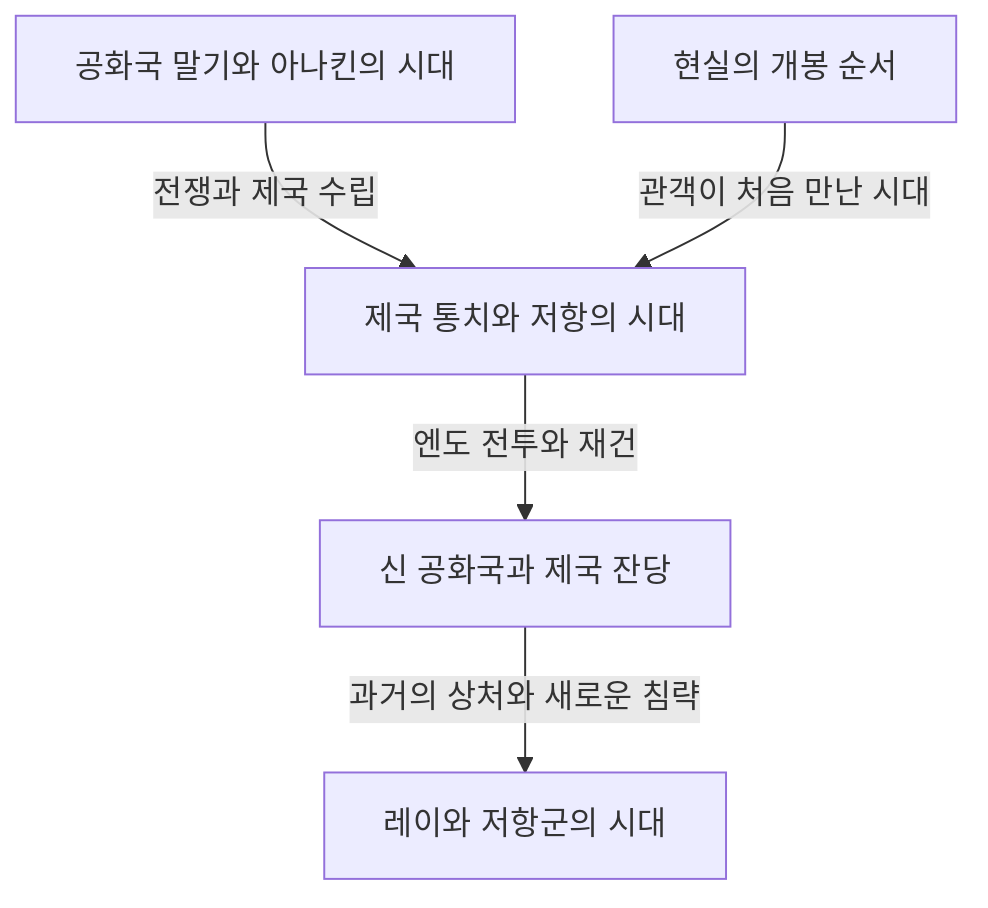
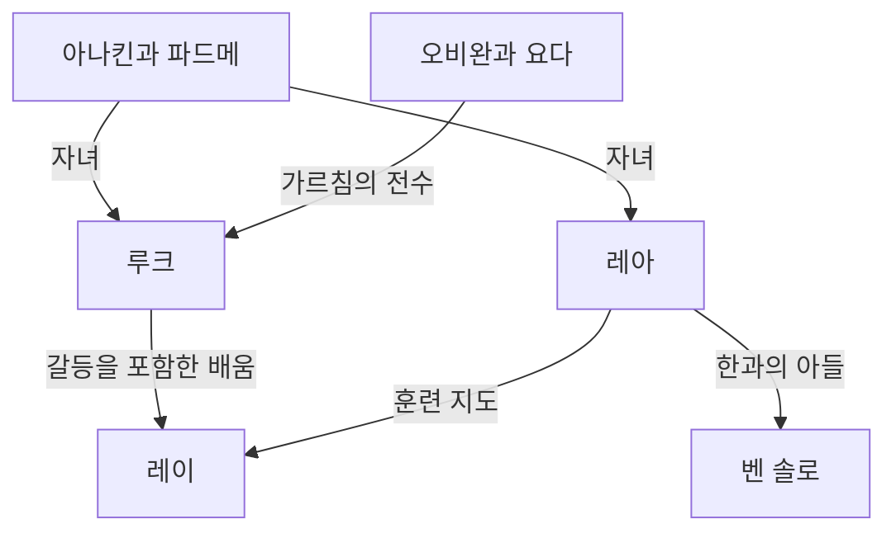
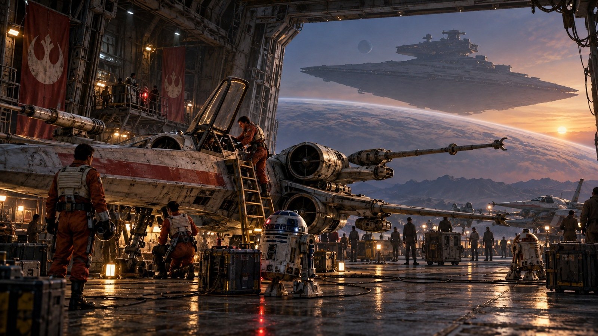
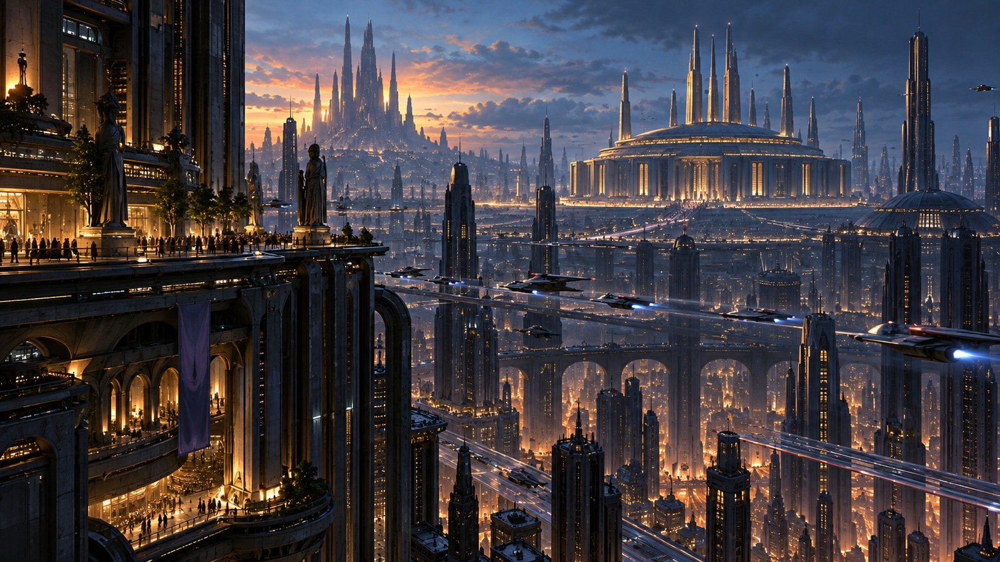
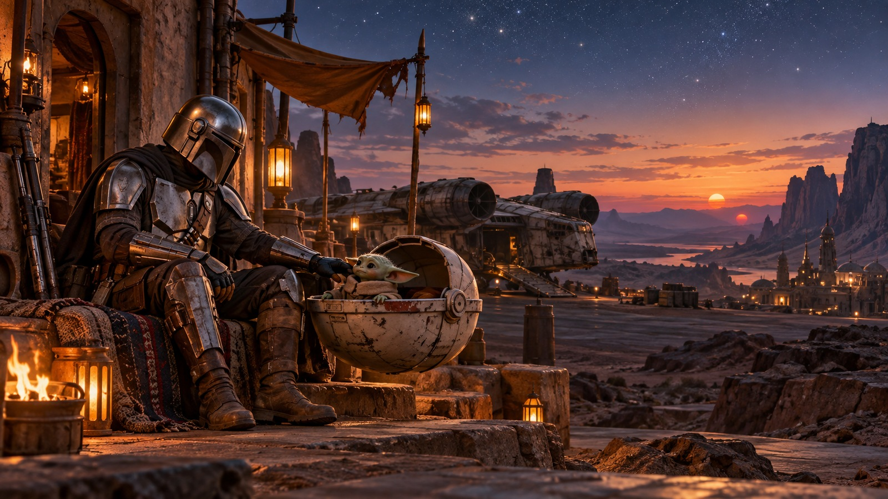
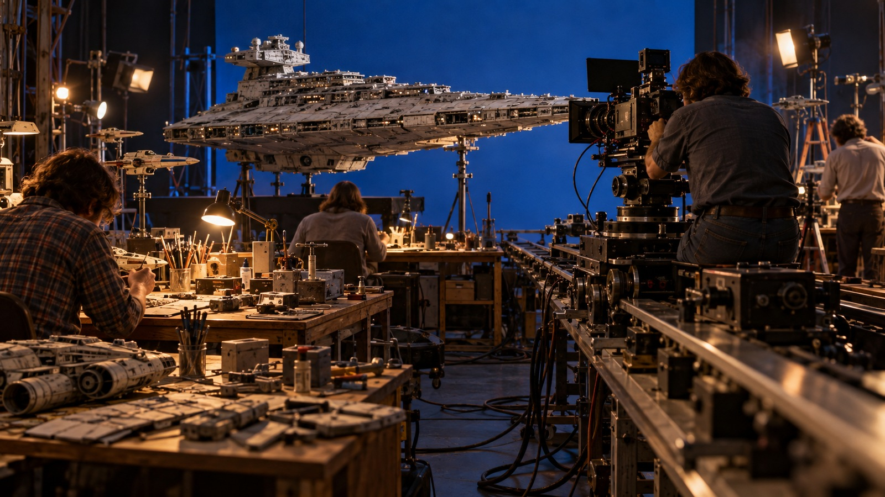
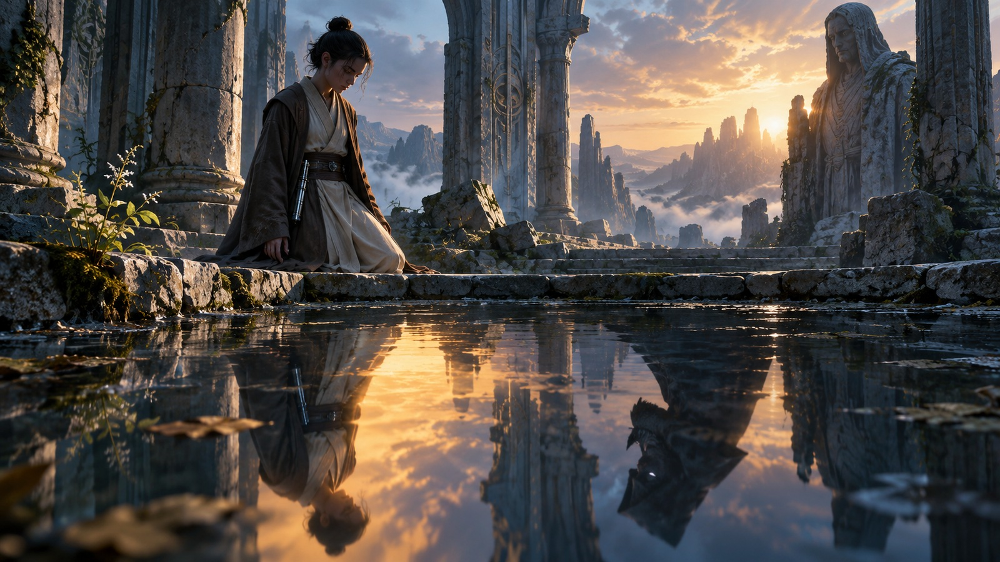

《스타워즈》를 한 문장으로 소개한다면 머나먼 은하에서 벌어지는 모험 이야기다. 그러나 그 모험에는 부모와 자녀 사이의 애증, 민주주의의 붕괴, 제국에 대한 저항, 종교와 권력, 전쟁이 남긴 상처, 혈연을 넘어선 가족이 얽혀 있다. 스크린 뒤에는 모형과 편집, 음악과 음향, 컴퓨터 그래픽 기술을 바꾼 영화 제작의 역사도 있다.

광선검과 다스 베이더를 알아도 작품이 늘어날수록 전체 모습은 파악하기 어려워진다. 왜 가장 먼저 개봉한 영화가 에피소드 4일까? 정의의 기사인 제다이는 왜 공화국을 지키지 못했을까? 아나킨, 루크, 레이의 이야기는 무엇을 계승하고 무엇을 바꾸었을까? 《안도르》와 《만달로리안》은 영화의 부록이라는 의미를 훨씬 넘어 어떤 것을 그렸을까?

이 글은 이런 질문을 '은하 속 이야기', '작품 사이의 관계', '현실의 제작사'라는 세 층위에서 읽는다. 모든 설정을 사전처럼 나열하기보다는 주요 작품의 인과관계와 되풀이되면서도 변하는 주제를 이해하도록 돕는 긴 안내서다. 무성하게 뻗은 세계의 가지들을 보여 주면서 처음 접하는 사람에게도 길을 잃기 어려운 경로를 제시한다.

본문에는 아홉 편의 영화와 관련 작품의 결말, 인물의 정체, 중요한 죽음과 선택이 나온다. 아직 보지 않아 놀라움을 간직하고 싶다면 처음의 작품 정리와 마지막의 감상 순서 안내부터 읽고, 감상 후 개별 작품의 장으로 돌아와도 좋다. 내용과 개봉 현황의 확인 기준일은 2026년 10월 3일이다. 삽화는 이 글을 위해 생성한 콘셉트 아트이며 공식 스틸이나 제작 기록이 아니다.

## 먼저 구분할 세 가지 시간: 개봉 순서, 이야기 속 역사, 설정이 만들어진 순서

《스타워즈》가 어려운 가장 큰 이유는 시간이 일직선이 아니라는 점이다. 1977년 처음 개봉한 영화는 나중에 이야기 내부에서 에피소드 4로 자리 잡았다. 관객은 루크의 모험을 먼저 알았고, 그의 아버지 아나킨의 젊은 시절은 1999년 이후에야 보았다. 이야기에서 먼저 일어난 일이 먼저 제작된 것은 아니다.

제작자가 설정을 구상한 순서는 또 다른 문제다. 후속작에서 드러난 관계 때문에 초기 장면의 의미가 달라질 수 있다. 하지만 그것이 '첫 영화를 만들 때 수십 년 뒤의 이야기까지 모두 정해져 있었다'는 뜻은 아니다. 창작 과정에서 발전한 작품을 완성된 뒤의 일관성만 보고 최초 구상 상태로 거슬러 추정해서는 안 된다.

세 가지 시간을 구분하면 프리퀄을 보는 즐거움도 이해할 수 있다. 결말을 안다고 놀라움이 사라지는 것이 아니라, 어디에서 다른 선택이 가능했는지 생각하는 비극으로 볼 수 있다. 한편 개봉 순서로 보면 최초 관객이 정보를 알게 된 시점에 더 가까이 갈 수 있다. 두 방식에는 각각 가치가 있으며 지식량을 겨루기 위한 유일한 정답은 없다.

| 영화 묶음 | 최초 개봉 연도 | 중심 질문 |
| --- | --- | --- |
| 에피소드 4·5·6: 오리지널 삼부작 | 1977·1980·1983년 | 압도적 권력에 맞서며 가족의 과거를 어떻게 마주할까 |
| 에피소드 1·2·3: 프리퀄 삼부작 | 1999·2002·2005년 | 공화국과 아나킨은 왜 지키고 싶었던 것을 잃었을까 |
| 에피소드 7·8·9: 시퀄 삼부작 | 2015·2017·2019년 | 다음 세대는 이전 세대의 승리와 실패를 어떻게 계승할까 |
| 《로그 원》《한 솔로》 | 2016·2018년 | 본편 가장자리의 인물과 과거의 선택을 어떻게 그릴까 |
| 애니메이션 영화 《클론 전쟁》 | 2008년 | 사람들의 관계로 긴 전쟁을 어떻게 확장할까 |
| 《만달로리안과 그로구》 | 2026년 | 제국 붕괴 후의 은하에서 보호와 공동체를 어떻게 이해할까 |

연도는 원칙적으로 최초 극장 개봉 연도로 일본 개봉 연도와 다를 수 있다. 작품의 공개 순서와 대략적인 연표는 [공식 영화·시리즈 안내](https://www.starwars.com/news/star-wars-movies-and-series-guide)에서 확인할 수 있다. 단편 선집처럼 한 프로그램이 여러 시대에 걸치는 경우에는 프로그램 이름만으로 연표의 한 지점에 놓으면 오해하기 쉽다.

이 그림은 주요 영상 작품을 이해하기 위한 뼈대다. 한 번의 전투로 제국이 은하 구석구석에서 사라졌다는 뜻은 아니다. 정권의 상징적 패배와 군사 조직, 행정, 범죄, 사람들의 의식 변화는 서로 다른 속도로 진행된다. 많은 파생 작품의 이야기가 이런 시차에 자리한다.

## 캐넌과 레전드: 각각의 이야기는 어느 연속성에 속할까

캐넌은 현재 공식 이야기의 연속성을 이해하는 틀이다. 레전드는 이전에 크게 확장된 소설, 만화, 게임 등을 정리한 분류다. 2014년 루카스필름은 기존 확장 세계관의 취급을 바꾸고 영화와 《클론 전쟁》을 중심으로 새로운 전개 방향을 발표했다. [당시 공식 발표](https://www.starwars.com/news/the-legendary-star-wars-expanded-universe-turns-a-new-page)는 이 전환을 설명한다.

레전드로 분류되었다고 작품이 사라지거나 읽을 가치가 없어지는 것은 아니다. 서로 다른 시대의 제약과 가능성 아래 성장한 은하의 이야기로 읽을 수 있다. 반대로 옛 작품의 이름이나 발상이 신작에 다시 등장해도 이전의 경력과 사건이 통째로 새 연속성에 들어오는 것은 아니다. 익숙한 이름을 발견할수록 어느 작품에서의 어떤 설정인지 확인해야 한다.

공식 제작 작품이라고 모두 같은 연속성을 공유하는 것도 아니다. 예를 들어 《비전스》는 기존 연표에 얽매이지 않는 표현을 탐색한다. 게임에서 조작할 수 있는 모든 행동도 실제로 일어난 사건은 아닐 수 있다. 플레이어가 선택할 수 있는 것과 후속작이 전제로 삼는 사건을 구분해야 할 때가 있다.

피해야 할 것은 설정 분류를 작품의 우열을 평가하는 기준으로 바꾸는 일이다. 캐넌은 연결을 이해하는 단서이지 감동에 점수를 매기는 체계가 아니다. 영상의 묘사, 공식 자료, 인물의 발언, 관객의 해석도 서로 다른 종류의 정보다. 등장인물이 믿는 설명을 세계 전체의 전지적 진실로 곧바로 받아들이지 않는 것도 중요한 읽기 방식이다.

이 글은 현재 주요 영상 작품의 연속성을 바탕으로 하며 레전드나 독립 기획을 다룰 때에는 위치를 구분한다. '작품이 무엇을 그리는가'와 '그 묘사를 어떻게 이해할 수 있는가'도 나눈다. 예를 들어 제다이 제도를 비판적으로 분석할 수 있지만 이는 관객의 분석이지 모든 제다이의 선의를 부정하는 공식 설정이 아니다.

## 은하에 들어가기 전, 작은 인물 지도

이야기의 중심에는 스카이워커 가족을 둘러싼 여러 세대가 있다. 루크와 레아는 아나킨과 파드메의 자녀다. 벤 솔로는 레아와 한의 아들이며 이후 카일로 렌이라는 이름으로 활동한다. 그러나 이야기의 전승은 혈연만으로 설명되지 않는다. 오비완과 요다에서 루크로, 아나킨에서 아소카로, 다시 레이를 포함한 다음 세대로 가르침과 실패와 선택이 전해진다.

R2-D2와 C-3PO는 인간과 다른 위치에서 이 역사를 가로지른다. 츄바카, 랜도와 반란군 동료들은 가족 내부의 문제를 은하 전체의 전쟁에 연결한다. 뒤이은 시리즈에서는 카시안, 딘 자린, 그로구, 클론 같은 인물들이 영웅의 중심에서 멀리 떨어진 사람들이 겪은 시간을 보여 준다.

가족과 사제 관계를 구분하면 은하의 이야기가 왕실 족보만은 아님을 알 수 있다. 물려받은 것이 무엇인지만이 아니라 그 유산을 어떻게 쓰고 무엇을 거부할지도 묻는다. 이제 관객이 처음 이 은하에 들어왔던 삼부작부터 각 작품의 역할을 살펴보자.

## 에피소드 4 《새로운 희망》: 은하의 정치가 한 청년의 생활에 들어오다

1977년 개봉한 첫 영화는 세계의 역사 중간에서 시작한다. 관객은 제국이 어떻게 생겼는지도 모른 채 작은 배를 거대한 군함이 쫓는 모습을 본다. 크기 차이만으로 추격자와 도망자의 힘의 격차가 드러난다. 세계관 설명을 먼저 끝내고 이야기를 움직이기보다 인물의 행동을 통해 사건 이해에 필요한 정보를 조금씩 준다. 개봉일과 기본적인 이야기의 위치는 [공식 작품 페이지](https://www.starwars.com/films/star-wars-episode-iv-a-new-hope)에서도 확인할 수 있다.

### 모험은 선택받은 자라는 자각에서 시작하지 않는다

타투인의 농장에 사는 루크 스카이워커는 처음부터 은하를 구하려 하지 않는다. 그저 좁은 일상에서 벗어나고 싶은 청년이다. 그러나 집으로 들어온 드로이드가 반란군의 정보를 지니고 있고, 레아의 구조 메시지는 그를 은둔 중인 오비완 케노비에게 이끈다. 정치적 충돌이 먼 곳의 뉴스일 때에는 농장에 돌아갈 수도 있었다. 제국의 폭력이 그를 키운 보호자들을 빼앗으면서 그 경계가 무너진다.

이 인과관계가 중요하다. 루크가 먼저 모험을 선택해 제국과 관계를 맺은 것이 아니다. 제국 통치와 무관하게 살려던 삶 자체가 파괴되었다. 이야기는 개인의 성장이면서 권력의 폭력이 변방의 생활에 침입하는 과정이기도 하다. 그렇다고 슬픔만으로 영웅이 되지는 않는다. 스승과 동료를 만나 행동하는 법을 배우고 능력을 다른 사람을 돕는 데 쓰면서 최초의 소망에 공적 의미가 생긴다.

레아는 구출 대상이지만 구출만 기다리는 사람은 아니다. 정보를 숨기고 심문을 견디며 탈출 과정에서도 판단한다. 루크와 한이 시설에 들어가 구하려 했는데 오히려 두 사람의 실수를 메워 준다. 역할이 고정되지 않기에 세 사람은 영웅과 조수와 보상이라는 단순한 관계 대신 서로의 판단에 영향을 주는 집단이 된다.

### 데스 스타는 대포인 동시에 통치 사상이다

데스 스타가 무서운 것은 행성을 파괴하는 화력만이 아니다. 힘을 보여 주어 일상적인 협상과 대의 제도를 불필요하게 만들겠다는 구상도 있다. 의회 해산과 공포를 통한 각 성계의 복종은 연결된다. 얼데란 파괴는 군사 기지 점령을 훨씬 넘어 저항을 생각할 수 있는 모든 사람에게 보내는 위협이다.

반란군에는 같은 규모의 무기가 없다. 설계도를 분석해 작은 약점을 찾고 한정된 병력을 집중한다. 정보를 운반한 드로이드, 설계도를 맡긴 사람, 분석가, 전투기 정비사의 일이 이어져야 승리가 가능하다. 마지막 일격은 루크가 날리지만 그 일격을 가능하게 한 것은 폭넓은 협력이다. 이를 무시하면 '특별한 혈통의 개인이 모든 것을 해결한다'는 이야기로 오독하기 쉽다.

한의 귀환도 이 협력에 속한다. 돈을 기준으로 움직이던 사람이 위험을 알면서 동료를 도우러 돌아온다. 루크가 조준 장치에만 의존하지 않고 포스를 믿는 순간과 한이 보수만 보고 결정하지 않는 순간은 모두 눈앞의 손익을 넘는 신뢰로 나아가는 것으로 읽을 수 있다. 기술을 버리라는 요구는 아니다. 전투기와 통신, 설계도는 여전히 필수이고 문제는 최종 판단에 무엇을 더할지다.

은하의 역사가 수리해야 하는 기계와 생활비를 통해 화면에 들어오는 점도 눈여겨볼 만하다. 밀레니엄 팔콘은 빠르기만 한 완벽한 탈것이 아니라 주인이 애써 유지해야 운항하는 우주선이다. 술집 손님들은 주인공에게 설명하려고만 존재하지 않고 드로이드에게는 매매되는 생활도 있다. 화면 중심 밖에서도 일이 계속되는 듯하기 때문에 관객은 모든 것을 몰라도 이 세계가 오래 이어져 왔다고 느낀다.

## 에피소드 5 《제국의 역습》: 실패가 영웅의 자기 이해를 무너뜨리다

전작의 승리는 제국의 소멸을 뜻하지 않는다. 반란군은 여전히 도망치며 호스 기지도 지키지 못한다. 거대 무기를 파괴해도 제도와 군대가 함께 사라지지는 않는다는 현실에서 출발한다. 1980년 영화는 루크의 수련과 한 일행의 도피를 병행한다. [공식 작품 페이지](https://www.starwars.com/films/star-wars-episode-v-the-empire-strikes-back)

### 수련은 돌을 드는 기술 이상을 시험한다

다고바에서 요다를 만나며 루크가 기대한 위대한 스승의 외모와 태도는 깨진다. 작고 괴상한 생물을 보고 그 지혜를 바로 알아차리지 못한다. 관객에게도 작동하는 설계다. 강함을 거대한 몸이나 무기의 크기와 연결하는 직관을 먼저 깨고 포스의 배움을 시작한다.

동굴에서 루크가 쓰러뜨린 베이더의 가면 아래에 자신의 얼굴이 나타난다. 영화는 이를 단순한 미래 영상으로 확정하지 않는다. 적에 대한 공포와 분노에 따라 행동하면 적과 같은 존재가 될 수 있다는 경고로 읽을 수 있다. 전작의 과제는 외부의 적인 제국을 쓰러뜨리는 것이었지만 여기서는 적을 쓰러뜨리고 싶은 자신의 마음도 점검 대상이 된다.

동료들이 고통받는 환영을 본 루크는 수련을 중단한다. 이를 '착해서 전적으로 옳다'거나 '미숙해서 전적으로 틀리다'고 간단히 분류하기 어렵다. 동료를 버려둘 수 없다는 동기는 이해되지만 자신의 힘과 정보의 한계를 잘못 가늠했다. 게다가 베이더는 바로 그 감정을 이용해 그를 유인한다. 선의가 상황 판단의 필요성을 없애 주지는 않는다.

### 랜도의 거래와 지배자에 대한 타협의 한계

클라우드 시티의 랜도는 도시를 보호하려 제국과 거래한다. 그러나 지배자가 약속을 일방적으로 바꿀 수 있는 관계에서는 계약만으로 안전해질 수 없다. 한 조건에 복종하면 새 요구가 이어진다. 그의 실패는 성격상의 배신만이 아니라 압도적 폭력 아래 자치를 유지하려던 정치적 실패다.

그래도 한 번 틀렸다고 계속 틀릴 수밖에 있는 것은 아니다. 랜도는 이후 구조에 나선다. 루크가 실패하고 랜도가 배신하며 한이 붙잡히지만 인물의 가치는 당시의 성공률로 결정되지 않는다. 자기 행동을 고치고 도움을 청하며 다른 사람의 도움에 응하는 일이 승리와 다른 척도로 남는다.

베이더가 루크의 아버지라고 밝히는 것은 선악의 구분을 지우기 위해서가 아니다. 제국의 폭력은 정당화되지 않는다. 무너지는 것은 자신이 선한 아버지의 아들이고 적은 아버지를 죽인 외부인이라고 생각했던 루크의 정돈된 가족사다. '적을 쓰러뜨리면 아버지에 가까워진다'는 구조가 '어떻게 적을 마주해야 아버지를 계승할 수 있을까'라는 난제로 바뀐다.

결투 끝의 루크는 승자가 아니다. 몸을 다치고 혼자 탈출하지 못해 레아 일행에게 구조된다. 첫 영화에서 구하러 갔던 사람에게 거꾸로 구조되는 일은 영웅의 고립도 부정한다. 독립은 누구에게도 의지하지 않는 것만이 아니라 잘못과 약함을 지닌 채 관계로 돌아오는 일도 포함한다. 그런 의미에서 어두운 결말은 다음 편으로 미루는 절벽 끝 맺음 이상이다.

호스의 흰 벌판, 다고바의 습하고 닫힌 환경, 클라우드 시티의 밝은 외관과 어두운 내부 대비도 관광용 배경만은 아니다. 장소의 질감은 군사적 후퇴, 내면으로의 하강, 겉보기 안전의 붕괴를 지탱한다. 이동할 때마다 주인공이 잘하던 행동 방식이 통하지 않는다. 전투기를 몰아 승리한 경험은 수련과 협상, 아버지와의 대화에 답이 되지 않는다.

생성 콘셉트 아트. 저항 세력과 제국 사이의 비대칭적인 힘을 표현하며 공식 영화 스틸이 아니다.

## 에피소드 6 《제다이의 귀환》: 아버지를 구하는 일과 제국을 쓰러뜨리는 일

1983년의 완결편은 한의 구출로 시작해 개인 관계의 회복과 은하 규모의 전쟁을 겹친다. 자바의 궁전에 있는 루크는 첫 영화의 청년보다 침착하고 힘을 쓰는 데 자신감도 있다. 그러나 겉모습만으로 제다이로서의 성숙이 증명되지는 않는다. 최종 시험은 이길 수 있을 때 무엇을 선택하느냐다. [공식 작품 페이지](https://www.starwars.com/films/star-wars-episode-vi-return-of-the-jedi)

### 황제의 덫이 노리는 것은 죽음보다 분노다

황제는 반란군을 군사적으로 전멸시키려 하면서 루크를 자기편으로 끌어들이려 한다. 동료들이 위험에 빠진 모습을 보여 주어 분노로 공격하게 하고 그 감정에 따라 아버지를 죽이도록 유도한다. 루크가 베이더를 쓰러뜨려도 같은 지배 논리를 받아들이면 승자는 황제다. 따라서 이 결투에서는 전투의 승패와 윤리적 성공이 뒤집힐 수 있다.

레아에 대한 위협에 격분한 루크는 베이더를 압도한다. 아버지의 기계 손과 자신의 손을 비교하는 순간 동굴의 환영이 구체적 선택으로 돌아온다. 무기를 내려놓는 것은 위험이 없어서 택한 비폭력이 아니다. 자신이 죽을 수 있음을 받아들이면서 아버지 살해를 거부하고, 적을 파괴해야 강함을 증명한다는 척도에서 벗어난다.

베이더는 아들의 고통을 보고 황제에 맞서기로 선택한다. 여기에는 구원이 있지만 과거의 죄가 모두 지워졌다고 영화가 말하지는 않는다. 아들이 아버지 안의 선의를 믿는 일과 피해자가 가해자를 용서해야 할 의무는 다르다. 영화는 부자 관계에서 마지막 변화를 그리지만 모든 법적 책임과 역사적 기억을 처리하지는 않는다. 이 구분을 남겨 두면 감동을 해치지 않으면서 결말의 한계도 이해할 수 있다.

### 숲의 전투가 왕좌의 방만큼 필수적인 이유

황제와의 대결만 보면 세계가 가족 문제로만 움직이는 듯하다. 그러나 엔도 지상 부대가 방어막을 끄지 않으면 함대는 두 번째 데스 스타를 파괴할 수 없다. 루크가 아버지를 구하는 일과 반란군이 군사 시설을 파괴하는 일은 동시에 필수인 과제다. 어느 하나가 다른 하나를 자동으로 대신하지 않는다.

이워크는 연합 작전에 현지 지형 지식과 다른 전투 방식을 가져온다. 제국은 장갑과 화력이 우세하지만 눈앞의 주민을 스스로 행동하는 주체로 충분히 보지 않는다. 이 경시 때문에 지형과 기습을 이용하는 저항을 잘못 판단한다. 물론 현실의 전쟁에서 조악한 무기가 언제나 첨단 군대를 이긴다는 뜻은 아니다. 우화로서 작은 존재들의 판단력과 결속을 과소평가하는 지배자의 약점을 보인다.

루크, 한, 레아, 랜도, 츄바카, 드로이드, 이름 없는 병사와 엔도 주민들의 노력이 합쳐지기에 축제는 한 사람의 대관식이 아니다. 아버지를 잃은 루크가 공동체로 돌아오는 결말이기도 하다. 개인적 상실과 공적 승리가 함께 있어 행복은 아무 상처 없는 대단원이 되지 않는다.

황제의 실패에는 결국 모든 사람이 이익과 공포에 따라 움직일 것이라는 오판도 있다. 아들이 아버지에 대한 믿음을 포기하지 않고 아버지가 지배자에 대한 복종 대신 아들을 선택하는 일은 계산을 벗어난다. 아무리 강한 포스 능력도 사람의 선택을 완전히 예측하지 못한다. 이는 거대한 무기의 위력을 맹신하는 것과 같은 자만, 사람의 마음을 완전히 파악했다는 자만이다.

## 에피소드 1 《보이지 않는 위험》: 제국은 처음부터 제국의 얼굴을 하지 않는다

1999년의 프리퀄은 첫 영화처럼 명확한 군사 독재가 아니라 공화국 내부의 갈등에서 출발한다. 무역연합의 나부 봉쇄는 무역과 세금 분쟁이 무력 점령으로 변한 사건이다. 젊은 여왕 파드메 아미달라는 의회에 호소하면 사실을 인정받고 구조받으리라 기대한다. 하지만 제도는 조사와 절차에 머물고 현장의 고통과 결정 속도는 맞지 않는다. [공식 작품 페이지](https://www.starwars.com/films/star-wars-episode-i-the-phantom-menace)

### 팰퍼틴은 위기의 해결자로서 지지를 얻는다

이후 역사를 아는 관객에게 나부 출신 팰퍼틴 의원의 조언은 두 얼굴을 띤다. 그는 피해자 곁에 서서 무능해 보이는 지도자에 대한 불신을 이용한다. 의회 밖에서 난입해 단번에 공화국을 파괴하는 것이 아니라 의회 절차와 대중의 기대를 이용해 자기 지위를 높인다는 점이 중요하다.

적도 한 덩어리가 아니다. 무역연합은 자기 이익을 추구하지만 다스 시디어스는 그것을 더 큰 계획의 도구로 삼는다. 겉으로 드러난 갈등이 해결되어도 그 갈등이 낳은 권력 이동은 남는다. 나부 해방은 진짜 승리지만 공화국 전체의 미래에도 승리인 것은 아니다. 두 규모가 일치하지 않기에 축제에도 불안이 남는다.

파드메가 건간족에게 협력을 구하는 장면은 반대의 정치를 보여 준다. 대표자의 위엄만 지키려 하지 않고 같은 행성에 사는 관계를 인정하며 도움을 청한다. 이는 군사력 부족을 메우는 데 그치지 않고 멀리하던 집단들에 공동 목표를 만든다. 작은 규모의 연대가 의회에서 얻지 못한 실제 행동력을 낳는다.

### 아나킨의 재능보다 먼저 그의 생활을 보자

어린 아나킨은 놀라운 조종 실력이 있지만 노예이기도 하다. 거대한 공화국이 있고 제다이가 정의를 논하는 세계에서 모자의 자유는 보장되지 않는다. 제도가 있는 것과 그 보호가 모든 지역에 닿는 것 사이의 격차다. 콰이곤은 아나킨을 해방해도 같은 방법으로 어머니 슈미까지 구할 수 없다.

출발에는 능력을 인정받는 행복과 어머니를 남기고 떠나는 두려움이 함께 있다. 나중의 아나킨을 '두려움을 극복하지 못한 나약한 사람'으로만 보면 두려움을 만든 조건을 놓친다. 반면 어려운 성장 배경이 나중의 가해를 필연으로 만들지도 않는다. 이야기는 상처를 지닌 사람에게 어떤 지지와 교육이 필요한지 묻기 시작한다.

콰이곤이 죽으면서 아나킨을 발견한 스승은 오랫동안 이끄는 스승이 되지 못한다. 오비완이 약속을 이어받지만 둘의 관계는 처음부터 성숙하지 않았다. 거대한 예언과 제도의 기대가 한 아이의 성장보다 앞서 달리기 시작한다. 이 불균형이 프리퀄 전체의 비극을 준비한다.

제작 면에서도 프리퀄을 '전부 컴퓨터로 만든 영화'라 부르면 부정확하다. 공식 제작 소개에는 포드레이스 관객을 나타내는 모형에 색칠한 면봉을 쓴 실물 기법 등이 나온다. 신기술과 수작업이 함께 화면을 구성했다고 이해하는 것이 실제에 가깝다. [공식 제작 이야기](https://www.starwars.com/news/25-fun-facts-the-phantom-menace)

여러 장소에서 동시에 진행되는 마지막 전투는 집단별 역할 구분에도 도움이 된다. 건간족의 견제, 궁전의 작전, 우주 전투, 제다이와 시스의 결투는 각각 다른 문제를 해결한다. 강한 검사 한 사람이 있다고 점령이 끝나지는 않는다. 군사적 성공 뒤에서 콰이곤을 잃기에 공동체의 승리와 소년 인생의 상실은 일치하지 않는다.

## 에피소드 2 《클론의 습격》: 전쟁 준비가 선택의 여지를 줄이다

2002년의 두 번째 영화에서는 공화국에서 벗어나려는 분리주의 세력이 커지고 군대 창설이 정치 의제가 된다. 파드메 암살 미수 수사를 시작한 오비완은 클론 군대의 존재를 발견한다. 위기에 어떻게 대응할지 논의하던 공화국 앞에 이미 완성된 군대가 갑자기 나타난다. 안보의 긴급함과 출처 불명이나 너무나 편리한 힘이 결합한다. [공식 작품 페이지](https://www.starwars.com/films/star-wars-episode-ii-attack-of-the-clones)

### 조사해야 할 수수께끼를 전쟁의 긴급한 수요가 앞지른다

클론 군대가 어떻게 주문되었고 누구의 이익을 위해 만들어졌는지부터 조사해야 했다. 그러나 적군이 눈앞에 있으면 당장 쓸 전력을 원하게 된다. 위기는 신중히 검토할 시간을 빼앗아 결정을 바꾼다. 충분히 검증해서 군대를 채용한 것이 아니라 대안이 없어 보이는 상황에서 채용이 진행된다.

두쿠의 공화국 비판에는 제도 부패라는 실제 문제가 들어 있다. 하지만 문제를 정확히 지적한다고 해결책도 공정한 것은 아니다. 자신도 시스의 계획에 참여하므로 공화국에 대한 실망이 자동으로 해방을 낳지는 않는다. 양측의 표면적 대립과 그 대립을 이용하는 시디어스의 위치를 구분해야 한다.

제다이도 평화를 지키려 전장에 나가면서 장군으로 군대를 이끌게 된다. 구출에는 성공했지만 그로 인해 전쟁이 시작되는 역설이다. 눈앞의 생명을 지키는 행동과 장기적으로 군사 질서를 강화하는 효과가 공존한다. 선한 목적을 위해 채택한 수단이 조직 자체의 성격을 바꾸기 시작한다.

### 사랑과 정치에 공통으로 존재하는 통제 욕망

아나킨과 파드메의 관계에는 신분과 임무, 제다이의 규율이 장애가 된다. 비밀 결혼은 사랑을 지키지만 조언과 지원을 받을 범위를 줄이기도 한다. 어려움을 나눌 사람이 줄면 나중에 두려움이 깊어져도 바깥의 시각으로 돌아보기 어렵다.

어머니를 잃은 아나킨은 터스켄 마을에서 아이들까지 죽인다. 이를 분노의 강도를 보여 주는 장면 정도로 가볍게 넘길 수는 없다. 가족이 폭력을 당한 경험이 무관한 사람들에게 폭력을 가하는 이유가 된 명백한 윤리적 붕괴다. 슬픔은 이해할 수 있어도 행동에는 책임이 따른다. 이미 큰 경계를 넘었기에 나중의 타락은 갑작스러운 방향 전환이 아니다.

원하는 결과만 얻을 수 있다면 강한 지도자가 결정해도 된다는 아나킨의 정치관은 친밀한 관계에서 상실을 통제하려는 욕망과도 호응한다. 사람마다 다른 의지가 있고 사랑하는 이에게도 자신이 통제하지 못하는 삶이 있음을 받아들이기는 어렵다. 그러나 강제로 불확실성을 없애려 하면 지키고 싶은 관계를 파괴한다. 이 문제는 다음 영화에서 극단으로 향한다.

클론 군대의 똑같은 외모에는 사람을 대체 가능한 전력으로 다루는 섬뜩함도 있다. 출처가 같다고 병사들의 생명을 하나의 물건처럼 셀 수는 없다. 영화가 먼저 대규모 군대 출현을 인상적으로 보여 준 뒤 후속 작품들이 개별 병사의 인격을 파고든다. 이 순서를 의식하면 공화국을 구한 듯 보였던 군대를 다시 보며 그 구원의 대가를 누가 지불했는지 물을 수 있다.

## 에피소드 3 《시스의 복수》: 구하려는 마음이 지배 논리로 바뀌다

2005년의 세 번째 영화에서 클론 전쟁은 끝을 향하지만 공화국은 붕괴로 향한다. 전쟁에서 이기면 평화로 돌아가리라 기대하지만 전쟁을 위해 집중한 권력이 전후 독재의 토대가 된다. 아나킨의 추락과 공화국의 추락이 동시에 일어나므로 비극을 개인 의지의 약함이나 제도의 실패 하나로만 돌릴 수 없다. [공식 작품 페이지](https://www.starwars.com/films/star-wars-episode-iii-revenge-of-the-sith)

### 팰퍼틴이 파는 것은 죽음을 지배할 수 있다는 약속이다

아나킨은 미래에 파드메를 잃을까 두렵다. 팰퍼틴은 그 두려움을 곧바로 부정하지 않고 다른 곳에서 얻지 못할 힘이 있음을 암시한다. 사악한 교리를 단순히 설교하는 것보다 교묘하다. 상대가 가장 잃기 싫어하는 것을 먼저 알아내고 그것을 지키려면 자신이 꼭 필요하다고 믿게 한다. 의존이 깊어질수록 모순된 설명과 범죄적 요구도 받아들이기 쉬워진다.

제다이 평의회와 아나킨 사이에도 불신이 있다. 그는 인정받지 못한다고 느끼고 평의회는 팰퍼틴과 지나치게 가까운 그를 경계한다. 첩보 임무까지 요구받으며 충성의 대상이 갈라진다. 그러나 처지의 설명과 책임 면제는 다르다. 팰퍼틴을 보호하려 메이스 윈두를 막은 뒤에도 아나킨은 더 파괴적인 명령에 계속 복종한다.

큰 잘못을 저지르면 돌아서기보다 그 잘못이 의미 있었다고 증명하는 길을 더 택하고 싶을 때가 있다. 아나킨의 행동도 이런 자기 정당화의 연쇄로 읽을 수 있다. 여기까지 왔는데 힘을 얻지 못하면 모두 헛일이라는 생각이 다음 가해를 필요한 희생처럼 보이게 한다.

### 오더 66은 제도 내부의 살상 능력 방향을 돌린다

제다이를 공격한 것은 멀리서 나타난 새로운 적군이 아니라 함께 싸웠던 병사다. 군사 조직의 지휘 계통이 반전되면 아군이라는 전제 아래의 배치와 신뢰가 약점이 된다. 영화는 명령과 동시 공격을 그리고 클론 병사의 세부 통제 원리는 관련 애니메이션이 보완한다. 영화 자체의 설명과 후대 보충을 나누면 각 작품이 맡은 기능도 보인다.

제국 수립도 공화국의 건물을 모두 부수는 순간이 아니라 의사당에서 새로운 질서라는 이름으로 선포된다. 안전 회복이라는 언어를 빌려 감시와 폭력이 영구 통치에 편입된다. 반대하는 제다이를 반역자로 만듦으로써 권력 집중에 대한 저항은 질서에 대한 공격으로 재해석된다.

무스타파에서 아나킨은 구하려던 파드메에게 폭력을 가한다. 상대가 동의하지 않자 그 사람의 의지를 존중하는 대신 배신으로 이해한다. 사랑과 소유욕의 차이가 선명해지는 순간이다. 그가 바라는 미래에는 살아 있는 파드메만이 아니라 자신의 선택을 인정하는 파드메가 필요했다.

불탄 아나킨의 몸이 갑옷에 싸이는 장면과 쌍둥이의 탄생이 교차하며 절망과 다음 가능성을 함께 보인다. 오비완도 요다도 승자가 아니다. 그래도 아이들을 보호하는 일은 정치적 실패 속에 남길 수 있는 미래다. 프리퀄은 선인이 사라져 악이 이긴 이야기보다 선의와 두려움, 제도와 야심이 결합해 재난을 만든 이야기로 끝난다.

오비완의 슬픔도 악인을 찾아 물리친 만족과 거리가 멀다. 동생처럼 여기던 사람과 싸워야 했고 자신의 교육과 판단에 대한 의문도 남는다. 그래서 긴 결투는 기술 대결인 동시에 서로를 너무 잘 알아 관계를 쉽게 끊지 못하는 고통으로 볼 수 있다. 이긴 쪽에도 승리를 축하할 곳은 없다.

## 에피소드 7 《깨어난 포스》: 옛 영웅을 모르는 세대가 과거를 물려받다

2015년의 새 이야기에서 레이와 핀에게 반란군 영웅은 거의 전설이다. 관객에게 익숙한 이름이 젊은 인물에게는 멀다. 영화는 이 격차를 통해 오래된 관객의 기억과 새 관객의 놀라움을 한 화면에 놓는다. 제국 이후 시대의 퍼스트 오더는 과거의 승리가 다음 세대의 안전을 보장하지 않음을 보여 준다. [공식 작품 페이지](https://www.starwars.com/films/star-wars-episode-vii-the-force-awakens)

### 핀은 명령 거부를 통해 먼저 주인공이 된다

핀의 출발점은 뛰어난 혈통이나 예언이 아니라 병사로 복종하라는 요구 앞에서 살인을 거부하는 것이다. 그 선택으로 조직 안의 번호 하나에서 스스로 결정하는 사람이 되기 시작한다. 그러나 곧바로 은하 전체를 구할 준비를 마친 것은 아니며 처음에는 도망치고 싶은 마음이 강하다. 두려움이 사라진 뒤 선행하는 것이 아니라 두려움을 안고 누군가를 위해 남는 과정이다.

자쿠의 레이는 생존 기술을 익혔으면서 돌아올지도 모르는 가족을 기다린다. 정체의 원인은 능력 부족보다 과거에 대한 기대다. 고향을 떠나는 것은 다른 행성으로의 이동만이 아니라 '계속 기다리면 옛 생활이 돌아온다'는 희망에서 자기 손으로 새 관계를 만들 가능성으로의 이동이다.

### 카일로 렌이 바라는 것은 베이더의 힘보다 베이더의 형상이다

벤 솔로는 자신을 카일로 렌으로 다시 만들려 한다. 할아버지 베이더를 숭배하지만 그가 마지막에 아들을 구했다는 사실은 자신이 추구하는 강력한 악의 형상과 맞지 않는다. 사람은 과거 전체를 계승하기보다 필요한 부분만 고르기도 한다. 카일로는 역사 계승이 오독이 될 수도 있음을 보인다.

한의 살해도 냉정한 악인이 장애물을 치우는 일만은 아니다. 가족에 대한 애착을 끊으면 강해진다고 생각해 자신을 개조하려 한다. 그러나 폭력을 행사한다고 내적 갈등이 반드시 없어지지는 않는다. 흔들림을 지우려 한 행동이 새 상처를 낳는다. 레이가 타인과 연결되는 쪽으로 가는 반면 카일로는 연결을 끊어 자신을 확립하려 한다.

스타킬러 기지와 지도를 지닌 드로이드 등 첫 영화와 비슷한 구조는 명확하다. 향수로 받아들일 수도 있고 반복을 비판할 수도 있다. 다만 분석은 '비슷하다'에서 멈추지 말고 같은 위치의 인물이 어떻게 다르게 선택하는지 보아야 한다. 제국식 군대의 병사가 주인공이 되고 구조를 기다리던 소녀가 직접 저항하며 영웅의 아들이 적이 된다. 비슷한 윤곽 속에서 계승의 불안이 중심에 들어온다.

신 공화국 중추의 파괴는 정치 질서의 취약함을 강하게 보인다. 하지만 영화가 그 질서의 일상을 오래 그리지 않았기에 무엇을 잃었는지 관객이 구체적으로 느끼기 어렵기도 하다. 작품의 설명상 한계로 볼 수 있다. 관련 작품을 알면 무게가 더해지지만 모르는 관객에게 모든 책임을 돌릴 수 없다. 작품 안에서 전달하는 정보량 자체가 감상 경험에 영향을 준다.

## 에피소드 8 《라스트 제다이》: 실패를 인정하되 책임을 포기하지 않다

2017년의 두 번째 영화는 '레이가 루크를 만나면 해결된다'는 기대를 깨뜨린다. 루크는 다시 영웅으로 나서는 삶에서 물러나 있다. 동시에 저항군은 추격받으며 한정된 자원으로 생존을 결정해야 한다. 개인의 영웅상과 조직의 지도 방식 모두를 다시 묻는 영화다. [공식 작품 페이지](https://www.starwars.com/films/star-wars-episode-viii-the-last-jedi)

### 잘못의 인정은 모든 것을 포기할 이유가 될까

루크와 벤의 과거는 서로 다른 시점으로 전해진다. 루크의 순간적 두려움과 그 광경을 본 벤의 두려움은 같은 장면에 다른 의미를 준다. 이는 '사실 자체가 없다'는 상대주의가 아니라 자신의 생각과 상대의 실제 경험 사이의 격차다. '한순간이었다', '후회했다'는 설명만으로 상대에게 준 상처가 사라지지는 않는다.

루크는 자신의 실패를 제다이 전체의 실패와 연결하며 전통을 끝내려 한다. 제다이 역사에 대한 비판은 생각할 가치가 있지만 자신의 부재를 정당화하는 데만 쓰인다면 지금 고통받는 사람에 대한 책임에서 멀어진다. 전통을 무조건 옹호하는 것과 실패했으니 모두 버리는 것 사이에 교훈을 얻어 다시 전하는 길이 필요하다.

레이와 카일로는 서로 이해할 가능성을 접하지만 이해와 동의는 다르다. 외로움을 공유해도 남을 지배하는 질서를 받아들일 필요는 없다. 카일로가 스노크를 죽여도 자동으로 선의 편이 되지 않는다. 지배자 살해와 지배 구조 거부는 다르며 그는 빈자리에 앉으려 한다.

### 용기와 지휘는 서로 다른 시간 단위를 쓴다

포는 눈앞의 적을 파괴할 용기가 있지만 그 성공에 얼마나 많은 인명과 전력이 드는지 배워야 한다. 한 전투의 눈에 띄는 성과와 조직을 내일까지 살리는 일은 다르다. 지휘관에게는 공격하지 않거나 후퇴하는 결정도 책임이다.

한편 홀도와의 갈등에는 정보 공유의 어려움도 있다. 관객은 누가 무엇을 아는지가 어긋난 상태를 경험한다. 여기서 '부하는 입 다물고 복종해야 한다'고 일괄 결론 내리면 너무 좁다. 위기 속 비밀 유지, 신뢰, 지휘권, 설명 부족이 충돌하는 상황으로 읽어야 인물들의 장단점이 함께 보인다.

칸토 바이트의 일화는 전쟁 밖에 있는 듯한 번영도 무기와 착취를 통해 전쟁에 연결됨을 보여 준다. 핀은 특정 친구만 보호하려는 단계에서 더 넓은 저항의 의미를 이해하는 쪽으로 간다. 그러나 착취자가 양측과 거래한다고 양측의 정치적 목표가 같다는 증거는 되지 않는다. 이익 구조의 비판과 침략·저항을 동일시하는 일은 구분해야 한다.

루크의 마지막 행동은 적군을 대량 살상하는 것이 아니라 동료의 생존 시간을 버는 일이다. 전설의 형상을 싫어했던 사람이 전설에 담긴 희망의 힘을 떠맡고 육체적 승리와 다른 방식으로 적의 관심을 끈다. 영웅상 파괴에서 시작해 그 형상을 어떻게 쓸지 다시 선택하며 끝나는 영화라 할 수 있다.

레이가 루크에게 요구하는 것은 기술만이 아니라 '나는 누구인가'를 외부에서 확정해 줄 답도 있다. 하지만 스승도 잘못과 두려움이 있는 사람이다. 의지한 이의 불완전함을 안 뒤 그의 가르침 중 무엇을 받아들일지 결정해야 한다. 제자가 스승을 부정하는 이야기만이 아니라 스승을 이상화하지 않게 된 후에도 배움을 계속할 수 있는지 묻는다.

## 에피소드 9 《라이즈 오브 스카이워커》: 출신과 스스로 선택한 이름

2019년의 아홉 번째 영화는 팰퍼틴을 다시 최종 적으로 삼고 레이의 출신을 그의 가문과 연결한다. 전작에서 중요한 가문에 속하지 않는다고 여겼던 레이의 인식이 크게 수정된다. 이 전환의 호불호는 갈리지만 분석할 때에는 각 영화가 전달한 것과 다음 영화가 덧붙인 것을 먼저 구분해야 한다. [공식 작품 페이지](https://www.starwars.com/films/star-wars-episode-ix-the-rise-of-skywalker)

### 혈통은 능력을 설명할 수 있어도 윤리적 명령은 될 수 없다

레이는 악한 가계가 미래를 결정할까 두려워한다. 그러나 결말은 출신에 대한 복종이 아니라 어떤 가르침과 관계를 받아들일지 선택하는 쪽으로 간다. 이를 단순히 '혈통은 중요하지 않다'고 정리할 수는 없다. 영화는 혈연을 중요한 서사 장치로 쓰면서도 혈연이 규정하는 듯한 역할을 거부함으로써 주인공의 자유를 그리려 한다.

루크와 레아와의 관계는 레이에게 다른 계승의 길이다. 마지막에 스카이워커라는 이름을 택하는 것은 생물학적 계보의 신고보다 계승하고 싶은 가치와 자신을 길러 준 관계의 표현에 가깝다. 이름을 택한다고 고통과 과거가 사라지지는 않는다. 과거를 안 뒤 자신을 어떻게 부를지 결정한다는 데 의미가 있다.

팰퍼틴 귀환의 기술적 세부 사항은 영화만으로는 설명이 제한적이다. 관련 자료의 보충과 영화가 직접 제시한 정보를 혼동해 스크린 안에서 모두 설명된 듯 다루면 안 된다. 줄거리의 핵심은 죽음의 공포와 권력 집착 때문에 다음 몸과 다음 세대마저 도구로 삼는다는 점이다. 아나킨에게 생명을 지배할 힘을 팔던 자가 마지막까지 타인을 자기 보존의 수단으로 쓴다는 연속성이 있다.

### 벤의 변화는 죽음을 정복한다는 생각을 뒤집는다

벤이 카일로 렌의 삶에서 돌아서는 데에는 어머니의 부름, 레이에게 생명을 구원받은 경험, 아버지에 대한 기억이 관여한다. 아버지 살해로 갈등에서 벗어나려던 방식은 실패했다. 오히려 관계를 다시 받아들임으로써 다른 선택이 열린다. 이 변화도 과거 가해를 없애지는 않지만 지금 다른 행동을 선택할 가능성은 남는다.

그가 레이에게 생명을 주는 결말은 사랑하는 이를 잃기 싫어 타인을 희생한 아나킨과 대조된다. 생명을 보존하려 세계를 지배하는 대신 자기 쪽에서 내어 준다. 이 대비는 아홉 작품에 걸친 '구한다'는 말의 뜻을 바꾼다. 상대를 곁에 남겨 두는 일과 상대가 살아 있기를 바라는 일은 같지 않다.

엑세골에 모인 함대도 레이의 결투와 다른 임무를 수행한다. 공포로 고립된 사람들이 서로의 존재를 확인하고 모인다. 그 집결의 설득력은 관객마다 달리 판단할 수 있지만 구조상 단일 영웅의 능력을 넘는 참여가 필요하다. 마지막 전투는 다시 혈통의 다툼과 특별한 혈통 없는 수많은 평범한 사람의 저항을 겹친다.

아홉 작품의 끝에서 타투인으로 돌아오는 영상은 같은 장소로 돌아와도 같은 상태가 아님을 뜻한다. 첫 영화에서 먼 곳에 가고 싶은 청년이 지평선을 보았다면 마지막에는 여정을 거친 사람이 자기 이름을 밝힌다. 시작의 풍경을 다시 사용해 세계의 확장과 자신의 위치 확정을 하나의 움직임으로 마무리한다.

## 《로그 원》: 영웅의 마지막 일격을 가능하게 하고 돌아오지 못한 사람들

2016년의 《로그 원》은 첫 영화 직전 데스 스타 설계도가 반란군에 전해지는 과정을 그린다. 결말의 윤곽을 알아도 긴장은 사라지지 않는다. 핵심은 '설계도가 전달될까'뿐 아니라 '누가 무엇을 잃어서 전달되는가'이기 때문이다. 공식 제작 발표는 ILM의 존 놀에게서 기획이 시작되었고 지상전의 시각을 중시한다고 설명한다. [공식 제작 발표](https://www.starwars.com/news/rogue-one-the-daring-mission-has-begun-cast-and-crew-announced)

### 기술자의 저항과 그 의미를 다시 이해하는 딸

겔런 어소는 제국 무기 개발에 참여하면서 내부에 파괴를 유도할 약점을 심는다. 제도 안에 남는 것이 언제나 공모를 뜻하는지, 내부 파괴는 어디까지 가능한지라는 난제가 있다. 그렇다고 그의 사례로 모든 협력자가 비밀 저항자였다고 일반화할 수는 없다. 영화는 구체적인 한 사람의 선택과 그것을 타인에게 전하는 어려움을 그린다.

진은 아버지에 대한 단편 정보를 받고 그를 단순한 배신자로 이해하던 그림을 수정한다. 중요한 것은 선의를 아는 것만으로 무기가 멈추지 않는다는 점이다. 약점 정보를 입증하고 설계도를 얻어 쓸 수 있는 형태로 남에게 넘겨야 한다. 개인적 화해가 공적 행동으로 바뀌어야 아버지의 저항이 실제 효과를 얻는다.

### 반란군의 부정을 그린다고 제국을 변호하는 것은 아니다

카시안은 반란을 위해 어두운 일을 했다. 목적이 정당하다는 이유만으로 면책될 수 없는 행동도 있다. 반란군 내부에는 이견이 있고 위험 앞에서 일치단결하지도 않는다. 저항자도 결백하지만은 않다는 묘사이지 통치와 저항이 같다는 결론은 아니다.

질문은 손을 더럽힌 사람들이 다음에 무엇을 하는가다. 진과 동행하는 카시안에게는 과거 희생이 희생으로만 끝나기를 바라지 않는 절박함이 있다. 하지만 이 소망도 다음 희생을 끝없이 정당화할 수 있다. 영화는 남을 소모시키라고 명령하는 것과 스스로 위험을 맡는 것의 차이로 경계를 보여 준다.

스카리프 전투에서는 지상 통신과 우주 함대, 시설 내부 조작이 분리되어 있다. 개인이 아무리 강해도 다른 곳의 연결 하나가 끊기면 실패한다. 전송이라는 기술적 문제가 연대의 형태가 된다. 정보가 거듭 손을 바꾸는 것은 의미 없는 반복이 아니라 일이 개인의 생존을 넘어 전승되는 모습을 보여 준다.

그들은 첫 영화의 축제에 참석하지 못하지만 훗날의 승리에는 그들의 노력이 들어 있다. 《새로운 희망》 주인공 뒤에서 이름과 얼굴을 몰랐던 사람들이 치른 대가가 보이기 시작한다. 외전이 본편을 풍요롭게 하는 것은 이렇게 익숙한 사건의 윤리적 무게를 바꿀 때다.

치루트의 믿음도 만능 방어 능력은 아니다. 포스를 믿어도 신체 안전은 보장되지 않는다. 신앙은 죽음을 피하는 계약이 아니라 위험 속에서 행동하는 자세다. 제다이 수련을 받은 주인공이 없는 이야기에서도 포스라는 관념이 사람들의 판단과 희망에 관여한다는 것을 치루트가 보여 준다.

## 《한 솔로》: 자기 이익만 챙기는 듯한 사람은 어떻게 만들어졌을까

2018년의 《한 솔로》는 은하 전체의 통치권을 결정하는 전쟁에서 조금 벗어나 범죄 조직과 운송, 빚과 거래의 세계로 간다. 젊은 한이 츄바카와 랜도를 만나는 과정을 통해 첫 영화의 인물을 다른 각도에서 보인다. 공식 페이지의 소개처럼 핵심은 변방의 지하세계를 가로지르는 모험이다. [공식 작품 페이지](https://www.starwars.com/films/solo)

### 자유를 사려 해도 다음 의존이 기다린다

한은 코렐리아에서 탈출하려 하지만 탈출이 곧 자유로운 생활을 주지는 않는다. 제국군, 범죄 조직, 일의 중개인처럼 생존 수단을 얻을 때마다 새 상하 관계가 생긴다. 배를 갖고 싶은 것은 조종을 좋아해서만이 아니라 목적지를 스스로 정할 물질적 조건이기 때문이다.

베켓은 남을 지나치게 믿지 말라고 가르친다. 위험한 환경에서 살아남는 합리성이 있다. 그러나 모든 관계가 배신 예상 위에 있으면 협력은 잠깐의 이익 교환으로 줄어든다. 한은 가르침 일부를 받아들여도 완전히 같은 사람이 되지 않는다.

츄바카와의 만남이 그 차이를 보여 준다. 처음에 공동 생존의 이해관계가 있어도 함께 위험을 지나며 교환을 넘는 연결이 생긴다. 나중의 신뢰는 미리 주어진 설정이 아니라 서로 행동을 보고 판단을 쌓은 결과가 된다.

### 키라에게는 한의 이야기 밖에서도 자기 삶이 있다

한은 키라를 데리고 떠나 옛 소망을 이루려 한다. 그러나 떨어진 동안 그녀가 생존을 위해 겪은 세계는 그의 상상보다 복잡하다. 재회했다고 옛 관계를 그대로 회복할 수는 없다. 구하고 싶은 마음과 상대가 지금 놓인 조건을 이해하는 일 사이에는 거리가 있다.

그녀의 선택을 사랑의 유무로만 설명하면 조직 안의 생존 제약과 야심을 놓친다. 한이 주인공이어도 모든 사람의 삶이 그의 희망을 이루기 위해 돌아가지는 않는다. 이 비대칭은 젊은 한의 실망과 성숙 일부가 된다.

엔피스 네스트 무리에 대한 인식이 바뀌면서 범죄자와 저항자의 경계도 흔들린다. 운송품은 누구 소유이고 누가 빼앗아 어디에 쓰는가? 계약상의 소유자가 도덕적으로 옳은 쪽이라는 보장은 없다. 한은 끝내 이익만으로 설명할 수 없는 결정을 내려 훗날 반란군으로 돌아오는 성격을 보인다.

사람은 한 경험만으로 만들어지지 않으므로 이 영화의 한이 첫 영화 인물상을 완전히 설명하는 모범 답안은 아니다. 그래도 냉소와 이기적인 말 아래 남을 완전히 버리지 못하는 본성이 보인다. 좋은 사람이 아닌 척하면서 행동으로 자기소개를 거듭 뒤집는다. 그 어긋남이 한 솔로의 매력이다.

드로이드 L3-37은 자유의 주제를 비인간에게 넓힌다. 편리한 인격을 가진 기계인가, 스스로 판단하고 요구하는 주체인가? 시리즈에서 종종 웃음에 싸였던 문제가 그녀의 말과 행동에서 드러난다. 영화가 완전히 해결하지는 않지만 드로이드의 친근함을 즐기면서 그들의 소유 관계를 물을 수 있다. 변방의 작은 모험에도 은하 전체의 문제가 숨어 있다.

## 제도와 생활로 이해하는 영화 밖의 은하

영화에서 시리즈와 애니메이션으로 가면 은하는 갑자기 세밀해진다. 황제를 쓰러뜨리는 것과 내일의 밥값을 내는 것은 다른 문제다. 전장에서 제다이에게 구원받은 사람과 군사 행동으로 삶이 파괴된 사람은 같은 공화국에도 다른 감정을 품는다. 관점의 차이 덕분에 파생 작품은 추가 이야기 이상의 것이 된다.

### 같은 정치 체제도 중심과 변방에서는 다르게 보인다

공화국 수도 코러산트는 의회와 관료 조직, 제다이 사원이 모인 정치 중심이다. 하지만 공화국 깃발이 있다고 모든 주민이 같은 보호를 받지는 않는다. 타투인 같은 변방에는 공화국 이념이 충분히 닿지 못하고 범죄 조직과 노예제가 삶을 지배할 수 있다. 중심에서 질서 정연한 국가는 바깥에서는 멀리서 문제를 논하기만 하는 정부일 수 있다.

분리주의를 이해할 때에도 이 거리가 중요하다. 독립 행성계 연합 지도부나 군수 기업이 악한 계획에 들어 있어도 공화국에 불만인 주민 모두가 악인은 아니다. 부패와 정치적 무시, 경제적 격차에 대한 불만은 음모와 별개로 존재한다. 팰퍼틴의 교묘함은 모순을 무에서 만들기보다 기존 불만을 이용해 갈등의 출구를 자기 권력 확장으로 유도하는 데 있다.

제국이 생겨도 행성 간 차이는 사라지지 않는다. 어떤 곳은 거대 무기의 위협을 직접 느끼고 어떤 사람은 채굴과 치안 부대, 신분 증명, 구금, 징발을 통해 제국을 안다. 신 공화국 수립 뒤에도 중앙 통치가 물러난 곳에는 해적과 옛 제국 무장 세력이 활동한다. 따라서 국호만으로 치안과 자유를 판단할 수 없다. 관찰자의 행성과 계층, 직업을 생각하면 같은 시대 작품의 분위기가 다른 이유를 알기 쉽다.

은하 중심과 변방, 서로 다른 시대의 대비를 표현한 생성 콘셉트 아트이며 공식 영상이나 설정화가 아니다.

### 제다이는 국가 자체가 아니라 국가와 연결된 기사단이다

제다이는 모든 포스 사용자의 총칭이 아니라 훈련과 규율, 사제 관계, 공동체 전통을 가진 조직이다. 공화국 말기에는 평화의 수호자를 자처하지만 정치 권력에서 독립한 은둔자는 아니다. 외교 임무에 파견되고 의회와 연결되며 클론 전쟁에서는 장군이 된다. 중첩된 역할은 선의와 제도적 실패를 동시에 낳는다.

사람을 보호하려 군대를 지휘하지만 지휘관이 될수록 전쟁의 끝을 정하는 정치 구조에서 벗어나기 어렵다. 적 병사를 쓰러뜨리는 전술적 성공이 평화 실현과 같지 않을 수 있다. 검술이 부족해서 실패했다고 보면 비극을 놓친다. 군사 전투에 뛰어들었지만 전쟁 자체가 함정임을 충분히 꿰뚫지 못했다.

그렇다고 제다이가 제국과 같다는 뜻은 아니다. 잘못을 범하는 제도와 의도적으로 지배와 공포를 목표로 삼는 제도에는 차이가 있다. 선의가 있으면 자기 점검은 불필요한가? 공화국을 지키는 일과 그 판단에 계속 복종하는 일이 충돌하면 무엇을 우선할까? 아소카와 두쿠의 이야기는 이 갈등을 개인의 경험에 놓는다.

### 시스와 어둠의 힘 사용자도 반드시 같은 집단은 아니다

붉은 광선검을 쓰는 적을 모두 시스라 부르면 조직 관계가 혼동된다. 인퀴지터는 제국의 제다이 사냥을 맡지만 시스 사제와 같은 지위가 아니다. 다쏘미르의 나이트시스터에게도 제다이나 시스와 다른 전통이 있다. 포스의 어두운 면 사용과 특정 시스 계보의 소속은 구분해야 한다.

다스 베인과 관련된 '둘의 규율'은 힘을 가진 스승과 힘을 갈망하는 제자의 관계를 바탕으로 한다. 은하에 사악한 포스 사용자가 둘만 있을 수 있다는 물리 법칙이 아니라 조직의 계승 원칙이다. 주위에는 협력자와 암살자, 이용되는 제자 후보, 버림받은 사람이 있을 수 있다. 공식 데이터뱅크도 베인이 시스의 존속을 위해 제도를 도입했다고 설명한다. [다스 베인 공식 해설](https://www.starwars.com/databank/darth-bane)

제다이와 반대되는 교육관을 볼 수 있다. 스승이 제자의 성장을 바라더라도 시스 체계에서는 그 성장이 스승의 위협이 된다. 협력 내부에 상대를 이용하다 끝내 대체하는 논리가 박혀 있다. 황제와 베이더, 이용당하고 버려진 몰을 이해할 때 성격뿐 아니라 관계 자체가 어떻게 불신을 낳는지도 보면 이해가 깊어진다.

## 《클론 전쟁》이 바꾼 전쟁을 보는 방식

### 영화와 장편 시리즈의 역할

2008년 애니메이션 영화 《스타워즈: 클론 전쟁》은 동명 TV 시리즈의 입구다. 영화만 본 관객에게 아나킨의 제자 아소카 타노의 존재는 큰 보충이다. 인물 명단을 늘리기 위한 것이 아니다. 남을 이끌 책임을 진 아나킨을 그리면서 용감함과 돌봄 능력, 규칙에 대한 반항이 제자와의 구체적 관계 속에 드러난다.

시리즈는 에피소드 2와 3 사이 전쟁을 그리되 공화국군 작전에만 머물지 않는다. 외교와 노예상, 범죄 조직, 중립을 지키려는 행성, 보통 사람의 의심으로 시선이 옮겨 간다. 영화의 몇 분짜리 정치 배경이 일상과 지속적인 판단이 된다. 한 회의 승리가 전체 개선으로 이어지지 않을 때가 많아 긴 전쟁의 소모가 보인다.

장편을 이해한다고 모든 것을 영화의 복선 찾기로 만들 필요는 없다. 관객은 결말을 알지만 인물은 미래를 모른다. 동료를 돕고 임무를 마치며 작은 신뢰를 쌓는 시간 자체에 의미가 있다. 시간이 충분히 그려졌기에 오더 66은 역사적 사건을 넘어 오래 쌓은 관계를 파괴하는 재난이 된다.

### 클론의 같은 얼굴은 같은 인격을 뜻하지 않는다

영화의 대군 속에서 구별하기 어려웠던 클론 병사가 렉스, 파이브스, 에코처럼 이름과 판단이 있는 인물이 된다. 유전적 유사성은 경험과 인격의 동일성을 뜻하지 않는다. 갑옷 무늬와 머리 모양, 말투, 전우 관계로 개개인을 식별할 수 있다.

자유를 지키는 전쟁이 전투를 위해 태어나 군대를 떠날 자유조차 충분히 갖지 못한 병사에 의존한다는 공화국의 윤리적 모순도 드러난다. 제다이 지휘관은 부하를 존중하는 경우가 많지만 개인적 친절만으로 제도 전체의 문제를 해결할 수 없다. 병사의 용기를 인정하면서 그들이 놓인 구조를 물을 수 있다.

억제 칩 이야기는 모순을 더 잔혹하게 만든다. 충성은 완전히 자유로운 선택에 기초하지 않는다. 오더 66에서는 공격자 쪽에도 인격과 우정이 있는데 강제로 짓밟힌다. 아소카가 렉스의 칩을 제거하는 전개는 적을 쓰러뜨리기보다 빼앗긴 판단력을 되돌려 주는 구원을 보인다. [아소카 타노 공식 데이터뱅크](https://www.starwars.com/databank/ahsoka-tano)

### 아소카의 이탈은 선과 제도를 구분하는 입구다

아소카가 제다이 기사단을 떠난다고 타인에 대한 배려를 포기한 것은 아니다. 보호해야 할 조직이 신뢰를 깨뜨렸고 나중에 돌아오라 해도 상처는 자동으로 없어지지 않는다. 옳은 이념을 내세우는 조직에 계속 속하는 일과 자신이 옳다고 믿는 일을 계속하는 것이 처음으로 분리된다.

아나킨에게도 심각한 변화다. 제자를 보호하려 했지만 믿고 싶은 제도가 기대대로 작동하지 않았다. 아소카 이탈만으로 훗날 타락을 설명할 수는 없어도 제도 불신과 가까운 사람을 잃을 공포가 결합하는 과정에 중요하다. 공식 글도 시즌 5의 이탈과 이후 재회를 둘의 전환점으로 다룬다. [아소카와 아나킨의 작별](https://www.starwars.com/news/ahsoka-and-anakin-final-meeting)

후반부 만달로어 공성전은 《시스의 복수》와 동시기에 벌어지는 다른 시점이다. 관객은 코러산트에서 일어날 일을 알지만 먼 현장은 조각난 정보만 받는다. 역사의 중심에서 내린 결정이 이해되기도 전에 현장의 동료를 적으로 바꾸는 지연이 긴장을 만든다.

## 《배드 배치》가 그리는 전쟁 뒤에 남겨진 사람들

《배드 배치》는 특수 능력의 클론 부대와 소녀 오메가를 중심으로 공화국에서 제국으로의 이행을 그린다. 정체의 교체는 간판만 바꾸는 일이 아니다. 군대 인적 구성과 충성 심사, 지역 통제, 정보 관리가 바뀌고 국가를 지탱했던 병사가 불필요한 사람이 될 수 있다.

주인공들은 전투에 능하지만 자유롭게 사는 기술은 충분히 배우지 못했다. 일자리 선택, 보수 수령, 아이의 안전과 안심할 장소가 새 과제다. 작전에는 명령과 목표가 있지만 생활에는 '이것만 실행하면 옳다'는 명령서가 없다. 이 차이가 부대를 점차 가족으로 만든다.

오메가의 의미는 전투력 증가를 훨씬 넘는다. 보호 책임을 맡으면 위험한 일을 완수할 수 있는지만으로 판단할 수 없다. 오늘 수입 때문에 내일 안전을 희생해도 될까? 우리만 도망치면 충분할까? 아이에게 무엇을 물려주고 싶은가? 군사적 합리성과 다른 척도가 부대 내부로 들어온다.

크로스헤어의 이야기는 복종이 소속감을 보장한다는 기대를 묻는다. 조직의 요구대로 행동하면 가치를 인정받아야 하지만 조직이 개인을 도구로 다룬다면 충성은 상호적 관계가 아니다. 복귀와 화해에도 사정 설명만으로 메우지 못할 상처가 있다. 동료가 된다는 것은 잘못하지 않는 것뿐 아니라 잘못한 사람과 관계를 어떻게 재건하는지도 포함한다.

파부의 평온한 생활은 전쟁 이야기의 휴식만이 아니다. 음식과 집, 이웃으로 무엇을 위해 싸우는지 구체화한다. 공식 데이터뱅크는 파부를 난민 공동체로 소개하고 최종회 제작 글은 살아남은 부대와 성장한 오메가의 미래를 말한다. 결말은 전투의 끝과 평범한 삶을 택할 가능성을 연결한다. [파부 공식 해설](https://www.starwars.com/databank/pabu), [최종회 배우 인터뷰](https://www.starwars.com/news/the-bad-batch-series-finale-dee-bradley-baker-michelle-ang-interview)

## 《반란군》: 저항 운동은 어떻게 공동체가 되는가

《반란군》의 중심은 로탈의 소년 에즈라 브리저와 고스트 호의 동료들이다. 처음부터 완성된 반란 연합이 주인공을 기다리지 않는다. 지역 저항, 물자 조달, 정보 교환, 사람 사이의 신뢰가 쌓여 더 큰 운동으로 이어진다.

에즈라에게 제다이 훈련은 초능력 학습만이 아니라 혼자 살아야 했던 소년이 타인과 책임을 나누는 과정이다. 스승 케이넌도 완전한 교육을 받은 상처 없는 대가가 아니다. 자기 두려움과 결핍을 지니고 다음 세대를 기른다. 불완전한 사제 관계는 사람 사이 신뢰로 잃어버린 제도를 재건하는 이야기를 만든다. [에즈라와 케이넌 공식 분석](https://www.starwars.com/news/always-two-ezra-and-kanan)

헤라는 조종사이자 조직을 움직이는 실무자다. 사빈에게는 만달로리안으로서 정치적 과거가 있고 젭은 공동체 파괴의 기억을 지닌다. 초퍼는 편리한 기계만이 아니라 거칠고 뚜렷한 개성으로 관계에 참여하는 동료다. 서로 다른 출신이 같은 이상뿐 아니라 함께 사는 생활을 통해 연결된다.

쓰론은 이 작은 공동체의 특별한 적이다. 완력의 위협만 쓰지 않고 상대의 문화와 행동 패턴을 읽으려 한다. 반란군도 더 강한 화력만 준비해서는 이긴다고 할 수 없다. 적의 예측을 넘어 동물과 땅의 관계까지 포함한 군사 계산으로 환원할 수 없는 연결을 활용하는 것이 중요해진다.

로탈 해방 끝에 에즈라와 쓰론이 사라지는 것은 승리와 귀환이 함께 보장되지는 않음을 보여 준다. 고향을 구한 선택에는 자신이 그곳에 남지 못하는 대가가 따른다. 이 빈자리는 이후 《아소카》로 이어진다. [《반란군》 최종회 공식 안내](https://www.starwars.com/series/star-wars-rebels/family-reunion-and-farewell-episode-guide)

## 《안도르》가 계산하는 저항의 대가

### 시즌 1: 관망하며 살아남기의 한계

《안도르》는 거대한 상징만으로 제국의 악을 설명하지 않는다. 노동과 통제, 장부, 복종의 보상, 처벌의 공포가 개인의 행동 공간을 조금씩 줄인다. 처음부터 완성된 혁명가가 아닌 카시안을 따라가며 저항의 주체가 태어나는 과정을 그린다.

페릭스에는 작업 도구와 가게, 이웃 관계와 장례 풍습이 있다. 생활의 세부가 쌓이기에 치안 부대 개입은 '적 등장'만이 아니라 주민이 자기 시간과 공간을 빼앗기는 사건이다. 제국에 대한 반감은 추상적 이념뿐 아니라 타인이 자기 필요에 따라 삶을 규정하는 것에 대한 저항에서도 나온다.

알다니 작전은 저항에 돈이 필요하다는 현실을 보인다. 그러나 자금 확보에는 위험이 있고 성공은 제국의 더 강한 탄압을 불러 무관한 사람을 해칠 수 있다. 억압을 드러내 저항을 넓힌다는 전략은 이해할 수 있어도 '누가 대가를 지는가'라는 윤리적 문제를 없애지 못한다.

감옥 편은 수감자가 서로 감시하고 경쟁하며 계속 노동하는 구조를 전면에 놓는다. 폭력은 간수가 매분 때려서만 유지되지 않는다. 규칙과 정보 단절, 다른 조에 대한 불안, 자유를 되찾을 기대가 함께 사람을 움직인다. 벗어나려면 개인의 용기뿐 아니라 분할된 사람들이 같은 현실을 이해해야 한다.

### 시즌 2: 저항이 조직화될수록 모순도 커진다

시즌 2는 《로그 원》으로 향하는 수년을 그리며 카시안의 변화와 저항 세력의 조직화를 겹친다. 토니 길로이는 공식 인터뷰에서 마지막 시즌 구조가 《로그 원》으로 직접 이어진다고 설명했다. 알려진 영화 앞의 사건을 채우기만 하는 것이 아니라 도달하기까지의 인명 손실을 보여 주는 데 핵심이 있다. [길로이가 말하는 시즌 2](https://www.starwars.com/news/andor-season-2-interview-tony-gilroy)

고르만을 둘러싼 전개는 행정과 자원, 정보 조작, 군사력이 통치로 결합하는 모습을 그린다. 시민운동이 지배자가 미리 준비한 해석에 편입되면 현장의 사건과 공개 서사 사이에 단절이 생긴다. 폭력의 실행만이 아니라 폭력을 필요한 조치로 보이게 만드는 과정도 그린다는 점이 중요하다.

몬 모스마는 정치인의 공개적 정체성, 자금을 움직이는 비밀 활동, 가정생활을 동시에 지키려 한다. 정치적으로 옳은 선택이 가족 문제를 자연히 해결하지 않고 가족을 지키는 타협은 정치적 위험을 만들 수도 있다. 저항이 늘 용감한 연설로 나타나지 않으며 밖에서 보기 어려운 자금 흐름과 관계 유지의 노동도 있음을 보인다.

루선은 저항에 필요하다고 판단한 행동을 떠맡으며 그 선택의 추함도 안다. 그러나 안다고 무죄가 되지는 않는다. 현실주의 영웅이라고 칭찬하기보다 억압에 맞서는 조직이 억압의 논리를 어디까지 흡수하는가라는 질문으로 보면 작품의 긴장을 더 잘 남길 수 있다.

후반부에 《로그 원》으로 가는 정보와 인물 위치가 준비되었다고 모든 희생이 보상받았다고 단정할 수 없다. 승리에 기여한 사람이 모두 역사에 이름을 남기는 것도 아니다. 공식 최종회 해설이 루선의 역할에 주목하듯 유명한 영웅 뒤에서 보이지 않는 노동과 손실을 그린 작품이다. [시즌 2 최종회 공식 해설](https://www.starwars.com/news/andor-season-2-finale-episodes-10-11-12)

## 《오비완 케노비》와 실패 이후의 책임

에피소드 3과 4 사이의 오비완을 그린 시리즈는 옛 명장을 실패의 목격자이자 생존자로 바꾼다. 사명을 지니고 숨는 것과 마음에 희망이 남는 것은 다르다. 제자의 타락과 동료의 죽음을 아는 사람이 행동의 이유를 어떻게 다시 찾는지가 중심이다.

어린 레아와의 관계는 과거만이 아니라 미래도 보라고 요구한다. 아나킨을 구하지 못한 실패는 사라지지 않지만 그 실패를 반복해서 생각해도 눈앞의 아이는 보호되지 않는다. 과거에 대한 책임과 현재의 타인에 대한 책임을 어떻게 구분할지 묻는다. 공식 안내도 구출을 작품의 중심축으로 든다. [《오비완 케노비》 공식 소개](https://www.starwars.com/series/obi-wan-kenobi)

인퀴지터 리바 역시 폭력의 피해와 가해가 한 몸에 연결된 인물이다. 피해 경험이 이후 가해를 정당화하지는 않지만 적과 비슷한 힘을 얻어야 맞설 수 있다고 믿는 심리를 이해하게 한다. 마지막 선택의 무게는 강함보다 자신이 당한 폭력을 다른 아이에게 전할 것인지에 있다.

영화의 빈칸을 채우는 연표로만 보면 만남과 재대결의 연속성에 지나치게 집중할 수 있다. 다른 시각은 에피소드 4의 고요한 노인이 처음부터 모든 것을 받아들인 것은 아니었다고 보는 것이다. 고요함은 상처가 없어서가 아니라 상처를 지닌 채 다른 사람을 위해 행동할 수 있는 상태로 이해할 수 있다.

## 《만달로리안》과 《북 오브 보바 펫》이 다시 묻는 가족과 통치

### 현상금의 표적이던 아이가 지켜야 할 가족이 되다

《만달로리안》의 첫 동력은 명확하다. 현상금 사냥꾼 딘 자린은 일하다 만난 작은 생명을 더는 넘겨야 할 표적으로 취급하지 못한다. 계약 이행과 눈앞의 생명 보호가 충돌해 후자를 택한다. 그 선택으로 직업적 질서에 쫓기면서 새로운 관계에 들어선다.

그로구는 보호해야 하는 짐에 머물지 않아 매력적이다. 어림과 긴 과거, 강한 포스 능력이 공존한다. 딘이 보호하고 그로구도 딘을 돕는다. 말로 하는 설명이 적기에 시선과 주저함, 몸짓과 반복되는 일상이 관계를 이야기한다. 가족을 만드는 것은 혈통이 아니라 지속적으로 책임을 지는 일이다.

변방에서 자라는 신뢰와 가족이라는 주제를 표현한 생성 콘셉트 아트이며 공식 스틸이 아니다.

딘의 헬멧은 방어구이면서 신앙과 공동체 소속의 표현이다. 하지만 다른 만달로리안을 만나며 보편적이라 생각한 규칙이 특정 집단의 교리임을 알기 시작한다. 전통이 있는 것과 그 해석이 하나인 것은 다르다. 규율을 버리거나 지킬지만이 아니라 무엇을 위한 규율인지가 문제가 된다.

보카탄의 이야기를 포함한 만달로어 재건은 전사의 정통성과 사람들을 모으는 정치적 능력이 꼭 같지 않음을 보여 준다. 상징적 무기를 소유해도 분열된 공동체는 자동으로 통합되지 않는다. 협력해 살아남은 경험이 옛 파벌의 경계를 바꾼다. 시즌 3 끝에서 딘이 그로구를 정식 입양하는 일은 공동체 재건과 작은 가족의 재정의가 겹치는 지점이다. [시즌 3 최종회 공식 해설](https://www.starwars.com/news/the-mandalorian-chapter-24-the-return-highlights)

### 보바 펫은 공포로 복종을 얻는 통치에서 무엇을 바꾸려 할까

《북 오브 보바 펫》은 옛 현상금 사냥꾼을 지역을 다스리려는 인물로 바꾼다. 고용되어 표적을 쫓는 것과 주민·상업·경쟁 세력까지 지역 전체를 책임지는 것은 다르다. 전투 기술만으로 행정과 합의 형성이 되지 않는다. 역할 변화가 시리즈의 기본 질문이다.

터스켄과의 경험은 사막 주민을 외부인의 장애물로 보던 시선을 바꾼다. 그들에게는 풍습과 땅과의 관계, 공동체 내부의 시간이 있다. 여기서 배운 것이 피지배자를 배경으로만 보지 않는 계기가 된다. 물론 이 경험 하나로 이상적인 통치가 되었다고 할 수는 없다. 새로운 통치를 선언하는 언어와 실제 폭력, 이해관계 조정 사이에는 긴장이 남는다. [터스켄 묘사 공식 해설](https://www.starwars.com/news/the-book-of-boba-fett-chapter-2-highlights)

딘과 그로구 관계가 크게 진전되는 회차도 들어 있다. 그래서 《만달로리안》 시즌 2에서 바로 3으로 가면 상황 변화가 혼란스러울 수 있다. 작품 연결을 이해하는 데 실용적으로 중요하지만 모든 시리즈가 같은 정도의 예습을 요구한다는 뜻은 아니다. 각 작품이 맡은 인물 관계 변화를 파악하면 필요한 연결이 보인다.

### 2026년 영화 《만달로리안과 그로구》의 위치

2026년 10월 3일 기준 《스타워즈: 만달로리안과 그로구》는 개봉했다. 루카스필름 작품 페이지는 2026년 공개를 명시하고 시리즈를 잇는 독립 모험으로 소개한다. 기본 설정은 제국 붕괴 뒤 곳곳에 군벌이 남아 신 공화국이 딘과 그로구의 도움을 구한다는 것이다. [루카스필름 영화 공식 페이지](https://www.lucasfilm.com/productions/star-wars-the-mandalorian-and-grogu/)

이 위치는 《제다이의 귀환》의 승리와 전후 치안 확립 사이 거리를 다시 중요하게 만든다. 중앙 독재자가 사라져도 무기와 인력, 기득권과 공포는 즉시 없어지지 않는다. 그렇다고 신 공화국이 옛 제국처럼 모든 곳을 강하게 통제하면 된다는 말도 단순하다. 자유를 지키는 정부가 충분한 안전을 어떻게 제공할지가 둘의 여정 뒤에 놓인다.

## 《아소카》가 계승하는 사제 관계와 또 다른 은하

《아소카》를 이해하려면 주인공을 '아나킨의 옛 제자'로만 한정하지 않아야 한다. 제다이 기사단에 대한 실망, 클론 전쟁의 경험, 스승이 베이더가 되었다는 사실을 짊어졌다. 이제 사빈을 이끄는 사람이 되어 과거 사제 관계가 교육 방식에 영향을 준다.

스승을 믿는 것과 모든 것을 계승하는 것은 다르다. 아나킨에게 배운 기술과 용기를 인정해도 이후 행동을 긍정하는 것은 아니다. 반대로 그의 추락이 두렵다고 배운 것을 전부 버릴 필요도 없다. 아소카의 과제는 과거를 흠 없이 복원하기보다 복잡한 계승을 감당하면서 다음 관계를 맺는 것이다.

사빈은 실종된 동료 에즈라에 대한 그리움과 더 넓은 위험을 막아야 할 책임 사이에 있다. 가까운 이를 구하는 일과 공적 책임의 충돌은 아나킨 이야기와 호응하지만 기계적으로 같은 결말에 이르지는 않는다. 타인과의 연결이 위험도 낳지만 회복도 가능하게 하기 때문이다. 애착 유무만으로 선악을 판단하지 않고 구체적 선택과 결과를 보아야 한다.

먼 은하의 행성 페리디아는 지리적 범위를 바꾼다. 다쏘미르 선조와 관계된 고대 세계이며 쓰론과 에즈라가 남긴 빈칸을 현재에 연결한다. 그러나 다른 은하의 등장으로 기존 세계 문제가 없어지지는 않는다. 귀환자와 남겨진 이가 갈라지고 재회의 기쁨과 전쟁 재개의 위험이 동시에 진행된다. [페리디아 공식 데이터뱅크](https://www.starwars.com/databank/peridea)

여기서는 공개된 시즌 1의 관계와 주제를 중심으로 읽는다. 후속편 예고 영상이나 제작 발표를 아직 묘사하지 않은 인물 운명의 증거로 삼아서는 안 된다. 《스타워즈》처럼 지속되는 작품에서는 수수께끼가 남은 것과 관객 추측이 확정 설정이 된 것을 구분해야 한다.

## 《스켈레톤 크루》는 은하를 처음 보는 눈을 돌려준다

《스켈레톤 크루》의 아이들은 익숙한 생활권을 떠나 위험한 은하에 들어간다. 오래된 관객이 알아보는 장비나 종족도 아이들에게는 의미를 모르는 낯선 것이다. 그 시선 덕분에 오랫동안 익숙했던 은하가 다시 기묘하고 불안한 장소가 된다.

고향 앳 애틴의 일상은 학교와 일, 미래에 대한 기대로 이루어진다. 안전이 있지만 알려 주지 않은 세계 정보도 있다. 밖으로 나가면 자유라는 단순한 이야기가 아니라 보호가 가져오는 제약과 모험의 위험을 배우는 이야기다. 지식이 부족해도 아이들은 서로의 능력을 인정하며 협력할 수 있다.

성인 조드를 어떻게 볼지도 중요하다. 말을 잘하고 기술이 있는 사람이 신뢰할 보호자라는 보장은 없다. 어른의 판단을 따르기만 하는 데서 스스로 위험을 가려내는 쪽으로 옮겨 가기에 성장이 구체적이다. 귀가는 출발 전의 무지로 돌아가는 것이 아니다.

제작 면에서 공식 미술 인터뷰는 스필버그 작품에 대한 경의와 회전하는 우주선 세트 등 구체적 설계를 설명한다. 교외 같은 일상과 미지의 우주를 잇는 디자인도 어린이 모험이라는 장르를 시각적으로 뒷받침한다. [《스켈레톤 크루》 미술 제작 인터뷰](https://www.starwars.com/news/skeleton-crew-production-design-interview)

## 하이 리퍼블릭과 《애콜라이트》: 쇠퇴 이전의 이상

### 황금시대를 그리는 의미

'하이 리퍼블릭'은 영화의 공화국 말기보다 이전으로 가서 제다이와 공화국의 이상이 더 열려 있던 시대를 그리는 출판 기획이다. 젊은 요다나 옛 설정을 추가하는 데만 가치가 있는 것은 아니다. 이미 쇠퇴한 제도와 희망을 품고 발전하려는 제도를 보는 것은 훗날 붕괴의 의미를 다르게 만든다.

제다이는 구조와 탐색에 나서고 공화국은 먼 지역을 연결하려 한다. 그러나 교통과 통신의 확장은 연결을 파괴하려는 자가 사회 전체에 영향을 주기도 쉽게 만든다. 변방과의 연결은 선의만으로 진행되지 않는다. 현지인이 중심에서 외치는 진보를 똑같이 이해하지 않을 수 있기 때문이다. 이상이 높은 시대이기에 그것을 시험하는 상황이 의미 있다.

소설 《Light of the Jedi》는 대규모 위기와 여러 제다이를 통해 시대의 입구가 된다. 《Into the Dark》 등은 더 한정된 인물군에 집중한다. 여러 매체로 구성되어 인물 관심에 따라 들어갈 수 있지만 모든 책이 같은 사건을 되풀이하지는 않는다. 다른 시선이 같은 위기의 다른 면을 연다.

제작에서도 처음부터 세부가 모두 고정된 것은 아니다. 2025년 공식 작가 좌담은 큰 방향을 공유하면서 인물에 대한 관심과 작품 간 전개에 따라 구조를 조정했다고 설명한다. 《Trials of the Jedi》로 출판 계획을 마무리했다고 앞으로 시대를 전혀 못 그리는 것은 아니다. 기획 완결과 세계 설정 폐쇄는 구분해야 한다. [하이 리퍼블릭 작가 좌담](https://www.starwars.com/news/the-high-republic-author-roundtable)

### 《애콜라이트》의 중심 질문은 선의가 무엇을 가리는가다

《애콜라이트》는 하이 리퍼블릭 말기를 배경으로 제다이 주변 사건과 과거에 대한 다른 이해를 겹친다. 오샤, 메이, 솔 등의 관계에서 누가 무엇을 알고 숨겼으며 무엇을 옳은 행동이라 믿었는지가 현재의 폭력에 이어진다.

솔에게는 남을 보호하려는 마음이 있다. 그러나 강한 보호 욕구가 상대의 소망을 정확히 이해한다는 보장은 아니다. 자신이 구원자라고 믿을수록 자신의 판단이 상황을 악화했을 가능성을 인정하기 어렵다. 명백한 악의뿐 아니라 선의와 자기 정당화의 결합을 다룬다.

한편 제다이의 결점을 드러낸다고 그들을 살해한 행동이 정당화되지는 않는다. 키미르가 자유를 말해도 언어와 실제 폭력은 따로 평가해야 한다. 제도에 억압받았다는 주장이 무제한 지배나 살인의 허가증은 아니다. 이 구분을 지키면 단순한 선악 뒤집기로 읽는 일을 피할 수 있다.

공식 해설은 개인의 실패가 쌓여 더 큰 제도 문제로 발전하는 구조에 주목한다. 결말의 수수께끼는 후대 영화에 기계적으로 이어지는 확정 사실이 아니다. 이미 제시한 사실과 팬의 추측을 나누어 읽어야 한다. [《애콜라이트》와 제다이 기사단 공식 분석](https://www.starwars.com/news/the-acolyte-jedi-order)

## 단편 선집과 몰의 이야기가 보여 주는 선택의 갈림길

《제다이 이야기》는 아소카와 두쿠의 삶 일부를 잘라 장편에서 스치기 쉬운 전환점을 그린다. 단편의 강점은 인물 전체를 설명하기보다 특정 만남과 실망, 판단이 이후 인물상에 어떤 의미인지 집중하는 데 있다. 특히 두쿠는 부패 비판 자체가 올바른 행동을 보장하지 않음을 보인다. [《제다이 이야기》 공식 소개](https://www.starwars.com/series/tales-of-the-jedi)

《제국 이야기》는 모건 엘스베스와 배리스 오피를 통해 제국에 연결되는 다른 길을 그린다. 피해자가 힘을 추구하는 것과 얻은 힘으로 타인을 대하는 것 사이에는 여전히 선택이 있다. 삶의 이유를 이해하는 것과 나중 행동의 책임을 면제하는 것은 다르다는 시리즈의 질문이 압축된다. [《제국 이야기》 공식 소개](https://www.lucasfilm.com/productions/star-wars-tales-of-the-empire/)

2025년의 《지하세계 이야기》는 아사즈 벤트리스와 캐드 베인을 중심으로 한다. 공식 연말 회고는 벤트리스의 새 삶과 베인의 과거를 두 축으로 소개한다. 소설 《Dark Disciple》과 이후 영상 사이의 문제에도 응답하지만 설정을 메우기만 하는 것은 아니다. 과거에 무엇을 했든 다음에 약자를 만날 때 같은 대우를 반복할지 선택해야 한다. [2025년 공식 회고](https://www.starwars.com/news/star-wars-best-of-2025)

2026년에는 《Maul – Shadow Lord》 시즌 1도 공개되었다. 제국 시대에 범죄 조직을 재건하려는 몰이 주인공이라고 선인이 되는 것은 아니다. 공식 최종회 해설은 베이더와의 대치와 젊은 데번 이자라에게 미치는 영향을 다루고 제작진은 몰의 위험을 명시한다. 지배자에게 이용당한 사람이 다시 다른 젊은이를 이용하는 순환이 드러난다. [《Maul – Shadow Lord》 시즌 1 최종회 해설](https://www.starwars.com/news/maul-shadow-lord-season-1-finale)

제작상 흥미로운 것은 베이더의 공포를 대사량으로 설명하지 않았다는 점이다. 같은 글은 최종회에서 그에게 대사를 주지 않고 형상과 움직임, 호흡으로 위협을 표현했다고 소개한다. 관객이 익숙한 인물이 있는 장수 시리즈에서는 설명하지 않을 것을 고르는 일도 보충 설명만큼 연출이다. 시즌 2 발표와 이후 내용의 확정·공개도 구분해야 한다.

## 《비전스》는 캐넌 밖에서 핵심에 다가간다

《스타워즈: 비전스》는 모든 단편을 주요 영상 시리즈와 같은 연표에 배치하려는 기획이 아니다. 창작자들이 각자 표현으로 포스와 검, 사제, 기계와 생명, 억압에 대한 저항을 다시 구성한다. 연표 일관성을 첫 평가 기준으로 삼으면 기획이 열려는 가능성을 놓친다.

일본 애니메이션 중심의 첫 권, 세계 스튜디오로 넓힌 두 번째 권, 2025년 일본 스튜디오의 아홉 단편을 다시 모은 세 번째 권은 화면 질감과 서사 속도가 다르다. 세 번째 권은 2025년 10월 29일 공개되었으며 여기서도 미공개작으로 다루지 않는다. [세 번째 권 공식 발표](https://www.starwars.com/news/star-wars-visions-volume-three), [《비전스》 공식 작품 페이지](https://www.starwars.com/series/star-wars-visions)

어떤 작품은 사무라이 영화, 다른 작품은 우화나 음악적 영상에 가까울 때 '스타워즈다운 느낌'이 고유명사에만 달리지 않음을 알 수 있다. 낯선 행성과 주인공이어도 힘을 어디에 쓸지라는 갈등이나 타인을 구하려는 선택이 있다면 공통 감각을 발견할 수 있다.

다만 자유로운 해석 작품의 설정을 본편 세계의 법칙으로 곧바로 인용하면 안 된다. 단편 안에서 성립하는 멋진 발상과 다른 작품 사건을 설명하는 자료의 효력은 다르다. 경계를 이해하면 모순 걱정 없이 각각의 창조를 즐길 수 있다.

## 소설과 만화, 게임은 영화가 보지 못하는 시간을 다룬다

### 소설은 같은 사건의 내부를 읽게 한다

영상은 표정과 편집, 음악으로 내면을 전한다. 소설은 인물이 무엇을 알고 오해하며 무엇을 말하지 않았는지 더 지속적으로 다룰 수 있다. 그래서 영화에 없는 정보량만으로 소설 가치를 잴 수 없다. 입대한 청년, 정치인, 패전을 겪은 병사가 같은 제국을 어떻게 이해하는지 읽으면 영화 사건에 다른 무게가 더해진다.

클로디아 그레이의 《Lost Stars》는 젊은이의 관계로 제국과 반란 시대에 들어가는 입구다. 《Bloodline》은 레아를 중심으로 신 공화국 정치와 이후 갈등의 단서를 준다. 《Master & Apprentice》는 콰이곤과 오비완의 사제 관계에 집중한다. 같은 작가여도 성장과 정치, 교육 등 관심의 중심은 다르다. [클로디아 그레이 공식 소개](https://www.starwars.com/the-high-republic-claudia-gray)

쓰론에 관심이 있다면 연속성도 확인해야 한다. 레전드의 《Heir to the Empire》로 시작하는 이야기와 현재 연속성의 쓰론 소설은 같은 이름의 인물을 그려도 사건을 하나의 이력으로 바로 이어 붙일 수 없다. 비슷한 인물이 다른 이야기에서 다른 역할을 맡는 것 자체도 작품사로 즐길 수 있다.

### 만화는 표정과 조형으로 조연에 다가간다

만화는 영화 사이 모험뿐 아니라 베이더 같은 핵심 인물의 다른 면과 닥터 아프라처럼 독특한 매력을 지닌 인물의 활동도 보인다. 악인과 거래하고 유물을 쫓고 위험에서 달아나는 사람을 통해 은하는 군사사만으로 설명할 수 없는 곳이 된다.

그러나 《Darth Vader》나 《Star Wars》라는 같은 제목의 시리즈가 다른 해에 여러 번 시작되었으므로 제목만 고르면 서로 다른 시리즈 권을 연결할 수 있다. 출판 연도와 작가, 권수를 확인하는 것이 실용적이다. 연재 시작점과 이야기 시대의 시작점도 반드시 같지 않다. 시대를 먼저 확인한 뒤 인물 관심을 따라가면 된다.

### 게임에서는 이동과 실패도 이해의 일부다

《Jedi: Fallen Order》와 《Jedi: Survivor》는 칼 케스티스를 중심으로 오더 66 이후의 생존과 저항을 다룬다. 후자는 전작에서 5년 뒤다. 플레이어는 과거를 듣기만 하지 않고 이동과 탐색, 전투를 통해 손상된 능력과 동료 관계를 경험한다. [《Jedi: Survivor》 공식 소개](https://www.starwars.com/games-apps/star-wars-jedi-survivor)

조작을 배우는 시간이 주인공이 자신감이나 기량을 되찾는 시간과 겹치기도 한다. 한편 반복 도전이나 회복 아이템 개수 같은 장치를 은하의 물리 법칙으로 바로 이해할 필요는 없다. 놀이의 약속과 이야기 사건을 구분하면 불필요한 설정 혼동을 피한다.

《Outlaws》는 케이 베스와 동료 닉스로 범죄 조직 사이를 오가는 삶에 시선을 옮긴다. 제다이로 역사를 바꾸는 것보다 일과 평판, 빚진 호의와 배신이 행동 조건이다. 공식 글도 영화·애니메이션 인물과 연결하면서 지하세계에서 은하를 보는 작품으로 다룬다. [게임의 작품 연결을 소개하는 공식 글](https://www.starwars.com/news/national-video-games-day-star-wars-easter-eggs)

아주 먼 과거로 가는 레전드 작품 《Knights of the Old Republic》 등도 선택과 자기 인식을 탐구하는 입구다. 다만 현재 플랫폼의 입수 방법이나 리메이크 진행 상황은 이야기와 달리 바뀌는 정보다. 여기서는 출시작의 위치를 파악하며 미출시 기획 내용을 기정사실로 덧붙이지 않는다.

이 매체들의 공통점은 영화 주인공이 보지 못한 시간을 경험하게 한다는 것이다. 수도 정책이 항구 도시에 닿기 전, 병사가 명령에 의문을 품기 전, 제자가 스승을 다시 이해하기 전에는 각각의 길이가 있다. 은하 전체에 다가가는 것은 작품명을 전부 외우기보다 같은 역사에 사는 사람들이 같은 시간을 경험하지 않음을 이해하는 일이다.

### 《레지스탕스》와 《영 제다이의 모험》이 제공하는 입구

애니메이션의 폭을 말할 때 《스타워즈: 레지스탕스》도 빠뜨릴 수 없다. 《깨어난 포스》 이전부터 시작하며 젊은 조종사 카즈에게 퍼스트 오더 동향 조사 임무를 맡긴다. 영화 핵심 인물에서 조금 떨어진 생활권에 군사 위협이 일과 인간관계로 들어온다. 첩보 임무의 대의뿐 아니라 동료에게 무엇을 말하고 숨길지의 문제로 시퀄 시대에 들어가게 한다. [《레지스탕스》 공식 소개](https://www.starwars.com/series/star-wars-resistance)

《스타워즈: 영 제다이의 모험》은 하이 리퍼블릭 시대 어린 제다이의 배움을 그린다. 어린아이 대상이기에 복잡한 정치사 없이 배려와 협력, 실패 후 다시 배우는 태도를 이해할 수 있다. 은하의 입구는 무거운 비극과 전쟁 이야기만이 아니다. 나이와 관심에 따라 다른 어조의 작품이 같은 세계로 가는 입구가 된다. [《영 제다이의 모험》 공식 소개](https://www.starwars.com/series/star-wars-young-jedi-adventures)

## 은하를 만든 사람들: 개인의 구상이 집단 창작이 되기까지

《스타워즈》는 조지 루카스가 만든 세계다. 그러나 창시자를 확인하는 것과 완성 영화의 공로를 한 사람에게 모두 돌리는 것은 다르다. 배우가 대본을 연기하고 장인이 디자인을 입체로 만들며 편집자가 따로 찍은 영상을 시간 흐름으로 바꾸고 음악과 음향이 감정을 준다. 은하의 넓이는 협력의 폭에서도 나온다.

루카스의 구상에는 연속 모험물의 속도, 전쟁 영화의 공중전, 신화적 시련, 구로사와 아키라의 인물 배치가 엮인다. 공식 구로사와 특집은 《숨은 요새의 세 악인》에서 하층 인물 둘로 시작하는 시점과 드로이드의 역할, 화면을 가로지르는 와이프 전환을 비교한다. 일본 영화 영향을 확인할 구체적 사례이지만 전체 영화가 한 작품의 치환이라는 뜻은 아니다. [구로사와 영화와 스타워즈 공식 특집](https://www.starwars.com/news/akira-kurosawa-star-wars-influence)

약한 안내자에서 시작하면 세계 설명에 유리하다. 제국과 반란군의 제도를 먼저 강의하지 않아도 도망치는 두 드로이드를 따라가며 함께 상황을 알게 된다. 영웅의 가계를 몰라도 쫓기는 이에게 공감할 수 있다. 작은 몸으로 큰 역사를 겪는 것이 복잡한 세계의 입구가 된다.

신화학자 조지프 캠벨의 저서도 루카스의 중요한 참고 자료다. 그렇다고 캠벨이 첫 영화 대본 회의에 참여해 전체 구조를 설계했다고 할 수는 없다. 공식 회고에 따르면 대면 만남은 오리지널 삼부작 완성 후다. 저서의 영향과 이후 개인적 교류는 다른 사건이다. [루카스와 캠벨의 교류](https://www.starwars.com/news/mythic-discovery-within-the-inner-reaches-of-outer-space-joseph-campbell-meets-george-lucas-part-2)

'영웅의 여정'도 강력한 읽기 틀이지 모든 문화의 이야기를 같은 틀에 넣을 수 있다는 증명은 아니다. 출발과 스승, 위기와 귀환의 윤곽이 비슷해도 누가 배제되고 무엇이 희생되며 돌아갈 곳이 어떻게 바뀌는지는 작품마다 다르다. 도식 하나로 루크의 성장과 아나킨의 추락을 모두 설명하면 윤리적 차이가 흐려진다.

뒷이야기에도 같은 주의가 필요하다. 성공 뒤 작은 결정은 운명적 영감으로 이야기되기 쉽다. 증언은 귀하지만 수십 년 뒤 회상과 당시 문서, 완성 화면은 다른 자료다. 여기서는 공식 인터뷰와 제작사 기록에서 확인할 수 있는 이야기를 중심으로 하며 한 사람이 영화를 구하거나 망쳤다는 단순한 전설에 의존하지 않는다.

## 영화보다 먼저 그려진 그림: 맥쿼리와 사용된 세계

촬영 전에는 우주선과 도시가 현실에 없다. 대본에 '거대 우주선'이라 써도 미술·모형·의상·촬영 부서가 다른 모양을 상상하면 하나의 세계를 만들 수 없다. 콘셉트 아트는 최종 화면의 방향을 공유하는 설계 언어다.

랠프 맥쿼리의 작업은 결정적이었다. 공식 화집 제작 인터뷰가 회고하듯 인물과 의상 구상뿐 아니라 스토리보드, 매트 페인팅, 포스터에도 참여했다. 최종 인물만 익숙하면 초기 디자인이 확정 설정의 설명 그림이 아니라 설득력 있는 화면을 찾는 시안이며 이야기 변화와 주고받으며 성장했다는 점을 놓치기 쉽다. [맥쿼리 작업을 돌아보는 공식 인터뷰](https://www.starwars.com/news/celebrating-a-master-inside-star-wars-art-ralph-mcquarrie)

이 세계의 물건은 늘 미래의 신제품처럼 나오지 않는다. 우주선에 상처가 있고 기계는 수리가 필요하며 옷은 환경에 따라 더러워진다. '사용된 우주'의 효과는 사실성을 위한 표면 처리만이 아니다. 관객이 오기 전부터 사람들이 일하고 물건을 교환하며 실패하고 수리해 왔다고 느끼게 한다.

얼룩의 양보다 이유가 작동한다. 발밑의 모래, 자주 만지는 곳의 마모, 열을 받는 부품의 변색은 생활과 기능을 연결한다. 모든 표면에 균일하게 흠집을 내어도 기계에 역사가 생기지는 않는다. 반대로 제국의 반듯한 복도와 규격화된 갑옷은 개인차를 없애는 관리의 힘을 전한다. 제각각인 반란군 장비와의 대비가 대사보다 먼저 조직 성격을 알린다.

색과 윤곽도 같다. 원경에서 얼굴이 작아도 헬멧과 망토 모양으로 알아본다. 인간과 다른 드로이드의 몸도 머리를 기울이거나 돌려 반응을 표현한다. 세부 설정을 읽기 전에 한눈에 역할을 이해할 수 있어 대형 모험 영화가 명료해진다.

채택되지 않은 그림도 꼭 사라지는 것은 아니다. 공식 글은 초기 츄바카 안이 훗날 《반란군》의 젭에게 영감을 주었다고 소개한다. 폐안은 실패만이 아니라 다른 이야기에서 기능을 얻을 수 있는 조형의 축적이다. [한과 츄바카의 디자인사](https://www.starwars.com/news/designing-star-wars-han-solo-and-chewbacca)

하지만 비슷한 디자인 재사용과 이야기 속 두 인물의 혈연은 별개다. 제작사의 연결을 곧바로 은하 내부의 역사로 바꿀 수 없다. 두 층위를 나누면 설정을 혼동하지 않으며 미술의 계승을 즐길 수 있다.

## ILM의 혁신: 모형을 날리기보다 촬영을 반복 가능하게 하다

1975년 설립된 인더스트리얼 라이트 앤 매직, ILM의 과제는 움직임 넘치는 우주전 구현이었다. 모형 제작 기술은 이미 있었다. 어려움은 모형을 다른 모형과 배경, 발광과 폭발에 합성한 뒤 한 카메라가 한 번에 찍은 사건처럼 보이게 하는 일이었다.

핵심은 존 다이크스트라 등 팀이 개발한 다이크스트라플렉스와 모션 컨트롤 촬영이다. 카메라 움직임을 제어하고 똑같이 반복해 각 요소를 대응하는 시점에서 찍을 수 있다. 루카스필름 해설은 역동적 우주선 숏의 구현 목적과 오래 사용된 장비의 계승을 소개한다. [다이크스트라플렉스 공식 해설](https://www.lucasfilm.com/news/lucasfilm-originals-the-dykstraflex/)

원리를 단순화하면 첫 촬영에서 우주선 표면에 빛을 주고 다른 촬영에서 발광 부분을 찍으며 합성용 윤곽 분리 정보도 준비한다. 위치나 방향이 조금만 어긋나도 불빛이 선체 밖으로 나가거나 배경 경계가 미끄러진다. 같은 운동을 재현할 수 있어 화면을 구성 요소로 자유롭게 나누어 제작한다.

모형은 실제 빛을 받는 입체물이다. 카메라는 반사와 그림자, 재질의 미세한 차이를 직접 기록한다. 그러나 작은 모형을 보통 방식으로 찍으면 작게 보인다. 피사계 심도와 광원 크기, 카메라 속도, 화면을 가로지르는 거리를 조정해 큰 규모를 추론할 단서를 줘야 한다. 거대한 우주선 인상은 모형 크기만으로 정해지지 않는다.

원경을 그리는 매트 페인팅도 배경 그림만은 아니다. 실사 건물이나 인물에 이으려면 원근과 빛 방향, 색과 경계를 맞춰야 한다. 같은 장소처럼 보이는 화면은 실사와 그림, 모형과 광학 처리의 조합일 수 있다. 시각효과의 성공은 제작 수단을 드러내기보다 다른 재료가 같은 공간에 속해 보이게 하는 데 있다.

'옛날은 수작업, 지금은 컴퓨터'로 정리하면 중요한 연속성을 잃는다. 당시에도 기계 제어와 계산이 필요했고 지금도 조형과 촬영, 애니메이션 판단이 필요하다. 광학에서 디지털로 크게 바뀐 것은 합성·수정 방식과 자유도다. 구도와 무게감, 시선 유도라는 영상 문제는 사라지지 않았다.

모형 촬영 공방을 상상한 생성 콘셉트 아트이며 실제 제작 현장을 기록한 사진이 아니다.

### 합성 화면을 한 번의 촬영처럼 이해하기

시각효과는 최종 화면에서 필요한 조건을 거슬러 생각하면 이해할 수 있다. 우주선이 깊은 곳에서 다가온다면 크기 변화와 카메라 운동이 맞아야 한다. 밝고 어두운 면도 배경 광원에 맞고 윤곽의 흐림과 입자 질감도 다른 요소에 섞여야 한다. 하나라도 차이가 크면 정교한 모형도 붙여 놓은 종이처럼 보인다.

배경에는 깊이의 기준도 필요하다. 칠흑 같은 공간에서 혼자 움직이는 물체는 크고 먼지 작고 가까운지 판단하기 어렵다. 전경을 지나는 다른 배, 오랫동안 스쳐 가는 표면 구조, 비교 가능한 창문이나 작은 배가 함께 거리와 규모를 만든다. 관객은 방정식을 풀지 않고 상대적 관계에서 거대함을 느낀다.

그런 의미에서 《스타워즈》의 효과는 눈속임 장치뿐 아니라 관객이 무엇을 추론할지 설계하는 기술이다. 없는 우주선이 무겁게 느껴지는 것은 실제 배의 물리 운동을 완전히 따르기 때문만은 아니다. 가속의 간격과 구도, 소리, 다른 물체와의 관계가 무거운 것으로 읽을 충분한 단서를 준다.

제작 사진에서는 프레임 밖도 볼 만하다. 영화에서는 우주지만 촬영 때 지지대와 조명이 바로 옆에 있을 수 있다. 웅장한 도시도 카메라에 필요한 부분만 지었을 수 있다. 이 제한은 부실 공사보다 화면에 나올 정보에 힘을 집중하는 영화 특유의 설계다. 카메라가 못 보는 곳까지 완전한 세계로 만들 필요는 없다.

그러므로 실제 물건이 작다는 사실을 알아도 완성 세계의 넓이는 줄지 않는다. 적은 재료로 넓은 공간과 긴 시간을 떠올리게 한 판단이 더 잘 보인다. 설정 자료를 읽는 것과 구도·합성을 읽는 것은 같은 은하로 들어가는 다른 입구다.

## 편집과 연기: 영상 재료가 이야기가 되는 곳

전투가 이해하기 쉬운 것은 폭발이 많아서가 아니다. 누가 목표에 다가가고 누가 쫓으며 무엇이 늦는지 짧은 숏의 연속이 구성한다. 지도에서 모든 비행체 위치를 몰라도 눈앞의 한 걸음이 성공에 가까워지는지 위험을 늘리는지 느낄 수 있다.

편집은 촬영 순서대로 영상을 놓는 일이 아니라 언제 설명하고 반응을 몇 초 유지하며 다른 장소의 위험으로 언제 전환할지 결정하는 일이다. 조종석 얼굴과 접근하는 적기, 조준기, 동료 통신을 교차하는 것만으로 관심이 외부 운동과 내부 불안 사이를 오간다. 정보가 조금 빠르면 기대가, 조금 늦으면 놀라움이 된다.

1978년 아카데미 공식 기록에서 《스타워즈》 편집상 수상자는 폴 허시, 마샤 루카스, 리처드 츄다. 제작을 협업으로 이해하는 신뢰할 출발점이다. 그러나 수상 기록만으로 특정 편집점을 누가 제안했는지 단정할 수는 없다. [아카데미 공식 수상 기록](https://www.oscars.org/oscars/ceremonies/1978)

전체 작품을 '편집자가 감독에게서 구한 영화'로 단정하는 것도 거칠다. 편집의 기여를 중시한다고 각본과 촬영, 연기와 음악의 가치를 줄일 필요는 없다. 좋은 재료가 배열로 강화되기도 하고 빠진 재료를 소리와 반응이 메우기도 한다. 완성도는 부서 간 상호작용에서 나온다.

배우도 없는 대상이나 상황을 관객이 믿게 해야 한다. 모두 거대한 설정에 늘 같은 강도로 놀라면 일상처럼 보이지 않는다. 한의 농담과 레아의 즉결, 루크의 당혹감이 다른 리듬으로 나타나기에 설정을 설명하는 입이 아니라 관계를 지닌 집단이 된다.

인형이나 드로이드와 연기할 때도 같다. 상대가 고무라는 것을 잊는 책임은 관객에게만 있지 않다. 눈을 맞추고 듣고 답을 기다리는 연기가 그 몸을 대화자로 만든다. 해밀은 공식 인터뷰에서 요다와 연기하는 장면을 믿을 수 있게 만드는 중요성을 이야기한다. [마크 해밀이 말하는 연기와 요다](https://www.starwars.com/news/mark-hamill-reflects-on-star-wars-at-the-egyptian-theatre)

## 요다가 보여 준 인형의 힘: 생명은 재료가 아니라 반응에 있다

《제국의 역습》의 요다는 스튜어트 프리본 등의 조형과 프랭크 오즈 등의 인형 연기로 함께 완성되었다. 작은 생물의 몸에는 나이와 괴팍함, 관찰력과 정신적 무게가 함께 담겨야 했다. 귀엽기만 해서는 루크를 이끄는 장면을 지탱할 수 없다.

루카스는 촬영 중 요다의 기계 구조를 수리해야 했고 완성된 조명과 영상 안에서 보고서야 확신을 얻었다고 회상한다. 조형물이 공방에서 완성되는 시점과 영화 인물로 성립하는 시점이 다름을 잘 보여 준다. 표정 장치와 소리, 조명, 상대 배우, 편집이 합쳐져야 살아 있는 존재가 된다. [루카스가 돌아보는 요다 제작](https://www.starwars.com/news/empire-at-40-george-lucas-interview)

인형의 장점은 현장의 실제 빛과 그림자를 공유한다는 것이다. 배우는 위치를 판단할 수 있고 윤곽은 의상과 배경과 같은 공기 속에 있다. 반면 몸 크기와 내부 기구, 조종자의 위치는 가능한 움직임을 제한한다. 한계를 숨기는 촬영법과 한계를 성격으로 바꾸는 연출이 모두 필요하다.

작은 움직임이 큰 동작보다 중요할 때가 많다. 말을 듣고 조금 늦게 고개를 돌리거나 눈이 먼저 움직이고 몸이 따라오거나 침묵 사이 호흡 같은 움직임이 생기는 반응 순서에서 관객은 내면을 추론한다. 피부만 정교하게 만들어서는 상대의 말을 이해하는 듯 보이지 않는다.

이 원리는 디지털 인물에도 이어진다. 《클론의 습격》에서 요다를 디지털로 만들 때 과제는 자유롭게 뛰게 하는 것뿐 아니라 기존 연기의 질감을 이어 다른 인격처럼 보이지 않게 하는 것이었다. 애니메이션 감독 롭 콜먼의 공식 인터뷰는 이 이행을 논한다. [디지털 요다 제작](https://www.starwars.com/news/clones-at-20-rob-coleman-interview)

그러므로 재료만으로 인형과 CG의 우열을 가리기보다 어느 방식이 장면에 필요한 반응을 낳는지 생각하는 편이 낫다. 조용히 생각하는 얼굴과 비인간적 운동을 하는 몸에 최선의 수단은 다를 수 있다. 두 방식이 자연스럽게 이어진다면 방법의 순수성보다 연출의 일관성이 작동한 것이다.

## 벤 버트의 소리: 익숙한 감각으로 낯선 기계를 듣게 하다

《스타워즈》의 소리는 기계 이름을 몰라도 성격을 전한다. 낮고 묵직한 울림은 거대한 힘을 느끼게 하고 짧은 전자음의 주고받음은 감정 있는 대화 같다. 벤 버트 음향 설계의 큰 특징은 추상적인 전자음만으로 미래를 만들기보다 현실의 소리를 모아 조합하는 것이다.

광선검의 웅웅거림 일부는 영사기 모터에서, 츄바카의 목소리는 여러 동물 녹음에서 나왔다. 공식 글은 단순한 혼합뿐 아니라 감정에 따라 재료를 정리하는 과정도 소개한다. 그래서 모르는 언어를 이해하지 못해도 항의나 걱정을 느낀다. [대표 음향 효과의 제작 방법](https://www.starwars.com/news/5-iconic-star-wars-sound-effects-and-how-they-were-made-starwars-com)

실제 재료의 출처를 알아도 효과가 사라지지 않는다는 점이 흥미롭다. 관객은 매번 '영사기다'라고 분류하지 않고 낮은 지속음과 울림 변화, 충돌의 충격을 같은 무기의 행동으로 듣는다. 소리의 출생과 이야기 속에서 얻는 의미가 같을 필요는 없다.

《제국의 역습》의 탄소 냉동실도 현실 장비를 다른 세계로 만든다. 버트는 탄소 아크등 점화와 기계 운동을 녹음하고 처리한 소리를 공간의 울림으로 썼다고 설명한다. 낯선 시설에 익숙한 산업 소리의 무게가 있으면 화면 밖 기계도 움직이는 듯 느낀다. [버트가 말하는 《제국의 역습》의 소리](https://www.starwars.com/news/empire-at-40-ben-burtt-interview)

우주의 폭발음을 물리 오류로만 보면 영화의 작용을 놓친다. 진공에는 공기처럼 음압 파동을 전할 매질이 없지만 작품은 움직임과 충격, 위험을 전하려 소리를 배치한다. 우주의 음향을 측정한 기록이 아니라 모험을 경험하게 하는 표현이다.

물론 물리 설정으로 설명되는 장면과 관객을 향한 표현 관습을 구분할 수 있다. 인물이 듣는 소리와 관객만 듣는 음악의 경계를 얼마나 엄격히 다루는지도 연출의 선택이다. 과학적 사실성만을 척도로 삼지 않고 소리가 감각을 어떻게 조직하는지 보면 음향 설계의 기술이 보인다.

포드레이스는 차마다 다른 소리의 성격을 주어 귀가 화면 정보를 보충하게 한다. 버트는 실제 차량 등의 소리를 조합해 각 레이서의 힘과 위험을 표현했다고 회상한다. 고속 장면에서 매번 모든 차를 식별하지 않아도 되게 하는 청각적 편집이기도 하다. [《보이지 않는 위험》의 음향과 편집](https://www.starwars.com/news/ben-burtt-the-phantom-menace)

## 존 윌리엄스: 음악이 기억과 의미를 잇다

《스타워즈》 음악은 화면을 활기차게 하는 배경을 훨씬 넘는다. 같은 선율이 다른 상황에 다시 나타나면 앞선 장면의 감정이 떠오른다. 인물이 과거를 말로 설명하지 않아도 음악이 시간을 연결한다.

인물이나 관념에 연결되어 반복되는 음악적 동기인 라이트모티프가 중요한 방법이다. 그러나 '이 선율이 나오면 그 사람이 반드시 있다'는 식별 번호는 아니다. 악기와 속도, 화성과 음역을 바꾸면 같은 윤곽도 희망차거나 슬프게 들린다. 선율은 고정 표지이면서 변화를 재는 자가 된다.

예를 들어 포스와 관련된 주제를 들으면 눈앞의 능력 발동뿐 아니라 인도와 결정의 무게도 느낀다. 《제국 행진곡》의 규칙적 걸음에서는 군사 조직의 질서와 압력을 느낀다. 이는 이 글의 음악 해석이지 매 마디에 유일한 공식 의미가 지정되었다는 주장이 아니다.

옛 음악이 새 장면에 울리면 화면 의미도 바뀐다는 점이 중요하다. 주인공이 모르는 가족사를 관객이 알 때 음악에는 인물보다 한발 앞선 기억이 있다. 프리퀄을 보며 미래 비극을 예감하는 것은 영상 복선뿐 아니라 이런 청각적 기억에서 나온다.

한편 새 이야기가 기존 선율에만 기대면 과거의 확인 안에 갇힌다. 《보이지 않는 위험》의 합창 음악과 레이 테마의 새로운 윤곽은 모르는 관계에 감정을 투자할 공간을 만든다. 공식 음악 좌담 소개도 프리퀄 음악이 기존 요소를 어떻게 변형하는지 논한다. [《보이지 않는 위험》 음악 해설](https://www.starwars.com/news/swcc-2019-revelations-at-the-music-of-star-wars-the-phantom-menace-panel-with-david-collins)

다른 작곡가가 참여하며 음색 범위도 넓어졌다. 공식 기념 인터뷰에는 《로그 원》의 마이클 자키노, 《한 솔로》의 존 파월, 《만달로리안》의 루드비히 고란손, 애니메이션의 케빈 카이너가 나온다. 계승하는 것은 선율 모음뿐 아니라 음악이 이야기의 기억을 담당한다는 관념이다. [작곡가들이 말하는 윌리엄스의 영향](https://www.starwars.com/news/john-williams-birthday)

음악이 있는 순간뿐 아니라 엷어지는 때에도 주목할 만하다. 선율이 물러나 호흡과 기계음만 남으면 관객은 신체적 위험에 가까워진다. 거대한 주제의 귀환이 효과적인 것은 늘 최대 음량으로 울려서가 아니라 앞에 여백이 있었기 때문이다.

## 프리퀄의 실험: 디지털화는 수작업의 끝이 아니다

프리퀄 삼부작은 영화 제작 디지털화와 긴밀하다. 그러나 《보이지 않는 위험》을 전부 디지털 카메라로 찍었다고 보면 틀린다. 디지털 인물·합성 사용과 실사 영상을 기록한 카메라 종류는 다른 문제다. 《클론의 습격》은 주요 상업 장편의 디지털 촬영 전환에서 중요한 전환점 중 하나다. [루카스필름의 《클론의 습격》 소개](https://www.lucasfilm.com/productions/episode-ii/)

촬영과 편집, 합성과 상영이 동시에 디지털화된 것은 아니다. 필름 영상도 디지털 처리할 수 있고 디지털 완성작도 필름으로 상영할 수 있다. '디지털 영화'라는 말만으로 어느 과정이 바뀌었는지 알 수 없다. 루카스필름 기술사는 전환이 오랜 연구 개발 축적에서 왔음을 설명한다. [디지털 영화 공식 기술사](https://www.lucasfilm.com/news/lucasfilm-originals-digital-cinema/)

자자 빙크스 제작도 컴퓨터가 인간 연기를 불필요하게 만든 예가 아니다. 아흐메드 베스트는 현장 연기와 모션 캡처, 목소리 등 여러 단계에서 역할을 연기했다고 말한다. 몸의 리듬과 상대와의 관계가 먼저 있고 애니메이터가 최종 움직임으로 구성한다. [베스트가 말하는 자자 제작](https://www.starwars.com/news/ahmed-best-the-phantom-menace)

모션 캡처는 사람 움직임을 그대로 완성본에 붙이는 마법이 아니다. 배우와 인물의 신체 비율, 관절의 모습, 발이 땅에 닿는 인상은 다르다. 긴 목과 귀가 있는 몸으로 옮기려면 조정과 연기 판단이 필요하다. 기록 기술이 있다고 설득력 있는 연기가 자동 생성되지는 않는다.

프리퀄에도 모형이 쓰였다. 공식 제작 글은 포드레이스 경기장 미니어처의 관객을 면봉으로 표현했다고 한다. 얼굴을 하나씩 그리는 대신 작은 색 덩어리의 집합과 운동이 군중 밀도를 전한다. 원경과 근경에 필요한 정보가 다름을 활용했다. [《보이지 않는 위험》 제작 사실 모음](https://www.starwars.com/news/25-fun-facts-the-phantom-menace)

디지털 효과를 많이 써도 물리적 재료와 장인의 판단이 영화에 남는다는 이야기다. 반대로 모형 촬영 영상도 그대로 들어가지 않고 배경 합성과 지지대 제거, 색과 밝기 조정 등을 거칠 수 있다. '실물이냐 CG냐'라는 양자택일로 한 숏이 만들어지는 과정을 설명할 수 없다.

물론 새 기술에도 약점은 있다. 배우가 참고할 대상과 환경이 적으면 거리감과 시선을 공유하기 위한 추가 설계가 필요하다. 자유롭게 고칠 수 있기에 구도와 연기를 언제 확정할지 관리하는 일도 중요하다. 기술 선택은 창작 가능성을 넓히면서 새로운 준비를 요구한다.

## 새 영화의 시각효과: 만질 수 있는 것과 그린 것

《깨어난 포스》의 BB-8은 실물 장치로 배우와 같은 곳에 있어 개성 형성에 도움이 되었다. 생물 제작 담당 닐 스캔런은 공식 인터뷰에서 단순한 두 구에서 인물의 매력을 어떻게 찾았는지 소개한다. [BB-8을 실물로 만들기](https://www.starwars.com/news/droid-dreams-how-neal-scanlan-and-the-star-wars-the-force-awakens-team-brought-bb-8-to-life)

그러나 영화 전체에 CG가 없다는 증거는 아니다. ILM의 작품 소개는 디지털 인물과 환경을 포함한 시각효과를 실물 세트·효과와 통합한 작업이라고 설명한다. 만질 수 있을 듯한 최종 화면에도 보이지 않는 조정이 많다. [ILM의 《깨어난 포스》 제작 소개](https://www.ilm.com/vfx/star-wars-episode-vii-the-force-awakens/)

실물의 장점은 배우 연기만이 아니다. 지면 접촉과 주변 빛 반사, 서로 드리운 그림자를 촬영 때 얻을 수 있다. 반면 조종 막대와 조종자, 기계적으로 불가능한 동작은 다른 촬영법이나 디지털 처리로 보충한다. 화면을 믿는 것은 '아무 가공도 안 해서'가 아니라 접촉과 무게의 단서가 모순되지 않아서다.

《로그 원》의 타킨은 다른 종류의 문제를 드러낸다. 촬영 전문지의 존 놀 인터뷰는 가이 헨리의 현장 연기와 디지털 인물 재현을 설명한다. 최종 얼굴이 과거 배우를 떠올리게 해도 장면 제작에는 현재의 배우와 많은 기술자가 참여한다. [존 놀이 말하는 《로그 원》 시각효과](https://theasc.com/article/john-knoll-on-rogue-ones-visual-effects-part-1/)

평가에는 여러 축이 있다. 피부와 눈의 신빙성이라는 기술 문제, 등장시킬 서사적 필요, 배우의 초상과 연기를 다루는 윤리, 관객이 과거 기억과 만나는 감정 문제다. 하나가 뛰어나다고 다른 문제가 자동 해결되지는 않는다. 이 글은 검증 자료 없이 구체적 계약이나 관계자 동의 범위를 추측하지 않는다.

추가 촬영과 편집 변경도 제작 행위의 존재와 원인 추측을 나누어야 한다. 추가 촬영 사실만으로 원래 영화가 전면 실패했거나 최종판을 다른 한 사람이 모두 만들었다고 증명할 수 없다. 대형 영화는 영상을 연결한 뒤에야 설명 부족이나 리듬 문제가 보이기도 한다. 무엇이 바뀌었는지 논하려면 그 부분에 관한 믿을 만한 증언이 필요하다.

뒷이야기의 가치는 작품을 좋아하거나 싫어하라는 판결이 아니라 수많은 선택에서 완성본이 나왔음을 알고 다른 가능성을 상상하게 하는 데 있다. 제작 현장 전체를 뭉뚱그려 평가하기보다 영상의 이유를 하나씩 보는 것이 이해를 깊게 한다.

## StageCraft와 LED 벽: 배경을 현장으로 돌려놓다

《만달로리안》으로 널리 알려진 ILM의 StageCraft는 대형 LED 화면에 가상 배경을 표시해 배우와 실제 세트를 함께 찍는 방식을 발전시켰다. 배경은 카메라 위치에 따라 갱신되어 시점 이동에 맞는 원근을 만든다. ILM은 실시간 렌더링과 카메라 추적을 결합한 초기 시스템을 공식 소개했다. [StageCraft 제작 기술](https://www.ilm.com/groundbreaking-led-stage-production-technology-created-for-hit-lucasfilm-series-the-mandalorian/)

일반 풍경 영상을 벽에 틀기만 하면 카메라를 옆으로 옮겨도 같은 그림이다. 그러나 실제 장소에서는 가까운 물체와 먼 물체의 겉보기 위치가 다른 속도로 바뀐다. 주 카메라에 맞춰 이 시차를 계산하는 것이 보통 배경 화면과의 중요한 차이다.

LED는 조명도 맡는다. 금속 헬멧은 주변 환경을 비추므로 화면 밖에 무엇이 있느냐가 모습에 영향을 준다. 현장에 배경과 같은 색과 모양의 빛이 있으면 후반에 모든 반사를 다시 만들 부담이 줄어든다. 배우도 백지의 상상 공간 대신 어느 정도 보이는 환경에서 연기할 수 있다.

그렇다고 CG가 불필요해지지는 않는다. 벽의 세계를 미리 만들고 현장에서 조정하며 필요하면 촬영 뒤 수정한다. 일부 일이 촬영 후에서 전으로 이동했을 뿐이다. 배경 설계가 늦으면 현장 판단도 늦어져 사전 미술·촬영·시각효과 협력이 더 중요하다.

원리상 한계도 있다. 특정 카메라 시점에 맞춘 배경이므로 멀리 떨어진 다른 카메라는 같은 입체감을 동시에 못 얻을 수 있다. 화면에 너무 가까울 때의 모습, 렌즈와 초점의 적합성, 무대 크기, 필요한 광량도 고려한다. 특정 작품의 실패를 단정하는 것이 아니라 물리 화면을 찍는 방식에서 오는 제작 조건이다.

예를 들어 먼 사막은 화면으로 충분히 보여도 배우가 발로 차올리는 모래는 실물이 필요할 수 있다. 원경과 접촉면, 인물 움직임의 분담이 설계 핵심이다. 로케이션과 세트, LED와 일반 합성은 완전한 대체 관계가 아니라 장면에 따라 조합된다.

최근의 연속성을 보여 주는 예로 2026년 《만달로리안과 그로구》 관련 ILM 인터뷰에서 존 놀은 레이저 크레스트 미니어처를 LED 환경과 결합해 찍었다고 설명한다. 새 표시 기술이 옛 모형 기술을 없애기보다 풍부한 반사를 만드는 짝이 되었다. [존 놀 2026년 인터뷰](https://www.ilm.com/john-knoll-interview-star-wars-mandalorian-grogu-ilm-vfx/)

## 장난감과 출판, 팬 활동: 은하는 왜 영화 밖에서도 이어질까

《스타워즈》가 장수 문화가 된 것은 상영 시간 밖에서도 세계와 연결될 입구가 있기 때문이다. 장난감은 이야기를 손앞으로 옮기고 소설과 만화는 화면 밖 시대를 넓히며 게임은 관객을 행동자로 바꾼다. 같은 세계라도 매체가 바뀌면 경험도 바뀐다.

1977년 장난감 홍보에서는 케너의 'Early Bird Certificate Package'가 유명하다. 공식 장난감사 글은 완성 피겨를 즉시 주는 대신 나중에 받을 수 있게 한 상품을 소개한다. 영화 성공에 대응하는 수요와 제조 시간의 어긋남이 독특한 상품을 낳았다. [초기 우편 주문 피겨 회고](https://www.starwars.com/news/happy-rancor-mail-away-star-wars-action-figures)

피겨에는 영상과 다른 서사 자유가 있다. 영화에서 같은 장소에 없던 인물을 나란히 놓고 조연을 주인공으로 삼거나 결말을 바꿀 수 있다. 이는 공식 설정을 잘못 기억하는 것과 다른 놀이의 창작이다. 상업 제품이면서 받아들이는 사람의 상상을 움직이는 도구라는 두 얼굴을 가진다.

한편 상품이 많을수록 알아야 하고 모아야 할 것이 끝없이 늘어나는 느낌도 생긴다. 전부 가져야 세계를 사랑한다는 기준은 필요 없다. 영화만 좋아하는 사람, 의상 제작을 즐기는 사람, 음악을 듣는 사람, 게임으로 들어온 사람마다 관계를 맺는 방식이 다르다.

팬 활동도 소비만은 아니다. 제501군단 같은 의상 단체는 제작과 교류 외에 자선과 지역 봉사도 목표로 한다. 악역 옷을 입는 것은 정치 사상을 지지하는 것이 아니라 허구의 외관을 빌려 현실 사람을 즐겁게 하는 실천이다. [제501군단의 활동 취지](https://www.501st.com/)

문화적 영향을 말할 때 인원이나 매출만을 척도로 삼을 필요도 없다. 아이와 같은 영화를 다시 보고 수작업 기술을 배우며 다른 문화의 친구와 번역된 이야기를 논하는 것도 작품이 생활에 들어오는 방식이다. 그러나 개인적 의미를 '전 세계가 똑같이 이해한다'고 뭉뚱그리면 문화와 세대 차이를 지운다.

매력을 공유해도 가장 소중한 작품은 다를 수 있다. 처음 본 것이 오리지널인지 프리퀄인지 애니메이션인지가 자연스럽게 느끼는 조형과 서사 속도에 영향을 줄 수 있다. 세대 차이가 작품의 질을 자동 결정하지는 않지만 평가의 배경을 이해하게 한다.

## 버전 차이와 팬 논쟁: 작품은 누구의 기억에 속할까

《스타워즈》를 말할 때 제목이 같아도 본 버전은 다를 수 있다. 1997년 특별판부터 재개봉과 가정용 매체 발매에 영상·소리 변화가 계속 들어갔다. 구체적인 대사나 효과를 논할 때 작품명뿐 아니라 버전도 확인하면 소통이 쉽다.

여기에는 두 가치가 있다. 창작자는 신기술로 당시 제약 탓에 못 한 표현을 조정하고 싶을 수 있다. 관객과 보존자는 초연 때 무엇이 상영되고 사람들이 무엇을 보았는지 역사적 형태를 남기고 싶을 수 있다. 현재 완성도와 과거 경험 보존의 가치를 같은 자로 잴 수는 없다.

복원과 개정도 나누어야 한다. 긁힘과 퇴색을 고쳐 원상태에 다가가는 것과 새 숏이나 표현을 넣는 것은 목적이 다르다. 실제 작업이 겹쳐도 구분하면 어떤 변화를 환영하고 어떤 기록을 남길지 구체적으로 논할 수 있다.

볼 수 있는 버전과 상영 계획은 바뀐다. 2026년 10월까지의 공식 발표에 따르면 새로 복원한 1977년 최초 개봉판 《스타워즈》가 50주년 기념으로 2027년 2월 19일부터 극장에 돌아올 예정이다. 글을 쓸 때 이미 발생한 사건이 아니라 미래의 발표 내용이다. 지역별 날짜와 상영 조건은 그때의 공식 안내를 확인해야 한다. [50주년 극장 재개봉 공식 발표](https://www.starwars.com/news/star-wars-50th-anniversary-theatrical-release)

캐넌을 논할 때도 공식 분류와 개인 평가를 나누면 이해하기 쉽다. 현재 연속성에 속하는지는 편집상의 분류이며 독자의 감동이나 표현의 우수성을 직접 결정하지 않는다. 반대로 싫어하는 작품도 공식적으로 같은 연속성에 놓일 수 있다. 같은 말로 취향과 분류를 다투면 계속 다른 질문에 답하게 된다.

신작 비판은 인물 행동과 구조, 화면과 음악, 구작과의 연결처럼 구체적 대상을 가리킬수록 풍부하다. '팬 모두 찬성한다', '진짜 팬은 싫어한다' 같은 총괄에는 조사 근거가 필요하다. 인터넷에서 큰 목소리가 모든 관객의 대표 표본은 아니다.

뒷이야기를 안다고 비판을 금지할 이유도 되지 않는다. 힘들게 만든 영화에도 약점이 있고 좋아하는 영화에도 성립하기 어려운 설명이 있을 수 있다. 반면 불만을 배우나 창작자의 인격으로 돌릴 필요도 없다. 화면에 무엇이 있고 어떻게 작용하는지 진지하게 논하는 것이 긴 이야기와 가장 지속 가능하게 지내는 방식일지 모른다.

## 포스 이해하기: 능력의 강약만으로는 설명되지 않는다

내면의 선택을 표현한 생성 콘셉트 아트이며 특정 영화 장면이나 포스 작동 원리를 설명하는 공식 자료가 아니다.

포스는 물건을 움직이거나 먼 기척을 감지하는 능력으로 보이면서 생명과 세계를 연결하는 존재로 설명된다. [공식 데이터뱅크 설명](https://www.starwars.com/databank/the-force)도 이 넓이를 보여 준다. 관객에게 중요한 것은 누가 가장 큰 돌을 드는지만이 아니다. 힘을 가진 사람이 불안과 상실을 어떻게 마주하는지가 이야기의 갈림길이다.

아나킨의 비극을 '사랑해서 악해졌다'로 요약하면 많은 것을 놓친다. 타인을 소중히 여기는 감정과 잃지 않으려 모든 것을 지배하려는 욕망은 다르다. 이 구분으로 읽으면 사랑을 갖는 것과 상대의 자유 및 세계의 한계를 받아들이는 것 사이 거리가 보인다.

제다이에도 문제가 있다. 규칙 준수가 상대의 이해와 같지는 않다. 감정 있는 사람에게 감정 없는 듯 행동하라고만 요구하면 도움을 청하지 못하는 고립을 만들 수 있다. 제도와 개인 관계를 생각하는 독법이지 모든 재난을 제다이 탓으로 돌리는 것은 아니다. 팰퍼틴의 조종과 아나킨의 선택도 지울 수 없다.

루크의 아버지에 대한 태도는 같은 긴장을 다른 형태로 보인다. 아버지 안에 선이 남았다고 믿는 것은 그가 행한 폭력을 부정하는 것이 아니다. 분노로 아버지를 쓰러뜨리기를 거부하는 것도 저항을 포기하고 제국에 복종하는 것과 다르다. 적과 같은 지배 방식을 배우지 않으면서 어떻게 저항할지 묻는 이야기로 읽을 수 있다.

그러면 '포스의 균형'을 선악의 인원수를 맞추는 산수로 보는 것이 왜 어려운지도 이해된다. 짝을 이루는 형상이 많다고 '일정량의 잔혹함을 유지하면 우주가 안정된다'는 윤리가 자동 도출되지는 않는다. 균형이 무엇인지는 각 작품의 대사와 묘사를 확인하고 인물의 믿음과 관객의 비유를 나누어야 한다.

미디클로리언도 이야기를 능력 수치 비교로만 축소하는 설명은 아니다. 재능 정보를 알아도 현명하게 선택하고 타인을 배려하는지는 별개다. 뛰어난 힘이 올바른 판단을 보장하지 않기에 훈련과 사제 관계, 실패가 중요하다.

## 혈통과 양육, 이름: 누가 이야기를 계승하는가

혈연은 이 시리즈에서 중요하다. 루크에게 아버지의 정체는 적과의 거리뿐 아니라 자신에 대한 이해도 바꾼다. 가족사는 레아와 벤 관계에도 무겁게 걸린다. 동시에 출신만으로 삶의 방식이 결정되지 않는 장면도 반복된다.

레이 이야기에는 작품마다 달라지는 출신 공개에서 오는 긴장이 있다. '혈통을 모르는 사람에게도 가능성이 있다'는 독법과 이후 강력한 가계 관계를 주는 전개가 매끄럽게 이어지지 않을 수 있다. 이를 비판하는 것은 타당하다. 한편 최종적으로 어떤 이름을 고르고 누구의 행동을 계승하는지도 볼 수 있다. 설정 설명과 구조 전체에 동의하는 것은 다르다.

딘과 그로구 관계는 다른 규모로 문제를 생각하게 한다. 국가 운명을 정할 혈통보다 눈앞의 약한 생명을 지킬 책임이 먼저 온다. 클론을 보면 유전적 가까움과 같은 인격·기억도 다르다. 저항 동료들은 원래 가족이 아니던 사람이 어떻게 신뢰를 만드는지 보인다.

이런 넓이가 있어 은하는 한 가족을 중심으로 해도 그 안에 갇히지 않는다. 이름과 기억, 기술과 생명을 구한 행동이 타인에게 전해진다. 영웅이 떠나도 직접 알지 못한 사람이 무언가를 받을 수 있다. 이 전달 구조는 장수 시리즈 자체의 존재 방식과 겹친다.

## 자유를 되찾은 뒤의 어려움: 전쟁 영화이자 정치 이야기

제국의 악은 제복이나 거대 무기의 생김새뿐 아니라 타인의 삶을 교체 가능한 부품으로 다루고 이견의 공간을 빼앗으며 공포로 질서를 유지하려는 관계에 있다. 반대편 저항자는 능력과 입장이 다른 사람을 협력시켜야 한다. 시각적 차이는 정치적 차이를 짧은 시간에 전하기도 한다.

그러나 저항의 정당성 인정과 내부의 모든 행동을 선하다고 보는 것은 다르다. 《안도르》 등의 비밀과 희생, 타협을 생각하면 저항은 무엇을 보호하고 무엇을 허용하지 않을지 선을 그어야 한다. 승리 수단이 승리 뒤 만들 사회와 모순되지 않는지가 문제다.

독재자 패배가 공정한 통치의 완성은 아니다. 치안 기관과 생계를 지탱할 일자리, 먼 지역 목소리를 듣는 제도가 없으면 자유는 주민에게 추상어로 남는다. 제국 잔당과 범죄 조직도 권력을 얻을 틈이 생긴다. 신 공화국 시대 작품은 오리지널의 승리를 지우기보다 승리만으로 끝나지 않는 과제를 제시한다고 볼 수 있다.

현실 역사와 비교하면 도움이 되지만 한 세력을 특정 국가에 기계적으로 대응하면 다층적 배경이 좁아진다. 고대 공화국, 근대 독재, 식민 지배, 냉전과 전쟁 영화의 기억은 작품과 제작 시대에 따라 다르게 울린다. 명확한 제작 영향과 관객이 찾은 유사성을 나누면 비교가 풍부해진다.

## 처음 보는 사람과 돌아오는 관객을 위한 감상 경로

처음에는 우선 영화 개봉 순서인 4·5·6, 1·2·3, 7·8·9를 권한다. 외워야 할 설정을 최대화하기보다 관객에게 정보가 전달되는 방식을 존중하는 선택이다. 촬영 기술과 연기의 어조, 서사 속도가 시대에 따라 바뀌는 과정을 작품사로 경험할 수도 있다.

다시 보며 인과관계를 정리하고 싶다면 1부터 9까지 이야기 순서도 유효하다. 젊은 아나킨의 희망을 먼저 알고 베이더를 보면 같은 장면도 다르게 느낀다. 다만 일부 정체와 부자 관계의 놀라움이 먼저 공개된다. 첫 경험에 무엇이 나은지는 즐기고 싶은 것에 달렸다.

모든 시리즈를 한꺼번에 본편 사이에 넣을 필요는 없다. 프리퀄 인물 관계가 궁금하면 《클론 전쟁》, 제국 아래 일상과 저항이 궁금하면 《안도르》와 《로그 원》, 저항 공동체에는 《반란군》, 제국 이후 변방에는 《만달로리안》이 있다. 질문에서 가지를 고르면 부담이 훨씬 작다.

《만달로리안》을 이어 볼 때는 《북 오브 보바 펫》이 인물 관계 변화 일부를 맡는 점에 주의하자. 《아소카》에는 《반란군》 인물과의 연결이 도움이 된다. 한편 《비전스》는 긴 연표를 외우지 않고 각 단편의 영상과 이야기로 바로 들어가도 된다.

애니메이션이 어린이용이라는 이유만으로 건너뛰면 아소카와 클론, 만달로어의 중요한 시간을 놓친다. 반대로 전부 보기 전에는 신작을 접하면 안 된다고 생각할 필요도 없다. 모르는 이름이 나오면 감정 이해에 꼭 필요한 정보인지 오래된 관객에게 주는 추가 즐거움인지 나누면 감상이 편해진다.

감상 뒤에는 줄거리 확인뿐 아니라 소리만으로 한 장면을 떠올리고 같은 인물의 테마가 언제 바뀌는지 듣고 실물과 디지털의 결합 지점을 볼 수도 있다. 뒷이야기는 다 보고 소비하는 부록이 아니라 화면의 묘안으로 주의를 돌리는 입구다.

## 끝없는 은하를 끝나지 않는 숙제로 만들지 말자

《스타워즈》 전체를 이해한다는 것은 모든 이름을 외우는 일이 아니라 굵은 선 몇 개를 잡는 일이다. 누구의 선택이 누구에게 영향을 주고 제도가 어떻게 바뀌며 한 작품이 전작 의미를 어떻게 바꾸는지다. 이 선을 보면 새 가지가 계속 늘어도 은하 전체의 방향을 잃기 어렵다.

이 시리즈에는 평가가 크게 갈리는 작품과 전개도 있다. 설정 일관성과 인물 묘사, 영상의 새로움, 옛 경험에 대한 애착은 서로 다른 평가축이다. 한 부분에 불만이어도 다른 부분을 즐길 수 있다. 세대마다 입구가 다른 것도 장수 작품의 성질이다.

머나먼 은하를 지탱하는 것은 영웅 한 사람이나 기술 하나만이 아니다. 각본가와 배우, 편집자와 음악가, 모형 장인과 애니메이터, 시각효과 기술자, 이야기를 받아 다음 세대에 소개하는 관객이 있다. 화면 속 협력의 이야기는 줄곧 화면 밖 협력으로 만들어졌다.

하늘을 올려다보는 사막 소년에서 들어가도, 제국 아래 사는 이름 없는 사람에게서 들어가도, 아이를 지키려는 현상금 사냥꾼에게서 들어가도 좋다. 한 사람이 자신보다 큰 역사에 어떻게 참여하는지 보면 우주의 넓이와 개인 선택의 가까움을 함께 느낀다. 수십 년 동안 만들어지고 다시 이야기된 이 은하의 매력이 쉽게 바닥나지 않는 이유다.
