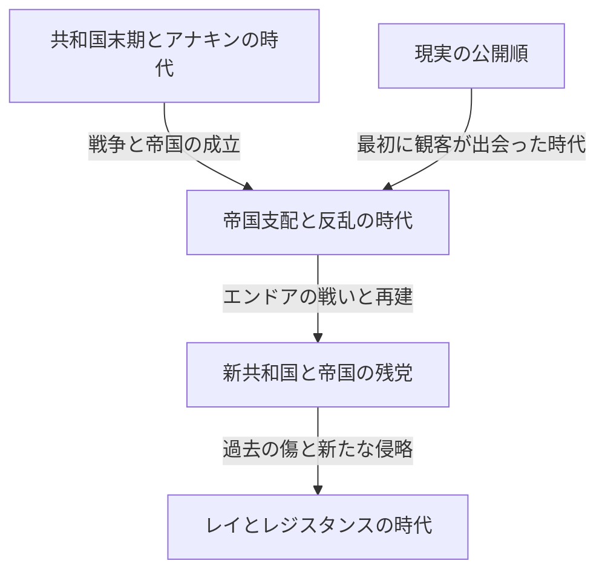
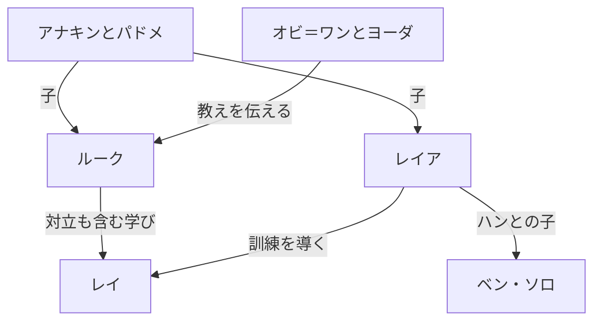

『スター・ウォーズ』をひと言で説明するなら、遠い銀河で繰り広げられる冒険の物語です。しかし、その冒険には、親子の愛憎、民主制の崩壊、帝国への抵抗、宗教と権力、戦争で生まれる傷、血縁を超えた家族が折り重なっています。さらに画面の向こう側には、模型、編集、音楽、音響、コンピューター・グラフィックスを変えてきた映画制作の歴史があります。

ライトセーバーやダース・ベイダーを知っていても、作品が増えるほど全体像は見えにくくなります。なぜエピソード4から公開されたのか。ジェダイは正義の騎士なのに、なぜ共和国を守り切れなかったのか。アナキン、ルーク、レイの物語は何を受け継ぎ、何を変えたのか。『キャシアン・アンドー』や『マンダロリアン』は、映画の付録以上の何を描いているのか。

この記事では、その疑問を「銀河の物語」「作品同士の関係」「現実の制作史」という三つの層から読み解きます。全設定を辞書のように列挙するのではなく、主要な作品の因果関係と、繰り返されながら変化するテーマを理解するための長い案内です。枝分かれした世界の広さを示しながら、初めて触れる人にも迷わない順路を用意します。

本文は、映画9部作と関連作品の結末、人物の正体、重要な死や選択に踏み込みます。未鑑賞で驚きを残したい場合は、最初の作品整理と末尾の鑑賞順の案内を先に読み、個別作品の章を鑑賞後に戻って読む方法がおすすめです。内容と公開状況の確認基準日は2026年10月3日です。挿絵はこの記事のために生成したコンセプトアートで、公式の場面写真や制作記録ではありません。

## 最初に分ける三つの時間：公開順、物語内の歴史、設定が作られた順

スター・ウォーズがわかりにくくなる最大の理由は、時間が一列ではないことです。1977年に初公開された映画は、物語内では後にエピソード4と位置付けられます。観客はルークの冒険を先に知り、その父アナキンの青年期を1999年以降に見ることになりました。作中の古い出来事ほど、古い時代に撮影されたわけではありません。

さらに、作り手が設定を考えた順序も別です。後の作品で明らかになった関係が、初期の場面を違って見せることがあります。そのことと、「最初の映画を作った時点で、何十年後のすべての物語が決まっていた」という主張は同じではありません。制作の過程で発展した作品を、完成後の整合性だけで逆算しないことが大切です。

この三つを区別すると、前日譚を見る楽しさも理解できます。結末を知っているため驚きがなくなるのではなく、どこで違う選択ができたのかを考える悲劇として見られます。一方、公開順なら、情報を知らされるタイミングを初公開時の観客に近い形で経験できます。どちらにも固有の価値があり、知識量を競うための唯一の正解はありません。

| 映画のまとまり | 初公開年 | 中心となる問い |
| --- | --- | --- |
| エピソード4・5・6：オリジナル三部作 | 1977・1980・1983年 | 圧倒的な権力へどう抵抗し、家族の過去と向き合うか |
| エピソード1・2・3：プリクエル三部作 | 1999・2002・2005年 | 共和国とアナキンは、なぜ守ろうとしたものを失うのか |
| エピソード7・8・9：続三部作 | 2015・2017・2019年 | 前の世代の勝利と失敗を、次の世代はどう受け継ぐか |
| 『ローグ・ワン』『ハン・ソロ』 | 2016・2018年 | 本編の脇にいた人々や過去の選択をどう描くか |
| 劇場版『クローン・ウォーズ』 | 2008年 | 長い戦争を、人と人との関係としてどのように広げるか |
| 『マンダロリアン・アンド・グローグー』 | 2026年 | 帝国崩壊後の銀河で、保護と共同体をどう考えるか |

年は原則として最初の劇場公開年で、日本公開年とは異なる場合があります。作品の公開順と大まかな時系列は[公式の映画・シリーズ案内](https://www.starwars.com/news/star-wars-movies-and-series-guide)で確認できます。短編アンソロジーのように一つの番組が複数時代を扱うものは、番組名だけを一本の年表の一点へ置くと誤解を招きます。

この図は主要な映像作品を理解するための骨格です。帝国が一度の戦闘で銀河の隅々から消滅した、といった意味ではありません。政権の象徴的な敗北と、軍事組織や行政、犯罪、人々の意識の変化は、別々の速度で進みます。その時間差に多くの派生作品の物語があります。

## カノンとレジェンズ：どの物語が、どの連続性に属するのか

カノンは、現在の公式な物語の連続性を考える際の枠組みです。レジェンズは、それまでに広がった多数の小説、コミック、ゲームなどを整理するために用いられる区分です。2014年、ルーカスフィルムは既存のエクスパンデッド・ユニバースの扱いを改め、映画と『クローン・ウォーズ』を軸とする新たな展開を示しました。[当時の公式発表](https://www.starwars.com/news/the-legendary-star-wars-expanded-universe-turns-a-new-page)が、この転換を説明しています。

レジェンズになったことは、作品が消えたことや、読む価値がなくなったことを意味しません。別の時代に、別の制約と可能性の下で育った銀河の物語として読むことができます。反対に、古い作品の名前や発想が新作へ再登場しても、以前の経歴や出来事が一括して新しい連続性に入るわけではありません。同じ名前を見つけたときほど、どの作品のどの設定かを確かめる必要があります。

また、公式に作られた作品がすべて同じ連続性を共有するわけではありません。『ビジョンズ』のように既存の時系列から自由な表現を探る企画もあります。ゲームで遊べる行動のすべてが物語上の出来事になるとも限らず、プレイヤーの選択肢と、続編が前提にする出来事の区別が必要な場合もあります。

ここで避けたいのは、設定の分類を作品の優劣の判定にしてしまうことです。カノンは接続関係を知る手がかりであり、感動の強さを点数化する仕組みではありません。映像の描写、公式資料、登場人物の発言、観客の解釈も、それぞれ別の種類の情報です。登場人物が信じている説明を、そのまま世界の全知的な真実とみなさない読み方も大切になります。

この記事では、現在の主要映像作品の連続性を基本とし、レジェンズや独立した企画へ触れる際はその位置付けを区別します。「描かれていること」と「そこからどう読めるか」も分けます。たとえばジェダイの制度を批判的に読むことはできますが、それは観客の分析であり、すべてのジェダイの善意を否定する公式設定と同じではありません。

## 銀河へ入るための小さな人物地図

中心にいるのは、スカイウォーカー家をめぐる複数世代です。アナキンとパドメの子がルークとレイア。レイアとハンの子がベン・ソロで、後にカイロ・レンを名乗ります。ただし、物語の継承は血縁だけでは説明できません。オビ＝ワンとヨーダからルークへ、アナキンからアソーカへ、そしてレイを含む次の世代へと、教え、失敗、選択が受け渡されます。

R2-D2やC-3POは、その歴史を人間とは異なる位置から渡り歩きます。チューバッカ、ランド、反乱軍の仲間たちは、一族の内面の問題を銀河全体の戦いへ接続します。後のシリーズでは、キャシアン、ディン・ジャリン、グローグー、クローンたちなどが、英雄の中心から離れた場所で生きる人々の時間を見せます。

家族の線と師弟の線を分けて見ると、銀河の物語が単なる王家の系図ではないことがわかります。何を受け継いだか以上に、それをどう使い、何を拒むかが問われるからです。それでは、観客がこの銀河へ入った最初の三部作から、各作品の働きを見ていきましょう。

## エピソード4『新たなる希望』――銀河の政治が、一人の若者の人生に届く

1977年に公開された最初の映画は、物語世界の歴史では途中から始まります。観客は帝国成立の詳しい経緯を知らないまま、巨大な軍艦に追われる小さな船を見ます。大小の対比だけで、追う側と追われる側の力の差がわかる。この映画の導入は、世界設定を説明し尽くしてから物語を動かすのではなく、事件を理解するために必要な情報を、人物の行動から渡していく設計です。公開日と基本的な物語の位置づけは[公式作品ページ](https://www.starwars.com/films/star-wars-episode-iv-a-new-hope)でも確認できます。

### 冒険の出発点は、選ばれた者としての自覚ではない

タトゥイーンの農場で暮らすルーク・スカイウォーカーは、最初から銀河を救おうとしていません。日常の狭さから逃れたい若者です。ところが、家に来たドロイドが反乱軍の情報を運んでおり、レイアの救援メッセージが、隠遁していたオビ＝ワン・ケノービへと彼を導きます。政治的な争いが遠い場所のニュースである間は、ルークには農場へ戻る選択肢がある。しかし帝国の暴力が養父母を奪ったことで、その境界が崩れます。

ここでの因果関係は重要です。ルークが冒険を選んだので帝国と関係を持つのではなく、帝国の支配から無関係でいようとする生活そのものが壊される。物語は個人の成長であると同時に、権力の暴力が周辺の暮らしまで侵入する過程でもあります。ただし、悲しみだけが彼を英雄にするわけではありません。師や仲間と出会い、行動の仕方を学び、他者を助ける方向に能力を使うことで、出発時の願望に公共的な意味が加わります。

レイアは救出される人物ですが、救出を待つだけの人物ではありません。情報を隠し、尋問に耐え、脱出時にも行動を決めます。ルークとハンが彼女を助けるつもりで入った施設の中で、むしろ彼女が二人の不手際を補う。役割が固定されないからこそ、三人は単純な英雄・助手・褒美の関係にならず、互いの判断を揺さぶる集団になります。

### デス・スターは大砲であり、統治思想でもある

デス・スターの恐ろしさは、惑星を破壊できる火力に尽きません。その力を見せることで、日常的な交渉や代表制を不要にしようとする構想が背後にあります。元老院の解散と、恐怖で各星系を従わせるという発想は結びついています。アルデラーンの破壊は、軍事拠点の攻略を超えて、抵抗を考えるすべての人への威嚇です。

対する反乱軍は、同じ規模の兵器を持っていません。設計図を読み、小さな弱点を発見し、限られた戦力を集中させます。勝利の条件は、情報を運ぶドロイド、設計図を託す人々、分析する人々、戦闘機を整備する人々の仕事がつながることです。最終的な一撃を放つのはルークでも、その一撃が可能になるまでには社会的な協力がある。この構造を見落とすと、作品が単純な「特別な血筋の個人が全部解決する話」に見えてしまいます。

ハンの帰還も、その協力の一部です。金銭を基準に行動していた彼が、危険を承知で仲間を助ける。ルークが照準装置だけに頼らずフォースを信じる瞬間と、ハンが報酬だけで決めるのをやめる瞬間は、どちらも、目に見える損得を超えた信頼への移行として読むことができます。技術を捨てよという話ではありません。戦闘機も通信も設計図も必要なまま、最後の判断に何を加えるかが問われています。

もう一つ注目したいのは、銀河の歴史が、整備の必要な機械や生活費の話として画面に入り込むことです。ファルコンは速いだけの理想的な乗り物ではなく、持ち主が苦労して動かす船です。酒場には主人公に説明を与えるためだけではない客がいて、ドロイドには売り買いされる生活があります。画面の中心以外でも物事が進んでいるように見えるため、観客はすべてを知らなくても、その世界が続いてきたと感じられます。

## エピソード5『帝国の逆襲』――敗北によって、英雄の自己理解が壊れる

前作の勝利は、帝国の消滅を意味しませんでした。反乱軍はなお逃亡する側であり、ホスの基地も維持できません。本作は、巨大兵器を壊しただけでは制度も軍隊も消えないという現実から始まります。1980年公開の映画で、ルークの修行と、ハンたちの逃避行を並行して進める構成になっています。[公式作品ページ](https://www.starwars.com/films/star-wars-episode-v-the-empire-strikes-back)

### 修行で問われるのは、石を持ち上げる技術以上のもの

ダゴバでヨーダに会うルークは、偉大な師に期待する外見や振る舞いを裏切られます。小柄で奇妙な生物を見て、その知恵をすぐには理解しない。これは観客にも働く仕掛けです。強さを巨大な身体や武器の大きさと結びつける感覚を崩したうえで、フォースの学習を始めるのです。

洞窟の場面では、ルークが倒したヴェイダーの仮面の内側に自分の顔が現れます。映画は、この像を単なる未来の映像として確定しません。敵への恐怖や怒りに従えば、敵と同じものになりうるという警告として読めます。前作では帝国という外部の敵を倒すことが課題でしたが、ここでは敵を倒そうとする自分の心も検討対象になります。

仲間が苦しむ幻を見て、ルークは修行を中断します。この判断を、優しさだから全面的に正しい、未熟だから全面的に誤り、と切り分けるのは簡単ではありません。仲間を見捨てられない動機は理解できる一方、自分の力と情報の限界を見誤っています。しかも、ヴェイダーはその感情を利用して彼を誘い出している。善意は、状況判断を不要にはしないのです。

### ランドの取引と、支配に対する妥協の限界

クラウド・シティのランドは、都市を守るために帝国と取引します。しかし、支配者が約束を一方的に変更できる関係では、契約だけで安全を確保できません。条件に従えば次の要求が来る。彼の失敗は単なる性格上の裏切りだけではなく、圧倒的な暴力の下で自治を保とうとする政治的な失敗でもあります。

それでも、いったん誤った人物が最後まで誤り続けなければならないわけではありません。ランドは救出に動きます。この作品ではルークが失敗し、ランドが裏切り、ハンが捕らえられますが、人物の価値はその瞬間の成功率だけでは決まりません。自分の行動を修正できること、助けを求めること、助けに応えることが、勝利とは別の尺度として残ります。

ヴェイダーが父であるという告白は、善悪の分類を消すための仕掛けではありません。帝国の暴力が正当になるわけではない。壊れるのは、ルークが自分を善い父の息子、敵をその父を殺した他人と考えていた、整然とした家族史です。敵を倒せば父に近づけるという構図が、敵とどう向き合えば父を受け継げるのかという難問に変わります。

決闘の結末でルークは勝者になりません。身体を傷つけられ、自分では脱出できず、レイアたちに救われます。第一作で救いに行った相手に救われることが、英雄の孤立を否定しています。自立とは誰にも頼らないことではなく、誤りや弱さを抱えたまま関係の中に戻ることでもある。その意味で、本作の暗い終わり方は、単なる次回への引き延ばし以上の働きを持っています。

ホスの白い広がり、ダゴバの湿った閉鎖性、クラウド・シティの明るい外観と暗い内部も、単なる観光的な背景ではありません。軍事的な敗走、内面への降下、見かけの安全の崩壊を、場所の感触が支えています。移動するたびに主人公が得意とする行動が通用しなくなり、戦闘機で勝った経験が、修行や交渉や父との対話の解答にはならないことが示されます。

生成コンセプトアート。反乱と帝国の力の非対称性を表現した挿絵であり、公式映画の場面写真ではありません。

## エピソード6『ジェダイの帰還』――父を救うことと、帝国を倒すこと

1983年の完結編は、ハンの救出から始まり、個人の関係の修復と銀河規模の戦いを重ねていきます。ジャバの宮殿でのルークは、第一作の青年より落ち着き、力の使い方にも自信があります。しかし、その外見だけではジェダイとしての成熟は証明されません。最後に問われるのは、勝てるときに何をするかです。[公式作品ページ](https://www.starwars.com/films/star-wars-episode-vi-return-of-the-jedi)

### 皇帝の罠は、死よりも怒りを目的にしている

皇帝は反乱軍を軍事的に壊滅させようとする一方、ルークを自分の側へ引き込もうとします。仲間が危機にある様子を見せ、怒りで攻撃させ、その感情の延長で父を殺させる。ルークがヴェイダーを倒しても、同じ支配の論理を受け入れれば皇帝の勝ちです。だからこの決闘には、勝敗と倫理的な成功が逆転しうる構造があります。

ルークはレイアへの脅しに激昂し、ヴェイダーを圧倒します。父の機械の手と自分の手を見比べる瞬間は、洞窟の幻が具体的な選択として戻ってくる場面です。ここで武器を捨てることは、危険がないから非暴力を選ぶことではありません。自分が殺される可能性を受け入れて、父を殺すことを拒みます。強さを証明するために敵を破壊するという尺度から、彼は降りるのです。

ヴェイダーが皇帝に反抗するのは、息子が苦しむ姿を見た末の選択です。ここには救済がありますが、過去の犯罪が帳消しになったという説明はありません。息子が父の善性を信じることと、被害者が加害者を許す義務を負うことは別です。映画は父子の関係の中で最後の転換を描きますが、法的責任や歴史的記憶のすべてを処理する場面ではありません。この区別を保つと、感動を損なわずに結末の限界も理解できます。

### 森の戦いが、玉座の間と同じくらい必要な理由

皇帝との対決だけを切り取ると、世界が家族の問題だけで動いているように見えます。しかし実際には、エンドアの地上部隊がシールドを停止しなければ、艦隊は第二デス・スターを破壊できません。ルークが父を救うことと、反乱軍が軍事施設を破壊することは、並行して必要です。一方がもう一方を自動的に代行しません。

イウォークは、その共同作戦に土地の知識と別種の戦い方を持ち込みます。帝国は装甲や火力で優位に立ちますが、目の前の住民を十分な主体として扱わない。その侮りが、地形や奇襲を利用する抵抗を見誤らせます。もちろん現実の戦争一般で素朴な武器が常に高度な軍隊に勝つという法則ではありません。寓話として、支配する側が小さな存在の判断や連帯を過小評価する弱さを可視化しています。

ルーク、ハン、レイア、ランド、チューバッカ、ドロイド、名も知られぬ兵士、エンドアの住民。その複数の働きが最後に合流するため、祝宴は一人の戴冠式ではありません。父を失ったルークが共同体へ戻る結末でもあります。個人の喪失と公共的な勝利が同時に存在することが、この映画の幸福を単純な無傷の大団円にはしていません。

また、皇帝の敗北は、自分以外の人間も最後まで損得と恐怖で動くという見積もりの失敗です。息子が父への信頼を捨てないこと、父が支配者への服従より息子を選ぶことは、彼の計算から外れます。フォースの能力の大きさだけでは、人間の選択を完全には予測できない。ここに、兵器の巨大さへの過信と、人心を読み切ったという過信の共通点があります。

## エピソード1『ファントム・メナス』――帝国は、最初から帝国の顔をしていない

1999年公開の前日譚は、第一作のような明快な軍事独裁からではなく、共和国の内部で起きる紛争から始まります。通商連合によるナブー封鎖は、貿易や課税の対立が武力による占領へ変わった事件です。少女の女王パドメ・アミダラは、議会に訴えれば事実が認められ、救援が得られると期待します。しかし制度は調査や手続きにとどまり、現場の苦痛と意思決定の速度が噛み合いません。[公式作品ページ](https://www.starwars.com/films/star-wars-episode-i-the-phantom-menace)

### パルパティーンは、危機の解決者として支持を得る

観客が後の歴史を知っている場合、ナブー選出のパルパティーン議員の助言は二重に見えます。彼は被害を受けた側に寄り添い、無能に見える指導者への不信を利用する。ここで重要なのは、彼が議会の外から侵入して共和国を一撃で壊すのではなく、議会の手続きと人々の期待を使って地位を上げる点です。

映画内の敵は一枚岩でもありません。通商連合は自分たちの利益を求めて行動しますが、ダース・シディアスはそれをより大きな計画の道具にしています。表面の紛争を収めても、その紛争が生んだ権力移動は残る。ナブーの解放は本物の勝利ですが、共和国全体の将来にとっての勝利とは限らない。祝賀の場面に不穏さが残るのは、この二つの尺度が食い違うからです。

パドメがグンガンに協力を求める場面は、それとは反対の政治を示します。代表者として威厳を守ることより、互いに同じ惑星に生きているという関係を認め、助けを請う。軍事力の不足を埋めるだけでなく、それまで距離のあった集団同士が共通の目的をつくる。この小さな連帯は、議会で得られなかった具体的な行動力を生みます。

### アナキンの才能より先に、彼の生活を見る

幼いアナキンは驚異的な操縦能力を持ちますが、奴隷でもあります。巨大な共和国が存在し、ジェダイが正義を語る世界で、母と子の自由は保証されていない。この事実は、制度があることと、その保護がすべての地域へ届くことの違いを示しています。クワイ＝ガンがアナキンを解放できても、母シミまで同じ方法で救うことはできません。

旅立ちは、能力を認められる幸福と、母を残して去る恐れが重なった出来事です。後のアナキンを「恐れを克服できなかった弱い人」とだけ捉えると、その恐れが生まれた条件を見落とします。他方で、過酷な生い立ちが後の加害を必然にするわけでもありません。物語は、傷を抱えた人にどのような支えや教育が必要だったのかという問いを開きます。

クワイ＝ガンの死によって、アナキンを見いだした師は、彼を長く導く師にはなれません。オビ＝ワンが約束を引き継ぎますが、二人の関係は最初から完成していたわけではない。大きな予言と制度的な期待が、一人の子どもの発達より先に走り始める。その不均衡が、前日譚全体の悲劇を準備します。

制作面では、前日譚を「すべてコンピューターで作った映画」とまとめるのも不正確です。公式の制作紹介は、ポッドレースの観客を表す模型に色付きの綿棒が使われたことなど、実物の工夫も紹介しています。新技術と手作業を組み合わせて画面を成立させる、という理解のほうが実態に近いでしょう。[公式の制作トリビア](https://www.starwars.com/news/25-fun-facts-the-phantom-menace)

終盤の戦闘が複数の場所で進む構造も、各集団の役割を区別するのに役立ちます。グンガンの陽動、宮殿での行動、宇宙での戦い、ジェダイとシスの決闘は、それぞれ別の問題を解いています。強い剣士が一人いれば占領が終わるのではありません。しかも軍事的な成功の裏でクワイ＝ガンが失われるため、共同体の勝利と少年の人生にとっての損失が一致しないことまで見えてきます。

## エピソード2『クローンの攻撃』――戦争への準備が、選択肢を狭めていく

2002年の第二部では、共和国から離脱しようとする分離主義勢力が拡大し、軍隊の創設が政治課題になります。パドメ暗殺未遂の捜査から、オビ＝ワンはクローン軍の存在にたどり着きます。危機に備える議論をしていたはずの共和国の前に、すでに完成した軍隊が現れる。安全保障上の切迫と、出自の不透明な便利さが組み合わされています。[公式作品ページ](https://www.starwars.com/films/star-wars-episode-ii-attack-of-the-clones)

### 調査すべき謎が、戦争の必要性に追い越される

クローン軍がどのように発注され、誰の利益のためにつくられたのかは、本来なら最優先で調べるべき問題です。しかし敵の軍隊が目前にあるとき、人々は今すぐ使える戦力を求めます。危機は、吟味の時間を奪うことで意思決定を変えます。軍隊の採用は、十分に検証されたからではなく、代替手段がないように見える状況の中で進むのです。

ドゥークーが共和国に対して示す批判には、制度の腐敗という現実の問題が含まれます。しかし問題を正しく指摘できることは、その人物の解決策が公正であることを保証しません。彼自身がシス側の計画に参加している以上、共和国への失望がそのまま解放へつながるわけではない。両陣営の表向きの対立と、それを利用するシディアスの立場を分けて見る必要があります。

ジェダイも、平和を守るために戦場へ向かい、将軍として軍隊を率いる立場へ移ります。救出作戦に成功しても、それによって戦争が始まるという逆説があります。目先の人命を守る行動と、長期的に軍事的な秩序を強化する効果が同居する。善い目的のために取った手段が、その組織の性格を変えていく過程です。

### 恋愛と政治に共通する、制御したいという欲望

アナキンとパドメの関係には、身分や職務、ジェダイの規律という障害があります。秘密の結婚は、二人の愛情を守る一方で、助言や支援を受けられる範囲を狭めます。困難を共有できる相手が減るため、後に恐れが強まったとき、その恐れを外部から検討しにくくなります。

母を失ったアナキンは、タスケンの集落で子どもを含む人々を殺します。この場面は、怒りの強さを示す演出として流してよい部分ではありません。愛する人への暴力を経験したことが、無関係な人々への暴力の正当化に変わる、明確な倫理的な破綻です。悲しみには理解の余地があっても、行為には責任がある。後の転落は突然の方向転換ではなく、すでにここで重大な境界が越えられています。

また、望ましい結果が得られるなら強い指導者が決めればよい、というアナキンの政治観は、親密な関係で喪失を制御したい願望と響き合います。人々が異なる意思を持つこと、愛する人にも自分の支配外の人生があることを受け入れるのは難しい。だからといって強制によって不確実性を消そうとすれば、守りたい関係そのものが壊れる。この問題が次作で極端な形を取ります。

クローン軍の均一な外見には、人間を交換可能な戦力として扱う不気味さもあります。同じ由来を持つ兵士であっても、命まで同じものとして数えてよいわけではありません。映画では大規模な軍隊の出現が先に印象づけられ、後の作品では個々の兵士の人格が掘り下げられます。この順序を意識すると、共和国の救済に見えた軍隊を、誰がその救済の費用を負担するのかという視点で見直せます。

## エピソード3『シスの復讐』――救いたいという願いが、支配の論理に変わる

2005年の第三部では、クローン戦争の終結が近づく中で共和国が崩壊します。戦争に勝てば平和へ戻れるという期待に反して、戦争を遂行するために集中した権力が、戦争後の独裁の基盤になります。アナキンの転落と共和国の転落が同時に進むため、この映画の悲劇は個人の心の弱さだけにも、制度の失敗だけにも還元できません。[公式作品ページ](https://www.starwars.com/films/star-wars-episode-iii-revenge-of-the-sith)

### パルパティーンが売るのは、死を支配できるという約束

アナキンはパドメを失う未来を恐れます。パルパティーンはその恐怖を正面から否定せず、ほかでは得られない力があると示唆します。これは単に悪の教義を説くより巧妙です。相手が最も失いたくないものを見定め、それを守るために自分が不可欠だと思わせる。依存が強まるほど、矛盾した説明や犯罪的な要求も受け入れやすくなります。

ジェダイ評議会とアナキンの間にも不信があります。彼は認められていないと感じ、評議会はパルパティーンとの近さを警戒する。そのうえ諜報の役割まで求められ、忠誠の向け先が分裂します。ただし、この状況を説明することと、彼の行為を免責することは別です。パルパティーンを守るためにメイス・ウィンドゥを阻止した後、アナキンはさらに破壊的な命令へと従っていきます。

一度重大な過ちを犯すと、人は引き返すよりも、その過ちに意味があったと思える道を選びたくなることがあります。アナキンの行動は、この自己正当化の連鎖としても読めます。ここまでやった以上、力を手に入れなければすべてが無駄になる。その考えが、次の加害を必要な犠牲に見せてしまいます。

### オーダー66は、制度の内部にあった殺傷能力が向きを変える

ジェダイを襲うのは、遠くから現れた新しい敵軍ではなく、共に戦ってきた兵士たちです。軍事組織の命令系統が反転すると、味方であることを前提にした配置や信頼が弱点になります。映画では命令と一斉攻撃が描かれ、クローン兵の制御の詳しい仕組みは関連アニメで補われます。映画だけの説明と後の補足を区別することで、作品ごとの役割も見えます。

帝国の成立も、共和制の建物がすべて破壊された瞬間ではありません。議場で、新しい秩序として宣言されます。安全を回復するという言葉の下で、監視や暴力が恒久的な統治へ組み込まれる。反対するジェダイを反逆者として描くことで、権力集中への抵抗が秩序への攻撃に読み替えられます。

ムスタファーで、アナキンは救うはずだったパドメに暴力を向けます。相手が自分に同意しないとき、彼女自身の意思を尊重する代わりに、裏切りと解釈する。この瞬間、愛情と所有欲の違いが鮮明になります。彼が望んだ未来には、パドメの生存だけでなく、自分の選択を肯定してくれる彼女が必要だったのです。

身体を焼かれたアナキンが装甲に包まれる場面と、双子が生まれる場面は、絶望と次の可能性を同時に示します。オビ＝ワンもヨーダも勝利者ではありません。それでも子どもを守る行為が、政治的敗北の中で残せる未来になります。前日譚は、善人がいなくなったために悪が勝つ話ではなく、善意、恐怖、制度、野心の組み合わせが破局を生む話として完成します。

オビ＝ワンの悲嘆も、悪人を発見して倒したという満足からは遠いものです。彼は弟のように思っていた相手と戦わなければならず、自分の教育や判断への問いも残ります。だから二人の決闘の長さは、技量を比べるだけでなく、互いをよく知る者同士が関係を切断できない苦しさとして見ることもできます。勝った側にも、その勝利を喜べる場所はありません。

## エピソード7『フォースの覚醒』――過去の英雄を知らない世代が、過去を受け継ぐ

2015年の新章で、レイやフィンにとって反乱の英雄たちは半ば伝説です。観客には親しい名前でも、若い登場人物には距離がある。この差によって映画は、シリーズを見てきた人の記憶と、初めて入る人の驚きを同じ画面に置きます。帝国後の世界にファースト・オーダーが現れ、かつての勝利だけでは次の世代の安全が保証されないことが示されます。[公式作品ページ](https://www.starwars.com/films/star-wars-episode-vii-the-force-awakens)

### フィンは、最初に命令を拒むことで主人公になる

フィンの出発点は優れた血統や予言ではありません。兵士として従うことを要求された場面で、殺すことを拒む。この選択によって、彼は組織の番号でしかなかった立場から、自分で決める人物へ変わり始めます。ただし、すぐに銀河全体を救う覚悟が完成するわけではなく、当初は逃げたい気持ちも強い。恐怖が消えてから善い行動をするのではなく、恐怖を抱えたまま誰かのために踏みとどまる過程が描かれます。

ジャクーのレイは、生き延びるための技術を身につけながら、帰ってくるかもしれない家族を待っています。彼女の停滞は能力不足ではなく、過去への期待に結びついています。故郷を出るとは、単に別の惑星に移動することではありません。待ち続ければ元の人生が戻るという希望から、新しい関係を自分でつくる可能性へ進むことです。

### カイロ・レンは、ヴェイダーの強さよりも像を欲しがる

ベン・ソロは、自分をカイロ・レンとしてつくり直そうとします。祖父ヴェイダーを崇拝しますが、その祖父が最後に息子を救ったことは、彼が求める強い悪の像と噛み合いません。人は過去をそのまま受け継ぐのではなく、自分が必要とする部分だけを選び取ることがある。カイロの姿は、歴史の継承が誤読にもなりうることを示します。

ハンを殺す行為も、冷静な悪人が邪魔者を排除するだけの場面ではありません。家族への愛着を断てば強くなれると考え、自分を作り替えようとする。しかし、暴力を振るったから葛藤が解消されるとは限らない。揺れを消すための行為が、むしろ新しい傷を生みます。レイの物語が他者とのつながりを獲得する方向へ進むのに対し、カイロはつながりを切断することで自分を確立しようとしています。

スターキラー基地や地図を運ぶドロイドなど、第一作と似た構造は明白です。それを懐かしさとして楽しむことも、構造上の反復と批判することもできます。ただ、分析上は「似ている」で止めず、同じ位置に置かれた人物の選択の違いを見ると有益です。帝国の兵士だった者が主人公になり、救援を待つ少女が自ら抵抗し、英雄の息子が敵となる。同じ輪郭の中で、受け継ぐことの不安が中心へ移っています。

新共和国の中枢が破壊される場面は、政治秩序が脆いことを強烈に示す一方、その秩序の日常を映画が長く描いていないため、観客にとって喪失の具体像がつかみにくい面もあります。これは作品の説明上の限界として指摘できます。関連作品の知識があれば重みは増しますが、それを知らない観客の理解不足にすべてを帰すべきではありません。作品内で伝わる情報の量そのものが、鑑賞体験を左右します。

## エピソード8『最後のジェダイ』――失敗を認めても、責任を放棄しない

2017年の第二部は、レイがルークに会えば問題が解けるという期待を崩します。ルークは、英雄として再び立つことから退いています。同時にレジスタンスは追撃を受け、少ない資源で生き残る判断を迫られる。個人の英雄像と、組織の指導のあり方を並行して問い直す映画です。[公式作品ページ](https://www.starwars.com/films/star-wars-episode-viii-the-last-jedi)

### 過ちの告白は、すべてを諦める理由になるのか

ルークとベンの過去は、異なる視点から語られます。ルークが感じた一瞬の恐れと、それを見たベンの恐怖では、同じ場面の意味が変わる。ここで描かれるのは、事実など存在しないという相対主義ではありません。自分が何を考えていたかと、相手が実際に何を経験したかの差です。一瞬だった、後悔した、という説明だけで、相手に与えた傷が消えるわけではありません。

ルークは、自分の失敗をジェダイ全体の失敗と結びつけ、その伝統を終わらせようとします。ジェダイの歴史への批判には考える価値がありますが、批判が自分の不在を正当化するだけになれば、現在苦しむ人々への責任から離れてしまいます。伝統を無条件に守ることと、失敗したから全部捨てることの間に、学んで渡し直す道が必要になります。

レイとカイロは互いを理解できる可能性に触れますが、理解と合意は違います。共通の孤独があっても、他人を支配する秩序を受け入れる必要はない。カイロがスノークを倒したことで、彼が自動的に善の側へ来るわけでもありません。支配者を殺すことと、支配の仕組みを拒むことは別であり、彼はその空いた席に座ろうとします。

### 勇気と指揮には、違う時間の尺度がある

ポーは目前の敵を破壊する勇気を持ちますが、その成功にどれだけの人員と戦力を失うかを学ばなければなりません。一回の戦闘で目立つ成果を出すことと、組織を次の日まで生き延びさせることは違います。指揮する立場では、攻撃しない判断や撤退も責任の一部になります。

一方で、ホルドとの対立には情報共有の難しさもあります。観客は、誰が何を知っているかがずれた状態を経験します。ここから一律に「部下は黙って従うべきだ」と結論づけるのは狭すぎます。危機の下での秘密保持、信頼、指揮権、説明の不足が衝突した状況として捉えたほうが、登場人物の長所と欠点の両方を見られます。

カント・バイトの挿話は、戦争の外側に見える繁栄も、兵器や搾取を通じて戦争と結びつくことを示します。フィンは、特定の友人を守りたい段階から、より広い抵抗の意味を理解する方向へ進みます。ただし、搾取する者が両陣営と取引することは、両陣営の政治目的が同じという証明ではありません。利益の構造を批判することと、侵略と抵抗を同一視することは分ける必要があります。

最後にルークが行うのは、敵軍を大量に殺すことではなく、生き残る時間を仲間へ渡すことです。伝説を嫌っていた人物が、伝説が持つ希望の力を引き受ける。そのうえで、身体的な勝利とは異なる方法で敵の注意を引きつけます。英雄の像を壊すことから始まり、像の使い方を選び直すことで終わる映画、と読むことができます。

レイがルークに求めたのは技術だけではなく、自分が何者なのかを外から確定してくれる答えでもありました。しかし師もまた、誤りと恐れを持つ人間です。頼る相手の不完全さを知った後で、その教えから何を受け取るかを決めなければならない。この点で、本作は弟子が師を否定するだけの物語ではなく、師を理想化しなくても学びを続けられるかという物語でもあります。

## エピソード9『スカイウォーカーの夜明け』――出自と、選び取る名前

2019年の第九作は、パルパティーンを再び最終的な敵として登場させ、レイの出自を彼の家系へ結びつけます。前作で提示された、自分は重要な家系に属さないというレイの理解は、ここで大きく更新されます。この転換の好みは分かれますが、分析ではまず、各作品で何が伝えられ、次の作品で何が加えられたかを区別したいところです。[公式作品ページ](https://www.starwars.com/films/star-wars-episode-ix-the-rise-of-skywalker)

### 血筋は能力の説明になっても、倫理の命令にはならない

レイが恐れるのは、悪の系譜が自分の未来を決めてしまうことです。しかし、物語の結末は出自への服従ではなく、どの教えや関係を引き受けるかという選択へ向かいます。ここでの論点は「血筋は無関係だった」で簡単に片づきません。映画は血縁を大きな仕掛けとして使っています。その一方で、血縁から導かれるはずの役割を拒むことで、主人公の自由を描こうとしています。

ルークとレイアとの関係は、レイにとってその別の継承路です。最後にスカイウォーカーの名を選ぶことは、生物学的な系譜の申告というより、受け継ぎたい価値と育ててくれた関係の表明として読めます。ただし、名前を選べば苦しみや過去が消えるのではありません。過去を知った後で、自分をどう名乗るかという行為に意味が置かれています。

パルパティーンの帰還の技術的な詳細は、映画だけでは説明が限られています。関連資料による補足と、映画で直接示された情報を混同して、画面内ですべてが解明されたように語るべきではありません。劇中で重要なのは、彼が死への恐れと権力への執着から、次の身体や世代さえ道具として扱うことです。アナキンに命の支配を持ちかけた人物が、最後まで他者を自己保存の手段にするという連続性があります。

### ベンの転換は、死を征服する発想を反転させる

ベンがカイロ・レンとしての生き方から戻る過程には、母の働きかけ、レイに命を救われる経験、父との記憶が関わります。父を殺せば葛藤から自由になれるという以前の試みは失敗しました。逆に、関係を再び受け入れることで別の選択が開かれます。ここでも転換は過去の加害を無かったことにしませんが、今この瞬間に別の行為を選ぶ可能性は残されます。

彼がレイへ命を与える結末は、愛する人を失いたくないから他者を犠牲にしたアナキンと対照的です。命を保持するために世界を支配するのではなく、自分の側から与える。この対比は、九作品を通した「救う」という言葉の意味を変えます。相手を自分のもとへ留めることと、相手が生きることを願うことは同じではありません。

エクセゴルに集まる艦隊も、レイの決闘と別の仕事を担います。恐怖で孤立させられた人々が、互いの存在を確認して集まる。その集合をどれだけ説得的に受け取るかは観客次第ですが、物語上は英雄一人の能力を超える参加が必要です。最終決戦は、血筋の争いと、血筋を持たない多数の人々の抵抗を、再び重ねる構成になっています。

九作品の結末として見るなら、タトゥイーンに戻る映像には、同じ場所へ戻っても同じ状態には戻らないという意味があります。最初の映画では遠くへ行きたい青年が地平線を見ていましたが、最後には旅を経験した人物が自分の名を告げます。始まりの風景を再利用することで、世界を広げることと、自分の立つ位置を決めることが一つの運動として閉じられます。

## 『ローグ・ワン』――英雄の一撃を可能にした、帰還できない人々

2016年公開の『ローグ・ワン』は、第一作の直前に、デス・スター設計図が反乱軍へ渡るまでを描きます。結末の大枠を知っていても緊張が失われないのは、「設計図は届くか」だけでなく、「誰が何を失って届けるか」が中心だからです。公式の制作発表では、企画の発案者がILMのジョン・ノールであること、地上の戦争という視点を重視したことが説明されています。[公式制作発表](https://www.starwars.com/news/rogue-one-the-daring-mission-has-begun-cast-and-crew-announced)

### 技術者の抵抗と、娘による意味の回収

ゲイレン・アーソは帝国の兵器開発に関わりながら、その内部に破壊につながる弱点を仕込みます。これは、制度の中に残ることが常に加担なのか、内部からの妨害はどこまで可能なのかという難問を含みます。ただし彼の事例から、あらゆる協力者が秘密の抵抗者だったと一般化することはできません。映画は具体的な一人の選択と、その選択が他者に伝わる困難を描いています。

ジンは父に関する断片的な情報を受け取り、父を単純な裏切り者として理解していた図式を修正します。重要なのは、父の善意を知るだけでは兵器は止まらないことです。弱点の情報を証明し、設計図を手に入れ、使用できる形で他者へ渡す必要がある。個人の和解が公共的な行動へ変わって初めて、父の抵抗は現実の効果を持ちます。

### 反乱軍の不正を描くことは、帝国を正当化しない

キャシアンは、反乱のために暗い仕事をしてきた人物です。彼の行動には、目的の正しさだけでは免責できない部分があります。反乱軍内部にも意見の違いがあり、危険を前にして一枚岩ではありません。こうした描写は、抵抗側も無垢ではないと示しますが、だから支配と抵抗は同じだという結論にはなりません。

むしろ、汚れた手を持つ人々が、その先に何をするかが問われます。キャシアンがジンと行動することには、過去の犠牲を、ただ犠牲のまま終わらせたくないという切実さがあります。ただし、その願いが次の犠牲を無限に正当化する危険もある。映画はその境界を、他者を使い捨てる命令と、自ら危険を引き受ける選択の差として描きます。

スカリフの戦いでは、地上の通信、宇宙の艦隊、施設内の操作が分断されています。誰か一人が強くても、別の場所で一つの接続が失われれば任務は失敗します。伝送という技術的な問題が、そのまま連帯の形になる。情報を受け渡す行為が何度も繰り返されるのは、同じことの無意味な反復ではなく、一人の生存を超えて仕事が継承される仕組みを見せるためです。

彼らは第一作の祝宴に参加できません。しかし、後の勝利の中には彼らの働きが組み込まれています。『新たなる希望』の主人公の背後に、名前も顔も知らなかった人々の代価が見えるようになる。外伝が本編の意味を豊かにするのは、このように既知の出来事の倫理的な重みを変えるときです。

チアルートの信仰も、万能の防御能力とは違います。フォースを信じることが、そのまま肉体の安全を保証しない。死を免れるための契約ではなく、危険の中で行動するための姿勢として信仰が置かれています。ジェダイの訓練を受けた主役がいない物語でも、フォースという観念が人々の判断や希望に関わることが、この人物からわかります。

## 『ハン・ソロ』――利己的に見える人物は、どのようにつくられたか

2018年の『ハン・ソロ』は、銀河全体の統治を決める戦いから少し離れ、犯罪組織や輸送、借金、取引の世界へ入ります。若いハンがチューバッカやランドと出会う経緯を通じて、第一作の人物像を別の角度から見せる作品です。公式ページが紹介するように、辺境の裏社会を通る冒険が中心にあります。[公式作品ページ](https://www.starwars.com/films/solo)

### 自由を買おうとしても、次の依存が待っている

ハンはコレリアを脱出しようとしますが、逃げるだけで自由な暮らしが完成するわけではありません。帝国軍、犯罪組織、仕事を仲介する者。生き延びる手段を得るたびに、新しい上下関係が現れます。宇宙船を持つことへの憧れが強いのは、単に操縦が好きだからだけでなく、自分で行き先を決めるための物質的な条件でもあるからです。

ベケットは、他人を信じすぎないように教える人物です。その処世術には、危険な環境で生き残るための合理性があります。しかし、すべての関係を裏切りの予測だけで組み立てれば、協力は一時的な利害関係に縮みます。ハンはその教えの一部を受け取りながら、完全には同じ人物になりません。

チューバッカとの出会いは、その違いを示します。最初の状況には生存のための利害があっても、共に危険を越える中で、単なる交換以上の関係が生まれる。後の二人の信頼を、最初から与えられた性格設定ではなく、互いに行動を見て判断する過程として考えられるようになります。

### キーラは、ハンの物語の外側にも人生を持つ

ハンは、キーラを連れ出して昔の願いを実現しようとします。しかし離れていた間に彼女が生き延びてきた世界は、彼が想像するより複雑です。再会によって昔の関係がそのまま再開するわけではありません。相手を救いたいという気持ちと、相手が現在置かれている条件を理解することの間には距離があります。

彼女の選択を単純な愛情の有無だけで説明すると、組織の中で生存するための制約や野心を見落とします。ハンを主人公にした映画であっても、他の人物の人生がすべて彼の希望をかなえるために動くわけではない。その非対称さが、若いハンの失望と成熟の一部になります。

また、エンフィス・ネストの集団についての理解が変わることで、犯罪者と抵抗者の境界も揺らぎます。輸送品を誰が所有し、誰が奪い、何に使うのか。契約上の所有者が、道徳的に正しい側とは限りません。ハンが最後に利益だけでは説明できない判断をすることは、後の反乱軍への帰還につながる性質を見せています。

この映画のハンは、第一作の人物像を完全に説明し切るための解答ではありません。人は一つの体験だけで出来上がらないからです。それでも、皮肉や自己利益の言葉の下に、他者を見捨てきれない性質が残ることはわかります。自分は善人ではないと装う人物が、行動ではその自己紹介を何度も裏切る。そのずれがハン・ソロという人物の魅力です。

ドロイドのL3-37は、この自由という主題を、人間以外の存在へ広げます。人間に便利な人格を備えた機械として扱うのか、自分の判断と要求を持つ主体として扱うのか。シリーズではしばしば笑いの中に収められてきた問題が、彼女の発言と行動では表面に出ます。映画がその問題を完全に解決するわけではありませんが、ドロイドの親しみやすさを楽しむことと、彼らが置かれた所有関係を疑うことは両立します。辺境の小さな冒険にも、銀河全体に関わる問いが潜んでいます。

## 映画の外に広がる銀河を、制度と暮らしから理解する

映画を離れてドラマやアニメーションへ進むと、スター・ウォーズの銀河は急に細かく見えてくる。皇帝を倒すことと、明日の食費を払うことは同じ問題ではない。戦場でジェダイに助けられた人と、軍事作戦に生活を壊された人とでは、同じ共和国に抱く感情も違う。この視点の差が、派生作品を単なる追加エピソード以上のものにしている。

### 中心と辺境では、同じ政治体制も違って見える

共和国の首都コルサントは、議会、官僚機構、ジェダイ聖堂が集中する政治の中心である。しかし共和国の旗が掲げられているからといって、銀河の全住民が同じ保護を受けられるわけではない。タトゥイーンのような辺境には、共和国の理念が十分届かず、犯罪組織や奴隷制度が生活を支配する場所がある。中心から見れば秩序ある国家でも、外縁から見れば遠くで議論するだけの政府でありうる。

この距離は、分離主義を理解するうえでも大切だ。独立星系連合の指導層や軍需企業が邪悪な計画に組み込まれていても、共和国に不満を持つ住民が全員悪人なのではない。汚職、政治的な無視、経済格差への不満は、陰謀とは別に存在する。パルパティーンの巧妙さは、何もないところに対立を作ることより、すでにある不満を利用して、対立の出口を自分の権力拡大へつなげた点にある。

帝国成立後も、惑星ごとの差は消えない。巨大兵器の威圧を直接経験する地域もあれば、採掘事業、治安部隊、身分証明、拘束や徴用を通して帝国を知る人々もいる。新共和国の成立後には、逆に中央の支配が後退した場所で、海賊や旧帝国の武装勢力が活動する。したがって、国家の名前だけで治安や自由を判断することはできない。どの惑星の、どの階層の、どんな仕事をする人が見ているかを考えると、同じ時代を描く作品の温度差が理解しやすくなる。

銀河の中心と辺境、異なる時代の対比を表現した生成コンセプトアート。公式の映像や設定画ではない。

### ジェダイは国家そのものではなく、国家と結びついた騎士団である

ジェダイは、フォースを扱う人すべての呼び名ではない。訓練、規律、師弟関係、共同体としての伝統を持つ集団である。共和国末期の彼らは平和の守護者を自認する一方、政治権力から独立した隠者でもない。外交に派遣され、元老院と関係を持ち、クローン戦争では将軍になる。この役割の重なりが、善意と制度的な失敗を同時に生む。

人を守るために軍を指揮する。しかし指揮官になるほど、その戦争を終わらせる政治構造から自由になれなくなる。敵兵を倒す戦術的成功が、平和の達成と一致しないこともある。ジェダイの敗北を、単に剣術が弱かったからだと考えると、この悲劇を見落とす。彼らは軍事的な戦いに取り組みながら、その戦争自体が仕掛けだったことを十分に見抜けなかったのである。

だからといって、ジェダイが帝国と同じだったという結論にはならない。過ちを犯す制度と、支配と恐怖を積極的に目的化する制度には違いがある。作品が問いかけるのは、善意があれば自己点検は不要なのかという問題だ。共和国の守護者であることと、共和国の判断に従い続けることが衝突したとき、何を優先するのか。アソーカやドゥークーを描く物語は、この衝突を個人の経験に落とし込む。

### シスと闇の使い手も、同じ集団とは限らない

赤いライトセーバーを使う敵をすべてシスと呼ぶと、組織関係が混乱する。尋問官は帝国のジェダイ狩りを担うが、シスの師弟と同じ地位にあるわけではない。ダソミアのナイトシスターには、ジェダイやシスとは異なる伝統がある。フォースの暗黒面を使うことと、特定のシスの系譜に属することは区別する必要がある。

ダース・ベインに結びつけられる「二人の掟」は、力を保持する師と、その力を求める弟子という関係を基礎にする。これは、銀河にフォースを使う悪人が二人しか存在できないという物理法則ではない。組織の継承原理であり、その周囲には協力者、暗殺者、利用される弟子候補、脱落した者が存在しうる。公式データバンクも、ベインがシスの存続のためにこの制度を導入したと説明している。[ダース・ベインの公式解説](https://www.starwars.com/databank/darth-bane)

ここにはジェダイと対照的な教育観が見える。師が弟子の成長を望むとしても、シスではその成長が師自身への脅威になる。協力関係の内部に、相手を利用し、最終的には置き換える論理が組み込まれている。皇帝とベイダー、あるいは使い捨てられたモールを考えるとき、個々の性格だけでなく、この関係そのものが不信を生むことに注目すると理解が深まる。

## 『クローン・ウォーズ』が変えた、戦争の見え方

### 映画と長編シリーズの役割

2008年のアニメーション映画『スター・ウォーズ／クローン・ウォーズ』は、同名テレビシリーズにつながる入口である。アナキンに弟子アソーカ・タノがいるという設定は、映画だけを見ていた観客には大きな追加だった。これは人物の名簿を増やすためではない。誰かを導く責任を持ったアナキンを描くことで、彼の勇敢さ、面倒見のよさ、規則への反発が、弟子との具体的な関係として現れる。

シリーズはエピソードIIとIIIの間の戦争を、共和国軍の作戦だけに限定せずに描く。外交、奴隷商人、犯罪組織、中立を維持しようとする惑星、庶民の疑念などへ視点が移る。映画で数分だった政治的背景が、日々の生活や継続的な判断になるのである。一話の勝利が全体の改善につながらないことも多く、長い戦争の消耗が見えてくる。

ただし長編シリーズを理解するために、すべてを映画の伏線探しへ変える必要はない。観客は結末を知っているが、登場人物は未来を知らない。彼らが仲間を助け、任務を達成し、小さな信頼を積み重ねる時間には、それ自体の意味がある。その時間が十分に描かれるからこそ、オーダー66は単なる歴史上の事件ではなく、築いてきた関係を破壊する出来事になる。

### クローンの同じ顔は、同じ人格を意味しない

映画の大軍の中では区別しにくかったクローン兵たちが、レックス、ファイヴス、エコーなど、それぞれ名前と判断を持つ人物になる。遺伝的に似ていることは、経験や人格が同じであることを意味しない。装甲の模様、髪形、話し方、戦友との関係が、観客に個人を見分けさせる。

ここで浮かび上がるのが、共和国の倫理的な矛盾である。自由を守る戦争が、戦うために生み出され、軍務から離れる自由を十分に持たない兵士に依存している。ジェダイの指揮官が部下を尊重する場面は多いが、個人として優しく接することだけで、制度全体の問題が解決するわけではない。兵士の勇気を認めることと、彼らが置かれた構造を問うことは両立する。

抑制チップをめぐる物語は、その矛盾をさらに残酷な形にする。忠誠は、自由な選択だけで成立していなかった。オーダー66の悲劇では、攻撃する側にも人格と友情があり、それが強制的に踏みにじられる。アソーカがレックスのチップを取り除く展開は、敵を倒すことより、奪われた判断力を取り戻すことが救いになる場面だ。[アソーカ・タノの公式データバンク](https://www.starwars.com/databank/ahsoka-tano)

### アソーカの離脱は、善と制度を分けて考える入口

アソーカがジェダイ・オーダーを去る出来事は、彼女が他者への思いやりを捨てたことを意味しない。自分を守るはずの組織が信頼を損ない、その後に復帰を求めても、傷が自動的に消えるわけではない。正しい理念を掲げる組織に所属し続けることと、自分が正しいと考える行動を続けることが、初めて切り離される。

この変化は、アナキンにとっても深刻だ。彼は弟子を守ろうとするが、彼自身が信じたい制度は期待どおりに動かない。彼の後の転落をアソーカの離脱だけで説明することはできないものの、制度への不信と、身近な人を失う恐れが結びつく過程として重要である。公式記事も、シーズン5での離脱と、その後の再会を二人の関係の転換点として扱っている。[アソーカとアナキンの別れ](https://www.starwars.com/news/ahsoka-and-anakin-final-meeting)

終盤のマンダロア包囲戦は、映画『シスの復讐』と並行する別の視点を提供する。観客はコルサントで何が起こるか知っているが、遠くの現場では情報が断片的に届く。この情報の遅れが緊張を生む。歴史の中心で起きた決定が、理解される前に現場の仲間を敵に変えてしまうからだ。

## 『バッド・バッチ』が描く、戦争のあとに残される人々

『バッド・バッチ』は特殊な能力を持つクローン部隊と少女オメガを中心に、共和国から帝国への移行を描く。政体の変更は、看板の掛け替えだけではない。軍の人員構成、忠誠の確認、地域の統制、情報の管理が変わり、かつて国家を支えた兵士も不要な存在になりうる。

主人公たちは戦う技能に優れているが、自由に暮らす技能を十分に学んできたわけではない。仕事を選び、報酬を受け取り、子どもの安全を考え、安心できる場所を探すことが新しい課題になる。作戦なら命令と目標がある。しかし生活には、これだけ実行すれば正解という命令書がない。この違いが、部隊を家族へ変えていく。

オメガの存在は、戦闘力の追加以上に大きい。彼女を守る責任が生まれることで、危険な仕事を成功させる能力だけでは判断できなくなる。今日の収入のために明日の安全を失ってよいのか。自分たちだけ逃げれば十分なのか。子どもに何を受け継いでほしいのか。軍事的合理性とは別の尺度が部隊の内部に入ってくるのである。

クロスヘアをめぐる物語では、服従が居場所を保証してくれるという期待が問われる。組織に従えば、自分の価値が認められるはずだ。しかし組織が個人を道具として扱う場合、忠誠は相互的な関係にならない。帰還や和解にも、事情の説明だけでは埋まらない傷がある。仲間になるとは、一度も間違えないことではなく、間違えた人とどのように関係を作り直すかでもある。

パブーの穏やかな暮らしは、戦争物語の休憩としてだけ置かれているのではない。何を守るために戦っていたのかを、食事、住まい、近所の人々という形で具体化する場所だ。公式データバンクはパブーを避難民の共同体として説明し、最終回の制作記事は、生き残った部隊と成長したオメガのその後に触れている。戦闘の終結を、普通の生活を選べる可能性へ接続する結末である。[パブーの公式解説](https://www.starwars.com/databank/pabu)、[最終回の出演者インタビュー](https://www.starwars.com/news/the-bad-batch-series-finale-dee-bradley-baker-michelle-ang-interview)

## 『反乱者たち』と、抵抗運動が共同体になるまで

『反乱者たち』の中心は、ロザルで生きる少年エズラ・ブリッジャーと、宇宙船ゴーストの仲間たちである。ここでは、最初から完成した反乱同盟軍が主人公を迎えてくれるわけではない。局地的な抵抗、物資の確保、情報の交換、人間関係の信頼が積み重なり、より大きな運動へつながっていく。

エズラにとって、ジェダイの訓練は超能力を習得することだけではない。自分だけで生き延びる必要があった少年が、他者と責任を分け合うことを覚える過程でもある。師となるケイナンも、完全な教育を終えた無傷の達人ではない。自分の恐怖や欠落を抱えながら、次の世代を育てる。この不完全な師弟関係が、失われた制度を人間同士の信頼から再建する物語になる。[エズラとケイナンの公式考察](https://www.starwars.com/news/always-two-ezra-and-kanan)

ヘラは操縦士であり、組織を動かす実務家でもある。サビーヌにはマンダロリアンとしての政治的な過去があり、ゼブには共同体を破壊された記憶がある。チョッパーは単なる便利な機械ではなく、荒っぽい個性を持つ仲間として関係に参加する。異なる出自の人々が、同じ理想だけでなく、生活を共有することで結びつくのである。

スローンは、この小さな共同体に対する特異な敵になる。彼は力任せに威圧するだけでなく、相手の文化や行動の型を読み取ろうとする。反乱軍側も、より大きな火力を用意すれば勝てるとは限らない。相手が予測する行動の外へ出ること、動物や土地との結びつきを含め、軍事的な計算に還元できない関係を生かすことが重要になる。

ロザル解放の結末でエズラとスローンが姿を消すことは、勝利と帰還が必ずしも同時に得られないことを示す。故郷を救う選択には、自分が故郷に残れないという代償が伴う。その空白が、後の『アソーカ』へ続いていく。[『反乱者たち』最終回公式ガイド](https://www.starwars.com/series/star-wars-rebels/family-reunion-and-farewell-episode-guide)

## 『キャシアン・アンドー』は、反乱の費用を数える

### 第1シーズン：傍観して生き延びることの限界

『キャシアン・アンドー』の特徴は、帝国の悪を巨大な象徴だけで説明しないことにある。労働、取締り、帳簿、服従への報酬、処罰への恐怖が、個人の行動を少しずつ狭めていく。最初から革命家として完成していないキャシアンを追うことで、抵抗する主体がどのように生まれるかが描かれる。

フェリックスには、仕事の道具、店、近所づきあい、葬送の習慣がある。その生活の細部が蓄積されているため、治安部隊の介入は単に敵が現れたという事件にとどまらない。住民が自分たちの時間や場所を奪われる出来事になる。帝国への反発は、抽象的な理念だけから生まれるのではなく、自分の生活を他人の都合で定義されることへの抵抗でもある。

アルダーニの作戦は、反乱には資金が必要だという現実を示す。だが資金を得る作戦には危険があり、その成功が帝国の締め付け強化を招き、無関係な人々に被害を与えることもある。抑圧を可視化して抵抗を広げるという考え方は、運動の戦略として理解できても、その費用を誰が負担するのかという倫理的問題を消してはくれない。

刑務所の物語では、囚人が互いを監視し、競争し、作業を続ける仕組みが前面に出る。暴力は、看守が毎分殴ることでだけ維持されるのではない。規則、情報の遮断、他の班への不安、自由になるという期待が、人々を動かす。そこから抜け出すには、個人の勇気だけでなく、分断された人々が同じ現実を理解する必要がある。

### 第2シーズン：抵抗が組織になるほど、矛盾も大きくなる

第2シーズンは『ローグ・ワン』へ近づく数年間を描き、キャシアン個人の変化と、反乱側の組織化を重ねる。トニー・ギルロイは公式インタビューで、最終シーズンが『ローグ・ワン』へ直接つながる構成であることを説明している。ここで大切なのは、既知の映画の直前まで出来事を埋めること以上に、そこへ到達するまでの人的な損失を見せる点である。[ギルロイによる第2シーズン解説](https://www.starwars.com/news/andor-season-2-interview-tony-gilroy)

ゴーマンをめぐる展開は、行政、資源、情報操作、軍事力が一つの支配へつながる過程を描く。市民の運動が、支配側の準備した説明に取り込まれていくとき、現場で起きたことと、公に流通する物語の間に断絶が生まれる。暴力の実行だけでなく、暴力を必要な措置として見せる仕組みまで描く点が重要だ。

モン・モスマは、政治家としての公的な顔と、資金を動かす秘密の活動と、家族の生活を同時に維持しようとする。政治的な正しさを選べば家庭の問題が自然に解決するわけではない。逆に、家庭を守るための妥協が政治的な危険を生むこともある。彼女の物語は、抵抗がいつも勇ましい演説として現れるのではなく、資金の流れや人間関係の維持という、外から見えにくい仕事を含むことを示す。

ルーセンは、反乱に必要だと判断した行為を引き受ける一方、自分の選択の醜さを認識している。認識しているから無罪になるわけではない。この人物を単純な現実主義の英雄として称賛するより、抑圧に対抗する組織が、抑圧の論理をどこまで取り込んでしまうのかという問題として見る方が、作品の緊張を保てる。

第2シーズン終盤で『ローグ・ワン』につながる情報と人物配置が整っても、すべての犠牲が報われたと断言することはできない。勝利に寄与した人の名前が、後世に必ず残るわけでもない。公式の最終回解説がルーセンの役割に焦点を当てるように、この作品は、よく知られた英雄の背後にある見えにくい労働と損失を描く。[第2シーズン最終回の公式解説](https://www.starwars.com/news/andor-season-2-finale-episodes-10-11-12)

## 『オビ＝ワン・ケノービ』と、敗北後の責任

エピソードIIIからIVまでのオビ＝ワンを描くドラマでは、かつての名将が、敗北を知った生存者になっている。使命を持って隠れていることと、心の中で希望を保てていることは同じではない。弟子の転落と仲間の死を知る人物が、再び行動する理由を見つけるまでが物語の中心になる。

幼いレイアとの関係は、彼に過去だけでなく未来を見ることを求める。アナキンを救えなかったという失敗は消えないが、その失敗を反復して考えるだけでは、目の前の子どもを守れない。過去への責任と、現在の他者への責任をどう分けるかという問題である。ドラマの公式ガイドは、この救出行を作品の主要な軸として示している。[『オビ＝ワン・ケノービ』公式紹介](https://www.starwars.com/series/obi-wan-kenobi)

尋問官リーヴァも、暴力の被害と加害が一人の中でつながる人物だ。被害を受けた経験は、その後の加害を正当化しない。しかし、敵に似た力を得なければ敵に対抗できないと思い込む心理を理解する手掛かりにはなる。最終的な選択の重みは、どれほど強くなったかではなく、自分が受けた暴力を別の子どもへ引き渡すかどうかにある。

このドラマを映画間の空白を埋める年表としてだけ見ると、出会いや再戦の整合性ばかりが気になるかもしれない。もう一つの見方は、エピソードIVの落ち着いた老賢者が、初めから何もかも受け入れていたわけではないと知る物語として読むことだ。落ち着きとは、傷がない状態ではなく、傷を抱えながら他者のために動ける状態だと解釈できる。

## 『マンダロリアン』と『ボバ・フェット』が問い直す家族と統治

### 賞金首だった子どもが、守るべき家族になる

『マンダロリアン』の初期の推進力は明快である。賞金稼ぎディン・ジャリンが仕事で出会った小さな存在を、引き渡すべき対象として扱えなくなる。契約を守ることと、目の前の生命を守ることが衝突し、彼は後者を選ぶ。その選択によって職業上の秩序から追われ、新しい関係の中に入っていく。

グローグーが魅力的なのは、守られるだけの荷物ではないからでもある。幼さと、長い過去と、強いフォースの能力が同居している。ディンが彼を守り、彼もまたディンを助ける。言語による説明が少ないぶん、視線、ためらい、身体の動き、繰り返される日常の行為が関係を語る。血統ではなく、継続的に責任を引き受けることが家族を作る。

辺境で育まれる信頼と家族の主題を表現した生成コンセプトアート。公式の場面写真ではない。

ディンのヘルメットは、防具であると同時に、信仰と共同体への所属を示す。ところが、別のマンダロリアンに出会うと、自分が普遍的だと信じていた規則が、特定の集団の教えだったと分かってくる。伝統があることと、その解釈が一種類しかないことは同じではない。自分の規律を捨てるか守るかという二択だけでなく、規律が何のためにあるのかが問われる。

ボ＝カターンの物語を含むマンダロア再建では、戦士としての正統性と、人々をまとめる政治的な能力が必ずしも一致しない。象徴的な武器の所有だけで、分裂した共同体が自動的に統合されるわけではない。協力して生き残る経験が、過去の派閥の境界を変えていく。第3シーズンの結末で、ディンがグローグーを正式に養子とすることは、共同体の再建と小さな家族の再定義を重ねる節目になる。[第3シーズン最終回の公式解説](https://www.starwars.com/news/the-mandalorian-chapter-24-the-return-highlights)

### ボバ・フェットは、恐怖で従わせる支配から何を変えようとするのか

『ボバ・フェット／The Book of Boba Fett』は、かつての賞金稼ぎを、地域を統治しようとする人物へ移す。誰かに雇われて標的を追う仕事と、住民、商業、競合勢力を含む地域全体に責任を持つことは違う。戦闘の技能だけでは行政も合意形成もできない。この役割変更が、シリーズの基本的な問いになる。

タスケンとの経験は、砂漠の住民を外部者の障害物として見る視点を変える。彼らには習慣、土地との関係、共同体の内側の時間がある。ボバがそこで学ぶことは、支配される側を単なる背景として扱わないための契機になる。もちろん、その経験だけで彼の統治が理想的になるとまでは言えない。むしろ、新しい支配を掲げる言葉と、実際の暴力や利害調整の間の緊張が残る。[タスケンの描写についての公式解説](https://www.starwars.com/news/the-book-of-boba-fett-chapter-2-highlights)

この作品にはディンとグローグーの関係が大きく進む回も含まれる。そのため『マンダロリアン』第2シーズンから第3シーズンへ直接進むと、二人の状況の変化に戸惑う可能性がある。これは作品間の接続を理解するうえで実用的に大切な点だが、すべてのドラマが同じ程度の予習を要求するという意味ではない。各作品が担う人物関係の変化を押さえると、必要な接続が見えてくる。

### 2026年の映画『マンダロリアン・アンド・グローグー』の位置

2026年10月3日時点で『スター・ウォーズ／マンダロリアン・アンド・グローグー』は公開済みの作品である。Lucasfilmの作品ページは2026年公開と明記し、ドラマを引き継ぐ独立した冒険として紹介している。基本設定は、帝国崩壊後も各地に残る軍閥に対し、新共和国がディンとグローグーの協力を求めるというものだ。[Lucasfilmの映画公式ページ](https://www.lucasfilm.com/productions/star-wars-the-mandalorian-and-grogu/)

この位置づけによって、『ジェダイの帰還』の勝利と、戦後の治安の確立の間にある距離が再び重要になる。中央の独裁者がいなくなっても、兵器、人員、利権、人々の恐怖はすぐには消えない。一方で、新共和国側が旧帝国のようにあらゆる場所を強く統制すればよいとも言えない。自由を守る政府が、十分な安全をどのように提供するかという問題が、二人の旅の背景にある。

## 『アソーカ』が受け継ぐ師弟関係と、別の銀河

『アソーカ』を理解する鍵は、主人公をアナキンの元弟子という説明だけに閉じ込めないことである。彼女は、ジェダイ・オーダーへの失望、クローン戦争の経験、師がベイダーになった事実を抱えている。今度は自分がサビーヌを導く側になるため、過去の師弟関係が教育の仕方そのものに影響する。

師を信頼することと、師のすべてを受け継ぐことは違う。アナキンから学んだ技術や勇気を認めることは、彼が後に行ったことを肯定することではない。逆に、彼の転落を恐れるあまり、教わったものをすべて捨てる必要もない。アソーカの課題は、過去を汚れのないものへ戻すことではなく、複雑な継承を引き受けながら次の関係を築くことにある。

サビーヌは、失われた仲間エズラへの思いと、より広い危険を防ぐ責任の間に立つ。親しい人を救うことと公共的な責任が衝突する構図は、アナキンの物語にも通じるが、同じ結論へ機械的に進むわけではない。他者への結びつきが危険を生むことも、回復を可能にすることもあるからだ。大切なのは、愛着の有無だけで善悪を判定せず、具体的な選択と結果を見ることである。

遠い銀河の惑星ペリディアは、物語の地理的な広がりを変える。そこはダソミアの祖先と結びつく古い世界であり、スローンとエズラの空白を現在へ接続する場所でもある。ただし、遠い銀河が登場したからといって、既存世界の問題が消えるわけではない。帰還する者と残される者が分かれ、再会の喜びと戦争再燃の危険が同時に進む。[ペリディアの公式データバンク](https://www.starwars.com/databank/peridea)

ここでの解説は、公開済み第1シーズンが提示した関係と主題を中心にしている。続編の予告で示された映像や制作発表を、まだ描かれていない人物の運命の証拠にはしない。スター・ウォーズのような継続作品では、謎が残っていることと、観客の予想が設定として確定していることを分ける必要がある。

## 『スケルトン・クルー』は、銀河を初めて見る目を取り戻す

『スケルトン・クルー』では、子どもたちが見慣れた生活圏から離れ、危険な銀河へ入っていく。シリーズに詳しい観客なら見分けられる装備や種族も、子どもたちには意味の分からないものとして現れる。その視点を通すことで、長年見慣れていた銀河が、再び不思議で不安な場所になる。

故郷アト・アティンの日常は、学校、仕事、将来への期待という形で組み立てられている。安全がある一方で、世界について知らされていないこともある。外へ出れば自由になるという単純な話ではなく、保護にはどんな制約があり、冒険にはどんな危険があるのかを学ぶ物語だ。子どもは知識が不足していても、互いの能力を認めて協力することができる。

大人のジョッドをどう見るかも重要になる。巧みな言葉や技能を持つ人が、必ずしも信頼できる保護者とは限らない。子どもが大人の判断に従うだけの物語から、自分たちで危険を見極める物語へ移ることで、成長が具体的になる。家へ帰ることも、出発前と同じ無知な状態へ戻ることではない。

制作面では、公式の美術インタビューが、スピルバーグ作品への敬意と、回転する宇宙船セットなどの具体的な工夫を説明している。郊外的な日常と未知の宇宙を接続する設計は、子どもの冒険という題材を視覚的にも支えている。[『スケルトン・クルー』美術制作インタビュー](https://www.starwars.com/news/skeleton-crew-production-design-interview)

## ハイ・リパブリックと『アコライト』は、衰退する前の理想を見せる

### 黄金時代を描く意味

ハイ・リパブリックは、映画の共和国末期よりも前へ進み、ジェダイと共和国の理想がより開かれていた時代を描く出版プロジェクトである。ここでの価値は、若いヨーダや過去の設定を増やすことだけではない。すでに衰退した制度を見るのと、希望を持って発展しようとする制度を見るのとでは、後の崩壊の意味が変わる。

ジェダイは救助や探索に携わり、共和国は遠い地域を結びつけようとする。しかし交通と通信が広がれば、それを妨害する者が社会全体へ影響する可能性も大きくなる。辺境との接続は善意だけでは進まない。中心が掲げる進歩を、現地の人々が同じように受け止めるとは限らないからだ。理想が高い時代だからこそ、その理想が試される状況に意味がある。

小説『Light of the Jedi』は、広い規模の危機と複数のジェダイを通して、この時代への入口になる。『Into the Dark』のように、より限られた人物群へ焦点を当てる作品もある。複数媒体を横断する構成なので、人物の関心に合わせて入ることができるが、すべての本が同じ事件を繰り返すわけではない。視点の違いが、同じ危機の異なる側面を開く。

制作の裏側でも、すべての細部が最初から固定されていたわけではない。2025年の公式作家座談会では、大きな方向を共有しつつ、登場人物への関心や作品間の展開に応じて構成を調整したことが語られている。『Trials of the Jedi』に至る出版計画の締めくくりと、この時代の物語を今後まったく描けないことは同義ではない。企画の完結と世界設定の閉鎖を分けて考える必要がある。[ハイ・リパブリック作家座談会](https://www.starwars.com/news/the-high-republic-author-roundtable)

### 『アコライト』の核心は、善意が何を隠すかにある

『アコライト』はハイ・リパブリック末期を舞台に、ジェダイをめぐる事件を、過去の出来事への異なる理解と重ねる。オーシャとメイ、ソルたちの関係では、誰が何を知り、何を隠し、何を正しい行為だと信じたのかが、現在の暴力につながる。

ソルの思いには、他者を守りたいという感情がある。しかし、守りたいと強く思うことは、相手の希望を正確に理解できていることを保証しない。自分が救助者だと信じるほど、自分の判断が状況を悪化させた可能性を認めにくくなる。この点で作品は、露骨な悪意だけでなく、善意と自己正当化の結びつきを扱う。

一方、ジェダイ側の欠点を示すことは、彼らを殺す側の行為を正当化しない。クァイミールが自由を語るとしても、その言葉と実際の暴力を分けて評価する必要がある。制度に抑圧されたという訴えが、そのまま無制限の支配や殺人の許可になるわけではない。この区別を保つと、単純に善悪が反転した作品という読み方を避けられる。

公式の解説は、個人の失敗が積み重なり、より大きな制度の問題へ育つ構図に注目している。物語の結末に残された謎は、後の映画へ機械的につながる確定事項ではない。示された事実と、ファンの推測を分けて読むことが大切だ。[『アコライト』とジェダイ・オーダーの公式考察](https://www.starwars.com/news/the-acolyte-jedi-order)

## 短編アンソロジーとモールの物語が見せる、選択の分岐点

『テイルズ・オブ・ジェダイ』は、アソーカとドゥークーの人生の一部を切り取り、長い物語では通り過ぎやすい転換点を描く。短編の強みは、人物のすべてを説明することではない。ある出会い、失望、判断が、その後の姿にどのような意味を持つかを集中的に見せることだ。とくにドゥークーは、腐敗への批判が、それだけで正しい行動を保証しない例になる。[『テイルズ・オブ・ジェダイ』公式紹介](https://www.starwars.com/series/tales-of-the-jedi)

『テイルズ・オブ・エンパイア』では、モーガン・エルズベスとバリス・オフィーを通して、帝国と結びつく異なる道が描かれる。被害を受けた者が力を求めることと、その力によって他者をどう扱うかの間には、選択が残る。人生の理由を理解することは、その後の行為を免責することではないという、シリーズ全体の問題が凝縮されている。[『テイルズ・オブ・エンパイア』公式紹介](https://www.lucasfilm.com/productions/star-wars-tales-of-the-empire/)

2025年の『テイルズ・オブ・アンダーワールド』は、アサージ・ヴェントレスとキャド・ベインを中心にする。公式の年末振り返りは、ヴェントレスの再生と、ベインの過去を作品の二本の柱として紹介している。小説『Dark Disciple』と後の映像作品の間にあった疑問にも接続するが、その役割は設定上の穴埋めだけではない。過去に何をした人間でも、次に弱い者と出会ったとき、同じ扱いを繰り返すかどうかが問われる。[2025年の公式振り返り](https://www.starwars.com/news/star-wars-best-of-2025)

2026年には『Maul – Shadow Lord』第1シーズンも公開されている。モールが帝国時代に犯罪組織を立て直そうとする物語は、彼を主人公に据えても、善人へ変えるわけではない。公式最終回解説では、ベイダーとの対峙と、若いデヴォン・イザラへの働きかけが取り上げられ、制作陣はモールの危険性を明確にしている。自分も支配者に利用された人物が、別の若者を利用する側へ回るという循環が見える。[『Maul – Shadow Lord』第1シーズン最終回解説](https://www.starwars.com/news/maul-shadow-lord-season-1-finale)

この作品の制作上の興味深い点は、ベイダーの恐ろしさを台詞の量で説明していないことである。同記事によると、制作陣は最終回で彼に台詞を与えず、姿、動き、呼吸によって脅威を表現する方針を採った。観客が人物をすでに知っている長寿シリーズでは、何を追加して説明するかと同じくらい、何を説明しないかが演出になる。第2シーズンの発表は、今後の内容がすでに確定して公開されたこととは区別して扱う。

## 『ビジョンズ』は、正史の外から核心へ近づく

『スター・ウォーズ：ビジョンズ』は、主な映像シリーズと同じ年表にすべての短編を配置するための企画ではない。異なる作り手が、フォース、剣、師弟、機械と生命、抑圧への抵抗といった要素を、それぞれの表現で組み直すアンソロジーである。年表上の整合性を第一の評価基準にすると、この企画が開こうとしている可能性を取り逃がす。

日本のアニメーションを中心とする第1弾、世界のスタジオへ広がった第2弾、再び日本のスタジオによる9本を集めた2025年の第3弾では、画面の質感も物語の速度も異なる。第3弾は2025年10月29日公開であり、ここでも未公開作品として扱わない。[第3弾の公式発表](https://www.starwars.com/news/star-wars-visions-volume-three)、[『ビジョンズ』公式作品ページ](https://www.starwars.com/series/star-wars-visions)

ある作品が侍映画に近づき、別の作品が寓話や音楽的な映像へ近づくとき、スター・ウォーズらしさが固有名詞だけに依存していないことが分かる。知らない惑星、知らない主人公でも、力を何のために使うかという葛藤や、他者を救うための選択があれば、観客は共通する感触を見つけられる。

同時に、自由な解釈の作品で示された設定を、そのまま本流の世界の法則として引用するのは適切でない。短編内で成立する美しい発想と、他の作品の出来事を説明する資料としての効力は別である。この境界を理解すると、矛盾を心配することなく、各作品の発明を楽しめる。

## 小説・コミック・ゲームは、映画で見えない時間を扱う

### 小説では、同じ出来事の内側を読める

映像は表情、編集、音楽で内面を伝える。小説は、人物が何を知り、何を誤解し、何を言わずにいるかを、より持続的に扱える。したがって小説の価値は、映画に出なかった情報の量だけで測れない。同じ帝国を、入隊した若者、政治家、敗戦を経験した兵士がどう理解するかを読むと、映画の出来事に別の重さが加わる。

クラウディア・グレイの『Lost Stars』は、帝国と反乱の時代を若者たちの関係から読む入口になる。『Bloodline』はレイアを中心に、新共和国の政治と後の対立を考える手掛かりになる。『Master & Apprentice』では、クワイ＝ガンとオビ＝ワンの師弟関係へ焦点を合わせられる。同じ作家の作品でも、若者の成長、政治、教育という関心の置き方が異なる。[クラウディア・グレイの公式紹介](https://www.starwars.com/the-high-republic-claudia-gray)

スローンに関心がある場合も、作品の連続性を確認したい。レジェンズの『Heir to the Empire』から始まる物語と、現行の連続性で描かれるスローン関連小説は、同じ名前の人物を扱っていても、出来事をそのまま一本の経歴へ足し合わせられるわけではない。似た人物が異なる物語の役割を担うこと自体を、作品史として楽しむ見方ができる。

### コミックは、表情と造形を通して脇役へ近づく

コミックでは、映画の合間の冒険だけでなく、ベイダーのような中心人物の別の局面や、ドクター・アフラのように独自の魅力を持つ人物の活動が描かれる。悪人と取引し、遺物を追い、危険から逃れようとする人物を通すと、銀河は軍事史だけでは説明できない場所になる。

ただし『Darth Vader』や『Star Wars』のような同名シリーズが複数年にわたって始まっているため、題名だけで選ぶと別の巻をつないでしまうことがある。読む際には刊行年、著者、巻番号を確認するのが実用的である。連載の開始と、作中年代の開始も同じとは限らない。物語がどの時期を扱うかを一度確認すれば、その後は人物の関心に沿って読める。

### ゲームでは、移動と失敗が理解の一部になる

『Jedi: Fallen Order』と『Jedi: Survivor』は、カル・ケスティスを中心に、オーダー66後の生存と抵抗を扱う。後者は前作から5年後を舞台にする。プレイヤーは人物の過去を聞くだけでなく、移動、探索、戦闘を通して、傷ついた能力や仲間との関係を経験する。[『Jedi: Survivor』公式紹介](https://www.starwars.com/games-apps/star-wars-jedi-survivor)

ゲームでは、プレイヤーが操作を覚える時間と、主人公が自信や技術を取り戻す時間が重なることがある。一方、繰り返し挑戦できることや、回復アイテムの数といった仕組みを、そのまま銀河の物理法則として解釈する必要はない。遊ぶための約束と、物語上の出来事を分けると、世界設定を不必要に混乱させずに楽しめる。

『Outlaws』は、ケイ・ヴェスと相棒ニックスを通して、犯罪組織の間を渡る生活へ視点を移す。ジェダイとして歴史を変えることではなく、仕事、評判、借り、裏切りが行動の条件になる。公式の記事でも、映画やアニメーションの人物と接続しつつ、裏社会の側から銀河を見る作品として扱われている。[ゲーム内の作品間接続を紹介する公式記事](https://www.starwars.com/news/national-video-games-day-star-wars-easter-eggs)

過去へ大きくさかのぼる『Knights of the Old Republic』のようなレジェンズ作品も、選択や自己認識を扱う別の入口になる。ただし、現在のゲーム機での入手方法やリメイクの進行状況は、物語の内容とは別に変わる情報である。ここでは発売済み作品の位置づけを押さえ、未発売企画の内容を既成事実として付け足さない。

これらの媒体に共通するのは、映画の主人公が見なかった時間を経験できることだ。首都で決まった政策が港町に届くまで、兵士が命令に疑問を持つまで、弟子が師を理解し直すまでには、それぞれ固有の長さがある。銀河の全貌に近づくとは、作品名をすべて覚えることより、同じ歴史を生きる人々の時間が一様ではないと理解することである。

### 『レジスタンス』と『ヤング・ジェダイ・アドベンチャー』という入口

アニメーションの広がりを考えるなら、『スター・ウォーズ レジスタンス』も欠かせない。『フォースの覚醒』以前から始まるこの作品では、若いパイロットのカズがファースト・オーダーの動向を探る任務に就く。映画の中心人物から少し離れた生活圏で、軍事的な脅威が日常の仕事や人間関係へ入り込んでくる。スパイとしての大義だけでなく、仲間に何を話し、何を隠すかという問題から続三部作の時代へ入れる作品である。[『レジスタンス』公式紹介](https://www.starwars.com/series/star-wars-resistance)

『スター・ウォーズ：ヤング・ジェダイ・アドベンチャー』は、ハイ・リパブリック時代を舞台に、幼いジェダイたちの学びを描く。小さな子どもに向けた作品だからこそ、思いやりや協力、失敗して学び直す姿勢を、複雑な政治史を前提にせず受け取れる。銀河を知る入口は、重い悲劇や戦争の物語だけではない。見る人の年齢や関心に応じて、異なる調子の作品が同じ世界への入口になっている。[『ヤング・ジェダイ・アドベンチャー』公式紹介](https://www.starwars.com/series/star-wars-young-jedi-adventures)

## 銀河を作った人々：一人の構想が共同制作へ変わるまで

スター・ウォーズはジョージ・ルーカスが生み出した世界である。しかし、世界の創案者を特定することと、完成した映画の功績を一人に帰すことは別だ。脚本を俳優が演じ、デザインを職人が立体化し、別々に撮影された映像を編集者が時間の流れに変え、音楽と効果音が感情を与える。銀河の広さは、この共同作業の広さでもある。

ルーカスの発想には、連続活劇の速度感、戦争映画の空中戦、神話の試練、黒澤明の人物配置などが重なっている。公式の黒澤特集は、『隠し砦の三悪人』における身分の低い二人からの視点とドロイドたちの役割、画面を横切るワイプの使い方を比較している。これは日本映画からの影響を確認できる具体例だが、スター・ウォーズ全体が一作品の置き換えだという意味ではない。[黒澤映画とスター・ウォーズの公式特集](https://www.starwars.com/news/akira-kurosawa-star-wars-influence)

弱い立場の案内役から始める方法には、説明上の利点がある。帝国と反乱軍の制度を最初に講義する代わりに、逃げる二体のロボットに付いていけば、観客も彼らと一緒に状況を知る。英雄の家系をまだ知らなくても、追われる者への共感は成立する。大きな歴史を小さな身体で経験させることが、複雑な世界への入口になっている。

神話学者ジョーゼフ・キャンベルの著作も、ルーカスが参照した重要な材料だ。ただし、キャンベルが最初の映画の脚本会議に参加して全構造を設計した、という話にしてはいけない。公式の回顧によれば、二人の対面はオリジナル三部作の完成後だった。著書による影響と、後年の人的交流は別々の出来事である。[ルーカスとキャンベルの交流](https://www.starwars.com/news/mythic-discovery-within-the-inner-reaches-of-outer-space-joseph-campbell-meets-george-lucas-part-2)

また、「英雄の旅」は作品を読むための有力な枠組みであって、すべての文化の物語を同じ型へ押し込める証明ではない。旅立ち、導き手、危機、帰還という輪郭が共通していても、その旅で誰が排除され、何を犠牲にし、帰る場所をどう変えるかは作品ごとに異なる。ルークの成長とアナキンの転落を一枚の図式で説明し尽くすと、両者の倫理的な違いが見えにくくなる。

制作の裏話にも同じ注意が必要だ。作品が成功した後には、小さな決断が運命的なひらめきとして語られやすい。証言は貴重だが、何十年も後の回想、当時の文書、完成した画面は違う種類の資料である。ここでは公式インタビューや制作会社の記録で確認できる話を中心にし、誰か一人が映画を救った、誰か一人が壊したという単純な伝説には寄りかからない。

## 絵が映画に先行した：マクォーリーと「使い込まれた世界」

撮影前の宇宙船も街も、まだ現実には存在しない。脚本に「巨大な宇宙船」と書いても、美術、模型、衣装、撮影の各部門が別々の形を想像すれば、同じ世界にはならない。そこでコンセプトアートは、完成画面の方向を共有するための設計言語になる。

ラルフ・マクォーリーの仕事は、この点で決定的だった。公式の画集制作インタビューが振り返るように、彼は人物や衣装の構想だけでなく、絵コンテ、マット画、ポスターなどにも関わった。完成したキャラクターだけを知ると見落としやすいが、初期デザインは確定した設定の説明図ではない。画面の説得力を探る試案であり、物語の変更と往復しながら育っていった。[マクォーリーの仕事を振り返る公式インタビュー](https://www.starwars.com/news/celebrating-a-master-inside-star-wars-art-ralph-mcquarrie)

この世界の道具は、未来の新品として提示されるとは限らない。船には傷があり、機械は修理を要求し、衣服は環境に応じて汚れている。いわゆる「使い込まれた宇宙」の効果は、写実性のための表面処理だけではない。観客が来る以前から人々が働き、物を交換し、失敗し、修理してきた時間を感じさせる。

ここで効くのは、汚れの量より理由である。足元の砂、手が触れる部分の摩耗、熱のかかる部品の変色には、生活と機能が結び付いている。すべての面に均等な傷を付けるだけでは、履歴のある機械には見えない。逆に帝国の整った通路や同じ規格の装甲は、個人差を消して管理する力を伝える。反乱側の不揃いな機材との対比が、台詞より先に組織の性格を教えるのである。

色と輪郭にも同じ働きがある。人物の顔が小さくしか見えない遠景でも、ヘルメットやマントの外形で誰かを判別できる。ロボットは人間と違う身体を持ちながら、首の傾きや向きの変化で反応を示す。世界設定の細部を読む前に、画面を一瞬見ただけで役割をつかめることが、大規模な冒険映画の読みやすさを支えている。

さらに、採用されなかった絵も消滅するとは限らない。公式記事は、初期のチューバッカ案が後年『反乱者たち』のゼブを考える際の着想になったことを紹介している。没案は単なる失敗ではなく、別の物語で機能を得る造形の蓄積だった。[ハンとチューバッカのデザイン史](https://www.starwars.com/news/designing-star-wars-han-solo-and-chewbacca)

ただし、似たデザインの再利用と、作中で二つの人物が血縁関係にあることは別である。制作史のつながりを、そのまま銀河内の歴史へ変換してはいけない。この二つの層を分けると、設定を混乱させずに美術の系譜を楽しめる。

## ILMの革新：模型を飛ばすのではなく、撮影を再現可能にする

1975年に設立されたインダストリアル・ライト＆マジック、略してILMには、動きのある宇宙戦を実現する課題があった。模型を作る技術そのものは以前から存在した。難しかったのは、それを別の模型、背景、発光、爆発などと合成したとき、同じカメラで一度に撮った出来事のように見せることだった。

その中心となったのが、ジョン・ダイクストラたちのチームによるダイクストラフレックスと、モーションコントロール撮影である。カメラの動きを制御し、同じ動きを繰り返せることで、異なる要素を対応する視点で撮影できた。ルーカスフィルムの解説は、動く宇宙船のダイナミックなショットを実現する目的と、その後長く使われた装置の系譜を紹介している。[ダイクストラフレックスの公式解説](https://www.lucasfilm.com/news/lucasfilm-originals-the-dykstraflex/)

仕組みを単純化して考えてみよう。一回目は宇宙船の表面を照らして撮り、別の回では発光部分を撮り、さらに合成のために輪郭を分離する情報を用意する。このときカメラの位置や向きが少しでもずれると、明かりが船体からはみ出したり、背景との境界が滑ったりする。同じ運動を再現できることは、画面を部品に分けて作る自由を与える。

模型は、現実の光を受ける立体である。反射、影、材質の微妙な違いをカメラが直接記録できる。ただし小さい模型を普通に撮れば、小さい物に見えてしまう。被写界深度、照明の大きさ、カメラの速度、画面内を横切る距離などを調整し、観客が巨大さを推測する手がかりを整える必要がある。巨大な宇宙船の印象は、模型のサイズだけで決まらない。

遠い景色を描いたマット画も、単なる背景絵とは違う。実写の建物や人物と接続するときには、遠近法、光の方向、色、境界を一致させる。観客が見る完成画面では、一つの場所に見えるものが、実写、絵、模型、光学処理の組み合わせになっている。視覚効果の成功とは、制作方法を目立たせることでなく、異なる素材が同じ空間に属して見えることだ。

ここを「昔は手作りで、現在はコンピューター」とだけ整理すると、重要な連続性を失う。当時も機械制御と計算が必要で、現在も造形、撮影、アニメーションの判断が必要だ。光学式からデジタルへ大きく変わったのは、合成や修正の方法と自由度である。構図、重さ、視線誘導といった映像の問題は消えていない。

挿絵は模型撮影の工房をイメージした生成コンセプトアートであり、実際の制作現場を記録した写真ではない。

### 合成された画面を、ひとつの撮影として読む

視覚効果を理解するには、完成画面から逆に必要な条件を考えるとよい。宇宙船が画面の奥から近づくショットなら、まず船の大きさの変化とカメラの動きが整合していなければならない。そのうえで、明るい側と暗い側が背景の光源に合い、輪郭のぼけや粒子感が他の要素と馴染む必要がある。どれか一つが極端に異なれば、精密な模型でも切り抜きを貼ったように見える。

さらに、背景には奥行きの目印が必要になる。真っ黒な空間で単独の物体が動くだけでは、それが大きく遠いのか、小さく近いのか決めにくい。手前を別の船が通る、表面の構造が長い時間をかけて流れる、比較できる窓や小型艇がある、といった手がかりが距離と規模を作る。観客は計算式を解かず、画面内の相対関係から巨大さを感じている。

この意味で、スター・ウォーズの特撮は目を欺く装置であるだけでなく、観客へ何を推測してほしいかを設計する技術でもある。実在しない船に重さを感じるのは、現実の船と完全に同じ物理運動をしているからとは限らない。加速の間、構図、音、他の物体との関係が、重い物として読むための十分な手がかりを渡すからだ。

制作写真を見るときも、画面の外の広さに注目できる。映画では一面の宇宙でも、撮影では支持台や照明が近くにある。映画では壮大な都市でも、カメラに必要な範囲だけが作られていることがある。この限定は手抜きというより、画面に現れる情報へ労力を集中する映画固有の設計である。カメラが見ない部分まで完全な世界を建てる必要はない。

だから裏側の小ささを知ることは、完成した世界の大きさを損なわない。少ない物理的な材料から、広い場所と長い時間を想像させた判断の巧みさが見えてくる。設定資料を読む鑑賞と、構図や合成を読む鑑賞は、同じ銀河へ向かう異なる入口なのだ。

## 編集と演技：映像素材が物語になる場所

スター・ウォーズの戦闘場面は、爆発が多いから理解しやすいのではない。誰が目標へ向かい、誰が追い、何が間に合わないのかを、短いショットの連鎖が整理している。観客がすべての機体の位置を地図上で把握する必要はない。それでも、いまの一手が成功に近づくのか、危機を増やすのかは感じ取れる。

編集は、撮った順番に映像を並べる作業ではない。説明をどの時点で渡すか、反応を何秒見せるか、別の場所の危険へいつ切り替えるかを決める。操縦席の顔、接近する敵機、照準器、仲間からの通信を交互に見せるだけでも、観客の注意は外部の運動と内部の不安を往復する。情報を少し先に与えれば予期が生まれ、遅らせれば驚きになる。

1978年のアカデミー賞の公式記録では、『スター・ウォーズ』の編集賞はポール・ハーシュ、マーシア・ルーカス、リチャード・チューの三人に与えられている。この事実は、制作を共同作業として見るための確かな出発点になる。一方で、賞の記録だけから個々のカットの発案者まで断定することはできない。[アカデミー公式の受賞記録](https://www.oscars.org/oscars/ceremonies/1978)

同様に、作品全体を「編集者が監督から救った映画」と断言するのも粗い。編集者の貢献を重視することは、脚本、撮影、演技、音楽の価値を減らすことではない。良い素材が並べ方で力を増す場合もあれば、足りない素材を音や反応で補う場合もある。映画の完成度は部門間の相互作用にある。

俳優の側にも、現実には存在しない相手や状況を信じさせる課題がある。大げさな設定に対して出演者全員が同じ強さで驚き続ければ、日常のある世界には見えない。ハンの軽口、レイアの即断、ルークの戸惑いが違う速度で出るから、彼らは設定を説明する口ではなく、人間関係のある集団になる。

これは人形やロボットを相手にする場面でも同じだ。相手の素材がゴムであることを忘れるのは、観客だけの仕事ではない。視線を合わせ、話を聞き、返答を待つ演技が、その身体を対話者として成立させる。ハミルは公式インタビューで、ヨーダを相手にする場面を信じられるものにする重要性を語っている。[マーク・ハミルが語る演技とヨーダ](https://www.starwars.com/news/mark-hamill-reflects-on-star-wars-at-the-egyptian-theatre)

## ヨーダが教える人形の力：素材ではなく、反応に生命が宿る

『帝国の逆襲』のヨーダは、スチュアート・フリーボーンらの造形と、フランク・オズらの操演によって成立した。小さな生き物の身体に、年齢、気まぐれ、観察力、精神的な重みを同居させる必要がある。かわいく見えるだけでは、ルークを導く場面を支えられない。

ルーカスの回顧では、ヨーダの機構は撮影中に修理を必要とし、完成した照明と映像の中で見て初めて確信が得られたという。これは、造形物が工房で完成した時点と、映画の登場人物として成立した時点が違うことをよく示す。表情の機構、声、照明、相手役、編集が結び付いて、ようやく生きた存在になる。[ヨーダ制作を振り返るルーカス](https://www.starwars.com/news/empire-at-40-george-lucas-interview)

人形の強みは、実際にそこにある光と影を共有できることだ。相手役は位置を見定められ、衣装や背景と同じ空気の中に輪郭がある。一方、身体の大きさ、内部機構、操演者が入る位置によって可能な動きは制限される。制限を隠す撮り方も、制限を性格に変える演出も必要になる。

小さな動きはしばしば大きな動きより重要だ。言葉を聞いてから少し遅れて頭が向く、目が先に動いて身体が付いてくる、沈黙の間に呼吸らしい揺れがある。こうした反応の順番によって、観客は内面を推測する。精密な肌を作っただけでは、相手の話を理解しているようには見えない。

この原理はデジタル・キャラクターにも引き継がれる。『クローンの攻撃』でヨーダをデジタル化する際、課題は自由に跳躍させることだけではなかった。以前の姿と別人格に見えないよう、既存の演技の手触りを受け継ぐ必要があった。アニメーション監督ロブ・コールマンの公式インタビューは、その移行を扱っている。[デジタルのヨーダを作る](https://www.starwars.com/news/clones-at-20-rob-coleman-interview)

したがって人形とCGの優劣を素材だけで決めるより、その場面に必要な反応をどの方法で作れるかを考える方が実りがある。静かに考える顔と、非人間的な運動をする身体では、最適な手段が違う場合もある。作品の中で二つが違和感なくつながるなら、それは方法の純粋さより演出の一貫性が働いた結果だ。

## ベン・バートの音：未知の機械を、知っている感覚で聞かせる

スター・ウォーズの音は、機械の名称を知らなくても性格を伝える。低く重い響きは大きな力を感じさせ、短い電子音の応酬は感情的な会話に聞こえる。ベン・バートのサウンドデザインは、未来を抽象的な電子音だけで作らず、現実の音を収集して組み合わせたことに大きな特徴がある。

ライトセーバーのうなりの一部には、映写機のモーターが使われた。チューバッカの声には複数の動物の録音が組み合わされた。公式記事は、音を単に混ぜるだけでなく、感情に応じて素材を整理した過程を紹介している。だから未知の言語を理解できなくても、抗議や心配の気配は伝わる。[代表的な効果音の制作法](https://www.starwars.com/news/5-iconic-star-wars-sound-effects-and-how-they-were-made-starwars-com)

面白いのは、素材の正体を知っても効果が消えないことだ。観客は「これは映写機」と毎回分類するのでなく、低い連続音、うなりの変化、接触時の衝撃を一つの武器の振る舞いとして聞く。音の出自と、物語の中で与えられる意味は一致する必要がない。

『帝国の逆襲』の炭素冷凍室でも、現実の装置が別世界へ変わった。バートはカーボンアーク灯の点火や機械の動きを録音し、加工した音を空間の響きに使ったと説明している。未知の施設に身近な工業音の重さがあることで、画面に映らない機械まで動いているように感じられる。[バートが語る『帝国の逆襲』の音](https://www.starwars.com/news/empire-at-40-ben-burtt-interview)

ここで宇宙空間の爆発音を物理学の誤りとしてだけ処理すると、映画の働きを取り逃す。真空には、空気中の音のように圧力波を運ぶ物質がない。それでも作品は、観客へ運動、衝撃、危険を伝えるために音を配置する。これは宇宙の音響を測定した記録でなく、冒険を体験させる表現である。

もちろん、物理学的な設定として説明される場面と、観客向けの表現上の慣習は区別できる。登場人物が聞いている音なのか、観客だけが聞く音楽なのか、その境界を作品がどの程度厳密に扱うかも演出の選択だ。科学的な写実を唯一の尺度にせず、どのような感覚を組織しているかを見ると、サウンドデザインの技術が見えてくる。

ポッドレースでは車両ごとに音の個性を変えることで、画面の情報量を耳が補う。バートの回顧によれば、実車などの音の組み合わせが各機体の力や危険を表すために使われた。速度の速い場面で、毎回すべての機体を見分けなくてもよいようにする、聴覚の編集でもある。[『ファントム・メナス』の音と編集](https://www.starwars.com/news/ben-burtt-the-phantom-menace)

## ジョン・ウィリアムズ：音楽が記憶と意味をつなぐ

スター・ウォーズの音楽は、映像を賑やかにする背景以上のものだ。同じ旋律が違う局面で戻ってくると、観客は以前の場面の感情を思い出す。登場人物が過去を言葉で説明しなくても、音楽が時間をつなぐことができる。

ライトモティーフ、つまり人物や観念などと結び付いて反復される音楽的な動機は、その重要な方法である。ただし「この旋律が鳴ったら、必ずこの人物がいる」という識別番号ではない。楽器、速度、和声、音域を変えれば、同じ輪郭が希望にも悲しみにも聞こえる。旋律は固定されたラベルであると同時に、変化を測る物差しにもなる。

例えばフォースと結び付く主題を聞くとき、観客は目の前の能力の発動だけでなく、導きや決断の重みを感じ取れる。「帝国のマーチ」の規則的な歩みは、軍事組織の秩序と圧力を感じさせる。これは本稿の音楽的な読みであり、すべての小節に一つの公式な意味が指定されているという主張ではない。

重要なのは、新しい場面で古い音楽が流れると、画面の意味も変わることだ。主人公自身は知らない家族の歴史を観客が知っているとき、音楽は登場人物より一歩先の記憶を持つ。前日譚を見ていて未来の悲劇を予感する感覚は、映像の伏線だけでなく、こうした聴覚の記憶からも生まれる。

一方、新しい物語がすべて既存の旋律だけで進めば、過去の確認に閉じ込められる。『ファントム・メナス』の合唱を伴う音楽や、レイの主題の新しい輪郭は、観客に未知の関係へ感情を投じる場所を作る。公式の音楽パネル紹介も、前日譚のスコアが既存の音楽要素をどう変形させるかを扱っている。[『ファントム・メナス』の音楽を読む](https://www.starwars.com/news/swcc-2019-revelations-at-the-music-of-star-wars-the-phantom-menace-panel-with-david-collins)

ウィリアムズ以外の作曲家が参加する作品では、音色の幅も広がる。公式の記念インタビューには、『ローグ・ワン』のマイケル・ジアッキーノ、『ハン・ソロ』のジョン・パウエル、『マンダロリアン』のルドウィグ・ゴランソン、アニメーション作品のケヴィン・カイナーが登場する。受け継がれるのは旋律集だけでなく、音楽が物語の記憶を担うという考え方である。[作曲家たちが語るウィリアムズの影響](https://www.starwars.com/news/john-williams-birthday)

鑑賞時には、音楽がある瞬間だけでなく、薄くなる瞬間にも注意したい。旋律が退き、呼吸や機械音だけが残れば、観客は身体的な危険に近づく。大きな主題の帰還が効くのは、常に最大音量で鳴っているからではなく、その前に余白があるからだ。

## 前日譚の実験：デジタル化は「手作りの終了」ではなかった

前日譚三部作は、映像制作のデジタル化と強く結び付いている。ただし、『ファントム・メナス』を全面的にデジタルカメラで撮った映画だと考えるのは誤りだ。デジタル・キャラクターやデジタル合成の利用と、実写を記録するカメラの方式は別の問題である。『クローンの攻撃』は、主要な商業長編映画がデジタル撮影へ進む転換点の一つだった。[ルーカスフィルムによる『クローンの攻撃』紹介](https://www.lucasfilm.com/productions/episode-ii/)

撮影、編集、合成、上映がデジタル化する時期は、すべて同時ではない。フィルムで撮った映像をデジタル処理することも、デジタルで完成させた作品をフィルムで上映することもできる。「デジタル映画」という言葉だけでは、どの工程が変わったのか分からない。ルーカスフィルムの技術史は、この変化が長い開発の積み重ねだったと説明している。[デジタルシネマの公式技術史](https://www.lucasfilm.com/news/lucasfilm-originals-digital-cinema/)

ジャー・ジャー・ビンクスの制作も、人間の演技をコンピューターが不要にした例ではない。アーメド・ベストは、撮影現場での共演、モーションキャプチャー、声の収録という複数の段階で役を演じたと語っている。身体のタイミングや相手役との関係があり、それをアニメーターが最終的なキャラクターの運動へ組み上げる。[ベストが語るジャー・ジャーの制作](https://www.starwars.com/news/ahmed-best-the-phantom-menace)

モーションキャプチャーは、人の動きをそのまま完成映像へ貼り付ける魔法ではない。演者とキャラクターでは身体の比率も、関節の見え方も、足が地面に触れる印象も違う。長い首や耳を持つ身体に動きを移すには、調整と演技の判断が必要になる。記録技術があることと、説得力のある芝居が自動生成されることは同義ではない。

さらに、前日譚には模型も使われていた。公式の制作記事には、ポッドレース会場のミニチュアで観客を表すために綿棒を利用した例が登場する。個々の顔を描くより、小さな色の集まりと運動が群衆の密度を伝える。遠景で必要な情報と近景で必要な情報が違うことを利用した工夫だ。[『ファントム・メナス』制作の事実集](https://www.starwars.com/news/25-fun-facts-the-phantom-menace)

この裏話は、デジタル効果の多い映画にも、物理的な素材と職人の判断が入り込んでいることを示す。逆に模型を撮影した画面でも、そのまま完成作品に入るとは限らない。背景との合成、不要な支持具の除去、色や明るさの調整などが加わる。「実物かCGか」という二択だけでは、一つのショットの成り立ちを説明できない。

もちろん、新しい技術には弱点もある。俳優が参照できる相手や環境が少ない場合、距離感や視線を共有する工夫が必要になる。自由に変更できるからこそ、どこで構図や演技を確定するかという管理も重要になる。技術の選択は創作の可能性を広げると同時に、新しい種類の準備を要求する。

## 新しい映画の視覚効果：触れられるものと、描かれるもの

『フォースの覚醒』のBB-8は、実物の装置として俳優と同じ場所に存在することが、個性を作る助けになった。クリーチャー制作を率いたニール・スキャンランの公式インタビューは、単純な二つの球からキャラクターとしての魅力を見いだしていった過程を紹介している。[BB-8を実物として作る](https://www.starwars.com/news/droid-dreams-how-neal-scanlan-and-the-star-wars-the-force-awakens-team-brought-bb-8-to-life)

ただし、それを映画全体からCGが消えた証拠にはできない。ILMの作品紹介は、デジタルの人物や環境を含む視覚効果と、実物のセットや効果を一体化する仕事を説明している。観客が触れられそうだと感じる完成画面にも、大量の見えない調整が存在する。[ILMによる『フォースの覚醒』の制作紹介](https://www.ilm.com/vfx/star-wars-episode-vii-the-force-awakens/)

実物がある利点は、俳優の演技だけではない。地面との接触、周囲の光の反射、相互の影が撮影時に得られる。一方、装置を動かす棒や操演者、機構上できない運動は、別の撮り方やデジタル処理で補える。画面の説得力は「何も加工していない」ことからでなく、接触や重量の手がかりが矛盾しないことから生まれる。

『ローグ・ワン』のターキンは、別の問題を可視化した。ジョン・ノールへの撮影専門誌のインタビューは、ガイ・ヘンリーの現場での演技と、デジタルによる人物再現について説明している。完成した顔が過去の俳優を想起させても、その場面の制作には現在の演者と多数の技術者が関わっている。[ジョン・ノールが語る『ローグ・ワン』の視覚効果](https://theasc.com/article/john-knoll-on-rogue-ones-visual-effects-part-1/)

こうした表現を評価する軸は複数ある。肌や目の見え方という技術的な説得力、物語上その人物を登場させる必然性、俳優の肖像と演技を扱う倫理、観客が過去の記憶とどう出会うかという感情の問題である。一つが優れていても、他の問いが自動的に解決するわけではない。本稿では、個別の契約内容や関係者の同意の範囲を、確認できる資料なしに推測しない。

再撮影や編集変更についても、制作の存在と原因の推測を分けたい。追加撮影を行ったという情報だけで、当初の映画が全面的に失敗していたとも、最終版のすべてを別の人物が作ったとも言えない。大きな映画では、映像をつないで初めて説明不足やテンポの問題が分かることがある。具体的に何が変更されたかを論じるには、その箇所についての信頼できる証言が必要だ。

裏話の価値は、作品を好きになるべきか嫌いになるべきかの判決を与えることではない。完成画面が多数の選択肢から成立したことを知り、別の可能性を想像できる点にある。映像の理由を一つずつ見る方が、制作現場全体への印象論より作品への理解を深める。

## StageCraftとLEDの壁：背景を現場へ戻す

『マンダロリアン』で広く知られるようになったILMのStageCraftは、仮想背景を大型LEDスクリーンに表示し、俳優や実物のセットと同時に撮る制作方式を発展させた。カメラの位置に合わせて背景の見え方を更新することで、視点移動に対応した遠近感を作る。ILMは、リアルタイム描画とカメラ追跡を組み合わせた初期の仕組みを公式に説明している。[StageCraftの制作技術](https://www.ilm.com/groundbreaking-led-stage-production-technology-created-for-hit-lucasfilm-series-the-mandalorian/)

通常の風景映像を壁に映すだけなら、横へ動いたカメラからも同じ絵が見える。しかし現実の場所では、近い物と遠い物の見かけの位置は違う速さで変わる。この視差を主たる撮影カメラに合わせて計算することが、単なる背景スクリーンとの重要な違いである。

LEDには照明としての役割もある。金属のヘルメットは周囲を映し込むため、画面の外に何があるかが外観を左右する。背景と同じ色や形の光が現場にあれば、反射を後からすべて作り直す負担を減らせる。俳優も真っ白な想像上の空間ではなく、ある程度見える環境の中で演じられる。

しかし、これはCGが不要になる方式ではない。壁に表示する世界を先に制作し、現場で調整し、必要なら撮影後にも直す。作業の一部が撮影後から撮影前へ移るのである。背景の設計が遅れれば現場の判断も遅れ、事前の美術、撮影、視覚効果の連携がいっそう重要になる。

原理上の制約もある。背景は特定のカメラ視点へ合わせるため、離れた別のカメラから同時に同じ立体感が得られるとは限らない。スクリーンに近付き過ぎたときの見え方、レンズやピントとの相性、舞台の広さ、求める光の強さにも配慮が要る。これらは特定の作品の失敗を断定する話ではなく、物理的なスクリーンを撮る方式から生じる制作上の条件だ。

例えば遠い砂漠は壁で十分に表現できても、俳優が足で蹴る砂は実物として必要になる場合がある。遠景、接触面、人物の動作をどこで分担するかが設計の中心になる。ロケ、セット、LED、通常の合成は互いを完全に置き換えるものではなく、場面ごとに組み合わせられる。

この連続性を示す近年の例として、2026年の『The Mandalorian and Grogu』についてのILMインタビューでは、ジョン・ノールがミニチュアのレイザー・クレストとLED環境を組み合わせた撮影を説明している。新しい表示技術が古い模型技術を消すのではなく、反射を豊かにする相手になったのである。[ジョン・ノールの2026年インタビュー](https://www.ilm.com/john-knoll-interview-star-wars-mandalorian-grogu-ilm-vfx/)

## 玩具、出版、ファン活動：映画の外で銀河が続く理由

スター・ウォーズを長く生きる文化にしたのは、上映時間の外にも世界と関わる入口があったことだ。玩具は物語を手元の空間へ移し、小説やコミックは画面に映らない時代を広げ、ゲームは観客を行動する立場へ変える。同じ世界でも、媒体が変わればできる経験が変わる。

1977年の玩具展開では、ケナーの「Early Bird Certificate Package」が有名だ。公式の玩具史記事は、完成したフィギュアをその場で渡す代わりに、後に受け取る仕組みを持った商品を紹介している。映画の成功への対応と、製造に必要な時間とのずれが、独特な商品を生んだ例である。[初期の郵送フィギュアを振り返る](https://www.starwars.com/news/happy-rancor-mail-away-star-wars-action-figures)

フィギュアには、映像とは違う物語の自由がある。映画では一度も同じ場所にいない人物を並べられ、脇役を主役にでき、結末を変えられる。これは公式設定を誤って覚えることとは異なる、遊びの創作である。商業商品が、受け手の想像を動かす道具にもなるという二面性がある。

同時に、関連商品が多いほど、知るべきこと、集めるべきものが際限なく増える感覚も生まれる。すべてを所有しなければ世界を愛していない、という基準を設ける必要はない。映画だけを好む人、衣装制作を楽しむ人、音楽を聴く人、ゲームから入った人では、関係の結び方が違う。

ファンの活動も消費だけではない。第501軍団のようなコスチューム団体は、衣装制作と交流に加え、慈善や地域でのボランティア活動を目的に掲げている。悪役の衣装を着ることと、その政治思想を支持することは同じではない。架空の外見を、現実の人を喜ばせるために使う実践である。[第501軍団の活動目的](https://www.501st.com/)

文化的な影響を論じる際にも、人数や売上の大きさだけを物差しにしなくてよい。ある人が子供と同じ映画を見直すこと、工作の技術を身に付けること、翻訳された物語を別の文化の友人と話すことも、作品が生活へ入り込む形だ。ただし、その個人的な意味を「世界中の全員に同じように通じる」と一般化すれば、文化や世代による違いを消してしまう。

シリーズの魅力は共有できても、最も大切にする作品は一致しない。最初に見たものが旧三部作か前日譚かアニメーションかで、自然だと感じる造形や語りの速度も変わり得る。世代差は作品の質を自動的に決める説明ではないが、評価の背景を考える手がかりになる。

## 版の違いとファンの議論：作品は誰の記憶に属するのか

スター・ウォーズを語るとき、同じ題名でも見た版が違うことがある。1997年の特別篇をはじめ、再公開や家庭向け媒体を通じて映像や音の変更が加わってきた。したがって、特定の台詞や効果について議論するときには、作品名だけでなく版を確認すると話が通じやすい。

ここには二つの異なる価値がある。作り手にとっては、当初の制約で実現できなかった表現を新しい技術で調整したいという考えがあり得る。観客や保存の立場には、公開当時に何が上映され、人々が何を見たかという歴史的な形を残したいという考えがある。現在の完成度と、過去の経験を保存する価値は同じ尺度では測れない。

修復と改訂も区別したい。傷や退色を直して以前の状態へ近付けることと、新しいショットや表現を追加することは、目的が違う。実際の作業では重なる場合があっても、区別して言葉にすれば、どの変更を歓迎し、どの記録を残したいのかを具体的に議論できる。

なお、鑑賞可能な版や公開予定は変化する。2026年10月時点の公式発表は、1977年公開版を新たに修復した『スター・ウォーズ』の50周年劇場公開を、2027年2月19日から予定している。これは将来の発表内容であり、本稿執筆時にすでに公開された出来事ではない。地域別の日程や上映条件は、その時点の公式案内で確かめる必要がある。[50周年劇場公開の公式告知](https://www.starwars.com/news/star-wars-50th-anniversary-theatrical-release)

正史をめぐる議論でも、公式の分類と個人の評価を分けると理解しやすい。ある物語が現在の連続性に属するかは編集上の区分であり、読んだ人が感動したか、表現として優れているかを直接決めない。逆に気に入らない作品でも、公式に同じ連続性へ位置付けられている場合がある。好みと分類を同じ言葉で争うと、互いに別の質問へ答え続けてしまう。

新作への批評も、人物の行動、構成、画面、音楽、既存作との接続という具体的な対象へ向けるほど豊かになる。「ファンはみな賛成した」「本当のファンは嫌った」といった総括には、根拠となる調査が必要だ。インターネットで大きく聞こえる意見は、すべての観客を代表する標本とは限らない。

制作の舞台裏を知ることは、批判を禁じる理由にはならない。苦労して作られた映画にも弱点はあり、好きな映画にも成立しにくい説明はある。反対に、作品への不満を出演者や制作者の人格へ置き換える必要もない。何が画面にあり、それがどう働いたかを丁寧に話すことが、長く続く物語との最も持続的な付き合い方だろう。

## フォースをどう読むか：能力の強さだけでは説明できない

挿絵は、内面の選択を表現した生成コンセプトアートです。特定の映画の場面や、フォースの仕組みを図解した公式資料ではありません。

フォースは、物を動かす、遠くの気配を感じるといった能力として目に見える一方、生き物と世界を結ぶものとして語られます。[公式データバンクの説明](https://www.starwars.com/databank/the-force)も、その広がりを示しています。観客にとって大切なのは、誰が最も大きな岩を動かせるかだけではありません。力を持つ人が、不安や喪失にどう向き合うかが物語の分岐点になります。

アナキンの悲劇を「人を愛したから悪になった」と要約すると、多くのものが抜け落ちます。他者を大切にする気持ちと、その人を失わないためにあらゆることを支配しようとする欲望は、同じではありません。この区別を軸に読むと、愛情があることと、相手の自由や世界の限界を受け入れられることの距離が見えてきます。

一方、ジェダイの側にも、規則を守ることがそのまま相手を理解することになるとは限らないという問題があります。感情を持つ人間に、感情がないように振る舞うことだけを求めれば、相談できない孤立を生む場合があります。これは制度と個人の関係を考えるための読み方であり、すべての破局をジェダイだけの責任にする説明ではありません。パルパティーンの操作や、アナキン自身の選択も消すことはできません。

ルークが父へ向ける態度は、この緊張を違う形で示します。父の中に善が残ると信じることは、父が行った暴力をなかったことにすることではありません。また、自分が怒りのまま父を倒すことを拒むのは、抵抗を放棄して帝国に服従することとも違います。物語は、敵と同じ支配の仕方を身に付けずに、どう抵抗できるのかを問うていると読めます。

ここから「フォースの均衡」を、善と悪を同じ人数にする算数として扱う難しさもわかります。作品には対になる像が多く現れますが、残虐行為を一定量維持すれば宇宙が安定するという倫理を、そこから自動的に導くことはできません。何を均衡と呼ぶかは、作品ごとの台詞と描写を確かめ、人物の信念と観客の比喩を分けて考える必要があります。

ミディ＝クロリアンも、物語全体を能力値の比較へ縮めるためだけの説明ではありません。素質に関する情報が語られても、その人が賢明な選択をするか、他者へ思いやりを向けるかは別の問題です。スター・ウォーズでは、優れた力を持つことが正しい判断を保証しないからこそ、訓練や師弟関係、失敗が重要になります。

## 血統、養育、名前：誰が物語を受け継ぐのか

血縁は、このシリーズで強い意味を持ちます。ルークにとって、父の正体は敵との距離だけでなく、自分自身への理解を変えます。レイアとベンの関係にも、一族の歴史が重くのしかかります。しかし同時に、スター・ウォーズは何度も、出自だけでは生き方が決まらない場面を描いてきました。

レイの物語には、出自の提示が作品間で変化するために生じる緊張があります。血筋を知らない者にも可能性が開かれるという受け止め方と、後から強大な家系との関係が与えられる展開が、必ずしも滑らかにつながるとは限りません。その点への批評は成立します。一方、最終的にどの名を選び、誰の行動を継ぐかを見る読み方もできます。作品の設定を説明することと、その構成をすべて肯定することは別です。

ディンとグローグーの関係は、こうした問題を異なる規模で考えさせます。国家の運命を決める血筋より、目の前の弱い存在を保護する責任が先に現れます。クローンたちに目を向ければ、遺伝的に近いことと、人格や記憶が同じであることも別だとわかります。反乱の仲間たちには、家族ではなかった人々が信頼を築く過程があります。

この広がりがあるから、銀河は一族の物語を中心にしながらも、その一族だけに閉じません。名前や記憶、技術、命を救った行為が、別の人へ渡っていきます。英雄が去った後も、その英雄を直接知らなかった人が何かを受け取れる。その伝達の仕組みが、長く続くシリーズそのもののあり方とも重なります。

## 自由を取り戻した後の難しさ：戦争映画として、政治の物語として

帝国の悪は、制服や巨大な兵器の形だけにあるのではありません。相手の人生を交換可能な部品として扱い、異議を唱える余地を奪い、恐怖によって秩序を維持しようとする関係にあります。対する反乱側は、能力も立場も違う者が協力しなければなりません。視覚的な違いは、その政治的な違いを短時間で伝える働きも持ちます。

しかし、反乱の正当性を認めることと、その内部のすべての行動が善いと決めることは同じではありません。『キャシアン・アンドー』などが描く秘密、犠牲、妥協を考えると、抵抗には何を守り、どこまでを許さないかという線引きが必要になります。勝つための方法が、勝った後に作りたい社会と矛盾しないかという問いです。

また、独裁者が敗れたことは、公正な統治の完成を意味しません。治安を守る機関、生活を支える仕事、遠い地域の声を聴く制度がなければ、住民にとって自由は抽象的な言葉にとどまります。帝国の残党や犯罪組織が力を持つ余地も生まれます。新共和国期の作品は、オリジナル三部作の勝利を消すというより、勝利だけでは終わらない課題を置いていると読むことができます。

ここで現実の歴史と比較することは有益ですが、一つの勢力を現実の一つの国へ機械的に対応させると、作品の複数の背景を狭めます。古代の共和国、近代の独裁、植民地支配、冷戦、戦争映画の記憶などが、作品や制作時期によって異なる形で響きます。明示された制作上の影響と、観客が見いだす類似は分けて論じるほうが、比較は豊かになります。

## 初めて見る人、戻ってくる人のための鑑賞ルート

初めてなら、まず映画の公開順である4・5・6、1・2・3、7・8・9という並びを勧めます。これは知っておくべき設定を最大化する順番ではなく、観客へ情報が渡される順番を尊重する選び方です。撮影技術、演技の調子、語りの速度が時代ごとに変わることも、作品史として経験できます。

人物の因果関係を整理したい再鑑賞では、1から9へ進む物語順も有効です。若いアナキンの希望を知ってからベイダーを見ることで、同じ場面が違って感じられます。ただし、特定の正体や親子関係に関する驚きは先に知らされます。初見の体験としてどちらが向いているかは、その人が何を楽しみたいかによります。

すべてのシリーズを本編の間へ一度に差し込む必要はありません。前日譚の人間関係が気になったら『クローン・ウォーズ』、帝国下の日常と抵抗が気になったら『キャシアン・アンドー』と『ローグ・ワン』、反乱の共同体なら『反乱者たち』、帝国後の辺境なら『マンダロリアン』というように、問いから枝を選ぶと負担が小さくなります。

『マンダロリアン』を続けて見る場合には、『ボバ・フェット／The Book of Boba Fett』が一部の人物関係の変化を担う点に注意が必要です。『アソーカ』では『反乱者たち』の人物とのつながりが助けになります。一方、『ビジョンズ』には、長い年表を暗記せず、一編ごとの映像と物語から入る楽しみがあります。

アニメーションを子ども向けという理由だけで省くと、アソーカやクローン、マンダロアに関する重要な時間を見落とします。反対に、すべてを見終えるまで新作へ進めないと考える必要もありません。知らない名前が出たとき、それが感情の理解に必要な情報なのか、既に知る観客への追加の喜びなのかを区別すると、視聴はずっと気楽になります。

鑑賞後は、筋書きを確認するだけでなく、一場面を音だけで思い返す、同じ人物のテーマ曲がどこで変わるかを聴く、実物とデジタルがどこで組み合わさっているかを見る、といった戻り方もできます。裏話は作品を見終えて消費する付録ではなく、画面にあった工夫へ注意を戻すための入口になります。

## 終わらない銀河を、終わらない宿題にしないために

スター・ウォーズの全貌を知ることは、登場人物の名前をすべて暗記することではありません。誰の選択が誰に影響し、制度がどう変わり、一つの作品が前の作品の意味をどう変えたかを、いくつかの太い線としてつかむことです。その線が見えれば、新しい枝が増えても、銀河全体を見失いにくくなります。

また、このシリーズには評価が分かれる作品や展開があります。設定の整合性、人物の描き方、映像の新しさ、昔の体験への愛着は、別々の評価軸です。一つに不満があっても、別の部分を楽しめます。ある世代の入り口が、別の世代の入り口と違うことも、長く続いた作品ならではの特徴です。

遠い銀河の物語を支えてきたのは、一人の英雄だけでも、一つの技術だけでもありません。脚本家、俳優、編集者、音楽家、模型職人、アニメーター、視覚効果の技術者、そして物語を受け取って次の世代へ紹介する観客がいます。画面の中で人々が協力する物語は、画面の外の協働によって作られてきました。

砂漠の少年が空を見上げる場面から入っても、帝国下で暮らす無名の人から入っても、子どもを守ろうとする賞金稼ぎから入ってもかまいません。その一人が、自分より大きな歴史へどう関わるかを見ていくと、宇宙の広さと個人の選択の近さが同時に感じられます。それが、何十年も作品が作られ、語り直されてきたこの銀河の、尽きにくい魅力です。
