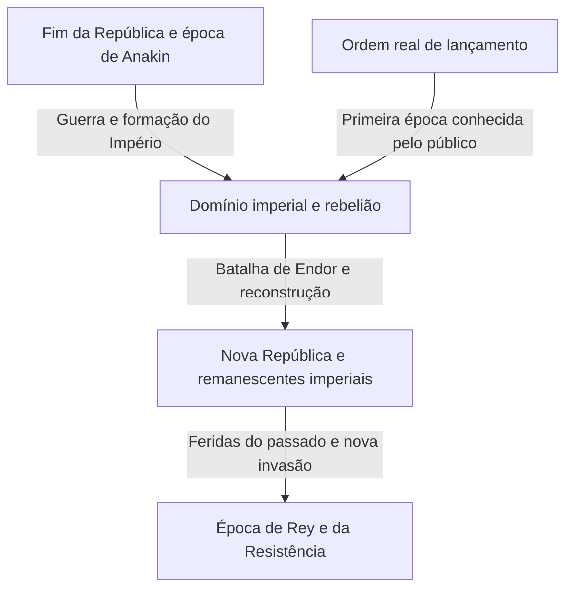
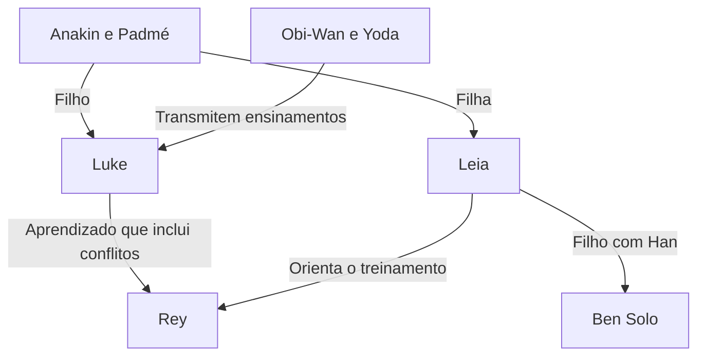

Se fosse preciso explicar Star Wars em uma frase, seria uma história de aventuras em uma galáxia distante. Mas essas aventuras sobrepõem amor e ressentimento entre pais e filhos, o colapso da democracia, a resistência a um império, religião e poder, feridas de guerra e famílias que ultrapassam os laços de sangue. Do outro lado da tela, há também uma história do cinema que transformou miniaturas, montagem, música, som e computação gráfica.

Mesmo conhecendo os sabres de luz ou Darth Vader, fica mais difícil enxergar o conjunto à medida que surgem novas obras. Por que os lançamentos começaram pelo Episódio IV? Se os Jedi são cavaleiros da justiça, por que não conseguiram proteger a República? O que as histórias de Anakin, Luke e Rey herdaram e transformaram? O que Andor e The Mandalorian mostram para serem mais do que apêndices dos filmes?

Este artigo examina essas perguntas por três camadas: a narrativa da galáxia, as relações entre as obras e a história real de sua produção. Não pretende enumerar todos os detalhes como um dicionário, mas oferecer uma orientação extensa para compreender as relações de causa e efeito nas obras principais e os temas que se repetem enquanto mudam. Ao mostrar a amplitude desse universo ramificado, apresenta um percurso que também permite a quem chega agora não se perder.

O texto revela os finais dos nove filmes da saga e de obras relacionadas, identidades de personagens, mortes e escolhas importantes. Quem ainda não assistiu e deseja preservar as surpresas pode ler primeiro a organização inicial das obras e o guia de ordem de exibição no fim, voltando aos capítulos específicos depois de assistir. A data de referência para a verificação do conteúdo e dos lançamentos é 3 de outubro de 2026. As ilustrações são artes conceituais geradas para este artigo, não imagens oficiais dos filmes nem registros de produção.

## Três tempos que precisam ser separados: ordem de lançamento, história interna e ordem de criação do universo

A principal razão para Star Wars parecer confuso é que seu tempo não forma uma única linha. O filme lançado pela primeira vez em 1977 seria posteriormente situado como Episódio IV dentro da narrativa. O público conheceu primeiro a aventura de Luke e, a partir de 1999, passou a ver a juventude de seu pai, Anakin. Os acontecimentos mais antigos na ficção não foram necessariamente filmados antes.

A ordem em que os criadores conceberam os detalhes é ainda outra. Uma relação revelada em uma obra posterior pode fazer uma cena antiga parecer diferente. Isso não equivale a afirmar que, quando o primeiro filme foi feito, todas as histórias das décadas seguintes já estavam decididas. É importante não reconstruir o processo de uma obra que se desenvolveu ao longo do tempo apenas a partir da coerência de seu resultado final.

Separar esses três tempos também ajuda a entender o prazer das prequelas. Conhecer o desfecho não significa simplesmente perder a surpresa: permite assistir à tragédia perguntando em que momento outra escolha teria sido possível. Já a ordem de lançamento aproxima o momento em que recebemos informações da experiência dos primeiros espectadores. Cada percurso tem um valor próprio; não existe uma única resposta correta para competir em conhecimento.

| Conjunto de filmes | Anos dos primeiros lançamentos | Pergunta central |
| --- | --- | --- |
| Episódios IV, V e VI: trilogia original | 1977, 1980 e 1983 | Como resistir a um poder esmagador e enfrentar o passado da família? |
| Episódios I, II e III: trilogia prequela | 1999, 2002 e 2005 | Por que a República e Anakin perdem aquilo que tentavam proteger? |
| Episódios VII, VIII e IX: trilogia sequela | 2015, 2017 e 2019 | Como a nova geração recebe as vitórias e os fracassos da anterior? |
| Rogue One e Solo | 2016 e 2018 | Como retratar as pessoas à margem da saga e as escolhas de seu passado? |
| O filme de cinema The Clone Wars | 2008 | Como ampliar uma guerra prolongada por meio das relações entre pessoas? |
| The Mandalorian and Grogu | 2026 | Como pensar a proteção e a comunidade na galáxia depois da queda do Império? |

Os anos indicam, em princípio, a primeira estreia nos cinemas e podem ser diferentes dos lançamentos japoneses. A ordem de lançamento e a cronologia geral podem ser verificadas no [guia oficial de filmes e séries](https://www.starwars.com/news/star-wars-movies-and-series-guide). Colocar apenas o nome de uma antologia de curtas em um único ponto da cronologia pode induzir ao erro, pois um mesmo programa pode tratar de várias épocas.

O diagrama é uma estrutura básica para compreender as principais obras audiovisuais. Não significa que uma única batalha tenha eliminado o Império de todos os cantos da galáxia. A derrota simbólica de um regime e as mudanças nas forças armadas, na administração, no crime e na consciência das pessoas acontecem em velocidades diferentes. Muitas histórias derivadas existem justamente nesse intervalo.

## Cânone e Legends: a qual continuidade pertence cada história?

Cânone é a estrutura usada para pensar a continuidade narrativa oficial atual. Legends é a classificação que organiza muitos romances, quadrinhos, jogos e outras obras expandidas anteriormente. Em 2014, a Lucasfilm reviu o tratamento do Universo Expandido existente e anunciou uma nova expansão centrada nos filmes e em The Clone Wars. O [anúncio oficial daquela época](https://www.starwars.com/news/the-legendary-star-wars-expanded-universe-turns-a-new-page) explica essa mudança.

Tornar-se Legends não significa que uma obra desapareceu ou perdeu seu valor de leitura. Ela pode ser lida como uma história da galáxia que cresceu em outra época, sob outras limitações e possibilidades. Por outro lado, quando um nome ou uma ideia antiga reaparece em uma produção nova, isso não incorpora automaticamente toda a biografia e todos os acontecimentos anteriores à nova continuidade. Ao reconhecer um nome, é especialmente importante verificar de qual obra e versão se está falando.

Nem toda obra produzida oficialmente compartilha a mesma continuidade. Há projetos como Visions, que exploram formas de expressão livres da cronologia estabelecida. Nem todas as ações disponíveis em um jogo precisam ser acontecimentos da história; às vezes, é necessário distinguir as opções do jogador dos eventos que uma sequência assume como ocorridos.

Devemos evitar transformar a classificação do universo em um julgamento da qualidade das obras. O cânone ajuda a compreender conexões, não atribui notas à intensidade da emoção. O que aparece na tela, os materiais oficiais, as declarações dos personagens e as interpretações dos espectadores também são tipos diferentes de informação. É importante não tomar automaticamente uma explicação em que um personagem acredita como verdade onisciente de todo o mundo.

Este artigo se baseia na continuidade das principais produções audiovisuais atuais e distingue a posição de Legends e de projetos independentes quando os menciona. Também separa o que é mostrado daquilo que pode ser interpretado. Podemos, por exemplo, analisar criticamente a instituição Jedi, mas essa análise do público não equivale a um fato oficial que negue as boas intenções de todos os Jedi.

## Um pequeno mapa de personagens para entrar na galáxia

No centro estão várias gerações em torno da família Skywalker. Luke e Leia são filhos de Anakin e Padmé. Ben Solo, filho de Leia e Han, mais tarde adota o nome Kylo Ren. No entanto, a transmissão da história não se explica apenas pelo sangue. Ensinamentos, erros e escolhas passam de Obi-Wan e Yoda para Luke, de Anakin para Ahsoka e daí para as gerações seguintes, incluindo Rey.

R2-D2 e C-3PO atravessam essa história de uma posição diferente da humana. Chewbacca, Lando e os companheiros da Rebelião conectam os problemas internos de uma família à luta de toda a galáxia. Séries posteriores mostram a vida de pessoas afastadas do centro heroico, como Cassian, Din Djarin, Grogu e os clones.

Separar as linhas familiares das relações entre mestres e aprendizes revela que a história da galáxia não é apenas a genealogia de uma família real. Mais importante do que aquilo que se recebe é como se usa essa herança e o que se rejeita. Vejamos, então, a função de cada obra, começando pela trilogia que apresentou a galáxia ao público.

## Episódio IV, Uma Nova Esperança — A política da galáxia alcança a vida de um jovem

O primeiro filme, lançado em 1977, começa no meio da história de seu universo. Sem conhecer os detalhes da formação do Império, o público vê uma pequena nave perseguida por um enorme navio de guerra. Só o contraste de tamanho já comunica a diferença de poder entre perseguidor e perseguido. A abertura não espera explicar todo o universo para movimentar a trama: fornece, pelas ações dos personagens, as informações necessárias para compreender o acontecimento. A data de lançamento e a posição básica da história também podem ser conferidas na [página oficial do filme](https://www.starwars.com/films/star-wars-episode-iv-a-new-hope).

### A aventura não começa com a consciência de ser um escolhido

Luke Skywalker vive em uma fazenda de Tatooine e, no início, não pretende salvar a galáxia. É um jovem que deseja escapar da estreiteza de seu cotidiano. Contudo, os droides que chegam à sua casa transportam informações rebeldes, e a mensagem de socorro de Leia o conduz ao escondido Obi-Wan Kenobi. Enquanto a disputa política é apenas uma notícia distante, Luke ainda pode voltar à fazenda. Essa fronteira desmorona quando a violência imperial mata os familiares que o criaram.

A causalidade é importante. Luke não se relaciona com o Império porque escolhe uma aventura; a própria vida que tentava permanecer alheia ao domínio imperial é destruída. Além de um amadurecimento individual, a história mostra a violência do poder penetrando na vida periférica. Mas a tristeza, sozinha, não o torna herói. Ao encontrar um mestre e companheiros, aprender a agir e usar suas habilidades para ajudar outros, seu desejo inicial ganha sentido público.

Leia é resgatada, mas não é alguém que apenas espera pelo resgate. Ela esconde informações, resiste ao interrogatório e toma decisões durante a fuga. Dentro da instalação em que Luke e Han entraram para ajudá-la, muitas vezes é ela quem compensa as falhas dos dois. Como os papéis não são fixos, os três não formam uma relação simples de herói, auxiliar e recompensa, mas um grupo que põe à prova o julgamento de cada integrante.

### A Estrela da Morte é um canhão e também uma concepção de governo

O terror da Estrela da Morte não se limita ao poder de destruir um planeta. Por trás dela está a ideia de tornar dispensáveis a negociação cotidiana e a representação política mediante a demonstração de força. A dissolução do Senado se conecta à intenção de submeter os sistemas pelo medo. Destruir Alderaan ultrapassa a conquista de uma base militar: é uma ameaça a todos que possam considerar a resistência.

A Rebelião não dispõe de uma arma equivalente. Ela analisa os planos, encontra uma pequena vulnerabilidade e concentra recursos limitados. A vitória exige a conexão do trabalho dos droides que transportam informações, das pessoas que entregam os planos, dos analistas e dos mecânicos dos caças. Luke desfere o golpe final, mas uma cooperação social torna esse golpe possível. Ignorar essa estrutura reduz o filme a uma história simples em que um indivíduo de sangue especial resolve tudo.

O retorno de Han também integra essa cooperação. Alguém que agia pelo dinheiro ajuda os companheiros apesar do perigo. O momento em que Luke confia na Força em vez de depender apenas da mira e aquele em que Han deixa de decidir apenas pela recompensa podem ser lidos como passagens para uma confiança que ultrapassa o cálculo visível de vantagens. Não se trata de abandonar a tecnologia. Caças, comunicações e planos continuam necessários; a pergunta é o que se acrescenta à decisão final.

Também importa como a história da galáxia entra na tela por meio de máquinas que precisam de manutenção e de questões de sustento. A Falcon não é um veículo ideal que apenas corre depressa, mas uma nave que seu dono se esforça para manter funcionando. A cantina tem clientes que não existem só para explicar coisas ao protagonista, e os droides vivem como seres comprados e vendidos. Como os acontecimentos parecem continuar fora do centro da imagem, o público sente que aquele mundo tem um passado mesmo sem conhecer tudo.

## Episódio V, O Império Contra-Ataca — A derrota desfaz a compreensão que o herói tem de si

A vitória anterior não significou o desaparecimento do Império. Os rebeldes continuam fugindo e não conseguem manter a base de Hoth. O filme começa com a realidade de que destruir uma arma gigantesca não elimina as instituições nem os exércitos. Lançado em 1980, ele desenvolve paralelamente o treinamento de Luke e a fuga de Han e seus companheiros. [Página oficial do filme](https://www.starwars.com/films/star-wars-episode-v-the-empire-strikes-back)

### O treinamento exige mais do que aprender a levantar pedras

Ao encontrar Yoda em Dagobah, Luke tem frustradas suas expectativas sobre a aparência e o comportamento de um grande mestre. Diante de uma criatura pequena e estranha, não reconhece imediatamente sua sabedoria. O recurso também atua sobre o público. O aprendizado da Força começa depois de abalar a associação entre força e tamanho do corpo ou das armas.

Na caverna, o rosto de Luke aparece dentro da máscara do Vader que ele derrotou. O filme não estabelece essa imagem simplesmente como uma visão literal do futuro. Ela pode ser lida como um aviso: seguir o medo e a raiva do inimigo pode tornar alguém semelhante a ele. Antes, a tarefa era derrotar o inimigo externo chamado Império; agora, o coração de quem pretende derrotá-lo também é examinado.

Luke interrompe o treinamento depois de ver uma visão do sofrimento dos amigos. Não é fácil classificar essa decisão como inteiramente correta por nascer da bondade, ou inteiramente errada por revelar imaturidade. Entendemos por que ele não consegue abandoná-los, mas ele avalia mal os limites de sua força e de suas informações. Além disso, Vader usa esses sentimentos para atraí-lo. Boas intenções não tornam dispensável a avaliação da situação.

### O acordo de Lando e os limites da acomodação ao poder

Lando, em Cloud City, negocia com o Império para proteger a cidade. Mas, em uma relação na qual o governante pode mudar unilateralmente as promessas, um contrato não garante segurança. Cumprir uma condição traz a exigência seguinte. Seu fracasso não é apenas uma traição de caráter; é também o fracasso político de tentar preservar a autonomia sob violência esmagadora.

Ainda assim, quem errou uma vez não precisa continuar errando até o fim. Lando parte para o resgate. Luke falha, Lando trai e Han é capturado, mas o valor dos personagens não depende apenas de sua taxa de sucesso naquele instante. Corrigir os próprios atos, pedir ajuda e responder ao pedido dos outros permanecem como medidas distintas da vitória.

A revelação de que Vader é o pai não serve para apagar a distinção entre bem e mal. A violência imperial não se torna legítima. O que se rompe é a história familiar organizada em que Luke se via como filho de um pai bom e via o inimigo como o estranho que o matara. A ideia de se aproximar do pai ao derrotar o inimigo se transforma na difícil pergunta sobre como enfrentar esse inimigo para receber a herança paterna.

Luke não termina o duelo como vencedor. Ferido, incapaz de escapar sozinho, é salvo por Leia e pelos demais. Ser resgatado por quem ele fora salvar no primeiro filme nega o isolamento do herói. Independência não é nunca depender de ninguém; também pode significar voltar às relações carregando erros e fraquezas. Nesse sentido, o final sombrio tem uma função que ultrapassa adiar a conclusão para o próximo episódio.

A vastidão branca de Hoth, o confinamento úmido de Dagobah e o exterior luminoso e interior escuro de Cloud City não são simples cenários turísticos. A sensação dos lugares sustenta a retirada militar, a descida ao próprio interior e o colapso da segurança aparente. A cada mudança de lugar, as ações dominadas pelo protagonista deixam de bastar. A experiência de vencer em um caça não responde ao treinamento, à negociação ou ao diálogo com o pai.

Arte conceitual gerada. A ilustração representa a assimetria de poder entre rebelião e império; não é uma imagem oficial de um filme.

## Episódio VI, O Retorno de Jedi — Salvar o pai e derrotar o Império

A conclusão de 1983 começa com o resgate de Han e sobrepõe a reparação de relações pessoais a uma batalha galáctica. No palácio de Jabba, Luke está mais sereno do que o jovem do primeiro filme e mais seguro no uso da força. Mas essa aparência não comprova sua maturidade como Jedi. A pergunta final é o que ele faz quando pode vencer. [Página oficial do filme](https://www.starwars.com/films/star-wars-episode-vi-return-of-the-jedi)

### A armadilha do Imperador busca a raiva mais do que a morte

Enquanto tenta aniquilar militarmente a Rebelião, o Imperador procura trazer Luke para seu lado. Mostra os amigos em perigo, provoca um ataque de raiva e pretende que, prolongando esse sentimento, Luke mate o pai. Mesmo que Luke derrote Vader, o Imperador vence se ele aceitar a mesma lógica de dominação. Por isso, o resultado do duelo e o êxito ético podem apontar em sentidos opostos.

Luke se enfurece com a ameaça a Leia e domina Vader. O instante em que compara a mão mecânica do pai com a própria faz a visão da caverna retornar como escolha concreta. Descartar a arma não é optar pela não violência porque não há perigo. Ele aceita a possibilidade de morrer e recusa matar o pai. Abandona a medida que exige destruir o inimigo para provar a própria força.

Vader se volta contra o Imperador depois de ver o sofrimento do filho. Há redenção, mas não uma explicação segundo a qual os crimes passados foram apagados. A confiança do filho na bondade do pai é diferente de uma obrigação das vítimas de perdoar o agressor. O filme apresenta uma última transformação na relação entre pai e filho, não uma solução para toda a responsabilidade jurídica ou memória histórica. Preservar essa distinção permite compreender os limites do desfecho sem diminuir sua emoção.

### Por que a batalha na floresta é tão necessária quanto a sala do trono

Isolar o confronto com o Imperador pode fazer parecer que o mundo se move apenas por um problema familiar. Na realidade, a frota não consegue destruir a segunda Estrela da Morte se as forças terrestres de Endor não desligarem o escudo. Luke salvar o pai e os rebeldes destruírem a instalação militar são necessidades paralelas. Uma não executa automaticamente o trabalho da outra.

Os Ewoks acrescentam conhecimento do terreno e outro modo de lutar à operação conjunta. O Império tem vantagem em blindagem e poder de fogo, mas não reconhece os habitantes como agentes relevantes. Essa arrogância o leva a interpretar mal a resistência que usa o terreno e as emboscadas. Não se trata, evidentemente, de uma lei segundo a qual armas simples sempre vencem exércitos avançados nas guerras reais. Como fábula, torna visível a fraqueza de quem domina e subestima o julgamento e a solidariedade dos pequenos.

Luke, Han, Leia, Lando, Chewbacca, os droides, soldados anônimos e moradores de Endor: seus vários trabalhos convergem no fim, de modo que a festa não é a coroação de um indivíduo. É também a volta de Luke à comunidade depois de perder o pai. A coexistência da perda pessoal e da vitória pública impede que a felicidade seja um encerramento simplesmente intacto.

A derrota do Imperador também é um erro em sua estimativa de que todos continuarão agindo por interesse e medo até o fim. O filho não abandonar a confiança no pai e o pai escolher o filho em vez da obediência ao governante escapam ao seu cálculo. A dimensão do poder da Força não permite prever perfeitamente as escolhas humanas. Existe aí um paralelo entre confiar demais no tamanho das armas e acreditar ter decifrado inteiramente o coração das pessoas.

## Episódio I, A Ameaça Fantasma — O Império não começa com rosto de império

A prequela lançada em 1999 não começa com uma ditadura militar inequívoca como o primeiro filme, mas com um conflito interno da República. O bloqueio de Naboo pela Federação do Comércio transforma uma disputa comercial e tributária em ocupação armada. A jovem rainha Padmé Amidala espera que recorrer ao parlamento permita reconhecer os fatos e obter ajuda. Porém, a instituição se detém em investigações e procedimentos: a velocidade das decisões não acompanha o sofrimento local. [Página oficial do filme](https://www.starwars.com/films/star-wars-episode-i-the-phantom-menace)

### Palpatine conquista apoio como aquele que resolverá a crise

Para quem conhece a história posterior, os conselhos do senador Palpatine, representante de Naboo, têm uma dupla face. Ele se aproxima das vítimas e explora a desconfiança em relação a um dirigente aparentemente incapaz. O importante é que não invade de fora do parlamento para destruir a República de uma vez; ascende usando os procedimentos parlamentares e as expectativas da população.

Os inimigos também não formam um bloco único. A Federação do Comércio age em busca de seus interesses, mas Darth Sidious a utiliza como instrumento de um plano maior. Mesmo quando o conflito superficial termina, permanece a transferência de poder que ele gerou. Libertar Naboo é uma vitória real, mas não necessariamente uma vitória para o futuro de toda a República. A inquietação persiste na celebração porque essas duas medidas não coincidem.

Quando Padmé pede cooperação aos Gungans, apresenta uma política oposta. Em vez de preservar a imponência da representante, reconhece que ambos os povos vivem no mesmo planeta e pede ajuda. Não se trata apenas de suprir uma falta de poder militar: grupos anteriormente distantes criam um objetivo comum. Essa pequena solidariedade produz a capacidade concreta de agir que não foi obtida no parlamento.

### Antes do talento de Anakin, é preciso olhar sua vida

O pequeno Anakin possui uma extraordinária capacidade de pilotar, mas também é escravo. Em um mundo onde existe uma enorme República e os Jedi falam de justiça, a liberdade de mãe e filho não está garantida. Isso mostra a diferença entre a existência de uma instituição e a extensão de sua proteção a todos os lugares. Qui-Gon consegue libertar Anakin, mas não salvar sua mãe Shmi pelo mesmo método.

A partida reúne a felicidade de ter a capacidade reconhecida e o medo de deixar a mãe para trás. Descrever o Anakin posterior apenas como alguém fraco que não superou o medo ignora as condições em que esse medo nasceu. Por outro lado, uma infância dura não torna inevitáveis as agressões futuras. A narrativa abre a pergunta sobre o apoio e a educação de que uma pessoa ferida precisava.

Com a morte de Qui-Gon, o mestre que descobriu Anakin não pode ser aquele que o orientará por muito tempo. Obi-Wan assume a promessa, mas a relação entre os dois não estava pronta desde o começo. Uma grande profecia e expectativas institucionais começam a correr à frente do desenvolvimento de uma criança. Esse desequilíbrio prepara a tragédia de toda a trilogia prequela.

Na produção, também é impreciso resumir as prequelas como filmes inteiramente feitos por computador. Os materiais oficiais apresentam soluções físicas, como cotonetes coloridos empregados em miniaturas para representar o público da corrida de pods. É mais fiel entender a imagem como uma combinação de novas tecnologias e trabalho manual. [Curiosidades oficiais de produção](https://www.starwars.com/news/25-fun-facts-the-phantom-menace)

A batalha final distribuída por vários lugares também diferencia as funções dos grupos. A distração dos Gungans, a ação no palácio, o combate espacial e o duelo entre Jedi e Sith resolvem problemas distintos. Um único espadachim poderoso não encerra a ocupação. Além disso, a morte de Qui-Gon por trás do sucesso militar mostra que a vitória da comunidade não coincide com o que é melhor para a vida de um menino.

## Episódio II, Ataque dos Clones — A preparação para a guerra estreita as opções

No segundo capítulo, de 2002, crescem as forças separatistas que desejam deixar a República, e criar um exército se torna uma questão política. A investigação da tentativa de assassinato de Padmé leva Obi-Wan a descobrir o exército de clones. Diante de uma República que ainda discutia como se preparar para a crise, aparece uma força militar já concluída. A urgência da segurança se combina com uma conveniência de origem obscura. [Página oficial do filme](https://www.starwars.com/films/star-wars-episode-ii-attack-of-the-clones)

### A necessidade da guerra ultrapassa o mistério que deveria ser investigado

Como o exército clone foi encomendado e a serviço de quais interesses foi criado deveriam ser perguntas prioritárias. Mas, quando o exército inimigo está próximo, as pessoas querem uma força pronta para uso. A crise transforma a decisão ao retirar o tempo da avaliação. O exército é adotado não por ter sido suficientemente examinado, mas em uma situação na qual parecem faltar alternativas.

A crítica de Dooku à República inclui problemas reais de corrupção institucional. Contudo, identificar corretamente um problema não garante que a solução oferecida seja justa. Como ele próprio participa do plano Sith, a decepção com a República não conduz diretamente à libertação. É preciso separar a oposição pública entre os lados da posição de Sidious, que a explora.

Os Jedi também vão ao campo de batalha para proteger a paz e passam a comandar tropas como generais. Há um paradoxo: o sucesso do resgate ajuda a iniciar a guerra. A ação que protege vidas imediatas convive com um efeito de longo prazo que fortalece a ordem militar. Os meios adotados em nome de bons objetivos transformam a natureza da organização.

### O desejo de controlar aproxima romance e política

A relação entre Anakin e Padmé enfrenta obstáculos de posição, dever e disciplina Jedi. O casamento secreto protege seu amor, mas reduz o acesso a conselhos e apoio. Com menos pessoas com quem dividir as dificuldades, os medos que crescem depois ficam mais difíceis de examinar de fora.

Depois de perder a mãe, Anakin mata pessoas de uma aldeia Tusken, incluindo crianças. A cena não deve ser descartada como simples demonstração da intensidade de sua raiva. É uma ruptura ética clara: sofrer violência contra alguém amado se converte em justificativa para atacar outras pessoas. A dor pode ser compreendida, mas os atos têm responsabilidade. A queda posterior não é uma mudança súbita; uma fronteira grave já foi ultrapassada aqui.

A visão política de Anakin, segundo a qual um líder forte deveria decidir se isso produz o resultado desejado, também ecoa sua vontade de controlar a perda nas relações íntimas. É difícil aceitar que as pessoas têm vontades diferentes e que alguém amado possui uma vida fora de nosso domínio. Mas tentar eliminar a incerteza pela coerção destrói a própria relação que se queria proteger. Esse problema assumirá forma extrema no filme seguinte.

A aparência uniforme dos clones também causa inquietação por tratar pessoas como força de combate substituível. Soldados da mesma origem não possuem vidas que possam ser contadas como uma única coisa. Os filmes primeiro imprimem a chegada de um enorme exército; obras posteriores aprofundam as personalidades individuais. Perceber essa ordem permite rever o exército que parecia salvar a República pela pergunta de quem paga por essa salvação.

## Episódio III, A Vingança dos Sith — O desejo de salvar se transforma em lógica de dominação

No terceiro capítulo, de 2005, a República desmorona quando a Guerra dos Clones se aproxima do fim. Contra a esperança de que vencer traria a paz, o poder concentrado para conduzir a guerra vira fundamento da ditadura posterior. Como a queda de Anakin e a da República avançam juntas, a tragédia não se reduz apenas à fraqueza de um indivíduo nem apenas à falha institucional. [Página oficial do filme](https://www.starwars.com/films/star-wars-episode-iii-revenge-of-the-sith)

### Palpatine vende a promessa de controlar a morte

Anakin teme um futuro em que perderá Padmé. Palpatine não nega frontalmente seu medo; sugere a existência de um poder impossível de obter em outro lugar. Isso é mais engenhoso do que simplesmente pregar uma doutrina maligna. Ele identifica aquilo que o outro menos quer perder e se apresenta como indispensável para preservá-lo. Quanto maior a dependência, mais fácil aceitar explicações contraditórias e exigências criminosas.

Também há desconfiança entre Anakin e o Conselho Jedi. Ele sente que não é reconhecido, enquanto o Conselho teme sua proximidade com Palpatine. Ao receber ainda uma função de espionagem, sua lealdade fica dividida. Mas explicar essa situação não o isenta de seus atos. Depois de impedir Mace Windu para proteger Palpatine, ele passa a cumprir ordens ainda mais destrutivas.

Depois de um erro grave, uma pessoa pode preferir um caminho que faça esse erro parecer significativo em vez de voltar atrás. Os atos de Anakin também podem ser lidos como essa cadeia de autojustificação. Já que chegou tão longe, tudo será inútil se não alcançar o poder. Esse pensamento faz a próxima agressão parecer um sacrifício necessário.

### A Ordem 66 muda a direção da capacidade letal que já existia dentro da instituição

Quem ataca os Jedi não é um novo exército inimigo vindo de longe, mas os soldados que lutavam ao seu lado. Quando a cadeia de comando se inverte, a disposição das tropas e a confiança baseadas na aliança se tornam vulnerabilidades. O filme mostra a ordem e os ataques simultâneos; a animação relacionada acrescenta os detalhes do controle dos clones. Distinguir a explicação do filme dos complementos posteriores torna mais claras as funções de cada obra.

O Império tampouco nasce no instante em que todos os prédios republicanos são destruídos. É proclamado como uma nova ordem no plenário. Sob as palavras de restauração da segurança, a vigilância e a violência passam a integrar o governo permanente. Ao apresentar os Jedi contrários como traidores, a resistência à concentração de poder é reinterpretada como ataque à ordem.

Em Mustafar, Anakin dirige violência contra Padmé, a quem deveria salvar. Quando ela discorda, ele interpreta isso como traição, em vez de respeitar sua vontade. Nesse instante, a diferença entre amor e possessividade fica nítida. O futuro que desejava exigia não só uma Padmé viva, mas uma Padmé que aprovasse suas escolhas.

As cenas do corpo queimado de Anakin sendo envolvido pela armadura e do nascimento dos gêmeos mostram desespero e possibilidade futura ao mesmo tempo. Obi-Wan e Yoda não são vencedores. Ainda assim, proteger as crianças preserva um futuro possível no interior da derrota política. A trilogia se completa não como uma história em que o mal vence porque não restam pessoas boas, mas como uma combinação de boas intenções, medo, instituições e ambição que produz a catástrofe.

A dor de Obi-Wan também está longe da satisfação de descobrir e derrotar um vilão. Ele precisa lutar contra alguém que considerava um irmão e continua com perguntas sobre sua própria educação e seu julgamento. A duração do duelo pode, portanto, ser vista não só como uma comparação de habilidades, mas como o sofrimento de pessoas que se conhecem profundamente e não conseguem romper a relação. Nem o vencedor encontra um lugar para se alegrar com a vitória.

## Episódio VII, O Despertar da Força — Uma geração que não conheceu os antigos heróis herda o passado

No novo capítulo de 2015, os heróis da Rebelião são quase lendas para Rey e Finn. Nomes familiares ao público permanecem distantes dos jovens personagens. Essa diferença coloca na mesma tela a memória de quem acompanhou a série e a surpresa de quem acaba de chegar. A Primeira Ordem surge no mundo posterior ao Império, mostrando que a vitória antiga não garante a segurança da próxima geração. [Página oficial do filme](https://www.starwars.com/films/star-wars-episode-vii-the-force-awakens)

### Finn se torna protagonista ao começar recusando uma ordem

Finn não parte de uma linhagem excepcional nem de uma profecia. Quando lhe exigem obediência como soldado, ele se recusa a matar. Com essa escolha, começa a deixar de ser apenas um número na organização para se tornar alguém que decide. Mas sua disposição de salvar toda a galáxia não nasce pronta; inicialmente, também deseja muito fugir. A narrativa não espera que o medo desapareça para mostrar uma boa ação: mostra alguém que permanece por outra pessoa apesar de estar com medo.

Em Jakku, Rey desenvolveu habilidades de sobrevivência enquanto espera uma família que talvez volte. Sua imobilidade não se deve à falta de capacidade, mas à expectativa depositada no passado. Sair de casa não é apenas mudar de planeta. É passar da esperança de recuperar a antiga vida se continuar esperando à possibilidade de construir novas relações por conta própria.

### Kylo Ren deseja a imagem de Vader mais do que sua força

Ben Solo tenta recriar a si mesmo como Kylo Ren. Venera o avô Vader, mas o fato de esse avô ter salvado o filho no fim não combina com a imagem de mal poderoso que procura. Às vezes, as pessoas não herdam o passado tal como ele foi; selecionam apenas as partes de que precisam. Kylo mostra que herdar a história também pode significar interpretá-la mal.

Matar Han não é apenas a cena de um vilão frio removendo um obstáculo. Kylo tenta refazer a si mesmo porque acredita que romper os vínculos familiares o tornará forte. Contudo, exercer violência não necessariamente resolve o conflito interior. O ato destinado a eliminar a oscilação cria novas feridas. Enquanto a história de Rey avança para a construção de laços, Kylo procura afirmar sua identidade cortando-os.

As semelhanças estruturais com o primeiro filme, como a base Starkiller e o droide que transporta um mapa, são evidentes. É possível apreciá-las como nostalgia ou criticá-las como repetição. Na análise, porém, convém não parar na semelhança e observar as escolhas diferentes de personagens colocados em posições equivalentes. Um antigo soldado imperial se torna protagonista, a jovem que aguardava ajuda resiste por conta própria e o filho de um herói vira inimigo. Dentro de contornos parecidos, a ansiedade da herança se desloca para o centro.

A destruição do centro da Nova República demonstra intensamente a fragilidade política. Ao mesmo tempo, como o filme não mostra muito do cotidiano dessa ordem, o público pode ter dificuldade para dimensionar concretamente a perda. Isso pode ser apontado como uma limitação de sua exposição. Conhecer obras relacionadas aumenta o peso, mas não se deve atribuir toda a dificuldade à falta de conhecimento do espectador. A quantidade de informação transmitida pela própria obra afeta a experiência.

## Episódio VIII, Os Últimos Jedi — Reconhecer o fracasso sem abandonar a responsabilidade

O segundo capítulo, de 2017, desfaz a expectativa de que encontrar Luke resolverá os problemas de Rey. Luke se retirou da possibilidade de voltar a ser herói. Ao mesmo tempo, a Resistência é perseguida e precisa decidir como sobreviver com poucos recursos. O filme reexamina em paralelo a imagem do herói individual e a liderança de uma organização. [Página oficial do filme](https://www.starwars.com/films/star-wars-episode-viii-the-last-jedi)

### Confessar um erro pode se tornar motivo para desistir de tudo?

O passado de Luke e Ben é contado de perspectivas diferentes. O medo momentâneo de Luke e o terror de Ben ao vê-lo alteram o significado da mesma cena. Não se trata de relativismo segundo o qual os fatos não existem, mas da diferença entre aquilo que alguém pensava e aquilo que o outro efetivamente viveu. Explicar que foi um instante e que houve arrependimento não apaga a ferida causada.

Luke relaciona seu fracasso ao de todos os Jedi e tenta encerrar a tradição. A crítica à história Jedi merece reflexão, mas, se serve apenas para justificar sua ausência, afasta-o da responsabilidade por quem sofre agora. Entre proteger incondicionalmente a tradição e descartar tudo porque houve falhas, é necessário um caminho de aprender e transmitir de outra forma.

Rey e Kylo percebem a possibilidade de se compreenderem, mas compreensão e concordância são diferentes. Compartilhar a solidão não obriga a aceitar uma ordem que domina os outros. Matar Snoke também não faz Kylo passar automaticamente ao lado do bem. Matar o governante e rejeitar o sistema de dominação são coisas distintas; ele tenta ocupar o lugar que ficou vazio.

### Coragem e comando trabalham com escalas de tempo diferentes

Poe tem coragem para destruir o inimigo à frente, mas precisa aprender a avaliar quantas pessoas e recursos perde para isso. Produzir um resultado visível em uma batalha não é o mesmo que manter a organização viva até amanhã. Para quem comanda, decidir não atacar ou recuar também integra a responsabilidade.

Por outro lado, o conflito com Holdo envolve dificuldades de compartilhar informações. O público vive um desencontro entre quem sabe o quê. Concluir simplesmente que subordinados devem obedecer em silêncio seria estreito demais. É mais fértil ver uma colisão entre sigilo, confiança, autoridade e insuficiência de explicações durante a crise, reconhecendo qualidades e falhas dos personagens.

O episódio de Canto Bight mostra que uma prosperidade aparentemente fora da guerra está ligada a ela por armas e exploração. Finn passa do desejo de proteger um amigo específico à compreensão mais ampla da resistência. Porém, exploradores negociarem com ambos os lados não demonstra que seus objetivos políticos sejam iguais. Criticar a estrutura do lucro deve ser separado de igualar invasão e resistência.

No fim, Luke não mata grandes quantidades de inimigos: entrega aos companheiros o tempo necessário para sobreviver. Aquele que rejeitava a lenda assume sua capacidade de gerar esperança e atrai a atenção do adversário por um meio diferente da vitória física. O filme pode ser lido como uma trajetória que começa desmontando a imagem do herói e termina escolhendo novamente como utilizá-la.

Rey buscava em Luke não apenas técnica, mas uma resposta externa que definisse quem ela era. O mestre, porém, também é humano, com erros e medos. Depois de conhecer a imperfeição de quem a orienta, ela precisa decidir o que receber de seus ensinamentos. Nesse sentido, a obra não é apenas uma discípula negando o mestre; pergunta se é possível continuar aprendendo sem idealizá-lo.

## Episódio IX, A Ascensão Skywalker — A origem e o nome escolhido

O nono filme, de 2019, traz Palpatine de volta como adversário final e liga a origem de Rey à sua família. A compreensão apresentada anteriormente de que ela não pertencia a uma linhagem importante é profundamente revista. Essa mudança divide preferências, mas a análise deve primeiro distinguir o que cada obra informou e o que a seguinte acrescentou. [Página oficial do filme](https://www.starwars.com/films/star-wars-episode-ix-the-rise-of-skywalker)

### A linhagem pode explicar habilidades, mas não ordenar a ética

Rey teme que uma linhagem maligna determine seu futuro. O desfecho, no entanto, segue para a escolha dos ensinamentos e relações que aceita, não para a obediência à origem. A questão não se resolve simplesmente dizendo que o sangue não importava. O filme usa a ascendência como um grande mecanismo narrativo, ao mesmo tempo que tenta mostrar a liberdade da protagonista pela rejeição do papel que supostamente decorre dela.

As relações com Luke e Leia oferecem outra via de herança. Escolher o nome Skywalker no final pode ser lido menos como declaração de genealogia biológica do que como manifestação dos valores que deseja transmitir e dos vínculos que a formaram. Mas escolher um nome não apaga a dor ou o passado. O sentido está em como ela decide se nomear depois de conhecer esse passado.

Os detalhes técnicos do retorno de Palpatine recebem explicações limitadas no filme. Não devemos misturar complementos de materiais relacionados com informações mostradas diretamente e falar como se tudo tivesse sido esclarecido na tela. O importante para a trama é que seu medo da morte e apego ao poder o fazem tratar até novos corpos e gerações como instrumentos. Há continuidade entre oferecer a Anakin o domínio da vida e continuar usando os outros para preservar a si mesmo.

### A transformação de Ben inverte a ideia de conquistar a morte

O retorno de Ben da vida como Kylo Ren envolve o chamado da mãe, a experiência de ser salvo por Rey e a memória do pai. Sua tentativa anterior de se libertar do conflito matando o pai fracassou. Aceitar novamente os laços, ao contrário, abre outra escolha. A mudança tampouco apaga as agressões anteriores, mas preserva a possibilidade de agir de outro modo neste instante.

Seu desfecho, dando vida a Rey, contrasta com Anakin sacrificar outros porque não queria perder a pessoa amada. Em vez de dominar o mundo para reter a vida, ele oferece algo de si. Esse contraste transforma o significado de salvar ao longo dos nove filmes. Manter alguém junto de nós e desejar que essa pessoa viva não são a mesma coisa.

A frota reunida em Exegol também realiza um trabalho diferente do duelo de Rey. Pessoas isoladas pelo medo reconhecem a existência umas das outras e se juntam. O quanto essa reunião convence depende de cada espectador, mas a estrutura exige uma participação que supera o poder de um herói. A batalha final volta a sobrepor o conflito de linhagens à resistência de muitas pessoas sem sangue especial.

Como encerramento dos nove filmes, a volta a Tatooine sugere que retornar ao mesmo lugar não significa voltar ao mesmo estado. No primeiro filme, um jovem olhava o horizonte querendo partir; no último, alguém que viveu a jornada declara seu nome. Reutilizar a paisagem inicial fecha em um único movimento a ampliação do mundo e a definição do próprio lugar nele.

## Rogue One — Os que não podem voltar e tornam possível o golpe do herói

Lançado em 2016, Rogue One mostra como os planos da Estrela da Morte chegam aos rebeldes pouco antes do primeiro filme. Conhecer o desfecho geral não elimina a tensão porque a questão não é apenas se os planos chegarão, mas quem perderá o quê para entregá-los. O anúncio oficial de produção identifica John Knoll, da ILM, como autor da ideia e destaca a perspectiva da guerra no chão. [Anúncio oficial de produção](https://www.starwars.com/news/rogue-one-the-daring-mission-has-begun-cast-and-crew-announced)

### A resistência do engenheiro e a recuperação de seu sentido pela filha

Galen Erso participa do desenvolvimento da arma imperial enquanto introduz uma vulnerabilidade capaz de destruí-la. Isso inclui perguntas difíceis: permanecer em uma instituição é sempre colaborar? Até onde é possível sabotá-la por dentro? Seu caso, porém, não permite generalizar que todos os colaboradores eram resistentes secretos. O filme mostra a escolha específica de uma pessoa e a dificuldade de comunicá-la aos outros.

Jyn recebe informações fragmentadas sobre o pai e corrige a interpretação que o via apenas como traidor. O importante é que reconhecer sua boa intenção não basta para deter a arma. É preciso comprovar a vulnerabilidade, obter os planos e transmiti-los de modo utilizável. A resistência paterna só produz efeito real quando a reconciliação pessoal se transforma em ação pública.

### Mostrar as faltas dos rebeldes não legitima o Império

Cassian realizou trabalhos sombrios pela Rebelião. Há ações suas que a justiça do objetivo não pode desculpar. Os rebeldes têm diferenças internas e não formam um bloco diante do perigo. Isso demonstra que a resistência não é inocente, mas não conduz à conclusão de que dominar e resistir são equivalentes.

A pergunta é o que pessoas de mãos sujas farão a seguir. A decisão de Cassian de acompanhar Jyn contém a urgência de não deixar os sacrifícios passados terminarem apenas como sacrifícios. Mas esse desejo também pode justificar indefinidamente novas vítimas. O filme desenha a fronteira pela diferença entre ordens que descartam os outros e escolhas de assumir pessoalmente o risco.

Em Scarif, a comunicação terrestre, a frota espacial e as operações dentro da instalação estão separadas. Por mais forte que alguém seja, perder uma conexão em outro lugar pode fazer a missão fracassar. A questão técnica da transmissão se torna a própria forma da solidariedade. As repetidas entregas de informação não são repetição vazia: mostram como um trabalho é transmitido além da sobrevivência individual.

Eles não participarão da festa do primeiro filme. Mas seu trabalho estará incorporado na vitória posterior. Atrás do protagonista de Uma Nova Esperança, passamos a enxergar o preço pago por pessoas cujos nomes e rostos não conhecíamos. Uma história paralela enriquece a principal quando muda assim o peso ético dos acontecimentos conhecidos.

A fé de Chirrut tampouco é uma defesa onipotente. Confiar na Força não garante automaticamente a segurança física. A fé não aparece como contrato para evitar a morte, mas como postura para agir no perigo. Mesmo sem um protagonista treinado como Jedi, esse personagem mostra como a ideia da Força participa dos julgamentos e das esperanças das pessoas.

## Solo — Como se forma alguém que parece egoísta?

Solo, de 2018, afasta-se um pouco das batalhas que decidem o governo galáctico e entra no mundo das organizações criminosas, transportes, dívidas e acordos. Os encontros do jovem Han com Chewbacca e Lando apresentam por outro ângulo o personagem do primeiro filme. Como informa a página oficial, a aventura pelos submundos periféricos ocupa o centro. [Página oficial do filme](https://www.starwars.com/films/solo)

### Ao tentar comprar liberdade, outra dependência já espera

Han procura escapar de Corellia, mas fugir não produz sozinho uma vida livre. O exército imperial, as organizações criminosas e os intermediários de trabalho criam novas hierarquias a cada meio de sobrevivência que ele encontra. O desejo de possuir uma nave não é tão forte apenas porque gosta de pilotar: ela também é uma condição material para escolher seu destino.

Beckett ensina a não confiar demais nos outros. Essa estratégia tem racionalidade em um ambiente perigoso. Porém, se todas as relações se organizam apenas pela previsão de traição, a cooperação encolhe até virar interesse temporário. Han recebe parte desse ensinamento sem se tornar inteiramente igual a ele.

O encontro com Chewbacca mostra essa diferença. Mesmo que haja interesses de sobrevivência no começo, atravessar perigos juntos produz algo além da troca. A confiança posterior deixa de parecer um traço dado de antemão e pode ser entendida como um processo de observar e julgar as ações do outro.

### Qi'ra tem uma vida fora da história de Han

Han quer levar Qi'ra consigo e realizar o desejo antigo. Mas o mundo em que ela sobreviveu durante a separação é mais complexo do que ele imagina. Reencontrar-se não reinicia automaticamente a antiga relação. Há distância entre querer salvar alguém e compreender as condições em que essa pessoa vive agora.

Explicar suas escolhas apenas pela presença ou ausência de amor ignora as restrições e ambições ligadas à sobrevivência dentro de uma organização. Mesmo em um filme protagonizado por Han, a vida dos outros não existe inteira para satisfazer seus desejos. Essa assimetria integra a decepção e o amadurecimento do jovem.

A mudança de entendimento sobre o grupo de Enfys Nest também abala a fronteira entre criminosos e resistentes. Quem possui a carga, quem a toma e para que a utiliza? O proprietário contratual não é necessariamente o lado moralmente correto. A decisão final de Han, que não se explica apenas pelo lucro, revela uma característica que se conectará ao seu retorno para ajudar a Rebelião.

O Han deste filme não é uma resposta que explica completamente o personagem original. Ninguém se forma a partir de uma experiência única. Ainda assim, percebemos que, sob a ironia e o discurso de interesse próprio, permanece a dificuldade de abandonar os outros. Aquele que finge não ser uma boa pessoa contradiz repetidamente essa apresentação por seus atos. Essa distância é parte de seu encanto.

A droide L3-37 estende o tema da liberdade aos seres não humanos. Ela deve ser tratada como uma máquina com personalidade conveniente aos humanos ou como sujeito com julgamentos e reivindicações? Um problema frequentemente contido no humor da série vem à superfície em suas palavras e ações. O filme não o resolve completamente, mas apreciar a simpatia dos droides e questionar as relações de propriedade em que vivem são atitudes compatíveis. Mesmo uma pequena aventura periférica contém questões de toda a galáxia.

## Compreender a galáxia além dos filmes pelas instituições e pelo cotidiano

Ao passar dos filmes às séries e animações, a galáxia de Star Wars ganha subitamente mais detalhes. Derrotar o Imperador e pagar a comida de amanhã não são o mesmo problema. Quem foi salvo por um Jedi no campo de batalha e quem teve a vida destruída por uma operação militar podem sentir coisas diferentes sobre a mesma República. Essa diferença de perspectiva torna os derivados mais do que episódios adicionais.

### O mesmo regime parece diferente no centro e na periferia

Coruscant, capital da República, é o centro político que concentra parlamento, burocracia e Templo Jedi. Mas a bandeira republicana não garante proteção igual a todos os habitantes. Em periferias como Tatooine, os ideais republicanos não chegam suficientemente, e organizações criminosas e escravidão dominam a vida. Um Estado que parece ordenado do centro pode parecer, das margens, apenas um governo distante que discute.

Essa distância também importa para compreender o separatismo. Mesmo que dirigentes da Confederação de Sistemas Independentes e empresas de armamentos integrem planos malignos, nem todo habitante insatisfeito com a República é perverso. Queixas contra corrupção, abandono político e desigualdade econômica existem independentemente da conspiração. A habilidade de Palpatine consiste menos em criar conflitos do nada do que em explorar ressentimentos existentes e direcionar sua saída à ampliação do próprio poder.

As diferenças entre planetas não desaparecem com o Império. Alguns lugares sofrem diretamente a ameaça de armas gigantes; outros conhecem o regime por mineração, forças de segurança, documentos de identidade, prisões ou recrutamento compulsório. Após a Nova República, piratas e grupos armados imperiais atuam onde o domínio central recua. Portanto, o nome do Estado não basta para julgar segurança ou liberdade. Perguntar qual planeta, classe social e profissão observa o regime ajuda a compreender os contrastes entre obras da mesma época.

Arte conceitual gerada que contrasta o centro e a periferia da galáxia e diferentes épocas. Não é uma imagem oficial nem um desenho de produção.

### Os Jedi não são o Estado, mas uma ordem de cavaleiros ligada a ele

Jedi não é o nome de todos que usam a Força. É um grupo com treinamento, disciplina, relações de aprendizado e tradição comunitária. No fim da República, consideram-se guardiões da paz, mas não são eremitas independentes do poder político. São enviados como diplomatas, relacionam-se com o Senado e tornam-se generais na Guerra dos Clones. A sobreposição desses papéis produz boas intenções e falhas institucionais ao mesmo tempo.

Comandam exércitos para proteger pessoas. Contudo, quanto mais se tornam comandantes, menos podem se desvincular da estrutura política que determina o fim da guerra. O sucesso tático contra soldados inimigos nem sempre coincide com alcançar a paz. Atribuir sua derrota apenas à fraqueza na esgrima perde essa tragédia: enquanto se dedicavam ao combate militar, não perceberam suficientemente que a própria guerra era uma armadilha.

Isso não significa que os Jedi fossem iguais ao Império. Uma instituição que erra difere de outra que transforma ativamente dominação e medo em objetivos. A obra pergunta se boas intenções dispensam o exame de si. Quando proteger a República entra em conflito com continuar obedecendo às suas decisões, o que deve prevalecer? As histórias de Ahsoka e Dooku convertem esse conflito em experiência individual.

### Sith e usuários do lado sombrio nem sempre pertencem ao mesmo grupo

Chamar todo adversário de sabre vermelho de Sith confunde as organizações. Os Inquisidores caçam Jedi para o Império, mas não ocupam a mesma posição da dupla de mestre e aprendiz Sith. As Irmãs da Noite de Dathomir têm uma tradição diferente da Jedi e da Sith. Usar o lado sombrio da Força deve ser distinguido de pertencer a uma linhagem Sith específica.

A Regra de Dois associada a Darth Bane se baseia em um mestre que detém o poder e um aprendiz que o deseja. Não é uma lei física segundo a qual só podem existir dois usuários malignos da Força na galáxia. É um princípio de sucessão organizacional, em torno do qual podem existir colaboradores, assassinos, candidatos manipulados e pessoas descartadas. O banco de dados oficial também explica que Bane introduziu esse sistema para a sobrevivência dos Sith. [Explicação oficial de Darth Bane](https://www.starwars.com/databank/darth-bane)

Há aí uma visão de educação que contrasta com a Jedi. Mesmo que o mestre deseje o crescimento do aprendiz, entre os Sith esse crescimento o ameaça. A própria cooperação contém a lógica de usar o outro e, por fim, substituí-lo. Ao pensar no Imperador e em Vader, ou no Maul descartado, observar como a relação gera desconfiança amplia a compreensão para além dos traços pessoais.

## Como The Clone Wars mudou nossa visão da guerra

### As funções do filme e da série extensa

O filme animado Star Wars: The Clone Wars, de 2008, é a porta de entrada para a série homônima. Para quem só conhecia os filmes, Anakin ter uma aprendiz, Ahsoka Tano, era uma grande adição. Não servia apenas para aumentar a lista de personagens. Dar a Anakin a responsabilidade de orientar alguém manifesta sua coragem, seu cuidado e sua resistência às regras em uma relação concreta.

A série retrata a guerra entre os Episódios II e III sem se limitar às operações republicanas. A perspectiva se desloca para diplomacia, traficantes de escravos, organizações criminosas, planetas que procuram neutralidade e dúvidas de pessoas comuns. O contexto político de poucos minutos nos filmes se transforma em vida diária e decisões continuadas. A vitória de um episódio muitas vezes não melhora o quadro geral, revelando o desgaste da guerra prolongada.

Não é necessário, porém, transformar toda a série em uma busca de pistas para os filmes. O público conhece o fim, mas os personagens não conhecem o futuro. O tempo em que ajudam amigos, cumprem missões e acumulam pequenas confianças tem sentido próprio. Justamente porque esse tempo é mostrado suficientemente, a Ordem 66 deixa de ser apenas um evento histórico e passa a destruir relações construídas.

### O mesmo rosto dos clones não significa a mesma personalidade

Soldados difíceis de distinguir na massa dos filmes tornam-se Rex, Fives, Echo e outros indivíduos com nome e julgamento próprios. Semelhança genética não significa experiências ou personalidades iguais. Desenhos na armadura, penteados, maneiras de falar e relações com companheiros permitem reconhecer cada um.

Surge então a contradição ética da República. Uma guerra pela liberdade depende de soldados criados para lutar e sem liberdade suficiente para deixar o serviço. Comandantes Jedi frequentemente respeitam seus subordinados, mas a gentileza individual não resolve a estrutura inteira. Reconhecer a coragem dos soldados é compatível com questionar as condições em que foram colocados.

A história dos chips inibidores torna a contradição ainda mais cruel. A lealdade não era composta apenas por escolhas livres. Na Ordem 66, os agressores também têm personalidade e amizade, que são violentamente anuladas. Quando Ahsoka remove o chip de Rex, salvar significa restaurar a capacidade de julgamento roubada, mais do que derrotar um inimigo. [Banco de dados oficial de Ahsoka Tano](https://www.starwars.com/databank/ahsoka-tano)

### A saída de Ahsoka abre espaço para separar o bem da instituição

Deixar a Ordem Jedi não significa que Ahsoka abandonou a compaixão. A organização que deveria protegê-la rompe sua confiança, e convidá-la a voltar não apaga automaticamente a ferida. Permanecer em uma instituição de ideais corretos e continuar fazendo aquilo que se considera correto se separam pela primeira vez.

Essa mudança também é grave para Anakin. Ele tenta proteger a aprendiz, mas a instituição em que deseja acreditar não age como esperava. Sua queda posterior não se explica apenas pela saída dela, mas o episódio importa para a conexão entre desconfiança institucional e medo de perder pessoas próximas. O artigo oficial trata a saída na quinta temporada e o reencontro posterior como pontos de transformação da relação. [A despedida de Ahsoka e Anakin](https://www.starwars.com/news/ahsoka-and-anakin-final-meeting)

O Cerco de Mandalore, no final, oferece outra perspectiva paralela a A Vingança dos Sith. O público sabe o que acontecerá em Coruscant, mas as informações chegam fragmentadas aos lugares distantes. O atraso gera tensão: decisões no centro da história transformam companheiros locais em inimigos antes de serem compreendidas.

## The Bad Batch e as pessoas deixadas para trás depois da guerra

The Bad Batch acompanha uma unidade clone de habilidades especiais e a menina Omega na transição da República para o Império. A mudança de regime não é apenas trocar uma placa. Muda a composição das tropas, a verificação da lealdade, o controle regional e a administração das informações; até soldados que sustentavam o Estado podem se tornar dispensáveis.

Os protagonistas dominam o combate, mas não aprenderam suficientemente a viver livres. Escolher trabalhos, receber pagamentos, pensar na segurança de uma criança e procurar um lugar tranquilo tornam-se novos desafios. Uma operação tem ordens e objetivos. A vida não traz instruções que garantam a resposta correta se forem cumpridas. Essa diferença transforma uma unidade em família.

Omega acrescenta mais do que poder de combate. A responsabilidade de protegê-la torna insuficiente decidir apenas pela capacidade de concluir trabalhos perigosos. É aceitável perder a segurança de amanhã pelo dinheiro de hoje? Basta que apenas eles escapem? O que desejam transmitir a uma criança? Uma medida diferente da racionalidade militar entra na unidade.

A história de Crosshair questiona a expectativa de que obedecer garante pertencimento. Seguir a organização deveria fazer seu valor ser reconhecido. Mas, quando ela trata o indivíduo como ferramenta, a lealdade não é recíproca. O retorno e a reconciliação também carregam feridas que explicações não fecham. Ser companheiro não significa nunca errar, mas também saber reconstruir relações com quem errou.

A tranquilidade de Pabu não serve apenas de descanso na narrativa de guerra. Ela concretiza, em comida, moradia e vizinhos, aquilo que a luta pretendia proteger. O banco de dados oficial apresenta Pabu como comunidade de refugiados, e a matéria de produção do final aborda a vida posterior da unidade sobrevivente e de Omega adulta. O encerramento conecta o fim dos combates à possibilidade de escolher uma vida comum. [Explicação oficial de Pabu](https://www.starwars.com/databank/pabu), [entrevista com os atores sobre o final](https://www.starwars.com/news/the-bad-batch-series-finale-dee-bradley-baker-michelle-ang-interview)

## Rebels e a transformação da resistência em comunidade

Rebels se concentra no menino Ezra Bridger, de Lothal, e nos companheiros da nave Ghost. Não há uma Aliança Rebelde pronta para receber o protagonista desde o começo. Resistência local, abastecimento, troca de informações e confiança se acumulam até se conectar a um movimento maior.

Para Ezra, treinar como Jedi não é apenas obter poderes. É também o processo em que um menino obrigado a sobreviver sozinho aprende a compartilhar responsabilidades. Kanan, seu mestre, não é um especialista intacto que completou toda a educação. Ele forma a próxima geração carregando medos e lacunas. Essa relação imperfeita se torna uma história de reconstruir uma instituição perdida a partir da confiança humana. [Análise oficial de Ezra e Kanan](https://www.starwars.com/news/always-two-ezra-and-kanan)

Hera é piloto e também alguém capaz de fazer uma organização funcionar. Sabine tem um passado político mandaloriano; Zeb, a memória de uma comunidade destruída. Chopper participa não como máquina meramente útil, mas como companheiro de personalidade áspera. Pessoas de origens diferentes se unem não só por ideais comuns, mas pela vida compartilhada.

Thrawn se torna um adversário particular dessa pequena comunidade. Além de intimidar pela força, procura compreender a cultura e os padrões do oponente. Os rebeldes não vencem necessariamente reunindo mais armamento. Importa sair do comportamento previsto e aproveitar relações que não cabem no cálculo militar, inclusive os vínculos com animais e com a terra.

O desaparecimento de Ezra e Thrawn na libertação de Lothal mostra que vitória e retorno nem sempre vêm juntos. Escolher salvar a terra natal pode custar a possibilidade de permanecer nela. Essa ausência continuará em Ahsoka. [Guia oficial do final de Rebels](https://www.starwars.com/series/star-wars-rebels/family-reunion-and-farewell-episode-guide)

## Andor calcula o custo da rebelião

### Primeira temporada: os limites de sobreviver como espectador

Andor não explica o mal imperial apenas por símbolos gigantes. Trabalho, fiscalização, contabilidade, recompensas pela obediência e medo da punição restringem gradualmente as ações individuais. Ao seguir um Cassian que ainda não é um revolucionário pronto, mostra como se forma alguém capaz de resistir.

Ferrix possui ferramentas de trabalho, lojas, relações de vizinhança e rituais funerários. Como esses detalhes se acumulam, a intervenção das forças de segurança ultrapassa a simples chegada de inimigos. É a perda do tempo e do espaço dos moradores. A oposição ao Império nasce não só de ideais abstratos, mas da recusa em ter a própria vida definida pela conveniência de outros.

A operação de Aldhani mostra que rebeliões precisam de dinheiro. Mas obtê-lo envolve perigo, e o sucesso pode provocar repressão mais intensa e atingir pessoas sem ligação com a ação. Tornar a opressão visível para ampliar a resistência pode ser compreendido como estratégia, sem eliminar a questão ética de quem paga a conta.

Na prisão, ganha destaque o sistema que faz os presos vigiarem uns aos outros, competirem e continuarem trabalhando. A violência não depende apenas de guardas agredindo a cada minuto. Regras, bloqueio de informações, medo das outras equipes e esperança de liberdade movimentam as pessoas. Sair exige, além da coragem individual, que pessoas separadas compreendam a mesma realidade.

### Segunda temporada: quanto mais a resistência se organiza, maiores se tornam suas contradições

A segunda temporada percorre os anos que se aproximam de Rogue One e sobrepõe a mudança pessoal de Cassian à organização rebelde. Tony Gilroy explica em entrevista oficial que a temporada final se conecta diretamente ao filme. O importante é mais do que preencher os acontecimentos anteriores a uma obra conhecida: é mostrar as perdas humanas necessárias para chegar ali. [Gilroy explica a segunda temporada](https://www.starwars.com/news/andor-season-2-interview-tony-gilroy)

O desenvolvimento em Ghorman mostra como administração, recursos, manipulação de informações e força militar se unem em uma dominação. Quando o movimento civil é incorporado à explicação preparada pelos dominadores, surge uma ruptura entre o que aconteceu no local e a narrativa que circula publicamente. Importa mostrar não apenas a violência, mas a estrutura que a apresenta como medida necessária.

Mon Mothma tenta sustentar simultaneamente sua face pública de política, atividades secretas de financiamento e vida familiar. Escolher o caminho politicamente correto não resolve naturalmente os problemas domésticos. Inversamente, compromissos para proteger a família podem gerar perigos políticos. Sua história revela que resistência não aparece sempre como discurso corajoso: inclui trabalhos invisíveis de manter fluxos financeiros e relações humanas.

Luthen assume ações que julga necessárias à rebelião enquanto reconhece sua feiura. Reconhecê-la não o torna inocente. Em vez de celebrá-lo apenas como herói realista, é mais produtivo perguntar até onde uma organização contra a opressão absorve a lógica opressora. Isso preserva a tensão da obra.

Mesmo quando informações e posições dos personagens se alinham a Rogue One no final da segunda temporada, não é possível afirmar que todos os sacrifícios foram recompensados. Os nomes de quem contribuiu para a vitória nem sempre sobreviverão. Assim como a análise oficial do final destaca Luthen, a série mostra trabalho e perdas pouco visíveis atrás dos heróis conhecidos. [Análise oficial do final da segunda temporada](https://www.starwars.com/news/andor-season-2-finale-episodes-10-11-12)

## Obi-Wan Kenobi e a responsabilidade após a derrota

A série situada entre os Episódios III e IV transforma o antigo grande comandante em um sobrevivente que conhece a derrota. Esconder-se com uma missão não equivale a conservar esperança no coração. O centro é o percurso de alguém que conhece a queda do aprendiz e a morte dos companheiros até encontrar razões para agir novamente.

A relação com a pequena Leia exige olhar para o futuro, não apenas para o passado. O fracasso em salvar Anakin não desaparece, mas repetir mentalmente esse fracasso não protege a criança à sua frente. Trata-se de separar a responsabilidade pelo passado daquela pelas pessoas do presente. O guia oficial apresenta essa jornada de resgate como um dos eixos principais. [Apresentação oficial de Obi-Wan Kenobi](https://www.starwars.com/series/obi-wan-kenobi)

A inquisidora Reva também conecta vítima e agressora na mesma pessoa. Ter sofrido violência não legitima agredir depois, mas ajuda a compreender a crença de que só é possível enfrentar o inimigo adquirindo uma força semelhante. O peso da escolha final não está em quanto ela se fortaleceu, e sim em transmitir ou não a outra criança a violência recebida.

Vista apenas como cronologia entre filmes, a série pode dirigir a atenção sobretudo à coerência dos encontros e das revanches. Outra leitura é reconhecer que o sábio sereno do Episódio IV não tinha aceitado tudo desde o início. Serenidade pode significar não ausência de feridas, mas capacidade de agir pelos outros enquanto se vive com elas.

## The Mandalorian e Boba Fett repensam família e governo

### A criança que era uma recompensa se torna uma família a proteger

O impulso inicial de The Mandalorian é claro. O caçador de recompensas Din Djarin deixa de conseguir tratar o pequeno ser encontrado em um trabalho como objeto a entregar. Cumprir o contrato entra em conflito com proteger a vida diante dele, e ele escolhe a segunda opção. Essa decisão o torna perseguido pela ordem profissional e o leva a novas relações.

Grogu também encanta porque não é apenas uma carga protegida. Infância, passado longo e grande capacidade na Força coexistem. Din o protege, e ele também ajuda Din. Com poucas explicações verbais, olhares, hesitações, movimentos e gestos cotidianos repetidos narram a relação. A família se forma não pela linhagem, mas pela responsabilidade assumida continuamente.

Arte conceitual gerada que representa confiança e família cultivadas na periferia. Não é uma imagem oficial de uma cena.

O capacete de Din é proteção e também sinal de fé e pertencimento. Mas, ao encontrar outros mandalorianos, percebe que regras consideradas universais são ensinamentos de um grupo específico. Existir uma tradição não significa haver uma única interpretação. A pergunta ultrapassa abandonar ou conservar a disciplina e alcança a finalidade dessa disciplina.

Na reconstrução de Mandalore, incluindo a história de Bo-Katan, legitimidade guerreira e capacidade política de reunir pessoas não coincidem necessariamente. Possuir uma arma simbólica não unifica automaticamente uma comunidade dividida. A experiência de sobreviver em cooperação transforma as fronteiras das antigas facções. No final da terceira temporada, Din adotar formalmente Grogu conecta a reconstrução comunitária à redefinição de uma pequena família. [Análise oficial do final da terceira temporada](https://www.starwars.com/news/the-mandalorian-chapter-24-the-return-highlights)

### O que Boba Fett tenta mudar no domínio pelo medo?

The Book of Boba Fett desloca o antigo caçador de recompensas para a posição de governar um território. Ser contratado para perseguir um alvo é diferente de responder por uma região com habitantes, comércio e forças concorrentes. A habilidade de combate não administra nem constrói consensos por si só. Essa mudança de função constitui a pergunta básica da série.

A experiência com os Tuskens altera a visão dos habitantes do deserto como obstáculos aos estrangeiros. Eles possuem costumes, relações com a terra e um tempo interno à comunidade. O aprendizado de Boba oferece uma oportunidade de não tratar os governados como simples cenário. Isso não torna automaticamente seu governo ideal. Persiste a tensão entre o discurso de uma nova liderança e a violência e negociação de interesses reais. [Análise oficial da representação dos Tuskens](https://www.starwars.com/news/the-book-of-boba-fett-chapter-2-highlights)

A obra inclui episódios que avançam consideravelmente a relação de Din e Grogu. Por isso, passar diretamente da segunda à terceira temporada de The Mandalorian pode causar estranheza com a mudança de situação. É uma informação prática importante para as conexões, mas não significa que toda série exija o mesmo preparo. Observar quais mudanças de relação cada obra assume revela as ligações necessárias.

### A posição de The Mandalorian and Grogu, de 2026

Em 3 de outubro de 2026, Star Wars: The Mandalorian and Grogu já foi lançado. A página da Lucasfilm registra 2026 e o apresenta como aventura independente que continua a série. A premissa é que a Nova República pede a colaboração de Din e Grogu diante de senhores da guerra que permanecem espalhados após o colapso imperial. [Página oficial do filme na Lucasfilm](https://www.lucasfilm.com/productions/star-wars-the-mandalorian-and-grogu/)

Essa posição volta a destacar a distância entre a vitória de O Retorno de Jedi e a segurança do pós-guerra. A ausência do ditador central não elimina imediatamente armas, pessoal, interesses e medo. Por outro lado, também não basta que a Nova República controle todos os lugares tão intensamente quanto o antigo Império. Como um governo que protege a liberdade oferece segurança suficiente é uma questão por trás da viagem dos dois.

## Ahsoka: relações herdadas entre mestre e aprendiz e outra galáxia

Compreender Ahsoka exige não limitar a protagonista à definição de antiga aprendiz de Anakin. Ela carrega desilusão com a Ordem Jedi, a experiência da Guerra dos Clones e o fato de seu mestre ter se tornado Vader. Agora é ela quem orienta Sabine, e a antiga relação de aprendizado afeta sua maneira de ensinar.

Confiar no mestre é diferente de herdar tudo dele. Reconhecer a técnica e a coragem aprendidas com Anakin não aprova seus atos posteriores. Tampouco é preciso abandonar todo ensinamento por medo de sua queda. A tarefa de Ahsoka não é tornar o passado novamente imaculado, mas aceitar uma herança complexa enquanto constrói a próxima relação.

Sabine se encontra entre o afeto por Ezra, desaparecido, e a responsabilidade de impedir um perigo maior. O conflito entre salvar alguém próximo e a responsabilidade pública também aparece em Anakin, mas não leva mecanicamente à mesma conclusão. Vínculos podem produzir perigo e permitir recuperação. Importa observar escolhas e consequências concretas, sem decidir o bem e o mal apenas pela existência do apego.

Peridea, planeta de uma galáxia distante, modifica a amplitude geográfica da história. É um mundo antigo ligado aos ancestrais de Dathomir e conecta a ausência de Thrawn e Ezra ao presente. Mas a chegada de outra galáxia não elimina os problemas anteriores. Uns voltam e outros ficam; a alegria do reencontro e o perigo de outra guerra avançam juntos. [Banco de dados oficial de Peridea](https://www.starwars.com/databank/peridea)

A explicação aqui se concentra nas relações e temas apresentados pela primeira temporada já lançada. Imagens de trailers e anúncios de continuação não são provas de destinos ainda não narrados. Em uma obra contínua como Star Wars, é preciso distinguir mistérios em aberto de previsões do público já confirmadas como fatos do universo.

## Skeleton Crew recupera o olhar de quem vê a galáxia pela primeira vez

Em Skeleton Crew, crianças abandonam seu ambiente familiar e entram em uma galáxia perigosa. Equipamentos e espécies reconhecíveis para fãs experientes aparecem para elas sem significado compreensível. Pela perspectiva infantil, a galáxia há muito conhecida volta a ser estranha e inquietante.

O cotidiano de At Attin se organiza em escola, trabalho e expectativas para o futuro. Há segurança, mas também coisas sobre o mundo que não são contadas. Não é uma história simples em que sair equivale a ser livre, e sim um aprendizado sobre as restrições da proteção e os perigos da aventura. Mesmo sem conhecimento suficiente, as crianças reconhecem as capacidades umas das outras e cooperam.

Também importa como encarar o adulto Jod. Alguém habilidoso com palavras e técnicas não é necessariamente um protetor confiável. O crescimento se concretiza quando a história passa de obedecer ao julgamento adulto a avaliar o perigo por conta própria. Voltar para casa também não significa retornar à ignorância anterior.

Na produção, a entrevista oficial de cenografia explica a homenagem a Spielberg e soluções concretas, como um cenário de nave que gira. O projeto que conecta o cotidiano suburbano ao espaço desconhecido sustenta visualmente a aventura infantil. [Entrevista de cenografia de Skeleton Crew](https://www.starwars.com/news/skeleton-crew-production-design-interview)

## The High Republic e The Acolyte mostram os ideais antes da decadência

### O sentido de retratar uma era de ouro

The High Republic é um projeto editorial situado antes da República tardia dos filmes, em uma época de ideais Jedi e republicanos mais abertos. Seu valor não é apenas acrescentar um Yoda jovem ou detalhes antigos. Observar uma instituição já decadente é diferente de vê-la tentar crescer com esperança; o sentido do colapso posterior muda.

Os Jedi resgatam e exploram, enquanto a República procura ligar regiões distantes. Mas a expansão dos transportes e das comunicações amplia também a capacidade de sabotadores afetarem toda a sociedade. Conectar a periferia não depende apenas de boas intenções. Os habitantes locais não recebem necessariamente da mesma maneira o progresso anunciado pelo centro. Justamente em uma era de ideais elevados, as situações que os testam ganham significado.

O romance Light of the Jedi oferece uma entrada pela crise de grande escala e por vários Jedi. Obras como Into the Dark se concentram em um grupo menor. A estrutura atravessa mídias e permite entrar pelo interesse nos personagens, sem que todos os livros repitam o mesmo evento. Perspectivas distintas abrem diferentes lados da crise.

Nos bastidores, os detalhes também não estavam todos fixados desde o início. Em uma conversa oficial de 2025, os autores contam como compartilharam uma direção geral enquanto ajustavam a estrutura conforme o interesse nos personagens e o desenvolvimento entre obras. Encerrar o plano editorial que chega a Trials of the Jedi não significa proibir futuras histórias da época. Concluir um projeto é diferente de fechar o universo. [Mesa-redonda dos autores de The High Republic](https://www.starwars.com/news/the-high-republic-author-roundtable)

### O núcleo de The Acolyte é aquilo que as boas intenções escondem

The Acolyte ocorre no fim da Alta República e sobrepõe incidentes envolvendo Jedi a diferentes entendimentos do passado. Nas relações entre Osha, Mae, Sol e outros, quem sabia o quê, o que escondeu e o que considerou correto se conecta à violência presente.

Sol deseja proteger outras pessoas. Mas desejar intensamente proteger não garante compreender corretamente seus desejos. Quanto mais alguém acredita ser salvador, mais difícil admitir que seu julgamento talvez tenha piorado a situação. Assim, a obra trata não só da maldade explícita, mas do vínculo entre boas intenções e autojustificação.

Mostrar os defeitos dos Jedi, por outro lado, não justifica quem os mata. Mesmo que Qimir fale de liberdade, suas palavras e sua violência devem ser avaliadas separadamente. A alegação de opressão institucional não autoriza automaticamente domínio ou assassinato sem limites. Essa distinção evita reduzir a obra a uma simples inversão de bem e mal.

A análise oficial destaca como falhas individuais se acumulam e crescem em problemas institucionais. Os mistérios restantes no final não são fatos que conduzem mecanicamente aos filmes posteriores. É importante separar o que foi mostrado das hipóteses dos fãs. [Análise oficial de The Acolyte e da Ordem Jedi](https://www.starwars.com/news/the-acolyte-jedi-order)

## Antologias de curtas e a história de Maul mostram bifurcações de escolha

Tales of the Jedi seleciona partes das vidas de Ahsoka e Dooku para mostrar viradas que uma narrativa longa pode atravessar rapidamente. A força do curta não é explicar tudo sobre alguém, mas concentrar a atenção no significado de um encontro, decepção ou decisão para seu futuro. Dooku, especialmente, mostra que criticar a corrupção não garante agir corretamente. [Apresentação oficial de Tales of the Jedi](https://www.starwars.com/series/tales-of-the-jedi)

Tales of the Empire retrata caminhos diferentes de ligação ao Império por Morgan Elsbeth e Barriss Offee. Entre uma vítima buscar poder e decidir como tratar os outros com ele, ainda há escolhas. Condensa-se aí uma questão de toda a série: compreender os motivos de uma vida não isenta os atos seguintes. [Apresentação oficial de Tales of the Empire](https://www.lucasfilm.com/productions/star-wars-tales-of-the-empire/)

Tales of the Underworld, de 2025, concentra-se em Asajj Ventress e Cad Bane. A retrospectiva oficial apresenta o renascimento de Ventress e o passado de Bane como seus dois eixos. Também conecta dúvidas entre o romance Dark Disciple e produções posteriores, mas não serve apenas para preencher lacunas. Seja qual for seu passado, uma pessoa que encontra alguém vulnerável precisa decidir se repetirá o mesmo tratamento. [Retrospectiva oficial de 2025](https://www.starwars.com/news/star-wars-best-of-2025)

A primeira temporada de Maul – Shadow Lord também foi lançada em 2026. Colocar Maul como protagonista de uma tentativa de reconstruir uma organização criminosa na era imperial não o torna bom. A análise oficial do final aborda seu confronto com Vader e sua influência sobre a jovem Devon Izara, deixando clara sua periculosidade. Surge um ciclo em que alguém usado por um dominador passa a usar outra jovem. [Análise do final da primeira temporada de Maul – Shadow Lord](https://www.starwars.com/news/maul-shadow-lord-season-1-finale)

Um detalhe interessante de produção é que o terror de Vader não se explica pela quantidade de falas. Segundo o mesmo artigo, os criadores decidiram deixá-lo sem diálogo no final, usando presença, movimento e respiração como ameaça. Em uma série longa cujos personagens já são conhecidos, aquilo que não se explica também é direção, tanto quanto novas explicações. O anúncio da segunda temporada deve ser separado da ideia de que seu conteúdo já foi fixado e publicado.

## Visions se aproxima do núcleo por fora do cânone

Star Wars: Visions não foi criado para colocar todos os curtas na mesma cronologia das séries principais. É uma antologia em que diferentes artistas reorganizam Força, espadas, mestres e aprendizes, máquinas e vida, e resistência à opressão em expressões próprias. Fazer da coerência cronológica o principal critério de avaliação perde as possibilidades que o projeto quer abrir.

O primeiro volume, centrado na animação japonesa, o segundo, expandido a estúdios mundiais, e o terceiro, de 2025, novamente com nove obras japonesas, têm texturas visuais e ritmos diferentes. O terceiro foi lançado em 29 de outubro de 2025 e não é tratado aqui como inédito. [Anúncio oficial do terceiro volume](https://www.starwars.com/news/star-wars-visions-volume-three), [página oficial de Visions](https://www.starwars.com/series/star-wars-visions)

Quando um curta se aproxima do cinema de samurais e outro da fábula ou da imagem musical, percebe-se que a identidade de Star Wars não depende só de nomes próprios. Mesmo com planetas e protagonistas desconhecidos, conflitos sobre o uso do poder e escolhas para salvar alguém permitem reconhecer uma sensação comum.

Ao mesmo tempo, não é adequado citar diretamente uma invenção dessa interpretação livre como lei do universo principal. Uma ideia bela que funciona em um curta é diferente de uma fonte válida para explicar eventos de outras obras. Compreender essa fronteira permite apreciar as invenções sem receio das contradições.

## Romances, quadrinhos e jogos trabalham o tempo que os filmes não mostram

### Nos romances, é possível ler o interior do mesmo acontecimento

O audiovisual transmite a interioridade por expressões, montagem e música. O romance pode trabalhar de forma mais prolongada o que alguém sabe, entende mal ou deixa de dizer. Seu valor, portanto, não se mede apenas pela quantidade de informações ausentes dos filmes. Ler como um jovem alistado, um político ou um soldado derrotado compreende o mesmo Império acrescenta outro peso aos acontecimentos.

Lost Stars, de Claudia Gray, oferece uma entrada na época imperial e rebelde pelas relações entre jovens. Bloodline, centrado em Leia, ajuda a pensar a política da Nova República e os conflitos posteriores. Master & Apprentice focaliza a relação de Qui-Gon e Obi-Wan. Mesmo na mesma autora, mudam os interesses entre amadurecimento, política e educação. [Apresentação oficial de Claudia Gray](https://www.starwars.com/the-high-republic-claudia-gray)

Quem se interessa por Thrawn também deve verificar a continuidade. A história Legends iniciada em Heir to the Empire e os romances de Thrawn da continuidade atual não podem ser somados diretamente em uma única biografia, apesar do mesmo nome. Apreciar os papéis diferentes de um personagem semelhante também é uma forma de acompanhar a história das obras.

### Os quadrinhos aproximam personagens secundários por expressões e formas

Os quadrinhos mostram não apenas aventuras entre filmes, mas outros momentos de figuras centrais como Vader e ações de personagens próprios, como a Doutora Aphra. Acompanhar alguém que negocia com vilões, procura artefatos e tenta escapar de perigos faz a galáxia ultrapassar a história militar.

Contudo, séries com o mesmo título, como Darth Vader ou Star Wars, foram iniciadas em anos diferentes. Escolher só pelo nome pode conectar volumes errados. Convém verificar ano, autor e número do volume. Início da publicação e começo da época narrada também não são necessariamente iguais. Depois de confirmar o período, é possível ler conforme o interesse nos personagens.

### Nos jogos, deslocamento e fracasso integram a compreensão

Jedi: Fallen Order e Jedi: Survivor acompanham Cal Kestis na sobrevivência e resistência após a Ordem 66. O segundo ocorre cinco anos depois do primeiro. O jogador não apenas ouve sobre o passado: experimenta habilidades feridas e relações com companheiros por deslocamento, exploração e combate. [Apresentação oficial de Jedi: Survivor](https://www.starwars.com/games-apps/star-wars-jedi-survivor)

O tempo em que o jogador aprende os controles pode coincidir com o protagonista recuperar confiança e técnica. Mas poder repetir tentativas ou ter determinada quantidade de itens de cura não precisa ser interpretado como lei física da galáxia. Separar as convenções de jogo dos eventos narrativos evita confundir desnecessariamente o universo.

Outlaws desloca a perspectiva para a vida entre organizações criminosas por Kay Vess e Nix. Em vez de mudar a história como Jedi, trabalhos, reputação, dívidas e traições condicionam a ação. O artigo oficial também o apresenta como visão do submundo conectada a personagens de filmes e animações. [Artigo oficial sobre conexões entre obras no jogo](https://www.starwars.com/news/national-video-games-day-star-wars-easter-eggs)

Obras Legends muito anteriores, como Knights of the Old Republic, oferecem outra entrada para escolhas e autoconhecimento. Entretanto, disponibilidade em consoles atuais e andamento de remakes são informações mutáveis, separadas da história. Aqui se situa a obra já lançada, sem acrescentar o conteúdo de projetos inéditos como fatos consumados.

Essas mídias permitem viver o tempo que os protagonistas dos filmes não viram. Existe uma duração própria até uma decisão da capital alcançar uma cidade portuária, um soldado duvidar da ordem ou um aprendiz compreender novamente o mestre. Aproximar-se do conjunto da galáxia é menos decorar títulos do que entender que as pessoas da mesma história não vivem tempos uniformes.

### Portas de entrada por Resistance e Young Jedi Adventures

Star Wars Resistance também é indispensável para observar a amplitude da animação. Começando antes de O Despertar da Força, acompanha o jovem piloto Kaz investigando os movimentos da Primeira Ordem. Em um cotidiano afastado dos protagonistas dos filmes, a ameaça militar penetra no trabalho e nas relações. A entrada na época das sequelas vem não só da causa de um espião, mas da questão de o que contar ou esconder dos companheiros. [Apresentação oficial de Resistance](https://www.starwars.com/series/star-wars-resistance)

Star Wars: Young Jedi Adventures se passa na Alta República e retrata o aprendizado de pequenos Jedi. Justamente por se dirigir a crianças pequenas, transmite cuidado, cooperação e disposição de reaprender depois de errar sem exigir uma história política complexa. As portas da galáxia não são apenas tragédias pesadas e guerras. Conforme a idade e o interesse, diferentes tons permitem entrar no mesmo mundo. [Apresentação oficial de Young Jedi Adventures](https://www.starwars.com/series/star-wars-young-jedi-adventures)

## As pessoas que construíram a galáxia: a visão individual se torna trabalho coletivo

George Lucas criou o mundo de Star Wars. Identificar seu criador, porém, é diferente de atribuir todo o mérito dos filmes concluídos a uma pessoa. Atores interpretam um roteiro, artesãos dão forma física aos desenhos, montadores transformam materiais filmados separadamente em um fluxo temporal, e música e efeitos sonoros proporcionam emoção. A amplitude da galáxia também é a amplitude dessa colaboração.

As ideias de Lucas combinam o ritmo dos seriados de aventura, o combate aéreo dos filmes de guerra, provações míticas e a disposição dos personagens de Akira Kurosawa. Uma matéria oficial sobre Kurosawa compara a perspectiva de dois personagens de posição social baixa em A Fortaleza Escondida com o papel dos droides, assim como o uso de transições em cortina pela tela. É evidência concreta da influência do cinema japonês, não a afirmação de que toda a franquia substitui um único filme. [Matéria oficial sobre a influência de Kurosawa](https://www.starwars.com/news/akira-kurosawa-star-wars-influence)

Começar com guias em posições vulneráveis traz uma vantagem expositiva. Em vez de iniciar com uma aula sobre as instituições imperiais e rebeldes, acompanhar dois robôs em fuga permite ao público descobrir a situação junto com eles. A simpatia pelos perseguidos existe antes do conhecimento da genealogia heroica. Experimentar a grande história por corpos pequenos oferece entrada em um mundo complexo.

Os escritos do mitólogo Joseph Campbell foram outra fonte importante consultada por Lucas. Isso não deve virar a afirmação de que Campbell participou das reuniões de roteiro do primeiro filme e concebeu toda a sua estrutura. Uma retrospectiva oficial situa o primeiro encontro entre eles depois da conclusão da trilogia original. Influência por livros e contato pessoal posterior são acontecimentos distintos. [A relação entre Lucas e Campbell](https://www.starwars.com/news/mythic-discovery-within-the-inner-reaches-of-outer-space-joseph-campbell-meets-george-lucas-part-2)

A jornada do herói também é uma estrutura interpretativa útil, não a prova de que histórias de todas as culturas cabem no mesmo molde. Mesmo quando partida, orientação, crise e retorno se repetem, quem fica excluído, o que é sacrificado e como o lar muda variam entre obras. Explicar o crescimento de Luke e a queda de Anakin inteiramente pelo mesmo diagrama obscurece suas diferenças éticas.

Os relatos de produção exigem cuidado semelhante. Depois do sucesso de uma obra, pequenas decisões facilmente são recontadas como inspirações decisivas. Depoimentos são valiosos, mas recordações de décadas depois, documentos contemporâneos e a tela final constituem fontes diferentes. Este artigo se concentra em relatos sustentados por entrevistas oficiais e registros das produtoras, em vez de lendas simples nas quais uma pessoa salvou ou arruinou um filme.

## As imagens vieram antes do filme: McQuarrie e um mundo que já foi habitado

Antes das filmagens, as naves e cidades ainda não existem. Escrever 'uma nave espacial enorme' no roteiro não cria um mundo compartilhado se os departamentos de arte, maquetes, figurino e câmera imaginam formas diferentes. A arte conceitual se torna uma linguagem de projeto para compartilhar a direção da imagem final.

A contribuição de Ralph McQuarrie foi decisiva nesse ponto. Como recorda uma entrevista oficial sobre um projeto de livro de arte, seu trabalho incluía storyboards, pinturas de cenário e cartazes, além de conceitos de personagens e figurinos. Conhecer apenas os personagens concluídos pode esconder que desenhos iniciais não são diagramas explicativos de um universo já definido. São propostas em busca de imagens convincentes, desenvolvidas pelo diálogo com uma história em transformação. [Entrevista oficial sobre a obra de McQuarrie](https://www.starwars.com/news/celebrating-a-master-inside-star-wars-art-ralph-mcquarrie)

Os objetos desse mundo não são necessariamente apresentados como produtos novos do futuro. Naves têm riscos, máquinas precisam de conserto e roupas se sujam conforme o ambiente. O 'universo usado' é mais do que um tratamento de superfície para gerar realismo. Sugere um tempo em que pessoas trabalharam, trocaram objetos, erraram e fizeram reparos antes da chegada do público.

O importante é a razão do desgaste, mais do que sua quantidade. Areia sob os pés, superfícies gastas pelo toque das mãos e alterações de cor em componentes aquecidos conectam função e vida. Riscos uniformes em todas as superfícies não produzem uma máquina com história. Por outro lado, corredores imperiais ordenados e armaduras padronizadas comunicam um poder que administra pessoas apagando diferenças. O contraste com os equipamentos descombinados dos rebeldes transmite o caráter das organizações antes do diálogo.

Cor e contorno desempenham trabalho semelhante. Mesmo em planos distantes com rostos minúsculos, a silhueta de um capacete ou manto identifica alguém. Os robôs têm corpos não humanos, mas reagem inclinando a cabeça ou mudando de orientação. Entender os papéis à primeira vista, antes de estudar o universo, ajuda a tornar legível um grande filme de aventura.

Desenhos não utilizados tampouco desaparecem necessariamente. Um artigo oficial conta como um conceito inicial de Chewbacca inspirou Zeb, de Rebels, anos depois. Ideias rejeitadas não são meros fracassos: formam um reservatório de desenhos que podem encontrar funções em outra história. [A história visual de Han e Chewbacca](https://www.starwars.com/news/designing-star-wars-han-solo-and-chewbacca)

Reutilizar um desenho parecido, entretanto, é diferente de dois personagens serem parentes dentro da ficção. Conexões da história da produção não devem se converter diretamente em história galáctica. Separar essas camadas permite apreciar uma linhagem artística sem confundir o cenário.

## A inovação da ILM: tornar a filmagem repetível, além de simplesmente fazer maquetes voarem

A Industrial Light & Magic, ou ILM, fundada em 1975, enfrentava a tarefa de criar batalhas espaciais dinâmicas. A construção de maquetes já existia. O difícil era combiná-las com outras maquetes, fundos, luzes e explosões de modo que parecessem acontecimentos filmados juntos por uma única câmera.

O Dykstraflex, desenvolvido pela equipe de John Dykstra, e a filmagem com controle de movimento foram centrais. Controlar e repetir o movimento da câmera permitia filmar elementos separados de pontos de vista correspondentes. A explicação da Lucasfilm descreve o objetivo de criar planos dinâmicos de naves em movimento e a longa linhagem posterior do equipamento. [Explicação oficial do Dykstraflex](https://www.lucasfilm.com/news/lucasfilm-originals-the-dykstraflex/)

Considere um exemplo simplificado. Uma passagem registra a superfície iluminada da nave, outra registra suas áreas luminosas, e outras informações separam o contorno para a composição. Uma pequena diferença na posição ou direção da câmera pode fazer as luzes ultrapassarem o casco ou os limites deslizarem contra o fundo. Reproduzir o mesmo movimento oferece liberdade para construir a imagem em partes separadas.

Uma maquete é um objeto tridimensional que recebe luz real. A câmera registra diretamente reflexos, sombras e diferenças sutis dos materiais. Mas uma maquete pequena filmada de forma comum parece pequena. Profundidade de campo, tamanho das fontes de iluminação, velocidade da câmera e distância percorrida no quadro precisam fornecer indícios dos quais o espectador deduz uma escala enorme. O tamanho aparente de uma nave depende de mais que as dimensões da maquete.

Pinturas de cenários distantes também são mais que imagens de fundo. Conectá-las a prédios ou pessoas reais exige compatibilizar perspectiva, direção da luz, cor e limites. O que parece um único local na imagem concluída pode combinar ação ao vivo, pinturas, maquetes e processamento óptico. Efeitos visuais bem-sucedidos fazem materiais diferentes parecerem ocupar o mesmo espaço, em vez de chamar atenção para seus métodos.

Reduzir essa história a 'antes era artesanal, agora são computadores' perde uma continuidade importante. Controle mecânico e cálculo eram necessários antes; decisões de desenho, fotografia e animação continuam necessárias agora. As grandes mudanças dos métodos ópticos aos digitais envolvem composição, revisão e flexibilidade. Os problemas de enquadramento, peso e direcionamento da atenção não desapareceram.

Esta ilustração é uma arte conceitual gerada que imagina uma oficina de filmagem de miniaturas, e não uma fotografia documental de uma produção real.

### Ler uma composição como um único plano

Para entender os efeitos visuais, parta da imagem final e volte às suas exigências. Se uma nave se aproxima à distância, a mudança de tamanho deve primeiro combinar com o movimento da câmera. Suas faces claras e escuras precisam corresponder às fontes de luz do fundo, e a suavidade das bordas e a granulação devem se integrar aos outros elementos. Se um deles destoar muito, até uma maquete detalhada parece um recorte colado.

O fundo também precisa de indícios de profundidade. Um objeto solitário se movendo no espaço negro dificulta distinguir se é grande e distante ou pequeno e próximo. Outra nave cruzando o primeiro plano, detalhes de superfície passando lentamente e janelas ou pequenas embarcações comparáveis produzem distância e escala. O público não resolve equações: sente a imensidão pelas relações entre elementos da imagem.

Nesse sentido, os efeitos de Star Wars não são apenas dispositivos para enganar os olhos, mas técnicas para projetar o que o espectador deve deduzir. Uma nave inexistente parece pesada não necessariamente porque seu movimento coincide exatamente com o de naves reais. O intervalo de aceleração, a composição, o som e as relações com outros objetos oferecem indícios suficientes para lê-la como pesada.

Fotografias de produção também convidam a observar o espaço fora do quadro. O que parece espaço ilimitado pode ter suportes e luzes por perto; uma grande cidade talvez exista apenas onde a câmera precisa. Essa limitação é menos um atalho que um projeto especificamente cinematográfico, concentrando esforço nas informações visíveis. Não é necessário construir um mundo inteiro além do que a câmera enxerga.

Portanto, saber como a construção física é pequena não precisa diminuir a escala do mundo final. Pelo contrário, revela decisões habilidosas que sugerem lugares vastos e histórias longas com materiais limitados. Ler livros de referência e ler enquadramentos e composições são entradas diferentes para a mesma galáxia.

## Montagem e atuação: onde as imagens filmadas se tornam história

As batalhas de Star Wars são compreensíveis não por terem muitas explosões. Sequências de planos curtos organizam quem se aproxima do objetivo, quem persegue e o que pode chegar tarde demais. O espectador não precisa mapear a posição de cada nave, mas consegue sentir se a ação atual aproxima o sucesso ou aumenta o perigo.

Montar não é dispor imagens na ordem da filmagem. É decidir quando explicar algo, quanto sustentar uma reação e quando mudar para um perigo em outro lugar. Alternar um rosto na cabine, um inimigo que se aproxima, a tela de mira e uma transmissão de um companheiro desloca a atenção entre movimento exterior e ansiedade interior. Informação fornecida um pouco antes cria expectativa; fornecida depois, surpresa.

O registro oficial do Oscar de 1978 atribui o prêmio de montagem de Star Wars a Paul Hirsch, Marcia Lucas e Richard Chew. É um ponto de partida sólido para ver o cinema como colaboração. O registro da premiação, isoladamente, não determina quem propôs cada corte, entretanto. [Registro oficial da Academia](https://www.oscars.org/oscars/ceremonies/1978)

Também é grosseiro declarar que toda a obra foi um filme salvo pelos montadores de seu diretor. Valorizar a montagem não diminui roteiro, fotografia, atuação ou música. A organização pode fortalecer bom material, enquanto som e reações podem compensar imagens ausentes. A realização de um filme está na interação entre departamentos.

Os atores também enfrentam a tarefa de tornar convincentes parceiros e circunstâncias inexistentes. Se todos permanecessem igualmente espantados diante de premissas extravagantes, o mundo não teria cotidiano. As piadas de Han, as decisões imediatas de Leia e a incerteza de Luke surgem em velocidades diferentes, formando um grupo com relações, e não bocas que explicam um cenário.

O mesmo vale ao contracenar com bonecos ou robôs. Esquecer que o parceiro é feito de borracha não é tarefa apenas do público. Encontrar seu olhar, escutar e aguardar uma resposta estabelecem seu corpo como participante da conversa. Em entrevista oficial, Hamill comenta a importância de tornar convincentes as cenas com Yoda. [Mark Hamill sobre atuação e Yoda](https://www.starwars.com/news/mark-hamill-reflects-on-star-wars-at-the-egyptian-theatre)

## Yoda e a força dos bonecos: a vida está nas respostas, não no material

O Yoda de O Império Contra-Ataca surgiu da fabricação de Stuart Freeborn e outros e da manipulação de Frank Oz e seus colegas. O corpo de uma criatura pequena precisava combinar idade, capricho, observação e peso espiritual. Apenas parecer adorável não sustentaria as cenas que orientam Luke.

Lucas recorda que os mecanismos de Yoda precisavam de consertos durante a filmagem, e que a confiança veio apenas ao vê-lo na iluminação e nas imagens concluídas. Isso ilustra a diferença entre uma fabricação pronta na oficina e um personagem que funciona na tela. Mecanismos faciais, voz, iluminação, o outro ator e montagem se combinam antes de a figura ganhar vida. [Lucas relembra a criação de Yoda](https://www.starwars.com/news/empire-at-40-george-lucas-interview)

Uma força do boneco é compartilhar a luz e as sombras realmente presentes. O ator pode localizá-lo, e seu contorno ocupa o mesmo ar que figurinos e fundo. Por outro lado, tamanho do corpo, mecanismos internos e posição do manipulador limitam o movimento. A fotografia precisa esconder limitações, ou a direção precisa transformá-las em personalidade.

Pequenos movimentos costumam ser mais importantes que grandes. A cabeça se vira após um breve atraso ao ouvir uma fala; os olhos se movem antes do corpo; uma oscilação semelhante à respiração continua durante o silêncio. A sequência de respostas permite ao público deduzir uma vida interior. Pele detalhada, sozinha, não faz uma figura parecer compreender quem fala.

Esse princípio continua nos personagens digitais. Digitalizar Yoda para Ataque dos Clones não era apenas permitir que saltasse livremente. A textura da interpretação existente precisava sobreviver para que ele não parecesse outra personalidade. Uma entrevista oficial com o diretor de animação Rob Coleman discute essa transição. [A criação do Yoda digital](https://www.starwars.com/news/clones-at-20-rob-coleman-interview)

Em vez de classificar bonecos e CGI apenas pelo material, é mais produtivo perguntar qual método produz as respostas necessárias à cena. Um rosto pensando em silêncio e um corpo fazendo movimentos não humanos podem exigir abordagens diferentes. Se eles se conectam perfeitamente na obra, a responsabilidade é da direção consistente, e não da pureza do método.

## O som de Ben Burtt: ouvir máquinas desconhecidas por sensações familiares

Os sons de Star Wars comunicam personalidade sem exigir conhecimento do nome de uma máquina. Uma ressonância baixa e pesada sugere força imensa; trocas de sons eletrônicos curtos lembram conversa emocional. Uma característica do desenho sonoro de Ben Burtt é coletar e combinar sons reais, em vez de construir o futuro exclusivamente com eletrônica abstrata.

Um motor de projetor forneceu parte do zumbido do sabre de luz. Gravações de vários animais contribuíram para a voz de Chewbacca. Um artigo oficial descreve a organização desse material por emoção, em vez da simples mistura. Assim, protesto e preocupação permanecem audíveis mesmo sem compreender uma língua desconhecida. [Como foram criados efeitos sonoros icônicos](https://www.starwars.com/news/5-iconic-star-wars-sound-effects-and-how-they-were-made-starwars-com)

Conhecer as fontes não destrói o efeito. O espectador não classifica repetidamente o som como um projetor: ouve continuidade grave, mudanças no zumbido e impactos como o comportamento de uma arma. A origem de um som não precisa coincidir com o significado recebido dentro da história.

Equipamentos reais também se tornaram outro mundo na câmara de congelamento em carbonita de O Império Contra-Ataca. Burtt explica que gravou lâmpadas de arco de carbono acendendo e mecanismos em movimento, processando depois essas gravações para o som do espaço. O peso de ruídos industriais familiares em uma instalação desconhecida sugere máquinas funcionando além do quadro visível. [Burtt sobre o som de O Império Contra-Ataca](https://www.starwars.com/news/empire-at-40-ben-burtt-interview)

Tratar explosões no espaço apenas como erros de física perde a função do filme. O vácuo não contém matéria para transportar ondas de pressão como o ar transporta som. Ainda assim, a obra usa o som para transmitir movimento, impacto e perigo. É expressão concebida para que o público experimente aventura, não um registro de medição da acústica cósmica.

É possível distinguir cenas que explicam o funcionamento físico do universo e convenções expressivas para o espectador. Se os personagens ouvem um som ou apenas o público escuta música, e quão rigorosamente a obra mantém essa fronteira, são escolhas de direção. Olhar além do realismo científico como única medida, observando a organização das sensações, revela a técnica de desenho sonoro.

Durante a corrida de pods, dar a cada veículo uma personalidade sonora permite à audição complementar a informação visual densa. Burtt recorda a combinação de sons, incluindo veículos reais, para expressar a força e o perigo de cada máquina. É também uma montagem auditiva que reduz a necessidade de identificar visualmente cada veículo em cada momento de alta velocidade. [Som e montagem em A Ameaça Fantasma](https://www.starwars.com/news/ben-burtt-the-phantom-menace)

## John Williams: a música conecta memória e significado

A música de Star Wars é mais do que um fundo que anima imagens. Quando a mesma melodia retorna em outra situação, o público relembra emoções de cenas anteriores. A música conecta o tempo sem que um personagem explique verbalmente o passado.

Leitmotivs — ideias musicais recorrentes associadas a personagens ou conceitos — são um método importante. Não são números de identificação que exigem a presença de determinado personagem sempre que uma melodia toca. Mudar instrumentação, andamento, harmonia ou registro pode fazer o mesmo contorno sugerir esperança ou tristeza. Uma melodia funciona simultaneamente como identificação estável e medida da mudança.

Ouvir um tema associado à Força, por exemplo, pode comunicar o peso de uma orientação ou decisão além da ativação imediata de uma habilidade. O passo regular da Marcha Imperial sugere ordem militar e pressão. Esta é a leitura musical do artigo, não a afirmação de que cada compasso tem um significado oficial único.

Fundamentalmente, a música antiga em uma cena nova também transforma o significado da imagem. Quando o público conhece uma história familiar que o protagonista desconhece, a música possui uma memória um passo à frente dos personagens. A sensação de tragédia próxima nas prequelas nasce tanto da memória auditiva quanto das antecipações visuais.

Entretanto, se novas histórias usassem apenas melodias existentes, ficariam limitadas à confirmação do passado. A música coral de A Ameaça Fantasma e o novo contorno do tema de Rey oferecem lugares para investir emoção em relações desconhecidas. Um relato oficial de um painel musical também discute como a trilha das prequelas transforma elementos musicais estabelecidos. [Uma leitura da música de A Ameaça Fantasma](https://www.starwars.com/news/swcc-2019-revelations-at-the-music-of-star-wars-the-phantom-menace-panel-with-david-collins)

Obras com outros compositores além de Williams ampliam a variedade de timbres. Uma entrevista comemorativa oficial reúne Michael Giacchino, de Rogue One, John Powell, de Solo, Ludwig Göransson, de The Mandalorian, e Kevin Kiner, compositor das animações. O que se transmite é mais do que um conjunto de melodias: é a ideia de que a música carrega memória narrativa. [Compositores sobre a influência de Williams](https://www.starwars.com/news/john-williams-birthday)

Ao assistir, observe não só os momentos com música, mas aqueles em que ela se rarefaz. Quando a melodia recua, deixando respiração e máquinas, o espectador se aproxima do perigo corporal. O retorno de um grande tema funciona não porque ele toca constantemente no volume máximo, mas porque um espaço o precede.

## A experiência das prequelas: a digitalização não encerrou o trabalho artesanal

A trilogia das prequelas é fortemente associada à digitalização do cinema. Ainda assim, é incorreto imaginar A Ameaça Fantasma inteiramente filmado com câmeras digitais. Personagens digitais e composição digital são questões separadas do tipo de câmera que registra a ação ao vivo. Ataque dos Clones marcou um ponto de virada rumo à captação digital nos grandes longas comerciais. [Página de Ataque dos Clones na Lucasfilm](https://www.lucasfilm.com/productions/episode-ii/)

Captação, montagem, composição e exibição não se tornaram digitais simultaneamente. Imagens em película podem ser processadas digitalmente, e uma obra finalizada em digital pode ser projetada em película. A expressão 'cinema digital', sozinha, não identifica qual etapa mudou. A história técnica da Lucasfilm descreve uma longa acumulação de desenvolvimento. [História oficial do cinema digital](https://www.lucasfilm.com/news/lucasfilm-originals-digital-cinema/)

Criar Jar Jar Binks tampouco tornou desnecessária a interpretação humana. Ahmed Best descreve uma atuação em várias etapas: trabalho com os outros atores no set, captura de movimento e gravação de voz. O ritmo corporal e as relações precedem a construção do movimento final pelos animadores. [Best sobre a criação de Jar Jar](https://www.starwars.com/news/ahmed-best-the-phantom-menace)

Captura de movimento não é uma mágica que cola diretamente o movimento humano numa imagem pronta. Intérprete e personagem diferem nas proporções, nas articulações visíveis e na impressão dos pés tocando o chão. Transferir o movimento para um corpo de pescoço e orelhas longos exige ajustes e avaliação interpretativa. A tecnologia de registro não gera automaticamente uma atuação convincente.

As prequelas também usaram maquetes. Um artigo oficial de produção descreve cotonetes representando espectadores numa miniatura da arena da corrida de pods. Pequenos conjuntos de cor e movimento transmitem densidade de multidão, em vez de rostos individuais. A engenhosidade explora a diferença entre as informações necessárias em vistas distantes e próximas. [Curiosidades de produção de A Ameaça Fantasma](https://www.starwars.com/news/25-fun-facts-the-phantom-menace)

Esse relato mostra como materiais físicos e decisões artesanais habitam filmes com muitos efeitos digitais. Inversamente, maquetes fotografadas não entram necessariamente intactas na obra concluída. Composição, remoção de suportes e ajustes de cor ou brilho podem intervir. A oposição entre efeitos práticos e CGI não explica a construção de um único plano.

Novas tecnologias naturalmente têm limitações. Quando os atores dispõem de menos parceiros ou referências ambientais, compartilhar distâncias e direções do olhar exige criatividade. A liberdade de revisão também torna importante administrar quando composição e atuação se fixam. Escolhas técnicas ampliam possibilidades criativas enquanto exigem novas formas de preparação.

## Os efeitos visuais nos filmes novos: o que se toca e o que se renderiza

A presença física de BB-8 ao lado dos atores em O Despertar da Força ajudou a criar sua personalidade. Uma entrevista oficial com Neal Scanlan, responsável pelos efeitos de criaturas, descreve a busca do encanto do personagem em duas esferas simples. [Construindo BB-8 como objeto físico](https://www.starwars.com/news/droid-dreams-how-neal-scanlan-and-the-star-wars-the-force-awakens-team-brought-bb-8-to-life)

Isso não prova que o CGI desapareceu do filme. O relato da ILM sobre o projeto descreve a integração de efeitos visuais, incluindo pessoas e ambientes digitais, com cenários e efeitos práticos. Imagens que parecem tangíveis ao público ainda contêm muitos ajustes invisíveis. [A ILM sobre a criação de O Despertar da Força](https://www.ilm.com/vfx/star-wars-episode-vii-the-force-awakens/)

A presença física beneficia mais do que a atuação. Contato com o chão, luz ambiente refletida e sombras mútuas são registrados durante a filmagem. Hastes, manipuladores e movimentos impossíveis para o mecanismo, por sua vez, podem ser resolvidos por outras técnicas de filmagem ou processamento digital. Imagens convincentes surgem não da ausência completa de processamento, mas da consistência dos indícios de contato e peso.

Tarkin, em Rogue One, tornou outro problema visível. Uma entrevista com John Knoll numa publicação de cinematografia explica a atuação de Guy Henry no set e a recriação digital do personagem. Mesmo que o rosto final lembre um ator do passado, um intérprete presente e muitos técnicos participam da realização da cena. [John Knoll sobre os efeitos visuais de Rogue One](https://theasc.com/article/john-knoll-on-rogue-ones-visual-effects-part-1/)

Várias medidas se aplicam à avaliação dessa representação: plausibilidade técnica da pele e dos olhos, necessidade narrativa do personagem, tratamento ético da imagem e da interpretação de um ator e encontro emocional do público com memórias anteriores. O sucesso em uma área não responde automaticamente às outras. Este artigo não especula sobre contratos individuais ou o alcance de consentimentos sem material verificável.

Refilmagens e mudanças de montagem também exigem separar sua ocorrência de especulações sobre as causas. Saber que houve filmagens adicionais não demonstra que o filme original era um fracasso completo ou que outra pessoa realizou toda a versão final. Grandes filmes podem revelar lacunas de explicação ou ritmo apenas quando montados. Discutir alterações específicas exige depoimentos confiáveis sobre essas passagens em particular.

O valor dos relatos de produção não está em emitir um veredito sobre amar ou odiar uma obra. Está em reconhecer que uma imagem concluída resultou de muitas escolhas e imaginar alternativas. Examinar as razões de imagens individuais aprofunda a compreensão mais do que impressões gerais sobre toda uma produção.

## StageCraft e painéis de LED: trazer o fundo de volta ao set

O StageCraft da ILM, amplamente conhecido por The Mandalorian, avançou um método de produção que exibe fundos virtuais em grandes telas de LED e os filma junto com atores e cenários físicos. Atualizar o fundo conforme a posição da câmera cria uma perspectiva correspondente ao movimento do ponto de vista. A ILM descreve oficialmente o sistema inicial que combinava renderização em tempo real e rastreamento da câmera. [A tecnologia de produção StageCraft](https://www.ilm.com/groundbreaking-led-stage-production-technology-created-for-hit-lucasfilm-series-the-mandalorian/)

Simplesmente projetar uma paisagem comum numa parede deixa a mesma imagem visível quando a câmera se desloca lateralmente. Num local real, porém, as posições aparentes dos objetos próximos e distantes mudam em ritmos diferentes. Calcular essa paralaxe para a câmera principal da filmagem é uma diferença importante em relação a uma simples tela de fundo.

Telas de LED também fornecem iluminação. Um capacete metálico reflete o ambiente, portanto o que está fora do quadro afeta sua aparência. Ter luzes com as mesmas cores e formas do fundo no set reduz a necessidade de reconstruir todos os reflexos depois. Os atores também podem atuar num ambiente parcialmente visível, em vez de um espaço vazio imaginado.

Isso não elimina a necessidade de CGI. O mundo exibido na parede precisa ser criado antes, ajustado no set e revisto após a filmagem quando necessário. Parte do trabalho passa da pós-produção à pré-produção. Atrasos no projeto do fundo podem atrasar decisões no set, tornando mais importante a coordenação prévia entre arte, fotografia e efeitos visuais.

Há também restrições inerentes. Um fundo adaptado a um ponto de vista não oferece necessariamente a mesma profundidade para uma segunda câmera a certa distância. Proximidade da tela, lentes e foco, dimensões do estúdio e intensidade de luz necessária também exigem atenção. Não são acusações de fracasso de uma produção específica, mas condições decorrentes da filmagem de uma tela física.

Um deserto distante, por exemplo, pode funcionar bem na parede, enquanto a areia levantada pelos pés do ator talvez precise ser física. Decidir como dividir vistas distantes, superfícies de contato e movimentos dos intérpretes é central ao projeto. Locações, cenários, LEDs e composição convencional não se substituem completamente: podem ser combinados cena a cena.

Um exemplo recente de continuidade aparece numa entrevista da ILM de 2026 sobre The Mandalorian and Grogu, em que John Knoll descreve a filmagem de uma miniatura da Razor Crest com um ambiente de LED. A nova tecnologia de exibição não apagou a antiga construção de maquetes: tornou-se uma parceira que enriquece os reflexos. [Entrevista de John Knoll em 2026](https://www.ilm.com/john-knoll-interview-star-wars-mandalorian-grogu-ilm-vfx/)

## Brinquedos, publicações e fãs: por que a galáxia continua além dos filmes

Star Wars se tornou uma cultura duradoura em parte porque as pessoas puderam se relacionar com seu mundo além do tempo de projeção. Brinquedos trazem histórias para o espaço ao alcance das mãos, romances e quadrinhos expandem épocas não vistas, e jogos transformam espectadores em agentes. Mídias distintas permitem experiências diferentes do mesmo mundo.

O Early Bird Certificate Package da Kenner é célebre no lançamento dos brinquedos de 1977. Um artigo oficial sobre sua história descreve um produto que prometia figuras posteriormente, em vez de entregá-las prontas de imediato. A diferença entre responder ao sucesso do filme e o tempo de fabricação gerou um item incomum. [Relembrando as primeiras figuras enviadas pelo correio](https://www.starwars.com/news/happy-rancor-mail-away-star-wars-action-figures)

As figuras permitem liberdades narrativas diferentes do cinema. Personagens que nunca dividem um local na tela podem ficar juntos, coadjuvantes podem protagonizar e finais podem mudar. É brincadeira criativa, distinta de lembrar incorretamente a história oficial. Produtos comerciais também se tornam ferramentas que ativam a imaginação de quem os recebe.

Ao mesmo tempo, a abundância de produtos pode criar a impressão de que o que conhecer e colecionar se multiplica sem limite. Não há necessidade de um padrão segundo o qual amar esse mundo exige possuir tudo. Pessoas que amam apenas os filmes, fazem fantasias, escutam música ou entram pelos jogos se conectam de modos diferentes.

A atividade dos fãs não se limita ao consumo. Organizações de figurino como a 501st Legion declaram objetivos beneficentes e de voluntariado local junto à criação de trajes e à convivência. Vestir a fantasia de um vilão não equivale a apoiar suas crenças políticas. É uma prática que usa aparências fictícias para trazer alegria a pessoas reais. [A missão da 501st Legion](https://www.501st.com/)

A influência cultural não precisa ser medida apenas por público ou vendas. Rever um filme com um filho, adquirir habilidades artesanais e discutir histórias traduzidas com amigos de outra cultura também mostram como obras entram na vida. Generalizar esse significado pessoal como algo universalmente idêntico apagaria diferenças culturais e geracionais, entretanto.

As pessoas podem compartilhar o fascínio pela franquia sem concordar sobre sua obra mais importante. Entrar pela trilogia original, pelas prequelas ou pela animação pode mudar quais desenhos e ritmos narrativos parecem naturais. Diferenças geracionais não explicam automaticamente a qualidade, mas oferecem uma pista do contexto dos julgamentos.

## Versões diferentes e debate dos fãs: a quem pertence a memória de uma obra?

Pessoas que discutem Star Wars podem ter visto versões distintas apesar de usar o mesmo título. Imagens e sons mudaram com relançamentos e edições domésticas, incluindo as Edições Especiais de 1997. Identificar a versão, além do título, ajuda portanto a discutir falas ou efeitos específicos.

Dois valores distintos estão envolvidos. Criadores podem desejar usar novas tecnologias para ajustar uma expressão antes limitada pelas circunstâncias. Espectadores e preservacionistas podem desejar manter a forma histórica do que foi exibido e visto naquela época. O acabamento atual e a preservação da experiência passada não podem ser medidos exatamente na mesma escala.

Restauração e revisão também devem ser distinguidas. Reparar riscos e desbotamento para se aproximar de um estado anterior difere, em finalidade, de acrescentar planos ou expressões novas. Os processos podem se sobrepor, mas nomear a distinção permite discutir concretamente quais mudanças são bem-vindas e quais registros devem permanecer.

As versões disponíveis e os planos de lançamento mudam. Em outubro de 2026, um anúncio oficial programa uma exibição cinematográfica de 50º aniversário da versão de lançamento de Star Wars de 1977, recém-restaurada, a partir de 19 de fevereiro de 2027. Trata-se de um evento futuro anunciado, não de algo já lançado quando este artigo foi escrito. Datas e condições regionais exigem consultar orientações oficiais atualizadas. [Anúncio oficial do lançamento cinematográfico de 50 anos](https://www.starwars.com/news/star-wars-50th-anniversary-theatrical-release)

O debate sobre cânone também fica mais claro ao separar classificação oficial e avaliação pessoal. Pertencer à continuidade atual é uma categoria editorial, não uma determinação direta de impacto emocional ou qualidade artística. Inversamente, uma obra de que alguém não gosta pode pertencer oficialmente a essa continuidade. Discutir preferências e classificação com os mesmos termos pode deixar cada lado respondendo a uma pergunta diferente.

A crítica a obras novas se enriquece quando se dirige a condutas, estrutura, imagens, música e conexões específicas com outras obras. Afirmações de que todos os fãs aprovaram ou de que os fãs verdadeiros rejeitaram algo exigem pesquisas de apoio. Opiniões ruidosas na internet não formam necessariamente uma amostra representativa de todos os espectadores.

Conhecer a história da produção não proíbe criticar. Um filme produzido com grande esforço pode ter fraquezas, e um filme amado pode ter explicações que não se sustentam. Por outro lado, a insatisfação não precisa virar julgamento do caráter de intérpretes ou criadores. Discutir cuidadosamente o que aparece na tela e como funciona é uma relação sustentável com uma história duradoura.

## Ler a Força: mais do que a intensidade de uma habilidade

Esta ilustração conceitual gerada expressa uma escolha interior. Não é uma cena de um filme específico nem material oficial que explica o funcionamento da Força.

A Força se torna visível por habilidades como mover objetos e sentir presenças distantes, enquanto também é descrita como conexão entre os seres vivos e o mundo. A [descrição oficial no Databank](https://www.starwars.com/databank/the-force) transmite essa amplitude. O que importa para o público vai além de quem consegue mover a pedra maior. A forma como pessoas poderosas enfrentam ansiedade e perda determina as viradas da narrativa.

Resumir a tragédia de Anakin como tornar-se mau porque amou alguém deixa muita coisa de fora. Cuidar de outra pessoa e querer controlar tudo para não perdê-la não são idênticos. Ler por essa distinção revela a distância entre sentir afeto e aceitar a liberdade do outro e os limites do mundo.

Os Jedi também enfrentam o problema de que seguir regras não significa necessariamente compreender alguém. Exigir que pessoas emocionais apenas ajam como se não tivessem sentimentos pode criar um isolamento no qual pedir conselhos se torna impossível. É uma maneira de considerar instituições e indivíduos, não uma explicação que atribui cada catástrofe exclusivamente aos Jedi. A manipulação de Palpatine e as escolhas de Anakin não podem ser apagadas.

A atitude de Luke diante do pai apresenta essa tensão de outra forma. Acreditar que ainda há bondade nele não anula sua violência. Recusar derrotá-lo por raiva também difere de abandonar a resistência e se submeter ao Império. A história pode ser lida como uma pergunta sobre como resistir sem adquirir os mesmos métodos de dominação do inimigo.

Isso também mostra a dificuldade de tratar o equilíbrio na Força como aritmética que exige números iguais de pessoas boas e más. As obras contêm muitas imagens em pares, mas elas não implicam automaticamente uma ética segundo a qual manter uma cota de atrocidades estabiliza o universo. Entender o equilíbrio exige examinar falas e representações em obras específicas, separando as crenças dos personagens das metáforas do público.

Os midi-chlorians também fazem mais do que reduzir a história inteira à comparação de pontuações de habilidade. Informações sobre aptidão deixam em aberto se alguém escolherá com sabedoria ou tratará outros com compaixão. Treinamento, relações de ensino e fracasso importam justamente porque grande poder não garante bom julgamento em Star Wars.

## Linhagem, criação e nomes: quem herda a história?

Relações de sangue carregam forte significado na série. Para Luke, a identidade do pai muda a compreensão de si e sua distância do inimigo. A história familiar também pesa sobre Leia e Ben. Ao mesmo tempo, Star Wars retrata repetidamente origens que não determinam como alguém vive.

A história de Rey contém uma tensão criada por explicações variáveis de sua origem entre os filmes. Uma interpretação que abre possibilidades para quem não tem ascendência conhecida não se conecta necessariamente de modo harmonioso a uma revelação posterior de linhagem poderosa. A crítica a esse ponto é válida. Outra leitura ainda pode examinar qual nome ela escolhe no fim e de quem herda as ações. Explicar o universo de uma obra difere de endossar todos os aspectos de sua construção.

A relação de Din e Grogu levanta essas questões em outra escala. A responsabilidade de proteger um ser vulnerável vem antes de linhagens determinarem o destino de um Estado. Os clones também mostram que proximidade genética difere de personalidades e memórias idênticas. Entre os rebeldes, pessoas que não eram família constroem confiança.

Essa amplitude significa que a galáxia pode se concentrar numa família sem se fechar em torno dela. Nomes, memórias, habilidades e atos que salvam vidas passam a outras pessoas. Depois que os heróis partem, quem nunca os conheceu diretamente ainda pode receber algo. Esse processo de transmissão se sobrepõe à própria natureza da série duradoura.

## A dificuldade depois de recuperar a liberdade: uma história de guerra e de política

A maldade imperial não está apenas em uniformes ou armas gigantes. Está em relações que tratam vidas como peças intercambiáveis, removem o espaço para discordância e mantêm a ordem pelo medo. Os rebeldes, por outro lado, precisam cooperar através das diferenças de capacidade e posição. Contrastes visuais comunicam rapidamente essa diferença política também.

Reconhecer a legitimidade da rebelião não significa decidir que todas as suas ações são boas. O segredo, o sacrifício e os compromissos retratados em obras como Andor mostram a necessidade de limites em torno do que a resistência protege e do que recusa. A questão é se os métodos usados para vencer contradizem a sociedade que se deseja construir depois.

Derrotar um ditador tampouco completa um governo justo. Sem instituições que garantam segurança, trabalho que sustente a vida e estruturas que escutem regiões distantes, a liberdade permanece abstrata para os habitantes. Abre-se espaço para remanescentes imperiais e organizações criminosas. Obras ambientadas na Nova República podem ser lidas menos como um apagamento da vitória da trilogia original e mais como tarefas que a vitória sozinha não conclui.

Comparar com a história real é útil, mas associar mecanicamente uma força fictícia a um país real estreita os múltiplos contextos das obras. Repúblicas antigas, ditaduras modernas, domínio colonial, Guerra Fria e memórias de filmes de guerra ecoam de modos diferentes conforme a obra e seu período de produção. A comparação se torna mais rica quando influências criativas explícitas são distinguidas de semelhanças identificadas pelo público.

## Percursos para quem começa e para quem retorna

Para a primeira experiência, a rota inicial recomendada é a ordem de lançamento dos filmes: IV, V, VI; I, II, III; depois VII, VIII, IX. Isso não maximiza o conhecimento antecipado: respeita a ordem em que as informações chegam ao público. Mudanças de fotografia, tom de atuação e velocidade narrativa também podem ser vividas como história do cinema.

Ao rever para organizar causas e consequências dos personagens, a ordem cronológica de I a IX também é útil. Conhecer as esperanças do jovem Anakin antes de ver Vader muda a sensação das mesmas cenas. Algumas revelações de identidade e parentesco, entretanto, são expostas mais cedo. O que convém ao primeiro encontro depende do que cada pessoa quer apreciar.

Não é necessário inserir todas as séries entre os filmes principais de uma vez. Escolha ramificações por pergunta: The Clone Wars para as relações das prequelas, Andor e Rogue One para cotidiano e resistência sob o Império, Rebels para uma comunidade de rebelião ou The Mandalorian para a fronteira depois do Império. Isso reduz o peso da tarefa.

Ao continuar The Mandalorian, lembre que The Book of Boba Fett contém mudanças de algumas relações. As conexões com personagens de Rebels ajudam em Ahsoka. Visions, por sua vez, oferece o prazer de entrar em curtas individuais pelas imagens e histórias, sem memorizar uma longa cronologia.

Ignorar a animação apenas por considerá-la infantil perde períodos importantes envolvendo Ahsoka, os clones e Mandalore. Inversamente, não é preciso terminar tudo antes de abordar algo novo. Quando surgir um nome desconhecido, distinguir a informação necessária à compreensão emocional do prazer extra para quem conhece o universo torna a experiência mais tranquila.

Depois, voltar não precisa significar apenas conferir o enredo. Recorde uma cena pelo som, escute mudanças no tema de um personagem ou observe o encontro do trabalho prático com o digital. Relatos de produção não são apêndices consumidos e descartados após assistir: oferecem caminhos de volta à engenhosidade já presente na tela.

## Não transformar uma galáxia sem fim numa lição de casa interminável

Entender Star Wars como um todo não significa memorizar cada personagem. Significa compreender algumas linhas amplas: as decisões de quem afetam quem, como as instituições mudam e como uma obra transforma o significado das anteriores. Com essas linhas visíveis, novas ramificações não precisam nos fazer perder a galáxia de vista.

A série também contém obras e desdobramentos que dividem opiniões. Continuidade, caracterização, inovação visual e apego a experiências passadas são medidas separadas. A decepção em uma não impede o prazer em outra. Uma geração entrar por uma porta diferente de outra faz parte da natureza de uma obra duradoura.

Nem um único herói nem uma única tecnologia sustentaram essa galáxia distante. Roteiristas, atores, montadores, músicos, construtores de maquetes, animadores, técnicos de efeitos visuais e o público que recebe as histórias e as apresenta à geração seguinte participam. Histórias de cooperação na tela foram criadas pela cooperação além dela.

É possível entrar por um menino do deserto olhando o céu, por uma pessoa anônima sob domínio imperial ou por um caçador de recompensas tentando proteger uma criança. Acompanhar como esse indivíduo se relaciona com uma história maior que si permite sentir juntos a vastidão do espaço e a proximidade da escolha pessoal. Esse é um fascínio duradouro de uma galáxia cujas histórias vêm sendo criadas e recontadas há décadas.
