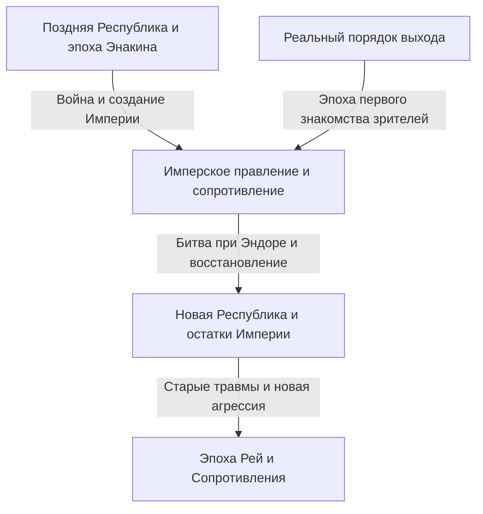
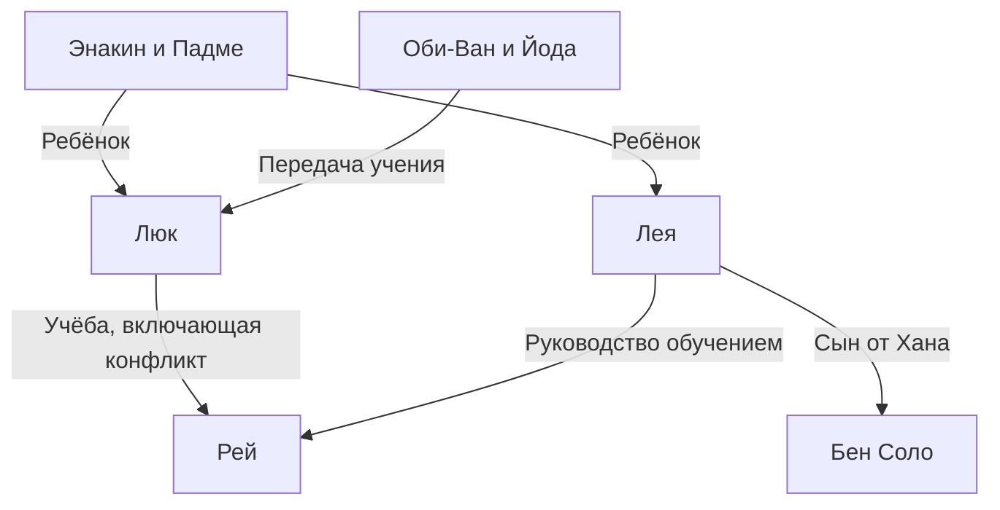

Если представить «Звёздные войны» одним предложением, это приключения в далёкой галактике. Но в них переплетаются любовь и ненависть между родителями и детьми, крушение демократии, сопротивление Империи, религия и власть, травмы войны и семья за пределами кровного родства. За экраном стоит история кинопроизводства, изменившая работу с моделями, монтажом, музыкой, звуком и компьютерной графикой.

Даже если вам знакомы световые мечи и Дарт Вейдер, с ростом числа произведений общую картину увидеть всё труднее. Почему первым вышел четвёртый эпизод? Почему джедаи, рыцари справедливости, не сумели сохранить Республику? Что унаследовали и что изменили истории Энакина, Люка и Рей? Что показывают «Андор» и «Мандалорец», выходя далеко за рамки приложения к фильмам?

Мы рассмотрим эти вопросы на трёх уровнях: история внутри галактики, связи между произведениями и реальная история создания. Это не словарь всех установленных фактов, а большой путеводитель по причинно-следственным связям основных историй и темам, которые повторяются и меняются. Показывая разветвлённость мира, он предлагает новичку маршрут, на котором легче не потеряться.

Текст раскрывает финалы девяти фильмов и связанных произведений, истинные личности героев, важные смерти и решения. Если вы ещё не смотрели их и хотите сохранить неожиданность, прочитайте сначала обзор произведений в начале и рекомендации по порядку просмотра в конце, а затем возвращайтесь к отдельным разделам. Содержание и статус выхода проверены по состоянию на 3 октября 2026 года. Иллюстрации — созданные для статьи концептуальные изображения, а не официальные кадры или производственные документы.

## Сначала разделим три времени: порядок выхода, историю внутри мира и порядок появления замыслов

Главная трудность «Звёздных войн» в том, что их время не образует одну прямую. Фильм, впервые вышедший в 1977 году, позднее занял внутри истории место четвёртого эпизода. Зрители сначала познакомились с приключениями Люка и лишь после 1999 года увидели молодость его отца Энакина. То, что произошло раньше в истории, не обязательно было раньше снято.

Порядок, в котором авторы придумывали детали мира, — ещё один вопрос. Связи, раскрытые в продолжениях, могут изменить смысл ранней сцены. Но это не означает, что при съёмках первого фильма уже были определены все истории на десятилетия вперёд. Для произведения, развивавшегося в процессе создания, нельзя по итоговой связности восстанавливать первоначальный замысел.

Различение трёх времён помогает понять удовольствие от приквелов. Знание развязки не отменяет неожиданностей: можно смотреть трагедию и размышлять, где ещё был возможен иной выбор. Порядок выхода, напротив, приближает нас к моментам получения информации первыми зрителями. Оба подхода ценны; единственного правильного ответа для соревнования в эрудиции нет.

| Группа фильмов | Годы первого выхода | Главный вопрос |
| --- | --- | --- |
| Эпизоды IV, V, VI: оригинальная трилогия | 1977, 1980, 1983 | Как противостоять подавляющей власти и встретиться с прошлым семьи |
| Эпизоды I, II, III: трилогия приквелов | 1999, 2002, 2005 | Почему Республика и Энакин потеряли то, что хотели защитить |
| Эпизоды VII, VIII, IX: трилогия сиквелов | 2015, 2017, 2019 | Как новое поколение наследует победы и ошибки прежнего |
| «Изгой-один», «Хан Соло» | 2016, 2018 | Как показать героев на краях основной саги и их прошлый выбор |
| Анимационный фильм «Войны клонов» | 2008 | Как расширить долгую войну через отношения людей |
| «Мандалорец и Грогу» | 2026 | Как понимать защиту и общность после крушения Империи |

Как правило, указаны годы первого кинопроката; они могут отличаться от японских. Порядок выхода и приблизительную хронологию можно проверить в [официальном путеводителе по фильмам и сериалам](https://www.starwars.com/news/star-wars-movies-and-series-guide). Антологии коротких историй могут охватывать несколько эпох, поэтому размещение целого сериала в одной точке временной шкалы способно ввести в заблуждение.

Это лишь каркас основных экранных историй, а не утверждение, что после одной битвы Империя исчезла из каждого уголка галактики. Символическое поражение режима, перемены в армии, управлении, преступности и сознании людей происходят с разной скоростью. В этом временном разрыве и располагаются многие ответвления саги.

## Канон и «Легенды»: к какой непрерывной истории относятся произведения

Канон — рамка для понимания нынешней официальной непрерывности событий. «Легенды» — категория, объединяющая множество ранее созданных романов, комиксов, игр и других расширений. В 2014 году Lucasfilm пересмотрела подход к существующей расширенной вселенной и объявила новое направление с фильмами и «Войнами клонов» в центре. [Официальное объявление того времени](https://www.starwars.com/news/the-legendary-star-wars-expanded-universe-turns-a-new-page) объясняет этот переход.

Попадание в «Легенды» не означает исчезновения произведения или утраты его читательской ценности. Это истории галактики, выросшие в разные эпохи при разных ограничениях и возможностях. И наоборот, возвращение старого имени или идеи в новом произведении не переносит автоматически все прежние события в новую непрерывность. Чем знакомее имя, тем полезнее уточнить, о какой версии и каком произведении идёт речь.

Кроме того, не всё официально выпущенное обязано разделять одну непрерывность. Например, «Видения» исследуют выражение, свободное от установленной хронологии. И не любое действие, доступное игроку, обязательно произошло в сюжете. Иногда следует различать возможные действия игрока и события, которые продолжение принимает как случившиеся.

Важно не превращать классификацию мира в оценку художественного достоинства. Канон помогает понять связи, но не измеряет силу впечатления. Экранная сцена, официальный справочник, слова героя и зрительское толкование — разные типы информации. Не принимать объяснение, в которое верит персонаж, за всеведущую истину о мире — тоже важный навык чтения.

Здесь основой служит непрерывность нынешних главных экранных произведений; положение «Легенд» и самостоятельных проектов оговаривается отдельно. Мы также различаем показанное в произведении и способы его понимания. Критический анализ института джедаев, например, возможен, но остаётся зрительским анализом, а не официальным фактом, отрицающим добрые намерения всех джедаев.

## Небольшая карта героев перед входом в галактику

В центре — несколько поколений вокруг семьи Скайуокеров. Люк и Лея — дети Энакина и Падме; Бен Соло — сын Леи и Хана, позднее действующий под именем Кайло Рен. Но преемственность нельзя объяснить только кровью. От Оби-Вана и Йоды к Люку, от Энакина к Асоке, а затем к следующему поколению, включая Рей, передаются уроки, ошибки и выбор.

R2-D2 и C-3PO проходят через эту историю в ином, чем люди, положении. Чубакка, Лэндо и товарищи-повстанцы соединяют внутренние семейные проблемы с галактической войной. В позднейших сериалах Кассиан, Дин Джарин, Грогу и клоны показывают время, пережитое теми, кто далёк от центра героической истории.

Разделяя семейные и наставнические отношения, мы видим, что галактическая история — не просто царская родословная. Она спрашивает не только о полученном наследстве, но и о том, как его использовать и что отвергнуть. Начнём с трилогии, через которую зрители впервые вошли в галактику, и рассмотрим роль каждого фильма.

## Эпизод IV «Новая надежда»: галактическая политика входит в жизнь юноши

Первый фильм 1977 года начинается посреди истории мира. Зритель ещё не знает, как возникла Империя, но видит маленький корабль, преследуемый огромным военным судном. Одного сравнения размеров достаточно, чтобы понять разницу сил. Фильм не завершает объяснение мира перед началом действия: необходимая информация постепенно приходит через поступки героев. Дату выхода и основное место истории можно проверить на [официальной странице фильма](https://www.starwars.com/films/star-wars-episode-iv-a-new-hope).

### Приключение начинается не с осознания своей избранности

Люк Скайуокер, живущий на ферме Татуина, поначалу не собирается спасать галактику. Это юноша, желающий вырваться из тесной повседневности. Но прибывшие в дом дроиды несут информацию повстанцев, а просьба Леи о помощи ведёт его к отшельнику Оби-Вану Кеноби. Пока политический конфликт оставался далёкой новостью, Люк мог вернуться на ферму. Имперское насилие убивает вырастивших его опекунов, и граница рушится.

Эта причинность важна. Не Люк сначала выбрал приключение и поэтому оказался связан с Империей: уничтожена сама возможность жить в стороне от её правления. Это и взросление человека, и вторжение насилия власти в жизнь окраины. Но одно горе ещё не делает героем. Встречая наставника и друзей, учась действовать и помогая другим своими способностями, он придаёт первоначальному желанию общественный смысл.

Лею спасают, однако она не просто ждёт спасения. Она прячет сведения, выдерживает допрос и принимает решения во время побега. Люк и Хан входят в крепость, чтобы её выручить, но она сама исправляет их ошибки. Незакреплённость ролей не позволяет превратить троицу в простую схему «герой, помощник, награда»: они влияют на решения друг друга.

### Звезда Смерти — и пушка, и идея управления

Ужас Звезды Смерти не ограничен огневой мощью, уничтожающей планеты. За ней стоит замысел сделать повседневные переговоры и представительство ненужными с помощью демонстрации силы. Роспуск Сената связан с подчинением систем страхом. Разрушение Альдераана выходит далеко за пределы взятия военной базы: это угроза каждому, кто может задуматься о сопротивлении.

У повстанцев нет равного оружия. Они анализируют чертежи, находят маленькую уязвимость и сосредотачивают ограниченные силы. Победа требует соединить труд дроидов-курьеров, тех, кто доверил им планы, аналитиков и механиков истребителей. Последний выстрел делает Люк, но его возможность создаёт широкое сотрудничество. Без этой структуры легко прочесть фильм как историю, где один человек особой крови решает всё.

Возвращение Хана — тоже часть сотрудничества. Руководствовавшийся деньгами человек возвращается помочь друзьям, зная об опасности. Момент, когда Люк перестаёт полагаться только на прицел и доверяет Силе, и момент, когда Хан перестаёт считать только оплату, можно понимать как шаг к доверию за пределами немедленной выгоды. Это не призыв отказаться от техники: истребители, связь и чертежи необходимы. Вопрос в том, что ещё входит в окончательное решение.

Примечательно и то, что история галактики появляется через требующие ремонта машины и расходы на жизнь. «Тысячелетний сокол» — не безупречное быстроходное средство, а корабль, который владельцу приходится поддерживать в рабочем состоянии. Посетители кантины существуют не только ради объяснений герою; дроидов покупают и продают. Поскольку за центром кадра словно продолжаются чужие дела, зритель ощущает давность мира, даже не понимая всего.

## Эпизод V «Империя наносит ответный удар»: поражение разрушает представление героя о себе

Предыдущая победа не означает исчезновения Империи. Повстанцы всё ещё бегут и не могут удержать даже базу на Хоте. Отправная реальность фильма: уничтожение гигантского оружия не уничтожает вместе с ним институты и армию. Картина 1980 года параллельно развивает обучение Люка и бегство Хана с друзьями. [Официальная страница фильма](https://www.starwars.com/films/star-wars-episode-v-the-empire-strikes-back)

### Обучение проверяет не только умение поднимать камни

На Дагобе встреча с Йодой ломает ожидания Люка относительно облика и поведения великого учителя. В маленьком странном существе он не сразу узнаёт мудрость. Замысел действует и на зрителя: прежде чем начать учение о Силе, фильм разрушает привычную связь могущества с большим телом или оружием.

В пещере под маской побеждённого Вейдера Люк видит собственное лицо. Фильм не определяет видение как простую картину будущего. Его можно понять как предупреждение: действуя из страха перед врагом и гнева, можно стать таким же. Если прежде задачей было победить внешнего врага — Империю, теперь исследуется и собственное желание победить.

Увидев страдания друзей, Люк прерывает обучение. Трудно назвать это решение совершенно правильным из-за доброты или совершенно неправильным из-за незрелости. Нежелание бросить друзей понятно, но свои силы и пределы информации он оценил неверно. Кроме того, Вейдер использует именно это чувство, чтобы заманить его. Добрые намерения не отменяют необходимости оценить обстановку.

### Сделка Лэндо и пределы компромисса с властителем

Лэндо договаривается с Империей, чтобы защитить Облачный город. Но договор не обеспечивает безопасности, когда господствующая сторона может односторонне менять условия. Выполнишь одно — последует новое. Его неудача — не только личное предательство, но и политический провал попытки сохранить автономию под подавляющим насилием.

И всё же одна ошибка не обязывает ошибаться дальше. Затем Лэндо организует спасение. Люк терпит поражение, Лэндо предаёт, Хан попадает в плен, но ценность человека не равна доле его успехов в этот момент. Исправлять поступки, просить помощи и отвечать на помощь остаётся мерой, отличной от победы.

Признание Вейдера в отцовстве не стирает границу добра и зла: насилие Империи не становится оправданным. Рушится упорядоченная семейная история Люка, считавшего себя сыном хорошего отца, а врага — посторонним убийцей этого отца. Схема «победив врага, приблизиться к отцу» превращается в вопрос: как встретиться с врагом, чтобы унаследовать отца?

В конце дуэли Люк не победитель. Он ранен, не может спастись сам, и его забирают Лея с товарищами. Спасение тем, кого он сам спасал в первом фильме, также отрицает изоляцию героя. Самостоятельность — не только отсутствие зависимости; это и возвращение в отношения со своими ошибками и слабостью. Поэтому мрачный финал — гораздо больше, чем отсроченная до следующего фильма развязка.

Белая пустыня Хота, влажная замкнутость Дагобы, светлая поверхность и тёмные недра Облачного города — не туристические фоны. Фактура мест поддерживает военное отступление, погружение внутрь себя и крах кажущейся безопасности. При каждом перемещении привычный способ действия перестаёт работать. Опыт победы на истребителе не отвечает на задачи обучения, переговоров и разговора с отцом.

Созданный концепт-арт передаёт неравенство сил повстанцев и Империи. Это не официальный кадр фильма.

## Эпизод VI «Возвращение джедая»: спасти отца и победить Империю

Финал 1983 года начинается со спасения Хана и совмещает восстановление личных связей с галактической войной. Люк во дворце Джаббы спокойнее юноши из первого фильма и увереннее обращается с силой. Однако внешние признаки ещё не доказывают зрелости джедая. Последнее испытание — что выбрать, когда победа доступна. [Официальная страница фильма](https://www.starwars.com/films/star-wars-episode-vi-return-of-the-jedi)

### Ловушка Императора нацелена скорее на гнев, чем на смерть

Император стремится уничтожить повстанцев военным путём и одновременно привлечь Люка. Он показывает опасность для друзей, провоцирует удар в гневе и убийство отца в том же состоянии. Если Люк победит Вейдера, но примет ту же логику господства, победителем останется Император. Поэтому военная победа и этический успех в этой дуэли могут поменяться местами.

Разъярённый угрозой Лее, Люк одолевает Вейдера. Когда он сравнивает механическую руку отца со своей, видение пещеры возвращается как конкретный выбор. Он кладёт оружие не потому, что опасности больше нет. Принимая риск собственной смерти, он отказывается убивать отца и выходит из системы, где силу доказывают уничтожением врага.

Вейдер выступает против Императора, увидев страдание сына. Здесь есть искупление, но фильм не говорит, что прежние преступления аннулированы. Вера сына в оставшееся добро отца и обязанность жертв простить виновного — разные вещи. Картина показывает последнюю перемену в отношениях отца и сына, но не завершает вопросы права и исторической памяти. Сохранив это различие, можно понять пределы финала, не разрушая его эмоциональной силы.

### Почему бой в лесу столь же необходим, как тронный зал

Если смотреть только на противостояние с Императором, кажется, что мир движим семейной проблемой. Но без отключения щита наземной группой на Эндоре флот не уничтожил бы вторую Звезду Смерти. Спасение отца Люком и разрушение военного объекта повстанцами одновременно необходимы. Одно автоматически не заменяет другого.

Эвоки приносят знание местности и другой способ боя. Империя превосходит их бронёй и огнём, но недостаточно видит в жителях самостоятельных действующих лиц. Пренебрежение мешает оценить сопротивление с использованием рельефа и засад. Это не утверждение, что примитивное оружие всегда побеждает современную армию в реальной войне. Как притча эпизод показывает слабость властителей, недооценивающих суждение и сплочённость малых существ.

Люк, Хан, Лея, Лэндо, Чубакка, дроиды, безымянные солдаты и жители Эндора объединяют усилия, поэтому праздник — не коронация одного человека. Это также возвращение потерявшего отца Люка в общность. Личная потеря и общественная победа сосуществуют; счастье фильма не является безболезненным всеобщим благополучием.

Поражение Императора связано и с расчётом, что все в итоге подчинятся выгоде и страху. Сын, не отказывающийся верить в отца, и отец, выбирающий сына вместо повиновения, выходят за пределы расчёта. Никакая мощь Силы не позволяет полностью предсказать человеческий выбор. Здесь та же самоуверенность, что в поклонении гигантскому оружию: будто человеческие сердца уже полностью подвластны.

## Эпизод I «Скрытая угроза»: Империя не сразу показывает имперское лицо

Приквел 1999 года начинается не с явной военной диктатуры, а с конфликта внутри Республики. Блокада Набу Торговой федерацией превращает спор о торговле и налогах в вооружённую оккупацию. Молодая королева Падме Амидала надеется, что обращение к Сенату принесёт признание фактов и помощь. Но институты задерживаются на расследованиях и процедурах; скорость решений не соответствует боли на месте. [Официальная страница фильма](https://www.starwars.com/films/star-wars-episode-i-the-phantom-menace)

### Палпатин приобретает поддержку как решатель кризиса

Для знающего дальнейшую историю зрителя советы сенатора Палпатина с Набу двусмысленны. Стоя рядом с пострадавшими, он использует недоверие к руководителю, кажущемуся бессильным. Важно, что он не врывается извне, чтобы одним ударом разрушить Республику, а повышает положение через парламентские процедуры и ожидания общества.

Противники тоже не монолитны. Федерация преследует свою выгоду, а Дарт Сидиус использует её как средство большого плана. Внешний конфликт может разрешиться, но вызванное им перемещение власти остаётся. Освобождение Набу — настоящая победа, не обязательно являющаяся победой для будущего всей Республики. Несовпадение масштабов оставляет тревогу посреди праздника.

Обращение Падме к гунганам показывает противоположную политику. Она не только бережёт достоинство представителя, но признаёт связь жителей одной планеты и просит помощи. Это не просто восполнение военной нехватки: отдалённые друг от друга группы получают общую цель. Малая солидарность создаёт действенность, не найденную в Сенате.

### Прежде таланта Энакина стоит увидеть его жизнь

Маленький Энакин удивительно управляет техникой, но остаётся рабом. В мире огромной Республики, где джедаи говорят о справедливости, свобода матери и сына не обеспечена. Так виден разрыв между существованием института и достижением его защиты всех мест. Квай-Гон освобождает Энакина, но не может тем же способом спасти его мать Шми.

Отъезд соединяет счастье признанного таланта со страхом оставить мать. Если видеть в будущем Энакине только слабого человека, не преодолевшего страх, исчезают условия рождения этого страха. Но тяжёлое происхождение не делает последующее насилие неизбежным. История спрашивает, какая поддержка и какое образование нужны человеку с травмой.

После смерти Квай-Гона наставник, нашедший Энакина, не становится тем, кто долго его ведёт. Оби-Ван принимает обещание, но их отношения изначально не зрелы. Великое пророчество и институциональные ожидания начинают обгонять рост ребёнка. Этот дисбаланс готовит трагедию приквелов.

С производственной стороны называть приквелы полностью компьютерными фильмами тоже неточно. Официальные материалы упоминают реальные приёмы, включая окрашенные ватные палочки, изображавшие зрителей в модели арены гонок. Представление о совместной работе новых технологий и ручного труда ближе к действительности. [Официальные факты о создании](https://www.starwars.com/news/25-fun-facts-the-phantom-menace)

Одновременные бои в нескольких местах помогают различить задачи групп. Отвлекающие действия гунганов, операция во дворце, космический бой и дуэль джедаев с ситхом решают разные проблемы. Одного сильного фехтовальщика недостаточно для конца оккупации. А за военным успехом стоит потеря Квай-Гона, поэтому победа общности не совпадает с потерей в жизни мальчика.

## Эпизод II «Атака клонов»: подготовка войны сужает пространство выбора

В фильме 2002 года расширяются силы, желающие выйти из Республики, и создание армии становится политической темой. Расследуя покушение на Падме, Оби-Ван обнаруживает армию клонов. Перед Республикой, ещё обсуждающей ответ на кризис, внезапно возникает готовое войско. Срочная потребность в безопасности соединяется с чрезвычайно удобной силой неизвестного происхождения. [Официальная страница фильма](https://www.starwars.com/films/star-wars-episode-ii-attack-of-the-clones)

### Военная срочность обгоняет загадку, которую следовало расследовать

Кто заказал клонов и для чьей пользы они созданы — это требовало первоочередной проверки. Но перед лицом вражеской армии хочется боеспособной силы немедленно. Кризис меняет решения, отнимая время на внимательное рассмотрение. Армию принимают не после полной проверки, а в обстановке кажущегося отсутствия альтернатив.

Критика Республики Дуку включает реальную проблему коррупции. Однако верно назвать проблему не значит предложить справедливое решение. Поскольку он сам участвует в замысле ситхов, разочарование Республикой не ведёт автоматически к освобождению. Нужно различать внешнее противостояние сторон и позицию Сидиуса, который им пользуется.

Джедаи идут на поле боя ради мира и превращаются в генералов. Спасательная операция удаётся, но начинает войну — парадокс. Защита ближайших жизней сочетается с долгосрочным усилением военного порядка. Средство, выбранное ради доброго намерения, начинает менять природу самой организации.

### Общее для любви и политики желание контролировать

Отношения Энакина и Падме осложнены положением, обязанностями и дисциплиной джедаев. Тайный брак защищает любовь, но сужает круг совета и поддержки. Когда мало людей, с кем можно делиться трудностями, растущий страх труднее увидеть со стороны.

После смерти матери Энакин убивает жителей поселения тускенов, включая детей. Нельзя легко пройти мимо как мимо простой демонстрации силы гнева. Насилие над близким превращается в оправдание насилия над непричастными — явный этический крах. Горе понятно, но ответственность за поступок остаётся. Позднейшее падение не внезапно: большая граница уже перейдена.

Политическая мысль Энакина, что сильный лидер может решать за всех ради желаемого результата, перекликается с желанием управлять утратой в близких отношениях. Нелегко принять чужую волю и жизнь любимого, которая тебе не подвластна. Но принудительное устранение неопределённости разрушает защищаемую связь. В следующем фильме это дойдёт до предела.

Одинаковый вид армии клонов несёт тревожное отношение к людям как к заменяемой боевой силе. Общее происхождение не позволяет считать их жизни одной вещью. Кино сначала показывает появление огромной армии, позднейшие произведения раскрывают личности солдат. Заметив последовательность, можно иначе посмотреть на спасшее Республику войско: кто заплатил за это спасение?

## Эпизод III «Месть ситхов»: желание спасти становится логикой господства

В третьем фильме 2005 года Войны клонов подходят к завершению, а Республика — к краху. Люди ждут возвращения мира после победы, но сосредоточенная ради войны власть становится основой послевоенной диктатуры. Одновременное падение Энакина и Республики не позволяет свести трагедию только к слабой воле личности или только к провалу системы. [Официальная страница фильма](https://www.starwars.com/films/star-wars-episode-iii-revenge-of-the-sith)

### Палпатин продаёт обещание власти над смертью

Энакин боится потерять Падме. Палпатин не отрицает страх прямо, а намекает на силу, недоступную в другом месте. Это тоньше проповеди зла: понять, чего человек больше всего не хочет лишиться, и убедить, что без тебя это не сохранить. Чем глубже зависимость, тем легче принять противоречивые объяснения и преступные требования.

Между Энакином и Советом джедаев тоже недоверие. Он чувствует непризнанность, Совет опасается его близости к Палпатину. Добавленное поручение следить за ним разрывает лояльность. Но объяснение положения и освобождение от ответственности различны. Помешав Мейсу Винду ради Палпатина, Энакин продолжает выполнять ещё более разрушительные приказы.

После серьёзной ошибки человек иногда выбирает не возвращение, а путь, который будто докажет смысл ошибки. Так можно понимать цепочку самооправданий Энакина: раз зашёл настолько далеко, без обретения силы всё окажется напрасным. Эта мысль делает следующее преступление похожим на необходимую жертву.

### Приказ 66 разворачивает разрушительную силу внутри системы

На джедаев нападают не новые войска издалека, а солдаты, с которыми они сражались. Когда командная цепь разворачивается, размещение и доверие, основанные на союзничестве, становятся уязвимостью. Фильм показывает приказ и синхронные атаки, а подробный механизм контроля клонов дополняет анимация. Различая исходное объяснение и позднее дополнение, мы видим функции произведений.

Империя возникает не в момент разрушения всех республиканских зданий, а через объявление нового порядка в зале Сената. Язык восстановления безопасности включает надзор и насилие в постоянное правление. Объявление несогласных джедаев предателями переопределяет сопротивление концентрации власти как нападение на порядок.

На Мустафаре Энакин применяет насилие к Падме, которую хотел спасти. Когда она не соглашается, он не уважает её волю, а видит предательство. Разница любви и обладания становится ясной. В желаемом будущем ему нужна не просто живая Падме, а Падме, одобряющая его решения.

Обожжённое тело Энакина заключают в броню параллельно рождению близнецов: отчаяние соседствует с новой возможностью. Ни Оби-Ван, ни Йода не победители. Всё же защита детей сохраняет будущее внутри политического поражения. Приквелы завершаются не историей победы зла из-за исчезновения добрых людей, а катастрофой, созданной сочетанием добрых намерений, страха, институтов и амбиции.

Горе Оби-Вана далеко от удовлетворения победой над найденным злодеем. Он сражается с тем, кого считал братом, и сохраняет вопросы к собственному обучению и суждениям. Долгая дуэль — не только соперничество мастерства, но и боль людей, слишком хорошо знающих друг друга, чтобы легко разорвать связь. Победившему тоже негде праздновать.

## Эпизод VII «Пробуждение Силы»: поколение, не знавшее прежних героев, наследует прошлое

В новой главе 2015 года герои повстанцев для Рей и Финна почти легендарны. Знакомые зрителю имена далеки молодым персонажам. Этот разрыв помещает память старого зрителя и удивление нового в один кадр. Возникновение Первого ордена после Империи показывает, что прошлая победа не гарантирует безопасности потомкам. [Официальная страница фильма](https://www.starwars.com/films/star-wars-episode-vii-the-force-awakens)

### Финн становится героем прежде всего через отказ от приказа

Финн начинает не с выдающегося происхождения или пророчества, а с отказа убивать, когда от него требуют солдатского повиновения. Так номер внутри организации начинает становиться человеком, решающим сам. Но готовности спасать всю галактику ещё нет: сначала очень хочется бежать. История показывает не добро после исчезновения страха, а то, как остаться ради другого вместе со страхом.

Рей на Джакку умеет выживать и ждёт возможного возвращения семьи. Её неподвижность связана не с недостатком способностей, а с ожиданием прошлого. Покинуть родину — не просто переместиться на планету, а перейти от надежды, что ожидание вернёт прежнюю жизнь, к возможности самостоятельно создать новые связи.

### Кайло Рен жаждет скорее образа Вейдера, чем его силы

Бен Соло пытается переделать себя в Кайло Рена. Он поклоняется деду, но последнее спасение Вейдером сына не соответствует желаемому образу могущественного зла. Люди не всегда наследуют прошлое целиком: они выбирают нужное. Кайло воплощает возможность превращения преемственности в ошибочное прочтение.

Убийство Хана — не просто хладнокровное устранение препятствия злодеем. Полагая, что разрыв семейной привязанности сделает сильным, он пытается преобразить себя. Но насилие не обязательно устраняет внутренний конфликт. Поступок ради уничтожения колебаний создаёт новую рану. Рей движется к связи с другими, Кайло пытается утвердить себя её разрывом.

Сходство базы «Старкиллер», дроида с картой и других конструкций с первым фильмом очевидно. Его можно принять как ностальгию или критиковать за повторение. Но анализу стоит идти дальше самого сходства: какие иные решения принимают люди в сходных позициях? Солдат имперского типа становится героем, ожидавшая спасения девушка сопротивляется сама, сын героя оказывается врагом. В знакомом контуре центральной становится тревога наследования.

Разрушение центра Новой Республики ярко показывает хрупкость политического порядка. Но поскольку фильм прежде не уделил много времени его повседневности, зрителю непросто ощутить конкретный масштаб утраты. Это можно считать пределом объяснения внутри фильма. Знакомство с другими произведениями добавит веса, но нельзя винить во всём не читавшего их зрителя: количество сообщённого самим фильмом влияет на опыт просмотра.

## Эпизод VIII «Последние джедаи»: признать неудачу, не отказавшись от ответственности

Второй фильм 2017 года ломает ожидание, что встреча Рей с Люком всё разрешит. Люк отказался от жизни, в которой снова выходит героем вперёд. Одновременно преследуемое Сопротивление принимает решения о выживании при ограниченных ресурсах. Фильм пересматривает и личный образ героя, и организационное руководство. [Официальная страница фильма](https://www.starwars.com/films/star-wars-episode-viii-the-last-jedi)

### Может ли признание ошибки оправдать отказ от всего

Прошлое Люка и Бена рассказано с разных точек зрения. Мгновенный страх Люка и страх увидевшего его Бена придают одной сцене разный смысл. Это не релятивизм, будто фактов нет, а разница между собственной мыслью и чужим пережитым опытом. Объяснения «это был миг» и «я пожалел» не стирают нанесённого вреда.

Люк связывает свою ошибку с провалом всех джедаев и хочет прекратить традицию. Историческая критика заслуживает размышления, но если она лишь оправдывает его отсутствие, то уводит от ответственности перед страдающими сейчас. Между безусловной защитой традиции и полным её отбрасыванием из-за провала нужен путь извлечения и передачи уроков.

Рей и Кайло прикасаются к возможности понимания, но понять не значит согласиться. Общее одиночество не требует принять господство над другими. Убийство Сноука также не переводит Кайло автоматически на сторону добра. Уничтожить правителя и отвергнуть механизм правления — разные вещи: он хочет занять освободившееся место.

### Смелость и командование работают в разных временных масштабах

По смел перед ближайшим врагом, но должен учиться цене успеха в людях и силах. Заметный результат одной битвы и сохранение организации до завтра различны. На командной позиции ответственность включает решение не атаковать или отступить.

Конфликт с Холдо также показывает трудность обмена сведениями. Зритель переживает несовпадение того, кто что знает. Общий вывод «подчинённые должны молча повиноваться» был бы слишком узок. Если видеть столкновение секретности, доверия, командных полномочий и недостаточных объяснений в кризисе, становятся видны достоинства и недостатки героев.

Эпизод Канто-Байта показывает, что будто бы внешнее по отношению к войне процветание связано с ней оружием и эксплуатацией. Финн от желания защитить конкретного друга идёт к смыслу более широкого сопротивления. Но торговля эксплуататоров с обеими сторонами не доказывает тождества политических целей сторон. Критика структуры выгоды и приравнивание агрессии к сопротивлению — не одно и то же.

В конце Люк не уничтожает множество солдат, а выигрывает товарищам время на жизнь. Человек, ненавидевший свой легендарный образ, принимает его способность давать надежду и привлекает внимание противника не физической победой. Можно сказать, фильм начинается разрушением образа героя и завершается новым выбором его использования.

Рей ищет у Люка не только технику, но и внешний ответ на вопрос, кто она. Однако наставник тоже ошибается и боится. Узнав несовершенство опоры, она должна решить, что принять из его учения. Поэтому история не только об отрицании учителя учеником: возможно ли продолжить учиться после прекращения идеализации?

## Эпизод IX «Скайуокер. Восход»: происхождение и самостоятельно выбранное имя

Девятый фильм 2019 года вновь делает Палпатина последним противником и связывает происхождение Рей с его родом. Её прежнее представление, что она не принадлежит значимой семье, существенно переписано. Отношение к повороту различно, но для анализа сначала надо разделить сообщённое каждым фильмом и добавленное следующим. [Официальная страница фильма](https://www.starwars.com/films/star-wars-episode-ix-the-rise-of-skywalker)

### Родословная может объяснить способность, но не стать нравственным приказом

Рей боится, что злой род определит будущее. Но развязка ведёт не к повиновению происхождению, а к выбору принимаемых уроков и отношений. Вопрос не сводится к фразе «кровь неважна». Фильм действительно делает родство крупным сюжетным механизмом, одновременно пытаясь показать свободу через отказ от будто бы предписанной им роли.

Связь с Люком и Леей — другая линия преемственности Рей. Выбор имени Скайуокер — скорее выражение наследуемых ценностей и воспитавших её отношений, чем заявление биологической родословной. Но имя не уничтожает боли и прошлого. Значение в том, чтобы, зная прошлое, решить, как называть себя.

Технические подробности возвращения Палпатина лишь ограниченно объяснены фильмом. Дополнения справочных материалов нельзя смешивать с непосредственно показанным, словно всё уже объяснили на экране. Сюжетно важно, что страх смерти и одержимость властью превращают даже следующее тело и поколение в инструменты. Продававший Энакину власть над жизнью до конца пользуется другими ради самосохранения — здесь непрерывность.

### Перемена Бена переворачивает идею победы над смертью

Возвращение Бена из жизни Кайло Рена связано с зовом матери, спасением его жизни Рей и памятью об отце. Попытка избавиться от внутреннего конфликта убийством отца не удалась. Напротив, новое принятие связи открывает иной выбор. Это не стирает прежнего вреда, но оставляет возможность другого действия сейчас.

Финал, в котором он отдаёт жизнь Рей, противопоставлен Энакину, жертвовавшему другими, чтобы не потерять любимую. Вместо господства над миром ради удержания жизни — дар со своей стороны. Контраст меняет значение спасения во всех девяти фильмах. Оставить другого рядом и желать, чтобы он жил, — не одно.

Флот у Экзегола выполняет задачу, отличную от дуэли Рей. Разделённые страхом люди подтверждают существование друг друга и собираются. Убедительность этого сбора зритель оценивает сам, но структура требует участия за пределами способностей одного героя. Финальная битва снова совмещает борьбу родословных с сопротивлением множества обычных людей без особого происхождения.

Возвращение на Татуин в конце девяти фильмов означает, что то же место не равно тому же состоянию. В первом фильме на горизонт смотрел юноша, желавший уйти вдаль; в последнем имя произносит прошедший путь человек. Повтор начального пейзажа завершает расширение мира и определение собственного места как единое движение.

## «Изгой-один»: те, кто сделал возможным последний удар героя и не вернулся

«Изгой-один» 2016 года показывает передачу чертежей Звезды Смерти повстанцам перед первым фильмом. Знание общего результата не устраняет напряжения: вопрос не только в доставке планов, но и в том, кто что потерял ради неё. Официальное объявление о создании называет инициатором Джона Нолла из ILM и подчёркивает взгляд наземной войны. [Официальное объявление о производстве](https://www.starwars.com/news/rogue-one-the-daring-mission-has-begun-cast-and-crew-announced)

### Сопротивление инженера и новое понимание дочерью его смысла

Гален Эрсо участвует в создании имперского оружия и закладывает внутреннюю слабость, способную его уничтожить. Возникает трудный вопрос: всегда ли пребывание в системе означает соучастие и насколько возможен саботаж изнутри? Но его случай не позволяет объявить всех сотрудничавших тайными борцами. Фильм показывает выбор конкретного человека и трудность передачи этого выбора другим.

Получая обрывки сведений об отце, Джин пересматривает простой образ предателя. Но одного знания добрых намерений недостаточно, чтобы остановить оружие. Нужно подтвердить уязвимость, получить планы и передать их в пригодной форме. Только превращение личного примирения в общественное действие делает сопротивление отца действенным.

### Изображать неправоту повстанцев не значит оправдывать Империю

Кассиан делал тёмную работу ради восстания. Не всё в его поступках можно простить лишь за правоту цели. Внутри повстанцев есть разногласия, и перед опасностью они не едины. Это показывает отсутствие полной чистоты у сопротивляющихся, но не тождество господства и сопротивления.

Вопрос в том, что люди с запачканными руками сделают дальше. Кассиан идёт с Джин из отчаянного нежелания оставить прежние жертвы просто жертвами. Однако это желание может бесконечно оправдывать следующие. Фильм обозначает границу различием между приказом расходовать других и собственным принятием риска.

В битве на Скарифе разделены наземная связь, космический флот и работа внутри сооружений. Как бы ни был силён один человек, разрыв соединения в другом месте провалит миссию. Техническая задача передачи становится формой солидарности. Многократный переход информации из рук в руки не бессмысленный повтор, а показ продолжения труда за пределами личного выживания.

Они не попадут на праздник первого фильма, но их труд входит в последующую победу. За героями «Новой надежды» становятся видны люди, чьих имён и лиц зритель не знал, и уплаченная ими цена. Именно так ответвление обогащает основную историю, меняя этический вес знакомого события.

Вера Чиррута также не равна всемогущей защите. Доверие Силе не гарантирует телесной безопасности. Вера здесь не договор об освобождении от смерти, а позиция действия в опасности. Даже без главного героя, обученного джедаем, идея Силы участвует в человеческих решениях и надежде — Чиррут позволяет это увидеть.

## «Хан Соло»: как появился человек, кажущийся корыстным

«Хан Соло» 2018 года немного отходит от войны за власть во всей галактике к преступным организациям, перевозкам, долгам и сделкам. Знакомство молодого Хана с Чубаккой и Лэндо показывает с другой стороны человека из первого фильма. Как указывает официальная страница, в центре — приключение в преступном мире окраин. [Официальная страница фильма](https://www.starwars.com/films/solo)

### Даже за купленной свободой ждёт следующая зависимость

Хан хочет бежать с Кореллии, но побег не даёт автоматически свободной жизни. Имперская армия, преступные группы, посредники по работе — каждое средство выживания приносит новую иерархию. Собственный корабль нужен не только из любви к полётам: это материальное условие самому выбирать направление.

Беккет учит не слишком доверять другим. В опасной среде такая тактика выживания разумна. Но если все отношения основаны на ожидании предательства, сотрудничество сжимается до временного обмена выгодами. Хан принимает часть урока, не превращаясь полностью в такого же человека.

Встреча с Чубаккой показывает разницу. Даже если вначале их соединяет общий интерес выживания, совместное прохождение опасности рождает связь за пределами обмена. Позднее доверие становится не заранее заданной характеристикой, а результатом наблюдения поступков и постепенных суждений друг о друге.

### У Ки’ры есть жизнь за пределами истории Хана

Хан хочет увезти Ки’ру и исполнить старое желание. Но прожитый ею ради выживания мир сложнее его представлений. Встреча не означает восстановления прежних отношений в неизменном виде. Между желанием спасти и пониманием нынешних условий другого есть расстояние.

Если объяснять её выбор лишь наличием любви, исчезнут ограничения выживания внутри организации и амбиции. Пусть Хан главный герой, не все чужие жизни работают на исполнение его надежд. Эта асимметрия становится частью разочарования и взросления молодого Хана.

С изменением взгляда на группу Энфис Нест колеблется граница преступника и сопротивляющегося. Кому принадлежит груз, кто его забирает и на что использует? Владелец по договору не обязательно морально прав. Последнее решение Хана нельзя объяснить одной выгодой: оно показывает характер, который позднее вернёт его к повстанцам.

Этот Хан не окончательное объяснение человека из первого фильма: личность не создаётся одним опытом. И всё же под иронией и корыстными словами видно неумение совсем бросить других. Притворяясь не хорошим человеком, он поступками постоянно опровергает самопрезентацию. Это несовпадение и составляет обаяние Хана Соло.

Дроид L3-37 расширяет тему свободы на нечеловеческие существа. Она машина с удобной личностью или субъект с собственным суждением и требованиями? В её словах и действиях всплывает вопрос, часто обёрнутый в сериале шуткой. Фильм не решает его полностью, но можно одновременно любить дружелюбие дроидов и спрашивать об отношениях собственности над ними. В малом приключении окраин скрываются вопросы всей галактики.

## Расширяющаяся за фильмами галактика через институты и повседневность

При переходе от кино к сериалам и анимации галактика внезапно становится подробной. Победить Императора и заплатить за завтрашний обед — не одна задача. Спасённый джедаем на поле боя и человек, чью жизнь разрушила военная операция, по-разному чувствуют одну Республику. Различие перспектив делает ответвления чем-то большим, чем дополнительные истории.

### Одна политическая система по-разному выглядит из центра и с окраин

Столица Республики Корусант — центр Сената, бюрократии и Храма джедаев. Но республиканский флаг не обеспечивает одинаковой защиты всем жителям. На окраинах вроде Татуина идеалы не доходят в полной мере, а жизнью могут управлять преступники и рабство. Государство, стройное из центра, с периферии выглядит правительством, обсуждающим проблемы где-то далеко.

Эта дистанция важна и для сепаратизма. Даже если руководство Конфедерации независимых систем или военная промышленность включены в злой план, не все недовольные Республикой жители дурны. Недовольство коррупцией, политическим пренебрежением и экономическим неравенством существует независимо от заговора. Искусство Палпатина скорее в использовании готовых противоречий и направлении выхода к собственной власти, чем в создании их из ничего.

С Империей различия планет не исчезают. Где-то напрямую чувствуют гигантское оружие, другие узнают режим через добычу ресурсов, силовиков, удостоверения, заключение и реквизиции. После создания Новой Республики в местах отступления центральной власти действуют пираты и старые имперские вооружённые группы. По имени государства нельзя судить о безопасности и свободе. Планета, класс и работа наблюдателя помогают понять разную атмосферу произведений об одной эпохе.

Концепт-арт противопоставляет центр и окраины галактики, а также разные эпохи. Это не официальное изображение или проект мира.

### Джедаи — не государство, а связанный с ним орден

Джедай — не общее имя всех использующих Силу, а член организации с обучением, дисциплиной, наставничеством и традицией общности. В поздней Республике они считают себя хранителями мира, но не являются отшельниками вне политики. Они выполняют дипломатические поручения, связаны с Сенатом и становятся генералами Войн клонов. Совмещение ролей порождает и добрые намерения, и системные неудачи.

Они командуют ради защиты людей, но командная роль всё сильнее привязывает к политической структуре, определяющей конец войны. Тактический успех против солдат не обязательно равен миру. Сведение провала джедаев к слабому фехтованию скрывает трагедию: участвуя в военном бою, они недостаточно увидели, что сама война — ловушка.

Это не приравнивает джедаев к Империи. Ошибающийся институт отличается от института, сознательно ставящего целью господство и страх. Вопрос в том, избавляет ли доброта от самоанализа. Когда защита Республики конфликтует с продолжением повиновения её решениям, что важнее? Истории Асоки и Дуку переводят противоречие в личный опыт.

### Ситхи и пользователи тёмной стороны не обязательно одна группа

Называя ситхом любого врага с красным мечом, мы путаем организации. Инквизиторы охотятся на джедаев для Империи, но не занимают положение ситхских учителя и ученика. Сёстры Ночи Датомира также имеют иную традицию. Использование тёмной стороны и принадлежность определённой линии ситхов надо различать.

Связанное с Дартом Бейном «Правило двух» основано на отношениях учителя, владеющего силой, и ученика, жаждущего её. Это не физический закон, допускающий во всей галактике лишь двух злых пользователей Силы, а принцип наследования организации. Вокруг могут оставаться союзники, убийцы, используемые кандидаты и отброшенные ученики. Официальный справочник объясняет, что Бейн ввёл правило ради выживания ситхов. [Официальное описание Дарта Бейна](https://www.starwars.com/databank/darth-bane)

Здесь видна противоположная джедайской педагогика. Даже желая роста ученика, учитель-ситх выращивает угрозу себе. В сотрудничество встроена логика использования и окончательной замены другого. Понимание Императора и Вейдера или использованного и выброшенного Мола углубляется, если смотреть не только на характеры, но и на порождение недоверия самой связью.

## «Войны клонов» меняют взгляд на войну

### Функции фильма и большого сериала

Анимационный фильм «Звёздные войны: Войны клонов» 2008 года служит входом в одноимённый сериал. Для смотревших лишь кино ученичество Асоки Тано у Энакина — крупное дополнение. Оно нужно не для расширения списка героев. Ответственность Энакина за обучение другого проявляет его храбрость, заботу и сопротивление правилам в конкретной связи.

Сериал показывает войну между вторым и третьим эпизодами, не ограничиваясь операциями Республики. Взгляд переходит к дипломатии, работорговцам, преступным организациям, нейтральным планетам и сомнениям обычных людей. Политический фон, занимавший в кино минуты, становится повседневностью и постоянными решениями. Победа одной серии часто не улучшает общего положения, и виден износ долгой войны.

Но понимание длинного сериала не требует превращать всё в поиск предвестий кино. Зритель знает итог, персонажи — нет. Время, когда они помогают товарищам, выполняют задания и накапливают малое доверие, ценно само по себе. Именно его подробность делает Приказ 66 не только историческим событием, а катастрофой, разрушающей долго строившиеся связи.

### Одинаковые лица клонов не означают одинаковых личностей

Неразличимые в киноармии клоны становятся Рексом, Файвзом, Эхо — людьми с именами и решениями. Генетическое сходство не равно одинаковому опыту и характеру. Рисунок брони, причёски, речь и отношения с сослуживцами позволяют узнавать каждого.

Проявляется и этическое противоречие Республики: война за свободу зависит от рождённых для боя солдат, не вполне свободных покинуть службу. Джедаи-командиры часто уважают подчинённых, но личная мягкость не решает системного вопроса. Можно одновременно признавать смелость солдат и спрашивать о структуре их положения.

История чипов-ингибиторов делает противоречие жесточе. Лояльность основана не только на свободном выборе. У атакующих в Приказе 66 тоже есть дружба и личность, насильно растоптанные. Удаление Асокой чипа Рекса показывает спасение как возвращение отнятого суждения, а не просто победу над врагом. [Официальный справочник об Асоке Тано](https://www.starwars.com/databank/ahsoka-tano)

### Уход Асоки позволяет разделить добро и институт

Покидая орден, Асока не отказывается заботиться о других. Организация, обязанная защищать её, разрушила доверие; позднее приглашение вернуться автоматически не заживляет рану. Принадлежать организации, проповедующей верное, и продолжать делать то, что считаешь верным, впервые разделяются.

Для Энакина перемена тоже тяжела. Он защищал ученицу, но желаемая опора системы не сработала. Одним уходом Асоки нельзя объяснить его падение, однако он важен для соединения институционального недоверия со страхом утраты близкого. Официальная статья тоже рассматривает уход в пятом сезоне и последующую встречу как поворот отношений. [Прощание Асоки и Энакина](https://www.starwars.com/news/ahsoka-and-anakin-final-meeting)

Поздняя осада Мандалора даёт другую перспективу одновременно с «Местью ситхов». Зритель знает будущие события Корусанта, но далёкий фронт получает обрывки. Задержка создаёт напряжение: решения центра истории превращают товарищей на месте во врагов раньше, чем становятся поняты.

## «Бракованная партия»: люди, оставшиеся после войны

«Бракованная партия» через отряд клонов с особыми способностями и девочку Омегу показывает переход от Республики к Империи. Смена режима — не смена вывески. Меняются армейский состав, проверка лояльности, контроль территорий и информации; поддерживавшие государство солдаты могут стать лишними.

Герои умеют сражаться, но недостаточно научились свободной жизни. Выбрать работу, получить плату, подумать о безопасности ребёнка и найти спокойное место — новые задачи. У операции есть приказ и цель, у жизни нет инструкции «сделай это и будешь прав». Именно разница постепенно превращает подразделение в семью.

Значение Омеги далеко выходит за увеличение боевой силы. Ответственность за неё не позволяет решать только по возможности выполнить опасную работу. Можно ли ради сегодняшнего дохода пожертвовать завтрашней безопасностью? Достаточно ли спастись одним? Что хочется передать ребёнку? В отряд входит мера, отличная от военной рациональности.

История Кроссхейра ставит под вопрос надежду обрести принадлежность через послушание. Кажется, выполнение требований должно принести признание. Но если организация считает человека инструментом, лояльность невзаимна. В возвращении и примирении остаются раны, не закрываемые объяснением обстоятельств. Товарищество включает не только безошибочность, но и восстановление связи с ошибавшимся.

Спокойствие Пабу — не просто передышка в военной истории. Еда, жильё и соседи конкретизируют цель борьбы. Официальный справочник описывает Пабу как сообщество беженцев, а материал о финале обсуждает будущее выжившего отряда и взрослой Омеги. Конец боя связывается с возможностью выбрать обычную жизнь. [Официальное описание Пабу](https://www.starwars.com/databank/pabu), [интервью актёров о финале](https://www.starwars.com/news/the-bad-batch-series-finale-dee-bradley-baker-michelle-ang-interview)

## «Повстанцы»: как сопротивление становится общностью

В центре «Повстанцев» — мальчик с Лотала Эзра Бриджер и команда корабля «Призрак». Готовый зрелый Альянс не ждёт героя с самого начала. Локальные выступления, снабжение, обмен информацией и доверие накапливаются и связываются в движение.

Для Эзры джедайское обучение — не только сверхспособности, но и умение делить ответственность, после того как приходилось выживать одному. Кэнан тоже не безупречно обученный мастер без травм. Он растит новое поколение со своим страхом и нехваткой знаний. Несовершенное наставничество создаёт историю восстановления утраченного института через межличностное доверие. [Официальный анализ Эзры и Кэнана](https://www.starwars.com/news/always-two-ezra-and-kanan)

Гера — и пилот, и практик, обеспечивающий работу организации. У Сабин есть мандалорское политическое прошлое, Зеб несёт память об уничтоженной общности. Чоппер участвует не просто как полезная машина, а как товарищ с грубым ярким характером. Людей разного происхождения соединяет не только идеал, но и общая жизнь.

Особым врагом этой малой общности становится Траун. Он не только устрашает силой, но и читает культуру и модели поведения противника. Повстанцам недостаточно просто усилить огонь. Важно выйти за пределы прогноза и использовать связи, не сводимые к военному расчёту, включая отношения с животными и землёй.

Исчезновение Эзры с Трауном в конце освобождения Лотала показывает, что победа и возвращение не всегда совместимы. Спасение родины оплачено невозможностью на ней остаться. Эта пустота продолжается в «Асоке». [Официальный путеводитель по финалу «Повстанцев»](https://www.starwars.com/series/star-wars-rebels/family-reunion-and-farewell-episode-guide)

## «Андор» подсчитывает цену сопротивления

### Первый сезон: пределы выживания сторонним наблюдателем

Особенность «Андора» в том, что зло Империи объясняется не только крупными символами. Труд, ограничения, бухгалтерия, награды за послушание и страх наказания понемногу сужают личное пространство действия. Следуя за Кассианом, ещё не зрелым революционером, сериал показывает рождение субъекта сопротивления.

На Ферриксе есть инструменты, магазины, соседство и похоронные обычаи. Накопленная повседневность делает вмешательство силовиков не просто появлением врага, а лишением жителей собственного времени и пространства. Неприязнь к Империи возникает не только из абстрактного идеала, но и из сопротивления чужому определению своей жизни по чужим нуждам.

Операция на Алдани показывает, что сопротивлению нужны деньги. Но их добыча опасна, а успех способен вызвать более жёсткие репрессии и ранить непричастных. Замысел сделать угнетение видимым ради расширения борьбы понятен как стратегия, но не устраняет вопроса, кто заплатит цену.

Тюремная часть выдвигает систему, в которой заключённые следят друг за другом, соревнуются и непрерывно работают. Насилие поддерживается не только ежеминутным избиением охраной. Правила, изоляция информации, тревога относительно других групп и надежда свободы движут людьми совместно. Для выхода нужна не только личная смелость, но и понимание разделёнными людьми одной реальности.

### Второй сезон: организация сопротивления увеличивает противоречия

Второй сезон охватывает годы перед «Изгоем-один», совмещая личную перемену Кассиана с организацией борьбы. Тони Гилрой в официальном интервью объяснил прямую структурную связь финального сезона с фильмом. Задача не только заполнить предшествующие события, но и показать человеческие потери на пути к известной точке. [Гилрой о втором сезоне](https://www.starwars.com/news/andor-season-2-interview-tony-gilroy)

События вокруг Гормана соединяют управление, ресурсы, манипуляцию информацией и военную силу в систему господства. Когда гражданское движение включают в заранее подготовленное властителями объяснение, происходящее на месте отрывается от публичного рассказа. Важно, что показано не только применение насилия, но и придание ему вида необходимости.

Мон Мотма одновременно поддерживает публичную роль политика, тайное движение средств и семейную жизнь. Политически правильный выбор не решает семейные проблемы, а семейный компромисс может создать политический риск. Сопротивление существует не только как героическая речь: оно включает невидимый снаружи труд денежных потоков и поддержания связей.

Лютен берётся за необходимое, по его мнению, сопротивлению и осознаёт уродство своих решений. Но осознание не делает невиновным. Вместо простого восхищения героем-реалистом полезнее видеть в нём вопрос: насколько организация против угнетения впитывает его логику? Так сохраняется напряжение произведения.

Даже когда к концу сезона сведения и люди для «Изгоя-один» расставлены, нельзя сказать, что все жертвы вознаграждены. Не каждый участник победы останется в истории по имени. Как и официальный разбор финала, сосредоточенный на роли Лютена, сериал показывает невидимые труд и утрату за известными героями. [Официальный разбор финала второго сезона](https://www.starwars.com/news/andor-season-2-finale-episodes-10-11-12)

## «Оби-Ван Кеноби» и ответственность после поражения

Сериал между третьим и четвёртым эпизодами превращает прежнего великого полководца в выжившего свидетеля провала. Прятаться с миссией и сохранять внутреннюю надежду — разное. В центре поиск причины действовать человеком, знающим падение ученика и смерть товарищей.

Связь с маленькой Леей требует смотреть не только назад, но и вперёд. Неудача спасения Энакина не исчезнет, однако её постоянное обдумывание не защитит ребёнка перед тобой. Это вопрос разделения ответственности за прошлое и за нынешнего другого. Официальный путеводитель тоже называет спасение основой истории. [Официальное представление «Оби-Вана Кеноби»](https://www.starwars.com/series/obi-wan-kenobi)

Инквизитор Рева соединяет в себе пострадавшую и причиняющую насилие. Пережитое не оправдывает последующее, но помогает понять веру, будто врагу можно противостоять лишь подобной ему силой. Вес последнего выбора не в степени могущества, а в том, передаст ли она полученное насилие другому ребёнку.

Если видеть сериал лишь как заполнение календарного пробела, можно чрезмерно сосредоточиться на непрерывности встреч и новых дуэлей. Другой взгляд — понять, что спокойный мудрец четвёртого эпизода не всегда всё принимал. Спокойствие можно понимать не как отсутствие ран, а как возможность действовать ради других вместе с ними.

## «Мандалорец» и «Книга Бобы Фетта»: новый взгляд на семью и управление

### Ребёнок, за которого назначена награда, становится семьёй, которую нужно защищать

Поначалу движущая сила «Мандалорца» предельно ясна. Охотник за головами Дин Джарин встречает на задании маленькое существо и больше не может считать его объектом, который следует передать заказчику. Соблюдение контракта вступает в конфликт с защитой жизни перед ним, и он выбирает второе. Этот выбор делает его изгоем в профессиональном мире и вводит в новые отношения.

Привлекательность Грогу состоит также в том, что он не просто беспомощный груз. В нём сочетаются детскость, долгое прошлое и мощные способности к Силе. Дин защищает его, а он, в свою очередь, помогает Дину. Поскольку словесных объяснений мало, об отношениях говорят взгляды, колебания, движения тела и повторяющиеся повседневные действия. Семью создаёт постоянное принятие ответственности, а не происхождение.

Сгенерированный концепт-арт на тему доверия и семьи, рождающихся на окраине галактики. Это не официальный кадр.

Шлем Дина служит и защитой, и знаком веры и принадлежности к общине. Однако встречи с другими мандалорцами показывают ему, что правила, которые он считал всеобщими, были учением определённой группы. Существование традиции не означает, что у неё лишь одно толкование. Вопрос не сводится к выбору между отказом от дисциплины и её соблюдением: важно и то, ради чего она существует.

При восстановлении Мандалора, включая историю Бо-Катан, воинская легитимность не всегда совпадает с политической способностью объединять людей. Одно обладание символическим оружием не объединяет автоматически расколотую общность. Опыт совместного выживания меняет границы прежних фракций. В финале третьего сезона официальное усыновление Грогу Дином становится моментом, в котором восстановление общности соединяется с новым определением маленькой семьи. [Официальный разбор финала третьего сезона](https://www.starwars.com/news/the-mandalorian-chapter-24-the-return-highlights)

### Что Боба Фетт пытается изменить в правлении, основанном на страхе

«Книга Бобы Фетта» превращает бывшего охотника за головами в человека, пытающегося управлять территорией. По найму преследовать цель — не то же самое, что отвечать за целый регион с его жителями, торговлей и соперничающими силами. Одного боевого мастерства недостаточно ни для управления, ни для достижения согласия. Эта перемена роли становится основным вопросом сериала.

Опыт жизни с таскенами меняет взгляд на обитателей пустыни как на препятствие для чужаков. У них есть обычаи, связь с землёй и внутренний ритм жизни общины. То, чему Боба учится среди них, позволяет перестать воспринимать подчинённых лишь как фон. Конечно, нельзя утверждать, что одного этого опыта достаточно для идеального правления. Напротив, остаётся напряжение между словами о новом порядке и реальным насилием и согласованием интересов. [Официальный разбор изображения таскенов](https://www.starwars.com/news/the-book-of-boba-fett-chapter-2-highlights)

В сериале есть и серии, существенно продвигающие отношения Дина и Грогу. Поэтому, перейдя напрямую от второго сезона «Мандалорца» к третьему, зритель может не понять изменения их положения. Это практически важная связь между произведениями, но она не означает, что все сериалы требуют одинаковой подготовки. Понимание того, какие изменения отношений происходят в каждом произведении, помогает увидеть необходимые переходы.

### Место фильма 2026 года «Мандалорец и Грогу»

По состоянию на 3 октября 2026 года «Звёздные войны: Мандалорец и Грогу» уже вышел. Страница фильма Lucasfilm прямо указывает 2026 год выпуска и представляет его как самостоятельное приключение, продолжающее сериал. Его исходная ситуация такова: Новая Республика просит помощи Дина и Грогу в борьбе с военачальниками, сохранившими власть в разных местах после падения Империи. [Официальная страница фильма Lucasfilm](https://www.lucasfilm.com/productions/star-wars-the-mandalorian-and-grogu/)

Такое положение снова подчёркивает расстояние между победой в «Возвращении джедая» и установлением послевоенной безопасности. Исчезновение главного диктатора не уничтожает сразу оружие, людей, корыстные интересы и страх населения. Но нельзя сказать и что Новой Республике достаточно жёстко контролировать всё, подобно прежней Империи. За путешествием двух героев стоит вопрос: как правительство, защищающее свободу, может обеспечить достаточную безопасность.

## «Асока»: наследие отношений учителя и ученика и другая галактика

Ключ к пониманию «Асоки» — не ограничивать героиню определением бывшей ученицы Энакина. Она несёт в себе разочарование в Ордене джедаев, опыт Войн клонов и знание о том, что её учитель стал Вейдером. Теперь ей самой предстоит вести Сабин, поэтому прежние отношения ученицы и учителя влияют на сам способ обучения.

Доверять учителю и наследовать всё, что с ним связано, — разные вещи. Признание навыков и мужества, которым научил Энакин, не оправдывает его последующих поступков. И наоборот, страх перед его падением не требует отвергнуть всё, чему он научил. Задача Асоки — не вернуть прошлому безупречность, а строить следующие отношения, принимая сложность наследия.

Сабин оказывается между тоской по пропавшему товарищу Эзре и обязанностью предотвратить более широкую опасность. Конфликт спасения близкого человека и общественной ответственности напоминает историю Энакина, но не ведёт механически к тому же исходу. Связи с другими способны как создавать опасность, так и делать возможным восстановление. Важно судить не о добре и зле по одному наличию привязанности, а о конкретных решениях и последствиях.

Планета Перидея в далёкой галактике меняет географический масштаб истории. Это древний мир, связанный с предками жителей Датомира, и место, соединяющее годы отсутствия Трауна и Эзры с настоящим. Однако появление далёкой галактики не устраняет проблем знакомого мира. Одни возвращаются, другие остаются, и радость воссоединения развивается одновременно с опасностью возобновления войны. [Перидея в официальной базе данных](https://www.starwars.com/databank/peridea)

Здесь рассматриваются прежде всего отношения и темы уже вышедшего первого сезона. Кадры из анонсов продолжения и сообщения о производстве не используются как доказательства ещё не показанных судеб персонажей. В продолжающихся произведениях вроде «Звёздных войн» следует различать оставшиеся загадки и зрительские предположения, якобы уже ставшие установленными фактами мира.

## «Опорная команда» возвращает взгляд человека, впервые увидевшего галактику

В «Опорной команде» дети покидают привычную среду и попадают в опасную галактику. Снаряжение и виды существ, знакомые опытным зрителям, для них выглядят непонятными. Благодаря этому взгляду галактика, к которой за долгие годы привыкла публика, снова становится удивительным и тревожным местом.

Повседневность родного Ат-Аттина строится вокруг школы, работы и ожиданий от будущего. Там безопасно, но многое об окружающем мире скрыто. Это не простая история о том, что выход наружу приносит свободу: герои узнают, какие ограничения связаны с защитой и какие опасности — с приключением. Даже при недостатке знаний дети способны признавать умения друг друга и сотрудничать.

Важно и отношение к взрослому Джоду. Человек с убедительной речью и полезными навыками не обязательно окажется надёжным защитником. Рост становится конкретным, когда история о детях, лишь следующих решениям взрослых, превращается в историю об их собственной оценке опасности. Возвращение домой тоже не означает возвращения к прежнему незнанию.

В официальном интервью о художественном оформлении создатели рассказывают об уважении к фильмам Спилберга и конкретных решениях, например вращающихся декорациях космического корабля. Соединение повседневности пригорода и неизвестного космоса визуально поддерживает тему детского приключения. [Интервью о художественном оформлении «Опорной команды»](https://www.starwars.com/news/skeleton-crew-production-design-interview)

## Высокая Республика и «Аколит»: идеалы до начала упадка

### Зачем изображать золотой век

Высокая Республика — издательский проект, обращённый к эпохе до последних лет Республики из фильмов, когда идеалы джедаев и Республики были более открытыми. Его ценность не только в молодом Йоде или дополнительных сведениях о прошлом. Взгляд на уже пришедший в упадок институт и взгляд на институт, который надеется развиваться, по-разному раскрывают смысл последующего краха.

Джедаи занимаются спасением и исследованием, Республика пытается соединять отдалённые регионы. Но расширение транспорта и связи увеличивает и возможности тех, кто мешает им, воздействовать на всё общество. Связь с окраинами не возникает благодаря одной доброй воле: местные жители не обязательно воспринимают прогресс так же, как объявляющий о нём центр. Именно в эпоху высоких идеалов особенно значимы обстоятельства, испытывающие их.

Роман «Light of the Jedi» вводит в эту эпоху через масштабный кризис и нескольких джедаев. Другие произведения, например «Into the Dark», сосредоточиваются на более узком круге героев. Структура, охватывающая разные медиа, позволяет выбрать вход в зависимости от интересующих персонажей, но книги не пересказывают одно и то же событие. Разница точек зрения открывает разные стороны общего кризиса.

И в процессе создания не все детали были заранее зафиксированы. В официальном круглом столе писателей 2025 года говорится, что при общем направлении структуру корректировали в зависимости от интереса к персонажам и развития разных произведений. Завершение издательского плана романом «Trials of the Jedi» не означает, что в этой эпохе больше невозможно рассказывать истории. Завершение проекта следует отличать от закрытия мира. [Круглый стол авторов Высокой Республики](https://www.starwars.com/news/the-high-republic-author-roundtable)

### В центре «Аколита» — то, что скрывают добрые намерения

«Аколит» разворачивается в конце эпохи Высокой Республики и соединяет события вокруг джедаев с разным пониманием прошлого. В отношениях Оши, Мэй, Сола и остальных сегодняшнее насилие связано с тем, кто что знал, скрывал и считал правильным поступком.

В чувствах Сола есть желание защитить другого. Но сильное желание защитить не гарантирует верного понимания желаний защищаемого. Чем увереннее человек видит себя спасителем, тем труднее признать, что его решение могло ухудшить положение. В этом отношении сериал рассматривает не только явную злонамеренность, но и связь добрых намерений с самооправданием.

При этом показ недостатков джедаев не оправдывает тех, кто их убивает. Даже если Кимир говорит о свободе, его слова и реальное насилие нужно оценивать отдельно. Жалоба на угнетение со стороны института сама по себе не даёт разрешения на неограниченную власть и убийство. Сохранение этого различия позволяет избежать прочтения сериала как простой перестановки добра и зла.

Официальный разбор обращает внимание на то, как личные ошибки накапливаются и превращаются в более крупные институциональные проблемы. Загадки финала не становятся автоматически установленными фактами, ведущими к последующим фильмам. Важно отличать показанное от фанатских предположений. [Официальное размышление об «Аколите» и Ордене джедаев](https://www.starwars.com/news/the-acolyte-jedi-order)

## Короткие антологии и история Мола: развилки выбора

«Сказания о джедаях» выделяют фрагменты жизни Асоки и Дуку, показывая поворотные моменты, которые легко проскочить в длинной истории. Сила короткого формата не в объяснении всего о герое, а в сосредоточенном показе того, что встреча, разочарование или решение значат для его дальнейшей жизни. Особенно Дуку служит примером того, что критика коррупции сама по себе не гарантирует правильных действий. [Официальное представление «Сказаний о джедаях»](https://www.starwars.com/series/tales-of-the-jedi)

«Сказания об Империи» через Морган Элсбет и Баррис Оффи показывают разные пути связи с Империей. Между стремлением пострадавшего обрести силу и тем, как он будет обращаться с другими при помощи этой силы, остаётся выбор. Здесь сконцентрирован вопрос всей серии: понимание причин, сформировавших жизнь человека, не освобождает его от ответственности за дальнейшие поступки. [Официальное представление «Сказаний об Империи»](https://www.lucasfilm.com/productions/star-wars-tales-of-the-empire/)

Вышедшие в 2025 году «Сказания о преступном мире» сосредоточены на Асажж Вентресс и Кэде Бэйне. В официальном обзоре года возрождение Вентресс и прошлое Бэйна названы двумя опорами произведения. Оно касается и вопросов, возникших между романом «Dark Disciple» и последующими экранными историями, но его роль не сводится к заполнению пробелов. Каким бы ни было прошлое человека, новая встреча со слабым ставит вопрос: повторит ли он прежнее обращение с другими. [Официальные итоги 2025 года](https://www.starwars.com/news/star-wars-best-of-2025)

В 2026 году вышел и первый сезон «Maul – Shadow Lord». История о попытке Мола восстановить преступную организацию во времена Империи делает его главным героем, но не добрым человеком. Официальный разбор финала рассматривает столкновение с Вейдером и воздействие на юную Девон Изару; создатели ясно подчёркивают опасность Мола. Возникает круг: тот, кого самого использовал властитель, начинает использовать другого молодого человека. [Разбор финала первого сезона «Maul – Shadow Lord»](https://www.starwars.com/news/maul-shadow-lord-season-1-finale)

Интересное творческое решение здесь — не объяснять ужас Вейдера количеством реплик. Согласно той же статье, создатели решили оставить его без диалогов в финале, передавая угрозу обликом, движениями и дыханием. В долгой серии, где публика уже знает героя, постановочным средством становится не только добавление объяснений, но и отказ от них. Анонс второго сезона следует отличать от уже утверждённого и опубликованного содержания будущих серий.

## «Видения» приближаются к сути извне канона

«Звёздные войны: Видения» — проект, цель которого не в размещении всех короткометражных фильмов на общей хронологической шкале основных экранных серий. Это антология, в которой разные авторы по-своему перестраивают Силу, мечи, отношения учителей и учеников, машины и жизнь, сопротивление угнетению. Если главным критерием сделать хронологическую согласованность, можно упустить возможности, которые открывает проект.

Первый выпуск, посвящённый преимущественно японской анимации, второй, привлёкший студии со всего мира, и третий, в 2025 году снова собравший девять работ японских студий, различаются фактурой изображения и ритмом рассказа. Третий выпуск вышел 29 октября 2025 года, и здесь также не рассматривается как ещё не вышедший. [Официальный анонс третьего выпуска](https://www.starwars.com/news/star-wars-visions-volume-three), [официальная страница «Видений»](https://www.starwars.com/series/star-wars-visions)

Когда одна работа приближается к самурайскому кино, другая — к притче или музыкальному изображению, становится ясно, что характер «Звёздных войн» зависит не только от имён собственных. Даже незнакомые планета и герой позволяют зрителю ощутить общее, если есть конфликт о назначении силы или выбор ради спасения другого.

Вместе с тем нельзя прямо цитировать устройство мира из свободной интерпретации как закон основной вселенной. Прекрасная идея, работающая внутри короткого фильма, и её пригодность как источника для объяснения событий других произведений — разные вещи. Понимание границы позволяет наслаждаться находками каждой работы, не беспокоясь о противоречиях.
