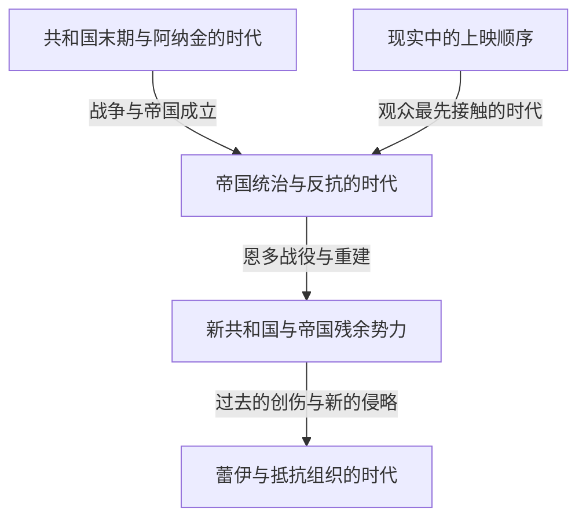
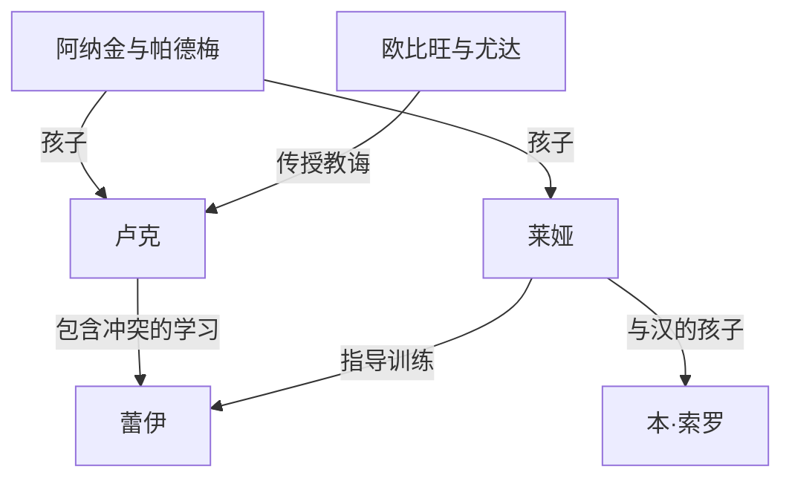

如果用一句话介绍《星球大战》，它是发生在遥远银河中的冒险故事。然而，这些冒险又交织着亲子间的爱恨、民主制度的崩溃、对帝国的反抗、宗教与权力、战争留下的创伤，以及超越血缘的家庭。在银幕背后，还有一段改变了模型、剪辑、音乐、音效和计算机图形技术的电影制作史。

即使知道光剑和达斯·维达，随着作品越来越多，也会越来越难看清整体面貌。为什么最先上映的是第四部？绝地明明是正义骑士，为何没能保住共和国？阿纳金、卢克和蕾伊的故事继承了什么，又改变了什么？《安多》和《曼达洛人》描绘了哪些远远超出电影附录意义的内容？

本文将从“银河中的故事”“作品之间的关系”和“现实中的制作史”三个层面解读这些问题。它不打算像辞典那样列出所有设定，而是一份帮助读者理解主要作品因果关系，以及那些反复出现又不断变化的主题的长篇指南。在展示这一世界繁茂分支的同时，也为初次接触它的人提供一条不易迷路的路线。

正文会涉及九部电影和相关作品的结局、人物真实身份、重要死亡与选择。如果尚未观看，希望保留惊喜，可以先阅读开头的作品梳理和末尾的观看顺序指南，看完后再返回各部作品的章节。本文核实内容与上映状况的基准日期为2026年10月3日。插图是为本文生成的概念艺术，并非官方剧照或制作记录。

## 首先区分三种时间：上映顺序、故事中的历史，以及设定诞生的顺序

《星球大战》难以理解的最大原因，在于它的时间并非一条直线。1977年首次上映的电影，后来在故事内部被定位为第四部。观众先认识了卢克的冒险，直到1999年以后才看到他的父亲阿纳金的青年时代。故事中更早发生的事情，并不一定更早拍摄。

此外，创作者构思设定的顺序又是另一回事。后续作品揭示的关系，可能使早期场景呈现出不同的意义。但这不等于“拍摄第一部电影时，几十年后的全部故事就已经确定”。面对在创作过程中不断发展的作品，不能只根据完成后的连贯性，反推最初的创作状态。

区分这三种时间，也就能理解观看前传的乐趣。知道结局不意味着失去惊喜，而是可以把它当作一出悲剧，思考人物究竟在哪些地方本来可以作出不同选择。另一方面，按上映顺序观看，可以更接近首映观众获知信息的时机。两种方式各有价值，并不存在一种用来比拼知识量的唯一正确答案。

| 电影组别 | 首次上映年份 | 核心问题 |
| --- | --- | --- |
| 第四、五、六部：原版三部曲 | 1977、1980、1983年 | 如何反抗压倒性的权力，并面对家庭的过去 |
| 第一、二、三部：前传三部曲 | 1999、2002、2005年 | 共和国与阿纳金为何失去了自己想守护的东西 |
| 第七、八、九部：后传三部曲 | 2015、2017、2019年 | 下一代如何继承上一代的胜利与失败 |
| 《侠盗一号》《游侠索罗》 | 2016、2018年 | 如何描绘正传边缘的人物及其过去的选择 |
| 动画电影《克隆人战争》 | 2008年 | 如何通过人与人的关系扩展一场漫长战争 |
| 《曼达洛人与古古》 | 2026年 | 在帝国崩溃后的银河，如何理解保护与共同体 |

年份原则上指首次院线上映年份，可能与日本上映年份不同。作品的上映顺序和大致时间线，可以在[官方电影与剧集指南](https://www.starwars.com/news/star-wars-movies-and-series-guide)中确认。像短篇选集这样一部节目跨越多个时代的作品，如果仅按节目名称把它放在年表上的一个点，就容易造成误解。

这张图只是理解主要影视作品的骨架，并不表示帝国在一场战斗后就从银河每个角落消失。政权在象征意义上的失败，与军事组织、行政、犯罪以及人们意识的变化，会以不同速度推进。许多衍生作品的故事，就存在于这样的时间差中。

## 正史与传奇：不同故事属于哪条连续性

正史是理解当前官方故事连续性的框架。传奇则是用来整理此前大量扩展的小说、漫画、游戏等作品的分类。2014年，卢卡斯影业调整了对既有扩展宇宙的处理方式，公布了以电影和《克隆人战争》为核心的新发展方向。[当时的官方公告](https://www.starwars.com/news/the-legendary-star-wars-expanded-universe-turns-a-new-page)解释了这一转变。

被归入传奇，并不意味着作品消失了，也不意味着它不再值得阅读。我们可以把它们视为在不同年代、不同限制与可能性之下成长起来的银河故事。反过来说，旧作品中的名字或构想重新出现在新作中，也不意味着此前的经历和事件一并进入新的连续性。越是发现熟悉的名字，越需要确认那究竟是哪部作品中的哪一种设定。

此外，官方制作的作品也不一定全部共享同一条连续性。例如《幻境》就探索不受既有时间线束缚的表达方式。游戏中能够操作的所有行动，也未必都是故事实际发生的事件。有时需要区分玩家可以作出的选择，以及续作所默认的事件。

这里要避免把设定分类变成评判作品优劣的标准。正史是理解连接关系的线索，而不是给感动程度打分的系统。影像中的描绘、官方资料、人物发言和观众解读，也属于不同类型的信息。不把人物相信的解释直接当成世界的全知真相，同样是一种重要的阅读方法。

本文以当前主要影视作品的连续性为基础，在提及传奇或独立企划时会区分其定位。我们也会区分“作品描绘了什么”和“可以如何理解这些描绘”。例如，可以批判性地分析绝地制度，但那是观众的分析，并不等同于一条否定所有绝地善意的官方设定。

## 进入银河前的一张小型人物地图

故事中心是围绕天行者家族展开的几代人。卢克与莱娅是阿纳金和帕德梅的孩子；本·索罗是莱娅与汉的孩子，后来以凯洛·伦之名活动。不过，故事的传承不能仅靠血缘解释。从欧比旺和尤达到卢克，从阿纳金到阿索卡，再到包括蕾伊在内的下一代，教诲、失败和选择不断传递。

R2-D2和C-3PO以不同于人类的位置穿行于这段历史。丘巴卡、兰多和反抗军伙伴们，则把这个家族的内在问题与整个银河的战争连接起来。在后来的剧集中，卡西安、丁·贾林、古古以及克隆人等人物，展现了远离英雄中心的人们所经历的时间。

把家庭关系与师徒关系分开来看，就会发现银河故事并不只是一张王室族谱。它追问的不只是继承了什么，更是如何使用这些遗产，又拒绝什么。接下来，就从观众最初进入这片银河的三部曲开始，看看各部作品发挥了怎样的作用。

## 第四部《新希望》——银河政治进入一个年轻人的生活

1977年上映的第一部电影，从故事世界历史的中段开始。观众尚不了解帝国如何成立，就看到一艘小船被巨大的军舰追赶。仅仅通过大小对比，就能明白追捕者与逃亡者之间的力量差距。影片开场并不先把世界设定解释完毕再推动故事，而是通过人物行动，逐步交付理解事件所需的信息。上映日期及基本故事定位，也可以在[官方作品页面](https://www.starwars.com/films/star-wars-episode-iv-a-new-hope)确认。

### 冒险的起点，并不是自觉成为天选之人

生活在塔图因农场的卢克·天行者，起初并没有拯救银河的打算。他只是一个想逃离狭窄日常的年轻人。然而，来到家中的机器人携带着反抗军情报，莱娅的求救信息又将他引向隐居的欧比旺·克诺比。只要政治冲突仍是遥远地方的新闻，卢克就还可以选择回农场。但帝国的暴力夺走了养父母，这条界线由此崩溃。

这里的因果关系很重要。并不是卢克先选择冒险，才与帝国产生关联；而是他试图与帝国统治无关的生活本身被摧毁了。故事既是个人成长，也是权力的暴力侵入边缘生活的过程。不过，悲伤本身并不会让他成为英雄。在遇见师长与伙伴、学习行动方式，并把能力用于帮助他人的过程中，他最初的愿望才获得公共意义。

莱娅是被营救的人，但并不是一个只会等待营救的人。她藏匿情报、承受审讯，在逃离过程中也作出决策。卢克与汉本想进入设施救她，结果她反而弥补了两人的失误。正因为角色并不固定，三人才没有变成简单的英雄、助手与奖品关系，而成为彼此影响判断的群体。

### 死星既是大炮，也是一种统治思想

死星的可怕之处，不仅是能够摧毁行星的火力。它背后还有一种构想：通过展示力量，让日常协商和代议制度变得不再必要。解散参议院，与依靠恐惧使各星系服从，是相互关联的。摧毁奥德朗远远超出了攻克军事基地的范畴，是对所有可能考虑反抗之人的威吓。

反抗军并没有同等规模的武器。他们分析设计图、发现微小弱点，并集中有限兵力。胜利的条件，是运送情报的机器人、托付设计图的人、分析人员以及战机维护人员的工作连接起来。最后一击虽然由卢克发出，但让这一击成为可能的，是广泛的协作。忽略这个结构，就容易把作品误读成“拥有特殊血统的个人解决一切”。

汉的归来也属于这种协作。原本以金钱为行动标准的他，明知危险仍回来帮助伙伴。卢克不再只依赖瞄准设备而相信原力的瞬间，与汉不再只按报酬作决定的瞬间，都可以理解为迈向超越眼前得失的信任。这并不是要求抛弃技术。战机、通讯和设计图仍然不可或缺，问题在于最终判断中还应加入什么。

另一个值得注意的地方，是银河历史通过需要修理的机器和生活费用进入画面。千年隼并非一艘只有速度优势的完美载具，而是一艘船主必须费力维持运转的飞船。酒馆中的客人，并非只是为了向主角提供说明而存在；机器人也有被买卖的生活。因为画面中心之外似乎也有事情持续发生，观众即使无法了解一切，也会感到这个世界已经延续了很久。

## 第五部《帝国反击战》——失败摧毁英雄对自己的理解

前作的胜利并不意味着帝国消失。反抗军仍是逃亡的一方，连霍斯基地也无法保住。本片从一个现实出发：摧毁巨型武器，并不会让制度和军队一同消失。这部1980年上映的电影，将卢克的修行与汉等人的逃亡并行展开。[官方作品页面](https://www.starwars.com/films/star-wars-episode-v-the-empire-strikes-back)

### 修行考验的，远不只是搬起石头的技术

在达戈巴遇见尤达时，卢克对伟大师长外貌和举止的期待被打破了。面对一个矮小而古怪的生物，他并未立刻理解其智慧。这也是作用于观众的设计：先打破把强大与巨大身体或武器尺寸相联系的直觉，再开始原力的学习。

在洞穴场景中，卢克击败的维达面具下面，出现了自己的脸。电影并未将这一影像明确界定为单纯的未来画面。它可以理解为一种警告：如果遵循对敌人的恐惧和愤怒行动，就可能变成与敌人相同的存在。前作的课题是打倒帝国这个外部敌人，而在这里，想要打倒敌人的自己的内心，也成为审视对象。

看到伙伴受苦的幻象后，卢克中断修行。很难把这个决定简单归类为“出于善良，所以完全正确”，或者“因为不成熟，所以完全错误”。无法抛下伙伴的动机可以理解，但他也错误估计了自己的力量与信息限度。而且，维达正利用这种情感引诱他前来。善意并不会让判断局势变得不再必要。

### 兰多的交易，以及向统治者妥协的极限

云城的兰多为了保护城市，与帝国进行交易。然而，在统治者可以单方面改变约定的关系中，仅靠契约无法获得安全。服从一个条件，接着又会有新的要求。他的失败不只是性格上的背叛，也是试图在压倒性暴力之下维持自治的政治失败。

即便如此，一个人一旦犯错，也并不必然一直错下去。兰多随后展开营救。这部作品中，卢克失败、兰多背叛、汉被俘，但人物价值并不由当时的成功率决定。修正自己的行为、向他人求助、回应别人的帮助，都作为不同于胜利的尺度保留下来。

维达承认自己是卢克的父亲，并不是为了抹去善恶区分。帝国的暴力并不会因此正当化。真正崩溃的是卢克那份井然有序的家族史：他以为自己是善良父亲的儿子，敌人则是杀害父亲的外人。“打倒敌人便能接近父亲”的结构，转变成一个难题：该如何面对敌人，才能继承父亲？

决斗结束时，卢克并不是胜者。他身体受伤，无法自行逃脱，最终由莱娅等人救出。被自己在第一部里前去营救的人反过来营救，也否定了英雄的孤立。独立并不只是完全不依靠任何人，也包括带着错误与脆弱重新回到关系之中。从这个意义上说，本片阴暗的结尾，远不只是拖延到下一部的悬念。

霍斯的白色旷野、达戈巴潮湿而封闭的环境，以及云城明亮外表与阴暗内部的对照，也不只是观光式背景。地点的质感支撑着军事溃退、向内心下降，以及表面安全的崩塌。每次移动，主角原本擅长的行动方式就不再有效；驾驶战机获胜的经验，并不能成为修行、谈判或与父亲对话的答案。

生成概念艺术。插图表现反抗者与帝国之间不对称的力量，并非官方电影剧照。

## 第六部《绝地归来》——拯救父亲与打倒帝国

1983年的完结篇从营救汉开始，将个人关系的修复与银河规模的战争叠加起来。在贾巴宫殿中的卢克，比第一部里的年轻人更加沉着，对力量的运用也更有自信。然而，仅凭这些外在表现，并不能证明他作为绝地已经成熟。最终的考验，是在能够获胜时选择做什么。[官方作品页面](https://www.starwars.com/films/star-wars-episode-vi-return-of-the-jedi)

### 皇帝的陷阱，目标与其说是死亡，不如说是愤怒

皇帝一方面试图从军事上歼灭反抗军，另一方面又想把卢克拉到自己一边。他让卢克看到伙伴陷入危险，诱使他因愤怒而攻击，并沿着这种情绪杀死父亲。即便卢克打倒维达，只要接受同样的支配逻辑，胜利者仍是皇帝。因此，这场决斗有一种结构：战斗胜负与伦理上的成功可能相互倒置。

卢克被对莱娅的威胁激怒，压倒了维达。当他比较父亲的机械手与自己的手时，洞穴中的幻象以具体选择的形式回来了。此时放下武器，并不是因为没有危险才选择非暴力。他接受自己可能被杀的风险，拒绝杀死父亲，也退出了那种必须摧毁敌人才能证明强大的衡量方式。

维达反抗皇帝，是看到儿子受苦后作出的选择。这里存在救赎，但影片并没有说他过去的罪行因此一笔勾销。儿子相信父亲仍有善意，与受害者有义务原谅加害者，是不同的事情。电影在父子关系中描绘最后的转变，却并没有处理完全部法律责任和历史记忆。保留这一区分，便能在不损害感动的同时理解结局的限度。

### 为什么森林中的战斗，与王座室同样不可缺少

如果只看与皇帝的对决，似乎世界完全由家庭问题推动。但实际上，如果恩多地面部队没有关闭护盾，舰队就无法摧毁第二颗死星。卢克拯救父亲，与反抗军摧毁军事设施，是同时不可缺少的任务。其中一方不会自动替代另一方。

伊沃克人为联合作战带来了对当地地形的知识和另一种战斗方式。帝国在装甲和火力上占优，却没有把眼前居民充分视为能够自主行动的主体。这种轻视，使他们误判了利用地形与突袭展开的抵抗。当然，这不是说现实战争中简陋武器总能战胜先进军队。作为寓言，它把统治者低估微小存在的判断力与团结力量的弱点呈现出来。

卢克、汉、莱娅、兰多、丘巴卡、机器人、无名士兵以及恩多居民——多方努力最终汇合，因此庆典并不是某一个人的加冕仪式。它也是失去父亲的卢克重新回到共同体中的结尾。个人的失落与公共的胜利同时存在，使这部电影的幸福并非毫发无损的大团圆。

皇帝的失败，也来自他的错误估计：他以为其他人最终都会受利益与恐惧驱使。儿子不肯放弃对父亲的信任，父亲选择儿子而非服从统治者，这些都超出了他的计算。再强大的原力能力，也无法完全预测人的选择。这与迷信巨型武器的威力，有着相同的自负：以为自己已经完全掌握了人心。

## 第一部《幽灵的威胁》——帝国并非一开始就露出帝国的面孔

1999年上映的前传，没有从第一部那种明确的军事独裁开始，而是从共和国内部的冲突展开。贸易联盟封锁纳布，是贸易和税收争端转化为武力占领的事件。年轻女王帕德梅·阿米达拉期待向议会申诉后，事实能够获得承认，也能得到救援。但制度停留在调查和程序上，现场的痛苦与决策速度无法匹配。[官方作品页面](https://www.starwars.com/films/star-wars-episode-i-the-phantom-menace)

### 帕尔帕廷以危机解决者的身份赢得支持

如果观众知道后来的历史，来自纳布的帕尔帕廷议员所给出的建议，就会呈现双重面貌。他站在受害一方身边，利用人们对看似无能的领导人的不信任。重要的是，他并非从议会外闯入，一击摧毁共和国，而是利用议会程序和公众期待提升自己的地位。

电影中的敌人也并非铁板一块。贸易联盟追求自身利益，而达斯·西迪厄斯则把它当作更大计划中的工具。即使表面冲突解决了，冲突带来的权力转移仍然存在。纳布解放是真实的胜利，却未必是共和国整体未来的胜利。庆典中仍残留不安，正因为这两种尺度并不一致。

帕德梅向冈根人寻求合作的场景，展示了相反的政治方式。她不再只维护代表者的威严，而是承认彼此生活在同一颗星球上的关系，并请求帮助。这不仅弥补军事力量的不足，也使此前彼此疏远的群体形成共同目标。这种小规模团结，产生了她在议会中未能获得的实际行动力。

### 在看到阿纳金的才能之前，先看他的生活

年幼的阿纳金拥有惊人的驾驶能力，却同时也是奴隶。在一个有庞大共和国、绝地谈论正义的世界里，母子的自由并没有保障。这个事实体现了制度存在与制度保护抵达所有地区之间的差距。即使奎刚能够解放阿纳金，也无法用同样的方法救出他的母亲施密。

启程既有能力得到认可的幸福，也有留下母亲独自离开的恐惧。如果只把后来的阿纳金看成“无法克服恐惧的软弱之人”，就会忽略恐惧产生的条件。另一方面，艰难的身世也不意味着后来的加害行为必然发生。故事由此提出：带着创伤的人，究竟需要怎样的支持与教育？

奎刚死后，发现阿纳金的导师，未能成为长期引导他的导师。欧比旺接下了承诺，但两人的关系并非从一开始就已经成熟。宏大的预言与制度期待，开始跑在一个孩子的成长之前。这种失衡，为整个前传的悲剧铺路。

在制作层面，把前传统称为“完全用电脑制作的电影”也并不准确。官方制作介绍提到，用来表现飞梭赛车观众的模型中使用了彩色棉签等实物技巧。将其理解为新技术与手工制作共同构成画面，更接近实际情况。[官方制作趣闻](https://www.starwars.com/news/25-fun-facts-the-phantom-menace)

结尾在多个地点同时推进的战斗，也有助于区分不同群体的作用。冈根人的牵制、宫殿中的行动、太空战斗以及绝地与西斯的决斗，各自在解决不同问题。并不是只要有一个强大的剑士，占领就会结束。而军事成功背后又失去了奎刚，因此，共同体的胜利与男孩人生中的损失并不一致。

## 第二部《克隆人的进攻》——战争准备逐步缩小选择空间

2002年的第二部中，试图脱离共和国的分离主义势力扩大，建立军队成为政治议题。从调查针对帕德梅的暗杀未遂事件出发，欧比旺发现了克隆军的存在。原本还在讨论如何应对危机的共和国面前，突然出现一支已经完成的军队。安全上的紧迫感，与来历不明却极为便利的力量结合起来。[官方作品页面](https://www.starwars.com/films/star-wars-episode-ii-attack-of-the-clones)

### 本应调查的谜团，被战争的迫切需求超越

克隆军是如何订购的，又是为谁的利益制造的，本来应该优先调查。然而，当敌军就在眼前时，人们渴望立刻可用的战力。危机通过夺走审慎考察的时间来改变决策。军队获得采用，并非因为已经充分核实，而是在看起来没有替代手段的局势中推进。

杜库对共和国的批评，包含制度腐败这一真实问题。但能够正确指出问题，并不保证他提出的解决办法公正。既然他本人参与了西斯的计划，对共和国的失望就不会自动通向解放。必须区分双方表面上的对抗，以及利用这种对抗的西迪厄斯的位置。

绝地也为了维护和平走向战场，转变为以将军身份率军作战。营救行动虽然成功，却因此开启战争，形成悖论。保护眼前生命的行动，与长期强化军事秩序的效果并存。为善意目标采用的手段，开始改变组织自身的性质。

### 爱情与政治中共同存在的控制欲

阿纳金和帕德梅的关系，受到身份、职责及绝地纪律的阻碍。秘密婚姻保护了两人的爱情，却也缩小了他们能够获得建议与支持的范围。可以分享困难的人变少后，当恐惧日后加深，也就更难从外部审视这种恐惧。

失去母亲的阿纳金，在塔斯肯人的聚落杀死了包括儿童在内的人们。这一段不能被轻轻带过，当成只是表现愤怒强度的场景。亲人遭受暴力的经历，转化为对无关之人施暴的理由，这是明确的伦理崩溃。悲伤可以理解，行为却仍需要承担责任。他后来的堕落并非突然转向，因为在这里，他已经跨越了重大界线。

此外，阿纳金认为只要能得到理想结果，就可以由强势领袖作决定，这种政治观也呼应了他在亲密关系中控制失去的愿望。接受人们拥有不同意志、接受所爱之人也有不受自己掌控的人生，并不容易。但若试图通过强制消除不确定性，就会破坏自己想守护的关系。这个问题在下一部中走向极端。

克隆军整齐划一的外貌，还带着把人当作可替换战力的阴森感。即使士兵拥有相同来源，也不能把他们的生命算作同一件东西。电影先给观众留下大规模军队出现的印象，后来的作品才深入描绘个体士兵的人格。注意到这个顺序，就能重新审视那支看似拯救共和国的军队：究竟是谁在承担这种拯救的代价？

## 第三部《西斯的复仇》——拯救的愿望转化为支配逻辑

2005年的第三部中，克隆人战争接近结束，共和国却走向崩溃。人们期待战争获胜后能够回归和平，但为进行战争而集中的权力，反而成为战后独裁的基础。阿纳金的堕落与共和国的堕落同时发生，使这部电影的悲剧既不能仅归结为个人意志薄弱，也不能仅归结为制度失败。[官方作品页面](https://www.starwars.com/films/star-wars-episode-iii-revenge-of-the-sith)

### 帕尔帕廷兜售的，是能够支配死亡的承诺

阿纳金害怕未来失去帕德梅。帕尔帕廷没有直接否定他的恐惧，而是暗示存在别处无法获得的力量。这比单纯宣扬邪恶教义更高明：先认清对方最不愿失去的东西，再让对方相信，要保护它就离不开自己。依赖越深，矛盾的解释和犯罪性的要求也越容易被接受。

绝地委员会与阿纳金之间也存在不信任。他觉得自己不被认可，委员会则警惕他与帕尔帕廷过于亲近。再加上要求他承担情报任务，他的忠诚对象被撕裂。但解释处境与免除责任是两回事。在为了保护帕尔帕廷而阻止梅斯·温杜之后，阿纳金继续服从更具破坏性的命令。

人犯下严重错误后，有时会更想选择一条能证明错误有意义的道路，而不是回头。阿纳金的行动也可以理解为这种自我辩护的连锁：既然已经做到了这一步，如果不能获得力量，一切就都白费了。这种想法让下一次加害看起来像必要的牺牲。

### 六十六号令，让制度内部的杀伤能力改变方向

袭击绝地的并非远方出现的新敌军，而是曾经并肩作战的士兵。当军事组织的指挥链反转时，以友军身份为前提的部署与信任就变成弱点。电影描绘了命令与同步袭击，而克隆士兵被控制的详细机制，则由相关动画补充。区分电影本身的说明与后来的补充，也能看清不同作品承担的功能。

帝国成立，也不是共和制度的建筑全部被摧毁的瞬间，而是在议场中以新秩序的名义宣布。借着恢复安全的语言，监视与暴力被纳入永久统治。通过把反对的绝地塑造成叛徒，对权力集中的抵抗被重新解释为对秩序的攻击。

在穆斯塔法，阿纳金对本应拯救的帕德梅施暴。当对方不同意自己时，他没有尊重她本人的意志，而是将其理解为背叛。这一刻，爱与占有欲的区别变得鲜明。他所渴望的未来，不仅需要帕德梅活着，还需要一个认同他选择的帕德梅。

阿纳金被烧伤的身体裹入盔甲，与双胞胎降生的场景并置，同时展现绝望与下一种可能。欧比旺和尤达都不是胜利者。即便如此，保护孩子仍是政治失败中能够保留下来的未来。前传最终呈现的，并非因为善人消失所以恶获胜的故事，而是善意、恐惧、制度和野心相互结合，酿成灾难的故事。

欧比旺的悲痛，也远不是发现并击败坏人的满足。他必须与自己视如弟弟的人战斗，对自身教育和判断的疑问仍然存在。因此，两人漫长的决斗不只是技艺较量，也可以看作彼此太过了解、却无法轻易切断关系的痛苦。获胜的一方，同样没有可以庆祝胜利的地方。

## 第七部《原力觉醒》——不认识过去英雄的一代，继承了过去

在2015年的新篇章中，对蕾伊和芬恩而言，反抗军英雄已近乎传说。那些观众熟悉的名字，对年轻人物却很遥远。通过这种差距，电影把老观众的记忆与新观众的惊奇放在同一画面中。第一秩序出现在后帝国时代，说明曾经的胜利并不能保障下一代的安全。[官方作品页面](https://www.starwars.com/films/star-wars-episode-vii-the-force-awakens)

### 芬恩首先通过拒绝命令，成为主角

芬恩的起点不是优秀血统或预言，而是在被要求作为士兵服从时拒绝杀人。这个选择，使他从组织中一个编号的地位，开始变成能够自己决定的人。但他也并非立刻就做好了拯救整个银河的准备，最初仍强烈地想逃走。故事描绘的不是等恐惧消失后再做好事，而是带着恐惧，为某个人留下来的过程。

贾库的蕾伊掌握了维持生存的技能，同时等待可能归来的家人。她的停滞不源于能力不足，而与对过去的期待有关。离开故乡，不只是移动到另一颗星球，而是从“只要继续等待，原来的生活就会回来”的希望，走向亲手建立新关系的可能。

### 凯洛·伦渴望的，与其说是维达的力量，不如说是维达的形象

本·索罗试图把自己重塑为凯洛·伦。他崇拜祖父维达，但祖父最后救了儿子的事实，却与他追求的强大邪恶形象不符。人并不总是完整继承过去，也可能只挑选自己需要的部分。凯洛体现了历史传承也可能变成误读。

杀死汉，也不只是冷静的恶人清除障碍。他认为切断家庭依恋便能强大，因此试图改造自己。但实施暴力并不必然消除内心冲突。为了抹去动摇而作出的行为，反而产生新的创伤。蕾伊的故事走向与他人建立联系，凯洛则试图通过切断联系来确立自我。

弑星者基地、携带地图的机器人等与第一部相似的结构十分明显。可以把它们当作怀旧，也可以批评它们的结构重复。但分析时不应止步于“相似”，而应看看处在相同位置的人物作出了怎样不同的选择。原本属于帝国式军队的士兵成为主角，等待救援的少女亲自反抗，英雄之子成为敌人。在相似轮廓中，继承的焦虑进入了中心。

新共和国中枢被摧毁的场景，强烈展示了政治秩序的脆弱；但由于电影此前没有长时间描绘这种秩序的日常，观众也不容易具体体会究竟失去了什么。这可以视为作品说明上的局限。了解相关作品会增加这份重量，但不能把一切都归咎于不了解那些作品的观众。作品内部传达的信息量，本身就会影响观看体验。

## 第八部《最后的绝地武士》——承认失败，却不放弃责任

2017年的第二部打破了“只要蕾伊见到卢克，问题就能解决”的期待。卢克已经退出再次作为英雄挺身而出的生活。与此同时，抵抗组织遭到追击，被迫以有限资源作出生存决策。这部电影同时重新追问个人的英雄形象与组织的领导方式。[官方作品页面](https://www.starwars.com/films/star-wars-episode-viii-the-last-jedi)

### 承认错误，能否成为放弃一切的理由

卢克与本的过去，从不同视角被讲述。卢克一瞬间的恐惧，与本看到这一幕时的恐惧，使同一场景具有不同意义。这里呈现的并非“事实根本不存在”的相对主义，而是自己当时在想什么，与对方实际经历了什么之间的差距。仅仅解释“那只是一瞬间”“我后悔了”，并不能抹去给对方造成的伤害。

卢克将自己的失败与整个绝地的失败联系起来，想终结这套传统。对绝地历史的批评值得思考，但如果批评只是用来证明自己缺席的合理性，就会离开对当下受苦之人的责任。在无条件维护传统与因为失败而全部抛弃之间，需要一条吸取教训、重新传递的道路。

蕾伊和凯洛触及彼此理解的可能，但理解与同意不同。即使共享孤独，也没有必要接受支配他人的秩序。凯洛杀死斯诺克，也不意味着他自动来到善的一边。杀死统治者与拒绝统治机制是两回事，他试图坐上那个空出的位子。

### 勇气与指挥，采用不同的时间尺度

波拥有摧毁眼前敌人的勇气，却必须学习这种成功要付出多少人员与战力。一场战斗中取得显眼成果，与让组织活到第二天，是不同的事情。处在指挥位置时，决定不攻击或选择撤退，同样属于责任。

另一方面，与霍尔多的冲突也包含信息共享的困难。观众经历了“谁知道什么”彼此错位的状态。如果据此一概得出“下属应该闭嘴服从”，就过于狭窄。把它理解为危机下保密、信任、指挥权和解释不足相互冲突的局面，才能同时看到人物的长处和缺点。

坎托湾的插曲说明，看似处于战争之外的繁荣，也通过武器和剥削与战争相连。芬恩从只想保护某个朋友的阶段，走向理解更广泛抵抗的意义。但剥削者与双方交易，并不能证明双方的政治目标相同。批判利益结构，与把侵略和抵抗视为一回事，必须区分。

卢克最后所做的，并不是大量杀死敌军，而是为伙伴争取生存时间。曾经厌恶传奇形象的人，承担起传奇所具有的希望力量，并以不同于肉体胜利的方式吸引敌人注意。可以说，这是一部从打破英雄形象开始，以重新选择如何使用这种形象结束的电影。

蕾伊向卢克索求的不只是技术，也包括一个能从外部确定“自己是谁”的答案。然而，导师同样是有错误与恐惧的人。在认识到所依靠之人的不完美后，她必须决定从他的教诲中接受什么。因此，本片不只是弟子否定导师的故事，也是在问：不再理想化导师后，是否仍能继续学习？

## 第九部《天行者崛起》——出身，以及主动选择的名字

2019年的第九部让帕尔帕廷再次成为最终敌人，并将蕾伊的身世与他的家系联系起来。前作中蕾伊认为自己不属于重要家族的认识，在这里被大幅改写。观众对这一转折喜好不一，但分析时，首先应区分各部作品传达了什么，以及下一部又增加了什么。[官方作品页面](https://www.starwars.com/films/star-wars-episode-ix-the-rise-of-skywalker)

### 血统可以解释能力，却不能成为伦理命令

蕾伊害怕邪恶的家系会决定自己的未来。但故事结局没有走向服从出身，而是走向选择接受哪些教诲与关系。这里的问题不能简单用“血统无关紧要”概括。电影确实把血缘作为重大叙事机关；与此同时，又试图通过拒绝血缘似乎规定的角色，描绘主角的自由。

与卢克和莱娅的关系，是蕾伊另一条传承道路。最后选择天行者之名，与其说是在申报生物学谱系，不如说是在表达自己想继承的价值，以及培育过自己的关系。但选择名字，并不会让痛苦与过去消失。意义在于，知道过去之后，决定如何称呼自己。

帕尔帕廷回归的技术细节，仅靠电影得到的解释有限。不能混淆相关资料的补充与电影直接呈现的信息，仿佛银幕内已经解释了一切。剧情中的重点在于，他因为对死亡的恐惧与对权力的执着，甚至把下一具身体和下一代当作工具。曾向阿纳金兜售支配生命之力的人，直到最后仍把他人当作自我保存的手段，形成连续性。

### 本的转变，反转了征服死亡的思路

本从凯洛·伦的生活方式中回转，涉及母亲的呼唤、被蕾伊救命的经历，以及与父亲有关的记忆。此前试图通过杀死父亲摆脱冲突的做法失败了。相反，重新接受关系，才打开另一种选择。这里的转变同样不会让过去的加害行为消失，但当下选择另一种行动的可能仍然存在。

他把生命给予蕾伊的结局，与因为不愿失去爱人而牺牲他人的阿纳金形成对照。不是为了保住生命而支配世界，而是从自己这一方给予。这一对比改变了贯穿九部作品的“拯救”的含义。把对方留在自己身边，与希望对方活着，并不是同一回事。

集结在埃克西戈的舰队，也承担着不同于蕾伊决斗的任务。被恐惧隔绝的人们确认彼此存在，并聚集起来。观众觉得这种集结有多大说服力，可以各有判断；但在故事结构中，超越单一英雄能力的参与是必要的。最终决战再次把血统之争，与无特殊血统的众多普通人的抵抗叠加起来。

作为九部作品的结尾，重返塔图因的影像意味着：回到同一个地方，并不等于回到同一种状态。第一部中，一个想去远方的年轻人望着地平线；最后，一个经历旅程的人报出了自己的名字。通过再次使用起点的景观，扩展世界与确定自身位置，作为同一运动完成收束。

## 《侠盗一号》——让英雄完成最后一击，却无法归来的人们

2016年上映的《侠盗一号》描绘第一部之前，死星设计图如何传到反抗军手中。即使知道结局的大致轮廓，紧张感也不会消失，因为核心不只是“设计图能否送达”，还有“谁失去了什么才让它送达”。官方制作公告说明，企划由工业光魔的约翰·诺尔提出，并重视地面战争的视角。[官方制作公告](https://www.starwars.com/news/rogue-one-the-daring-mission-has-begun-cast-and-crew-announced)

### 技术人员的抵抗，以及女儿重新理解其意义

盖伦·厄索参与帝国武器开发，同时在内部埋下能够导致其毁灭的弱点。这包含一个难题：留在制度内部是否总意味着共谋，内部破坏又能做到什么程度？但不能从他的案例概括出所有合作者都是秘密抵抗者。电影描绘的是一个具体人物的选择，以及将这种选择传达给他人的困难。

琴接收关于父亲的零碎信息，修正了此前把父亲简单理解为叛徒的图景。关键在于，仅仅知道父亲的善意，并不能让武器停止。必须证明弱点的信息、取得设计图，并以可使用的形式交给别人。只有个人和解转化为公共行动，父亲的抵抗才获得实际效果。

### 描绘反抗军的不义，并不等于为帝国辩护

卡西安曾为反抗事业做过黑暗工作。他的行动中，有些部分不能只因目标正当就获得免责。反抗军内部也存在分歧，面对危险并非团结一致。这些描绘说明抵抗者也不是纯洁无瑕，却不能因此得出统治与抵抗相同的结论。

真正受到追问的是，双手沾污的人们接下来要做什么。卡西安与琴同行，包含一种迫切愿望：不想让过去的牺牲最终只是牺牲。但这种愿望也可能无限正当化下一次牺牲。电影通过两种行为的区别来呈现边界：命令他人被消耗，与主动承担风险。

斯卡里夫战役中，地面通讯、太空舰队和设施内部操作彼此分隔。再强大的个人，只要别处有一个连接断开，任务就会失败。传输这一技术问题，本身成为团结的形式。信息多次被交接，并不是无意义的重复，而是在展示工作如何超越个人生存继续传承。

他们无法参加第一部的庆典，但后来的胜利中包含他们的努力。在《新希望》主角背后，观众开始看见此前不知姓名、不识面孔的人们付出的代价。外传能够丰富正传意义，正是在这样改变既知事件的伦理重量时。

奇鲁的信仰也不同于万能防御能力。相信原力，并不保证身体安全。信仰在这里不是免于死亡的契约，而是在危险中采取行动的姿态。即使故事没有受过绝地训练的主角，原力这一观念仍然参与人们的判断与希望，奇鲁让我们看到这一点。

## 《游侠索罗》——一个看似自利的人，是如何形成的

2018年的《游侠索罗》稍稍离开决定整个银河统治权的战争，进入犯罪组织、运输、债务与交易的世界。通过年轻的汉如何结识丘巴卡和兰多，从另一角度展示第一部中这个人物的面貌。正如官方页面介绍的，故事核心是一场穿行于边缘地下世界的冒险。[官方作品页面](https://www.starwars.com/films/solo)

### 即使试图买来自由，下一种依赖仍在等待

汉试图逃离科雷利亚，但逃走并不会自动带来自由生活。帝国军、犯罪组织、工作中介——每获得一种生存手段，就出现新的上下级关系。他渴望拥有飞船，不仅因为喜欢驾驶，也因为飞船是能够自行决定去向的物质条件。

贝克特教导他不要过分相信别人。这种处世方式有在危险环境中生存的合理性。但如果所有关系都建立在预判背叛之上，合作就会缩小为暂时的利益交换。汉吸收了其中一部分教诲，却没有完全变成同一种人。

与丘巴卡相遇，体现了这种差别。即使最初有共同生存的利害关系，在一起穿越危险的过程中，也会产生超出交换的联系。这样，后来两人的信任就不再只是预先赋予的人物设定，而成为双方观察彼此行动、逐步判断的结果。

### 琦拉在汉的故事之外，也有自己的人生

汉想带走琦拉，实现过去的愿望。但在分开的日子里，她为了生存而经历的世界，比他想象中更复杂。重逢并不意味着旧关系能够原样恢复。想拯救对方，与理解对方当下所处的条件，之间存在距离。

如果只用有没有爱情解释她的选择，就会忽略组织内求生的限制与野心。即使汉是电影主角，其他人的人生也并非都为实现他的希望而运转。这种不对称，成为年轻汉的失望与成熟的一部分。

随着对恩菲斯·内斯特团体的认识变化，罪犯与抵抗者的界线也开始动摇。运输品归谁所有、被谁夺取、用于什么目的？契约上的所有者未必就是道德上正确的一方。汉最后作出无法仅用利益解释的决定，展现了后来他返回反抗军的那种性格。

这部电影中的汉，并不是彻底解释第一部人物形象的标准答案，因为人不是由单一经历塑造的。尽管如此，仍能看出讽刺与自利语言之下，保留着无法完全抛弃他人的本性。一个装作自己不是好人的人物，却在行动中不断推翻这种自我介绍。正是这种错位，构成汉·索罗的魅力。

机器人L3-37把自由这一主题扩展到非人类存在。究竟把她当作拥有便利人格的机器，还是当作具有自主判断与诉求的主体？系列中常常被包裹在笑料里的问题，在她的言语和行动中浮出表面。电影并未完全解决这一问题，但享受机器人的亲切感，与质疑它们所处的所有权关系，可以同时成立。边缘世界的小冒险中，也潜藏着关系整个银河的问题。

## 从制度与生活理解电影之外扩展的银河

离开电影，进入剧集和动画，《星球大战》的银河会突然显得细致起来。打倒皇帝，与支付明天的饭钱，不是同一个问题。在战场上被绝地救过的人，与生活被军事行动摧毁的人，对同一个共和国也会怀有不同感受。正是这种视角差异，让衍生作品不只是追加的故事。

### 同一种政治体制，在中心与边缘看来也不同

共和国首都科洛桑，是议会、官僚机构与绝地圣殿集中的政治中心。但挂着共和国旗帜，并不意味着银河所有居民都能得到相同保护。在塔图因这样的边缘地区，共和国理念尚未充分抵达，犯罪组织和奴隶制度可能支配生活。在中心看来秩序井然的国家，在外围看来也许只是一个在远处讨论问题的政府。

理解分离主义时，这种距离同样重要。即使独立星系邦联的领导层或军工企业被纳入邪恶计划，对共和国不满的居民也并非全是坏人。对腐败、政治忽视和经济差距的不满，独立于阴谋而存在。帕尔帕廷的高明，与其说在于凭空制造矛盾，不如说在于利用既有不满，把冲突的出口引向自身权力扩张。

帝国成立后，行星之间的差异也不会消失。有些地区直接感受巨型武器的威胁，有些人则通过采矿、治安部队、身份证明、拘押与征用认识帝国。新共和国成立后，在中央统治退却的地方，海盗和旧帝国武装又会活动。因此，不能只根据国家名称判断治安与自由。考虑观察者来自哪颗行星、哪个阶层、从事什么工作，就更容易理解描绘同一时代的作品为何气氛不同。

表现银河中心与边缘、不同时代对比的生成概念艺术，并非官方影像或设定图。

### 绝地不是国家本身，而是与国家相连的骑士团

绝地并不是所有原力使用者的统称，而是拥有训练、纪律、师徒关系和共同体传统的组织。共和国末期，他们自认和平守护者，却也不是独立于政治权力的隐士。他们受派执行外交任务，与参议院保持联系，在克隆人战争中成为将军。这些角色的重叠，同时产生善意与制度性失败。

他们为了保护人们而指挥军队，但越成为指挥官，就越难摆脱决定这场战争如何结束的政治结构。击败敌兵的战术成功，也可能不等于实现和平。若认为绝地失败只是因为剑术不够强，就会错过悲剧所在：他们投身军事战斗，却未能充分看穿战争本身就是圈套。

这也不意味着绝地与帝国相同。会犯错的制度，与主动把支配和恐惧当作目标的制度，是有区别的。作品提出的问题是：有善意就不必自我检视了吗？当守护共和国与持续服从共和国的判断发生冲突，究竟优先哪一个？阿索卡和杜库的故事，把这种冲突落实到个人经验中。

### 西斯与黑暗力量使用者，也未必属于同一群体

把所有使用红色光剑的敌人都叫西斯，会混淆组织关系。审判官承担帝国追猎绝地的工作，却并不处于西斯师徒的相同地位。达索米尔暗夜姐妹也拥有不同于绝地和西斯的传统。使用原力黑暗面，与属于某条西斯传承，必须区分。

与达斯·贝恩相关的“二人法则”，以掌握力量的师父和渴求力量的徒弟之间的关系为基础。这不是一条规定银河只能存在两个邪恶原力使用者的物理法则，而是组织的继承原则。周围仍可能存在合作者、刺客、被利用的候选弟子和被淘汰的人。官方数据库也说明，贝恩是为了西斯的延续而引入这一制度。[达斯·贝恩官方解读](https://www.starwars.com/databank/darth-bane)

这里能看到与绝地相反的教育观。即使师父希望徒弟成长，在西斯体系中，这种成长也会成为对师父自身的威胁。合作关系内部嵌入了利用对方、最终取而代之的逻辑。理解皇帝与维达，或者被用后丢弃的摩尔时，不只看个人性格，也注意这种关系本身如何产生不信任，就能理解得更深。

## 《克隆人战争》改变了我们观看战争的方式

### 电影与长篇剧集的作用

2008年的动画电影《星球大战：克隆人战争》，是通往同名电视系列的入口。对于只看过电影的观众，阿纳金有一个名叫阿索卡·塔诺的徒弟，是一项重大补充。这并不是为了增加人物名单。通过描绘承担引导他人责任的阿纳金，他的勇敢、照顾他人的能力以及对规则的反抗，都在与徒弟的具体关系中显现出来。

该系列描绘第二部与第三部之间的战争，却不局限于共和国军的作战。视角会转向外交、奴隶商人、犯罪组织、试图保持中立的行星，以及普通人的疑虑。电影中只有几分钟的政治背景，变成日常生活和持续作出的判断。单集的胜利常常不带来整体改善，由此可见漫长战争的消耗。

不过，理解长篇剧集并不意味着必须把一切变成寻找电影伏笔。观众知道结局，人物却不知道未来。他们帮助伙伴、完成任务、积累微小信任的时间，本身就有意义。正因为这些时间被充分描绘，六十六号令才不只是历史事件，而成为摧毁长期建立之关系的灾难。

### 克隆人的相同面孔，并不意味着相同人格

在电影大军中难以分辨的克隆士兵，变成了雷克斯、五号、回声等各有姓名与判断的人物。遗传上的相似，并不意味着经验和人格相同。装甲纹样、发型、说话方式以及战友关系，让观众能够辨认个体。

共和国的伦理矛盾也在这里浮现：保卫自由的战争，依赖为作战而诞生、却并不充分拥有离开军队自由的士兵。绝地指挥官常常尊重部下，但仅仅以个人身份温和相待，并不能解决整个制度的问题。承认士兵的勇气，与追问他们所处的结构，可以同时成立。

关于抑制芯片的故事，让这种矛盾变得更加残酷。忠诚并非完全建立在自由选择上。六十六号令的悲剧中，攻击的一方也有人格与友情，却被强行践踏。阿索卡移除雷克斯芯片的情节，体现了一种拯救：比起打倒敌人，更重要的是让人恢复被剥夺的判断力。[阿索卡·塔诺官方数据库](https://www.starwars.com/databank/ahsoka-tano)

### 阿索卡离开绝地，是区分善与制度的入口

阿索卡离开绝地武士团，并不意味着她放弃了对他人的关怀。本应保护自己的组织破坏了信任，即使后来要求她回归，伤害也不会自动消失。继续属于一个倡导正确理念的组织，与继续做自己认为正确的事，第一次被分开。

这种变化对阿纳金同样严重。他试图保护徒弟，但自己愿意相信的制度却没有按期待运作。不能仅凭阿索卡离开解释他后来的堕落，但它对于理解制度不信任如何与失去亲近之人的恐惧结合，十分重要。官方文章也把第五季的离开及之后的重逢，视为两人关系的转折。[阿索卡与阿纳金的告别](https://www.starwars.com/news/ahsoka-and-anakin-final-meeting)

后期的曼达洛围城战，提供了与《西斯的复仇》同时发生的另一视角。观众知道科洛桑将发生什么，远方现场却只能收到零碎信息。这种延迟产生紧张感：历史中心作出的决定，在被理解之前，就把现场的伙伴变成敌人。

## 《异等小队》描绘战争结束后被留下的人

《异等小队》围绕拥有特殊能力的克隆部队与女孩欧米伽，描绘共和国向帝国的过渡。政体更替不只是换一块招牌。军队人员构成、忠诚审查、地区控制与信息管理都在变化，曾经支撑国家的士兵也可能成为多余的人。

主角们精于战斗，却未曾充分学习自由生活的技能。选择工作、领取报酬、考虑孩子的安全、寻找安心之处，成为新课题。作战有命令和目标，生活却没有“只要执行这些就正确”的命令书。正是这种差异，让部队逐步变成家庭。

欧米伽的意义远超过增加战斗力。承担保护她的责任后，判断就不能仅依据能否完成危险工作。能否为今天的收入牺牲明天的安全？只有自己逃走是否足够？希望孩子继承什么？一种不同于军事理性的尺度，进入部队内部。

准星的故事，质疑服从能够保证归属感的期待。按组织要求行动，自己的价值就应该被认可；但当组织把个人当作工具时，忠诚并非相互关系。回归与和解中，也存在只靠解释情况无法填补的伤口。成为伙伴，不仅意味着从不犯错，也意味着如何与犯过错的人重建关系。

帕布宁静的生活，不只是战争故事中的休息段落。它通过食物、住处与邻里，把“究竟为何而战”具体化。官方数据库把帕布介绍为难民共同体，最终集制作文章则谈到幸存小队与长大后的欧米伽的未来。这一结局将战斗的终止，与选择普通生活的可能联系起来。[帕布官方解读](https://www.starwars.com/databank/pabu)、[最终集演员访谈](https://www.starwars.com/news/the-bad-batch-series-finale-dee-bradley-baker-michelle-ang-interview)

## 《义军崛起》：抵抗运动如何成为共同体

《义军崛起》的中心，是生活在洛塔的少年埃兹拉·布里杰，以及幽灵号飞船上的伙伴。这里并没有一个从一开始就成熟完备的反抗联盟等待迎接主角。局部抵抗、物资筹措、信息交换与人际信任不断积累，才连接成更大的运动。

对埃兹拉来说，绝地训练不只是学习超能力，也是一个原本必须独自求生的少年，学会与他人分担责任的过程。导师凯南也不是受过完整教育、毫无创伤的大师。他带着自己的恐惧与缺失，培养下一代。这种不完美的师徒关系，形成了从人与人的信任中重建失落制度的故事。[埃兹拉与凯南的官方分析](https://www.starwars.com/news/always-two-ezra-and-kanan)

赫拉既是飞行员，也是使组织运转的实干者。萨宾有作为曼达洛人的政治过去，泽布带着共同体被摧毁的记忆。切宝并非单纯方便的机器，而是以粗鲁鲜明的个性作为伙伴参与关系。不同出身的人们，不只是靠相同理想，也通过共同生活连接起来。

索龙成为这个小共同体的特殊敌人。他不只依赖蛮力威吓，还试图读懂对方的文化与行为模式。反抗军也未必只要准备更强火力就能获胜。超出对手的行为预测，利用无法还原为军事计算的关系——包括与动物和土地的联系——变得重要。

洛塔解放的结尾，埃兹拉与索龙消失，说明胜利与归来未必能够同时获得。拯救故乡的选择，伴随着自己无法留在故乡的代价。这片空白延续到后来的《阿索卡》。[《义军崛起》最终集官方指南](https://www.starwars.com/series/star-wars-rebels/family-reunion-and-farewell-episode-guide)

## 《安多》清点反抗的代价

### 第一季：旁观求生的极限

《安多》的特点，是不只用巨大象征说明帝国的邪恶。劳动、管制、账簿、服从的奖励与受罚的恐惧，一点点收窄个人行动空间。追随并非一开始就是成熟革命者的卡西安，作品描绘了抵抗主体如何诞生。

费里克斯有工作工具、店铺、邻里关系与葬礼习俗。生活细节不断积累，使治安部队的介入不只是“敌人出现”的事件，而是居民被夺走属于自己时间与空间的事件。对帝国的反感不仅来自抽象理念，也来自对自身生活被他人按其需要定义的抵抗。

阿尔达尼行动体现了反抗需要资金的现实。但获取资金的行动有风险，其成功也可能引来帝国更严厉的压制，伤及无关的人。使压迫变得可见、从而扩大抵抗的思路，作为运动策略可以理解，却无法消除“由谁承担代价”的伦理问题。

监狱篇章把囚犯互相监视、竞争并持续劳动的机制置于前景。暴力并不只靠狱卒每分钟殴打来维持。规则、信息隔绝、对其他小组的焦虑以及重获自由的期待，共同驱动人们。要挣脱这种机制，不仅需要个人勇气，还需要被分割的人们理解同一个现实。

### 第二季：抵抗越组织化，矛盾也越大

第二季描绘通往《侠盗一号》的数年，将卡西安个人的变化与反抗力量的组织化叠加。托尼·吉尔罗伊在官方访谈中说明，最终季在结构上直接连接《侠盗一号》。重点不只是在既知电影之前填补事件，更在于展现到达那里之前的人命损失。[吉尔罗伊谈第二季](https://www.starwars.com/news/andor-season-2-interview-tony-gilroy)

围绕戈尔曼的展开，描绘行政、资源、信息操纵与军事力量如何结合为一种统治。当市民运动被纳入统治者预先准备的解释中，现场发生的事与公开传播的叙事之间，就产生断裂。重要的是，它不仅描绘暴力的执行，还描绘如何让暴力看起来像必要措施。

蒙·莫思玛试图同时维持政治家的公开身份、调动资金的秘密活动，以及家庭生活。选择政治上的正确，并不会自然解决家庭问题；反过来，为保护家庭作出的妥协，也可能带来政治危险。她的故事说明，抵抗并不总以英勇演说的形式出现，也包含资金流动和关系维护这些从外部难以看见的工作。

卢森承担自己认为反抗所必需的行动，同时也认识到自身选择的丑陋。但认识到，并不会让他无罪。与其简单把他赞为现实主义英雄，不如把他视为一个问题：反抗压迫的组织，究竟会在多大程度上吸收压迫的逻辑？这样更能保留作品的张力。

第二季后期，即使通往《侠盗一号》的情报与人物位置准备就绪，也不能断言所有牺牲都得到了回报。为胜利作出贡献的人，也未必都能留名后世。正如官方最终集解读聚焦卢森的作用，这部作品描绘的是著名英雄背后难以看见的劳动与损失。[第二季最终集官方解读](https://www.starwars.com/news/andor-season-2-finale-episodes-10-11-12)

## 《欧比旺》与失败之后的责任

这部描绘第三部与第四部之间欧比旺经历的剧集，将昔日名将变成了见证失败的幸存者。带着使命藏身，与内心仍保有希望，并不是同一回事。知道徒弟堕落、同伴死亡的人，如何重新找到行动理由，成为故事核心。

与年幼莱娅的关系，要求他不只看过去，也看未来。未能拯救阿纳金的失败不会消失，但反复思考那次失败，并不能保护眼前的孩子。这是在问，如何区分对过去的责任与对当下他人的责任。官方指南也把这场营救列为作品主轴。[《欧比旺》官方介绍](https://www.starwars.com/series/obi-wan-kenobi)

审判官蕾瓦同样是暴力受害与施害连接于一身的人物。受害经历不会正当化后来的加害，却能帮助理解一种心理：以为只有获得与敌人相似的力量，才能对抗敌人。最终选择的分量，不在于变得多强，而在于是否把自己遭受的暴力传递给另一个孩子。

如果只把这部剧当作填补电影空白的年表，可能会过分在意相遇与再战的连续性。另一种看法，是从中认识到第四部那个平静的老智者，并非一开始就接受了一切。平静可以理解为并非没有伤口，而是带着伤口仍能为他人行动。

## 《曼达洛人》与《波巴·费特之书》重新追问家庭与统治

### 曾是悬赏目标的孩子，成为需要守护的家人

《曼达洛人》最初的推动力十分清楚：赏金猎人丁·贾林，无法再把工作中遇见的小生命当作应当交付的目标。履行契约与保护眼前生命发生冲突，他选择后者。这个选择让他被职业秩序追逐，也进入新的关系。

古古有魅力，还因为他并非只是需要保护的行李。幼小、漫长过去与强大原力能力共存。丁保护他，他也帮助丁。由于语言说明很少，目光、犹豫、身体动作和反复出现的日常行为，承担了讲述关系的工作。构成家庭的不是血统，而是持续承担责任。

表现边缘世界中培育的信任与家庭主题的生成概念艺术，并非官方剧照。

丁的头盔既是防具，也表达信仰与共同体归属。但遇见其他曼达洛人之后，他开始发现自己以为普遍适用的规则，其实是某个特定群体的教义。有传统，与传统只有一种解释，不是同一回事。问题不再只是放弃还是遵守纪律，而是纪律究竟为了什么。

包括博-卡坦故事在内的曼达洛重建，表明战士身份的正统性与凝聚人民的政治能力未必一致。拥有象征性武器，并不能自动统一分裂的共同体。协作求生的经验，逐步改变过去派系的边界。第三季结尾，丁正式收养古古，成为共同体重建与小家庭重新定义相叠加的节点。[第三季最终集官方解读](https://www.starwars.com/news/the-mandalorian-chapter-24-the-return-highlights)

### 波巴·费特试图改变以恐惧换取服从的统治中的什么

《波巴·费特之书》将昔日赏金猎人转为试图治理地区的人物。受人雇佣追踪目标，与对包含居民、商业和竞争势力的整个地区负责，并不一样。仅靠战斗技能，无法完成行政与共识建立。这种角色变化，构成剧集的基本问题。

与塔斯肯人的经历，改变了把沙漠居民看作外来者障碍的视角。他们有习俗、与土地的关系，以及共同体内部的时间。波巴从中学到的，成为不再把被统治者当作背景的契机。当然，不能说仅凭这段经历，他的治理就变得理想。宣称新统治的语言，与实际暴力和利益协调之间，仍有张力。[关于塔斯肯描绘的官方解读](https://www.starwars.com/news/the-book-of-boba-fett-chapter-2-highlights)

本作也包含丁与古古关系显著推进的几集。因此，如果从《曼达洛人》第二季直接进入第三季，可能会对两人处境的变化感到困惑。这是理解作品连接时实用而重要的一点，却不意味着所有剧集都要求同等程度的预习。掌握各作品承担的人物关系变化，便能看清必要连接。

### 2026年电影《曼达洛人与古古》的位置

截至2026年10月3日，《星球大战：曼达洛人与古古》已经上映。卢卡斯影业作品页面明确注明2026年发行，并将其介绍为承接剧集的独立冒险。基本设定是，帝国崩溃后各地仍残留军阀，新共和国因此寻求丁与古古的协助。[卢卡斯影业电影官方页面](https://www.lucasfilm.com/productions/star-wars-the-mandalorian-and-grogu/)

这一定位让《绝地归来》的胜利，与战后治安确立之间的距离再次重要起来。中央独裁者消失，并不会让武器、人员、既得利益和人们的恐惧立刻消失。但也不能简单说，新共和国只要像旧帝国一样强力控制所有地方即可。维护自由的政府如何提供足够安全，构成两人旅途的背景问题。

## 《阿索卡》继承的师徒关系，以及另一片银河

理解《阿索卡》的关键，是不要把主角局限在“阿纳金昔日的徒弟”这一说明中。她背负着对绝地武士团的失望、克隆人战争的经历，以及导师成为维达的事实。如今她自己成为引导萨宾的人，过去的师徒关系因此影响着她的教育方式。

信任导师，与继承导师的一切，不是同一回事。认可从阿纳金那里学到的技术和勇气，不等于肯定他后来的所作所为。反过来，也不必因为害怕他的堕落，就抛弃所有学到的东西。阿索卡的课题，不是把过去恢复成毫无污点的样子，而是在承担复杂传承的同时建立下一段关系。

萨宾处在对失踪伙伴埃兹拉的思念，与防止更广泛危险的责任之间。拯救亲近的人与公共责任相冲突的结构，也呼应阿纳金的故事，却不会机械地走向同一个结论。因为与他人的联系既可能带来危险，也可能使复原成为可能。重要的是，不仅根据有无依恋判断善恶，而要看具体选择与结果。

远方银河的行星佩里迪亚，改变了故事地理上的广度。它是与达索米尔祖先有关的古老世界，也把索龙和埃兹拉留下的空白连接到现在。但出现另一片银河，并不意味着既有世界的问题消失。归来者与被留下的人分离，重逢的喜悦与战争再起的危险同时推进。[佩里迪亚官方数据库](https://www.starwars.com/databank/peridea)

这里的解读以已公开第一季所呈现的关系和主题为中心。续作预告中的影像或制作公告，不应被当作尚未描绘的人物命运的证据。对《星球大战》这样的持续性作品，必须区分谜团尚存，与观众的猜测已经成为确定设定。

## 《骨干小队》让我们找回第一次看见银河的眼睛

《骨干小队》中，孩子们离开熟悉的生活圈，进入危险的银河。熟悉系列的观众能够辨认的装备或种族，在孩子们眼里却是意义不明的陌生事物。通过他们的视角，多年来看惯的银河再次成为奇异又令人不安的地方。

故乡阿特阿廷的日常，由学校、工作与对未来的期待组成。那里有安全，也有未被告知的世界信息。这并不是一个简单的“只要走出去就自由了”的故事，而是学习保护带来什么限制、冒险包含什么危险。孩子们即使知识不足，也能够认可彼此能力并相互合作。

如何看待成年人乔德，也变得重要。拥有巧妙语言与技能的人，未必是值得信赖的保护者。故事从孩子只需遵循大人判断，转向由他们自己辨认危险，成长也因此具体起来。回家并不意味着回到出发前同样无知的状态。

在制作方面，官方美术访谈解释了对斯皮尔伯格作品的致敬，以及能够旋转的飞船布景等具体设计。把郊区式日常与未知宇宙连接起来的设计，也在视觉上支撑着儿童冒险的题材。[《骨干小队》美术制作访谈](https://www.starwars.com/news/skeleton-crew-production-design-interview)

## 共和国鼎盛时期与《侍者》，呈现衰退之前的理想

### 描绘黄金时代的意义

“共和国鼎盛时期”是一项出版企划，将时间推向电影中的共和国末期之前，描绘绝地与共和国理想更开放的年代。它的价值不只是增加年轻尤达或过去设定。观看已经衰退的制度，与观看怀抱希望、试图发展的制度，会让后来的崩溃具有不同意义。

绝地从事救援和探索，共和国试图连接遥远地区。但交通和通讯扩展，也会让破坏这些联系的人更容易影响整个社会。与边缘地区建立联系，不能仅凭善意推进，因为当地人未必同样理解中心所宣扬的进步。正因这是理想高昂的时代，考验理想的局面才具有意义。

小说《Light of the Jedi》通过大规模危机与多位绝地，成为进入这个时代的入口。《Into the Dark》等作品则聚焦较有限的人物群。跨媒体结构让读者可以依据对人物的兴趣进入，但并非每本书都重复同一事件。不同视角打开同一危机的不同侧面。

在幕后，所有细节也并非从一开始就固定。2025年的官方作家圆桌谈到，大家共享总体方向，同时依据对人物的兴趣与作品间的发展调整结构。以《Trials of the Jedi》收束的出版计划，并不等于今后完全不能再描绘这个时代。必须区分企划完结与世界设定封闭。[共和国鼎盛时期作家圆桌](https://www.starwars.com/news/the-high-republic-author-roundtable)

### 《侍者》的核心，在于善意遮蔽了什么

《侍者》以共和国鼎盛时期末期为背景，把围绕绝地的事件，与对过去不同的理解叠加。在奥莎、梅与索尔等人的关系中，谁知道什么、隐瞒什么、相信什么是正确行为，都与当下暴力相连。

索尔怀有保护他人的感情。但强烈地想保护，并不保证准确理解对方的愿望。越相信自己是拯救者，就越难承认自己的判断可能恶化了局面。因此，作品处理的不只是明显恶意，还有善意与自我正当化的结合。

另一方面，揭示绝地的缺点，并不正当化杀害他们之人的行为。即使奇米尔谈论自由，也必须把语言与实际暴力分开评价。声称受到制度压迫，不会直接变成无限统治或杀戮的许可证。保留这一区别，便能避免把作品简单读成善恶颠倒。

官方解读关注个人失败如何不断累积，发展成更大制度问题的结构。结局留下的谜团，并不是机械连接后续电影的确定事实。阅读时要区分已经呈现的事实与粉丝推测。[《侍者》与绝地武士团官方分析](https://www.starwars.com/news/the-acolyte-jedi-order)

## 短篇选集与摩尔的故事，展现选择的分岔点

《绝地传奇》截取阿索卡和杜库人生的一部分，描绘长篇故事中容易掠过的转折。短篇的优势并不是解释人物的一切，而是集中展示某次相遇、失望或判断，对此后的形象有什么意义。尤其是杜库，说明批评腐败本身并不保证行动正确。[《绝地传奇》官方介绍](https://www.starwars.com/series/tales-of-the-jedi)

《帝国传说》通过摩根·埃尔斯贝思与巴丽丝·奥菲，描绘与帝国相连的不同道路。受害者追求力量，与取得力量后如何对待别人之间，仍存在选择。理解一个人的人生缘由，并不等于免除他后来行为的责任；这个贯穿系列的问题在此得到浓缩。[《帝国传说》官方介绍](https://www.lucasfilm.com/productions/star-wars-tales-of-the-empire/)

2025年的《黑市传说》围绕阿萨吉·文崔斯与凯德·贝恩展开。官方年终回顾将文崔斯的新生与贝恩的过去，介绍为作品两大支柱。它也回应小说《Dark Disciple》与后续影像作品之间的问题，但作用不只是填补设定。无论一个人过去做过什么，当下一次遇到弱者时，都要面对是否重复相同对待方式的选择。[2025年官方回顾](https://www.starwars.com/news/star-wars-best-of-2025)

2026年，《Maul – Shadow Lord》第一季也已公开。摩尔试图在帝国时代重建犯罪组织的故事，并不因为以他为主角就把他变成好人。官方最终集解读谈到他与维达对峙，以及对年轻德文·伊扎拉的影响，制作团队明确强调摩尔的危险性。一个曾被统治者利用的人，又转而利用另一个年轻人，循环由此显现。[《Maul – Shadow Lord》第一季最终集解读](https://www.starwars.com/news/maul-shadow-lord-season-1-finale)

制作上有趣的一点，是作品没有用台词数量解释维达的恐怖。同一篇文章介绍，制作团队决定在最终集不给他台词，而通过形象、动作与呼吸表现威胁。在观众早已熟悉人物的长寿系列中，选择不解释什么，与选择补充解释什么，同样属于演出。第二季的公告，应与后续内容已经确定并公开区分开来。

## 《幻境》从正史之外接近核心

《星球大战：幻境》并不是为了把所有短篇都安放在主要影视系列同一条年表上的企划。不同创作者以各自表达方式，重新组织原力、剑、师徒、机器与生命、反抗压迫等元素。如果把时间线一致性当作首要评价标准，就会错过这个企划想打开的可能性。

以日本动画为中心的第一辑、扩展到全球工作室的第二辑，以及2025年再次集合日本工作室九部短片的第三辑，在画面质感与叙事速度上都各不相同。第三辑于2025年10月29日公开，这里同样不把它当作未公开作品。[第三辑官方公告](https://www.starwars.com/news/star-wars-visions-volume-three)、[《幻境》官方作品页面](https://www.starwars.com/series/star-wars-visions)

当某部作品接近武士电影，另一部接近寓言或音乐性影像时，我们会发现“星战感”并不只依赖专有名词。即使是陌生行星和陌生主角，只要存在“力量究竟用于什么”的冲突，或为拯救他人作出的选择，观众就能发现共同的感受。

同时，也不宜把自由诠释作品中的设定，直接引用为主线世界的法则。短篇内部成立的美妙构想，与作为解释其他作品事件的资料效力，是不同的。理解这一边界，就能不必担心矛盾，欣赏各部作品的创造。

## 小说、漫画与游戏，处理电影看不见的时间

### 小说可以阅读同一事件的内部

影像通过表情、剪辑和音乐传达内心。小说则能更持续地处理人物知道什么、误解什么、又什么没有说出口。因此，小说价值不能只按电影未出现的信息量衡量。阅读入伍青年、政治家和经历败战的士兵如何理解同一个帝国，会为电影事件增加另一层重量。

克劳迪娅·格雷的《Lost Stars》，是从年轻人关系进入帝国与反抗时代的入口。《Bloodline》以莱娅为中心，提供理解新共和国政治与后来冲突的线索。《Master & Apprentice》则聚焦奎刚与欧比旺的师徒关系。即使出自同一作者，成长、政治、教育等兴趣的重心也各不相同。[克劳迪娅·格雷官方介绍](https://www.starwars.com/the-high-republic-claudia-gray)

如果对索龙感兴趣，也应确认作品连续性。以传奇作品《Heir to the Empire》开始的故事，与当前连续性中的索龙小说，即使描绘同名人物，也不能把事件直接拼接成同一份履历。相似人物在不同故事中承担不同作用，这本身也可以作为作品史来欣赏。

### 漫画通过表情与造型接近配角

漫画不仅描绘电影之间的冒险，也展示维达等核心人物的其他面向，以及阿芙拉博士这类具有独特魅力的人物的活动。通过与恶人交易、追寻遗物、试图逃离危险的人物，银河成为无法只用军事史解释的地方。

不过，《Darth Vader》或《Star Wars》这样的同名系列，在不同年份多次开启，仅按标题选择可能会把不同系列卷册接在一起。阅读时确认出版年、作者与卷号十分实用。连载起点与故事年代起点也未必相同。先确认故事处于哪个时期，随后便可顺着人物兴趣阅读。

### 在游戏中，移动与失败也是理解的一部分

《Jedi: Fallen Order》和《Jedi: Survivor》以卡尔·凯斯蒂斯为中心，处理六十六号令后的生存与抵抗。后者发生在前作五年后。玩家不只是听说人物的过去，还通过移动、探索和战斗，体验受损的能力以及与伙伴的关系。[《Jedi: Survivor》官方介绍](https://www.starwars.com/games-apps/star-wars-jedi-survivor)

在游戏中，玩家学习操作的时间，有时会与主角重新获得信心或技艺的时间重叠。另一方面，不必把反复挑战或恢复道具数量等机制，直接理解为银河的物理法则。区分游玩的约定与故事事件，就能避免不必要地混淆世界设定。

《Outlaws》通过凯·维斯与伙伴尼克斯，将视角转向穿行犯罪组织之间的生活。行动条件不再是作为绝地改变历史，而是工作、声誉、人情债与背叛。官方文章也将其视为一部连接电影、动画人物，同时从地下世界观看银河的作品。[介绍游戏中作品连接的官方文章](https://www.starwars.com/news/national-video-games-day-star-wars-easter-eggs)

大幅回溯过去的传奇作品，例如《Knights of the Old Republic》，也是探讨选择与自我认识的另一入口。不过，当前游戏平台上的获取方式或重制进度，与故事内容不同，属于会变化的信息。这里把握已发行作品的定位，不将未发行企划内容补写为既成事实。

这些媒体共同之处，是让人经历电影主角未曾看见的时间。首都制定的政策抵达港城之前、士兵对命令产生疑问之前、弟子重新理解导师之前，都各有其长度。接近银河全貌，与其说是记住全部作品名，不如说是理解：生活在同一历史中的人们，经历的时间并不一致。

### 《抵抗组织》与《少年绝地历险记》提供的入口

谈到动画的广度，《星球大战：抵抗组织》也不可遗漏。这部从《原力觉醒》之前开始的作品，让年轻飞行员卡兹承担探查第一秩序动向的任务。在稍稍远离电影核心人物的生活圈中，军事威胁进入日常工作与人际关系。除了间谍使命的大义，它还通过该向伙伴说什么、隐瞒什么的问题，让人进入后传三部曲的时代。[《抵抗组织》官方介绍](https://www.starwars.com/series/star-wars-resistance)

《星球大战：少年绝地历险记》以共和国鼎盛时期为背景，描绘年幼绝地的学习。正因为面向幼童，观众无需复杂政治史作为前提，也能理解关怀、合作，以及失败后重新学习的态度。认识银河的入口并不只有沉重悲剧与战争故事。根据观看者的年龄和兴趣，不同语调的作品都能成为通向同一世界的入口。[《少年绝地历险记》官方介绍](https://www.starwars.com/series/star-wars-young-jedi-adventures)

## 创造银河的人们：个人构想如何成为集体创作

《星球大战》是乔治·卢卡斯创造的世界。但确认世界的创始者，与把完成电影的全部功劳归于一人，是两回事。演员演出剧本，工匠将设计变成立体，剪辑师把分别拍摄的影像转化为时间流动，音乐和音效赋予情感。银河的辽阔，也来自这种协作的广度。

卢卡斯的构想交织着连载冒险片的速度感、战争电影中的空战、神话试炼，以及黑泽明的人物安排。官方黑泽明专题比较了《战国英豪》中从两个底层人物出发的视角与机器人的作用，也比较了横过画面的划像转场。这是能够确认日本电影影响的具体例子，却不意味着整部《星球大战》只是对某一作品的替换。[黑泽明电影与星战的官方专题](https://www.starwars.com/news/akira-kurosawa-star-wars-influence)

从弱势向导开始，有利于解释世界。不必先讲授帝国和反抗军的制度，只要跟随两个逃亡机器人，观众就会与它们一起了解情况。即使尚不知道英雄家系，也可以同情被追逐的人。通过小小身体体验宏大历史，成为进入复杂世界的入口。

神话学家约瑟夫·坎贝尔的著作，也是卢卡斯参考的重要材料。但不能据此说坎贝尔参加了第一部电影的剧本会议，设计了全部结构。官方回顾指出，两人面对面相见是在原版三部曲完成之后。著作的影响与后来的私人交往，是不同事件。[卢卡斯与坎贝尔的交流](https://www.starwars.com/news/mythic-discovery-within-the-inner-reaches-of-outer-space-joseph-campbell-meets-george-lucas-part-2)

“英雄之旅”也是一种有力的阅读框架，而不是证明所有文化的故事都能塞进相同模板。即使出发、导师、危机、归来的轮廓相似，旅程中谁被排除、牺牲了什么、归来之地如何改变，仍因作品而异。若用一张图式解释完卢克的成长与阿纳金的堕落，就会难以看见两者的伦理差别。

幕后故事也需要同样谨慎。作品成功之后，微小决定往往被讲成命定的灵感。证言很珍贵，但几十年后的回忆、当时的文件与完成画面，是不同资料。这里以官方访谈和制作公司记录中能够核实的故事为主，不依赖某一个人拯救了电影、或某一个人毁了电影的简单传奇。

## 绘画先于电影：麦夸里与“被使用过的世界”

拍摄之前，飞船和城市都还不存在于现实中。即使剧本写着“巨大飞船”，如果美术、模型、服装和摄影部门各自想象不同形状，也无法构成同一个世界。概念艺术因此成为分享最终画面方向的设计语言。

拉尔夫·麦夸里的工作在这一点上具有决定性意义。正如官方画集制作访谈回顾的，他不仅参与人物与服装构思，还涉及分镜、接景绘画和海报。只熟悉最终角色时，容易忽略初期设计并不是既定设定的说明图，而是寻找画面说服力的试案，在与故事变化的往返中成长。[回顾麦夸里工作的官方访谈](https://www.starwars.com/news/celebrating-a-master-inside-star-wars-art-ralph-mcquarrie)

这个世界的器物并不总以未来新品的状态出现。飞船有伤痕，机器需要维修，衣物会因环境而弄脏。所谓“被使用过的宇宙”，其效果不只是为了写实而进行表面处理。它让人感到，在观众到来之前，人们已经工作、交换物品、失败和修理了很久。

发挥作用的，与其说是污渍数量，不如说是污渍的理由。脚边沙土、经常触碰处的磨损、受热部件的变色，都把生活与功能联系起来。给所有表面均匀加上划痕，并不能让机器看起来有历史。相反，帝国整齐的走廊与统一规格的装甲，传达消除个体差异的管理力量。与反抗者不成套设备的对比，在台词之前就告诉观众组织性格。

颜色与轮廓也有同样作用。即使远景中脸很小，仍能凭头盔或披风外形辨认人物。机器人的身体不同于人类，却能通过头部倾斜或转向表达反应。在阅读设定细节之前，只看一眼就能理解角色功能，支撑着大型冒险电影的清晰度。

此外，未被采用的图画也未必消失。官方文章介绍，早期丘巴卡方案后来为《义军崛起》的泽布提供灵感。废案不只是失败，也是能够在另一故事中获得功能的造型积累。[汉与丘巴卡的设计史](https://www.starwars.com/news/designing-star-wars-han-solo-and-chewbacca)

但相似设计的再利用，与两个角色在故事里有血缘关系，是不同的事。不能把制作史的联系直接转化为银河内部的历史。分清这两个层次，就能在不混淆设定的情况下欣赏美术传承。

## 工业光魔的创新：不是让模型飞起来，而是让拍摄能够重复

1975年成立的工业光魔，简称ILM，面对的任务是实现充满运动感的太空战。制作模型的技术早已存在，困难在于：把模型与其他模型、背景、发光和爆炸合成后，如何让它们看起来像由同一台摄影机一次拍到的事件？

核心是约翰·戴克斯特拉等团队成员开发的Dykstraflex及运动控制摄影。通过控制摄影机运动，并重复同一运动，可以从对应视角拍摄不同元素。卢卡斯影业的解读介绍了它实现动态飞船镜头的目的，以及后来长期使用的设备传承。[Dykstraflex官方解读](https://www.lucasfilm.com/news/lucasfilm-originals-the-dykstraflex/)

可以把原理简化来看：第一次照亮飞船表面进行拍摄，另一次拍摄发光部分，再准备分离轮廓、用于合成的信息。这时，只要摄影机的位置或方向略有偏差，灯光就可能跑出船体，或背景边缘发生滑移。能够重现相同运动，让创作者自由地把画面拆成组件制作。

模型是接受真实光线的立体物。摄影机能直接记录反射、阴影和材质的细微差别。但按普通方式拍摄小模型，它就会显得小。需要调整景深、光源大小、摄影机速度和穿过画面的距离，为观众提供推断巨大尺度的线索。巨型飞船的印象，并不只取决于模型尺寸。

描绘远景的接景绘画，也不只是背景画。连接实拍建筑或人物时，必须匹配透视、光向、颜色与边界。观众眼中仿佛同一个地点的最终画面，可能由实拍、绘画、模型和光学处理共同组成。视觉效果的成功，不是突出制作手段，而是让不同材料看似属于同一空间。

如果仅归纳为“以前手工、现在电脑”，就会失去重要的连续性。当年也需要机械控制与计算，如今也需要造型、摄影和动画判断。从光学到数字，大幅变化的是合成与修改的方式及自由度；构图、重量感和视线引导等影像问题并未消失。

插图是想象模型摄影工坊的生成概念艺术，并非记录实际制作现场的照片。

### 把合成画面理解为一次拍摄

理解视觉效果，可以从最终画面反推所需条件。如果飞船从画面深处接近，首先船体尺寸变化必须与摄影机运动一致；其次明暗面要符合背景光源，轮廓模糊程度和颗粒质感也要融入其他元素。任何一项差异过大，即使模型再精细，也会像贴上的剪纸。

背景还需要深度参照。一个物体独自在漆黑空间中移动，很难判断它是巨大而遥远，还是微小而靠近。另一艘船从前景穿过、表面结构经过较长时间滑过、可供比较的窗户或小艇，这些线索共同建立距离与尺度。观众并不解方程，而是从画面中的相对关系感受巨大。

从这个意义上说，《星球大战》的特效不仅是欺骗眼睛的装置，也是一种设计观众应作何推断的技术。不存在的飞船让人感到沉重，未必因为它完全遵循真实船只的物理运动。加速间隔、构图、声音及与其他物体的关系，提供了足够线索，使人把它理解为重物。

看制作照片时，也可以注意画框之外的空间。电影中是一片太空，拍摄时支架与灯光却可能近在咫尺；电影中是壮丽城市，实际可能只建造摄影机所需部分。这种限制与其说是偷工减料，不如说是电影特有的设计：把力气集中在画面会呈现的信息上。不必连摄影机看不到的地方都建成完整世界。

因此，知道幕后物件很小，并不会削弱完成世界的辽阔。反而能看清，以少量物理材料唤起广阔空间与漫长时间的巧妙判断。阅读设定资料与解读构图、合成，是进入同一银河的不同入口。

## 剪辑与表演：影像素材成为故事的地方

《星球大战》的战斗清楚易懂，并不是因为爆炸很多。谁在接近目标、谁在追赶、什么来不及完成，都由短镜头的连续组织起来。观众不必在地图上掌握每架飞行器的位置，却仍能感觉眼前这一步是在接近成功，还是增加危险。

剪辑并不是按拍摄顺序排列影像，而是决定何时提供解释、反应停留几秒、何时切换到另一地点的危险。仅仅交替呈现驾驶舱中的脸、逼近敌机、瞄准器和伙伴通讯，就能让注意力在外部运动与内部焦虑之间往返。信息稍早给出，就形成预期；稍晚给出，就形成惊讶。

1978年奥斯卡官方记录中，《星球大战》的剪辑奖授予保罗·赫希、玛西亚·卢卡斯与理查德·丘三人。这是将电影制作理解为协作的可靠起点。但仅凭奖项记录，也不能断定具体某个剪辑点是谁提出的。[学院官方获奖记录](https://www.oscars.org/oscars/ceremonies/1978)

同样，断言整部作品是“剪辑师从导演手中救下的电影”，也过于粗糙。重视剪辑贡献，并不意味着减少剧本、摄影、表演或音乐的价值。有时优秀素材因排列方式而增强，有时缺失素材靠声音与反应补足。电影完成度来自部门间的相互作用。

演员也面对让观众相信不存在的对象或处境的任务。如果所有演员对宏大设定始终以同样强度惊讶，这个世界就不会显得有日常。汉的俏皮话、莱娅的即断与卢克的困惑以不同节奏出现，才使他们不是解释设定的嘴，而是拥有关系的群体。

与木偶或机器人对戏时也一样。忘记对方由橡胶制成，并不只是观众的责任。对视、倾听、等待回应的表演，使这个身体成为对话者。哈米尔在官方访谈中谈到，让与尤达对戏的场景可信的重要性。[马克·哈米尔谈表演与尤达](https://www.starwars.com/news/mark-hamill-reflects-on-star-wars-at-the-egyptian-theatre)

## 尤达展现的木偶力量：生命存在于反应，而非材料

《帝国反击战》的尤达，通过斯图尔特·弗里伯恩等人的造型，与弗兰克·奥兹等人的操偶共同成立。这个小生物的身体需要同时容纳年龄、古怪脾气、观察力与精神分量。仅仅可爱，无法支撑引导卢克的场景。

卢卡斯回忆，尤达的机械结构在拍摄中需要维修，直到在完成的灯光与影像里看到他，才真正获得信心。这很好地说明，造型物在工坊完成，与作为电影人物成立，是不同的时间点。表情机制、声音、灯光、对手演员和剪辑结合后，它才成为有生命的存在。[卢卡斯回顾尤达制作](https://www.starwars.com/news/empire-at-40-george-lucas-interview)

木偶的优势，是能够共享现场真实的光与影。演员能判断它的位置，其轮廓与服装、背景存在于同一空气中。另一方面，身体大小、内部机构与操偶者位置，会限制可行运动。既需要隐藏限制的拍法，也需要把限制转化为性格的演出。

细小动作往往比大动作重要。听完话稍迟才转头、眼睛先动身体随后跟上、沉默间有近似呼吸的起伏，这些反应顺序让观众推断内心。只做出精细皮肤，并不能让它显得理解了对方的话。

这一原理也延续到数字角色。在《克隆人的进攻》中将尤达数字化时，任务不只是让他自由跳跃，还要继承原有表演的质感，避免看起来变成另一种人格。动画导演罗伯·科尔曼的官方访谈讨论了这一过渡。[制作数字尤达](https://www.starwars.com/news/clones-at-20-rob-coleman-interview)

因此，与其只根据材料判断木偶与CG优劣，不如思考哪种方式能产生场景所需的反应。安静思考的脸，与进行非人运动的身体，最佳手段可能不同。如果两者在作品中自然衔接，那是演出一致性发挥作用，而非方法纯粹性的胜利。

## 本·伯特的声音：用熟悉感受，让人听见未知机器

《星球大战》的声音，即使不知道机器名称，也能传达其性格。低沉厚重的回响让人感到巨大力量，短促电子音的往返像有情绪的对话。本·伯特声音设计的一大特点，是不只用抽象电子音创造未来，而是收集现实声音并加以组合。

光剑嗡鸣的一部分来自放映机马达，丘巴卡的声音则组合了多种动物录音。官方文章介绍，制作并非单纯混音，还包括依情绪整理素材的过程。因此，即使听不懂未知语言，也能感受抗议或担忧。[代表性音效的制作方法](https://www.starwars.com/news/5-iconic-star-wars-sound-effects-and-how-they-were-made-starwars-com)

有趣的是，即使知道素材的真实来源，效果也不会消失。观众不会每次都把它分类为“这是一台放映机”，而是把低沉持续音、嗡鸣变化与碰撞冲击，听成同一武器的行为。声音出身与它在故事中获得的意义，不必一致。

《帝国反击战》的碳冷冻室，也让现实设备变成另一世界。伯特解释，他录下碳弧灯点燃和机械运动的声音，并将处理后的声音用于空间回响。未知设施拥有熟悉工业声音的重量，便让人觉得画面之外的机器也在运转。[伯特谈《帝国反击战》的声音](https://www.starwars.com/news/empire-at-40-ben-burtt-interview)

若只把太空爆炸声当作物理错误，就会错过电影的作用。真空没有像空气那样传递声压波的介质，但作品仍安排声音，向观众传递运动、冲击与危险。这不是测量宇宙声学的记录，而是让人体验冒险的表达。

当然，可以区分作为物理设定加以说明的场景，与面向观众的表达惯例。人物听到的声音和只有观众听到的音乐，其边界在作品中处理得多严格，也是演出选择。不把科学写实当作唯一尺度，而看声音如何组织感受，就能看见声音设计的技术。

飞梭赛车通过赋予不同车辆各自的声音性格，让耳朵补充画面信息。伯特回忆，制作采用真实车辆等声音的组合，表现各赛车的力量与危险。这也是一种听觉剪辑，使观众在高速场景中不必每次都辨认全部赛车。[《幽灵的威胁》的声音与剪辑](https://www.starwars.com/news/ben-burtt-the-phantom-menace)

## 约翰·威廉姆斯：音乐连接记忆与意义

《星球大战》的音乐，远不只是使画面热闹的背景。同一旋律在不同局面重新出现时，观众会回想先前场景的情感。即使人物没有用语言解释过去，音乐也能连接时间。

主导动机，也就是与人物或观念等相联系、反复出现的音乐动机，是重要方法。但它并非一种“这段旋律响起，这个人就一定在场”的识别编号。改变乐器、速度、和声与音域，同样的轮廓既可以听起来充满希望，也可以悲伤。旋律既是固定标签，也成为衡量变化的尺子。

例如听到与原力相关的主题时，观众感受到的不只是眼前能力发动，还有指引与决定的分量。《帝国进行曲》规律的步伐，让人感到军事组织的秩序与压力。这是本文的音乐解读，并非声称每个小节都被指定了唯一官方含义。

重要的是，旧音乐在新场景中响起，也会改变画面意义。当观众知道主角本人尚不了解的家族历史时，音乐拥有比人物领先一步的记忆。观看前传时预感未来悲剧的感觉，不只来自影像伏笔，也来自这样的听觉记忆。

另一方面，如果新故事完全依赖既有旋律，就会被封闭在对过去的确认中。《幽灵的威胁》中伴有合唱的音乐，以及蕾伊主题的新轮廓，为观众向未知关系投入情感创造空间。官方音乐座谈介绍也讨论了前传配乐如何变形既有音乐元素。[解读《幽灵的威胁》的音乐](https://www.starwars.com/news/swcc-2019-revelations-at-the-music-of-star-wars-the-phantom-menace-panel-with-david-collins)

其他作曲家参与后，音色范围也扩展了。官方纪念访谈包括《侠盗一号》的迈克尔·吉亚奇诺、《游侠索罗》的约翰·鲍威尔、《曼达洛人》的路德维希·戈兰松，以及动画作品的凯文·凯纳。继承的不只是旋律集，更是音乐承担故事记忆的观念。[作曲家们谈威廉姆斯的影响](https://www.starwars.com/news/john-williams-birthday)

观看时，不仅要注意音乐存在的瞬间，也可以留意它变淡的时刻。旋律退去，只剩呼吸或机器声，观众便更接近身体性的危险。宏大主题的归来之所以有效，并非因为它始终以最大音量响着，而是因为此前有留白。

## 前传的实验：数字化并不是“手工制作的终结”

前传三部曲与电影制作数字化紧密相连。但把《幽灵的威胁》当作完全以数字摄影机拍摄的电影，是错误的。使用数字角色、数字合成，与记录真人影像的摄影机类型，是不同问题。《克隆人的进攻》是主要商业长片走向数字摄影的重要转折之一。[卢卡斯影业介绍《克隆人的进攻》](https://www.lucasfilm.com/productions/episode-ii/)

拍摄、剪辑、合成和放映，并非同时数字化。胶片拍摄的影像可以数字处理，数字完成的作品也可以用胶片放映。仅凭“数字电影”一词，无法知道哪个环节发生变化。卢卡斯影业技术史说明，这种转变来自长期研发积累。[数字电影官方技术史](https://www.lucasfilm.com/news/lucasfilm-originals-digital-cinema/)

加·加·宾克斯的制作，也不是电脑让真人表演变得多余的例子。艾哈迈德·贝斯特表示，他在现场对戏、动作捕捉和配音等多个阶段扮演角色。身体节奏与对手关系先存在，再由动画师组织成最终角色运动。[贝斯特谈加·加的制作](https://www.starwars.com/news/ahmed-best-the-phantom-menace)

动作捕捉并不是把真人动作原样贴入成片的魔法。演员与角色的身体比例、关节外观、脚接触地面的印象都不同。把动作转移到长脖子、长耳朵的身体，需要调整与表演判断。有记录技术，并不等于有说服力的表演会自动生成。

此外，前传也使用模型。官方制作文章提到，用棉签在飞梭赛场微缩模型中表现观众。与其描绘每一张脸，小色块的集合与运动更能传达群众密度。这利用了远景与近景所需信息不同的特点。[《幽灵的威胁》制作事实集](https://www.starwars.com/news/25-fun-facts-the-phantom-menace)

这个幕后故事说明，即使大量使用数字效果，电影仍包含物理材料与工匠判断。反过来，拍摄模型的画面也未必原样进入成片，还可能加入背景合成、移除支撑物、调整颜色亮度等处理。“实物还是CG”的二选一，无法解释一个镜头如何形成。

当然，新技术也有弱点。演员可供参考的对象与环境较少时，需要额外设计来共享距离感与视线。正因为能够自由修改，何时确定构图与表演的管理也变得重要。技术选择扩大创作可能，同时要求新类型的准备。

## 新电影的视觉效果：可以触摸的，以及绘制出来的

《原力觉醒》的BB-8作为实物设备与演员处于同一地点，有助于形成个性。负责生物角色制作的尼尔·斯坎伦在官方访谈中，介绍了团队如何从两个简单球体中发掘角色魅力。[把BB-8制作成实物](https://www.starwars.com/news/droid-dreams-how-neal-scanlan-and-the-star-wars-the-force-awakens-team-brought-bb-8-to-life)

但这不能作为整部电影没有CG的证据。工业光魔的作品介绍说明，其工作是将包括数字人物与环境在内的视觉效果，与实体布景和效果整合。观众觉得仿佛可以触摸的最终画面，也存在大量看不见的调整。[工业光魔介绍《原力觉醒》的制作](https://www.ilm.com/vfx/star-wars-episode-vii-the-force-awakens/)

实物的好处不只在演员表演。它与地面的接触、周围光线的反射以及彼此投影，都能在拍摄时获得。另一方面，控制装置的杆、操偶者，以及机械上做不到的动作，可以用其他拍法或数字处理补充。画面可信并非因为“完全未经加工”，而是接触与重量线索没有互相矛盾。

《侠盗一号》的塔金，使另一类问题变得可见。摄影专业杂志对约翰·诺尔的访谈，解释了盖伊·亨利的现场表演与数字人物再现。最终面孔即使使人想起过去的演员，场景制作仍有当代演员与众多技术人员参与。[约翰·诺尔谈《侠盗一号》视觉效果](https://theasc.com/article/john-knoll-on-rogue-ones-visual-effects-part-1/)

评价这种表达有多条轴线：皮肤与眼睛是否可信的技术问题，故事中让人物登场的必要性，处理演员肖像与表演的伦理，以及观众如何与过去记忆相遇的情感问题。一项优秀，不会自动解决其他问题。本文不在缺乏可核实资料的情况下，推测具体合同或有关人士同意的范围。

对于补拍和剪辑变更，也应区分制作行为的存在与对原因的猜测。仅知道进行了追加拍摄，不能证明原版电影全面失败，也不能证明最终版全部由另一个人完成。大型电影有时要把影像接起来后，才能发现解释不足或节奏问题。讨论具体改了什么，需要关于那一部分的可靠证言。

幕后故事的价值，不是给出应该喜欢还是讨厌作品的判决，而是让人知道成片从众多选择中形成，并能够想象其他可能。逐一观察影像的理由，比笼统评价整个制作现场更能深化理解。

## StageCraft与LED墙：把背景带回现场

因《曼达洛人》而广为人知的工业光魔StageCraft，发展了把虚拟背景显示在大型LED屏幕上，与演员和实景同时拍摄的方式。背景随摄影机位置更新，产生对应视点移动的透视。工业光魔正式介绍过结合实时渲染与摄影机追踪的早期系统。[StageCraft制作技术](https://www.ilm.com/groundbreaking-led-stage-production-technology-created-for-hit-lucasfilm-series-the-mandalorian/)

如果只把普通风景影像投到墙上，摄影机横移后看到的仍是同一幅画。但在真实地点，近物与远物的表观位置会以不同速度变化。根据主摄影机计算这种视差，是它与普通背景屏幕的重要区别。

LED也承担照明作用。金属头盔会映出周围环境，因此画面之外有什么会影响外观。如果现场就有与背景同样颜色、形状的光，可以减轻后期重做全部反射的负担。演员也能在一定程度上可见的环境中表演，而不是置身纯白的想象空间。

但这种方式并不让CG变得不必要。墙上显示的世界需要提前制作、现场调整，必要时拍摄后再修改。部分工作只是从拍摄后移到拍摄前。如果背景设计延误，现场判断也会延误，前期美术、摄影与视觉效果的协作就更重要。

原理上也存在限制。背景为特定摄影机视点调整，因此相隔较远的另一台摄影机未必能同时获得相同立体感。还需要考虑过于靠近屏幕时的外观、镜头与焦点的适配、舞台大小，以及所需光强。这些并不是断言某部作品失败，而是拍摄物理屏幕这种方式所产生的制作条件。

例如远方沙漠可以由屏幕充分表现，但演员用脚踢起的沙子可能仍需实物。远景、接触面与人物动作如何分工，是设计核心。外景、布景、LED与普通合成并非完全替代关系，而会依场景组合。

作为近年的连续性例子，工业光魔关于2026年《曼达洛人与古古》的访谈中，约翰·诺尔介绍了将剃刀冠号微缩模型与LED环境结合拍摄。新显示技术没有消灭旧模型技术，反而成为丰富反射的搭档。[约翰·诺尔2026年访谈](https://www.ilm.com/john-knoll-interview-star-wars-mandalorian-grogu-ilm-vfx/)

## 玩具、出版与粉丝活动：银河为何在电影之外延续

《星球大战》成为长寿文化，是因为在放映时间之外，也有与世界建立联系的入口。玩具把故事移到手边空间，小说与漫画拓展银幕外的时代，游戏把观众变成行动者。即使是同一个世界，媒体变化也会改变体验。

1977年的玩具推广中，肯纳的“Early Bird Certificate Package”十分有名。官方玩具史文章介绍了这种商品：并非当场交付完成的人偶，而是提供之后领取的机制。回应电影成功的需求，与制造所需时间之间的错位，产生了独特商品。[回顾早期邮购人偶](https://www.starwars.com/news/happy-rancor-mail-away-star-wars-action-figures)

人偶拥有不同于影像的叙事自由。可以把电影中从未处于同一地点的人物排在一起，让配角成为主角，也可以改写结局。这是游戏性的创作，不同于错误记忆官方设定。商业产品同时也能成为驱动接受者想象的工具，具有双重面貌。

与此同时，周边商品越多，就越容易产生必须知道、必须收集的东西无止境增加的感觉。没有必要设立“只有全部拥有才算热爱世界”的标准。只喜欢电影的人、享受服装制作的人、听音乐的人，以及从游戏入门的人，与作品建立关系的方式各不相同。

粉丝活动也不只是消费。像第501军团这样的服装团体，除了制作服装和交流，还将慈善与社区志愿活动列为目标。穿反派服装，并不等于支持其政治思想，而是借用虚构外观，让现实中的人快乐的实践。[第501军团的活动宗旨](https://www.501st.com/)

讨论文化影响时，也不必只以人数或销售额为尺度。有人与孩子重看同一部电影、学习手工技能、与不同文化的朋友讨论翻译后的故事，也都是作品进入生活的方式。但若把这些个人意义概括为“全世界所有人都一样理解”，就会抹去文化与世代差异。

即使共享系列魅力，人们最珍惜的作品也未必相同。最先看的是原版三部曲、前传还是动画，都可能影响自己觉得自然的造型与叙事速度。世代差异不会自动决定作品质量，但能帮助理解评价背景。

## 版本差异与粉丝争论：作品属于谁的记忆

谈论《星球大战》时，即使题名相同，看的版本也可能不同。从1997年特别版开始，重映与家庭媒体发行不断加入影像或声音变化。因此，讨论具体台词或效果时，不只确认片名，也确认版本，会更容易沟通。

这里有两种不同价值。创作者可能希望借助新技术，调整当年因条件限制无法实现的表达；观众与保存者则可能希望保留首映时放映了什么、人们看到了什么的历史形态。当下完成度与保存过去经验的价值，不能用同一把尺子衡量。

也应区分修复与改订。修补划痕、褪色以接近原状，与增加新镜头或表达，目标不同。即使实际工作中有重叠，明确区分后，才能具体讨论欢迎哪些变化、希望保留哪些记录。

可观看的版本与上映计划都会变化。截至2026年10月的官方公告，计划从2027年2月19日起，将新修复的1977年首映版《星球大战》以五十周年纪念形式重返影院。这是未来的公告内容，并非本文写作时已经发生的事件。不同地区日期与放映条件，需要查看当时的官方说明。[五十周年院线重映官方公告](https://www.starwars.com/news/star-wars-50th-anniversary-theatrical-release)

讨论正史时，区分官方分类与个人评价，也更容易理解。某个故事是否属于当前连续性，是编辑分类，并不直接决定读者是否感动、表达是否优秀。反过来，即使不喜欢某部作品，它仍可能被官方放在同一连续性中。用相同词语争论喜好与分类，就会一直在回答不同问题。

对新作的批评，越指向人物行动、结构、画面、音乐和与旧作连接等具体对象，就越丰富。“粉丝全都赞同”“真正粉丝都讨厌”等总括，需要调查作为根据。互联网中声音很大的意见，未必是代表所有观众的样本。

了解幕后，也不构成禁止批评的理由。辛苦制作的电影仍有弱点，喜爱的电影也可能存在难以成立的解释。另一方面，也没有必要把对作品的不满转向演员或创作者人格。认真讨论画面有什么、如何发挥作用，或许才是与长久故事最可持续的相处方式。

## 如何理解原力：仅凭能力强弱无法解释

插图是表现内心选择的生成概念艺术，不是特定电影场景，也不是解释原力机制的官方资料。

原力一方面以移动物体、感知远方气息等能力变得可见，另一方面又被描述为连接生命与世界的存在。[官方数据库说明](https://www.starwars.com/databank/the-force)也展示了这种广度。对观众而言，重要的不只是看谁能搬动最大的岩石。拥有力量的人如何面对不安与失去，才成为故事的分岔点。

如果把阿纳金的悲剧概括为“因为爱人才变坏”，就会遗漏许多东西。珍惜他人的感情，与为避免失去对方而试图支配一切的欲望，不是同一回事。围绕这一区分阅读，就能看到拥有爱情，与接受对方自由及世界限度之间的距离。

另一方面，绝地也有一个问题：遵守规则未必就等于理解对方。如果只要求有感情的人表现得仿佛没有感情，可能会造成无法求助的孤立。这是一种思考制度与个人关系的阅读方式，并不是把所有灾难都归责于绝地。帕尔帕廷的操纵与阿纳金自身的选择，同样不能抹去。

卢克对父亲的态度，以另一种形式呈现这种张力。相信父亲内心仍有善，并不意味着否认父亲实施过的暴力。拒绝在愤怒驱使下打倒父亲，也不同于放弃抵抗、服从帝国。可以把故事理解为追问：如何在不学会敌人同样的支配方式的情况下抵抗？

由此也能理解，把“原力平衡”当作善恶人数相等的算术题，为什么困难。作品里出现许多成对形象，但不能自动从中推导出“维持一定数量的残暴行为，宇宙就会稳定”的伦理。什么叫平衡，需要核对各部作品的台词与描绘，并区分人物信念与观众比喻。

纤原体也并非只是把整个故事压缩成能力数值比较的解释。即使得知天赋信息，一个人是否作出明智选择、是否关怀他人，仍是另一问题。正因为《星球大战》中优秀力量不保证正确判断，训练、师徒关系与失败才重要。

## 血统、养育与名字：谁来继承故事

血缘在这个系列中意义重大。对卢克而言，父亲的身份不仅改变与敌人的距离，也改变对自身的理解。家族历史同样沉重地压在莱娅与本的关系上。但与此同时，《星球大战》也反复描绘出身不能单独决定生活方式的场景。

蕾伊的故事存在一种张力，来自不同作品之间身世揭示的变化。“不知道自己血统的人也拥有可能性”的理解，与后来又被赋予强大家系关系的展开，未必衔接顺畅。对此提出批评是成立的。另一方面，也可以观察她最终选择哪个名字、继承谁的行动。说明作品设定，与赞同全部结构，是不同的事。

丁与古古的关系，让人以另一种尺度思考这些问题。比起决定国家命运的血统，保护眼前弱小生命的责任先出现。转向克隆人，也会发现遗传接近与人格、记忆相同并不一样。反抗伙伴们则呈现了原本不是家人的人如何建立信任。

正因为有这种广度，银河虽然围绕一个家族的故事，却不封闭在该家族内部。名字、记忆、技能以及救命行动，不断传给他人。英雄离去后，没有直接认识过英雄的人，也能接收到某些东西。这种传递机制，与长寿系列本身的存在方式相互重叠。

## 夺回自由之后的困难：作为战争电影，也作为政治故事

帝国的邪恶不只存在于制服或巨型武器的外形，而在于把他人人生当作可替换部件、剥夺异议空间、试图用恐惧维持秩序的关系。相对的反抗者，必须让能力与立场不同的人合作。视觉差异也承担着在短时间内传达政治差异的作用。

但承认反抗正当性，与认定其内部所有行动都是善的，不是同一回事。考虑《安多》等作品描绘的秘密、牺牲与妥协，抵抗需要划定界线：保护什么，哪些事情绝不允许？问题在于，为取胜采用的方法，是否与胜利后想建立的社会相矛盾。

独裁者被击败，也不意味着公正治理已经完成。如果没有维持治安的机构、支撑生活的工作，以及倾听遥远地区声音的制度，自由对居民而言就仍是抽象词语。帝国残余与犯罪组织也会获得掌权空间。新共和国时期的作品，与其说抹去了原版三部曲的胜利，不如说提出了仅凭胜利无法结束的课题。

与现实历史比较很有帮助，但把某个势力机械对应现实中的某个国家，会收窄作品的多重背景。古代共和国、近代独裁、殖民统治、冷战与战争电影记忆，随着作品及制作年代不同而产生不同回响。将明确的制作影响与观众发现的相似之处分开讨论，比较会更丰富。

## 给初次观看者与回归观众的观看路线

初次观看，首先推荐电影上映顺序：四、五、六，一、二、三，再到七、八、九。这不是最大化必须掌握设定的顺序，而是尊重信息如何交付观众的选择。也可以把摄影技术、表演语调与叙事速度随时代变化的过程，当作作品史来体验。

如果重看时想整理人物因果关系，从一到九的故事顺序也有效。先了解年轻阿纳金的希望，再看维达，同一场景会有不同感受。但某些身份与亲子关系的惊喜会提前揭晓。哪种更适合初次体验，取决于个人想享受什么。

没有必要把所有剧集一次性插入正传之间。如果关心前传人物关系，就看《克隆人战争》；关心帝国统治下的日常与抵抗，就看《安多》和《侠盗一号》；关心反抗共同体，就看《义军崛起》；关心帝国之后的边缘世界，就看《曼达洛人》。从问题选择分支，负担会小得多。

连续观看《曼达洛人》时，要注意《波巴·费特之书》承担了一部分人物关系变化。观看《阿索卡》时，与《义军崛起》人物的联系有帮助。另一方面，《幻境》可以不背诵漫长年表，直接从每部短片的影像与故事进入。

如果仅因动画面向儿童就跳过，会错过阿索卡、克隆人和曼达洛的重要时间。反过来，也不必认为看完全部内容之前不能接触新作。遇到陌生名字时，区分它是理解情感必需的信息，还是给老观众的额外乐趣，观看就会轻松许多。

看完之后，除了核对情节，还可以只凭声音回想某场戏，听同一人物主题曲何时发生变化，观察实物与数字元素在哪里结合。幕后故事并非看完后消费的附录，而是把注意力带回画面中巧思的入口。

## 不要让无尽的银河，变成做不完的功课

理解《星球大战》的全貌，并不意味着记住所有人物名字，而是把握几条粗线：谁的选择影响谁，制度如何变化，一部作品如何改变前作的意义。看清这些线，即使新分支不断增加，也不容易失去整个银河的方向。

这个系列也存在评价分歧很大的作品与展开。设定一致性、人物描绘、影像新意以及对昔日体验的依恋，是不同评价轴线。对其中一点不满，也仍可以享受其他部分。一个世代的入口不同于另一个世代，也是长寿作品特有的性质。

支撑遥远银河故事的，不只是一个英雄，也不只是一项技术。这里有编剧、演员、剪辑师、音乐家、模型工匠、动画师、视觉效果技术人员，以及接收故事并将其介绍给下一代的观众。银幕中人们协作的故事，一直由银幕外的协作创造。

无论从仰望天空的沙漠少年进入，从生活在帝国下的无名之人进入，还是从试图保护孩子的赏金猎人进入，都可以。观察一个人如何参与比自身更大的历史，就能同时感受到宇宙的广阔与个人选择的切近。这正是几十年来不断被创作、被重述的这片银河，难以耗尽的魅力。
