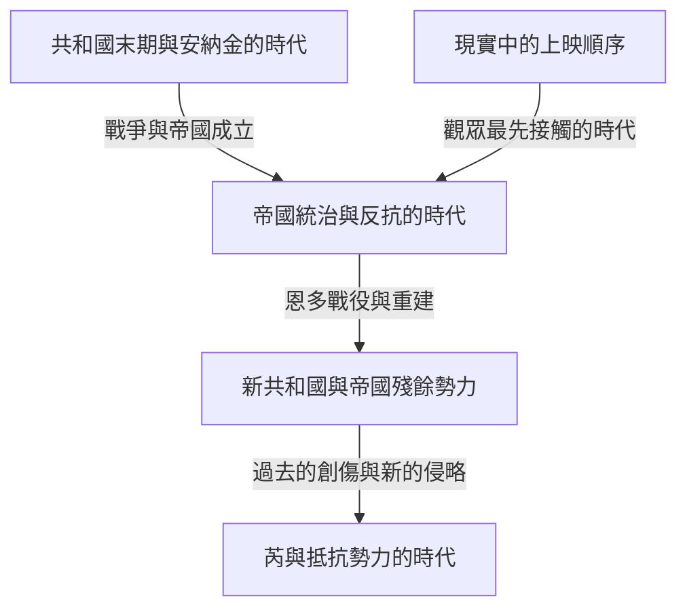
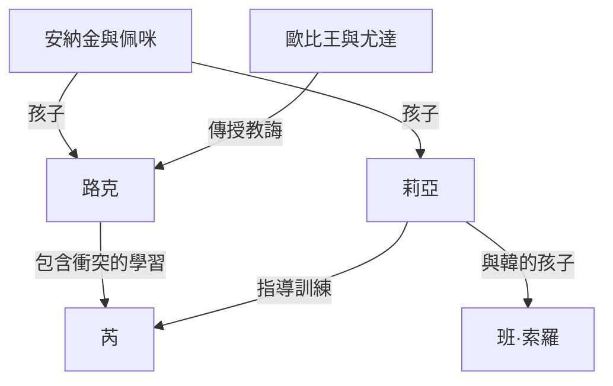

如果用一句話介紹《星際大戰》，它是發生在遙遠銀河中的冒險故事。然而，這些冒險又交織著親子間的愛恨、民主制度的崩潰、對帝國的反抗、宗教與權力、戰爭留下的創傷，以及超越血緣的家庭。在銀幕背後，還有一段改變了模型、剪輯、音樂、音效和電腦繪圖技術的電影製作史。

即使知道光劍和達斯·維達，隨著作品愈來愈多，也會愈來愈難看清整體面貌。為什麼最先上映的是第四部？絕地明明是正義騎士，為何沒能保住共和國？安納金、路克和芮的故事繼承了什麼，又改變了什麼？《安道爾》和《曼達洛人》描繪了哪些遠遠超出電影附錄意義的內容？

本文將從「銀河中的故事」「作品之間的關係」和「現實中的製作史」三個層面解讀這些問題。它不打算像辭典那樣列出所有設定，而是一份幫助讀者理解主要作品因果關係，以及那些反覆出現又持續變化的主題的長篇指南。在展示這個世界繁茂分支的同時，也為初次接觸它的人提供一條不易迷路的路線。

正文會涉及九部電影和相關作品的結局、人物真實身分、重要死亡與選擇。如果尚未觀看，希望保留驚喜，可以先閱讀開頭的作品整理和末尾的觀看順序指南，看完後再返回各部作品的章節。本文核實內容與上映狀況的基準日期為2026年10月3日。插圖是為本文生成的概念藝術，並非官方劇照或製作紀錄。

## 首先區分三種時間：上映順序、故事中的歷史，以及設定誕生的順序

《星際大戰》難以理解的最大原因，在於它的時間並非一條直線。1977年首次上映的電影，後來在故事內部被定位為第四部。觀眾先認識了路克的冒險，直到1999年以後才看到他的父親安納金的青年時代。故事中更早發生的事情，不一定更早拍攝。

此外，創作者構思設定的順序又是另一回事。後續作品揭示的關係，可能使早期場景呈現不同意義。但這不等於「拍攝第一部電影時，幾十年後的全部故事就已經確定」。面對在創作過程中不斷發展的作品，不能只根據完成後的連貫性，反推最初的創作狀態。

區分這三種時間，也就能理解觀看前傳的樂趣。知道結局不代表失去驚喜，而是可以把它當作一齣悲劇，思考人物究竟在哪些地方本來能做出不同選擇。另一方面，按上映順序觀看，可以更接近首映觀眾獲知資訊的時機。兩種方式各有價值，並不存在用來比拚知識量的唯一正確答案。

| 電影組別 | 首次上映年份 | 核心問題 |
| --- | --- | --- |
| 第四、五、六部：原版三部曲 | 1977、1980、1983年 | 如何反抗壓倒性的權力，並面對家庭的過去 |
| 第一、二、三部：前傳三部曲 | 1999、2002、2005年 | 共和國與安納金為何失去了自己想守護的東西 |
| 第七、八、九部：後傳三部曲 | 2015、2017、2019年 | 下一代如何繼承上一代的勝利與失敗 |
| 《俠盜一號》《韓索羅》 | 2016、2018年 | 如何描繪正傳邊緣的人物及其過去的選擇 |
| 動畫電影《複製人之戰》 | 2008年 | 如何透過人與人的關係擴展一場漫長戰爭 |
| 《曼達洛人與古古》 | 2026年 | 在帝國崩潰後的銀河，如何理解保護與共同體 |

年份原則上指首次院線上映年份，可能與日本上映年份不同。作品的上映順序和大致時間線，可以在[官方電影與影集指南](https://www.starwars.com/news/star-wars-movies-and-series-guide)中確認。像短篇選集這類一部節目跨越多個時代的作品，若只按節目名稱把它放在年表上的一個點，就容易造成誤解。

這張圖只是理解主要影視作品的骨架，並不表示帝國在一場戰鬥後就從銀河每個角落消失。政權在象徵意義上的失敗，與軍事組織、行政、犯罪及人們意識的變化，會以不同速度推進。許多衍生作品的故事，就存在於這樣的時間差中。

## 正史與傳奇：不同故事屬於哪條連續性

正史是理解目前官方故事連續性的框架。傳奇則是用來整理此前大量擴展的小說、漫畫、遊戲等作品的分類。2014年，盧卡斯影業調整了既有擴展宇宙的處理方式，公布以電影和《複製人之戰》為核心的新發展方向。[當時的官方公告](https://www.starwars.com/news/the-legendary-star-wars-expanded-universe-turns-a-new-page)解釋了這項轉變。

被歸入傳奇，不代表作品消失，也不代表它不再值得閱讀。我們可以把它們視為在不同年代、不同限制與可能性之下成長的銀河故事。反過來說，舊作品中的名字或構想重新出現在新作中，也不代表此前的經歷和事件一併進入新的連續性。愈是發現熟悉的名字，愈需要確認那究竟是哪部作品中的哪種設定。

此外，官方製作的作品也不一定全部共享同一條連續性。例如《視界》就探索不受既有時間線束縛的表達方式。遊戲中能夠操作的所有行動，也未必都是故事實際發生的事件。有時需要區分玩家能做出的選擇，以及續作所預設的事件。

這裡要避免把設定分類變成評判作品優劣的標準。正史是理解連結關係的線索，不是替感動程度打分數的系統。影像中的描繪、官方資料、人物發言和觀眾解讀，也屬於不同類型的資訊。不把人物相信的解釋直接當成世界的全知真相，同樣是重要的閱讀方法。

本文以目前主要影視作品的連續性為基礎，提及傳奇或獨立企畫時會區分其定位。我們也會區分「作品描繪了什麼」和「可以如何理解這些描繪」。例如，可以批判性地分析絕地制度，但那是觀眾的分析，不等同於一條否定所有絕地善意的官方設定。

## 進入銀河前的一張小型人物地圖

故事中心是圍繞天行者家族展開的幾代人。路克與莉亞是安納金和佩咪的孩子；班·索羅是莉亞與韓的孩子，後來以凱羅·忍之名活動。不過，故事的傳承不能僅靠血緣解釋。從歐比王和尤達到路克，從安納金到亞蘇卡，再到包括芮在內的下一代，教誨、失敗和選擇持續傳遞。

R2-D2和C-3PO以不同於人類的位置穿行於這段歷史。丘巴卡、藍道和反抗軍夥伴們，則把這個家族的內在問題與整個銀河的戰爭連結起來。在後來的影集中，卡西恩、丁·賈林、古古及複製人等人物，展現了遠離英雄中心的人們所經歷的時間。

把家庭關係與師徒關係分開看，就會發現銀河故事不只是一張王室族譜。它追問的不只是繼承了什麼，更是如何使用這些遺產，又拒絕什麼。接下來，就從觀眾最初進入這片銀河的三部曲開始，看看各部作品發揮了怎樣的作用。

## 第四部《曙光乍現》——銀河政治進入一個年輕人的生活

1977年上映的第一部電影，從故事世界歷史的中段開始。觀眾尚不了解帝國如何成立，就看到一艘小船被巨大的軍艦追趕。僅僅透過大小對比，就能明白追捕者與逃亡者之間的力量差距。影片開場不先把世界設定解釋完畢再推動故事，而是透過人物行動，逐步交付理解事件所需的資訊。上映日期及基本故事定位，也可以在[官方作品頁面](https://www.starwars.com/films/star-wars-episode-iv-a-new-hope)確認。

### 冒險的起點，並不是自覺成為天選之人

生活在塔圖因農場的路克·天行者，起初並沒有拯救銀河的打算。他只是一個想逃離狹窄日常的年輕人。然而，來到家中的機器人攜帶著反抗軍情報，莉亞的求救訊息又將他引向隱居的歐比王·肯諾比。只要政治衝突仍是遙遠地方的新聞，路克就還能選擇回農場。但帝國的暴力奪走了養父母，這條界線由此崩潰。

這裡的因果關係很重要。不是路克先選擇冒險，才與帝國產生關聯；而是他試圖與帝國統治無關的生活本身被摧毀了。故事既是個人成長，也是權力的暴力侵入邊緣生活的過程。不過，悲傷本身不會讓他成為英雄。在遇見師長與夥伴、學習行動方式，並把能力用來幫助他人的過程中，他最初的願望才獲得公共意義。

莉亞是被營救的人，卻不是一個只會等待營救的人。她藏匿情報、承受審訊，在逃離過程中也做出決策。路克與韓本想進入設施救她，結果她反而彌補了兩人的失誤。正因角色不固定，三人才沒有變成簡單的英雄、助手與獎品關係，而成為彼此影響判斷的群體。

### 死星既是大砲，也是一種統治思想

死星的可怕之處，不僅是能夠摧毀行星的火力。它背後還有一種構想：透過展示力量，讓日常協商和代議制度變得不再必要。解散參議院，與依靠恐懼使各星系服從，是相互關聯的。摧毀奧德蘭遠遠超出攻克軍事基地的範疇，是對所有可能考慮反抗之人的威嚇。

反抗軍並沒有同等規模的武器。他們分析設計圖、發現微小弱點，並集中有限兵力。勝利的條件，是運送情報的機器人、託付設計圖的人、分析人員及戰機維護人員的工作連結起來。最後一擊雖然由路克發出，但讓這一擊成為可能的，是廣泛協作。忽略這個結構，就容易把作品誤讀成「擁有特殊血統的個人解決一切」。

韓的歸來也屬於這種協作。原本以金錢為行動標準的他，明知危險仍回來幫助夥伴。路克不再只依賴瞄準設備而相信原力的瞬間，與韓不再只按報酬做決定的瞬間，都可以理解為邁向超越眼前得失的信任。這不是要求拋棄技術。戰機、通訊和設計圖仍然不可或缺，問題在於最終判斷中還應加入什麼。

另一個值得注意的地方，是銀河歷史透過需要修理的機器和生活費用進入畫面。千年鷹不是一艘只有速度優勢的完美載具，而是一艘船主必須費力維持運轉的飛船。酒館裡的客人，不只是為了向主角提供說明而存在；機器人也有被買賣的生活。因為畫面中心之外似乎也有事情持續發生，觀眾即使無法了解一切，也會感到這個世界已延續很久。

## 第五部《帝國大反擊》——失敗摧毀英雄對自己的理解

前作的勝利不代表帝國消失。反抗軍仍是逃亡的一方，連霍斯基地也無法保住。本片從一個現實出發：摧毀巨型武器，不會讓制度和軍隊一同消失。這部1980年上映的電影，將路克的修行與韓等人的逃亡並行展開。[官方作品頁面](https://www.starwars.com/films/star-wars-episode-v-the-empire-strikes-back)

### 修行考驗的，遠不只是搬起石頭的技術

在達可巴遇見尤達時，路克對偉大師長外貌和舉止的期待被打破。面對一個矮小而古怪的生物，他沒有立刻理解其智慧。這也是作用於觀眾的設計：先打破把強大與巨大身體或武器尺寸相連的直覺，再開始原力的學習。

洞穴場景中，路克擊敗的維達面具下面，出現了自己的臉。電影未將這個影像明確界定為單純的未來畫面。它可以理解為警告：如果遵循對敵人的恐懼和憤怒行動，就可能變成與敵人相同的存在。前作的課題是打倒帝國這個外部敵人；在這裡，想要打倒敵人的自己的內心，也成為審視對象。

看到夥伴受苦的幻象後，路克中斷修行。很難把這個決定簡單歸類為「出於善良，所以完全正確」，或「因為不成熟，所以完全錯誤」。無法拋下夥伴的動機可以理解，但他也錯估了自己的力量與資訊限度。而且，維達正利用這種情感引誘他前來。善意不會讓判斷局勢變得不再必要。

### 藍道的交易，以及向統治者妥協的極限

雲城的藍道為了保護城市，與帝國進行交易。然而，在統治者能單方面改變約定的關係中，僅靠契約無法獲得安全。服從一個條件，接著又會有新的要求。他的失敗不只是性格上的背叛，也是試圖在壓倒性暴力之下維持自治的政治失敗。

即便如此，一個人一旦犯錯，也不必然一直錯下去。藍道隨後展開營救。這部作品裡，路克失敗、藍道背叛、韓被俘，但人物價值不由當時的成功率決定。修正自己的行為、向他人求助、回應別人的幫助，都作為不同於勝利的尺度保留下來。

維達承認自己是路克的父親，不是為了抹去善惡區分。帝國的暴力不會因此正當化。真正崩潰的是路克那份井然有序的家族史：他以為自己是善良父親的兒子，敵人則是殺害父親的外人。「打倒敵人便能接近父親」的結構，轉變成一個難題：該如何面對敵人，才能繼承父親？

決鬥結束時，路克不是勝者。他身體受傷，無法自行逃脫，最終由莉亞等人救出。被自己在第一部裡前去營救的人反過來營救，也否定了英雄的孤立。獨立不只是完全不依靠任何人，也包括帶著錯誤與脆弱重新回到關係之中。從這個意義來說，本片陰暗的結尾遠不只是拖延到下一部的懸念。

霍斯的白色曠野、達可巴潮濕而封閉的環境，以及雲城明亮外表與陰暗內部的對照，也不只是觀光式背景。地點的質感支撐著軍事潰退、向內心下降，以及表面安全的崩塌。每次移動，主角原本擅長的行動方式就不再有效；駕駛戰機獲勝的經驗，不能成為修行、談判或與父親對話的答案。

生成概念藝術。插圖表現反抗者與帝國之間不對稱的力量，並非官方電影劇照。

## 第六部《絕地大反攻》——拯救父親與打倒帝國

1983年的完結篇從營救韓開始，將個人關係的修復與銀河規模的戰爭疊合起來。在賈霸宮殿中的路克，比第一部的年輕人更沉著，對力量的運用也更有自信。然而，僅憑這些外在表現，不能證明他作為絕地已經成熟。最終的考驗，是在能夠獲勝時選擇做什麼。[官方作品頁面](https://www.starwars.com/films/star-wars-episode-vi-return-of-the-jedi)

### 皇帝的陷阱，目標與其說是死亡，不如說是憤怒

皇帝一方面試圖從軍事上殲滅反抗軍，另一方面又想把路克拉到自己這邊。他讓路克看到夥伴陷入危險，誘使他因憤怒而攻擊，並沿著這種情緒殺死父親。即便路克打倒維達，只要接受同樣的支配邏輯，勝利者仍是皇帝。因此，這場決鬥有一種結構：戰鬥勝負與倫理上的成功可能相互倒置。

路克被對莉亞的威脅激怒，壓倒了維達。當他比較父親的機械手與自己的手時，洞穴中的幻象以具體選擇的形式回來了。此時放下武器，並不是因為沒有危險才選擇非暴力。他接受自己可能被殺的風險，拒絕殺死父親，也退出了那種必須摧毀敵人才能證明強大的衡量方式。

維達反抗皇帝，是看到兒子受苦後做出的選擇。這裡存在救贖，但影片沒有說他過去的罪行因此一筆勾銷。兒子相信父親仍有善意，與受害者有義務原諒加害者，是不同的事。電影在父子關係中描繪最後的轉變，卻沒有處理完全部法律責任和歷史記憶。保留這項區分，便能在不損害感動的同時理解結局的限度。

### 為什麼森林中的戰鬥，與王座室同樣不可缺少

如果只看與皇帝的對決，彷彿世界完全由家庭問題推動。但實際上，如果恩多地面部隊沒有關閉護盾，艦隊就無法摧毀第二顆死星。路克拯救父親，與反抗軍摧毀軍事設施，是同時不可缺少的任務。其中一方不會自動替代另一方。

伊娃族為聯合作戰帶來對當地地形的知識和另一種戰鬥方式。帝國在裝甲和火力上占優，卻沒有充分把眼前居民視為能自主行動的主體。這種輕視，使他們誤判了利用地形與突襲展開的抵抗。當然，這不是說現實戰爭中簡陋武器總能戰勝先進軍隊。作為寓言，它呈現了統治者低估微小存在的判斷力與團結力量的弱點。

路克、韓、莉亞、藍道、丘巴卡、機器人、無名士兵及恩多居民——多方努力最終匯合，因此慶典不是某一個人的加冕儀式。它也是失去父親的路克重新回到共同體的結尾。個人的失落與公共的勝利同時存在，使這部電影的幸福並非毫髮無傷的大團圓。

皇帝的失敗也來自錯誤估計：他以為其他人最終都會受利益與恐懼驅使。兒子不肯放棄對父親的信任，父親選擇兒子而非服從統治者，這些都超出他的計算。再強大的原力能力，也無法完全預測人的選擇。這與迷信巨型武器的威力，有著相同的自負：以為自己已完全掌握人心。

## 第一部《威脅潛伏》——帝國並非一開始就露出帝國的面孔

1999年上映的前傳，沒有從第一部那種明確的軍事獨裁開始，而從共和國內部的衝突展開。貿易聯邦封鎖那卜，是貿易和稅收爭端轉化為武力占領的事件。年輕女王佩咪·艾米達拉期待向議會申訴後，事實能獲得承認，也能得到救援。但制度停留在調查和程序上，現場的痛苦與決策速度無法配合。[官方作品頁面](https://www.starwars.com/films/star-wars-episode-i-the-phantom-menace)

### 白卜庭以危機解決者的身分贏得支持

如果觀眾知道後來的歷史，來自那卜的白卜庭議員所給的建議，就會呈現雙重面貌。他站在受害一方身邊，利用人們對看似無能的領導人的不信任。重要的是，他不是從議會外闖入，一擊摧毀共和國，而是利用議會程序和公眾期待提升地位。

電影中的敵人也不是鐵板一塊。貿易聯邦追求自身利益，達斯·西帝則把它當作更大計畫的工具。即使表面衝突解決了，衝突帶來的權力轉移仍然存在。那卜解放是真正的勝利，卻未必是共和國整體未來的勝利。慶典中仍殘留不安，正因這兩種尺度並不一致。

佩咪向剛耿族尋求合作的場景，展示了相反的政治方式。她不再只維護代表者的威嚴，而承認彼此生活在同一顆星球上的關係，並請求幫助。這不只彌補軍事力量不足，也使此前彼此疏遠的群體形成共同目標。這種小規模團結，產生了她在議會中未能獲得的實際行動力。

### 在看見安納金的才能之前，先看他的生活

年幼的安納金擁有驚人的駕駛能力，同時卻也是奴隸。在一個有龐大共和國、絕地談論正義的世界裡，母子的自由沒有保障。這個事實體現了制度存在與制度保護抵達所有地區之間的差距。即使魁剛能解放安納金，也無法以同樣方法救出他的母親西蜜。

啟程既有能力受到認可的幸福，也有留下母親獨自離開的恐懼。如果只把後來的安納金看成「無法克服恐懼的軟弱之人」，就會忽略恐懼形成的條件。另一方面，艱難身世也不代表後來的加害必然發生。故事由此提出：帶著創傷的人，究竟需要怎樣的支持與教育？

魁剛死後，發現安納金的導師未能成為長期引導他的導師。歐比王接下承諾，但兩人的關係並非一開始就成熟。宏大的預言與制度期待，開始跑在一個孩子的成長之前。這種失衡為整個前傳的悲劇鋪路。

在製作層面，把前傳統稱為「完全用電腦製作的電影」也不準確。官方製作介紹提到，用來表現飛梭賽車觀眾的模型中使用了彩色棉花棒等實物技巧。把它理解為新技術與手工製作共同構成畫面，更接近實際情況。[官方製作趣聞](https://www.starwars.com/news/25-fun-facts-the-phantom-menace)

結尾在多個地點同時推進的戰鬥，也有助於區分不同群體的作用。剛耿族的牽制、宮殿中的行動、太空戰鬥及絕地與西斯的決鬥，各自在解決不同問題。不是只要有一個強大劍士，占領就會結束。而軍事成功背後又失去魁剛，因此，共同體的勝利與男孩人生中的損失並不一致。

## 第二部《複製人全面進攻》——戰爭準備逐步縮小選擇空間

2002年的第二部中，試圖脫離共和國的分離主義勢力擴大，建立軍隊成為政治議題。從調查針對佩咪的暗殺未遂事件出發，歐比王發現了複製人大軍。原本還在討論如何應付危機的共和國面前，突然出現一支已經完成的軍隊。安全上的迫切感，與來歷不明卻極為便利的力量結合起來。[官方作品頁面](https://www.starwars.com/films/star-wars-episode-ii-attack-of-the-clones)

### 本應調查的謎團，被戰爭的迫切需求超越

複製人大軍如何被訂購，又為誰的利益製造，本來應該優先調查。然而，當敵軍就在眼前，人們渴望立即可用的戰力。危機透過奪走審慎考察的時間改變決策。軍隊獲得採用，不是因為已經充分查證，而是在看起來沒有替代手段的局勢中推進。

杜庫對共和國的批評，包含制度腐敗這個真實問題。但能正確指出問題，不保證他提出的解決辦法公正。既然他本人參與西斯計畫，對共和國的失望就不會自動通向解放。必須區分雙方表面上的對抗，以及利用這種對抗的西帝的位置。

絕地也為維護和平走向戰場，轉變成以將軍身分率軍作戰。營救行動雖然成功，卻因此開啟戰爭，形成悖論。保護眼前生命的行動，與長期強化軍事秩序的效果並存。為善意目標採用的手段，開始改變組織自身的性質。

### 愛情與政治中共同存在的控制欲

安納金和佩咪的關係，受到身分、職責與絕地紀律阻礙。祕密婚姻保護兩人的愛情，卻也縮小了能獲得建議與支持的範圍。可以分享困難的人變少後，當恐懼日後加深，也就更難從外部審視這種恐懼。

失去母親的安納金，在塔斯肯人的聚落殺死包括兒童在內的人們。這一段不能被輕輕帶過，當成只是表現憤怒程度的場景。親人遭受暴力的經驗，轉化為對無關之人施暴的理由，這是明確的倫理崩潰。悲傷可以理解，行為仍需要承擔責任。他後來的墮落不是突然轉向，因為在這裡，他已跨越重大界線。

此外，安納金認為只要能得到理想結果，就能由強勢領袖決定，這種政治觀也呼應了他在親密關係中控制失去的願望。接受人們擁有不同意志、接受所愛之人也有不受自己掌控的人生，並不容易。但若試圖透過強制消除不確定性，就會破壞自己想守護的關係。這個問題在下一部走向極端。

複製人大軍整齊劃一的外貌，還帶著把人當成可替換戰力的陰森感。即使士兵有相同來源，也不能把他們的生命算成同一件東西。電影先給觀眾留下大規模軍隊出現的印象，後來的作品才深入描繪個別士兵的人格。注意這個順序，就能重新審視那支看似拯救共和國的軍隊：究竟是誰承擔這種拯救的代價？

## 第三部《西斯大帝的復仇》——拯救的願望轉化為支配邏輯

2005年的第三部中，複製人戰爭接近結束，共和國卻走向崩潰。人們期待戰爭獲勝後回歸和平，但為進行戰爭而集中的權力，反而成為戰後獨裁的基礎。安納金與共和國同時墮落，使這部電影的悲劇既不能僅歸結於個人意志薄弱，也不能僅歸結於制度失敗。[官方作品頁面](https://www.starwars.com/films/star-wars-episode-iii-revenge-of-the-sith)

### 白卜庭兜售的，是能夠支配死亡的承諾

安納金害怕未來失去佩咪。白卜庭沒有直接否定他的恐懼，而暗示存在別處無法獲得的力量。這比單純宣揚邪惡教義更高明：先認清對方最不願失去的東西，再讓對方相信要保護它就離不開自己。依賴愈深，矛盾解釋和犯罪性要求也愈容易被接受。

絕地議會與安納金之間也存在不信任。他覺得自己不被認可，議會則警惕他與白卜庭過於親近。再加上要求他承擔情報任務，他的忠誠對象被撕裂。但解釋處境與免除責任是兩回事。在為保護白卜庭而阻止魅使·雲度之後，安納金繼續服從更具破壞性的命令。

人犯下嚴重錯誤後，有時更想選擇一條能證明錯誤有意義的道路，而不是回頭。安納金的行動也能理解為這種自我辯護的連鎖：既然已做到這一步，如果不能獲得力量，一切就白費了。這種想法讓下一次加害看起來像必要的犧牲。

### 六十六號密令，讓制度內部的殺傷能力改變方向

襲擊絕地的不是遠方出現的新敵軍，而是曾並肩作戰的士兵。當軍事組織指揮鏈反轉，以友軍身分為前提的部署與信任就變成弱點。電影描繪了命令與同步襲擊，而複製人士兵被控制的詳細機制，由相關動畫補充。區分電影本身的說明與後來補充，也能看清不同作品承擔的功能。

帝國成立，也不是共和制度的建築全部被摧毀的瞬間，而是在議場裡以新秩序的名義宣布。藉著恢復安全的語言，監視與暴力被納入永久統治。透過把反對的絕地塑造成叛徒，對權力集中的抵抗，被重新解釋為對秩序的攻擊。

在穆斯塔法，安納金對本應拯救的佩咪施暴。當對方不同意自己，他沒有尊重她本人的意志，而將其理解為背叛。這一刻，愛與占有欲的區別變得鮮明。他渴望的未來，不只需要佩咪活著，還需要一個認同他選擇的佩咪。

安納金被燒傷的身體裹入盔甲，與雙胞胎降生的場景並置，同時展現絕望與下一種可能。歐比王和尤達都不是勝利者。即便如此，保護孩子仍是政治失敗中能保留下來的未來。前傳最終呈現的，不是善人消失所以惡獲勝的故事，而是善意、恐懼、制度和野心相互結合，釀成災難的故事。

歐比王的悲痛，也遠不是發現並擊敗壞人的滿足。他必須與自己視如弟弟的人戰鬥，對自身教育和判斷的疑問仍然存在。因此，兩人漫長的決鬥不只是技藝較量，也能看成彼此太過了解、卻無法輕易切斷關係的痛苦。獲勝的一方，同樣沒有可以慶祝勝利的地方。

## 第七部《原力覺醒》——不認識過去英雄的一代，繼承了過去

在2015年的新篇章中，對芮和芬恩而言，反抗軍英雄已近乎傳說。那些觀眾熟悉的名字，對年輕人物卻很遙遠。透過這種差距，電影把老觀眾的記憶與新觀眾的驚奇放在同一畫面。第一軍團出現在後帝國時代，說明曾經的勝利不能保障下一代安全。[官方作品頁面](https://www.starwars.com/films/star-wars-episode-vii-the-force-awakens)

### 芬恩首先透過拒絕命令，成為主角

芬恩的起點不是優秀血統或預言，而是在被要求作為士兵服從時拒絕殺人。這項選擇，使他從組織裡一個編號的地位，開始變成能自己決定的人。但他也不是立刻就做好拯救整個銀河的準備，最初仍強烈想逃走。故事描繪的不是等恐懼消失後再做好事，而是帶著恐懼，為某個人留下來的過程。

賈庫的芮掌握了維持生存的技能，同時等待可能歸來的家人。她的停滯不源於能力不足，而與對過去的期待有關。離開故鄉，不只是移動到另一顆星球，而是從「只要繼續等待，原來的生活就會回來」的希望，走向親手建立新關係的可能。

### 凱羅·忍渴望的，與其說是維達的力量，不如說是維達的形象

班·索羅試圖把自己重塑為凱羅·忍。他崇拜外祖父維達，但外祖父最後救了兒子的事實，與他追求的強大邪惡形象不符。人不總是完整繼承過去，也可能只挑選自己需要的部分。凱羅體現了歷史傳承也可能變成誤讀。

殺死韓也不只是冷靜惡人清除障礙。他認為切斷家庭依戀便能強大，因此試圖改造自己。但施行暴力不必然消除內心衝突。為了抹去動搖而採取的行為，反而產生新創傷。芮的故事走向與他人建立聯繫，凱羅則試圖透過切斷聯繫來確立自我。

弒星者基地、攜帶地圖的機器人等與第一部相似的結構十分明顯。可以把它們當作懷舊，也能批評它們的結構重複。但分析不應止步於「相似」，而應看看處在相同位置的人物做出怎樣不同的選擇。原本屬於帝國式軍隊的士兵成為主角，等待救援的少女親自反抗，英雄之子成為敵人。在相似輪廓中，繼承的焦慮進入中心。

新共和國中樞被摧毀的場景，強烈展示政治秩序的脆弱；但因電影此前沒有長時間描繪這種秩序的日常，觀眾也不容易具體體會究竟失去了什麼。這可以視為作品說明上的局限。了解相關作品會增加這份重量，但不能把一切歸咎於不熟悉那些作品的觀眾。作品內部傳達的資訊量，本身就會影響觀看體驗。

## 第八部《最後的絕地武士》——承認失敗，卻不放棄責任

2017年的第二部打破「只要芮見到路克，問題就能解決」的期待。路克已退出再次以英雄身分挺身而出的生活。與此同時，抵抗勢力遭到追擊，被迫以有限資源做出生存決策。這部電影同時重新追問個人的英雄形象與組織的領導方式。[官方作品頁面](https://www.starwars.com/films/star-wars-episode-viii-the-last-jedi)

### 承認錯誤，能否成為放棄一切的理由

路克與班的過去，從不同視角被講述。路克一瞬間的恐懼，與班看到這一幕時的恐懼，使同一場景具有不同意義。這裡呈現的不是「事實根本不存在」的相對主義，而是自己當時想什麼，與對方實際經歷什麼之間的差距。僅解釋「那只是一瞬間」「我後悔了」，不能抹去給對方造成的傷害。

路克把自己的失敗與整個絕地的失敗聯繫起來，想終結這套傳統。對絕地歷史的批評值得思考，但如果批評只是用來證明自己缺席的合理性，就會遠離對當下受苦之人的責任。在無條件維護傳統與因為失敗而全部拋棄之間，需要一條吸取教訓、重新傳遞的道路。

芮和凱羅觸及彼此理解的可能，但理解與同意不同。即使共享孤獨，也沒有必要接受支配他人的秩序。凱羅殺死史諾克，不代表他自動來到善的一方。殺死統治者與拒絕統治機制是兩回事，他試圖坐上空出的位子。

### 勇氣與指揮，採用不同的時間尺度

波擁有摧毀眼前敵人的勇氣，卻必須學習這種成功要付出多少人員與戰力。一場戰鬥取得顯眼成果，與讓組織活到第二天，是不同的事。處在指揮位置時，決定不攻擊或選擇撤退，同樣屬於責任。

另一方面，與何朵的衝突也包含資訊分享的困難。觀眾經歷了「誰知道什麼」彼此錯位的狀態。如果據此一概得出「下屬應該閉嘴服從」，就過於狹窄。把它理解成危機下保密、信任、指揮權和說明不足相互衝突的局面，才能同時看見人物的長處與缺點。

坎托灣的插曲說明，看似處在戰爭之外的繁榮，也透過武器和剝削與戰爭相連。芬恩從只想保護某個朋友的階段，走向理解更廣泛抵抗的意義。但剝削者與雙方交易，不能證明雙方政治目標相同。批判利益結構，與把侵略和抵抗視為一回事，必須區分。

路克最後所做的，不是大量殺死敵軍，而是為夥伴爭取生存時間。曾厭惡傳奇形象的人，承擔起傳奇具有的希望力量，並以不同於肉體勝利的方式吸引敵人注意。可以說，這是一部從打破英雄形象開始，以重新選擇如何使用這種形象結束的電影。

芮向路克索求的不只技術，也包括能從外部確定「自己是誰」的答案。然而，導師同樣是有錯誤與恐懼的人。認識到所依靠之人的不完美後，她必須決定從他的教誨接受什麼。因此，本片不只是弟子否定導師的故事，也是在問：不再理想化導師後，是否仍能繼續學習？

## 第九部《天行者的崛起》——出身，以及主動選擇的名字

2019年的第九部讓白卜庭再次成為最終敵人，並把芮的身世與他的家系聯繫起來。前作中芮認為自己不屬於重要家族的認識，在此被大幅改寫。觀眾對這項轉折喜好不一，但分析時首先應區分各部作品傳達什麼，以及下一部又增加什麼。[官方作品頁面](https://www.starwars.com/films/star-wars-episode-ix-the-rise-of-skywalker)

### 血統可以解釋能力，卻不能成為倫理命令

芮害怕邪惡家系會決定自己的未來。但故事結局沒有走向服從出身，而是選擇接受哪些教誨與關係。這裡的問題不能簡單用「血統無關緊要」概括。電影確實把血緣當成重大敘事機關；同時又試圖透過拒絕血緣似乎規定的角色，描繪主角的自由。

與路克和莉亞的關係，是芮另一條傳承道路。最後選擇天行者之名，與其說在申報生物學譜系，不如說在表達自己想繼承的價值，以及培育自己的關係。但選擇名字不會讓痛苦與過去消失。意義在於，知道過去之後，決定如何稱呼自己。

白卜庭歸來的技術細節，僅靠電影得到的解釋有限。不能混淆相關資料的補充與電影直接呈現的資訊，彷彿銀幕內已解釋一切。劇情重點在於，他因對死亡的恐懼及對權力的執著，甚至把下一具身體和下一代當成工具。曾向安納金兜售支配生命之力的人，直到最後仍把他人當成自我保存的手段，形成連續性。

### 班的轉變，反轉了征服死亡的思路

班從凱羅·忍的生活方式回轉，涉及母親的呼喚、被芮救命的經歷，以及與父親相關的記憶。此前試圖透過殺死父親擺脫衝突的做法失敗了。反而是重新接受關係，才打開另一種選擇。這裡的轉變同樣不會讓過去的加害消失，但當下選擇另一種行動的可能仍然存在。

他把生命給予芮的結局，與因不願失去愛人而犧牲他人的安納金形成對照。不是為了保住生命而支配世界，而是從自己這一方給予。這項對比改變了貫穿九部作品的「拯救」的含義。把對方留在自己身邊，與希望對方活著，不是同一回事。

集結在艾克西格的艦隊，也承擔不同於芮決鬥的任務。被恐懼隔絕的人們確認彼此存在，並聚集起來。觀眾覺得這種集結有多大說服力，可以各有判斷；但在故事結構中，超越單一英雄能力的參與是必要的。最終決戰再次把血統之爭，與沒有特殊血統的眾多普通人的抵抗疊合。

作為九部作品的結尾，重返塔圖因的影像意味著：回到同一地方，不等於回到同一狀態。第一部裡，一個想去遠方的年輕人望著地平線；最後，一個經歷旅程的人報出自己的名字。再次使用起點景觀，讓擴展世界與確定自身位置，作為同一運動完成收束。

## 《俠盜一號》——讓英雄完成最後一擊，卻無法歸來的人們

2016年上映的《俠盜一號》描繪第一部之前，死星設計圖如何傳到反抗軍手中。即使知道結局大致輪廓，緊張感也不會消失，因為核心不只「設計圖能否送達」，還有「誰失去什麼才讓它送達」。官方製作公告說明，企畫由工業光魔的約翰·諾爾提出，並重視地面戰爭視角。[官方製作公告](https://www.starwars.com/news/rogue-one-the-daring-mission-has-begun-cast-and-crew-announced)

### 技術人員的抵抗，以及女兒重新理解其意義

蓋倫·厄索參與帝國武器開發，同時在內部埋下能導致毀滅的弱點。這包含一個難題：留在制度內是否總代表共謀，內部破壞又能做到什麼程度？但不能由此概括所有合作者都是祕密抵抗者。電影描繪一個具體人物的選擇，以及把這個選擇傳達他人的困難。

琴收到關於父親的零碎資訊，修正此前把父親簡單理解為叛徒的圖景。關鍵是，僅知道父親善意並不能使武器停止。必須證明弱點資訊、取得設計圖，並以可使用的形式交給別人。只有個人和解轉化為公共行動，父親的抵抗才有實際效果。

### 描繪反抗軍的不義，不等於為帝國辯護

卡西恩曾為反抗事業做過黑暗工作。他的行動有些部分，不能只因目標正當就獲得免責。反抗軍內也有分歧，面對危險不是團結一致。這些描繪說明抵抗者也不純潔無瑕，卻不能因此得出統治與抵抗相同的結論。

真正受到追問的是，雙手沾污的人們接下來要做什麼。卡西恩與琴同行，包含一種迫切願望：不想讓過去犧牲最終只是犧牲。但這個願望也可能無限正當化下一次犧牲。電影透過兩種行為的區別呈現邊界：命令他人被消耗，與主動承擔風險。

史卡利夫戰役裡，地面通訊、太空艦隊和設施內部操作彼此分隔。再強大的個人，只要別處一個連結斷開，任務就會失敗。傳輸這項技術問題，本身成為團結的形式。情報多次交接，不是無意義重複，而是展示工作如何超越個人生存繼續傳承。

他們無法參加第一部的慶典，但後來勝利包含他們的努力。在《曙光乍現》主角背後，觀眾開始看見此前不知姓名、不識面孔的人們所付代價。外傳能豐富正傳意義，正是在這樣改變既知事件倫理重量的時候。

席魯的信仰也不同於萬能防禦能力。相信原力，不保證身體安全。信仰在此不是免於死亡的契約，而是在危險中採取行動的姿態。即使故事沒有受過絕地訓練的主角，原力這個觀念仍參與人們的判斷與希望，席魯讓我們看見這一點。

## 《韓索羅》——一個看似自利的人，如何形成

2018年的《韓索羅》稍微離開決定整個銀河統治權的戰爭，進入犯罪組織、運輸、債務與交易世界。透過年輕的韓如何結識丘巴卡和藍道，從另一角度展示第一部中此人的面貌。正如官方頁面介紹，故事核心是穿行邊緣地下世界的冒險。[官方作品頁面](https://www.starwars.com/films/solo)

### 即使試圖買來自由，下一種依賴仍在等待

韓試圖逃離科瑞利亞，但逃走不會自動帶來自由生活。帝國軍、犯罪組織、工作仲介——每獲得一種生存手段，就出現新的上下關係。他渴望擁有飛船，不只因為喜歡駕駛，也因飛船是能自行決定去向的物質條件。

貝克特教他不要過分相信別人。這種處世方式有在危險環境生存的合理性。但如果所有關係都建立在預判背叛上，合作就縮小成暫時的利益交換。韓吸收了一部分教誨，卻沒完全變成同一種人。

與丘巴卡相遇，體現這項差別。即使最初有共同生存的利害關係，一起穿越危險時，也會產生超出交換的聯繫。如此，後來兩人的信任便不只是預先賦予的人物設定，而是雙方觀察彼此行動、逐步判斷的結果。

### 綺拉在韓的故事之外，也有自己的人生

韓想帶走綺拉，實現過去的願望。但在分開的日子裡，她為了生存經歷的世界，比他想像更複雜。重逢不代表舊關係能原樣恢復。想拯救對方，與理解對方當下所處條件，之間存在距離。

若只用有沒有愛情解釋她的選擇，就會忽略組織內求生的限制與野心。即使韓是電影主角，其他人的人生也不是都為實現他的希望而運轉。這種不對稱，成為年輕韓的失望與成熟的一部分。

隨著對恩菲斯·奈斯特團體的認識變化，罪犯與抵抗者的界線也開始動搖。運輸品歸誰所有、被誰奪取、用於什麼目的？契約上的所有者未必就是道德上正確的一方。韓最後做出無法只用利益解釋的決定，展現後來返回反抗軍的那種性格。

這部電影中的韓，不是徹底解釋第一部人物形象的標準答案，因為人並非由單一經歷塑造。儘管如此，仍能看見諷刺與自利語言之下，保留著無法完全拋棄他人的本性。一個裝作不是好人的角色，卻在行動中不斷推翻自我介紹。正是這種錯位，構成韓索羅的魅力。

機器人L3-37把自由主題擴展到非人類存在。究竟把她當成擁有便利人格的機器，還是有自主判斷與訴求的主體？系列常被包裹在笑料中的問題，在她言語和行動裡浮出表面。電影未完全解決這項問題，但享受機器人的親切感，與質疑它們所處的所有權關係，可以同時成立。邊緣世界的小冒險，也潛藏關係整個銀河的問題。

## 從制度與生活，理解電影之外擴展的銀河

離開電影，進入影集和動畫，《星際大戰》的銀河突然變得細緻。打倒皇帝，與支付明天的飯錢，不是同一問題。在戰場被絕地救過的人，與生活被軍事行動摧毀的人，對同一共和國也有不同感受。這種視角差異，讓衍生作品不只是追加故事。

### 同一種政治體制，在中心與邊緣看來也不同

共和國首都科羅森，是議會、官僚機構與絕地聖殿集中的政治中心。但掛著共和國旗幟，不代表銀河所有居民能得到相同保護。在塔圖因等邊緣地區，共和國理念尚未充分抵達，犯罪組織和奴隸制度可能支配生活。中心看來井然有序的國家，外围看來也許只是遠方討論問題的政府。

理解分離主義時，這種距離也很重要。即使獨立星系邦聯的領導層或軍工企業被納入邪惡計畫，對共和國不滿的居民也非全是壞人。對貪腐、政治忽視和經濟差距的不滿，獨立於陰謀而存在。白卜庭的高明，與其說是憑空製造矛盾，不如說是利用既有不滿，把衝突出口引向自身權力擴張。

帝國成立後，行星間差異也不會消失。有些地區直接感受巨型武器威脅，有些人則透過採礦、治安部隊、身分證明、拘押與徵用認識帝國。新共和國成立後，中央統治退卻的地方，海盜和舊帝國武裝又會活動。因此不能只根據國家名稱判斷治安與自由。思考觀察者來自哪顆行星、哪個階層、從事什麼工作，就更容易理解同時代作品為何氣氛不同。

表現銀河中心與邊緣、不同時代對比的生成概念藝術，並非官方影像或設定圖。

### 絕地不是國家本身，而是與國家相連的騎士團

絕地不是所有原力使用者的統稱，而是有訓練、紀律、師徒關係及共同體傳統的組織。共和國末期，他們自認和平守護者，卻也不是獨立於政治權力的隱士。他們受派執行外交任務，與參議院聯繫，在複製人戰爭成為將軍。角色重疊，同時產生善意與制度性失敗。

他們為保護人們指揮軍隊，但愈成為指揮官，就愈難擺脫決定戰爭如何結束的政治結構。擊敗敵兵的戰術成功，也可能不等於實現和平。若認為絕地失敗只是劍術不夠強，就會錯過悲劇所在：他們投入軍事戰鬥，卻未充分看穿戰爭本身就是圈套。

這不代表絕地與帝國相同。會犯錯的制度，與主動以支配和恐懼為目標的制度，有所區別。作品提出的問題是：有善意就不必自我檢視嗎？當守護共和國與持續服從共和國判斷衝突，究竟優先哪個？亞蘇卡和杜庫的故事，把衝突落實到個人經驗。

### 西斯與黑暗力量使用者，也未必屬於同一群體

把所有使用紅色光劍的敵人叫作西斯，會混淆組織關係。判官承擔帝國追獵絕地的工作，卻不處於西斯師徒相同地位。達索米爾暗夜姊妹也擁有不同於絕地與西斯的傳統。使用原力黑暗面，與屬於特定西斯傳承，必須區分。

與達斯·貝恩相關的「二人法則」，以掌握力量的師父和渴求力量的徒弟之間的關係為基礎。這不是規定銀河只能存在兩個邪惡原力使用者的物理法則，而是組織繼承原則。周圍仍可能有合作者、刺客、被利用的候選弟子及被淘汰的人。官方資料庫也說明，貝恩為了西斯延續而引入這项制度。[達斯·貝恩官方解讀](https://www.starwars.com/databank/darth-bane)

這裡可見與絕地相反的教育觀。即使師父希望徒弟成長，西斯體系中的成長也會威脅師父自身。合作關係內嵌了利用對方、最終取而代之的邏輯。理解皇帝與維達，或被用後丟棄的魔，除了個人性格，也注意關係本身如何產生不信任，就能理解得更深。

## 《複製人之戰》改變了我們觀看戰爭的方式

### 電影與長篇影集的作用

2008年的動畫電影《星際大戰：複製人之戰》，是通往同名電視系列的入口。對只看電影的觀眾，安納金有一位叫亞蘇卡·譚諾的徒弟，是重大補充。這不是為了增加人物名單。透過描繪承擔引導他人責任的安納金，他的勇敢、照顧別人的能力及對規則的反抗，都在與徒弟的具體關係中顯現。

系列描繪第二部與第三部之間的戰爭，卻不局限於共和國軍作戰。視角轉向外交、奴隸商人、犯罪組織、試圖中立的行星及普通人的疑慮。電影中只有幾分鐘的政治背景，變成日常生活與持續做出的判斷。單集勝利常不帶來整體改善，由此可見漫長戰爭的消耗。

不過，理解長篇影集不代表必須把一切變成尋找電影伏筆。觀眾知道結局，人物卻不知道未來。他們幫助夥伴、完成任務、累積微小信任的時間，本身就有意義。正因這些時間充分被描繪，六十六號密令才不只是歷史事件，而是摧毀長期建立之關係的災難。

### 複製人的相同面孔，不代表相同人格

電影大軍中難以分辨的複製人士兵，變成雷克斯、五號、回聲等各有姓名與判斷的人物。遺傳相似不代表經驗和人格相同。裝甲紋樣、髮型、說話方式及戰友關係，讓觀眾辨認個體。

共和國的倫理矛盾也在此浮現：保衛自由的戰爭，依賴為作戰而誕生、卻不充分擁有離開軍隊自由的士兵。絕地指揮官常尊重部下，但僅以個人身分溫和相待，無法解決整個制度問題。承認士兵勇氣，與追問他們所處的結構，可以同時成立。

關於抑制晶片的故事，讓矛盾更殘酷。忠誠並非完全建立在自由選擇上。六十六號密令的悲劇中，攻擊的一方也有人格和友情，卻被強行踐踏。亞蘇卡移除雷克斯晶片的情節，體現一種拯救：比起打倒敵人，更重要的是恢復被剝奪的判斷力。[亞蘇卡·譚諾官方資料庫](https://www.starwars.com/databank/ahsoka-tano)

### 亞蘇卡離開絕地，是區分善與制度的入口

亞蘇卡離開絕地武士團，不表示她放棄對他人的關懷。本應保護自己的組織破壞信任，即使後來要求回歸，傷害也不會自動消失。繼續屬於倡導正確理念的組織，與繼續做自己認為正確的事，第一次被分開。

這項變化對安納金同樣嚴重。他試圖保護徒弟，但自己願意相信的制度沒有按期待運作。不能只憑亞蘇卡離開解釋他後來墮落，但對理解制度不信任如何與失去親近之人的恐懼結合，十分重要。官方文章也把第五季的離開與之後重逢，視為兩人關係的轉折。[亞蘇卡與安納金的告別](https://www.starwars.com/news/ahsoka-and-anakin-final-meeting)

後期的曼達洛圍城戰，提供與《西斯大帝的復仇》同時發生的另一視角。觀眾知道科羅森將發生什麼，遠方現場卻只能收到零碎資訊。這種延遲產生緊張感：歷史中心做出的決定，在被理解之前，就把現場夥伴變成敵人。

## 《瑕疵小隊》描繪戰爭結束後被留下的人

《瑕疵小隊》圍繞擁有特殊能力的複製人部隊與女孩歐米茄，描繪共和國向帝國過渡。政體更替不只是換一塊招牌。軍隊人員組成、忠誠審查、地區控制與資訊管理都在變，曾支撐國家的士兵也可能成為多餘的人。

主角們精於戰鬥，卻未充分學習自由生活的技能。選工作、領報酬、考慮孩子安全、尋找安心之處，成為新課題。作戰有命令和目標，生活卻沒有「只要執行這些就正確」的命令書。這種差異讓部隊逐步變成家庭。

歐米茄的意義遠超過增加戰力。承擔保護她的責任後，不能只依能否完成危險工作來判斷。能否為今天收入犧牲明天安全？只有自己逃走是否足夠？希望孩子繼承什麼？不同於軍事理性的尺度，進入部隊內部。

準星的故事，質疑服從能保證歸屬感的期待。按組織要求行動，自己的價值就應被認可；但當組織把個人當工具，忠誠並非相互關係。回歸與和解也有只靠解釋情況無法填補的傷口。成為夥伴，不僅是從不犯錯，也意味著如何與犯過錯的人重建關係。

帕布寧靜的生活，不只是戰爭故事的休息段落。它透過食物、住處與鄰里，把「究竟為何而戰」具體化。官方資料庫把帕布介紹成難民共同體，最終集製作文章則談到倖存小隊與長大歐米茄的未來。結局將戰鬥終止，與選擇普通生活的可能相連。[帕布官方解讀](https://www.starwars.com/databank/pabu)、[最終集演員訪談](https://www.starwars.com/news/the-bad-batch-series-finale-dee-bradley-baker-michelle-ang-interview)

## 《反抗軍起義》：抵抗運動如何成為共同體

《反抗軍起義》的中心，是生活在洛塔的少年艾斯納·布瑞格及幽靈號飛船的夥伴。這裡沒有從一開始就成熟完備的反抗聯盟等著迎接主角。局部抵抗、物資籌措、情報交換與人際信任持續累積，才連結成更大運動。

對艾斯納而言，絕地訓練不只學超能力，也是原本必須獨自求生的少年，學會與他人分擔責任的過程。導師肯南也不是受過完整教育、毫無創傷的大師。他帶著恐懼與缺失培養下一代。這種不完美師徒關係，形成從人與人信任中重建失落制度的故事。[艾斯納與肯南的官方分析](https://www.starwars.com/news/always-two-ezra-and-kanan)

赫拉既是飛行員，也是使組織運轉的實幹者。莎繽有身為曼達洛人的政治過去，澤布帶著共同體被摧毀的記憶。丘巴不是單純方便的機器，而以粗魯鮮明的個性作為夥伴參與關係。不同出身的人們，不只靠相同理想，也透過共同生活連結。

索龍成為這個小共同體的特殊敵人。他不只依賴蠻力威嚇，還試圖讀懂對方文化與行為模式。反抗軍也未必只要準備更強火力就能贏。超出對手的行為預測，運用無法還原成軍事計算的關係——包括與動物、土地的聯繫——變得重要。

洛塔解放的結尾，艾斯納與索龍消失，說明勝利與歸來未必能同時獲得。拯救故鄉的選擇，伴隨自己無法留在故鄉的代價。這片空白延續至後來的《亞蘇卡》。[《反抗軍起義》最終集官方指南](https://www.starwars.com/series/star-wars-rebels/family-reunion-and-farewell-episode-guide)

## 《安道爾》清點反抗的代價

### 第一季：旁觀求生的極限

《安道爾》的特色，是不只用巨大象徵說明帝國邪惡。勞動、管制、帳簿、服從的獎勵與受罰恐懼，一點點收窄個人行動空間。追隨並非一開始就是成熟革命者的卡西恩，作品描繪抵抗主體如何誕生。

費里克斯有工作工具、店舖、鄰里關係和葬禮習俗。生活細節累積，使治安部隊介入不只是「敵人出現」的事件，而是居民被奪走屬於自己時間與空間的事件。對帝國的反感不只來自抽象理念，也來自抵抗自身生活被他人按其需要定義。

阿爾達尼行動體現反抗需要資金的現實。但獲取資金有風險，成功也可能引來帝國更嚴厲壓制，傷及無關的人。使壓迫可見、從而擴大抵抗的思路，作為策略可以理解，卻無法消除「由誰承擔代價」的倫理問題。

監獄篇章把囚犯互相監視、競爭並持續勞動的機制置於前景。暴力不只靠獄卒每分鐘毆打維持。規則、資訊隔絕、對其他小組的焦慮及重獲自由的期待，共同驅動人們。要掙脫機制，不只需要個人勇氣，也需要被分割的人們理解同一現實。

### 第二季：抵抗愈組織化，矛盾也愈大

第二季描繪通往《俠盜一號》的數年，把卡西恩個人變化與反抗力量組織化疊合。東尼·吉洛伊在官方訪談說明，最終季結構直接連結《俠盜一號》。重點不只在既知電影之前填補事件，更在展現到達那裡之前的人命損失。[吉洛伊談第二季](https://www.starwars.com/news/andor-season-2-interview-tony-gilroy)

圍繞戈爾曼的發展，描繪行政、資源、資訊操縱與軍事力量如何結合成統治。市民運動被納入統治者預先準備的解釋時，現場發生的事與公開流通的敘事間，就產生斷裂。重要的是，它不只描繪執行暴力，也描繪如何讓暴力看來像必要措施。

蒙·莫思瑪試圖同時維持政治家的公開身分、調度資金的祕密活動與家庭生活。選擇政治上的正確，不會自然解決家庭問題；反過來，為保護家庭做出的妥協也可能帶來政治危險。她的故事說明，抵抗不總以英勇演說出現，也包含資金流動、關係維護這些外界難以看見的工作。

路森承擔自己認為反抗所必需的行動，同時認識到自身選擇的醜陋。但認識到不會使他無罪。與其把他簡單讚為現實主義英雄，不如把他視為一個問題：反抗壓迫的組織，會在多大程度吸收壓迫邏輯？這樣更能保留作品張力。

第二季後期，即使通往《俠盜一號》的情報與人物位置準備就緒，也不能斷言所有犧牲得到回報。為勝利貢獻的人，也未必留名後世。正如官方最終集解讀聚焦路森作用，作品描繪著名英雄背後難以看見的勞動與損失。[第二季最終集官方解讀](https://www.starwars.com/news/andor-season-2-finale-episodes-10-11-12)

## 《歐比王·肯諾比》與失敗之後的責任

這部描繪第三、四部之間歐比王經歷的影集，把昔日名將變成見證失敗的倖存者。帶著使命藏身，與內心仍保有希望，不是同一回事。知道徒弟墮落、同伴死亡的人，如何重新找到行動理由，成為故事核心。

與年幼莉亞的關係，要求他不只看過去，也看未來。未能拯救安納金的失敗不會消失，但反覆思考那次失敗，不能保護眼前孩子。這是在問，如何區分對過去的責任與對當下他人的責任。官方指南也把這場營救列為主軸。[《歐比王·肯諾比》官方介紹](https://www.starwars.com/series/obi-wan-kenobi)

判官瑞瓦同樣是暴力受害與施害連結於一身的人物。受害經驗不會正當化後來加害，卻能幫助理解一種心理：以為只有獲得與敵人相似的力量，才能對抗敵人。最終選擇的分量，不在於變多強，而在是否把自己遭受的暴力傳給另一個孩子。

若只把影集當填補電影空白的年表，可能過分在意相遇與再戰的連貫性。另一種看法，是從中認識第四部那位平靜老智者，不是一開始就接受一切。平靜可以理解為並非沒有傷口，而是帶著傷口仍能為他人行動。

## 《曼達洛人》與《波巴·費特之書》重新追問家庭與統治

### 曾是懸賞目標的孩子，成為需要守護的家人

《曼達洛人》初期推動力清楚：賞金獵人丁·賈林無法再把工作中遇見的小生命，當成應當交付的目標。履行契約與保護眼前生命衝突，他選擇後者。這項選擇讓他被職業秩序追逐，也进入新關係。

古古有魅力，也因為他不是單純需要保護的行李。幼小、漫長過去與強大原力能力共存。丁保護他，他也幫助丁。語言說明少，目光、遲疑、身體動作與反覆出現的日常行為，就承擔講述關係的工作。構成家庭的不是血統，而是持續承擔責任。

表現邊緣世界中培育的信任與家庭主題的生成概念藝術，並非官方劇照。

丁的頭盔既是防具，也表達信仰與共同體歸屬。但遇見其他曼達洛人後，他開始發現自以為普遍適用的規則，其實是特定群體教義。有傳統，與傳統只有一種解釋，不是同一回事。問題不再只放棄或遵守紀律，而是紀律究竟為了什麼。

包括博-卡坦故事在內的曼達洛重建，表明戰士身分的正統性與凝聚人民的政治能力未必一致。擁有象徵武器，不能自動統一分裂共同體。協作求生的經驗，逐步改變過去派系界線。第三季結尾丁正式收養古古，成為共同體重建與小家庭重新定義疊合的節點。[第三季最終集官方解讀](https://www.starwars.com/news/the-mandalorian-chapter-24-the-return-highlights)

### 波巴·費特試圖改變以恐懼換取服從的統治中的什麼

《波巴·費特之書》把昔日賞金獵人轉為試圖治理地區的人物。受僱追蹤目標，與對包含居民、商業與競爭勢力的整個地區負責，不一樣。單靠戰鬥技能無法完成行政與共識建立。角色變化構成影集的基本問題。

與塔斯肯人的經歷，改變把沙漠居民視為外來者障礙的視角。他們有習俗、土地關係與共同體內部時間。波巴所學，成為不再把被統治者當背景的契機。當然，不能說僅凭這段經歷，治理就變理想。宣稱新統治的語言，與實際暴力、利益協調間，仍有張力。[關於塔斯肯描繪的官方解讀](https://www.starwars.com/news/the-book-of-boba-fett-chapter-2-highlights)

本作也包含丁與古古關係顯著推進的幾集。因此若從《曼達洛人》第二季直接進第三季，可能對兩人處境變化感到困惑。這是理解作品連結時實用而重要的一點，不代表所有影集都要求同等預習。掌握各作品承擔的人物關係變化，就能看清必要連結。

### 2026年電影《曼達洛人與古古》的位置

截至2026年10月3日，《星際大戰：曼達洛人與古古》已經上映。盧卡斯影業作品頁明確註明2026年發行，並介紹為承接影集的獨立冒險。基本設定是帝國崩潰後各地仍殘留軍閥，新共和國因此尋求丁與古古協助。[盧卡斯影業電影官方頁面](https://www.lucasfilm.com/productions/star-wars-the-mandalorian-and-grogu/)

這項定位讓《絕地大反攻》的勝利，與戰後治安建立的距離再次重要。中央獨裁者消失，不會讓武器、人員、既得利益與人們恐懼立即消失。但也不能說新共和國只要像舊帝國一樣強力控制所有地方就好。維護自由的政府如何提供足夠安全，構成兩人旅途的背景問題。

## 《亞蘇卡》繼承的師徒關係，以及另一片銀河

理解《亞蘇卡》的關鍵，是不把主角局限在「安納金昔日徒弟」這項說明。她背負對絕地武士團的失望、複製人戰爭的經歷，及導師成為維達的事實。如今自己成為引導莎繽的人，過去師徒關係因此影響她的教育方式。

信任導師，與繼承導師一切，不是同一回事。認可從安納金學到的技術、勇氣，不等於肯定後來他的所作所為。反過來，也不必因害怕他的墮落而拋棄所有所學。亞蘇卡的課題，不是把過去恢復成無污點的樣子，而是在承擔複雜傳承的同時建立下一段關係。

莎繽處在對失蹤夥伴艾斯納的思念，與防止更廣泛危險的責任之間。拯救親近者與公共責任衝突，也呼應安納金的故事，卻不會機械地走向同一結論。因為人際聯繫可能帶來危險，也可能使復原成為可能。重要的是不只按有無依戀判斷善惡，而看具體選擇與結果。

遠方銀河的行星佩里迪亞，改變故事地理廣度。它是與達索米爾祖先有關的古老世界，也把索龍和艾斯納的空白連到現在。但另一片銀河出現，不代表既有世界問題消失。歸來者與被留下的人分開，重逢喜悅與戰爭再起的危險同時推進。[佩里迪亞官方資料庫](https://www.starwars.com/databank/peridea)

此處解讀以已公開第一季的關係與主題為中心。續作預告影像或製作公告，不應當成尚未描繪的人物命運證據。對《星際大戰》這類持續作品，必須區分謎團尚存，與觀眾猜測已成为確定設定。

## 《骨幹小隊》讓我們找回第一次看見銀河的眼睛

《骨幹小隊》中，孩子離開熟悉生活圈，進入危險銀河。熟悉系列的觀眾能辨識的裝備或種族，在孩子眼裡卻是意義不明的陌生事物。透過他們視角，多年看慣的銀河再次成為奇異且令人不安的地方。

故鄉阿特阿廷的日常由學校、工作與未來期待組成。那裡有安全，也有未被告知的世界資訊。這不是簡單的「走出去就自由」，而是學習保護帶來什麼限制、冒險包含什麼危險。孩子即使知識不足，也能認可彼此能力並合作。

如何看待成人喬德，也很重要。語言巧妙、技能高超的人，未必是可靠保護者。故事從孩子只需遵從成人判斷，轉向自行辨認危險，成長因此具體。回家不代表回到出發前同樣無知的狀態。

製作方面，官方美術訪談說明對史蒂芬·史匹柏作品的敬意，以及能旋轉的飛船布景等具體設計。把郊區式日常與未知宇宙連接的設計，也在視覺上支撐兒童冒險題材。[《骨幹小隊》美術製作訪談](https://www.starwars.com/news/skeleton-crew-production-design-interview)

## 高等共和國與《侍者》，呈現衰退前的理想

### 描繪黃金時代的意義

「高等共和國」是一項出版企畫，把時間推向電影共和國末期之前，描繪絕地與共和國理想更開放的年代。價值不只增加年輕尤達或過去設定。觀看已衰退的制度，與觀看懷抱希望、試圖發展的制度，會讓後來崩潰有不同意義。

絕地從事救援、探索，共和國試圖連結遙遠地區。但交通、通訊擴展，也讓破壞聯繫的人更容易影響全社會。與邊緣地區連結，不能只靠善意，因為當地人未必同樣理解中心宣揚的進步。正因理想高昂，考驗理想的局面才有意義。

小說《Light of the Jedi》透過大規模危機與多位絕地，成為進入這個時代的入口。《Into the Dark》等作品聚焦較有限人物群。跨媒體結構讓讀者依人物興趣進入，但不是每本書都重複同一事件。不同視角打開同一危機的不同面向。

幕後也不是所有細節一開始就固定。2025年官方作家座談談到，大家共享總方向，同時依人物興趣與作品發展調整結構。以《Trials of the Jedi》收束的出版計畫，不代表以後完全不能再描繪這時代。必須區分企畫完結與世界設定封閉。[高等共和國作家座談](https://www.starwars.com/news/the-high-republic-author-roundtable)

### 《侍者》的核心，在於善意遮蔽了什麼

《侍者》以高等共和國末期為背景，把圍繞絕地的事件，與對過去不同的理解疊合。歐莎、梅與索爾等人的關係裡，誰知道什麼、隱瞞什麼、相信何者正確，都與當下暴力相連。

索爾懷有保護他人的感情。但強烈想保護，不保證準確理解對方願望。愈相信自己是拯救者，愈難承認自身判斷可能惡化局面。因此作品不只處理明顯惡意，也處理善意與自我正當化的結合。

另一方面，揭露絕地缺點不會正當化殺害他們的行為。即使奇密爾談自由，也必須分開評價語言與實際暴力。聲稱受到制度壓迫，不會直接變成無限統治或殺戮的許可。保留這項區別，便能避免把作品簡單讀成善惡顛倒。

官方解讀關注個人失敗如何累積，發展成更大制度問題的結構。結局留下的謎團，不是機械連結後續電影的確定事實。閱讀時須區分已呈現事實與粉絲推測。[《侍者》與絕地武士團官方分析](https://www.starwars.com/news/the-acolyte-jedi-order)

## 短篇選集與魔的故事，展現選擇的分岔點

《絕地傳奇》截取亞蘇卡和杜庫人生一部分，描繪長篇故事容易掠過的轉折。短篇優勢不是解釋人物一切，而是集中展示某次相遇、失望或判斷，對後來形象有何意義。尤其杜庫，說明批評腐敗本身不保證行動正確。[《絕地傳奇》官方介紹](https://www.starwars.com/series/tales-of-the-jedi)

《帝國傳說》透過摩根·艾爾斯貝絲与芭瑞絲·歐菲，描繪連結帝國的不同道路。受害者追求力量，與取得力量後如何對待別人之間，仍有選擇。理解一個人的人生緣由，不等於免除後來行為責任；這個貫穿系列的問題在此濃縮。[《帝國傳說》官方介紹](https://www.lucasfilm.com/productions/star-wars-tales-of-the-empire/)

2025年的《黑市傳說》圍繞阿莎潔·凡翠絲與凱德·班恩展開。官方年終回顧將凡翠絲的新生與班恩的過去，介紹為兩大支柱。它也回應小說《Dark Disciple》與後續影像作品的疑問，但不只填補設定。無論一個人過去做過什麼，下次遇到弱者時，都要面對是否重複相同對待方式的選擇。[2025年官方回顧](https://www.starwars.com/news/star-wars-best-of-2025)

2026年，《Maul – Shadow Lord》第一季也已公開。魔試圖在帝國時代重建犯罪組織的故事，不會因為以他為主角就把他變好人。官方最終集解讀談到他與維達對峙，及對年輕德文·伊扎拉的影響，製作團隊明確強調魔的危險性。曾被統治者利用的人，轉而利用另一個年輕人，循環由此顯現。[《Maul – Shadow Lord》第一季最終集解讀](https://www.starwars.com/news/maul-shadow-lord-season-1-finale)

製作上有趣的是，作品未以台詞數量解釋維達的恐怖。同篇文章介紹，團隊決定最終集不給他台詞，而透過形象、動作和呼吸表達威脅。觀眾已熟悉人物的長壽系列中，選擇不解釋什麼，與補充解釋什麼，同樣是演出。第二季公告，應與後續內容已確定並公開區分。

## 《視界》從正史之外接近核心

《星際大戰：視界》不是為了把所有短篇放進主要影視系列同一條年表的企畫。不同創作者以各自方式，重組原力、劍、師徒、機器與生命、反抗壓迫等元素。若把時間線一致性當首要評價標準，就會錯過企畫想打開的可能。

以日本動畫為中心的第一輯、擴展全球工作室的第二輯，以及2025年再次集合日本工作室九部短片的第三輯，在畫面質感與敘事速度都各異。第三輯於2025年10月29日公開，此處同樣不當成未公開作品。[第三輯官方公告](https://www.starwars.com/news/star-wars-visions-volume-three)、[《視界》官方作品頁](https://www.starwars.com/series/star-wars-visions)

當一部作品接近武士電影，另一部接近寓言或音樂性影像，我們會發現「星戰感」不只依賴專有名詞。即使陌生行星、陌生主角，只要有「力量究竟用於什麼」的衝突，或為拯救他人做選擇，觀眾就能找到共同感受。

同時，也不宜把自由詮釋作品的設定，直接引用為主線世界法則。短篇裡成立的美妙構想，與作為解釋其他作品事件的資料效力不同。理解這條邊界，就能不擔心矛盾，欣賞各作的創造。

## 小說、漫畫與遊戲，處理電影看不見的時間

### 小說可以閱讀同一事件的內部

影像透過表情、剪輯、音樂傳達內心。小說能更持續處理人物知道什麼、誤解什麼、什麼沒說出口。因此小說價值不能只按電影未出現的資訊量衡量。閱讀入伍青年、政治家及敗戰士兵如何理解同一帝國，會為電影事件增加另一層重量。

克勞蒂亞·葛雷的《Lost Stars》，是從年輕人關係進入帝國與反抗時代的入口。《Bloodline》以莉亞為中心，提供理解新共和國政治與後來衝突的線索。《Master & Apprentice》聚焦魁剛與歐比王的師徒關係。即使同一作者，成長、政治與教育的關注重心也不同。[克勞蒂亞·葛雷官方介紹](https://www.starwars.com/the-high-republic-claudia-gray)

對索龍感興趣，也應確認作品連續性。以傳奇《Heir to the Empire》開始的故事，與目前連續性中的索龍小說，即使描繪同名人物，也不能直接拼成同一履歷。相似人物在不同故事承担不同作用，本身也可作為作品史欣賞。

### 漫畫透過表情與造型接近配角

漫畫不只描繪電影間冒險，也展現維達等核心人物的其他面向，及亞芙拉博士這類獨特人物的活動。透過與惡人交易、追尋遺物、試圖逃離危險的人物，銀河成為不能只用軍事史解釋的地方。

不過，《Darth Vader》或《Star Wars》等同名系列在不同年份多次開啟，僅按標題選擇，可能把不同系列卷冊接在一起。確認出版年、作者、卷號很實用。連載起點與故事年代起點也未必相同。先確認故事時期，之後便可順著人物興趣閱讀。

### 遊戲裡，移動與失敗也是理解的一部分

《Jedi: Fallen Order》和《Jedi: Survivor》以凱爾·凱斯提斯為中心，處理六十六號密令後的生存與抵抗。後者發生在前作五年後。玩家不只聽說人物過去，還透過移動、探索、戰鬥，體驗受損能力及夥伴關係。[《Jedi: Survivor》官方介紹](https://www.starwars.com/games-apps/star-wars-jedi-survivor)

遊戲中，玩家學操作的時間，有時會與主角重新獲得信心或技藝的時間重疊。另一方面，不必把反覆挑戰、恢復道具數量等機制直接視為銀河物理法則。區分遊玩約定與故事事件，便能避免不必要地混淆世界設定。

《Outlaws》透過凱·維斯與夥伴尼克斯，將視角轉向穿行犯罪組織間的生活。行動條件不再是以絕地身分改變歷史，而是工作、聲譽、人情債與背叛。官方文章也將它視為連結電影、動畫人物，同時從地下世界觀看銀河的作品。[介紹遊戲中作品連結的官方文章](https://www.starwars.com/news/national-video-games-day-star-wars-easter-eggs)

大幅回溯過去的傳奇作品，例如《Knights of the Old Republic》，也是探討選擇與自我認識的另一入口。不過，目前遊戲平台的取得方式或重製進度，與故事內容不同，是會變動的資訊。這裡把握已發行作品定位，不把未發行企畫內容補寫為既定事實。

這些媒體共同之處，是讓人經歷電影主角未見的時間。首都政策抵達港城之前、士兵懷疑命令之前、弟子重新理解導師之前，都各有長度。接近銀河全貌，與其說記住全部作品名，不如理解：同一歷史中的人們，經歷的時間不一致。

### 《抵抗勢力》與《絕地小武士大冒險》提供的入口

談動畫廣度，《星際大戰：抵抗勢力》也不能漏掉。從《原力覺醒》之前開始的作品，讓年輕飛行員卡茲承擔探查第一軍團動向的任務。在稍遠離電影核心人物的生活圈，軍事威脅進入日常工作和人際關係。除了間諜使命的大義，也透過該向夥伴說什麼、隱瞞什麼，帶人進入後傳三部曲的時代。[《抵抗勢力》官方介紹](https://www.starwars.com/series/star-wars-resistance)

《星際大戰：絕地小武士大冒險》以高等共和國為背景，描繪年幼絕地的學習。正因面向幼童，觀眾不需複雜政治史前提，也能理解關懷、合作及失敗後重新學習的態度。認識銀河的入口不只有沉重悲劇與戰爭。依觀看者年齡和興趣，不同語調作品都能通向同一世界。[《絕地小武士大冒險》官方介紹](https://www.starwars.com/series/star-wars-young-jedi-adventures)

## 創造銀河的人們：個人構想如何成為集體創作

《星際大戰》是喬治·盧卡斯創造的世界。但確認世界創始者，與把完成電影的全部功勞歸於一人，是兩回事。演員演出劇本，工匠將設計變成立體，剪輯師把分別拍攝的影像轉為時間流動，音樂和音效賦予情感。銀河的遼闊，也來自這種協作的廣度。

盧卡斯的構想交織著連載冒險片的速度感、戰爭電影的空戰、神話試煉及黑澤明的人物安排。官方黑澤明專題比較《戰國英豪》中從兩個底層人物出發的視角與機器人作用，也比較橫過畫面的劃像轉場。這是能確認日本電影影響的具體例子，卻不表示整部《星際大戰》只是某一作品的替換。[黑澤明電影與星戰的官方專題](https://www.starwars.com/news/akira-kurosawa-star-wars-influence)

從弱勢嚮導開始，有利於解釋世界。不必先講授帝國與反抗軍制度，只要跟著兩個逃亡機器人，觀眾就與它們一起了解情況。即使尚不知道英雄家系，也能同情被追逐的人。透過小小身體體驗宏大歷史，成為進入複雜世界的入口。

神話學者喬瑟夫·坎伯的著作，也是盧卡斯參考的重要材料。但不能據此說坎伯參加第一部電影劇本會議，設計全部結構。官方回顧指出，兩人見面是在原版三部曲完成後。著作影響與後來私人交往，是不同事件。[盧卡斯與坎伯的交流](https://www.starwars.com/news/mythic-discovery-within-the-inner-reaches-of-outer-space-joseph-campbell-meets-george-lucas-part-2)

「英雄之旅」也是有力的閱讀框架，不是證明所有文化故事都能塞入相同模板。即使出發、導師、危機、歸來的輪廓相似，旅程中誰被排除、犧牲什麼、歸來之地如何改變，仍因作品而異。若用一張圖式解釋完路克成長與安納金墮落，就難以看見兩者倫理差別。

幕後故事也要同樣謹慎。作品成功後，微小決定常被講成命定靈感。證言珍貴，但幾十年後的回憶、當時文件與完成畫面，是不同資料。本文以官方訪談和製作公司紀錄中能核實的故事為主，不依賴某一人拯救電影、或某一人毀了電影的簡單傳奇。

## 繪畫先於電影：麥奎利與「被使用過的世界」

拍攝前，飛船與城市還不存在於現實。即使劇本寫「巨大飛船」，如果美術、模型、服裝和攝影部門各自想像不同形狀，也不能構成同一世界。概念藝術因此成為分享最終畫面方向的設計語言。

雷夫·麥奎利的工作在這點有決定性意義。正如官方畫集製作訪談回顧，他不只參與人物、服裝構思，也涉及分鏡、接景繪畫與海報。只熟悉最終角色，容易忽略初期設計不是既定設定說明圖，而是寻找畫面說服力的試案，在與故事變化往返中成長。[回顧麥奎利工作的官方訪談](https://www.starwars.com/news/celebrating-a-master-inside-star-wars-art-ralph-mcquarrie)

這個世界的器物不總以未來新品呈現。飛船有傷痕，機器需維修，衣物因環境弄髒。所謂「被使用過的宇宙」，效果不只為寫實做表面處理。它讓人感到，觀眾到來前，人們已工作、交換物品、失敗及修理很久。

發揮作用的，與其說是髒污數量，不如說是理由。腳邊沙土、經常接觸处的磨損、受熱零件的變色，把生活與功能連起來。替所有表面均勻加刮痕，不會使機器看來有歷史。相反，帝國整齊走廊與統一規格裝甲，傳達抹去個體差異的管理力量。與反抗者不成套設備的對比，在台詞之前就讓觀眾知道組織性格。

顏色與輪廓也有同樣作用。即使遠景的臉很小，仍能憑頭盔或披風外形認人。機器人身體不同於人類，卻能以頭部傾斜、轉向表達反應。在讀設定細節前，只看一眼便理解角色功能，支撐大型冒險電影的清晰度。

此外，沒採用的圖畫也未必消失。官方文章介紹，早期丘巴卡方案後來為《反抗軍起義》的澤布提供靈感。廢案不只是失敗，也是能在另一故事獲得功能的造型積累。[韓與丘巴卡的設計史](https://www.starwars.com/news/designing-star-wars-han-solo-and-chewbacca)

但相似設計再利用，與兩個角色在故事裡有血緣關係，是不同的事。不能把製作史聯繫直接轉成銀河內部歷史。分清這兩層，就能不混淆設定地欣賞美術傳承。

## 工業光魔的創新：不是讓模型飛起來，而是讓拍攝能夠重複

1975年成立的工業光魔，簡稱ILM，面對的任務是實現充滿運動感的太空戰。製作模型的技術早已存在，難的是把模型與其他模型、背景、發光和爆炸合成後，如何讓它們像由同一台攝影機一次拍到的事件。

核心是約翰·戴克斯特拉等團隊成員開發的Dykstraflex與運動控制攝影。控制攝影機運動並重複同一運動，就能從對應視角拍攝不同元素。盧卡斯影業的解讀介紹它實現動態飛船鏡頭的目的，與後來長期使用的設備傳承。[Dykstraflex官方解讀](https://www.lucasfilm.com/news/lucasfilm-originals-the-dykstraflex/)

可以簡化原理來看：第一次照亮飛船表面拍攝，另一次拍發光部位，再準備分離輪廓、供合成的資訊。此時只要攝影機位置或方向略偏，燈光就可能跑出船體，或背景邊緣滑移。能重現相同運動，讓創作者自由地把畫面拆成零件製作。

模型是接受真實光線的立體物。攝影機能直接記錄反射、陰影及材質微妙差異。但按普通方式拍小模型，它就顯得小。需要調整景深、光源大小、攝影機速度和穿過畫面的距離，提供觀眾推斷巨大尺度的線索。巨型飛船印象，不只取決於模型尺寸。

描繪遠景的接景繪畫也不只是背景圖。連接實拍建築與人物時，必須配合透視、光向、顏色與邊界。觀眾眼中像同一地點的最終畫面，可能由實拍、繪畫、模型與光學處理共同組成。視覺效果成功，不是突出製作手段，而是讓不同材料看似屬於同一空間。

若僅歸納成「以前手工，現在電腦」，就會失去重要連續性。當年也需機械控制和計算，今天也需造型、攝影與動畫判斷。從光學到數位，大幅變化的是合成、修改方式及自由度；構圖、重量感、視線引導等影像問題沒消失。

插圖是想像模型攝影工坊的生成概念藝術，並非記錄實際製作現場的照片。

### 把合成畫面理解為一次拍攝

理解視覺效果，可以從最終畫面反推條件。若飛船從畫面深處接近，先要讓船體尺寸變化與攝影機運動一致；其次，明暗面要符合背景光源，輪廓模糊程度和顆粒質感也需融入其他元素。任一項差異太大，即使模型精細，也會像貼上的剪紙。

背景還需深度參照。一個物體在漆黑空間獨自移動，很難判斷巨大而遙遠，或微小而靠近。另一艘船從前景穿過、表面結構經較長時間滑過、可比較的窗戶或小艇，共同建立距離與尺度。觀眾不解方程式，而從畫面相對關係感受巨大。

從這個意義說，《星際大戰》的特效不只是欺騙眼睛，也是一種設計觀眾應做何推斷的技術。不存在的飛船使人感到沉重，不一定是因為完全遵循真船的物理運動。加速間隔、構圖、聲音及與其他物體的關係，提供足夠線索使它被讀作重物。

看製作照片時，也能注意畫框之外。電影裡是整片太空，拍攝時支架、燈光卻可能近在旁邊；電影裡是壯麗城市，實際可能只建攝影機所需部分。這種限制與其說偷工減料，不如說電影特有設計：把力氣集中在畫面呈現的資訊。不必連攝影機看不到的地方，都建成完整世界。

因此，知道幕後物件很小，不會削弱完成世界的遼闊。反而能看清，以少量實體材料喚起廣闊空間、漫長時間的巧妙判斷。讀設定資料與解讀構圖、合成，是進入同一銀河的不同入口。

## 剪輯與表演：影像素材成為故事的地方

《星際大戰》的戰鬥清楚易懂，不是因為爆炸很多。誰接近目標、誰追趕、什麼來不及完成，都由短鏡頭連續組織。觀眾不必在地圖掌握每架飛行器位置，仍能感受眼前這一步是在接近成功，或增加危險。

剪輯不是按拍攝順序排列影像，而是決定何時給說明、反應停幾秒、何時切到另一地點的危險。只是交替呈現駕駛艙的臉、逼近敵機、瞄準器和夥伴通訊，就能使注意力在外部運動與內部焦慮往返。資訊稍早給出形成預期，稍晚給出形成驚訝。

1978年奧斯卡官方紀錄中，《星際大戰》的剪輯獎授予保羅·赫希、瑪西亞·盧卡斯及理查·丘三人。這是把電影製作理解為協作的可靠起點。但只憑獎項紀錄，也不能確定某個剪輯點究竟由誰提出。[學院官方獲獎紀錄](https://www.oscars.org/oscars/ceremonies/1978)

同樣，斷言整部作品是「剪輯師從導演手中救下的電影」，也太粗糙。重視剪輯貢獻，不代表減少劇本、攝影、表演或音樂的價值。有時優秀素材因排列增強，有時缺失素材靠聲音、反應補足。電影完成度來自部門間相互作用。

演員也面對讓觀眾相信不存在對象或處境的任務。若所有演員對宏大設定始終同樣強烈驚訝，世界就不會有日常感。韓的俏皮話、莉亞的即斷、路克的困惑以不同節奏出現，才使他們不是解釋設定的嘴，而是有關係的群體。

與戲偶或機器人對戲也相同。忘記對方由橡膠製成，不只是觀眾責任。對視、傾聽、等待回應的表演，讓那個身體成為對話者。漢米爾在官方訪談談到，使與尤達對戲場景可信的重要性。[馬克·漢米爾談表演與尤達](https://www.starwars.com/news/mark-hamill-reflects-on-star-wars-at-the-egyptian-theatre)

## 尤達展現的戲偶力量：生命存在於反應，而非材料

《帝國大反擊》的尤達，透過史都華·佛利朋等人的造型，與法蘭克·歐茲等人的操偶共同成立。小生物身體需要同時容納年齡、古怪脾氣、觀察力與精神分量。僅僅可愛，無法支撐引導路克的場景。

盧卡斯回憶，尤達機械結構在拍攝時需維修，直到在完成的燈光與影像裡看見他，才真正有信心。這說明造型物在工坊完成，與作為電影人物成立，是不同時間點。表情機制、聲音、燈光、對手演員和剪輯結合，才成為有生命的存在。[盧卡斯回顧尤達製作](https://www.starwars.com/news/empire-at-40-george-lucas-interview)

戲偶優勢是共享現場真實光影。演員能判斷位置，其輪廓與服裝、背景存在於同一空氣。另一方面，身體大小、內部機構與操偶者位置，限制可行運動。既要有隱藏限制的拍法，也需要把限制轉成性格的演出。

細微動作常比大動作重要。聽完話稍遲轉頭、眼睛先動身體後跟、沉默間近似呼吸的起伏，這些反應順序使觀眾推斷內心。只做精細皮膚，不會讓它顯得理解對方的話。

這項原理也延續到數位角色。《複製人全面進攻》將尤達數位化時，任務不只讓他自由跳躍，還要繼承原有表演質感，避免像另一人格。動畫導演羅伯·柯爾曼的官方訪談討論這項過渡。[製作數位尤達](https://www.starwars.com/news/clones-at-20-rob-coleman-interview)

因此，與其只依材料判斷戲偶和CG優劣，不如思考哪種方式產生場景所需反應。安靜思考的臉與非人運動的身體，最佳手段可能不同。若兩者在作品自然銜接，那是演出一致性起作用，而非方法純粹性的勝利。

## 班·貝特的聲音：用熟悉感受，讓人聽見未知機器

《星際大戰》的聲音，即使不知道機器名稱，也能傳達性格。低沉厚重回響讓人感到巨大力量，短促電子音往返像有情緒的對話。班·貝特聲音設計的重要特色，是不只用抽象電子音創造未來，而是收集現實聲音加以組合。

光劍嗡鳴的一部分來自放映機馬達，丘巴卡聲音則結合多種動物錄音。官方文章介紹，製作不只是混音，還按情緒整理素材。因此即使聽不懂未知語言，也能感受抗議或擔憂。[代表性音效的製作方式](https://www.starwars.com/news/5-iconic-star-wars-sound-effects-and-how-they-were-made-starwars-com)

有趣的是，知道素材來源也不會讓效果消失。觀眾不會每次分類成「這是放映機」，而把低沉持續音、嗡鳴變化與碰撞衝擊聽成同一武器的行為。聲音出身與在故事裡獲得的意義，不必相同。

《帝國大反擊》的碳冷凍室也讓現實設備變成另一世界。貝特解釋，他錄下碳弧燈點燃及機械運動，用處理後的聲音形成空間回響。未知設施有熟悉工業聲的重量，便讓人覺得畫面外機器也在運轉。[貝特談《帝國大反擊》的聲音](https://www.starwars.com/news/empire-at-40-ben-burtt-interview)

若只把太空爆炸聲視為物理錯誤，就會錯過電影作用。真空沒有像空氣那樣傳遞聲壓波的介質，但作品仍安排聲音，傳達運動、衝擊與危險。這不是測量宇宙聲學的紀錄，而是讓人體驗冒險的表達。

當然，可以區分作為物理設定說明的場景，與面向觀眾的表達慣例。人物聽到的聲音和只有觀眾聽到的音樂，其邊界處理多嚴格，也是演出選擇。不只以科學寫實為尺度，而看聲音如何組織感受，才能看見聲音設計技術。

飛梭賽車賦予不同車輛各自聲音性格，讓耳朵補充畫面資訊。貝特回憶，團隊組合真實車輛等聲音，表達每輛賽車的力量與危險。這也是聽覺剪輯，使觀眾在高速場景不必每次辨認全部賽車。[《威脅潛伏》的聲音與剪輯](https://www.starwars.com/news/ben-burtt-the-phantom-menace)

## 約翰·威廉斯：音樂連結記憶與意義

《星際大戰》的音樂，遠不只是讓畫面熱鬧的背景。同一旋律在不同局面重新出現時，觀眾會回想先前場景的情感。即使人物沒有用語言解釋過去，音樂也能連結時間。

主導動機，也就是與人物或觀念等相連、反覆出現的音樂動機，是重要方法。但它並非「這段旋律響起，這個人就一定在場」的識別編號。改變樂器、速度、和聲與音域，同樣的輪廓既可以充滿希望，也可以悲傷。旋律既是固定標籤，也成為衡量變化的尺。

例如聽到與原力相關的主題時，觀眾感受到的不只是眼前能力發動，還有指引與決定的分量。《帝國進行曲》規律的步伐，讓人感到軍事組織的秩序與壓力。這是本文的音樂解讀，並非聲稱每個小節都被指定唯一的官方含義。

重要的是，舊音樂在新場景響起，也會改變畫面意義。當觀眾知道主角本人尚不了解的家族歷史時，音樂擁有比人物領先一步的記憶。觀看前傳時預感未來悲劇的感覺，不只來自影像伏筆，也來自這樣的聽覺記憶。

另一方面，如果新故事完全依賴既有旋律，就會被封閉在對過去的確認中。《威脅潛伏》中伴有合唱的音樂，以及芮主題的新輪廓，為觀眾向未知關係投入情感創造空間。官方音樂座談介紹也討論前傳配樂如何變形既有音樂元素。[解讀《威脅潛伏》的音樂](https://www.starwars.com/news/swcc-2019-revelations-at-the-music-of-star-wars-the-phantom-menace-panel-with-david-collins)

其他作曲家參與後，音色範圍也擴展了。官方紀念訪談包括《俠盜一號》的麥可·吉亞奇諾、《韓索羅》的約翰·鮑威爾、《曼達洛人》的魯德溫·葛瑞森，以及動畫作品的凱文·基納。繼承的不只是旋律集，更是音樂承擔故事記憶的觀念。[作曲家們談威廉斯的影響](https://www.starwars.com/news/john-williams-birthday)

觀看時，不僅可以注意音樂存在的瞬間，也可留意它變淡的時刻。旋律退去，只剩呼吸或機械聲，觀眾便更接近身體性的危險。宏大主題的歸來之所以有效，並非因為它始終以最大音量響著，而是因為此前有留白。

## 前傳的實驗：數位化並不是「手工製作的終結」

前傳三部曲與電影製作數位化緊密相連。但把《威脅潛伏》當作完全以數位攝影機拍攝的電影，是錯誤的。使用數位角色、數位合成，與記錄真人影像的攝影機類型，是不同問題。《複製人全面進攻》是主要商業長片走向數位攝影的重要轉折之一。[盧卡斯影業介紹《複製人全面進攻》](https://www.lucasfilm.com/productions/episode-ii/)

拍攝、剪輯、合成和放映，並非同時數位化。底片拍攝的影像可以數位處理，數位完成的作品也可以用底片放映。僅憑「數位電影」一詞，無法知道哪個環節發生變化。盧卡斯影業技術史說明，這種轉變來自長期研發積累。[數位電影官方技術史](https://www.lucasfilm.com/news/lucasfilm-originals-digital-cinema/)

恰恰·賓克斯的製作，也不是電腦讓真人表演變得多餘的例子。艾哈邁德·貝斯特表示，他在現場對戲、動作捕捉和配音等多個階段扮演角色。身體節奏與對手關係先存在，再由動畫師組織成最終角色運動。[貝斯特談恰恰的製作](https://www.starwars.com/news/ahmed-best-the-phantom-menace)

動作捕捉並不是把真人動作原樣貼入成片的魔法。演員與角色的身體比例、關節外觀、腳接觸地面的印象都不同。把動作轉移到長脖子、長耳朵的身體，需要調整與表演判斷。有記錄技術，不等於有說服力的表演會自動生成。

此外，前傳也使用模型。官方製作文章提到，用棉花棒在飛梭賽場微縮模型中表現觀眾。與其描繪每張臉，小色塊的集合與運動更能傳達群眾密度。這利用了遠景與近景所需資訊不同的特點。[《威脅潛伏》製作事實集](https://www.starwars.com/news/25-fun-facts-the-phantom-menace)

這個幕後故事說明，即使大量使用數位效果，電影仍包含物理材料與工匠判斷。反過來，拍攝模型的畫面也未必原樣進入成片，還可能加入背景合成、移除支撐物、調整色彩亮度等處理。「實物還是CG」的二選一，無法解釋一個鏡頭如何形成。

當然，新技術也有弱點。演員可供參考的對象與環境較少時，需要額外設計來共享距離感與視線。正因能自由修改，何時確定構圖與表演的管理也變得重要。技術選擇擴大創作可能，同時要求新類型的準備。

## 新電影的視覺效果：可以觸摸的，以及繪製出來的

《原力覺醒》的BB-8作為實體裝置與演員處於同一地點，有助於形成個性。負責生物角色製作的尼爾·史坎倫在官方訪談中，介紹團隊如何從兩個簡單球體發掘角色魅力。[把BB-8製作成實物](https://www.starwars.com/news/droid-dreams-how-neal-scanlan-and-the-star-wars-the-force-awakens-team-brought-bb-8-to-life)

但這不能作為整部電影沒有CG的證據。工業光魔的作品介紹說明，其工作是將包括數位人物與環境在內的視覺效果，與實體布景和效果整合。觀眾覺得彷彿可以觸摸的最終畫面，也存在大量看不見的調整。[工業光魔介紹《原力覺醒》的製作](https://www.ilm.com/vfx/star-wars-episode-vii-the-force-awakens/)

實物的好處不只在演員表演。它與地面的接觸、周圍光線的反射以及彼此投影，都能在拍攝時獲得。另一方面，控制裝置的桿、操偶者，以及機械上做不到的動作，可以用其他拍法或數位處理補充。畫面可信並非因為「完全未經加工」，而是接觸與重量線索沒有互相矛盾。

《俠盜一號》的塔金，使另一類問題變得可見。攝影專業雜誌對約翰·諾爾的訪談，解釋蓋·亨利的現場表演與數位人物再現。最終面孔即使使人想起過去的演員，場景製作仍有當代演員與眾多技術人員參與。[約翰·諾爾談《俠盜一號》視覺效果](https://theasc.com/article/john-knoll-on-rogue-ones-visual-effects-part-1/)

評價這種表達有多條軸線：皮膚與眼睛是否可信的技術問題，故事中讓人物登場的必要性，處理演員肖像與表演的倫理，以及觀眾如何與過去記憶相遇的情感問題。一項優秀，不會自動解決其他問題。本文不在缺乏可核實資料的情況下，推測具體合約或有關人士同意的範圍。

對於補拍和剪輯變更，也應區分製作行為的存在與對原因的猜測。僅知道進行追加拍攝，不能證明原版電影全面失敗，也不能證明最終版全部由另一個人完成。大型電影有時要把影像接起來後，才能發現解釋不足或節奏問題。討論具體改了什麼，需要關於那部分的可靠證言。

幕後故事的價值，不是給出應該喜歡或討厭作品的判決，而是讓人知道成片從眾多選擇中形成，並能想像其他可能。逐一觀察影像的理由，比籠統評價整個製作現場更能深化理解。

## StageCraft與LED牆：把背景帶回現場

因《曼達洛人》而廣為人知的工業光魔StageCraft，發展了把虛擬背景顯示在大型LED螢幕上，與演員和實景同時拍攝的方式。背景隨攝影機位置更新，產生對應視點移動的透視。工業光魔正式介紹過結合即時運算與攝影機追蹤的早期系統。[StageCraft製作技術](https://www.ilm.com/groundbreaking-led-stage-production-technology-created-for-hit-lucasfilm-series-the-mandalorian/)

如果只把普通風景影像投到牆上，攝影機橫移後看到的仍是同一幅畫。但在真實地點，近物與遠物的表觀位置會以不同速度變化。根據主攝影機計算這種視差，是它與普通背景螢幕的重要區別。

LED也承擔照明作用。金屬頭盔會映出周圍環境，因此畫面之外有什麼會影響外觀。如果現場就有與背景同樣色彩、形狀的光，可以減輕後期重做全部反射的負擔。演員也能在某種程度可見的環境中表演，而不是置身純白的想像空間。

但這種方式並不讓CG變得不必要。牆上顯示的世界需要提前製作、現場調整，必要時拍攝後再修改。部分工作只是從拍攝後移到拍攝前。如果背景設計延誤，現場判斷也會延誤，前期美術、攝影與視覺效果的協作就更重要。

原理上也存在限制。背景為特定攝影機視點調整，因此相隔較遠的另一台攝影機未必能同時獲得相同立體感。還需要考慮過於靠近螢幕時的外觀、鏡頭與焦點的適配、攝影棚大小，以及所需光強。這些並不是斷言某部作品失敗，而是拍攝物理螢幕這種方式所產生的製作條件。

例如遠方沙漠可以由螢幕充分表現，但演員用腳踢起的沙子可能仍需實物。遠景、接觸面與人物動作如何分工，是設計核心。外景、布景、LED與普通合成並非完全替代關係，而會依場景組合。

作為近年的延續案例，工業光魔關於2026年《曼達洛人與古古》的訪談中，約翰·諾爾介紹將剃刀冠號微縮模型與LED環境結合拍攝。新顯示技術沒有消滅舊模型技術，反而成為豐富反射的搭檔。[約翰·諾爾2026年訪談](https://www.ilm.com/john-knoll-interview-star-wars-mandalorian-grogu-ilm-vfx/)

## 玩具、出版與粉絲活動：銀河為何在電影之外延續

《星際大戰》成為長壽文化，是因為在放映時間之外，也有與世界建立聯繫的入口。玩具把故事移到手邊空間，小說與漫畫拓展銀幕外的時代，遊戲把觀眾變成行動者。即使是同一世界，媒體變化也會改變體驗。

1977年的玩具推廣中，肯納的「Early Bird Certificate Package」十分有名。官方玩具史文章介紹這種商品：並非當場交付完成的公仔，而是提供之後領取的機制。回應電影成功的需求，與製造所需時間之間的錯位，產生了獨特商品。[回顧早期郵購公仔](https://www.starwars.com/news/happy-rancor-mail-away-star-wars-action-figures)

公仔擁有不同於影像的敘事自由。可以把電影中從未處於同一地點的人物排在一起，讓配角成為主角，也可以改寫結局。這是遊戲性的創作，不同於錯誤記憶官方設定。商業產品同時也能成為驅動接受者想像的工具，具有雙重面貌。

與此同時，周邊商品越多，就越容易產生必須知道、必須收集的東西無止境增加的感覺。沒有必要設立「只有全部擁有才算熱愛世界」的標準。只喜歡電影的人、享受服裝製作的人、聽音樂的人，以及從遊戲入門的人，與作品建立關係的方式各不相同。

粉絲活動也不只是消費。像第501軍團這樣的服裝團體，除了製作服裝和交流，還將慈善與社區志工活動列為目標。穿反派服裝，並不等於支持其政治思想，而是借用虛構外觀，讓現實中的人快樂的實踐。[第501軍團的活動宗旨](https://www.501st.com/)

討論文化影響時，也不必只以人數或銷售額為尺度。有人與孩子重看同一部電影、學習手工技能、與不同文化的朋友討論翻譯後的故事，也都是作品進入生活的方式。但若把這些個人意義概括為「全世界所有人都一樣理解」，就會抹去文化與世代差異。

即使共享系列魅力，人們最珍惜的作品也未必相同。最先看的是原版三部曲、前傳或動畫，都可能影響自己覺得自然的造型與敘事速度。世代差異不會自動決定作品品質，但能幫助理解評價背景。

## 版本差異與粉絲爭論：作品屬於誰的記憶

談論《星際大戰》時，即使片名相同，看的版本也可能不同。從1997年特別版開始，重映與家庭影音發行不斷加入影像或聲音變化。因此，討論具體台詞或效果時，不只確認片名，也確認版本，會更容易溝通。

這裡有兩種不同價值。創作者可能希望藉助新技術，調整當年因條件限制無法實現的表達；觀眾與保存者則可能希望保留首映時放映了什麼、人們看到了什麼的歷史形態。當下完成度與保存過去經驗的價值，不能用同一把尺衡量。

也應區分修復與改訂。修補刮痕、褪色以接近原狀，與增加新鏡頭或表達，目標不同。即使實際工作有重疊，明確區分後，才能具體討論歡迎哪些變化、希望保留哪些紀錄。

可觀看的版本與上映計畫都會變化。截至2026年10月的官方公告，計畫從2027年2月19日起，將新修復的1977年首映版《星際大戰》以五十週年紀念形式重返戲院。這是未來的公告內容，並非本文寫作時已發生的事件。不同地區日期與放映條件，需要查看當時的官方說明。[五十週年院線重映官方公告](https://www.starwars.com/news/star-wars-50th-anniversary-theatrical-release)

討論正史時，區分官方分類與個人評價，也更容易理解。某個故事是否屬於當前連續性，是編輯分類，並不直接決定讀者是否感動、表達是否優秀。反過來，即使不喜歡某部作品，它仍可能被官方放在同一連續性中。用相同詞語爭論喜好與分類，就會一直在回答不同問題。

對新作的批評，越指向人物行動、結構、畫面、音樂和與舊作連結等具體對象，就越豐富。「粉絲全都贊同」「真正粉絲都討厭」等總括，需要調查作為根據。網路上聲量很大的意見，未必是代表所有觀眾的樣本。

了解幕後，也不構成禁止批評的理由。辛苦製作的電影仍有弱點，喜愛的電影也可能存在難以成立的解釋。另一方面，也沒有必要把對作品的不滿轉向演員或創作者人格。認真討論畫面有什麼、如何發揮作用，或許才是與長久故事最可持續的相處方式。

## 如何理解原力：僅憑能力強弱無法解釋

插圖是表現內心選擇的生成概念藝術，不是特定電影場景，也不是解釋原力機制的官方資料。

原力一方面以移動物體、感知遠方氣息等能力變得可見，另一方面又被描述為連結生命與世界的存在。[官方資料庫說明](https://www.starwars.com/databank/the-force)也展現這種廣度。對觀眾而言，重要的不只是看誰能搬動最大的岩石。擁有力量的人如何面對不安與失去，才成為故事的分岔點。

如果把安納金的悲劇概括為「因為愛人才變壞」，就會遺漏許多東西。珍惜他人的感情，與為避免失去對方而試圖支配一切的欲望，不是同一回事。圍繞這項區分閱讀，就能看到擁有愛情，與接受對方自由及世界限度之間的距離。

另一方面，絕地也有一個問題：遵守規則未必就等於理解對方。如果只要求有感情的人表現得彷彿沒有感情，可能造成無法求助的孤立。這是思考制度與個人關係的一種閱讀方式，並不是把所有災難都歸責於絕地。白卜庭的操縱與安納金自身的選擇，同樣不能抹去。

路克對父親的態度，以另一種形式呈現這種張力。相信父親內心仍有善，並不意味否認父親實施過的暴力。拒絕在憤怒驅使下打倒父親，也不同於放棄抵抗、服從帝國。可以把故事理解為追問：如何在不學會敵人同樣的支配方式下抵抗？

由此也能理解，把「原力平衡」當作善惡人數相等的算術題，為何困難。作品裡出現許多成對形象，但不能自動從中推導出「維持一定數量的殘暴行為，宇宙就會穩定」的倫理。什麼叫平衡，需要核對各部作品的台詞與描繪，並區分人物信念與觀眾比喻。

迷地原蟲也並非只是把整個故事壓縮成能力數值比較的解釋。即使得知天賦資訊，一個人是否作出明智選擇、是否關懷他人，仍是另一問題。正因《星際大戰》中優秀力量不保證正確判斷，訓練、師徒關係與失敗才重要。

## 血統、養育與名字：誰來繼承故事

血緣在這個系列中意義重大。對路克而言，父親的身分不僅改變與敵人的距離，也改變對自身的理解。家族歷史同樣沉重地壓在莉亞與班的關係上。但與此同時，《星際大戰》也反覆描繪出身不能單獨決定生活方式的場景。

芮的故事存在一種張力，來自不同作品之間身世揭示的變化。「不知道自己血統的人也擁有可能性」的理解，與後來又被賦予強大家系關係的發展，未必銜接順暢。對此提出批評是成立的。另一方面，也可以觀察她最終選擇哪個名字、繼承誰的行動。說明作品設定，與贊同全部結構，是不同的事。

丁與古古的關係，讓人以另一種尺度思考這些問題。比起決定國家命運的血統，保護眼前弱小生命的責任先出現。轉向複製人，也會發現遺傳接近與人格、記憶相同並不一樣。反抗夥伴則呈現原本不是家人的人如何建立信任。

正因有這種廣度，銀河雖圍繞一個家族的故事，卻不封閉在該家族內部。名字、記憶、技能以及救命行動，不斷傳給他人。英雄離去後，沒有直接認識過英雄的人，也能接收到某些東西。這種傳遞機制，與長壽系列本身的存在方式相互重疊。

## 奪回自由之後的困難：作為戰爭電影，也作為政治故事

帝國的邪惡不只存在於制服或巨型武器的外形，而在於把他人人生當作可替換零件、剝奪異議空間、試圖用恐懼維持秩序的關係。相對的反抗者，必須讓能力與立場不同的人合作。視覺差異也承擔著在短時間內傳達政治差異的作用。

但承認反抗正當性，與認定其內部所有行動都是善的，不是同一回事。考慮《安道爾》等作品描繪的秘密、犧牲與妥協，抵抗需要劃定界線：保護什麼，哪些事情絕不允許？問題在於，為取勝採用的方法，是否與勝利後想建立的社會相矛盾。

獨裁者被擊敗，也不意味公正治理已完成。如果沒有維持治安的機構、支撐生活的工作，以及傾聽遙遠地區聲音的制度，自由對居民而言就仍是抽象詞語。帝國殘餘與犯罪組織也會獲得掌權空間。新共和國時期的作品，與其說抹去原版三部曲的勝利，不如說提出僅憑勝利無法結束的課題。

與現實歷史比較很有幫助，但把某個勢力機械對應現實某個國家，會收窄作品的多重背景。古代共和國、近代獨裁、殖民統治、冷戰與戰爭電影記憶，隨作品及製作年代不同而產生不同回響。將明確的製作影響與觀眾發現的相似之處分開討論，比較會更豐富。

## 給初次觀看者與回歸觀眾的觀看路線

初次觀看，首先推薦電影上映順序：四、五、六，一、二、三，再到七、八、九。這不是最大化必須掌握設定的順序，而是尊重資訊如何交付觀眾的選擇。也可以把攝影技術、表演語調與敘事速度隨時代變化的過程，當作作品史體驗。

如果重看時想整理人物因果關係，從一到九的故事順序也有效。先了解年輕安納金的希望，再看維達，同一場景會有不同感受。但某些身分與親子關係的驚喜會提前揭曉。哪種更適合初次體驗，取決於個人想享受什麼。

沒有必要把所有影集一次插入正傳之間。如果關心前傳人物關係，就看《複製人之戰》；關心帝國統治下的日常與抵抗，就看《安道爾》和《俠盜一號》；關心反抗共同體，就看《反抗軍起義》；關心帝國之後的邊緣世界，就看《曼達洛人》。從問題選擇分支，負擔會小得多。

連續觀看《曼達洛人》時，要注意《波巴·費特之書》承擔部分人物關係變化。觀看《亞蘇卡》時，與《反抗軍起義》人物的聯繫有幫助。另一方面，《視界》可以不背誦漫長年表，直接從每部短片的影像與故事進入。

如果僅因動畫面向兒童就跳過，會錯過亞蘇卡、複製人和曼達洛的重要時間。反過來，也不必認為看完全部內容之前不能接觸新作。遇到陌生名字時，區分它是理解情感必需的資訊，或給老觀眾的額外樂趣，觀看就會輕鬆許多。

看完之後，除了核對情節，還可以只憑聲音回想某場戲，聽同一人物主題曲何時發生變化，觀察實物與數位元素在哪裡結合。幕後故事並非看完後消費的附錄，而是把注意力帶回畫面中巧思的入口。

## 不要讓無盡的銀河，變成做不完的功課

理解《星際大戰》的全貌，並不意味記住所有人物名字，而是把握幾條粗線：誰的選擇影響誰，制度如何變化，一部作品如何改變前作的意義。看清這些線，即使新分支不斷增加，也不容易失去整個銀河的方向。

這個系列也存在評價分歧很大的作品與發展。設定一致性、人物描繪、影像新意以及對昔日體驗的依戀，是不同評價軸線。對其中一點不滿，也仍可以享受其他部分。一個世代的入口不同於另一個世代，也是長壽作品特有的性質。

支撐遙遠銀河故事的，不只是一個英雄，也不只是一項技術。這裡有編劇、演員、剪輯師、音樂家、模型工匠、動畫師、視覺效果技術人員，以及接收故事並將其介紹給下一代的觀眾。銀幕中人們協作的故事，一直由銀幕外的協作創造。

無論從仰望天空的沙漠少年進入，從生活在帝國下的無名之人進入，或從試圖保護孩子的賞金獵人進入，都可以。觀察一個人如何參與比自身更大的歷史，就能同時感受到宇宙的廣闊與個人選擇的切近。這正是幾十年來不斷被創作、被重述的這片銀河，難以耗盡的魅力。
