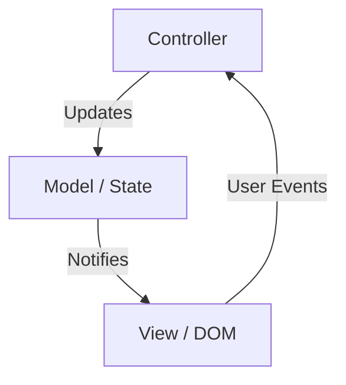
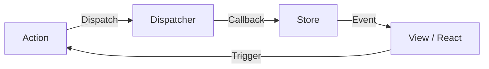
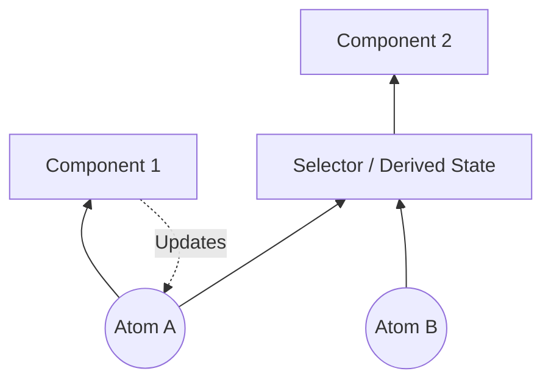
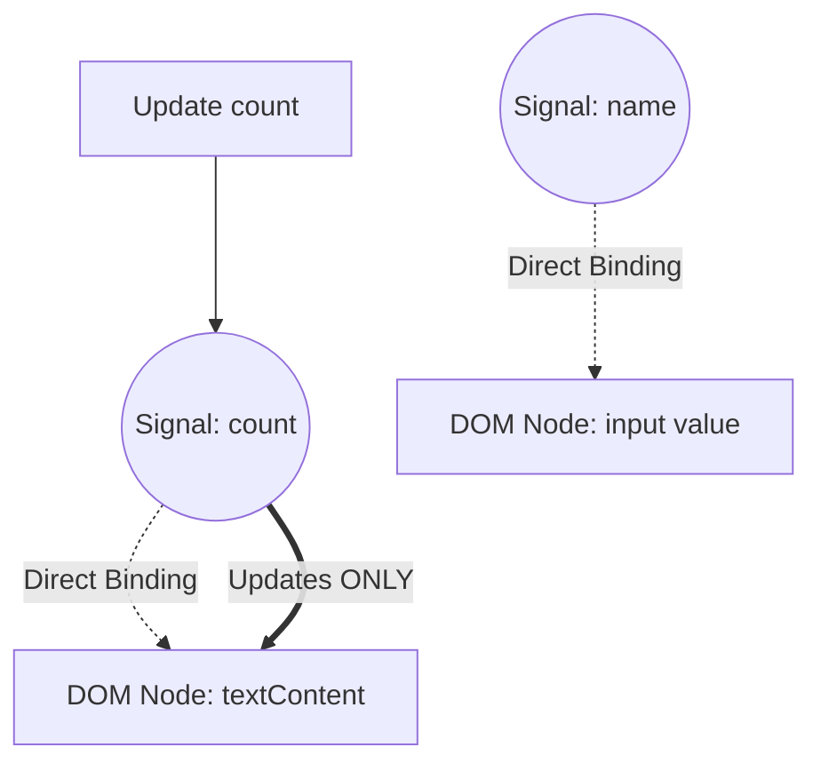

في مجال تطوير واجهات الويب الأمامية، تعتبر «إدارة الحالة ([State](https://kenji.blog/ar/p/iac-infrastructure-as-code-terraform/) Management)» المجال الأكثر إثارة للجدل والأكثر تطوراً. لقد تحولت تطبيقات الويب الحديثة من مجرد عرض للمستندات إلى برمجيات ذات تفاعلات معقدة تنافس تطبيقات سطح المكتب. وبالتالي، فإن كيفية إدارة حالة التطبيق ومزامنتها مع واجهة المستخدم (UI) أصبحت التحدي الأكبر الذي يواجه جميع مهندسي الواجهات الأمامية.

في هذا المقال، سنستعرض تاريخ إدارة الحالة في الواجهات الأمامية، والتحديات والحلول في كل عصر، ونتعمق بتفصيل في التحول النموذجي نحو المستقبل (وخاصة تطور Signals وReactivity).

## 1. ما هي إدارة الحالة؟ ولماذا هي القضية الأهم في الواجهات الأمامية؟

في البداية، ما هي «الحالة (State)»؟ في تطبيقات الويب، تشير الحالة إلى "أي بيانات تتغير بمرور الوقت وتؤثر على عرض واجهة المستخدم (UI)".

- معلومات المستخدم أو بيانات القوائم المستردة من الخادم
- النص المدخل في النماذج
- مؤشر (Flag) يوضح ما إذا كانت النافذة المنبثقة (Modal) مفتوحة أم مغلقة
- مسار URL الحالي أو وسائط الاستعلام (Query parameters)
- إعدادات المظهر سواء كان الوضع الداكن أو الفاتح

كل هذه تعتبر «حالة». كلما أصبح التطبيق أكثر تعقيداً، زادت هذه الحالات بشكل لا يحصى وأصبحت تعتمد على بعضها البعض.

### 1.1 واجهة المستخدم هي انعكاس للحالة

في عصر واجهة المستخدم التعريفية (Declarative UI)، يتم نمذجة واجهة المستخدم كدالة نقية (Pure function) تأخذ الحالة كمدخل. يمكن التعبير عن ذلك رياضياً كالتالي:

$ UI = f(State) $

هذه المعادلة البسيطة هي الفكرة الأساسية التي تقوم عليها أطر العمل الحديثة مثل React. إذا تغيرت الحالة $ State $، يتم إعادة تنفيذ (إعادة تصيير) الدالة $ f $، ويتم إنشاء $ UI $ جديد.
المهم هنا هو أن المطور لا يكتب أوامر حتمية (Imperative) حول "كيفية تغيير واجهة المستخدم (How)"، بل يكتب بشكل تعريفي "كيف يجب أن تكون الحالة، وكيف يجب أن تبدو واجهة المستخدم بناءً على ذلك (What)".

ومع ذلك، التطبيقات الواقعية ليست ثابتة. تتغير الحالة بناءً على إدخالات المستخدم $ Action $. بأخذ ذلك في الاعتبار، يمكن التعبير عن الحالة كدالة في الزمن $ t $ باستخدام علاقة التكرار التالية:

$ State_{t+1} = update(State_t, Action) $

بمعنى آخر، تكمن صعوبة إدارة الحالة في: **"كيفية الحفاظ على عدد لا يحصى من الحالات وتحديثها دون تعارض، ومزامنتها بكفاءة مع واجهة المستخدم فقط للأجزاء الضرورية وفي الوقت المناسب"** .

### 1.2 نطاق الحالة ودورة حياتها

عامل آخر يجعل إدارة الحالة صعبة هو أن لكل حالة «نطاق (Scope)» و«دورة حياة (Lifecycle)» مناسبين.

1.  **الحالة المحلية (Local State)**:
    حالة تقتصر على مكون معين فقط. على سبيل المثال، مؤشر فتح/إغلاق قائمة منسدلة (Accordion)، أو حالة التمرير (Hover) لزر. لا حاجة لإدارة هذه الحالات عالمياً.
2.  **الحالة العالمية (Global State)**:
    حالة تتم مشاركتها عبر التطبيق بأكمله، أو بين عدة مكونات متباعدة. على سبيل المثال، معلومات المستخدم المسجل دخوله، محتويات عربة التسوق، أو إعدادات مظهر واجهة المستخدم.
3.  **حالة الخادم (Server State)**:
    حالة مخزنة في قواعد بيانات الواجهة الخلفية (Backend)، يتم جلبها وتخزينها مؤقتاً (Cache) بشكل غير متزامن لعرضها في الواجهة الأمامية. لا يمكن التحكم فيها بالكامل من جانب العميل، وتتطلب إدارة معقدة مثل إبطال ذاكرة التخزين المؤقت (Invalidation) وإعادة الجلب (Re-fetching).

في تطوير الواجهات الأمامية قديماً، لم يتم التمييز بين هذه الحالات، مما أدى إلى انفجار في التعقيد وأصبح بيئة خصبة للأخطاء (Bugs). دعونا نتبع التاريخ لنرى كيف تم فصل وتنظيم هذه الحالات.

## 2. فترة البداية: عصر كان فيه DOM يحمل الحالة وjQuery

في تطوير الويب حوالي عام 2010، لم يكن مفهوم إدارة الحالة واضحاً بعد. في كثير من الأحيان، **كانت الحالة تُحفظ مباشرة في DOM (نموذج كائنات المستند)** .

```javascript
// إدارة الحالة في عصر jQuery (تخزين الحالة في DOM)
$('#toggle-button').on('click', function() {
    var $menu = $('#dropdown-menu');
    // سمة class في DOM تمثل الحالة
    if ($menu.hasClass('is-active')) {
        $menu.removeClass('is-active');
        $(this).text('Open');
    } else {
        $menu.addClass('is-active');
        $(this).text('Close');
    }
});
```

في هذا النهج، لمعرفة حالة واجهة المستخدم، كان عليك قراءة DOM مباشرة (تنفيذ استعلامات DOM). كانت البيانات (متغيرات JavaScript) والعرض (HTML/DOM) مرتبطة ارتباطاً وثيقاً، ومع نمو حجم التطبيق، أصبح من المستحيل تتبع أين وكيف يتم تعديل DOM، مما أدى إلى ما يسمى بـ "شفرة السباغيتي (Spaghetti code)" وهي حالة لا يمكن صيانتها.

## 3. بنية MVC وإيجابيات وسلبيات ربط البيانات ثنائي الاتجاه

كرد فعل على قيود jQuery، ظهرت أطر عمل تعتمد على بنى (Architectures) مثل MVC (Model-View-Controller) و MVVM (Model-View-ViewModel)، مثل Backbone.js و AngularJS.

أعظم ابتكار لهذه الأطر كان **فصل البيانات (Model) عن العرض (View)** .



كان «ربط البيانات ثنائي الاتجاه (Two-way Data Binding)» الذي اعتمدته AngularJS (Angular 1.x) ثورياً بشكل خاص. إذا تغيرت بيانات النموذج (Model)، يتم تحديث العرض (View) تلقائياً، وإذا تغير العرض (مثل نموذج إدخال)، يتم تحديث النموذج تلقائياً.

```html
<!-- ربط البيانات ثنائي الاتجاه في AngularJS -->
<input type="text" ng-model="user.name">
<p>Hello, {{ user.name }}!</p>
```

أدى هذا إلى تحرير المطورين من المعالجة المباشرة لـ DOM. ولكن عندما أصبحت التطبيقات أكبر حجماً، ظهرت مشكلة جديدة. وهي **«التحديثات المتتالية (Cascading updates)»** .

عندما يتم تحديث Model A، يتم تحديث View B، وتعديل View B يؤدي إلى تحديث Model C، والذي بدوره يحدّث View D... وهكذا تشابكت تدفقات البيانات بشكل معقد، وكثرت الأخطاء حيث تدخل التطبيقات في حلقات لا نهائية (Infinite loops) أو يتم تحديث واجهة المستخدم في أوقات غير متوقعة. أصبح من المستحيل التنبؤ "متى، ومن، وأي بيانات تم تغييرها".

## 4. ولادة React و [Flux](https://kenji.blog/ar/p/state-management-history-redux-context-recoil-zustand/): ثورة تدفق البيانات أحادي الاتجاه

في عام 2013، أطلقت Facebook (الآن Meta) مكتبة React. كانت React بحد ذاتها مكتبة لبناء واجهة المستخدم (حرف V في MVC)، ولكن في الوقت نفسه، اقترحوا نمطاً معمارياً جديداً وهو **Flux** .

الهدف الرئيسي لـ Flux كان القضاء على تعقيد ربط البيانات ثنائي الاتجاه في MVC، أي تحقيق **«تدفق البيانات أحادي الاتجاه (Unidirectional Data Flow)»** .



يحتوي معمار [Flux](https://kenji.blog/ar/p/state-management-history-redux-context-recoil-zustand/) على قواعد صارمة:

1.  **Action**: الطريقة الوحيدة لإجراء تغيير في النظام. كائن يوضح ما حدث.
2.  **Dispatcher**: المحور المركزي الذي يستقبل جميع Actions ويوزعها إلى Store.
3.  **Store**: المكان الذي يحتفظ بحالة التطبيق ومنطق الأعمال (Business logic). يقوم Store بتسجيل دوال رد النداء (Callbacks) مع Dispatcher، ويستقبل Actions لتحديث حالته.
4.  **View**: يتلقى الحالة من Store ويقوم بالتصيير (Rendering). يولد Actions جديدة استجابةً لتفاعلات المستخدم.

الشيء المهم هو أن **View لا يمكنه أبداً تعديل حالة Store مباشرة** . لتغيير الحالة، يجب دائماً إصدار Action والمرور عبر Dispatcher في دورة ذات اتجاه واحد. أدى ذلك إلى جعل تدفق البيانات قابلاً للتنبؤ (Predictable) بشكل كبير، وتحسين استقرار إدارة الحالة في التطبيقات واسعة النطاق بشكل جذري.

## 5. هيمنة [Redux](https://kenji.blog/ar/p/state-management-history-redux-context-recoil-zustand/) وحدودها

الذي قام بتحسين مفاهيم Flux ليصبح المعيار الفعلي (De facto standard) لإدارة الحالة في الواجهات الأمامية هو **Redux** ، الذي طوره Dan Abramov وآخرون في عام 2015.

أدخل Redux مفاهيم البرمجة الوظيفية (تحديداً معمار Elm) إلى تدفق البيانات أحادي الاتجاه الخاص بـ Flux.

### 5.1 المبادئ الثلاثة لـ Redux

يعتمد Redux على ثلاثة مبادئ صارمة:

1.  **مصدر وحيد للحقيقة (Single source of truth)**:
    يتم الاحتفاظ بحالة التطبيق بالكامل كشجرة كائنات داخل متجر (Store) واحد.
2.  **الحالة للقراءة فقط ([State](https://kenji.blog/ar/p/iac-infrastructure-as-code-terraform/) is read-only)**:
    الطريقة الوحيدة لتغيير الحالة هي إصدار (Dispatch) كائن Action يوضح ما حدث.
3.  **تتم التغييرات باستخدام دوال نقية (Changes are made with pure functions)**:
    لتحديد كيف يتم تغيير الحالة بواسطة Action، تكتب دوال نقية تسمى Reducers.

### 5.2 Reducer والدوال النقية

Reducer هو دالة نقية (Pure Function) تأخذ الحالة السابقة و Action، وتعيد حالة جديدة.

$ State_{new} = Reducer(State_{old}, Action) $

نظراً لأنها دالة نقية، فليس لها أي آثار جانبية (مثل استدعاءات API أو تعديلات DOM)، وتعيد دائماً نفس المخرجات لنفس المدخلات. بالإضافة إلى ذلك، يجب ألا تقوم بتعديل (Mutate) الحالة الممررة كوسيطة مباشرة، بل يجب دائماً إنشاء كائن حالة جديد وإعادته.

```javascript
// مثال على Redux Reducer
const initialState = { count: 0, loading: false };

function counterReducer(state = initialState, action) {
  switch (action.type) {
    case 'INCREMENT':
      // إرجاع كائن جديد دون تعديل الحالة مباشرة (Immutability)
      return { ...state, count: state.count + 1 };
    case 'DECREMENT':
      return { ...state, count: state.count - 1 };
    case 'SET_LOADING':
      return { ...state, loading: action.payload };
    default:
      return state;
  }
}
```

بفضل هذا المزيج من "عدم القابلية للتغيير (Immutability)" و "الدوال النقية"، حقق [Redux](https://kenji.blog/ar/p/state-management-history-redux-context-recoil-zustand/) ميزات قوية مثل تصحيح الأخطاء عبر السفر عبر الزمن (Time-travel debugging) والتحميل الساخن (Hot reloading). كان ذلك اختراقاً كبيراً من حيث تجربة المطور (DX).

### 5.3 تحديات Redux: جدار الشفرة المتكررة (Boilerplate)

كان Redux معماراً رائعاً، ولكن مع انتشاره، بدأ العديد من المطورين يشعرون بالاستياء. السبب الأكبر هو **«كثرة الشفرات المتكررة (Boilerplate)»** .

حتى بالنسبة لعملية بسيطة مثل زيادة رقم العداد، كان من الضروري إنشاء وتعديل الملفات التالية:
1. تعريف الثوابت لـ Action Type
2. إنشاء دوال Action Creator
3. الإضافة إلى جملة switch في Reducer
4. كتابة `mapStateToProps` و `mapDispatchToProps` في جانب المكون (قبل Hooks)

علاوة على ذلك، للتعامل مع العمليات غير المتزامنة (مثل اتصالات API)، كان من الضروري إدخال برمجيات وسيطة (Middleware) مثل `redux-thunk` أو `redux-saga`، مما رفع منحنى التعلم بشكل حاد.

تعالت الأصوات القائلة "أليس [Redux](https://kenji.blog/ar/p/state-management-history-redux-context-recoil-zustand/) مبالغاً فيه؟"، وبدأ البحث عن مناهج جديدة لإدارة الحالة.

## 6. [Context API](https://kenji.blog/ar/p/state-management-history-redux-context-recoil-zustand/) و Hooks وحركة «ما بعد Redux»

في عام 2018، تم تحديث Context API في React 16.3، ومن ثم تم تقديم **React Hooks** في React 16.8 عام 2019، مما شكل نقطة تحول كبرى في تاريخ إدارة الحالة.

### 6.1 مشاركة الحالة باستخدام الميزات المدمجة

باستخدام Context API، يمكنك تمرير البيانات مباشرة إلى المكونات الموجودة في طبقات عميقة من شجرة المكونات، دون الحاجة إلى تمرير الخصائص عبر كل مستوى (Prop Drilling).
علاوة على ذلك، من خلال دمجه مع الـ Hook المسمى `useReducer`، أصبح من الممكن تحقيق إدارة حالة مشابهة لـ [Redux](https://kenji.blog/ar/p/state-management-history-redux-context-recoil-zustand/) باستخدام الميزات المدمجة في React فقط.

```javascript
// إدارة الحالة باستخدام Context و useReducer
import React, { createContext, useContext, useReducer } from 'react';

const CountContext = createContext();

function countReducer(state, action) {
  switch (action.type) {
    case 'INCREMENT': return { count: state.count + 1 };
    default: return state;
  }
}

function CountProvider({ children }) {
  const [state, dispatch] = useReducer(countReducer, { count: 0 });
  return (
    <CountContext.Provider value={{ state, dispatch }}>
      {children}
    </CountContext.Provider>
  );
}

function CounterDisplay() {
  // جلب الحالة مباشرة من Context
  const { state } = useContext(CountContext);
  return <div>Count: {state.count}</div>;
}
```

أدى هذا إلى انتشار واسع لفكرة "لا حاجة لـ [Redux](https://kenji.blog/ar/p/state-management-history-redux-context-recoil-zustand/) للحالات العالمية البسيطة". ولكن، كان لهذا النهج فخ قاتل في الأداء.

### 6.2 مشكلة أداء [Context API](https://kenji.blog/ar/p/state-management-history-redux-context-recoil-zustand/) (إعادة التصيير الزائدة)

يحتوي Context API الخاص بـ React على خاصية: "عندما يتم تحديث قيمة Context، سيتم إعادة تصيير جميع المكونات التي تشترك في ذلك الـ Context (التي تستدعي `useContext`) بلا قيد أو شرط".

على سبيل المثال، إذا تمت مشاركة كائن ضخم مثل `{ user: {...}, theme: 'dark' }` عبر Context، فبمجرد تغيير `theme`، سيتم إعادة تصيير حتى المكونات التي تحتاج فقط إلى معلومات `user`.
لمنع ذلك، كان من الضروري تقسيم Context بشكل دقيق حسب الميزة، أو استخدام `React.memo` لعمل الذاكرة (Memoization)، مما أدى في النهاية إلى زيادة التعقيد.

نظراً لأن React يتبنى افتراضياً نموذج تصيير "من أعلى إلى أسفل (Top-down)"، برزت المشكلة الجوهرية المتمثلة في أن تغييرات الحالة العالمية تميل إلى التسبب في إعادة تصيير غير ضرورية للشجرة بأكملها.

## 7. فصل الحالة: Server [State](https://kenji.blog/ar/p/iac-infrastructure-as-code-terraform/) و Client State

في هذا الوقت تقريباً، حدث تحول نموذجي مهم في إدارة الحالة. وهو إدراك أنه "لا ينبغي وضع جميع الحالات في متجر عالمي (Global store) واحد".
بشكل خاص، البيانات المستردة من الخادم (Server State) لها طبيعة مختلفة جذرياً عن حالة واجهة المستخدم التي تكتمل في الواجهة الأمامية فقط (Client State).

- **Server State (حالة الخادم)**: يملكها الخادم. يتم جلبها بشكل غير متزامن. نظراً لأنها قد تتم مشاركتها وتعديلها من قبل عدة أشخاص، فهناك دائماً احتمال أن تصبح قديمة (Stale). تتطلب إدارة التخزين المؤقت (Cache)، والتحديث في الخلفية، وعمليات إعادة المحاولة.
- **Client State (حالة العميل)**: يملكها العميل (المتصفح). يتم تحديثها بشكل متزامن. مثل الوضع الداكن أو فتح/إغلاق نافذة منبثقة.

### 7.1 صعود React Query و SWR و [Apollo Client](https://kenji.blog/ar/p/graphql-vs-rest-api-overfetching-type-safety/)

أصبح من السائد فصل إدارة Server State عن [Redux](https://kenji.blog/ar/p/state-management-history-redux-context-recoil-zustand/) أو Context، وتركها لمكتبات مخصصة. هكذا ظهرت مكتبات مثل **React Query (الآن TanStack Query)** و **SWR**.

```javascript
// إدارة Server State باستخدام React Query
import { useQuery } from 'react-query';

function UserProfile({ userId }) {
  // الإدارة التلقائية للتخزين المؤقت، إعادة الجلب، حالة التحميل، وحالة الخطأ
  const { data, isLoading, error } = useQuery(['user', userId], fetchUser);

  if (isLoading) return <div>Loading...</div>;
  if (error) return <div>Error!</div>;

  return <div>Name: {data.name}</div>;
}
```

قامت هذه المكتبات بتجريد (Abstract) العملية المعقدة المتمثلة في "تخزين حالة الخادم محلياً ومزامنتها عند الضرورة".
ونتيجة لذلك، انخفضت كمية البيانات التي يجب إدارتها في مخازن عالمية مثل [Redux](https://kenji.blog/ar/p/state-management-history-redux-context-recoil-zustand/) إلى "حالات العميل النقية فقط" بشكل كبير، مما خفف من عبء إدارة الحالة بشكل هائل.

## 8. إدارة الحالة الذرية (Atomic [State](https://kenji.blog/ar/p/iac-infrastructure-as-code-terraform/) Management): [Recoil](https://kenji.blog/ar/p/state-management-history-redux-context-recoil-zustand/) و [Jotai](https://kenji.blog/ar/p/state-management-history-redux-context-recoil-zustand/)

بعد فصل Server State، بدأت منافسة جديدة حول كيفية إدارة ما تبقى من Client State بكفاءة.
لحل نموذج التصيير (من أعلى إلى أسفل) في React ومشاكل أداء [Context API](https://kenji.blog/ar/p/state-management-history-redux-context-recoil-zustand/)، ظهر نهج **إدارة الحالة الذرية (Atomic [State Management](https://kenji.blog/ar/p/state-management-history-redux-context-recoil-zustand/))** .

في عام 2020، تم الإعلان عن **Recoil** من قبل فريق Facebook، وبتأثير منه ظهرت مكتبات مثل **Jotai**.

### 8.1 إدارة الحالة من أسفل إلى أعلى (Bottom-up)

بينما يتبع [Redux](https://kenji.blog/ar/p/state-management-history-redux-context-recoil-zustand/) نهج "اقتطاع الأجزاء الضرورية من شجرة حالة واحدة ضخمة (من أعلى إلى أسفل)"، تتبع Recoil و Jotai نهج "إنشاء أصغر وحدات للحالة (Atoms)، وتجميعها لحقنها في شجرة المكونات (من أسفل إلى أعلى)".



الـ Atom هو وحدة حالة مستقلة. تشترك (Subscribe) المكونات فقط في الـ Atoms التي تحتاجها. عندما يتم تحديث Atom، يتم إعادة تصيير المكونات التي تشترك في هذا الـ Atom فقط بشكل دقيق. هذا يحل تماماً مشكلة إعادة التصيير غير الضرورية التي كان يعاني منها [Context API](https://kenji.blog/ar/p/state-management-history-redux-context-recoil-zustand/).

```javascript
// مثال على Atomic State باستخدام Jotai
import { atom, useAtom } from 'jotai';

// تعريف أصغر وحدة للحالة (Atom)
const priceAtom = atom(1000);
const taxRateAtom = atom(0.1);

// يمكن أيضاً تعريف حالة مشتقة (Derived State) من Atoms أخرى
const priceWithTaxAtom = atom((get) => {
  return get(priceAtom) * (1 + get(taxRateAtom));
});

function ProductDisplay() {
  const [priceWithTax] = useAtom(priceWithTaxAtom);
  // سيتم إعادة التصيير فقط في حالة تغيير priceAtom أو taxRateAtom
  return <div>Tax Included: ¥{priceWithTax}</div>;
}
```

نظراً لأن [Jotai](https://kenji.blog/ar/p/state-management-history-redux-context-recoil-zustand/) وغيرها يمكن استخدامها تقريباً بنفس شعور `useState` في React، فإن منحنى التعلم الخاص بها منخفض، وتتمتع بأداء عالٍ، مما يجعلها خياراً شائعاً جداً في تطبيقات React الحديثة.

## 9. الوكلاء (Proxies) وقابلية التغيير (Mutability): [Zustand](https://kenji.blog/ar/p/state-management-history-redux-context-recoil-zustand/) و Valtio

كتوجه قوي آخر، ظهرت مجموعة من المكتبات التي قللت من الشفرات المتكررة (Boilerplate) إلى الحد الأقصى ووفرت واجهات برمجة تطبيقات (APIs) أكثر بديهية. وهي **Zustand** و **Valtio**، اللتان طورتهما مجموعة Poimandres مفتوحة المصدر.

### 9.1 Zustand: بساطة [Flux](https://kenji.blog/ar/p/state-management-history-redux-context-recoil-zustand/) المطلقة

يتبنى Zustand، مثل [Redux](https://kenji.blog/ar/p/state-management-history-redux-context-recoil-zustand/)، متجراً واحداً (Flux Architecture)، ولكنه يلغي المفاهيم المعقدة مثل Reducer و Provider، ويوفر واجهة برمجة تطبيقات بسيطة جداً تعتمد على Hooks.

```javascript
// مثال على Zustand
import { create } from 'zustand';

// إنشاء المتجر. تعريف الحالة ودوال التحديث معاً
const useStore = create((set) => ({
  count: 0,
  increment: () => set((state) => ({ count: state.count + 1 })),
  removeAllBears: () => set({ count: 0 }),
}));

function Counter() {
  // استخراج الحالة المطلوبة فقط باستخدام Selector. هذا يمنع إعادة التصيير غير الضرورية.
  const count = useStore((state) => state.count);
  const increment = useStore((state) => state.increment);

  return <button onClick={increment}>{count}</button>;
}
```

أسس [Zustand](https://kenji.blog/ar/p/state-management-history-redux-context-recoil-zustand/) مكانته كـ "النسخة الحديثة من [Redux](https://kenji.blog/ar/p/state-management-history-redux-context-recoil-zustand/)"، التي تجمع بين متانة Redux وبساطة Hooks.

### 9.2 Valtio: إدارة الحالة القابلة للتغيير عبر Proxy

في عالم React، كان يُعتبر قاطِعاً كقاعدة "أن الحالة يجب أن تُعامل كغير قابلة للتغيير (Immutable)". ومع ذلك، فإن تحديث كائنات JavaScript بشكل غير قابل للتغيير يتطلب جهداً (خاصة إذا كانت متداخلة بعمق).

استخدم Valtio كائنات `Proxy` في ES6 لتحقيق أسلوب مبتكر يتمثل في "إجراء عمليات قابلة للتغيير (Mutable)، مع الحفاظ داخلياً على تحديثات الحالة والتفاعلية بشكل غير قابل للتغيير". هذا النهج قريب جداً من نظام التفاعلية (Reactivity) في Vue.js (Vue 3).

```javascript
// مثال على Valtio
import { proxy, useSnapshot } from 'valtio';

// كائن الحالة مغلف بـ Proxy
const state = proxy({ count: 0, user: { name: 'Alice' } });

// يمكن التعيين (التعديل) مباشرة كأنه متغير JavaScript عادي للتحديث
const increment = () => {
  state.count += 1;
};

function Counter() {
  // استخدام useSnapshot للاشتراك في الحالة. يكتشف فقط تغييرات الخصائص التي تم الوصول إليها.
  const snap = useSnapshot(state);
  return <button onClick={increment}>{snap.count}</button>;
}
```

يوفر Valtio أعلى مستوى من البديهية في تجربة التطوير. وهو نهج يفضله أيضاً المطورون المعتادون على Vue و Svelte عند استخدامهم لـ React.

## 10. التحول النموذجي: Signals والتفاعلية الدقيقة (Fine-grained Reactivity)

حالياً، أكبر الكلمات الطنانة (Buzzwords) في إدارة الحالة في الواجهات الأمامية هي **Signals** و **التفاعلية الدقيقة (Fine-grained Reactivity)** .

استخدم React نموذج DOM الافتراضي (Virtual DOM) الذي يعتمد على "إعادة تنفيذ دالة المكون لإنشاء شجرة واجهة مستخدم جديدة، ومقارنة الفروق (Diff) مع الشجرة السابقة لتحديث DOM".
في المقابل، تتبع أطر العمل التي تعتمد على Signals (مثل SolidJS، Vue 3، Svelte 5 (Runes)، Preact، Angular وغيرها) نهجاً مختلفاً تماماً.

### 10.1 ما هي Signals؟

الـ Signal هو آلية تحتفظ بقيمة تتغير بمرور الوقت، وتقوم تلقائياً بإعادة تنفيذ الدوال أو التعبيرات (Effects / Computed) التي تعتمد على تلك القيمة.

```javascript
// مثال على Signal في SolidJS
import { createSignal, createEffect } from "solid-js";

// إنشاء Signal. يتم إرجاع دالة القراءة (Getter) ودالة التعيين (Setter).
const [count, setCount] = createSignal(0);

// Effect (تأثير جانبي). يكتشف استدعاء count() ويسجل التبعية.
// عند تحديث count، يتم إعادة التنفيذ تلقائياً.
createEffect(() => {
  console.log("Count changed to:", count());
});

setCount(1); // سيعرض في وحدة التحكم (Console): "Count changed to: 1"
```

### 10.2 الفرق الحاسم مع React

الفرق الأكبر بين React (الـ DOM الافتراضي) و Signals (التفاعلية الدقيقة) هو **«دقة التحديث (Granularity of updates)»** .

في حالة React، عندما تتغير الحالة، يتم **إعادة تنفيذ المكون بأكمله** . يحتاج المطورون إلى إجراء تحسينات يدوية باستخدام `useMemo` و `useCallback` و `React.memo` ليقولوا "لا داعي لإعادة تصيير ما هو أسفل هذا".

من ناحية أخرى، في أطر العمل المعتمدة على Signals مثل SolidJS، **يتم تنفيذ دوال المكونات مرة واحدة فقط عند التهيئة (Initialization)** .
إذا تم استخدام قيمة Signal في القالب (Template)، يقوم إطار العمل ببناء علاقة تبعية مباشرة أثناء التجميع (Compilation) بمعنى "إذا تغير هذا الـ Signal، قم بتحديث عقدة DOM هذه (عقدة النص أو السمة) فقط".



بمعنى آخر، يتجاوز عبء حساب الفروق في الـ DOM الافتراضي، ويقوم بإعادة كتابة عقد الـ DOM التي تحتاج إلى تغيير مباشرة وبشكل جراحي (Fine-grained update). من خلال هذا، حقق أداءً هائلاً وتجربة مطور (DX) ممتازة حيث لا يحتاج المطور لإجراء التحسينات يدوياً.

### 10.3 النموذج الرياضي لـ Signals

ما يكمن وراء Signals هو نظرية "البرمجة التفاعلية (Reactive Programming)" التي تنمذج التبعيات بين الحالات والعمليات الحسابية كـ **رسم بياني موجه غير دوري (Directed Acyclic Graph: DAG)** وتحدد ترتيب التحديثات بكفاءة باستخدام الفرز الطوبولوجي (Topological sort).

إذا كانت حالة مشتقة (Computed) $ C $ تعتمد على Signals $ S_1, S_2 $، فسيتم تشكيل الحواف $ S_1 \to C $ و $ S_2 \to C $.
عند تحديث قيمة، من خلال تتبع الرسم البياني وتقييم العقد الضرورية فقط (مثل استراتيجية الدفع/السحب الهجينة (Push / Pull hybrid strategy))، يتم منع الخلل (Glitch: ظاهرة تُعرض فيها واجهة مستخدم غير متسقة في حالة وسيطة للحظة) ويضمن التناسق الطوبولوجي.

## 11. هجوم React المضاد: React Compiler (Forget)

كيف سترد React على صعود Signals؟ اختار فريق React نهجاً مختلفاً تماماً بدلاً من "إدخال Signals في React". وهو **React Compiler (الاسم الرمزي للتطوير: React Forget)** .

فلسفة React هي الحفاظ على نموذج بسيط من البرمجة الوظيفية حيث "واجهة المستخدم هي دالة للحالة". ومع ذلك، لتشغيل هذا النموذج بأداء عالٍ، كان على المطورين إجراء الذاكرة يدوياً (`useMemo`, `useCallback`).

يقوم React Compiler بتحليل شفرة مكونات React بشكل ثابت (Static analysis) أثناء وقت البناء (Build time)، ويقوم **بإدراج شفرة الذاكرة الضرورية تلقائياً** .

بعبارة أخرى، لا يحتاج المطورون إلى تعلم واجهات برمجة تطبيقات جديدة لـ Signals، ولا كتابة `useMemo` يدوياً، بل يكتبون JavaScript بطريقة مباشرة، وسيقوم المترجم (Compiler) في الخلفية بتطبيق تحسينات قريبة من التحديثات الدقيقة. هذا مشروع طموح جداً من حيث "تحسين الأداء دون الإضرار بتجربة المطور".

## 12. نموذج الجيل القادم: الابتعاد عن Hydration والـ Resumability

أخيراً، ما لا يمكن التغاضي عنه في مستقبل إدارة الحالة هو تحدي «Hydration» في الترابط بين تصيير جانب الخادم (SSR) وجانب العميل.

في التصيير من جانب الخادم التقليدي (مثل Next.js)، بعد إرسال HTML المولد على الخادم إلى المتصفح، كانت هناك حاجة إلى عملية ثقيلة تسمى "Hydration" حيث يتم تحميل وتنفيذ JavaScript في المتصفح، وإرفاق مستمعي الأحداث (Event listeners)، وإعادة بناء الحالة. خلال هذا الوقت، يتم حظر تفاعلات المستخدم.

قامت أطر العمل من الجيل القادم مثل **Qwik** بإعادة التفكير جذرياً في إدارة الحالة وتحميل JavaScript. لقد اقترحوا مفهوم **«القابلية للاستئناف (Resumability)»** .

يتم تسلسل (Serialize) الحالة المصيرة على الخادم وتضمينها داخل HTML، وفي العميل لا يتم "بدء (Boot)" تنفيذ JavaScript من الصفر، بل يتم "استئنافه (Resume)" من الحالة التي توقف عندها الخادم. يؤدي ذلك إلى تقليل حجم JavaScript في التحميل الأولي إلى الحد极 الأقصى، ويجعل الحمل الزائد (Overhead) لـ Hydration صفراً.

## 13. الخلاصة: إلى أين تتجه إدارة الحالة؟

بدءاً من فوضى MVC، إلى اكتساب القابلية للتنبؤ بواسطة [Flux](https://kenji.blog/ar/p/state-management-history-redux-context-recoil-zustand/)/[Redux](https://kenji.blog/ar/p/state-management-history-redux-context-recoil-zustand/)، والتبسيط من خلال Hooks، وفصل Server [State](https://kenji.blog/ar/p/iac-infrastructure-as-code-terraform/)، وتحسين الكفاءة عبر Atomic و Proxy، وصولاً إلى التفاعلية الدقيقة باستخدام Signals.

بالنظر إلى تاريخ إدارة الحالة في الواجهات الأمامية على مدار حوالي 15 عاماً، يظهر اتجاه واحد واضح. وهو **"التطور نحو تقليل الشفرات المتكررة (Boilerplate)، وتقليل العبء المعرفي على المطورين، بينما يقوم النظام في الخلفية (إطار العمل أو المترجم) بتحسين الأداء تلقائياً"** .

- **تطوير React على نطاق صغير إلى متوسط**: [Jotai](https://kenji.blog/ar/p/state-management-history-redux-context-recoil-zustand/) و [Zustand](https://kenji.blog/ar/p/state-management-history-redux-context-recoil-zustand/) غالباً ما تكون الحلول المثلى.
- **التطوير الذي يتضمن جلب البيانات**: أدوات إدارة Server State مثل TanStack Query ضرورية.
- **المشاريع الجديدة التي تتطلب أداءً فائقاً و DX عالياً**: أطر العمل التي تعتمد على Signals مثل SolidJS و Vue جذابة للغاية.
- **مستقبل React**: مع نضج React Compiler، سيتم حل العديد من مشاكل أداء إدارة الحالة عن طريق الأتمتة.

لا توجد "رصاصة فضية (Silver bullet)". ولكن من خلال فهم تاريخ كيفية حل تحديات الماضي، يمكننا اختيار المعمار الأكثر ملاءمة والذي يتطلع إلى المستقبل لمشاريعنا الحالية. سيستمر تطور إدارة الحالة في إثارة حماسنا نحن مهندسي الواجهات الأمامية في المستقبل.
