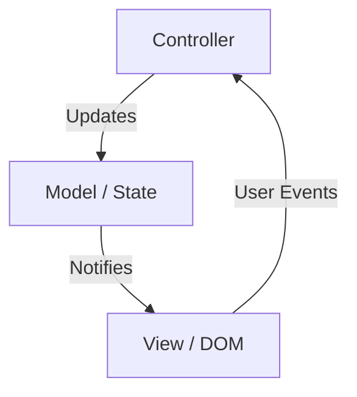
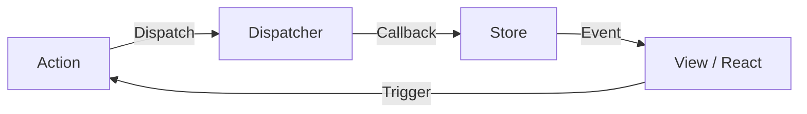
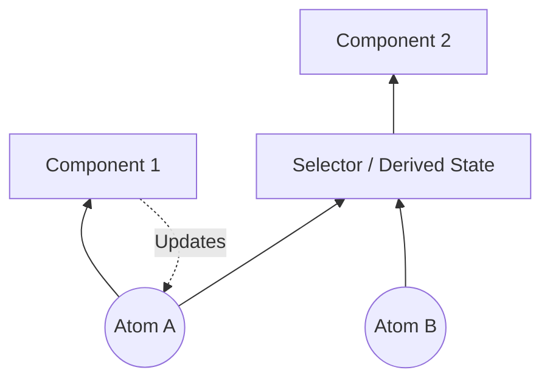
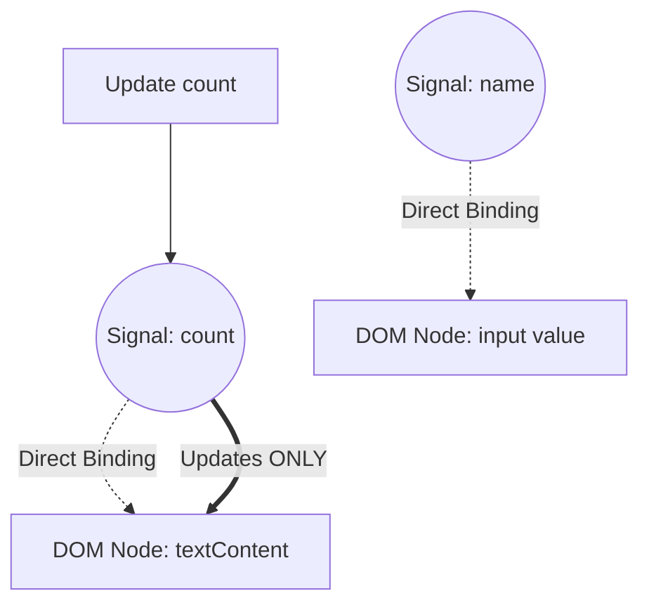

In der Web-Frontend-Entwicklung ist der am meisten diskutierte und sich am stärksten entwickelnde Bereich das "[State](https://kenji.blog/de/p/iac-infrastructure-as-code-terraform/) Management" ([Zustand](https://kenji.blog/de/p/state-management-history-redux-context-recoil-zustand/)sverwaltung). Moderne Webanwendungen haben sich von einfachen Dokumentenanzeigen zu Software mit komplexen Interaktionen entwickelt, die Desktop-Anwendungen in nichts nachstehen. Dementsprechend ist die Frage, wie der Zustand einer Anwendung verwaltet und mit der Benutzeroberfläche (UI) synchronisiert wird, zur größten Herausforderung für jeden Frontend-Ingenieur geworden.

In diesem Artikel werden wir auf die Geschichte des [State Management](https://kenji.blog/de/p/state-management-history-redux-context-recoil-zustand/)s im Frontend zurückblicken, die Herausforderungen und Lösungen jeder Epoche betrachten und einen tiefen, detaillierten Blick auf den Paradigmenwechsel (insbesondere die Entwicklung von Signals und Reactivity) werfen, der auf die Zukunft ausgerichtet ist.

## 1. Was ist State Management? Warum ist es das wichtigste Thema im Frontend?

Was genau ist überhaupt ein "State" (Zustand)? In Webanwendungen bezieht sich der Zustand auf "alle Daten, die sich im Laufe der Zeit ändern und die Anzeige der Benutzeroberfläche (UI) beeinflussen".

- Vom Server abgerufene Benutzerinformationen oder Listendaten
- In Formulare eingegebener Text
- Flags, die anzeigen, ob ein Modal-Fenster geöffnet oder geschlossen ist
- Der aktuelle URL-Pfad oder Abfrageparameter (Query-Parameter)
- Theme-Einstellungen, ob Dark Mode oder Light Mode aktiv ist

All dies ist "Zustand". Je komplexer eine Anwendung wird, desto zahlreicher und voneinander abhängiger werden diese Zustände.

### 1.1 Die UI ist ein Abbild des Zustands

Im Zeitalter der deklarativen UI (Declarative UI) wird die UI als reine Funktion modelliert, die den Zustand als Eingabe erhält. Als mathematische Formel ausgedrückt, sieht das so aus:

$ UI = f(State) $

Diese einfache Formel ist das Kernkonzept moderner Frameworks wie React. Wenn sich der Zustand $ State $ ändert, wird die Funktion $ f $ erneut ausgeführt (Re-Rendering) und eine neue $ UI $ generiert.
Wichtig dabei ist, dass Entwickler nicht mehr imperativ beschreiben, "wie die UI geändert werden soll" (How), sondern deklarativ beschreiben, "wie der Zustand sein sollte und wie die UI dementsprechend aussehen sollte" (What).

Allerdings sind reale Anwendungen nicht statisch. Der Zustand ändert sich durch die Eingabe (Action) des Benutzers. Berücksichtigt man dies, kann der Zustand als Funktion der Zeit $ t $ mit der folgenden Rekursionsformel ausgedrückt werden:

$ State_{t+1} = update(State_t, Action) $

Das bedeutet, die Schwierigkeit des State Managements lässt sich auf folgenden Punkt zusammenfassen: **"Wie man die unzähligen Zustände konsistent hält, aktualisiert und effizient nur die benötigten Teile zum richtigen Zeitpunkt mit der UI synchronisiert."**

### 1.2 Gültigkeitsbereich (Scope) und Lebenszyklus des Zustands

Ein weiterer Faktor, der das State Management schwierig macht, ist die Tatsache, dass jeder Zustand seinen eigenen angemessenen "Gültigkeitsbereich" (Scope) und "Lebenszyklus" hat.

1.  **Local State (Lokaler Zustand)**:
    Zustand, der nur innerhalb einer bestimmten Komponente existiert. Beispiele sind das Öffnen/Schließen-Flag eines Akkordeon-Menüs oder der Hover-Status eines Buttons. Diese müssen nicht global verwaltet werden.
2.  **Global State (Globaler Zustand)**:
    Zustand, der über die gesamte Anwendung hinweg oder zwischen mehreren entfernten Komponenten geteilt wird. Beispiele sind Informationen zum angemeldeten Benutzer, der Inhalt des Warenkorbs oder die Theme-Einstellungen der UI.
3.  **Server State (Server-Zustand)**:
    Zustand, der in der Backend-Datenbank gespeichert ist und vom Frontend asynchron abgerufen und im Cache angezeigt wird. Dies kann nicht vollständig vom Client kontrolliert werden und erfordert ein komplexes Management wie die Cache-Invalidierung (Invalidation) und das erneute Abrufen (Re-fetching).

In der früheren Frontend-Entwicklung wurden diese Zustände oft unterschiedslos behandelt, was zu einer Explosion der Komplexität und zu einer Quelle von Bugs führte. Lassen Sie uns einen Blick in die Geschichte werfen, um zu sehen, wie diese Zustände im Laufe der Zeit getrennt und organisiert wurden.

## 2. Die Anfangszeit: Als das DOM noch Zustand hatte und jQuery

Rund um das Jahr 2010 gab es in der Webentwicklung noch kein klares Konzept für State Management. In vielen Fällen **wurde der Zustand direkt im DOM (Document Object Model) selbst gehalten**.

```javascript
// State Management in der jQuery-Ära (Zustand im DOM gespeichert)
$('#toggle-button').on('click', function() {
    var $menu = $('#dropdown-menu');
    // Das class-Attribut des DOM repräsentiert den Zustand
    if ($menu.hasClass('is-active')) {
        $menu.removeClass('is-active');
        $(this).text('Open');
    } else {
        $menu.addClass('is-active');
        $(this).text('Close');
    }
});
```

Bei diesem Ansatz musste das DOM direkt ausgelesen (eine DOM-Abfrage durchgeführt) werden, um den [Zustand](https://kenji.blog/de/p/state-management-history-redux-context-recoil-zustand/) der UI zu kennen. Daten (JavaScript-Variablen) und die Ansicht (HTML/DOM) waren eng gekoppelt, und als die Anwendungen größer wurden, war es unmöglich nachzuverfolgen, wo und wie das DOM geändert wurde, was zu einem unwartbaren Zustand führte, der als "Spaghetti-Code" bekannt ist.

## 3. Die Vor- und Nachteile der MVC-Architektur und des Two-Way Data Bindings

Aus der Kritik an den Grenzen von jQuery entstanden Frameworks wie Backbone.js und AngularJS, die Architekturen wie MVC (Model-View-Controller) oder MVVM (Model-View-ViewModel) verwendeten.

Die größte Erfindung dieser Frameworks war **die Trennung von Daten (Model) und Anzeige (View)**.



Besonders das von AngularJS (Angular 1.x) eingeführte "Two-way Data Binding" (Zwei-Wege-Datenbindung) war revolutionär. Wenn sich die Daten des Models änderten, wurde die View automatisch aktualisiert, und wenn sich die View (z. B. ein Eingabeformular) änderte, wurde automatisch das Model aktualisiert.

```html
<!-- Two-way Data Binding in AngularJS -->
<input type="text" ng-model="user.name">
<p>Hello, {{ user.name }}!</p>
```

Dadurch wurden Entwickler von der direkten DOM-Manipulation befreit. Als die Anwendungen jedoch größer wurden, entstand ein neues Problem: **"Kaskadierende Updates" (Kettenaktualisierungen)**.

Wenn Model A aktualisiert wurde, wurde View B aktualisiert, die Änderung in View B aktualisierte Model C, was wiederum View D aktualisierte... so verflocht sich der Datenfluss auf komplexe Weise, was häufig zu Endlosschleifen oder unvorhersehbaren UI-Updates führte. Es war unmöglich vorherzusagen, "wann, wer, welche Daten geändert hatte".

## 4. Die Geburt von React und [Flux](https://kenji.blog/de/p/state-management-history-redux-context-recoil-zustand/): Die Revolution des Unidirectional Data Flow

2013 veröffentlichte Facebook (jetzt Meta) React. React selbst war nur eine Bibliothek zum Aufbau der UI (das V in MVC), aber gleichzeitig stellten sie ein neues Architekturmuster namens **Flux** vor.

Das Hauptziel von Flux war es, die Komplexität des Two-Way Data Bindings in MVC zu beseitigen, also einen **"Unidirectional Data Flow" (Einweg-Datenfluss)** zu realisieren.



Die [Flux](https://kenji.blog/de/p/state-management-history-redux-context-recoil-zustand/)-Architektur hat strenge Regeln:

1.  **Action**: Der einzige Weg, Änderungen im System vorzunehmen. Ein Objekt, das anzeigt, was passiert ist.
2.  **Dispatcher**: Der zentrale Hub, der alle Actions empfängt und an die Stores verteilt.
3.  **Store**: Der Ort, der den Anwendungszustand und die Geschäftslogik enthält. Der Store registriert Callbacks beim Dispatcher, empfängt Actions und aktualisiert seinen eigenen [Zustand](https://kenji.blog/de/p/state-management-history-redux-context-recoil-zustand/).
4.  **View**: Empfängt den Zustand vom Store und rendert ihn. Generiert neue Actions basierend auf Benutzerinteraktionen.

Wichtig ist, dass **die View den Zustand des Stores niemals direkt ändern kann**. Um den Zustand zu ändern, muss man den Einbahnstraßen-Zyklus durchlaufen, bei dem immer eine Action ausgegeben und über den Dispatcher geleitet wird. Dies machte den Datenfluss extrem vorhersehbar (Predictable) und verbesserte die Stabilität des [State](https://kenji.blog/de/p/iac-infrastructure-as-code-terraform/) Managements in großen Anwendungen dramatisch.

## 5. Die Vorherrschaft und Grenzen von [Redux](https://kenji.blog/de/p/state-management-history-redux-context-recoil-zustand/)

**Redux**, das 2015 von Dan Abramov und anderen entwickelt wurde, verfeinerte das [Flux](https://kenji.blog/de/p/state-management-history-redux-context-recoil-zustand/)-Konzept weiter und wurde zum De-facto-Standard für das [State Management](https://kenji.blog/de/p/state-management-history-redux-context-recoil-zustand/) im Frontend.

Redux brachte Konzepte der funktionalen Programmierung (insbesondere die Elm-Architektur) in den unidirektionalen Datenfluss von Flux ein.

### 5.1 Die 3 Prinzipien von Redux

Redux basiert auf den folgenden drei strengen Prinzipien:

1.  **Single source of truth (Eine einzige Wahrheitsquelle)**:
    Der gesamte Anwendungszustand wird als Objektbaum in einem einzigen Store gehalten.
2.  **State is read-only ([Zustand](https://kenji.blog/de/p/state-management-history-redux-context-recoil-zustand/) ist schreibgeschützt)**:
    Der einzige Weg, den Zustand zu ändern, besteht darin, ein Action-Objekt auszugeben (Dispatch), das beschreibt, was passiert ist.
3.  **Changes are made with pure functions (Änderungen werden mit reinen Funktionen vorgenommen)**:
    Um festzulegen, wie der Zustand durch Actions transformiert wird, schreibt man reine Funktionen, die als Reducer bezeichnet werden.

### 5.2 Reducer und reine Funktionen

Ein Reducer ist eine reine Funktion (Pure Function), die den vorherigen Zustand und eine Action entgegennimmt und den neuen Zustand zurückgibt.

$ State_{new} = Reducer(State_{old}, Action) $

Da es sich um reine Funktionen handelt, haben sie keine Seiteneffekte (wie API-Aufrufe oder DOM-Änderungen) und liefern für dieselben Eingaben immer dieselben Ausgaben. Außerdem darf der als Argument übergebene Zustand nicht direkt verändert (mutiert) werden; es muss immer ein neues Zustandsobjekt erstellt und zurückgegeben werden.

```javascript
// Beispiel für einen Redux-Reducer
const initialState = { count: 0, loading: false };

function counterReducer(state = initialState, action) {
  switch (action.type) {
    case 'INCREMENT':
      // Den Zustand nicht direkt ändern, sondern ein neues Objekt zurückgeben (Immutability)
      return { ...state, count: state.count + 1 };
    case 'DECREMENT':
      return { ...state, count: state.count - 1 };
    case 'SET_LOADING':
      return { ...state, loading: action.payload };
    default:
      return state;
  }
}
```

Die Kombination aus dieser "Immutability" (Unveränderlichkeit) und den "reinen Funktionen" ermöglichte leistungsstarkes Time-Travel-Debugging (Zurückspulen zu früheren Zuständen) und Hot Reloading. Dies war ein großer Durchbruch in Bezug auf die Developer Experience (DX).

### 5.3 Das Problem mit [Redux](https://kenji.blog/de/p/state-management-history-redux-context-recoil-zustand/): Die Boilerplate-Mauer

Redux war eine großartige Architektur, aber als es immer beliebter wurde, äußerten viele Entwickler Unzufriedenheit. Der Hauptgrund war **"zu viel Boilerplate (Standardcode)"**.

Selbst für einen einfachen Prozess wie das Hochzählen einer Zahl musste man die folgenden Dateien erstellen oder bearbeiten:
1. Definition von Konstanten für den Action Type
2. Erstellung einer Action-Creator-Funktion
3. Hinzufügen einer case-Anweisung im Reducer
4. Schreiben von `mapStateToProps` und `mapDispatchToProps` in der Komponente (vor Hooks)

Um asynchrone Prozesse (wie API-Kommunikation) zu handhaben, musste man zudem Middleware wie `redux-thunk` oder `redux-saga` einführen, wodurch die Lernkurve steil anstieg.

Stimmen wurden laut, die fragten: "Ist [Redux](https://kenji.blog/de/p/state-management-history-redux-context-recoil-zustand/) nicht ein Overkill?", und die Suche nach neuen Ansätzen für das [State](https://kenji.blog/de/p/iac-infrastructure-as-code-terraform/) Management begann.

## 6. [Context API](https://kenji.blog/de/p/state-management-history-redux-context-recoil-zustand/) und Hooks: Die Bewegung "Weg von [Redux](https://kenji.blog/de/p/state-management-history-redux-context-recoil-zustand/)"

Die Erneuerung der Context API in React 16.3 (2018) und die Einführung von **React Hooks** in React 16.8 (2019) waren wichtige Wendepunkte in der Geschichte des [State Management](https://kenji.blog/de/p/state-management-history-redux-context-recoil-zustand/)s.

### 6.1 Statusfreigabe mit integrierten Funktionen

Die Context API ermöglicht es, Daten direkt an Komponenten tief unten im Komponentenbaum weiterzugeben, ohne Prop-Drilling (das Weiterreichen von Props durch jede Ebene) betreiben zu müssen.
Durch die Kombination mit dem `useReducer` Hook wurde es möglich, ein [Redux](https://kenji.blog/de/p/state-management-history-redux-context-recoil-zustand/)-ähnliches [State](https://kenji.blog/de/p/iac-infrastructure-as-code-terraform/) Management allein mit den integrierten Funktionen von React zu realisieren.

```javascript
// State Management mit Context und useReducer
import React, { createContext, useContext, useReducer } from 'react';

const CountContext = createContext();

function countReducer(state, action) {
  switch (action.type) {
    case 'INCREMENT': return { count: state.count + 1 };
    default: return state;
  }
}

function CountProvider({ children }) {
  const [state, dispatch] = useReducer(countReducer, { count: 0 });
  return (
    <CountContext.Provider value={{ state, dispatch }}>
      {children}
    </CountContext.Provider>
  );
}

function CounterDisplay() {
  // Zustand direkt aus dem Context abrufen
  const { state } = useContext(CountContext);
  return <div>Count: {state.count}</div>;
}
```

Dadurch verbreitete sich die Erkenntnis: "Für einfache globale Zustände ist [Redux](https://kenji.blog/de/p/state-management-history-redux-context-recoil-zustand/) nicht erforderlich". Dieser Ansatz hatte jedoch eine fatale Leistungsfalle.

### 6.2 Leistungsprobleme der [Context API](https://kenji.blog/de/p/state-management-history-redux-context-recoil-zustand/) (Extra Re-renders)

Eine Eigenschaft der React Context API ist, dass "wenn der Wert des Contexts aktualisiert wird, alle Komponenten, die diesen Context abonniert haben (die `useContext` aufrufen), bedingungslos neu gerendert werden".

Wenn man zum Beispiel ein riesiges Objekt wie `{ user: {...}, theme: 'dark' }` über den Context teilt und sich nur das `theme` ändert, werden auch Komponenten, die nur die `user`-Informationen benötigen, neu gerendert.
Um dies zu verhindern, muss man den Context entweder in kleinere Funktionen aufteilen oder intensiv `React.memo` zur Memoisierung verwenden, was die Komplexität eher noch erhöht.

Da React standardmäßig ein "Top-Down"-Renderingmodell verwendet, wurde deutlich, dass globale Statusänderungen tendenziell zu unnötigem Re-Rendering des gesamten Baums führen – ein fundamentales Problem.

## 7. Trennung der Zustände: Server [State](https://kenji.blog/de/p/iac-infrastructure-as-code-terraform/) und Client State

Zu dieser Zeit fand ein wichtiger Paradigmenwechsel im [State Management](https://kenji.blog/de/p/state-management-history-redux-context-recoil-zustand/) statt. Es war die Erkenntnis: "Nicht jeder [Zustand](https://kenji.blog/de/p/state-management-history-redux-context-recoil-zustand/) sollte in einem einzigen globalen Store gespeichert werden".
Insbesondere Daten, die vom Server abgerufen werden (Server State), haben grundlegend andere Eigenschaften als UI-Zustände (Client State), die ausschließlich im Frontend existieren.

- **Server State**: Gehört dem Server. Wird asynchron abgerufen. Kann von mehreren Personen geteilt und geändert werden, sodass er potenziell veraltet (Stale) sein kann. Erfordert Cache-Management, Hintergrundaktualisierungen und Retry-Logik.
- **Client State**: Gehört dem Client (Browser). Wird synchron aktualisiert. Beispiele sind Dark Mode oder das Öffnen/Schließen von Modals.

### 7.1 Der Aufstieg von React Query, SWR und [Apollo Client](https://kenji.blog/de/p/graphql-vs-rest-api-overfetching-type-safety/)

Es wurde üblich, das Management des Server States von [Redux](https://kenji.blog/de/p/state-management-history-redux-context-recoil-zustand/) oder Context zu trennen und speziellen Bibliotheken zu überlassen. Dies war die Geburtsstunde von **React Query (jetzt TanStack Query)** und **SWR**.

```javascript
// Verwaltung von Server State mit React Query
import { useQuery } from 'react-query';

function UserProfile({ userId }) {
  // Caching, Refetching, Ladezustände und Fehlerzustände werden automatisch verwaltet
  const { data, isLoading, error } = useQuery(['user', userId], fetchUser);

  if (isLoading) return <div>Loading...</div>;
  if (error) return <div>Error!</div>;

  return <div>Name: {data.name}</div>;
}
```

Diese Bibliotheken abstrahierten den komplexen Prozess, "den [Zustand](https://kenji.blog/de/p/state-management-history-redux-context-recoil-zustand/) des Servers lokal im Cache zu speichern und ihn bei Bedarf zu synchronisieren".
Infolgedessen reduzierten sich die Daten, die in einem globalen Store wie [Redux](https://kenji.blog/de/p/state-management-history-redux-context-recoil-zustand/) verwaltet werden mussten, drastisch auf "nur noch reine Client-Zustände", was den Aufwand für das [State](https://kenji.blog/de/p/iac-infrastructure-as-code-terraform/) Management erheblich verringerte.

## 8. Atomic [State Management](https://kenji.blog/de/p/state-management-history-redux-context-recoil-zustand/): Recoil und [Jotai](https://kenji.blog/de/p/state-management-history-redux-context-recoil-zustand/)

Nach der Abspaltung des Server States begann ein neuer Wettbewerb darum, wie der verbleibende Client State am effizientesten verwaltet werden kann.
Das **Atomic State Management** entstand als Lösung für das (Top-Down-)Rendering-Modell von React und die Leistungsprobleme der [Context API](https://kenji.blog/de/p/state-management-history-redux-context-recoil-zustand/).

Im Jahr 2020 kündigte das Facebook-Team **Recoil** an, und bald darauf tauchten davon inspirierte Bibliotheken wie **Jotai** auf.

### 8.1 Bottom-Up State Management

Während [Redux](https://kenji.blog/de/p/state-management-history-redux-context-recoil-zustand/) einen "Top-Down"-Ansatz verfolgt ("Aus einem einzigen, riesigen [Zustand](https://kenji.blog/de/p/state-management-history-redux-context-recoil-zustand/)sbaum die benötigten Teile herausschneiden"), verwenden Recoil und Jotai einen "Bottom-Up"-Ansatz ("Erstellen der kleinsten Zustandseinheiten (Atome) und Kombinieren dieser zur Injektion in den Komponentenbaum").



Ein Atom ist eine unabhängige [Zustand](https://kenji.blog/de/p/state-management-history-redux-context-recoil-zustand/)seinheit. Komponenten abonnieren (Subscribe) nur die Atome, die sie benötigen. Wenn ein Atom aktualisiert wird, werden gezielt nur die Komponenten neu gerendert, die dieses Atom abonniert haben. Dadurch wird das Problem des unnötigen Re-Renderings, das die [Context API](https://kenji.blog/de/p/state-management-history-redux-context-recoil-zustand/) hatte, vollständig gelöst.

```javascript
// Beispiel für Atomic State mit Jotai
import { atom, useAtom } from 'jotai';

// Die kleinste Zustandseinheit (Atom) definieren
const priceAtom = atom(1000);
const taxRateAtom = atom(0.1);

// Abgeleitete Zustände (Derived State) von anderen Atomen können ebenfalls definiert werden
const priceWithTaxAtom = atom((get) => {
  return get(priceAtom) * (1 + get(taxRateAtom));
});

function ProductDisplay() {
  const [priceWithTax] = useAtom(priceWithTaxAtom);
  // Wird nur neu gerendert, wenn sich priceAtom oder taxRateAtom ändert
  return <div>Tax Included: ¥{priceWithTax}</div>;
}
```

Da sich Bibliotheken wie [Jotai](https://kenji.blog/de/p/state-management-history-redux-context-recoil-zustand/) fast genauso anfühlen wie Reacts `useState`, eine geringe Lernkurve haben und sehr performant sind, sind sie in modernen React-Anwendungen zu äußerst beliebten Optionen geworden.

## 9. Proxies und Mutabilität: [Zustand](https://kenji.blog/de/p/state-management-history-redux-context-recoil-zustand/) und Valtio

Als weitere starke Strömung tauchten Bibliotheken auf, die Boilerplate auf ein absolutes Minimum reduzierten und intuitivere APIs boten. Dazu gehören **Zustand** und **Valtio**, entwickelt vom OSS-Kollektiv Poimandres.

### 9.1 Zustand: [Flux](https://kenji.blog/de/p/state-management-history-redux-context-recoil-zustand/) auf die Spitze der Einfachheit getrieben

Zustand verwendet genau wie [Redux](https://kenji.blog/de/p/state-management-history-redux-context-recoil-zustand/) einen einzigen Store (Flux-Architektur), verzichtet aber auf komplexe Konzepte wie Reducer und Provider und bietet stattdessen eine extrem einfache, auf Hooks basierende API.

```javascript
// Beispiel für Zustand
import { create } from 'zustand';

// Erstellen des Stores. Zustand und Aktualisierungsfunktionen werden zusammen definiert
const useStore = create((set) => ({
  count: 0,
  increment: () => set((state) => ({ count: state.count + 1 })),
  removeAllBears: () => set({ count: 0 }),
}));

function Counter() {
  // Mit Selektoren nur den benötigten Zustand extrahieren. Unnötiges Re-Rendern wird verhindert.
  const count = useStore((state) => state.count);
  const increment = useStore((state) => state.increment);

  return <button onClick={increment}>{count}</button>;
}
```

[Zustand](https://kenji.blog/de/p/state-management-history-redux-context-recoil-zustand/) hat sich als "modernes [Redux](https://kenji.blog/de/p/state-management-history-redux-context-recoil-zustand/)" etabliert, das die Robustheit von Redux mit der Einfachheit von Hooks verbindet.

### 9.2 Valtio: Mutables [State](https://kenji.blog/de/p/iac-infrastructure-as-code-terraform/) Management mit Proxies

In der React-Welt galt lange die absolute Regel: "[Zustand](https://kenji.blog/de/p/state-management-history-redux-context-recoil-zustand/) sollte immer unveränderlich (immutable) behandelt werden." Allerdings ist es mühsam, JavaScript-Objekte immutable zu aktualisieren (besonders wenn sie tief verschachtelt sind).

Valtio nutzt das ES6 `Proxy`-Objekt für einen bahnbrechenden Ansatz: "Direkte, mutable (veränderbare) Operationen durchführen, während intern immutable [Zustand](https://kenji.blog/de/p/state-management-history-redux-context-recoil-zustand/)saktualisierungen und Reaktivität sichergestellt werden." Dieser Ansatz ist dem Reactivity-System von Vue.js (Vue 3) sehr ähnlich.

```javascript
// Beispiel für Valtio
import { proxy, useSnapshot } from 'valtio';

// Mit einem Proxy verpacktes Zustandsobjekt
const state = proxy({ count: 0, user: { name: 'Alice' } });

// Kann wie eine normale JavaScript-Variable direkt zugewiesen (mutiert) werden
const increment = () => {
  state.count += 1;
};

function Counter() {
  // useSnapshot verwenden, um den Zustand zu abonnieren. Es werden nur Änderungen an Eigenschaften erkannt, auf die zugegriffen wird.
  const snap = useSnapshot(state);
  return <button onClick={increment}>{snap.count}</button>;
}
```

Valtio bietet in Sachen Entwicklererfahrung ein Höchstmaß an Intuitivität. Es ist ein Ansatz, den auch Entwickler bevorzugen, die an Vue oder Svelte gewöhnt sind und React verwenden müssen.

## 10. Der Paradigmenwechsel: Signals und Fine-Grained Reactivity

Das derzeit größte Buzzword im Bereich Frontend [State](https://kenji.blog/de/p/iac-infrastructure-as-code-terraform/) Management lautet **Signals** und **Fine-Grained Reactivity** (Feingranulare Reaktivität).

React verwendet das Virtual DOM (virtuelles DOM), wobei "die Komponentenfunktion erneut ausgeführt wird, um einen neuen UI-Baum zu erstellen, ihn mit dem vorherigen Baum zu vergleichen (Diffing) und dann das DOM zu aktualisieren".
Frameworks, die Signals verwenden (SolidJS, Vue 3, Svelte 5 (Runes), Preact, Angular usw.), verfolgen einen völlig anderen Ansatz.

### 10.1 Was sind Signals?

Ein Signal ist ein Mechanismus, der einen Wert speichert, der sich im Laufe der Zeit ändert, und automatisch Funktionen oder Ausdrücke (Effects / Computed) neu ausführt, die von diesem Wert abhängen.

```javascript
// Beispiel für ein Signal in SolidJS
import { createSignal, createEffect } from "solid-js";

// Erstellung eines Signals. Getter und Setter werden zurückgegeben.
const [count, setCount] = createSignal(0);

// Effect (Seiteneffekt). Erkennt, dass count() aufgerufen wurde, und zeichnet die Abhängigkeit auf.
// Wird automatisch neu ausgeführt, wenn count aktualisiert wird.
createEffect(() => {
  console.log("Count changed to:", count());
});

setCount(1); // Gibt "Count changed to: 1" in der Konsole aus
```

### 10.2 Der entscheidende Unterschied zu React

Der größte Unterschied zwischen React (Virtual DOM) und Signals (Fine-Grained Reactivity) ist die **"Granularität der Updates"**.

Bei React wird, wenn sich der [Zustand](https://kenji.blog/de/p/state-management-history-redux-context-recoil-zustand/) ändert, **die gesamte Komponente erneut ausgeführt**. Entwickler müssen `useMemo`, `useCallback` und `React.memo` verwenden, um manuell zu optimieren und dem System zu sagen: "Von hier an abwärts musst du nicht neu rendern".

Bei signalbasierten Frameworks wie SolidJS hingegen **werden Komponentenfunktionen bei der Initialisierung nur ein einziges Mal ausgeführt**.
Wenn der Wert eines Signals in einem Template verwendet wird, erstellt das Framework beim Kompilieren eine direkte Abhängigkeit: "Wenn sich dieses Signal ändert, aktualisiere nur diesen DOM-Knoten (Textknoten oder Attribut)".



Das bedeutet, dass der Overhead der Differenzberechnung im Virtual DOM umgangen wird und die DOM-Knoten, die geändert werden müssen, direkt und chirurgisch präzise aktualisiert werden (Fine-Grained Update). Dies führt zu hervorragender Performance und bietet eine exzellente Developer Experience (DX), da Entwickler keine manuelle Optimierung mehr durchführen müssen.

### 10.3 Das mathematische Modell von Signals

Hinter Signals verbirgt sich die Theorie der "Reaktiven Programmierung", die Abhängigkeiten zwischen [Zustand](https://kenji.blog/de/p/state-management-history-redux-context-recoil-zustand/) und Berechnungen als **Gerichteten Azyklischen Graphen (Directed Acyclic [Graph](https://kenji.blog/de/p/tree-graph-data-structures-search-dfs-bfs-dijkstra/): DAG)** modelliert und die Graphentopologie (Topological Sort) nutzt, um die Update-Reihenfolge effizient zu bestimmen.

Wenn ein abgeleiteter Zustand (Computed) $ C $ von den Signalen $ S_1, S_2 $ abhängt, werden die Kanten $ S_1 \to C $, $ S_2 \to C $ gebildet.
Wenn ein Wert aktualisiert wird, wird der Graph durchlaufen und nur die erforderlichen Knoten werden ausgewertet (z. B. durch eine Push/Pull-Hybridstrategie). Dies verhindert Glitches (das kurze Aufblinken inkonsistenter UI in Zwischenzuständen) und garantiert topologische Konsistenz.

## 11. React schlägt zurück: React Compiler (Forget)

Wie wird React dem Aufstieg von Signals begegnen? Das React-Team hat sich nicht dafür entschieden, "Signals in React einzuführen", sondern einen völlig anderen Ansatz gewählt: den **React Compiler (Entwicklungs-Codename: React Forget)**.

Die Philosophie von React ist es, das einfache funktionale Programmiermodell beizubehalten, bei dem "die UI eine Funktion des Zustands ist". Um dieses Modell jedoch performant auszuführen, mussten Entwickler manuell memoisieren (`useMemo`, `useCallback`).

Der React Compiler analysiert den Code der React-Komponenten beim Build statisch und **fügt automatisch den erforderlichen Memoisierungscode ein**.

Das heißt, Entwickler müssen keine neue Signal-API erlernen oder manuelle `useMemo`-Aufrufe schreiben. Sie schreiben einfach normales JavaScript, und der Compiler sorgt im Hintergrund für eine Optimierung, die feingranularen Updates sehr nahekommt. Dies ist ein sehr ehrgeiziges Projekt mit dem Ziel, "die Performance zu verbessern, ohne die Developer Experience zu beeinträchtigen".

## 12. Das Paradigma der nächsten Generation: Weg von der Hydration hin zu Resumability

Was man in der Zukunft des [State](https://kenji.blog/de/p/iac-infrastructure-as-code-terraform/) Managements auf keinen Fall übersehen darf, ist das Problem der "Hydration" bei der Zusammenarbeit zwischen serverseitigem Rendering (SSR) und dem Client.

Beim traditionellen SSR (wie bei Next.js) generiert der Server HTML, sendet es an den Browser, wo dann ein schwerer Prozess namens "Hydration" stattfinden muss: JavaScript wird geladen, ausgeführt, Event Listener werden angehängt und der [Zustand](https://kenji.blog/de/p/state-management-history-redux-context-recoil-zustand/) wird rekonstruiert. In dieser Zeit ist die Benutzerinteraktion blockiert.

Frameworks der nächsten Generation wie **Qwik** haben das [State Management](https://kenji.blog/de/p/state-management-history-redux-context-recoil-zustand/) und das Laden von JavaScript von Grund auf neu überdacht. Sie schlagen das Konzept der **Resumability (Wiederaufnahmbarkeit)** vor.

Der auf dem Server gerenderte Zustand wird serialisiert und in das HTML eingebettet. Der Client muss die Ausführung von JavaScript nicht von null "starten", sondern "setzt sie dort fort (Resume)", wo der Server pausiert hat. Dadurch wird die Größe des anfänglich zu ladenden JavaScripts auf ein absolutes Minimum reduziert und der Hydration-Overhead sinkt auf null.

## 13. Fazit: Wohin steuert das State Management?

Angefangen beim Chaos mit MVC über den Gewinn an Vorhersehbarkeit durch [Flux](https://kenji.blog/de/p/state-management-history-redux-context-recoil-zustand/)/[Redux](https://kenji.blog/de/p/state-management-history-redux-context-recoil-zustand/), die Vereinfachung durch Hooks, die Auslagerung des Server States, die Effizienzsteigerung durch Atomic und Proxy, bis hin zur Fine-Grained Reactivity durch Signals.

Betrachtet man die rund 15-jährige Geschichte des State Managements im Frontend, zeichnet sich ein klarer Trend ab: **"Die Entwicklung geht in die Richtung, Boilerplate zu reduzieren und die kognitive Belastung für Entwickler zu senken, während das zugrunde liegende System (Framework oder Compiler) die Performance automatisch optimiert."**

- **Für kleine bis mittelgroße React-Projekte**: [Jotai](https://kenji.blog/de/p/state-management-history-redux-context-recoil-zustand/) oder Zustand sind oft die beste Lösung.
- **Für Projekte mit Datenabfragen**: Server-State-Management-Tools wie TanStack Query sind unverzichtbar.
- **Für neue Projekte, die höchste Performance und DX erfordern**: Frameworks, die Signals verwenden, wie SolidJS oder Vue, sind sehr attraktiv.
- **Die Zukunft von React**: Durch die Reife des React Compilers werden viele der Leistungsprobleme beim State Management durch Automatisierung gelöst.

Es gibt keine "Silver Bullet" (Wunderwaffe). Aber indem wir die Geschichte verstehen und sehen, wie frühere Probleme gelöst wurden, können wir für unser aktuelles Projekt die am besten geeignete, zukunftsorientierte Architektur wählen. Die Evolution des State Managements wird uns Frontend-Ingenieure auch in Zukunft weiterhin begeistern.
