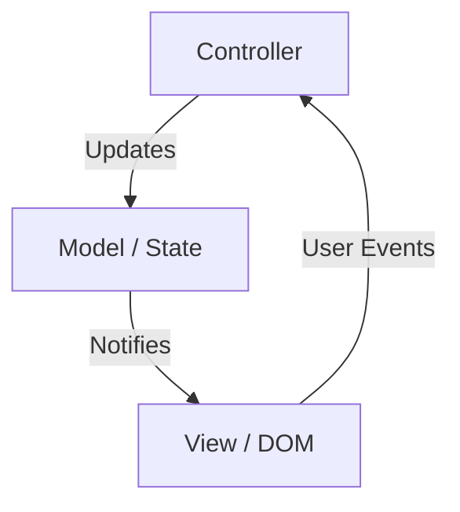
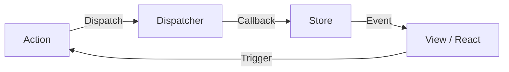
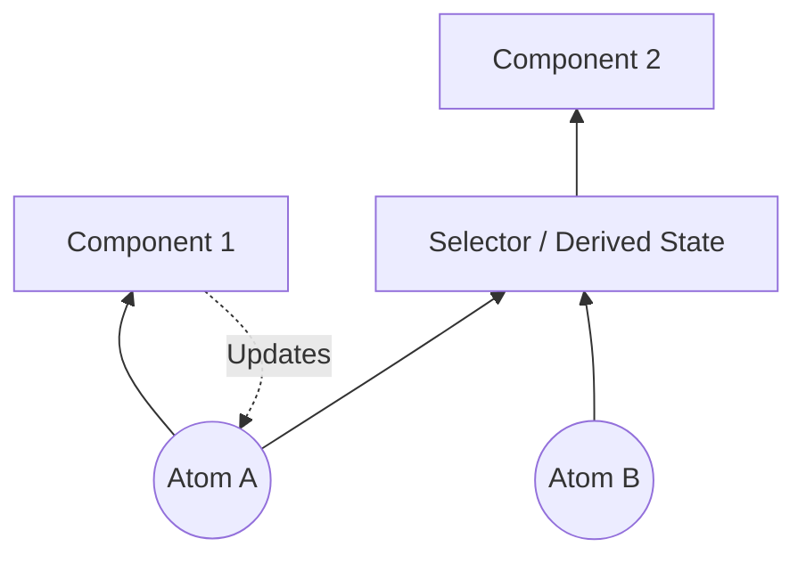
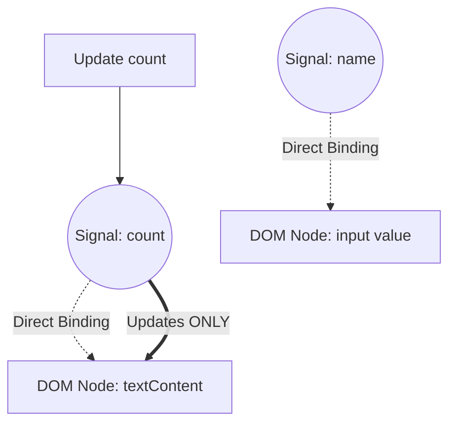

In web frontend development, the most debated and continuously evolving area is "State Management". Modern web applications have transformed from mere document displays into software with complex interactions rivaling desktop applications. Consequently, how to manage the application's state and synchronize it with the UI has become the greatest challenge every frontend engineer faces.

In this article, we will look back at the history of frontend state management, the challenges and solutions in each era, and deeply explore the paradigm shifts toward the future (especially the evolution of Signals and Reactivity).

## 1. What is State Management? Why is it the most important issue in the frontend?

First of all, what is "State"? In a web application, state refers to "any data that changes over time and affects the display of the user interface (UI)".

- User information or list data fetched from a server
- Text entered into a form
- A flag indicating whether a modal window is open or closed
- The current URL path and query parameters
- Theme settings such as dark mode or light mode

All of these are "states". The more complex an application becomes, the more these states multiply and depend on each other.

### 1.1 UI as a Mapping of State

In the era of Declarative UI, the UI is modeled as a pure function that takes state as an input. Expressed as a mathematical formula, it looks like this:

$ UI = f(State) $

This simple formula is the fundamental philosophy behind modern frameworks like React. When the state $ State $ changes, the function $ f $ is re-executed (re-rendered), and a new $ UI $ is generated.
What's important here is that developers do not imperatively describe "How to change the UI (How)", but declaratively describe "What the state should be, and what the UI should look like for it (What)".

However, real-world applications are not static. The state changes based on user input, $ Action $. Taking this into account, the state as a function of time $ t $ can be expressed by the following recurrence relation:

$ State_{t+1} = update(State_t, Action) $

In short, the difficulty of state management boils down to: **"How to maintain and update the myriad of states without contradiction, and efficiently synchronize only the necessary parts with the UI at the necessary timing."**

### 1.2 Scope and Lifecycle of State

Another factor that makes state management difficult is that each state has its own appropriate "scope" and "lifecycle".

1. **Local State**:
   State that is contained entirely within a specific component. For example, the open/close flag of an accordion menu or the hover state of a button. These do not need to be managed globally.
2. **Global State**:
   State that is shared across the entire application or between multiple distant components. For example, the logged-in user's information, the contents of a shopping cart, or the UI theme settings.
3. **Server State**:
   State that is saved in a backend database and fetched and cached asynchronously on the frontend for display. This cannot be completely controlled by the client side, requiring complex management such as cache invalidation and refetching.

In frontend development of the past, these states were handled without distinction, causing complexity to explode and becoming a breeding ground for bugs. By following the history, let's see how these states were separated and organized.

## 2. The Dawn: The Era When the DOM Held the State and jQuery

In web development around 2010, the clear concept of state management was not yet established. In many cases, **the state was held directly in the DOM (Document Object Model) itself**.

```javascript
// State management in the jQuery era (saving state in the DOM)
$('#toggle-button').on('click', function() {
    var $menu = $('#dropdown-menu');
    // The class attribute of the DOM represents the state
    if ($menu.hasClass('is-active')) {
        $menu.removeClass('is-active');
        $(this).text('Open');
    } else {
        $menu.addClass('is-active');
        $(this).text('Close');
    }
});
```

In this approach, you had to read the DOM directly (execute DOM queries) to know the UI state. Data (JavaScript variables) and the view (HTML/DOM) were tightly coupled, and as the application grew in size, it became impossible to track where and how the DOM was being rewritten, falling into an unmaintainable state known as "spaghetti code."

## 3. The Merits and Demerits of MVC Architecture and Two-way Data Binding

Reflecting on the limitations of jQuery, frameworks adopting MVC (Model-View-Controller) and MVVM (Model-View-ViewModel) architectures, such as Backbone.js and AngularJS, emerged.

The greatest invention of these frameworks was **separating data (Model) from display (View)**.



In particular, the "Two-way Data Binding" adopted by AngularJS (Angular 1.x) was revolutionary. When the data in the Model changed, the View was automatically updated, and when the View (such as an input form) changed, the Model was automatically updated.

```html
<!-- Two-way data binding in AngularJS -->
<input type="text" ng-model="user.name">
<p>Hello, {{ user.name }}!</p>
```

This freed developers from direct DOM manipulation. However, as applications scaled up, a new problem arose: **"Cascading Updates (chain-reaction updates)"**.

When Model A was updated, View B was updated; the change in View B updated Model C, which further updated View D... The flow of data became so intertwined that endless loops occurred, and bugs where the UI updated at unexpected times became frequent. It became impossible to predict "when, who, and what data was changed."

## 4. The Birth of React and Flux: The Revolution of Unidirectional Data Flow

In 2013, React was released by Facebook (now Meta). While React itself was a library for building UIs (the V in MVC), at the same time, they proposed a new architectural pattern called **Flux**.

The main goal of Flux was to resolve the complexity of two-way data binding in MVC, namely, realizing a **"Unidirectional Data Flow"**.



The Flux architecture has strict rules:

1. **Action**: The only way to make changes to the system. An object that indicates what happened.
2. **Dispatcher**: The central hub that receives all Actions and distributes them to the Stores.
3. **Store**: The place that holds the application state and business logic. The Store registers a callback with the Dispatcher, receives Actions, and updates its own state.
4. **View**: Receives the state from the Store and renders it. Generates new Actions in response to user operations.

Importantly, **the View can never directly change the state of the Store**. To change the state, one must always dispatch an Action and go through the Dispatcher, completing a one-way cycle. This made the data flow extremely predictable, dramatically improving the stability of state management in large-scale applications.

## 5. The Hegemony and Limits of Redux

Developed in 2015 by Dan Abramov and others, **Redux** further refined the concept of Flux and became the de facto standard for state management in the frontend.

Redux incorporated concepts of functional programming (especially the Elm Architecture) into Flux's unidirectional data flow.

### 5.1 The Three Principles of Redux

Redux is based on three strict principles:

1. **Single source of truth**:
   The entire application's state is stored in an object tree within a single store.
2. **State is read-only**:
   The only way to change the state is to dispatch an Action object describing what happened.
3. **Changes are made with pure functions**:
   To specify how the state tree is transformed by Actions, you write pure functions called Reducers.

### 5.2 Reducers and Pure Functions

A Reducer is a pure function that takes the previous state and an Action, and returns the new state.

$ State_{new} = Reducer(State_{old}, Action) $

Because it is a pure function, it has no side effects (such as API calls or DOM mutations) and always returns the same output for the same input. Also, rather than directly modifying (mutating) the state passed as an argument, it must always generate and return a new state object.

```javascript
// Example of a Reducer in Redux
const initialState = { count: 0, loading: false };

function counterReducer(state = initialState, action) {
  switch (action.type) {
    case 'INCREMENT':
      // Return a new object without directly mutating the state (Immutability)
      return { ...state, count: state.count + 1 };
    case 'DECREMENT':
      return { ...state, count: state.count - 1 };
    case 'SET_LOADING':
      return { ...state, loading: action.payload };
    default:
      return state;
  }
}
```

The combination of this "immutability" and "pure functions" enabled Redux to realize powerful time-travel debugging (rewinding to past states) and hot reloading. It was a massive breakthrough in terms of Developer Experience (DX).

### 5.3 The Challenge of Redux: The Wall of Boilerplate

While Redux was a wonderful architecture, as it became widespread, many developers began to feel dissatisfied. The biggest reason was the **"amount of boilerplate (routine code)"**.

Even for a simple operation like just incrementing a counter, you had to create and modify the following files:
1. Defining Action Type constants
2. Creating Action Creator functions
3. Adding to the switch statement in the Reducer
4. Writing `mapStateToProps` and `mapDispatchToProps` in the component (before Hooks)

Furthermore, to handle asynchronous processing (such as API communication), you had to introduce middleware like `redux-thunk` or `redux-saga`, causing the learning curve to skyrocket.

Voices arguing "Isn't Redux overkill?" grew louder, and a search for new approaches to state management began.

## 6. The Movement to "Move Away from Redux" with Context API and Hooks

The revamping of the Context API in React 16.3 in 2018, and the introduction of **React Hooks** in React 16.8 in 2019, marked a major turning point in the history of state management.

### 6.1 State Sharing with Built-in Features

By using the Context API, data can be passed directly to components deep within the component tree without prop drilling.
Furthermore, by combining it with the `useReducer` Hook, it became possible to achieve Redux-like state management using only React's built-in features.

```javascript
// State management using Context and useReducer
import React, { createContext, useContext, useReducer } from 'react';

const CountContext = createContext();

function countReducer(state, action) {
  switch (action.type) {
    case 'INCREMENT': return { count: state.count + 1 };
    default: return state;
  }
}

function CountProvider({ children }) {
  const [state, dispatch] = useReducer(countReducer, { count: 0 });
  return (
    <CountContext.Provider value={{ state, dispatch }}>
      {children}
    </CountContext.Provider>
  );
}

function CounterDisplay() {
  // Get state directly from Context
  const { state } = useContext(CountContext);
  return <div>Count: {state.count}</div>;
}
```

This led to a widespread realization that "Redux is unnecessary for simple global state." However, this approach had a fatal performance pitfall.

### 6.2 Performance Issues of Context API (Extra Re-renders)

React's Context API has a specification where "when the value of a Context is updated, all components subscribing to that Context (calling `useContext`) are unconditionally re-rendered."

For example, if you are sharing a massive object like `{ user: {...}, theme: 'dark' }` in a Context, changing just the `theme` will cause even components that only need the `user` information to re-render.
To prevent this, you had to either split the Context into smaller, feature-specific pieces or heavily use `React.memo` for memoization, which instead resulted in increased complexity.

Because React adopts a "top-down" rendering model by default, it highlighted a fundamental issue where global state changes easily triggered unnecessary re-renders across the entire tree.

## 7. Separation of State: Server State and Client State

Around this time, an important paradigm shift occurred in state management. It was the realization that "not all state should be put into a single global store."
In particular, data fetched from a server (Server State) is fundamentally different in nature from UI state that is contained entirely on the frontend (Client State).

- **Server State**: Owned by the server. Fetched asynchronously. Since it is shared and modified by multiple users, it can always become stale. Requires cache management, background updates, and retry logic.
- **Client State**: Owned by the client (browser). Updated synchronously. Such as dark mode or the open/close state of a modal.

### 7.1 The Rise of React Query, SWR, and Apollo Client

The mainstream approach became separating the management of Server State from Redux or Context and delegating it to dedicated libraries. Thus, **React Query (now TanStack Query)** and **SWR** emerged.

```javascript
// Managing Server State using React Query
import { useQuery } from 'react-query';

function UserProfile({ userId }) {
  // Caching, refetching, loading states, and error states are all managed automatically
  const { data, isLoading, error } = useQuery(['user', userId], fetchUser);

  if (isLoading) return <div>Loading...</div>;
  if (error) return <div>Error!</div>;

  return <div>Name: {data.name}</div>;
}
```

These libraries abstracted away the complex process of "caching server state locally and synchronizing it as needed."
As a result, the data that needed to be managed in a global store like Redux dropped drastically to "purely client state only," significantly reducing the burden of state management.

## 8. Atomic State Management: Recoil and Jotai

After Server State was separated out, a new race began over how to efficiently manage the remaining Client State.
Born to solve React's rendering model (top-down) and the Context API's performance issues was an approach called **Atomic State Management**.

In 2020, **Recoil** was announced by the Facebook team, and inspired by it, libraries like **Jotai** appeared.

### 8.1 Bottom-Up State Management

While Redux takes a "top-down" approach (carving out necessary parts from a single giant state tree), Recoil and Jotai take a "bottom-up" approach, where you "create minimum units of state (Atoms) and inject them into the component tree by combining them."



An Atom is an independent unit of state. Components subscribe only to the Atoms they need. When an Atom is updated, only the components subscribed to that pinpoint Atom are re-rendered. This completely solves the unnecessary re-rendering issue that the Context API faced.

```javascript
// Example of Atomic State using Jotai
import { atom, useAtom } from 'jotai';

// Define the smallest unit of state (Atom)
const priceAtom = atom(1000);
const taxRateAtom = atom(0.1);

// You can also define states derived from other Atoms (Derived State)
const priceWithTaxAtom = atom((get) => {
  return get(priceAtom) * (1 + get(taxRateAtom));
});

function ProductDisplay() {
  const [priceWithTax] = useAtom(priceWithTaxAtom);
  // Re-renders only when priceAtom or taxRateAtom changes
  return <div>Tax Included: ¥{priceWithTax}</div>;
}
```

Jotai and others can be used with almost the same feel as React's `useState`, making them a very popular choice in modern React applications due to their low learning curve and high performance.

## 9. Proxies and Mutability: Zustand and Valtio

Another powerful trend emerged with a group of libraries that stripped boilerplate to the absolute minimum and provided more intuitive APIs. These are **Zustand** and **Valtio**, developed by the OSS collective Poimandres.

### 9.1 Zustand: Flux Perfected in Simplicity

Like Redux, Zustand adopts a single store (Flux architecture), but it eliminates complex concepts like Reducers and Providers, offering an extremely simple, hooks-based API.

```javascript
// Example of Zustand
import { create } from 'zustand';

// Creating a store. Define state and update functions together.
const useStore = create((set) => ({
  count: 0,
  increment: () => set((state) => ({ count: state.count + 1 })),
  removeAllBears: () => set({ count: 0 }),
}));

function Counter() {
  // Extract only the necessary state using a Selector. Unnecessary re-renders are prevented.
  const count = useStore((state) => state.count);
  const increment = useStore((state) => state.increment);

  return <button onClick={increment}>{count}</button>;
}
```

Zustand has established its position as a "modern Redux," combining the robustness of Redux with the simplicity of Hooks.

### 9.2 Valtio: Mutable State Management with Proxies

In the React world, the rule that "state should be treated immutably" has been treated as an absolute. However, immutably updating JavaScript objects takes effort (especially when they are deeply nested).

Valtio adopted a revolutionary approach by utilizing ES6 `Proxy` objects: "while performing mutable operations, it achieves immutable state updates and reactivity internally." This approach is very close to the Reactivity system of Vue.js (Vue 3).

```javascript
// Example of Valtio
import { proxy, useSnapshot } from 'valtio';

// State object wrapped with Proxy
const state = proxy({ count: 0, user: { name: 'Alice' } });

// You can directly assign (mutate) to update just like a normal JavaScript variable
const increment = () => {
  state.count += 1;
};

function Counter() {
  // Subscribe to the state using useSnapshot. It only detects changes to accessed properties.
  const snap = useSnapshot(state);
  return <button onClick={increment}>{snap.count}</button>;
}
```

Valtio provides the highest level of intuitiveness in the developer experience. It is an approach often preferred by developers accustomed to Vue or Svelte when using React.

## 10. Paradigm Shift: Signals and Fine-grained Reactivity

And currently, the biggest buzzwords in frontend state management are **Signals** and **Fine-grained Reactivity**.

React has used the Virtual DOM to take an approach where it "re-executes the component function to build a new UI tree, diffs it against the previous tree, and updates the DOM."
In contrast, frameworks adopting Signals (SolidJS, Vue 3, Svelte 5 (Runes), Preact, Angular, etc.) take a completely different approach.

### 10.1 What are Signals?

A Signal is a mechanism that holds a value that changes over time and automatically re-executes functions or expressions (Effects / Computed) that depend on that value.

```javascript
// Example of a Signal in SolidJS
import { createSignal, createEffect } from "solid-js";

// Creating a Signal. It returns a getter and a setter.
const [count, setCount] = createSignal(0);

// Effect (Side effect). Detects that count() was called and records the dependency.
// It will automatically re-execute when count is updated.
createEffect(() => {
  console.log("Count changed to:", count());
});

setCount(1); // "Count changed to: 1" is logged to the console
```

### 10.2 The Crucial Difference from React

The biggest difference between React (Virtual DOM) and Signals (Fine-grained Reactivity) is **"the granularity of updates"**.

In React, when the state changes, **the entire component is re-executed**. Developers must manually optimize by heavily using `useMemo`, `useCallback`, and `React.memo` to say, "You don't need to re-render from here down."

On the other hand, in Signal-based frameworks like SolidJS, **component functions are executed only once at initialization**.
If a Signal's value is used within a template, the framework builds a direct dependency at compile time saying, "If this Signal changes, only update this DOM node (text node or attribute)."



In other words, it skips the overhead of Virtual DOM diff calculation and directly rewrites the DOM nodes that need to be changed in a surgical manner (Fine-grained update). This realizes overwhelming performance and a superb DX (Developer Experience) where developers don't need to manually optimize.

### 10.3 The Mathematical Model of Signals

Behind Signals is the theory of "Reactive Programming," which models the dependencies of state and computations as a **Directed Acyclic Graph (DAG)**, and efficiently determines the update order using the topological sort of the graph.

If a certain derived state (Computed) $ C $ depends on Signals $ S_1, S_2 $, edges $ S_1 \to C $ and $ S_2 \to C $ are formed.
When a value is updated, by tracing the graph and evaluating only the necessary nodes (using strategies like Push/Pull hybrids), it prevents glitches (the phenomenon where an inconsistent intermediate UI is momentarily displayed) and guarantees topological consistency.

## 11. React's Counterattack: React Compiler (Forget)

How will React counter the rise of Signals? The React team chose not to "introduce Signals to React," but a completely different approach. That is the **React Compiler (Development Codename: React Forget)**.

React's philosophy is to maintain the simple functional programming model that "UI is a function of state." However, to execute that model with high performance, developers had to manually memoize (`useMemo`, `useCallback`).

React Compiler statically analyzes React component code at build time and **automatically inserts the necessary memoization code**.

In other words, without having to learn the new APIs of Signals or manually writing `useMemo`, developers simply write plain JavaScript, and the compiler applies optimizations close to fine-grained updates under the hood. This is a very ambitious project in that it "improves performance without degrading the developer experience."

## 12. The Next Generation Paradigm: Moving Away from Hydration to Resumability

Finally, an issue not to be overlooked in the future of state management is the challenge of "Hydration" in the integration of Server-Side Rendering (SSR) and the client side.

In traditional SSR (like Next.js), after sending the HTML generated on the server to the browser, a heavy process called "Hydration" was required on the browser side to load and execute JavaScript, attach event listeners, and rebuild the state. During this time, user interactions are blocked.

Next-generation frameworks like **Qwik** completely rethought state management and JavaScript loading. They propose the concept of **Resumability**.

The state rendered on the server is serialized and embedded in the HTML, and on the client, instead of "booting up" JavaScript execution from scratch, it "resumes" from the state paused by the server. As a result, the initial load JavaScript size is drastically reduced to the absolute minimum, and the overhead of Hydration becomes zero.

## 13. Conclusion: Where is State Management Heading?

Starting from the chaos of MVC, acquiring predictability with Flux/Redux, simplification with Hooks, the separation of Server State, optimization with Atomic and Proxy approaches, and onto Fine-grained Reactivity with Signals.

Looking back at nearly 15 years of frontend state management history, one clear trend emerges. That is, **"It is evolving in a direction where boilerplate is reduced, lowering the cognitive load on developers, while the underlying systems (frameworks and compilers) automatically optimize performance."**

- **Small to Medium React Development**: Jotai or Zustand are often the optimal solutions.
- **Development Involving Data Fetching**: Server State management tools like TanStack Query are essential.
- **New Projects Demanding Extreme Performance and DX**: Frameworks adopting Signals, like SolidJS or Vue, are attractive.
- **The Future of React**: With the maturation of the React Compiler, many performance issues in state management will be solved through automation.

There is no "silver bullet." However, by understanding the history of how past challenges were solved, we can select the most appropriate and future-proof architecture for the project at hand. The evolution of state management will continue to excite us frontend engineers in the future.
