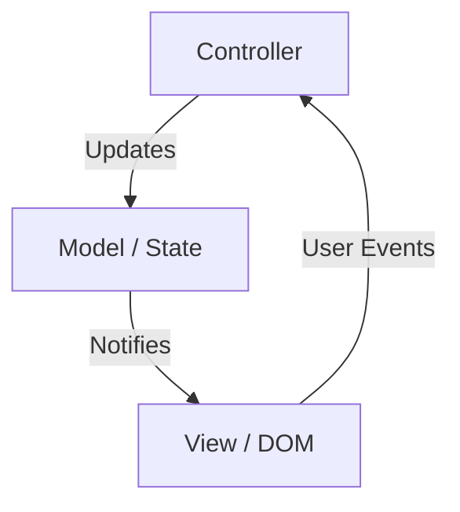
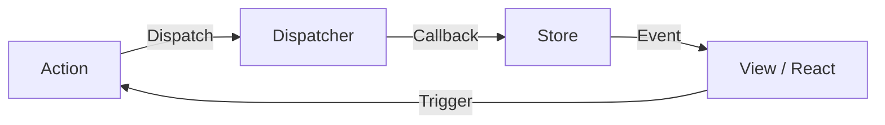
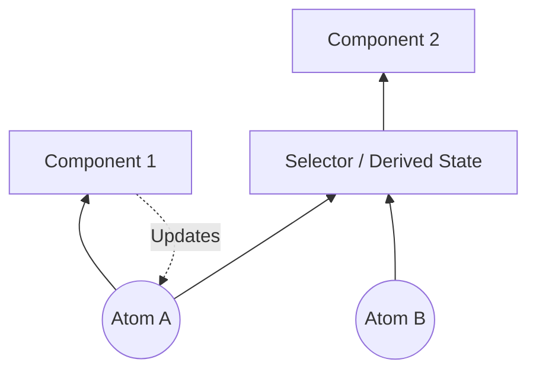
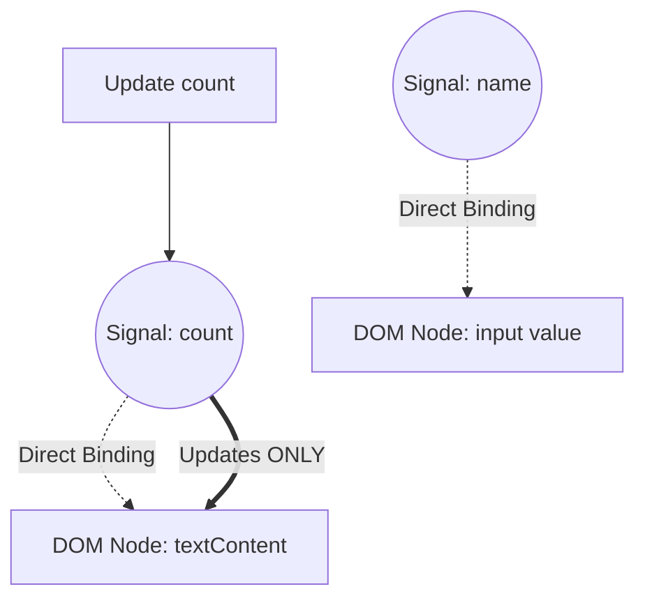

En el desarrollo frontend web, el área que ha sido el mayor centro de debate y que ha evolucionado continuamente es la "gestión de estado ([State](https://kenji.blog/es/p/iac-infrastructure-as-code-terraform/) Management)". Las aplicaciones web modernas han pasado de ser simples visualizaciones de documentos a convertirse en software con interacciones complejas comparables a las aplicaciones de escritorio. Como resultado, cómo gestionar el estado de una aplicación y sincronizarlo con la interfaz de usuario (UI) se ha convertido en el mayor desafío que enfrentan todos los ingenieros frontend.

En este artículo, repasaremos la historia de la gestión de estado en el frontend, los desafíos y soluciones de cada era, y profundizaremos de manera detallada en los cambios de paradigma hacia el futuro (especialmente la evolución de Signals y la reactividad).

## 1. ¿Qué es la gestión de estado? ¿Por qué es el problema más importante del frontend?

Para empezar, ¿qué es el "estado (State)"? En las aplicaciones web, el estado se refiere a "cualquier dato que cambia con el tiempo y afecta la visualización de la interfaz de usuario (UI)".

- Información del usuario o datos de listas obtenidos de un servidor
- Texto ingresado en un formulario
- Una bandera que indica si una ventana modal está abierta o cerrada
- La ruta de URL actual o los parámetros de consulta
- Configuración de tema entre modo oscuro y modo claro

Todo esto es "estado". A medida que las aplicaciones se vuelven más complejas, estos estados aumentan en número y se vuelven interdependientes.

### 1.1 La UI es un reflejo del estado

En la era de la interfaz de usuario declarativa (Declarative UI), la UI se modela como una función pura que toma el estado como entrada. Expresado matemáticamente, se ve así:

$ UI = f(State) $

Esta simple ecuación es la idea central detrás de frameworks modernos como React. Si el estado $ State $ cambia, la función $ f $ se vuelve a ejecutar (re-renderizar) y se genera una nueva $ UI $.
Lo importante aquí es que los desarrolladores no describen imperativamente "cómo cambiar la UI (How)", sino que describen declarativamente "cómo debería ser el estado y cómo debería verse la UI en respuesta a ello (What)".

Sin embargo, las aplicaciones del mundo real no son estáticas. El estado cambia por la entrada del usuario $ Action $. Considerando esto, el estado se puede expresar como una función del tiempo $ t $ mediante la siguiente relación de recurrencia:

$ State_{t+1} = update(State_t, Action) $

En otras palabras, la dificultad de la gestión de estado se resume en **"cómo retener y actualizar de manera consistente un número infinito de estados, y sincronizarlos de manera eficiente solo en las partes necesarias y en el momento adecuado para la UI"**.

### 1.2 Alcance y ciclo de vida del estado

Otro factor que dificulta la gestión de estado es que cada estado tiene su propio "alcance (scope)" y "ciclo de vida (lifecycle)" adecuados.

1.  **Estado Local (Local State)**:
    Estado que se completa únicamente dentro de un componente específico. Por ejemplo, la bandera de apertura/cierre de un menú tipo acordeón o el estado de desplazamiento (hover) de un botón. Estos no necesitan gestionarse globalmente.
2.  **Estado Global (Global State)**:
    Estado que se comparte en toda la aplicación o entre múltiples componentes distantes. Por ejemplo, información del usuario registrado, el contenido de un carrito de compras o la configuración del tema de la UI.
3.  **Estado del Servidor (Server State)**:
    Estado que se guarda en la base de datos del backend, etc., y se obtiene y almacena en caché de forma asíncrona en el frontend para mostrarse. Esto no se puede controlar completamente en el lado del cliente, y requiere una gestión compleja como invalidar la caché (Invalidation) y volver a obtener los datos (refetch).

En el desarrollo frontend del pasado, estos estados se trataban sin distinción, lo que provocaba una explosión de complejidad y un hervidero de errores (bugs). Al seguir la historia, veamos cómo estos estados se han ido separando y organizando.

## 2. Los primeros días: La era en la que el DOM mantenía el estado y jQuery

Alrededor del 2010, el concepto claro de gestión de estado aún no estaba establecido en el desarrollo web. En muchos casos, **el estado se mantenía directamente en el propio DOM (Document Object Model)**.

```javascript
// Gestión de estado en la era de jQuery (el estado se guarda en el DOM)
$('#toggle-button').on('click', function() {
    var $menu = $('#dropdown-menu');
    // El atributo class del DOM representa el estado
    if ($menu.hasClass('is-active')) {
        $menu.removeClass('is-active');
        $(this).text('Open');
    } else {
        $menu.addClass('is-active');
        $(this).text('Close');
    }
});
```

En este enfoque, para conocer el estado de la UI, era necesario leer el DOM directamente (ejecutar consultas DOM). Los datos (variables de JavaScript) y la vista (HTML/DOM) estaban estrechamente acoplados, y a medida que la aplicación crecía, se volvía imposible rastrear dónde y cómo se estaba reescribiendo el DOM, cayendo en un estado inmanejable conocido como "código espagueti".

## 3. Los pros y los contras de la arquitectura MVC y el enlace de datos bidireccional

Como reacción a las limitaciones de jQuery, surgieron frameworks que adoptaron arquitecturas MVC (Model-View-Controller) o MVVM (Model-View-ViewModel) como Backbone.js y AngularJS.

El mayor invento de estos frameworks fue **separar los datos (Model) de la visualización (View)**.



En particular, el "enlace de datos bidireccional (Two-way Data Binding)" adoptado por AngularJS (Angular 1.x) fue revolucionario. Era un mecanismo en el que la View se actualizaba automáticamente si los datos del Model cambiaban, y el Model se actualizaba automáticamente si la View (como un formulario de entrada) cambiaba.

```html
<!-- Enlace de datos bidireccional de AngularJS -->
<input type="text" ng-model="user.name">
<p>Hello, {{ user.name }}!</p>
```

Esto liberó a los desarrolladores de la manipulación directa del DOM. Sin embargo, a medida que las aplicaciones crecían a gran escala, surgía un nuevo problema: las **"actualizaciones en cascada (Cascade Updates)"**.

Cuando se actualizaba el Model A, se actualizaba la View B, el cambio en la View B actualizaba el Model C, y esto a su vez actualizaba la View D... De esta manera, el flujo de datos se volvía complejamente entrelazado, ocurriendo con frecuencia errores (bugs) en los que se caía en bucles infinitos o la UI se actualizaba en momentos inesperados. Se volvió imposible predecir "cuándo, quién y qué datos cambió".

## 4. El nacimiento de React y [Flux](https://kenji.blog/es/p/state-management-history-redux-context-recoil-zustand/): La revolución del flujo de datos unidireccional

En 2013, React fue lanzado por Facebook (ahora Meta). React en sí era una biblioteca para construir UIs (la V en MVC), pero al mismo tiempo abogaron por un nuevo patrón arquitectónico: **Flux**.

El objetivo principal de Flux era resolver la complejidad del enlace de datos bidireccional en MVC, es decir, lograr un **"flujo de datos unidireccional (Unidirectional Data Flow)"**.



La arquitectura [Flux](https://kenji.blog/es/p/state-management-history-redux-context-recoil-zustand/) tiene reglas estrictas:

1.  **Action**: La única forma de introducir cambios en el sistema. Un objeto que indica lo que sucedió.
2.  **Dispatcher**: Un concentrador central (hub) que recibe todas las Actions y las distribuye a los Stores.
3.  **Store**: El lugar donde se mantienen el estado de la aplicación y la lógica de negocio. El Store registra una devolución de llamada (callback) con el Dispatcher, recibe Actions y actualiza su propio estado.
4.  **View**: Recibe el estado del Store y lo renderiza. Genera nuevas Actions en respuesta a las interacciones del usuario.

Lo importante es que **la View nunca puede cambiar directamente el estado del Store**. Para cambiar el estado, es necesario ejecutar un ciclo unidireccional que emita una Action y pase por el Dispatcher. Esto hizo que el flujo de datos fuera extremadamente predecible (Predictable) y mejoró drásticamente la estabilidad de la gestión de estado en aplicaciones a gran escala.

## 5. La hegemonía y los límites de [Redux](https://kenji.blog/es/p/state-management-history-redux-context-recoil-zustand/)

**Redux**, desarrollado por Dan Abramov y otros en 2015, refinó aún más los conceptos de Flux y se convirtió en el estándar de facto para la gestión de estado en el frontend.

Redux incorporó conceptos de programación funcional (especialmente la Arquitectura Elm) al flujo de datos unidireccional de Flux.

### 5.1 Los 3 principios de Redux

Redux se basa en tres principios estrictos:

1.  **Single source of truth (Única fuente de la verdad)**:
    El estado completo de la aplicación se mantiene en un árbol de objetos dentro de un único Store (tienda).
2.  **[State](https://kenji.blog/es/p/iac-infrastructure-as-code-terraform/) is read-only (El estado es de solo lectura)**:
    La única forma de cambiar el estado es emitir (Dispatch) un objeto Action que indique lo que sucedió.
3.  **Changes are made with pure functions (Los cambios se realizan mediante funciones puras)**:
    Para especificar cómo se transforma el estado por la Action, se escriben funciones puras llamadas Reducers (reductores).

### 5.2 Reducer y funciones puras

Un Reducer es una función pura (Pure Function) que toma el estado anterior y una Action, y devuelve el nuevo estado.

$ State_{new} = Reducer(State_{old}, Action) $

Al ser una función pura, no tiene efectos secundarios (como llamadas a API o modificaciones del DOM) y siempre devuelve el mismo resultado para la misma entrada. Además, no debe modificar directamente (mutar) el estado pasado como argumento, sino que siempre debe generar y devolver un nuevo objeto de estado.

```javascript
// Ejemplo de un Reducer en Redux
const initialState = { count: 0, loading: false };

function counterReducer(state = initialState, action) {
  switch (action.type) {
    case 'INCREMENT':
      // No cambiar el estado directamente, devolver un nuevo objeto (Inmutabilidad)
      return { ...state, count: state.count + 1 };
    case 'DECREMENT':
      return { ...state, count: state.count - 1 };
    case 'SET_LOADING':
      return { ...state, loading: action.payload };
    default:
      return state;
  }
}
```

Gracias a esta combinación de "inmutabilidad (Immutability)" y "funciones puras", [Redux](https://kenji.blog/es/p/state-management-history-redux-context-recoil-zustand/) logró implementar características poderosas como depuración de viaje en el tiempo (retroceder a estados pasados) y recarga en caliente (hot reloading). Fue un gran avance en términos de experiencia del desarrollador (DX).

### 5.3 El desafío de Redux: El muro del código repetitivo (Boilerplate)

Redux era una gran arquitectura, pero a medida que ganaba popularidad, muchos desarrolladores comenzaron a expresar insatisfacción. La razón principal era **"la gran cantidad de código repetitivo (boilerplate)"**.

Para realizar algo tan simple como incrementar un número en un contador, era necesario crear/modificar los siguientes archivos:
1. Definición de la constante Action Type
2. Creación de la función Action Creator
3. Adición a la declaración switch en el Reducer
4. Descripción de `mapStateToProps` y `mapDispatchToProps` en el lado del componente (antes de los Hooks)

Además, para manejar procesos asíncronos (como comunicaciones de API), era necesario introducir middlewares como `redux-thunk` o `redux-saga`, lo que hacía que la curva de aprendizaje se disparara rápidamente.

Surgieron voces que decían "¿[Redux](https://kenji.blog/es/p/state-management-history-redux-context-recoil-zustand/) no es excesivo?", y comenzaron a explorarse nuevos enfoques para la gestión del estado.

## 6. El movimiento "Post-Redux" mediante [Context API](https://kenji.blog/es/p/state-management-history-redux-context-recoil-zustand/) y Hooks

La renovación de la Context API en React 16.3 en 2018, y posteriormente la introducción de los **React Hooks** en React 16.8 en 2019, marcaron un gran punto de inflexión en la historia de la gestión de estado.

### 6.1 Compartición del estado con características integradas

Usando la Context API, es posible pasar datos directamente a los componentes en las capas profundas del árbol de componentes sin tener que pasar las propiedades manualmente en cada nivel (Prop Drilling).
Además, combinándolo con el Hook `useReducer`, fue posible lograr una gestión del estado similar a [Redux](https://kenji.blog/es/p/state-management-history-redux-context-recoil-zustand/) utilizando únicamente las características integradas de React.

```javascript
// Gestión de estado usando Context y useReducer
import React, { createContext, useContext, useReducer } from 'react';

const CountContext = createContext();

function countReducer(state, action) {
  switch (action.type) {
    case 'INCREMENT': return { count: state.count + 1 };
    default: return state;
  }
}

function CountProvider({ children }) {
  const [state, dispatch] = useReducer(countReducer, { count: 0 });
  return (
    <CountContext.Provider value={{ state, dispatch }}>
      {children}
    </CountContext.Provider>
  );
}

function CounterDisplay() {
  // Obtener el estado directamente del Context
  const { state } = useContext(CountContext);
  return <div>Count: {state.count}</div>;
}
```

Como resultado, la noción de que "[Redux](https://kenji.blog/es/p/state-management-history-redux-context-recoil-zustand/) es innecesario para un estado global simple" se volvió ampliamente aceptada. Sin embargo, este enfoque tenía un problema de rendimiento fatal.

### 6.2 El problema de rendimiento de la [Context API](https://kenji.blog/es/p/state-management-history-redux-context-recoil-zustand/) (Extra Re-renders)

La Context API de React tiene una especificación que indica que "cuando se actualiza el valor del Context, todos los componentes suscritos a ese Context (que están llamando a `useContext`) se re-renderizarán incondicionalmente".

Por ejemplo, si se comparte un objeto gigante como `{ user: {...}, theme: 'dark' }` a través de Context, y solo cambia `theme`, incluso los componentes que solo necesitan información de `user` serán re-renderizados.
Para prevenir esto, es necesario dividir finamente el Context por funcionalidad, o hacer uso intensivo de `React.memo` para memorización, lo que resulta en un aumento de la complejidad.

Dado que React adopta por defecto un modelo de renderizado "de arriba hacia abajo (top-down)", quedó en evidencia el problema fundamental de que los cambios de estado global tienden a desencadenar re-renderizados innecesarios en todo el árbol de componentes.

## 7. Separación del estado: Server [State](https://kenji.blog/es/p/iac-infrastructure-as-code-terraform/) y Client State

A partir de este período, ocurrió un importante cambio de paradigma en la gestión de estado. Fue el descubrimiento de que "no se debe poner todos los estados en un único almacén (store) global".
En particular, los datos obtenidos de un servidor (Server State) son fundamentalmente diferentes en naturaleza del estado de la UI (Client State), que se completa únicamente dentro del frontend.

- **Server State**: Propiedad del servidor. Se obtiene de forma asíncrona. Dado que múltiples personas lo comparten y modifican, siempre existe la posibilidad de que se vuelva obsoleto (Stale). Requiere gestión de caché, actualización en segundo plano (background) y procesamiento de reintentos.
- **Client State**: Propiedad del cliente (navegador). Se actualiza sincrónicamente. Incluye cosas como el modo oscuro, abrir/cerrar un modal, etc.

### 7.1 El ascenso de React Query, SWR y [Apollo Client](https://kenji.blog/es/p/graphql-vs-rest-api-overfetching-type-safety/)

Se volvió común el enfoque de separar la gestión del Server State de [Redux](https://kenji.blog/es/p/state-management-history-redux-context-recoil-zustand/) y Context, y delegarlo a bibliotecas especializadas. Fue el surgimiento de bibliotecas como **React Query (ahora TanStack Query)** y **SWR**.

```javascript
// Gestión del Server State usando React Query
import { useQuery } from 'react-query';

function UserProfile({ userId }) {
  // Manejo automático de caché, re-obtención, estado de carga, y estado de error
  const { data, isLoading, error } = useQuery(['user', userId], fetchUser);

  if (isLoading) return <div>Loading...</div>;
  if (error) return <div>Error!</div>;

  return <div>Name: {data.name}</div>;
}
```

Estas bibliotecas abstrajeron procesos complejos como "almacenar en caché el estado del servidor localmente y sincronizarlo cuando sea necesario".
Como resultado, los datos que se deben gestionar en un almacén (store) global como [Redux](https://kenji.blog/es/p/state-management-history-redux-context-recoil-zustand/) se redujeron drásticamente solo al "estado del cliente puro", aligerando significativamente la carga de la gestión de estado.

## 8. Gestión del estado atómico (Atomic [State](https://kenji.blog/es/p/iac-infrastructure-as-code-terraform/) Management): Recoil y [Jotai](https://kenji.blog/es/p/state-management-history-redux-context-recoil-zustand/)

Después de aislar el Server State, comenzó una nueva competencia sobre cómo gestionar el Client State restante de manera eficiente.
Para resolver el modelo de renderizado de React (top-down) y los problemas de rendimiento de la [Context API](https://kenji.blog/es/p/state-management-history-redux-context-recoil-zustand/), surgió un enfoque llamado **Gestión del estado atómico (Atomic [State Management](https://kenji.blog/es/p/state-management-history-redux-context-recoil-zustand/))**.

En 2020, el equipo de Facebook anunció **Recoil**, y fuertemente influenciados por él, surgieron bibliotecas como **Jotai**.

### 8.1 Gestión del estado Bottom-Up

Mientras que [Redux](https://kenji.blog/es/p/state-management-history-redux-context-recoil-zustand/) adopta un enfoque de "extraer las partes necesarias de un solo árbol de estado gigante (top-down)", Recoil y Jotai adoptan un enfoque de "crear la unidad mínima de estado (Atom) e inyectarlos combinados en el árbol de componentes (bottom-up)".



Un Atom es una unidad de estado independiente. Los componentes solo se suscriben (Subscribe) a los Atoms que necesitan. Cuando se actualiza un Atom, solo los componentes que están suscritos a ese Atom específico se re-renderizan. Esto resuelve por completo los problemas de renderizados innecesarios que plagaban a la [Context API](https://kenji.blog/es/p/state-management-history-redux-context-recoil-zustand/).

```javascript
// Ejemplo de estado atómico (Atomic State) usando Jotai
import { atom, useAtom } from 'jotai';

// Definir la unidad mínima de estado (Atom)
const priceAtom = atom(1000);
const taxRateAtom = atom(0.1);

// También es posible definir estados derivados de otros Atoms (Derived State)
const priceWithTaxAtom = atom((get) => {
  return get(priceAtom) * (1 + get(taxRateAtom));
});

function ProductDisplay() {
  const [priceWithTax] = useAtom(priceWithTaxAtom);
  // Solo se re-renderizará cuando cambien priceAtom o taxRateAtom
  return <div>Tax Included: ¥{priceWithTax}</div>;
}
```

[Jotai](https://kenji.blog/es/p/state-management-history-redux-context-recoil-zustand/) y similares se pueden utilizar con la misma facilidad que `useState` de React, lo que reduce la curva de aprendizaje, y debido a que ofrece un alto rendimiento, se ha convertido en una opción muy popular en las aplicaciones React modernas.

## 9. Proxies y Mutabilidad: [Zustand](https://kenji.blog/es/p/state-management-history-redux-context-recoil-zustand/) y Valtio

Como otra poderosa tendencia, surgieron bibliotecas que redujeron al mínimo el código repetitivo y ofrecieron una API más intuitiva. Estas son **Zustand** y **Valtio**, desarrolladas por el colectivo OSS Poimandres.

### 9.1 Zustand: [Flux](https://kenji.blog/es/p/state-management-history-redux-context-recoil-zustand/) llevado a la máxima simplicidad

Zustand adopta un único almacén (arquitectura Flux) al igual que [Redux](https://kenji.blog/es/p/state-management-history-redux-context-recoil-zustand/), pero elimina conceptos complejos como Reducers y Providers, ofreciendo una API extremadamente simple basada en Hooks.

```javascript
// Ejemplo de Zustand
import { create } from 'zustand';

// Creación del almacén. Se define el estado y las funciones de actualización al mismo tiempo
const useStore = create((set) => ({
  count: 0,
  increment: () => set((state) => ({ count: state.count + 1 })),
  removeAllBears: () => set({ count: 0 }),
}));

function Counter() {
  // Extraer solo el estado necesario con un Selector. Evita re-renderizados innecesarios.
  const count = useStore((state) => state.count);
  const increment = useStore((state) => state.increment);

  return <button onClick={increment}>{count}</button>;
}
```

[Zustand](https://kenji.blog/es/p/state-management-history-redux-context-recoil-zustand/) ha consolidado una posición que podría considerarse el "[Redux](https://kenji.blog/es/p/state-management-history-redux-context-recoil-zustand/) moderno", ya que combina la robustez de Redux con la simplicidad de los Hooks.

### 9.2 Valtio: Gestión de estado mutable mediante Proxy

En el ecosistema de React, la regla de que "el estado debe ser tratado como inmutable (immutable)" ha sido considerada sagrada. Sin embargo, actualizar objetos JavaScript inmutables de forma inmutable lleva tiempo y esfuerzo (especialmente con objetos profundamente anidados).

Valtio adoptó un enfoque revolucionario que utiliza el objeto ES6 `Proxy` para "realizar operaciones mutables, pero logrando actualizaciones inmutables del estado y reactividad en el fondo". Este enfoque es muy similar al sistema de reactividad (Reactivity) de Vue.js (Vue 3).

```javascript
// Ejemplo de Valtio
import { proxy, useSnapshot } from 'valtio';

// Objeto de estado envuelto por Proxy
const state = proxy({ count: 0, user: { name: 'Alice' } });

// Se puede asignar directamente (mutar) para actualizarlo, como cualquier variable normal de JavaScript
const increment = () => {
  state.count += 1;
};

function Counter() {
  // Suscribirse al estado mediante useSnapshot. Solo detecta cambios en las propiedades accedidas.
  const snap = useSnapshot(state);
  return <button onClick={increment}>{snap.count}</button>;
}
```

Valtio proporciona un altísimo nivel de intuición en la experiencia de desarrollo. Es un enfoque que también agrada a los desarrolladores acostumbrados a Vue o Svelte al utilizar React.

## 10. Cambio de paradigma: Signals y reactividad de grano fino (Fine-grained Reactivity)

Y actualmente, la mayor palabra de moda en la gestión de estado frontend son **Signals** y la **reactividad de grano fino (Fine-grained Reactivity)**.

React ha utilizado un DOM Virtual (Virtual DOM) para adoptar un enfoque de "re-ejecutar la función del componente para crear un nuevo árbol UI, tomar la diferencia (Diff) con el árbol anterior y actualizar el DOM".
Por el contrario, frameworks que adoptan Signals (SolidJS, Vue 3, Svelte 5 (Runes), Preact, Angular, etc.) están utilizando un enfoque totalmente diferente.

### 10.1 ¿Qué son los Signals?

Signal es un mecanismo para guardar un valor que cambia con el tiempo y hacer que cualquier función o expresión (Effects / Computed) dependiente de ese valor se vuelva a ejecutar automáticamente.

```javascript
// Ejemplo de un Signal de SolidJS
import { createSignal, createEffect } from "solid-js";

// Creación de un Signal. Devuelve el getter y el setter.
const [count, setCount] = createSignal(0);

// Efecto (efecto secundario). Detecta que se llamó a count() y registra la dependencia.
// Se volverá a ejecutar automáticamente cuando cambie count.
createEffect(() => {
  console.log("Count changed to:", count());
});

setCount(1); // Muestra en consola: "Count changed to: 1"
```

### 10.2 La diferencia decisiva con React

La mayor diferencia entre React (DOM Virtual) y Signals (reactividad de grano fino) es la **"granularidad de actualización (Granularity)"**.

En el caso de React, cuando el estado cambia, **todo el componente se vuelve a ejecutar**. Los desarrolladores deben utilizar funciones como `useMemo`, `useCallback` y `React.memo` para optimizar manualmente, diciendo al sistema "no es necesario re-renderizar de aquí para abajo".

En cambio, en frameworks basados en Signals como SolidJS, **la función del componente se ejecuta solo una vez durante su inicialización**.
Cuando el valor de un Signal se utiliza en una plantilla, el framework construye durante la fase de compilación una relación de dependencia directa diciendo: "si cambia este Signal, actualiza únicamente este nodo del DOM (nodo de texto o atributo)".



Es decir, omite por completo la sobrecarga de calcular diferencias en el DOM Virtual y directamente reescribe (actualiza con precisión quirúrgica) el nodo DOM que necesita cambios (Fine-grained update). Gracias a esto, logra un rendimiento extraordinario y la máxima DX (experiencia del desarrollador), puesto que el desarrollador no necesita realizar optimizaciones manuales.

### 10.3 El modelo matemático detrás de Signals

Detrás de Signals se encuentra la teoría de "programación reactiva (Reactive Programming)", que modela las dependencias del estado y de la computación como un **grafo dirigido acíclico (Directed Acyclic [Graph](https://kenji.blog/es/p/tree-graph-data-structures-search-dfs-bfs-dijkstra/): DAG)**, utilizando la clasificación topológica del grafo para determinar eficientemente el orden de actualización.

Si un estado derivado (Computed) $ C $ depende de los Signals $ S_1, S_2 $, se forman las aristas $ S_1 \to C $, $ S_2 \to C $.
Cuando se actualiza un valor, se sigue el grafo para evaluar únicamente los nodos necesarios (a través de una estrategia híbrida como Push / Pull, por ejemplo), evitando así el 'glitch' (el fenómeno por el cual una UI en estado intermedio e inconsistente se muestra temporalmente) y garantizando la consistencia topológica.

## 11. El contraataque de React: React Compiler (Forget)

Ante el surgimiento de Signals, ¿cómo responde React? El equipo de React no decidió "introducir Signals en React", sino que escogió un enfoque completamente diferente. Este es el **React Compiler (Nombre en código de desarrollo: React Forget)**.

La filosofía de React es mantener un modelo simple de programación funcional donde "la UI es función de su estado". Sin embargo, para ejecutar este modelo con un alto rendimiento, era necesario que el desarrollador implementara la memorización de forma manual (`useMemo`, `useCallback`).

React Compiler analiza estáticamente el código del componente de React en el momento de la compilación y **agrega automáticamente todo el código necesario para la memorización**.

En otras palabras, el desarrollador no tiene que aprender la nueva API de Signals ni escribir manualmente el `useMemo`; al simplemente escribir JavaScript de manera normal, el compilador aplica por debajo una optimización que se acerca mucho a las actualizaciones de grano fino. Este es un proyecto muy ambicioso en el sentido de que busca "mejorar el rendimiento sin comprometer la experiencia del desarrollador".

## 12. El paradigma de la próxima generación: Alejarse de Hydration y moverse hacia Resumability

Finalmente, no se puede ignorar en el futuro de la gestión del estado los desafíos relacionados con "Hydration (hidratación)", un proceso inherente a la interacción entre el renderizado desde el lado del servidor (SSR) y el lado del cliente.

En el SSR convencional (Next.js y similares), luego de enviar el HTML renderizado por el servidor al navegador, el navegador cargaba y ejecutaba el JavaScript, agregaba detectores de eventos (event listeners) para reconstruir el estado; este proceso pesado se conoce como "Hydration". Durante este tiempo, la interacción del usuario queda bloqueada.

Los frameworks de próxima generación como **Qwik** han rediseñado radicalmente la gestión de estado y la carga de JavaScript. Estos introdujeron el concepto de **Resumability (Reanudabilidad)**.

El estado renderizado en el servidor es serializado e integrado en el HTML, y el cliente no ejecuta JavaScript desde un "inicio" en cero, sino que "reanuda (Resume)" a partir de la pausa hecha en el servidor. Esto reduce al máximo posible el tamaño inicial del JavaScript cargado, y la sobrecarga (overhead) por Hydration se reduce a cero.

## 13. Conclusión: ¿Hacia dónde se dirige la gestión de estado?

Empezando con la confusión del modelo MVC, logrando un estado predecible gracias a [Flux](https://kenji.blog/es/p/state-management-history-redux-context-recoil-zustand/)/Redux, su simplificación a través de los Hooks, la separación del Server [State](https://kenji.blog/es/p/iac-infrastructure-as-code-terraform/), la eficiencia de los Atomic y Proxy, y terminando con Signals, y su reactividad de grano fino.

Al observar estos quince años de historia en la gestión de estado en frontend, se hace evidente una tendencia: **"se evoluciona en la dirección de reducir el código repetitivo y la carga cognitiva de los desarrolladores, a la vez que el sistema subyacente (frameworks o compiladores) optimiza automáticamente el rendimiento"**.

- **Para desarrollos React a pequeña y mediana escala**: [Jotai](https://kenji.blog/es/p/state-management-history-redux-context-recoil-zustand/) o [Zustand](https://kenji.blog/es/p/state-management-history-redux-context-recoil-zustand/) son muchas veces la solución ideal.
- **Para desarrollos con petición de datos**: Herramientas como TanStack Query son obligatorias para gestionar el Server State.
- **Para nuevos proyectos buscando el mejor rendimiento y DX**: Frameworks que adoptan Signals, como SolidJS o Vue, resultan muy atractivos.
- **El futuro de React**: Con la madurez de React Compiler, gran parte de los problemas de rendimiento en la gestión de estados serán resueltos mediante la automatización.

No hay "balas de plata". Sin embargo, al entender la historia de cómo los problemas han sido superados en el pasado, podremos seleccionar la arquitectura que mejor se adecue y se encuentre preparada para el futuro en cualquier proyecto al que nos enfrentemos hoy en día. La evolución en la gestión de estado seguramente seguirá entusiasmándonos a nosotros, los ingenieros de frontend, por mucho tiempo.
