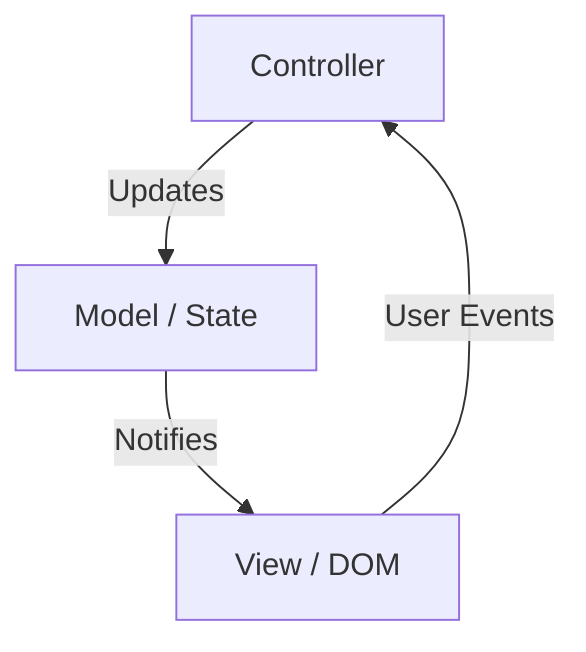
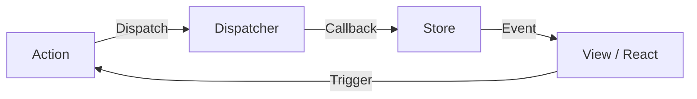
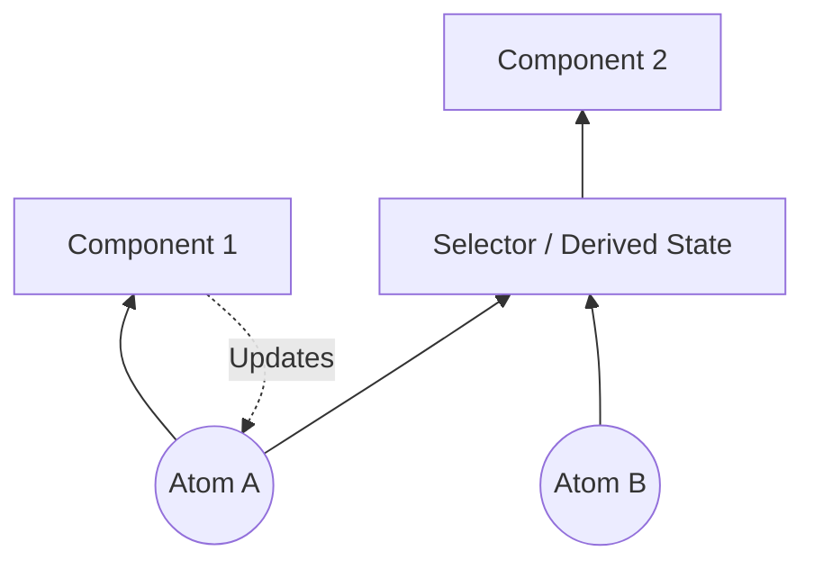
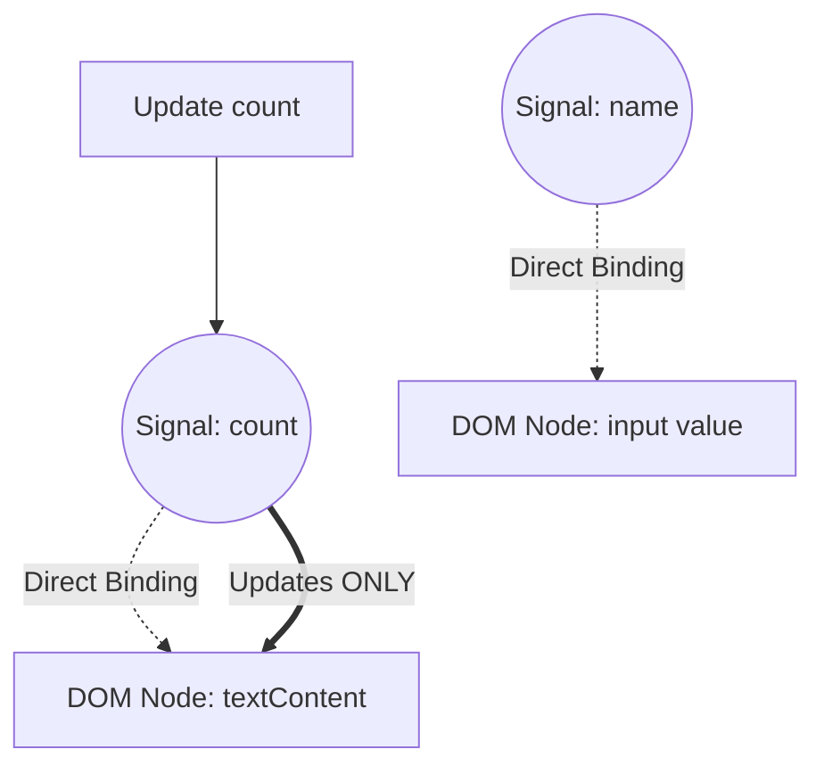

Dans le développement Web frontend, le domaine le plus controversé et le plus évolutif a été la « gestion d'état » ([State](https://kenji.blog/fr/p/iac-infrastructure-as-code-terraform/) Management). Les applications Web modernes sont passées de simples affichages de documents à des logiciels dotés d'interactions complexes rivalisant avec les applications de bureau. En conséquence, la manière de gérer l'état d'une application et de le synchroniser avec l'interface utilisateur (UI) est devenue le plus grand défi auquel sont confrontés tous les ingénieurs frontend.

Dans cet article, nous revenons sur l'histoire de la gestion d'état frontend, les défis et les solutions de chaque époque, et nous explorons en profondeur et en détail les changements de paradigme pour l'avenir (en particulier l'évolution de Signals et de la Reactivity).

## 1. Qu'est-ce que la gestion d'état ? Pourquoi est-ce le défi le plus important du frontend ?

Tout d'abord, qu'est-ce que l'« état » (State) ? Dans une application Web, l'état fait référence à « toutes les données qui changent au fil du temps et affectent l'affichage de l'interface utilisateur (UI) ».

- Informations utilisateur et données de liste récupérées depuis le serveur
- Texte saisi dans un formulaire
- Un drapeau (flag) indiquant si une fenêtre modale est ouverte ou fermée
- Le chemin d'accès à l'URL actuelle ou les paramètres de requête (query parameters)
- Les paramètres de thème, comme le mode sombre ou le mode clair

Tout cela constitue des « états ». Plus une application devient complexe, plus ces états se multiplient et deviennent interdépendants.

### 1.1 L'UI est une projection de l'état

À l'ère de l'UI déclarative (Declarative UI), l'UI est modélisée comme une fonction pure prenant l'état comme entrée. Mathématiquement, cela s'exprime ainsi :

$ UI = f(State) $

Cette équation simple est la philosophie fondamentale des frameworks modernes comme React. Si l'état $ State $ change, la fonction $ f $ est réexécutée (nouveau rendu), et une nouvelle $ UI $ est générée.
Ce qui est important ici, c'est que les développeurs ne décrivent pas de manière impérative « comment modifier l'UI (How) », mais plutôt de manière déclarative « comment devrait être l'état, et à quoi l'UI devrait ressembler en conséquence (What) ».

Cependant, les applications réelles ne sont pas statiques. L'état change en fonction de l'action de l'utilisateur ( $ Action $ ). En tenant compte de cela, l'état peut être exprimé comme une relation de récurrence en fonction du temps $ t $ :

$ State_{t+1} = update(State_t, Action) $

En d'autres termes, la difficulté de la gestion d'état se résume à : **« comment conserver et mettre à jour sans contradiction d'innombrables états, et synchroniser efficacement l'UI uniquement au moment nécessaire et pour les parties nécessaires »** .

### 1.2 Portée et cycle de vie de l'état

Un autre facteur qui rend la gestion d'état difficile est que chaque état a sa propre « portée » (scope) et son propre « cycle de vie » (lifecycle) appropriés.

1.  **État local (Local State)** :
    Un état confiné au sein d'un composant spécifique. Par exemple, le drapeau d'ouverture/fermeture d'un menu accordéon, ou l'état de survol (hover) d'un bouton. Ils n'ont pas besoin d'être gérés globalement.
2.  **État global (Global State)** :
    Un état partagé dans toute l'application, ou entre plusieurs composants distants. Par exemple, les informations de l'utilisateur connecté, le contenu du panier d'achat, ou les paramètres de thème de l'UI.
3.  **État du serveur (Server State)** :
    L'état stocké dans une base de données backend, etc., que le frontend récupère, met en cache et affiche de manière asynchrone. Cela ne peut pas être entièrement contrôlé du côté client, ce qui nécessite une gestion complexe telle que l'invalidation du cache (Invalidation) et la récupération de données (refetching).

Dans le développement frontend d'autrefois, ces états étaient traités sans distinction, ce qui a fait exploser la complexité et est devenu un nid à bugs. En retraçant l'histoire, voyons comment ces états ont été séparés et organisés.

## 2. L'aube : l'époque où le DOM détenait l'état et jQuery

Dans le développement Web autour de l'année 2010, le concept clair de gestion d'état n'était pas encore bien établi. Le plus souvent, **l'état était directement conservé dans le DOM (Document Object Model) lui-même** .

```javascript
// Gestion d'état à l'ère de jQuery (état enregistré dans le DOM)
$('#toggle-button').on('click', function() {
    var $menu = $('#dropdown-menu');
    // L'attribut class du DOM représente l'état
    if ($menu.hasClass('is-active')) {
        $menu.removeClass('is-active');
        $(this).text('Open');
    } else {
        $menu.addClass('is-active');
        $(this).text('Close');
    }
});
```

Avec cette approche, pour connaître l'état de l'UI, il fallait lire directement le DOM (exécuter une requête DOM). Les données (variables JavaScript) et la vue (HTML/DOM) étaient étroitement couplées. À mesure que l'application grandissait, il devenait impossible de suivre où et comment le DOM était modifié, tombant dans un état non maintenable appelé « code spaghetti ».

## 3. Les avantages et les inconvénients de l'architecture MVC et de la liaison de données bidirectionnelle

En réponse aux limites de jQuery, des frameworks adoptant des architectures MVC (Model-View-Controller) ou MVVM (Model-View-ViewModel) tels que Backbone.js et AngularJS sont apparus.

La plus grande invention de ces frameworks a été **la séparation des données (Model) et de l'affichage (View)** .



En particulier, la « liaison de données bidirectionnelle » (Two-way Data Binding) adoptée par AngularJS (Angular 1.x) était révolutionnaire. Si les données du Model changent, la View est automatiquement mise à jour, et si la View (comme un formulaire de saisie) change, le Model est automatiquement mis à jour.

```html
<!-- Liaison de données bidirectionnelle d'AngularJS -->
<input type="text" ng-model="user.name">
<p>Hello, {{ user.name }}!</p>
```

Grâce à cela, les développeurs ont été libérés de la manipulation directe du DOM. Cependant, à mesure que les applications devenaient plus grandes, un nouveau problème est apparu : **les « mises à jour en cascade » (Cascading Updates)** .

Lorsque le Model A est mis à jour, la View B est mise à jour, ce qui modifie le Model C, qui à son tour met à jour la View D... Le flux de données est devenu si entrelacé qu'il entraînait souvent des boucles infinies ou des mises à jour de l'UI inattendues. Il est devenu impossible de prédire « quand, qui, et quelles données ont été modifiées ».

## 4. La naissance de React et [Flux](https://kenji.blog/fr/p/state-management-history-redux-context-recoil-zustand/) : la révolution du flux de données unidirectionnel

En 2013, React a été publié par Facebook (aujourd'hui Meta). React lui-même était une bibliothèque pour construire des interfaces utilisateur (le V dans MVC), mais en même temps, ils ont proposé un nouveau modèle d'architecture appelé **Flux** .

L'objectif principal de Flux était d'éliminer la complexité de la liaison de données bidirectionnelle de MVC, c'est-à-dire de réaliser un **« flux de données unidirectionnel » (Unidirectional Data Flow)** .



L'architecture [Flux](https://kenji.blog/fr/p/state-management-history-redux-context-recoil-zustand/) a des règles strictes :

1.  **Action** : Le seul moyen d'apporter des modifications au système. Un objet indiquant ce qui s'est passé.
2.  **Dispatcher** : Un hub central qui reçoit toutes les actions et les distribue au Store.
3.  **Store** : L'endroit où l'état de l'application et la logique métier sont conservés. Le Store enregistre un rappel avec le Dispatcher, reçoit l'Action et met à jour son propre état.
4.  **View** : Reçoit l'état du Store et effectue le rendu. Génère une nouvelle Action en réponse à l'interaction de l'utilisateur.

Le point important est que **la View ne peut jamais modifier directement l'état du Store** . Pour changer l'état, vous devez toujours passer par le cycle unidirectionnel de l'émission d'une Action via le Dispatcher. Cela rend le flux de données extrêmement prévisible (Predictable) et améliore considérablement la stabilité de la gestion d'état dans les applications à grande échelle.

## 5. L'hégémonie de [Redux](https://kenji.blog/fr/p/state-management-history-redux-context-recoil-zustand/) et ses limites

Développé en 2015 par Dan Abramov et d'autres, **Redux** a affiné le concept Flux pour devenir la norme de facto dans la gestion d'état frontend.

Redux a introduit des concepts de programmation fonctionnelle (en particulier l'architecture Elm) dans le flux de données unidirectionnel de Flux.

### 5.1 Les 3 principes de Redux

Redux est basé sur trois principes stricts :

1.  **Single source of truth (Source de vérité unique)** :
    L'état de l'ensemble de l'application est stocké dans un arbre d'objets au sein d'un seul Store.
2.  **[State](https://kenji.blog/fr/p/iac-infrastructure-as-code-terraform/) is read-only (L'état est en lecture seule)** :
    La seule façon de modifier l'état est d'émettre (Dispatch) un objet Action décrivant ce qui s'est passé.
3.  **Changes are made with pure functions (Les modifications sont apportées par des fonctions pures)** :
    Pour spécifier comment l'arbre d'état est transformé par les actions, on écrit des réducteurs (Reducers) qui sont des fonctions pures.

### 5.2 Reducer et fonctions pures

Un Reducer est une fonction pure qui prend l'état précédent et une Action, et renvoie le nouvel état.

$ State_{new} = Reducer(State_{old}, Action) $

Étant une fonction pure, elle n'a pas d'effets secondaires (comme des appels d'API ou des modifications du DOM) et renvoie toujours la même sortie pour la même entrée. De plus, elle ne doit pas modifier directement l'état passé en argument (mutation), mais doit toujours générer et renvoyer un nouvel objet d'état.

```javascript
// Exemple de Reducer avec Redux
const initialState = { count: 0, loading: false };

function counterReducer(state = initialState, action) {
  switch (action.type) {
    case 'INCREMENT':
      // Ne modifie pas l'état directement, renvoie un nouvel objet (Immutability)
      return { ...state, count: state.count + 1 };
    case 'DECREMENT':
      return { ...state, count: state.count - 1 };
    case 'SET_LOADING':
      return { ...state, loading: action.payload };
    default:
      return state;
  }
}
```

La combinaison de cette « immuabilité » et de ces « fonctions pures » a permis à [Redux](https://kenji.blog/fr/p/state-management-history-redux-context-recoil-zustand/) de réaliser le débogage par voyage dans le temps (Time-travel debugging) et le Hot Reloading. Ce fut une avancée majeure en termes d'expérience développeur (DX).

### 5.3 Les défis de Redux : le mur du Boilerplate

Redux était une excellente architecture, mais à mesure qu'elle se répandait, de nombreux développeurs ont commencé à être frustrés. La principale raison était **« la quantité excessive de boilerplate (code répétitif) »** .

Même pour une tâche simple comme incrémenter un compteur, il fallait créer et modifier les fichiers suivants :
1. Définir des constantes pour le type d'Action
2. Créer des fonctions Action Creator
3. Ajouter au `switch` dans le Reducer
4. Écrire `mapStateToProps` et `mapDispatchToProps` du côté du composant (avant les Hooks)

De plus, pour gérer les traitements asynchrones (comme la communication API), il était nécessaire d'introduire des middlewares tels que `redux-thunk` ou `redux-saga`, ce qui augmentait considérablement la courbe d'apprentissage.

Les voix affirmant que « [Redux](https://kenji.blog/fr/p/state-management-history-redux-context-recoil-zustand/) est surdimensionné (overkill) » se sont élevées, et la recherche de nouvelles approches pour la gestion d'état a commencé.

## 6. Le mouvement "Post-Redux" avec l'API Context et les Hooks

La refonte de l'API Context dans React 16.3 en 2018, suivie de l'introduction des **React Hooks** dans React 16.8 en 2019, a marqué un tournant majeur dans l'histoire de la gestion d'état.

### 6.1 Partage d'état avec les fonctionnalités intégrées

En utilisant l'API Context, vous pouvez transmettre des données directement à des composants situés au plus profond de l'arborescence des composants, sans avoir à faire transiter les propriétés (Prop Drilling).
De plus, en le combinant avec le hook `useReducer`, il est devenu possible de réaliser une gestion d'état de type [Redux](https://kenji.blog/fr/p/state-management-history-redux-context-recoil-zustand/) en utilisant uniquement les fonctionnalités intégrées de React.

```javascript
// Gestion d'état à l'aide de Context et useReducer
import React, { createContext, useContext, useReducer } from 'react';

const CountContext = createContext();

function countReducer(state, action) {
  switch (action.type) {
    case 'INCREMENT': return { count: state.count + 1 };
    default: return state;
  }
}

function CountProvider({ children }) {
  const [state, dispatch] = useReducer(countReducer, { count: 0 });
  return (
    <CountContext.Provider value={{ state, dispatch }}>
      {children}
    </CountContext.Provider>
  );
}

function CounterDisplay() {
  // Obtenir l'état directement depuis le contexte
  const { state } = useContext(CountContext);
  return <div>Count: {state.count}</div>;
}
```

Grâce à cela, la perception que « [Redux](https://kenji.blog/fr/p/state-management-history-redux-context-recoil-zustand/) est inutile pour un simple état global » s'est largement répandue. Cependant, cette approche présentait un piège fatal en matière de performances.

### 6.2 Problème de performance de l'API Context (Extra Re-renders)

L'API Context de React a une spécificité : « Lorsque la valeur du Context est mise à jour, tous les composants qui y sont abonnés (ceux qui appellent `useContext`) sont inconditionnellement rendus à nouveau. »

Par exemple, si un objet géant `{ user: {...}, theme: 'dark' }` est partagé via le Context, le simple fait de changer le `theme` entraînera également le nouveau rendu de composants qui n'ont besoin que des informations `user`.
Pour éviter cela, il est nécessaire de diviser finement le Context par fonctionnalité, ou d'utiliser abondamment `React.memo` pour la mémorisation, ce qui finit par accroître la complexité.

Étant donné que React utilise par défaut un modèle de rendu « descendant » (top-down), un problème fondamental est apparu : les modifications d'état global ont tendance à provoquer des rendus inutiles de l'ensemble de l'arborescence.

## 7. Séparation des états : Server [State](https://kenji.blog/fr/p/iac-infrastructure-as-code-terraform/) et Client State

Vers cette époque, un changement de paradigme majeur s'est produit dans la gestion d'état. C'était la prise de conscience que « tous les états ne doivent pas être placés dans un seul store global ».
En particulier, les données récupérées depuis le serveur (Server State) ont une nature fondamentalement différente de l'état de l'UI qui se limite au frontend (Client State).

- **Server State** : Possédé par le serveur. Récupéré de manière asynchrone. Comme il est partagé et modifié par plusieurs personnes, il peut toujours devenir obsolète (Stale). Nécessite la gestion du cache, les mises à jour en arrière-plan et les mécanismes de relance.
- **Client State** : Possédé par le client (navigateur). Mis à jour de manière synchrone. Ex: Mode sombre ou ouverture d'une fenêtre modale.

### 7.1 L'essor de React Query, SWR, [Apollo Client](https://kenji.blog/fr/p/graphql-vs-rest-api-overfetching-type-safety/)

L'approche dominante a été de séparer la gestion du Server State de [Redux](https://kenji.blog/fr/p/state-management-history-redux-context-recoil-zustand/) ou Context, et de la confier à des bibliothèques dédiées. C'est l'apparition de **React Query (maintenant TanStack Query)** et **SWR**.

```javascript
// Gestion du Server State à l'aide de React Query
import { useQuery } from 'react-query';

function UserProfile({ userId }) {
  // Gestion automatique du cache, récupération, état de chargement et d'erreur
  const { data, isLoading, error } = useQuery(['user', userId], fetchUser);

  if (isLoading) return <div>Loading...</div>;
  if (error) return <div>Error!</div>;

  return <div>Name: {data.name}</div>;
}
```

Ces bibliothèques ont abstrait le processus complexe de « mise en cache de l'état du serveur localement et synchronisation au besoin ».
En conséquence, les données à gérer dans des stores globaux comme [Redux](https://kenji.blog/fr/p/state-management-history-redux-context-recoil-zustand/) se sont limitées au « pur état client », réduisant ainsi considérablement le fardeau de la gestion d'état.

## 8. Atomic [State](https://kenji.blog/fr/p/iac-infrastructure-as-code-terraform/) Management : Recoil et [Jotai](https://kenji.blog/fr/p/state-management-history-redux-context-recoil-zustand/)

Après la séparation du Server State, une nouvelle course a commencé pour gérer efficacement le Client State restant.
L'approche **Atomic [State Management](https://kenji.blog/fr/p/state-management-history-redux-context-recoil-zustand/)** a été créée pour résoudre les problèmes du modèle de rendu de React (top-down) et des performances de l'API Context.

En 2020, l'équipe de Facebook a annoncé **Recoil**, ce qui a inspiré l'émergence d'autres bibliothèques comme **Jotai**.

### 8.1 Gestion d'état Bottom-Up

Alors que [Redux](https://kenji.blog/fr/p/state-management-history-redux-context-recoil-zustand/) a une approche « descendante (top-down) qui extrait les parties nécessaires d'un seul arbre d'état géant », Recoil et Jotai adoptent une approche « ascendante (bottom-up) : créer l'unité d'état minimale (Atom) et les combiner pour les injecter dans l'arborescence des composants ».



Un Atom est une unité d'état indépendante. Les composants s'abonnent (Subscribe) uniquement aux atomes dont ils ont besoin. Lorsqu'un Atom est mis à jour, seuls les composants abonnés à cet Atom sont ré-affichés de manière ciblée. Cela résout complètement le problème des rendus inutiles de l'API Context.

```javascript
// Exemple d'état atomique utilisant Jotai
import { atom, useAtom } from 'jotai';

// Définition de l'unité minimale d'état (Atom)
const priceAtom = atom(1000);
const taxRateAtom = atom(0.1);

// L'état dérivé (Derived State) d'autres atomes peut aussi être défini
const priceWithTaxAtom = atom((get) => {
  return get(priceAtom) * (1 + get(taxRateAtom));
});

function ProductDisplay() {
  const [priceWithTax] = useAtom(priceWithTaxAtom);
  // Uniquement rendu à nouveau lorsque priceAtom ou taxRateAtom change
  return <div>Tax Included: ¥{priceWithTax}</div>;
}
```

Des bibliothèques comme [Jotai](https://kenji.blog/fr/p/state-management-history-redux-context-recoil-zustand/) sont devenues des choix très populaires dans les applications React modernes, car elles s'utilisent avec une sensation très similaire au `useState` de React, ont une courbe d'apprentissage faible, et offrent d'excellentes performances.

## 9. Proxies et Mutabilité : [Zustand](https://kenji.blog/fr/p/state-management-history-redux-context-recoil-zustand/) et Valtio

Une autre tendance puissante a été l'émergence d'un groupe de bibliothèques qui réduisent drastiquement le boilerplate au minimum et offrent une API plus intuitive. Il s'agit de **Zustand** et **Valtio**, développés par le collectif OSS Poimandres.

### 9.1 Zustand : [Flux](https://kenji.blog/fr/p/state-management-history-redux-context-recoil-zustand/) poussé à sa plus simple expression

Comme [Redux](https://kenji.blog/fr/p/state-management-history-redux-context-recoil-zustand/), Zustand adopte un magasin unique (architecture Flux), mais élimine les concepts complexes tels que les Reducers et les Providers, et fournit une API très simple basée sur les Hooks.

```javascript
// Exemple de Zustand
import { create } from 'zustand';

// Création du store. L'état et les fonctions de mise à jour sont définis ensemble
const useStore = create((set) => ({
  count: 0,
  increment: () => set((state) => ({ count: state.count + 1 })),
  removeAllBears: () => set({ count: 0 }),
}));

function Counter() {
  // Extraire uniquement l'état nécessaire avec un Selector. Empêche les rendus inutiles.
  const count = useStore((state) => state.count);
  const increment = useStore((state) => state.increment);

  return <button onClick={increment}>{count}</button>;
}
```

[Zustand](https://kenji.blog/fr/p/state-management-history-redux-context-recoil-zustand/) s'est imposé comme une sorte de « [Redux](https://kenji.blog/fr/p/state-management-history-redux-context-recoil-zustand/) moderne », alliant la robustesse de Redux et la simplicité des Hooks.

### 9.2 Valtio : Gestion de l'état mutable via Proxy

Dans le monde de React, la règle selon laquelle « l'état doit être traité de manière immuable » a été considérée comme absolue. Cependant, mettre à jour des objets JavaScript de manière immuable est fastidieux (surtout lorsque l'imbrication est profonde).

Valtio a adopté une approche révolutionnaire : utiliser l'objet `Proxy` d'ES6 pour « effectuer des opérations mutables tout en réalisant en interne des mises à jour d'état immuables et de la réactivité ». Cette approche est très proche du système de réactivité de Vue.js (Vue 3).

```javascript
// Exemple de Valtio
import { proxy, useSnapshot } from 'valtio';

// Objet d'état enveloppé par Proxy
const state = proxy({ count: 0, user: { name: 'Alice' } });

// Peut être directement affecté (muté) et mis à jour comme une variable JavaScript normale
const increment = () => {
  state.count += 1;
};

function Counter() {
  // Utiliser useSnapshot pour s'abonner à l'état. Ne détecte que les modifications des propriétés consultées.
  const snap = useSnapshot(state);
  return <button onClick={increment}>{snap.count}</button>;
}
```

Valtio offre le plus haut niveau d'intuitivité en matière d'expérience développeur. C'est également une approche appréciée par les développeurs habitués à Vue ou Svelte lorsqu'ils utilisent React.

## 10. Changement de paradigme : Signals et réactivité à grain fin (Fine-grained Reactivity)

Aujourd'hui, le plus grand mot à la mode dans la gestion d'état frontend est **Signals** et la **réactivité à grain fin (Fine-grained Reactivity)** .

React utilise le DOM virtuel (Virtual DOM) et adopte une approche consistant à « réexécuter la fonction du composant pour créer un nouvel arbre d'UI, calculer la différence (Diff) avec l'arbre précédent, puis mettre à jour le DOM ».
En revanche, les frameworks adoptant les Signals (SolidJS, Vue 3, Svelte 5 (Runes), Preact, Angular, etc.) adoptent une approche totalement différente.

### 10.1 Que sont les Signals ?

Un Signal est un mécanisme qui conserve une valeur changeant au fil du temps et qui réexécute automatiquement les fonctions ou expressions (Effects / Computed) qui dépendent de cette valeur.

```javascript
// Exemple de Signal avec SolidJS
import { createSignal, createEffect } from "solid-js";

// Création d'un Signal. Un getter et un setter sont renvoyés.
const [count, setCount] = createSignal(0);

// Effet (effet secondaire). Détecte que count() a été appelé et enregistre la dépendance.
// Est automatiquement réexécuté lorsque count est mis à jour.
createEffect(() => {
  console.log("Count changed to:", count());
});

setCount(1); // "Count changed to: 1" s'affiche dans la console
```

### 10.2 La différence fondamentale avec React

La plus grande différence entre React (Virtual DOM) et les Signals (Fine-grained Reactivity) est la **« granularité de la mise à jour »** .

Dans le cas de React, lorsque l'état change, **le composant entier est réexécuté** . Les développeurs doivent utiliser manuellement `useMemo`, `useCallback` et `React.memo` pour optimiser en disant : « Il n'est pas nécessaire de refaire le rendu à partir d'ici ».

D'un autre côté, avec les frameworks basés sur les Signals comme SolidJS, **les fonctions des composants ne sont exécutées qu'une seule fois lors de l'initialisation** .
Si la valeur d'un Signal est utilisée dans le modèle (template), le framework crée au moment de la compilation une dépendance directe : « Si ce Signal change, mettez à jour uniquement ce nœud DOM (nœud de texte ou attribut) ».



En d'autres termes, ils sautent la surcharge du calcul différentiel du DOM virtuel et réécrivent directement et chirurgicalement les nœuds DOM qui doivent être modifiés (Fine-grained update). Cela permet d'obtenir des performances exceptionnelles et une expérience de développement fantastique (DX) où le développeur n'a pas besoin de faire d'optimisations manuelles.

### 10.3 Le modèle mathématique des Signals

Derrière les Signals se trouve la théorie de la « programmation réactive », qui modélise les dépendances entre l'état et les calculs sous la forme d'un **graphe orienté acyclique (Directed Acyclic [Graph](https://kenji.blog/fr/p/tree-graph-data-structures-search-dfs-bfs-dijkstra/) : DAG)** et détermine efficacement l'ordre de mise à jour en utilisant un tri topologique du graphe.

Si un état dérivé (Computed) $ C $ dépend des signaux $ S_1, S_2 $ , des arêtes $ S_1 \to C $ , $ S_2 \to C $ sont formées.
Lorsque la valeur est mise à jour, en parcourant le graphe et en évaluant uniquement les nœuds nécessaires (comme la stratégie hybride Push / Pull), on empêche les "Glitches" (phénomène où une interface utilisateur avec un état intermédiaire incohérent s'affiche momentanément) et on garantit la cohérence topologique.

## 11. La contre-attaque de React : React Compiler (Forget)

Face à l'essor des Signals, comment React va-t-il riposter ? L'équipe React n'a pas choisi « d'introduire des Signals dans React », mais une approche complètement différente. C'est le **React Compiler (nom de code de développement : React Forget)** .

La philosophie de React est de conserver un modèle de programmation fonctionnelle simple où « l'UI est une fonction de l'état ». Cependant, pour exécuter ce modèle avec des performances élevées, les développeurs devaient effectuer une mémorisation manuelle (`useMemo`, `useCallback`).

Le React Compiler analyse statiquement le code des composants React lors de la construction et **insère automatiquement le code de mémorisation nécessaire** .

En d'autres termes, sans que les développeurs n'aient à apprendre la nouvelle API des Signals ni à écrire manuellement des `useMemo`, il suffit d'écrire du JavaScript natif et le compilateur appliquera en arrière-plan une optimisation proche des mises à jour à grain fin. Il s'agit d'un projet très ambitieux en ce sens qu'il « améliore les performances sans compromettre l'expérience du développeur ».

## 12. Le paradigme de la prochaine génération : s'éloigner de l'Hydration et passer à la Resumability

Enfin, dans l'avenir de la gestion d'état, on ne peut pas ignorer le problème de l'« hydratation » (Hydration) dans le rendu côté serveur (SSR) et l'intégration avec le côté client.

Avec le SSR traditionnel (comme Next.js), après avoir envoyé le HTML généré par le serveur au navigateur, le navigateur devait charger et exécuter le JavaScript, attacher les écouteurs d'événements et reconstruire l'état. Ce processus lourd est appelé « Hydration ». Pendant ce temps, les actions de l'utilisateur sont bloquées.

Les frameworks de nouvelle génération tels que **Qwik** ont repensé de fond en comble la gestion d'état et le chargement JavaScript. Ils proposent le concept de **Resumability (capacité de reprise)** .

L'état rendu sur le serveur est sérialisé et intégré dans le HTML, et au lieu de « démarrer » l'exécution du JavaScript de zéro, le client « reprend » (Resume) à partir de l'état où le serveur s'est arrêté. Cela réduit drastiquement la taille du JavaScript à charger initialement, et la surcharge de l'Hydration devient nulle.

## 13. Conclusion : vers où se dirige la gestion d'état ?

Partant de la confusion du MVC, puis gagnant en prévisibilité grâce à [Flux](https://kenji.blog/fr/p/state-management-history-redux-context-recoil-zustand/)/Redux, en simplicité avec les Hooks, en séparant le Server [State](https://kenji.blog/fr/p/iac-infrastructure-as-code-terraform/), en optimisant avec l'approche Atomic et les Proxy, jusqu'à la réactivité à grain fin via les Signals.

En regardant l'histoire de près de 15 ans de gestion d'état frontend, une tendance claire se dégage : **« Évoluer vers une réduction du boilerplate, une baisse de la charge cognitive pour les développeurs, tout en laissant le système sous-jacent (frameworks et compilateurs) optimiser automatiquement les performances. »**

- **Développement React de petite à moyenne taille** : [Jotai](https://kenji.blog/fr/p/state-management-history-redux-context-recoil-zustand/) et [Zustand](https://kenji.blog/fr/p/state-management-history-redux-context-recoil-zustand/) sont souvent les solutions optimales.
- **Développement impliquant la récupération de données** : Des outils de gestion de Server State comme TanStack Query sont indispensables.
- **Nouveaux projets exigeant des performances extrêmes et une excellente DX** : Les frameworks adoptant les Signals comme SolidJS et Vue sont très attrayants.
- **L'avenir de React** : Avec la maturation de React Compiler, de nombreux problèmes de performances de la gestion d'état seront résolus par l'automatisation.

La « balle d'argent » n'existe pas. Cependant, en comprenant l'histoire de la façon dont les problèmes passés ont été résolus, nous pouvons choisir l'architecture la plus appropriée et la plus tournée vers l'avenir pour nos projets actuels. L'évolution de la gestion d'état continuera de passionner les ingénieurs frontend que nous sommes.
