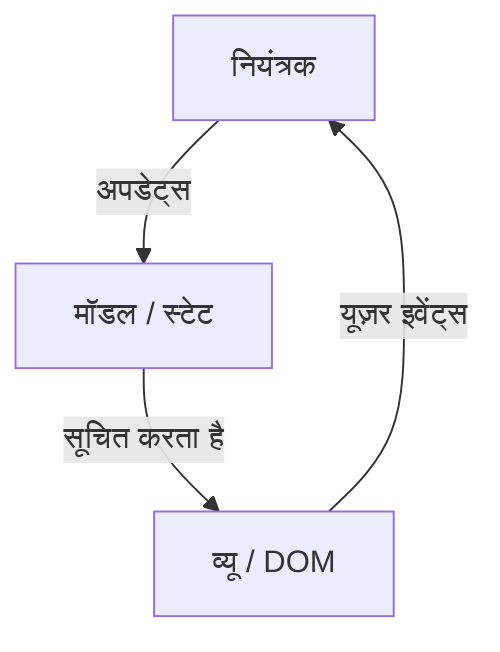
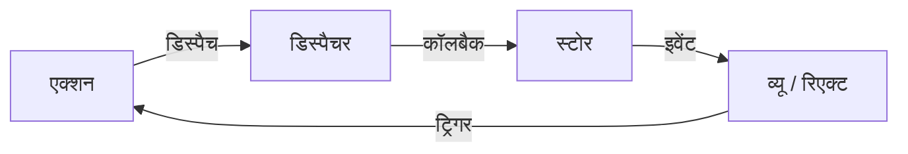
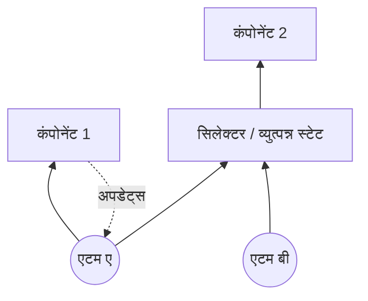
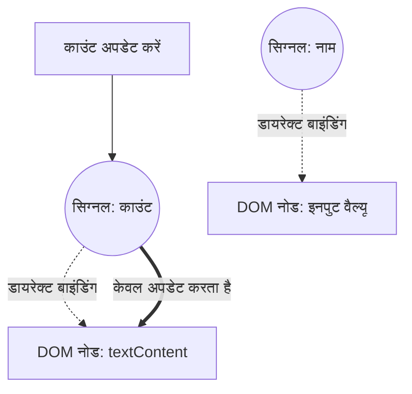

वेब फ्रंटएंड डेवलपमेंट में, सबसे अधिक बहस वाला और लगातार विकसित होने वाला क्षेत्र "स्टेट मैनेजमेंट ([State](https://kenji.blog/hi/p/iac-infrastructure-as-code-terraform/) Management)" है। आधुनिक वेब एप्लिकेशन केवल दस्तावेज़ प्रदर्शित करने से लेकर डेस्कटॉप एप्लिकेशन के बराबर जटिल इंटरैक्शन वाले सॉफ़्टवेयर में बदल गए हैं। इसके साथ ही, एप्लिकेशन की स्टेट को कैसे प्रबंधित किया जाए और UI के साथ कैसे सिंक्रोनाइज़ किया जाए, यह हर फ्रंटएंड इंजीनियर के सामने सबसे बड़ी चुनौती बन गया है।

इस लेख में, हम फ्रंटएंड स्टेट मैनेजमेंट के इतिहास को पीछे मुड़कर देखेंगे, प्रत्येक युग की चुनौतियों और समाधानों का पता लगाएंगे, और भविष्य की ओर पैराडाइम शिफ्ट (विशेष रूप से Signals और Reactivity के विकास) में गहराई से उतरेंगे।

## 1. स्टेट मैनेजमेंट क्या है? यह फ्रंटएंड का सबसे महत्वपूर्ण मुद्दा क्यों है?

सबसे पहले, "स्टेट (State)" क्या है? वेब एप्लिकेशन में, स्टेट का अर्थ है "कोई भी डेटा जो समय के साथ बदलता है और यूज़र इंटरफ़ेस (UI) के प्रदर्शन को प्रभावित करता है"।

- सर्वर से प्राप्त यूज़र जानकारी या सूची डेटा
- फ़ॉर्म में दर्ज किया गया टेक्स्ट
- मॉडल विंडो खुली है या बंद, यह दर्शाने वाला फ़्लैग
- वर्तमान URL पथ या क्वेरी पैरामीटर
- डार्क मोड या लाइट मोड की थीम सेटिंग

ये सभी "स्टेट" हैं। एप्लिकेशन जितना जटिल होता है, ये स्टेट उतने ही अधिक हो जाते हैं और एक-दूसरे पर निर्भर हो जाते हैं।

### 1.1 UI स्टेट का प्रतिचित्रण है

डिक्लेरेटिव UI (Declarative UI) के युग में, UI को एक शुद्ध फ़ंक्शन के रूप में मॉडल किया जाता है जो स्टेट को इनपुट के रूप में लेता है। इसे गणितीय रूप से इस प्रकार व्यक्त किया जा सकता है:

$ UI = f(State) $

यह सरल सूत्र React जैसे आधुनिक फ्रेमवर्क के मूल दर्शन का निर्माण करता है। यदि स्टेट $ State $ बदलता है, तो फ़ंक्शन $ f $ फिर से निष्पादित (री-रेंडर) होता है, और एक नया $ UI $ उत्पन्न होता है।
यहाँ महत्वपूर्ण बात यह है कि डेवलपर्स को इस बात का आदेशात्मक रूप से वर्णन करने की आवश्यकता नहीं है कि "UI को कैसे बदलना है (How)", बल्कि घोषणात्मक रूप से वर्णन करना है कि "स्टेट क्या होना चाहिए, और इसके जवाब में UI कैसा दिखना चाहिए (What)"।

हालाँकि, वास्तविक एप्लिकेशन स्थिर नहीं होते हैं। यूज़र के इनपुट $ Action $ के आधार पर स्टेट बदलता है। इसे ध्यान में रखते हुए, स्टेट को समय $ t $ के फ़ंक्शन के रूप में निम्नलिखित पुनरावृत्ति संबंध द्वारा दर्शाया जा सकता है:

$ State_{t+1} = update(State_t, Action) $

दूसरे शब्दों में, स्टेट मैनेजमेंट की कठिनाई को इसमें संक्षेपित किया जा सकता है: **"हम असीमित संख्या में मौजूद स्टेट्स को बिना किसी विरोध के कैसे बनाए रखें और अपडेट करें, और आवश्यक समय पर केवल आवश्यक भागों को UI के साथ कुशलतापूर्वक कैसे सिंक्रोनाइज़ करें।"**

### 1.2 स्टेट का स्कोप और जीवनचक्र

स्टेट मैनेजमेंट को कठिन बनाने वाला एक और कारक यह है कि प्रत्येक स्टेट का अपना उपयुक्त "स्कोप" और "जीवनचक्र" होता है।

1.  **लोकल स्टेट (Local State)**:
    स्टेट जो केवल एक विशिष्ट कंपोनेंट के भीतर पूरा होता है। उदाहरण के लिए, एकॉर्डियन मेनू का ओपन/क्लोज़ फ़्लैग या बटन का होवर स्टेट। इन्हें विश्व स्तर पर प्रबंधित करने की आवश्यकता नहीं है।
2.  **ग्लोबल स्टेट (Global State)**:
    संपूर्ण एप्लिकेशन या एक-दूसरे से दूर कई कंपोनेंट्स के बीच साझा किया गया स्टेट। उदाहरण के लिए, लॉग इन यूज़र की जानकारी, शॉपिंग कार्ट की सामग्री, या UI थीम सेटिंग्स।
3.  **सर्वर स्टेट (Server State)**:
    स्टेट जो बैकएंड डेटाबेस आदि में सहेजा जाता है, और फ्रंटएंड में एसिंक्रोनस रूप से प्राप्त और कैश किया जाता है। इसे क्लाइंट साइड पर पूरी तरह से नियंत्रित नहीं किया जा सकता है, और इसके लिए कैश अमान्यकरण (Invalidation) या री-फ़ेचिंग जैसे जटिल प्रबंधन की आवश्यकता होती है।

अतीत में फ्रंटएंड डेवलपमेंट में, इन स्टेट्स को बिना किसी भेद के संभाला जाता था, जिसके कारण जटिलता में विस्फोट हुआ और यह बग्स का केंद्र बन गया। आइए इतिहास का अनुसरण करके देखें कि इन स्टेट्स को कैसे अलग और व्यवस्थित किया गया।

## 2. प्रारंभिक युग: जब DOM के पास स्टेट था और jQuery

2010 के आसपास वेब डेवलपमेंट में, स्टेट मैनेजमेंट की स्पष्ट अवधारणा अभी तक स्थापित नहीं हुई थी। कई मामलों में, **स्टेट को सीधे DOM (Document Object Model) में ही रखा जाता था** ।

```javascript
// jQuery युग का स्टेट मैनेजमेंट (DOM में स्टेट सेव करना)
$('#toggle-button').on('click', function() {
    var $menu = $('#dropdown-menu');
    // DOM का class एट्रिब्यूट स्टेट को दर्शाता है
    if ($menu.hasClass('is-active')) {
        $menu.removeClass('is-active');
        $(this).text('बंद करें');
    } else {
        $menu.addClass('is-active');
        $(this).text('खोलें');
    }
});
```

इस दृष्टिकोण में, UI की स्टेट को जानने के लिए DOM को सीधे पढ़ना (DOM क्वेरी निष्पादित करना) आवश्यक था। डेटा (JavaScript चर) और व्यू (HTML/DOM) कसकर जुड़े हुए थे, और जैसे-जैसे एप्लिकेशन का पैमाना बढ़ता गया, यह ट्रैक करना असंभव हो गया कि DOM को कहाँ और कैसे बदला जा रहा था, जिसके परिणामस्वरूप एक असहज स्थिति पैदा हुई जिसे "स्पैगेटी कोड" कहा जाता है।

## 3. MVC आर्किटेक्चर और टू-वे डेटा बाइंडिंग के गुण-दोष

jQuery की सीमाओं पर चिंतन करने के बाद, Backbone.js और AngularJS जैसे MVC (Model-View-Controller) और MVVM (Model-View-ViewModel) आर्किटेक्चर को अपनाने वाले फ्रेमवर्क दिखाई दिए।

इन फ्रेमवर्क का सबसे बड़ा आविष्कार **डेटा (Model) और डिस्प्ले (View) को अलग करना** था।



विशेष रूप से AngularJS (Angular 1.x) द्वारा अपनाया गया "टू-वे डेटा बाइंडिंग (Two-way Data Binding)" क्रांतिकारी था। यदि Model का डेटा बदलता है, तो View स्वचालित रूप से अपडेट हो जाता है, और यदि View (इनपुट फ़ॉर्म आदि) बदलता है, तो Model स्वचालित रूप से अपडेट हो जाता है।

```html
<!-- AngularJS की टू-वे डेटा बाइंडिंग -->
<input type="text" ng-model="user.name">
<p>नमस्ते, {{ user.name }}!</p>
```

इसने डेवलपर्स को प्रत्यक्ष DOM हेरफेर से मुक्त कर दिया। हालाँकि, जैसे-जैसे एप्लिकेशन बड़े होते गए, नई समस्याएँ उत्पन्न हुईं। यह **"कैस्केड अपडेट (Cascade Update)"** है।

जब Model A अपडेट होता है, तो View B अपडेट होता है, View B में परिवर्तन Model C को अपडेट करता है, जो फिर View D को अपडेट करता है... इस तरह, डेटा प्रवाह जटिल हो जाता है, जिससे अनंत लूप या अप्रत्याशित समय पर UI अपडेट होने जैसे बग्स बार-बार आने लगते हैं। यह भविष्यवाणी करना असंभव हो गया कि "कब, किसने और कौन सा डेटा बदला"।

## 4. React और Flux का जन्म: यूनिडायरेक्शनल डेटा फ्लो की क्रांति

2013 में, Facebook (अब Meta) द्वारा React जारी किया गया था। React स्वयं UI (MVC में V) बनाने के लिए एक लाइब्रेरी थी, लेकिन साथ ही उन्होंने **Flux** नामक एक नए आर्किटेक्चर पैटर्न का प्रस्ताव रखा।

Flux का मुख्य उद्देश्य MVC में टू-वे डेटा बाइंडिंग की जटिलता को हल करना था, यानी **"यूनिडायरेक्शनल डेटा फ्लो (Unidirectional Data Flow)"** को साकार करना।



Flux आर्किटेक्चर में सख्त नियम हैं:

1.  **Action**: सिस्टम में बदलाव करने का एकमात्र तरीका। एक ऑब्जेक्ट जो दर्शाता है कि क्या हुआ है।
2.  **Dispatcher**: केंद्रीय हब जो सभी Action प्राप्त करता है और उन्हें Store में वितरित करता है।
3.  **Store**: वह स्थान जो एप्लिकेशन की स्टेट और बिज़नेस लॉजिक रखता है। Store Dispatcher के साथ कॉलबैक रजिस्टर करता है, Action प्राप्त करता है और अपनी स्टेट को अपडेट करता है।
4.  **View**: Store से स्टेट प्राप्त करता है और रेंडर करता है। यूज़र के संचालन के जवाब में नया Action बनाता है।

महत्वपूर्ण बात यह है कि **View कभी भी सीधे Store की स्टेट को नहीं बदल सकता है** । स्टेट को बदलने के लिए, आपको हमेशा एक Action जारी करना होगा और Dispatcher से गुजरते हुए वन-वे चक्र से गुजरना होगा। इसने डेटा प्रवाह को अत्यधिक पूर्वानुमानित (Predictable) बना दिया, जिससे बड़े पैमाने के एप्लिकेशनों में स्टेट मैनेजमेंट की स्थिरता में काफी सुधार हुआ।

## 5. Redux का प्रभुत्व और सीमाएँ

Flux की अवधारणा को और परिष्कृत करते हुए, 2015 में Dan Abramov और अन्य द्वारा विकसित **Redux** फ्रंटएंड स्टेट मैनेजमेंट में वास्तविक मानक (डी फैक्टो स्टैंडर्ड) बन गया।

Redux ने Flux के यूनिडायरेक्शनल डेटा फ्लो में फंक्शनल प्रोग्रामिंग की अवधारणाओं (विशेषकर Elm आर्किटेक्चर) को शामिल किया।

### 5.1 Redux के 3 सिद्धांत

Redux निम्नलिखित 3 सख्त सिद्धांतों पर आधारित है।

1.  **Single source of truth (सत्य का एकल स्रोत)**:
    संपूर्ण एप्लिकेशन की स्टेट को सिंगल स्टोर (Store) के भीतर एक ऑब्जेक्ट ट्री के रूप में रखा जाता है।
2.  **[State](https://kenji.blog/hi/p/iac-infrastructure-as-code-terraform/) is read-only (स्टेट रीड-ओनली है)**:
    स्टेट को बदलने का एकमात्र तरीका एक Action ऑब्जेक्ट जारी करना (Dispatch) है जो बताता है कि क्या हुआ।
3.  **Changes are made with pure functions (परिवर्तन शुद्ध फ़ंक्शंस के साथ किए जाते हैं)**:
    यह निर्दिष्ट करने के लिए कि Action द्वारा स्टेट को कैसे बदला जाता है, Reducer नामक शुद्ध फ़ंक्शन लिखे जाते हैं।

### 5.2 Reducer और शुद्ध फ़ंक्शन

Reducer एक शुद्ध फ़ंक्शन (Pure Function) है जो पिछली स्टेट और Action को लेता है और एक नई स्टेट लौटाता है।

$ State_{new} = Reducer(State_{old}, Action) $

चूंकि यह एक शुद्ध फ़ंक्शन है, इसमें कोई साइड इफ़ेक्ट (API कॉल या DOM में परिवर्तन आदि) नहीं होते हैं, और समान इनपुट के लिए हमेशा समान आउटपुट देता है। इसके अलावा, तर्क के रूप में पारित स्टेट को सीधे बदलने (म्यूटेट) के बजाय, इसे हमेशा एक नया स्टेट ऑब्जेक्ट उत्पन्न करना चाहिए और वापस करना चाहिए।

```javascript
// Redux Reducer का उदाहरण
const initialState = { count: 0, loading: false };

function counterReducer(state = initialState, action) {
  switch (action.type) {
    case 'INCREMENT':
      // स्टेट को सीधे बदले बिना, नया ऑब्जेक्ट लौटाएं (Immutability)
      return { ...state, count: state.count + 1 };
    case 'DECREMENT':
      return { ...state, count: state.count - 1 };
    case 'SET_LOADING':
      return { ...state, loading: action.payload };
    default:
      return state;
  }
}
```

"इम्यूटेबिलिटी (Immutability)" और "शुद्ध फ़ंक्शन" के इस संयोजन ने Redux को शक्तिशाली टाइम-ट्रैवल डिबगिंग (अतीत की स्टेट में वापस जाना) और हॉट-रीलोडिंग प्राप्त करने में सक्षम बनाया। डेवलपर अनुभव (DX) के मामले में यह एक बड़ी सफलता थी।

### 5.3 Redux की चुनौतियाँ: बॉयलरप्लेट की दीवार

Redux एक शानदार आर्किटेक्चर था, लेकिन जैसे-जैसे यह लोकप्रिय हुआ, कई डेवलपर्स असंतुष्ट हो गए। सबसे बड़ा कारण **"बॉयलरप्लेट (रूटीन कोड) की अधिकता"** है।

केवल काउंटर की संख्या बढ़ाने जैसी सरल प्रक्रिया के लिए भी, निम्नलिखित फ़ाइलों को बनाने और संशोधित करने की आवश्यकता थी।
1. Action Type के स्थिरांक की परिभाषा
2. Action Creator फ़ंक्शन का निर्माण
3. Reducer में switch स्टेटमेंट में जोड़ना
4. कंपोनेंट की तरफ `mapStateToProps` और `mapDispatchToProps` लिखना (Hooks से पहले)

इसके अलावा, एसिंक्रोनस प्रोसेसिंग (API संचार आदि) को संभालने के लिए, `redux-thunk` या `redux-saga` जैसे मिडलवेयर पेश करना आवश्यक था, जिससे सीखने की लागत भी तेजी से बढ़ गई।

"क्या Redux ओवरकिल नहीं है?" ऐसी आवाज़ें बढ़ने लगीं, और स्टेट मैनेजमेंट के लिए नए दृष्टिकोण तलाशे जाने लगे।

## 6. Context API और Hooks के माध्यम से "डी-Redux" आंदोलन

2018 में React 16.3 के साथ Context API का नया रूप, और 2019 में React 16.8 के साथ **React Hooks** की शुरूआत, स्टेट मैनेजमेंट के इतिहास में एक प्रमुख मोड़ साबित हुई।

### 6.1 बिल्ट-इन फ़ीचर्स के साथ स्टेट शेयरिंग

Context API का उपयोग करके, आप प्रॉप्स की बकेट ब्रिगेड (Prop Drilling) के बिना कंपोनेंट ट्री में गहराई पर मौजूद कंपोनेंट्स को सीधे डेटा पास कर सकते हैं।
इसके अलावा, `useReducer` Hook को मिलाकर, केवल React के बिल्ट-इन फ़ीचर्स का उपयोग करके Redux जैसा स्टेट मैनेजमेंट संभव हो गया।

```javascript
// Context और useReducer का उपयोग करके स्टेट मैनेजमेंट
import React, { createContext, useContext, useReducer } from 'react';

const CountContext = createContext();

function countReducer(state, action) {
  switch (action.type) {
    case 'INCREMENT': return { count: state.count + 1 };
    default: return state;
  }
}

function CountProvider({ children }) {
  const [state, dispatch] = useReducer(countReducer, { count: 0 });
  return (
    <CountContext.Provider value={{ state, dispatch }}>
      {children}
    </CountContext.Provider>
  );
}

function CounterDisplay() {
  // Context से सीधे स्टेट प्राप्त करें
  const { state } = useContext(CountContext);
  return <div>काउंट: {state.count}</div>;
}
```

इसने इस धारणा को व्यापक रूप से फैला दिया कि "सरल ग्लोबल स्टेट्स के लिए Redux की आवश्यकता नहीं है"। हालाँकि, इस दृष्टिकोण में एक घातक प्रदर्शन दोष था।

### 6.2 Context API की प्रदर्शन समस्याएं (Extra Re-renders)

React के Context API में एक विनिर्देश है कि "जब Context का मान अपडेट होता है, तो उस Context को सब्सक्राइब करने वाले (यानी `useContext` कॉल करने वाले) सभी कंपोनेंट्स बिना शर्त री-रेंडर हो जाते हैं।"

उदाहरण के लिए, यदि `{ user: {...}, theme: 'dark' }` जैसा एक विशाल ऑब्जेक्ट Context द्वारा साझा किया जाता है, तो भले ही केवल `theme` बदलता हो, वे कंपोनेंट्स भी री-रेंडर हो जाएंगे जिन्हें केवल `user` जानकारी की आवश्यकता होती है।
इसे रोकने के लिए, Context को सुविधाओं के अनुसार सूक्ष्म रूप से विभाजित करना या मेमोइज़ेशन के लिए `React.memo` का उपयोग करना आवश्यक था, जिससे जटिलता और बढ़ गई।

चूंकि React डिफ़ॉल्ट रूप से "टॉप-डाउन" रेंडरिंग मॉडल अपनाता है, एक मौलिक मुद्दा सामने आया जहां ग्लोबल स्टेट परिवर्तन अक्सर पूरे ट्री के अनावश्यक री-रेंडरिंग का कारण बनते हैं।

## 7. स्टेट का पृथक्करण: Server [State](https://kenji.blog/hi/p/iac-infrastructure-as-code-terraform/) और Client State

लगभग इसी समय, स्टेट मैनेजमेंट में एक महत्वपूर्ण पैराडाइम शिफ्ट हुआ। यह अहसास था कि "सभी स्टेट्स को सिंगल ग्लोबल स्टोर में नहीं रखा जाना चाहिए।"
विशेष रूप से, सर्वर से प्राप्त डेटा (Server State) की प्रकृति उस UI स्टेट (Client State) से मौलिक रूप से भिन्न है जो पूरी तरह से फ्रंटएंड के भीतर प्रबंधित होती है।

- **Server State**: सर्वर के स्वामित्व में। एसिंक्रोनस रूप से प्राप्त किया जाता है। चूंकि इसे कई लोगों द्वारा साझा और बदला जाता है, इसलिए इसके बासी (Stale) होने की संभावना हमेशा बनी रहती है। कैश प्रबंधन, बैकग्राउंड अपडेट और रिट्राई प्रक्रियाओं की आवश्यकता होती है।
- **Client State**: क्लाइंट (ब्राउज़र) के स्वामित्व में। सिंक्रोनस रूप से अपडेट किया जाता है। जैसे डार्क मोड या मोडल का खुलना/बंद होना।

### 7.1 React Query, SWR, Apollo Client का उदय

Server State के प्रबंधन को Redux या Context से अलग करने और इसे समर्पित लाइब्रेरी पर छोड़ने का दृष्टिकोण मुख्यधारा बन गया। यह **React Query (अब TanStack Query)** और **SWR** का उदय था।

```javascript
// React Query का उपयोग करके Server State का प्रबंधन
import { useQuery } from 'react-query';

function UserProfile({ userId }) {
  // कैश, री-फ़ेच, लोडिंग स्टेट और एरर स्टेट सब स्वचालित रूप से प्रबंधित
  const { data, isLoading, error } = useQuery(['user', userId], fetchUser);

  if (isLoading) return <div>लोड हो रहा है...</div>;
  if (error) return <div>त्रुटि!</div>;

  return <div>नाम: {data.name}</div>;
}
```

इन लाइब्रेरीज ने "सर्वर की स्टेट को स्थानीय रूप से कैश करने और आवश्यकतानुसार सिंक्रोनाइज़ करने" की जटिल प्रक्रिया को एब्सट्रैक्ट कर दिया।
परिणामस्वरूप, Redux जैसे ग्लोबल स्टोर में प्रबंधित किया जाने वाला डेटा "केवल शुद्ध क्लाइंट स्टेट" तक सीमित रह गया, जिससे स्टेट मैनेजमेंट का बोझ काफी कम हो गया।

## 8. Atomic [State](https://kenji.blog/hi/p/iac-infrastructure-as-code-terraform/) Management: Recoil और Jotai

Server State के अलग होने के बाद, शेष Client State को कुशलतापूर्वक प्रबंधित करने के लिए एक नई प्रतिस्पर्धा शुरू हुई।
React के रेंडरिंग मॉडल (टॉप-डाउन) और Context API की प्रदर्शन समस्याओं को हल करने के लिए **Atomic State Management** दृष्टिकोण का जन्म हुआ।

2020 में Facebook टीम द्वारा **Recoil** की घोषणा की गई थी, और इससे प्रभावित होकर **Jotai** जैसी लाइब्रेरीज सामने आईं।

### 8.1 बॉटम-अप स्टेट मैनेजमेंट

जबकि Redux का दृष्टिकोण "एक विशाल स्टेट ट्री से आवश्यक भागों को काटना (टॉप-डाउन)" है, Recoil और Jotai का दृष्टिकोण "स्टेट (Atom) की सबसे छोटी इकाई बनाना और उन्हें कंपोनेंट ट्री में इंजेक्ट करने के लिए संयोजित करना (बॉटम-अप)" है।



Atom स्टेट की एक स्वतंत्र इकाई है। कंपोनेंट्स केवल आवश्यक Atoms की सदस्यता (Subscribe) लेते हैं। जब कोई Atom अपडेट होता है, तो केवल उस Atom की सदस्यता लेने वाले कंपोनेंट्स को ही पिनपॉइंट तरीके से री-रेंडर किया जाता है। यह पूरी तरह से Context API के साथ अनावश्यक री-रेंडरिंग समस्या को हल करता है।

```javascript
// Jotai का उपयोग करके Atomic State का उदाहरण
import { atom, useAtom } from 'jotai';

// स्टेट की सबसे छोटी इकाई (Atom) को परिभाषित करें
const priceAtom = atom(1000);
const taxRateAtom = atom(0.1);

// अन्य Atoms से प्राप्त स्टेट (Derived State) को भी परिभाषित किया जा सकता है
const priceWithTaxAtom = atom((get) => {
  return get(priceAtom) * (1 + get(taxRateAtom));
});

function ProductDisplay() {
  const [priceWithTax] = useAtom(priceWithTaxAtom);
  // केवल तब री-रेंडर होता है जब priceAtom या taxRateAtom बदलता है
  return <div>कर सहित: ¥{priceWithTax}</div>;
}
```

Jotai का उपयोग लगभग React के `useState` के समान ही महसूस होता है, जो इसे कम सीखने की लागत और उच्च प्रदर्शन के कारण आधुनिक React एप्लिकेशनों में एक बहुत ही लोकप्रिय विकल्प बनाता है।

## 9. प्रॉक्सी और म्यूटैबिलिटी: Zustand और Valtio

एक और शक्तिशाली प्रवृत्ति के रूप में, लाइब्रेरीज का एक समूह सामने आया है जो बॉयलरप्लेट को काफी कम करता है और अधिक सहज API प्रदान करता है। ये हैं **Zustand** और **Valtio**, जिन्हें Poimandres नामक OSS कलेक्टिव द्वारा विकसित किया गया है।

### 9.1 Zustand: सरलता के चरम पर Flux

Zustand Redux की तरह ही एक सिंगल स्टोर (Flux आर्किटेक्चर) को अपनाता है, लेकिन Reducer या Provider जैसी जटिल अवधारणाओं को समाप्त करता है और Hooks-आधारित अत्यंत सरल API प्रदान करता है।

```javascript
// Zustand का उदाहरण
import { create } from 'zustand';

// स्टोर बनाना। स्टेट और अपडेट फ़ंक्शन को एक साथ परिभाषित करें
const useStore = create((set) => ({
  count: 0,
  increment: () => set((state) => ({ count: state.count + 1 })),
  removeAllBears: () => set({ count: 0 }),
}));

function Counter() {
  // Selector के साथ केवल आवश्यक स्टेट निकालें। अनावश्यक री-रेंडरिंग को रोका जाता है।
  const count = useStore((state) => state.count);
  const increment = useStore((state) => state.increment);

  return <button onClick={increment}>{count}</button>;
}
```

Zustand ने "आधुनिक Redux" के रूप में अपनी स्थिति स्थापित कर ली है जो Redux की मजबूती और Hooks की सादगी को जोड़ती है।

### 9.2 Valtio: Proxy का उपयोग करके म्यूटेबल स्टेट मैनेजमेंट

React की दुनिया में, नियम यह रहा है कि "स्टेट को इम्यूटेबल (अपरिवर्तनीय) माना जाना चाहिए।" हालाँकि, JavaScript ऑब्जेक्ट्स को इम्यूटेबल रूप से अपडेट करना परेशानी भरा हो सकता है (विशेषकर जब नेस्टिंग गहरी हो)।

ES6 `Proxy` ऑब्जेक्ट का लाभ उठाकर, Valtio एक क्रांतिकारी दृष्टिकोण अपनाता है "म्यूटेबल (परिवर्तनीय) संचालन करते हुए आंतरिक रूप से इम्यूटेबल स्टेट अपडेट और रिएक्टिविटी प्राप्त करना।" यह Vue.js (Vue 3) के Reactivity सिस्टम के समान एक दृष्टिकोण है।

```javascript
// Valtio का उदाहरण
import { proxy, useSnapshot } from 'valtio';

// Proxy से लिपटा स्टेट ऑब्जेक्ट
const state = proxy({ count: 0, user: { name: 'Alice' } });

// आप सीधे असाइनमेंट (म्यूटेट) द्वारा इसे सामान्य JavaScript चर की तरह अपडेट कर सकते हैं
const increment = () => {
  state.count += 1;
};

function Counter() {
  // स्टेट को सब्सक्राइब करने के लिए useSnapshot का उपयोग करें। केवल एक्सेस की गई प्रॉपर्टी के परिवर्तन का पता चलता है।
  const snap = useSnapshot(state);
  return <button onClick={increment}>{snap.count}</button>;
}
```

Valtio विकास के अनुभव में उच्चतम स्तर की सहजता प्रदान करता है। Vue या Svelte के अभ्यस्त डेवलपर्स द्वारा React का उपयोग करते समय भी इस दृष्टिकोण को प्राथमिकता दी जाती है।

## 10. पैराडाइम शिफ्ट: Signals और फाइन-ग्रेन्ड रिएक्टिविटी (Fine-grained Reactivity)

और अब, फ्रंटएंड स्टेट मैनेजमेंट में सबसे बड़ा बज़वर्ड **Signals** और **फाइन-ग्रेन्ड रिएक्टिविटी (Fine-grained Reactivity)** है।

React वर्चुअल DOM (Virtual DOM) का उपयोग यह दृष्टिकोण अपनाने के लिए करता है "कंपोनेंट फ़ंक्शन को फिर से निष्पादित करके एक नया UI ट्री बनाएं, पिछले ट्री के साथ अंतर (Diff) लें, और DOM को अपडेट करें।"
इसके विपरीत, Signals का उपयोग करने वाले फ्रेमवर्क (SolidJS, Vue 3, Svelte 5 (Runes), Preact, Angular, आदि) पूरी तरह से अलग दृष्टिकोण अपनाते हैं।

### 10.1 Signals क्या हैं?

Signal एक ऐसा तंत्र है जो एक मूल्य रखता है जो समय के साथ बदलता है, और स्वचालित रूप से उन कार्यों या अभिव्यक्तियों (Effects / Computed) को फिर से निष्पादित करता है जो उस मूल्य पर निर्भर करते हैं।

```javascript
// SolidJS में Signal का उदाहरण
import { createSignal, createEffect } from "solid-js";

// Signal का निर्माण। गेट्टर और सेटर लौटाए जाते हैं।
const [count, setCount] = createSignal(0);

// Effect (साइड इफ़ेक्ट)। यह पता लगाता है कि count() को कॉल किया गया था और निर्भरता को रिकॉर्ड करता है।
// जब count अपडेट किया जाता है तो स्वचालित रूप से पुनः निष्पादित होता है।
createEffect(() => {
  console.log("Count changed to:", count());
});

setCount(1); // कंसोल में "Count changed to: 1" प्रदर्शित होता है
```

### 10.2 React के साथ निर्णायक अंतर

React (वर्चुअल DOM) और Signals (फाइन-ग्रेन्ड रिएक्टिविटी) के बीच सबसे बड़ा अंतर **"अपडेट की ग्रैन्युलैरिटी (Granularity)"** है।

React के मामले में, जब स्टेट बदलता है, तो **पूरा कंपोनेंट फिर से निष्पादित** हो जाता है। डेवलपर्स को `useMemo`, `useCallback`, और `React.memo` का उपयोग करके मैन्युअल रूप से ऑप्टिमाइज़ करने की आवश्यकता होती है, यह कहते हुए कि "यहाँ से नीचे री-रेंडर करने की आवश्यकता नहीं है"।

दूसरी ओर, SolidJS जैसे Signals-आधारित फ्रेमवर्क में, **कंपोनेंट फ़ंक्शंस केवल इनिशियलाइज़ेशन के समय एक बार निष्पादित होते हैं** ।
यदि टेम्पलेट के भीतर Signal के मान का उपयोग किया जाता है, तो फ्रेमवर्क संकलन के समय एक प्रत्यक्ष निर्भरता बनाता है, "यदि यह Signal बदलता है, तो केवल इस DOM नोड (टेक्स्ट नोड या एट्रिब्यूट) को अपडेट करें।"



दूसरे शब्दों में, यह वर्चुअल DOM अंतर गणना के ओवरहेड को छोड़ देता है और सीधे, शल्य चिकित्सा के रूप में DOM नोड्स को फिर से लिखता है जिन्हें बदलने की आवश्यकता होती है (Fine-grained update)। इसके परिणामस्वरूप अत्यधिक प्रदर्शन होता है और एक बेहतरीन DX (डेवलपर अनुभव) मिलता है जहाँ डेवलपर्स को मैन्युअल ऑप्टिमाइज़ेशन करने की आवश्यकता नहीं होती है।

### 10.3 Signals का गणितीय मॉडल

Signals के पीछे "रिएक्टिव प्रोग्रामिंग" का सिद्धांत है, जो स्टेट्स और गणनाओं की निर्भरता को **निर्देशित अचक्रीय ग्राफ (Directed Acyclic Graph: DAG)** के रूप में मॉडल करता है, और ग्राफ के टोपोलॉजिकल सॉर्ट का उपयोग करके कुशलतापूर्वक अपडेट क्रम निर्धारित करता है।

यदि कोई व्युत्पन्न स्टेट (Computed) $ C $ Signals $ S_1, S_2 $ पर निर्भर करती है, तो किनारे $ S_1 \to C $, $ S_2 \to C $ बनते हैं।
जब कोई मान अपडेट किया जाता है, तो ग्राफ को पार करके केवल आवश्यक नोड्स का मूल्यांकन (Push / Pull हाइब्रिड रणनीति, आदि का उपयोग करके) करके, यह ग्लिच (Glitch: एक ऐसी घटना जहाँ असंगत UI की मध्यवर्ती स्थिति पल भर के लिए प्रदर्शित होती है) को रोकता है, और टोपोलॉजिकल स्थिरता की गारंटी देता है।

## 11. React का पलटवार: React Compiler (Forget)

Signals के उदय का प्रतिकार करने के लिए React क्या करेगा? React टीम ने "React में Signals का परिचय देने" के बजाय पूरी तरह से अलग दृष्टिकोण चुना। वह है **React Compiler (डेवलपमेंट कोडनेम: React Forget)** ।

React का दर्शन फंक्शनल प्रोग्रामिंग के एक सरल मॉडल को बनाए रखना है कि "UI स्टेट का एक फंक्शन है।" हालाँकि, उस मॉडल को उच्च प्रदर्शन के साथ निष्पादित करने के लिए, डेवलपर्स को मैन्युअल रूप से मेमोइज़ (`useMemo`, `useCallback`) करने की आवश्यकता थी।

React Compiler बिल्ड के समय React कंपोनेंट कोड का स्थिर रूप से विश्लेषण करता है और **स्वचालित रूप से आवश्यक मेमोइज़ेशन कोड सम्मिलित करता है** ।

दूसरे शब्दों में, बिना Signals के नए API सीखे या मैन्युअल रूप से `useMemo` लिखे, डेवलपर्स केवल सामान्य रूप से JavaScript लिख सकते हैं, और कंपाइलर पृष्ठभूमि में फाइन-ग्रेन्ड अपडेट्स के करीब अनुकूलन लागू करेगा। यह इस मायने में एक बहुत ही महत्वाकांक्षी परियोजना है कि यह "डेवलपर अनुभव से समझौता किए बिना प्रदर्शन में सुधार" करता है।

## 12. अगली पीढ़ी का पैराडाइम: हाइड्रेशन से दूर जाना और Resumability

अंत में, स्टेट मैनेजमेंट के भविष्य में एक चीज़ जिसे अनदेखा नहीं किया जा सकता वह है सर्वर-साइड रेंडरिंग (SSR) और क्लाइंट साइड के बीच सहयोग में "हाइड्रेशन (Hydration)" की चुनौती।

पारंपरिक SSR (Next.js आदि) में, सर्वर द्वारा जनरेट किए गए HTML को ब्राउज़र में भेजने के बाद, "Hydration" नामक एक भारी प्रक्रिया आवश्यक थी, जहाँ ब्राउज़र JavaScript को लोड और निष्पादित करता है, इवेंट श्रोताओं को जोड़ता है और स्टेट का पुनर्निर्माण करता है। इस दौरान, यूज़र इंटरैक्शन अवरुद्ध रहता है।

**Qwik** जैसे अगली पीढ़ी के फ्रेमवर्क ने स्टेट मैनेजमेंट और JavaScript लोडिंग पर मौलिक रूप से पुनर्विचार किया है। वे **Resumability (पुनरारंभ करने की क्षमता)** की अवधारणा का प्रस्ताव करते हैं।

सर्वर पर रेंडर की गई स्टेट को सीरियलाइज़ किया जाता है और HTML में एम्बेड किया जाता है, और क्लाइंट शून्य से JavaScript निष्पादन को "शुरू" करने के बजाय, सर्वर जहाँ रुका था वहीं से "फिर से शुरू (Resume)" करता है। इसके परिणामस्वरूप, प्रारंभिक लोड का JavaScript आकार काफी कम हो जाता है, और Hydration ओवरहेड शून्य हो जाता है।

## 13. निष्कर्ष: स्टेट मैनेजमेंट किस ओर जा रहा है?

MVC के भ्रम से शुरू होकर, Flux/Redux के साथ पूर्वानुमान की प्राप्ति, Hooks के साथ सरलीकरण, Server [State](https://kenji.blog/hi/p/iac-infrastructure-as-code-terraform/) का पृथक्करण, Atomic और Proxy द्वारा दक्षता, और Signals द्वारा फाइन-ग्रेन्ड रिएक्टिविटी तक।

फ्रंटएंड स्टेट मैनेजमेंट के लगभग 15 वर्षों के इतिहास को देखते हुए, एक स्पष्ट प्रवृत्ति उभरती है। वह है **"बॉयलरप्लेट को कम करना, डेवलपर्स पर संज्ञानात्मक भार को कम करना, जबकि पृष्ठभूमि में सिस्टम (फ्रेमवर्क और कंपाइलर) स्वचालित रूप से प्रदर्शन को अनुकूलित करने की दिशा में विकसित हो रहे हैं।"**

- **छोटे से मध्यम आकार के React विकास**: Jotai और Zustand अक्सर इष्टतम विकल्प होते हैं।
- **डेटा फेचिंग से जुड़े विकास**: TanStack Query जैसे Server State प्रबंधन उपकरण आवश्यक हैं।
- **नए प्रोजेक्ट जो अत्यधिक प्रदर्शन और DX की मांग करते हैं**: SolidJS और Vue जैसे Signals को अपनाने वाले फ्रेमवर्क आकर्षक हैं।
- **React का भविष्य**: React Compiler की परिपक्वता के साथ, स्टेट मैनेजमेंट के कई प्रदर्शन मुद्दों को स्वचालन के माध्यम से हल किया जाएगा।

कोई "सिल्वर बुलेट" मौजूद नहीं है। हालाँकि, यह समझकर कि अतीत की चुनौतियों को कैसे हल किया गया है, हम अपने सामने मौजूद प्रोजेक्ट के लिए सबसे उपयुक्त और भविष्योन्मुखी आर्किटेक्चर चुन सकते हैं। स्टेट मैनेजमेंट का विकास निश्चित रूप से भविष्य में भी हम फ्रंटएंड इंजीनियर्स को उत्साहित करता रहेगा।
