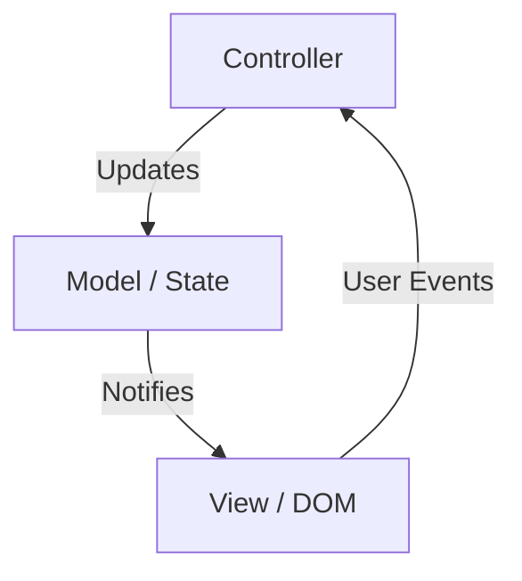
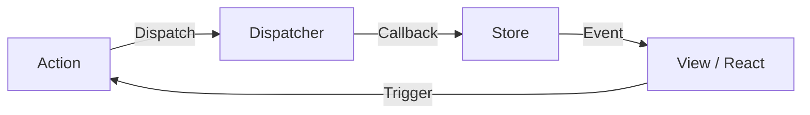
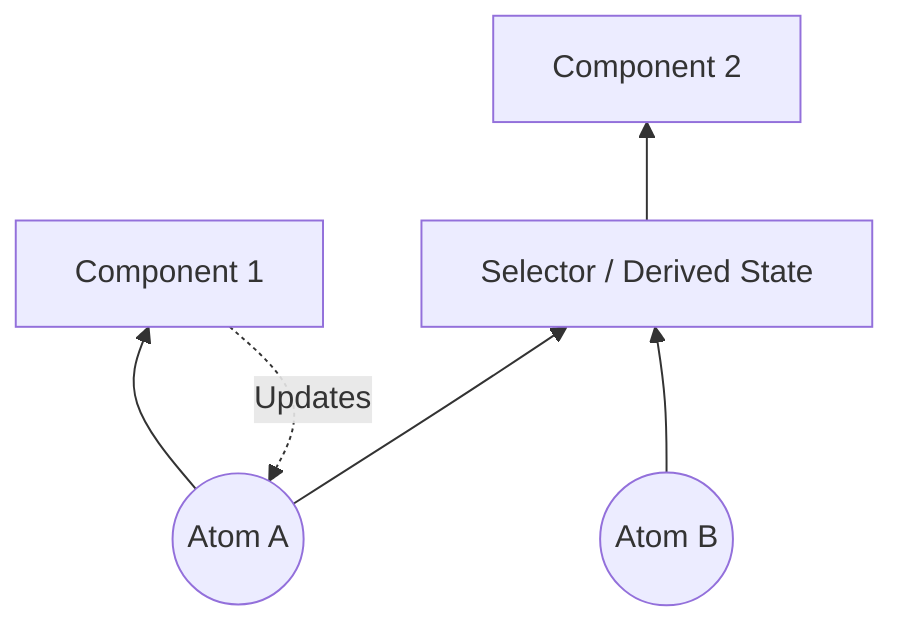
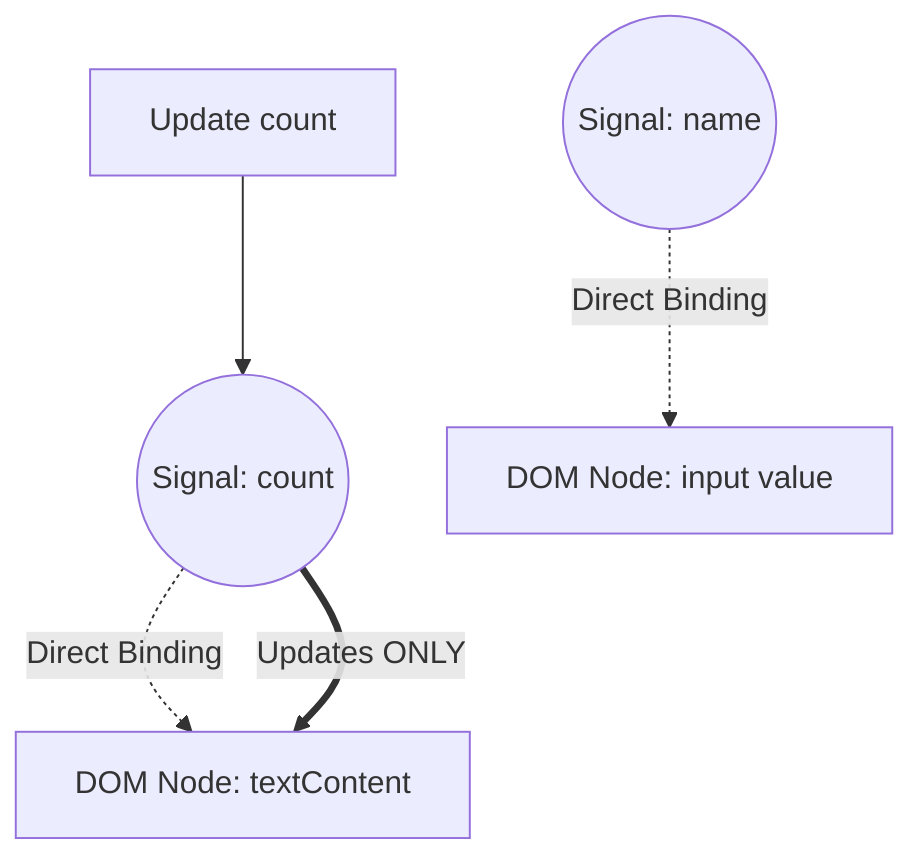

Dalam pengembangan frontend web, area yang paling banyak diperdebatkan dan terus berevolusi adalah "Manajemen State" (State Management). Aplikasi web modern telah bertransformasi dari sekadar menampilkan dokumen menjadi perangkat lunak dengan interaksi kompleks yang sebanding dengan aplikasi desktop. Seiring dengan hal itu, bagaimana mengelola state aplikasi dan menyinkronkannya dengan UI telah menjadi tantangan terbesar yang dihadapi oleh semua insinyur frontend.

Pada artikel ini, kita akan melihat kembali sejarah manajemen state frontend, menelusuri tantangan dan solusi di setiap era, dan menggali secara mendalam serta terperinci tentang pergeseran paradigma menuju masa depan (terutama evolusi Signals dan Reactivity).

## 1. Apa itu Manajemen State? Mengapa ini menjadi tantangan terpenting di frontend?

Lalu, apa sebenarnya "State" (status/keadaan) itu? Dalam aplikasi web, state merujuk pada "semua data yang berubah seiring waktu dan memengaruhi tampilan antarmuka pengguna (UI)".

- Informasi pengguna dan data daftar yang diambil dari server
- Teks yang dimasukkan ke dalam formulir
- Tanda (flag) yang menunjukkan apakah jendela modal sedang terbuka atau tertutup
- Path URL saat ini dan parameter kueri
- Pengaturan tema apakah mode gelap atau mode terang

Semua ini adalah "state". Semakin kompleks sebuah aplikasi, state ini akan bertambah tak terhitung jumlahnya dan saling bergantung satu sama lain.

### 1.1 UI adalah Pemetaan dari State

Di era Declarative UI (UI Deklaratif), UI dimodelkan sebagai fungsi murni dengan state sebagai masukannya. Dinyatakan dalam rumus matematika sebagai berikut:

$ UI = f(State) $

Rumus sederhana ini adalah filosofi mendasar dari kerangka kerja modern seperti React. Jika $ State $ berubah, fungsi $ f $ dijalankan kembali (re-rendering), dan $ UI $ baru akan dihasilkan.
Yang penting di sini adalah bahwa pengembang tidak menulis secara imperatif "bagaimana mengubah UI (How)", melainkan menulis secara deklaratif "bagaimana state seharusnya, dan bagaimana UI seharusnya terlihat sebagai respons terhadapnya (What)".

Namun, aplikasi dunia nyata tidaklah statis. State berubah karena input pengguna $ Action $. Mengingat hal ini, state dapat dinyatakan sebagai fungsi dari waktu $ t $ dengan relasi rekurensi sebagai berikut:

$ State_{t+1} = update(State_t, Action) $

Singkatnya, kesulitan dalam manajemen state bermuara pada: **"bagaimana menjaga dan memperbarui state yang tak terhitung jumlahnya tanpa kontradiksi, serta menyinkronkan hanya bagian yang diperlukan ke UI secara efisien pada waktu yang tepat"**.

### 1.2 Cakupan (Scope) dan Siklus Hidup (Lifecycle) State

Faktor lain yang membuat manajemen state menjadi sulit adalah bahwa setiap state memiliki "cakupan" dan "siklus hidup" yang sesuai.

1.  **Local State (State Lokal)**:
    State yang hanya diselesaikan di dalam komponen tertentu. Misalnya, tanda buka/tutup menu akordeon, atau state hover tombol. Ini tidak perlu dikelola secara global.
2.  **Global State (State Global)**:
    State yang dibagikan di seluruh aplikasi atau di antara beberapa komponen yang terpisah. Misalnya, informasi pengguna yang sedang login, isi keranjang belanja, atau pengaturan tema UI.
3.  **Server State (State Server)**:
    State yang disimpan dalam basis data backend, diambil dan di-cache secara asinkron di frontend untuk ditampilkan. Ini tidak sepenuhnya dikendalikan oleh sisi klien, dan memerlukan manajemen yang kompleks seperti pembatalan cache (invalidation) dan pengambilan ulang (refetching).

Dalam pengembangan frontend di masa lalu, state-state ini ditangani tanpa pembedaan, sehingga kompleksitas meledak dan menjadi sarang bug. Dengan menelusuri sejarah, mari kita lihat bagaimana state-state ini dipisahkan dan diorganisir.

## 2. Era Awal: Zaman Ketika DOM Memiliki State dan jQuery

Dalam pengembangan web sekitar tahun 2010, konsep manajemen state yang jelas belum terbentuk. Dalam banyak kasus, **state disimpan secara langsung di dalam DOM (Document Object Model) itu sendiri**.

```javascript
// Manajemen state di era jQuery (Menyimpan state di dalam DOM)
$('#toggle-button').on('click', function() {
    var $menu = $('#dropdown-menu');
    // Atribut class pada DOM merepresentasikan state
    if ($menu.hasClass('is-active')) {
        $menu.removeClass('is-active');
        $(this).text('Open');
    } else {
        $menu.addClass('is-active');
        $(this).text('Close');
    }
});
```

Dalam pendekatan ini, perlu untuk membaca DOM secara langsung (mengeksekusi kueri DOM) guna mengetahui state dari UI. Data (variabel JavaScript) dan tampilan (HTML/DOM) sangat terikat erat, dan seiring bertambahnya skala aplikasi, menjadi mustahil untuk melacak di mana dan bagaimana DOM ditulis ulang, yang berujung pada state yang tidak dapat dikelola, yang dikenal sebagai "kode spageti".

## 3. Pro dan Kontra Arsitektur MVC serta Data Binding Dua Arah

Sebagai refleksi atas keterbatasan jQuery, kerangka kerja yang mengadopsi arsitektur MVC (Model-View-Controller) dan MVVM (Model-View-ViewModel) seperti Backbone.js dan AngularJS pun bermunculan.

Penemuan terbesar dari kerangka kerja ini adalah **memisahkan data (Model) dan tampilan (View)**.



Khususnya, "Data Binding Dua Arah" (Two-way Data Binding) yang diadopsi oleh AngularJS (Angular 1.x) sangatlah inovatif. Ini adalah mekanisme di mana jika data Model berubah, View akan diperbarui secara otomatis, dan jika View (seperti form input) berubah, Model akan diperbarui secara otomatis.

```html
<!-- Data binding dua arah di AngularJS -->
<input type="text" ng-model="user.name">
<p>Hello, {{ user.name }}!</p>
```

Dengan ini, pengembang dibebaskan dari manipulasi DOM secara langsung. Namun, ketika aplikasi berskala besar, masalah baru muncul: **"Pembaruan Berantai (Cascade Updates)"**.

Ketika Model A diperbarui, View B diperbarui, perubahan View B memperbarui Model C, yang selanjutnya memperbarui View D... dan seterusnya. Aliran data menjadi saling terkait dengan rumit, sering kali menyebabkan bug seperti terjebak dalam loop tak terbatas atau UI diperbarui pada waktu yang tidak terduga. Menjadi tidak mungkin untuk memprediksi "kapan, siapa, dan data mana yang diubah".

## 4. Lahirnya React dan Flux: Revolusi Aliran Data Satu Arah

Pada tahun 2013, React dirilis oleh Facebook (sekarang Meta). Meskipun React itu sendiri adalah pustaka untuk membangun UI (bagian 'V' dalam MVC), mereka secara bersamaan mengusulkan pola arsitektur baru, yaitu **Flux**.

Tujuan utama Flux adalah untuk menyelesaikan kompleksitas data binding dua arah dalam MVC, yaitu dengan mewujudkan **"Aliran Data Satu Arah (Unidirectional Data Flow)"**.



Arsitektur Flux memiliki aturan yang ketat:

1.  **Action**: Satu-satunya cara untuk melakukan perubahan pada sistem. Sebuah objek yang menunjukkan apa yang terjadi.
2.  **Dispatcher**: Hub pusat yang menerima semua Action dan mendistribusikannya ke Store.
3.  **Store**: Tempat penyimpanan state aplikasi dan logika bisnis. Store mendaftarkan callback ke Dispatcher, menerima Action, dan memperbarui statenya sendiri.
4.  **View**: Menerima state dari Store dan merendernya. Menghasilkan Action baru sebagai respons terhadap tindakan pengguna.

Yang terpenting adalah **View tidak akan pernah bisa mengubah state dari Store secara langsung**. Untuk mengubah state, Anda harus menerbitkan Action dan melalui Dispatcher, yang memutar siklus satu arah. Hal ini membuat aliran data sangat dapat diprediksi (Predictable), secara dramatis meningkatkan stabilitas manajemen state dalam aplikasi berskala besar.

## 5. Dominasi dan Keterbatasan Redux

Memperhalus konsep Flux lebih jauh, dan menjadi standar de facto untuk manajemen state frontend adalah **Redux**, yang dikembangkan oleh Dan Abramov dan kawan-kawan pada tahun 2015.

Redux menggabungkan konsep pemrograman fungsional (terutama arsitektur Elm) ke dalam aliran data satu arah milik Flux.

### 5.1 Tiga Prinsip Redux

Redux didasarkan pada tiga prinsip ketat berikut:

1.  **Single source of truth (Satu sumber kebenaran tunggal)**:
    State seluruh aplikasi disimpan sebagai pohon objek di dalam satu Store (penyimpanan) tunggal.
2.  **State is read-only (State bersifat hanya baca)**:
    Satu-satunya cara untuk mengubah state adalah dengan menerbitkan (Dispatch) objek Action yang menunjukkan apa yang terjadi.
3.  **Changes are made with pure functions (Perubahan dilakukan dengan fungsi murni)**:
    Untuk menentukan bagaimana state diubah oleh Action, Anda menulis fungsi murni yang disebut Reducer.

### 5.2 Reducer dan Fungsi Murni

Reducer adalah fungsi murni (Pure Function) yang menerima state sebelumnya dan Action, lalu mengembalikan state yang baru.

$ State_{new} = Reducer(State_{old}, Action) $

Karena merupakan fungsi murni, reducer tidak memiliki efek samping (side effects, seperti panggilan API atau modifikasi DOM) dan selalu mengembalikan output yang sama untuk input yang sama. Selain itu, Anda tidak boleh mengubah (mutasi) state yang dilewatkan sebagai argumen secara langsung, melainkan harus selalu membuat dan mengembalikan objek state baru.

```javascript
// Contoh Reducer di Redux
const initialState = { count: 0, loading: false };

function counterReducer(state = initialState, action) {
  switch (action.type) {
    case 'INCREMENT':
      // Mengembalikan objek baru tanpa mengubah state secara langsung (Immutability)
      return { ...state, count: state.count + 1 };
    case 'DECREMENT':
      return { ...state, count: state.count - 1 };
    case 'SET_LOADING':
      return { ...state, loading: action.payload };
    default:
      return state;
  }
}
```

Kombinasi antara "imuttabilitas (ketidakberubahan)" dan "fungsi murni" ini memungkinkan Redux untuk menyediakan time-travel debugging yang kuat (memutar kembali ke state sebelumnya) dan hot-reloading. Ini merupakan terobosan besar dalam hal pengalaman pengembang (DX).

### 5.3 Tantangan Redux: Tembok Boilerplate

Meskipun Redux adalah arsitektur yang luar biasa, seiring kepopulerannya, banyak pengembang mulai merasa tidak puas. Alasan utamanya adalah **"Banyaknya kode boilerplate (kode berulang)"**.

Bahkan untuk operasi sederhana seperti hanya menambah angka penghitung, Anda perlu membuat atau memodifikasi file-file berikut:
1. Definisi konstanta untuk Action Type
2. Pembuatan fungsi Action Creator
3. Penambahan pada pernyataan switch di Reducer
4. Penulisan `mapStateToProps` dan `mapDispatchToProps` di sisi komponen (sebelum adanya Hooks)

Selain itu, untuk menangani operasi asinkron (seperti komunikasi API), diperlukan pengenalan middleware seperti `redux-thunk` atau `redux-saga`, yang menyebabkan biaya pembelajaran melonjak tajam.

Suara-suara yang mempertanyakan "Bukankah Redux itu berlebihan (overkill)?" semakin nyaring, dan pendekatan baru untuk manajemen state mulai dijajaki.

## 6. Gerakan "Lepas dari Redux" melalui Context API dan Hooks

Pembaruan Context API pada React 16.3 di tahun 2018, dan pengenalan **React Hooks** pada React 16.8 di tahun 2019, menjadi titik balik utama dalam sejarah manajemen state.

### 6.1 Berbagi State dengan Fitur Bawaan

Dengan menggunakan Context API, data dapat diteruskan secara langsung ke komponen yang berada jauh di dalam pohon komponen, tanpa perlu melakukan oper-operan properti (Prop Drilling).
Selanjutnya, dengan menggabungkan Hook `useReducer`, menjadi mungkin untuk mengimplementasikan manajemen state seperti Redux hanya dengan fitur bawaan React.

```javascript
// Manajemen state menggunakan Context dan useReducer
import React, { createContext, useContext, useReducer } from 'react';

const CountContext = createContext();

function countReducer(state, action) {
  switch (action.type) {
    case 'INCREMENT': return { count: state.count + 1 };
    default: return state;
  }
}

function CountProvider({ children }) {
  const [state, dispatch] = useReducer(countReducer, { count: 0 });
  return (
    <CountContext.Provider value={{ state, dispatch }}>
      {children}
    </CountContext.Provider>
  );
}

function CounterDisplay() {
  // Mendapatkan state secara langsung dari Context
  const { state } = useContext(CountContext);
  return <div>Count: {state.count}</div>;
}
```

Hal ini membuat pemahaman bahwa "Redux tidak diperlukan untuk state global yang sederhana" tersebar luas. Namun, pendekatan ini memiliki jebakan performa yang fatal.

### 6.2 Masalah Performa Context API (Rerender Ekstra)

Context API di React memiliki spesifikasi: "Ketika nilai Context diperbarui, semua komponen yang berlangganan Context tersebut (yang memanggil `useContext`) akan dirender ulang tanpa syarat."

Sebagai contoh, jika sebuah objek besar seperti `{ user: {...}, theme: 'dark' }` dibagikan di Context, maka hanya dengan mengubah `theme`, komponen yang hanya memerlukan informasi `user` pun akan ikut dirender ulang.
Untuk mencegah hal ini, Anda harus memecah Context menjadi bagian-bagian kecil berdasarkan fungsinya, atau melakukan memoisasi dengan menggunakan `React.memo`, yang justru menghasilkan peningkatan kompleksitas.

Karena React mengadopsi model rendering "top-down" (dari atas ke bawah) secara default, masalah mendasar pun mencuat: perubahan state global sangat rentan memicu rerender yang tidak perlu di seluruh pohon.

## 7. Pemisahan State: Server State dan Client State

Sekitar waktu ini, terjadi pergeseran paradigma yang penting dalam manajemen state. Yaitu, kesadaran bahwa "tidak semua state harus dimasukkan ke dalam satu store global tunggal".
Khususnya, data yang diambil dari server (Server State) memiliki sifat yang pada dasarnya berbeda dari state UI (Client State) yang hanya diselesaikan di frontend.

- **Server State**: Dimiliki oleh server. Diambil secara asinkron. Karena dibagikan dan diubah oleh banyak orang, state ini berpotensi menjadi usang (Stale) setiap saat. Memerlukan manajemen cache, pembaruan di latar belakang, dan penanganan coba ulang (retry).
- **Client State**: Dimiliki oleh klien (browser). Diperbarui secara sinkron. Misalnya mode gelap, atau membuka/menutup modal.

### 7.1 Kebangkitan React Query, SWR, dan Apollo Client

Pendekatan untuk memisahkan manajemen Server State dari Redux atau Context, dan menyerahkannya kepada pustaka khusus menjadi arus utama. Hal ini ditandai dengan munculnya **React Query (kini TanStack Query)** dan **SWR**.

```javascript
// Manajemen Server State menggunakan React Query
import { useQuery } from 'react-query';

function UserProfile({ userId }) {
  // Secara otomatis mengelola cache, refetching, status loading, dan status error
  const { data, isLoading, error } = useQuery(['user', userId], fetchUser);

  if (isLoading) return <div>Loading...</div>;
  if (error) return <div>Error!</div>;

  return <div>Name: {data.name}</div>;
}
```

Pustaka-pustaka ini mengabstraksi proses rumit dari "mencache state server secara lokal dan menyinkronkannya sesuai kebutuhan".
Sebagai hasilnya, data yang perlu dikelola dalam store global seperti Redux berkurang drastis menjadi hanya "client state murni", yang secara signifikan meringankan beban manajemen state.

## 8. Atomic State Management: Recoil dan Jotai

Setelah Server State dipisahkan, perlombaan baru dimulai untuk melihat bagaimana mengelola sisa Client State secara efisien.
Pendekatan yang disebut **Atomic State Management** lahir untuk memecahkan masalah performa Context API dan model rendering (top-down) React.

Pada tahun 2020, **Recoil** diumumkan oleh tim Facebook, dan di bawah pengaruhnya, pustaka seperti **Jotai** pun bermunculan.

### 8.1 Manajemen State Bottom-Up (Dari Bawah ke Atas)

Di saat Redux menggunakan pendekatan "memotong bagian yang dibutuhkan dari satu pohon state yang besar (top-down)", Recoil dan Jotai mengambil pendekatan "membuat unit state terkecil (Atom), lalu menggabungkan dan menyuntikkannya ke dalam pohon komponen (bottom-up)".



Atom adalah unit state independen. Komponen hanya berlangganan (Subscribe) ke Atom yang diperlukan. Ketika sebuah Atom diperbarui, hanya komponen yang berlangganan Atom tersebut yang akan dirender ulang secara spesifik. Ini sepenuhnya memecahkan masalah rerender yang tidak perlu yang dialami oleh Context API.

```javascript
// Contoh Atomic State menggunakan Jotai
import { atom, useAtom } from 'jotai';

// Mendefinisikan unit state terkecil (Atom)
const priceAtom = atom(1000);
const taxRateAtom = atom(0.1);

// State turunan (Derived State) dari Atom lain juga dapat didefinisikan
const priceWithTaxAtom = atom((get) => {
  return get(priceAtom) * (1 + get(taxRateAtom));
});

function ProductDisplay() {
  const [priceWithTax] = useAtom(priceWithTaxAtom);
  // Hanya akan dirender ulang ketika priceAtom atau taxRateAtom berubah
  return <div>Tax Included: ¥{priceWithTax}</div>;
}
```

Karena pustaka seperti Jotai dapat digunakan dengan perasaan yang hampir sama dengan `useState` milik React, biaya pembelajarannya rendah, dan dengan performa tinggi, menjadikannya pilihan yang sangat populer dalam aplikasi React modern.

## 9. Proxy dan Mutabilitas: Zustand dan Valtio

Sebagai tren kuat lainnya, bermunculan pustaka-pustaka yang memangkas boilerplate secara ekstrem dan menyediakan API yang lebih intuitif. Ini adalah **Zustand** dan **Valtio**, yang dikembangkan oleh kolektif OSS bernama Poimandres.

### 9.1 Zustand: Flux yang Sangat Sederhana

Zustand mengadopsi store tunggal (arsitektur Flux) seperti Redux, namun ia mengeliminasi konsep kompleks seperti Reducer dan Provider, serta menawarkan API berbasis Hooks yang sangat sederhana.

```javascript
// Contoh Zustand
import { create } from 'zustand';

// Pembuatan store. Mendefinisikan state dan fungsi pembaruan secara bersamaan
const useStore = create((set) => ({
  count: 0,
  increment: () => set((state) => ({ count: state.count + 1 })),
  removeAllBears: () => set({ count: 0 }),
}));

function Counter() {
  // Mengekstrak hanya state yang diperlukan melalui Selector. Rerender yang tidak perlu dapat dicegah.
  const count = useStore((state) => state.count);
  const increment = useStore((state) => state.increment);

  return <button onClick={increment}>{count}</button>;
}
```

Zustand telah mengukuhkan posisinya sebagai "Redux versi modern" yang memadukan kekokohan Redux dengan kesederhanaan Hooks.

### 9.2 Valtio: Manajemen State yang Mutable melalui Proxy

Dalam dunia React, aturan bahwa "state harus diperlakukan secara immutable (tidak dapat diubah)" dipandang sebagai sesuatu yang mutlak. Namun, memperbarui objek JavaScript secara immutable memakan waktu (terutama ketika nesting-nya dalam).

Valtio mengadopsi metode revolusioner dengan memanfaatkan objek `Proxy` ES6, yang memungkinkan untuk "melakukan operasi yang mutable (dapat diubah) sembari mewujudkan pembaruan state secara immutable dan reactivity di balik layar". Ini adalah pendekatan yang sangat dekat dengan sistem Reactivity di Vue.js (Vue 3).

```javascript
// Contoh Valtio
import { proxy, useSnapshot } from 'valtio';

// Objek state yang dibungkus oleh Proxy
const state = proxy({ count: 0, user: { name: 'Alice' } });

// Dapat diubah dengan menetapkannya langsung (mutasi) selayaknya variabel JavaScript biasa
const increment = () => {
  state.count += 1;
};

function Counter() {
  // Berlangganan ke state menggunakan useSnapshot. Hanya mendeteksi perubahan pada properti yang diakses.
  const snap = useSnapshot(state);
  return <button onClick={increment}>{snap.count}</button>;
}
```

Valtio menawarkan tingkat intuisi tertinggi dalam pengalaman pengembangan. Pendekatan ini juga disukai oleh para pengembang yang terbiasa dengan Vue atau Svelte saat menggunakan React.

## 10. Pergeseran Paradigma: Signals dan Fine-grained Reactivity (Reaktivitas Berbutir Halus)

Dan saat ini, buzzword terbesar dalam manajemen state frontend adalah **Signals** dan **Fine-grained Reactivity (Reaktivitas Berbutir Halus)**.

React menggunakan Virtual DOM, mengambil pendekatan "menjalankan kembali fungsi komponen untuk membuat pohon UI baru, lalu mencari selisih (Diff) dengan pohon sebelumnya untuk memperbarui DOM".
Sebagai kontras, kerangka kerja yang mengadopsi Signals (seperti SolidJS, Vue 3, Svelte 5 (Runes), Preact, Angular) mengambil pendekatan yang sama sekali berbeda.

### 10.1 Apa itu Signals?

Signal adalah mekanisme yang menyimpan nilai yang berubah seiring waktu, dan secara otomatis mengeksekusi ulang fungsi atau ekspresi (Effects / Computed) yang bergantung pada nilai tersebut.

```javascript
// Contoh Signal di SolidJS
import { createSignal, createEffect } from "solid-js";

// Pembuatan Signal. Akan mengembalikan getter dan setter.
const [count, setCount] = createSignal(0);

// Effect (Efek samping). Mendeteksi bahwa count() dipanggil dan mencatat dependensinya.
// Ini akan dijalankan ulang secara otomatis saat count diperbarui.
createEffect(() => {
  console.log("Count changed to:", count());
});

setCount(1); // Akan menampilkan "Count changed to: 1" di konsol
```

### 10.2 Perbedaan Tegas dengan React

Perbedaan terbesar antara React (Virtual DOM) dan Signals (Fine-grained Reactivity) adalah **"Granularitas Pembaruan"**.

Dalam kasus React, ketika state berubah, **seluruh komponen dieksekusi ulang**. Pengembang harus memanfaatkan `useMemo`, `useCallback`, dan `React.memo` secara manual untuk mengoptimalkan dengan mengatakan, "Tidak perlu merender ulang dari titik ini ke bawah."

Di sisi lain, dalam kerangka kerja berbasis Signals seperti SolidJS, **fungsi komponen hanya dieksekusi sekali pada saat inisialisasi**.
Jika nilai Signal digunakan dalam template, pada saat kompilasi framework akan membangun dependensi langsung: "Jika Signal ini berubah, perbarui HANYA node DOM ini (node teks atau atribut)."



Singkatnya, hal ini melompati overhead perhitungan selisih pada Virtual DOM, dan menulis ulang node DOM yang perlu diubah secara langsung dan layaknya operasi bedah (Fine-grained update). Hal ini menghasilkan performa yang luar biasa dan pengalaman pengembangan (DX) yang fantastis karena pengembang tidak perlu melakukan optimisasi manual.

### 10.3 Model Matematika Signals

Di balik Signals terdapat teori "Pemrograman Reaktif", yang memodelkan dependensi antara state dan komputasi sebagai **Directed Acyclic Graph (DAG)** dan menggunakan pengurutan topologi grafik untuk menentukan urutan pembaruan secara efisien.

Jika suatu state turunan (Computed) $ C $ bergantung pada Signal $ S_1, S_2 $, maka sisi (edge) $ S_1 \to C $, $ S_2 \to C $ akan terbentuk.
Saat nilai diperbarui, ia menelusuri grafik dan hanya mengevaluasi node yang diperlukan (seperti pada strategi hibrida Push / Pull), mencegah adanya glitch (fenomena di mana state perantara dari UI yang tidak konsisten ditampilkan sesaat) dan menjamin konsistensi topologi.

## 11. Serangan Balik React: React Compiler (Forget)

Bagaimana React akan melawan kebangkitan Signals? Alih-alih "mengadopsi Signals ke dalam React", tim React memilih pendekatan yang sama sekali berbeda. Itu adalah **React Compiler (nama sandi pengembangan: React Forget)**.

Filosofi React adalah mempertahankan model pemrograman fungsional yang sederhana yaitu "UI adalah fungsi dari state". Namun, untuk menjalankan model tersebut dengan performa tinggi, pengembang harus melakukan memoisasi (`useMemo`, `useCallback`) secara manual.

React Compiler melakukan analisis statis pada kode komponen React pada saat proses build, dan **menyisipkan kode memoisasi yang diperlukan secara otomatis**.

Artinya, pengembang tidak perlu mempelajari API baru dari Signals atau menulis `useMemo` secara manual; cukup dengan menulis JavaScript seperti biasa, compiler akan menerapkan optimisasi di balik layar yang mendekati pembaruan berbutir halus. Proyek ini sangat ambisius dalam hal "meningkatkan performa tanpa mengorbankan pengalaman pengembang".

## 12. Paradigma Generasi Berikutnya: Lepas dari Hydration dan Resumability

Terakhir, yang tidak boleh dilewatkan di masa depan manajemen state adalah masalah "Hydration (Hidrasi)" dalam kolaborasi antara Server-Side Rendering (SSR) dan sisi klien.

Dalam SSR konvensional (seperti Next.js), setelah mengirimkan HTML yang dihasilkan di server ke browser, proses yang berat bernama "Hydration" diperlukan, di mana sisi browser memuat dan mengeksekusi JavaScript, melampirkan event listener, dan membangun ulang state. Selama proses ini, interaksi pengguna diblokir.

Kerangka kerja generasi berikutnya seperti **Qwik** meninjau ulang manajemen state dan pemuatan JavaScript secara mendasar. Mereka mengusulkan konsep yang disebut **Resumability (Kemampuan untuk Dilanjutkan)**.

State yang di-render di server akan diserialisasi dan ditanamkan di dalam HTML, lalu pada klien, alih-alih "memulai" eksekusi JavaScript dari nol, ia "melanjutkan (Resume)" dari status di mana server dijeda. Hal ini mengurangi ukuran JavaScript pada pemuatan awal ke batas ekstrem, dan menjadikan overhead Hydration menjadi nol.

## 13. Kesimpulan: Ke Arah Mana Manajemen State Menuju?

Dimulai dari kekacauan MVC, mencapai prediktabilitas dengan Flux/Redux, penyederhanaan dengan Hooks, pemisahan Server State, efisiensi melalui Atomic dan Proxy, hingga fine-grained reactivity melalui Signals.

Melihat kembali sejarah manajemen state frontend selama kurang lebih 15 tahun terakhir, sebuah tren yang jelas mulai terlihat. Yaitu bahwa **"Evolusinya mengarah pada pengurangan boilerplate, penurunan beban kognitif pengembang, sembari sistem di baliknya (kerangka kerja atau kompilator) mengoptimalkan performa secara otomatis"**.

- **Pengembangan React skala kecil hingga menengah**: Dalam banyak kasus, Jotai dan Zustand menjadi solusi yang optimal.
- **Pengembangan yang melibatkan pengambilan data**: Alat manajemen Server State seperti TanStack Query adalah suatu keharusan.
- **Proyek baru yang menuntut performa dan DX ekstrem**: Kerangka kerja yang mengadopsi Signals seperti SolidJS atau Vue sangatlah menarik.
- **Masa depan React**: Seiring dengan semakin matangnya React Compiler, sebagian besar masalah performa pada manajemen state akan diselesaikan melalui otomatisasi.

Tidak ada yang namanya "peluru perak". Namun, dengan memahami sejarah bagaimana masalah-masalah di masa lalu telah dipecahkan, kita dapat memilih arsitektur yang paling tepat dan berpandangan ke depan untuk proyek yang ada di depan mata. Evolusi manajemen state akan terus membuat kita, para insinyur frontend, merasa bersemangat di masa depan.
