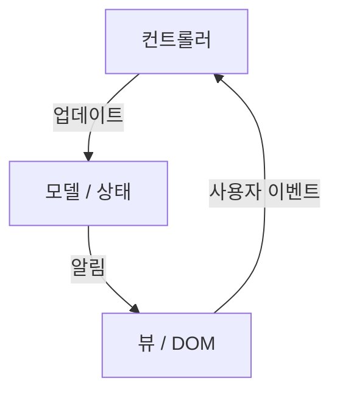
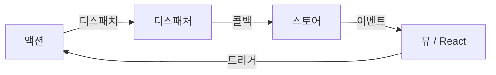
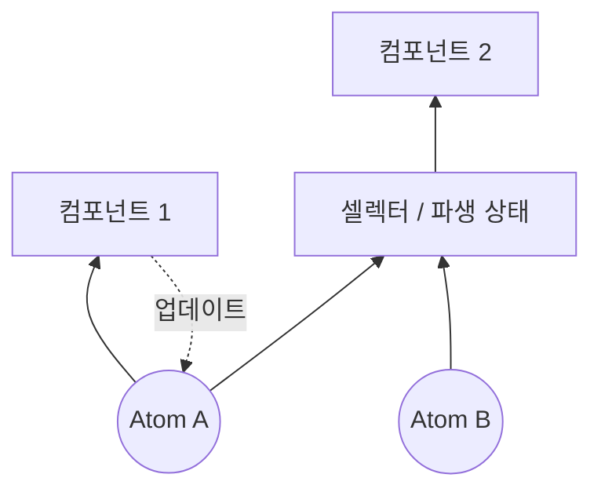
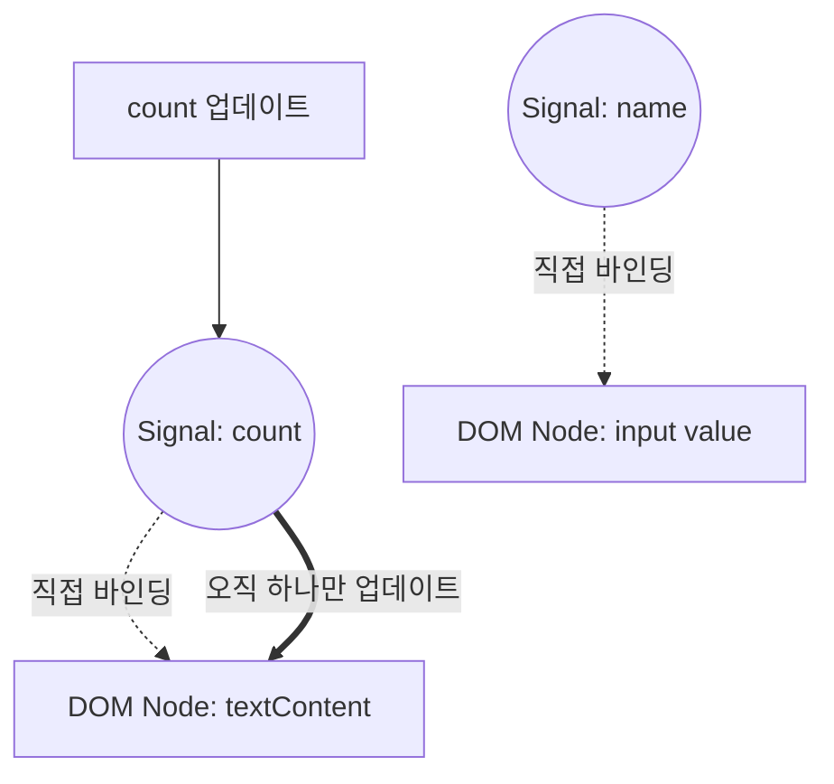

웹 프론트엔드 개발에서 가장 논쟁의 대상이 되고, 또 가장 계속해서 진화해 온 영역이 바로 '상태 관리([State](https://kenji.blog/ko/p/iac-infrastructure-as-code-terraform/) Management)'입니다. 현대의 웹 애플리케이션은 단순한 문서 표시를 넘어 데스크톱 애플리케이션에 필적하는 복잡한 인터랙션을 가진 소프트웨어로 변모했습니다. 그에 따라 애플리케이션의 상태를 어떻게 관리하고 UI와 동기화할 것인지는 모든 프론트엔드 엔지니어가 직면하는 최대의 과제가 되었습니다.

본 기사에서는 프론트엔드 상태 관리의 역사를 되돌아보고, 각 시대의 과제와 해결책, 그리고 미래를 향한 패러다임 전환(특히 Signals와 Reactivity의 진화)에 대해 깊고 상세하게 파헤쳐 보겠습니다.

## 1. 상태 관리란 무엇인가? 왜 프론트엔드의 가장 중요한 과제인가?

애초에 '상태(State)'란 무엇일까요? 웹 애플리케이션에서 상태란 "시간이 지남에 따라 변화하며 사용자 인터페이스(UI) 표시에 영향을 주는 모든 데이터"를 의미합니다.

- 서버에서 가져온 사용자 정보나 목록 데이터
- 폼에 입력되어 있는 텍스트
- 모달 창이 열려 있는지 닫혀 있는지를 나타내는 플래그
- 현재의 URL 경로 또는 쿼리 파라미터
- 다크 모드인지 라이트 모드인지의 테마 설정

이 모든 것이 '상태'입니다. 애플리케이션이 복잡해질수록 이러한 상태는 무수히 늘어나며 서로 의존하게 됩니다.

### 1.1 UI는 상태의 사상(Mapping)이다

선언적 UI(Declarative UI) 시대에서 UI는 상태를 입력으로 받는 순수 함수로 모델링됩니다. 수식으로 표현하면 다음과 같습니다.

$ UI = f(State) $

이 단순한 수식은 React 등 모던 프레임워크의 근간을 이루는 사상입니다. 상태 $ State $ 가 변화하면 함수 $ f $ 가 재실행(리렌더링)되어 새로운 $ UI $ 가 생성됩니다.
여기서 중요한 점은 개발자가 "UI를 어떻게 변경할 것인가(How)"를 명령적으로 작성하는 것이 아니라, "상태가 어떠해야 하며, 그에 대해 UI는 어떻게 보여야 하는가(What)"를 선언적으로 작성한다는 것입니다.

하지만 현실의 애플리케이션은 정적이지 않습니다. 사용자의 입력 $ Action $ 에 의해 상태가 변화합니다. 이를 고려하면 상태는 시간 $ t $ 의 함수로서 다음과 같은 점화식으로 표현할 수 있습니다.

$ State_{t+1} = update(State_t, Action) $

즉, 상태 관리의 어려움이란, **"무수히 존재하는 상태를 어떻게 모순 없이 유지 및 업데이트하고, UI에 대해 필요한 타이밍에 필요한 부분만 효율적으로 동기화할 것인가"** 라는 점으로 요약됩니다.

### 1.2 상태의 스코프와 라이프사이클

상태 관리를 어렵게 만드는 또 다른 요인은 상태마다 적절한 '스코프'와 '라이프사이클'이 존재한다는 점입니다.

1.  **로컬 상태 (Local State)**:
    특정 컴포넌트 내에서만 완결되는 상태입니다. 예를 들어 아코디언 메뉴의 열림/닫힘 플래그나 버튼의 호버 상태 등입니다. 이들은 글로벌하게 관리할 필요가 없습니다.
2.  **글로벌 상태 (Global State)**:
    애플리케이션 전체, 혹은 멀리 떨어진 여러 컴포넌트 간에 공유되는 상태입니다. 예를 들어 로그인 중인 사용자 정보나 쇼핑 카트의 내용물, UI의 테마 설정 등입니다.
3.  **서버 상태 (Server State)**:
    백엔드 데이터베이스 등에 저장되어 있으며, 프론트엔드에서 비동기적으로 가져와 캐시하고 표시하는 상태입니다. 이는 클라이언트 측에서 완전히 제어할 수 있는 것이 아니며, 캐시 무효화(Invalidation)나 재요청 등의 복잡한 관리가 요구됩니다.

과거의 프론트엔드 개발에서는 이러한 상태들이 구별 없이 다뤄졌기 때문에 복잡성이 폭발하여 버그의 온상이 되었습니다. 역사를 따라가며 이러한 상태들이 어떻게 분리되고 정리되었는지 살펴보겠습니다.

## 2. 여명기: DOM이 상태를 가지고 있던 시대와 jQuery

2010년 전후의 웹 개발에서는 상태 관리라는 명확한 개념이 아직 정착되지 않았습니다. 대부분의 경우 **상태는 DOM(Document Object Model) 자체에 직접 보존되어 있었습니다** .

```javascript
// jQuery 시대의 상태 관리 (DOM에 상태를 저장)
$('#toggle-button').on('click', function() {
    var $menu = $('#dropdown-menu');
    // DOM의 class 속성이 상태를 나타냄
    if ($menu.hasClass('is-active')) {
        $menu.removeClass('is-active');
        $(this).text('Open');
    } else {
        $menu.addClass('is-active');
        $(this).text('Close');
    }
});
```

이 접근 방식에서는 UI의 상태를 알기 위해 DOM을 직접 읽어들여야(DOM 쿼리를 실행해야) 했습니다. 데이터(JavaScript 변수)와 뷰(HTML/DOM)가 강하게 결합되어 있어 애플리케이션의 규모가 커지면 어디서 어떻게 DOM이 수정되는지 추적하는 것이 불가능해졌고, 이른바 '스파게티 코드'라 불리는 유지 보수 불가능한 상태에 빠졌습니다.

## 3. MVC 아키텍처와 양방향 데이터 바인딩의 공과

jQuery의 한계에 대한 반성으로부터 Backbone.js나 AngularJS와 같은 MVC(Model-View-Controller) 및 MVVM(Model-View-ViewModel) 아키텍처를 채택한 프레임워크가 등장했습니다.

이들 프레임워크의 가장 큰 발명은 **데이터(Model)와 표시(View)를 분리했다는 점** 입니다.



특히 AngularJS(Angular 1.x)가 채택한 '양방향 데이터 바인딩(Two-way Data Binding)'은 혁신적이었습니다. Model의 데이터가 변경되면 자동으로 View가 업데이트되고, View(입력 폼 등)가 변경되면 자동으로 Model이 업데이트되는 구조입니다.

```html
<!-- AngularJS의 양방향 데이터 바인딩 -->
<input type="text" ng-model="user.name">
<p>Hello, {{ user.name }}!</p>
```

이를 통해 개발자는 DOM을 직접 조작하는 것에서 해방되었습니다. 그러나 애플리케이션이 대규모화되자 새로운 문제가 발생했습니다. 바로 **'연쇄 업데이트(Cascading Updates)'** 입니다.

Model A가 업데이트되면 View B가 업데이트되고, View B의 변경이 Model C를 업데이트하며, 그것이 다시 View D를 업데이트하는 식으로 데이터의 흐름이 복잡하게 얽히면서 무한 루프에 빠지거나 예기치 않은 타이밍에 UI가 업데이트되는 버그가 빈발했습니다. '언제, 누가, 어떤 데이터를 변경했는지' 예측할 수 없게 되어버린 것입니다.

## 4. React와 Flux의 탄생: 단방향 데이터 흐름이라는 혁명

2013년, Facebook(현 Meta)에서 React가 공개되었습니다. React 자체는 UI를 구축하기 위한 라이브러리(MVC의 V에 해당)였지만, 동시에 그들은 새로운 아키텍처 패턴인 **Flux** 를 제창했습니다.

Flux의 가장 큰 목적은 MVC의 양방향 데이터 바인딩의 복잡성을 해소하는 것, 즉 **'단방향 데이터 흐름(Unidirectional Data Flow)'** 의 실현입니다.



Flux 아키텍처에는 엄격한 규칙이 있습니다:

1.  **Action**: 시스템에 변경을 가하기 위한 유일한 방법. 어떤 일이 일어났는지를 나타내는 객체.
2.  **Dispatcher**: 모든 Action을 받아 Store로 전달하는 중앙 허브.
3.  **Store**: 애플리케이션의 상태와 비즈니스 로직을 유지하는 곳. Store는 Dispatcher에 콜백을 등록하고, Action을 받아 자신의 상태를 업데이트한다.
4.  **View**: Store로부터 상태를 받아 렌더링한다. 사용자의 조작에 따라 새로운 Action을 생성한다.

중요한 점은 **View는 결코 직접 Store의 상태를 변경할 수 없다** 는 것입니다. 상태를 변경하려면 반드시 Action을 발행하고 Dispatcher를 거친다는 일방통행의 사이클을 돌아야 합니다. 이를 통해 데이터의 흐름이 지극히 예측 가능해져 대규모 애플리케이션의 상태 관리 안정성이 극적으로 향상되었습니다.

## 5. Redux의 패권과 한계

Flux의 개념을 더욱 세련되게 다듬어 프론트엔드 상태 관리의 사실상 표준(디팩토 스탠다드)이 된 것이 2015년 Dan Abramov 등이 개발한 **Redux** 입니다.

Redux는 Flux의 단방향 데이터 흐름에 함수형 프로그래밍의 개념(특히 Elm 아키텍처)을 도입했습니다.

### 5.1 Redux의 3원칙

Redux는 다음의 세 가지 엄격한 원칙을 바탕으로 합니다.

1.  **Single source of truth (신뢰할 수 있는 단일 출처)**:
    애플리케이션 전체의 상태는 단일 스토어(Store) 내에 있는 객체 트리로서 보존된다.
2.  **[State](https://kenji.blog/ko/p/iac-infrastructure-as-code-terraform/) is read-only (상태는 읽기 전용)**:
    상태를 변경하는 유일한 방법은 무슨 일이 일어났는지를 나타내는 Action 객체를 발행(Dispatch)하는 것이다.
3.  **Changes are made with pure functions (변경은 순수 함수로 수행)**:
    Action에 의해 상태가 어떻게 변경될지를 지정하기 위해 Reducer라고 불리는 순수 함수를 작성한다.

### 5.2 Reducer와 순수 함수

Reducer는 이전 상태와 Action을 받아 새로운 상태를 반환하는 순수 함수(Pure Function)입니다.

$ State_{new} = Reducer(State_{old}, Action) $

순수 함수이기 때문에 사이드 이펙트(API 호출이나 DOM 변경 등)를 가지지 않으며, 동일한 입력에 대해서는 항상 동일한 출력을 반환합니다. 또한, 인수로 전달된 상태를 직접 변경(뮤테이션)하는 것이 아니라 항상 새로운 상태 객체를 생성하여 반환해야 합니다.

```javascript
// Redux의 Reducer 예시
const initialState = { count: 0, loading: false };

function counterReducer(state = initialState, action) {
  switch (action.type) {
    case 'INCREMENT':
      // 상태를 직접 변경하지 않고 새로운 객체를 반환 (Immutability)
      return { ...state, count: state.count + 1 };
    case 'DECREMENT':
      return { ...state, count: state.count - 1 };
    case 'SET_LOADING':
      return { ...state, loading: action.payload };
    default:
      return state;
  }
}
```

이 '불변성(Immutability)'과 '순수 함수'의 결합을 통해 Redux는 강력한 타임 트래블 디버깅(과거 상태로 되감기)이나 핫 리로딩을 실현했습니다. 개발 경험(DX) 측면에서 큰 돌파구였습니다.

### 5.3 Redux의 과제: 보일러플레이트의 장벽

Redux는 훌륭한 아키텍처였지만 널리 보급되면서 많은 개발자가 불만을 갖게 되었습니다. 가장 큰 이유는 **'보일러플레이트(상용구)가 너무 많다'** 는 점이었습니다.

단순히 카운터 숫자를 늘리는 처리 하나를 위해서도 다음 파일들을 생성하거나 수정해야 했습니다.
1. Action Type 상수 정의
2. Action Creator 함수 작성
3. Reducer 내 switch 문에 추가
4. 컴포넌트 측에서 `mapStateToProps` 와 `mapDispatchToProps` 작성 (Hooks 이전)

나아가 비동기 처리(API 통신 등)를 다루기 위해서는 `redux-thunk` 나 `redux-saga` 같은 미들웨어를 도입해야 했고, 학습 곡선도 급격히 가팔라졌습니다.

"Redux는 오버킬(과유불급)이 아닌가?"라는 목소리가 커지며 상태 관리의 새로운 접근법이 모색되기 시작했습니다.

## 6. Context API와 Hooks를 통한 '탈 Redux'의 움직임

2018년 React 16.3에서 Context API가 개편되고, 이어서 2019년 React 16.8에서 **React Hooks** 가 도입된 것은 상태 관리 역사에서 큰 전환점이 되었습니다.

### 6.1 내장 기능을 통한 상태 공유

Context API를 사용하면 컴포넌트 트리의 깊은 계층에 있는 컴포넌트에게 프로퍼티를 연쇄적으로 전달(Prop Drilling)하지 않고도 데이터를 직접 건넬 수 있습니다.
또한 `useReducer` Hook을 조합하면 Redux와 같은 상태 관리를 React의 내장 기능만으로 구현할 수 있게 되었습니다.

```javascript
// Context와 useReducer를 이용한 상태 관리
import React, { createContext, useContext, useReducer } from 'react';

const CountContext = createContext();

function countReducer(state, action) {
  switch (action.type) {
    case 'INCREMENT': return { count: state.count + 1 };
    default: return state;
  }
}

function CountProvider({ children }) {
  const [state, dispatch] = useReducer(countReducer, { count: 0 });
  return (
    <CountContext.Provider value={{ state, dispatch }}>
      {children}
    </CountContext.Provider>
  );
}

function CounterDisplay() {
  // Context에서 직접 상태를 가져옴
  const { state } = useContext(CountContext);
  return <div>Count: {state.count}</div>;
}
```

이로써 "단순한 글로벌 상태라면 Redux는 필요 없다"라는 인식이 널리 퍼졌습니다. 하지만 이 접근법에는 치명적인 성능 상의 함정이 있었습니다.

### 6.2 Context API의 성능 문제 (Extra Re-renders)

React의 Context API에는 "Context의 값이 업데이트되면 해당 Context를 구독하고 있는(`useContext`를 호출하고 있는) 모든 컴포넌트가 무조건 재렌더링된다"라는 사양이 있습니다.

예를 들어 `{ user: {...}, theme: 'dark' }` 라는 거대한 객체를 Context에서 공유하고 있을 경우, `theme` 이 변경되기만 해도 `user` 정보만을 필요로 하는 컴포넌트까지 재렌더링되어 버립니다.
이를 방지하려면 Context를 기능별로 세밀하게 분할하거나 `React.memo` 를 적극 활용해 메모이제이션을 수행해야 했고, 오히려 복잡성이 늘어나는 결과를 낳았습니다.

React는 기본적으로 '탑다운(Top-down)' 렌더링 모델을 채택하고 있기 때문에 글로벌한 상태 변경이 트리 전체의 불필요한 재렌더링을 유발하기 쉽다는 본질적인 과제가 드러났습니다.

## 7. 상태의 분리: Server [State](https://kenji.blog/ko/p/iac-infrastructure-as-code-terraform/)와 Client State

이 무렵부터 상태 관리에 있어서 중요한 패러다임 전환이 일어났습니다. 바로 "모든 상태를 단일 글로벌 스토어에 넣어서는 안 된다"라는 깨달음입니다.
특히 서버에서 가져온 데이터(Server State)는 프론트엔드에서만 완결되는 UI 상태(Client State)와는 그 성질이 근본적으로 다릅니다.

- **Server State**: 서버가 소유. 비동기적으로 가져옴. 여러 사람이 공유하고 변경하므로 항상 오래된(Stale) 상태가 될 가능성이 있음. 캐시 관리, 백그라운드 업데이트, 재시도 처리가 필요함.
- **Client State**: 클라이언트(브라우저)가 소유. 동기적으로 업데이트됨. 다크 모드나 모달 열림/닫힘 등.

### 7.1 React Query, SWR, Apollo Client의 대두

Server State 관리를 Redux나 Context에서 분리하여 전용 라이브러리에 맡기는 접근법이 주류가 되었습니다. **React Query (현 TanStack Query)** 나 **SWR** 의 등장입니다.

```javascript
// React Query를 사용한 Server State 관리
import { useQuery } from 'react-query';

function UserProfile({ userId }) {
  // 캐시, 재요청, 로딩 상태, 에러 상태를 모두 자동 관리
  const { data, isLoading, error } = useQuery(['user', userId], fetchUser);

  if (isLoading) return <div>Loading...</div>;
  if (error) return <div>Error!</div>;

  return <div>Name: {data.name}</div>;
}
```

이 라이브러리들은 "서버의 상태를 로컬에 캐시하고 필요에 따라 동기화한다"라는 복잡한 처리를 추상화했습니다.
그 결과 Redux 등의 글로벌 스토어에서 관리해야 할 데이터는 '순수한 클라이언트 상태'로 급감했고, 상태 관리에 대한 부담은 크게 줄어들었습니다.

## 8. Atomic [State](https://kenji.blog/ko/p/iac-infrastructure-as-code-terraform/) Management: Recoil과 Jotai

Server State가 분리된 후, 남겨진 Client State를 어떻게 효율적으로 관리할 것인가 하는 새로운 경쟁이 시작되었습니다.
React의 렌더링 모델(탑다운)과 Context API의 성능 문제를 해결하기 위해 탄생한 것이 **Atomic State Management** 라는 접근법입니다.

2020년 Facebook 팀에서 **Recoil** 이 발표되었고, 이에 영향을 받은 **Jotai** 등의 라이브러리가 등장했습니다.

### 8.1 바텀업(Bottom-up) 상태 관리

Redux가 "단일의 거대한 상태 트리에서 필요한 부분을 잘라내는(탑다운)" 접근법인 반면, Recoil이나 Jotai는 "상태의 최소 단위(Atom)를 생성하고 그것들을 조합하여 컴포넌트 트리에 주입하는(바텀업)" 접근법을 취합니다.



Atom은 독립된 상태 단위입니다. 컴포넌트는 필요한 Atom만을 구독(Subscribe)합니다. Atom이 업데이트되면 해당 Atom을 구독하는 컴포넌트만 정밀하게 타겟팅되어 재렌더링됩니다. 이를 통해 Context API가 안고 있던 불필요한 재렌더링 문제가 완전히 해결됩니다.

```javascript
// Jotai를 사용한 Atomic State 예시
import { atom, useAtom } from 'jotai';

// 상태의 최소 단위(Atom) 정의
const priceAtom = atom(1000);
const taxRateAtom = atom(0.1);

// 다른 Atom으로부터 파생되는 상태(Derived State)도 정의 가능
const priceWithTaxAtom = atom((get) => {
  return get(priceAtom) * (1 + get(taxRateAtom));
});

function ProductDisplay() {
  const [priceWithTax] = useAtom(priceWithTaxAtom);
  // priceAtom이나 taxRateAtom이 변경될 때만 재렌더링됨
  return <div>Tax Included: ¥{priceWithTax}</div>;
}
```

Jotai 등은 React의 `useState` 와 거의 같은 감각으로 사용할 수 있어 학습 곡선이 낮고 뛰어난 성능을 자랑하기 때문에 현대 React 애플리케이션에서 매우 인기 있는 선택지가 되었습니다.

## 9. 프록시와 변경 가능성: Zustand와 Valtio

또 다른 강력한 흐름으로서, 보일러플레이트를 극한까지 덜어내고 더욱 직관적인 API를 제공하는 라이브러리군이 등장했습니다. Poimandres라는 OSS 콜렉티브가 개발한 **Zustand** 와 **Valtio** 입니다.

### 9.1 Zustand: 단순함을 극대화한 Flux

Zustand는 Redux와 마찬가지로 단일 스토어(Flux 아키텍처)를 채택하고 있지만, Reducer나 Provider와 같은 복잡한 개념을 배제하고 Hooks 기반의 매우 단순한 API를 제공합니다.

```javascript
// Zustand 예시
import { create } from 'zustand';

// 스토어 생성. 상태와 업데이트 함수를 함께 정의함
const useStore = create((set) => ({
  count: 0,
  increment: () => set((state) => ({ count: state.count + 1 })),
  removeAllBears: () => set({ count: 0 }),
}));

function Counter() {
  // 필요한 상태만 Selector로 가져옴. 불필요한 재렌더링 방지.
  const count = useStore((state) => state.count);
  const increment = useStore((state) => state.increment);

  return <button onClick={increment}>{count}</button>;
}
```

Zustand는 Redux의 견고함과 Hooks의 단순함을 겸비한 '현대판 Redux'라 할 수 있는 위치를 확립했습니다.

### 9.2 Valtio: Proxy를 이용한 뮤터블(Mutable)한 상태 관리

React의 세계에서는 "상태는 불변(Immutable)으로 다뤄야 한다"는 규칙이 절대적으로 여겨져 왔습니다. 하지만 JavaScript의 객체를 불변으로 업데이트하는 것은 번거롭습니다(특히 중첩이 깊을 경우).

Valtio는 ES6의 `Proxy` 객체를 활용함으로써 "변경 가능한(Mutable) 조작을 하면서 내부적으로는 불변의 상태 업데이트와 리액티비티를 실현한다"는 획기적인 기법을 채택했습니다. 이는 Vue.js(Vue 3)의 리액티비티 시스템과 매우 유사한 접근법입니다.

```javascript
// Valtio 예시
import { proxy, useSnapshot } from 'valtio';

// Proxy로 래핑된 상태 객체
const state = proxy({ count: 0, user: { name: 'Alice' } });

// 일반 JavaScript 변수처럼 직접 대입(뮤테이션)하여 업데이트할 수 있음
const increment = () => {
  state.count += 1;
};

function Counter() {
  // useSnapshot을 사용해 상태를 구독. 접근한 프로퍼티의 변경만을 감지함.
  const snap = useSnapshot(state);
  return <button onClick={increment}>{snap.count}</button>;
}
```

Valtio는 개발 경험 측면에서 최고 수준의 직관성을 제공합니다. Vue나 Svelte에 익숙한 개발자가 React를 사용할 때도 선호받는 접근 방식입니다.

## 10. 패러다임 전환: Signals와 세립도 리액티비티 (Fine-grained Reactivity)

그리고 현재 프론트엔드 상태 관리에서 최대의 버즈워드가 되고 있는 것이 바로 **Signals** 와 **세립도 리액티비티(Fine-grained Reactivity)** 입니다.

React는 가상 DOM(Virtual DOM)을 사용하여 "컴포넌트 함수를 재실행해 새로운 UI 트리를 만들고, 이전 트리와 차이(Diff)를 비교하여 DOM을 업데이트한다"는 접근법을 취해 왔습니다.
이에 반해 Signals를 채택하는 프레임워크(SolidJS, Vue 3, Svelte 5(Runes), Preact, Angular 등)는 전혀 다른 접근 방식을 택합니다.

### 10.1 Signals란 무엇인가?

Signal이란 시간이 지남에 따라 변화하는 값을 유지하고, 그 값에 의존하는 함수나 식(Effects / Computed)을 자동으로 재실행시키는 메커니즘을 말합니다.

```javascript
// SolidJS의 Signal 예시
import { createSignal, createEffect } from "solid-js";

// Signal 생성. 게터(Getter)와 세터(Setter)가 반환됨.
const [count, setCount] = createSignal(0);

// Effect (사이드 이펙트). count()가 호출된 것을 감지해 의존 관계를 기록함.
// count가 업데이트되면 자동으로 재실행됨.
createEffect(() => {
  console.log("Count changed to:", count());
});

setCount(1); // 콘솔에 "Count changed to: 1" 이라고 표시됨
```

### 10.2 React와의 결정적인 차이

React(가상 DOM)와 Signals(세립도 리액티비티)의 가장 큰 차이점은 **'업데이트의 입도(Granularity)'** 입니다.

React의 경우 상태가 변하면 **컴포넌트 전체가 재실행** 됩니다. 개발자는 `useMemo` 나 `useCallback`, `React.memo` 를 적극 활용하여 "이 아래부터는 재렌더링하지 않아도 돼"라고 수동으로 최적화를 수행해야 합니다.

반면 SolidJS 등 Signals 기반 프레임워크에서는 **컴포넌트 함수는 초기화 시에 한 번만 실행됩니다** .
Signal의 값이 템플릿 내에서 사용될 경우, 프레임워크는 컴파일 시에 "이 Signal이 변하면 이 DOM 노드(텍스트 노드나 속성)만을 업데이트한다"는 직접적인 의존 관계를 구축합니다.



즉, 가상 DOM의 차이 계산이라는 오버헤드를 건너뛰고, 변경이 필요한 DOM 노드를 직접 외과 수술처럼 고쳐 쓰는(Fine-grained update) 것입니다. 이를 통해 압도적인 성능과 개발자가 수동으로 최적화를 수행할 필요가 없는 극상의 DX(개발자 경험)를 실현했습니다.

### 10.3 Signals의 수리 모델

Signals의 배경에 있는 것은 상태와 계산의 의존 관계를 **방향 비순환 그래프(Directed Acyclic Graph: DAG)** 로 모델링하고, 그래프의 위상 정렬(Topological Sort)을 이용해 효율적으로 업데이트 순서를 결정하는 '리액티브 프로그래밍' 이론입니다.

어떤 파생 상태(Computed) $ C $ 가 Signal $ S_1, S_2 $ 에 의존하고 있는 경우, 엣지 $ S_1 \to C $, $ S_2 \to C $ 가 형성됩니다.
값이 업데이트될 경우, 그래프를 따라 필요한 노드만을 평가(Push / Pull 하이브리드 전략 등)함으로써, 글리치(Glitch: 중간 상태의 불일치하는 UI가 잠깐 표시되는 현상)를 방지하고 위상적인 정합성을 보장합니다.

## 11. React의 역습: React Compiler (Forget)

Signals의 대두에 대해 React는 어떻게 대항할까요? React 팀은 "React에 Signals를 도입한다"가 아니라 전혀 다른 접근 방식을 선택했습니다. 바로 **React Compiler (개발 코드명: React Forget)** 입니다.

React의 이념은 "UI는 상태의 함수다"라는 단순한 함수형 프로그래밍의 모델을 유지하는 것입니다. 그러나 그 모델을 높은 성능으로 실행하기 위해서는 개발자가 수동으로 메모이제이션(`useMemo`, `useCallback`)을 해야만 했습니다.

React Compiler는 빌드 시에 React 컴포넌트의 코드를 정적 분석하여 **필요한 메모이제이션 코드를 자동으로 삽입** 합니다.

즉, 개발자는 Signals의 새로운 API를 배울 필요도 없고, 수동으로 `useMemo` 를 작성할 필요도 없이 그저 평범하게 JavaScript를 작성하기만 하면, 컴파일러가 이면에서 세립도 업데이트에 가까운 최적화를 베풀어주는 방식입니다. 이는 "개발자 경험을 해치지 않으면서 성능을 향상시킨다"는 점에서 매우 야심찬 프로젝트입니다.

## 12. 차세대 패러다임: 하이드레이션(Hydration)에서의 탈피와 Resumability

마지막으로 상태 관리의 미래에 있어 빼놓을 수 없는 것이 서버 사이드 렌더링(SSR)과 클라이언트 사이드의 연계에서 발생하는 '하이드레이션(Hydration)' 과제입니다.

기존의 SSR(Next.js 등)에서는 서버에서 생성한 HTML을 브라우저에 전송한 후, 브라우저 측에서 JavaScript를 로드 및 실행하여 이벤트 리스너를 붙이고 상태를 재구축하는 'Hydration'이라는 무거운 처리가 필요했습니다. 이 동안에는 사용자의 조작이 차단(Block)됩니다.

**Qwik** 과 같은 차세대 프레임워크는 상태 관리와 JavaScript의 로드를 근본부터 다시 생각했습니다. 그들은 **Resumability(재개 가능성)** 라는 개념을 제창하고 있습니다.

서버에서 렌더링된 상태는 직렬화되어 HTML 내에 포함되며, 클라이언트에서는 JavaScript의 실행을 처음부터 '시작(Boot)'하는 것이 아니라 서버가 일시 정지한 상태로부터 '재개(Resume)'합니다. 이를 통해 초기 로드 시 JavaScript 크기는 극한으로 줄어들고 Hydration의 오버헤드는 제로가 됩니다.

## 13. 결론: 상태 관리는 어디로 향하고 있는가?

MVC의 혼란에서 시작해 Flux/Redux로 인한 예측 가능성 획득, Hooks에 의한 단순화, Server [State](https://kenji.blog/ko/p/iac-infrastructure-as-code-terraform/)의 분리, Atomic이나 Proxy에 의한 효율화, 그리고 Signals에 의한 세립도 리액티비티에 이르기까지.

약 15년에 걸친 프론트엔드 상태 관리의 역사를 돌아보면 하나의 명확한 트렌드가 보입니다. 그것은 **"보일러플레이트를 줄이고 개발자의 인지 부하를 낮추면서, 이면의 시스템(프레임워크나 컴파일러)이 성능을 자동으로 최적화하는 방향으로 진화하고 있다"** 는 것입니다.

- **소~중규모의 React 개발**: Jotai나 Zustand가 최적의 해답이 되는 경우가 많다.
- **데이터 페칭(Fetching)을 수반하는 개발**: TanStack Query 등의 Server State 관리 도구는 필수다.
- **극한의 성능과 DX를 요구하는 신규 프로젝트**: SolidJS나 Vue 등 Signals를 채택한 프레임워크가 매력적이다.
- **React의 미래**: React Compiler가 성숙해지면 상태 관리의 성능 문제 중 상당수가 자동화를 통해 해결될 것이다.

'은탄환(Silver Bullet)'은 존재하지 않습니다. 하지만 과거의 과제들이 어떻게 해결되어 왔는지 그 역사를 이해함으로써, 우리는 눈앞의 프로젝트에 대해 가장 적절하고 미래를 내다본 아키텍처를 선택할 수 있습니다. 상태 관리의 진화는 앞으로도 우리 프론트엔드 엔지니어들을 계속 설레게 할 것입니다.
