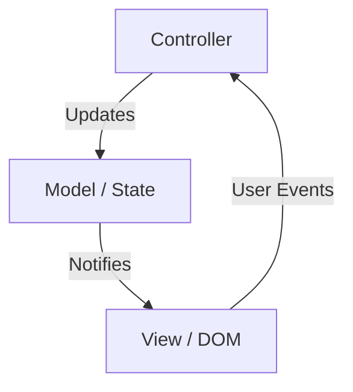
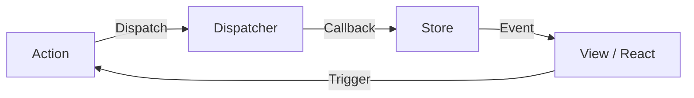
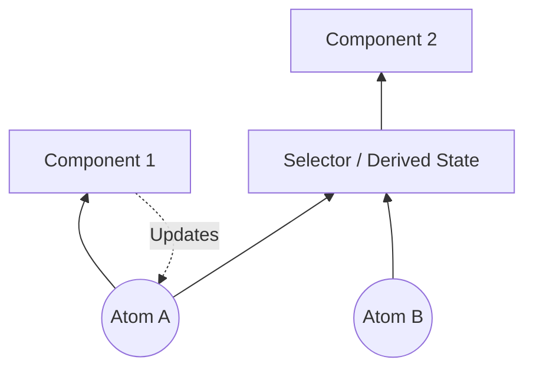
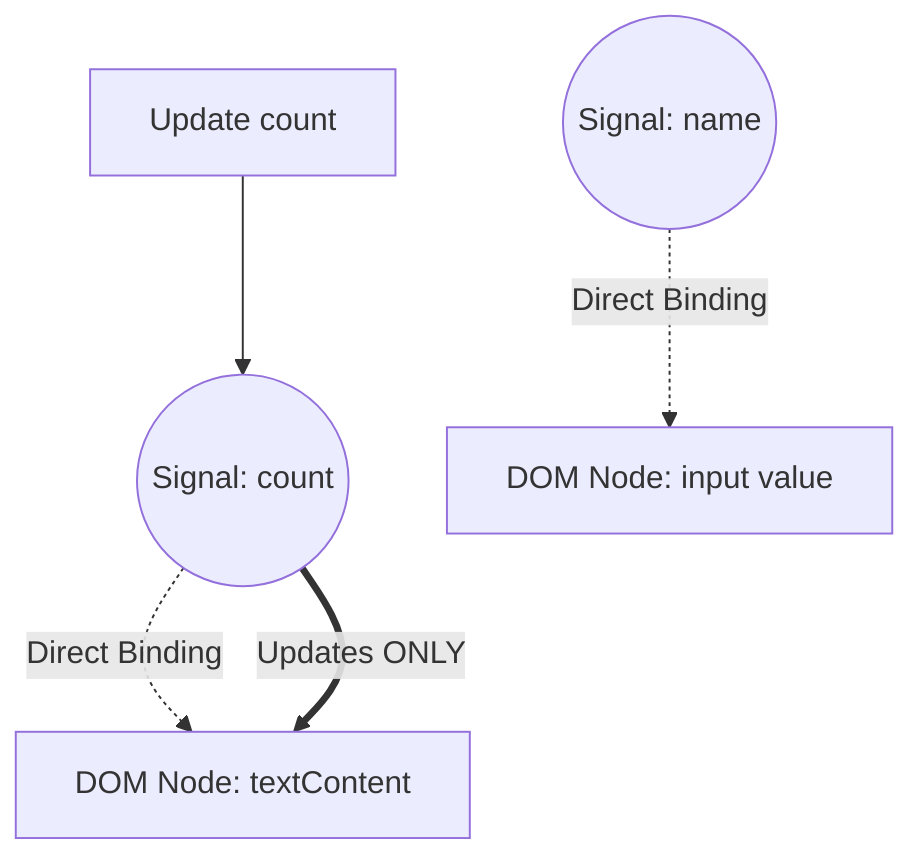

Webフロントエンド開発において、最も議論の的となり、そして最も進化を続けてきた領域が「[状態管理](https://kenji.blog/p/state-management-history-redux-context-recoil-zustand/)（[State](https://kenji.blog/p/iac-infrastructure-as-code-terraform/) Management）」です。現代のWebアプリケーションは単なるドキュメントの表示から、デスクトップアプリケーションに匹敵する複雑なインタラクションを持つソフトウェアへと変貌を遂げました。それに伴い、アプリケーションの状態をどのように管理し、UIと同期させるかは、すべてのフロントエンドエンジニアが直面する最大の課題となっています。

本記事では、フロントエンドの[状態管理](https://kenji.blog/p/state-management-history-redux-context-recoil-zustand/)の歴史を振り返り、それぞれの時代における課題と解決策、そして未来に向けたパラダイムシフト（特にSignalsとReactivityの進化）について、深く、そして詳細に掘り下げていきます。

## 1. 状態管理とは何か？ なぜフロントエンドの最重要課題なのか？

そもそも「状態（State）」とは何でしょうか？Webアプリケーションにおいて、状態とは「時間の経過とともに変化し、ユーザーインターフェース（UI）の表示に影響を与えるあらゆるデータ」を指します。

- サーバーから取得したユーザー情報やリストデータ
- フォームに入力されているテキスト
- モーダルウィンドウが開いているか閉じているかを示すフラグ
- 現在のURLパスやクエリパラメータ
- ダークモードかライトモードかのテーマ設定

これらすべてが「状態」です。アプリケーションが複雑になればなるほど、これらの状態は無数に増え、互いに依存し合うようになります。

### 1.1 UIは状態の写像である

宣言的UI（Declarative UI）の時代において、UIは状態を入力とする純粋関数としてモデル化されます。数式で表すと以下のようになります。

$$ UI = f(State) $$

このシンプルな数式は、Reactなどのモダンフレームワークの根幹をなす思想です。状態 $ State $ が変化すれば、関数 $ f $ が再実行（再レンダリング）され、新しい $ UI $ が生成されます。
ここで重要なのは、開発者は「UIをどのように変更するか（How）」を命令的に記述するのではなく、「状態がどうあるべきか、それに対してUIはどう見えるべきか（What）」を宣言的に記述するということです。

しかし、現実のアプリケーションは静的ではありません。ユーザーの入力 $ Action $ によって状態が変化します。これを考慮すると、状態は時間 $ t $ の関数として以下のように漸化式で表すことができます。

$$ State_{t+1} = update(State_t, Action) $$

つまり、状態管理の難しさとは、 **「無数に存在する状態をいかにして矛盾なく保持・更新し、そしてUIに対して必要なタイミングで必要な部分だけを効率的に同期させるか」** という点に集約されます。

### 1.2 状態のスコープとライフサイクル

状態管理を難しくしているもう一つの要因は、状態にはそれぞれ適切な「スコープ」と「ライフサイクル」が存在するという点です。

1.  **ローカルステート（Local State）**:
    特定のコンポーネント内でのみ完結する状態。例えば、アコーディオンメニューの開閉フラグや、ボタンのホバー状態などです。これらはグローバルに管理する必要はありません。
2.  **グローバルステート（Global State）**:
    アプリケーション全体、あるいは離れた複数のコンポーネント間で共有される状態。例えば、ログイン中のユーザー情報や、ショッピングカートの中身、UIのテーマ設定などです。
3.  **サーバーステート（Server State）**:
    バックエンドのデータベースなどに保存されており、フロントエンドで非同期に取得・キャッシュして表示する状態。これはクライアント側で完全に制御できるものではなく、キャッシュの無効化（Invalidation）や再フェッチなどの複雑な管理が求められます。

かつてのフロントエンド開発では、これらの状態が区別なく扱われていたため、複雑さが爆発し、バグの温床となっていました。歴史を追うことで、これらの状態がどのように分離・整理されていったのかを見ていきましょう。

## 2. 黎明期：DOMが状態を持っていた時代とjQuery

2010年前後のWeb開発では、状態管理という明確な概念はまだ定着していませんでした。多くの場合、 **状態はDOM（Document Object Model）そのものに直接保持されていました** 。

```javascript
// jQuery時代の状態管理（DOMに状態を保存）
$('#toggle-button').on('click', function() {
    var $menu = $('#dropdown-menu');
    // DOMのclass属性が状態を表している
    if ($menu.hasClass('is-active')) {
        $menu.removeClass('is-active');
        $(this).text('Open');
    } else {
        $menu.addClass('is-active');
        $(this).text('Close');
    }
});
```

このアプローチでは、UIの状態を知るためにはDOMを直接読み取る（DOMクエリを実行する）必要がありました。データ（JavaScriptの変数）とビュー（HTML/DOM）が密結合しており、アプリケーションの規模が大きくなると、どこでどのようにDOMが書き換えられるのかを追跡することが不可能になり、いわゆる「スパゲティコード」と呼ばれる保守不能な状態に陥りました。

## 3. MVCアーキテクチャと双方向データバインディングの功罪

jQueryの限界に対する反省から、Backbone.jsやAngularJSといったMVC（Model-View-Controller）やMVVM（Model-View-ViewModel）アーキテクチャを採用したフレームワークが登場しました。

これらのフレームワークの最大の発明は、 **データ（Model）と表示（View）を分離した** ことです。



特にAngularJS（Angular 1.x）が採用した「双方向データバインディング（Two-way Data Binding）」は革新的でした。Modelのデータが変更されれば自動的にViewが更新され、View（入力フォームなど）が変更されれば自動的にModelが更新されるという仕組みです。

```html
<!-- AngularJSの双方向データバインディング -->
<input type="text" ng-model="user.name">
<p>Hello, {{ user.name }}!</p>
```

これにより、開発者はDOMの直接操作から解放されました。しかし、アプリケーションが大規模化すると、新たな問題が発生しました。 **「カスケード更新（連鎖的な更新）」** です。

Model Aが更新されるとView Bが更新され、View Bの変更がModel Cを更新し、それがさらにView Dを更新する...というように、データの流れが複雑に絡み合い、無限ループに陥ったり、予期せぬタイミングでUIが更新されたりするバグが頻発しました。「いつ、誰が、どのデータを変更したのか」が予測できなくなってしまったのです。

## 4. Reactと[Flux](https://kenji.blog/p/state-management-history-redux-context-recoil-zustand/)の誕生：単方向データフローという革命

2013年、Facebook（現Meta）からReactが公開されました。React自体はUIを構築するためのライブラリ（MVCにおけるV）でしたが、同時に彼らは新しいアーキテクチャパターンである **Flux** を提唱しました。

Fluxの最大の目的は、MVCにおける双方向データバインディングの複雑さを解消すること、すなわち **「単方向データフロー（Unidirectional Data Flow）」** の実現です。



[Flux](https://kenji.blog/p/state-management-history-redux-context-recoil-zustand/)アーキテクチャには厳格なルールがあります：

1.  **Action**: システムに変更を加えるための唯一の方法。何が起こったかを示すオブジェクト。
2.  **Dispatcher**: 全てのActionを受け取り、Storeに配信する中央ハブ。
3.  **Store**: アプリケーションの状態とビジネスロジックを保持する場所。StoreはDispatcherにコールバックを登録し、Actionを受け取って自身の状態を更新する。
4.  **View**: Storeから状態を受け取りレンダリングする。ユーザーの操作に応じて新しいActionを生成する。

重要なのは、 **Viewは決して直接Storeの状態を変更できない** ということです。状態を変更するには、必ずActionを発行し、Dispatcherを経由するという一方通行のサイクルを回す必要があります。これにより、データの流れが極めて予測可能（Predictable）になり、大規模アプリケーションにおける[状態管理](https://kenji.blog/p/state-management-history-redux-context-recoil-zustand/)の安定性が劇的に向上しました。

## 5. [Redux](https://kenji.blog/p/state-management-history-redux-context-recoil-zustand/)の覇権と限界

Fluxの概念をさらに洗練させ、フロントエンドの状態管理における事実上の標準（デファクトスタンダード）となったのが、2015年にDan Abramovらによって開発された **Redux** です。

ReduxはFluxの単方向データフローに、[関数型プログラミング](https://kenji.blog/p/oop-vs-fp-vs-dop/)の概念（特にElmアーキテクチャ）を取り入れました。

### 5.1 [Redux](https://kenji.blog/p/state-management-history-redux-context-recoil-zustand/)の3原則

Reduxは以下の3つの厳格な原則に基づいています。

1.  **Single source of truth（信頼できる唯一の情報源）**:
    アプリケーション全体の状態は、単一のストア（Store）内にあるオブジェクトツリーとして保持される。
2.  **[State](https://kenji.blog/p/iac-infrastructure-as-code-terraform/) is read-only（状態は読み取り専用）**:
    状態を変更する唯一の方法は、何が起こったかを示すActionオブジェクトを発行（Dispatch）することである。
3.  **Changes are made with pure functions（変更は純粋関数で行う）**:
    Actionによって状態がどのように変更されるかを指定するために、Reducerと呼ばれる純粋関数を記述する。

### 5.2 Reducerと純粋関数

Reducerは、前の状態とActionを受け取り、新しい状態を返す純粋関数（Pure Function）です。

$$ State_{new} = Reducer(State_{old}, Action) $$

純粋関数であるため、副作用（APIコールやDOMの変更など）を持たず、同じ入力に対しては常に同じ出力を返します。また、引数で渡された状態を直接変更（ミューテート）するのではなく、常に新しい状態オブジェクトを生成して返す必要があります。

```javascript
// ReduxのReducerの例
const initialState = { count: 0, loading: false };

function counterReducer(state = initialState, action) {
  switch (action.type) {
    case 'INCREMENT':
      // 状態を直接変更せず、新しいオブジェクトを返す (Immutability)
      return { ...state, count: state.count + 1 };
    case 'DECREMENT':
      return { ...state, count: state.count - 1 };
    case 'SET_LOADING':
      return { ...state, loading: action.payload };
    default:
      return state;
  }
}
```

この「イミュータビリティ（不変性）」と「純粋関数」の組み合わせにより、[Redux](https://kenji.blog/p/state-management-history-redux-context-recoil-zustand/)は強力なタイムトラベルデバッグ（過去の状態への巻き戻し）や、ホットリローディングを実現しました。開発体験（DX）の面で大きなブレイクスルーでした。

### 5.3 Reduxの課題：ボイラープレートの壁

Reduxは素晴らしいアーキテクチャでしたが、普及するにつれて多くの開発者が不満を抱くようになりました。最大の理由は **「ボイラープレート（定型コード）の多さ」** です。

単にカウンターの数字を増やすだけの単純な処理でも、以下のファイルを作成・修正する必要がありました。
1. Action Typeの定数定義
2. Action Creator関数の作成
3. Reducerでのswitch文への追加
4. コンポーネント側での `mapStateToProps` と `mapDispatchToProps` の記述（Hooks以前）

さらに、[非同期処理](https://kenji.blog/p/event-driven-architecture-async/)（API通信など）を扱うためには、`redux-thunk` や `redux-saga` といったミドルウェアを導入する必要があり、学習コストも急激に跳ね上がりました。

「[Redux](https://kenji.blog/p/state-management-history-redux-context-recoil-zustand/)はオーバーキルではないか？」という声が高まり、[状態管理](https://kenji.blog/p/state-management-history-redux-context-recoil-zustand/)の新たなアプローチが模索され始めました。

## 6. [Context API](https://kenji.blog/p/state-management-history-redux-context-recoil-zustand/)とHooksによる「脱Redux」の動き

2018年にReact 16.3でContext APIが刷新され、さらに2019年にReact 16.8で **React Hooks** が導入されたことは、状態管理の歴史における大きな転換点となりました。

### 6.1 組み込み機能での状態共有

Context APIを使用すると、コンポーネントツリーの深い階層にあるコンポーネントに対して、プロパティのバケツリレー（Prop Drilling）を行わずにデータを直接渡すことができます。
さらに `useReducer` Hookを組み合わせることで、[Redux](https://kenji.blog/p/state-management-history-redux-context-recoil-zustand/)のような[状態管理](https://kenji.blog/p/state-management-history-redux-context-recoil-zustand/)をReactの組み込み機能だけで実現できるようになりました。

```javascript
// ContextとuseReducerを用いた状態管理
import React, { createContext, useContext, useReducer } from 'react';

const CountContext = createContext();

function countReducer(state, action) {
  switch (action.type) {
    case 'INCREMENT': return { count: state.count + 1 };
    default: return state;
  }
}

function CountProvider({ children }) {
  const [state, dispatch] = useReducer(countReducer, { count: 0 });
  return (
    <CountContext.Provider value={{ state, dispatch }}>
      {children}
    </CountContext.Provider>
  );
}

function CounterDisplay() {
  // Contextから直接状態を取得
  const { state } = useContext(CountContext);
  return <div>Count: {state.count}</div>;
}
```

これにより、「単純なグローバル状態なら[Redux](https://kenji.blog/p/state-management-history-redux-context-recoil-zustand/)は不要」という認識が広く浸透しました。しかし、このアプローチには致命的なパフォーマンス上の落とし穴がありました。

### 6.2 [Context API](https://kenji.blog/p/state-management-history-redux-context-recoil-zustand/)のパフォーマンス問題（Extra Re-renders）

ReactのContext APIには、「Contextの値が更新されると、そのContextを購読している（`useContext`を呼び出している）すべてのコンポーネントが無条件に再レンダリングされる」という仕様があります。

例えば、`{ user: {...}, theme: 'dark' }` という巨大なオブジェクトをContextで共有している場合、`theme` が変更されただけでも、`user` 情報しか必要としないコンポーネントまで再レンダリングされてしまいます。
これを防ぐためには、Contextを機能ごとに細かく分割するか、`React.memo` を駆使してメモ化を行う必要があり、かえって複雑さが増す結果となりました。

Reactはデフォルトで「トップダウン」のレンダリングモデルを採用しているため、グローバルな状態変更がツリー全体の不要な再レンダリングを引き起こしやすいという本質的な課題が浮き彫りになりました。

## 7. 状態の分離：Server [State](https://kenji.blog/p/iac-infrastructure-as-code-terraform/)とClient State

この頃から、[状態管理](https://kenji.blog/p/state-management-history-redux-context-recoil-zustand/)において重要なパラダイムシフトが起きました。それは「すべての状態を単一のグローバルストアに入れるべきではない」という気づきです。
特に、サーバーから取得したデータ（Server State）は、フロントエンドのみで完結するUIの状態（Client State）とは性質が根本的に異なります。

- **Server State**: サーバーが所有。非同期で取得される。複数人で共有・変更されるため、常に古い（Stale）状態になる可能性がある。キャッシュ管理、バックグラウンド更新、リトライ処理が必要。
- **Client State**: クライアント（ブラウザ）が所有。同期的に更新される。ダークモードやモーダルの開閉など。

### 7.1 React Query, SWR, [Apollo Client](https://kenji.blog/p/graphql-vs-rest-api-overfetching-type-safety/)の台頭

Server Stateの管理を[Redux](https://kenji.blog/p/state-management-history-redux-context-recoil-zustand/)やContextから切り離し、専用のライブラリに任せるアプローチが主流となりました。 **React Query (現 TanStack Query)** や **SWR** の登場です。

```javascript
// React Queryを使用したServer Stateの管理
import { useQuery } from 'react-query';

function UserProfile({ userId }) {
  // キャッシュ、再取得、ローディング状態、エラー状態をすべて自動管理
  const { data, isLoading, error } = useQuery(['user', userId], fetchUser);

  if (isLoading) return <div>Loading...</div>;
  if (error) return <div>Error!</div>;

  return <div>Name: {data.name}</div>;
}
```

これらのライブラリは、「サーバーの状態をローカルにキャッシュし、必要に応じて同期する」という複雑な処理を抽象化しました。
これにより、[Redux](https://kenji.blog/p/state-management-history-redux-context-recoil-zustand/)などのグローバルストアで管理すべきデータは「純粋なクライアント状態のみ」に激減し、[状態管理](https://kenji.blog/p/state-management-history-redux-context-recoil-zustand/)の負担は大幅に軽減されました。

## 8. Atomic [State](https://kenji.blog/p/iac-infrastructure-as-code-terraform/) Management：[Recoil](https://kenji.blog/p/state-management-history-redux-context-recoil-zustand/)と[Jotai](https://kenji.blog/p/state-management-history-redux-context-recoil-zustand/)

Server Stateが切り離された後、残されたClient Stateをいかに効率的に管理するかという新たな競争が始まりました。
Reactのレンダリングモデル（トップダウン）と、[Context API](https://kenji.blog/p/state-management-history-redux-context-recoil-zustand/)のパフォーマンス問題を解決するために生まれたのが、 **Atomic [State Management](https://kenji.blog/p/state-management-history-redux-context-recoil-zustand/)** というアプローチです。

2020年にFacebookのチームから **Recoil** が発表され、それに影響を受けて **Jotai** などのライブラリが登場しました。

### 8.1 ボトムアップの[状態管理](https://kenji.blog/p/state-management-history-redux-context-recoil-zustand/)

[Redux](https://kenji.blog/p/state-management-history-redux-context-recoil-zustand/)が「単一の巨大な状態ツリーから必要な部分を切り出す（トップダウン）」アプローチであるのに対し、RecoilやJotaiは「状態の最小単位（Atom）を作成し、それらを組み合わせてコンポーネントツリーに注入する（ボトムアップ）」アプローチをとります。



Atomは独立した状態の単位です。コンポーネントは必要なAtomだけを購読（Subscribe）します。Atomが更新されると、そのAtomを購読しているコンポーネントだけがピンポイントで再レンダリングされます。これにより、[Context API](https://kenji.blog/p/state-management-history-redux-context-recoil-zustand/)が抱えていた不要な再レンダリングの問題が完全に解決されます。

```javascript
// Jotaiを使用したAtomic Stateの例
import { atom, useAtom } from 'jotai';

// 状態の最小単位（Atom）を定義
const priceAtom = atom(1000);
const taxRateAtom = atom(0.1);

// 他のAtomから派生する状態（Derived State）も定義可能
const priceWithTaxAtom = atom((get) => {
  return get(priceAtom) * (1 + get(taxRateAtom));
});

function ProductDisplay() {
  const [priceWithTax] = useAtom(priceWithTaxAtom);
  // priceAtomかtaxRateAtomが変更された時のみ再レンダリングされる
  return <div>Tax Included: ¥{priceWithTax}</div>;
}
```

[Jotai](https://kenji.blog/p/state-management-history-redux-context-recoil-zustand/)などはReactの `useState` とほぼ同じ感覚で使えるため、学習コストが低く、かつ高パフォーマンスであることから、現代のReactアプリケーションにおいて非常に人気のある選択肢となっています。

## 9. プロキシとミュータビリティ：[Zustand](https://kenji.blog/p/state-management-history-redux-context-recoil-zustand/)とValtio

もう一つの強力な潮流として、ボイラープレートを極限まで削ぎ落とし、より直感的なAPIを提供するライブラリ群が登場しました。PoimandresというOSSコレクティブが開発した **Zustand** と **Valtio** です。

### 9.1 Zustand：シンプルさを極めた[Flux](https://kenji.blog/p/state-management-history-redux-context-recoil-zustand/)

Zustandは、[Redux](https://kenji.blog/p/state-management-history-redux-context-recoil-zustand/)と同じく単一のストア（Fluxアーキテクチャ）を採用していますが、ReducerやProviderといった複雑な概念を排除し、Hooksベースの極めてシンプルなAPIを提供します。

```javascript
// Zustandの例
import { create } from 'zustand';

// ストアの作成。状態と更新関数を一緒に定義する
const useStore = create((set) => ({
  count: 0,
  increment: () => set((state) => ({ count: state.count + 1 })),
  removeAllBears: () => set({ count: 0 }),
}));

function Counter() {
  // 必要な状態だけをSelectorで取り出す。不要な再レンダリングは防がれる。
  const count = useStore((state) => state.count);
  const increment = useStore((state) => state.increment);

  return <button onClick={increment}>{count}</button>;
}
```

[Zustand](https://kenji.blog/p/state-management-history-redux-context-recoil-zustand/)は、[Redux](https://kenji.blog/p/state-management-history-redux-context-recoil-zustand/)の堅牢性とHooksのシンプルさを兼ね備えた「現代版Redux」とも言える立ち位置を確立しました。

### 9.2 Valtio：Proxyによるミュータブルな[状態管理](https://kenji.blog/p/state-management-history-redux-context-recoil-zustand/)

Reactの世界では「状態はイミュータブル（不変）に扱うべき」というルールが絶対視されてきました。しかし、JavaScriptのオブジェクトをイミュータブルに更新するのは手間がかかります（ネストが深い場合は特に）。

Valtioは、ES6の `Proxy` オブジェクトを活用することで、「ミュータブル（変更可能）な操作をしながら、内部的にはイミュータブルな状態更新とリアクティビティを実現する」という画期的な手法を採りました。これはVue.js（Vue 3）のReactivityシステムに非常に近いアプローチです。

```javascript
// Valtioの例
import { proxy, useSnapshot } from 'valtio';

// Proxyでラップされた状態オブジェクト
const state = proxy({ count: 0, user: { name: 'Alice' } });

// 普通のJavaScript変数のごとく直接代入（ミューテート）して更新できる
const increment = () => {
  state.count += 1;
};

function Counter() {
  // useSnapshotを使って状態を購読。アクセスしたプロパティの変更のみを検知する。
  const snap = useSnapshot(state);
  return <button onClick={increment}>{snap.count}</button>;
}
```

Valtioは、開発体験において最高レベルの直感性を提供します。VueやSvelteに慣れた開発者がReactを使う際にも好まれるアプローチです。

## 10. パラダイムシフト：Signalsと細粒度リアクティビティ（Fine-grained Reactivity）

そして現在、フロントエンドの[状態管理](https://kenji.blog/p/state-management-history-redux-context-recoil-zustand/)において最大のバズワードとなっているのが **Signals** と **細粒度リアクティビティ（Fine-grained Reactivity）** です。

Reactは仮想DOM（Virtual DOM）を用いて、「コンポーネント関数を再実行して新しいUIのツリーを作り、前のツリーと差分（Diff）をとってDOMを更新する」というアプローチをとってきました。
これに対して、Signalsを採用するフレームワーク（SolidJS、Vue 3、Svelte 5（Runes）、Preact、Angularなど）は全く異なるアプローチをとります。

### 10.1 Signalsとは何か？

Signalとは、時間とともに変化する値を保持し、その値に依存している関数や式（Effects / Computed）を自動的に再実行させる仕組みのことです。

```javascript
// SolidJSのSignalの例
import { createSignal, createEffect } from "solid-js";

// Signalの作成。ゲッターとセッターが返される。
const [count, setCount] = createSignal(0);

// Effect（副作用）。count()が呼ばれたことを検知して依存関係を記録。
// countが更新されると自動的に再実行される。
createEffect(() => {
  console.log("Count changed to:", count());
});

setCount(1); // コンソールに "Count changed to: 1" と表示される
```

### 10.2 Reactとの決定的な違い

React（仮想DOM）とSignals（細粒度リアクティビティ）の最大の違いは、 **「更新の粒度」** です。

Reactの場合、状態が変化すると **コンポーネント全体が再実行** されます。開発者は `useMemo` や `useCallback`、`React.memo` を駆使して、「ここから下は再レンダリングしなくていいよ」と手動で最適化を行う必要があります。

一方、SolidJSなどのSignalsベースのフレームワークでは、 **コンポーネント関数は初期化時に1回しか実行されません** 。
Signalの値がテンプレート内で使われている場合、フレームワークはコンパイル時に「このSignalが変わったら、このDOMノード（テキストノードや属性）だけを更新する」という直接的な依存関係を構築します。



つまり、仮想DOMの差分計算というオーバーヘッドをスキップし、変更が必要なDOMノードを直接、外科手術的に書き換える（Fine-grained update）のです。これにより、圧倒的なパフォーマンスと、開発者が手動で最適化を行う必要がないという極上のDX（開発体験）を実現しました。

### 10.3 Signalsの数理モデル

Signalsの背後にあるのは、状態と計算の依存関係を **有向非巡回グラフ (Directed Acyclic Graph: DAG)** としてモデル化し、グラフのトポロジカルソートを用いて効率的に更新順序を決定する「リアクティブプログラミング」の理論です。

ある派生状態（Computed） $ C $ が、Signal $ S_1, S_2 $ に依存している場合、エッジ $ S_1 	o C $, $ S_2 	o C $ が形成されます。
値が更新された場合、グラフを辿って必要なノードのみを評価（Push / Pull ハイブリッド戦略など）することで、グリッチ（Glitch: 中間状態の不整合なUIが一瞬表示される現象）を防ぎ、トポロジカルな整合性を保証します。

## 11. Reactの逆襲：React Compiler (Forget) 

Signalsの台頭に対して、Reactはどのように対抗するのでしょうか？Reactチームは「ReactにSignalsを導入する」のではなく、全く別のアプローチを選択しました。それが **React Compiler (開発コードネーム: React Forget)** です。

Reactの理念は「UIは状態の関数である」というシンプルな[関数型プログラミング](https://kenji.blog/p/oop-vs-fp-vs-dop/)のモデルを保つことです。しかし、そのモデルを高いパフォーマンスで実行するためには、開発者が手動でメモ化（`useMemo`, `useCallback`）を行う必要がありました。

React Compilerは、ビルド時にReactコンポーネントのコードを静的解析し、 **必要なメモ化のコードを自動的に挿入** します。

つまり、開発者はSignalsの新しいAPIを学ぶことも、手動で `useMemo` を書くこともなく、ただ素直にJavaScriptを書くだけで、コンパイラが裏側で細粒度の更新に近い最適化を施してくれるというアプローチです。これは「開発者体験を損なわずにパフォーマンスを向上させる」という点で非常に野心的なプロジェクトです。

## 12. 次世代のパラダイム：Hydrationからの脱却とResumability

最後に、[状態管理](https://kenji.blog/p/state-management-history-redux-context-recoil-zustand/)の未来において見逃せないのが、サーバーサイドレンダリング（SSR）とクライアントサイドの連携における「ハイドレーション（Hydration）」の課題です。

従来のSSR（Next.jsなど）では、サーバーで生成したHTMLをブラウザに送信した後、ブラウザ側でJavaScriptをロード・実行し、イベントリスナーをアタッチして状態を再構築する「Hydration」という重い処理が必要でした。この間、ユーザーの操作はブ[ロック](https://kenji.blog/p/rdbms-transaction-acid-isolation-level-lock/)されます。

**Qwik** などの次世代フレームワークは、状態管理とJavaScriptのロードを根本から見直しました。彼らは **Resumability（再開可能性）** という概念を提唱しています。

サーバーでレンダリングされた状態は直列化されてHTML内に埋め込まれ、クライアントではJavaScriptの実行をゼロから「起動」するのではなく、サーバーが一時停止した状態から「再開（Resume）」します。これにより、初期ロードのJavaScriptサイズは極限まで削減され、Hydrationのオーバーヘッドはゼロになります。

## 13. 結論：状態管理はどこへ向かうのか？

MVCの混乱から始まり、[Flux](https://kenji.blog/p/state-management-history-redux-context-recoil-zustand/)/[Redux](https://kenji.blog/p/state-management-history-redux-context-recoil-zustand/)による予測可能性の獲得、Hooksによるシンプル化、Server [State](https://kenji.blog/p/iac-infrastructure-as-code-terraform/)の分離、AtomicやProxyによる効率化、そしてSignalsによる細粒度リアクティビティへ。

約15年にわたるフロントエンドの[状態管理](https://kenji.blog/p/state-management-history-redux-context-recoil-zustand/)の歴史を振り返ると、一つの明確なトレンドが見えてきます。それは **「ボイラープレートを減らし、開発者の認知負荷を下げながら、裏側のシステム（フレームワークやコンパイラ）がパフォーマンスを自動的に最適化する方向へ進化している」** ということです。

- **小〜中規模のReact開発**: [Jotai](https://kenji.blog/p/state-management-history-redux-context-recoil-zustand/)や[Zustand](https://kenji.blog/p/state-management-history-redux-context-recoil-zustand/)が最適解となるケースが多い。
- **データフェッチを伴う開発**: TanStack QueryなどのServer State管理ツールは必須。
- **極限のパフォーマンスとDXを求める新規プロジェクト**: SolidJSやVueなど、Signalsを採用したフレームワークが魅力的。
- **Reactの未来**: React Compilerの成熟により、状態管理のパフォーマンス問題の多くは自動化によって解決される。

「銀の弾丸」は存在しません。しかし、過去の課題がどのように解決されてきたかの歴史を理解することで、私たちは目の前のプロジェクトに対して、最も適切で未来を見据えたアーキテクチャを選択することができるのです。状態管理の進化は、今後も私たちフロントエンドエンジニアをワクワクさせ続けてくれるでしょう。
