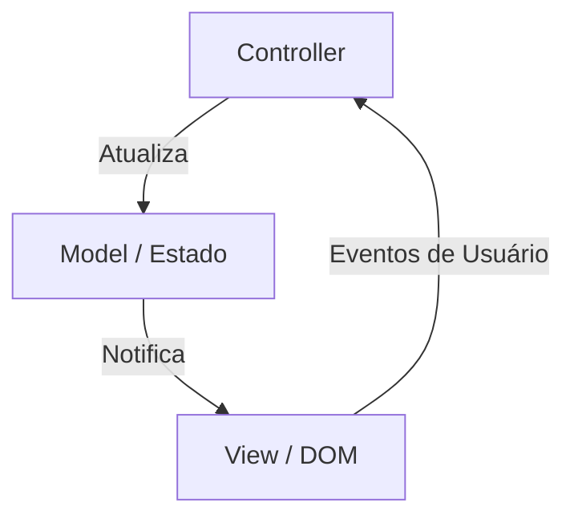
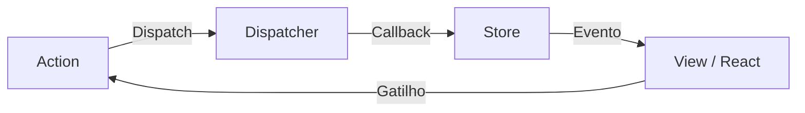
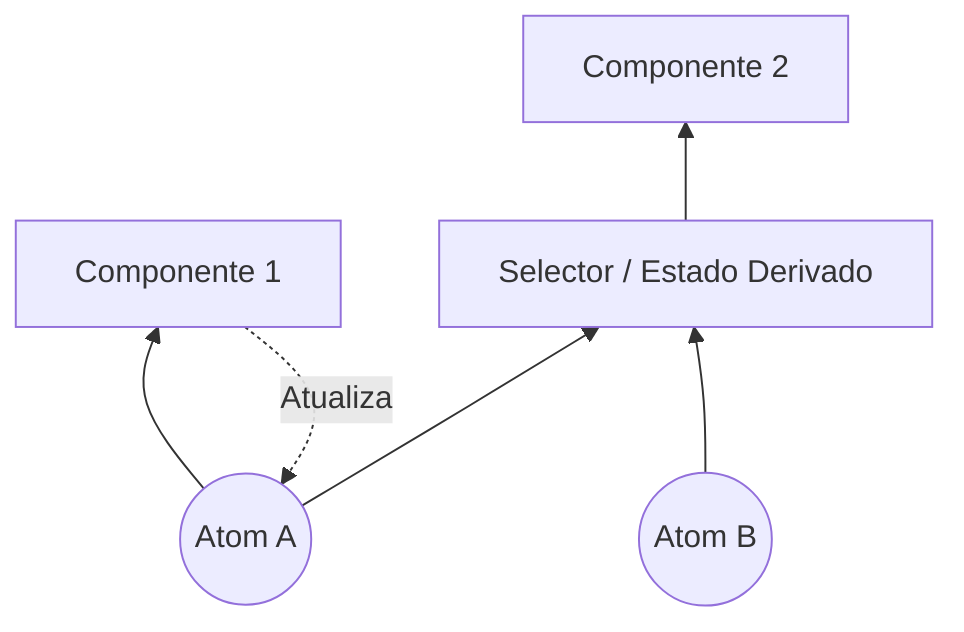
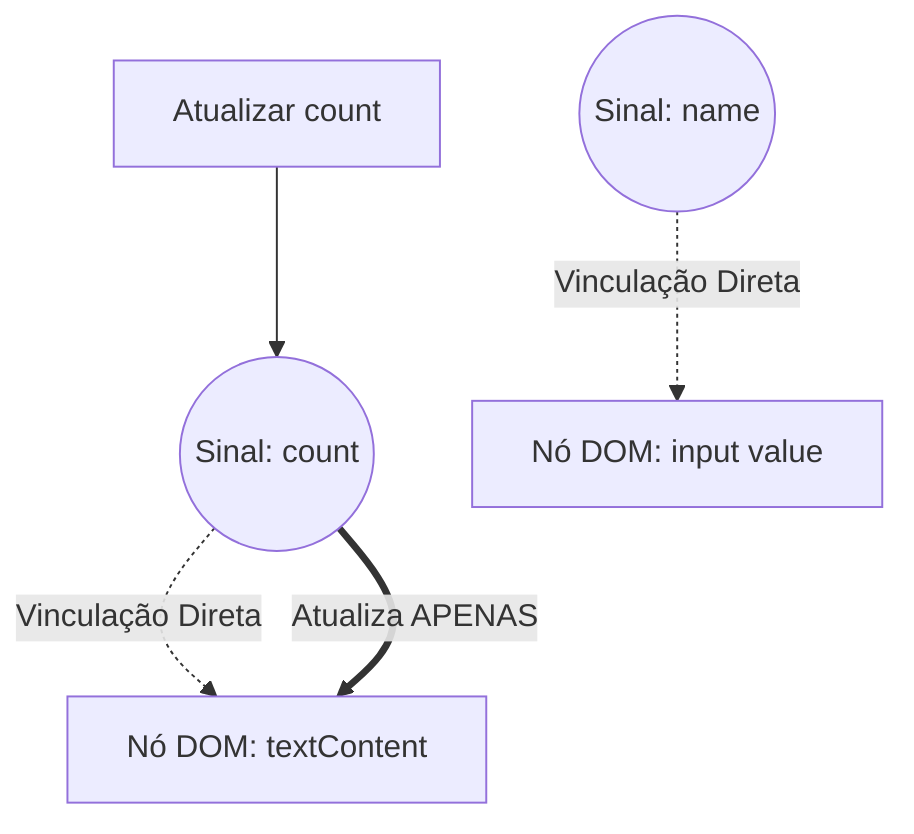

No desenvolvimento web frontend, a área que tem sido alvo de mais debates e continuou a evoluir mais é o "gerenciamento de estado" ([State](https://kenji.blog/pt/p/iac-infrastructure-as-code-terraform/) Management). As aplicações web modernas se transformaram de simples exibições de documentos em softwares com interações complexas comparáveis a aplicativos de desktop. Com isso, como gerenciar e sincronizar o estado da aplicação com a UI tornou-se o maior desafio enfrentado por todos os engenheiros frontend.

Neste artigo, refletiremos sobre a história do gerenciamento de estado no frontend, os desafios e soluções em cada era, e exploraremos profunda e detalhadamente a mudança de paradigma em direção ao futuro (especialmente a evolução de Signals e Reactivity).

## 1. O que é Gerenciamento de Estado? Por que é o desafio mais importante no frontend?

Em primeiro lugar, o que é "estado" (State)? Em aplicações web, o estado refere-se a "quaisquer dados que mudam ao longo do tempo e afetam a exibição da interface do usuário (UI)".

- Informações de usuário e dados de lista obtidos do servidor
- Texto digitado em um formulário
- Sinalizadores (flags) indicando se uma janela modal está aberta ou fechada
- O caminho (path) atual da URL ou parâmetros de consulta (query)
- A configuração do tema, modo escuro ou modo claro

Tudo isso é "estado". À medida que uma aplicação se torna mais complexa, esses estados aumentam em número e começam a depender uns dos outros.

### 1.1 A UI é o mapeamento do estado

Na era da UI declarativa (Declarative UI), a UI é modelada como uma função pura que recebe o estado como entrada. Matematicamente, isso pode ser expresso da seguinte forma:

$ UI = f(State) $

Esta fórmula simples é a filosofia central de frameworks modernos como o React. Quando o estado $ State $ muda, a função $ f $ é reexecutada (re-renderizada) e uma nova $ UI $ é gerada.
O que é importante aqui é que os desenvolvedores não descrevem imperativamente "como modificar a UI (How)", mas sim de forma declarativa "como o estado deveria ser e como a UI deveria se parecer com base nisso (What)".

No entanto, aplicações reais não são estáticas. O estado muda devido às entradas do usuário, ou $ Action $. Levando isso em consideração, o estado pode ser expresso como uma relação de recorrência em função do tempo $ t $:

$ State_{t+1} = update(State_t, Action) $

Em outras palavras, a dificuldade do gerenciamento de estado resume-se a: **"Como podemos reter e atualizar consistentemente o grande número de estados que existem e como sincronizá-los eficientemente com a UI apenas quando e onde for necessário"**.

### 1.2 Escopo e ciclo de vida do estado

Outro fator que dificulta o gerenciamento de estado é que cada estado possui um "escopo" e um "ciclo de vida" apropriados.

1.  **Estado Local (Local State)**:
    Estado que é contido inteiramente em um componente específico. Por exemplo, a flag de abertura/fechamento de um menu acordeão, o estado de hover de um botão, etc. Estes não precisam ser gerenciados globalmente.
2.  **Estado Global (Global State)**:
    Estado compartilhado em toda a aplicação ou entre vários componentes distantes. Por exemplo, informações de usuário logado, conteúdo do carrinho de compras, configuração do tema da UI, etc.
3.  **Estado do Servidor (Server State)**:
    Estado salvo em bancos de dados no backend, etc., que é recuperado assincronamente (fetch) e armazenado em cache no frontend para exibição. Isso não pode ser totalmente controlado no lado do cliente e requer um gerenciamento complexo, como invalidação de cache (Invalidation) e nova busca (re-fetch).

No desenvolvimento frontend do passado, esses estados eram tratados sem distinção, levando a uma explosão de complexidade e a um terreno fértil para bugs. Ao acompanhar a história, veremos como esses estados foram separados e organizados.

## 2. Os Primórdios: A era em que o DOM mantinha o estado e o jQuery

Por volta de 2010 no desenvolvimento web, o conceito claro de gerenciamento de estado ainda não havia se estabelecido. Na maioria das vezes, **o estado era mantido diretamente no próprio DOM (Document Object Model)**.

```javascript
// Gerenciamento de estado na era do jQuery (salvando estado no DOM)
$('#toggle-button').on('click', function() {
    var $menu = $('#dropdown-menu');
    // O atributo class do DOM representa o estado
    if ($menu.hasClass('is-active')) {
        $menu.removeClass('is-active');
        $(this).text('Abrir');
    } else {
        $menu.addClass('is-active');
        $(this).text('Fechar');
    }
});
```

Com essa abordagem, para saber o estado da UI, era necessário ler diretamente o DOM (executar queries no DOM). Os dados (variáveis do JavaScript) e a visualização (HTML/DOM) estavam fortemente acoplados e, conforme a escala da aplicação crescia, tornava-se impossível rastrear onde e como o DOM estava sendo modificado, resultando em um estado insustentável conhecido como "código espaguete".

## 3. Os méritos e deméritos da Arquitetura MVC e Two-way Data Binding

Como uma reflexão sobre as limitações do jQuery, surgiram frameworks que adotavam as arquiteturas MVC (Model-View-Controller) ou MVVM (Model-View-ViewModel), como Backbone.js e AngularJS.

A maior invenção desses frameworks foi ter **separado os dados (Model) da exibição (View)**.



Em particular, a "vinculação bidirecional de dados" (Two-way Data Binding) adotada pelo AngularJS (Angular 1.x) foi inovadora. Era um sistema no qual a View era atualizada automaticamente se os dados do Model fossem alterados, e o Model era atualizado automaticamente se a View (como um formulário de entrada) fosse alterada.

```html
<!-- Vinculação bidirecional de dados do AngularJS -->
<input type="text" ng-model="user.name">
<p>Olá, {{ user.name }}!</p>
```

Isso libertou os desenvolvedores da manipulação direta do DOM. No entanto, à medida que as aplicações aumentavam de escala, surgiu um novo problema: **"Atualização em Cascata (atualizações em cadeia)"**.

Quando o Model A é atualizado, a View B é atualizada, a mudança da View B atualiza o Model C, que por sua vez atualiza a View D... e assim o fluxo de dados ficava intrincadamente entrelaçado, resultando frequentemente em bugs onde se caía em loops infinitos ou a UI era atualizada em momentos inesperados. Tornou-se impossível prever "quando, quem e quais dados foram alterados".

## 4. O nascimento do React e do [Flux](https://kenji.blog/pt/p/state-management-history-redux-context-recoil-zustand/): A revolução do fluxo unidirecional de dados

Em 2013, o React foi lançado pelo Facebook (agora Meta). O próprio React era uma biblioteca para construir interfaces de usuário (o V do MVC), mas, ao mesmo tempo, eles propuseram um novo padrão de arquitetura chamado **Flux**.

O maior objetivo do Flux era eliminar a complexidade do Two-way Data Binding do MVC, ou seja, a realização do **"Fluxo Unidirecional de Dados" (Unidirectional Data Flow)**.



A arquitetura [Flux](https://kenji.blog/pt/p/state-management-history-redux-context-recoil-zustand/) possui regras estritas:

1.  **Action**: A única maneira de fazer alterações no sistema. Um objeto que indica o que aconteceu.
2.  **Dispatcher**: O hub central que recebe todas as Actions e as distribui para as Stores.
3.  **Store**: O local que contém o estado da aplicação e a lógica de negócios. A Store registra callbacks no Dispatcher e recebe Actions para atualizar seu próprio estado.
4.  **View**: Recebe o estado da Store e o renderiza. Gera novas Actions de acordo com as ações do usuário.

O mais importante é que **a View nunca pode modificar diretamente o estado da Store**. Para alterar o estado, você deve sempre emitir uma Action e passar pelo Dispatcher nesse ciclo unidirecional. Isso tornou o fluxo de dados extremamente previsível (Predictable) e melhorou drasticamente a estabilidade do gerenciamento de estado em aplicações de grande escala.

## 5. A hegemonia e os limites do [Redux](https://kenji.blog/pt/p/state-management-history-redux-context-recoil-zustand/)

Refinando ainda mais o conceito do Flux e tornando-se o padrão de fato no gerenciamento de estado do frontend, surgiu em 2015 o **Redux**, desenvolvido por Dan Abramov e outros.

O Redux incorporou conceitos de programação funcional (especialmente a arquitetura Elm) no fluxo de dados unidirecional do Flux.

### 5.1 Os 3 princípios do Redux

O Redux é baseado em três princípios estritos:

1.  **Single source of truth (Única fonte de verdade)**:
    O estado de toda a aplicação é mantido como uma árvore de objetos em uma única loja (Store).
2.  **[State](https://kenji.blog/pt/p/iac-infrastructure-as-code-terraform/) is read-only (O estado é somente leitura)**:
    A única maneira de mudar o estado é emitir (Dispatch) um objeto Action indicando o que aconteceu.
3.  **Changes are made with pure functions (Mudanças são feitas com funções puras)**:
    Para especificar como a árvore de estado é transformada por Actions, você escreve funções puras chamadas Reducers.

### 5.2 Reducers e funções puras

Um Reducer é uma função pura (Pure Function) que recebe o estado anterior e uma Action e retorna um novo estado.

$ State_{new} = Reducer(State_{old}, Action) $

Por ser uma função pura, não tem efeitos colaterais (chamadas de API, alterações no DOM, etc.) e sempre retorna a mesma saída para a mesma entrada. Além disso, em vez de modificar diretamente (sofrer mutação) o estado passado como argumento, ela deve sempre criar e retornar um novo objeto de estado.

```javascript
// Exemplo de Reducer do Redux
const initialState = { count: 0, loading: false };

function counterReducer(state = initialState, action) {
  switch (action.type) {
    case 'INCREMENT':
      // Retorna um novo objeto sem modificar o estado diretamente (Immutability)
      return { ...state, count: state.count + 1 };
    case 'DECREMENT':
      return { ...state, count: state.count - 1 };
    case 'SET_LOADING':
      return { ...state, loading: action.payload };
    default:
      return state;
  }
}
```

Através dessa combinação de "imutabilidade (Immutability)" e "funções puras", o [Redux](https://kenji.blog/pt/p/state-management-history-redux-context-recoil-zustand/) possibilitou a depuração de viagem no tempo (time-travel debugging, que permite retroceder para estados passados) e hot reloading. Foi um grande avanço em termos de experiência de desenvolvimento (DX).

### 5.3 O problema do Redux: A parede de código boilerplate

Embora o Redux tenha sido uma arquitetura excelente, à medida que sua popularidade crescia, muitos desenvolvedores começaram a ficar insatisfeitos. O maior motivo era **"a quantidade de código clichê (boilerplate)"**.

Até mesmo para o simples ato de aumentar o número de um contador, era necessário criar e modificar os seguintes arquivos:
1. Definição constante de Action Type
2. Criação da função Action Creator
3. Adição da instrução switch no Reducer
4. Escrita de `mapStateToProps` e `mapDispatchToProps` no lado do componente (antes dos Hooks)

Além disso, para lidar com o processamento assíncrono (comunicação de API, etc.), era necessário introduzir middlewares como `redux-thunk` ou `redux-saga`, o que aumentou drasticamente o custo de aprendizado.

Vozes clamando "[Redux](https://kenji.blog/pt/p/state-management-history-redux-context-recoil-zustand/) não é um exagero (overkill)?" tornaram-se mais fortes, e novas abordagens para o gerenciamento de estado começaram a ser procuradas.

## 6. O movimento de "Des-Redux" através da [Context API](https://kenji.blog/pt/p/state-management-history-redux-context-recoil-zustand/) e Hooks

A renovação da Context API no React 16.3 em 2018 e, ainda mais, a introdução do **React Hooks** no React 16.8 em 2019, marcaram um grande ponto de virada na história do gerenciamento de estado.

### 6.1 Compartilhamento de estado com recursos integrados

O uso da Context API permite que você passe dados diretamente para componentes profundamente na árvore de componentes, sem o encadeamento de propriedades (Prop Drilling).
Além disso, ao combiná-la com o Hook `useReducer`, tornou-se possível alcançar um gerenciamento de estado semelhante ao [Redux](https://kenji.blog/pt/p/state-management-history-redux-context-recoil-zustand/) usando apenas os recursos internos do React.

```javascript
// Gerenciamento de estado usando Context e useReducer
import React, { createContext, useContext, useReducer } from 'react';

const CountContext = createContext();

function countReducer(state, action) {
  switch (action.type) {
    case 'INCREMENT': return { count: state.count + 1 };
    default: return state;
  }
}

function CountProvider({ children }) {
  const [state, dispatch] = useReducer(countReducer, { count: 0 });
  return (
    <CountContext.Provider value={{ state, dispatch }}>
      {children}
    </CountContext.Provider>
  );
}

function CounterDisplay() {
  // Obter o estado diretamente do Context
  const { state } = useContext(CountContext);
  return <div>Contagem: {state.count}</div>;
}
```

Como resultado, a percepção de que "o [Redux](https://kenji.blog/pt/p/state-management-history-redux-context-recoil-zustand/) não é necessário para um estado global simples" tornou-se amplamente difundida. No entanto, essa abordagem possuía uma armadilha fatal em termos de desempenho.

### 6.2 Problema de desempenho da [Context API](https://kenji.blog/pt/p/state-management-history-redux-context-recoil-zustand/) (Re-renderizações Extras)

A Context API do React possui uma especificação onde "se o valor de um Context é atualizado, todos os componentes que se inscreveram nesse Context (que estão chamando `useContext`) são re-renderizados incondicionalmente".

Por exemplo, se você compartilhar um objeto enorme como `{ user: {...}, theme: 'dark' }` através do Context, mesmo se apenas o `theme` mudar, componentes que só precisam das informações do `user` também serão re-renderizados.
Para prevenir isso, você precisa dividir o Context em partes menores por recurso ou fazer uso intensivo de memorização (memoization) com o `React.memo`, o que, na verdade, acaba aumentando a complexidade.

Como o React usa um modelo de renderização "top-down" por padrão, foi revelado o problema inerente de que mudanças de estado globais podem facilmente causar re-renderizações desnecessárias em toda a árvore.

## 7. Separação de estados: Server [State](https://kenji.blog/pt/p/iac-infrastructure-as-code-terraform/) e Client State

Por volta dessa época, uma mudança de paradigma significativa ocorreu no gerenciamento de estado. Foi a percepção de que "nem todos os estados devem ser colocados em uma única store global".
Em particular, dados obtidos do servidor (Server State) têm características fundamentalmente diferentes do estado da UI que é restrito apenas ao frontend (Client State).

- **Server State**: Propriedade do servidor. Recuperado assincronamente. Por ser compartilhado e modificado por várias pessoas, há a possibilidade de que ele sempre fique obsoleto (Stale). Requer gerenciamento de cache, atualizações em segundo plano e processos de repetição (retry).
- **Client State**: Propriedade do cliente (navegador). Atualizado de forma síncrona. Como o modo escuro, abrir e fechar modais, etc.

### 7.1 A ascensão de React Query, SWR, [Apollo Client](https://kenji.blog/pt/p/graphql-vs-rest-api-overfetching-type-safety/)

A abordagem de separar o gerenciamento do Server State do [Redux](https://kenji.blog/pt/p/state-management-history-redux-context-recoil-zustand/) ou Context e deixá-lo para bibliotecas dedicadas tornou-se popular. Esse foi o surgimento do **React Query (agora TanStack Query)** e **SWR**.

```javascript
// Gerenciamento de Server State usando React Query
import { useQuery } from 'react-query';

function UserProfile({ userId }) {
  // Gerencia automaticamente cache, re-busca, estado de carregamento e estado de erro
  const { data, isLoading, error } = useQuery(['user', userId], fetchUser);

  if (isLoading) return <div>Carregando...</div>;
  if (error) return <div>Erro!</div>;

  return <div>Nome: {data.name}</div>;
}
```

Essas bibliotecas abstraíram o complexo processo de "armazenar em cache os estados do servidor localmente e sincronizá-los sob demanda".
Como resultado, os dados que deveriam ser gerenciados em uma loja global como o [Redux](https://kenji.blog/pt/p/state-management-history-redux-context-recoil-zustand/) caíram drasticamente para "apenas estados puramente do cliente", o que reduziu muito o fardo do gerenciamento de estado.

## 8. Atomic [State](https://kenji.blog/pt/p/iac-infrastructure-as-code-terraform/) Management: Recoil e [Jotai](https://kenji.blog/pt/p/state-management-history-redux-context-recoil-zustand/)

Após a separação do Server State, começou uma nova corrida sobre como gerenciar eficientemente o Client State remanescente.
Foi a abordagem de **Gerenciamento de Estado Atômico (Atomic [State Management](https://kenji.blog/pt/p/state-management-history-redux-context-recoil-zustand/))** que nasceu para resolver o modelo de renderização do React (top-down) e os problemas de desempenho da [Context API](https://kenji.blog/pt/p/state-management-history-redux-context-recoil-zustand/).

Em 2020, o **Recoil** foi anunciado pela equipe do Facebook, e bibliotecas influenciadas por ele, como o **Jotai**, apareceram.

### 8.1 Gerenciamento de estado de baixo para cima (Bottom-up)

Enquanto o [Redux](https://kenji.blog/pt/p/state-management-history-redux-context-recoil-zustand/) adota uma abordagem "top-down", cortando a parte necessária de uma árvore de estado global única e gigante, o Recoil e o Jotai adotam uma abordagem "bottom-up", "criando a menor unidade de estado (Atom) e combinando-as para injetá-las na árvore de componentes".



Um Atom é uma unidade independente de estado. Um componente assina (Subscribe) apenas o Atom de que precisa. Quando o Atom é atualizado, apenas os componentes que se inscreveram nesse Atom são re-renderizados pontualmente. Isso resolve completamente o problema de re-renderizações desnecessárias que a [Context API](https://kenji.blog/pt/p/state-management-history-redux-context-recoil-zustand/) apresentava.

```javascript
// Exemplo de Atomic State usando Jotai
import { atom, useAtom } from 'jotai';

// Define a menor unidade de estado (Atom)
const priceAtom = atom(1000);
const taxRateAtom = atom(0.1);

// Você também pode definir estados derivados (Derived State) de outros Atoms
const priceWithTaxAtom = atom((get) => {
  return get(priceAtom) * (1 + get(taxRateAtom));
});

function ProductDisplay() {
  const [priceWithTax] = useAtom(priceWithTaxAtom);
  // Re-renderizado apenas quando priceAtom ou taxRateAtom forem alterados
  return <div>Imposto Incluído: ¥{priceWithTax}</div>;
}
```

Como o [Jotai](https://kenji.blog/pt/p/state-management-history-redux-context-recoil-zustand/) pode ser usado quase da mesma forma que o `useState` do React, sua curva de aprendizado é baixa e, pelo fato de apresentar alto desempenho, tornou-se uma escolha extremamente popular em aplicativos React modernos.

## 9. Proxies e Mutabilidade: [Zustand](https://kenji.blog/pt/p/state-management-history-redux-context-recoil-zustand/) e Valtio

Como outra tendência poderosa, surgiram bibliotecas que eliminaram o boilerplate o máximo possível e forneceram APIs mais intuitivas. Foram o **Zustand** e o **Valtio**, desenvolvidos pelo coletivo OSS Poimandres.

### 9.1 Zustand: O [Flux](https://kenji.blog/pt/p/state-management-history-redux-context-recoil-zustand/) que dominou a simplicidade

O Zustand adota uma única loja (arquitetura Flux) assim como o [Redux](https://kenji.blog/pt/p/state-management-history-redux-context-recoil-zustand/), mas elimina conceitos complexos como Reducers e Providers, fornecendo uma API extremamente simples baseada em Hooks.

```javascript
// Exemplo de Zustand
import { create } from 'zustand';

// Criação da store. Define estado e funções de atualização juntos.
const useStore = create((set) => ({
  count: 0,
  increment: () => set((state) => ({ count: state.count + 1 })),
  removeAllBears: () => set({ count: 0 }),
}));

function Counter() {
  // Extrai apenas os estados necessários usando Seletor. Re-renderizações desnecessárias são evitadas.
  const count = useStore((state) => state.count);
  const increment = useStore((state) => state.increment);

  return <button onClick={increment}>{count}</button>;
}
```

O [Zustand](https://kenji.blog/pt/p/state-management-history-redux-context-recoil-zustand/) estabeleceu a posição do que pode ser chamado de "versão moderna do [Redux](https://kenji.blog/pt/p/state-management-history-redux-context-recoil-zustand/)", combinando a robustez do Redux com a simplicidade dos Hooks.

### 9.2 Valtio: Gerenciamento de Estado Mutável com Proxy

No mundo React, a regra de que "os estados devem ser tratados como imutáveis" foi vista como uma verdade absoluta. No entanto, atualizar de forma imutável objetos JavaScript exige esforço (especialmente se houver um aninhamento profundo).

O Valtio adotou uma abordagem inovadora: ao fazer uso do objeto `Proxy` do ES6, ele "permite que você aplique operações mutáveis (modificáveis) enquanto, sob o capô, realiza atualizações de estado e reatividade imutáveis". Essa é uma abordagem muito semelhante ao sistema de Reatividade do Vue.js (Vue 3).

```javascript
// Exemplo de Valtio
import { proxy, useSnapshot } from 'valtio';

// O objeto de estado agrupado num Proxy
const state = proxy({ count: 0, user: { name: 'Alice' } });

// Pode ser atualizado por atribuição direta (mutação) exatamente como uma variável comum em JavaScript
const increment = () => {
  state.count += 1;
};

function Counter() {
  // Use o useSnapshot para assinar o estado. Ele detecta mudanças apenas nas propriedades que foram acessadas.
  const snap = useSnapshot(state);
  return <button onClick={increment}>{snap.count}</button>;
}
```

O Valtio proporciona o mais alto nível de intuição em termos de experiência do desenvolvedor. É também uma abordagem preferida por desenvolvedores familiarizados com Vue ou Svelte ao utilizarem React.

## 10. A Mudança de Paradigma: Signals e Reatividade de Grão Fino (Fine-grained Reactivity)

E, atualmente, a maior palavra da moda no gerenciamento de estado do frontend são **Signals** e **Reatividade de Grão Fino (Fine-grained Reactivity)**.

O React tem usado o DOM Virtual (Virtual DOM) para aplicar uma abordagem em que ele "reexecuta as funções dos componentes para criar uma nova árvore da UI, calcula as diferenças (Diff) da árvore anterior e atualiza o DOM".
Em contrapartida, frameworks que adotam Signals (SolidJS, Vue 3, Svelte 5 (Runes), Preact, Angular, etc.) usam uma abordagem completamente diferente.

### 10.1 O que são Signals?

Signal refere-se a um mecanismo que retém valores que mudam ao longo do tempo e reexecuta automaticamente funções e expressões (Effects / Computed) que dependem desses valores.

```javascript
// Exemplo de Signal do SolidJS
import { createSignal, createEffect } from "solid-js";

// Criação do Signal. Retorna um getter e um setter.
const [count, setCount] = createSignal(0);

// Effect (Efeito colateral). Detecta que count() foi chamado e registra as dependências.
// Ele será automaticamente reexecutado quando a contagem for atualizada.
createEffect(() => {
  console.log("Contagem mudou para:", count());
});

setCount(1); // Exibirá no console "Contagem mudou para: 1"
```

### 10.2 A Diferença Decisiva do React

A maior diferença entre o React (DOM Virtual) e Signals (Reatividade de Grão Fino) é a **"granularidade das atualizações"**.

Com o React, quando o estado muda, **todo o componente é reexecutado**. Os desenvolvedores precisam usar o `useMemo`, `useCallback` e o `React.memo` intensamente para aplicar otimizações manuais dizendo: "Daqui para baixo não precisa ser re-renderizado".

Por outro lado, em frameworks baseados em Signals, como o SolidJS, **as funções de componente são executadas apenas uma vez, no momento da inicialização**.
Se o valor do Signal é usado no template, o framework cria uma relação de dependência direta durante a compilação, dizendo: "Se este Signal mudar, atualize apenas este nó DOM (nó de texto ou atributo)".



Em outras palavras, ele ignora a sobrecarga dos cálculos de diferença (diffing) do DOM Virtual e regrava os nós DOM que precisam mudar de forma direta e cirúrgica (Atualização de grão fino). Como resultado, atinge-se um desempenho surpreendente e uma Experiência do Desenvolvedor (DX) primorosa, sem a necessidade do desenvolvedor executar otimizações manuais.

### 10.3 O Modelo Matemático de Signals

Por trás dos Signals está a teoria da "programação reativa", que modela a dependência entre estados e cálculos como um **Grafo Direcionado Acíclico (DAG: Directed Acyclic [Graph](https://kenji.blog/pt/p/tree-graph-data-structures-search-dfs-bfs-dijkstra/))**, e usa ordenação topológica (topological sort) do grafo para determinar de forma eficiente a ordem de atualização.

Se um estado derivado (Computed) $ C $ depende dos Sinais $ S_1, S_2 $, formam-se as arestas $ S_1 \to C $, $ S_2 \to C $.
Quando o valor for atualizado, o framework percorre o grafo e avalia apenas os nós necessários (por exemplo, usando uma estratégia híbrida Push / Pull), evitando falhas (Glitch: o fenômeno onde um estado inconsistente e intermediário da UI aparece momentaneamente) e garantindo a consistência topológica.

## 11. O Contra-Ataque do React: React Compiler (Forget)

Como o React vai contra-atacar diante da ascensão de Signals? A equipe do React não escolheu a opção de "introduzir Signals no React", mas sim uma abordagem completamente diferente. Esse é o **React Compiler (nome de código do desenvolvimento: React Forget)**.

A filosofia do React é manter o modelo simples de programação funcional em que "a UI é uma função do estado". No entanto, para alcançar esse modelo com um desempenho alto, os desenvolvedores tinham que aplicar memorização de forma manual (`useMemo`, `useCallback`).

O React Compiler analisa estaticamente o código dos componentes React no momento do build e **insere automaticamente o código necessário para memorização**.

Em outras palavras, os desenvolvedores não precisarão aprender a nova API de Signals nem terão que escrever manualmente `useMemo`. Basta eles escreverem o JavaScript honestamente, e, nos bastidores, o compilador aplicará otimizações próximas às atualizações de grão fino. Este é um projeto muito ambicioso no ponto de que "melhora o desempenho sem prejudicar a experiência do desenvolvedor".

## 12. O Paradigma de Próxima Geração: Afastando-se de Hydration para Resumability

Por fim, ao abordar o futuro do gerenciamento de estado, não podemos ignorar o desafio da hidratação ("Hydration") ao cooperar a renderização do lado do servidor (SSR) e do lado do cliente.

Com SSR convencional (como Next.js), após o envio do HTML gerado pelo servidor para o navegador, era necessário um processo pesado de "Hydration" onde o navegador carregava e executava o JavaScript e anexava detectores (listeners) de eventos para reconstruir o estado. Durante este tempo, a interação do usuário fica bloqueada.

Frameworks de próxima geração, como **Qwik**, reconsideraram fundamentalmente o carregamento de JavaScript e do estado desde suas raízes. Eles estão advogando por um conceito chamado **Resumability (Capacidade de Retomada)**.

O estado renderizado pelo servidor é serializado e incorporado no HTML, e o cliente não começa executando o JavaScript "do zero", mas "retoma" (Resume) do estado em que o servidor havia sido pausado. Como resultado, o tamanho do JavaScript da carga inicial é reduzido ao extremo, e a sobrecarga de Hydration se torna zero.

## 13. Conclusão: Para onde está indo o gerenciamento de estado?

Começando com a confusão do MVC, conquistamos previsibilidade através de [Flux](https://kenji.blog/pt/p/state-management-history-redux-context-recoil-zustand/)/Redux, a simplificação pelos Hooks, a separação do Server [State](https://kenji.blog/pt/p/iac-infrastructure-as-code-terraform/), eficiência via Atômica e Proxies, e finalmente, a Reatividade de Grão Fino por Signals.

Refletindo sobre cerca de 15 anos de história no gerenciamento de estado de frontends, uma tendência clara surge. Que é: **"Evoluir para reduzir o código boilerplate e reduzir a carga cognitiva dos desenvolvedores, enquanto os sistemas nos bastidores (frameworks e compiladores) otimizam o desempenho automaticamente"**.

- **Desenvolvimento pequeno a médio com React**: Casos onde [Jotai](https://kenji.blog/pt/p/state-management-history-redux-context-recoil-zustand/) e [Zustand](https://kenji.blog/pt/p/state-management-history-redux-context-recoil-zustand/) muitas vezes se provam a melhor solução.
- **Desenvolvimento envolvendo a obtenção de dados (data fetching)**: Ferramentas de gerenciamento do Server State como o TanStack Query são essenciais.
- **Novos projetos em busca de extrema performance e DX**: Frameworks adotando Signals, como SolidJS ou Vue, são atrativos.
- **O Futuro do React**: Com a maturidade do React Compiler, muitos problemas de desempenho no gerenciamento de estado serão resolvidos por automação.

"Balas de prata" não existem. No entanto, compreendendo a história de como os problemas passados foram resolvidos, podemos selecionar a arquitetura mais apropriada e que também tenha um olhar voltado para o futuro aos nossos projetos em questão. A evolução do gerenciamento de estado certamente continuará a nos entusiasmar, engenheiros frontend, mesmo no futuro.
