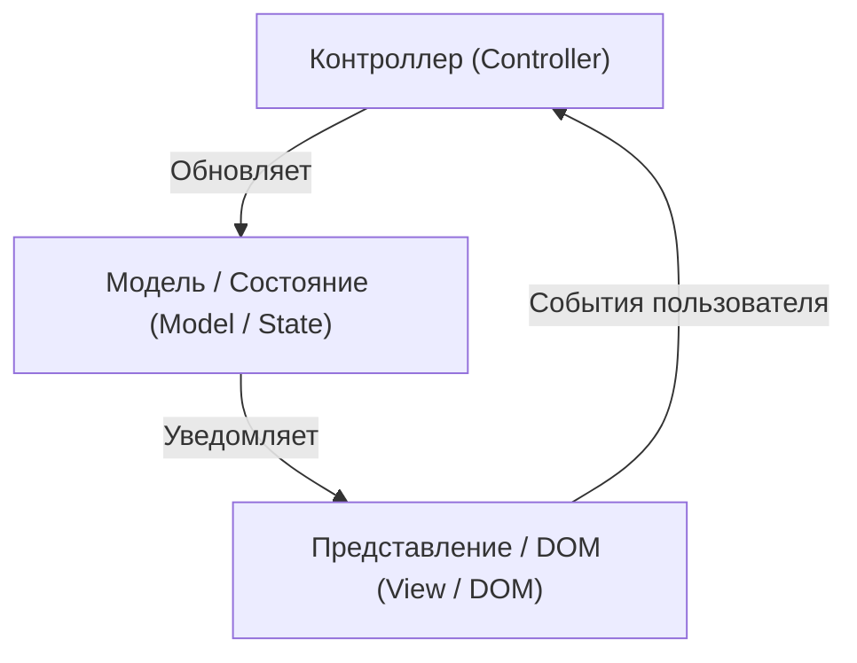
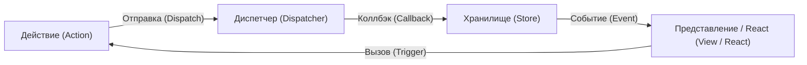
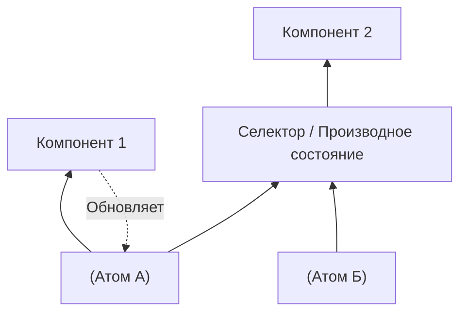
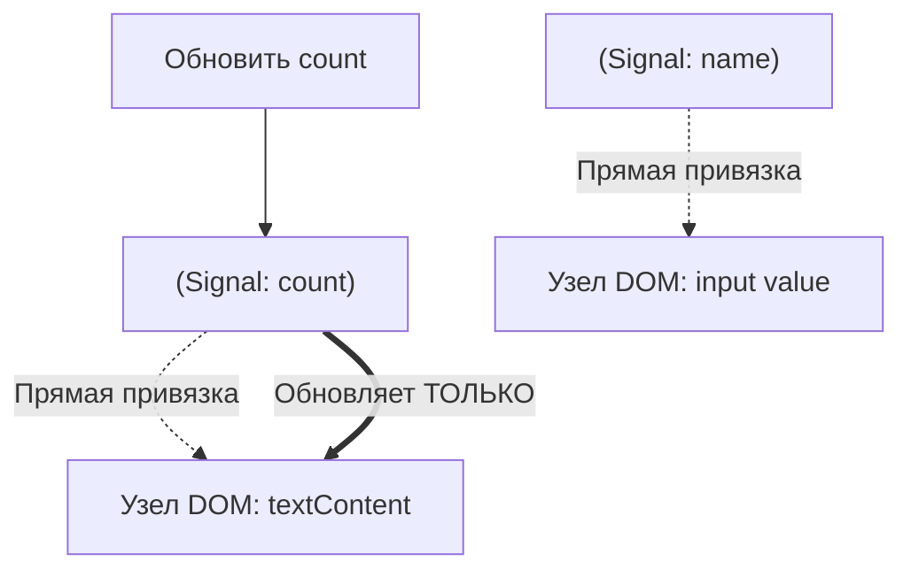

В веб-фронтенд разработке область, вызывающая больше всего споров и продолжающая развиваться больше всего, — это «управление состоянием» (State Management). Современные веб-приложения превратились из простого отображения документов в программное обеспечение со сложным взаимодействием, сопоставимым с десктопными приложениями. В связи с этим то, как управлять состоянием приложения и синхронизировать его с UI, стало величайшей проблемой, с которой сталкивается каждый фронтенд-инженер.

В этой статье мы оглянемся на историю управления состоянием во фронтенде, рассмотрим проблемы и их решения в каждую эпоху, а также глубоко и детально исследуем смену парадигмы в будущем (особенно эволюцию Signals и Reactivity).

## 1. Что такое управление состоянием? Почему это самая важная проблема фронтенда?

Что вообще такое «состояние» (State)? В веб-приложениях состояние означает «любые данные, которые меняются с течением времени и влияют на отображение пользовательского интерфейса (UI)».

- Информация о пользователе и данные списков, полученные с сервера
- Текст, введенный в форму
- Флаг, указывающий, открыто или закрыто модальное окно
- Текущий путь URL и параметры запроса
- Настройки темы: темный или светлый режим

Все это — «состояние». Чем сложнее становится приложение, тем больше становится этих состояний, и они начинают зависеть друг от друга.

### 1.1 UI как отображение состояния

В эпоху декларативного UI (Declarative UI) UI моделируется как чистая функция, принимающая состояние на вход. Математически это можно выразить следующим образом:

$ UI = f(State) $

Эта простая формула лежит в основе современных фреймворков, таких как React. Когда состояние $ State $ изменяется, функция $ f $ выполняется снова (повторный рендеринг), и генерируется новый $ UI $.
Здесь важно то, что разработчики не описывают императивно, «как изменить UI (How)», а декларативно описывают, «каким должно быть состояние и как при этом должен выглядеть UI (What)».

Однако реальные приложения не статичны. Состояние изменяется в зависимости от ввода пользователя $ Action $. Учитывая это, состояние можно выразить как функцию времени $ t $ с помощью следующего рекуррентного соотношения:

$ State_{t+1} = update(State_t, Action) $

Другими словами, сложность управления состоянием сводится к следующему: **«как непротиворечиво хранить и обновлять бесчисленные состояния, и как эффективно синхронизировать с UI только необходимые части в нужный момент»**.

### 1.2 Область видимости и жизненный цикл состояния

Еще одним фактором, усложняющим управление состоянием, является то, что каждое состояние имеет свою соответствующую «область видимости» (scope) и «жизненный цикл» (lifecycle).

1.  **Локальное состояние (Local State)**:
    Состояние, ограниченное только определенным компонентом. Например, флаг открытия/закрытия меню-аккордеона или состояние наведения (hover) кнопки. Ими не нужно управлять глобально.
2.  **Глобальное состояние (Global State)**:
    Состояние, используемое всем приложением или распределенное между несколькими удаленными компонентами. Например, информация о вошедшем пользователе, содержимое корзины покупок или настройки темы UI.
3.  **Состояние сервера (Server State)**:
    Состояние, которое хранится в бэкенд-базе данных и т. д., и асинхронно извлекается, кэшируется и отображается во фронтенде. Это не то, что можно полностью контролировать на стороне клиента, и это требует сложного управления, такого как инвалидация кэша (Invalidation) и повторный запрос (refetch).

В прошлом во фронтенд-разработке эти состояния обрабатывались без различия, что приводило к взрывному росту сложности и становилось рассадником ошибок. Проследив историю, давайте посмотрим, как эти состояния были разделены и упорядочены.

## 2. На заре: Эпоха, когда DOM хранил состояние, и jQuery

В веб-разработке около 2010 года четкая концепция управления состоянием еще не устоялась. Во многих случаях **состояние хранилось непосредственно в самом DOM (Document Object Model)**.

```javascript
// Управление состоянием в эпоху jQuery (сохранение состояния в DOM)
$('#toggle-button').on('click', function() {
    var $menu = $('#dropdown-menu');
    // Атрибут class DOM-элемента представляет состояние
    if ($menu.hasClass('is-active')) {
        $menu.removeClass('is-active');
        $(this).text('Открыть');
    } else {
        $menu.addClass('is-active');
        $(this).text('Закрыть');
    }
});
```

При таком подходе для того, чтобы узнать состояние UI, нужно было напрямую читать DOM (выполнять запросы к DOM). Данные (переменные JavaScript) и представление (HTML/DOM) были тесно связаны, и по мере роста масштабов приложения становилось невозможным отследить, где и как изменяется DOM, что приводило к так называемому «спагетти-коду», который было невозможно поддерживать.

## 3. Заслуги и недостатки архитектуры MVC и двусторонней привязки данных

Из-за разочарования в ограничениях jQuery появились фреймворки, использующие архитектуры MVC (Model-View-Controller) и MVVM (Model-View-ViewModel), такие как Backbone.js и AngularJS.

Величайшим изобретением этих фреймворков было **разделение данных (Model) и отображения (View)**.



В частности, «двусторонняя привязка данных» (Two-way Data Binding), принятая в AngularJS (Angular 1.x), была революционной. Если данные модели изменялись, представление автоматически обновлялось, а если изменялось представление (например, форма ввода), модель автоматически обновлялась.

```html
<!-- Двусторонняя привязка данных в AngularJS -->
<input type="text" ng-model="user.name">
<p>Привет, {{ user.name }}!</p>
```

Это освободило разработчиков от прямых манипуляций с DOM. Однако по мере роста масштабов приложений возникла новая проблема. Это **«каскадные обновления» (цепочечные обновления)**.

Когда обновляется Модель A, обновляется Представление B; изменение Представления B обновляет Модель C, которая, в свою очередь, обновляет Представление D... Таким образом, потоки данных сложно переплетались, что приводило к бесконечным циклам или частым ошибкам, когда UI обновлялся в неожиданные моменты. Стало невозможно предсказать, «когда, кто и какие данные изменил».

## 4. Рождение React и Flux: Революция однонаправленного потока данных

В 2013 году Facebook (ныне Meta) выпустил React. Сам React был библиотекой для создания UI (буква V в MVC), но в то же время они предложили новый архитектурный паттерн — **Flux**.

Главная цель Flux заключалась в устранении сложности двусторонней привязки данных в MVC, то есть в реализации **«однонаправленного потока данных» (Unidirectional Data Flow)**.



Архитектура Flux имеет строгие правила:

1.  **Действие (Action)**: Единственный способ внести изменения в систему. Объект, указывающий на то, что произошло.
2.  **Диспетчер (Dispatcher)**: Центральный узел, который принимает все Actions и распределяет их по Stores.
3.  **Хранилище (Store)**: Место, где хранится состояние приложения и бизнес-логика. Store регистрирует коллбэк в Dispatcher, получает Action и обновляет свое состояние.
4.  **Представление (View)**: Получает состояние из Store и выполняет рендеринг. Генерирует новые Actions в ответ на действия пользователя.

Важно отметить, что **View никогда не может изменять состояние Store напрямую**. Чтобы изменить состояние, необходимо запустить односторонний цикл: создать Action и пропустить его через Dispatcher. Это сделало поток данных чрезвычайно предсказуемым (Predictable) и кардинально улучшило стабильность управления состоянием в крупных приложениях.

## 5. Гегемония и ограничения Redux

В 2015 году Дэн Абрамов (Dan Abramov) и другие разработчики создали **Redux**, который еще больше усовершенствовал концепцию Flux и стал де-факто стандартом управления состоянием во фронтенде.

Redux привнес в однонаправленный поток данных Flux концепции функционального программирования (в частности, архитектуру Elm).

### 5.1 Три принципа Redux

Redux базируется на следующих трех строгих принципах.

1.  **Единый источник истины (Single source of truth)**:
    Состояние всего приложения хранится в виде дерева объектов внутри одного хранилища (Store).
2.  **Состояние доступно только для чтения (State is read-only)**:
    Единственный способ изменить состояние — это отправить (Dispatch) объект Action, который описывает, что произошло.
3.  **Изменения вносятся с помощью чистых функций (Changes are made with pure functions)**:
    Для описания того, как Action изменяет состояние, пишутся чистые функции, называемые редьюсерами (Reducer).

### 5.2 Редьюсер и чистые функции

Редьюсер — это чистая функция (Pure Function), которая принимает предыдущее состояние и Action, и возвращает новое состояние.

$ State_{new} = Reducer(State_{old}, Action) $

Поскольку это чистая функция, она не имеет побочных эффектов (таких как вызовы API или изменения DOM) и всегда возвращает одинаковый результат для одних и тех же входных данных. Кроме того, она никогда не должна напрямую изменять (мутировать) состояние, переданное в качестве аргумента; вместо этого она всегда должна генерировать и возвращать новый объект состояния.

```javascript
// Пример редьюсера в Redux
const initialState = { count: 0, loading: false };

function counterReducer(state = initialState, action) {
  switch (action.type) {
    case 'INCREMENT':
      // Не изменяем состояние напрямую, возвращаем новый объект (Иммутабельность)
      return { ...state, count: state.count + 1 };
    case 'DECREMENT':
      return { ...state, count: state.count - 1 };
    case 'SET_LOADING':
      return { ...state, loading: action.payload };
    default:
      return state;
  }
}
```

Благодаря этому сочетанию «иммутабельности» (неизменяемости) и «чистых функций» Redux реализовал мощную отладку с возможностью путешествия во времени (откат к прошлым состояниям) и горячую перезагрузку (hot reloading). Это был огромный прорыв с точки зрения опыта разработчика (DX).

### 5.3 Проблемы Redux: Стена шаблонного кода

Redux был отличной архитектурой, но по мере ее распространения многие разработчики стали выражать недовольство. Главная причина — **«обилие шаблонного кода (boilerplate)»**.

Даже для простого увеличения счетчика нужно было создать и изменить следующие файлы:
1. Определение констант Action Type
2. Создание функций Action Creator
3. Добавление оператора switch в Reducer
4. Написание `mapStateToProps` и `mapDispatchToProps` на стороне компонента (до появления Hooks)

Более того, для работы с асинхронными операциями (например, связи с API) необходимо было внедрять промежуточное ПО (middleware), такое как `redux-thunk` или `redux-saga`, из-за чего кривая обучения резко возрастала.

Голоса о том, что «Redux — это избыточно», становились все громче, и начались поиски новых подходов к управлению состоянием.

## 6. Движение «без Redux» с помощью Context API и Hooks

Обновление Context API в React 16.3 в 2018 году и последующее внедрение **React Hooks** в React 16.8 в 2019 году стали важным поворотным моментом в истории управления состоянием.

### 6.1 Разделение состояния с помощью встроенных функций

С помощью Context API можно передавать данные напрямую компонентам, находящимся глубоко в дереве компонентов, избегая проблемы «перекидывания свойств» (Prop Drilling).
Более того, комбинируя хук `useReducer`, стало возможным реализовать управление состоянием, подобное Redux, используя только встроенные возможности React.

```javascript
// Управление состоянием с использованием Context и useReducer
import React, { createContext, useContext, useReducer } from 'react';

const CountContext = createContext();

function countReducer(state, action) {
  switch (action.type) {
    case 'INCREMENT': return { count: state.count + 1 };
    default: return state;
  }
}

function CountProvider({ children }) {
  const [state, dispatch] = useReducer(countReducer, { count: 0 });
  return (
    <CountContext.Provider value={{ state, dispatch }}>
      {children}
    </CountContext.Provider>
  );
}

function CounterDisplay() {
  // Получаем состояние напрямую из Context
  const { state } = useContext(CountContext);
  return <div>Счетчик: {state.count}</div>;
}
```

Благодаря этому широко распространилось мнение, что «Redux не нужен для простого глобального состояния». Однако в этом подходе скрывалась фатальная ловушка с точки зрения производительности.

### 6.2 Проблема производительности Context API (Лишние ререндеры)

В спецификации Context API React сказано, что «когда значение Context обновляется, все компоненты, подписанные на этот Context (вызывающие `useContext`), безоговорочно ререндерятся».

Например, если вы разделяете огромный объект `{ user: {...}, theme: 'dark' }` через Context, даже если изменится только `theme`, компоненты, которым нужна только информация `user`, тоже будут отрендерены заново.
Чтобы предотвратить это, приходилось либо разделять Context на более мелкие части по функционалу, либо активно использовать `React.memo` для мемоизации, что в итоге только увеличивало сложность.

Поскольку React по умолчанию использует модель рендеринга «сверху вниз», стала очевидна фундаментальная проблема: глобальные изменения состояния склонны вызывать ненужные ререндеры всего дерева.

## 7. Разделение состояния: Состояние сервера и Состояние клиента

Примерно в это время в управлении состоянием произошла важная смена парадигмы. Это было осознание того, что «не все состояния должны храниться в едином глобальном хранилище».
В частности, данные, полученные с сервера (Состояние сервера), по своей природе фундаментально отличаются от состояния UI, ограниченного только фронтендом (Состояние клиента).

- **Состояние сервера (Server State)**: Принадлежит серверу. Получается асинхронно. Может использоваться и изменяться несколькими людьми, поэтому всегда есть вероятность, что оно устареет (Stale). Требует управления кэшем, фоновых обновлений и обработки повторных попыток (retry).
- **Состояние клиента (Client State)**: Принадлежит клиенту (браузеру). Обновляется синхронно. Например, темный режим или открытие/закрытие модальных окон.

### 7.1 Появление React Query, SWR, Apollo Client

Подход, при котором управление состоянием сервера отделяется от Redux или Context и передается специализированным библиотекам, стал мейнстримом. Появились **React Query (ныне TanStack Query)** и **SWR**.

```javascript
// Управление состоянием сервера с помощью React Query
import { useQuery } from 'react-query';

function UserProfile({ userId }) {
  // Автоматическое управление кэшем, повторным получением, состоянием загрузки и состоянием ошибки
  const { data, isLoading, error } = useQuery(['user', userId], fetchUser);

  if (isLoading) return <div>Загрузка...</div>;
  if (error) return <div>Ошибка!</div>;

  return <div>Имя: {data.name}</div>;
}
```

Эти библиотеки абстрагировали сложный процесс «локального кэширования состояния сервера и его синхронизации при необходимости».
В результате данные, которыми нужно управлять в глобальном хранилище типа Redux, резко сократились только до «чистых клиентских состояний», и нагрузка по управлению состоянием была значительно снижена.

## 8. Атомарное управление состоянием: Recoil и Jotai

После того как состояние сервера было отделено, началась новая гонка за то, как эффективно управлять оставшимся состоянием клиента.
Подход **атомарного управления состоянием (Atomic State Management)** был создан для решения проблем производительности Context API и модели рендеринга React (сверху вниз).

В 2020 году команда Facebook представила **Recoil**, под влиянием которого появились такие библиотеки, как **Jotai**.

### 8.1 Управление состоянием "снизу вверх"

В то время как Redux использует подход «выделения нужных частей из единого огромного дерева состояния (сверху вниз)», Recoil и Jotai используют подход «создания минимальных единиц состояния (Атомов - Atom) и их комбинирования для внедрения в дерево компонентов (снизу вверх)».



Атом — это независимая единица состояния. Компоненты подписываются (Subscribe) только на необходимые им Атомы. При обновлении Атома ререндерятся только те компоненты, которые на него подписаны. Это полностью решает проблему ненужных ререндеров, от которой страдал Context API.

```javascript
// Пример атомарного состояния с использованием Jotai
import { atom, useAtom } from 'jotai';

// Определение минимальной единицы состояния (Atom)
const priceAtom = atom(1000);
const taxRateAtom = atom(0.1);

// Можно также определить состояние, производное от других атомов (Derived State)
const priceWithTaxAtom = atom((get) => {
  return get(priceAtom) * (1 + get(taxRateAtom));
});

function ProductDisplay() {
  const [priceWithTax] = useAtom(priceWithTaxAtom);
  // Ререндер происходит только при изменении priceAtom или taxRateAtom
  return <div>Включая налог: ¥{priceWithTax}</div>;
}
```

Такие инструменты, как Jotai, можно использовать почти с тем же ощущением, что и `useState` в React, поэтому у них низкая кривая обучения, и при этом они обеспечивают высокую производительность, что делает их очень популярным выбором в современных React-приложениях.

## 9. Прокси и мутабельность: Zustand и Valtio

В качестве еще одного мощного течения появились библиотеки, которые максимально сократили шаблонный код и предоставили более интуитивный API. Это **Zustand** и **Valtio**, разработанные OSS-коллективом Poimandres.

### 9.1 Zustand: Максимально упрощенный Flux

Zustand, как и Redux, использует единое хранилище (архитектура Flux), но он устраняет сложные концепции, такие как Reducer и Provider, и предоставляет чрезвычайно простой API на основе Hooks.

```javascript
// Пример Zustand
import { create } from 'zustand';

// Создание хранилища. Состояние и функции обновления определяются вместе.
const useStore = create((set) => ({
  count: 0,
  increment: () => set((state) => ({ count: state.count + 1 })),
  removeAllBears: () => set({ count: 0 }),
}));

function Counter() {
  // Извлекаем только необходимое состояние с помощью селектора. Предотвращает ненужные ререндеры.
  const count = useStore((state) => state.count);
  const increment = useStore((state) => state.increment);

  return <button onClick={increment}>{count}</button>;
}
```

Zustand утвердился в качестве своего рода «современной версии Redux», сочетающей в себе надежность Redux с простотой Hooks.

### 9.2 Valtio: Мутабельное управление состоянием с помощью Proxy

В мире React всегда абсолютным считалось правило «состояние следует рассматривать как иммутабельное (неизменяемое)». Однако иммутабельное обновление объектов JavaScript требует усилий (особенно при глубокой вложенности).

Valtio принял революционный подход, используя объект ES6 `Proxy`: «внутренняя реализация иммутабельного обновления состояния и реактивности при выполнении мутабельных (изменяемых) операций». Этот подход очень близок к системе реактивности Vue.js (Vue 3).

```javascript
// Пример Valtio
import { proxy, useSnapshot } from 'valtio';

// Объект состояния, обернутый в Proxy
const state = proxy({ count: 0, user: { name: 'Алиса' } });

// Может быть обновлен путем прямого присваивания (мутации), как обычная переменная JavaScript
const increment = () => {
  state.count += 1;
};

function Counter() {
  // Подписываемся на состояние с помощью useSnapshot. Обнаруживает изменения только в свойствах, к которым был получен доступ.
  const snap = useSnapshot(state);
  return <button onClick={increment}>{snap.count}</button>;
}
```

Valtio обеспечивает высочайший уровень интуитивности в опыте разработки. Это подход, который также предпочитают разработчики, привыкшие к Vue или Svelte, когда используют React.

## 10. Смена парадигмы: Signals и тонкогранулярная реактивность (Fine-grained Reactivity)

И сейчас самым большим модным словом в управлении состоянием фронтенда являются **Signals** и **тонкогранулярная реактивность (Fine-grained Reactivity)**.

React использует виртуальный DOM (Virtual DOM), применяя подход: «повторное выполнение функции компонента для создания нового дерева UI, вычисление разницы (Diff) с предыдущим деревом и обновление DOM».
С другой стороны, фреймворки, использующие Signals (SolidJS, Vue 3, Svelte 5 (Runes), Preact, Angular и др.), применяют совершенно иной подход.

### 10.1 Что такое Signals?

Signal — это механизм, который хранит значение, изменяющееся со временем, и автоматически перезапускает функции или выражения (Effects / Computed), зависящие от этого значения.

```javascript
// Пример Signal в SolidJS
import { createSignal, createEffect } from "solid-js";

// Создание Signal. Возвращаются геттер и сеттер.
const [count, setCount] = createSignal(0);

// Эффект (побочный эффект). Обнаруживает вызов count() и записывает зависимость.
// Автоматически выполняется повторно при обновлении count.
createEffect(() => {
  console.log("Счетчик изменился на:", count());
});

setCount(1); // В консоли появится "Счетчик изменился на: 1"
```

### 10.2 Ключевое отличие от React

Самое большое различие между React (виртуальный DOM) и Signals (тонкогранулярная реактивность) заключается в **«гранулярности обновлений»**.

В React при изменении состояния **компонент целиком выполняется заново**. Разработчикам приходится использовать `useMemo`, `useCallback` и `React.memo` для ручной оптимизации, говоря: «Отсюда и ниже ререндеринг не требуется».

С другой стороны, во фреймворках на базе Signals, таких как SolidJS, **функции компонентов выполняются только один раз при инициализации**.
Когда значение Signal используется в шаблоне, фреймворк во время компиляции строит прямую зависимость: «Если этот Signal изменится, обновить только этот узел DOM (текстовый узел или атрибут)».



Другими словами, он пропускает накладные расходы на вычисление разницы виртуального DOM и напрямую, хирургически перезаписывает только те узлы DOM, которые нужно изменить (Fine-grained update). Это обеспечивает потрясающую производительность и превосходный DX (опыт разработчика), избавляя от необходимости ручной оптимизации.

### 10.3 Математическая модель Signals

В основе Signals лежит теория «реактивного программирования», которая моделирует зависимости между состояниями и вычислениями как **направленный ациклический граф (Directed Acyclic Graph: DAG)** и использует топологическую сортировку графа для эффективного определения порядка обновления.

Если некое производное состояние (Computed) $ C $ зависит от сигналов $ S_1, S_2 $, образуются ребра $ S_1 \to C $, $ S_2 \to C $.
Когда значения обновляются, система обходит граф и вычисляет только необходимые узлы (например, гибридная стратегия Push / Pull), что предотвращает глитчи (Glitch: явление, при котором на мгновение отображается несогласованный UI промежуточного состояния) и гарантирует топологическую согласованность.

## 11. Контрудар React: React Compiler (Forget)

Как же React противостоит росту популярности Signals? Команда React решила не «внедрять Signals в React», а выбрала совершенно другой подход. Это **React Compiler (кодовое название: React Forget)**.

Философия React заключается в сохранении простой модели функционального программирования: «UI — это функция состояния». Однако, чтобы выполнять эту модель с высокой производительностью, разработчикам приходилось выполнять ручную мемоизацию (`useMemo`, `useCallback`).

React Compiler статически анализирует код компонентов React во время сборки и **автоматически вставляет необходимый код мемоизации**.

Другими словами, разработчикам не нужно изучать новые API Signals или вручную писать `useMemo`; они просто пишут обычный JavaScript, а компилятор в фоновом режиме применяет оптимизации, близкие к тонкогранулярным обновлениям. Это очень амбициозный проект в том смысле, что он «повышает производительность без ущерба для опыта разработчика».

## 12. Парадигма следующего поколения: Отказ от Hydration и Resumability

Наконец, говоря о будущем управления состоянием, нельзя упускать из виду проблему «гидратации» (Hydration) во взаимодействии серверного рендеринга (SSR) и клиента.

Традиционный SSR (например, Next.js) требовал тяжелого процесса под названием «Hydration», при котором HTML, сгенерированный на сервере, отправлялся в браузер, после чего на стороне браузера загружался и выполнялся JavaScript, прикреплялись слушатели событий и восстанавливалось состояние. В течение этого времени действия пользователя блокировались.

Фреймворки следующего поколения, такие как **Qwik**, в корне пересмотрели управление состоянием и загрузку JavaScript. Они предлагают концепцию **Resumability (Возможность возобновления)**.

Состояние, отрендеренное на сервере, сериализуется и встраивается в HTML, а на клиенте выполнение JavaScript не «запускается» с нуля, а «возобновляется (Resume)» с того состояния, на котором сервер остановился. В результате размер JavaScript при начальной загрузке максимально сокращается, а накладные расходы на Hydration становятся равны нулю.

## 13. Заключение: Куда движется управление состоянием?

Начиная с хаоса MVC, переходя к достижению предсказуемости с Flux/Redux, упрощению с Hooks, отделению Server State, повышению эффективности за счет Atomic и Proxy, и придя к тонкогранулярной реактивности через Signals.

Оглядываясь на примерно 15-летнюю историю управления состоянием во фронтенде, можно увидеть один четкий тренд. Это **«развитие в направлении сокращения шаблонного кода, снижения когнитивной нагрузки на разработчиков, в то время как базовая система (фреймворк или компилятор) автоматически оптимизирует производительность»**.

- **Разработка на React малого и среднего масштаба**: Часто оптимальными решениями становятся Jotai или Zustand.
- **Разработка с необходимостью выборки данных**: Инструменты управления Server State, такие как TanStack Query, обязательны.
- **Новые проекты, требующие максимальной производительности и DX**: Привлекательны фреймворки, использующие Signals, такие как SolidJS или Vue.
- **Будущее React**: С развитием React Compiler многие проблемы производительности при управлении состоянием будут решаться автоматически.

«Серебряной пули» не существует. Однако, понимая историю того, как решались прошлые проблемы, мы можем выбрать наиболее подходящую и перспективную архитектуру для проекта, стоящего перед нами. Эволюция управления состоянием, несомненно, продолжит восхищать нас, фронтенд-инженеров, и в будущем.
