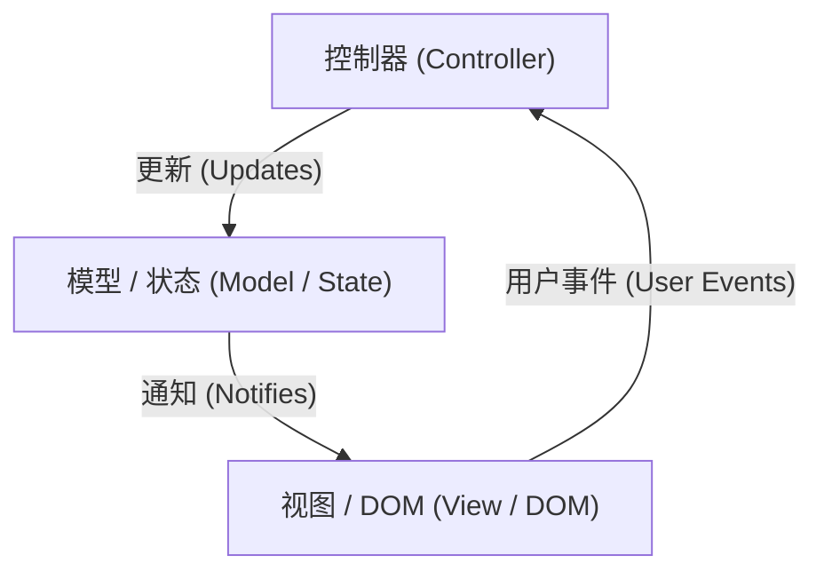
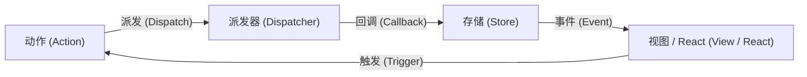
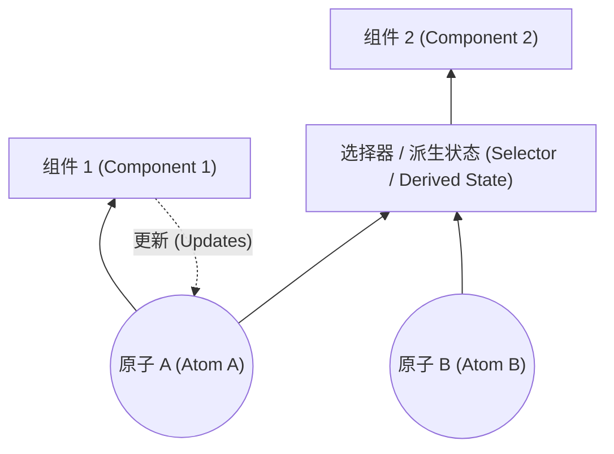
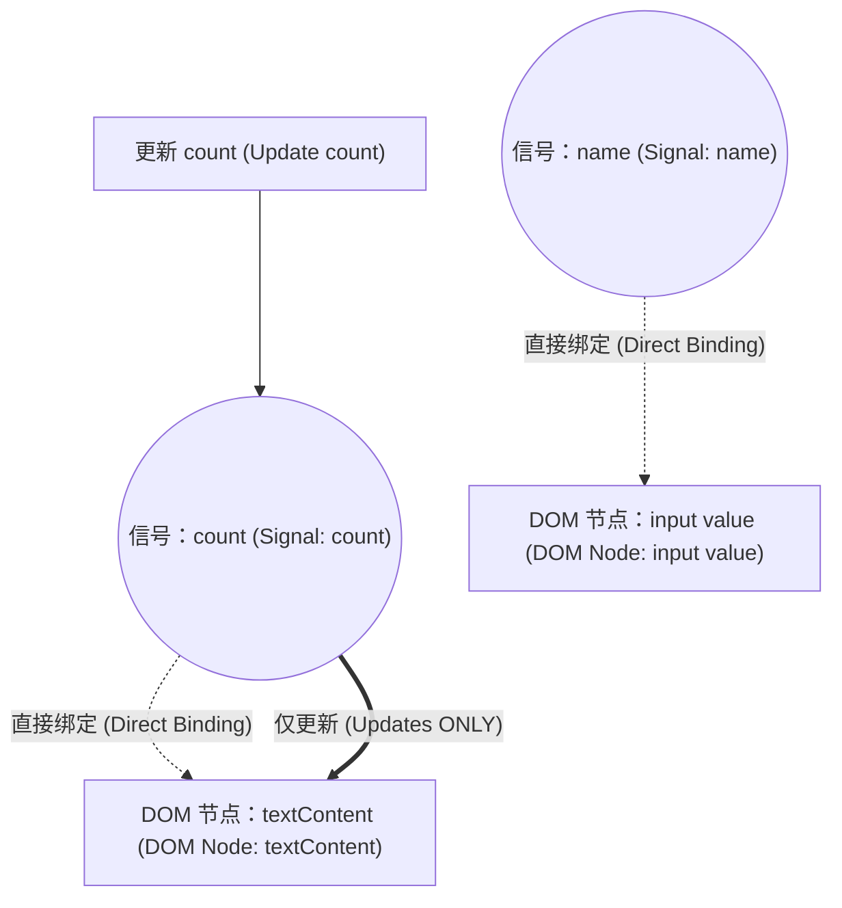

在 Web 前端开发中，最具争议且不断演进的领域便是“状态管理（[State](https://kenji.blog/zh-cn/p/iac-infrastructure-as-code-terraform/) Management）”。现代的 Web 应用程序已经从单纯的文档显示，蜕变为拥有媲美桌面应用程序的复杂交互软件。随之而来的是，如何管理应用程序的状态并将其与 UI 同步，成为了所有前端工程师面临的最大挑战。

本文将回顾前端状态管理的历史，深入且详细地探讨各个时代的挑战与解决方案，以及面向未来的范式转变（尤其是 Signals 和 Reactivity 的演进）。

## 1. 什么是状态管理？为什么它是前端的首要问题？

首先，“状态（State）”到底是什么？在 Web 应用程序中，状态是指“随着时间推移而变化，并影响用户界面（UI）显示的任何数据”。

- 从服务器获取的用户信息或列表数据
- 表单中输入的文本
- 指示模态窗口是打开还是关闭的标志
- 当前的 URL 路径或查询参数
- 黑暗模式或明亮模式的主题设置

所有这些都是“状态”。应用程序越复杂，这些状态就越会成倍增加，并且相互依赖。

### 1.1 UI 是状态的映射

在声明式 UI（Declarative UI）时代，UI 被建模为以状态为输入的纯函数。用数学公式表示如下：

$ UI = f(State) $

这个简单的公式是 React 等现代框架的基础理念。如果状态 $ State $ 发生变化，函数 $ f $ 将重新执行（重新渲染），并生成新的 $ UI $。
这里重要的是，开发者不再命令式地描述“如何更改 UI（How）”，而是声明式地描述“状态应该是什么，以及 UI 应该如何显示（What）”。

然而，现实的应用程序并不是静态的。状态会随着用户的输入 $ Action $ 而变化。考虑到这一点，状态可以作为时间 $ t $ 的函数，用以下递推公式表示：

$ State_{t+1} = update(State_t, Action) $

也就是说，状态管理的困难之处在于， **“如何无矛盾地保持和更新无数存在的状态，并在必要的时机仅将必要的部分高效地与 UI 同步”** 。

### 1.2 状态的作用域与生命周期

状态管理之所以困难，另一个原因是每种状态都有其合适的“作用域”和“生命周期”。

1.  **局部状态（Local State）**:
    仅在特定组件内完成的状态。例如，手风琴菜单的打开/关闭标志、按钮的悬停状态等。这些不需要进行全局管理。
2.  **全局状态（Global State）**:
    在整个应用程序中或多个远程组件之间共享的状态。例如，当前登录的用户信息、购物车内容、UI 的主题设置等。
3.  **服务器状态（Server State）**:
    保存在后端数据库中，前端异步获取并缓存显示的状态。这不能在客户端完全控制，需要复杂的管理，如缓存失效（Invalidation）和重新获取。

在过去的前端开发中，由于没有区分这些状态，导致复杂性激增，成为 Bug 的温床。通过回顾历史，我们将看到这些状态是如何被分离和整理的。

## 2. 黎明期：DOM 拥有状态的时代与 jQuery

在 2010 年左右的 Web 开发中，状态管理这个明确的概念还没有确立。在很多情况下， **状态是直接保存在 DOM（Document Object Model）本身的** 。

```javascript
// jQuery 时代的状态管理（将状态保存在 DOM 中）
$('#toggle-button').on('click', function() {
    var $menu = $('#dropdown-menu');
    // DOM 的 class 属性表示状态
    if ($menu.hasClass('is-active')) {
        $menu.removeClass('is-active');
        $(this).text('Open');
    } else {
        $menu.addClass('is-active');
        $(this).text('Close');
    }
});
```

在这种方法中，要了解 UI 的状态，需要直接读取 DOM（执行 DOM 查询）。数据（JavaScript 的变量）和视图（HTML/DOM）紧密耦合，当应用程序规模扩大时，追踪在哪里以及如何重写 DOM 变得不可能，陷入了所谓的“意大利面条代码”的无法维护状态。

## 3. MVC 架构与双向数据绑定的功与过

为了反思 jQuery 的局限性，出现了采用 MVC（Model-View-Controller）和 MVVM（Model-View-ViewModel）架构的框架，如 Backbone.js 和 AngularJS。

这些框架最大的发明是， **分离了数据（Model）和显示（View）** 。



特别是 AngularJS（Angular 1.x）采用的“双向数据绑定（Two-way Data Binding）”是一项革命性的技术。当 Model 的数据发生变化时，View 会自动更新；当 View（例如输入表单）发生变化时，Model 会自动更新。

```html
<!-- AngularJS 的双向数据绑定 -->
<input type="text" ng-model="user.name">
<p>Hello, {{ user.name }}!</p>
```

这使开发者从直接操作 DOM 中解放出来。然而，当应用程序变得庞大时，出现了一个新问题： **“级联更新（连锁更新）”** 。

当 Model A 更新时，View B 随之更新，View B 的更改又更新了 Model C，进而又更新了 View D……如此一来，数据流错综复杂，导致频繁陷入死循环或在预期之外的时机更新 UI，从而引发许多 Bug。“什么时候，是谁，更改了哪个数据”变得无法预测。

## 4. React 与 [Flux](https://kenji.blog/zh-cn/p/state-management-history-redux-context-recoil-zustand/) 的诞生：单向数据流的革命

2013 年，Facebook（现 Meta）发布了 React。React 本身是一个用于构建 UI 的库（MVC 中的 V），但与此同时，他们也提出了新的架构模式—— **Flux** 。

Flux 的最大目的是消除 MVC 中双向数据绑定的复杂性，即实现 **“单向数据流（Unidirectional Data Flow）”** 。



[Flux](https://kenji.blog/zh-cn/p/state-management-history-redux-context-recoil-zustand/) 架构有严格的规则：

1.  **动作 (Action)**: 对系统进行更改的唯一方法。指示发生了什么的独立对象。
2.  **派发器 (Dispatcher)**: 接收所有 Action 并将它们分发到 Store 的中央枢纽。
3.  **存储 (Store)**: 保持应用程序状态和业务逻辑的位置。Store 向 Dispatcher 注册回调，接收 Action 并更新自身的状态。
4.  **视图 (View)**: 从 Store 接收状态并进行渲染。根据用户的操作生成新的 Action。

重要的是， **View 绝对不能直接更改 Store 的状态** 。要更改状态，必须发出 Action 并经过 Dispatcher 这一单行道循环。这使得数据的流动变得极具可预测性（Predictable），极大地提高了大型应用程序中状态管理的稳定性。

## 5. [Redux](https://kenji.blog/zh-cn/p/state-management-history-redux-context-recoil-zustand/) 的霸权与局限

将 Flux 的概念进一步提炼，并成为前端状态管理事实标准的，是 2015 年由 Dan Abramov 等人开发的 **Redux** 。

Redux 在 Flux 的单向数据流中引入了函数式编程的概念（特别是 Elm 架构）。

### 5.1 Redux 的三大原则

Redux 基于以下三个严格的原则：

1.  **单一数据源（Single source of truth）**:
    整个应用程序的状态保存在单个存储（Store）中的对象树中。
2.  **状态是只读的（[State](https://kenji.blog/zh-cn/p/iac-infrastructure-as-code-terraform/) is read-only）**:
    更改状态的唯一方法是发出（Dispatch）一个描述发生什么事情的 Action 对象。
3.  **使用纯函数执行修改（Changes are made with pure functions）**:
    为了指定状态树如何由 Action 转换，需要编写被称为 Reducer 的纯函数。

### 5.2 Reducer 与纯函数

Reducer 是一个纯函数（Pure Function），它接收先前的状态和 Action，并返回新的状态。

$ State_{new} = Reducer(State_{old}, Action) $

由于它是纯函数，因此没有副作用（例如 API 调用或更改 DOM），对于相同的输入总是返回相同的输出。此外，它不能直接修改（Mutate）作为参数传递的状态，而是必须始终生成并返回一个新的状态对象。

```javascript
// Redux 的 Reducer 示例
const initialState = { count: 0, loading: false };

function counterReducer(state = initialState, action) {
  switch (action.type) {
    case 'INCREMENT':
      // 不要直接更改状态，而是返回新对象 (Immutability)
      return { ...state, count: state.count + 1 };
    case 'DECREMENT':
      return { ...state, count: state.count - 1 };
    case 'SET_LOADING':
      return { ...state, loading: action.payload };
    default:
      return state;
  }
}
```

这种“不可变性（Immutability）”和“纯函数”的组合，使 [Redux](https://kenji.blog/zh-cn/p/state-management-history-redux-context-recoil-zustand/) 实现了强大的时间旅行调试（Time-travel debugging，即回滚到过去的状态）和热重载。这在开发体验（DX）方面是一项重大突破。

### 5.3 Redux 的挑战：样板代码的障碍

尽管 Redux 是一个出色的架构，但随着它的普及，许多开发者开始感到不满。最大的原因是 **“样板代码（Boilerplate）太多”** 。

仅仅为了增加一个计数器的数字，也需要创建或修改以下文件：
1. 定义 Action Type 常量
2. 创建 Action Creator 函数
3. 添加到 Reducer 的 switch 语句中
4. 在组件侧编写 `mapStateToProps` 和 `mapDispatchToProps`（在 Hooks 之前）

此外，为了处理异步操作（如 API 通信），需要引入 `redux-thunk` 或 `redux-saga` 等中间件，学习成本急剧上升。

“[Redux](https://kenji.blog/zh-cn/p/state-management-history-redux-context-recoil-zustand/) 是不是杀鸡用牛刀了？”的呼声越来越高，开发者们开始探索状态管理的新方法。

## 6. [Context API](https://kenji.blog/zh-cn/p/state-management-history-redux-context-recoil-zustand/) 与 Hooks 引发的“去 Redux”运动

2018 年 React 16.3 刷新了 Context API，并在 2019 年 React 16.8 引入了 **React Hooks** ，这成为了状态管理历史上的一个重大转折点。

### 6.1 使用内置功能共享状态

使用 Context API，可以直接将数据传递给组件树深层的组件，而无需进行属性的层层传递（Prop Drilling）。
此外，通过组合 `useReducer` Hook，现在可以仅使用 React 的内置功能实现类似 [Redux](https://kenji.blog/zh-cn/p/state-management-history-redux-context-recoil-zustand/) 的状态管理。

```javascript
// 使用 Context 和 useReducer 的状态管理
import React, { createContext, useContext, useReducer } from 'react';

const CountContext = createContext();

function countReducer(state, action) {
  switch (action.type) {
    case 'INCREMENT': return { count: state.count + 1 };
    default: return state;
  }
}

function CountProvider({ children }) {
  const [state, dispatch] = useReducer(countReducer, { count: 0 });
  return (
    <CountContext.Provider value={{ state, dispatch }}>
      {children}
    </CountContext.Provider>
  );
}

function CounterDisplay() {
  // 从 Context 中直接获取状态
  const { state } = useContext(CountContext);
  return <div>Count: {state.count}</div>;
}
```

因此，“对于简单的全局状态，不需要 [Redux](https://kenji.blog/zh-cn/p/state-management-history-redux-context-recoil-zustand/)”的观点被广泛接受。然而，这种方法存在一个致命的性能陷阱。

### 6.2 [Context API](https://kenji.blog/zh-cn/p/state-management-history-redux-context-recoil-zustand/) 的性能问题（多余的重新渲染）

React 的 Context API 有一个规范：“当 Context 的值更新时，所有订阅该 Context（调用了 `useContext`）的组件都会无条件地重新渲染。”

例如，如果你通过 Context 共享像 `{ user: {...}, theme: 'dark' }` 这样的庞大对象，那么即使只更改了 `theme`，只需要 `user` 信息的组件也会被重新渲染。
为了防止这种情况发生，需要将 Context 按功能细分，或者大量使用 `React.memo` 进行记忆化（Memoization），这反而增加了复杂性。

由于 React 默认采用“自顶向下”的渲染模型，这暴露了一个本质问题，即全局状态更改很容易引发整个树的不必要重新渲染。

## 7. 状态分离：Server [State](https://kenji.blog/zh-cn/p/iac-infrastructure-as-code-terraform/) 与 Client State

从这个时候开始，状态管理发生了一个重要的范式转变。那就是认识到“不应该将所有的状态都放入单一的全局存储中”。
特别是从服务器获取的数据（Server State）与仅在前端完成的 UI 状态（Client State）在性质上根本不同。

- **服务器状态 (Server State)**: 归服务器所有。异步获取。因为由多人共享和更改，可能会过时（Stale）。需要缓存管理、后台更新、重试机制等。
- **客户端状态 (Client State)**: 归客户端（浏览器）所有。同步更新。例如黑暗模式或模态框的开闭等。

### 7.1 React Query, SWR, [Apollo Client](https://kenji.blog/zh-cn/p/graphql-vs-rest-api-overfetching-type-safety/) 的崛起

将 Server State 的管理从 [Redux](https://kenji.blog/zh-cn/p/state-management-history-redux-context-recoil-zustand/) 或 Context 中分离出来，交由专用库来处理的方法成为主流。 **React Query (现 TanStack Query)** 和 **SWR** 应运而生。

```javascript
// 使用 React Query 管理 Server State
import { useQuery } from 'react-query';

function UserProfile({ userId }) {
  // 缓存、重新获取、加载状态、错误状态全部自动管理
  const { data, isLoading, error } = useQuery(['user', userId], fetchUser);

  if (isLoading) return <div>Loading...</div>;
  if (error) return <div>Error!</div>;

  return <div>Name: {data.name}</div>;
}
```

这些库抽象出了“在本地缓存服务器状态，并在需要时同步”这一复杂的过程。
通过这种方式，需要由 [Redux](https://kenji.blog/zh-cn/p/state-management-history-redux-context-recoil-zustand/) 等全局存储管理的数据大幅减少为“纯粹的客户端状态”，极大减轻了状态管理的负担。

## 8. 原子化状态管理：[Recoil](https://kenji.blog/zh-cn/p/state-management-history-redux-context-recoil-zustand/) 与 [Jotai](https://kenji.blog/zh-cn/p/state-management-history-redux-context-recoil-zustand/)

在 Server [State](https://kenji.blog/zh-cn/p/iac-infrastructure-as-code-terraform/) 分离之后，如何高效管理剩下的 Client State 展开了新的竞争。
为了解决 React 的渲染模型（自顶向下）和 [Context API](https://kenji.blog/zh-cn/p/state-management-history-redux-context-recoil-zustand/) 的性能问题，诞生了 **原子化状态管理（Atomic [State Management](https://kenji.blog/zh-cn/p/state-management-history-redux-context-recoil-zustand/)）** 的方法。

2020 年 Facebook 团队发布了 **[Recoil](https://kenji.blog/zh-cn/p/state-management-history-redux-context-recoil-zustand/)** ，受其影响，出现了 **[Jotai](https://kenji.blog/zh-cn/p/state-management-history-redux-context-recoil-zustand/)** 等库。

### 8.1 自底向上的状态管理

[Redux](https://kenji.blog/zh-cn/p/state-management-history-redux-context-recoil-zustand/) 采用的是“从单一的巨大状态树中截取所需部分（自顶向下）”的方法，而 Recoil 和 Jotai 则采用“创建状态的最小单位（Atom），并将它们组合后注入到组件树中（自底向上）”的方法。



Atom 是独立的状态单元。组件仅订阅（Subscribe）所需的 Atom。当 Atom 更新时，只有订阅了该 Atom 的组件会被精准地重新渲染。这完全解决了 [Context API](https://kenji.blog/zh-cn/p/state-management-history-redux-context-recoil-zustand/) 存在的不必要重渲染问题。

```javascript
// 使用 Jotai 的 Atomic State 示例
import { atom, useAtom } from 'jotai';

// 定义状态的最小单元（Atom）
const priceAtom = atom(1000);
const taxRateAtom = atom(0.1);

// 也可以定义派生自其他 Atom 的状态（Derived State）
const priceWithTaxAtom = atom((get) => {
  return get(priceAtom) * (1 + get(taxRateAtom));
});

function ProductDisplay() {
  const [priceWithTax] = useAtom(priceWithTaxAtom);
  // 只有当 priceAtom 或 taxRateAtom 发生变化时才重新渲染
  return <div>Tax Included: ¥{priceWithTax}</div>;
}
```

[Jotai](https://kenji.blog/zh-cn/p/state-management-history-redux-context-recoil-zustand/) 等库的用法几乎与 React 的 `useState` 相同，由于学习成本低且性能高，它们在现代 React 应用程序中已成为非常受欢迎的选择。

## 9. 代理与可变性：[Zustand](https://kenji.blog/zh-cn/p/state-management-history-redux-context-recoil-zustand/) 与 Valtio

作为另一股强劲的潮流，出现了一些将样板代码精简到极致，提供更直观 API 的库。这就是由 Poimandres 这个 OSS 组织开发的 **Zustand** 和 **Valtio** 。

### 9.1 Zustand：追求极致简单的 [Flux](https://kenji.blog/zh-cn/p/state-management-history-redux-context-recoil-zustand/)

Zustand 与 [Redux](https://kenji.blog/zh-cn/p/state-management-history-redux-context-recoil-zustand/) 一样采用了单一存储（Flux 架构），但排除了 Reducer 和 Provider 等复杂概念，提供了极其简单的基于 Hooks 的 API。

```javascript
// Zustand 示例
import { create } from 'zustand';

// 创建存储。将状态和更新函数一起定义
const useStore = create((set) => ({
  count: 0,
  increment: () => set((state) => ({ count: state.count + 1 })),
  removeAllBears: () => set({ count: 0 }),
}));

function Counter() {
  // 仅使用 Selector 提取所需状态。防止不必要的重新渲染。
  const count = useStore((state) => state.count);
  const increment = useStore((state) => state.increment);

  return <button onClick={increment}>{count}</button>;
}
```

[Zustand](https://kenji.blog/zh-cn/p/state-management-history-redux-context-recoil-zustand/) 确立了兼顾 [Redux](https://kenji.blog/zh-cn/p/state-management-history-redux-context-recoil-zustand/) 的健壮性和 Hooks 的简单性的“现代版 Redux”地位。

### 9.2 Valtio：基于 Proxy 的可变状态管理

在 React 领域，“状态应作为不可变对象处理”被视为铁律。然而，不可变地更新 JavaScript 对象是繁琐的（尤其是在嵌套很深的情况下）。

Valtio 采取了一种创新方法：它利用 ES6 的 `Proxy` 对象，“在进行可变（Mutable）操作的同时，在内部实现不可变的状态更新和响应式特性”。这非常接近 Vue.js（Vue 3）的 Reactivity 系统方法。

```javascript
// Valtio 示例
import { proxy, useSnapshot } from 'valtio';

// 使用 Proxy 包装的状态对象
const state = proxy({ count: 0, user: { name: 'Alice' } });

// 像普通的 JavaScript 变量一样直接赋值（Mutate）来更新
const increment = () => {
  state.count += 1;
};

function Counter() {
  // 使用 useSnapshot 订阅状态。仅检测所访问属性的更改。
  const snap = useSnapshot(state);
  return <button onClick={increment}>{snap.count}</button>;
}
```

Valtio 提供了极高水平的直观开发体验。对于习惯 Vue 或 Svelte 的开发者在使用 React 时，这也是备受青睐的方法。

## 10. 范式转换：Signals 与细粒度响应式（Fine-grained Reactivity）

时至今日，前端状态管理领域最大的热词莫过于 **Signals** 和 **细粒度响应式（Fine-grained Reactivity）** 。

一直以来，React 使用虚拟 DOM（Virtual DOM），采用了“重新执行组件函数以创建新的 UI 树，并与前一棵树进行差异（Diff）比较来更新 DOM”的方法。
相比之下，采用 Signals 的框架（如 SolidJS、Vue 3、Svelte 5 (Runes)、Preact、Angular 等）则采取了完全不同的方法。

### 10.1 什么是 Signals？

Signal 是一种保存随时间变化的值，并能使其依赖该值的函数或表达式（Effects / Computed）自动重新执行的机制。

```javascript
// SolidJS 的 Signal 示例
import { createSignal, createEffect } from "solid-js";

// 创建 Signal。返回 Getter 和 Setter。
const [count, setCount] = createSignal(0);

// Effect（副作用）。检测到 count() 被调用并记录依赖关系。
// count 更新时自动重新执行。
createEffect(() => {
  console.log("Count changed to:", count());
});

setCount(1); // 控制台显示 "Count changed to: 1"
```

### 10.2 与 React 的决定性区别

React（虚拟 DOM）与 Signals（细粒度响应式）最大的区别在于 **“更新的粒度”** 。

对于 React，如果状态发生变化， **整个组件将被重新执行** 。开发者必须大量使用 `useMemo`、`useCallback` 或 `React.memo`，手动进行优化，告诉 React“从这里往下不需要重新渲染”。

另一方面，在基于 Signals 的框架（如 SolidJS）中， **组件函数只在初始化时执行一次** 。
如果 Signal 的值在模板中使用，框架会在编译时构建直接的依赖关系：“如果这个 Signal 发生改变，就只更新这个 DOM 节点（文本节点或属性）”。



也就是说，它跳过了虚拟 DOM 的差异计算开销，直接像做外科手术般改写需要更新的 DOM 节点（Fine-grained update）。这带来了压倒性的性能优势以及开发者无需手动优化的极佳 DX（开发体验）。

### 10.3 Signals 的数学模型

Signals 背后是“响应式编程”的理论，它将状态和计算之间的依赖关系建模为 **有向无环图（Directed Acyclic [Graph](https://kenji.blog/zh-cn/p/tree-graph-data-structures-search-dfs-bfs-dijkstra/): DAG）** ，并利用图的拓扑排序来高效地确定更新顺序。

如果某个派生状态（Computed） $ C $ 依赖于 Signal $ S_1, S_2 $，则形成边 $ S_1 \to C $、$ S_2 \to C $。
当值发生变化时，通过遍历图并仅评估必要的节点（采用 Push / Pull 混合策略等），可以防止故障（Glitch：一瞬间显示处于中间状态、不一致的 UI 的现象），并确保拓扑一致性。

## 11. React 的反击：React Compiler (Forget)

面对 Signals 的崛起，React 将如何应对？React 团队并没有选择“将 Signals 引入 React”，而是选择了一个截然不同的方案： **React Compiler (开发代号: React Forget)** 。

React 的理念是坚持“UI 是状态的函数”这一简单的函数式编程模型。然而，为了让这个模型高性能运行，开发者过去需要手动进行记忆化（`useMemo`、`useCallback`）。

React Compiler 会在构建时对 React 组件代码进行静态分析，并 **自动插入所需的记忆化代码** 。

这意味着，开发者既不需要学习 Signals 的新 API，也不需要手动编写 `useMemo`，只需像往常一样编写 JavaScript，编译器就会在后台进行近乎细粒度更新的优化。这是一个极其雄心勃勃的项目，旨在“在不牺牲开发体验的前提下提升性能”。

## 12. 下一代范式：摆脱 Hydration 与 Resumability

最后，在状态管理的未来中不容忽视的是，服务器端渲染（SSR）与客户端协作时“注水（Hydration）”带来的挑战。

在传统的 SSR（如 Next.js）中，服务器生成的 HTML 发送到浏览器后，浏览器端需要加载并执行 JavaScript，挂载事件监听器并重建状态。这个繁重的过程被称为“Hydration”。在此期间，用户的操作会被阻塞。

**Qwik** 等新一代框架从根本上重新审视了状态管理和 JavaScript 加载的方式。他们提出了 **可恢复性（Resumability）** 的概念。

在服务器渲染的状态会被序列化并嵌入 HTML 中，客户端不需要从零开始“启动（Bootup）”并执行 JavaScript，而是从服务器暂停的状态“恢复（Resume）”。这使得初始加载时的 JavaScript 体积降至极低，并将 Hydration 的开销降为零。

## 13. 结论：状态管理将走向何方？

从 MVC 的混乱开始，经历 [Flux](https://kenji.blog/zh-cn/p/state-management-history-redux-context-recoil-zustand/)/Redux 带来的可预测性、Hooks 带来的简化、Server [State](https://kenji.blog/zh-cn/p/iac-infrastructure-as-code-terraform/) 的分离、通过 Atomic 和 Proxy 带来的效率提升，再到基于 Signals 的细粒度响应式。

回顾过去约 15 年前端状态管理的历史，我们可以清晰地看到一个趋势： **“在减少样板代码并降低开发者认知负担的同时，系统底层（框架和编译器）正在朝着自动优化性能的方向演进。”** 

- **中小型 React 开发**: [Jotai](https://kenji.blog/zh-cn/p/state-management-history-redux-context-recoil-zustand/) 或 [Zustand](https://kenji.blog/zh-cn/p/state-management-history-redux-context-recoil-zustand/) 通常是最佳选择。
- **伴随数据获取的开发**: TanStack Query 等 Server State 管理工具是必不可少的。
- **追求极致性能和 DX 的新项目**: 采用 Signals 的框架（如 SolidJS 和 Vue）极具吸引力。
- **React 的未来**: 随着 React Compiler 的成熟，许多状态管理的性能问题将通过自动化得到解决。

“银弹”是不存在的。但是，通过了解过去是如何解决这些历史问题的，我们可以针对眼前的项目，选择最合适、最具前瞻性的架构。状态管理的演进必将继续令我们前端工程师兴奋不已。
