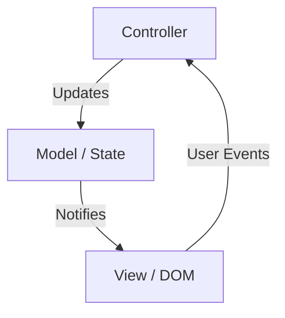
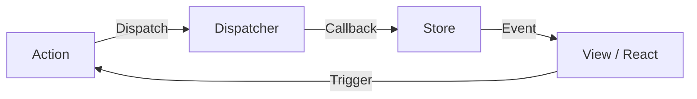
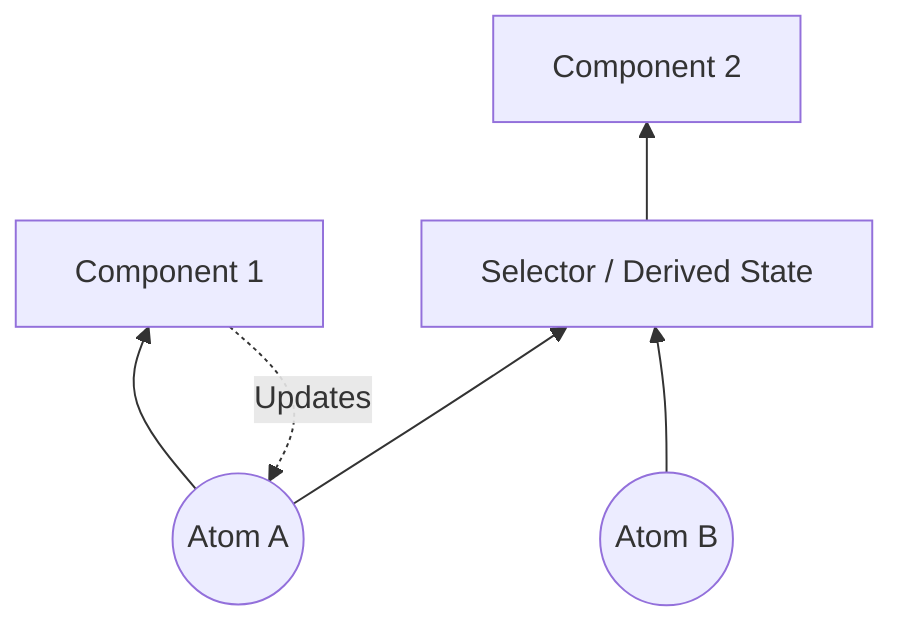
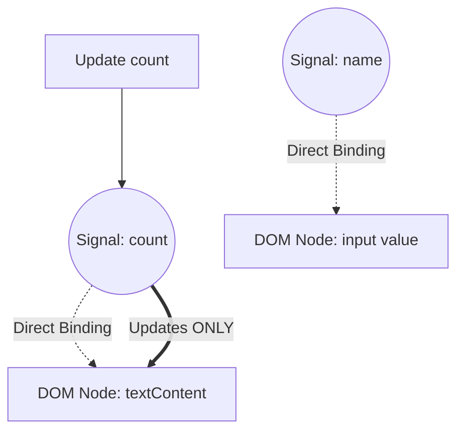

在 Web 前端開發中，最受爭議且不斷進化的領域就是「狀態管理（[State](https://kenji.blog/zh-tw/p/iac-infrastructure-as-code-terraform/) Management）」。現代 Web 應用程式已從單純的文件顯示，蛻變為擁有媲美桌面應用程式複雜互動的軟體。隨之而來的是，如何管理應用程式的狀態並與 UI 同步，成為了所有前端工程師面臨的最大挑戰。

本文將回顧前端狀態管理的歷史，深入探討每個時代的挑戰與解決方案，以及未來的典範轉移（特別是 Signals 與 Reactivity 的進化）。

## 1. 什麼是狀態管理？為什麼它是前端最重要的挑戰？

究竟「狀態（State）」是什麼？在 Web 應用程式中，狀態指的是「隨著時間流逝而變化，並影響使用者介面（UI）顯示的所有資料」。

- 從伺服器取得的使用者資訊或列表資料
- 表單中輸入的文字
- 顯示對話方塊開啟或關閉的旗標
- 目前的 URL 路徑或查詢參數
- 深色模式或淺色模式的主題設定

這一切都是「狀態」。隨著應用程式越來越複雜，這些狀態也會無窮無盡地增加，並開始相互依賴。

### 1.1 UI 是狀態的映射

在宣告式 UI（Declarative UI）的時代，UI 被建模為以狀態為輸入的純函數。用數學公式表示如下：

$ UI = f(\text{狀態}) $

這個簡單的公式是 React 等現代框架的基礎思想。如果狀態 $ \text{State} $ 發生變化，函數 $ f $ 就會重新執行（重新渲染），並產生新的 $ UI $。
這裡重要的是，開發者不需要命令式地描述「如何改變 UI（How）」，而是宣告式地描述「狀態應該是什麼樣子，對應的 UI 應該是什麼樣子（What）」。

然而，現實中的應用程式並不是靜態的。使用者的輸入 $ \text{Action} $ 會導致狀態改變。考慮到這一點，狀態可以作為時間 $ t $ 的函數，用以下遞迴關係式表示：

$ \text{狀態}_{t+1} = \text{更新}(\text{狀態}_t, \text{操作}) $

也就是說，狀態管理的困難在於， **「如何將無數存在的狀態無矛盾地保持與更新，並在需要的時機針對 UI 需要的部分進行有效率的同步」** 這一點上。

### 1.2 狀態的作用域與生命週期

讓狀態管理變得困難的另一個因素是，每個狀態都有其適當的「作用域」和「生命週期」。

1.  **本地狀態（Local State）**:
    僅在特定元件內完成的狀態。例如，手風琴選單的開關旗標、按鈕的懸停狀態等。這些不需要在全域管理。
2.  **全域狀態（Global State）**:
    在整個應用程式中，或在相距遙遠的多個元件之間共享的狀態。例如，登入中的使用者資訊、購物車的內容、UI 的主題設定等。
3.  **伺服器狀態（Server State）**:
    儲存在後端資料庫等地方，並在前端非同步取得與快取顯示的狀態。這無法在客戶端完全控制，需要進行快取失效（Invalidation）或重新獲取等複雜的管理。

在過去的前端開發中，由於這些狀態沒有被區分處理，導致複雜度爆發，成為 Bug 的溫床。透過追溯歷史，讓我們來看看這些狀態是如何被分離與整理的。

## 2. 黎明期：DOM 擁有狀態的時代與 jQuery

在 2010 年前後的 Web 開發中，狀態管理這個明確的概念尚未成形。在大多數情況下， **狀態是直接保留在 DOM（Document Object Model）本身的** 。

```javascript
// jQuery 時代的狀態管理（將狀態保存在 DOM 中）
$('#toggle-button').on('click', function() {
    var $menu = $('#dropdown-menu');
    // DOM 的 class 屬性代表著狀態
    if ($menu.hasClass('is-active')) {
        $menu.removeClass('is-active');
        $(this).text('Open');
    } else {
        $menu.addClass('is-active');
        $(this).text('Close');
    }
});
```

在這種方法中，為了知道 UI 的狀態，必須直接讀取 DOM（執行 DOM 查詢）。資料（JavaScript 的變數）與視圖（HTML/DOM）緊密耦合，當應用程式規模擴大時，追蹤 DOM 在何處以及如何被修改變得不可能，陷入了所謂「義大利麵條程式碼」這種無法維護的狀態。

## 3. MVC 架構與雙向資料綁定的功與過

出於對 jQuery 侷限性的反思，出現了採用 MVC（Model-View-Controller）或 MVVM（Model-View-ViewModel）架構的框架，如 Backbone.js 和 AngularJS。

這些框架最大的發明，就是 **分離了資料（Model）與顯示（View）** 。



特別是 AngularJS（Angular 1.x）採用的「雙向資料綁定（Two-way Data Binding）」具有革命性意義。如果 Model 的資料發生變化，View 就會自動更新；如果 View（如輸入表單）發生變化，Model 就會自動更新。

```html
<!-- AngularJS 的雙向資料綁定 -->
<input type="text" ng-model="user.name">
<p>Hello, {{ user.name }}!</p>
```

這樣一來，開發者就從直接操作 DOM 中解放出來了。然而，當應用程式大規模化時，又產生了新的問題。那就是 **「級聯更新（連鎖更新）」** 。

Model A 更新導致 View B 更新，View B 的改變更新了 Model C，這又進一步更新了 View D... 如此一來，資料流變得錯綜複雜，頻繁出現陷入無限迴圈或 UI 在非預期時間點更新的 Bug。人們變得無法預測「何時、是誰、更改了哪個資料」。

## 4. React 與 Flux 的誕生：單向資料流的革命

2013 年，Facebook（現為 Meta）發布了 React。雖然 React 本身是一個用於建構 UI 的函式庫（MVC 中的 V），但同時他們也提出了一種新的架構模式 **Flux** 。

Flux 最大的目的就是消除 MVC 中雙向資料綁定的複雜性，亦即實現 **「單向資料流（Unidirectional Data Flow）」** 。



Flux 架構有嚴格的規則：

1.  **Action**: 對系統進行修改的唯一方法。一個表示發生了什麼事的物件。
2.  **Dispatcher**: 接收所有 Action 並將其分發給 Store 的中央樞紐。
3.  **Store**: 保存應用程式狀態和業務邏輯的地方。Store 向 Dispatcher 註冊回呼函數，接收 Action 並更新自身狀態。
4.  **View**: 從 Store 接收狀態並進行渲染。根據使用者的操作產生新的 Action。

重要的是， **View 絕對不能直接修改 Store 的狀態** 。要修改狀態，必須發出 Action 並經過 Dispatcher，這樣單向循環。這使得資料流變得極具可預測性（Predictable），大幅提升了大規模應用程式中狀態管理的穩定性。

## 5. Redux 的霸權與極限

將 Flux 概念進一步洗鍊，並成為前端狀態管理事實上標準（De facto standard）的，是 Dan Abramov 等人在 2015 年開發的 **Redux** 。

Redux 在 Flux 的單向資料流中，引入了函數式程式設計的概念（特別是 Elm 架構）。

### 5.1 Redux 的三大原則

Redux 基於以下三個嚴格的原則：

1.  **單一事實來源（Single source of truth）**:
    整個應用程式的狀態，作為一個物件樹保存在單一的 Store 中。
2.  **狀態是唯讀的（[State](https://kenji.blog/zh-tw/p/iac-infrastructure-as-code-terraform/) is read-only）**:
    改變狀態的唯一方法是發出（Dispatch）一個描述發生了什麼事的 Action 物件。
3.  **變更使用純函數進行（Changes are made with pure functions）**:
    為了指定狀態如何因 Action 而改變，需要撰寫稱為 Reducer 的純函數。

### 5.2 Reducer 與純函數

Reducer 是一個接收前一個狀態和 Action，並回傳新狀態的純函數（Pure Function）。

$ \text{新狀態} = \text{Reducer}(\text{舊狀態}, \text{操作}) $

因為是純函數，所以它沒有副作用（如 API 呼叫或 DOM 的變更等），對於相同的輸入總是回傳相同的輸出。此外，不能直接修改（Mutate）作為參數傳入的狀態，而是必須始終建立並回傳一個新的狀態物件。

```javascript
// Redux 的 Reducer 範例
const initialState = { count: 0, loading: false };

function counterReducer(state = initialState, action) {
  switch (action.type) {
    case 'INCREMENT':
      // 不直接修改狀態，而是回傳新的物件 (Immutability)
      return { ...state, count: state.count + 1 };
    case 'DECREMENT':
      return { ...state, count: state.count - 1 };
    case 'SET_LOADING':
      return { ...state, loading: action.payload };
    default:
      return state;
  }
}
```

這項「不可變性（Immutability）」與「純函數」的結合，讓 Redux 實現了強大的時間旅行除錯（Time-travel debugging，倒轉到過去的狀態）以及熱模組替換（Hot reloading）。在開發體驗（DX）方面是一大突破。

### 5.3 Redux 的挑戰：樣板程式碼之壁

Redux 是一個很棒的架構，但隨著其普及，許多開發者開始感到不滿。最大的理由是 **「樣板程式碼（Boilerplate）太多」** 。

即使只是單純地增加計數器數字這樣的簡單處理，也需要建立與修改以下檔案：
1. Action Type 的常數定義
2. Action Creator 函數的建立
3. 新增到 Reducer 的 switch 語句中
4. 元件端中 `mapStateToProps` 和 `mapDispatchToProps` 的撰寫（Hooks 之前）

此外，為了處理非同步操作（如 API 通訊等），必須導入 `redux-thunk` 或 `redux-saga` 等中介軟體，學習成本也急遽飆升。

「Redux 是否大材小用了？」的聲音高漲，開始探索狀態管理的新方法。

## 6. Context API 與 Hooks 帶來的「脫離 Redux」運動

2018 年 React 16.3 對 Context API 進行了翻新，接著在 2019 年的 React 16.8 引入了 **React Hooks** ，這成為了狀態管理歷史上的巨大轉捩點。

### 6.1 透過內建功能共享狀態

使用 Context API，可以直接將資料傳遞給元件樹深層的元件，而不需要進行屬性層層傳遞（Prop Drilling）。
此外，結合 `useReducer` Hook，可以僅用 React 的內建功能實現類似 Redux 的狀態管理。

```javascript
// 使用 Context 和 useReducer 的狀態管理
import React, { createContext, useContext, useReducer } from 'react';

const CountContext = createContext();

function countReducer(state, action) {
  switch (action.type) {
    case 'INCREMENT': return { count: state.count + 1 };
    default: return state;
  }
}

function CountProvider({ children }) {
  const [state, dispatch] = useReducer(countReducer, { count: 0 });
  return (
    <CountContext.Provider value={{ state, dispatch }}>
      {children}
    </CountContext.Provider>
  );
}

function CounterDisplay() {
  // 直接從 Context 取得狀態
  const { state } = useContext(CountContext);
  return <div>Count: {state.count}</div>;
}
```

由此，「如果是簡單的全域狀態，就不需要 Redux」的認知廣泛傳開。然而，這種方法存在一個致命的效能陷阱。

### 6.2 Context API 的效能問題（Extra Re-renders）

React 的 Context API 有一個規範：「當 Context 的值更新時，訂閱了該 Context（呼叫了 `useContext`）的所有元件都會無條件地重新渲染」。

例如，如果透過 Context 共享了一個巨大的物件 `{ user: {...}, theme: 'dark' }` ，那麼即使只有 `theme` 發生了變化，連只需要 `user` 資訊的元件也會被重新渲染。
為了防止這種情況，必須將 Context 按照功能細分，或者熟練使用 `React.memo` 進行記憶化（Memoization），結果反而增加了複雜性。

由於 React 預設採用「由上而下（Top-down）」的渲染模型，因此浮現了全域狀態變更容易導致整個元件樹不必要重新渲染的本質性挑戰。

## 7. 狀態的分離：Server [State](https://kenji.blog/zh-tw/p/iac-infrastructure-as-code-terraform/) 與 Client State

大約從這個時候開始，狀態管理發生了重要的典範轉移。那就是「不應該將所有狀態都放入單一的全域 Store 中」的認知。
特別是從伺服器取得的資料（Server State），與僅在前端完成的 UI 狀態（Client State）在本質上具有根本的不同。

- **伺服器狀態（Server State）**: 由伺服器擁有。非同步取得。由於可能由多人共享或變更，因此總是有變為過期（Stale）狀態的可能。需要快取管理、背景更新和重試處理。
- **客戶端狀態（Client State）**: 由客戶端（瀏覽器）擁有。同步更新。如深色模式或對話方塊的開關等。

### 7.1 React Query、SWR、Apollo Client 的崛起

將 Server State 的管理從 Redux 或 Context 中分離出來，交由專用的函式庫處理的方法成為了主流。這就是 **React Query (現為 TanStack Query)** 和 **SWR** 的登場。

```javascript
// 使用 React Query 管理 Server State
import { useQuery } from 'react-query';

function UserProfile({ userId }) {
  // 自動管理快取、重新取得、載入狀態和錯誤狀態
  const { data, isLoading, error } = useQuery(['user', userId], fetchUser);

  if (isLoading) return <div>Loading...</div>;
  if (error) return <div>Error!</div>;

  return <div>Name: {data.name}</div>;
}
```

這些函式庫抽象化了「將伺服器狀態快取到本地，並在需要時同步」的複雜處理。
這樣一來，應該由 Redux 等全域 Store 管理的資料銳減至「純粹的客戶端狀態」，大幅減輕了狀態管理的負擔。

## 8. 原子狀態管理（Atomic [State](https://kenji.blog/zh-tw/p/iac-infrastructure-as-code-terraform/) Management）：Recoil 與 Jotai

在 Server State 被分離出來之後，一場關於如何有效管理剩餘的 Client State 的新競爭開始了。
為了解決 React 的渲染模型（由上而下）和 Context API 的效能問題而誕生的，就是 **原子狀態管理（Atomic State Management）** 方法。

2020 年 Facebook 團隊發布了 **Recoil** ，受其影響，如 **Jotai** 等函式庫也相繼登場。

### 8.1 由下而上的狀態管理

Redux 採取的是「從單一的巨大狀態樹中切出所需部分（由上而下）」的方法，而 Recoil 或 Jotai 則採取「建立狀態的最小單位（Atom），並將它們組合注入元件樹中（由下而上）」的方法。



Atom 是獨立的狀態單位。元件只訂閱（Subscribe）需要的 Atom。當 Atom 更新時，只有訂閱了該 Atom 的元件會精準地重新渲染。這徹底解決了 Context API 存在的不必要重新渲染問題。

```javascript
// 使用 Jotai 的 Atomic State 範例
import { atom, useAtom } from 'jotai';

// 定義狀態的最小單位（Atom）
const priceAtom = atom(1000);
const taxRateAtom = atom(0.1);

// 也可以定義由其他 Atom 衍生的狀態（Derived State）
const priceWithTaxAtom = atom((get) => {
  return get(priceAtom) * (1 + get(taxRateAtom));
});

function ProductDisplay() {
  const [priceWithTax] = useAtom(priceWithTaxAtom);
  // 只有在 priceAtom 或 taxRateAtom 改變時才會重新渲染
  return <div>Tax Included: ¥{priceWithTax}</div>;
}
```

由於 Jotai 等函式庫的使用感覺與 React 的 `useState` 幾乎相同，學習成本低且具有高效能，因此成為了現代 React 應用程式中非常受歡迎的選擇。

## 9. 代理與可變性：Zustand 與 Valtio

作為另一個強大的潮流，極致削減樣板程式碼、提供更直覺 API 的函式庫群出現了。這就是由 Poimandres 這個開源社群開發的 **Zustand** 和 **Valtio** 。

### 9.1 Zustand：極致簡單的 Flux

Zustand 與 Redux 相同，採用了單一的 Store（Flux 架構），但排除了 Reducer 和 Provider 等複雜概念，提供了基於 Hooks 極其簡單的 API。

```javascript
// Zustand 的範例
import { create } from 'zustand';

// 建立 Store。將狀態與更新函數一起定義
const useStore = create((set) => ({
  count: 0,
  increment: () => set((state) => ({ count: state.count + 1 })),
  removeAllBears: () => set({ count: 0 }),
}));

function Counter() {
  // 僅透過 Selector 取出需要的狀態。防止不必要的重新渲染。
  const count = useStore((state) => state.count);
  const increment = useStore((state) => state.increment);

  return <button onClick={increment}>{count}</button>;
}
```

Zustand 確立了兼具 Redux 的堅固性與 Hooks 簡單性的「現代版 Redux」地位。

### 9.2 Valtio：透過 Proxy 的可變狀態管理

在 React 的世界中，「狀態應該不可變（Immutable）地處理」這條規則一直被視為絕對。但是，不可變地更新 JavaScript 物件很麻煩（特別是在層狀結構很深的情況下）。

Valtio 活用了 ES6 的 `Proxy` 物件，採用了「一邊進行可變（Mutable）操作，內部則實現不可變狀態更新與反應性（Reactivity）」的劃時代手法。這與 Vue.js（Vue 3）的 Reactivity 系統的方法非常相似。

```javascript
// Valtio 的範例
import { proxy, useSnapshot } from 'valtio';

// 被 Proxy 包裝的狀態物件
const state = proxy({ count: 0, user: { name: 'Alice' } });

// 就像普通的 JavaScript 變數一樣，可以直接賦值（Mutate）來更新
const increment = () => {
  state.count += 1;
};

function Counter() {
  // 使用 useSnapshot 訂閱狀態。僅檢測存取過的屬性的變更。
  const snap = useSnapshot(state);
  return <button onClick={increment}>{snap.count}</button>;
}
```

Valtio 在開發體驗上提供了最高水準的直覺性。習慣於 Vue 或 Svelte 的開發者在使用 React 時也很喜歡這種方法。

## 10. 典範轉移：Signals 與細粒度反應性（Fine-grained Reactivity）

而現在，前端狀態管理中最大的流行語就是 **Signals** 與 **細粒度反應性（Fine-grained Reactivity）** 。

React 一直以來使用虛擬 DOM（Virtual DOM），採取了「重新執行元件函數建立新的 UI 樹，並與前一棵樹進行差異比較（Diff）來更新 DOM」的方法。
相對地，採用 Signals 的框架（SolidJS、Vue 3、Svelte 5 (Runes)、Preact、Angular 等）則採取了截然不同的方法。

### 10.1 Signals 是什麼？

Signal 指的是保留會隨著時間變化的值，並使依賴於該值的函數或表達式（Effects / Computed）自動重新執行的機制。

```javascript
// SolidJS 的 Signal 範例
import { createSignal, createEffect } from "solid-js";

// 建立 Signal。回傳 Getter 和 Setter。
const [count, setCount] = createSignal(0);

// Effect（副作用）。檢測到呼叫了 count() 並記錄依賴關係。
// 當 count 更新時會自動重新執行。
createEffect(() => {
  console.log("Count changed to:", count());
});

setCount(1); // 控制台會顯示 "Count changed to: 1"
```

### 10.2 與 React 的決定性差異

React（虛擬 DOM）和 Signals（細粒度反應性）最大的區別是 **「更新的粒度」** 。

在 React 中，當狀態變化時， **整個元件會被重新執行** 。開發者必須熟練運用 `useMemo` 、 `useCallback` 和 `React.memo` ，手動進行「從這裡往下不需要重新渲染哦」的最佳化。

另一方面，在 SolidJS 等基於 Signals 的框架中， **元件函數在初始化時只會執行一次** 。
如果 Signal 的值被用在模板中，框架會在編譯時建立直接的依賴關係：「如果這個 Signal 改變了，就只更新這個 DOM 節點（文字節點或屬性）」。



也就是說，跳過了計算虛擬 DOM 差異的額外負擔，像外科手術般直接改寫需要變更的 DOM 節點（Fine-grained update）。由此實現了壓倒性的效能，以及開發者無需手動進行最佳化的極致 DX（開發體驗）。

### 10.3 Signals 的數學模型

Signals 背後的理論是「響應式程式設計（Reactive Programming）」，它將狀態與計算的依賴關係建模為 **有向無環圖（Directed Acyclic Graph: DAG）** ，並利用圖的拓撲排序來有效率地決定更新順序。

如果某個衍生狀態（Computed） $ C $ 依賴於 Signal $ S_1, S_2 $，就會形成邊 $ S_1 \to C $, $ S_2 \to C $。
當值更新時，透過追蹤圖只評估需要的節點（如推 / 拉混合策略等），防止出現故障（Glitch：瞬間顯示不一致的過渡狀態 UI 的現象），並保證拓撲一致性。

## 11. React 的反擊：React Compiler (Forget)

面對 Signals 的崛起，React 將如何應對？React 團隊並沒有選擇「在 React 中引入 Signals」，而是選擇了完全不同的方法。那就是 **React Compiler (開發代號: React Forget)** 。

React 的理念是保持「UI 是狀態的函數」這樣簡單的函數式程式設計模型。但是，為了讓這個模型能以高效能執行，開發者必須手動進行記憶化（ `useMemo` 、 `useCallback` ）。

React Compiler 會在編譯時靜態分析 React 元件的程式碼，並 **自動插入必要的記憶化程式碼** 。

也就是說，開發者不需要學習 Signals 的新 API，也不需要手動撰寫 `useMemo` ，只要直覺地寫 JavaScript，編譯器就會在背後進行接近細粒度更新的最佳化。這是在「不損害開發者體驗的情況下提升效能」方面非常野心勃勃的專案。

## 12. 次世代的典範：擺脫 Hydration 與 Resumability

最後，在狀態管理的未來中不容忽視的，是伺服器端渲染（SSR）與客戶端協作中「水合（Hydration）」的挑戰。

在傳統的 SSR（如 Next.js 等）中，伺服器產生 HTML 傳送給瀏覽器後，瀏覽器端需要載入並執行 JavaScript，附加事件監聽器來重建狀態，這就是名為「Hydration」的繁重處理。在此期間，使用者的操作會被阻塞。

如 **Qwik** 等次世代框架，從根本上重新審視了狀態管理與 JavaScript 的載入。他們提出了 **Resumability（可恢復性）** 這個概念。

在伺服器上渲染的狀態會被序列化並嵌入到 HTML 中，而在客戶端並不是從零開始「啟動（Boot）」JavaScript 的執行，而是從伺服器暫停的狀態開始「恢復（Resume）」。這將初始載入的 JavaScript 大小縮減至極限，使得 Hydration 的額外負擔變為零。

## 13. 結論：狀態管理將走向何方？

從 MVC 的混亂開始，透過 Flux/Redux 獲得可預測性，透過 Hooks 實現簡化，分離 Server [State](https://kenji.blog/zh-tw/p/iac-infrastructure-as-code-terraform/)，透過 Atomic 和 Proxy 提高效率，再到 Signals 的細粒度反應性。

回顧約 15 年來前端狀態管理的歷史，可以看出一個明確的趨勢。那就是 **「在減少樣板程式碼、降低開發者認知負擔的同時，背後的系統（框架或編譯器）正朝著自動最佳化效能的方向進化」** 。

- **中小型 React 開發**: Jotai 或 Zustand 通常是最佳解。
- **伴隨資料獲取的開發**: TanStack Query 等 Server State 管理工具是必須的。
- **追求極致效能與 DX 的新專案**: 採用 Signals 的框架如 SolidJS 或 Vue 非常具吸引力。
- **React 的未來**: 隨著 React Compiler 的成熟，狀態管理的許多效能問題將透過自動化得到解決。

「銀彈」並不存在。但是，透過了解過去的挑戰是如何被解決的歷史，我們能夠為眼前的專案選擇最合適、著眼於未來的架構。狀態管理的進化，今後也將繼續讓我們這些前端工程師感到興奮不已。
