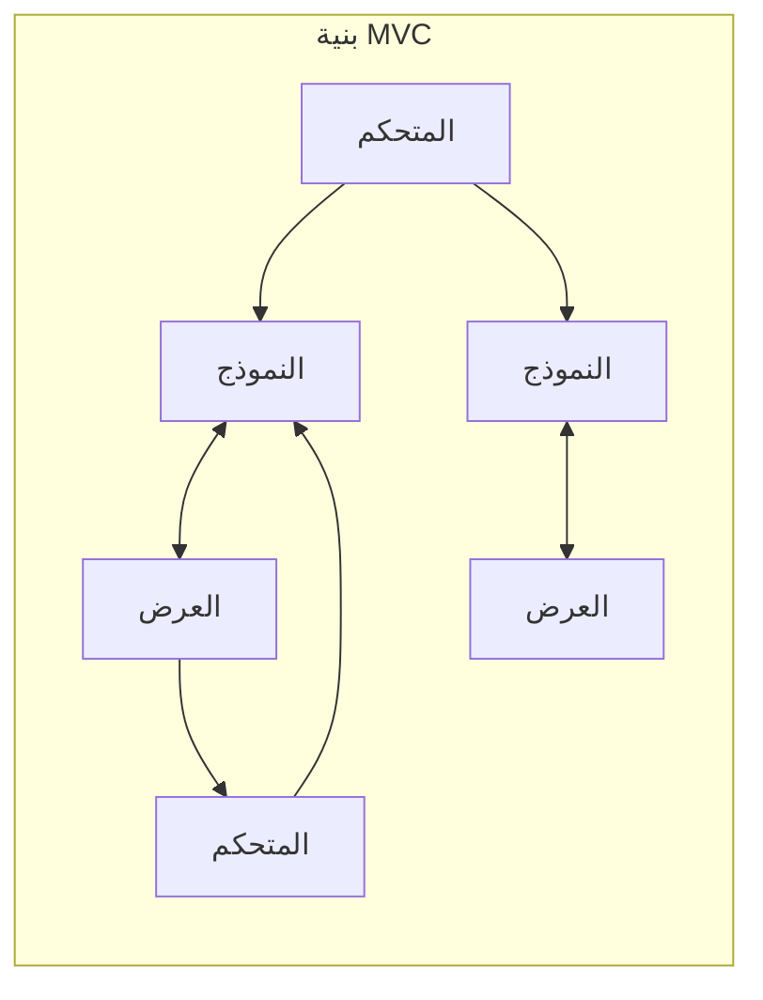
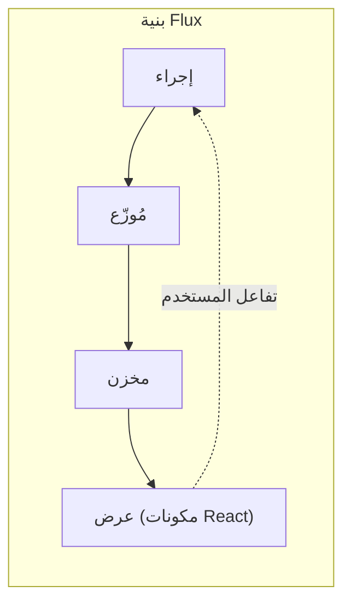
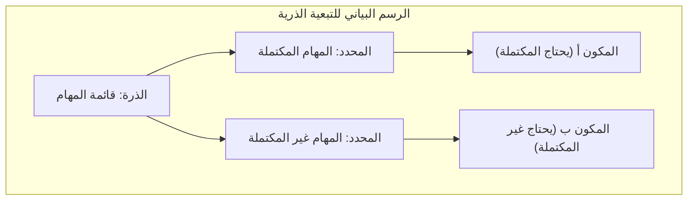

# مقدمة

في تطوير واجهات الويب الأمامية الحديثة، تعد **إدارة الحالة** (State Management) موضوعًا بالغ الأهمية لا يمكن تجنبه. خاصة في النظام البيئي الذي يركز على React، ظهرت وتطورت العديد من مكتبات وبنى إدارة الحالة حتى الآن.

في هذه المقالة، سنلقي نظرة على التطور التاريخي لإدارة الحالة في تطوير الواجهات الأمامية، ونتعمق في المشكلات التي تم إنشاء كل بنية لحلها، والمشكلات الجديدة التي أحدثتها. بدءًا من القيود التي واجهها نموذج MVC التقليدي، مرورًا بظهور بنية Flux، والتحول الجذري الذي أحدثه Redux، وإيجابيات وسلبيات React Context API، والحالة الذرية (Atomic State) المتمثلة في Recoil و Jotai، والأساليب القائمة على الوكيل (Proxy-based) مثل MobX و Valtio، وصولاً إلى المكتبات خفيفة الوزن مثل Zustand التي تحظى بدعم واسع من المطورين المعاصرين، سنشرح مسار هذا التطور بالتفصيل.

---

## 1. فجر إدارة الحالة: MVC وقيوده

قبل ظهور مكتبات واجهة المستخدم (UI) الحديثة مثل React و Vue، كان المعالجة المباشرة لـ DOM باستخدام jQuery هو السائد في عالم الواجهات الأمامية للويب. ومع ذلك، مع ازدياد تعقيد التطبيقات، أصبحت المزامنة اليدوية بين الحالة (البيانات) وواجهة المستخدم (DOM) مرتعًا للأخطاء.

لحل هذه المشكلة، تم جلب أنماط البنية التي حققت نجاحًا في الواجهة الخلفية مثل **MVC** (Model-View-Controller) و **MVVM** (Model-View-ViewModel) إلى الواجهة الأمامية (أمثلة بارزة: Backbone.js و AngularJS إلخ).

### المشكلات التي واجهها MVC

يقسم نمط MVC الأدوار إلى Model الذي يدير البيانات، و View الذي يرسم واجهة المستخدم، و Controller الذي يعالج إدخالات المستخدم ويحدث Model أو View. لقد عمل بشكل جيد في التطبيقات الصغيرة إلى المتوسطة الحجم، ولكن في التطبيقات الضخمة مثل Facebook (Meta حاليًا)، ظهرت مشكلات خطيرة.

وهي **عدم القدرة على التنبؤ بالحالة بسبب ربط البيانات ثنائي الاتجاه** . عندما يحدث تحديث متسلسل (Cascade Update) حيث يؤدي تغيير في Model إلى تحديث View، وتؤدي عملية في View إلى تحديث Model آخر، والذي بدوره يحدث View آخر... تتشابك تدفقات البيانات بشكل معقد، ويصبح تتبع الأخطاء صعبًا للغاية.



بهذه الطريقة، مع تدفق البيانات في اتجاهات متعددة، أصبح من المستحيل فهم "أي البيانات تغيرت الآن ولماذا".

---

## 2. ظهور بنية Flux وتدفق البيانات أحادي الاتجاه

كانت إجابة Facebook على مشكلة تعقيد MVC هي بنية **Flux** . كان الاختراع الأكبر لـ Flux هو التطبيق الصارم لـ **تدفق البيانات أحادي الاتجاه** (Unidirectional Data Flow).

في Flux، تتدفق بيانات التطبيق دائمًا في اتجاه واحد.



- **الإجراء** (Action): كائن يمثل عملية مستخدم أو حدثًا من النظام.
- **المُوزّع** (Dispatcher): محور مركزي يتلقى الإجراءات ويوزعها على جميع المخازن (Stores) المسجلة.
- **المخزن** (Store): يحتفظ بحالة التطبيق ومنطقه. يتلقى الإجراء من المُوزّع لتحديث نفسه، ويُعلم العرض (View) بالتغيير.
- **العرض** (View): يتلقى الحالة من المخزن ويرسم واجهة المستخدم. يكتشف عمليات المستخدم ويصدر إجراءات جديدة.

من خلال حصر تدفق البيانات في مسار واحد، أصبح من السهل تتبع عملية تغيير الحالة، وتحسنت إمكانية التنبؤ بالتطبيق بشكل كبير. كان هذا هو التحول الجذري المهم الذي شكل أساس إدارة الحالة فيما بعد.

---

## 3. Redux: عصر مصدر الحقيقة الوحيد (شجرة المسؤولية الواحدة)

على الرغم من أن مفهوم Flux كان رائعًا، إلا أنه لا يزال يعاني من تعقيدات في التنفيذ، مثل إدارة التبعيات بسبب وجود مخازن متعددة. تم صقل هذا وتطويره إلى شكله النهائي من خلال **Redux** ، الذي طوره Dan Abramov وآخرون.

### مبادئ Redux الثلاثة

يعتمد Redux على المبادئ الأساسية الثلاثة التالية:

1. **Single source of truth** (مصدر الحقيقة الوحيد الموثوق): يتم تخزين حالة التطبيق بأكملها في شجرة كائنات واحدة (Store).
2. **State is read-only** (الحالة للقراءة فقط): الطريقة الوحيدة لتغيير الحالة هي إصدار (dispatch) إجراء (Action) يصف ما حدث.
3. **Changes are made with pure functions** (يتم إجراء التغييرات باستخدام وظائف نقية): لتحديد كيف يتم تحويل شجرة الحالة بواسطة الإجراءات، يتم كتابة مُخفضات (Reducers) وهي وظائف نقية.

من خلال Redux، أصبح تصحيح الأخطاء بالسفر عبر الزمن (إرجاع الحالة أو إعادة تشغيلها) ممكنًا، وتحسنت تجربة المطور (DX) بشكل هائل.

### مثال على تنفيذ تطبيق ToDo باستخدام Redux Toolkit

كان يُنتقد Redux في الماضي لكونه "يحتوي على الكثير من الأكواد المكررة (Boilerplate)"، ولكن الآن أصبح **Redux Toolkit** (RTK) هو المعيار، ويمكن كتابته بإيجاز شديد.

```typescript
// Redux Toolkit (مثال للمقارنة مع Zustand و Context)
import { configureStore, createSlice, PayloadAction } from '@reduxjs/toolkit';
import { useSelector, useDispatch } from 'react-redux';

// 1. تعريف نوع الحالة (State)
interface Todo {
  id: string;
  text: string;
  completed: boolean;
}

// 2. تعريف الشريحة (Slice) (المُخفض والإجراء)
const todoSlice = createSlice({
  name: 'todos',
  initialState: [] as Todo[],
  reducers: {
    addTodo: (state, action: PayloadAction<string>) => {
      // يعمل Immer داخل RTK، مما يسمح بالكتابة القابلة للتغيير (Mutable)
      state.push({ id: Date.now().toString(), text: action.payload, completed: false });
    },
    toggleTodo: (state, action: PayloadAction<string>) => {
      const todo = state.find(t => t.id === action.payload);
      if (todo) {
        todo.completed = !todo.completed;
      }
    }
  }
});

export const { addTodo, toggleTodo } = todoSlice.actions;
export const store = configureStore({ reducer: { todos: todoSlice.reducer } });

// 3. الاستخدام في المكون
function TodoApp() {
  const todos = useSelector((state: { todos: Todo[] }) => state.todos);
  const dispatch = useDispatch();

  return (
    <div>
      <button onClick={() => dispatch(addTodo('مهمة جديدة'))}>إضافة</button>
      <ul>
        {todos.map(todo => (
          <li key={todo.id} onClick={() => dispatch(toggleTodo(todo.id))}>
            {todo.completed ? '<s>' : ''}{todo.text}{todo.completed ? '</s>' : ''}
          </li>
        ))}
      </ul>
    </div>
  );
}
```

لا يزال Redux خيارًا قويًا للمشاريع الضخمة، ولكن واجهت تحديات مثل كونه مبالغًا فيه (Over-spec) للتطبيقات الصغيرة، وصعوبة ضبط المحددات (`useSelector`) لمنع عمليات إعادة التصيير غير الضرورية نظرًا لكونه شجرة واحدة عالمية.

---

## 4. React Context API: آلية المشاركة المدمجة ومزالقها

ظهرت **Context API** التي تم تجديدها في React 16.3 كميزة قياسية في React لحل مشكلة Props Drilling (تمرير الخصائص عبر طبقات عميقة من المكونات مثل تمرير الدلو). مع ظهور Hooks (`useContext` و `useReducer`)، أثارت نقاشًا حول "هل لم يعد Redux ضروريًا؟".

### مثال على تنفيذ تطبيق ToDo باستخدام Context + Reducer

```typescript
import React, { createContext, useContext, useReducer, ReactNode } from 'react';

// 1. تعريف الأنواع
interface Todo { id: string; text: string; completed: boolean; }
type Action = { type: 'ADD'; payload: string } | { type: 'TOGGLE'; payload: string };

// 2. تعريف المُخفض (Reducer)
function todoReducer(state: Todo[], action: Action): Todo[] {
  switch (action.type) {
    case 'ADD':
      return [...state, { id: Date.now().toString(), text: action.payload, completed: false }];
    case 'TOGGLE':
      return state.map(t => t.id === action.payload ? { ...t, completed: !t.completed } : t);
    default:
      return state;
  }
}

// 3. إنشاء السياق (Context)
const TodoContext = createContext<{ state: Todo[]; dispatch: React.Dispatch<Action> } | undefined>(undefined);

// 4. توفير المزود (Provider)
export function TodoProvider({ children }: { children: ReactNode }) {
  const [state, dispatch] = useReducer(todoReducer, []);
  return (
    <TodoContext.Provider value={{ state, dispatch }}>
      {children}
    </TodoContext.Provider>
  );
}

// 5. الاستخدام في المكون
function TodoApp() {
  const context = useContext(TodoContext);
  if (!context) throw new Error('Must be used within Provider');
  const { state: todos, dispatch } = context;

  return (
    <div>
      <button onClick={() => dispatch({ type: 'ADD', payload: 'مهمة' })}>إضافة</button>
      {/* عملية الرسم */}
    </div>
  );
}
```

### مشكلات Context API (إعادة التصيير غير الضرورية)

لقد قضى Context بالتأكيد على Props Drilling، ولكنه **ليس مكتبة لإدارة الحالة**. Context هو مجرد آلية "لحقن التبعيات (DI)".

المشكلة الأكبر في Context هي **"عندما يتم تحديث قيمة Context، يتم فرض إعادة تصيير جميع المكونات التي تشترك في هذا الـ Context (التي تستخدم `useContext`)"**. إذا كنت تدير كائنًا ضخمًا باستخدام Context واحد، فسيتم تصيير المكونات التي تحتاج فقط إلى بعض الخصائص بشكل غير ضروري، مما يؤدي إلى تدهور الأداء. ولمنع ذلك، إذا قمت بتقسيم Context إلى أجزاء صغيرة، فستقع في "جحيم المزودين" (Provider Hell).

---

## 5. إدارة الحالة الذرية (Atomic State Management): الحل بواسطة Recoil و Jotai

لحل مشكلة إعادة التصيير في Context ومشكلة الأكواد المكررة في Redux في نفس الوقت، تم اقتراح إدارة الحالة التي تعتمد على **البنية الذرية** (Atomic Architecture). **Recoil** ، الذي تم الإعلان عنه تجريبيًا من قبل Facebook (Meta حاليًا)، و **Jotai** الأخف وزنًا والأكثر صقلًا، هما أمثلة بارزة.

### ما هي البنية الذرية (Atomic Architecture)؟

بدلاً من التعامل مع حالة التطبيق كشجرة واحدة ضخمة، يتم التعامل معها كحبيبات حالة صغيرة ومستقلة ( **ذرات** - Atom). نظرًا لأن كل مكون يشترك (Subscribe) فقط في الذرات التي يحتاجها، فعندما يتم تحديث الحالة، يتم إعادة تصيير المكونات التي تعتمد عليها فقط بدقة.



### مثال على تنفيذ تطبيق ToDo باستخدام Recoil (أو Jotai)

هنا سنقدم طريقة كتابة بديهية للغاية تشبه Jotai، أو باستخدام Recoil.

```typescript
// مثال باستخدام Recoil
import { atom, useRecoilState, RecoilRoot } from 'recoil';

// 1. تعريف الذرة (أصغر وحدة للحالة)
const todosState = atom<Todo[]>({
  key: 'todosState',
  default: [],
});

// 2. الاستخدام في المكون (واجهة مطابقة تقريبًا لـ useState في React)
function TodoApp() {
  const [todos, setTodos] = useRecoilState(todosState);

  const addTodo = () => {
    setTodos([...todos, { id: Date.now().toString(), text: 'مهمة', completed: false }]);
  };

  const toggleTodo = (id: string) => {
    setTodos(todos.map(t => t.id === id ? { ...t, completed: !t.completed } : t));
  };

  return (
    <div>
      <button onClick={addTodo}>إضافة</button>
      {/* عملية الرسم */}
    </div>
  );
}

// مطلوب: إحاطة جذر التطبيق بـ RecoilRoot
function App() {
  return <RecoilRoot><TodoApp /></RecoilRoot>;
}
```

لقد اختفت الأكواد المكررة تقريبًا، وأصبح من الممكن التعامل مع الحالة العالمية (Global State) بنفس شعور استخدام `useState` القياسي في React. بالإضافة إلى ذلك، فإن التعامل مع البيانات غير المتزامنة وحساب الحالات المشتقة (Derived State) قوي للغاية.

---

## 6. إدارة الحالة القائمة على الوكيل (Proxy-based State Management): MobX و Valtio

نهج قوي آخر هو **إدارة الحالة القابلة للتغيير (Mutable)** التي تستفيد من كائن `Proxy` في JavaScript. تتطلب React من حيث المبدأ "تحديث الحالة غير القابل للتغيير (Immutable)"، ولكن باستخدام Proxy، يصبح من الممكن "إعادة كتابة الكائن مباشرة، واكتشاف التغيير وتحديث المكونات تلقائيًا".

يُعرف **MobX** منذ القدم، ولكن في السنوات الأخيرة، لفت **Valtio** (من نفس مؤلف Zustand) الانتباه لكونه أكثر توافقًا مع React Hooks. تتيح القاعدة القائمة على Proxy كتابة JavaScript بديهية، مما يجعلها فعالة في إدارة البيانات ذات التداخلات المعقدة.

---

## 7. التيار الرئيسي الحديث: Zustand خفيف الوزن وسريع

وسط تعدد البنى المختلفة، أصبح **Zustand** (بمعنى "الحالة" باللغة الألمانية) الآن "الخيار الأول" للعديد من المطورين.

يعتمد Zustand على نهج "المخزن الوحيد" القائم على Flux تمامًا مثل Redux، ولكنه ألغى تمامًا مفاهيم Redux المعقدة (المُخفضات، وأنواع الإجراءات، والتوزيع، والإحاطة بالمزودين). إنه خفيف الوزن للغاية، ويتطلب كتابة أقل، ويوفر واجهة برمجة تطبيقات (API) بسيطة تعتمد على الخطافات (Hooks).

### مثال على تنفيذ تطبيق ToDo باستخدام Zustand

```typescript
import { create } from 'zustand';

// 1. تعريف أنواع الحالة (State) والإجراء (Action)
interface TodoState {
  todos: Todo[];
  addTodo: (text: string) => void;
  toggleTodo: (id: string) => void;
}

// 2. إنشاء المخزن (Store)
const useTodoStore = create<TodoState>((set) => ({
  todos: [],
  addTodo: (text) => 
    set((state) => ({ 
      todos: [...state.todos, { id: Date.now().toString(), text, completed: false }] 
    })),
  toggleTodo: (id) => 
    set((state) => ({
      todos: state.todos.map(t => t.id === id ? { ...t, completed: !t.completed } : t)
    })),
}));

// 3. الاستخدام في المكون
function TodoApp() {
  // تحديد وجلب الحالة والإجراءات الضرورية فقط (لمنع التصيير غير الضروري)
  const todos = useTodoStore(state => state.todos);
  const addTodo = useTodoStore(state => state.addTodo);
  const toggleTodo = useTodoStore(state => state.toggleTodo);

  return (
    <div>
      <button onClick={() => addTodo('مهمة Zustand')}>إضافة</button>
      <ul>
        {todos.map(todo => (
          <li key={todo.id} onClick={() => toggleTodo(todo.id)}>
            {todo.text}
          </li>
        ))}
      </ul>
    </div>
  );
}
```

### أسباب دعم Zustand

- **لا حاجة للمزود (Provider)** : ليست هناك حاجة لإحاطة التطبيق بـ `<Provider>`، ويمكن قراءة الحالة وكتابتها خارج شجرة React (في الوظائف العادية أو العمليات غير المتزامنة).
- **البساطة** : يحتوي على عدد قليل جدًا من الأكواد المكررة، ويمكن تعريف Store بشكل مضغوط في ملف واحد.
- **الأداء** : باستخدام وظائف المحدد (`state => state.todos`)، تمامًا مثل Redux، فإنه يصيّر المكونات فقط عند تغيير القيم المشترك فيها. لقد تغلب ببراعة على مشكلات Context API.

---

## الخلاصة: مستقبل إدارة الحالة

بدأت إدارة الحالة في الواجهات الأمامية بانهيار MVC، مرورًا باكتساب المتانة من خلال Flux/Redux، والسعي لتوحيد API من خلال Context، وتطورت الآن إلى مجموعة متنوعة ومتطورة من الأدوات مثل الذرية (Jotai/Recoil)، والمخازن خفيفة الوزن (Zustand)، والوكيل (Valtio).

كقاعدة عامة لمعايير الاختيار في المشاريع الحالية:

- **مجال المؤسسات الضخم والمعقد، أو يتطلب تتبعًا دقيقًا لتحولات الحالة** : Redux Toolkit
- **مشاركة حالة مرنة وبديهية لا تعتمد على شكل شجرة المكونات** : Jotai أو Recoil
- **مخزن عالمي بسيط وسريع الأداء ومنخفض تكلفة التعلم** : Zustand
- **الرغبة في التعامل مع الكائنات المعقدة والمتداخلة بعمق بشكل بديهي وقابل للتغيير** : Valtio

تطور بنية الواجهة الأمامية لن يتوقف أبدًا، ولكن من خلال فهم **"ما هي الآلام التي وُلدت كل مكتبة لحلها"** ، ستتمكن من اتخاذ أفضل القرارات التقنية لمشروعك.
