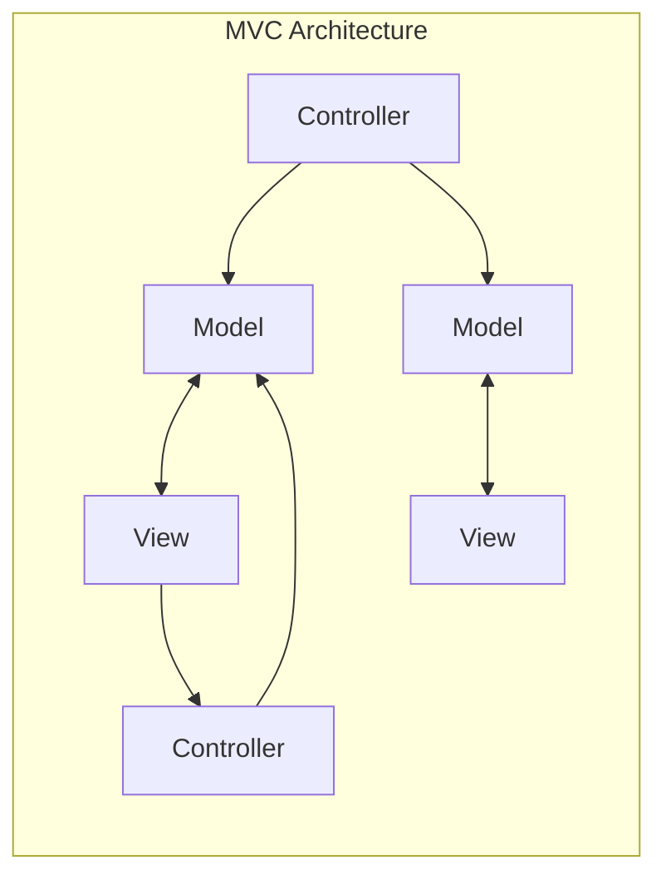
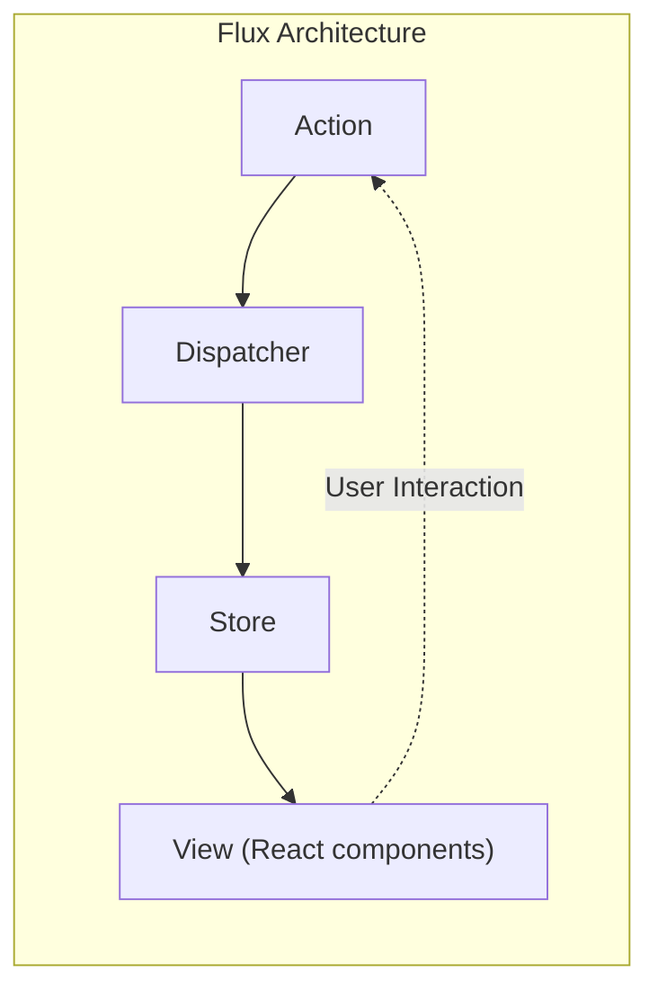
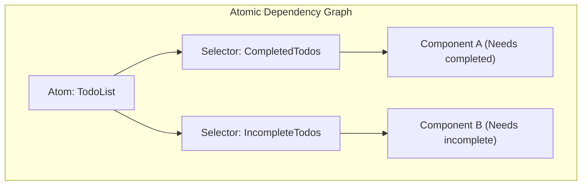

# Einleitung

In der modernen Web-Frontend-Entwicklung ist das **State Management** (Zustandsverwaltung) ein äußerst wichtiges Thema, an dem man nicht vorbeikommt. Besonders im React-Ökosystem wurden im Laufe der Zeit zahlreiche State-Management-Bibliotheken und Architekturen entwickelt und weiterentwickelt.

In diesem Artikel blicken wir auf die historische Entwicklung des State Managements in der Frontend-Entwicklung zurück und analysieren tiefgehend, welche Probleme die jeweiligen Architekturen lösen sollten und welche neuen Herausforderungen sie mit sich brachten. Wir erläutern im Detail den Verlauf dieser Evolution – angefangen bei den Grenzen des traditionellen MVC-Modells über die Entstehung der Flux-Architektur, den Paradigmenwechsel durch Redux, die Vor- und Nachteile der React Context API, Atomic State am Beispiel von Recoil oder Jotai, den Proxy-basierten Ansatz von MobX und Valtio, bis hin zu leichtgewichtigen Bibliotheken wie Zustand, die von heutigen Entwicklern weithin unterstützt werden.

---

## 1. Die Anfänge des State Managements: MVC und seine Grenzen

Bevor moderne UI-Bibliotheken wie React oder Vue aufkamen, war in der Welt des Web-Frontends die direkte DOM-Manipulation mittels jQuery vorherrschend. Mit zunehmender Komplexität der Anwendungen wurde jedoch die manuelle Synchronisierung von Zustand (Daten) und UI (DOM) zu einer Brutstätte für Fehler.

Um dieses Problem zu lösen, wurden Architekturmuster wie **MVC** (Model-View-Controller) oder **MVVM** (Model-View-ViewModel), die im Backend erfolgreich waren, auch ins Frontend übertragen (bekannte Beispiele: Backbone.js und AngularJS).

### Die Herausforderungen von MVC

Das MVC-Muster teilt die Zuständigkeiten auf: Das Model verwaltet die Daten, die View rendert die UI und der Controller verarbeitet Benutzereingaben, um Model und View zu aktualisieren. Für kleine bis mittelgroße Anwendungen funktionierte das gut, aber bei riesigen Anwendungen wie Facebook (heute Meta) traten ernsthafte Probleme auf.

Dieses Problem bestand in der **Unvorhersehbarkeit des Zustands aufgrund von bidirektionalem Data Binding**. Eine Änderung im Model aktualisierte die View, eine Aktion in der View aktualisierte ein anderes Model, was wiederum eine andere View aktualisierte... Wenn solche kaskadierenden Aktualisierungen (Cascade Updates) auftraten, wurde der Datenfluss so komplex verschränkt, dass das Nachverfolgen von Bugs extrem schwierig wurde.



Da die Daten in mehrere Richtungen flossen, konnte man nicht mehr nachvollziehen, "welche Daten sich jetzt warum geändert haben".

---

## 2. Die Entstehung der Flux-Architektur und der unidirektionale Datenfluss

Facebooks Antwort auf das Problem der MVC-Komplexität war die **Flux**-Architektur. Die größte Erfindung von Flux war die konsequente Durchsetzung eines **unidirektionalen Datenflusses** (Unidirectional Data Flow).

Bei Flux fließen die Anwendungsdaten immer in eine Richtung.



- **Action**: Ein Objekt, das eine Benutzeraktion oder ein Systemereignis darstellt.
- **Dispatcher**: Der zentrale Hub, der Actions empfängt und an alle registrierten Stores verteilt.
- **Store**: Behält den Anwendungszustand und die Logik. Empfängt Actions vom Dispatcher, aktualisiert sich selbst und benachrichtigt die View über Änderungen.
- **View**: Empfängt den Zustand vom Store und rendert die UI. Erkennt Benutzeraktionen und löst neue Actions aus.

Indem der Datenfluss auf eine einzige Richtung beschränkt wurde, ließ sich der Prozess der Zustandsänderung leichter nachverfolgen und die Vorhersehbarkeit der Anwendung dramatisch verbessern. Dies war ein wichtiger Paradigmenwechsel, der zur Grundlage für das spätere State Management wurde.

---

## 3. Redux: Die Ära der Single Source of Truth (Einzige Wahrheitsquelle)

Obwohl das Konzept von Flux großartig war, blieben Komplexitäten in der Implementierung bestehen, wie z. B. die Verwaltung von Abhängigkeiten durch die Existenz mehrerer Stores. Dan Abramov und andere entwickelten dies weiter und verfeinerten es zu seiner ultimativen Form: **Redux**.

### Die 3 Prinzipien von Redux

Redux basiert auf den folgenden 3 Grundprinzipien:

1. **Single source of truth** (Eine einzige, verlässliche Informationsquelle): Der gesamte Zustand der Anwendung wird in einem einzigen Objektbaum (Store) gespeichert.
2. **State is read-only** (Zustand ist schreibgeschützt): Die einzige Möglichkeit, den Zustand zu ändern, besteht darin, eine Action zu dispatchen (auszulösen), die beschreibt, was passiert ist.
3. **Changes are made with pure functions** (Änderungen werden mit reinen Funktionen vorgenommen): Um anzugeben, wie der Zustandsbaum durch eine Action transformiert wird, schreibt man reine Funktionen, sogenannte Reducer.

Redux ermöglichte Time-Travel-Debugging (Zurückspulen und Abspielen des Zustands), was die Developer Experience (DX) enorm verbesserte.

### Beispiel für eine ToDo-App mit Redux Toolkit

Früher wurde Redux oft für "zu viel Boilerplate (Standardcode)" kritisiert, aber heute ist das **Redux Toolkit** (RTK) der Standard, mit dem Code sehr prägnant geschrieben werden kann.

```typescript
// Redux Toolkit (Beispiel zum Vergleich mit Zustand oder Context)
import { configureStore, createSlice, PayloadAction } from '@reduxjs/toolkit';
import { useSelector, useDispatch } from 'react-redux';

// 1. Definition des State-Typs
interface Todo {
  id: string;
  text: string;
  completed: boolean;
}

// 2. Definition des Slices (Reducer und Action)
const todoSlice = createSlice({
  name: 'todos',
  initialState: [] as Todo[],
  reducers: {
    addTodo: (state, action: PayloadAction<string>) => {
      // Da Immer innerhalb von RTK arbeitet, ist mutierender Code möglich
      state.push({ id: Date.now().toString(), text: action.payload, completed: false });
    },
    toggleTodo: (state, action: PayloadAction<string>) => {
      const todo = state.find(t => t.id === action.payload);
      if (todo) {
        todo.completed = !todo.completed;
      }
    }
  }
});

export const { addTodo, toggleTodo } = todoSlice.actions;
export const store = configureStore({ reducer: { todos: todoSlice.reducer } });

// 3. Verwendung in der Komponente
function TodoApp() {
  const todos = useSelector((state: { todos: Todo[] }) => state.todos);
  const dispatch = useDispatch();

  return (
    <div>
      <button onClick={() => dispatch(addTodo('Neue Aufgabe'))}>Hinzufügen</button>
      <ul>
        {todos.map(todo => (
          <li key={todo.id} onClick={() => dispatch(toggleTodo(todo.id))}>
            {todo.completed ? '<s>' : ''}{todo.text}{todo.completed ? '</s>' : ''}
          </li>
        ))}
      </ul>
    </div>
  );
}
```

Obwohl Redux in riesigen Projekten nach wie vor eine starke Wahl ist, gab es auch Herausforderungen: Es ist oft zu groß für kleinere Apps, und da es sich um einen globalen, einzelnen Baum handelt, ist das Tuning von Selektoren (`useSelector`) zur Verhinderung unnötiger Rerenderings schwierig.

---

## 4. React Context API: Eingebauter Freigabemechanismus und seine Fallstricke

Die in React 16.3 erneuerte **Context API** wurde als Standardfunktion von React eingeführt, um das Problem des Props Drilling (das Durchreichen von Properties wie bei einer Eimerkette in tiefe Komponentenhierarchien) zu lösen. Mit der Einführung von Hooks (`useContext` und `useReducer`) entbrannte eine Diskussion darüber, ob "Redux nicht mehr notwendig sei".

### Beispiel für eine ToDo-App mit Context + Reducer

```typescript
import React, { createContext, useContext, useReducer, ReactNode } from 'react';

// 1. Typdefinitionen
interface Todo { id: string; text: string; completed: boolean; }
type Action = { type: 'ADD'; payload: string } | { type: 'TOGGLE'; payload: string };

// 2. Definition des Reducers
function todoReducer(state: Todo[], action: Action): Todo[] {
  switch (action.type) {
    case 'ADD':
      return [...state, { id: Date.now().toString(), text: action.payload, completed: false }];
    case 'TOGGLE':
      return state.map(t => t.id === action.payload ? { ...t, completed: !t.completed } : t);
    default:
      return state;
  }
}

// 3. Erstellung des Context
const TodoContext = createContext<{ state: Todo[]; dispatch: React.Dispatch<Action> } | undefined>(undefined);

// 4. Bereitstellung des Providers
export function TodoProvider({ children }: { children: ReactNode }) {
  const [state, dispatch] = useReducer(todoReducer, []);
  return (
    <TodoContext.Provider value={{ state, dispatch }}>
      {children}
    </TodoContext.Provider>
  );
}

// 5. Verwendung in der Komponente
function TodoApp() {
  const context = useContext(TodoContext);
  if (!context) throw new Error('Muss innerhalb eines Providers verwendet werden');
  const { state: todos, dispatch } = context;

  return (
    <div>
      <button onClick={() => dispatch({ type: 'ADD', payload: 'Aufgabe' })}>Hinzufügen</button>
      {/* Rendering-Logik */}
    </div>
  );
}
```

### Die Probleme der Context API (Unnötige Rerenderings)

Context hat zweifellos das Props Drilling beseitigt, aber es ist keine **State-Management-Bibliothek**. Context ist lediglich ein Mechanismus für "Dependency Injection (DI)".

Das größte Problem von Context besteht darin, dass **"wenn der Wert des Context aktualisiert wird, alle Komponenten, die diesen Context abonnieren (die `useContext` verwenden), zwangsweise neu gerendert werden"**. Wenn ein großes Objekt in einem einzigen Context verwaltet wird, führt dies dazu, dass selbst Komponenten unnötig gerendert werden, die nur einen kleinen Teil der Eigenschaften benötigen, was die Performance verschlechtert. Versucht man dies zu verhindern, indem man den Context fein aufteilt, gerät man in die sogenannte Provider-Hölle (Provider Hell).

---

## 5. Atomic State Management: Die Lösung mit Recoil und Jotai

Um sowohl das Rerendering-Problem von Context als auch das Boilerplate-Problem von Redux gleichzeitig zu lösen, wurde ein State Management basierend auf der **Atomic-Architektur** vorgeschlagen. Das experimentell von Facebook (heute Meta) veröffentlichte **Recoil** und das noch leichtgewichtigere, raffiniertere **Jotai** sind typische Beispiele dafür.

### Was ist die Atomic-Architektur?

Der Zustand der Anwendung wird nicht als ein einziger riesiger Baum behandelt, sondern als unabhängige, kleine Zustandspartikel (**Atome**). Da jede Komponente nur die Atome abonniert (Subscribe), die sie benötigt, wird bei einer Aktualisierung des Zustands gezielt nur die Komponente neu gerendert, die davon abhängig ist.



### Beispiel für eine ToDo-App mit Recoil (oder Jotai)

Hier zeigen wir eine sehr intuitive Schreibweise, die Jotai ähnelt oder Recoil verwendet.

```typescript
// Beispiel für Recoil
import { atom, useRecoilState, RecoilRoot } from 'recoil';

// 1. Definition eines Atoms (die kleinste Zustandseinheit)
const todosState = atom<Todo[]>({
  key: 'todosState',
  default: [],
});

// 2. Verwendung in der Komponente (Fast dieselbe Schnittstelle wie Reacts useState)
function TodoApp() {
  const [todos, setTodos] = useRecoilState(todosState);

  const addTodo = () => {
    setTodos([...todos, { id: Date.now().toString(), text: 'Aufgabe', completed: false }]);
  };

  const toggleTodo = (id: string) => {
    setTodos(todos.map(t => t.id === id ? { ...t, completed: !t.completed } : t));
  };

  return (
    <div>
      <button onClick={addTodo}>Hinzufügen</button>
      {/* Rendering-Logik */}
    </div>
  );
}

// Zwingend erforderlich: Die Wurzel der App mit RecoilRoot umschließen
function App() {
  return <RecoilRoot><TodoApp /></RecoilRoot>;
}
```

Boilerplate ist fast vollständig verschwunden, und der globale Zustand kann mit einem ähnlichen Gefühl wie das standardmäßige `useState` in React gehandhabt werden. Zudem ist die Handhabung asynchroner Daten und die Berechnung abgeleiteter Zustände (Derived State) extrem leistungsstark.

---

## 6. Proxy-basiertes State Management: MobX und Valtio

Ein weiterer sehr leistungsfähiger Ansatz ist das **mutierbare (veränderbare) State Management**, das das `Proxy`-Objekt in JavaScript nutzt. React verlangt im Prinzip "immutable (unveränderbare) Zustandsaktualisierungen", aber durch die Verwendung von Proxys wird es möglich, "Objekte direkt zu überschreiben, während Änderungen automatisch erkannt und Komponenten aktualisiert werden".

Historisch gesehen ist **MobX** bekannt, aber in letzter Zeit hat **Valtio** (vom selben Autor wie Zustand), das die Kompatibilität mit React Hooks verbessert hat, viel Aufmerksamkeit erregt. Da proxybasierte Ansätze ein intuitives Schreiben in JavaScript ermöglichen, entfalten sie ihre Stärke besonders bei der Verwaltung von Daten mit tiefen Verschachtelungen.

---

## 7. Der heutige Mainstream: Leichtgewichtiges und schnelles Zustand

Inmitten einer Vielzahl verschiedener Architekturen wird heute **Zustand** (das deutsche Wort) für viele Entwickler zur "ersten Wahl".

Zustand verwendet, genau wie Redux, einen Flux-basierten "Single Store"-Ansatz, verzichtet jedoch konsequent auf die komplexen Konzepte von Redux (Reducer, Action Types, Dispatch, Umschließen mit Providern). Es ist extrem leichtgewichtig, erfordert wenig Code und bietet eine einfache, Hook-basierte API.

### Beispiel für eine ToDo-App mit Zustand

```typescript
import { create } from 'zustand';

// 1. Typdefinitionen für State und Action
interface TodoState {
  todos: Todo[];
  addTodo: (text: string) => void;
  toggleTodo: (id: string) => void;
}

// 2. Erstellung des Stores
const useTodoStore = create<TodoState>((set) => ({
  todos: [],
  addTodo: (text) => 
    set((state) => ({ 
      todos: [...state.todos, { id: Date.now().toString(), text, completed: false }] 
    })),
  toggleTodo: (id) => 
    set((state) => ({
      todos: state.todos.map(t => t.id === id ? { ...t, completed: !t.completed } : t)
    })),
}));

// 3. Verwendung in der Komponente
function TodoApp() {
  // Nur den benötigten Zustand und die Aktionen auswählen und abrufen (verhindert unnötiges Rerendering)
  const todos = useTodoStore(state => state.todos);
  const addTodo = useTodoStore(state => state.addTodo);
  const toggleTodo = useTodoStore(state => state.toggleTodo);

  return (
    <div>
      <button onClick={() => addTodo('Zustand Aufgabe')}>Hinzufügen</button>
      <ul>
        {todos.map(todo => (
          <li key={todo.id} onClick={() => toggleTodo(todo.id)}>
            {todo.text}
          </li>
        ))}
      </ul>
    </div>
  );
}
```

### Warum Zustand so beliebt ist

- **Kein Provider nötig**: Die Anwendung muss nicht in einen `<Provider>` gewrappt werden, und Lese-/Schreibzugriffe auf den Zustand sind auch außerhalb des React-Baums (in normalen Funktionen oder asynchronen Prozessen) möglich.
- **Einfachheit**: Es gibt extrem wenig Standardcode, und ein Store kann kompakt in einer einzigen Datei definiert werden.
- **Performance**: Durch die Verwendung von Selektor-Funktionen (`state => state.todos`) wird, ähnlich wie bei Redux, die Komponente nur dann neu gerendert, wenn sich der abonnierte Wert ändert. Die Probleme der Context API werden so souverän überwunden.

---

## Fazit: Die Zukunft des State Managements

Das Frontend-State-Management begann mit dem Scheitern von MVC, erlangte durch Flux/Redux mehr Stabilität, suchte mit Context nach einer API-Standardisierung und hat sich heute zu einer vielfältigen und raffinierten Auswahl an Tools entwickelt, wie etwa Atomic (Jotai/Recoil), leichtgewichtige Stores (Zustand) und Proxy-basierte Ansätze (Valtio).

Als Richtlinie für die Auswahl in aktuellen Projekten gilt:

- **Große und komplexe Enterprise-Bereiche oder wenn eine strikte Nachverfolgung von Zustandsübergängen nötig ist**: Redux Toolkit
- **Flexibles und intuitives State-Sharing, unabhängig von der Form des Komponentenbaums**: Jotai oder Recoil
- **Einfacher globaler Store mit geringer Lernkurve und hoher Performance**: Zustand
- **Intuitive mutierbare Handhabung komplexer, tief verschachtelter Objekte**: Valtio

Die Evolution der Frontend-Architektur steht niemals still, aber wenn Sie verstehen, **"welche Schmerzen jede Bibliothek lindern sollte"**, werden Sie in der Lage sein, die beste Technologie für Ihr eigenes Projekt auszuwählen.
