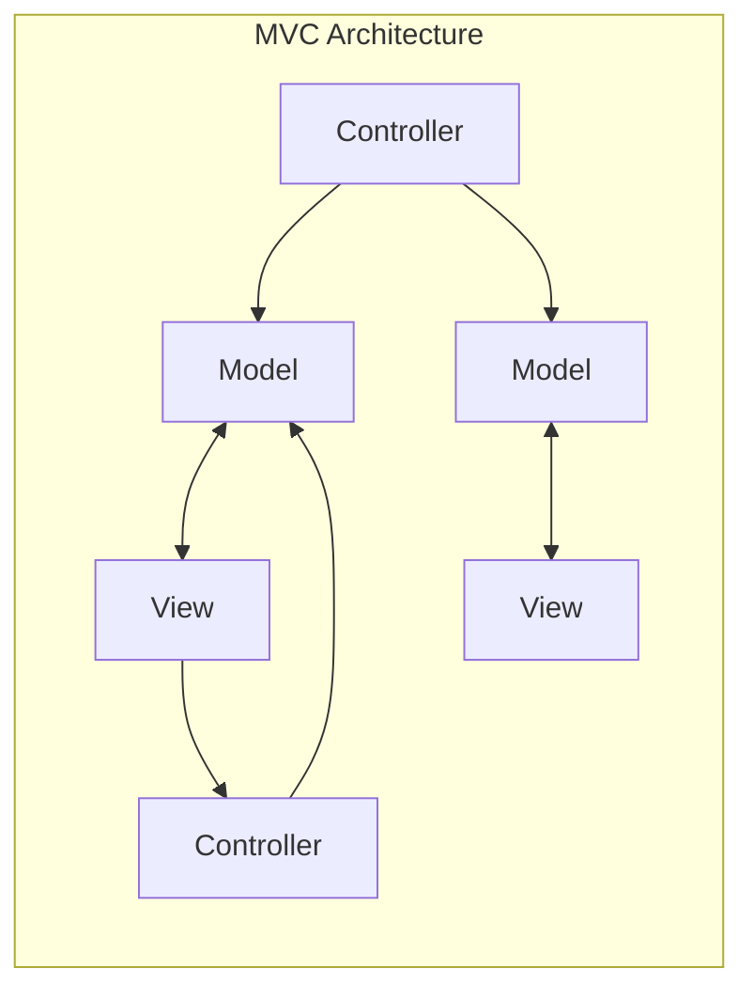
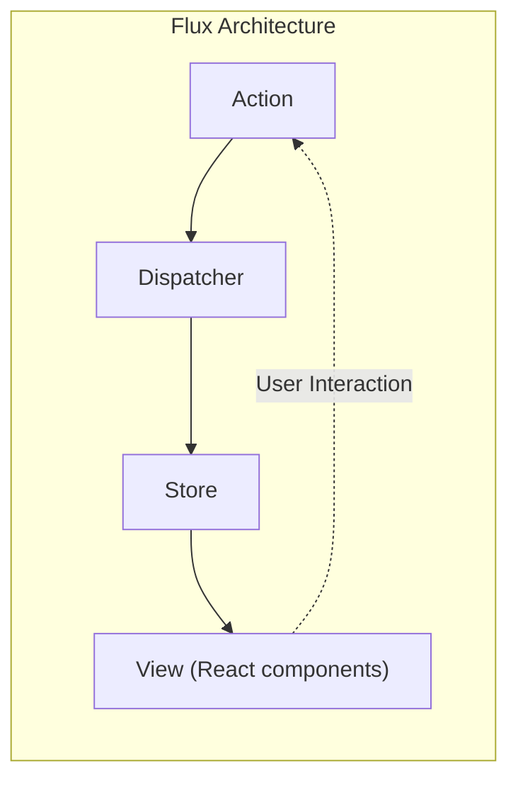
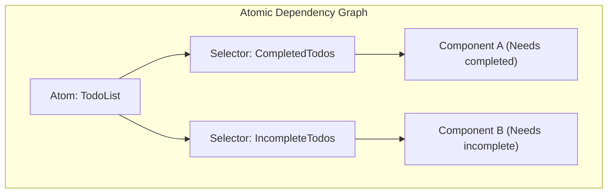

# Introduction

In modern web frontend development, **state management** is a crucial theme that cannot be avoided. Especially in the ecosystem centered around React, numerous state management libraries and architectures have been born and evolved over time.

In this article, we look back on the historical evolution of state management in frontend development, and deeply explore what problems each architecture was created to solve, and what new problems they have spawned. From the limitations of the traditional MVC model, to the birth of the Flux architecture, the paradigm shift brought by Redux, the merits and demerits of React Context API, Atomic State represented by Recoil and Jotai, Proxy-based approaches like MobX and Valtio, and finally lightweight libraries like Zustand that are widely supported by modern developers, we will explain the trajectory of its evolution in detail.

---

## 1. The Dawn of State Management: MVC and its Limitations

Before the advent of modern UI libraries like React and Vue, direct DOM manipulation using jQuery was the mainstream in the world of web frontends. However, as applications became more complex, synchronizing state (data) and UI (DOM) manually became a breeding ground for bugs.

To solve this problem, architecture patterns that were successful in the backend, such as **MVC** (Model-View-Controller) and **MVVM** (Model-View-ViewModel), were brought to the frontend (typical examples: Backbone.js and AngularJS).

### Challenges Faced by MVC

The MVC pattern divides roles into the Model for managing data, the View for rendering the UI, and the Controller for processing user input and updating the Model or View. It worked well for small to medium-scale applications, but serious problems arose in massive applications like Facebook (now Meta).

That problem was the **unpredictability of state due to two-way data binding**. Changes in the Model updated the View, operations in the View updated another Model, which in turn updated another View... When this chain of updates (cascade updates) occurred, the data flow became complex and tangled, making it extremely difficult to track bugs.



Because the flow of data headed in multiple directions in this way, it became impossible to grasp "which data has just changed and why."

---

## 2. The Birth of Flux Architecture and Unidirectional Data Flow

Facebook's answer to the MVC complexity problem was the **Flux** architecture. The greatest invention of Flux was the enforcement of **Unidirectional Data Flow**.

In Flux, application data always flows in one direction.



- **Action**: An object representing user operations or events from the system.
- **Dispatcher**: A central hub that receives Actions and distributes them to all registered Stores.
- **Store**: Holds the state and logic of the application. It receives Actions from the Dispatcher, updates itself, and notifies the View of changes.
- **View**: Receives the state from the Store and renders the UI. Detects user operations and issues new Actions.

By narrowing the flow of data to a single path, the state change process became easier to track, and the predictability of the application improved dramatically. This was an important paradigm shift that formed the foundation for subsequent state management.

---

## 3. Redux: The Era of Single Source of Truth

Although the concept of Flux was brilliant, there was still implementation complexity, such as managing dependencies due to the existence of multiple Stores. **Redux**, developed by Dan Abramov and others, refined this and elevated it to its ultimate form.

### The 3 Principles of Redux

Redux is based on the following three basic principles:

1. **Single source of truth**: The state of the whole application is stored in an object tree within a single Store.
2. **State is read-only**: The only way to change the state is to emit an Action, an object describing what happened.
3. **Changes are made with pure functions**: To specify how the state tree is transformed by Actions, you write pure functions called Reducers.

Redux made time-travel debugging (rewinding and replaying state) possible, which dramatically improved the developer experience (DX).

### ToDo App Implementation Example Using Redux Toolkit

Redux was once criticized for having "a lot of boilerplate code," but now **Redux Toolkit** (RTK) is the standard, allowing you to write very concisely.

```typescript
// Redux Toolkit (Example for comparison with Zustand and Context)
import { configureStore, createSlice, PayloadAction } from '@reduxjs/toolkit';
import { useSelector, useDispatch } from 'react-redux';

// 1. State type definition
interface Todo {
  id: string;
  text: string;
  completed: boolean;
}

// 2. Definition of Slice (Reducer and Action)
const todoSlice = createSlice({
  name: 'todos',
  initialState: [] as Todo[],
  reducers: {
    addTodo: (state, action: PayloadAction<string>) => {
      // Immer works inside RTK, so mutable writing is possible
      state.push({ id: Date.now().toString(), text: action.payload, completed: false });
    },
    toggleTodo: (state, action: PayloadAction<string>) => {
      const todo = state.find(t => t.id === action.payload);
      if (todo) {
        todo.completed = !todo.completed;
      }
    }
  }
});

export const { addTodo, toggleTodo } = todoSlice.actions;
export const store = configureStore({ reducer: { todos: todoSlice.reducer } });

// 3. Usage in components
function TodoApp() {
  const todos = useSelector((state: { todos: Todo[] }) => state.todos);
  const dispatch = useDispatch();

  return (
    <div>
      <button onClick={() => dispatch(addTodo('New Task'))}>Add</button>
      <ul>
        {todos.map(todo => (
          <li key={todo.id} onClick={() => dispatch(toggleTodo(todo.id))}>
            {todo.completed ? '<s>' : ''}{todo.text}{todo.completed ? '</s>' : ''}
          </li>
        ))}
      </ul>
    </div>
  );
}
```

Redux remains a powerful choice for massive projects, but it had issues like being over-spec for small apps, and the difficulty of tuning selectors (`useSelector`) to prevent unnecessary rendering because it is a global single tree.

---

## 4. React Context API: Built-in Sharing Mechanism and Its Pitfalls

The **Context API**, which was revamped in React 16.3, appeared as a standard React feature to solve Props Drilling (passing properties deep into the component hierarchy like a bucket brigade). With the advent of Hooks (`useContext` and `useReducer`), it sparked the debate of whether "Redux is no longer needed."

### ToDo App Implementation Example Using Context + Reducer

```typescript
import React, { createContext, useContext, useReducer, ReactNode } from 'react';

// 1. Type definition
interface Todo { id: string; text: string; completed: boolean; }
type Action = { type: 'ADD'; payload: string } | { type: 'TOGGLE'; payload: string };

// 2. Reducer definition
function todoReducer(state: Todo[], action: Action): Todo[] {
  switch (action.type) {
    case 'ADD':
      return [...state, { id: Date.now().toString(), text: action.payload, completed: false }];
    case 'TOGGLE':
      return state.map(t => t.id === action.payload ? { ...t, completed: !t.completed } : t);
    default:
      return state;
  }
}

// 3. Context creation
const TodoContext = createContext<{ state: Todo[]; dispatch: React.Dispatch<Action> } | undefined>(undefined);

// 4. Provider provision
export function TodoProvider({ children }: { children: ReactNode }) {
  const [state, dispatch] = useReducer(todoReducer, []);
  return (
    <TodoContext.Provider value={{ state, dispatch }}>
      {children}
    </TodoContext.Provider>
  );
}

// 5. Usage in components
function TodoApp() {
  const context = useContext(TodoContext);
  if (!context) throw new Error('Must be used within Provider');
  const { state: todos, dispatch } = context;

  return (
    <div>
      <button onClick={() => dispatch({ type: 'ADD', payload: 'Task' })}>Add</button>
      {/* Rendering process */}
    </div>
  );
}
```

### Challenges of Context API (Unnecessary Re-rendering)

While Context certainly eliminated Props Drilling, it is **not a state management library**. Context is ultimately just a dependency injection (DI) mechanism.

The biggest problem with Context is that **"when the value of a Context is updated, all components subscribing to that Context (using `useContext`) are forced to re-render."** Managing a massive object in a single Context leads to unnecessary rendering of components that only need a part of the properties, causing performance degradation. Splitting Contexts to prevent this can lead to Provider Hell.

---

## 5. Atomic State Management: Solutions with Recoil and Jotai

To solve the re-rendering issue of Context and the boilerplate issue of Redux simultaneously, state management adopting the **Atomic Architecture** was proposed. **Recoil**, which was experimentally announced by Facebook (now Meta), and the more lightweight and refined **Jotai**, are prime examples.

### What is the Atomic Architecture?

It treats the state of an application not as a single massive tree, but as independent, small granules of state (**Atoms**). Because each component subscribes only to the necessary Atoms, when the state is updated, only the components that depend on it are precisely re-rendered.



### ToDo App Implementation Example Using Recoil (or Jotai)

Here is a very intuitive approach using Recoil, similar to Jotai.

```typescript
// Recoil example
import { atom, useRecoilState, RecoilRoot } from 'recoil';

// 1. Define Atom (minimum unit of state)
const todosState = atom<Todo[]>({
  key: 'todosState',
  default: [],
});

// 2. Usage in components (almost the same interface as React's useState)
function TodoApp() {
  const [todos, setTodos] = useRecoilState(todosState);

  const addTodo = () => {
    setTodos([...todos, { id: Date.now().toString(), text: 'Task', completed: false }]);
  };

  const toggleTodo = (id: string) => {
    setTodos(todos.map(t => t.id === id ? { ...t, completed: !t.completed } : t));
  };

  return (
    <div>
      <button onClick={addTodo}>Add</button>
      {/* Rendering process */}
    </div>
  );
}

// Required: Wrap the app root with RecoilRoot
function App() {
  return <RecoilRoot><TodoApp /></RecoilRoot>;
}
```

Boilerplate code has nearly disappeared, and global states can now be handled with a feel similar to React's standard `useState`. Furthermore, handling asynchronous data and calculating derived state are extremely powerful.

---

## 6. Proxy-based State Management: MobX and Valtio

Another powerful approach is **mutable state management** utilizing JavaScript's `Proxy` object. React generally requires "immutable state updates", but using Proxy makes it possible to "automatically detect changes and update components just by directly mutating objects".

While **MobX** has been known for a long time, in recent years, **Valtio** (by the same author as Zustand), which is highly compatible with React Hooks, has been gaining attention. Because the Proxy-based approach allows for intuitive JavaScript syntax, it excels at managing data with complex nesting.

---

## 7. The Modern Mainstream: Lightweight and Fast Zustand

Amidst the proliferation of various architectures, **Zustand** (German for "state") is currently becoming the "first choice" for many developers.

Like Redux, Zustand adopts a Flux-based "Single Store" approach, but thoroughly eliminates Redux's complex concepts (Reducers, Action types, Dispatch, and enclosing with Providers). It is extremely lightweight, requires little code, and provides a simple hook-based API.

### ToDo App Implementation Example Using Zustand

```typescript
import { create } from 'zustand';

// 1. Type definitions for State and Action
interface TodoState {
  todos: Todo[];
  addTodo: (text: string) => void;
  toggleTodo: (id: string) => void;
}

// 2. Store creation
const useTodoStore = create<TodoState>((set) => ({
  todos: [],
  addTodo: (text) => 
    set((state) => ({ 
      todos: [...state.todos, { id: Date.now().toString(), text, completed: false }] 
    })),
  toggleTodo: (id) => 
    set((state) => ({
      todos: state.todos.map(t => t.id === id ? { ...t, completed: !t.completed } : t)
    })),
}));

// 3. Usage in components
function TodoApp() {
  // Select and get only the necessary states and actions (prevents unnecessary rendering)
  const todos = useTodoStore(state => state.todos);
  const addTodo = useTodoStore(state => state.addTodo);
  const toggleTodo = useTodoStore(state => state.toggleTodo);

  return (
    <div>
      <button onClick={() => addTodo('Zustand Task')}>Add</button>
      <ul>
        {todos.map(todo => (
          <li key={todo.id} onClick={() => toggleTodo(todo.id)}>
            {todo.text}
          </li>
        ))}
      </ul>
    </div>
  );
}
```

### Why Zustand is Supported

- **No Provider Required**: There is no need to wrap the application in a `<Provider>`, and states can be read or written outside the React tree (in regular functions or asynchronous processes).
- **Conciseness**: Boilerplate code is extremely minimal, allowing the Store to be defined compactly in a single file.
- **Performance**: By using selector functions (`state => state.todos`), it only renders components when the subscribed values change, similarly to Redux. It brilliantly overcomes the challenges of the Context API.

---

## Conclusion: The Future of State Management

Frontend state management began with the collapse of MVC, gained robustness with Flux/Redux, explored API standardization via Context, and has now evolved into a diverse and refined set of tools such as Atomic (Jotai/Recoil), lightweight Stores (Zustand), and Proxies (Valtio).

As a guideline for selection criteria in current projects, it looks like this:

- **Large and complex enterprise areas, or where strict tracking of state transitions is required**: Redux Toolkit
- **Flexible and intuitive state sharing independent of the component tree structure**: Jotai or Recoil
- **A global Store with high performance, low learning cost, and simplicity**: Zustand
- **Wanting to intuitively and mutably handle complex, deeply nested objects**: Valtio

The evolution of frontend architecture never stops, but by understanding **"what pains each library was created to solve,"** you will be able to make the optimal technological choices for your own projects.
