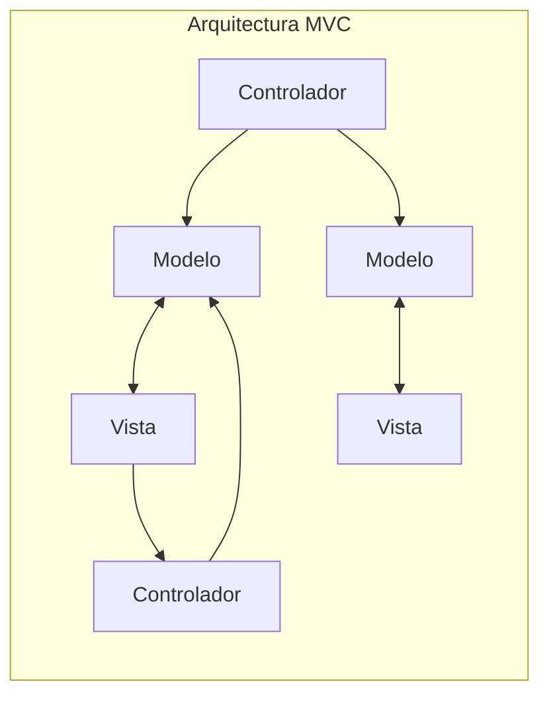
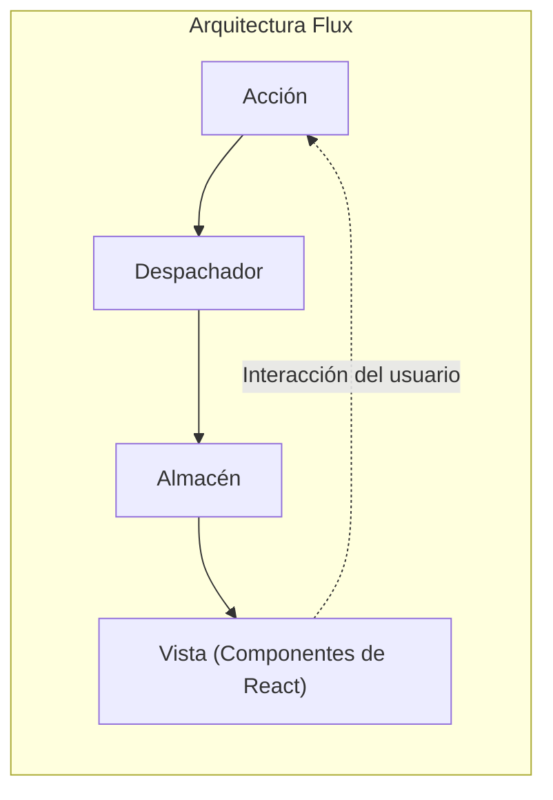
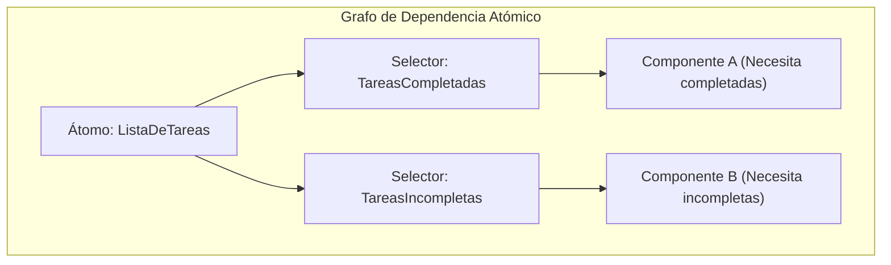

# Introducción

En el desarrollo moderno de frontend web, la **gestión de estado** (State Management) es un tema crucial que no se puede evitar. Especialmente en el ecosistema centrado en React, han nacido y evolucionado numerosas bibliotecas y arquitecturas de gestión de estado hasta ahora.

En este artículo, repasaremos la evolución histórica de la gestión de estado en el desarrollo frontend y profundizaremos en qué problemas intentaba resolver cada arquitectura y qué nuevos desafíos generaron. Comenzando con las limitaciones del modelo MVC tradicional, el nacimiento de la arquitectura Flux, el cambio de paradigma provocado por Redux, los pros y contras de React Context API, el estado atómico representado por Recoil y Jotai, enfoques basados en Proxy como MobX y Valtio, hasta las bibliotecas ligeras como Zustand, que hoy en día cuentan con un amplio apoyo de los desarrolladores. Explicaremos en detalle esta trayectoria de evolución.

---

## 1. El amanecer de la gestión de estado: MVC y sus limitaciones

Antes de la aparición de bibliotecas de interfaz de usuario modernas como React o Vue, en el mundo del frontend web predominaba la manipulación directa del DOM usando jQuery. Sin embargo, a medida que las aplicaciones se volvieron más complejas, la sincronización manual entre el estado (datos) y la interfaz de usuario (DOM) se convirtió en un nido de errores.

Para resolver este problema, patrones de arquitectura que habían tenido éxito en el backend como **MVC** (Model-View-Controller) o **MVVM** (Model-View-ViewModel) se introdujeron en el frontend (ejemplos representativos: Backbone.js y AngularJS).

### Problemas que enfrentaba MVC

El patrón MVC divide los roles en Model, que gestiona los datos; View, que renderiza la interfaz de usuario; y Controller, que procesa las entradas del usuario y actualiza el Model o View. Funcionaba bien para aplicaciones de tamaño pequeño a mediano, pero en aplicaciones enormes como Facebook (ahora Meta) surgieron problemas graves.

Ese problema era la **imprevisibilidad del estado debido al enlace de datos bidireccional**. Cuando el cambio de un Model actualizaba un View, y una operación en el View actualizaba otro Model, que a su vez actualizaba otro View... y se producía una serie de actualizaciones en cascada (cascade update), el flujo de datos se entrelazaba de manera compleja y rastrear errores se volvía extremadamente difícil.



De esta manera, al dirigirse el flujo de datos en múltiples direcciones, se volvió imposible comprender "qué datos cambiaron ahora y por qué".

---

## 2. El nacimiento de la arquitectura Flux y el flujo de datos unidireccional

La respuesta de Facebook al problema de la complejidad de MVC fue la arquitectura **Flux**. El mayor invento de Flux es la implementación rigurosa del **flujo de datos unidireccional** (Unidirectional Data Flow).

En Flux, los datos de la aplicación siempre fluyen en una dirección.



- **Acción (Action)** : Un objeto que representa una operación del usuario o un evento del sistema.
- **Despachador (Dispatcher)** : Un hub central que recibe una Acción y la distribuye a todos los Almacenes registrados.
- **Almacén (Store)** : Mantiene el estado y la lógica de la aplicación. Recibe una Acción del Despachador, se actualiza a sí mismo y notifica los cambios a la Vista.
- **Vista (View)** : Recibe el estado del Almacén y renderiza la interfaz de usuario. Detecta las interacciones del usuario y emite una nueva Acción.

Al restringir el flujo de datos a uno solo, el proceso de cambio de estado se volvió más fácil de rastrear, y la previsibilidad de la aplicación mejoró drásticamente. Este fue un cambio de paradigma fundamental que serviría como base para la gestión de estado posterior.

---

## 3. Redux: La era del Single Source of Truth (Árbol de responsabilidad única)

Aunque el concepto de Flux era excelente, quedaba complejidad en la implementación, como la gestión de las dependencias debido a la existencia de múltiples Almacenes. Lo que perfeccionó esto y lo elevó a su forma definitiva fue **Redux**, desarrollado por Dan Abramov y otros.

### Los 3 principios de Redux

Redux se basa en los siguientes 3 principios básicos:

1. **Single source of truth** (Única fuente de verdad) : El estado completo de la aplicación se almacena en un único árbol de objetos (Store).
2. **State is read-only** (El estado es de solo lectura) : La única forma de cambiar el estado es emitiendo (dispatch) una Acción que describa lo que ocurrió.
3. **Changes are made with pure functions** (Los cambios se realizan con funciones puras) : Para especificar cómo se transforma el árbol de estado debido a una Acción, se escriben Reducers que son funciones puras.

Con Redux, la depuración mediante viajes en el tiempo (retroceso y reproducción de estados) se hizo posible, y la experiencia del desarrollador (DX) mejoró exponencialmente.

### Ejemplo de implementación de una aplicación ToDo con Redux Toolkit

En el pasado, Redux fue criticado por tener "demasiado código repetitivo" (boilerplate), pero hoy en día **Redux Toolkit** (RTK) es el estándar y se puede escribir de manera muy concisa.

```typescript
// Redux Toolkit (Ejemplo para comparar con Zustand y Context)
import { configureStore, createSlice, PayloadAction } from '@reduxjs/toolkit';
import { useSelector, useDispatch } from 'react-redux';

// 1. Definición del tipo de State
interface Todo {
  id: string;
  text: string;
  completed: boolean;
}

// 2. Definición del Slice (Reducer y Action)
const todoSlice = createSlice({
  name: 'todos',
  initialState: [] as Todo[],
  reducers: {
    addTodo: (state, action: PayloadAction<string>) => {
      // Dentro de RTK funciona Immer, por lo que se permite la escritura mutable
      state.push({ id: Date.now().toString(), text: action.payload, completed: false });
    },
    toggleTodo: (state, action: PayloadAction<string>) => {
      const todo = state.find(t => t.id === action.payload);
      if (todo) {
        todo.completed = !todo.completed;
      }
    }
  }
});

export const { addTodo, toggleTodo } = todoSlice.actions;
export const store = configureStore({ reducer: { todos: todoSlice.reducer } });

// 3. Uso en componentes
function TodoApp() {
  const todos = useSelector((state: { todos: Todo[] }) => state.todos);
  const dispatch = useDispatch();

  return (
    <div>
      <button onClick={() => dispatch(addTodo('Nueva tarea'))}>Añadir</button>
      <ul>
        {todos.map(todo => (
          <li key={todo.id} onClick={() => dispatch(toggleTodo(todo.id))}>
            {todo.completed ? '<s>' : ''}{todo.text}{todo.completed ? '</s>' : ''}
          </li>
        ))}
      </ul>
    </div>
  );
}
```

Redux sigue siendo una opción poderosa en proyectos grandes, pero también tenía desafíos, como ser excesivo para aplicaciones pequeñas o la dificultad de optimizar selectores (`useSelector`) para evitar renderizados innecesarios debido a su naturaleza de árbol único global.

---

## 4. React Context API: El mecanismo de intercambio integrado y sus trampas

La **Context API**, renovada en React 16.3, surgió como una característica estándar de React para solucionar el "Props Drilling" (pasar propiedades como un juego de pasar el cubo hasta lo profundo de la jerarquía de componentes). La aparición de los Hooks (`useContext` y `useReducer`) provocó debates de "¿Acaso ya no necesitamos Redux?".

### Ejemplo de implementación de una aplicación ToDo usando Context + Reducer

```typescript
import React, { createContext, useContext, useReducer, ReactNode } from 'react';

// 1. Definición de tipos
interface Todo { id: string; text: string; completed: boolean; }
type Action = { type: 'ADD'; payload: string } | { type: 'TOGGLE'; payload: string };

// 2. Definición del Reducer
function todoReducer(state: Todo[], action: Action): Todo[] {
  switch (action.type) {
    case 'ADD':
      return [...state, { id: Date.now().toString(), text: action.payload, completed: false }];
    case 'TOGGLE':
      return state.map(t => t.id === action.payload ? { ...t, completed: !t.completed } : t);
    default:
      return state;
  }
}

// 3. Creación del Context
const TodoContext = createContext<{ state: Todo[]; dispatch: React.Dispatch<Action> } | undefined>(undefined);

// 4. Provisión del Provider
export function TodoProvider({ children }: { children: ReactNode }) {
  const [state, dispatch] = useReducer(todoReducer, []);
  return (
    <TodoContext.Provider value={{ state, dispatch }}>
      {children}
    </TodoContext.Provider>
  );
}

// 5. Uso en componentes
function TodoApp() {
  const context = useContext(TodoContext);
  if (!context) throw new Error('Debe usarse dentro de un Provider');
  const { state: todos, dispatch } = context;

  return (
    <div>
      <button onClick={() => dispatch({ type: 'ADD', payload: 'Tarea' })}>Añadir</button>
      {/* Procesamiento de renderizado */}
    </div>
  );
}
```

### Problemas de Context API (Renderizados innecesarios)

Context ciertamente resolvió el Props Drilling, pero **no es una biblioteca de gestión de estado**. Context es estrictamente un mecanismo de "Inyección de dependencias (DI)".

El mayor problema de Context es que **"cuando el valor del Context se actualiza, todos los componentes suscritos a ese Context (que usan `useContext`) se ven obligados a volver a renderizarse"**. Si se gestiona un objeto enorme con un solo Context, incluso los componentes que solo necesitan parte de las propiedades se renderizarán innecesariamente, lo que provoca un deterioro del rendimiento. Si se divide el Context en fragmentos para evitar esto, se cae en el infierno de los Proveedores (Provider Hell).

---

## 5. Gestión de estado atómico: Solución con Recoil y Jotai

Para resolver simultáneamente el problema de re-renderizado de Context y el problema del código repetitivo de Redux, se propuso la gestión de estado que adopta la **arquitectura Atómica (Atomic)**. Ejemplos representativos son **Recoil**, presentado de forma experimental por Facebook (ahora Meta), y **Jotai**, más ligero y refinado.

### ¿Qué es la arquitectura Atómica?

Maneja el estado de la aplicación no como un único árbol enorme, sino como pequeños granos de estado independientes (**Atom**). Como cada componente se suscribe solo a los Atom necesarios, cuando se actualiza un estado, solo se vuelven a renderizar de forma precisa los componentes que dependen de él.



### Ejemplo de implementación de aplicación ToDo usando Recoil (o Jotai)

Aquí presentaremos una forma muy intuitiva de escritura usando Recoil, o algo similar a Jotai.

```typescript
// Ejemplo de Recoil
import { atom, useRecoilState, RecoilRoot } from 'recoil';

// 1. Definir Atom (unidad mínima de estado)
const todosState = atom<Todo[]>({
  key: 'todosState',
  default: [],
});

// 2. Uso en componentes (Interfaz casi igual a useState de React)
function TodoApp() {
  const [todos, setTodos] = useRecoilState(todosState);

  const addTodo = () => {
    setTodos([...todos, { id: Date.now().toString(), text: 'Tarea', completed: false }]);
  };

  const toggleTodo = (id: string) => {
    setTodos(todos.map(t => t.id === id ? { ...t, completed: !t.completed } : t));
  };

  return (
    <div>
      <button onClick={addTodo}>Añadir</button>
      {/* Procesamiento de renderizado */}
    </div>
  );
}

// Obligatorio: Envolver la raíz de la aplicación con RecoilRoot
function App() {
  return <RecoilRoot><TodoApp /></RecoilRoot>;
}
```

El código repetitivo (boilerplate) casi ha desaparecido, y ahora se puede manejar el estado global con una sensación similar a `useState`, estándar de React. Además, el manejo de datos asincrónicos y el cálculo de estados derivados (Derived State) es muy poderoso.

---

## 6. Gestión de estado basada en Proxy: MobX y Valtio

Otro enfoque poderoso es la **gestión de estado mutable (modificable)** que aprovecha el objeto `Proxy` de JavaScript. En principio, React requiere "actualizaciones de estado inmutables (invariables)", pero al usar Proxy es posible "detectar cambios y actualizar automáticamente los componentes simplemente sobrescribiendo el objeto directamente".

Antiguamente, **MobX** era famoso, pero en los últimos años, **Valtio** (del mismo creador que Zustand), que tiene mayor compatibilidad con React Hooks, ha estado atrayendo la atención. El enfoque basado en Proxy permite una escritura de JavaScript intuitiva, por lo que demuestra su poder al gestionar datos con un anidamiento complejo.

---

## 7. La corriente principal moderna: Zustand, ligero y rápido

En medio de una proliferación de varias arquitecturas, la que actualmente se está convirtiendo en la "primera opción" para muchos desarrolladores es **Zustand** (que significa "estado" en alemán).

Al igual que Redux, Zustand adopta el enfoque de "Almacén único (Single Store)" basado en Flux, pero ha eliminado por completo los conceptos complejos de Redux (Reducer, Action types, Dispatch y envoltura con Provider). Es muy liviano, requiere poco código y proporciona una API simple basada en Hooks.

### Ejemplo de implementación de aplicación ToDo usando Zustand

```typescript
import { create } from 'zustand';

// 1. Definición de tipos para State y Action
interface TodoState {
  todos: Todo[];
  addTodo: (text: string) => void;
  toggleTodo: (id: string) => void;
}

// 2. Creación del Store
const useTodoStore = create<TodoState>((set) => ({
  todos: [],
  addTodo: (text) => 
    set((state) => ({ 
      todos: [...state.todos, { id: Date.now().toString(), text, completed: false }] 
    })),
  toggleTodo: (id) => 
    set((state) => ({
      todos: state.todos.map(t => t.id === id ? { ...t, completed: !t.completed } : t)
    })),
}));

// 3. Uso en componentes
function TodoApp() {
  // Seleccionar y obtener solo el estado y las acciones necesarias (evita renderizados innecesarios)
  const todos = useTodoStore(state => state.todos);
  const addTodo = useTodoStore(state => state.addTodo);
  const toggleTodo = useTodoStore(state => state.toggleTodo);

  return (
    <div>
      <button onClick={() => addTodo('Tarea Zustand')}>Añadir</button>
      <ul>
        {todos.map(todo => (
          <li key={todo.id} onClick={() => toggleTodo(todo.id)}>
            {todo.text}
          </li>
        ))}
      </ul>
    </div>
  );
}
```

### Por qué Zustand es apoyado

- **No requiere Provider** : No es necesario envolver la aplicación con `<Provider>`, y es posible leer y escribir estados fuera del árbol de React (en funciones normales o procesos asíncronos).
- **Simplicidad** : El código repetitivo es extremadamente bajo, y el Store se puede definir de manera compacta en un solo archivo.
- **Rendimiento** : Al usar funciones selectoras (`state => state.todos`), al igual que en Redux, el componente solo se renderiza cuando el valor suscrito cambia. Supera con éxito los desafíos de Context API.

---

## Conclusión: La gestión de estado a futuro

La gestión del estado del frontend comenzó con el colapso de MVC, pasó por la adquisición de robustez con Flux/Redux, buscó la estandarización de la API con Context y hoy ha evolucionado a un conjunto de herramientas diversas y refinadas como Atomic (Jotai/Recoil), Stores ligeros (Zustand) y Proxy (Valtio).

Como guía de criterios de selección en proyectos actuales sería de la siguiente manera:

- **Áreas empresariales enormes y complejas, o necesidad de un seguimiento estricto de transiciones de estado** : Redux Toolkit
- **Compartición de estado flexible e intuitiva, sin depender de la forma del árbol de componentes** : Jotai o Recoil
- **Store global simple, de baja curva de aprendizaje y alto rendimiento** : Zustand
- **Deseo de manejar de manera intuitiva y mutable objetos complejos con un anidamiento profundo** : Valtio

La evolución de la arquitectura del frontend no se detiene, pero al comprender **"qué dolor nació para resolver"** cada biblioteca, serás capaz de seleccionar la tecnología óptima para tu propio proyecto.
