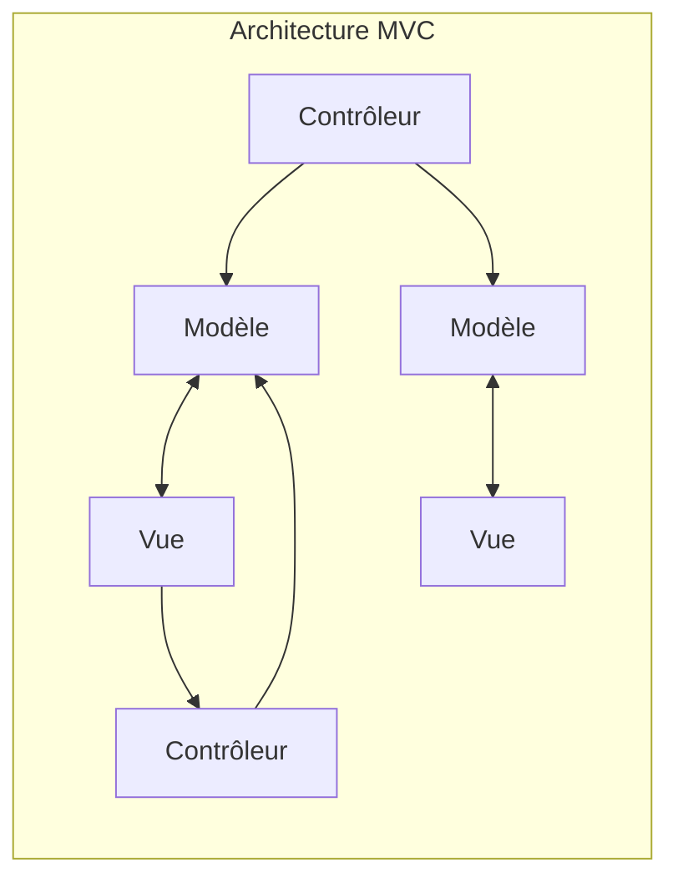
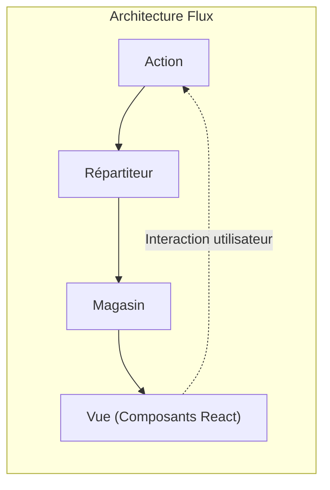
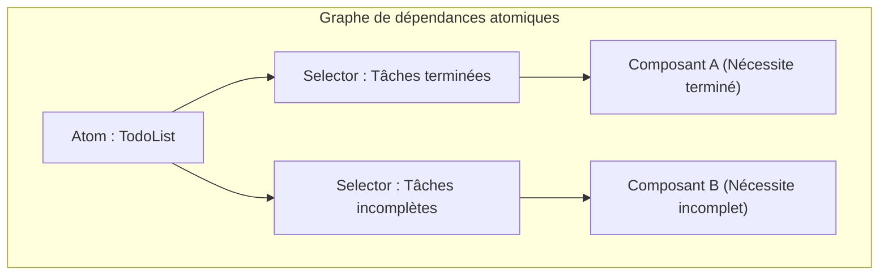

# Introduction

Dans le développement front-end Web moderne, la **gestion d'état** (State Management) est un thème extrêmement important et inévitable. Surtout dans l'écosystème autour de React, de nombreuses bibliothèques et architectures de gestion d'état ont vu le jour et ont évolué jusqu'à présent.

Cet article retrace l'évolution historique de la gestion d'état dans le développement front-end, et explore en profondeur les problèmes que chaque architecture a été créée pour résoudre, ainsi que les nouveaux problèmes qu'elle a engendrés. En commençant par les limites du modèle MVC traditionnel, la naissance de l'architecture Flux, le changement de paradigme apporté par Redux, les avantages et inconvénients de l'API React Context, l'état atomique (Atomic State) représenté par Recoil et Jotai, les approches basées sur Proxy comme MobX et Valtio, et enfin les bibliothèques légères comme Zustand, qui sont largement soutenues par les développeurs modernes, nous expliquerons en détail la trajectoire de cette évolution.

---

## 1. L'aube de la gestion d'état : MVC et ses limites

Avant l'apparition des bibliothèques d'interface utilisateur (UI) modernes telles que React et Vue, la manipulation directe du DOM à l'aide de jQuery était courante dans le monde du front-end Web. Cependant, à mesure que les applications devenaient plus complexes, la synchronisation manuelle de l'état (données) et de l'UI (DOM) devenait un terrain propice aux bugs.

Pour résoudre ce problème, des modèles d'architecture tels que **MVC** (Model-View-Controller) et **MVVM** (Model-View-ViewModel), qui avaient fait leurs preuves sur le back-end, ont été introduits dans le front-end (exemples typiques : Backbone.js et AngularJS).

### Les défis rencontrés par MVC

Le modèle MVC divise les rôles en Modèle (Model) qui gère les données, Vue (View) qui rend l'UI, et Contrôleur (Controller) qui traite les entrées de l'utilisateur et met à jour le Modèle ou la Vue. Cela fonctionnait bien pour les applications de petite à moyenne taille, mais pour les applications massives comme Facebook (maintenant Meta), de graves problèmes sont apparus.

C'est **l'imprévisibilité de l'état due à la liaison de données bidirectionnelle** (two-way data binding). Lorsqu'une modification du Modèle met à jour la Vue, qu'une action dans la Vue met à jour un autre Modèle, qui à son tour met à jour une autre Vue... des mises à jour en chaîne (cascade updates) se produisent. Le flux de données s'entremêle de manière complexe, rendant le suivi des bugs extrêmement difficile.



Ainsi, avec les données circulant dans de multiples directions, il est devenu impossible de savoir « quelle donnée a changé maintenant et pourquoi ».

---

## 2. Naissance de l'architecture Flux et flux de données unidirectionnel

La réponse de Facebook au problème de complexification du MVC a été l'architecture **Flux**. La plus grande invention de Flux est l'application stricte du **flux de données unidirectionnel** (Unidirectional Data Flow).

Dans Flux, les données de l'application circulent toujours dans une seule direction.



- **Action** : Un objet représentant une action de l'utilisateur ou un événement système.
- **Dispatcher** : Le concentrateur central qui reçoit l'Action et la distribue à tous les Stores enregistrés.
- **Store** : Conserve l'état et la logique de l'application. Reçoit une Action du Dispatcher, se met à jour, et notifie la Vue des changements.
- **View** : Reçoit l'état du Store et dessine l'UI. Détecte les actions de l'utilisateur et émet de nouvelles Actions.

En limitant le flux de données à une seule direction, le processus de modification de l'état est devenu plus facile à suivre, et la prévisibilité de l'application a considérablement augmenté. Ce fut un changement de paradigme majeur qui a servi de base à la gestion d'état par la suite.

---

## 3. Redux : L'ère de la Source Unique de Vérité (Single Source of Truth)

Bien que le concept de Flux ait été excellent, il subsistait une complexité d'implémentation, comme la gestion des dépendances due à la présence de multiples Stores. **Redux**, développé par Dan Abramov et d'autres, a affiné cela et l'a élevé à sa forme ultime.

### Les 3 principes de Redux

Redux est basé sur les 3 principes fondamentaux suivants.

1. **Single source of truth** (Une seule source de vérité) : L'état global de l'application est stocké dans un seul arbre d'objets (Store).
2. **State is read-only** (L'état est en lecture seule) : La seule façon de modifier l'état est d'émettre (dispatch) une Action, un objet décrivant ce qui s'est passé.
3. **Changes are made with pure functions** (Les modifications sont faites avec des fonctions pures) : Pour spécifier comment l'arbre d'état est transformé par une Action, on écrit des Reducers, qui sont des fonctions pures.

Avec Redux, le débogage par voyage dans le temps (time-travel debugging - retour en arrière ou rejeu de l'état) est devenu possible, améliorant considérablement l'expérience développeur (DX).

### Exemple d'implémentation d'une application ToDo avec Redux Toolkit

Autrefois critiqué pour avoir « beaucoup de code boilerplate (code répétitif) », Redux a maintenant pour standard **Redux Toolkit** (RTK), qui permet de l'écrire de manière très concise.

```typescript
// Redux Toolkit (Exemple pour comparer avec Zustand ou Context)
import { configureStore, createSlice, PayloadAction } from '@reduxjs/toolkit';
import { useSelector, useDispatch } from 'react-redux';

// 1. Définition du type d'état
interface Todo {
  id: string;
  text: string;
  completed: boolean;
}

// 2. Définition de Slice (Reducer et Action)
const todoSlice = createSlice({
  name: 'todos',
  initialState: [] as Todo[],
  reducers: {
    addTodo: (state, action: PayloadAction<string>) => {
      // Immer fonctionne dans RTK, permettant une écriture mutable
      state.push({ id: Date.now().toString(), text: action.payload, completed: false });
    },
    toggleTodo: (state, action: PayloadAction<string>) => {
      const todo = state.find(t => t.id === action.payload);
      if (todo) {
        todo.completed = !todo.completed;
      }
    }
  }
});

export const { addTodo, toggleTodo } = todoSlice.actions;
export const store = configureStore({ reducer: { todos: todoSlice.reducer } });

// 3. Utilisation dans un composant
function TodoApp() {
  const todos = useSelector((state: { todos: Todo[] }) => state.todos);
  const dispatch = useDispatch();

  return (
    <div>
      <button onClick={() => dispatch(addTodo('Nouvelle tâche'))}>Ajouter</button>
      <ul>
        {todos.map(todo => (
          <li key={todo.id} onClick={() => dispatch(toggleTodo(todo.id))}>
            {todo.completed ? '<s>' : ''}{todo.text}{todo.completed ? '</s>' : ''}
          </li>
        ))}
      </ul>
    </div>
  );
}
```

Redux reste un choix puissant pour les projets de grande envergure, mais il était surdimensionné pour les petites applications, et étant un arbre global unique, l'optimisation des sélecteurs (`useSelector`) pour éviter les rendus inutiles était difficile.

---

## 4. React Context API : Le mécanisme de partage intégré et ses pièges

L' **API Context**, remaniée dans React 16.3, est apparue comme une fonctionnalité standard de React pour résoudre le Props Drilling (passage de propriétés comme un relais jusqu'aux couches profondes des composants). Avec l'arrivée des Hooks (`useContext` et `useReducer`), cela a déclenché un débat : « N'a-t-on plus besoin de Redux ? ».

### Exemple d'implémentation d'une application ToDo avec Context + Reducer

```typescript
import React, { createContext, useContext, useReducer, ReactNode } from 'react';

// 1. Définition des types
interface Todo { id: string; text: string; completed: boolean; }
type Action = { type: 'ADD'; payload: string } | { type: 'TOGGLE'; payload: string };

// 2. Définition du Reducer
function todoReducer(state: Todo[], action: Action): Todo[] {
  switch (action.type) {
    case 'ADD':
      return [...state, { id: Date.now().toString(), text: action.payload, completed: false }];
    case 'TOGGLE':
      return state.map(t => t.id === action.payload ? { ...t, completed: !t.completed } : t);
    default:
      return state;
  }
}

// 3. Création du Context
const TodoContext = createContext<{ state: Todo[]; dispatch: React.Dispatch<Action> } | undefined>(undefined);

// 4. Fourniture du Provider
export function TodoProvider({ children }: { children: ReactNode }) {
  const [state, dispatch] = useReducer(todoReducer, []);
  return (
    <TodoContext.Provider value={{ state, dispatch }}>
      {children}
    </TodoContext.Provider>
  );
}

// 5. Utilisation dans un composant
function TodoApp() {
  const context = useContext(TodoContext);
  if (!context) throw new Error('Doit être utilisé dans un Provider');
  const { state: todos, dispatch } = context;

  return (
    <div>
      <button onClick={() => dispatch({ type: 'ADD', payload: 'Tâche' })}>Ajouter</button>
      {/* Processus de rendu */}
    </div>
  );
}
```

### Problèmes de l'API Context (Rendus inutiles)

Context a certes éliminé le Props Drilling, mais ce n'est **pas une bibliothèque de gestion d'état**. Context n'est qu'un mécanisme « d'injection de dépendances (DI) ».

Le plus gros problème de Context est que **« lorsque la valeur d'un Context est mise à jour, tous les composants abonnés à ce Context (utilisant `useContext`) sont obligatoirement re-rendus »**. Si vous gérez un objet énorme avec un seul Context, même les composants qui n'ont besoin que de certaines propriétés seront inutilement re-rendus, ce qui entraînera une dégradation des performances. Si l'on divise finement le Context pour l'éviter, on tombe alors dans l'enfer des Providers (Provider Hell).

---

## 5. Gestion d'état atomique (Atomic State Management) : La solution par Recoil et Jotai

Pour résoudre simultanément le problème de rendu de Context et le problème de boilerplate de Redux, une gestion d'état adoptant l' **Architecture Atomique** a été proposée. **Recoil**, publié de manière expérimentale par Facebook (actuellement Meta), et **Jotai**, plus léger et plus raffiné, en sont des exemples typiques.

### Qu'est-ce que l'architecture atomique ?

L'état de l'application n'est pas traité comme un seul grand arbre, mais comme de petits grains d'état indépendants ( **Atom** ). Étant donné que chaque composant ne s'abonne (Subscribe) qu'aux Atoms dont il a besoin, lorsque l'état est mis à jour, seuls les composants qui en dépendent sont ciblés et re-rendus.



### Exemple d'implémentation d'une application ToDo avec Recoil (ou Jotai)

Nous présentons ici un style d'écriture très intuitif utilisant Recoil, ou similaire à Jotai.

```typescript
// Exemple avec Recoil
import { atom, useRecoilState, RecoilRoot } from 'recoil';

// 1. Définir un Atom (la plus petite unité d'état)
const todosState = atom<Todo[]>({
  key: 'todosState',
  default: [],
});

// 2. Utilisation dans le composant (Interface presque identique à useState de React)
function TodoApp() {
  const [todos, setTodos] = useRecoilState(todosState);

  const addTodo = () => {
    setTodos([...todos, { id: Date.now().toString(), text: 'Tâche', completed: false }]);
  };

  const toggleTodo = (id: string) => {
    setTodos(todos.map(t => t.id === id ? { ...t, completed: !t.completed } : t));
  };

  return (
    <div>
      <button onClick={addTodo}>Ajouter</button>
      {/* Processus de rendu */}
    </div>
  );
}

// Requis : Envelopper la racine de l'application avec RecoilRoot
function App() {
  return <RecoilRoot><TodoApp /></RecoilRoot>;
}
```

Le code boilerplate a presque disparu, permettant de gérer l'état global avec la même sensation que le `useState` standard de React. De plus, la gestion des données asynchrones et le calcul de l'état dérivé (Derived State) sont très puissants.

---

## 6. Gestion d'état basée sur Proxy : MobX et Valtio

Une autre approche puissante est la **gestion d'état mutable (modifiable)** qui exploite l'objet `Proxy` de JavaScript. React exige en principe une « mise à jour d'état immuable (invariable) », mais en utilisant Proxy, il devient possible de « simplement modifier l'objet directement, et de détecter les modifications pour mettre à jour automatiquement les composants ».

Dans le passé, **MobX** était célèbre, mais plus récemment, **Valtio** (du même auteur que Zustand), qui a amélioré la compatibilité avec les React Hooks, attire l'attention. L'approche basée sur Proxy permet d'écrire en JavaScript de manière intuitive, et elle est donc très efficace pour gérer des données ayant une imbrication complexe.

---

## 7. Le courant dominant actuel : Zustand, léger et rapide

Alors que diverses architectures prolifèrent, **Zustand** (signifiant « état » en allemand) est en passe de devenir le « premier choix » pour de nombreux développeurs aujourd'hui.

Zustand adopte l'approche d'un « Store unique » basé sur Flux, tout comme Redux, mais il élimine complètement les concepts complexes de Redux (Reducer, types d'Action, Dispatch, encapsulation par Provider). Il est extrêmement léger, nécessite peu de code, et offre une API simple basée sur les hooks.

### Exemple d'implémentation d'une application ToDo avec Zustand

```typescript
import { create } from 'zustand';

// 1. Définition des types d'état et d'action
interface TodoState {
  todos: Todo[];
  addTodo: (text: string) => void;
  toggleTodo: (id: string) => void;
}

// 2. Création du Store
const useTodoStore = create<TodoState>((set) => ({
  todos: [],
  addTodo: (text) => 
    set((state) => ({ 
      todos: [...state.todos, { id: Date.now().toString(), text, completed: false }] 
    })),
  toggleTodo: (id) => 
    set((state) => ({
      todos: state.todos.map(t => t.id === id ? { ...t, completed: !t.completed } : t)
    })),
}));

// 3. Utilisation dans un composant
function TodoApp() {
  // Sélectionner et récupérer uniquement les états et actions nécessaires (évite les rendus inutiles)
  const todos = useTodoStore(state => state.todos);
  const addTodo = useTodoStore(state => state.addTodo);
  const toggleTodo = useTodoStore(state => state.toggleTodo);

  return (
    <div>
      <button onClick={() => addTodo('Tâche Zustand')}>Ajouter</button>
      <ul>
        {todos.map(todo => (
          <li key={todo.id} onClick={() => toggleTodo(todo.id)}>
            {todo.text}
          </li>
        ))}
      </ul>
    </div>
  );
}
```

### Pourquoi Zustand est soutenu

- **Provider non requis** : Il n'est pas nécessaire d'envelopper l'application avec `<Provider>`, et l'état peut être lu et écrit en dehors de l'arbre React (dans des fonctions normales ou des processus asynchrones).
- **Concision** : Il y a très peu de code boilerplate, et le Store peut être défini de manière compacte dans un seul fichier.
- **Performances** : En utilisant des fonctions de sélection (`state => state.todos`), comme pour Redux, le composant n'est rendu que lorsque la valeur à laquelle il est abonné est modifiée. Il surmonte avec brio les problèmes de l'API Context.

---

## Résumé : L'avenir de la gestion d'état

La gestion d'état du front-end a commencé avec l'effondrement du MVC, a gagné en robustesse avec Flux/Redux, a cherché la standardisation de l'API via Context, et a maintenant évolué vers une variété d'outils sophistiqués tels que l'Atomique (Jotai/Recoil), les Stores légers (Zustand) et les Proxy (Valtio).

À l'heure actuelle, les critères de sélection pour un projet se présentent comme suit :

- **Domaine d'entreprise vaste et complexe, ou nécessité d'un suivi strict des transitions d'état** : Redux Toolkit
- **Partage d'état flexible et intuitif, indépendant de la forme de l'arbre de composants** : Jotai ou Recoil
- **Store global simple, avec une courbe d'apprentissage faible et de hautes performances** : Zustand
- **Volonté de manipuler de manière intuitive et mutable des objets complexes profondément imbriqués** : Valtio

L'architecture front-end ne cessera d'évoluer, mais en comprenant **« quelles douleurs chaque bibliothèque a été créée pour résoudre »**, vous serez en mesure de faire les meilleurs choix techniques pour vos propres projets.
