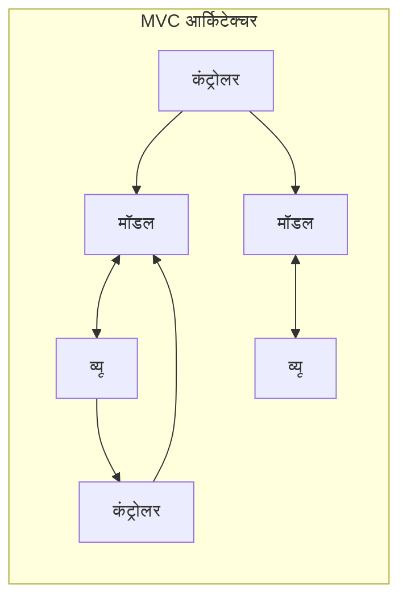
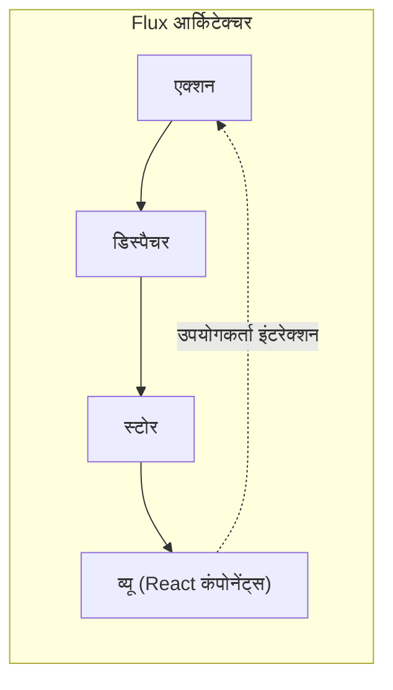
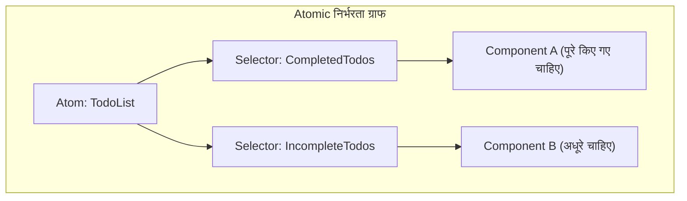

# परिचय

आधुनिक वेब फ्रंटएंड विकास में, **स्टेट मैनेजमेंट** (State Management) एक बहुत ही महत्वपूर्ण विषय है जिससे बचा नहीं जा सकता। विशेष रूप से React पर केंद्रित इकोसिस्टम में, अब तक कई स्टेट मैनेजमेंट लाइब्रेरी और आर्किटेक्चर उभरे और विकसित हुए हैं।

इस लेख में, हम फ्रंटएंड विकास में स्टेट मैनेजमेंट के ऐतिहासिक विकास को देखेंगे, और गहराई से समझेंगे कि प्रत्येक आर्किटेक्चर किन समस्याओं को हल करने के लिए बनाया गया था, और उन्होंने कौन सी नई समस्याएं पैदा कीं। पारंपरिक MVC मॉडल की सीमाओं से शुरू होकर, Flux आर्किटेक्चर का जन्म, Redux द्वारा लाया गया पैराडाइम शिफ्ट, React Context API के फायदे और नुकसान, Recoil और Jotai जैसे Atomic State, MobX और Valtio जैसे Proxy-based दृष्टिकोण, और आधुनिक डेवलपर्स द्वारा व्यापक रूप से समर्थित Zustand जैसी हल्की लाइब्रेरी तक, हम इसके विकास पथ को विस्तार से समझाएंगे।

---

## 1. स्टेट मैनेजमेंट की शुरुआत: MVC और इसकी सीमाएं

React और Vue जैसी आधुनिक UI लाइब्रेरी के आने से पहले, वेब फ्रंटएंड की दुनिया में jQuery का उपयोग करके सीधे DOM मैनिपुलेशन मुख्यधारा थी। हालांकि, जैसे-जैसे एप्लिकेशन अधिक जटिल होते गए, मैन्युअल रूप से स्टेट (डेटा) और UI (DOM) को सिंक करना बग्स का स्रोत बन गया।

इस समस्या को हल करने के लिए, बैकएंड में सफल रहे **MVC** (Model-View-Controller) और **MVVM** (Model-View-ViewModel) जैसे आर्किटेक्चर पैटर्न फ्रंटएंड में भी लाए गए (उदाहरण: Backbone.js और AngularJS)।

### MVC की समस्याएं

MVC पैटर्न भूमिकाओं को विभाजित करता है: डेटा का प्रबंधन करने वाला Model, UI को रेंडर करने वाला View, और उपयोगकर्ता इनपुट को प्रोसेस करके Model और View को अपडेट करने वाला Controller। यह छोटे से मध्यम आकार के एप्लिकेशन के लिए अच्छी तरह काम करता था, लेकिन Facebook (अब Meta) जैसे बड़े एप्लिकेशन में गंभीर समस्याएं उत्पन्न हुईं।

वह **द्विदिश डेटा बाइंडिंग के कारण स्टेट की अप्रत्याशितता** (unpredictability) है। Model में परिवर्तन View को अपडेट करता है, View में एक क्रिया किसी अन्य Model को अपडेट करती है, जो किसी अन्य View को अपडेट करती है... जब ऐसे कैस्केडिंग अपडेट (cascading updates) होते हैं, तो डेटा फ्लो बहुत उलझ जाता है, और बग्स को ट्रैक करना बेहद मुश्किल हो जाता है।



इस प्रकार, डेटा कई दिशाओं में बहने के कारण, यह समझना असंभव हो गया कि "अभी कौन सा डेटा क्यों बदला?"

---

## 2. Flux आर्किटेक्चर का जन्म और एकदिश डेटा फ्लो

MVC की जटिलता समस्या का Facebook का उत्तर **Flux** आर्किटेक्चर था। Flux का सबसे बड़ा आविष्कार **एकदिश डेटा फ्लो** (Unidirectional Data Flow) का पूर्ण कार्यान्वयन है।

Flux में, एप्लिकेशन का डेटा हमेशा एक दिशा में बहता है।



- **Action** : उपयोगकर्ता क्रियाओं या सिस्टम ईवेंट्स को दर्शाने वाला ऑब्जेक्ट।
- **Dispatcher** : Action प्राप्त करता है और इसे सभी पंजीकृत Store को वितरित करने वाला केंद्रीय हब है।
- **Store** : एप्लिकेशन के स्टेट और लॉजिक को रखता है। यह Dispatcher से Action प्राप्त करके खुद को अपडेट करता है और View को बदलाव की सूचना देता है।
- **View** : Store से स्टेट प्राप्त करके UI रेंडर करता है। यह उपयोगकर्ता क्रियाओं का पता लगाता है और नए Action जारी करता है।

डेटा फ्लो को एक दिशा में सीमित करके, स्टेट परिवर्तन प्रक्रियाओं को ट्रैक करना आसान हो गया, और एप्लिकेशन की भविष्यवाणी में नाटकीय रूप से सुधार हुआ। यह एक महत्वपूर्ण पैराडाइम शिफ्ट था जो भविष्य के स्टेट मैनेजमेंट का आधार बना।

---

## 3. Redux: Single Source of Truth (एकल जिम्मेदारी ट्री) का युग

यद्यपि Flux की अवधारणा शानदार थी, लेकिन कई Store होने के कारण निर्भरता प्रबंधन जैसी कार्यान्वयन जटिलताएं बनी रहीं। इसे परिष्कृत करके इसके अंतिम रूप में लाया गया **Redux** , जिसे Dan Abramov और अन्य द्वारा विकसित किया गया था।

### Redux के 3 सिद्धांत

Redux निम्नलिखित 3 मूल सिद्धांतों पर आधारित है।

1. **Single source of truth** (सच्चाई का एक स्रोत): पूरे एप्लिकेशन का स्टेट एक ऑब्जेक्ट ट्री (Store) में संग्रहीत होता है।
2. **State is read-only** (स्टेट रीड-ओनली है): स्टेट को बदलने का एकमात्र तरीका एक Action जारी करना (dispatch) है जो यह दर्शाता है कि क्या हुआ है।
3. **Changes are made with pure functions** (परिवर्तन शुद्ध कार्यों के साथ किए जाते हैं): यह निर्दिष्ट करने के लिए कि Action द्वारा स्टेट ट्री को कैसे रूपांतरित किया जाएगा, आप शुद्ध कार्य (pure function) के रूप में Reducer लिखते हैं।

Redux ने टाइम-ट्रैवल डिबगिंग (स्टेट को रिवाइंड और रीप्ले करना) को संभव बनाया, और डेवलपर अनुभव (DX) में नाटकीय रूप से सुधार किया।

### Redux Toolkit का उपयोग करके ToDo ऐप का कार्यान्वयन उदाहरण

अतीत में, Redux की "बहुत सारे बॉयलरप्लेट (boilerplate) कोड" के लिए आलोचना की गई थी, लेकिन अब **Redux Toolkit** (RTK) मानक बन गया है, और इसे बहुत ही संक्षेप में लिखा जा सकता है।

```typescript
// Redux Toolkit (Zustand या Context के साथ तुलना के लिए उदाहरण)
import { configureStore, createSlice, PayloadAction } from '@reduxjs/toolkit';
import { useSelector, useDispatch } from 'react-redux';

// 1. State प्रकार की परिभाषा
interface Todo {
  id: string;
  text: string;
  completed: boolean;
}

// 2. Slice (Reducer और Action) की परिभाषा
const todoSlice = createSlice({
  name: 'todos',
  initialState: [] as Todo[],
  reducers: {
    addTodo: (state, action: PayloadAction<string>) => {
      // RTK के भीतर Immer काम करता है, इसलिए म्यूटेबल तरीके से लिखना संभव है
      state.push({ id: Date.now().toString(), text: action.payload, completed: false });
    },
    toggleTodo: (state, action: PayloadAction<string>) => {
      const todo = state.find(t => t.id === action.payload);
      if (todo) {
        todo.completed = !todo.completed;
      }
    }
  }
});

export const { addTodo, toggleTodo } = todoSlice.actions;
export const store = configureStore({ reducer: { todos: todoSlice.reducer } });

// 3. कंपोनेंट में उपयोग
function TodoApp() {
  const todos = useSelector((state: { todos: Todo[] }) => state.todos);
  const dispatch = useDispatch();

  return (
    <div>
      <button onClick={() => dispatch(addTodo('नया कार्य'))}>जोड़ें</button>
      <ul>
        {todos.map(todo => (
          <li key={todo.id} onClick={() => dispatch(toggleTodo(todo.id))}>
            {todo.completed ? '<s>' : ''}{todo.text}{todo.completed ? '</s>' : ''}
          </li>
        ))}
      </ul>
    </div>
  );
}
```

Redux अभी भी बड़े प्रोजेक्ट्स में एक शक्तिशाली विकल्प है, लेकिन छोटे ऐप्स के लिए यह ओवरस्पेक है, और चूंकि यह एक ग्लोबल सिंगल ट्री है, इसलिए अनावश्यक रेंडरिंग को रोकने के लिए सिलेक्टर (`useSelector`) को ट्यून करना मुश्किल है।

---

## 4. React Context API: अंतर्निहित साझाकरण तंत्र और इसके नुकसान

React 16.3 में नया **Context API** Props Drilling (कंपोनेंट्स के गहरे पदानुक्रम में बाल्टी-रिले की तरह प्रॉपर्टीज़ पास करना) को हल करने के लिए React की मानक सुविधा के रूप में पेश किया गया था। Hooks (`useContext` और `useReducer`) के आगमन के साथ, इस बहस ने जोर पकड़ लिया कि "क्या Redux अब आवश्यक नहीं है?"

### Context + Reducer का उपयोग करके ToDo ऐप का कार्यान्वयन उदाहरण

```typescript
import React, { createContext, useContext, useReducer, ReactNode } from 'react';

// 1. प्रकार की परिभाषा
interface Todo { id: string; text: string; completed: boolean; }
type Action = { type: 'ADD'; payload: string } | { type: 'TOGGLE'; payload: string };

// 2. Reducer की परिभाषा
function todoReducer(state: Todo[], action: Action): Todo[] {
  switch (action.type) {
    case 'ADD':
      return [...state, { id: Date.now().toString(), text: action.payload, completed: false }];
    case 'TOGGLE':
      return state.map(t => t.id === action.payload ? { ...t, completed: !t.completed } : t);
    default:
      return state;
  }
}

// 3. Context बनाना
const TodoContext = createContext<{ state: Todo[]; dispatch: React.Dispatch<Action> } | undefined>(undefined);

// 4. Provider प्रदान करना
export function TodoProvider({ children }: { children: ReactNode }) {
  const [state, dispatch] = useReducer(todoReducer, []);
  return (
    <TodoContext.Provider value={{ state, dispatch }}>
      {children}
    </TodoContext.Provider>
  );
}

// 5. कंपोनेंट में उपयोग
function TodoApp() {
  const context = useContext(TodoContext);
  if (!context) throw new Error('Provider के भीतर उपयोग किया जाना चाहिए');
  const { state: todos, dispatch } = context;

  return (
    <div>
      <button onClick={() => dispatch({ type: 'ADD', payload: 'कार्य' })}>जोड़ें</button>
      {/* रेंडरिंग प्रक्रिया */}
    </div>
  );
}
```

### Context API की समस्याएं (अनावश्यक री-रेंडरिंग)

Context ने निश्चित रूप से Props Drilling को हल किया, लेकिन यह **स्टेट मैनेजमेंट लाइब्रेरी** नहीं है। Context केवल "निर्भरता इंजेक्शन (DI)" तंत्र है।

Context की सबसे बड़ी समस्या यह है कि **"जब Context का मान अपडेट होता है, तो उस Context को सब्सक्राइब करने वाले (यानी `useContext` का उपयोग करने वाले) सभी कंपोनेंट्स को जबरदस्ती री-रेंडर किया जाता है।"** यदि आप एक Context में एक बड़े ऑब्जेक्ट का प्रबंधन करते हैं, तो वे कंपोनेंट्स भी अनावश्यक रूप से रेंडर होंगे जिन्हें केवल कुछ प्रॉपर्टीज़ की आवश्यकता है, जिससे प्रदर्शन में गिरावट आएगी। इसे रोकने के लिए Context को छोटे हिस्सों में विभाजित करने पर आप Provider Hell में फंस जाएंगे।

---

## 5. Atomic State Management: Recoil और Jotai द्वारा समाधान

Context की री-रेंडरिंग समस्या और Redux की बॉयलरप्लेट समस्या को एक साथ हल करने के लिए **Atomic आर्किटेक्चर** को अपनाने वाला स्टेट मैनेजमेंट प्रस्तावित किया गया। Facebook (अब Meta) द्वारा प्रायोगिक रूप से जारी किया गया **Recoil** , और अधिक हल्का और परिष्कृत **Jotai** इसके प्रमुख उदाहरण हैं।

### Atomic आर्किटेक्चर क्या है?

यह एप्लिकेशन के स्टेट को एक बड़े ट्री के बजाय छोटे, स्वतंत्र स्टेट कणों ( **Atom** ) के रूप में मानता है। चूंकि प्रत्येक कंपोनेंट केवल आवश्यक Atom को ही सब्सक्राइब करता है, इसलिए स्टेट अपडेट होने पर केवल उस पर निर्भर कंपोनेंट ही सटीक रूप से री-रेंडर होते हैं।



### Recoil (या Jotai) का उपयोग करके ToDo ऐप का कार्यान्वयन उदाहरण

यहाँ हम Jotai के समान, या Recoil का उपयोग करके एक बहुत ही सहज ज्ञान युक्त (intuitive) तरीका दिखा रहे हैं।

```typescript
// Recoil का उदाहरण
import { atom, useRecoilState, RecoilRoot } from 'recoil';

// 1. Atom (स्टेट की सबसे छोटी इकाई) को परिभाषित करें
const todosState = atom<Todo[]>({
  key: 'todosState',
  default: [],
});

// 2. कंपोनेंट में उपयोग (React के useState के लगभग समान इंटरफ़ेस)
function TodoApp() {
  const [todos, setTodos] = useRecoilState(todosState);

  const addTodo = () => {
    setTodos([...todos, { id: Date.now().toString(), text: 'कार्य', completed: false }]);
  };

  const toggleTodo = (id: string) => {
    setTodos(todos.map(t => t.id === id ? { ...t, completed: !t.completed } : t));
  };

  return (
    <div>
      <button onClick={addTodo}>जोड़ें</button>
      {/* रेंडरिंग प्रक्रिया */}
    </div>
  );
}

// आवश्यक: ऐप के रूट को RecoilRoot से लपेटें
function App() {
  return <RecoilRoot><TodoApp /></RecoilRoot>;
}
```

बॉयलरप्लेट लगभग गायब हो गया है, और आप React के मानक `useState` की तरह ही ग्लोबल स्टेट को संभाल सकते हैं। इसके अलावा, एसिंक्रोनस डेटा को संभालना और व्युत्पन्न स्टेट (Derived State) की गणना भी बहुत शक्तिशाली है।

---

## 6. Proxy-based State Management: MobX और Valtio

एक और शक्तिशाली दृष्टिकोण JavaScript के `Proxy` ऑब्जेक्ट का लाभ उठाने वाला **म्यूटेबल (परिवर्तनीय) स्टेट मैनेजमेंट** है। React आम तौर पर "इम्यूटेबल (अपरिवर्तनीय) स्टेट अपडेट" की मांग करता है, लेकिन Proxy का उपयोग करके "केवल ऑब्जेक्ट को सीधे अधिलेखित करके परिवर्तनों का पता लगाना और स्वचालित रूप से कंपोनेंट्स को अपडेट करना" संभव हो जाता है।

पहले **MobX** प्रसिद्ध था, लेकिन हाल के वर्षों में React Hooks के साथ बेहतर संगतता वाला **Valtio** (Zustand के समान लेखक द्वारा) ध्यान आकर्षित कर रहा है। Proxy-आधारित दृष्टिकोण सहज JavaScript कोड की अनुमति देता है, जिससे यह जटिल रूप से नेस्ट किए गए डेटा के प्रबंधन में अत्यधिक प्रभावी हो जाता है।

---

## 7. आधुनिक मुख्यधारा: हल्का और तेज़ Zustand

विभिन्न आर्किटेक्चरों की भीड़ के बीच, वर्तमान में कई डेवलपर्स के लिए "पहली पसंद" बन रहा है **Zustand** (जिसका अर्थ जर्मन में "स्टेट" है)।

Zustand भी Redux की तरह Flux-आधारित "सिंगल Store" दृष्टिकोण अपनाता है, लेकिन इसने Redux की जटिल अवधारणाओं (Reducer, Action types, Dispatch, Provider द्वारा लपेटना) को पूरी तरह से समाप्त कर दिया है। यह बहुत हल्का है, इसमें कम कोड लिखना पड़ता है, और एक सरल हुक-आधारित API प्रदान करता है।

### Zustand का उपयोग करके ToDo ऐप का कार्यान्वयन उदाहरण

```typescript
import { create } from 'zustand';

// 1. State और Action की प्रकार परिभाषा
interface TodoState {
  todos: Todo[];
  addTodo: (text: string) => void;
  toggleTodo: (id: string) => void;
}

// 2. Store बनाना
const useTodoStore = create<TodoState>((set) => ({
  todos: [],
  addTodo: (text) => 
    set((state) => ({ 
      todos: [...state.todos, { id: Date.now().toString(), text, completed: false }] 
    })),
  toggleTodo: (id) => 
    set((state) => ({
      todos: state.todos.map(t => t.id === id ? { ...t, completed: !t.completed } : t)
    })),
}));

// 3. कंपोनेंट में उपयोग
function TodoApp() {
  // केवल आवश्यक स्टेट और एक्शन चुनें और प्राप्त करें (अनावश्यक रेंडरिंग को रोकें)
  const todos = useTodoStore(state => state.todos);
  const addTodo = useTodoStore(state => state.addTodo);
  const toggleTodo = useTodoStore(state => state.toggleTodo);

  return (
    <div>
      <button onClick={() => addTodo('Zustand कार्य')}>जोड़ें</button>
      <ul>
        {todos.map(todo => (
          <li key={todo.id} onClick={() => toggleTodo(todo.id)}>
            {todo.text}
          </li>
        ))}
      </ul>
    </div>
  );
}
```

### Zustand के समर्थित होने के कारण

- **Provider अनावश्यक** : एप्लिकेशन को `<Provider>` में लपेटने की आवश्यकता नहीं है, और आप React ट्री के बाहर (सामान्य कार्यों या एसिंक्रोनस प्रक्रियाओं में) भी स्टेट को पढ़ और लिख सकते हैं।
- **सरलता** : बॉयलरप्लेट कोड बहुत कम है, और आप एक ही फ़ाइल में Store को कॉम्पैक्ट रूप से परिभाषित कर सकते हैं।
- **प्रदर्शन** : सिलेक्टर फ़ंक्शन (`state => state.todos`) का उपयोग करके, Redux की तरह, यह कंपोनेंट को तभी रेंडर करता है जब सब्सक्राइब किया गया मान बदलता है। इसने Context API की समस्याओं को शानदार ढंग से दूर किया है।

---

## निष्कर्ष: स्टेट मैनेजमेंट का भविष्य

फ्रंटएंड स्टेट मैनेजमेंट MVC की विफलता के साथ शुरू हुआ, Flux/Redux के साथ मजबूती प्राप्त की, Context के माध्यम से API मानकीकरण की खोज की, और अब यह Atomic (Jotai/Recoil), हल्के Store (Zustand), और Proxy (Valtio) जैसे विविध और परिष्कृत उपकरणों में विकसित हो गया है।

वर्तमान प्रोजेक्ट्स में चयन मानदंड के दिशानिर्देश इस प्रकार हैं:

- **विशाल और जटिल एंटरप्राइज़ क्षेत्र, या सख्त स्टेट संक्रमण ट्रैकिंग की आवश्यकता** : Redux Toolkit
- **कंपोनेंट ट्री के आकार पर निर्भर नहीं, लचीला और सहज स्टेट साझाकरण** : Jotai या Recoil
- **सरल, कम सीखने की लागत, और उच्च प्रदर्शन वाला ग्लोबल Store** : Zustand
- **गहरे नेस्ट किए गए जटिल ऑब्जेक्ट्स को सहज रूप से म्यूटेबल तरीके से संभालना चाहते हैं** : Valtio

फ्रंटएंड आर्किटेक्चर का विकास कभी नहीं रुकता, लेकिन प्रत्येक लाइब्रेरी **"किस दर्द को हल करने के लिए पैदा हुई थी"** यह समझकर, आप अपने प्रोजेक्ट के लिए सर्वोत्तम तकनीक का चयन करने में सक्षम होंगे।
