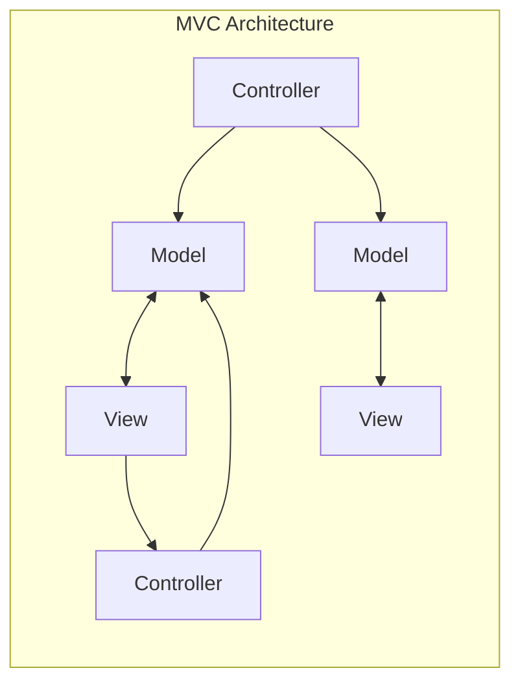
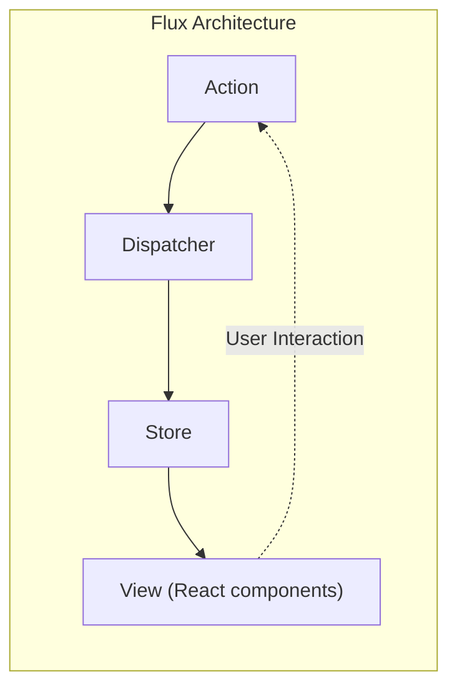
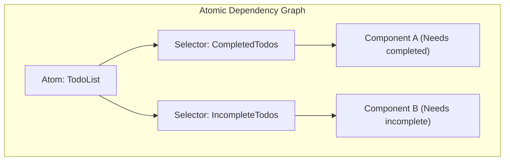

# Pendahuluan

Dalam pengembangan web frontend modern, **manajemen state** (State Management) adalah tema yang sangat penting dan tidak bisa dihindari. Terutama dalam ekosistem yang berpusat pada React, telah lahir dan berkembang banyak pustaka dan arsitektur manajemen state hingga saat ini.

Artikel ini akan menelusuri kembali perkembangan sejarah manajemen state dalam pengembangan frontend, dan menggali lebih dalam masalah apa yang coba dipecahkan oleh setiap arsitektur saat diciptakan, serta tantangan baru apa yang mereka hasilkan. Dimulai dari keterbatasan yang dimiliki oleh model MVC tradisional, lahirnya arsitektur Flux, pergeseran paradigma yang dibawa oleh Redux, kelebihan dan kekurangan React Context API, pendekatan Atomic State yang diwakili oleh Recoil dan Jotai, pendekatan berbasis Proxy seperti MobX dan Valtio, hingga pustaka ringan seperti Zustand yang banyak didukung oleh para pengembang modern; jejak evolusi ini akan dijelaskan secara rinci.

---

## 1. Fajar Manajemen State: MVC dan Keterbatasannya

Sebelum munculnya pustaka UI modern seperti React dan Vue, manipulasi DOM secara langsung menggunakan jQuery adalah hal yang umum di dunia frontend web. Namun, seiring dengan semakin kompleksnya aplikasi, sinkronisasi state (data) dan UI (DOM) secara manual menjadi sarang bug.

Untuk menyelesaikan masalah ini, pola arsitektur seperti **MVC** (Model-View-Controller) dan **MVVM** (Model-View-ViewModel) yang telah sukses di backend dibawa ke frontend (contohnya: Backbone.js dan AngularJS).

### Tantangan yang Dihadapi MVC

Pola MVC membagi peran menjadi Model yang mengelola data, View yang menggambar UI, dan Controller yang memproses input pengguna untuk memperbarui Model dan View. Ini bekerja dengan baik pada aplikasi berskala kecil hingga menengah, namun pada aplikasi raksasa seperti Facebook (kini Meta), muncul masalah serius.

Masalah tersebut adalah **ketidakpastian state akibat pengikatan data dua arah** (two-way data binding). Perubahan pada Model memperbarui View, operasi pada View memperbarui Model lain, yang kemudian memperbarui View lainnya... Ketika pembaruan berantai (cascade update) ini terjadi, aliran data menjadi sangat rumit, membuat pelacakan bug menjadi sangat sulit.



Dengan arah aliran data yang bercabang ke banyak arah, menjadi tidak mungkin untuk mengetahui "data mana yang berubah sekarang dan mengapa".

---

## 2. Lahirnya Arsitektur Flux dan Aliran Data Satu Arah

Jawaban Facebook terhadap masalah kompleksitas MVC adalah arsitektur **Flux**. Penemuan terbesar Flux adalah penerapan **aliran data satu arah** (Unidirectional Data Flow) secara menyeluruh.

Dalam Flux, data aplikasi selalu mengalir dalam satu arah.



- **Action** : Objek yang merepresentasikan operasi pengguna atau event dari sistem.
- **Dispatcher** : Hub pusat yang menerima Action dan mendistribusikannya ke semua Store yang terdaftar.
- **Store** : Menyimpan state dan logika aplikasi. Menerima Action dari Dispatcher, memperbarui dirinya sendiri, dan memberi tahu View tentang perubahan tersebut.
- **View** : Menerima state dari Store dan menggambar UI. Mendeteksi operasi pengguna dan menerbitkan Action baru.

Dengan membatasi aliran data menjadi satu arah, proses perubahan state menjadi lebih mudah dilacak, dan prediktabilitas aplikasi meningkat secara dramatis. Ini adalah pergeseran paradigma penting yang menjadi dasar manajemen state di masa depan.

---

## 3. Redux: Era Single Source of Truth (Pohon Tanggung Jawab Tunggal)

Meskipun konsep Flux sangat bagus, masih ada kompleksitas implementasi yang tersisa, seperti manajemen dependensi akibat adanya beberapa Store. **Redux**, yang dikembangkan oleh Dan Abramov dan kawan-kawan, menyempurnakan hal ini ke bentuk yang paling mutakhir.

### 3 Prinsip Redux

Redux didasarkan pada 3 prinsip dasar berikut:

1. **Single source of truth** (Sumber kebenaran tunggal): Seluruh state aplikasi disimpan dalam satu pohon objek (Store).
2. **State is read-only** (State bersifat hanya-baca): Satu-satunya cara untuk mengubah state adalah dengan menerbitkan (dispatch) Action yang mendeskripsikan apa yang terjadi.
3. **Changes are made with pure functions** (Perubahan dilakukan dengan fungsi murni): Untuk menentukan bagaimana pohon state diubah oleh Action, Anda menulis Reducer yang merupakan fungsi murni.

Redux memungkinkan *time-travel debugging* (memutar mundur dan memutar ulang state), yang secara drastis meningkatkan pengalaman pengembang (DX).

### Contoh Implementasi Aplikasi ToDo Menggunakan Redux Toolkit

Dulu Redux dikritik karena "terlalu banyak boilerplate (kode berulang)", tetapi saat ini **Redux Toolkit** (RTK) telah menjadi standar dan memungkinkan penulisan yang sangat ringkas.

```typescript
// Redux Toolkit (Contoh untuk dibandingkan dengan Zustand atau Context)
import { configureStore, createSlice, PayloadAction } from '@reduxjs/toolkit';
import { useSelector, useDispatch } from 'react-redux';

// 1. Definisi Tipe State
interface Todo {
  id: string;
  text: string;
  completed: boolean;
}

// 2. Definisi Slice (Reducer dan Action)
const todoSlice = createSlice({
  name: 'todos',
  initialState: [] as Todo[],
  reducers: {
    addTodo: (state, action: PayloadAction<string>) => {
      // Immer berjalan di dalam RTK, sehingga penulisan mutable dimungkinkan
      state.push({ id: Date.now().toString(), text: action.payload, completed: false });
    },
    toggleTodo: (state, action: PayloadAction<string>) => {
      const todo = state.find(t => t.id === action.payload);
      if (todo) {
        todo.completed = !todo.completed;
      }
    }
  }
});

export const { addTodo, toggleTodo } = todoSlice.actions;
export const store = configureStore({ reducer: { todos: todoSlice.reducer } });

// 3. Penggunaan pada Komponen
function TodoApp() {
  const todos = useSelector((state: { todos: Todo[] }) => state.todos);
  const dispatch = useDispatch();

  return (
    <div>
      <button onClick={() => dispatch(addTodo('Tugas baru'))}>Tambah</button>
      <ul>
        {todos.map(todo => (
          <li key={todo.id} onClick={() => dispatch(toggleTodo(todo.id))}>
            {todo.completed ? '<s>' : ''}{todo.text}{todo.completed ? '</s>' : ''}
          </li>
        ))}
      </ul>
    </div>
  );
}
```

Redux masih menjadi pilihan yang kuat dalam proyek berskala besar, namun ada juga tantangan bahwa ia terlalu berlebihan untuk aplikasi kecil, dan karena merupakan pohon tunggal global, cukup sulit untuk menyesuaikan selector (`useSelector`) agar mencegah re-rendering yang tidak perlu.

---

## 4. React Context API: Mekanisme Berbagi Bawaan dan Jebakannya

**Context API**, yang diperbarui pada React 16.3, muncul sebagai fitur standar React untuk menyelesaikan Props Drilling (meneruskan properti ke hierarki komponen yang dalam seperti estafet ember). Dengan hadirnya Hooks (`useContext` dan `useReducer`), muncul perdebatan bahwa "mungkin Redux sudah tidak diperlukan lagi".

### Contoh Implementasi Aplikasi ToDo Menggunakan Context + Reducer

```typescript
import React, { createContext, useContext, useReducer, ReactNode } from 'react';

// 1. Definisi Tipe
interface Todo { id: string; text: string; completed: boolean; }
type Action = { type: 'ADD'; payload: string } | { type: 'TOGGLE'; payload: string };

// 2. Definisi Reducer
function todoReducer(state: Todo[], action: Action): Todo[] {
  switch (action.type) {
    case 'ADD':
      return [...state, { id: Date.now().toString(), text: action.payload, completed: false }];
    case 'TOGGLE':
      return state.map(t => t.id === action.payload ? { ...t, completed: !t.completed } : t);
    default:
      return state;
  }
}

// 3. Membuat Context
const TodoContext = createContext<{ state: Todo[]; dispatch: React.Dispatch<Action> } | undefined>(undefined);

// 4. Menyediakan Provider
export function TodoProvider({ children }: { children: ReactNode }) {
  const [state, dispatch] = useReducer(todoReducer, []);
  return (
    <TodoContext.Provider value={{ state, dispatch }}>
      {children}
    </TodoContext.Provider>
  );
}

// 5. Penggunaan pada Komponen
function TodoApp() {
  const context = useContext(TodoContext);
  if (!context) throw new Error('Harus digunakan di dalam Provider');
  const { state: todos, dispatch } = context;

  return (
    <div>
      <button onClick={() => dispatch({ type: 'ADD', payload: 'Tugas' })}>Tambah</button>
      {/* Proses rendering */}
    </div>
  );
}
```

### Tantangan Context API (Re-rendering yang Tidak Perlu)

Context memang menyelesaikan masalah Props Drilling, tetapi ia **bukanlah pustaka manajemen state**. Context pada dasarnya hanyalah mekanisme "injeksi dependensi (DI)".

Masalah terbesar dari Context adalah **"ketika nilai Context diperbarui, semua komponen yang berlangganan Context tersebut (yang menggunakan `useContext`) akan dipaksa untuk di-render ulang"**. Jika Anda mengelola objek besar dalam satu Context, bahkan komponen yang hanya membutuhkan sebagian properti akan ikut di-render secara tidak perlu, menyebabkan penurunan performa. Jika Anda membagi Context menjadi bagian-bagian kecil untuk mencegah hal ini, Anda akan jatuh ke dalam neraka Provider (Provider Hell).

---

## 5. Manajemen State Atomic: Solusi oleh Recoil dan Jotai

Untuk memecahkan masalah re-rendering Context dan masalah boilerplate Redux secara bersamaan, diajukanlah manajemen state yang mengadopsi **Arsitektur Atomic**. **Recoil**, yang secara eksperimental diumumkan oleh Facebook (kini Meta), dan **Jotai**, yang lebih ringan dan lebih rapi, adalah contoh utamanya.

### Apa itu Arsitektur Atomic?

Arsitektur ini memperlakukan state aplikasi bukan sebagai satu pohon raksasa tunggal, melainkan sebagai butiran state kecil yang independen (**Atom**). Karena setiap komponen hanya berlangganan (Subscribe) pada Atom yang dibutuhkannya, ketika state diperbarui, hanya komponen yang bergantung padanya yang akan di-render ulang secara tepat.



### Contoh Implementasi Aplikasi ToDo Menggunakan Recoil (atau Jotai)

Di sini, saya akan menunjukkan cara penulisan yang sangat intuitif, mirip dengan Jotai atau menggunakan Recoil.

```typescript
// Contoh Recoil
import { atom, useRecoilState, RecoilRoot } from 'recoil';

// 1. Mendefinisikan Atom (unit terkecil dari state)
const todosState = atom<Todo[]>({
  key: 'todosState',
  default: [],
});

// 2. Penggunaan pada Komponen (antarmuka yang hampir sama dengan useState dari React)
function TodoApp() {
  const [todos, setTodos] = useRecoilState(todosState);

  const addTodo = () => {
    setTodos([...todos, { id: Date.now().toString(), text: 'Tugas', completed: false }]);
  };

  const toggleTodo = (id: string) => {
    setTodos(todos.map(t => t.id === id ? { ...t, completed: !t.completed } : t));
  };

  return (
    <div>
      <button onClick={addTodo}>Tambah</button>
      {/* Proses rendering */}
    </div>
  );
}

// Wajib: Membungkus root aplikasi dengan RecoilRoot
function App() {
  return <RecoilRoot><TodoApp /></RecoilRoot>;
}
```

Boilerplate hampir menghilang, dan Anda dapat menangani state global seolah-olah menggunakan `useState` standar dari React. Selain itu, penanganan data asinkron dan komputasi state turunan (Derived State) juga sangat kuat.

---

## 6. Manajemen State Berbasis Proxy: MobX dan Valtio

Pendekatan kuat lainnya adalah **manajemen state yang mutabel (dapat diubah)** dengan memanfaatkan objek `Proxy` dari JavaScript. Pada prinsipnya React menuntut "pembaruan state yang immutabel (tidak dapat diubah)", namun dengan menggunakan Proxy, "hanya dengan mengubah objek secara langsung, sistem dapat mendeteksi perubahan dan memperbarui komponen secara otomatis".

Sejak dulu **MobX** telah dikenal, tetapi belakangan ini **Valtio** (dari pencipta yang sama dengan Zustand) yang lebih sesuai dengan React Hooks semakin menarik perhatian. Pendekatan berbasis Proxy memungkinkan penulisan JavaScript yang intuitif, sehingga sangat ampuh dalam mengelola data bersarang yang kompleks.

---

## 7. Arus Utama Modern: Zustand yang Ringan dan Cepat

Di tengah maraknya berbagai arsitektur, yang kini menjadi "pilihan utama" bagi banyak pengembang adalah **Zustand** (berarti "state" dalam bahasa Jerman).

Sama seperti Redux, Zustand mengadopsi pendekatan "Store Tunggal" berbasis Flux, namun ia secara radikal menghilangkan konsep kompleks Redux (Reducer, Action types, Dispatch, dan pembungkusan oleh Provider). Zustand sangat ringan, membutuhkan lebih sedikit kode, dan menyediakan API berbasis *hook* yang sederhana.

### Contoh Implementasi Aplikasi ToDo Menggunakan Zustand

```typescript
import { create } from 'zustand';

// 1. Definisi Tipe State dan Action
interface TodoState {
  todos: Todo[];
  addTodo: (text: string) => void;
  toggleTodo: (id: string) => void;
}

// 2. Membuat Store
const useTodoStore = create<TodoState>((set) => ({
  todos: [],
  addTodo: (text) => 
    set((state) => ({ 
      todos: [...state.todos, { id: Date.now().toString(), text, completed: false }] 
    })),
  toggleTodo: (id) => 
    set((state) => ({
      todos: state.todos.map(t => t.id === id ? { ...t, completed: !t.completed } : t)
    })),
}));

// 3. Penggunaan pada Komponen
function TodoApp() {
  // Hanya memilih dan mengambil state dan action yang diperlukan (mencegah rendering yang tidak perlu)
  const todos = useTodoStore(state => state.todos);
  const addTodo = useTodoStore(state => state.addTodo);
  const toggleTodo = useTodoStore(state => state.toggleTodo);

  return (
    <div>
      <button onClick={() => addTodo('Tugas Zustand')}>Tambah</button>
      <ul>
        {todos.map(todo => (
          <li key={todo.id} onClick={() => toggleTodo(todo.id)}>
            {todo.text}
          </li>
        ))}
      </ul>
    </div>
  );
}
```

### Mengapa Zustand Didukung

- **Tanpa Provider** : Aplikasi tidak perlu dibungkus dengan `<Provider>`, dan state dapat dibaca atau ditulis di luar pohon React (dalam fungsi biasa atau proses asinkron).
- **Kesederhanaan** : Kode boilerplate sangat sedikit, dan Store dapat didefinisikan secara ringkas di dalam satu file.
- **Performa** : Dengan menggunakan fungsi selector (`state => state.todos`), komponen hanya akan di-render saat nilai langganannya berubah, mirip dengan Redux. Ini mengatasi tantangan dari Context API dengan sangat baik.

---

## Kesimpulan: Masa Depan Manajemen State

Manajemen state frontend dimulai dari keruntuhan MVC, berlanjut ke perolehan ketahanan oleh Flux/Redux, lalu ke pencarian standardisasi API melalui Context, dan kini berevolusi menjadi berbagai perangkat canggih seperti Atomic (Jotai/Recoil), Store ringan (Zustand), dan Proxy (Valtio).

Panduan untuk kriteria pemilihan dalam proyek saat ini adalah sebagai berikut:

- **Aplikasi tingkat enterprise yang besar dan kompleks, atau jika pelacakan transisi state secara ketat diperlukan** : Redux Toolkit
- **Berbagi state secara fleksibel dan intuitif, yang tidak bergantung pada bentuk hierarki pohon komponen** : Jotai atau Recoil
- **Store global yang sederhana dengan kurva pembelajaran rendah serta memiliki performa tinggi** : Zustand
- **Keinginan untuk menangani objek kompleks yang bersarang dalam secara mutabel dan intuitif** : Valtio

Evolusi arsitektur frontend tidak akan pernah berhenti, namun dengan memahami **"rasa sakit apa yang coba disembuhkan oleh penciptaan setiap pustaka"**, Anda akan mampu memilih teknologi yang paling tepat untuk proyek Anda sendiri.
