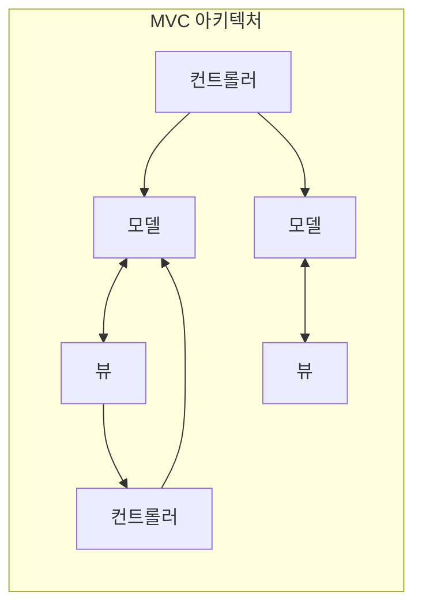
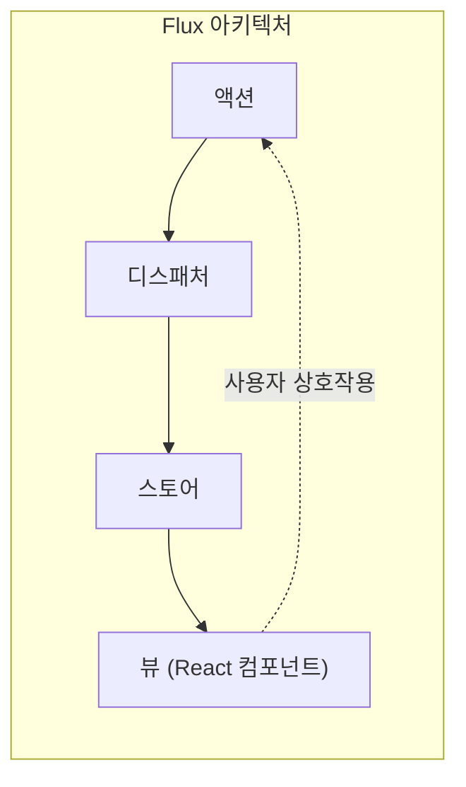
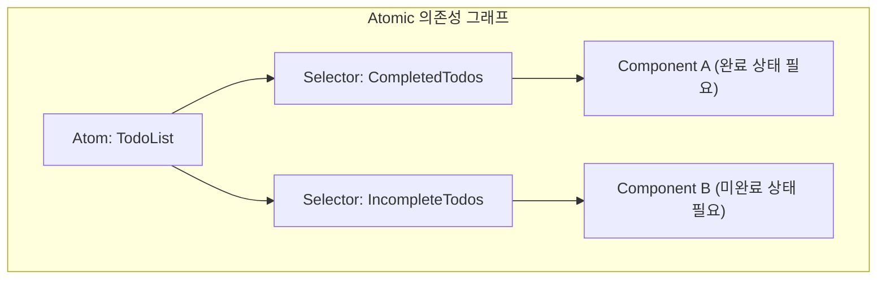

# 시작하며

현대의 Web 프론트엔드 개발에 있어, **상태 관리** (State Management)는 피할 수 없는 매우 중요한 주제입니다. 특히 React를 중심으로 한 에코시스템에서는 지금까지 수많은 상태 관리 라이브러리와 아키텍처가 탄생하고 진화를 거듭해 왔습니다.

본 기사에서는 프론트엔드 개발에서 상태 관리의 역사적 변천을 되돌아보고, 각 아키텍처가 어떤 과제를 해결하기 위해 탄생했으며, 어떤 새로운 과제를 낳았는지 깊이 파헤쳐 봅니다. 기존 MVC 모델이 안고 있던 한계부터 시작하여 Flux 아키텍처의 탄생, Redux가 가져온 패러다임 시프트, React Context API의 공과, Recoil이나 Jotai로 대표되는 Atomic State, MobX나 Valtio 등의 Proxy-based 접근 방식, 그리고 현대 개발자들에게 널리 지지받고 있는 Zustand 등의 경량 라이브러리까지, 그 진화의 궤적을 상세히 해설합니다.

---

## 1. 상태 관리의 여명: MVC와 그 한계

React나 Vue 등의 모던한 UI 라이브러리가 등장하기 전, Web 프론트엔드 세계에서는 jQuery를 이용한 DOM 직접 조작이 주류를 이루었습니다. 하지만 애플리케이션이 복잡해짐에 따라, 상태(데이터)와 UI(DOM)의 동기화를 수동으로 수행하는 것은 버그의 온상이 되었습니다.

이 문제를 해결하기 위해, 백엔드에서 성공을 거둔 **MVC** (Model-View-Controller)나 **MVVM** (Model-View-ViewModel)과 같은 아키텍처 패턴이 프론트엔드에도 도입되었습니다 (대표적인 예: Backbone.js나 AngularJS 등).

### MVC가 안고 있던 과제

MVC 패턴은 데이터를 관리하는 Model, UI를 그리는 View, 그리고 사용자 입력을 처리하여 Model이나 View를 업데이트하는 Controller로 역할을 분할합니다. 중소규모의 애플리케이션에서는 잘 작동했지만, Facebook(현 Meta)과 같은 거대한 애플리케이션에서는 심각한 문제가 발생했습니다.

그것은 **양방향 데이터 바인딩으로 인한 상태의 예측 불가능성** 입니다. Model의 변경이 View를 업데이트하고, View에서의 조작이 다른 Model을 업데이트하며, 그것이 또 다른 View를 업데이트하는…… 이라는 연쇄적인 업데이트(캐스케이드 업데이트)가 발생하면, 데이터 흐름이 복잡하게 얽혀 버그 추적이 극히 어려워졌습니다.



이와 같이, 데이터의 흐름이 다방향으로 향함으로써, 「지금 어떤 데이터가 왜 바뀌었는지」를 파악할 수 없게 되어버린 것입니다.

---

## 2. Flux 아키텍처의 탄생과 단방향 데이터 흐름

MVC의 복잡화 문제에 대한 Facebook의 답변이 **Flux** 아키텍처였습니다. Flux의 가장 큰 발명은 **단방향 데이터 흐름** (Unidirectional Data Flow)의 철저함입니다.

Flux에서는 애플리케이션의 데이터가 항상 한 방향으로 흐릅니다.



- **Action** : 사용자의 조작이나 시스템의 이벤트를 나타내는 객체.
- **Dispatcher** : Action을 받아, 등록된 모든 Store에 Action을 전달하는 중앙 허브.
- **Store** : 애플리케이션의 상태와 로직을 유지. Dispatcher로부터 Action을 받아 자신을 업데이트하고, View에 변경을 통지.
- **View** : Store로부터 상태를 받아 UI를 그림. 사용자의 조작을 감지하여 새로운 Action을 발행.

데이터의 흐름을 하나로 좁힘으로써 상태 변경 프로세스를 추적하기 쉬워졌고, 애플리케이션의 예측 가능성이 비약적으로 향상되었습니다. 이것이 그 후 상태 관리의 기초가 되는 중요한 패러다임 시프트였습니다.

---

## 3. Redux: Single Source of Truth(단일 책임 트리)의 시대

Flux의 개념은 훌륭했지만, 여러 개의 Store가 존재함에 따른 의존 관계 관리 등 구현상의 복잡함이 남아 있었습니다. 이를 세련되게 다듬어 궁극적인 형태로 승화시킨 것이 Dan Abramov 등이 개발한 **Redux** 입니다.

### Redux의 3원칙

Redux는 다음의 세 가지 기본 원칙을 바탕으로 합니다.

1. **Single source of truth** (단일 진실 공급원): 애플리케이션 전체의 상태는 하나의 객체 트리(Store)에 저장된다.
2. **State is read-only** (상태는 읽기 전용): 상태를 변경하는 유일한 방법은 무슨 일이 일어났는지를 나타내는 Action을 발행(dispatch)하는 것이다.
3. **Changes are made with pure functions** (변경은 순수 함수로 작성): Action에 의해 상태 트리가 어떻게 변환될지를 지정하기 위해 순수 함수인 Reducer를 작성한다.

Redux를 통해 시간 여행 디버깅(상태 되감기 및 재생)이 가능해졌고, 개발 경험(DX)이 비약적으로 향상되었습니다.

### Redux Toolkit을 이용한 ToDo 앱 구현 예시

과거에는 「보일러플레이트(상용구 코드)가 많다」며 비판받았던 Redux이지만, 현재는 **Redux Toolkit** (RTK)이 표준이 되어 매우 간결하게 작성할 수 있게 되었습니다.

```typescript
// Redux Toolkit (Zustand나 Context와 비교하기 위한 예시)
import { configureStore, createSlice, PayloadAction } from '@reduxjs/toolkit';
import { useSelector, useDispatch } from 'react-redux';

// 1. State 타입 정의
interface Todo {
  id: string;
  text: string;
  completed: boolean;
}

// 2. Slice (Reducer와 Action) 정의
const todoSlice = createSlice({
  name: 'todos',
  initialState: [] as Todo[],
  reducers: {
    addTodo: (state, action: PayloadAction<string>) => {
      // RTK 내에서는 Immer가 동작하므로, 뮤터블한 방식의 작성이 가능
      state.push({ id: Date.now().toString(), text: action.payload, completed: false });
    },
    toggleTodo: (state, action: PayloadAction<string>) => {
      const todo = state.find(t => t.id === action.payload);
      if (todo) {
        todo.completed = !todo.completed;
      }
    }
  }
});

export const { addTodo, toggleTodo } = todoSlice.actions;
export const store = configureStore({ reducer: { todos: todoSlice.reducer } });

// 3. 컴포넌트에서의 사용
function TodoApp() {
  const todos = useSelector((state: { todos: Todo[] }) => state.todos);
  const dispatch = useDispatch();

  return (
    <div>
      <button onClick={() => dispatch(addTodo('새로운 태스크'))}>추가</button>
      <ul>
        {todos.map(todo => (
          <li key={todo.id} onClick={() => dispatch(toggleTodo(todo.id))}>
            {todo.completed ? '<s>' : ''}{todo.text}{todo.completed ? '</s>' : ''}
          </li>
        ))}
      </ul>
    </div>
  );
}
```

Redux는 거대한 프로젝트에서 지금도 강력한 선택지이지만, 소규모 앱에는 오버스펙이라는 점, 글로벌한 단일 트리이기 때문에 불필요한 렌더링을 막기 위한 셀렉터(`useSelector`) 튜닝이 어렵다는 과제도 있었습니다.

---

## 4. React Context API: 내장된 공유 메커니즘과 그 함정

React 16.3에서 개선된 **Context API** 는 Props Drilling(컴포넌트의 깊은 계층까지 양동이 릴레이처럼 프로퍼티를 전달하는 것)을 해결하기 위한 React 표준 기능으로 등장했습니다. Hooks의 등장(`useContext`와 `useReducer`)으로 「이제 더 이상 Redux는 필요 없는 것이 아닐까」하는 논쟁을 불러일으켰습니다.

### Context + Reducer를 이용한 ToDo 앱 구현 예시

```typescript
import React, { createContext, useContext, useReducer, ReactNode } from 'react';

// 1. 타입 정의
interface Todo { id: string; text: string; completed: boolean; }
type Action = { type: 'ADD'; payload: string } | { type: 'TOGGLE'; payload: string };

// 2. Reducer 정의
function todoReducer(state: Todo[], action: Action): Todo[] {
  switch (action.type) {
    case 'ADD':
      return [...state, { id: Date.now().toString(), text: action.payload, completed: false }];
    case 'TOGGLE':
      return state.map(t => t.id === action.payload ? { ...t, completed: !t.completed } : t);
    default:
      return state;
  }
}

// 3. Context 생성
const TodoContext = createContext<{ state: Todo[]; dispatch: React.Dispatch<Action> } | undefined>(undefined);

// 4. Provider 제공
export function TodoProvider({ children }: { children: ReactNode }) {
  const [state, dispatch] = useReducer(todoReducer, []);
  return (
    <TodoContext.Provider value={{ state, dispatch }}>
      {children}
    </TodoContext.Provider>
  );
}

// 5. 컴포넌트에서의 사용
function TodoApp() {
  const context = useContext(TodoContext);
  if (!context) throw new Error('Provider 내에서 사용되어야 합니다');
  const { state: todos, dispatch } = context;

  return (
    <div>
      <button onClick={() => dispatch({ type: 'ADD', payload: '태스크' })}>추가</button>
      {/* 렌더링 처리 */}
    </div>
  );
}
```

### Context API의 과제 (불필요한 리렌더링)

Context는 확실히 Props Drilling을 해소했지만, **상태 관리 라이브러리** 는 아닙니다. Context는 어디까지나 「의존성 주입(DI)」 메커니즘입니다.

Context의 가장 큰 문제는 **「Context의 값이 업데이트되면, 그 Context를 구독하고 있는 (`useContext`를 사용하고 있는) 모든 컴포넌트가 강제로 리렌더링된다」** 는 점에 있습니다. 거대한 객체를 하나의 Context에서 관리하면 일부 프로퍼티만 필요로 하는 컴포넌트까지 불필요하게 렌더링되어 퍼포먼스 악화를 초래합니다. 이를 방지하기 위해 Context를 잘게 나누면, 이번에는 Provider 지옥(Provider Hell)에 빠지고 맙니다.

---

## 5. Atomic State Management: Recoil과 Jotai를 통한 해결

Context의 리렌더링 문제와 Redux의 보일러플레이트 문제를 동시에 해결하기 위해 제안된 것이, **Atomic 아키텍처** 를 도입한 상태 관리입니다. Facebook(현 Meta)에서 실험적으로 발표된 **Recoil** , 그리고 보다 가볍고 세련된 **Jotai** 가 대표적인 예입니다.

### Atomic 아키텍처란?

애플리케이션의 상태를 단일의 거대한 트리가 아닌, 독립된 작은 상태의 알갱이( **Atom** )로 취급합니다. 각 컴포넌트는 필요한 Atom만을 구독(Subscribe)하기 때문에, 상태가 업데이트되었을 때 그에 의존하는 컴포넌트만이 핀포인트로 리렌더링됩니다.



### Recoil(또는 Jotai)을 이용한 ToDo 앱 구현 예시

여기서는 Jotai와 비슷하거나 Recoil을 사용한 매우 직관적인 작성 방법을 소개합니다.

```typescript
// Recoil 예시
import { atom, useRecoilState, RecoilRoot } from 'recoil';

// 1. Atom (상태의 최소 단위) 정의
const todosState = atom<Todo[]>({
  key: 'todosState',
  default: [],
});

// 2. 컴포넌트에서의 사용 (React의 useState와 거의 동일한 인터페이스)
function TodoApp() {
  const [todos, setTodos] = useRecoilState(todosState);

  const addTodo = () => {
    setTodos([...todos, { id: Date.now().toString(), text: '태스크', completed: false }]);
  };

  const toggleTodo = (id: string) => {
    setTodos(todos.map(t => t.id === id ? { ...t, completed: !t.completed } : t));
  };

  return (
    <div>
      <button onClick={addTodo}>추가</button>
      {/* 렌더링 처리 */}
    </div>
  );
}

// 필수: 앱의 루트를 RecoilRoot로 감싸기
function App() {
  return <RecoilRoot><TodoApp /></RecoilRoot>;
}
```

보일러플레이트가 거의 사라지고, React 표준인 `useState` 와 같은 감각으로 글로벌 상태를 다룰 수 있게 되었습니다. 또한 비동기 데이터 처리나 파생 상태(Derived State) 계산도 매우 강력합니다.

---

## 6. Proxy-based State Management: MobX와 Valtio

또 다른 강력한 접근 방식이 JavaScript의 `Proxy` 객체를 활용한 **뮤터블(변경 가능)한 상태 관리** 입니다. React는 원칙적으로 「이뮤터블(불변)한 상태 업데이트」를 요구하지만, Proxy를 사용함으로써 「객체를 직접 덮어쓰는 것만으로 변경을 감지하고 자동으로 컴포넌트를 업데이트하는」 것이 가능해집니다.

오래전에는 **MobX** 가 유명했지만, 최근에는 보다 React Hooks와의 친화성을 높인 **Valtio** (Zustand와 동일한 작성자)가 주목받고 있습니다. Proxy 기반은 직관적인 JavaScript 작성이 가능해지므로 복잡한 중첩을 가지는 데이터의 관리에 위력을 발휘합니다.

---

## 7. 현대의 메인스트림: 가볍고 빠른 Zustand

다양한 아키텍처가 난립하는 가운데, 현재 많은 개발자에게 「우선 선택지」가 되고 있는 것이 **Zustand** (독일어로 '상태'를 의미)입니다.

Zustand는 Redux와 마찬가지로 Flux 기반의 「단일 Store」 접근 방식을 채택하고 있지만, Redux의 복잡한 개념(Reducer, Action types, Dispatch, Provider에 의한 감싸기)을 철저히 배제했습니다. 매우 가볍고, 코드량이 적으며, 훅 기반의 심플한 API를 제공합니다.

### Zustand를 이용한 ToDo 앱 구현 예시

```typescript
import { create } from 'zustand';

// 1. State와 Action의 타입 정의
interface TodoState {
  todos: Todo[];
  addTodo: (text: string) => void;
  toggleTodo: (id: string) => void;
}

// 2. Store 생성
const useTodoStore = create<TodoState>((set) => ({
  todos: [],
  addTodo: (text) => 
    set((state) => ({ 
      todos: [...state.todos, { id: Date.now().toString(), text, completed: false }] 
    })),
  toggleTodo: (id) => 
    set((state) => ({
      todos: state.todos.map(t => t.id === id ? { ...t, completed: !t.completed } : t)
    })),
}));

// 3. 컴포넌트에서의 사용
function TodoApp() {
  // 필요한 상태와 액션만을 선택해서 가져오기 (불필요한 렌더링 방지)
  const todos = useTodoStore(state => state.todos);
  const addTodo = useTodoStore(state => state.addTodo);
  const toggleTodo = useTodoStore(state => state.toggleTodo);

  return (
    <div>
      <button onClick={() => addTodo('Zustand 태스크')}>추가</button>
      <ul>
        {todos.map(todo => (
          <li key={todo.id} onClick={() => toggleTodo(todo.id)}>
            {todo.text}
          </li>
        ))}
      </ul>
    </div>
  );
}
```

### Zustand가 지지받는 이유

- **Provider 불필요** : 애플리케이션을 `<Provider>` 로 감쌀 필요가 없으며, React 트리 밖(일반 함수나 비동기 처리 내)에서도 상태를 읽고 쓸 수 있습니다.
- **간결함** : 상용구 코드가 극히 적고, 1개의 파일에 Store를 컴팩트하게 정의할 수 있습니다.
- **퍼포먼스** : 셀렉터 함수(`state => state.todos`)를 사용함으로써, Redux와 동일하게 구독하고 있는 값이 변경되었을 때만 컴포넌트를 렌더링합니다. Context API의 과제를 훌륭하게 극복했습니다.

---

## 마무리: 앞으로의 상태 관리

프론트엔드의 상태 관리는 MVC의 파탄에서 시작하여, Flux/Redux에 의한 견고성 확보, Context에 의한 API 표준화 모색을 거쳐, 현재는 Atomic(Jotai/Recoil)이나 경량 Store(Zustand), Proxy(Valtio) 등 다양하고 세련된 도구군으로 진화했습니다.

현재의 프로젝트에서의 선정 기준의 대략적인 기준은 다음과 같습니다:

- **거대하고 복잡한 엔터프라이즈 영역, 또는 엄밀한 상태 전이의 추적이 필요** : Redux Toolkit
- **컴포넌트 트리의 형태에 의존하지 않는, 유연하고 직관적인 상태 공유** : Jotai 또는 Recoil
- **심플하고 학습 비용이 낮으며, 퍼포먼스가 높은 글로벌 Store** : Zustand
- **깊은 중첩 구조의 복잡한 객체를 직관적으로 뮤터블하게 다루고 싶음** : Valtio

프론트엔드 아키텍처의 진화는 멈추지 않겠지만, 각 라이브러리가 **「어떤 고통을 해결하기 위해 태어났는가」** 를 이해함으로써 자신의 프로젝트에 최적인 기술을 선정할 수 있게 될 것입니다.
