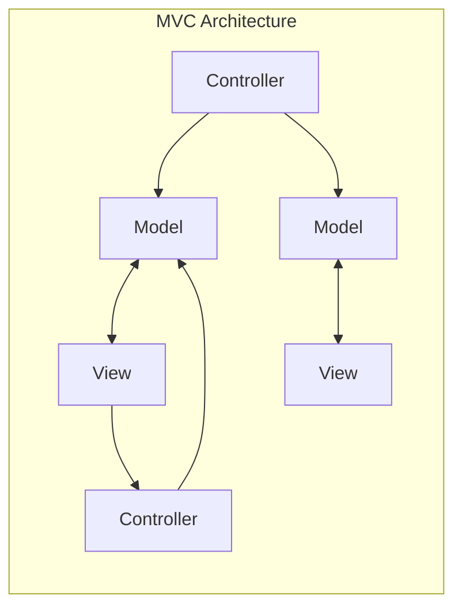
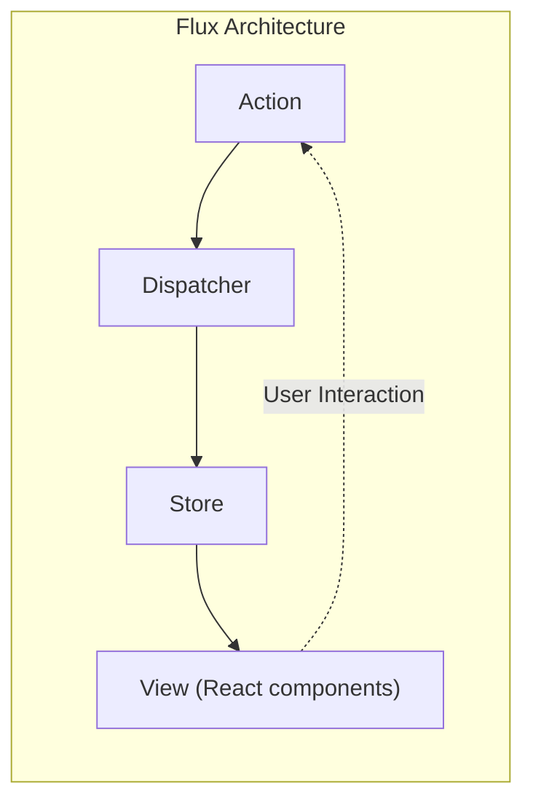
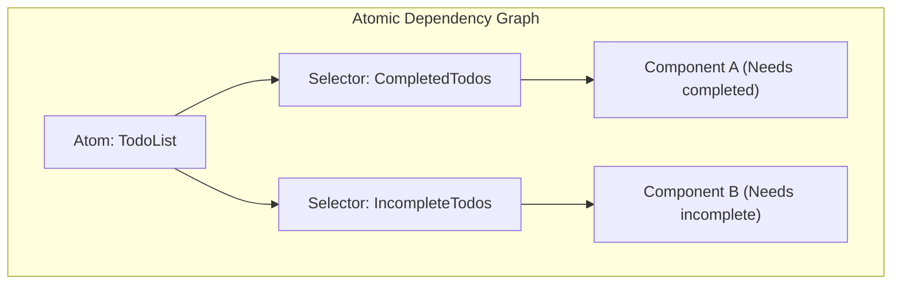

# はじめに

現代のWebフロントエンド開発において、 **状態管理** （State Management）は避けて通れない非常に重要なテーマです。特にReactを中心としたエコシステムにおいては、これまでに数多くの状態管理ライブラリやアーキテクチャが誕生し、進化を遂げてきました。

本記事では、フロントエンド開発における状態管理の歴史的変遷を振り返り、各アーキテクチャがどのような課題を解決するために生まれ、そしてどのような新たな課題を生み出してきたのかを深く掘り下げます。従来のMVCモデルが抱えていた限界から始まり、Fluxアーキテクチャの誕生、Reduxがもたらしたパラダイムシフト、React Context APIの功罪、RecoilやJotaiに代表されるAtomic State、MobXやValtioなどのProxy-basedアプローチ、そして現代の開発者に広く支持されているZustandなどの軽量ライブラリまで、その進化の軌跡を詳細に解説します。

---

## 1. 状態管理の夜明け：MVCとその限界

ReactやVueなどのモダンなUIライブラリが登場する以前、Webフロントエンドの世界ではjQueryを利用したDOMの直接操作が主流でした。しかし、アプリケーションが複雑化するにつれて、状態（データ）とUI（DOM）の同期を手動で行うことは、バグの温床となりました。

この問題を解決するために、バックエンドで成功を収めていた **MVC** （Model-View-Controller）や **MVVM** （Model-View-ViewModel）といったアーキテクチャパターンがフロントエンドにも持ち込まれました（代表例：Backbone.jsやAngularJSなど）。

### MVCの抱えていた課題

MVCパターンは、データを管理するModel、UIを描画するView、そしてユーザー入力を処理してModelやViewを更新するControllerに役割を分割します。小〜中規模のアプリケーションではうまく機能しましたが、Facebook（現Meta）のような巨大なアプリケーションでは深刻な問題が発生しました。

それは **双方向データバインディングによる状態の予測不可能性** です。Modelの変更がViewを更新し、Viewでの操作が別のModelを更新し、それがさらに別のViewを更新する……という連鎖的な更新（カスケード・アップデート）が発生すると、データフローが複雑に絡み合い、バグの追跡が極めて困難になりました。



このように、データの流れが多方向に向かうことで、「今どのデータがなぜ変わったのか」を把握できなくなってしまったのです。

---

## 2. Fluxアーキテクチャの誕生と単方向データフロー

MVCの複雑化問題に対するFacebookの回答が **Flux** アーキテクチャでした。Fluxの最大の発明は、 **単方向データフロー** （Unidirectional Data Flow）の徹底です。

Fluxでは、アプリケーションのデータは常に一方向に流れます。



- **Action** : ユーザーの操作やシステムからのイベントを表すオブジェクト。
- **Dispatcher** : Actionを受け取り、登録されているすべてのStoreにActionを配信する中央ハブ。
- **Store** : アプリケーションの状態とロジックを保持する。DispatcherからActionを受け取って自身を更新し、Viewに変更を通知する。
- **View** : Storeから状態を受け取ってUIを描画する。ユーザーの操作を検知して新たなActionを発行する。

データの流れを一つに絞ることで、状態の変更プロセスが追跡しやすくなり、アプリケーションの予測可能性が劇的に向上しました。これが、その後の状態管理の基礎となる重要なパラダイムシフトでした。

---

## 3. Redux：Single Source of Truth（単一責任ツリー）の時代

Fluxの概念は素晴らしかったものの、複数のStoreが存在することによる依存関係の管理など、実装上の複雑さが残っていました。これを洗練させ、究極の形に昇華させたのがDan Abramovらによって開発された **Redux** です。

### Reduxの3原則

Reduxは以下の3つの基本原則に基づいています。

1. **Single source of truth** （単一の信頼できる情報源）: アプリケーション全体の状態は、一つのオブジェクトツリー（Store）に格納される。
2. **State is read-only** （状態は読み取り専用）: 状態を変更する唯一の方法は、何が起きたかを表すActionを発行（dispatch）することである。
3. **Changes are made with pure functions** （変更は[純粋関数](https://kenji.blog/p/functional-programming-concepts-pure-functions-monads/)で行う）: Actionによって状態ツリーがどのように変換されるかを指定するために、純粋関数であるReducerを記述する。

Reduxにより、タイムトラベルデバッグ（状態の巻き戻しや再生）が可能になり、開発体験（DX）が飛躍的に向上しました。

### Redux Toolkitを用いたToDoアプリ実装例

かつては「ボイラープレート（定型コード）が多い」と批判されたReduxですが、現在は **Redux Toolkit** （RTK）が標準となり、非常に簡潔に記述できるようになりました。

```typescript
// Redux Toolkit (ZustandやContextと比較するための例)
import { configureStore, createSlice, PayloadAction } from '@reduxjs/toolkit';
import { useSelector, useDispatch } from 'react-redux';

// 1. State型の定義
interface Todo {
  id: string;
  text: string;
  completed: boolean;
}

// 2. Slice（ReducerとAction）の定義
const todoSlice = createSlice({
  name: 'todos',
  initialState: [] as Todo[],
  reducers: {
    addTodo: (state, action: PayloadAction<string>) => {
      // RTK内ではImmerが動作するため、ミュータブルな書き方が可能
      state.push({ id: Date.now().toString(), text: action.payload, completed: false });
    },
    toggleTodo: (state, action: PayloadAction<string>) => {
      const todo = state.find(t => t.id === action.payload);
      if (todo) {
        todo.completed = !todo.completed;
      }
    }
  }
});

export const { addTodo, toggleTodo } = todoSlice.actions;
export const store = configureStore({ reducer: { todos: todoSlice.reducer } });

// 3. コンポーネントでの利用
function TodoApp() {
  const todos = useSelector((state: { todos: Todo[] }) => state.todos);
  const dispatch = useDispatch();

  return (
    <div>
      <button onClick={() => dispatch(addTodo('新しいタスク'))}>追加</button>
      <ul>
        {todos.map(todo => (
          <li key={todo.id} onClick={() => dispatch(toggleTodo(todo.id))}>
            {todo.completed ? '<s>' : ''}{todo.text}{todo.completed ? '</s>' : ''}
          </li>
        ))}
      </ul>
    </div>
  );
}
```

Reduxは巨大なプロジェクトにおいて今でも強力な選択肢ですが、小規模なアプリにはオーバースペックであること、グローバルな単一ツリーであるため、不必要なレンダリングを防ぐためのセレクタ（`useSelector`）のチューニングが難しいといった課題もありました。

---

## 4. React Context API：組み込みの共有機構とその落とし穴

React 16.3で刷新された **Context API** は、Props Drilling（コンポーネントの深い階層までバケツリレーのようにプロパティを渡すこと）を解決するためのReact標準機能として登場しました。Hooksの登場（`useContext`と`useReducer`）により、「もうReduxは不要なのではないか」という議論を巻き起こしました。

### Context + Reducerを用いたToDoアプリ実装例

```typescript
import React, { createContext, useContext, useReducer, ReactNode } from 'react';

// 1. 型定義
interface Todo { id: string; text: string; completed: boolean; }
type Action = { type: 'ADD'; payload: string } | { type: 'TOGGLE'; payload: string };

// 2. Reducerの定義
function todoReducer(state: Todo[], action: Action): Todo[] {
  switch (action.type) {
    case 'ADD':
      return [...state, { id: Date.now().toString(), text: action.payload, completed: false }];
    case 'TOGGLE':
      return state.map(t => t.id === action.payload ? { ...t, completed: !t.completed } : t);
    default:
      return state;
  }
}

// 3. Contextの作成
const TodoContext = createContext<{ state: Todo[]; dispatch: React.Dispatch<Action> } | undefined>(undefined);

// 4. Providerの提供
export function TodoProvider({ children }: { children: ReactNode }) {
  const [state, dispatch] = useReducer(todoReducer, []);
  return (
    <TodoContext.Provider value={{ state, dispatch }}>
      {children}
    </TodoContext.Provider>
  );
}

// 5. コンポーネントでの利用
function TodoApp() {
  const context = useContext(TodoContext);
  if (!context) throw new Error('Must be used within Provider');
  const { state: todos, dispatch } = context;

  return (
    <div>
      <button onClick={() => dispatch({ type: 'ADD', payload: 'タスク' })}>追加</button>
      {/* 描画処理 */}
    </div>
  );
}
```

### Context APIの課題（不要な再レンダリング）

Contextは確かにProps Drillingを解消しましたが、 **状態管理ライブラリ** ではありません。Contextはあくまで「依存関係の注入（DI）」メカニズムです。

Contextの最大の問題は **「Contextの値が更新されると、そのContextを購読している（`useContext`を使用している）すべてのコンポーネントが強制的に再レンダリングされる」** という点にあります。巨大なオブジェクトを一つのContextで管理すると、一部のプロパティしか必要としていないコンポーネントまで不必要にレンダリングされ、パフォーマンスの悪化を招きます。これを防ぐためにContextを細かく分割すると、今度はProviderの地獄（Provider Hell）に陥ってしまいます。

---

## 5. Atomic State Management：RecoilとJotaiによる解決

Contextの再レンダリング問題と、Reduxのボイラープレート問題を同時に解決するために提案されたのが、 **Atomicアーキテクチャ** を採用した状態管理です。Facebook（現Meta）から実験的に発表された **Recoil** 、そしてより軽量で洗練された **Jotai** が代表例です。

### Atomicアーキテクチャとは？

アプリケーションの状態を単一の巨大なツリーではなく、独立した小さな状態の粒（ **Atom** ）として扱います。各コンポーネントは必要なAtomだけを購読（Subscribe）するため、状態が更新された際、それに依存するコンポーネントだけがピンポイントで再レンダリングされます。



### Recoil（またはJotai）を用いたToDoアプリ実装例

ここではJotaiに似た、あるいはRecoilを用いた非常に直感的な書き方を紹介します。

```typescript
// Recoilの例
import { atom, useRecoilState, RecoilRoot } from 'recoil';

// 1. Atom（状態の最小単位）を定義
const todosState = atom<Todo[]>({
  key: 'todosState',
  default: [],
});

// 2. コンポーネントでの利用 (ReactのuseStateとほぼ同じインターフェース)
function TodoApp() {
  const [todos, setTodos] = useRecoilState(todosState);

  const addTodo = () => {
    setTodos([...todos, { id: Date.now().toString(), text: 'タスク', completed: false }]);
  };

  const toggleTodo = (id: string) => {
    setTodos(todos.map(t => t.id === id ? { ...t, completed: !t.completed } : t));
  };

  return (
    <div>
      <button onClick={addTodo}>追加</button>
      {/* 描画処理 */}
    </div>
  );
}

// 必須: アプリのルートをRecoilRootで囲む
function App() {
  return <RecoilRoot><TodoApp /></RecoilRoot>;
}
```

ボイラープレートがほぼ消滅し、React標準の `useState` のような感覚でグローバルな状態を扱えるようになりました。また、非同期データの扱いや派生状態（Derived State）の計算も非常に強力です。

---

## 6. Proxy-based State Management：MobXとValtio

もう一つの強力なアプローチが、JavaScriptの `Proxy` オブジェクトを活用した **ミュータブル（変更可能）な状態管理** です。Reactは原則として「イミュータブル（不変）な状態更新」を要求しますが、Proxyを使うことで「オブジェクトを直接書き換えるだけで、変更を検知して自動的にコンポーネントを更新する」ことが可能になります。

古くは **MobX** が有名ですが、近年ではよりReact Hooksとの親和性を高めた **Valtio** （Zustandと同じ作者）が注目を集めています。Proxyベースは直感的なJavaScriptの記述が可能になるため、複雑なネストを持つデータの管理で威力を発揮します。

---

## 7. 現代のメインストリーム：軽量・高速なZustand

様々なアーキテクチャが乱立する中で、現在多くの開発者にとって「第一選択」となりつつあるのが **Zustand** （ドイツ語で「状態」の意）です。

ZustandはReduxと同じくFluxベースの「単一Store」アプローチを採用していますが、Reduxの複雑な概念（Reducer、Action types、Dispatch、Providerによる囲い込み）を徹底的に排除しました。非常に軽量で、記述量が少なく、フックベースのシンプルなAPIを提供します。

### Zustandを用いたToDoアプリ実装例

```typescript
import { create } from 'zustand';

// 1. StateとActionの型定義
interface TodoState {
  todos: Todo[];
  addTodo: (text: string) => void;
  toggleTodo: (id: string) => void;
}

// 2. Storeの作成
const useTodoStore = create<TodoState>((set) => ({
  todos: [],
  addTodo: (text) => 
    set((state) => ({ 
      todos: [...state.todos, { id: Date.now().toString(), text, completed: false }] 
    })),
  toggleTodo: (id) => 
    set((state) => ({
      todos: state.todos.map(t => t.id === id ? { ...t, completed: !t.completed } : t)
    })),
}));

// 3. コンポーネントでの利用
function TodoApp() {
  // 必要な状態とアクションだけを選択して取得（不要なレンダリングを防ぐ）
  const todos = useTodoStore(state => state.todos);
  const addTodo = useTodoStore(state => state.addTodo);
  const toggleTodo = useTodoStore(state => state.toggleTodo);

  return (
    <div>
      <button onClick={() => addTodo('Zustandタスク')}>追加</button>
      <ul>
        {todos.map(todo => (
          <li key={todo.id} onClick={() => toggleTodo(todo.id)}>
            {todo.text}
          </li>
        ))}
      </ul>
    </div>
  );
}
```

### Zustandが支持される理由

- **Provider不要** : アプリケーションを `<Provider>` で囲む必要がなく、Reactツリーの外（通常の関数や非同期処理内）でも状態の読み書きが可能です。
- **簡潔さ** : 定型コードが極めて少なく、1つのファイルにStoreをコンパクトに定義できます。
- **パフォーマンス** : セレクタ関数（`state => state.todos`）を使うことで、Reduxと同様に、購読している値が変更された時のみコンポーネントをレンダリングします。Context APIの課題を見事に克服しています。

---

## まとめ：これからの状態管理

フロントエンドの状態管理は、MVCの破綻から始まり、Flux/Reduxによる堅牢性の獲得、ContextによるAPI標準化への模索を経て、現在ではAtomic（Jotai/Recoil）や軽量Store（Zustand）、Proxy（Valtio）といった多様で洗練されたツール群へと進化しました。

現在のプロジェクトにおける選定基準の目安としては以下のようになります：

- **巨大で複雑なエンタープライズ領域、または厳密な状態遷移の追跡が必要** : Redux Toolkit
- **コンポーネントツリーの形に依存しない、柔軟で直感的な状態共有** : Jotai または Recoil
- **シンプルで学習コストが低く、パフォーマンスの高いグローバルStore** : Zustand
- **ネストの深い複雑なオブジェクトを直感的にミュータブルに扱いたい** : Valtio

フロントエンドアーキテクチャの進化は止まることがありませんが、各ライブラリが **「どのような痛みを解決するために生まれたのか」** を理解することで、自身のプロジェクトに最適な技術選定ができるようになるでしょう。
