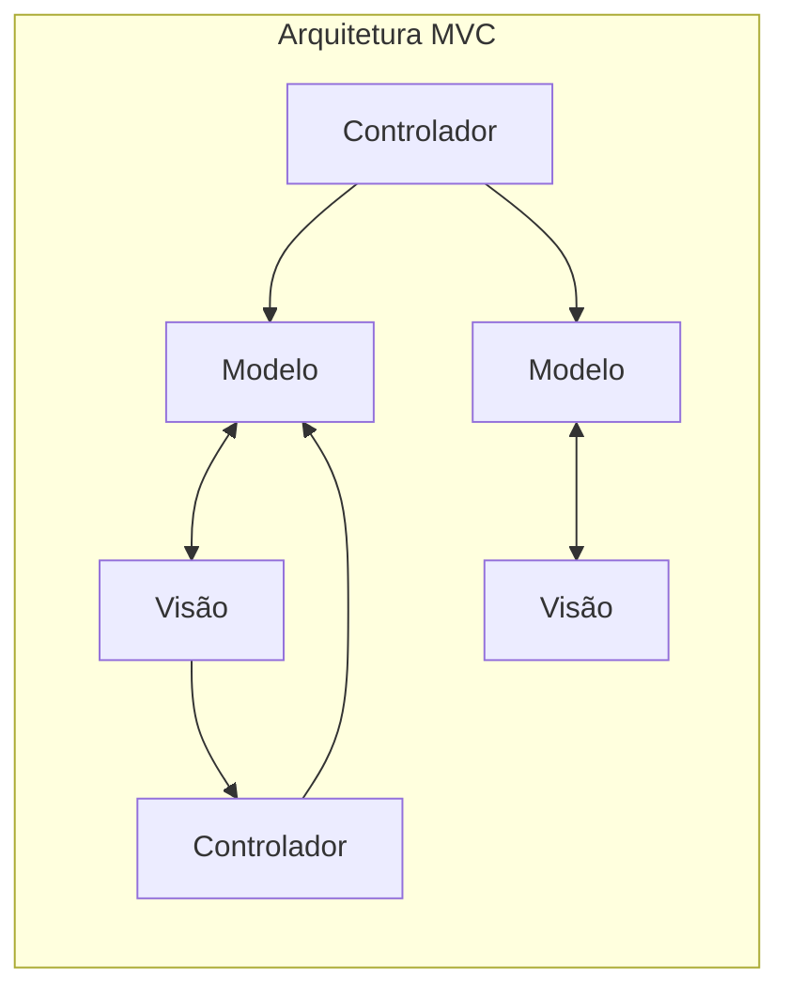
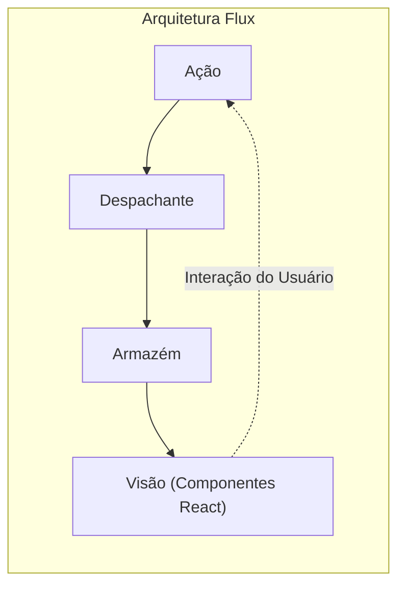
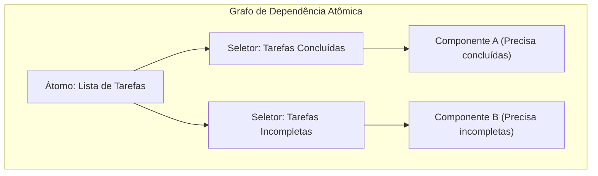

# Introdução

No desenvolvimento web frontend moderno, o **gerenciamento de estado** (State Management) é um tema crucial que não pode ser evitado. Especialmente no ecossistema focado no React, inúmeras bibliotecas e arquiteturas de gerenciamento de estado nasceram e evoluíram até agora.

Neste artigo, vamos relembrar a evolução histórica do gerenciamento de estado no desenvolvimento frontend e analisar profundamente quais problemas cada arquitetura foi criada para resolver e quais novos problemas elas introduziram. Começando pelas limitações do modelo MVC tradicional, passando pelo nascimento da arquitetura Flux, a mudança de paradigma trazida pelo Redux, os prós e contras da API React Context, o Estado Atômico (Atomic State) representado pelo Recoil e Jotai, a abordagem baseada em Proxy como MobX e Valtio, e chegando até às bibliotecas leves como Zustand, que são amplamente apoiadas pelos desenvolvedores modernos. Explicaremos detalhadamente a trajetória dessa evolução.

---

## 1. O Alvorecer do Gerenciamento de Estado: MVC e Suas Limitações

Antes do surgimento de bibliotecas modernas de UI como React e Vue, a manipulação direta do DOM usando jQuery era a norma no mundo do frontend web. No entanto, à medida que os aplicativos se tornavam mais complexos, sincronizar manualmente o estado (dados) com a UI (DOM) tornou-se um terreno fértil para bugs.

Para resolver esse problema, padrões de arquitetura como **MVC** (Model-View-Controller) e **MVVM** (Model-View-ViewModel), que haviam sido bem-sucedidos no backend, foram trazidos para o frontend (exemplos notáveis: Backbone.js e AngularJS).

### Os Problemas do MVC

O padrão MVC divide as responsabilidades no Modelo (Model) para gerenciar dados, na Visão (View) para renderizar a UI e no Controlador (Controller) para processar a entrada do usuário e atualizar o Modelo ou a Visão. Funcionava bem em aplicativos de pequeno a médio porte, mas causava problemas sérios em aplicativos massivos como o do Facebook (atual Meta).

Isso se devia à **imprevisibilidade do estado devido ao data binding bidirecional**. Uma alteração no Modelo atualizava a Visão, uma ação na Visão atualizava outro Modelo, que por sua vez atualizava outra Visão... Quando ocorria essa cadeia de atualizações (cascade updates), o fluxo de dados se tornava intrincado e complexo, tornando o rastreamento de bugs extremamente difícil.



Dessa forma, com os dados fluindo em várias direções, tornava-se impossível entender "quais dados mudaram agora e por quê".

---

## 2. O Nascimento da Arquitetura Flux e o Fluxo de Dados Unidirecional

A resposta do Facebook ao problema de complexidade do MVC foi a arquitetura **Flux**. A maior invenção do Flux foi a adoção rigorosa do **fluxo de dados unidirecional** (Unidirectional Data Flow).

No Flux, os dados do aplicativo fluem sempre em uma única direção.



- **Ação** (Action): Um objeto que representa a interação do usuário ou um evento do sistema.
- **Despachante** (Dispatcher): O hub central que recebe a Ação e a distribui para todas as Stores registradas.
- **Armazém** (Store): Mantém o estado e a lógica da aplicação. Recebe a Ação do Despachante, atualiza a si mesma e notifica a Visão sobre a mudança.
- **Visão** (View): Recebe o estado da Store e renderiza a UI. Detecta as interações do usuário e despacha novas Ações.

Ao restringir o fluxo de dados a uma única direção, o processo de alteração de estado tornou-se mais fácil de rastrear, melhorando drasticamente a previsibilidade do aplicativo. Essa foi uma importante mudança de paradigma que serviu de base para o gerenciamento de estado subsequente.

---

## 3. Redux: A Era da Fonte Única de Verdade (Árvore de Responsabilidade Única)

Embora o conceito do Flux fosse excelente, ainda restavam complexidades na implementação, como o gerenciamento de dependências devido à existência de múltiplas Stores. O **Redux**, desenvolvido por Dan Abramov e outros, refinou isso e o elevou à sua forma definitiva.

### Os 3 Princípios do Redux

O Redux baseia-se nos seguintes três princípios básicos:

1. **Única fonte de verdade** (Single source of truth): Todo o estado da aplicação é armazenado em uma única árvore de objetos (Store).
2. **O estado é apenas leitura** (State is read-only): A única maneira de alterar o estado é emitir (despachar) uma Ação, um objeto descrevendo o que aconteceu.
3. **Mudanças são feitas com funções puras** (Changes are made with pure functions): Para especificar como a árvore de estado é transformada por uma Ação, você escreve Reducers, que são funções puras.

Com o Redux, a depuração de viagem no tempo (rebobinar e reproduzir o estado) tornou-se possível, melhorando exponencialmente a experiência do desenvolvedor (DX).

### Exemplo de Implementação de um Aplicativo ToDo usando Redux Toolkit

O Redux costumava ser criticado por ter "muito código repetitivo (boilerplate)", mas hoje o **Redux Toolkit** (RTK) tornou-se o padrão e permite que ele seja escrito de forma muito concisa.

```typescript
// Redux Toolkit (Exemplo para comparar com Zustand e Context)
import { configureStore, createSlice, PayloadAction } from '@reduxjs/toolkit';
import { useSelector, useDispatch } from 'react-redux';

// 1. Definição do tipo State
interface Todo {
  id: string;
  text: string;
  completed: boolean;
}

// 2. Definição do Slice (Reducer e Action)
const todoSlice = createSlice({
  name: 'todos',
  initialState: [] as Todo[],
  reducers: {
    addTodo: (state, action: PayloadAction<string>) => {
      // Como o Immer funciona dentro do RTK, a escrita mutável é possível
      state.push({ id: Date.now().toString(), text: action.payload, completed: false });
    },
    toggleTodo: (state, action: PayloadAction<string>) => {
      const todo = state.find(t => t.id === action.payload);
      if (todo) {
        todo.completed = !todo.completed;
      }
    }
  }
});

export const { addTodo, toggleTodo } = todoSlice.actions;
export const store = configureStore({ reducer: { todos: todoSlice.reducer } });

// 3. Uso no componente
function TodoApp() {
  const todos = useSelector((state: { todos: Todo[] }) => state.todos);
  const dispatch = useDispatch();

  return (
    <div>
      <button onClick={() => dispatch(addTodo('Nova tarefa'))}>Adicionar</button>
      <ul>
        {todos.map(todo => (
          <li key={todo.id} onClick={() => dispatch(toggleTodo(todo.id))}>
            {todo.completed ? '<s>' : ''}{todo.text}{todo.completed ? '</s>' : ''}
          </li>
        ))}
      </ul>
    </div>
  );
}
```

Embora o Redux ainda seja uma opção poderosa para projetos enormes, ele apresenta desafios, como ser exagerado para aplicativos pequenos e, devido a ser uma árvore única global, a dificuldade de otimizar os seletores (`useSelector`) para evitar renderizações desnecessárias.

---

## 4. React Context API: Mecanismo de Compartilhamento Integrado e Suas Armadilhas

A **Context API**, reformulada no React 16.3, surgiu como um recurso padrão do React para resolver o Props Drilling (passar propriedades de forma aninhada, componente por componente, até níveis profundos da hierarquia). Com a introdução dos Hooks (`useContext` e `useReducer`), isso desencadeou a discussão: "Será que não precisamos mais do Redux?".

### Exemplo de Implementação de um Aplicativo ToDo usando Context + Reducer

```typescript
import React, { createContext, useContext, useReducer, ReactNode } from 'react';

// 1. Definições de tipo
interface Todo { id: string; text: string; completed: boolean; }
type Action = { type: 'ADD'; payload: string } | { type: 'TOGGLE'; payload: string };

// 2. Definição do Reducer
function todoReducer(state: Todo[], action: Action): Todo[] {
  switch (action.type) {
    case 'ADD':
      return [...state, { id: Date.now().toString(), text: action.payload, completed: false }];
    case 'TOGGLE':
      return state.map(t => t.id === action.payload ? { ...t, completed: !t.completed } : t);
    default:
      return state;
  }
}

// 3. Criação do Context
const TodoContext = createContext<{ state: Todo[]; dispatch: React.Dispatch<Action> } | undefined>(undefined);

// 4. Fornecimento do Provider
export function TodoProvider({ children }: { children: ReactNode }) {
  const [state, dispatch] = useReducer(todoReducer, []);
  return (
    <TodoContext.Provider value={{ state, dispatch }}>
      {children}
    </TodoContext.Provider>
  );
}

// 5. Uso no componente
function TodoApp() {
  const context = useContext(TodoContext);
  if (!context) throw new Error('Deve ser usado dentro do Provider');
  const { state: todos, dispatch } = context;

  return (
    <div>
      <button onClick={() => dispatch({ type: 'ADD', payload: 'Tarefa' })}>Adicionar</button>
      {/* Processo de renderização */}
    </div>
  );
}
```

### O Problema da Context API (Re-renderizações Desnecessárias)

Embora o Context tenha de fato resolvido o problema do Props Drilling, ele **não é uma biblioteca de gerenciamento de estado**. O Context é apenas um mecanismo de "injeção de dependência" (DI).

O maior problema com o Context é que **"quando o valor de um Context é atualizado, todos os componentes inscritos nesse Context (que utilizam `useContext`) são forçados a se re-renderizarem"**. Gerenciar um objeto massivo com um único Context causa a renderização desnecessária de componentes que precisam apenas de algumas de suas propriedades, degradando o desempenho. Dividir o Context em pedaços menores para evitar isso leva ao chamado "Provider Hell" (Inferno de Providers).

---

## 5. Gerenciamento de Estado Atômico: Soluções de Recoil e Jotai

Para resolver simultaneamente o problema de re-renderização do Context e o problema do código repetitivo do Redux, propôs-se o gerenciamento de estado adotando a **Arquitetura Atômica**. O **Recoil**, anunciado experimentalmente pelo Facebook (atual Meta), e o mais leve e refinado **Jotai** são exemplos notáveis.

### O Que é a Arquitetura Atômica?

Em vez de tratar o estado da aplicação como uma única árvore gigante, ele é tratado como minúsculos e independentes pedaços de estado (**Átomos**). Cada componente se inscreve (Subscribe) apenas nos Átomos de que necessita; portanto, quando o estado é atualizado, apenas os componentes que dependem dele são re-renderizados pontualmente.



### Exemplo de Implementação de um Aplicativo ToDo usando Recoil (ou Jotai)

Apresentamos aqui um estilo de escrita muito intuitivo usando Recoil, que também é bastante semelhante ao Jotai.

```typescript
// Exemplo com Recoil
import { atom, useRecoilState, RecoilRoot } from 'recoil';

// 1. Definição do Átomo (a menor unidade de estado)
const todosState = atom<Todo[]>({
  key: 'todosState',
  default: [],
});

// 2. Uso no componente (Interface quase idêntica ao useState do React)
function TodoApp() {
  const [todos, setTodos] = useRecoilState(todosState);

  const addTodo = () => {
    setTodos([...todos, { id: Date.now().toString(), text: 'Tarefa', completed: false }]);
  };

  const toggleTodo = (id: string) => {
    setTodos(todos.map(t => t.id === id ? { ...t, completed: !t.completed } : t));
  };

  return (
    <div>
      <button onClick={addTodo}>Adicionar</button>
      {/* Processo de renderização */}
    </div>
  );
}

// Obrigatório: Envolver a raiz do aplicativo com RecoilRoot
function App() {
  return <RecoilRoot><TodoApp /></RecoilRoot>;
}
```

O boilerplate praticamente desaparece e é possível manipular o estado global como se estivesse usando o `useState` padrão do React. Além disso, lidar com dados assíncronos e calcular estado derivado (Derived State) é extremamente poderoso.

---

## 6. Gerenciamento de Estado Baseado em Proxy: MobX e Valtio

Outra abordagem poderosa é o **gerenciamento de estado mutável** (mutável), que aproveita o objeto `Proxy` do JavaScript. O React exige como princípio uma "atualização de estado imutável", mas, com Proxies, é possível "reescrever o objeto diretamente, de modo que a alteração seja detectada e os componentes sejam atualizados automaticamente".

O **MobX** é famoso no passado, mas nos últimos anos o **Valtio** (do mesmo criador do Zustand), que possui maior afinidade com os React Hooks, vem ganhando destaque. A base de Proxy permite que o código JavaScript seja escrito de maneira intuitiva, o que o torna incrivelmente útil para gerenciar dados com níveis profundos de aninhamento.

---

## 7. O Mainstream Moderno: Zustand Leve e Rápido

No meio de uma profusão de várias arquiteturas, a "primeira escolha" para muitos desenvolvedores hoje é o **Zustand** (que significa "estado" em alemão).

Como o Redux, o Zustand adota a abordagem de "Única Store" baseada no Flux, mas elimina completamente os conceitos complexos do Redux (Reducers, Action types, Dispatch e encapsulamento com Provider). Ele é muito leve, exige menos código e oferece uma API simples baseada em hooks.

### Exemplo de Implementação de um Aplicativo ToDo usando Zustand

```typescript
import { create } from 'zustand';

// 1. Definições de tipo para State e Action
interface TodoState {
  todos: Todo[];
  addTodo: (text: string) => void;
  toggleTodo: (id: string) => void;
}

// 2. Criação da Store
const useTodoStore = create<TodoState>((set) => ({
  todos: [],
  addTodo: (text) => 
    set((state) => ({ 
      todos: [...state.todos, { id: Date.now().toString(), text, completed: false }] 
    })),
  toggleTodo: (id) => 
    set((state) => ({
      todos: state.todos.map(t => t.id === id ? { ...t, completed: !t.completed } : t)
    })),
}));

// 3. Uso no componente
function TodoApp() {
  // Selecionando e obtendo apenas o estado e ações necessárias (evita renderizações desnecessárias)
  const todos = useTodoStore(state => state.todos);
  const addTodo = useTodoStore(state => state.addTodo);
  const toggleTodo = useTodoStore(state => state.toggleTodo);

  return (
    <div>
      <button onClick={() => addTodo('Tarefa do Zustand')}>Adicionar</button>
      <ul>
        {todos.map(todo => (
          <li key={todo.id} onClick={() => toggleTodo(todo.id)}>
            {todo.text}
          </li>
        ))}
      </ul>
    </div>
  );
}
```

### Por que o Zustand é tão Apoiado

- **Nenhum Provider é necessário**: Não há necessidade de envolver o aplicativo com `<Provider>`, e os estados podem ser lidos e escritos fora da árvore do React (em funções normais ou processos assíncronos).
- **Simplicidade**: Tem pouquíssimo código repetitivo, permitindo definir a Store de forma compacta em um único arquivo.
- **Desempenho**: Usando funções de seleção (`state => state.todos`), assim como no Redux, ele apenas renderiza os componentes quando os valores inscritos são alterados. Ele supera brilhantemente os desafios da API Context.

---

## Conclusão: O Futuro do Gerenciamento de Estado

O gerenciamento de estado no frontend começou com o colapso do MVC, obteve robustez por meio do Flux/Redux, buscou padronização de APIs através do Context, e agora evoluiu para um conjunto diversificado e refinado de ferramentas, incluindo Atomic (Jotai/Recoil), Stores leves (Zustand) e Proxy (Valtio).

Aqui estão algumas diretrizes de seleção para projetos atuais:

- **Domínio corporativo grande e complexo, ou necessidade de rastreamento estrito de transição de estado**: Redux Toolkit
- **Compartilhamento de estado flexível e intuitivo que não depende do formato da árvore de componentes**: Jotai ou Recoil
- **Store global simples, fácil de aprender e de alto desempenho**: Zustand
- **Gerenciar objetos complexos e profundamente aninhados de forma intuitiva e mutável**: Valtio

A evolução da arquitetura de frontend nunca para, mas compreender **"quais dores cada biblioteca nasceu para resolver"** ajudará você a escolher a tecnologia perfeita para seu próprio projeto.
