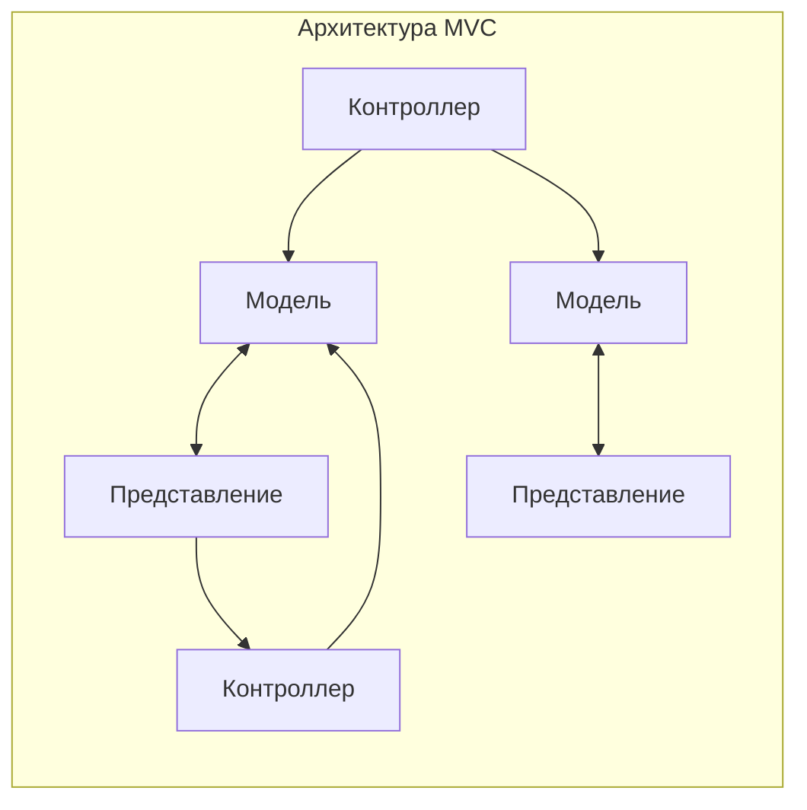
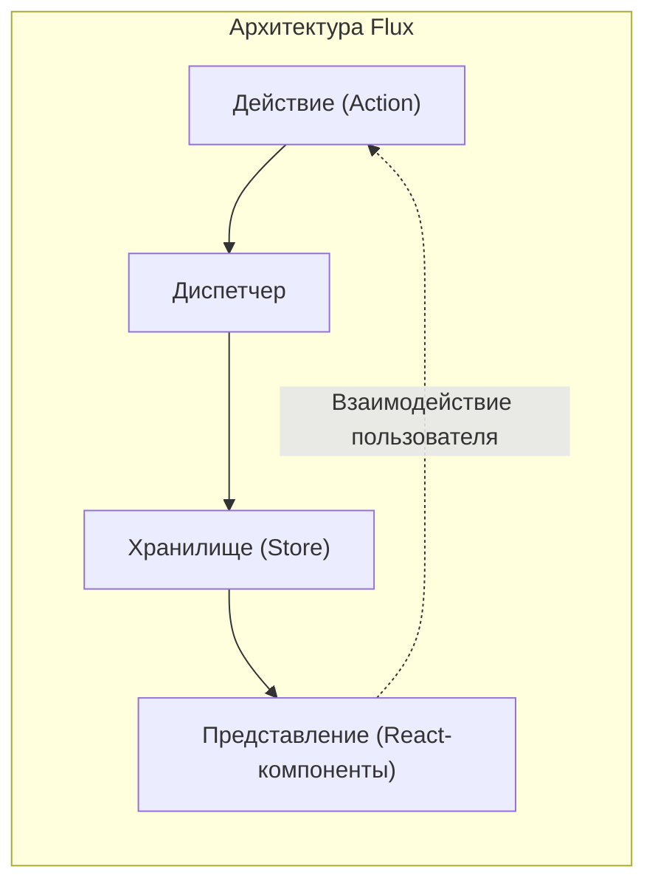
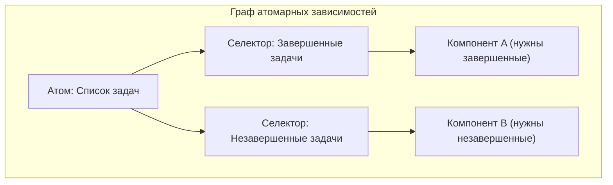

# Введение

В современной веб-фронтенд разработке **управление состоянием** (State Management) является чрезвычайно важной темой, которую невозможно избежать. Особенно в экосистеме вокруг React, до сих пор родилось и эволюционировало множество библиотек управления состоянием и архитектур.

В этой статье мы оглянемся на исторические изменения управления состоянием во фронтенд разработке и глубоко погрузимся в то, для решения каких проблем была создана каждая архитектура, а также какие новые проблемы они породили. Начиная с ограничений традиционной модели MVC, мы подробно объясним траекторию этой эволюции: рождение архитектуры Flux, сдвиг парадигмы, вызванный Redux, достоинства и недостатки React Context API, Atomic State, представленный Recoil и Jotai, подходы на основе Proxy, такие как MobX и Valtio, и легкие библиотеки, такие как Zustand, которые сегодня широко поддерживаются разработчиками.

---

## 1. Рассвет управления состоянием: MVC и его ограничения

До появления современных UI библиотек, таких как React и Vue, в мире веб-фронтенда преобладало прямое манипулирование DOM с использованием jQuery. Однако по мере усложнения приложений, ручная синхронизация состояния (данных) и UI (DOM) стала рассадником ошибок.

Чтобы решить эту проблему, во фронтенд были привнесены архитектурные паттерны, которые имели успех в бэкенде, такие как **MVC** (Model-View-Controller) и **MVVM** (Model-View-ViewModel) (типичные примеры: Backbone.js и AngularJS и т.д.).

### Проблемы, с которыми столкнулся MVC

Паттерн MVC разделяет роли на Model, которая управляет данными, View, которая отрисовывает UI, и Controller, который обрабатывает пользовательский ввод и обновляет Model и View. Он хорошо работал для малых и средних приложений, но в огромных приложениях, таких как Facebook (ныне Meta), возникли серьезные проблемы.

Это **непредсказуемость состояния из-за двусторонней привязки данных**. Когда изменение Model обновляет View, а операция во View обновляет другую Model, которая затем обновляет еще один View... возникает цепочка обновлений (каскадные обновления), поток данных сложно переплетается, и отслеживание ошибок становится крайне трудным.



Таким образом, из-за того, что данные направлялись во многих направлениях, стало невозможно понять: "какие данные только что изменились и почему".

---

## 2. Рождение архитектуры Flux и однонаправленный поток данных

Ответом Facebook на проблему сложности MVC стала архитектура **Flux**. Самое большое изобретение Flux — это строгое соблюдение **однонаправленного потока данных** (Unidirectional Data Flow).

Во Flux данные приложения всегда текут в одном направлении.



- **Action**: Объект, представляющий действия пользователя или системные события.
- **Dispatcher**: Центральный узел, который получает Action и распределяет Action всем зарегистрированным Store.
- **Store**: Хранит состояние приложения и логику. Получает Action от Dispatcher, обновляет себя и уведомляет View об изменениях.
- **View**: Получает состояние от Store и отрисовывает UI. Обнаруживает действия пользователя и отправляет новые Action.

Сужая поток данных до одного направления, процесс изменения состояния стал проще отслеживать, а предсказуемость приложения резко возросла. Это был важный сдвиг парадигмы, который стал основой для последующего управления состоянием.

---

## 3. Redux: Эпоха единого источника истины (Single Source of Truth)

Хотя концепция Flux была превосходна, оставались сложности в реализации, такие как управление зависимостями из-за существования нескольких Store. Это было усовершенствовано и доведено до конечной формы в **Redux**, разработанном Дэном Абрамовым и другими.

### 3 принципа Redux

Redux основан на следующих трех базовых принципах:

1. **Single source of truth** (Единый источник истины): Все состояние приложения хранится в одном дереве объектов (Store).
2. **State is read-only** (Состояние только для чтения): Единственный способ изменить состояние — отправить (dispatch) Action, описывающий, что произошло.
3. **Changes are made with pure functions** (Изменения производятся чистыми функциями): Чтобы указать, как дерево состояний трансформируется действиями Action, вы пишете Reducer, который является чистой функцией.

Redux сделал возможной отладку с путешествием во времени (перемотка и воспроизведение состояния) и значительно улучшил опыт разработки (DX).

### Пример реализации приложения ToDo с использованием Redux Toolkit

В прошлом Redux критиковали за наличие большого количества "шаблонного кода" (boilerplate), но сейчас стандартом стал **Redux Toolkit** (RTK), который позволяет писать код очень лаконично.

```typescript
// Redux Toolkit (Пример для сравнения с Zustand и Context)
import { configureStore, createSlice, PayloadAction } from '@reduxjs/toolkit';
import { useSelector, useDispatch } from 'react-redux';

// 1. Определение типа State
interface Todo {
  id: string;
  text: string;
  completed: boolean;
}

// 2. Определение Slice (Reducer и Action)
const todoSlice = createSlice({
  name: 'todos',
  initialState: [] as Todo[],
  reducers: {
    addTodo: (state, action: PayloadAction<string>) => {
      // Immer работает внутри RTK, что позволяет использовать мутирующий стиль написания
      state.push({ id: Date.now().toString(), text: action.payload, completed: false });
    },
    toggleTodo: (state, action: PayloadAction<string>) => {
      const todo = state.find(t => t.id === action.payload);
      if (todo) {
        todo.completed = !todo.completed;
      }
    }
  }
});

export const { addTodo, toggleTodo } = todoSlice.actions;
export const store = configureStore({ reducer: { todos: todoSlice.reducer } });

// 3. Использование в компонентах
function TodoApp() {
  const todos = useSelector((state: { todos: Todo[] }) => state.todos);
  const dispatch = useDispatch();

  return (
    <div>
      <button onClick={() => dispatch(addTodo('Новая задача'))}>Добавить</button>
      <ul>
        {todos.map(todo => (
          <li key={todo.id} onClick={() => dispatch(toggleTodo(todo.id))}>
            {todo.completed ? '<s>' : ''}{todo.text}{todo.completed ? '</s>' : ''}
          </li>
        ))}
      </ul>
    </div>
  );
}
```

Redux по-прежнему является мощным выбором для огромных проектов, но он может быть избыточным для небольших приложений. Кроме того, поскольку это глобальное единое дерево, сложно настроить селекторы (`useSelector`) для предотвращения ненужных рендерингов.

---

## 4. React Context API: Встроенный механизм совместного использования и его ловушки

**Context API**, обновленный в React 16.3, появился как стандартная функция React для решения проблемы Props Drilling (передача свойств, как эстафетной палочки, глубоко по иерархии компонентов). Появление хуков (`useContext` и `useReducer`) вызвало дискуссии о том, что "возможно, Redux больше не нужен".

### Пример реализации приложения ToDo с использованием Context + Reducer

```typescript
import React, { createContext, useContext, useReducer, ReactNode } from 'react';

// 1. Определение типов
interface Todo { id: string; text: string; completed: boolean; }
type Action = { type: 'ADD'; payload: string } | { type: 'TOGGLE'; payload: string };

// 2. Определение Reducer
function todoReducer(state: Todo[], action: Action): Todo[] {
  switch (action.type) {
    case 'ADD':
      return [...state, { id: Date.now().toString(), text: action.payload, completed: false }];
    case 'TOGGLE':
      return state.map(t => t.id === action.payload ? { ...t, completed: !t.completed } : t);
    default:
      return state;
  }
}

// 3. Создание Context
const TodoContext = createContext<{ state: Todo[]; dispatch: React.Dispatch<Action> } | undefined>(undefined);

// 4. Предоставление Provider
export function TodoProvider({ children }: { children: ReactNode }) {
  const [state, dispatch] = useReducer(todoReducer, []);
  return (
    <TodoContext.Provider value={{ state, dispatch }}>
      {children}
    </TodoContext.Provider>
  );
}

// 5. Использование в компонентах
function TodoApp() {
  const context = useContext(TodoContext);
  if (!context) throw new Error('Должен использоваться внутри Provider');
  const { state: todos, dispatch } = context;

  return (
    <div>
      <button onClick={() => dispatch({ type: 'ADD', payload: 'Задача' })}>Добавить</button>
      {/* Процесс отрисовки */}
    </div>
  );
}
```

### Проблемы Context API (ненужные повторные рендеринги)

Context действительно устранил Props Drilling, но это **не библиотека управления состоянием**. Context — это просто механизм "внедрения зависимостей (DI)".

Самая большая проблема с Context заключается в том, что **"когда значение Context обновляется, все компоненты, которые подписаны на этот Context (используют `useContext`), принудительно рендерятся заново"**. Если вы управляете огромным объектом в одном Context, компоненты, которым нужна только часть свойств, будут без необходимости рендериться, что приведет к снижению производительности. Если вы разделите Context на мелкие части, чтобы предотвратить это, вы попадете в ад провайдеров (Provider Hell).

---

## 5. Atomic State Management: Решения с помощью Recoil и Jotai

Для одновременного решения проблемы повторного рендеринга Context и проблемы шаблонного кода Redux было предложено управление состоянием, использующее **Atomic архитектуру**. Типичными примерами являются **Recoil**, который был экспериментально анонсирован Facebook (ныне Meta), и более легкий и изящный **Jotai**.

### Что такое Atomic архитектура?

Состояние приложения обрабатывается не как единое огромное дерево, а как независимые мелкие частицы состояния (**Atom**). Поскольку каждый компонент подписывается только на нужные ему Atom, при обновлении состояния точечно перерисовываются только те компоненты, которые зависят от него.



### Пример реализации приложения ToDo с использованием Recoil (или Jotai)

Здесь мы покажем очень интуитивный способ написания с использованием Recoil или Jotai.

```typescript
// Пример с Recoil
import { atom, useRecoilState, RecoilRoot } from 'recoil';

// 1. Определение Atom (минимальная единица состояния)
const todosState = atom<Todo[]>({
  key: 'todosState',
  default: [],
});

// 2. Использование в компонентах (почти такой же интерфейс, как у useState в React)
function TodoApp() {
  const [todos, setTodos] = useRecoilState(todosState);

  const addTodo = () => {
    setTodos([...todos, { id: Date.now().toString(), text: 'Задача', completed: false }]);
  };

  const toggleTodo = (id: string) => {
    setTodos(todos.map(t => t.id === id ? { ...t, completed: !t.completed } : t));
  };

  return (
    <div>
      <button onClick={addTodo}>Добавить</button>
      {/* Процесс отрисовки */}
    </div>
  );
}

// Обязательно: Оберните корень приложения в RecoilRoot
function App() {
  return <RecoilRoot><TodoApp /></RecoilRoot>;
}
```

Шаблонный код практически исчез, и стало возможным работать с глобальным состоянием с таким же чувством, как со стандартным `useState` в React. Также очень мощной является работа с асинхронными данными и вычисление производного состояния (Derived State).

---

## 6. Proxy-based State Management: MobX и Valtio

Еще одним мощным подходом является **изменяемое (мутирующее) управление состоянием**, которое использует объект JavaScript `Proxy`. Как правило, React требует "неизменяемого обновления состояния", но используя Proxy, становится возможным "просто перезаписывать объекты напрямую, обнаруживать изменения и автоматически обновлять компоненты".

Старым фаворитом является **MobX**, но в последние годы внимание привлекает **Valtio** (от того же автора, что и Zustand), который улучшил интеграцию с React Hooks. Поскольку подход на основе Proxy позволяет интуитивно писать код на JavaScript, он демонстрирует свою мощь при управлении данными со сложной вложенностью.

---

## 7. Современный мейнстрим: Легкий и быстрый Zustand

Среди множества различных архитектур **Zustand** (что означает "состояние" по-немецки) теперь становится "первым выбором" для многих разработчиков.

Zustand принимает подход "единого Store" на основе Flux, как и Redux, но полностью устраняет сложные концепции Redux (Reducer, Action types, Dispatch, обертывание Provider-ом). Он очень легкий, требует мало кода и предоставляет простой API на основе хуков.

### Пример реализации приложения ToDo с использованием Zustand

```typescript
import { create } from 'zustand';

// 1. Определение типов State и Action
interface TodoState {
  todos: Todo[];
  addTodo: (text: string) => void;
  toggleTodo: (id: string) => void;
}

// 2. Создание Store
const useTodoStore = create<TodoState>((set) => ({
  todos: [],
  addTodo: (text) => 
    set((state) => ({ 
      todos: [...state.todos, { id: Date.now().toString(), text, completed: false }] 
    })),
  toggleTodo: (id) => 
    set((state) => ({
      todos: state.todos.map(t => t.id === id ? { ...t, completed: !t.completed } : t)
    })),
}));

// 3. Использование в компонентах
function TodoApp() {
  // Выберите и получите только необходимые состояния и действия (для предотвращения ненужного рендеринга)
  const todos = useTodoStore(state => state.todos);
  const addTodo = useTodoStore(state => state.addTodo);
  const toggleTodo = useTodoStore(state => state.toggleTodo);

  return (
    <div>
      <button onClick={() => addTodo('Задача Zustand')}>Добавить</button>
      <ul>
        {todos.map(todo => (
          <li key={todo.id} onClick={() => toggleTodo(todo.id)}>
            {todo.text}
          </li>
        ))}
      </ul>
    </div>
  );
}
```

### Почему Zustand так популярен

- **Не требует Provider**: Нет необходимости оборачивать приложение в `<Provider>`, вы можете читать и записывать состояние вне дерева React (в обычных функциях или асинхронных операциях).
- **Лаконичность**: Крайне мало шаблонного кода, Store можно компактно определить в одном файле.
- **Производительность**: Используя функции-селекторы (`state => state.todos`), он перерисовывает компоненты только при изменении значений, на которые они подписаны, подобно Redux. Блестяще преодолевает проблему Context API.

---

## Заключение: Будущее управления состоянием

Управление состоянием во фронтенде началось с краха MVC, перешло к обретению надежности с Flux/Redux, к поиску стандартизации API с Context, а теперь эволюционировало в разнообразный и сложный набор инструментов, таких как Atomic (Jotai/Recoil), легкие Store (Zustand) и Proxy (Valtio).

Ориентировочные критерии для выбора в текущих проектах таковы:

- **Крупные и сложные корпоративные области или необходимость строгого отслеживания переходов состояний**: Redux Toolkit
- **Гибкий и интуитивно понятный обмен состоянием, не зависящий от формы дерева компонентов**: Jotai или Recoil
- **Простой в освоении, высокопроизводительный глобальный Store**: Zustand
- **Желание интуитивно работать с изменяемыми (мутирующими) сложными объектами с глубокой вложенностью**: Valtio

Эволюция фронтенд-архитектуры никогда не останавливается, но, понимая, **"какие проблемы были решены с помощью каждой библиотеки"**, вы сможете выбрать оптимальную технологию для своего собственного проекта.
