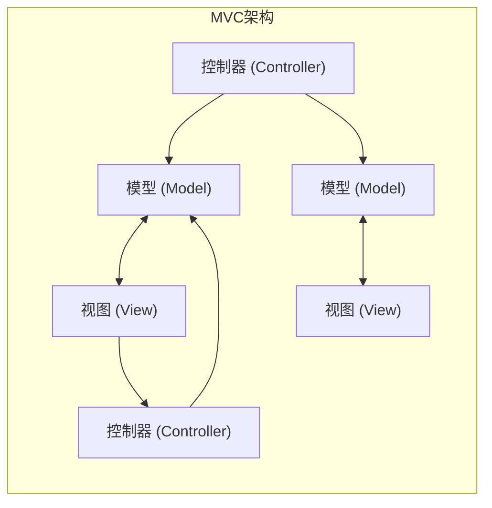
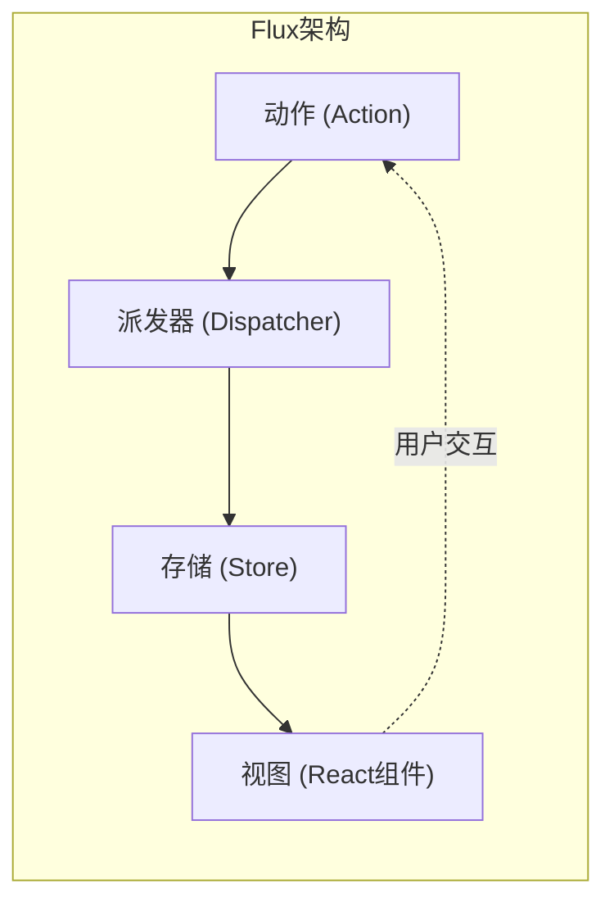
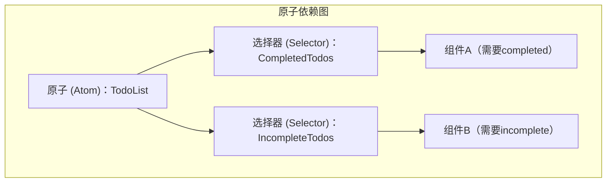

# 引言

在现代Web前端开发中， **状态管理** （State Management）是一个避不开的非常重要的主题。特别是在以React为中心的生态系统中，至今已经诞生了许多状态管理库和架构，并不断发展进化。

本文将回顾前端开发中状态管理的历史变迁，深入探讨各种架构是为了解决什么问题而诞生的，以及它们又带来了哪些新的挑战。从传统的MVC模型所面临的局限性开始，历经Flux架构的诞生、Redux带来的范式转变、React Context API的功过、以Recoil和Jotai为代表的Atomic State、MobX和Valtio等基于Proxy（Proxy-based）的方法，直到当今受到开发者广泛支持的Zustand等轻量级库，我们将详细解读其进化的轨迹。

---

## 1. 状态管理的黎明：MVC及其局限性

在React和Vue等现代UI库出现之前，Web前端世界的主流是使用jQuery直接操作DOM。然而，随着应用程序变得越来越复杂，手动同步状态（数据）和UI（DOM）成为了bug的温床。

为了解决这个问题，在后端取得成功的 **MVC** （Model-View-Controller）和 **MVVM** （Model-View-ViewModel）等架构模式被引入到前端（代表例子：Backbone.js、AngularJS等）。

### MVC面临的问题

MVC模式将职责划分为：管理数据的Model、渲染UI的View，以及处理用户输入并更新Model或View的Controller。这在小到中规模的应用程序中运行良好，但在像Facebook（现Meta）这样庞大的应用程序中却引发了严重的问题。

那就是 **双向数据绑定导致的状态不可预测性** 。Model的变更更新了View，View上的操作更新了另一个Model，这又进一步更新了其他的View……当发生这种连锁更新（级联更新）时，数据流变得盘根错节，追踪bug变得极其困难。



像这样，由于数据的流向是多向的，导致无法掌握“现在哪个数据因为什么而改变”。

---

## 2. Flux架构的诞生与单向数据流

针对MVC复杂化问题的Facebook解决方案就是 **Flux** 架构。Flux最大的发明就是彻底贯彻了 **单向数据流** （Unidirectional Data Flow）。

在Flux中，应用程序的数据始终沿单向流动。



- **Action** ：表示用户操作或系统事件的对象。
- **Dispatcher** ：接收Action并将其分发给所有已注册的Store的中央枢纽。
- **Store** ：保存应用程序的状态和逻辑。从Dispatcher接收Action以更新自身，并通知View进行变更。
- **View** ：从Store接收状态并渲染UI。监听用户的操作并发出新的Action。

通过将数据流限制为单一方向，状态的更改过程变得更容易追踪，应用程序的可预测性得到了极大的提高。这就是后来成为状态管理基础的重要范式转变。

---

## 3. Redux：Single Source of Truth（单一数据源）的时代

尽管Flux的概念非常出色，但在实现上仍残留着复杂性，例如存在多个Store所带来的依赖关系管理问题。将其精炼并升华为终极形态的，是由Dan Abramov等人开发的 **Redux** 。

### Redux的三大原则

Redux基于以下三个基本原则：

1. **Single source of truth** （单一数据源）：整个应用程序的状态存储在一个对象树（Store）中。
2. **State is read-only** （状态是只读的）：改变状态的唯一方法是触发（dispatch）一个描述发生了什么的Action。
3. **Changes are made with pure functions** （使用纯函数进行更改）：为了指定状态树如何响应Action而转换，需要编写纯函数Reducer。

通过Redux，时间旅行调试（状态的回溯和重放）成为可能，开发体验（DX）得到了飞跃性的提升。

### 使用Redux Toolkit的ToDo应用示例

Redux曾经被批评为“样板代码（boilerplate）太多”，但现在 **Redux Toolkit** （RTK）已成为标准，使得编写变得非常简洁。

```typescript
// Redux Toolkit（用于与Zustand或Context比较的示例）
import { configureStore, createSlice, PayloadAction } from '@reduxjs/toolkit';
import { useSelector, useDispatch } from 'react-redux';

// 1. State类型的定义
interface Todo {
  id: string;
  text: string;
  completed: boolean;
}

// 2. Slice（Reducer和Action）的定义
const todoSlice = createSlice({
  name: 'todos',
  initialState: [] as Todo[],
  reducers: {
    addTodo: (state, action: PayloadAction<string>) => {
      // 在RTK内部Immer会发挥作用，因此可以使用可变的写法
      state.push({ id: Date.now().toString(), text: action.payload, completed: false });
    },
    toggleTodo: (state, action: PayloadAction<string>) => {
      const todo = state.find(t => t.id === action.payload);
      if (todo) {
        todo.completed = !todo.completed;
      }
    }
  }
});

export const { addTodo, toggleTodo } = todoSlice.actions;
export const store = configureStore({ reducer: { todos: todoSlice.reducer } });

// 3. 在组件中使用
function TodoApp() {
  const todos = useSelector((state: { todos: Todo[] }) => state.todos);
  const dispatch = useDispatch();

  return (
    <div>
      <button onClick={() => dispatch(addTodo('新任务'))}>添加</button>
      <ul>
        {todos.map(todo => (
          <li key={todo.id} onClick={() => dispatch(toggleTodo(todo.id))}>
            {todo.completed ? '<s>' : ''}{todo.text}{todo.completed ? '</s>' : ''}
          </li>
        ))}
      </ul>
    </div>
  );
}
```

在大型项目中，Redux至今仍是一个强大的选择，但也存在一些问题，例如对于小型应用来说过度设计，以及因为它是全局单一树，难以进行选择器（`useSelector`）的调优以防止不必要的渲染。

---

## 4. React Context API：内置的共享机制及其陷阱

在React 16.3中被重构的 **Context API** 作为React的标准功能出现，旨在解决Props Drilling（像传桶一样将属性传递给深层组件）的问题。随着Hooks的出现（`useContext`和`useReducer`），引发了“是不是不再需要Redux了”的讨论。

### 使用Context + Reducer的ToDo应用示例

```typescript
import React, { createContext, useContext, useReducer, ReactNode } from 'react';

// 1. 类型定义
interface Todo { id: string; text: string; completed: boolean; }
type Action = { type: 'ADD'; payload: string } | { type: 'TOGGLE'; payload: string };

// 2. Reducer的定义
function todoReducer(state: Todo[], action: Action): Todo[] {
  switch (action.type) {
    case 'ADD':
      return [...state, { id: Date.now().toString(), text: action.payload, completed: false }];
    case 'TOGGLE':
      return state.map(t => t.id === action.payload ? { ...t, completed: !t.completed } : t);
    default:
      return state;
  }
}

// 3. 创建Context
const TodoContext = createContext<{ state: Todo[]; dispatch: React.Dispatch<Action> } | undefined>(undefined);

// 4. 提供Provider
export function TodoProvider({ children }: { children: ReactNode }) {
  const [state, dispatch] = useReducer(todoReducer, []);
  return (
    <TodoContext.Provider value={{ state, dispatch }}>
      {children}
    </TodoContext.Provider>
  );
}

// 5. 在组件中使用
function TodoApp() {
  const context = useContext(TodoContext);
  if (!context) throw new Error('Must be used within Provider');
  const { state: todos, dispatch } = context;

  return (
    <div>
      <button onClick={() => dispatch({ type: 'ADD', payload: '任务' })}>添加</button>
      {/* 渲染处理 */}
    </div>
  );
}
```

### Context API的挑战（不必要的重新渲染）

Context确实解决了Props Drilling的问题，但它 **并不是状态管理库** 。Context归根结底只是一种“依赖注入（DI）”机制。

Context最大的问题在于 **“当Context的值更新时，所有订阅了该Context（使用了`useContext`）的组件都会被强制重新渲染”** 。如果用一个Context管理巨大的对象，甚至连只需要部分属性的组件也会被不必要地渲染，导致性能下降。为了防止这种情况而将Context细分，又会陷入Provider地狱（Provider Hell）。

---

## 5. Atomic State Management：通过Recoil和Jotai解决

为了同时解决Context的重新渲染问题和Redux的样板代码问题，采用了 **Atomic架构** 的状态管理被提了出来。Facebook（现Meta）实验性发布的 **Recoil** ，以及更轻量和精炼的 **Jotai** 便是其中的代表。

### 什么是Atomic架构？

它不将应用程序的状态视为单一的巨大树，而是将其作为独立的小状态颗粒（ **Atom** ）来处理。各个组件只订阅（Subscribe）所需的Atom，因此当状态更新时，只有依赖该状态的组件会被精准地重新渲染。



### 使用Recoil（或Jotai）的ToDo应用示例

这里介绍类似于Jotai，或者使用Recoil的非常直观的写法。

```typescript
// Recoil示例
import { atom, useRecoilState, RecoilRoot } from 'recoil';

// 1. 定义Atom（状态的最小单位）
const todosState = atom<Todo[]>({
  key: 'todosState',
  default: [],
});

// 2. 在组件中使用（与React的useState几乎相同的接口）
function TodoApp() {
  const [todos, setTodos] = useRecoilState(todosState);

  const addTodo = () => {
    setTodos([...todos, { id: Date.now().toString(), text: '任务', completed: false }]);
  };

  const toggleTodo = (id: string) => {
    setTodos(todos.map(t => t.id === id ? { ...t, completed: !t.completed } : t));
  };

  return (
    <div>
      <button onClick={addTodo}>添加</button>
      {/* 渲染处理 */}
    </div>
  );
}

// 必须：用RecoilRoot包裹应用的根组件
function App() {
  return <RecoilRoot><TodoApp /></RecoilRoot>;
}
```

样板代码几乎消失了，能够以类似于React标准的 `useState` 的感觉来处理全局状态。此外，处理异步数据和计算派生状态（Derived State）也非常强大。

---

## 6. Proxy-based State Management：MobX和Valtio

另一种强大的方法是利用JavaScript的 `Proxy` 对象进行的 **可变（Mutable）状态管理** 。React原则上要求“不可变（Immutable）的状态更新”，但通过使用Proxy，可以实现“只需直接修改对象，就能检测到更改并自动更新组件”。

早期著名的是 **MobX** ，但近年来与React Hooks亲和力更高的 **Valtio** （与Zustand是同一作者）备受瞩目。基于Proxy的方法可以实现直观的JavaScript编写方式，因此在管理具有复杂嵌套的数据时能够发挥威力。

---

## 7. 现代主流：轻量、高效的Zustand

在各种架构林立之中，目前正在成为许多开发者“首选”的是 **Zustand** （德语中“状态”的意思）。

Zustand与Redux一样，采用了基于Flux的“单一Store”方法，但它彻底摒弃了Redux的复杂概念（Reducer、Action types、Dispatch、通过Provider包裹）。它非常轻量，代码量少，提供基于Hook的简单API。

### 使用Zustand的ToDo应用示例

```typescript
import { create } from 'zustand';

// 1. State和Action的类型定义
interface TodoState {
  todos: Todo[];
  addTodo: (text: string) => void;
  toggleTodo: (id: string) => void;
}

// 2. 创建Store
const useTodoStore = create<TodoState>((set) => ({
  todos: [],
  addTodo: (text) => 
    set((state) => ({ 
      todos: [...state.todos, { id: Date.now().toString(), text, completed: false }] 
    })),
  toggleTodo: (id) => 
    set((state) => ({
      todos: state.todos.map(t => t.id === id ? { ...t, completed: !t.completed } : t)
    })),
}));

// 3. 在组件中使用
function TodoApp() {
  // 仅选择并获取所需的状态和动作（防止不必要的渲染）
  const todos = useTodoStore(state => state.todos);
  const addTodo = useTodoStore(state => state.addTodo);
  const toggleTodo = useTodoStore(state => state.toggleTodo);

  return (
    <div>
      <button onClick={() => addTodo('Zustand任务')}>添加</button>
      <ul>
        {todos.map(todo => (
          <li key={todo.id} onClick={() => toggleTodo(todo.id)}>
            {todo.text}
          </li>
        ))}
      </ul>
    </div>
  );
}
```

### Zustand受到支持的理由

- **不需要Provider** ：无需用 `<Provider>` 包裹应用，在React树外部（普通的函数或异步处理中）也能读写状态。
- **简洁性** ：样板代码极少，可以在1个文件中紧凑地定义Store。
- **性能** ：通过使用选择器函数（`state => state.todos`），与Redux类似，只有当订阅的值改变时组件才会渲染。完美克服了Context API的问题。

---

## 总结：未来的状态管理

前端的状态管理从MVC的崩溃开始，经历了通过Flux/Redux获得稳健性、通过Context探索API标准化，现在已进化为Atomic（Jotai/Recoil）、轻量Store（Zustand）、Proxy（Valtio）等丰富多样且精炼的工具群。

作为当前项目中选型的参考标准，大致如下：

- **庞大复杂的企业级领域，或需要严格追踪状态迁移** ：Redux Toolkit
- **不依赖组件树形状的、灵活直观的状态共享** ：Jotai 或 Recoil
- **简单且学习成本低、性能高的全局Store** ：Zustand
- **想要直观地以可变方式处理嵌套深层的复杂对象** ：Valtio

前端架构的进化永无止境，但通过理解各库 **“是为了解决什么痛点而诞生的”** ，就能为自己的项目做出最合适的技术选型。
